# Chapter 00 — Before you start

Inventories the kit against its own batch BOM, settles the tools and consumables, verifies the flat reference, teaches heat-set inserts, and cleans and greases all seven rails — so that Ch 01 can start the moment the frame extrusions come out of the box and no later chapter stops for a missing tool.

**What you're building in this chapter:** nothing yet — this chapter builds the conditions for everything else. Four things come out of it. **A counted kit**: every box checked against your own batch's bill of materials, so a shortage is a Fabreeko email today rather than a stalled evening in six weeks. **A working bench**: the tools bought, the consumables ordered, and a flat reference surface verified with a straightedge and feeler gauges, because the frame's squareness in Ch 01 can be no better than the surface it is built on. **A heat-set technique**: the brass tip fitted to the soldering iron and an iron temperature found on a scrap coupon, ready for the ~150 brass inserts that give printed parts their metal threads. **Seven prepared linear rails** — the hardened steel bars and ball-bearing carriages that carry the toolhead, the gantry and the gantry's four corners — degreased of their shipping oil, packed with grease, wiped and labelled. Rails can only be greased before they are bolted down, which is why they are done here and not in the chapters that use them. Roughly half of this chapter happens weeks before the cartons arrive — the two headings *Before the kit ships* and *Kit day* below say which steps belong to which day; the step numbers stay in bench order.

**Time:** 2.5–4.0 h hands-on, first build (survey §5.1 P00). Rail prep is roughly half of it.

**Sessions:** 7 × ~30 min — the `Pause:` lines below break the chapter into 7 segments; every minute figure is a first-build estimate.

**Prerequisites:**

- **Print batch B00 — Calibration & jigs** ([print/B00-calibration-and-jigs.md](print/B00-calibration-and-jigs.md)). B00 prints the day the Core One+ runs, months before the Voron kit lands, and its gate is in two parts. **Gate A** (the cube, Step B00.5) is long passed by kit day — it released the pre-kit batches B02 and B07, and B08–B10 after the Gen 2 upgrade. **Gate B** — the 625-2RS bearing in the `z_drive_retainer_a` bore, the `MGN12_rail_guide` on the real rail, and all seven inserts in the `Heatset_Practice` coupon — is Step B00.7 and runs **the morning the kit lands, before the inventory**; it releases B01 (which goes on the Prusa before Step 00.2) and B03–B06. Steps 00.13–00.16 *are* its insert item. This chapter needs the `Heatset_Practice` coupon and both rail-guide sizes off that plate; nothing else from B00.
- The kit itself, unopened — for the *Kit day* steps only. Fabreeko order **F6424626**, pre-order, ETA mid/late September 2026.
- Nothing else. This chapter has no assembly prerequisites — it is the first thing you do.

**Tools**

- Digital caliper, 150 mm
- Machinist square, 150 mm, DIN 875/2 or better
- Flat reference surface (the kitchen stone counter, verified in Step 00.10)
- Steel rule / straightedge ≥ 600 mm
- Feeler gauge set
- Temperature-controlled soldering iron that accepts **900M-T** tips (Hakko FX888D-style sleeve with a thumb ring) — the LDO brass insert tip in the kit will not fit anything else. [src](https://docs.ldomotors.com/guides/heatset_insert_tool_guide)
- LDO brass M3 heat-set tip (supplied in the kit)
- Hex drivers 1.5 / 2 / 2.5 / 3 / 4 mm — kit wrenches or the Fabreeko precision set
- Flush cutters
- 10 ml syringe with a blunt tip (grease delivery), or use the grease tube nozzle
- 2 mm drill bit (supplied), 2.5 mm slot screwdriver (supplied)
- Clean towel, for drying the rails after the IPA soak

**Consumables:** IPA ≥ 90% (enough to cover a 400 mm rail inside its own shipping bag, seven times over); Super Lube 21030 synthetic grease; nitrile gloves; lint-free cloth; masking tape (labels, and the rail end stops); permanent marker.

**Printed parts** — batch **B00**, all Galaxy Black ASA on the Core One+

Parts arrive in the bins named below (see the bin map in print/README.md#bins); check the bin label's list before you start.

| Looks like | STL | Bin | Repo path | Qty | Colour |
|---|---|---|---|---:|---|
| 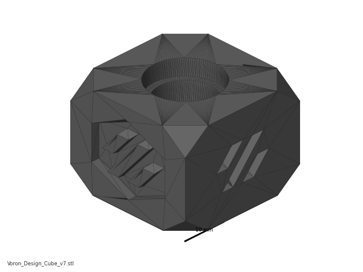{ width=96 } | `Voron_Design_Cube_v7.stl` | 00-jigs | Voron-2 `STLs/Test_Prints/` | 1 | Black |
| 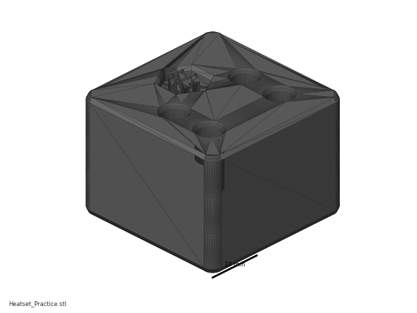{ width=96 } | `Heatset_Practice.stl` | 00-jigs | Voron-2 `STLs/Test_Prints/` | 1 | Black |
| 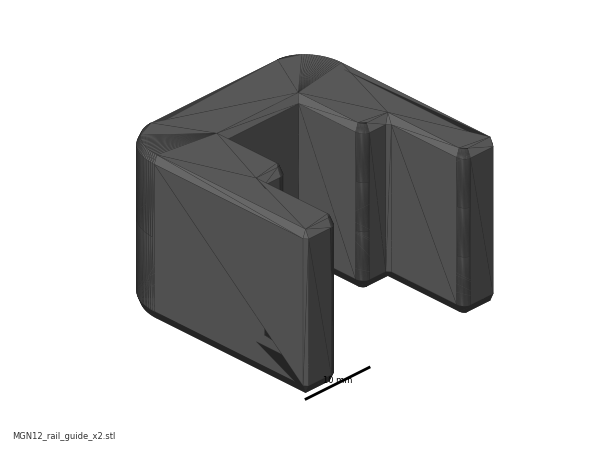{ width=96 } | `MGN12_rail_guide_x2.stl` | 00-jigs | Voron-2 `STLs/Tools/` | 2 | Black |
| 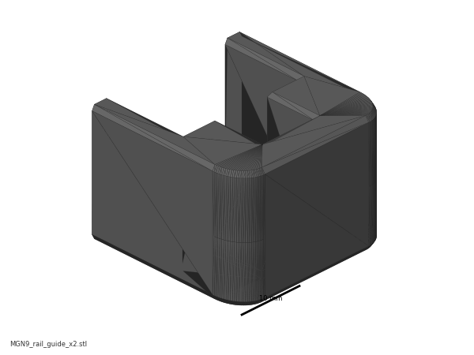{ width=96 } | `MGN9_rail_guide_x2.stl` | 00-jigs | Voron-2 `STLs/Tools/` | 2 | Black |
| { width=96 } | `pulley_jig.stl` | 00-jigs | Voron-2 `STLs/Tools/` | 1 | Black |
| 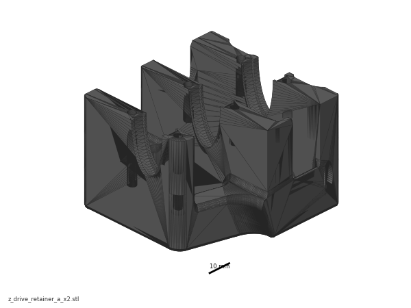{ width=96 } | `z_drive_retainer_a_x2.stl` | 02-Z0 | Voron-2 `STLs/Z_Drive/` | 1 | Black |

`z_drive_retainer_a` is on the jig plate as the bearing press-fit coupon — Gate B's bore test, Step B00.7 — and it is a real part you will fit in Ch 02; nothing is wasted.

**Hardware** (chapter totals)

| Fastener / part | Qty | Note |
|---|---|---|
| Heat-set insert, brass, M3×5×4 — M3 thread, ~4 mm OD × 5 mm long — the STL pockets are 5.0 mm deep with a ~4 mm bore and the LDO tip tongue is 5.0 mm `(verify against the bag)` | 7 | practice coupon only (the coupon STL has 7 pockets) — this is Gate B's insert item, Step B00.7. Kit inserts (146 of the 153 remain for the build), or the ten ordered with the filament (Step 00.9) |
| — no other kit hardware is consumed in this chapter — | 0 | every rail, fastener and PCB goes back in its bag |

**Read first**

- **The rails ship dry and must be cleaned and packed before they go on an extrusion.** The flip-and-pack method needs access to the *back* of the rail. Once a rail is bolted to a 2020 you cannot do this (survey §5.2 W9). [src](https://docs.ldomotors.com/guides/rail_grease_guide)
- **A rail carriage will slide off its rail and spill its bearing balls, and dropping one ruins it.** Tape every carriage in place the moment you unbag a rail — the MGN12 comes out first, at Gate B (Step B00.7), so tape it there — and fit the two end-stop bands before the soak (Step 00.17; manual p.24, p.26).
- **Heat-set inserts go in per print batch, before the part enters any assembly.** One missed insert in an XY joint costs a gantry teardown (survey §5.2 W3).
- **Caliper the deck panel during inventory.** LDO's guides say 4 mm, LDO's own BOM says 3 mm. This decides which `deck_support_*` you print, and it is a Ch 02 step, not a Ch 11 one (survey §4.3).
- **Post the two Discord questions on day one** (Step 00.32). Both have multi-day answer latency and both gate work in Ch 08–Ch 10.

**Sources for this chapter:**

- [LDO batch BOM index](https://docs.ldomotors.com/en/voron/voron2/350_BOM/HOME) — find your batch tile from the kit serial
- [LDO 350 Rev D BOM](https://docs.ldomotors.com/en/voron/voron2/350_BOM/Rev_D) — the inventory checklist and every count in this chapter
- [LDO printed parts guide (Rev D)](https://docs.ldomotors.com/en/voron/voron2/printed_part_guide_rev_d) — which parts LDO supplies printed
- [LDO Nitehawk-SB V2 board doc](https://docs.ldomotors.com/en/Toolboard/nitehawk-sb-v2) — the Rev D+ toolboard identification markers
- [LDO XY endstop cable guide](https://docs.ldomotors.com/en/guides/XY_Endstop_Cable_Reconnecting_Guide) — the mislabelled XY endstop cable batch
- [LDO rail grease guide](https://docs.ldomotors.com/guides/rail_grease_guide) — degrease, flip-and-pack, wipe
- [LDO heat-set insert tool guide](https://docs.ldomotors.com/guides/heatset_insert_tool_guide) — tongue adjustment, temperature technique, the 90 %/10 % trick
- [LDO Klipper config `leviathan-printer-rev-d-sbv2.cfg`](https://raw.githubusercontent.com/MotorDynamicsLab/LDOVoron2/667521d/Firmware/leviathan-printer-rev-d-sbv2.cfg) — the `stm32g0b1xx` serial-ID check written into Ch 12
- [Voron 2.4r2 assembly manual (pinned `de7e89d`)](https://github.com/VoronDesign/Voron-2/blob/de7e89d/Manual/Assembly_Manual_2.4r2.pdf) pages 4–11, 24–26, 31 — print spec, filenames, fastener names, drivers, blind joints, exploded-view conventions, rail handling, inserts
- [Voron-2 `STLs/Tools`](https://github.com/VoronDesign/Voron-2/tree/de7e89d/STLs/Tools) and [Voron-2 `STLs/Test_Prints`](https://github.com/VoronDesign/Voron-2/tree/de7e89d/STLs/Test_Prints) — the B00 jigs and the practice coupon
- [survey](../voron-build-instructions-survey.md) §4.1, §4.3, §5.2, §7.4, §7.5 · [print plan](../voron-print-plan.md) §1.2, §1.4
- Mirrored images in this chapter are LDO Motors' (the heat-set and rail-grease guides on docs.ldomotors.com, and the Nitehawk-SB-V2 repo), used with attribution; see `assets/remote/00-before-you-start/SOURCES.txt`. Every step keeps the original URL on its `Source:` line.

**Video coverage (Steve Builds, pre-release LDO kit — differs from Rev D+):** [Part 1 @0:02:04](https://www.youtube.com/watch?v=feTxcc0LIWM&list=PL0fUJbigELQPqpeGOgHYisG4KaSXVtnNY&t=124s) (+11m), [Part 1 @0:12:11](https://www.youtube.com/watch?v=feTxcc0LIWM&list=PL0fUJbigELQPqpeGOgHYisG4KaSXVtnNY&t=731s) (+8m), [Part 1 @0:50:02](https://www.youtube.com/watch?v=feTxcc0LIWM&list=PL0fUJbigELQPqpeGOgHYisG4KaSXVtnNY&t=3002s) (+6m), [Part 1 @1:54:10](https://www.youtube.com/watch?v=feTxcc0LIWM&list=PL0fUJbigELQPqpeGOgHYisG4KaSXVtnNY&t=6850s) (+39m), [Part 1 @2:05:13](https://www.youtube.com/watch?v=feTxcc0LIWM&list=PL0fUJbigELQPqpeGOgHYisG4KaSXVtnNY&t=7513s) (+19m), [Part 1 @2:32:52](https://www.youtube.com/watch?v=feTxcc0LIWM&list=PL0fUJbigELQPqpeGOgHYisG4KaSXVtnNY&t=9172s) (+32m), [Part 1 @3:11:45](https://www.youtube.com/watch?v=feTxcc0LIWM&list=PL0fUJbigELQPqpeGOgHYisG4KaSXVtnNY&t=11505s) (+10m)

This manual also links timestamps from **Steve Builds'** eleven-part *LDO Voron 2.4 Kit Build* playlist — livestreams in which he assembles the **pre-release "feedback" kit** LDO shipped him in December 2021–January 2022 to review before the kit went on sale, the closest thing to a full video walkthrough of this machine. It is not this kit: Steve's build is Afterburner + Clockwork 1 on a BTT Octopus with a separate Raspberry Pi and a Euclid probe, where this build is Stealthburner + Clockwork 2 + Revo HF on a Nitehawk-SB V2 toolboard, a Leviathan carrying the Pi, an Omron inductive probe plus the LDO nozzle probe, and a Clicky-Clack door instead of the stock doors. Every step link that lands on a step where this matters carries a `(differs: …)` note; low-confidence links (the video's segment start rather than the exact moment) are collected instead in each chapter's `Video coverage` line, above. Links and timestamps only — no stills, clips, thumbnails, or transcript excerpts (`assets/video/SOURCES.txt`).

---

## Before the kit ships

Do these the week batch B00 prints and passes Gate A, weeks before the cartons arrive — none of them needs a kit part: **Steps 00.8–00.11** (tools, consumables, flat reference, bins), **00.23–00.29** (reading the manual's front matter), **00.30** (start the log — Step 00.10's gap and Step 00.32's post dates are its first lines) and **00.31–00.32** (the three lifelines and the two gating questions, which gate batches B06/B07). **00.13–00.16** (heat-set practice) are pre-kit *only* if you ordered the LDO tip kit and ten inserts with the filament (Step 00.9); otherwise they wait for the kit's brass tip and inserts, below. The steps below stay in bench order, so on the first pass skip past the kit-day steps and come back to them.

## Kit day

The day the cartons land, in this order: **Step 00.1** (open the cartons), then **Gate B** ([Step B00.7](print/B00-calibration-and-jigs.md#step-b007-gate-b-on-kit-day-bore-rail-inserts), ~15 min — the brass tip, seven inserts, one 625-2RS and the MGN12 rail come out of carton 1 ahead of the count; **00.13–00.16** are its insert item, done here on the same coupon, and the guide-on-rail and bearing-in-bore tests are the other two), then **B01-P1 onto the Prusa**, then **00.2–00.7** (batch BOM, inventory, deck caliper, board check, LDO-supplied parts, kit tools), **00.12** (fastener bags stay closed) and **00.17–00.22** (rail prep — the grease and IPA from Step 00.9 must already be on the bench). The log from Step 00.30 gets the deck thickness and the inventory result today. Rail prep is the one kit-day job with a wait state — the IPA dry — so start it as soon as the inventory is done.

## Unboxing and inventory

### Step 00.1 — Open the cartons without cutting into them

(no image — see text)

**What you're looking at:** Two shipping cartons and a blade. Carton 1 is the mechanical and electrical kit: extrusions, motors, rails, fasteners, boards. Carton 2 is the flat, fragile half: eight acrylic and polycarbonate panels and the 355 × 355 × 10 mm cast aluminium build plate.

**Parts:** the shipping cartons, 2.

**Do:**

1. Check all six faces of each carton; log dents and punctures.
2. Score tape only, blade shallow: carton 2's panels and plate sit under the flaps.
3. Lift the plate out flat, never on edge; leave the rest boxed.

**Check:** No crushed corners, no rattle from carton 2, no oil through carton 1; every panel filmed both faces until Ch 11.

Source: [LDO 350 Rev D BOM](https://docs.ldomotors.com/en/voron/voron2/350_BOM/Rev_D) · [survey](../voron-build-instructions-survey.md)

---

### Step 00.2 — Find the kit serial and open your batch BOM page

(no image — see text)

**What you're looking at:** The printed label on carton 1. Its serial ties your kit to the right **batch BOM**, LDO's per-batch bill of materials and the inventory checklist for the next two steps. Quantities and substitutions change between batches, so the generic page is no stand-in.

**Parts:** the label on carton 1.

**Do:**

1. The serial reads `V2-YYMMDD####`: batch, pack date, four-digit kit number.
2. Open [350_BOM/HOME](https://docs.ldomotors.com/en/voron/voron2/350_BOM/HOME) and open the batch tile whose `Kit#:` range contains your serial.
3. Print it or open it on the iPad: this is your inventory checklist.

**Check:** The page you land on is headed `V2.4 350 BOM (Rev. D)`; every Rev D batch tile from 2406 onward resolves to that one page, as expected.

⚠ **Rev D+ / LDO:** the index tops out at batch **2606**. A September/October 2026 kit will be a batch LDO has not listed yet. If your serial is not in any tile, use the Rev_D page above and ask Fabreeko for your batch sheet — do not assume quantities from an older batch. [src](https://docs.ldomotors.com/en/voron/voron2/350_BOM/HOME)

Source: [LDO batch BOM index](https://docs.ldomotors.com/en/voron/voron2/350_BOM/HOME) · [LDO 350 Rev D BOM](https://docs.ldomotors.com/en/voron/voron2/350_BOM/Rev_D)

---

### Step 00.3 — Inventory carton 1, box by box

(no image — see text)

**What you're looking at:** Nine labelled boxes plus loose items: the mechanical and electrical half of the printer. The bags hold **SHCS** and **BHCS** screws, **roll-in T-nuts** and 153 brass **heat-set inserts**. The motors and extrusions in here are the frame and the four Z drives.

**Parts:** carton 1 — boxes *Cable Kit 2.4-350*, *Motion*, *Electronics 1*, *Electronics 2*, *Fasteners, Tools & Misc*, *Belts, Chains & Fans*, *Linear Rail Kit*, *Frame Kit 2.4-350*, *Motor Kit*, plus loose *Other* items (C13 cord, PVC wire duct ×5, Revo HF hotend, DIN rails ×2, Leviathan mainboard, Meanwell LRS-200-24 PSU, extrusion slot cover ×9).

**Do:**

1. Work one box at a time against the BOM and tick `Check1`.
2. Count each fastener bag closed, each board through its antistatic bag, each rail bag unopened.
3. The counts below are the large, easy-to-be-short-on ones.

| Bag or kit | Count |
|---|---|
| M3×8 SHCS | 283 |
| M3 roll-in T-nut | 135 |
| M5 roll-in T-nut | 80 |
| M3 hammerhead | 75 |
| M5 precision spacer | 46 |
| Heat-set insert M3×5×4 | 153 |
| Zip tie | 100 |
| Frame kit, 18 extrusions | 340E ×1, 430D ×1, 450C ×2, 470A ×10, 530B ×4 |
| Motor kit, 7 motors | 1× 36STH20 E, 2× 42STH48-2004MAH A/B 0.9°, 4× 42STH48-2004AC Z 1.8° |

**Check:** Every BOM line ticked, or written down as short, and the frame and motor kits match the table above.

⚠ **Rev D+ / LDO:** in the *Cable Kit* box, read the labels on the XY endstop cable now. LDO documents a batch where they read **"X Stop / Y Stop"** instead of **"XES / YES"** and need re-pinning before they will work. Finding this in Ch 10 with the bay half-closed is much worse than finding it now. [src](https://docs.ldomotors.com/en/guides/XY_Endstop_Cable_Reconnecting_Guide)

Source: [LDO 350 Rev D BOM](https://docs.ldomotors.com/en/voron/voron2/350_BOM/Rev_D) · [LDO XY endstop cable guide](https://docs.ldomotors.com/en/guides/XY_Endstop_Cable_Reconnecting_Guide) · [Video: Part 1 @0:03:01](https://www.youtube.com/watch?v=feTxcc0LIWM&list=PL0fUJbigELQPqpeGOgHYisG4KaSXVtnNY&t=181s) (differs: pre-release Dec-2021 LDO kit — printed parts, packaging and some hardware were revised before Rev D)

---

### Step 00.4 — Inventory carton 2 and caliper the deck panel

(no image — see text)

**What you're looking at:** The eight flat panels and the plate. The **deck panel** is the acrylic floor of the chamber: it sits on the bed extrusions and separates the electronics bay below from the print chamber above. Its thickness decides which support clip you fit in Ch 02.

**Parts:** deck panel (acrylic, black, 469×469), back panel (acrylic, black, 483×503), bottom panel (acrylic, black, 469×469), door panels (PC clear, 241×503) ×2, side panels (PC clear, 483×503) ×2, top panel (PC clear, 483×483), magnetic pad, spring steel flex plate, build plate.

**Do:**

1. Count the panels against the BOM.
2. Peel back one corner of the **deck** film and caliper it at three points along one edge.
3. Write the number on tape stuck to the film, re-cover it, leave others filmed.

**Check:** Eight panels present, no cracks, no chips at the corners. You now have one number written down: the deck thickness.

⚠ **Rev D+ / LDO:** LDO's Build Notes p.29–30 and Printed Parts Guide say **4 mm**; LDO's own Rev D BOM says **3 mm**. B01-P2 carries `deck_support_3mm_x8` and has not started; if the caliper reads **4 mm**, follow the [B01 deck note](print/B01-z-drive-assemblies.md) first. Those clips, `deck_support_4mm_x8`, are an 8 g, 30-minute print and must exist before Ch 02. [src](https://docs.ldomotors.com/voron/voron2/build-faq)

Source: [LDO 350 Rev D BOM](https://docs.ldomotors.com/en/voron/voron2/350_BOM/Rev_D) · [LDO Build Notes (Rev D)](https://docs.ldomotors.com/voron/voron2/build-faq) · [LDO printed parts guide (Rev D)](https://docs.ldomotors.com/en/voron/voron2/printed_part_guide_rev_d)

---

### Step 00.5 — Verify you actually received a Rev D+ (Nitehawk-SB V2)

**What you're looking at:** The Nitehawk-SB V2 **toolboard**: the small PCB on the toolhead that drives the hotend, fans, LEDs, probe and accelerometer over one cable. The `+` in Rev D+ *is* this board. The silkscreen in the drawing reads `LDO NiteHawk-SB V2.0.0`; read yours.

**Parts:** *Electronics 2* box — Nitehawk SB toolhead PCB ×1, Stealthburner fan adapter ×1, USB adapter PCB ×1.

**Do:**

1. Handle the board by its edges on an antistatic bag.
2. Check all four markers below against the V2 board doc.

| # | Marker |
|---|---|
| 1 | **PROBE**, **TH0**, **CT** and **Endstop** are JST-**PH 2.0 mm** pitch, visibly finer than the JST-XH 2.5 mm **E Motor** connector on the **back** of the board |
| 2 | a **secondary USB port** is present: JST-ZH 1.5 mm, 5-pin, labelled as the USB expansion port |
| 3 | the board-to-board header that mates with the fan adapter is **keyed** |
| 4 | the MCU is marked STM32G0B1, not RP2040 |

**Check:** All four markers present means Rev D+; any one absent means a V1 board, so stop and ask Fabreeko before going further. [src](https://docs.ldomotors.com/en/Toolboard/nitehawk-sb-v2)

⚠ **Rev D+ / LDO:** the USB serial ID settles it, and Ch 12 reads it once the Pi is up: it must contain **`stm32g0b1xx`**. LDO's Rev D wiring guide expects `usb-Klipper_rp2040_…`, which is wrong for this kit. On `rp2040`, load `leviathan-printer-rev-d.cfg` instead of `leviathan-printer-rev-d-sbv2.cfg`; the wrong one mis-drives heater, thermistor, probe, fans and accelerometer. [src](https://github.com/MotorDynamicsLab/LDOVoron2/blob/main/Firmware/leviathan-printer-rev-d-sbv2.cfg) · survey §4.1 ①②

Source: [LDO Nitehawk-SB V2 board doc](https://docs.ldomotors.com/en/Toolboard/nitehawk-sb-v2) · [image: Nitehawk-SB-V2 `Images/nhsbv2_pcb_pinout.jpg`](https://raw.githubusercontent.com/MotorDynamicsLab/Nitehawk-SB-V2/42ae497/Images/nhsbv2_pcb_pinout.jpg) · [LDO Klipper config `leviathan-printer-rev-d-sbv2.cfg`](https://raw.githubusercontent.com/MotorDynamicsLab/LDOVoron2/667521d/Firmware/leviathan-printer-rev-d-sbv2.cfg)

---

### Step 00.6 — Set aside the ten LDO-supplied printed parts

(no image — see text)

**What you're looking at:** Ten printed parts LDO makes for you, in one bag: the pieces the Voron STL set does not cover or you cannot reproduce. They include the two Leviathan brackets, DIN clips, the nozzle-probe body, the bed WAGO mount and the clear Stealthburner LED diffuser.

**Parts:** the *LDO Printed Parts* bag — Leviathan Bracket Left ×1, Leviathan Bracket Right ×1, NH Adapter Mount ×1, DIN Clip ×4, CW2 Chain Anchor Tilted ×1, 2×3 Splitter Spacer ×2, LDO Nozzle Probe ×1, Bed WAGO Mount ×1, Stealthburner LED Diffuser ×1 (clear PETG), CW2 PCB Spacer ×1.

**Do:**

1. Count them and put them in their own labelled bin.
2. Do **not** print these; the print plan already excludes them, and you have no clear filament for the PETG LED diffuser.

**Check:** Ten part types accounted for, in one bin, labelled `LDO SUPPLIED — DO NOT PRINT`.

⚠ **Rev D+ / LDO:** the USB-adapter mount base is supplied printed, but the **cover** changed for the V2 board. The Rev D Printed Parts Guide points at the V1 `usb_adapter_mount.stl` cover; Rev D+ needs [`usb_adapter_mount_partial_cover.stl`](https://github.com/MotorDynamicsLab/Nitehawk-SB-V2/blob/master/STLs/usb_adapter_mount_partial_cover.stl) from the **V2** repo. Batch **B07** currently lists the V1 file. Fix the B07 plate before you print it. [src](https://docs.ldomotors.com/en/Toolboard/nitehawk-sb-v2) · survey §4.1 ⑤

Source: [LDO printed parts guide (Rev D)](https://docs.ldomotors.com/en/voron/voron2/printed_part_guide_rev_d) · [LDO Nitehawk-SB V2 board doc](https://docs.ldomotors.com/en/Toolboard/nitehawk-sb-v2) · [Nitehawk-SB-V2 `STLs/`](https://github.com/MotorDynamicsLab/Nitehawk-SB-V2/tree/master/STLs)

Pause: ~40 min since the last pause — both cartons inventoried and repacked, every fastener bag closed, the deck thickness written on its film and the ten LDO-supplied parts in their own bin. Nothing is open to dust. Do not start unbagging rails before you have the grease and IPA on the bench.

---

## Tools

### Step 00.7 — Lay out what the kit already gives you

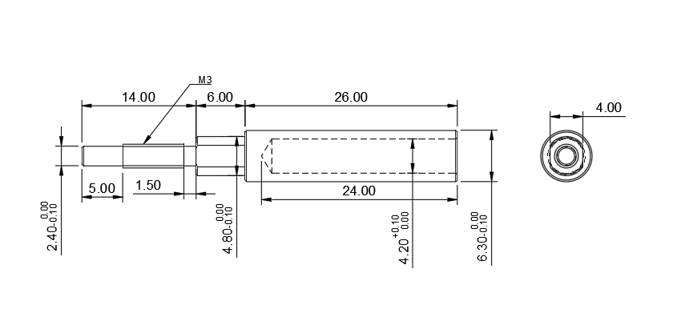

**What you're looking at:** The kit's own tools: five hex wrenches, a 2.5 mm slot driver, a 2 mm drill bit, a brass brush, and the brass **heat-set insert tip** that screws into a soldering iron. The drawing dimensions its tongue: 2.4 mm across, 5.0 mm long.

**Parts:** from *Fasteners, Tools & Misc* — hex wrenches 1.5 / 2 / 2.5 / 3 / 4 mm, 2.5 mm slot-head screwdriver, brass heat-set insert tool (M3), 2 mm drill bit, brass brush, aluminium handles ×2.

**Do:**

1. Put these on the bench, not back in the box.
2. The five hex sizes span every fastener drive in the BOM; nothing needs a 5 mm hex.

| Fastener | Drive |
|---|---|
| M3 BHCS/FHCS | 2 mm |
| M3 SHCS | 2.5 mm |
| M4 BHCS | 2.5 mm |
| M5 BHCS | 3 mm |
| M5 SHCS | 4 mm |
| Set screw | 1.5–2 mm |

**Check:** Five wrenches, one slot driver, one brass tip with its two knurled tongue-adjuster nuts, and one drill bit.

Tip: `CLAUDE.md` lists "5 mm hex driver for M5 frame bolts" as an open purchase. It is not needed — the M5 BHCS the frame uses is a 3 mm drive.

Source: [LDO 350 Rev D BOM](https://docs.ldomotors.com/en/voron/voron2/350_BOM/Rev_D) · [LDO heat-set insert tool guide](https://docs.ldomotors.com/guides/heatset_insert_tool_guide)

---

### Step 00.8 — Settle the tool list: owned vs. buy

(no image — see text)

**What you're looking at:** No parts, a purchasing decision. The column that matters is *First needed*: it says which chapter stops dead without that tool, so anything marked Ch 00 or Ch 01 has to be on the bench before the kit lands.

**Parts:** none.

**Do:** Work down this table and buy what is missing. Column *First needed* is the chapter that stops without it.

| Tool | Status | First needed |
|---|---|---|
| Precision hex driver set of 5, ball-end | **Bought** — Fabreeko, in kit order F6424626 | Ch 02 (Ch 01 uses the kit's straight 3 mm key) |
| Hex wrenches 1.5–4 mm | **In the kit** | Ch 01 |
| Flat reference surface | **Resolved** — kitchen stone counter, verified in Step 00.10 | Ch 01 |
| Digital caliper, 150 mm | **Buy** | Ch 00 (deck gate, cube gate) |
| Machinist square, 150 mm DIN 875/2 | **Buy** | Ch 01 (frame squaring) |
| Temperature-controlled soldering iron, 900M-T tip fitting | **Buy** | Ch 00 (insert practice) |
| LDO brass M3 heat-set tip | **In the kit** — the $9.99 LDO Heat Insert Tool Kit buys you spares, or an early Gate B if ordered with the filament | Ch 00 |
| Flush cutters | **Buy** | Ch 07 (belts), Ch 10 (zip ties) |
| Torque screwdriver 0.5–3 N·m | **Buy — optional.** No Voron or LDO source publishes a torque figure for any fastener in this build; this manual never invents one. Buy it for repeatability across the 283 M3×8, not to hit a spec | Ch 01 |
| T10 Torx driver | **Buy** | Ch 05 (titanium backer FHCS cam out easily in countersinks) |
| Multimeter | **Buy if not owned** | Ch 10 (mandatory — Checkpoint #1) |
| Dial indicator + magnetic base | Optional, skip for now | — |

**Check:** Every "Buy" row has an order placed or a decision to skip written down.

Source: [LDO 350 Rev D BOM](https://docs.ldomotors.com/en/voron/voron2/350_BOM/Rev_D) · [survey](../voron-build-instructions-survey.md)

---

### Step 00.9 — Order the consumables with the longest lead time first

(no image — see text)

**What you're looking at:** No parts, the consumables order. Two of these gate work rather than improve it: the rails cannot be prepared without the synthetic grease and the IPA.

**Parts:** none.

**Do:**

1. Order everything below before the kit lands.
2. Add the last row only if you want Gate B and the insert practice done before the kit; otherwise all three wait for kit-day morning.

| Item | Note |
|---|---|
| **Super Lube 21030** synthetic grease | 3 oz / 85 g tube, far more than seven carriages need; LDO publishes no quantity |
| IPA ≥ 90% | enough to fill a rail's own shipping bag seven times over — the bag is the soak tray |
| **Loctite 243** blue threadlocker | Ch 02, Ch 04, Ch 05 |
| Nitrile gloves, lint-free cloth, masking tape, permanent marker | — |
| **Ten M3×5×4 brass heat-set inserts, two 625-2RS bearings, the $9.99 LDO Heat Insert Tool Kit** | order with the filament for an early Gate B |

**Check:** Grease and IPA are on the bench before you touch a rail; rail prep cannot start without them.

⚠ **Rev D+ / LDO:** LDO's rail guide recommends an **NLGI 0 or 1** grease and in the same sentence names Super Lube 21030 as a community favourite. Super Lube's data lists 21030 as **NLGI 2**, one grade stiffer. The Voron community uses it and it works, so a tube marked NLGI 2 is not a wrong order. [src](https://docs.ldomotors.com/guides/rail_grease_guide) · [src](https://www.super-lube.com/product-sku/super-lube-multi-purpose-synthetic-grease-nlgi-2-sku-21030-3-oz-tube/)

Source: [LDO rail grease guide](https://docs.ldomotors.com/guides/rail_grease_guide) · [Super Lube 21030 product data](https://www.super-lube.com/product-sku/super-lube-multi-purpose-synthetic-grease-nlgi-2-sku-21030-3-oz-tube/)

---

## Workspace

### Step 00.10 — Verify the flat reference

(no image — see text)

**What you're looking at:** The kitchen stone counter, a long straightedge and a set of feeler gauges. This surface is the reference the whole frame is squared against in Ch 01, so its flatness becomes the printer's flatness. The gauges measure the gap under the straightedge.

**Parts:** straightedge ≥ 600 mm, feeler gauge set, marker or tape.

**Do:**

1. Clear and clean at least **600 × 600 mm** of stone counter.
2. Stand the straightedge on edge in five positions: left-right, front-back, both diagonals, centre.
3. Slide feeler leaves under from the thinnest and record the largest.

The 350's frame uses 470 mm and 530 mm extrusions, which is where the 600 mm comes from.

| Reading | What it means |
|---|---|
| worst leaf **≤ 0.1 mm** | finer than the extrusions themselves — proceed |
| **≥ 0.3 mm**, or any rock of the straightedge | choose another patch or another surface |
| **twist**, one corner high | matters; a symmetric dish does not, because the frame's four corners stay coplanar on it |

**Check:** No rock in any of the five positions, worst leaf ≤ 0.1 mm and logged, flattest sub-area masked off for Ch 01.

Tip: between sessions lay a clean towel or foam over the masked area; grit trapped under an extrusion will make a flat surface lie to you.

Source: [Voron manual p.15](https://github.com/VoronDesign/Voron-2/blob/de7e89d/Manual/Assembly_Manual_2.4r2.pdf#page=15) · [survey](../voron-build-instructions-survey.md)

---

### Step 00.11 — Bin the workspace by chapter

(no image — see text)

**What you're looking at:** Empty bins and a marker. Each bin belongs to one sub-assembly, not to a whole chapter: Ch 02 alone builds four identical-looking corners that must not get mixed. Parts land in their bin as they arrive, so a session never starts with a hunt.

**Parts:** ~25 stackable bins, boxes or labelled zip bags, plus masking tape and marker.

**Do:**

1. Print the [bin labels](../print/bin-labels.md), one per bin, and tape one to each container.
2. The scheme is [print/README.md § Bins](print/README.md#bins): **25 bins**, `02-Z0` … `spare-alt`, the names every batch chapter and plate diagram already uses.

| Print batch | Bins it fills |
|---|---|
| B00 — Calibration & jigs | 00-jigs, 02-Z0 |
| B01 — Z drive assemblies | 02-Z0, 02-Z1, 02-Z2, 02-Z3, 02-deck |
| B02 — The orange day (all accent parts) | 02-Z0 … 02-Z3, 04-A, 04-B, 05-XY, 06-Z-joints, 07-X, 08-SB, 08-CW2, 10-chains, 11-skirts, 11-fans, 11-door, spare-alt |
| B03 — A/B drive units + front idlers | 04-A, 04-B |
| B04 — XY joints + X carriage | 05-XY, 07-X |
| B05 — Z joints + Z chain | 06-Z-joints, 10-chains |
| B06 — Toolhead | 08-SB, 08-CW2, spare-alt |
| B07 — Electronics bay + lighting | 09-bay, 10-lights, 11-panels, spare-alt |
| B08 — Skirts and front modules | 11-skirts |
| B09 — Panels, filtration, spool | 11-panels, 11-clips-4mm, 11-clips-6mm, 11-nevermore, 11-spool |
| B10 — Clicky-Clack door | 11-door |

**Check:** 25 containers labelled, the batch-to-bin map posted where you sort, plus bins for the LDO-supplied parts and the greased rails.

Source: [print plan](../voron-print-plan.md) · [survey](../voron-build-instructions-survey.md)

---

### Step 00.12 — Leave the fasteners in their bags

(no image — see text)

**What you're looking at:** The *Fasteners, Tools & Misc* box, unopened bags. Every bag is one size of screw or nut; mixing them is easy and un-mixing them is not, because M3×8, M3×12 and M3×16 differ only by a few millimetres of shank.

**Parts:** the *Fasteners, Tools & Misc* box.

**Do:**

1. Keep every fastener bag closed and labelled; do not decant 283 M3×8 SHCS into a tray.
2. Decant only what one chapter calls for, and tip the remainder back into its bag at the end of the session.

**Check:** Every fastener bag still closed and legible. One small tray, empty, staged for Ch 01.

Source: [LDO 350 Rev D BOM](https://docs.ldomotors.com/en/voron/voron2/350_BOM/Rev_D) · [Video: Part 1 @2:05:08](https://www.youtube.com/watch?v=feTxcc0LIWM&list=PL0fUJbigELQPqpeGOgHYisG4KaSXVtnNY&t=7508s)

Pause: ~30 min since the last pause — the tool and consumable decisions are made, the flat reference is verified and masked off, and the bins are labelled. Leave the fastener bags closed; do not decant anything into a tray yet.

---

## Heat-set inserts

### Step 00.13 — Fit the brass tip and set the tongue flush

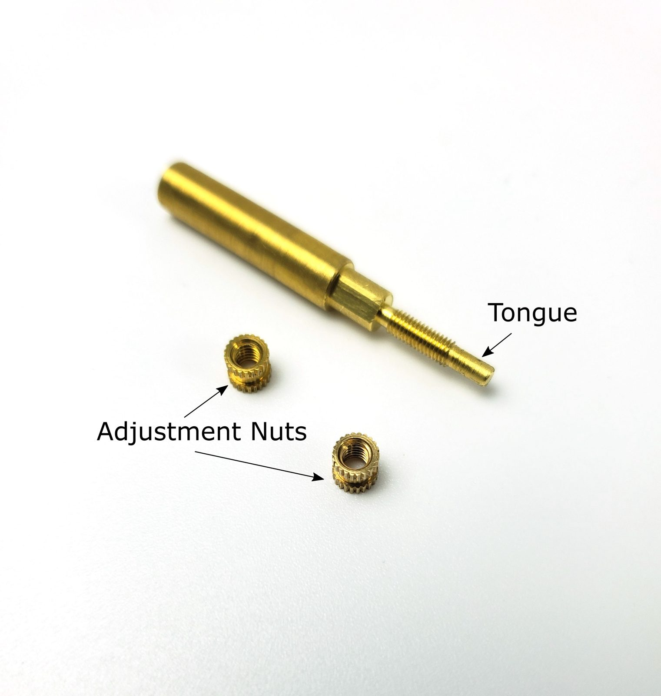
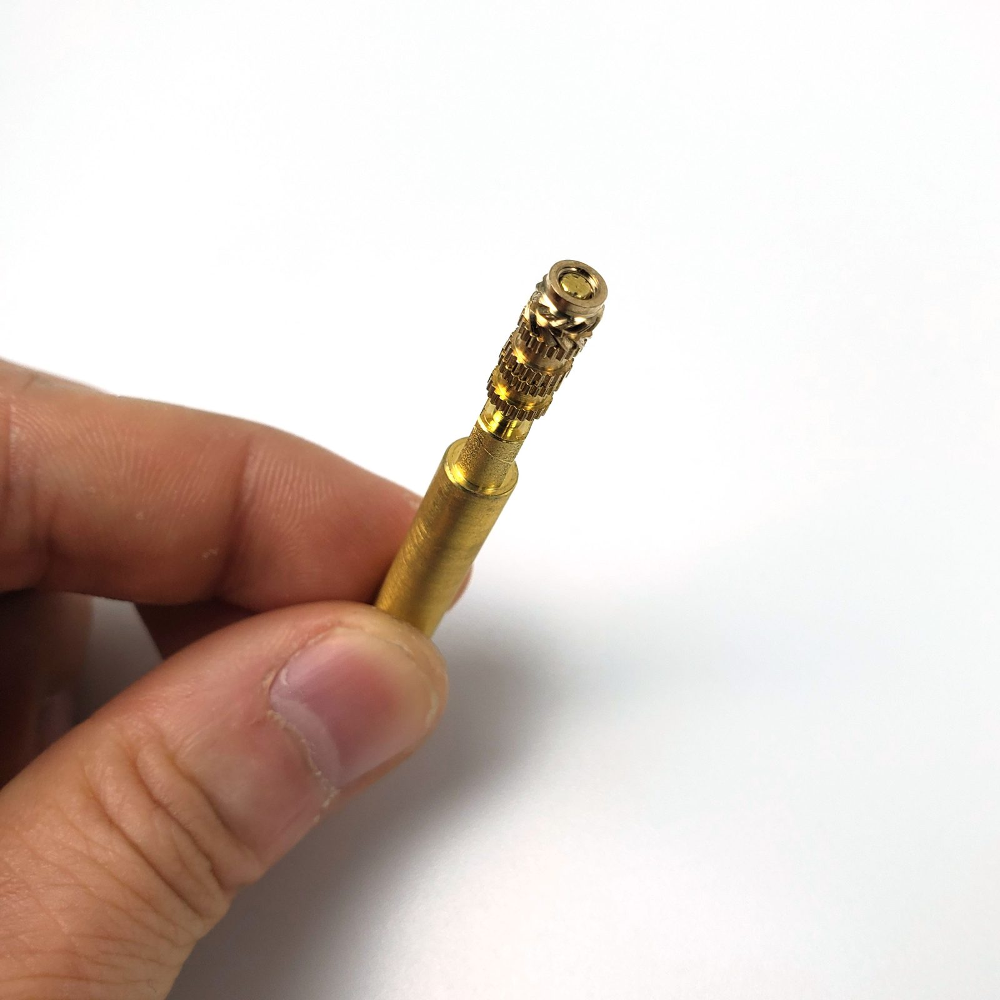
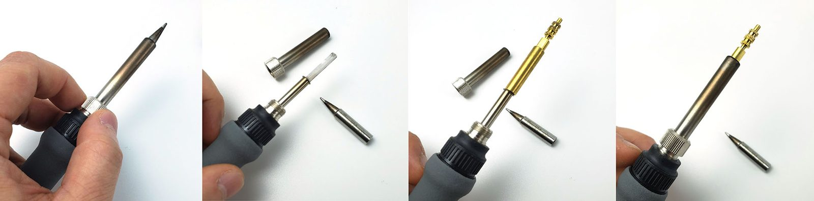

**What you're looking at:** The LDO brass tip, and the same tip set against an insert. The four-panel photo is the tip going into the iron: sleeve off, stock tip out, LDO tip in, sleeve on. The **tongue** is the thin pin that goes inside the insert.

**Parts:** LDO brass M3 heat-set tip (from the kit, or the LDO tool kit ordered with the filament — Step 00.9), soldering iron, one M3×5×4 insert as the gauge.

**Do:**

1. Unscrew the iron's sleeve, remove the stock tip, fit the LDO tip, re-fit the sleeve.
2. Hold an insert alongside the tip and move the two knurled nuts until the **exposed tongue length equals the insert height**.

**Check:** With an insert on the tongue, the tongue tip and the insert's far face are level.

Tip: the adjustment nuts on LDO's own tool are themselves brass inserts. [src](https://docs.ldomotors.com/guides/heatset_insert_tool_guide)

Source: [LDO heat-set insert tool guide](https://docs.ldomotors.com/guides/heatset_insert_tool_guide) · [Video: Part 3 @1:16:49](https://www.youtube.com/watch?v=ii14-2COjuA&list=PL0fUJbigELQPqpeGOgHYisG4KaSXVtnNY&t=4609s)

---

### Step 00.14 — Find the iron temperature on the practice coupon

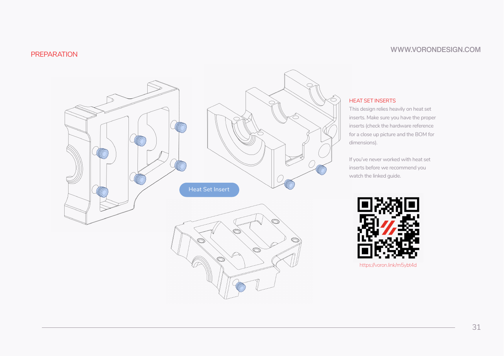

**What you're looking at:** Manual p.31 shows the general insert operation: the blue pills are inserts going into the bosses of real Z-drive parts. The `Heatset_Practice` coupon is a printed block of seven insert pockets for finding the iron temperature.

**Parts:** `Heatset_Practice` coupon ×1 (batch B00), M3×5×4 inserts ×7 (one per pocket).

**Do:**

1. Start at the bottom of the iron's range, never where soldering left it, and step up 10 °C at a time.
2. Sit each insert narrow end down by hand, then push the tongue straight down until flush.

**Check:** Plastic very soft but not runny, the iron never lingering longer than seating takes, and the working temperature on tape on the iron.

⚠ **Rev D+ / LDO:** LDO publishes no temperature, and the [technique guide](https://voron.link/m5ybt4d) on manual p.31 shows the method. ASA behaves differently from the PLA in most insert tutorials: calibrate on this ASA coupon, not on a PLA scrap, or the number you find will be wrong for all 146 remaining inserts.

Source: [Voron manual p.31](https://github.com/VoronDesign/Voron-2/blob/de7e89d/Manual/Assembly_Manual_2.4r2.pdf#page=31) · [LDO heat-set insert tool guide](https://docs.ldomotors.com/guides/heatset_insert_tool_guide)

---

### Step 00.15 — Learn what a good insert looks like

(no image — see text)

**What you're looking at:** The seven inserts you just set, one per pocket of the practice coupon. A good one is flush with the surface, square to it, and has not made the plastic boss around it swell. A swollen boss will not fit its neighbour.

**Parts:** the practice coupon from Step 00.14.

**Do:**

1. Push each insert 90 % in with the iron, then press the last 10 % home with a flat cold tool.
2. Check squareness by eye from two directions.
3. Nudge a tilted insert briefly with the iron.

**Check:** Seven inserts flush to ≤ 0.2 mm proud, square, with no boss bulged more than 0.2 mm.

⚠ A bulged boss is a technique fault, too hot or pushed too fast, never a slicer fault. On a real part with a free-standing boss, caliper the boss OD before and after; on the coupon the raised ring is the tell. [src](https://docs.ldomotors.com/guides/heatset_insert_tool_guide) · print plan §1.4

Source: [LDO heat-set insert tool guide](https://docs.ldomotors.com/guides/heatset_insert_tool_guide) · [print plan](../voron-print-plan.md) · [Video: Part 1 @3:12:19](https://www.youtube.com/watch?v=feTxcc0LIWM&list=PL0fUJbigELQPqpeGOgHYisG4KaSXVtnNY&t=11539s)

---

### Step 00.16 — Plan the 153 inserts

(no image — see text)

**What you're looking at:** No parts, the insert budget. The manual draws every insert with the same blue *Heat Set Insert* pill and no count, so the table below holds only the totals this manual could verify.

**Parts:** none.

**Do:**

1. LDO ships **153** M3×5×4 brass inserts; seven went into the coupon, leaving 146.
2. Count the rest off each printed part.
3. Run that pass **per batch, off the plate and before any part enters an assembly chapter**.

| Insert pass belongs to | Manual page carrying the callout | Count |
|---|---|---|
| Ch 02 — Z drive mains, retainers, motor mounts | p.31 | **36** (7 × 4 retainers + 2 × 4 mains — verified against the STLs) |
| Ch 04 — A/B drive frames | p.64 | (verify on bench) |
| Ch 05 — X carriage and XY joints | p.129 | (verify on bench) |
| Ch 08 — Stealthburner and Clockwork 2 | Stealthburner manual | (verify on bench) |
| Ch 10 — power inlet, Z cable chain | p.156, p.201 | (verify on bench) |
| Ch 11 — skirt front cover, screen and fan modules, exhaust cover | p.211, p.212, p.213, p.250 | (verify on bench) |
| **Supplied in the kit** | LDO Rev D 350 BOM | **153** |

**Check:** The insert pass is written into your batch checklist as a gate, not a reminder.

⚠ **Rev D+ / LDO:** LDO does not state whether 153 includes spares. Treat every insert after the seven practice ones as load-bearing.

Source: [Voron manual p.31](https://github.com/VoronDesign/Voron-2/blob/de7e89d/Manual/Assembly_Manual_2.4r2.pdf#page=31) · [LDO 350 Rev D BOM](https://docs.ldomotors.com/en/voron/voron2/350_BOM/Rev_D)

Pause: ~30 min since the last pause — the iron is set up with the brass tip, the working temperature is written on tape, and the seven practice inserts (one per coupon pocket) are done. Unplug the iron and let it cool before you walk away; leave the remaining 146 inserts bagged.

---

## Rail preparation

### Step 00.17 — Unbag the rails and immobilise every carriage

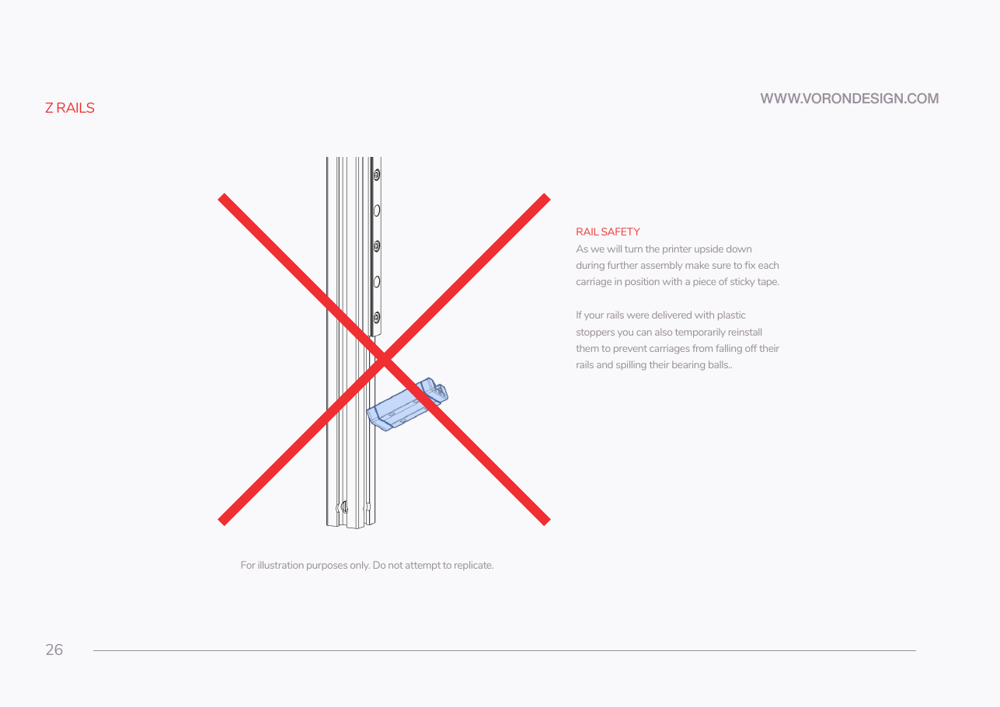

**What you're looking at:** Manual p.26: the linear rails and their carriages. A **linear rail** is a hardened steel bar with ball-bearing grooves down each side; the **carriage** is the block that rides on it. Its balls fall out if it runs off the end.

**Parts:** 1× `LDO-SLR12H-400Z1` stainless MGN12H (X axis), 6× `LDO-SLR9H-400Z0` stainless MGN9H (2× Y, 4× Z).

**Do:**

1. Work one rail at a time, over the bench.
2. Slide it out to reach the carriage and tape it to the rail.
3. Band tape **15 mm from each end**, remove the carriage tape, re-bag the rail.

**Check:** Seven rails, each back in its own bag with two end stops on and none dropped. Bags laid flat, not stacked on each other.

⚠ The carriage is designed to slide freely, which includes sliding off the end and spilling its ball bearings. Never work over the floor, never let a rail hang vertically with an untaped, unstopped carriage, and never let one fall: a dent or nick anywhere on the raceway makes that rail misbehave for the life of the machine.

Tip: a small zip tie round the rail does the same job and shrugs off the IPA; plastic end stoppers work if your rails shipped with them.

Source: [Voron manual p.26](https://github.com/VoronDesign/Voron-2/blob/de7e89d/Manual/Assembly_Manual_2.4r2.pdf#page=26) · [Voron manual p.24](https://github.com/VoronDesign/Voron-2/blob/de7e89d/Manual/Assembly_Manual_2.4r2.pdf#page=24) · [LDO rail grease guide](https://docs.ldomotors.com/guides/rail_grease_guide) · [Video: Part 1 @1:54:03](https://www.youtube.com/watch?v=feTxcc0LIWM&list=PL0fUJbigELQPqpeGOgHYisG4KaSXVtnNY&t=6843s)

---

### Step 00.18 — Degrease: IPA soak, then dry completely

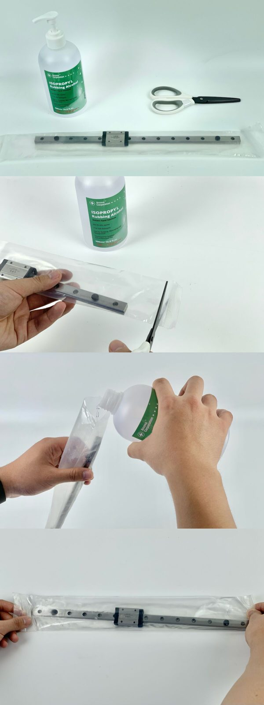

**What you're looking at:** A rail in its own shipping bag with one corner cut off and IPA poured in: LDO's method makes the bag the soak tray. The rails ship coated in a shipping oil, not a lubricant; the soak dissolves it out of the ball tracks.

**Parts:** one rail at a time, in its own bag with the end stops on; IPA ≥ 90%; nitrile gloves; a clean towel.

**Do:**

1. Cut a corner off the rail's bag and pour in **IPA ≥ 90%** to cover it.
2. Work the carriage between the end stops for about **10 minutes**.
3. Drain, dry the rail on a towel, and repeat.

**Check:** No oil film on the raceway, no visible wet IPA, both end-stop bands still tight, and the carriage running dry and slightly notchy. [src](https://docs.ldomotors.com/guides/rail_grease_guide)

⚠ Gloves on and window open for the soak. IPA softens masking-tape adhesive, so re-wrap any end-stop band that has slipped before the grease goes in.

Tip: the linked Nero 3D video is the reference demonstration of this whole procedure — manual p.24 QR, [voron.link/agu0nes](https://voron.link/agu0nes).

Source: [LDO rail grease guide](https://docs.ldomotors.com/guides/rail_grease_guide) · [Voron manual p.24](https://github.com/VoronDesign/Voron-2/blob/de7e89d/Manual/Assembly_Manual_2.4r2.pdf#page=24) · [Nero 3D rail prep video](https://voron.link/agu0nes) · [Video: Part 1 @2:20:52](https://www.youtube.com/watch?v=feTxcc0LIWM&list=PL0fUJbigELQPqpeGOgHYisG4KaSXVtnNY&t=8452s)

Pause: ~30 min since the last pause — all seven rails are soaked, end stops on, and laid out on a towel to dry. This is a genuine wait state: the IPA must evaporate completely (an hour at least, overnight is better) before grease goes in, so stopping here costs nothing. Do not start packing grease into a rail that is still damp.

---

### Step 00.19 — Flip and pack

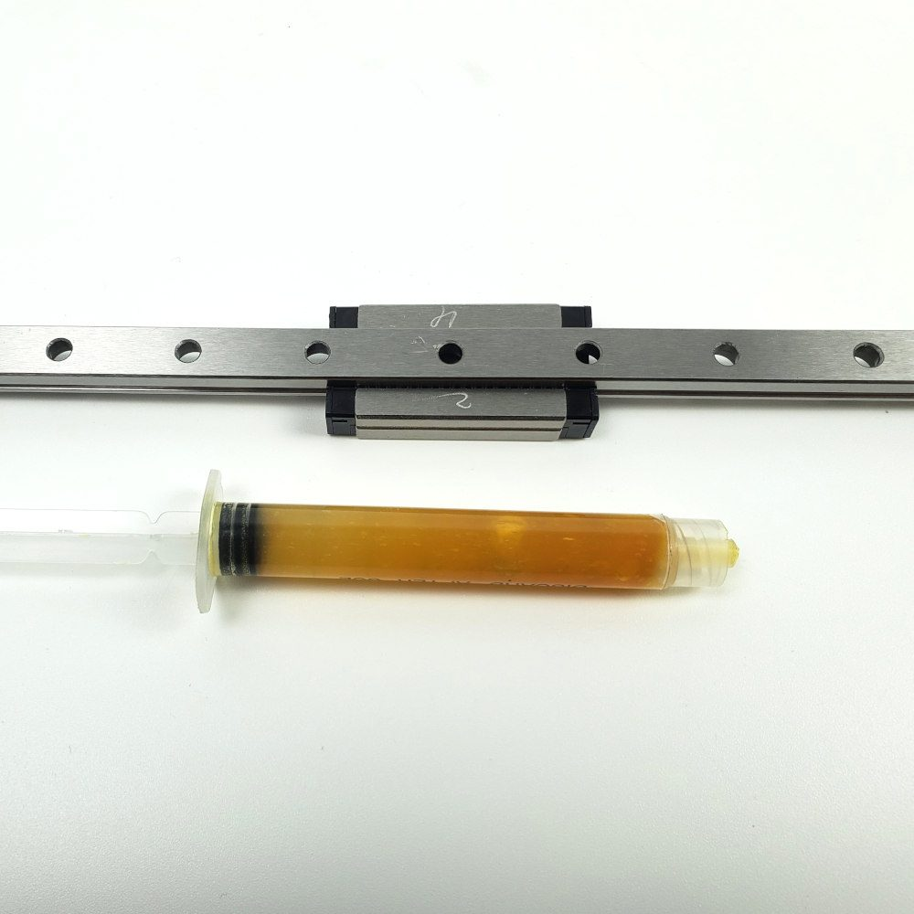
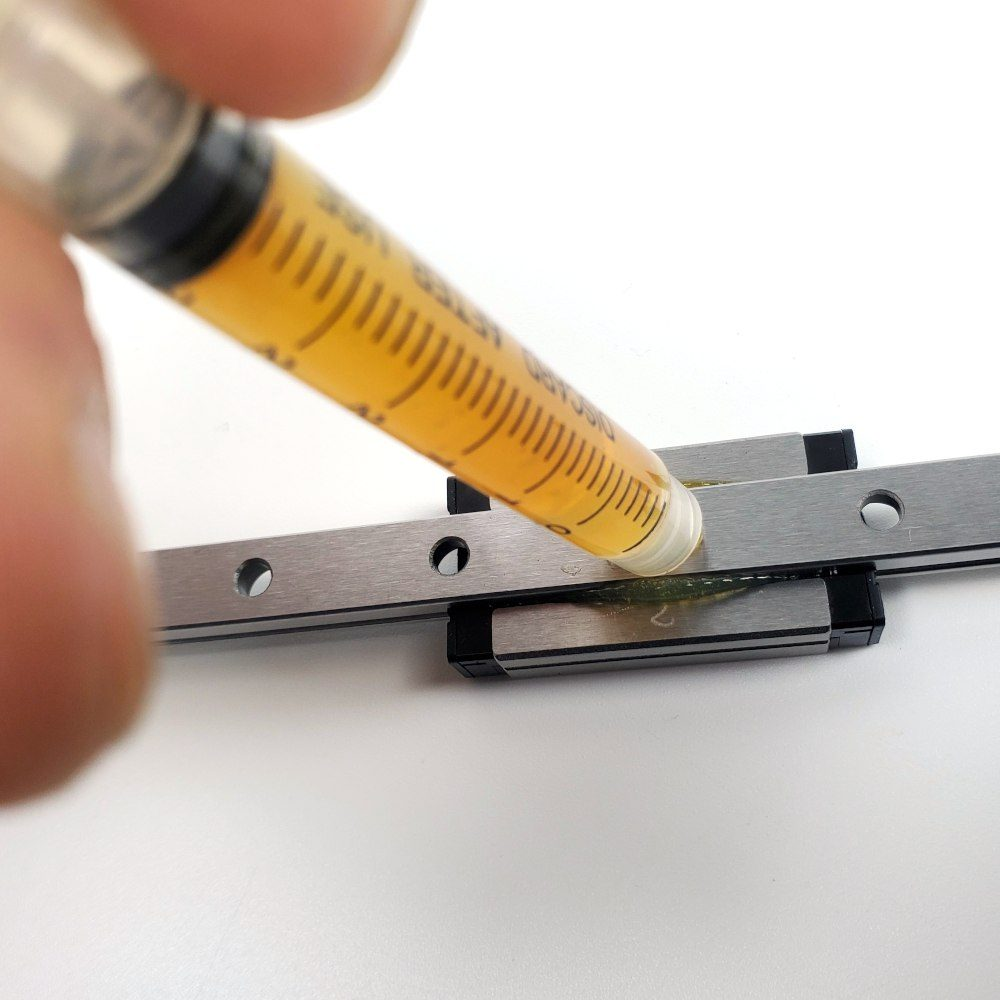

**What you're looking at:** Grease prepared in a syringe, and grease forced into a carriage through one of the rail's mounting holes. This is LDO's **flip-and-pack** method: upside down, the mounting hole lines up with the ball tracks, so grease reaches the bearings without taking the carriage apart.

**Parts:** dried rail; Super Lube 21030 in a syringe or its own nozzle.

**Do:**

1. Flip the rail so the carriage faces **downwards**.
2. Slide the carriage over one of the rail's mounting holes and force grease through it.
3. Keep going until grease **oozes out at both end caps of the carriage**.

**Check:** Grease visible at both end caps of the carriage. The carriage now runs smooth and silent along the rail with no notchiness.

Source: [LDO rail grease guide](https://docs.ldomotors.com/guides/rail_grease_guide)

---

### Step 00.20 — Clean the rail surface back to bare steel

(no image — see text)

**What you're looking at:** The greased rail and a cloth. Grease belongs inside the carriage; the polished outer faces of the rail are a running surface, and any film left there collects dust and hair and feeds it into the bearings.

**Parts:** greased rail; lint-free cloth; `MGN12_rail_guide_x2` and `MGN9_rail_guide_x2` (batch B00) and one C extrusion from the frame box, for the guide test.

**Do:**

1. Stroke the carriage stop to stop to spread grease inside.
2. Wipe every trace of grease off the rail's **outside**.
3. Clip each guide over its rail on the spare C extrusion, locating with **light finger pressure**.

**Check:** The rail is visibly clean and dry, the carriage slides smoothly and silently, and both guide sizes locate with light finger pressure, logged.

⚠ A guide that will not seat now, with Gate A and Gate B both passed, is more likely a burr on the extrusion or a string in the guide than the profile. Clean it and retry before you blame the slicer.

Source: [LDO rail grease guide](https://docs.ldomotors.com/guides/rail_grease_guide) · [Video: Part 1 @1:58:46](https://www.youtube.com/watch?v=feTxcc0LIWM&list=PL0fUJbigELQPqpeGOgHYisG4KaSXVtnNY&t=7126s)

---

### Step 00.21 — Label and bag the seven rails by destination

(no image — see text)

**What you're looking at:** Seven finished rails, tape and a marker. One is the MGN12H that carries the toolhead on X; the six MGN9H split into two gantry Y rails and four vertical Z rails. Labelling them now stops a mix-up in Ch 02 and Ch 05.

**Parts:** 7 greased rails; masking tape; marker; a bin.

**Do:**

1. Label the tape **X** for the MGN12H, **Y1/Y2** and **Z0/Z1/Z2/Z3** for the six MGN9H.
2. Leave both end stops on until Ch 02 and Ch 05.
3. Tape each carriage, bag each rail, and store them in one bin.

**Check:** Seven labelled, bagged rails; end stops and carriage tape intact on all seven; bin stored flat and away from foot traffic.

Source: [LDO rail grease guide](https://docs.ldomotors.com/guides/rail_grease_guide) · [LDO 350 Rev D BOM](https://docs.ldomotors.com/en/voron/voron2/350_BOM/Rev_D) · [Video: Part 1 @1:54:30](https://www.youtube.com/watch?v=feTxcc0LIWM&list=PL0fUJbigELQPqpeGOgHYisG4KaSXVtnNY&t=6870s)

---

### Step 00.22 — Understand the rail jigs before you need them

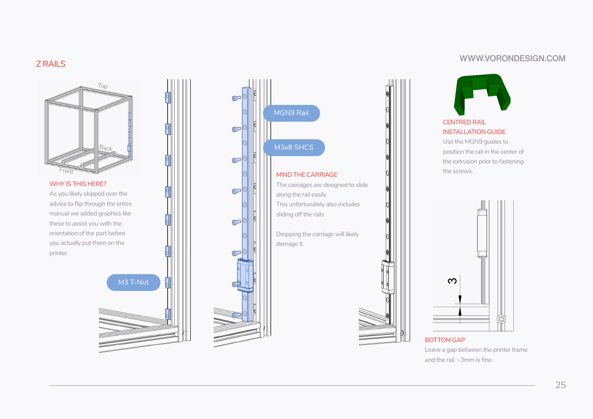

**What you're looking at:** Manual p.25 draws the rail guides in green, its jig colour. A **rail guide** clips over the 2020 extrusion and the rail and holds the rail centred while you start the screws; the `pulley_jig` sets how far a pulley sits along a motor shaft.

**Parts:** `MGN9_rail_guide_x2` ×2, `MGN12_rail_guide_x2` ×2, `pulley_jig` ×1 (all batch B00).

**Do:**

1. Keep both rail-guide sizes with the jigs; the rails stay bagged now.
2. Keep the `pulley_jig` with the Z-drive bin. It sets pulley stack height on the Z motors in Ch 02.

**Check:** Both guide sizes fitted, the MGN12 on the bare rail at Gate B and both on the extrusion at Step 00.20.

⚠ **Rev D+ / LDO:** two rail-mounting rules that override the manual's default from Ch 02 onward. First, do **not** use the end hole; use the **second hole in from each end**, per LDO Build Notes p.88. Second, tighten rail screws from the **centre outward** to pull the rail flush, leaving a ~3 mm gap between frame and rail bottom. [src](https://docs.ldomotors.com/voron/voron2/build-faq)

Source: [Voron manual p.25](https://github.com/VoronDesign/Voron-2/blob/de7e89d/Manual/Assembly_Manual_2.4r2.pdf#page=25) · [Voron manual p.24](https://github.com/VoronDesign/Voron-2/blob/de7e89d/Manual/Assembly_Manual_2.4r2.pdf#page=24) · [LDO Build Notes (Rev D)](https://docs.ldomotors.com/voron/voron2/build-faq) · [Voron-2 `STLs/Tools`](https://github.com/VoronDesign/Voron-2/tree/de7e89d/STLs/Tools)

Pause: ~40 min since the last pause — all seven rails greased, wiped back to bare steel, labelled X / Y1 / Y2 / Z0–Z3 and bagged, and both jig sizes test-fitted. Rail prep is per-rail work, so if you have to stop earlier, stop after a rail is packed, wiped and bagged — never with a carriage half-packed.

---

## How to read the manual pages

### Step 00.23 — Print guidelines (p.4)

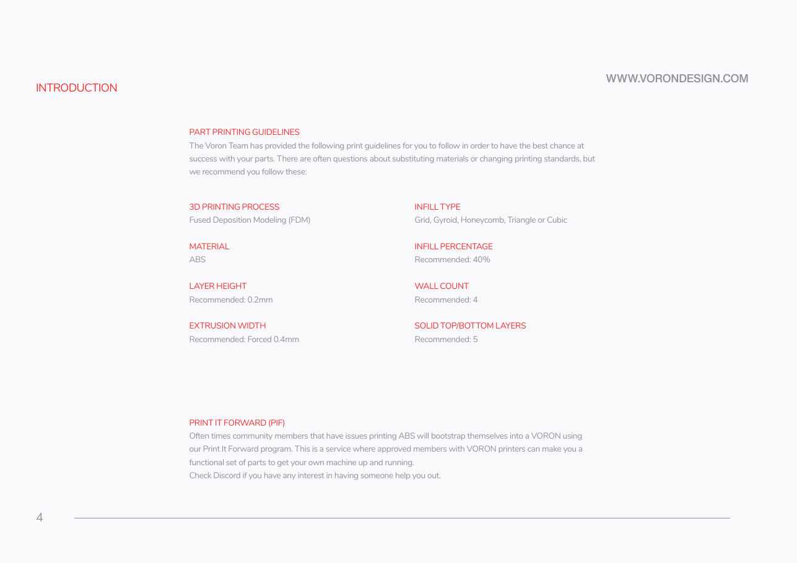

**What you're looking at:** Manual p.4, the Voron print specification. These are the numbers the parts in this build are designed around: ABS or ASA, 0.2 mm layers, 4 perimeters, 5 solid top and bottom layers, 40 % infill. You print every part yourself.

**Parts:** none.

**Do:**

1. Read the spec: ABS/ASA, 0.2 mm layers, **forced 0.4 mm extrusion width**, **4 perimeters**, **5 solid top and bottom layers**, **40% infill** in grid, gyroid, honeycomb, triangle or cubic.
2. Ignore the Print It Forward box.

**Check:** Nothing to do on the bench. If your slicer profile disagrees with this page, the profile is wrong.

Tip: `_x4` means four, regardless of how many bodies are in the file.

Tip: The infill spec makes parts stiff enough to hold a bearing and stable in a 60 °C chamber.

Source: [Voron manual p.4](https://github.com/VoronDesign/Voron-2/blob/de7e89d/Manual/Assembly_Manual_2.4r2.pdf#page=4) · [slicer setup](print/00-slicer-setup.md)

---

### Step 00.24 — File naming, and where to get help (p.5–6)

**What you're looking at:** Manual p.5–6, the STL filename convention and the two support routes. A prefix in square brackets sets the colour and a `_xN` suffix is how many the machine needs. The print plan and every parts table here use that convention.

**Parts:** none.

**Do:**

1. Learn the filename convention: a bare name is **primary colour**, Galaxy Black; an `[a]_` prefix is **accent colour**, Prusa Orange; a `_x#` suffix is the **quantity needed**.
2. Bookmark p.5–6's two help routes: Voron Discord, CAD on GitHub.

**Check:** You can read `[a]_z_belt_clip_lower_x4.stl` as "accent colour, four required".

Source: [Voron manual p.5](https://github.com/VoronDesign/Voron-2/blob/de7e89d/Manual/Assembly_Manual_2.4r2.pdf#page=5) · [Voron manual p.6](https://github.com/VoronDesign/Voron-2/blob/de7e89d/Manual/Assembly_Manual_2.4r2.pdf#page=6) · [print plan](../voron-print-plan.md)

---

### Step 00.25 — Fastener names, part 1 (p.7)

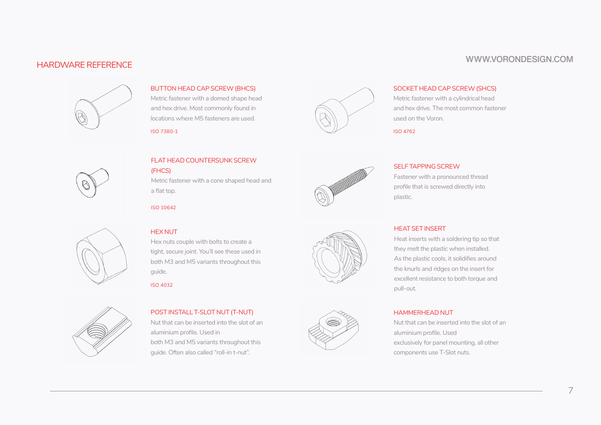

**What you're looking at:** Manual p.7, the first half of the fastener vocabulary, each drawn beside its name. **BHCS** is a domed button head, **SHCS** a plain cylinder, **FHCS** a countersunk cone. Every *Parts:* line in this manual uses these names exactly.

**Parts:** none.

**Do:** Lay one of each on the bench next to the page; these names are the contract for every *Parts* line in this manual.

| Name | What it is |
|---|---|
| **BHCS** | domed head, mostly M5 |
| **SHCS** | cylindrical head, the most common fastener in the machine |
| **FHCS** | countersunk cone head, flat top |
| **Self-tapping** | screwed straight into plastic |
| **Hex nut** | M3 and M5 |
| **Heat-set insert** | brass, melted in |
| **T-nut, roll-in** | drops into an extrusion slot after assembly, used everywhere |
| **Hammerhead nut** | used **exclusively for panel mounting**; everything else takes a T-nut |

**Check:** You can pick a BHCS out of a bag by its dome and an SHCS by its straight cylinder without reading a label.

Source: [Voron manual p.7](https://github.com/VoronDesign/Voron-2/blob/de7e89d/Manual/Assembly_Manual_2.4r2.pdf#page=7)

---

### Step 00.26 — Fastener names, part 2, and the spacer substitution (p.8)

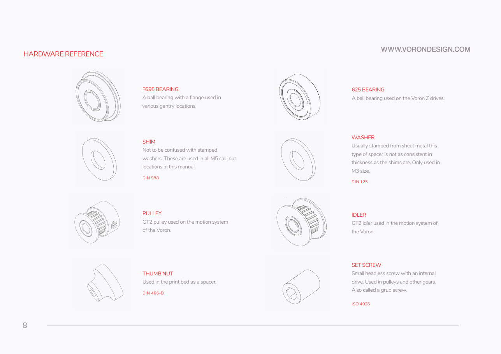

**What you're looking at:** Manual p.8, the second half: bearings, spacers, pulleys and set screws. **F695** and **625-2RS** are both 5 mm-bore ball bearings with different jobs: F695 is flanged and lives in the A/B drives, 625-2RS is plain and lives in the Z drives.

**Parts:** none.

**Do:** Learn these, and note that the manual calls out a *shim* at every M5 location.

| Part | Spec |
|---|---|
| **F695** flanged bearing | 5×13×4 mm — A/B drives, front idlers, XY joints; 20 in the kit |
| **625-2RS** bearing | 5×16×5 mm — Z drives only; 12 in the kit |
| **shim** | DIN 988 |
| **washer** | DIN 125, M3 only |
| **pulley**, **idler** | GT2 |
| **set screw** | grub screw |
| **thumb nut** | bed spacer |

**Check:** You can tell the flanged 13 mm F695 from the plain 16 mm 625-2RS on sight; both are **5 mm bore**.

⚠ **Rev D+ / LDO:** wherever this manual or the official one says **M5 shim**, your kit gives you a **brass M5 1 mm precision spacer** instead — 46 of them, and they replace the shim everywhere unless a step says otherwise. p.104 is the exception: use the black M5 washer there, which is cosmetic. [src](https://docs.ldomotors.com/voron/voron2/build-faq)

Tip: the 16T and 20T GT2 pulleys look nearly identical: 16T goes on the Z motors, 20T everywhere else. Bag them separately during Ch 02 prep.

Source: [Voron manual p.8](https://github.com/VoronDesign/Voron-2/blob/de7e89d/Manual/Assembly_Manual_2.4r2.pdf#page=8) · [LDO Build Notes (Rev D)](https://docs.ldomotors.com/voron/voron2/build-faq)

---

### Step 00.27 — Drivers (p.9)

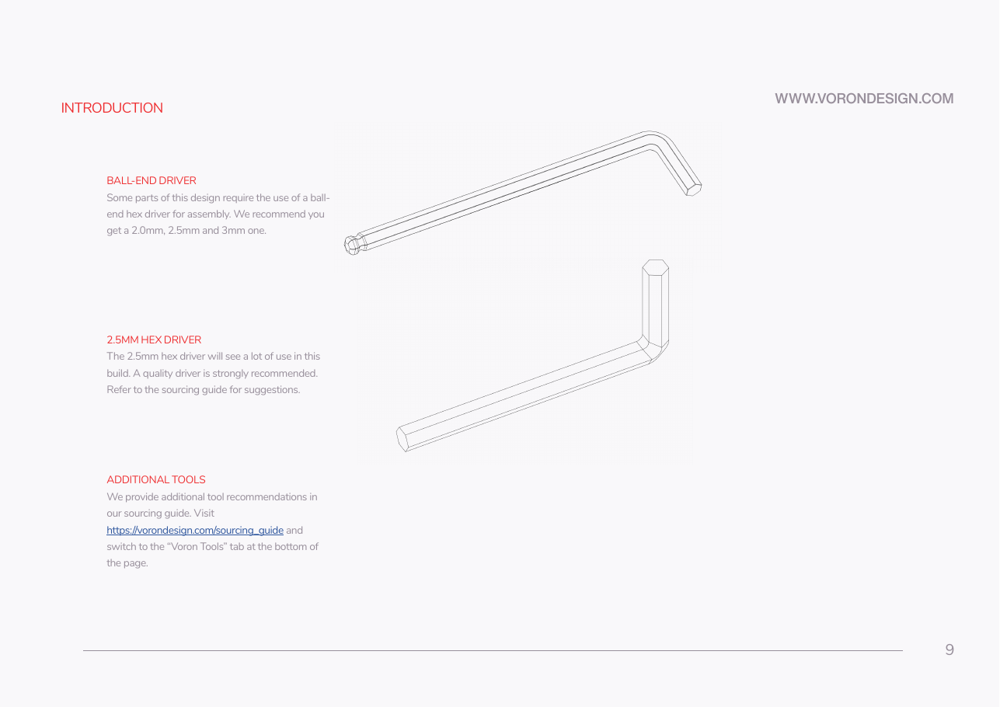

**What you're looking at:** Manual p.9, the drivers. A **ball-end** driver has a spherical tip that turns a screw at an angle, the only way to reach several joints in this frame. A plain hex tip grips more of the socket, for when you need force.

**Parts:** hex drivers.

**Do:**

1. Put **ball-end** drivers in 2.0, 2.5 and 3.0 mm on the bench.
2. The **2.5 mm** driver does the most work in the build.
3. Keep the kit's L-wrenches as backup where a handle will not fit.

**Check:** 2, 2.5 and 3 mm ball-end drivers on the bench, plus a plain 2.5 mm where ball ends would cam out under load.

Source: [Voron manual p.9](https://github.com/VoronDesign/Voron-2/blob/de7e89d/Manual/Assembly_Manual_2.4r2.pdf#page=9)

---

### Step 00.28 — Blind joints (p.10)

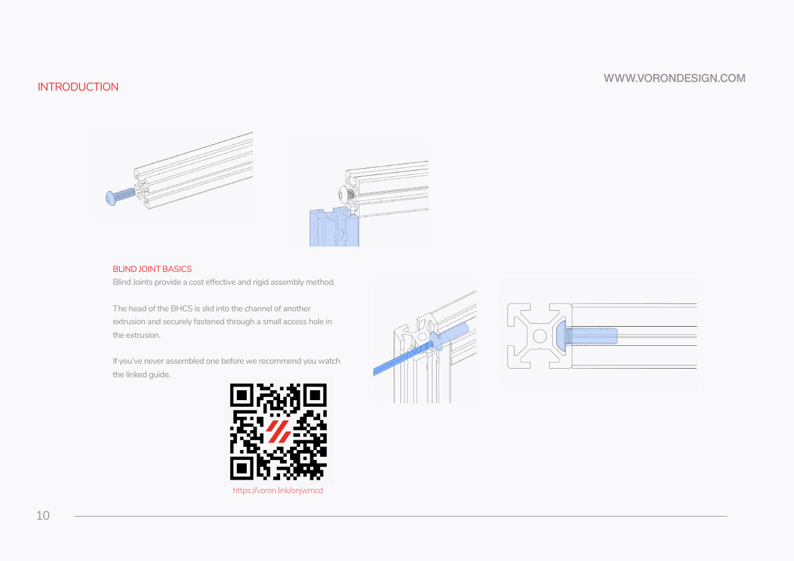

**What you're looking at:** Manual p.10, the **blind joint**, the joint the frame is built from. A button-head screw threads into the tapped bore in the end of one extrusion, its head captured inside the slot of the mating extrusion, tightened through a small access hole in the side.

**Parts:** none.

**Do:**

1. Watch the [blind-joint video](https://voron.link/onjwmcd) once before Ch 01.
2. The screw goes in *before* the two extrusions are brought together; you tighten it through the access hole afterwards.

**Check:** You can point at the access hole on a 2020 extrusion and describe which way the BHCS goes in.

Source: [Voron manual p.10](https://github.com/VoronDesign/Voron-2/blob/de7e89d/Manual/Assembly_Manual_2.4r2.pdf#page=10) · [blind-joint video](https://voron.link/onjwmcd) · [Video: Part 1 @0:54:58](https://www.youtube.com/watch?v=feTxcc0LIWM&list=PL0fUJbigELQPqpeGOgHYisG4KaSXVtnNY&t=3298s)

---

### Step 00.29 — How to read an exploded view, and the page-number contract (p.11)

**What you're looking at:** Manual p.11, how to read the drawings. Blue is what you add on this page, grey what you already built, green a printed jig; a rounded pill names a part, and the wireframe cube says which way round the machine is drawn.

**Parts:** none.

**Do:** Learn the manual's visual conventions, all visible on p.25.

| In the drawing | Meaning |
|---|---|
| **blue** part | what you are adding at this page |
| **grey/white** | structure you have already built |
| **blue rounded pill** | names a part or fastener, with a leader line to it |
| wireframe cube, top-left, labelled *Top / Back / Front* | which way round the machine you are looking |
| **green** | a printed jig or tool, not a machine part |
| plain dimension arrow with a bare number | a millimetre gap you must leave |
| red heading | section title or warning |

Then note the contract that makes this manual possible: the official PDF has not changed since **2023-07-18**, and LDO's Build Notes are a page-indexed diff pinned to that exact commit. Every `p.XX` reference in these chapters points at a page number that will not move. Pages like this one are dividers with no assembly content — they still get a page number, so do not assume a missing step when a page looks empty.

**Check:** Open any page in Ch 02 and identify, without reading the text, which part is new and which way the machine is facing.

Source: [Voron manual p.11](https://github.com/VoronDesign/Voron-2/blob/de7e89d/Manual/Assembly_Manual_2.4r2.pdf#page=11) · [Voron manual p.25](https://github.com/VoronDesign/Voron-2/blob/de7e89d/Manual/Assembly_Manual_2.4r2.pdf#page=25)

Pause: ~25 min since the last pause (pre-kit) — you have read the manual's front matter (p.4–11) and can read a filename, a fastener name and an exploded view. Nothing physical is in progress.

---

## Measurement log and lifelines

### Step 00.30 — Start the measurement log

(no image — see text)

**What you're looking at:** A notebook. A handful of numbers in this build cannot be re-derived later: the deck panel thickness, the frame diagonals, the belt frequency, the probe accuracy sigma. Each one gates a decision several chapters downstream.

**Parts:** a notebook, or a shared note on the iPad.

**Do:**

1. Start a log with one line per measurement: what you measured, the number, the date, and the step it came from. Your daughter owns it.
2. Four matter most, plus the date of the two gating questions.

| Measurement | Where it comes from |
|---|---|
| deck panel thickness | Step 00.4; it chooses which `deck_support_*` prints in batch B01 |
| frame diagonals | Ch 01 |
| belt frequency | Ch 07, and again in Ch 14 |
| `PROBE_ACCURACY` sigma | Ch 13 |

**Check:** The log exists the week B00 prints, holding the flat-reference gap; the deck thickness and inventory result join on kit day.

Source: [survey](../voron-build-instructions-survey.md)

---

### Step 00.31 — Join the three lifelines now

(no image — see text)

**What you're looking at:** No parts, three chat channels. Fabreeko is the vendor and owns anything missing or wrong in the box; the Voron Discord is the community; `#ldo_motors` inside it is LDO's own channel and the place their Build Notes send Rev D corrections.

**Parts:** none.

**Do:** Join all three before the kit arrives.

| Channel | What it is for |
|---|---|
| **Fabreeko Discord**, [discord.gg/NV8Y6bcerP](https://discord.gg/NV8Y6bcerP) | missing or wrong parts and anything vendor-specific; linked from the SKU page |
| **Voron Discord**, [discord.gg/voron](https://discord.gg/voron) | general build questions, in `#voron_2_questions` |
| **`#ldo_motors`** inside the Voron Discord, [channel link](https://discord.com/channels/460117602945990666/710952853514223617) | LDO's own support channel, where their Build Notes page directs Rev D corrections |

**Check:** All three joined, notifications on for `#ldo_motors`.

Source: [LDO Build Notes (Rev D)](https://docs.ldomotors.com/voron/voron2/build-faq) · [LDO batch BOM index](https://docs.ldomotors.com/en/voron/voron2/350_BOM/HOME)

---

### Step 00.32 — Post the two questions that gate later chapters

(no image — see text)

**What you're looking at:** No parts, two questions with slow answers. Both concern gaps in LDO's published documentation for Rev D+: the toolboard grounding scheme, and whether any STL changed. Both gate printing or wiring work several weeks out.

**Parts:** none.

**Do:**

1. Post both questions today; each has days of answer latency.
2. Quote the Fabreeko order number **F6424626**; neither needs the kit serial.

| Ask for | Where | Gates |
|---|---|---|
| the written Nitehawk-SB V2 grounding procedure: what bonds to what, with what wire, and at which mounting point on `usb_adapter_mount_partial_cover` | `#ldo_motors` | **Ch 10** |
| confirmation that **no STL changed between Rev D and Rev D+ apart from the USB-adapter cover**, and whether a D+ wiring guide has been posted | Fabreeko Discord | **batches B06 and B07**, the toolhead and electronics-bay parts |

**Check:** Both questions posted and the date noted in the log; if either is unanswered when batch B06 is due, ask again rather than assume.

⚠ The V2 repo ships `Images/grounding_scheme.jpg`, `Images/toolboard_ground_routing.jpg` and `Images/usb_adapter_gnd.jpg` with **no accompanying prose in any LDO document**, while the V2 change list claims "vastly improved ESD performance". Treat the grounding as a required build step in Ch 08 and Ch 10, not an option.

⚠ LDO publishes Printed Parts Guides for Rev A/B, C and D only; `printed_part_guide_rev_d_plus` returns 404, and the whole print plan runs on Fabreeko's statement that D+ is an electrical change.

Source: [LDO Nitehawk-SB V2 board doc](https://docs.ldomotors.com/en/Toolboard/nitehawk-sb-v2) · [LDO printed parts guide (Rev D)](https://docs.ldomotors.com/en/voron/voron2/printed_part_guide_rev_d) · [survey](../voron-build-instructions-survey.md)

Pause: ~20 min since the last pause (pre-kit) — measurement log started, all three Discord channels joined and both gating questions posted. Work through Checkpoint 00 before you open Ch 01.

---

## Checkpoint 00

- [ ] Both cartons inventoried against **your batch's** BOM page; `Check1` ticked on every line; shortages written down and reported to Fabreeko.
- [ ] Deck panel thickness measured and written down before B01-P2 started; B01-P2 carries the matching `deck_support_*` (3 mm as committed, or the 8 g `deck_support_4mm_x8` per the B01 deck note).
- [ ] Nitehawk board confirmed as a **V2**: PH2.0 on PROBE/TH0/CT/Endstop, XH on MOTOR, secondary USB port present, fan-adapter header keyed. The `stm32g0b1xx` USB-serial check is written into the Ch 12 notes.
- [ ] XY endstop cable labels read `XES / YES`, or the re-pin guide is bookmarked.
- [ ] Ten LDO-supplied printed parts binned and labelled "DO NOT PRINT". Batch B07 corrected to `usb_adapter_mount_partial_cover.stl`.
- [ ] Every "Buy" row in Step 00.8 ordered or consciously skipped. Grease and IPA on the bench.
- [ ] Flat reference verified in five positions; worst feeler gap ≤ 0.1 mm and recorded; working area masked off and protected.
- [ ] Seven practice inserts set (one per coupon pocket): flush to ≤ 0.2 mm proud, square, boss not bulged > 0.2 mm. Working iron temperature written on the iron.
- [ ] All 7 rails: end stops taped 15 mm from each end, soaked 10 min in IPA ≥ 90% in their own bags, dried an hour or more, flip-and-packed until grease oozed at both end caps, rail surfaces wiped clean, labelled X / Y1 / Y2 / Z0–Z3, carriage taped, bagged with the end stops still on.
- [ ] Gate B passed at Step B00.7 (625-2RS bore, MGN12 guide on the bare rail, seven coupon inserts) and B01 is on the Prusa; both guide sizes then fitted rail-plus-extrusion with light finger pressure (Step 00.20).
- [ ] 25 bins labelled from the [bin-labels sheet](../print/bin-labels.md) (`00-jigs` … `spare-alt`, [print/README.md § Bins](print/README.md#bins)) and the batch → bin map posted on the wall.
- [ ] Measurement log (Step 00.30) holds the flat-reference gap, the deck panel thickness and the inventory result.
- [ ] Fabreeko Discord, Voron Discord and `#ldo_motors` joined; both gating questions posted.

## Common mistakes

- **Installing a rail before greasing it.** Flip-and-pack needs the back of the rail. Once it is on an extrusion your only options are to take it off again or run it dry and wear it out (survey §5.2 W9).
- **Leaving grease on the rail surface.** It looks well-lubricated and it is not — the film collects dust and hair and drags it into the carriage. Grease belongs inside the carriage only.
- **Lubricating before the IPA has fully evaporated.** The residue emulsifies with the grease and you get a milky paste with none of the film strength. Give the rails longer to dry than you think they need.
- **Letting a carriage run off the end of a rail.** The balls fall out and the carriage is scrap. Tape it the moment the bag is open, and fit the two end stops before the soak — they stay on until the rail is lying on its extrusion at the install step (Ch 02 Step 02.06, Ch 05 Steps 05.11/05.33).
- **Practising heat-set inserts on PLA.** ASA softens at a different temperature; the setting you find on a PLA scrap will run too cold or too hot on all 146 remaining inserts.
- **Decanting the fastener bags on day one.** M3×8, M3×12 and M3×16 are indistinguishable in a mixed tray, and there are 283 of the first one.
- **Resolving the deck thickness from the documents.** LDO's guide and LDO's BOM contradict each other. Only the caliper settles it, and it has to be settled before batch B01 prints its deck supports.

## Next

**Ch 01 — Frame**: sort and prepare the 18 extrusions and build the squared frame on the reference surface you just verified.
