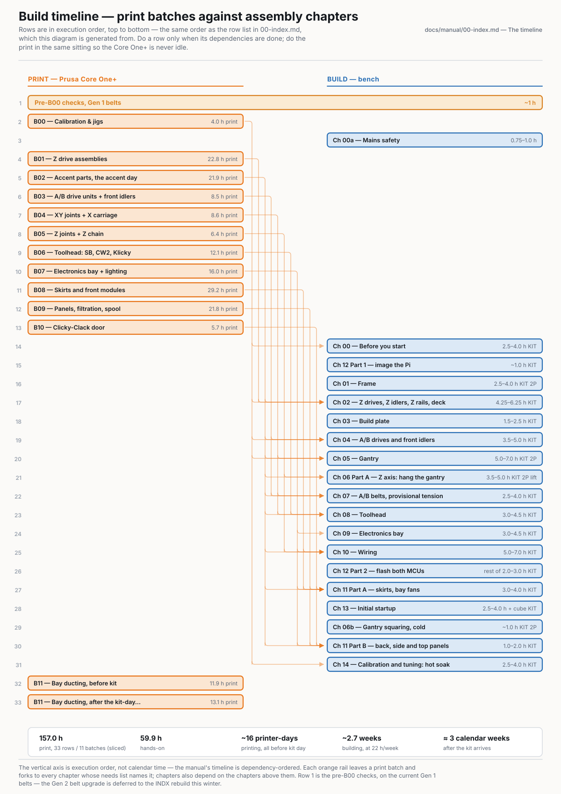

# Voron 2.4 350 — build manual

This is the single track for building an **LDO Voron 2.4 R2 Rev D+, 350 mm, blue** (Fabreeko F6424626) — the official Voron and Stealthburner manuals, the LDO Rev D guides and the Rev D+ corrections consolidated into one Prusa-style set of numbered steps.

Every printed part is made here, on a **Prusa Core One+** (Gen 2 belts), in Prusament ASA Galaxy Black with a Prusa Orange accent: 27 plates, 157.1 h, 1813 g black + 279 g orange.

Start at [**Ch 00 — Before you start**](00-before-you-start.md) if the kit has landed, and at [**print/00-slicer-setup.md**](print/00-slicer-setup.md) if it has not — all eleven print batches can run before the Voron arrives.

Keep two pages open at the bench: [**Tonight**](00-tonight.md), a fresh 30/60/90-minute session planner built from every chapter's `Time:` and `Pause:` lines, for deciding what fits in the time you have; and the print pages — [checklists](../print/checklists.md) and [bin labels with QR codes](../print/bin-labels.md) — for the garage bench where a tablet doesn't survive.

---

## The timeline

Rows are in execution order. Do a row only when its **needs** are satisfied; do the *While it prints* work in the same sitting so the Core One+ is never idle and no chapter waits on a part.

Markers: **KIT** = needs the Voron kit to have arrived · **2P** = two people · **2P lift** = the gantry lift, genuinely two people. Batches are B00–B10; plates are `B00-P1` too (two-digit batch, plate number unpadded).

- **1 · Print** — [B00 — Calibration & jigs](print/B00-calibration-and-jigs.md) · 4.0 h print · needs: —
    - *While it prints:* Dry a spool, read [00-slicer-setup](print/00-slicer-setup.md), verify the flat reference
    - *Gate:* Seven-item calibration gate: cube X/Y ±0.15 mm, 625-2RS bore press-fit, first layer, heat-set coupon
    - *Sessions:* —
- **2 · Build** — [Ch 00 — Before you start](00-before-you-start.md) **KIT** · 2.5–4.0 · needs: B00, kit
    - *While it prints:* B01 on the Prusa
    - *Gate:* Checkpoint 00: deck panel calipered, all seven rails cleaned and greased, both Discord questions posted
    - *Sessions:* 7 × ~30 min
- **3 · Print** — [B01 — Z drive assemblies](print/B01-z-drive-assemblies.md) · 22.8 h print · needs: B00
    - *While it prints:* Ch 01 Frame
    - *Gate:* Batch gate, then the heat-set pass on every drive part
    - *Sessions:* —
- **4 · Build** — [Ch 01 — Frame](01-frame.md) **KIT 2P** · 2.5–4.0 · needs: Ch 00
    - *While it prints:* B01 continues
    - *Gate:* Checkpoint 01: diagonals equal, frame square on the verified-flat counter
    - *Sessions:* 4 × ~30 min
- **5 · Print** — [B02 — Accent parts, the orange day](print/B02-accent-parts-orange.md) · 21.8 h print · needs: B00
    - *While it prints:* Nothing new — Ch 02 is blocked until B02-P1 and B02-P3 land. This stall is exactly what printing ahead of the kit removes
    - *Gate:* B02-P1 and B02-P3 in hand, inserts in
    - *Sessions:* —
- **6 · Build** — [Ch 02 — Z drives, Z idlers, Z rails, deck](02-z-drives.md) **KIT** · 4.25–6.25 · needs: Ch 01; B00, B01, **B02-P1**, **B02-P3**
    - *While it prints:* B03
    - *Gate:* Checkpoint 02: four Z carriages move freely, deck in, every set screw threadlocked on the flat
    - *Sessions:* 11 × ~30 min
- **7 · Print** — [B03 — A/B drive units + front idlers](print/B03-ab-drive-units-and-front-idlers.md) · 8.5 h print · needs: B00, B02
    - *While it prints:* Ch 03 Build plate
    - *Gate:* Bearing-seat test on a drive frame
    - *Sessions:* —
- **8 · Build** — [Ch 03 — Build plate](03-build-plate.md) **KIT** · 1.5–2.5 · needs: Ch 01, Ch 02
    - *While it prints:* B03, then B04
    - *Gate:* Checkpoint 03: magnet applied **and** its bolt holes trimmed straight after, plate bolted, three cables hanging below deck
    - *Sessions:* 4 × ~30 min
- **9 · Print** — [B04 — XY joints + X carriage](print/B04-xy-joints-and-x-carriage.md) · 8.6 h print · needs: B00, B02, B03
    - *While it prints:* Ch 04
    - *Gate:* Heat-set pass. `probe_retainer_bracket` off this plate is fitted in Ch 07/08, not in a batch
    - *Sessions:* —
- **10 · Build** — [Ch 04 — A/B drives and front idlers](04-ab-drives.md) **KIT** · 3.5–5.0 · needs: Ch 01; B00, **B02-P2**, B03
    - *While it prints:* B04
    - *Gate:* Checkpoint 04: A = rear right, B = rear left; both pulley heights set with `pulley_jig`
    - *Sessions:* 6 × ~30 min
- **11 · Print** — [B05 — Z joints + Z chain](print/B05-z-joints-and-z-chain.md) · 6.4 h print · needs: B00, B02, B04
    - *While it prints:* Ch 05 Gantry
    - *Gate:* Heat-set pass
    - *Sessions:* —
- **12 · Build** — [Ch 05 — Gantry](05-gantry.md) **KIT 2P** · 5.0–7.0 · needs: Ch 00 rails, Ch 04; **B02-P3**, B04
    - *While it prints:* B05, then B06
    - *Gate:* Checkpoint 05: titanium backers fitted **before** the XY joints are torqued (survey W2); X carriage runs full travel
    - *Sessions:* 12 × ~30 min
- **13 · Print** — [B06 — Toolhead: SB, CW2, Klicky](print/B06-toolhead-sb-cw2-klicky.md) · 12.2 h print · needs: B00, B02, B04
    - *While it prints:* Ch 06 Part A
    - *Gate:* Heat-set pass
    - *Sessions:* —
- **14 · Build** — [Ch 06 Part A — Z axis: hang the gantry, Z belts](06-z-axis-and-gantry-squaring.md#part-a-chapter-06-z-axis-mechanical) **KIT 2P lift** · 3.5–5.0 · needs: Ch 02, Ch 05; B02, B05
    - *While it prints:* B06
    - *Gate:* Checkpoint 06: gantry travels its full Z range by hand, four Z belts even by ear
    - *Sessions:* 8 × ~30 min
- **15 · Print** — [B07 — Electronics bay + lighting](print/B07-electronics-bay-and-lighting.md) · 16.0 h print · needs: B00
    - *While it prints:* Ch 07 A/B belts
    - *Gate:* Heat-set pass. This plate now carries `power_inlet_IECGS_1mm` and the **V2** `usb_adapter_mount_partial_cover`
    - *Sessions:* —
- **16 · Build** — [Ch 07 — A/B belts, provisional tension](07-ab-belts.md) **KIT** · 2.5–4.0 · needs: Ch 04, Ch 05, Ch 06 Part A; B02, B03, B04, B05
    - *While it prints:* B07
    - *Gate:* Checkpoint 07: both belts ~110 Hz and equal after moving the gantry — **provisional**, Ch 06b releases it again
    - *Sessions:* 5 × ~30 min
- **17 · Both** — **Gen 2 belt-upgrade pause** on the Core One+ · ~1 day wall clock · needs: B07 finished, B08 not started
    - *While it prints:* Ch 08 Toolhead — the Prusa is apart anyway
    - *Gate:* Firmware ≥ 6.9.0, re-tension and re-square, self-test + input shaper, first-layer cal, then **re-print `Voron_Design_Cube_v7` and re-measure** before B08
    - *Sessions:* —
- **18 · Build** — [Ch 08 — Toolhead](08-toolhead.md) **KIT** · 3.0–4.5 · needs: Ch 05, Ch 07; B02, B04, B06
    - *While it prints:* the Gen 2 pause, then B08
    - *Gate:* Checkpoint 08: inductive probe built and Klicky bagged, every toolhead connector seated, ESD ground lead on
    - *Sessions:* 10 × ~30 min
- **19 · Print** — [B08 — Skirts and front modules](print/B08-skirts-and-front-modules.md) · 29.1 h print · needs: B00, B02, B07; Gen 2 cube gate re-passed
    - *While it prints:* Ch 09 Electronics bay
    - *Gate:* Skirt faces flat with no lift; heat-set pass
    - *Sessions:* —
- **20 · Build** — [Ch 00a — Mains safety](00a-mains-safety.md) · 0.75–1.0 · needs: Ch 00
    - *While it prints:* B08 continues
    - *Gate:* Checkpoint 00a: mains-work owner and room rule written down, meter tested live and dead, "what to do when it smokes/trips/bites" decided
    - *Sessions:* 2 × ~30 min
- **21 · Build** — [Ch 09 — Electronics bay](09-electronics-bay.md) **KIT** · 2.5–4.0 · needs: Ch 01–03, Ch 06, Ch 00a; B07
    - *While it prints:* B08
    - *Gate:* Checkpoint 09: DIN rails **left-to-right**, everything mounted, nothing wired yet
    - *Sessions:* 7 × ~30 min
- **22 · Build** — [Ch 12 Part 1 — image the Pi, install Klipper/Moonraker/Fluidd](12-software.md) **KIT** · ~1.0 of Ch 12's 2.0–3.0 · needs: the Pi only — no hardware gate
    - *While it prints:* B08
    - *Gate:* Pi on the network, web UI up, bench-powered from USB-C
    - *Sessions:* 2 × ~30 min
- **23 · Build** — [Ch 10 — Wiring](10-wiring.md) **KIT** · 5.0–7.0 · needs: Ch 03, Ch 06, Ch 07, Ch 08, Ch 09; B05, B07
    - *While it prints:* B08 finishing, then B09
    - *Gate:* **LDO Checkpoint #1** — multimeter, machine unplugged. Hard gate: the bay does not close until it passes (survey W8)
    - *Sessions:* 14 × ~30 min
- **24 · Print** — [B09 — Panels, filtration, spool](print/B09-panels-filtration-spool.md) · 21.9 h print · needs: B00, B08
    - *While it prints:* Ch 12 Part 2
    - *Gate:* Panel-clip fit test on an offcut
    - *Sessions:* —
- **25 · Build** — [Ch 12 Part 2 — flash both MCUs, `printer.cfg` for a 350 Rev D+](12-software.md) **KIT** · the rest of 2.0–3.0 · needs: Ch 10
    - *While it prints:* B09
    - *Gate:* Checkpoint 12: toolboard ID reads `stm32g0b1xx` (survey W13); every 350 mm value uncommented (survey W14)
    - *Sessions:* 7 × ~30 min
- **26 · Print** — [B10 — Clicky-Clack door](print/B10-clicky-clack-door.md) · 5.7 h print · needs: B00, B02, B09
    - *While it prints:* Ch 11 Part A
    - *Gate:* Door panel fit, magnets seated, orange `Handle` from B02 to hand
    - *Sessions:* —
- **27 · Build** — [Ch 11 Part A — skirts, bay fans, bottom panel, Z belt covers, Nevermore, spool](11-skirts-panels-door.md#part-a-before-first-power-up) **KIT** · 3.0–4.0 · needs: Ch 10 Checkpoint #1; B02, B07, B08, B09
    - *While it prints:* B10
    - *Gate:* Bay closed. **Back, side and top panels and the door stay off** — Ch 13 and Ch 06b need to reach the gantry
    - *Sessions:* 12 × ~30 min
- **28 · Build** — [Ch 13 — Initial startup](13-initial-startup.md) **KIT** · 2.5–4.0 plus ~1 h cube print · needs: Ch 06 Part A, Ch 07, Ch 10, Ch 11 Part A, Ch 12
    - *While it prints:* Printer idle — all 27 plates are done
    - *Gate:* Checkpoint 13: hot `PROBE_ACCURACY` σ < 0.003 mm, QGL converged, Z=0 set, cube printed and kept
    - *Sessions:* 11 × ~30 min
- **29 · Build** — [Ch 06b — Gantry squaring](06-z-axis-and-gantry-squaring.md#part-b-chapter-06b-gantry-squaring) **KIT 2P** · ~1.0 plus a 1½–2 h soak · needs: Ch 13 Step 13.34
    - *Gate:* Checkpoint 06b: QGL converges three to five runs in a row; A/B re-tensioned, then Ch 13 Step 13.35 re-QGLs
    - *Sessions:* 1 × ~30 min
- **30 · Build** — [Ch 11 Part B — back, side and top panels, Clicky-Clack door](11-skirts-panels-door.md#part-b-after-ch-13) **KIT** · 1.0–2.0 · needs: Ch 13, Ch 06b; B02 `Handle`, B09, B10
    - *Gate:* Chamber reaches the 50–60 °C band with the door shut
    - *Sessions:* 5 × ~30 min
- **31 · Build** — [Ch 14 — Calibration and tuning](14-calibration.md) **KIT** · 2.5–4.0 over 6–8 h · needs: Ch 13, Ch 06b, Ch 11 Part B (the chamber has to close)
    - *Gate:* Checkpoint 14 and the tuning log filled in
    - *Sessions:* 13 × ~30 min

**Baseline vs. row 17.** The plan is to do the Gen 1 → Gen 2 belt upgrade *before* B00, so the whole Voron run prints on GT1.5. Row 17 is the contingency for an upgrade kit that turns up mid-run: pause at the end of B07, because B08–B10 are 12 of the 27 plates and hold every surface anyone will ever look at ([print plan §8](../voron-print-plan.md)). Second-best boundary is before B02, whose plate P1 carries the Stealthburner body.

**Dependencies inside B02.** The orange day prints once, but its plates are consumed at five different times: **B02-P1 + B02-P3** gate Ch 02 (Z drive baseplates, belt tensioners, Z tensioners); the cable bridge and endstop pod off P3 go to Ch 05; the Stealthburner accent parts off P1 and P3 go to Ch 08; **B02-P2** gates Ch 04 (A/B tensioners); the Z belt clips and chain retainers gate Ch 06 Part A; and the belt guards, fan grills, keystone blank, TFT faceplate and door `Handle` are not needed until Ch 11.

---

## Critical path

| | |
|---|---|
| Print time | **157.1 h** across 27 plates in 11 batches (1813 g black, 279 g orange) |
| Hands-on time | **59.5 h** — the sum of the chapter Time midpoints, Ch 06b's extra hour included (Ch 02 lost the 45 min of rail prep to Ch 00) |
| Printing, elapsed | **~15 printer-days ≈ 2–2.5 weeks** (swap-limited, ~10 print-hours/day). The floor is 6.5 days if you change plates the minute each one ends |
| Building, elapsed | **~2.7 weeks ≈ 3 weeks** at 22 h/week |
| **(a) After the Prusa is running** | **≈ 5–5.5 calendar weeks** — ~2–2.5 weeks printing all 27 plates while the kit ships, then ~3 weeks of build |
| **(b) After the kit arrives** | **≈ 3 calendar weeks** — if B00–B07 are already printed when it lands, nothing waits on plastic; B08–B10 print under Ch 09, Ch 10 and Ch 12 |

**≈ 141 sessions of ~30 min** — the sum of every chapter's `Sessions:` line (Ch 00, 00a–14, 06b and both parts of 11 and 12 counted once each).

Assumptions: 22 h/week of hands-on (2 h on each of five weekdays, 6 h on each of two weekend days), the Core One+ printing unattended overnight with about two plate swaps a day, no reprints beyond the plan's 24 % filament margin, the Gen 2 pause costing about a day, and the kit landing before the print run ends.

---

## Chapters

### Assembly

| Chapter | Scope | Time (h) | Sessions | Prerequisites |
|---|---|---|---|---|
| [00 — Before you start](00-before-you-start.md) | Inventory against the BOM, tools, flat reference, heat-set practice, clean and grease all seven rails | 2.5–4.0 | 7 × ~30 min | The kit; B00 (`Heatset_Practice`, both rail guides) |
| [00a — Mains safety](00a-mains-safety.md) | Decide who does the mains work, buy and test the meter, agree the who's-in-the-room and smoke/trip/bite rules — read before Ch 09 | 0.75–1.0 | 2 × ~30 min | Ch 00. No printed part required |
| [01 — Frame](01-frame.md) | 2020 frame and the two bed extrusions, squared on a verified-flat surface | 2.5–4.0 | 4 × ~30 min | Ch 00. No printed part required |
| [02 — Z drives, Z idlers, Z rails, deck](02-z-drives.md) | Four Z drives, four Z idlers, four Z rails, deck panel and supports | 4.25–6.25 | 11 × ~30 min | Ch 01; B00, B01, B02-P1, B02-P3 |
| [03 — Build plate](03-build-plate.md) | 355×355×10 mm plate, magnet sheet, bed harness dressed below deck | 1.5–2.5 | 4 × ~30 min | Ch 01, Ch 02. No printed part required |
| [04 — A/B drives and front idlers](04-ab-drives.md) | The four CoreXY sub-assemblies that carry the A and B belts | 3.5–5.0 | 6 × ~30 min | Ch 01; B00 (`pulley_jig`), B02-P2, B03 |
| [05 — Gantry](05-gantry.md) | X and Y axes, both XY joints, X carriage, titanium backers | 5.0–7.0 | 12 × ~30 min | Ch 00 rails, Ch 04; B02-P3, B04 |
| [06 Part A — Z axis](06-z-axis-and-gantry-squaring.md#part-a-chapter-06-z-axis-mechanical) | Hang the gantry on the Z joints, belt all four Z corners | 3.5–5.0 | 8 × ~30 min | Ch 02, Ch 05; B02, B05 |
| [06b — Gantry squaring](06-z-axis-and-gantry-squaring.md#part-b-chapter-06b-gantry-squaring) | The real squaring pass — needs motor control, so it runs out of Ch 13 | ~1.0 + soak | 1 × ~30 min | Ch 13 Step 13.34 |
| [07 — A/B belts](07-ab-belts.md) | Cut, route and clamp both CoreXY belts; provisional tension; inductive probe on the carriage | 2.5–4.0 | 5 × ~30 min | Ch 04, Ch 05, Ch 06 Part A; B02, B03, B04, B05 |
| [08 — Toolhead](08-toolhead.md) | Stealthburner, Clockwork 2, Revo HF, Nitehawk-SB V2, hung on the carriage | 3.0–4.5 | 10 × ~30 min | Ch 05, Ch 07; B02, B04, B06 |
| [09 — Electronics bay](09-electronics-bay.md) | DIN rails, ducts, PSU, SSR, Leviathan and Pi, mains inlet, WAGOs, both endstops — mounted, not wired | 2.5–4.0 | 7 × ~30 min | Ch 01–03, Ch 06, Ch 00a; B07 |
| [10 — Wiring](10-wiring.md) | Every harness, ending at LDO Checkpoint #1 | 5.0–7.0 | 14 × ~30 min | Ch 03, Ch 06, Ch 07, Ch 08, Ch 09; B05, B07 |
| [11 — Skirts, panels, door, filtration](11-skirts-panels-door.md) | Part A closes the bay; Part B fits the back, side and top panels and the Clicky-Clack door after Ch 13 | 3.0–4.0 + 1.0–2.0 | 12 + 5 × ~30 min | Part A: Ch 10 + Checkpoint #1; B02, B07, B08, B09. Part B also Ch 13, Ch 06b; B09, B10, B02 `Handle` |
| [12 — Software](12-software.md) | Pi image, Klipper/Moonraker/Mainsail, both MCUs flashed, `printer.cfg` for a 350 Rev D+ | 2.0–3.0 | 9 × ~30 min | Part 1: none. Part 2: Ch 10 + Checkpoint #1. No printed part required |
| [13 — Initial startup](13-initial-startup.md) | First power-on through temps, fans, motors, endstops, homing, PID, QGL, Z=0, bed mesh and the first cube | 2.5–4.0 | 11 × ~30 min | Ch 06 Part A, Ch 07, Ch 10, Ch 11 Part A, Ch 12. No printed part required |
| [14 — Calibration and tuning](14-calibration.md) | Final belt tension, rotation distance, chamber and `PRINT_START`, cube measurement, input shaper, PA, flow | 2.5–4.0 | 13 × ~30 min | Ch 13, Ch 06b, Ch 12; the B00 reference cube and Ch 13's cube |

### Reference

| Chapter | Scope |
|---|---|
| [15 — Troubleshooting index](15-troubleshooting.md) | Symptom-first lookup into the fix already owned by a step, checkpoint or callout in Ch 00–14 |
| [16 — Glossary](16-glossary.md) | Every term the manual uses without stopping to define it, with the chapter or step it first matters at |

### Print batches

Full table with grams and plate counts: [print/README.md](print/README.md). Profile, overrides and the calibration gate: [print/00-slicer-setup.md](print/00-slicer-setup.md).

| Batch | Scope | Plates · hours | Prerequisites |
|---|---|---|---|
| [B00 — Calibration & jigs](print/B00-calibration-and-jigs.md) | Test cube, heat-set coupon, rail guides, pulley jig, bed and panel templates | 1 · 4.0 | None. The calibration gate for every batch after it |
| [B01 — Z drive assemblies](print/B01-z-drive-assemblies.md) | Z drive bodies, retainers, motor mounts, Z tensioner brackets, deck supports | 2 · 22.8 | B00 |
| [B02 — Accent parts, orange](print/B02-accent-parts-orange.md) | Every orange part in the build, in one session | 3 · 21.8 | B00 |
| [B03 — A/B drive units + front idlers](print/B03-ab-drive-units-and-front-idlers.md) | A and B drive frames, both front idler pairs | 2 · 8.5 | B00 |
| [B04 — XY joints + X carriage](print/B04-xy-joints-and-x-carriage.md) | MGN12 XY joint set, X carriage halves, `probe_retainer_bracket` | 1 · 8.6 | B00, B02, B03 |
| [B05 — Z joints + Z chain](print/B05-z-joints-and-z-chain.md) | Upper and lower Z joints, Z chain anchor and guide | 1 · 6.4 | B00, B02, B04 |
| [B06 — Toolhead](print/B06-toolhead-sb-cw2-klicky.md) | Stealthburner, Clockwork 2, `cw2_captive_pcb_cover`, the Klicky set | 2 · 12.2 | B00, B02, B04 |
| [B07 — Electronics bay + lighting](print/B07-electronics-bay-and-lighting.md) | WAGO and PSU mounts, DIN clips, eight COB mounts, `power_inlet_IECGS_1mm`, `usb_adapter_mount_partial_cover` | 3 · 16.0 | B00 |
| [B08 — Skirts and front modules](print/B08-skirts-and-front-modules.md) | The 350 skirt set, front touchscreen module, grills and guards | 6 · 29.1 | B00, B02, B07 |
| [B09 — Panels, filtration, spool](print/B09-panels-filtration-spool.md) | Panel clips, Z belt covers, Nevermore Micro V5 Duo, spool holder | 5 · 21.9 | B00, B08 |
| [B10 — Clicky-Clack door](print/B10-clicky-clack-door.md) | The door set, plus the orange `Handle` from B02 | 1 · 5.7 | B00, B02, B09 |

---

## Every step links to its source

Every step ends with a `Source:` line naming the exact manual page, LDO doc or print-plan section it was transcribed from, pinned to a specific commit for GitHub-hosted files so the link doesn't drift under you. If a step's text and its Source line disagree, or the source itself looks wrong, file a correction with the [correction issue template](https://github.com/alexlicohen/voron-24-350-build-manual/issues/new/choose) rather than editing the step from memory.

---

## Corrections log

What the kit actually is, where it differs from the published documents, and which chapter holds the detail. This is the list to re-check whenever LDO updates its docs.

To add a row: append it with the next `#`, today's date, and fill "Source that was wrong" / "Verified against" only when the correction actually names them — otherwise leave `—` rather than guessing.

| # | Date | Correction | Source that was wrong | Detail lives in | Verified against |
|---|---|---|---|---|---|
| 1 | 2026-09-05 | **Rev D+ = Nitehawk-SB V2.** The difference is electrical apart from one printed part: the V2 repo's `usb_adapter_mount_partial_cover.stl` (it exposes a mounting point for the ground lug), not the V1 `usb_adapter_mount.stl` | — | [Ch 09 Step 09.25](09-electronics-bay.md); flagged in Ch 00; printed in [B07](print/B07-electronics-bay-and-lighting.md) | — |
| 2 | 2026-09-05 | **The magnet sheet is user-applied**, and its bolt holes are trimmed immediately after — not later | — | [Ch 03 Step 03.9](03-build-plate.md) | — |
| 3 | 2026-09-05 | **Both probes ship. Build the inductive one.** Omron inductive for QGL, LDO nozzle probe for Z=0; the Klicky parts get printed and bagged | — | [Ch 08 Step 08.54](08-toolhead.md); config in [Ch 12](12-software.md) | — |
| 4 | 2026-09-05 | **DIN rails run left-to-right**, per LDO — the official manual runs them front-to-back | Official Voron 2.4r2 assembly manual (front-to-back routing) | [Ch 09 Step 09.5](09-electronics-bay.md) | LDO Rev D build docs |
| 5 | 2026-09-05 | **Which Leviathan you have is contested**: STM32F446 (V1.1/V1.2) or STM32H743 (V1.3). Processor, clock and bootloader offset all differ; settle it from the board, not from a document | — | [Ch 12 Step 12.13](12-software.md) | The physical board (STM32 marking), not a document |
| 6 | 2026-09-05 | **The Nitehawk-SB V2 ESD grounding scheme** shipped as three images with no prose until LDO's board doc was updated **2026-07-10**. Treat grounding as a required build step | LDO Nitehawk-SB V2 board doc (pre-2026-07-10, images only, no prose) | [Ch 10 Step 10.58](10-wiring.md); also Ch 08 | LDO board doc, updated 2026-07-10 |
| 7 | 2026-09-05 | **Deck panel: 3 mm or 4 mm.** LDO's guides say 4 mm, LDO's own BOM says 3 mm. Your caliper decides which `deck_support_*` you print | LDO guides (4 mm) vs. LDO's own BOM (3 mm) — internally inconsistent | [Ch 02 Step 02.12](02-z-drives.md); measured at Ch 00 | Caliper measurement of your kit's deck panel |
| 8 | 2026-09-05 | **PrusaSlicer shrinkage compensation and XY size compensation must both be zero.** Voron parts are already drawn for ABS/ASA shrinkage; compensating again ruins every bearing fit | — | [print/00-slicer-setup.md](print/00-slicer-setup.md) | — |
| 9 | 2026-09-05 | **Four GT2 20T 9 mm idlers are consumed in Ch 02** on the Z tensioners; the two XY joints need two more. Do not raid the bag early | — | [Ch 02 Step 02.40](02-z-drives.md); consumed again in [Ch 05](05-gantry.md) | — |
| 10 | 2026-09-05 | **A = rear right, B = rear left**, so the A idler is the front-right pair and the B idler the front-left pair. B03's plate captions have the pairing the wrong way round | B03 plate captions (this manual, pre-fix) | [Ch 04 Step 04.2](04-ab-drives.md); belt paths in [Ch 07](07-ab-belts.md) | Ch 04 Step 04.2 A/B convention |
| 11 | 2026-09-05 | **`power_inlet_IECGS_1mm` prints in B07, not B08** — it is fitted in the electronics bay at manual p.156/167, not with the skirts. It needs its **own plate B07-P3**: with 3 mm brims it will not fit beside the eight COB mounts (84 % bed fill). B07 is 3 plates, and the build is **27 plates / 134.3 h at the time (re-estimated by slicing to 157.1 h, row 20)** | — | [Ch 09](09-electronics-bay.md); [B07](print/B07-electronics-bay-and-lighting.md) | — |
| 12 | 2026-09-05 | **625-2RS is the Z-drive bearing (16 mm OD); F695 is the A/B-drive, front-idler and XY-joint bearing (13 mm OD).** Both are 5 mm bore, so you cannot sort them by bore. The B00 press-fit gate tests a **625-2RS** seat | — | [print/00-slicer-setup.md](print/00-slicer-setup.md); [B01](print/B01-z-drive-assemblies.md), [B03](print/B03-ab-drive-units-and-front-idlers.md), [Ch 00](00-before-you-start.md), [Ch 02](02-z-drives.md), [Ch 04](04-ab-drives.md) | — |
| 13 | 2026-09-05 | **A/B motor pulleys are GT2 20T ×2 in the 6 mm width.** The kit's four 9 mm 20T pulleys are all Z-drive parts — using one on an A/B motor steals a Z pulley and puts a 9 mm pulley in the 6 mm belt plane an F695 pair forms | — | [Ch 04 Step 04.24](04-ab-drives.md); Z pulleys at [Ch 02](02-z-drives.md) | — |
| 14 | 2026-09-05 | **Bed extrusions: 130 mm is the clear gap between inner faces**, i.e. 65 mm each side of the centreline and **150 mm centre-to-centre**. Manual p.20's dimension lines land on the inner faces | — | [Ch 01 Step 01.19](01-frame.md); checked at [Ch 03 Step 03.11](03-build-plate.md) | Ch 03 Step 03.11 build-plate fit check |
| 15 | 2026-09-05 | **The rails are 400 mm, not the manual's 250-spec length.** ~10 M3×8 + T-nuts per MGN9 Y rail, ~8 for the MGN12 X rail — count the holes; every other hole | Official Voron 2.4r2 assembly manual (specifies 250 mm rails) | [Ch 05 Steps 05.10–05.12, 05.32–05.33](05-gantry.md); same rule at [Ch 02](02-z-drives.md) | Hole count on the 400 mm rails as received |
| 16 | 2026-09-05 | **Rails are cleaned and greased once, in Ch 00.** Ch 02 only verifies; the DIN rails are installed once, in Ch 09 Step 09.5, and Ch 02 only stages their T-nuts | — | [Ch 00 Steps 00.18–00.21](00-before-you-start.md), [Ch 02 Steps 02.05 / 02.15](02-z-drives.md), [Ch 09 Step 09.5](09-electronics-bay.md) | — |
| 17 | 2026-09-05 | **Printer preset is `Prusa CORE One 0.4 nozzle`** — the CORE One family dropped the "Original" prefix, so a search for "Original Prusa CORE One" finds nothing | — | [print/00-slicer-setup.md](print/00-slicer-setup.md) | — |
| 18 | 2026-09-05 | **Rotating a part about Z to fit the plate is allowed**; changing which face sits on the bed is not. B08-P1 cannot be sliced without a 90° Z rotation of `side_fan_support` | — | [print/00-slicer-setup.md](print/00-slicer-setup.md); [B08](print/B08-skirts-and-front-modules.md) | — |
| 19 | 2026-09-05 | **PrusaSlicer version posture:** 2.9.6 for the dimension-critical batches (B00 gate, B01, B03–B06); the 3.0 preview is acceptable for B08–B10 with overrides re-entered by hand. Any toolchain change re-runs the B00 gate | — | [print/00-slicer-setup.md](print/00-slicer-setup.md#prusaslicer-30-preview) | — |
| 20 | 2026-09-05 | **Print estimates now from PrusaSlicer 2.9.6 slices (were a throughput model).** Totals moved to 27 plates, 157.1 h, 1813 g black + 279 g orange | Throughput-model estimate (this manual, pre-fix) | `print/README.md` | Sliced `.3mf` project per plate (`slicer/estimates.csv`) |
| 21 | 2026-09-05 | **HF 0.4 nozzle: slicer profiles use the Core One HF presets** — `Prusa CORE One HF0.4 nozzle` printer preset and `Prusament ASA @COREONE HF0.4` filament preset, both hotter and faster than their non-HF equivalents | — | [print/00-slicer-setup.md](print/00-slicer-setup.md) | — |

---

## How to update this manual

1. Everything is markdown under `docs/`; one chapter per file, `docs/manual/NN-slug.md`, print batches in `docs/manual/print/`.
2. Serve it to the iPad with `./scripts/serve.sh` and read it at the bench on the LAN URL.
3. Chapter format — header block, `### Step NN.M`, Parts / Do / Check, `⚠ Rev D+ / LDO:` callouts, Checkpoint, Common mistakes — is fixed by [CONVENTIONS.md](CONVENTIONS.md). Follow it exactly.
4. A new correction goes in **two** places: the log above (one row, with the chapter link) and inline at the step it affects, as a `⚠ Rev D+ / LDO:` callout. Never only in a preamble.
5. [`docs/voron-print-plan.md`](../voron-print-plan.md) and [`docs/voron-build-instructions-survey.md`](../voron-build-instructions-survey.md) are the sources these chapters were written from — change them first when a fact moves, then the chapters, then this page.
