# Chapter 01 — Frame

Builds the 2020 frame — bottom square, four verticals, top square — plus the two bed extrusions, squared on a verified-flat surface. Unlocks Ch 02 (Z drives) and Ch 03 (build plate), and fixes the squareness every later axis inherits.

**What you're building in this chapter:** the box the whole printer hangs off, out of 2020 aluminium extrusion — 20 × 20 mm bars with a T-slot down each face, so anything can be bolted anywhere along them. Three sub-assemblies. The **bottom square** is four horizontal extrusions joined by the four **verticals** that stand in its corners; the **top square** is four more horizontals closing the cube at the top. Every one of those sixteen corners is a *blind joint* — a screw threaded into the end of the horizontal, its head hidden inside the vertical's slot, tightened through a small access hole in the vertical's side. The **bed extrusions** are two more horizontals running front to back across the base, left and right of centre, carried on corner brackets from the front and rear bottom rails; the heated build plate sits on them in Ch 03, and their spacing has to match the plate's own mounting holes. Everything is assembled loose, squared with a tape measure and a mallet, and only then tightened — because a bolt taken to full torque locks in whatever error was there when you tightened it.

**Time:** 2.5–4.0 h hands-on, first build, two people ([survey §5.1 P01 / §7.2](../voron-build-instructions-survey.md)).

**Sessions:** 4 × ~30 min — the `Pause:` lines below break the chapter into 4 segments; every minute figure is a first-build estimate.

**Prerequisites:**

- **Ch 00** — inventory, extrusions counted, tools to hand.
- **Print batches: none gate this chapter.** No printed part is required for the frame; you can square it the day the kit lands ([print plan §2](../voron-print-plan.md)). Put batch **B00** (calibration & jigs, plate B00-P1, 4.0 h) on the Prusa while you build — it is the calibration gate for every batch after it.

**Tools**

- 3 mm hex key, straight, long-arm — the kit's 3 mm L-wrench (the Fabreeko precision set is ball-end) — for the 16 M5×16 BHCS blind joints; the access hole is in line with the bolt, so no ball end is needed and a straight key is better for the torque pass. A 3 mm ball-end is optional for the first snug
- Machinist square, 150 mm, DIN 875/2 or better
- Steel rule 300 mm, plus a steel tape ≥1 m (a 350 frame's plan diagonal is ≈721 mm)
- Straightedge + feeler gauges, 0.02–0.10 mm — to re-check the reference surface (Step 01.1)
- Flat reference surface: the kitchen stone counter, verified (decision recorded in `CLAUDE.md` → Tools & metrology)
- Rubber or nylon mallet, for nudging the frame square
- Torque screwdriver 0.5–3 N·m — optional; the manual specifies no torque value
- Masking tape + marker (FRONT label, extrusion labels, log)

**Printed parts**

| STL | Qty | Colour |
|---|---|---|
| *none — this chapter needs no printed parts* | — | — |

**Hardware** (chapter totals)

| Fastener / part | Qty | Where |
|---|---|---|
| A extrusion | 10 | 4 bottom + 4 top frame (p.15–17), 2 bed (p.18–20) |
| B extrusion | 4 | verticals (p.15–16) |
| M5×16 BHCS | 20 | 16 frame blind joints + 4 corner brackets |
| Corner bracket | 4 | one per bed-extrusion end (p.18) |
| M5×10 BHCS | 4 | bed extrusions down to the frame (p.19) |
| **M5 precision spacer, brass** | 4 | under each M5×10 head — replaces the manual's "M5 shim" |
| M5 T-nut, roll-in | 4 | bottom rails, under the bed extrusions (p.19) |
| M3 T-nut, roll-in | 1 | fit test only (Step 01.3) — goes back in its bag |

C, D and E extrusions are sorted here but **not used** in this chapter — they are the gantry (manual p.85, p.88, p.101 → Ch 05).

**Read first**

- **Frame squaring is the one irreversible quality decision in this build.** Re-check after every tightening pass. Gantry racking, quad-gantry-level and bed mesh all inherit what you set here (survey §4.4 #1).
- Extrusion and roll-in T-nut tolerances are tight in this kit. LDO: *"Due to the tight tolerances of the extrusions and roll-in t-nuts it is advisable to either test fit before assembly to identify the sides of the extrusions that fits the best or to pre-load the t-nuts into the extrusions."* [src](https://docs.ldomotors.com/en/voron/voron2/build-faq)
- Every **"M5 shim"** in the official manual is a **brass M5 precision spacer** in this kit — here and for the rest of the build.
- **Titanium extrusion backers are NOT installed in this chapter.** They go onto the gantry's X and Y extrusions during **Ch 05**, on the face opposite the rail. Leave them bagged; fitting them to frame extrusions now would be wrong and fitting them after the gantry is assembled costs a teardown (survey §4.4 #3, §5.2 W2). This is the only place this note appears.
- Nothing here is printed. Build it the day the kit lands, while batch **B00** is still on the Prusa.

**Sources for this chapter:**

- [Voron 2.4r2 assembly manual (pinned `de7e89d`)](https://github.com/VoronDesign/Voron-2/blob/de7e89d/Manual/Assembly_Manual_2.4r2.pdf) pages 12–21 — extrusion sort, blind joints, bottom and top squares, bed extrusions, squareness check
- [LDO Build Notes (Rev D)](https://docs.ldomotors.com/voron/voron2/build-faq) — roll-in T-nut tolerance, and the brass M5 precision spacer substituted for every "M5 shim"
- [blind-joint video](https://voron.link/onjwmcd) and [frame squaring video](https://voron.link/kdtpzam) — the two videos the manual links from p.10 and p.21
- [whopping_Voron_mods — `extrusion_backers`](https://github.com/tanaes/whopping_Voron_mods/tree/main/extrusion_backers) — why the titanium backers are Ch 05 parts, not frame parts
- [survey](../voron-build-instructions-survey.md) §4.2, §4.4, §5.2

**Video coverage (Steve Builds, pre-release LDO kit — differs from Rev D+):** [Part 1 @0:54:42](https://www.youtube.com/watch?v=feTxcc0LIWM&list=PL0fUJbigELQPqpeGOgHYisG4KaSXVtnNY&t=3282s) (+2m), [Part 1 @0:55:46](https://www.youtube.com/watch?v=feTxcc0LIWM&list=PL0fUJbigELQPqpeGOgHYisG4KaSXVtnNY&t=3346s) (+19m), [Part 1 @1:14:12](https://www.youtube.com/watch?v=feTxcc0LIWM&list=PL0fUJbigELQPqpeGOgHYisG4KaSXVtnNY&t=4452s) (+14m), [Part 1 @1:29:00](https://www.youtube.com/watch?v=feTxcc0LIWM&list=PL0fUJbigELQPqpeGOgHYisG4KaSXVtnNY&t=5340s) (+19m), [Part 5 @3:14:50](https://www.youtube.com/watch?v=hTKCBrk36R0&list=PL0fUJbigELQPqpeGOgHYisG4KaSXVtnNY&t=11690s) (+2m)

---

### Step 01.1 — Verify the flat reference surface

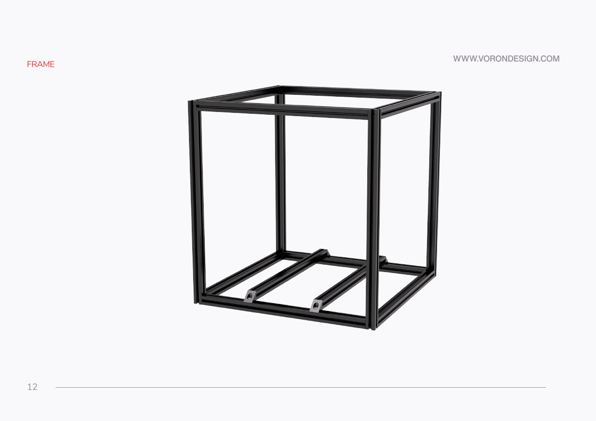

**What you're looking at:** Manual p.12 opens the frame section; on your bench it is the stone counter, a long straightedge and feeler gauges. This surface is the only reference the frame has — the extrusions are laid flat on it and squared against it, so any **twist** in the counter — one corner high — is copied permanently into the printer; a crown shows up as rock.

**Parts:** none.

**Do:** Re-clean the patch you masked at Step 00.10 — a single grain of grit under an extrusion is a squareness error and a scratch — and run the straightedge once more in the same five positions (left–right, front–back, both diagonals, centre) with the feelers. Use an island or peninsula, or pull the frame to the counter's front edge with the back corners still on stone: you must reach all four corners with the tape and the mallet, and the second person stands opposite you. Do not lay cloth, cardboard or foam under the frame; that defeats the reference. The manual asks only for "a glass or granite surface" (p.15), and this counter is the verified stand-in for a granite plate (`CLAUDE.md`, Tools & metrology).

**Check:** Worst gap no larger than the leaf you recorded at Step 00.10 (≤ 0.1 mm) and no rock of the straightedge. Write the number in the log (Step 01.22).

Tip: build with the frame's eventual front facing you and put a strip of masking tape on that face marked **FRONT**. The frame is symmetric at this stage so any face will do **until Step 01.18**: the bed extrusions run front-to-back (manual p.20 draws them that way; p.21 looks at the frame from the front with two brackets facing you), so FRONT must be one of the two faces their bracketed ends land on. Once named it is fixed — Ch 02's Z0–Z3 corner map, Ch 03 and Ch 09 all read against it.

Source: [Voron manual p.12](https://github.com/VoronDesign/Voron-2/blob/de7e89d/Manual/Assembly_Manual_2.4r2.pdf#page=12) · [Voron manual p.15](https://github.com/VoronDesign/Voron-2/blob/de7e89d/Manual/Assembly_Manual_2.4r2.pdf#page=15) · [Video: Part 1 @0:53:46](https://www.youtube.com/watch?v=feTxcc0LIWM&list=PL0fUJbigELQPqpeGOgHYisG4KaSXVtnNY&t=3226s)

---

### Step 01.2 — Sort the extrusions by length

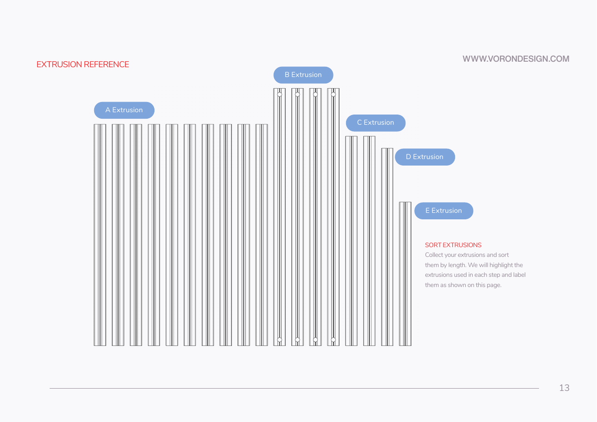

**What you're looking at:** Manual p.13 lays the eighteen aluminium extrusions out by length and gives each length a letter. These 2020 extrusions — 20 × 20 mm aluminium bars with a T-shaped slot down each face — are the printer's entire structure: **A** is the horizontal, **B** the vertical, and **C / D / E** belong to the gantry that moves above the bed in Ch 05.

**Parts:** all extrusions — A ×10, B ×4, C ×2, D ×1, E ×1 (counted off p.13).

**Do:** Lay every extrusion out and sort by length. Label each group A/B/C/D/E with masking tape — the manual uses these letters for the rest of the build and never repeats the lengths. Set C, D and E aside in a labelled bag, so a gantry extrusion cannot end up in a frame corner; they are Ch 05 parts (p.85, p.88, p.101).

**Check:** 10 A, 4 B, 2 C, 1 D, 1 E. The four B extrusions are the only ones with small round **access holes** near each end — that is how you tell them apart from the A extrusions at a glance.

Source: [Voron manual p.13](https://github.com/VoronDesign/Voron-2/blob/de7e89d/Manual/Assembly_Manual_2.4r2.pdf#page=13)

---

### Step 01.3 — Inspect the ends and test-fit a T-nut

**What you're looking at:** The same p.13 layout, plus one **roll-in T-nut** — a nut shaped to drop into an extrusion's slot and rotate a quarter turn to lock, which is how anything gets bolted to an extrusion after assembly ([glossary](16-glossary.md#r)). You are checking two things the frame cannot recover from: a burred end face, which stops two extrusions meeting square, and a slot that will not accept a nut.

**Parts:** 1× M5 roll-in T-nut and 1× M3 roll-in T-nut (for the fit test — both go back in their bags).

**Do:** Run a finger over every end face of the 10 A and 4 B extrusions. Any burr, swarf or anodising lip on an end face becomes a squareness error you cannot tune out later — knock it back with a fine file or a deburring blade and blow the chips out of the channels. Then roll the M5 nut into the top channel of the two A extrusions you will use as the front and rear bottom rails (they carry the bed brackets), and the **M3** nut into every channel of each B vertical — Ch 02 puts a Z rail on one face of each with M3 T-nuts, and a face that binds is easier to reject now than after the frame is torqued. Note which channels take the nut cleanly.

**Check:** Every end face sits flat against the machinist square blade with no rock. Every T-nut rolls in and rotates with finger pressure; each vertical has at least one face that takes the M3 nut cleanly, marked with tape.

⚠ Rev D+ / LDO: extrusion and roll-in T-nut tolerances are tight on this kit — LDO's advice is to test-fit *before* assembly and identify the best-fitting sides, or to pre-load T-nuts. If one refuses to rotate, use a different face or a different extrusion; do not force it. [src](https://docs.ldomotors.com/en/voron/voron2/build-faq)

Source: [Voron manual p.13](https://github.com/VoronDesign/Voron-2/blob/de7e89d/Manual/Assembly_Manual_2.4r2.pdf#page=13) · [LDO Build Notes (Rev D)](https://docs.ldomotors.com/voron/voron2/build-faq)

---

### Step 01.4 — Start an M5×16 BHCS in each end of eight A extrusions

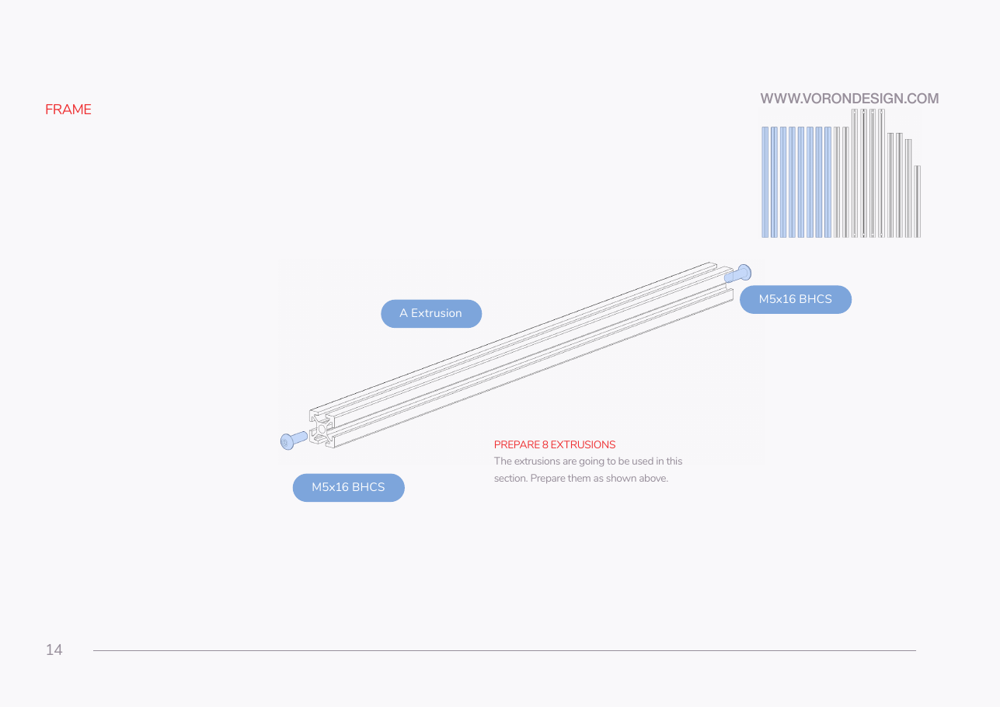

**What you're looking at:** Manual p.14 — eight A extrusions with an **M5×16 BHCS** (button head cap screw) started in the tapped bore in each end. The screw is threaded into the horizontal *first* because in the finished joint its head is hidden inside the vertical, where you can no longer start it.

**Parts:** 8× A extrusion, 16× M5×16 BHCS.

**Do:** Take 8 of the 10 A extrusions (the other 2 are the bed extrusions, Step 01.16). Thread one M5×16 BHCS into the tapped centre bore at **each** end — 16 bolts. Run each in until only the head plus **about 2 mm of shank** stands proud of the end face — just enough for the head to pass the slot lip and sit inside the vertical's channel. Do not leave them half out: the top square must drop between verticals that are already fixed 470 mm apart, and a bolt standing 8 mm proud will not go in. Leave them finger-loose.

**Check:** All 16 bolts start cleanly and all 16 heads stand proud by the same ~2 mm. A bolt that binds means a damaged thread in the extrusion end — fix it now, not with the frame half-built.

Source: [Voron manual p.14](https://github.com/VoronDesign/Voron-2/blob/de7e89d/Manual/Assembly_Manual_2.4r2.pdf#page=14)

---

### Step 01.5 — Understand the blind joint before you make one

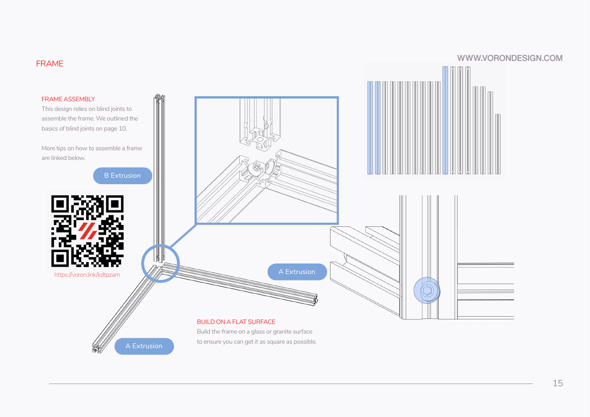

**What you're looking at:** Manual p.15 and p.10 — one horizontal and one vertical, dry-assembled. This is the **blind joint**: the screw's head slides into a slot of the vertical as the vertical goes on, and you tighten it through the small access hole drilled in the vertical's opposite face ([glossary](16-glossary.md#b)). Every one of the frame's sixteen corners is this joint, so understanding it once saves sixteen puzzles.

**Parts:** none — dry run.

**Do:** The joint works like this: the M5×16 is threaded into the **end bore of the horizontal**; its head is captured inside a **T-slot channel of the vertical**, entering from the vertical's open end as the vertical slides on; you tighten it with the 3 mm hex key through the small **access hole in the vertical's opposite face** — the hole is in line with the bolt, so a straight key goes onto the socket face-on. Take one prepared A extrusion and one B extrusion and try it once, on the bench, before the frame exists. Watch the linked guide if this is your first blind joint. [src](https://voron.link/onjwmcd) (manual p.10) That dry run is what gives you the rule for Step 01.7: **the access holes must end up facing outward**, because the two horizontals occupy the vertical's two inner faces.

**Check:** With the joint dry-assembled you can see the bolt socket through the access hole and get the 3 mm key straight onto it through the hole.

Source: [Voron manual p.15](https://github.com/VoronDesign/Voron-2/blob/de7e89d/Manual/Assembly_Manual_2.4r2.pdf#page=15) · [Voron manual p.10](https://github.com/VoronDesign/Voron-2/blob/de7e89d/Manual/Assembly_Manual_2.4r2.pdf#page=10) · [blind-joint video](https://voron.link/onjwmcd) · [Video: Part 1 @0:54:58](https://www.youtube.com/watch?v=feTxcc0LIWM&list=PL0fUJbigELQPqpeGOgHYisG4KaSXVtnNY&t=3298s)

Pause: ~40 min since the last pause — extrusions sorted and labelled A–E, all end faces deburred, 16 M5×16 BHCS started finger-loose in eight A extrusions, and one blind joint dry-run understood. Nothing is assembled. The next segment is the long one — the frame goes from loose extrusions to squared-and-torqued in ~65 min and cannot safely be broken in the middle, so start it with the time to finish it.

---

### Step 01.6 — Lay out the bottom square on the reference surface

**What you're looking at:** Manual p.15 — four A extrusions lying flat on the reference surface in a square, with a gap at each corner. The extrusions do not touch each other: the corner voids are where the four verticals drop in, and the vertical is what actually joins the two horizontals meeting there.

**Parts:** 4× A extrusion (prepared, from Step 01.4).

**Do:** Lay four A extrusions flat on the stone in a square, each end face pointing into the corner void where a vertical will drop in — the extrusions do not touch each other; the vertical fills each corner. Keep every part flat on the stone. Build here and nowhere else (manual p.15, "BUILD ON A FLAT SURFACE").

**Check:** All four extrusions lie dead flat with no gap under any of them. The four corner voids are square and roughly 20 × 20 mm.

Source: [Voron manual p.15](https://github.com/VoronDesign/Voron-2/blob/de7e89d/Manual/Assembly_Manual_2.4r2.pdf#page=15) · [Video: Part 1 @0:53:47](https://www.youtube.com/watch?v=feTxcc0LIWM&list=PL0fUJbigELQPqpeGOgHYisG4KaSXVtnNY&t=3227s)

---

### Step 01.7 — Join the first vertical to the first corner

**What you're looking at:** Manual p.15 — the first corner going together: one B extrusion standing in the void, with its two **access holes** on the two outward faces. The holes must face outward because the two horizontals occupy the vertical's two inner faces, leaving only the outer pair to reach a driver through.

**Parts:** 1× B extrusion; engages 2 of the M5×16 BHCS already in the two A extrusions.

**Do:** Stand one B extrusion in the first corner with its **access holes facing outward** on the two exposed faces. Slide it down over the two protruding bolt heads so each head enters a channel from the extrusion's open end, and push the two A extrusions home against the vertical's inner faces. Reach in through each access hole with the 3 mm key and take up the slack — **snug only, not tight**. The frame gets torqued after it is square.

**Check:** Both A end faces sit flush against the vertical with no light gap. The bottom of the vertical is flush with the bottom of the A extrusions and the whole corner still sits flat on the stone.

Source: [Voron manual p.15](https://github.com/VoronDesign/Voron-2/blob/de7e89d/Manual/Assembly_Manual_2.4r2.pdf#page=15)

---

### Step 01.8 — Add the remaining three verticals and close the bottom square

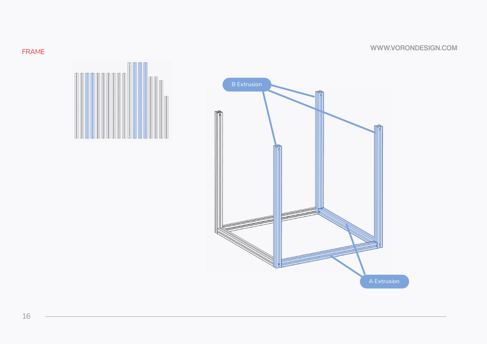

**What you're looking at:** Manual p.16 — the other three verticals and the last two bottom horizontals, closing the base into a rectangle. Everything is snug rather than tight, so the whole assembly can still be nudged square in Step 01.12 before anything is locked.

**Parts:** 3× B extrusion, 2× A extrusion (prepared); engages 6 more M5×16 BHCS.

**Do:** Repeat Step 01.7 at the other three corners, working around the frame, adding the last two bottom A extrusions as you go. Access holes outward every time. Snug only.

**Check:** Bottom square closed, four verticals standing, 8 of the 16 blind joints engaged. The assembly still sits flat on the stone with no rock.

Source: [Voron manual p.16](https://github.com/VoronDesign/Voron-2/blob/de7e89d/Manual/Assembly_Manual_2.4r2.pdf#page=16)

---

### Step 01.9 — Snug and check the bottom square

**What you're looking at:** Manual p.16 — the closed bottom square with the machinist square standing in each inside corner. A machinist square is a precision-ground right angle; you are looking for light between its blade and the extrusion, which is a gap you can still take out at this stage.

**Parts:** none.

**Do:** Press each corner down onto the stone and take each of the 8 bottom bolts up to snug in a diagonal pattern — corner 1, corner 3, corner 2, corner 4 — not around the frame in order, so the frame is pulled in evenly instead of being walked out of square one corner at a time. Put the machinist square in each of the four inside corners.

**Check:** All four inside corners read 90° against the square with no light. All four extrusions still touch the stone along their whole length.

Source: [Voron manual p.16](https://github.com/VoronDesign/Voron-2/blob/de7e89d/Manual/Assembly_Manual_2.4r2.pdf#page=16)

---

### Step 01.10 — Fit the four top A extrusions

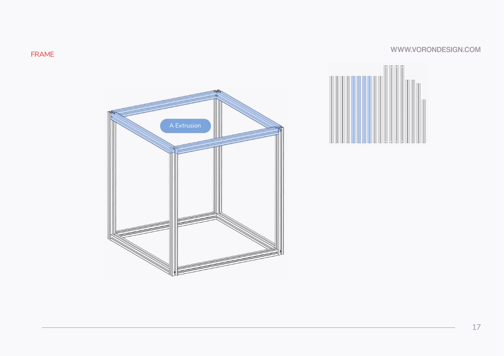

**What you're looking at:** Manual p.17 — the four remaining A extrusions dropping onto the tops of the verticals. Their screw heads enter the verticals' slots from the open top ends, which is why this half of the frame goes on last and needs a second pair of hands.

**Parts:** 4× A extrusion (prepared); engages the remaining 8 M5×16 BHCS.

**Do:** Drop each of the four remaining prepared A extrusions onto the tops of the verticals so their end bolts enter the verticals' channels from the **top** open ends. This is the two-person step — one holds the frame square while the other feeds the bolt heads in. If a top extrusion will not drop in, its bolts are too far out — run them in further (Step 01.4); never spread the verticals. Snug only.

**Check:** All 16 blind joints are now engaged and the top square is closed. No end face has a visible gap.

Source: [Voron manual p.17](https://github.com/VoronDesign/Voron-2/blob/de7e89d/Manual/Assembly_Manual_2.4r2.pdf#page=17)

---

### Step 01.11 — Snug the top square

**What you're looking at:** Manual p.17 — the completed 2020 cube, all sixteen blind joints engaged. The second pass over every joint matters because the frame settles as it is assembled and the joints you snugged first are no longer snug.

**Parts:** none.

**Do:** Snug the 8 top bolts through their access holes, again in a diagonal pattern. Then go back over all 16 joints once at snug — the first pass always leaves some slack once the frame has settled.

**Check:** Every one of the 16 joints takes the driver and is snug. The cube stands on its own and does not rack under a light hand push.

Source: [Voron manual p.17](https://github.com/VoronDesign/Voron-2/blob/de7e89d/Manual/Assembly_Manual_2.4r2.pdf#page=17)

---

### Step 01.12 — Square the bottom square and lock it

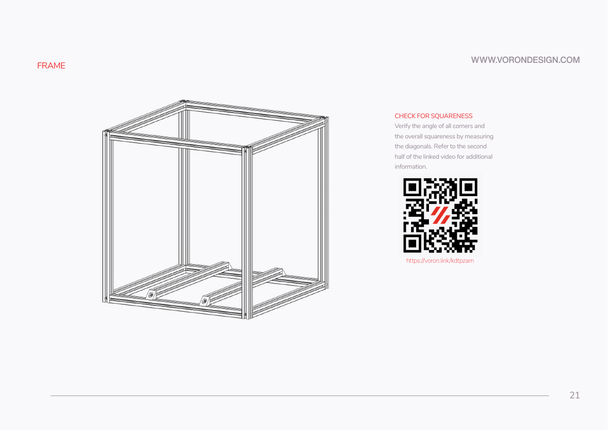

**What you're looking at:** Manual p.21 — the squareness check, measuring both plan diagonals of the bottom square. A rectangle whose two diagonals are equal is square; the absolute number does not matter, only that the pair agree, so measure both with the same tool hooked on the same feature.

**Parts:** none.

**Do:** Measure both plan diagonals across the bottom square, corner to corner, outside face to outside face, using the **same tool hooked on the same feature** both times — relative equality is the measurement, not the absolute number. If they differ, tap **inward** with the mallet on one of the two corners at the ends of the **longer** diagonal — that shortens it and lengthens the other — and re-measure after every tap. When the two agree, tighten the 8 bottom joints fully (fully = the torque note at Step 01.15: firm with the straight 3 mm key, or one torque setting for all 16), diagonal pattern, and re-measure. Repeat until tightening no longer moves the numbers. For a 350 the pair should land near **721 mm** — derived from the manual's ½ printer width of 255 mm (a 510 mm square, ×√2); measure yours rather than trusting the arithmetic (manual p.21, "CHECK FOR SQUARENESS").

**Check:** Both diagonals equal and all four corners still 90° on the square. The manual gives no tolerance — record the actual pair in the log. [src](https://voron.link/kdtpzam)

Source: [Voron manual p.21](https://github.com/VoronDesign/Voron-2/blob/de7e89d/Manual/Assembly_Manual_2.4r2.pdf#page=21) · [frame squaring video](https://voron.link/kdtpzam)

---

### Step 01.13 — Square the top square and lock it

**What you're looking at:** Manual p.21 again, applied to the top square. Both squares can be individually square and still be rotated relative to each other — that is a twisted frame, and it shows up much later as a gantry that will not sit parallel to the bed.

**Parts:** none.

**Do:** Same procedure on the top square: both diagonals, mallet. Before the torque pass, sight down the four verticals for lean and put the machinist square in the top inside corners of each vertical face (the full check is Step 01.14) — a lean is corrected while the top joints are still snug, not after they are torqued. Then tighten the 8 top joints fully in a diagonal pattern and re-measure.

**Check:** Top diagonals equal to each other, and within a millimetre or so of the bottom pair — a top square that is square but rotated relative to the bottom is a twisted frame, and it will show up as gantry racking in Ch 06.

Source: [Voron manual p.21](https://github.com/VoronDesign/Voron-2/blob/de7e89d/Manual/Assembly_Manual_2.4r2.pdf#page=21)

---

### Step 01.14 — Check the four vertical faces

**What you're looking at:** Manual p.21 — the four upright faces of the cube, each measured across its own diagonals. This is the check the first two cannot make: it catches a frame that is a square-based prism leaning over, rather than a rectangular box.

**Parts:** none.

**Do:** With the frame standing on the stone, measure both diagonals on each of the four vertical faces. Put the machinist square in the inside corners of each face, top and bottom. For a 350 each face pair should land near **735 mm** (510 × 530 outside); equality is the measurement, the number is the sanity check that catches a mis-hooked tape. Any face that will not come square means a joint that is not fully home: back it off, seat the end face, re-tighten.

**Check:** Each face's two diagonals are equal to each other, and every corner reads 90°.

Source: [Voron manual p.21](https://github.com/VoronDesign/Voron-2/blob/de7e89d/Manual/Assembly_Manual_2.4r2.pdf#page=21) · [Video: Part 1 @1:13:15](https://www.youtube.com/watch?v=feTxcc0LIWM&list=PL0fUJbigELQPqpeGOgHYisG4KaSXVtnNY&t=4395s)

---

### Step 01.15 — Check the frame sits without rock

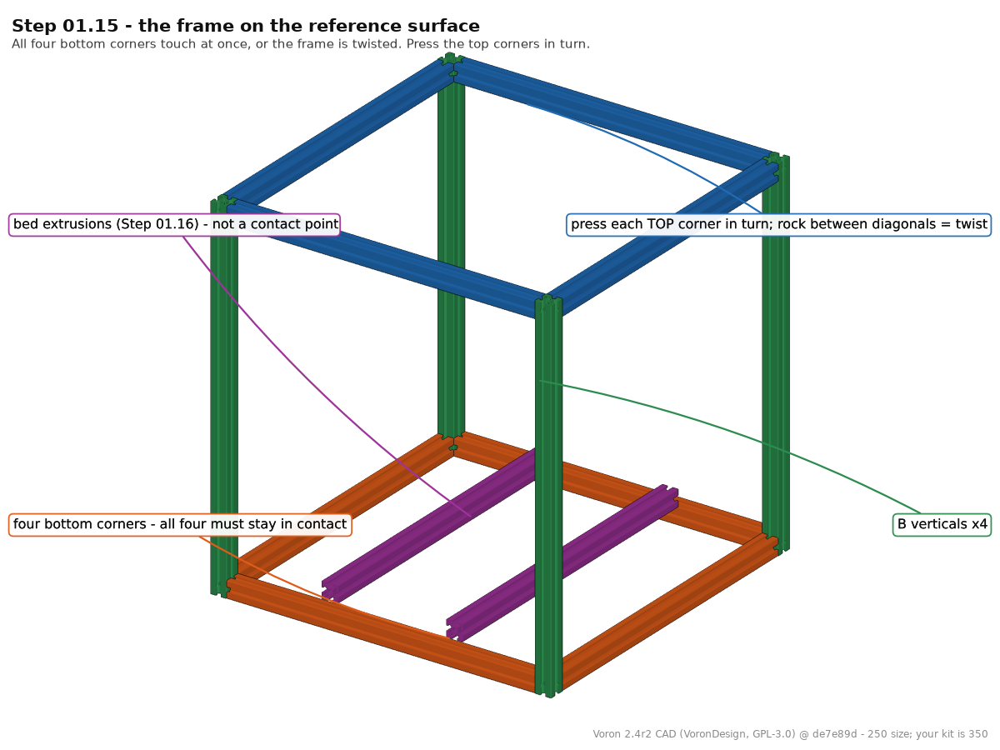

**What you're looking at:** The finished, torqued frame standing on the reference surface. All four bottom corners should touch it at once; a frame that rocks between two diagonal corners is twisted, and every axis bolted to it afterwards inherits that twist. (The render already shows the bed extrusions of Step 01.16 — ignore them here.)

**Parts:** none.

**Do:** Set the frame back on the stone and press each top corner in turn.

**Check:** No rock, no rattle, and all four bottom corners stay in contact. A frame that rocks is twisted — go back to Step 01.13 before you fit anything else to it.

Torque note: the manual specifies **no** torque value for these M5 blind joints. Tighten firmly with the straight 3 mm hex key — not the ball end, which cams out under load. If you use the torque screwdriver, pick one setting and apply it identically to all 16 joints — consistency matters more here than any particular number. `(not specified — snug, then even)`

Tip: The CAD is the 250 mm machine — its frame is 370 mm horizontals on 430 mm verticals. Yours is the 350 set; the contact geometry is the same.

Source: [Voron manual p.21](https://github.com/VoronDesign/Voron-2/blob/de7e89d/Manual/Assembly_Manual_2.4r2.pdf#page=21) · [Voron manual p.15](https://github.com/VoronDesign/Voron-2/blob/de7e89d/Manual/Assembly_Manual_2.4r2.pdf#page=15) · CAD: Voron 2.4r2 STEP @ de7e89d

Pause: ~65 min since the last pause — the frame is assembled, squared on both squares and all four vertical faces, all 16 blind joints fully torqued, and it sits on the stone with no rock. This is the first genuinely safe stop in the chapter: a frame left snug-but-untorqued keeps whatever error was in it, so never walk away between squaring and the torque pass. Leave the frame on the reference surface, covered.

---

### Step 01.16 — Fit corner brackets to the two bed extrusions

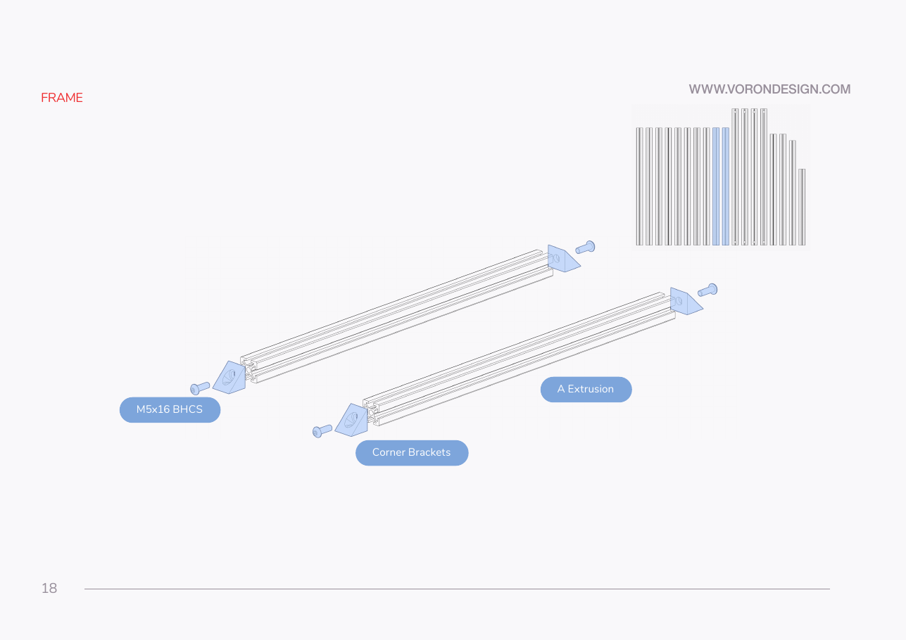

**What you're looking at:** Manual p.18 — the last two A extrusions with a gusseted **corner bracket** on each end. These two are the *bed extrusions*: they run front-to-back between the front and rear bottom rails and are what the heated build plate later sits on, so the brackets are the feet that carry the plate's weight into the frame.

**Parts:** 2× A extrusion (the last two), 4× corner bracket, 4× M5×16 BHCS.

**Do:** Take the two remaining A extrusions — these are the bed extrusions. They are the same 470 mm as the bottom rails, so they cannot rest on top of two rails: they sit on their brackets *between* the front and rear rails, ends flush with those rails' inner faces (p.19 inset, p.20). Fit a gusseted corner bracket to each end so that one leg is flat on the end face with its hole over the centre bore (M5×16 BHCS into the bore) and the other leg points **down and outward**. When the extrusion is lowered into the frame that free leg lies on top of the front or rear bottom rail, and the bed extrusion sits on its four brackets with its underside about level with the rails' top faces `(confirm on bench)` — it does not sit on the rails. Snug only — the brackets must still swivel while you position them.

**Check:** 4 brackets, 4 bolts, all four free legs pointing down and outward with the bolt hole clear of the extrusion end, and all four brackets oriented identically.

Source: [Voron manual p.18](https://github.com/VoronDesign/Voron-2/blob/de7e89d/Manual/Assembly_Manual_2.4r2.pdf#page=18) · [Voron manual p.20](https://github.com/VoronDesign/Voron-2/blob/de7e89d/Manual/Assembly_Manual_2.4r2.pdf#page=20) · [Video: Part 1 @1:29:21](https://www.youtube.com/watch?v=feTxcc0LIWM&list=PL0fUJbigELQPqpeGOgHYisG4KaSXVtnNY&t=5361s)

---

### Step 01.17 — Load four M5 T-nuts into the bottom rails

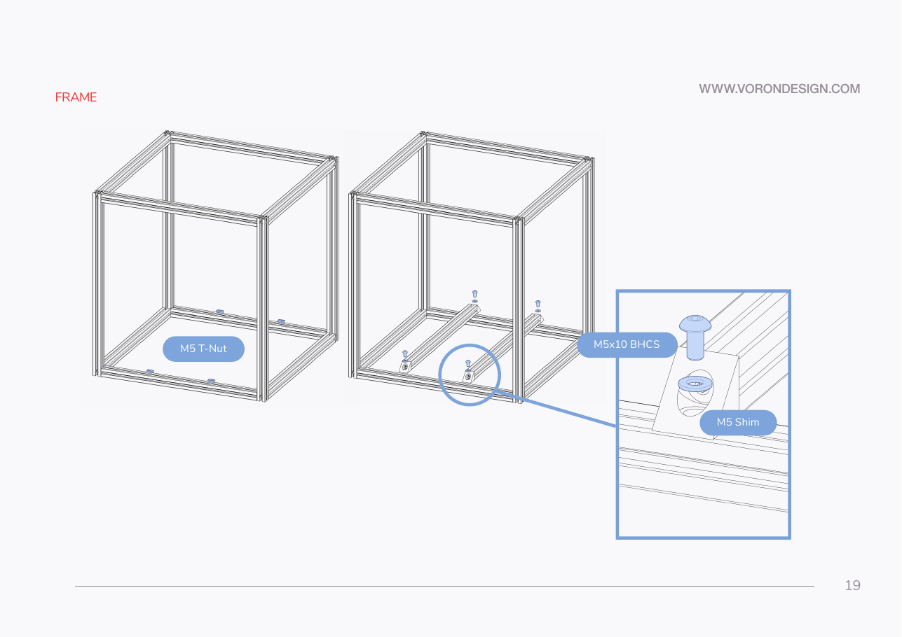

**What you're looking at:** Manual p.19 — four M5 roll-in T-nuts dropped into the top slots of the two bottom rails. Each one is the thread a bracket bolt will pick up, so they are loaded now and slid into position later, once the extrusions are actually resting where they belong.

**Parts:** 4× M5 T-nut (roll-in).

**Do:** Roll two M5 T-nuts into the top channel of the front bottom rail and two into the rear bottom rail — one per bed-extrusion end. Leave them loose and roughly where the brackets will land.

**Check:** All four T-nuts rotate freely in the channel and sit flat. If one is tight, swap it or use the other channel face — LDO warns these are a tight fit on this kit.

Source: [Voron manual p.19](https://github.com/VoronDesign/Voron-2/blob/de7e89d/Manual/Assembly_Manual_2.4r2.pdf#page=19) · [LDO Build Notes (Rev D)](https://docs.ldomotors.com/voron/voron2/build-faq) · [Video: Part 1 @1:28:12](https://www.youtube.com/watch?v=feTxcc0LIWM&list=PL0fUJbigELQPqpeGOgHYisG4KaSXVtnNY&t=5292s)

---

### Step 01.18 — Set the bed extrusions and start the fasteners

**What you're looking at:** Manual p.19 — both bed extrusions in the frame, each bracket leg on a rail over a T-nut, with an **M5 precision spacer** under each bolt head. The precision spacer is the brass part this kit supplies wherever the official manual says "M5 shim": a controlled thickness that sets the stack height, not a washer ([glossary](16-glossary.md#p)).

**Parts:** 2× bed extrusion (from Step 01.16), 4× M5×10 BHCS, 4× **M5 precision spacer**.

**Do:** The bed extrusions run **front-to-back**: their bracketed ends land on the **front and rear** bottom rails, and they sit left and right of the printer centreline. If your FRONT tape from Step 01.1 is on a face parallel to them, move it now — Ch 02, 03 and 09 all assume this. Lower both bed extrusions into the frame so every bracket's free leg lands on the front or rear rail over a T-nut. Drop a precision spacer onto each bracket hole, then start an M5×10 BHCS through spacer and bracket into the T-nut. Leave all four finger-loose — you position them in the next step.

**Check:** Four bolts started, four spacers seated, both extrusions level with their undersides about at the rails' top faces `(confirm on bench)` and their ends flush with the rails' inner faces; all four bracket legs flat on the rails.

⚠ Rev D+ / LDO: the manual calls this part an **"M5 Shim"** (p.19). This kit supplies a **brass M5 precision spacer** instead, and it substitutes for *every* M5 shim in the manual from here on unless a later note says otherwise. LDO: *"The brass M5 Precision Spacer are used in place of the M5 Shim. This will be for all M5 Shims in the guide unless noted."* This deviation is not illustrated anywhere — the brass spacer in your hand is the part. [src](https://docs.ldomotors.com/en/voron/voron2/build-faq) (survey §4.2 p.19, §7.5 #1)

Source: [Voron manual p.19](https://github.com/VoronDesign/Voron-2/blob/de7e89d/Manual/Assembly_Manual_2.4r2.pdf#page=19) · [LDO Build Notes (Rev D)](https://docs.ldomotors.com/voron/voron2/build-faq)

---

### Step 01.19 — Position the bed extrusions on the centreline

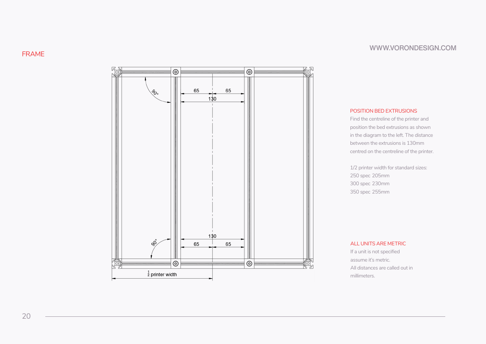

**What you're looking at:** Manual p.20 — the two bed extrusions being set symmetrically about the printer's centreline. Their spacing is what puts the build plate's four mounting points where the plate's own holes are, so it is measured rather than eyeballed, at both ends of both extrusions.

**Parts:** none — positioning only.

**Do:** Find the printer's centreline: for a **350**, measure **255 mm** in from the outer face of the **left (or right) side rail**, across the front rail (the manual's "½ printer width"; 250 spec = 205 mm, 300 spec = 230 mm). Mark it with tape on the front and rear rails. Slide each bed extrusion until its **inner face** is **65 mm** from the centreline — 130 mm of clear space between the two, i.e. 150 mm centre-to-centre. Set each extrusion square to the rails it spans between, then tighten the four M5×10 bolts.

**Check:** 65 mm each side of the centreline, measured at both ends of both extrusions — four measurements, all equal. Both extrusions read **90°** to the rails on the machinist square (the two 90° callouts on p.20).

Tip: the dimension lines on p.20 land on the facing inner faces — that is what makes the clear gap 130 mm and the centres 150 mm apart. If the bed's own mounting holes disagree later, trust the bed; Ch 03 Step 03.11 re-verifies the placement before the plate goes on (manual p.58, "VERIFY PLATE PLACEMENT").

Source: [Voron manual p.20](https://github.com/VoronDesign/Voron-2/blob/de7e89d/Manual/Assembly_Manual_2.4r2.pdf#page=20) · [Voron manual p.58](https://github.com/VoronDesign/Voron-2/blob/de7e89d/Manual/Assembly_Manual_2.4r2.pdf#page=58) · [Video: Part 1 @1:46:36](https://www.youtube.com/watch?v=feTxcc0LIWM&list=PL0fUJbigELQPqpeGOgHYisG4KaSXVtnNY&t=6396s)

Pause: ~35 min since the last pause — both bed extrusions are bracketed, spaced with brass M5 precision spacers, set 65 mm each side of the centreline and their four M5×10 tightened. Nothing is half-fastened. Do not fit the titanium backers, and do not move the frame off the stone yet — Step 01.20 re-checks squareness there.

---

### Step 01.20 — Final squareness verification

**What you're looking at:** Manual p.21 one last time, on the fully torqued frame with the bed extrusions in. Bolting the bed extrusions in can pull a square frame out of square, so this is the pass whose numbers go in the log.

**Parts:** none.

**Do:** With everything torqued, walk the whole check once more: both bottom diagonals, both top diagonals, both diagonals on each of the four vertical faces, machinist square in every inside corner, and the frame flat on the stone. Fitting the bed extrusions can pull a frame out of square — this pass is the one that counts.

**Check:** Every diagonal pair equal, every corner 90°, no rock. Anything you cannot null out here is permanent; it becomes gantry racking in Ch 06 and probe-accuracy noise in Ch 13. [src](https://voron.link/kdtpzam)

Source: [Voron manual p.21](https://github.com/VoronDesign/Voron-2/blob/de7e89d/Manual/Assembly_Manual_2.4r2.pdf#page=21) · [frame squaring video](https://voron.link/kdtpzam) · [Video: Part 5 @3:15:10](https://www.youtube.com/watch?v=hTKCBrk36R0&list=PL0fUJbigELQPqpeGOgHYisG4KaSXVtnNY&t=11710s)

---

### Step 01.21 — Titanium backers: not now

*(no image — see text)*

**What you're looking at:** The titanium extrusion backers, still bagged. A **backer** is a titanium strip bolted to the face opposite a linear rail; steel rail plus aluminium extrusion bow like a bimetallic strip when the chamber heats, and the backer cancels that ([glossary](16-glossary.md#b)). They belong to the gantry's X and Y extrusions in Ch 05, not to any frame extrusion.

**Parts:** none — confirm the backers stay bagged.

**Do:** Check the titanium extrusion backers are still sealed and labelled. They are **not** frame parts. They fit the gantry's X and Y extrusions in **Ch 05**, on the face **opposite** the rail: Y-axis backers on **top** of the Y extrusions, X-axis backer on the **rear** of the X extrusion, with M3×8 FHCS (Y) and M3×6 FHCS (X). Fitting them after the gantry is assembled costs a gantry teardown, so Ch 05 has them as a numbered step before the XY joints are torqued.

**Check:** Backers bagged, labelled "Ch 05", stored with the C/D/E extrusions. [src](https://github.com/tanaes/whopping_Voron_mods/tree/main/extrusion_backers) (survey §4.4 #3, §5.2 W2)

Source: [whopping_Voron_mods — `extrusion_backers`](https://github.com/tanaes/whopping_Voron_mods/tree/main/extrusion_backers) · [survey](../voron-build-instructions-survey.md)

---

### Step 01.22 — Record the frame log

*(no image — see text)*

**What you're looking at:** The finished frame, a tape measure and the log table. These numbers are the only baseline you will have when Ch 06 asks why the gantry will not square — "it looked fine" is not a measurement you can compare against.

**Parts:** none.

**Do:** Fill this in before the frame leaves the counter. Two people, two jobs: one measures and calls the number, one writes it down.

| Measurement | Target | Measured (mm) | By / date |
|---|---|---|---|
| Reference surface — worst feeler gap under the straightedge (Steps 00.10 / 01.1) | ≤ 0.1, no larger than the 00.10 figure | | |
| Bottom square, diagonal 1 | ≈721 (350) | | |
| Bottom square, diagonal 2 | = diagonal 1 | | |
| Top square, diagonal 1 | = bottom pair | | |
| Top square, diagonal 2 | = diagonal 1 | | |
| Front face, diagonals 1 / 2 | equal (≈735) | | |
| Rear face, diagonals 1 / 2 | equal (≈735) | | |
| Left face, diagonals 1 / 2 | equal (≈735) | | |
| Right face, diagonals 1 / 2 | equal (≈735) | | |
| Centreline to bed extrusion inner face — 4 places | 65 each | | |
| Clear gap between bed extrusions | 130 | | |
| Torque setting used, if any | one value, all 16 | | |

**Check:** Table filled, both diagonal pairs written down as numbers rather than "looked fine". You will want these when the gantry does not square in Ch 06.

Source: [Voron manual p.21](https://github.com/VoronDesign/Voron-2/blob/de7e89d/Manual/Assembly_Manual_2.4r2.pdf#page=21) · [survey](../voron-build-instructions-survey.md)

Pause: ~25 min since the last pause — final squareness pass done, backers confirmed still bagged for Ch 05, and the frame log table complete. Work through Checkpoint 01, then the frame can come off the counter.

---

## Checkpoint 01

- [ ] Reference surface re-checked with straightedge + feelers in five positions; worst gap no larger than the Step 00.10 figure
- [ ] 10 A, 4 B extrusions used; C ×2, D ×1, E ×1 bagged for Ch 05
- [ ] All extrusion end faces deburred and flat against the square
- [ ] 16 frame blind joints engaged and fully tightened, evenly
- [ ] Bottom square diagonals equal; top square diagonals equal and matching the bottom
- [ ] All four vertical faces: diagonals equal, corners 90°
- [ ] Frame sits on all four corners with no rock
- [ ] Every vertical's access holes face outward and take the straight 3 mm key face-on
- [ ] Two bed extrusions running front-to-back on the front and rear rails, corner brackets, **M5 precision spacers** (not shims), 90° to the rails; FRONT tape on one of the two faces their ends land on
- [ ] Bed extrusions 65 mm each side of the centreline, 130 mm clear gap, checked at both ends
- [ ] Titanium backers still bagged and labelled for Ch 05
- [ ] Frame log table filled in

## Common mistakes

- **Tightening as you go.** The frame must be assembled snug, squared, then torqued. Bolts taken to full torque corner by corner lock in whatever error was there at the time; the mallet cannot fix it afterwards.
- **Verticals installed with the access holes facing inward.** The two horizontals occupy the vertical's two inner faces, so the holes must face out. Caught late, this is a full corner disassembly — check it at Step 01.7 on the first corner and the rest follow.
- **Building on a "flat enough" table.** A surface with one corner a few tenths high becomes a twisted frame that reads square on every diagonal and still racks the gantry. Verify the surface (Step 00.10, re-checked at Step 01.1) or do not use it.
- **Using an M5 washer where the kit supplies a precision spacer.** The brass precision spacer is a controlled thickness, not a washer; the M5 shims in the manual are all replaced by it. Substituting a washer changes the stack height.
- **Forcing a roll-in T-nut.** LDO flags the tolerance explicitly. A forced T-nut galls the channel and the next one will not go in at all. Try another face or another nut.
- **Fitting the titanium backers to frame extrusions.** They are gantry parts and go on in Ch 05, on the face opposite the rail — putting a backer on the same face as an MGN12 makes bimetallic bowing worse, not better.

## Next

Ch 02 — Z drives, Z idlers, Z rails and deck panel (manual p.22–51); gated on batches **B00 + B01 + B02-P1 + B02-P3** (≈41 h of printing, print plan §2) — start them now if they are not already running.
