# Chapter 02 — Z drives, Z idlers, Z rails, deck panel

Builds the four Z drive units, the four Z idlers, the four Z linear rails and the deck panel. When this chapter closes, the frame has a floor, feet, and every part of the Z motion system except the belts and the Z joints — the gantry has somewhere to hang from.

**What you're building in this chapter:** the machinery that raises and lowers the gantry, one corner at a time. A **Z drive** is the gearbox in a bottom corner: a printed housing holding three bearings and a shaft, with a big 80-tooth pulley the motor drives through a short closed belt and a 20-tooth pulley the long Z belt runs over — 80:16 of reduction, which is what makes Z fine enough to print with. The housing is two printed halves: a shallow **retainer** tray the shaft and its bearings drop into, and the deeper **main** body that closes over them on six long screws and carries the two M5×40 that bolt the drive to the frame. An orange **baseplate** bolts across the drive's foot face and holds the nut the rubber foot screws into, and an orange cam **tensioner** pushes the motor along its extrusion to pull the short belt tight. Directly above each drive, at the top corner, a **Z idler** carries a free-spinning pulley that turns the long belt back down again; its orange slider is the adjuster you tension that belt with in Ch 06 (final tension is set in Ch 14). Between them run the four **Z linear rails** on the vertical extrusions, the tracks the gantry's corners actually ride on. Last comes the **deck panel**, the acrylic floor that divides the electronics bay underneath from the print chamber above — it goes in now because once the gantry and the wiring are in, it cannot be lifted out again. Four corners, all identical in function, built from mirrored `_a` and `_b` printed parts — diagonal corners share a hand (the map is at Step 02.02).

**Time:** 4.25–6.25 h hands-on, first build (survey §7.2, less the ~45 min of rail cleaning and greasing, which is done once for all seven rails in Ch 00 Steps 00.18–00.21).

**Sessions:** 11 × ~30 min — the `Pause:` lines below break the chapter into 11 segments; every minute figure is a first-build estimate.

**Prerequisites:**

- Chapter 01 complete: frame assembled, squared, bed extrusions positioned **65 mm each side of the printer centreline (130 mm clear gap between their inner faces, 150 mm centre-to-centre)** per Ch 01 Step 01.19, and the squareness re-checked after the final torque pass.
- Print batch **B00** (Calibration & jigs) — `MGN9_rail_guide_x2`, `pulley_jig`.
- Print batch **B01** (Z drive assemblies) — drive bodies, retainers, motor mounts, Z-tensioner brackets, deck supports.
- Print batch **B02** (Accent parts, orange) plates P1 and P3 — the five `[a]_` parts below.
- Steps 02.27–02.28 (16T pulleys, motors onto their mounts) need only B01-P2 and the Motor Kit — do them while B01-P1 is still printing if you like, and label the motor cables then.
- **Chapter 00** complete: all seven rails cleaned, flip-and-packed with grease, wiped and labelled (Steps 00.18–00.21). The four marked Z0–Z3 are used here.
- Kit boxes open: Motion, Linear Rail Kit, Motor Kit, the M3/M5 fastener bags.

**Tools**

- Hex drivers 1.5 / 2 / 2.5 / 3 / 4 mm — good quality, *not* ball-end for set screws (p.32).
- Temperature-controlled soldering iron + the LDO brass M3 heat-set tip.
- Digital caliper (deck-panel thickness gate; 33 mm and 10.7 mm pulley dimensions).
- Printed jigs: `MGN9_rail_guide_x2` ×2, `pulley_jig` ×1.
- Masking tape (carriage retention, rail hole marking, the FRONT label) and a marker. The 3 mm hex key doubles as the rail-gap feeler (Step 02.06).

**Consumables:** Loctite 243 for any set screw that did *not* arrive with threadlocker pre-applied. (IPA, grease, soak tray, syringe and cloth were the Ch 00 rail-prep kit — nothing here needs them unless a rail was missed.)

**Printed parts** — all ASA. Black = main colour, Orange = accent (`[a]_` prefix).

| Looks like | STL (Voron-2 `STLs/`, branch `Voron2.4`) | Qty | Colour |
|---|---|---:|---|
| 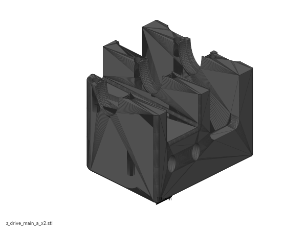{ width=96 } | `Z_Drive/z_drive_main_a_x2.stl` | 2 | Black |
| 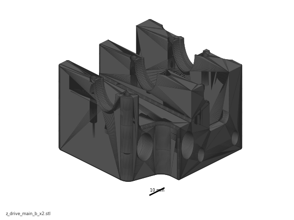{ width=96 } | `Z_Drive/z_drive_main_b_x2.stl` | 2 | Black |
| { width=96 } | `Z_Drive/z_drive_retainer_a_x2.stl` | 2 | Black |
| 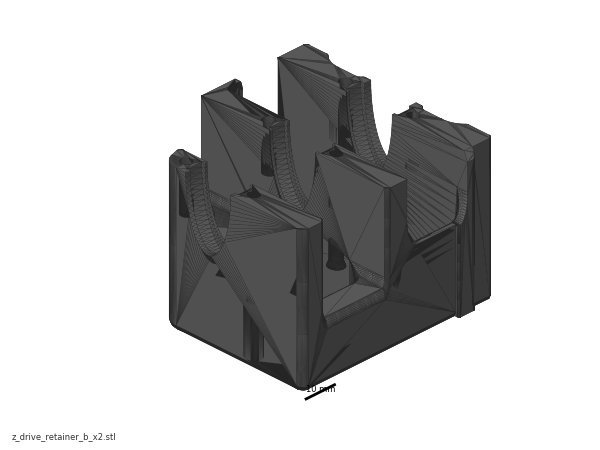{ width=96 } | `Z_Drive/z_drive_retainer_b_x2.stl` | 2 | Black |
| 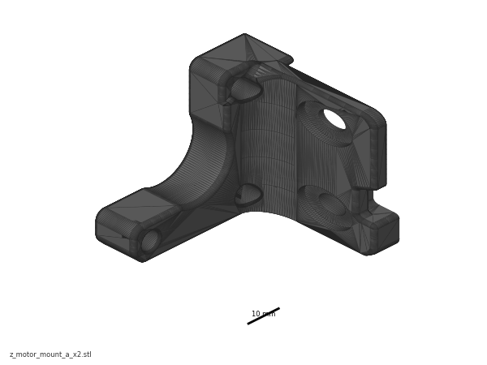{ width=96 } | `Z_Drive/z_motor_mount_a_x2.stl` | 2 | Black |
| 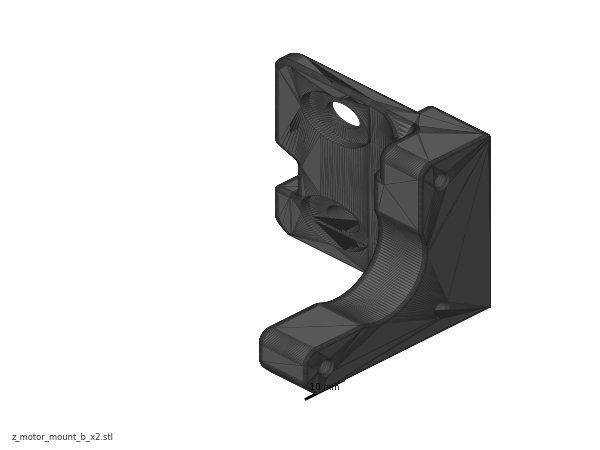{ width=96 } | `Z_Drive/z_motor_mount_b_x2.stl` | 2 | Black |
| 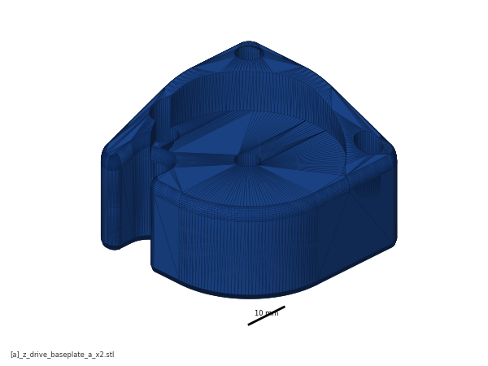{ width=96 } | `Z_Drive/[a]_z_drive_baseplate_a_x2.stl` | 2 | Orange |
| 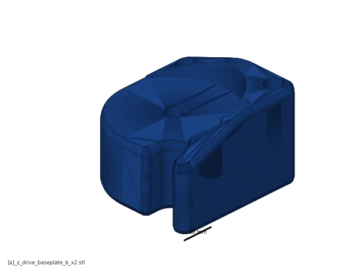{ width=96 } | `Z_Drive/[a]_z_drive_baseplate_b_x2.stl` | 2 | Orange |
| 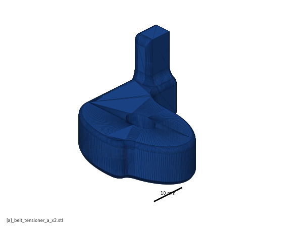{ width=96 } | `Z_Drive/[a]_belt_tensioner_a_x2.stl` | 2 | Orange |
| 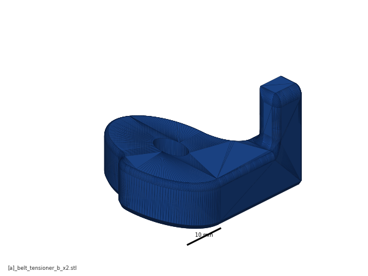{ width=96 } | `Z_Drive/[a]_belt_tensioner_b_x2.stl` | 2 | Orange |
| 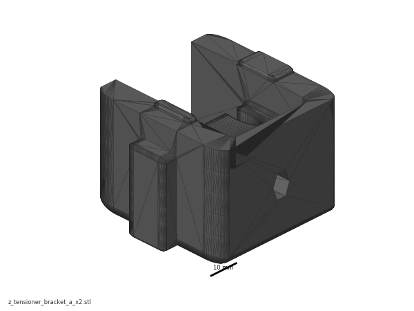{ width=96 } | `Z_Idlers/z_tensioner_bracket_a_x2.stl` | 2 | Black |
| 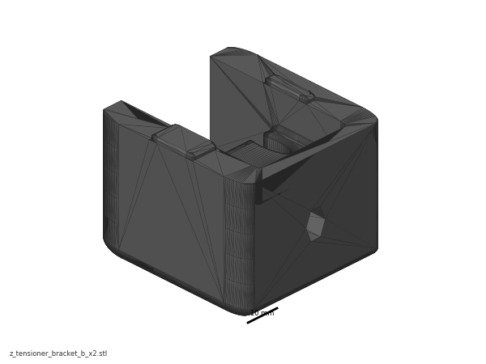{ width=96 } | `Z_Idlers/z_tensioner_bracket_b_x2.stl` | 2 | Black |
| 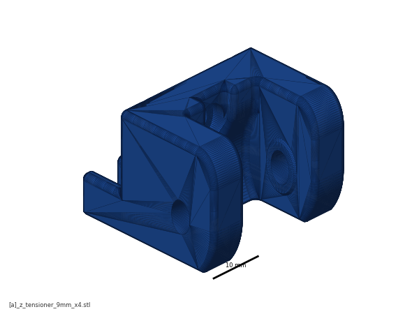{ width=96 } | `Z_Idlers/[a]_z_tensioner_9mm_x4.stl` | 4 | Orange |
| 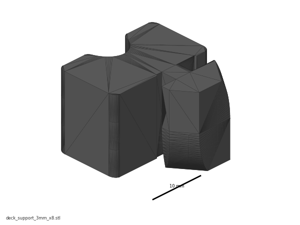{ width=96 } | `Panel_Mounting/deck_support_3mm_x8.stl` | 8 | Black — default (Rev D 350 BOM), see Step 02.12 |
| *no render — same clip, slotted for a 4 mm panel* | `Panel_Mounting/deck_support_4mm_x8.stl` | 8 | Black — fallback if the panel measures 4 mm |
| { width=96 } | `Tools/MGN9_rail_guide_x2.stl` (jig, not consumed) | 2 | Black |
| { width=96 } | `Tools/pulley_jig.stl` (jig, not consumed) | 1 | Black |
| 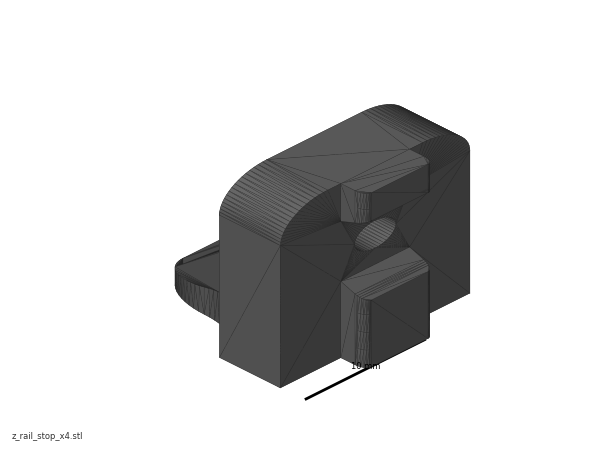{ width=96 } | LDO `STLs/z_rail_stop_x4.stl` (optional) | 4 | Black — batch **B05**, which prints *after* this chapter in the timeline |

The `_xN` suffix is the quantity you need, not the number of copies in the file — each STL contains one part. `_a` and `_b` are mirrored: two drives use the `a` set, two use the `b` set.

**Hardware** — chapter totals.

| Fastener / part | Qty |
|---|---:|
| M3×8 SHCS | 24 (drives) + 36 (Z rails — 9 per rail, Step 02.06) |
| M3×16 SHCS | 4 |
| M3×40 SHCS | 24 |
| M3 hexnut | 4 |
| M3 roll-in T-nut, 2020 | 36 (one per Z-rail screw) |
| M3×5×4 brass heat-set insert | 36 (Step 02.04) + up to 7 on the practice coupon (Step 02.03) |
| M5×10 BHCS | 8 (drives) |
| M5×16 BHCS | 4 |
| M5×30 BHCS | 12 (idlers: 2 mounting + 1 axle each) |
| M5×40 SHCS | 8 |
| M5 hexnut | 4 |
| M5 roll-in T-nut, 2020 | 28 (16 drives + 8 idlers + 4 deck) |
| M5 precision spacer, 1 mm (kit substitute for "M5 Shim") | 16 |
| M4×4 set screw, pre-applied threadlocker | 24 (2 each on 4× 20T, 4× 80T, 4× 16T) |
| 625-2RS bearing | 12 |
| GT2 80T pulley, 5 mm ID | 4 |
| GT2 20T 9 mm pulley, 5 mm ID | 4 |
| GT2 16T pulley, 5 mm ID 6 mm W | 4 |
| GT2 20T 9 mm idler, 5 mm ID | 4 |
| 5×60 mm shaft | 4 |
| Gates 2GT closed loop, 6 mm × 188 mm | 4 |
| NEMA17 Z motor, `LDO-42STH48-2004AC(VRN)` | 4 |
| MGN9H 400 mm rail, `LDO-SLR9H-400Z0` | 4 |
| Rubber foot, 38×19 mm | 4 |
| Deck panel, acrylic black 469×469 | 1 |

Quantities cross-checked against the LDO Rev D 350 BOM ([350_BOM/Rev_D](https://docs.ldomotors.com/en/voron/voron2/350_BOM/Rev_D)); the LDO kit ships 6× MGN9H-400 and 1× MGN12H-400 — four of the MGN9s are yours here, the other two are the gantry Y rails in Chapter 05.

**Read first**

- **The rails were cleaned and greased in Ch 00, not here.** Flip-and-pack needs access to the back of the rail, which you lose the moment it is bolted to an extrusion — so if any of Z0–Z3 was missed, fix it before Step 02.06, not after ([rail grease guide](https://docs.ldomotors.com/guides/rail_grease_guide); survey §4.4 #5, §5.2 W9).
- **The Z motors are the only place in the whole printer that uses 16T pulleys.** They look almost identical to the 20T. Get them off the bench when this chapter is done (p.38; survey §4.4 #7).
- **Every set screw gets threadlocker and must land on the flat/D-cut of the shaft.** Loose set screws are the single most reported failure on this machine (p.32; §5.2 W12).
- **Two corners take `_a` parts, two take `_b`, and diagonal corners share a hand** — `_a` at Z0 (front-left) and Z2 (rear-right), `_b` at Z1 (rear-left) and Z3 (front-right); map at Step 02.02, dry-fit at Step 02.29. A wrong-hand drive bolts on fine and is only found in Ch 06 when the Z belt goes on and the 20T is not under its idler.
- **Heat-set inserts go into the drive parts before the drive is assembled.** A missed insert means taking a finished drive back apart (§4.4 #4, §5.2 W3).
- **The deck panel and its supports go in now, at p.28–30 — not later with the panels.** Retro-fitting the deck means pulling the frame apart (LDO note p.29–30; §5.2 W4).
- Nothing in this chapter touches a probe or an endstop. The Rev D+ nozzle probe and the Omron inductive probe belong to Chapters 08–09; leave both bagged.

**Sources for this chapter:**

- [Voron 2.4r2 assembly manual (pinned `de7e89d`)](https://github.com/VoronDesign/Voron-2/blob/de7e89d/Manual/Assembly_Manual_2.4r2.pdf) pages 22–51 — Z rails, deck panel, drive assemblies, motor mounts, corner installs, Z idlers
- [LDO Build Notes (Rev D)](https://docs.ldomotors.com/voron/voron2/build-faq) — deck supports at p.29–30, the second-hole rail rule, precision spacers, tight T-nuts
- [LDO 350 Rev D BOM](https://docs.ldomotors.com/en/voron/voron2/350_BOM/Rev_D) — quantities, motor and rail part numbers, the 3 mm deck panel line
- [LDO rail grease guide](https://docs.ldomotors.com/guides/rail_grease_guide) — the flip-and-pack method the four Z rails were prepped with in Ch 00
- [LDO heat-set insert tool guide](https://docs.ldomotors.com/guides/heatset_insert_tool_guide) — the 36-insert pass
- [LDO wiring guide § Connecting Steppers](https://docs.ldomotors.com/en/voron/voron2/wiring_guide_rev_d#connecting-steppers) — Z0–Z3 → `STEPPER-0`…`STEPPER-3`
- [LDO wiring guide § Installing the DIN Rails and Wire Ducts](https://docs.ldomotors.com/en/voron/voron2/wiring_guide_rev_d#installing-the-din-rails-and-wire-ducts) — why the four deck bolts wait for Ch 09
- [LDO Klipper config `leviathan-printer-rev-d-sbv2.cfg`](https://raw.githubusercontent.com/MotorDynamicsLab/LDOVoron2/667521d/Firmware/leviathan-printer-rev-d-sbv2.cfg) — `gear_ratio: 80:16`, `rotation_distance: 40`
- [LDO printed parts guide (Rev D)](https://docs.ldomotors.com/en/voron/voron2/printed_part_guide_rev_d) — the optional `z_rail_stop_x4`
- [Voron-2 `STLs/Z_Drive`](https://github.com/VoronDesign/Voron-2/tree/de7e89d/STLs/Z_Drive), [Voron-2 `STLs/Z_Idlers`](https://github.com/VoronDesign/Voron-2/tree/de7e89d/STLs/Z_Idlers), [Voron-2 `STLs/Panel_Mounting`](https://github.com/VoronDesign/Voron-2/tree/de7e89d/STLs/Panel_Mounting), [Voron-2 `STLs/Tools`](https://github.com/VoronDesign/Voron-2/tree/de7e89d/STLs/Tools)
- [survey](../voron-build-instructions-survey.md) §4.3, §4.4, §5.2 · [print plan](../voron-print-plan.md) batches B00/B01/B02

**Video coverage (Steve Builds, pre-release LDO kit — differs from Rev D+):** [Part 1 @3:08:34](https://www.youtube.com/watch?v=feTxcc0LIWM&list=PL0fUJbigELQPqpeGOgHYisG4KaSXVtnNY&t=11314s) (+4m), [Part 1 @3:20:00](https://www.youtube.com/watch?v=feTxcc0LIWM&list=PL0fUJbigELQPqpeGOgHYisG4KaSXVtnNY&t=12000s) (+9m), [Part 1 @3:28:20](https://www.youtube.com/watch?v=feTxcc0LIWM&list=PL0fUJbigELQPqpeGOgHYisG4KaSXVtnNY&t=12500s) (+7m), [Part 1 @3:34:50](https://www.youtube.com/watch?v=feTxcc0LIWM&list=PL0fUJbigELQPqpeGOgHYisG4KaSXVtnNY&t=12890s) (+9m), [Part 2 @0:55:00](https://www.youtube.com/watch?v=2U0YahE8w_0&list=PL0fUJbigELQPqpeGOgHYisG4KaSXVtnNY&t=3300s) (+7m), [Part 2 @1:18:20](https://www.youtube.com/watch?v=2U0YahE8w_0&list=PL0fUJbigELQPqpeGOgHYisG4KaSXVtnNY&t=4700s) (+14m), [Part 2 @1:36:40](https://www.youtube.com/watch?v=2U0YahE8w_0&list=PL0fUJbigELQPqpeGOgHYisG4KaSXVtnNY&t=5800s) (+8m)

---

## Steps

### Step 02.01 — Lay out and label the chapter's printed parts

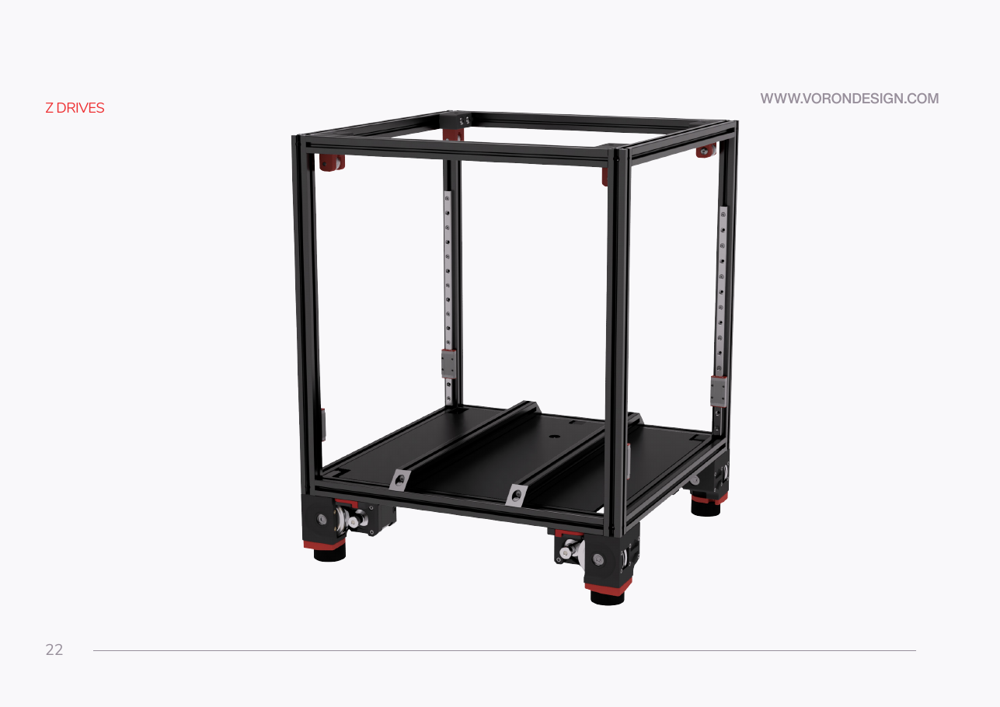

**What you're looking at:** Manual p.22 opens the Z section; on your bench it is the printed parts from three batches, in four groups: the two halves of each **Z drive** — the deep `z_drive_main` body (belt window in one face, two deep M5 wells in a side face, six counterbored holes in its flat face) and the shallow `z_drive_retainer` tray (six brass inserts in its flat face), which together clamp the shaft's three bearings and turn a motor's spin into the belt that lifts the gantry — the **motor mounts** (L-brackets that hold a stepper against the frame), the orange **baseplates and belt tensioners**, and the **Z idler** brackets for the top corners. Every one exists as an `_a` and a `_b` — mirror images, two corners each. The pair renders look straight down on each part as it sits on the bench, print face down: a mirror pair is obvious in plan, so put your part in the same orientation as the render and read which of the two it matches.

**Parts:** all Chapter 02 printed parts from batches B00, B01 and B02.

**Do:** Sort the drive parts into two mirrored piles — `*_a` and `*_b`, two drives each — using the renders and these bench tests. **Main:** print face down, cradles up, shaft line running left–right, rectangular belt window in the right half — the bitten-off corner and the side face with the two big 9 mm bolt wells are on the far side for `_a`, toward you for `_b`. **Retainer:** inserts down, cradles up, rectangular window on the right and trapezoid window on the left — the bite is near-left for `_a`, far-left for `_b` (flipped onto its main, the bites coincide). **Motor mount:** stood on its print face with the thick foot arm (two large counterbored holes) on your right running toward you — the thin motor plate is the far edge on `_a`, the near edge on `_b`. Write `a` or `b` on the inside face of every part with a marker (if the print chapter already lettered them, this pass only verifies). Set the four orange `[a]_z_tensioner_9mm` and the two mirrored `z_tensioner_bracket` pairs aside as the idler pile. Check every part for a corner that lifted off the plate or a delaminated layer at a bolt boss before you put any hardware into it.

**Check:** Twelve black drive parts (4 main, 4 retainer, 4 motor mount — two `a` and two `b` of each), 8 orange drive accents, 4 idler brackets, 4 orange idler sliders, 8 deck clips. Nothing warped at a bearing seat or a bolt boss.

Tip: reprint rather than force a warped `z_drive_main` — it holds the shaft alignment for the whole Z axis. [src](https://docs.ldomotors.com/en/voron/voron2/printed_part_guide_rev_d)

Source: [Voron manual p.22](https://github.com/VoronDesign/Voron-2/blob/de7e89d/Manual/Assembly_Manual_2.4r2.pdf#page=22) · [LDO printed parts guide (Rev D)](https://docs.ldomotors.com/en/voron/voron2/printed_part_guide_rev_d) · [print plan](../voron-print-plan.md) · [Video: Part 1 @3:08:47](https://www.youtube.com/watch?v=feTxcc0LIWM&list=PL0fUJbigELQPqpeGOgHYisG4KaSXVtnNY&t=11327s)

### Step 02.02 — Learn the four Z positions before you build anything

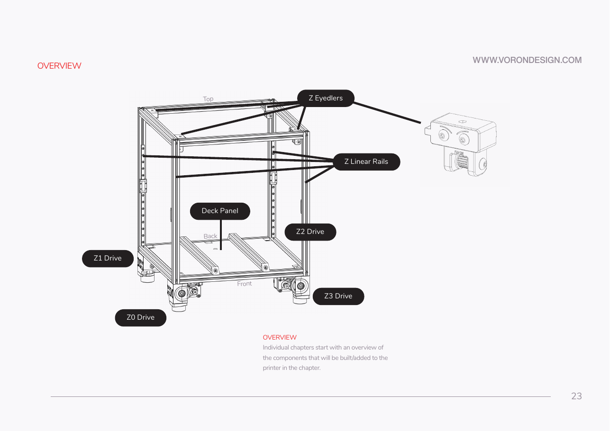

**What you're looking at:** Manual p.23 — the whole Z system in one overview: four drives at the bottom corners, four idlers directly above them at the top corners, four vertical rails, and the deck panel across the middle. **Z0–Z3** is the naming this manual, the kit's wiring and its Klipper config all share ([glossary](16-glossary.md#z)); a corner is identified by that number for the rest of the build.

**Parts:** none.

**Do:** Memorise the naming from the overview: **Z0 front-left, Z1 rear-left, Z2 rear-right, Z3 front-right**, viewed from the front of an upright printer. Then the hand map: **`_a` parts build Z0 (front-left) and Z2 (rear-right); `_b` parts build Z1 (rear-left) and Z3 (front-right)** — diagonal corners share a hand, neighbours are mirrors, and the idler above a drive takes the same hand as the drive. The map is derived from the official CAD (the Z Belt Drive A/B and Z Idler A/B positions, chirality-matched to the STL hands), not from a manual page, so confirm it once by dry-fitting the first drive at Z0 against p.40–41 at Step 02.29 before any bolt goes in. The Z idlers ("Z Eyedlers" in the manual's typo) sit directly above their drives at the top corners; the Z linear rails run up the four vertical extrusions; the deck panel goes on the bed extrusions.

**Check:** You can point at each of the four corners and say its Z number and its hand (`a` or `b`) without looking.

⚠ **Rev D+ / LDO:** this naming is what the kit's wiring and Klipper config assume — Z0→`STEPPER-0`, Z1→`STEPPER-1`, Z2→`STEPPER-2`, Z3→`STEPPER-3` on the Leviathan. Label each motor's cable with a kit cable tag as you fit it in this chapter and you save an hour in Chapter 10. [src](https://docs.ldomotors.com/en/voron/voron2/wiring_guide_rev_d#connecting-steppers)

Source: [Voron manual p.23](https://github.com/VoronDesign/Voron-2/blob/de7e89d/Manual/Assembly_Manual_2.4r2.pdf#page=23) · [Voron manual p.40](https://github.com/VoronDesign/Voron-2/blob/de7e89d/Manual/Assembly_Manual_2.4r2.pdf#page=40) · [LDO wiring guide § Connecting Steppers](https://docs.ldomotors.com/en/voron/voron2/wiring_guide_rev_d#connecting-steppers) · [Voron-2 CAD `Voron_2.4r2_Assembly_STEP.zip` @ `de7e89d`](https://github.com/VoronDesign/Voron-2/blob/de7e89d/CAD/Voron_2.4r2_Assembly_STEP.zip) (corner map)

### Step 02.03 — Dial in the iron on the practice coupon before you touch a structural part

**What you're looking at:** The `Heatset_Practice` coupon and the iron. A **heat-set insert** is a brass sleeve with a knurled outside, melted into a printed boss so the boss has a real steel-strength M3 thread instead of plastic ([glossary](16-glossary.md#h)). You are calibrating temperature on scrap, not on a part, because an insert set too hot bulges the boss around it and an insert set too cold goes in crooked — and both faults are permanent in the part they happen to.

**Parts:** `Heatset_Practice` coupon from B00 (7 pockets on the STL — 3 in a side face, 4 in the top, all the same Ø4.7 × 5 mm as the drive parts); M3×5×4 brass heat-set inserts, up to 7 for practice.

**Do:** Fit the brass M3 tip to the iron and set the tongue length flush with the height of an insert — long enough to transfer heat, short enough that the tongue never touches the plastic. Set the iron so the plastic goes *soft, not runny*. Too cold and you push hard and cock the insert; too hot and the boss slumps and the insert sinks. LDO's trick: drive the insert ~90 % of the way with the iron, then press the last fraction home with a flat steel block so the top face ends up parallel to the part. Work through the coupon's pockets until two in a row go in square. Do not leave the iron sitting in a part, and do not leave it powered longer than needed — the brass tip oxidises.

**Check:** On the coupon, an insert goes in square in under 5 seconds with no visible bulge — two in a row.

⚠ **Rev D+ / LDO:** the kit supplies the brass tip (`Brass Heatset Insert tool (for M3 Brass Inserts)`, 1 off) and 153 inserts for the whole build. 36 go into the drive parts in the next step; the coupon spends up to 7 more. [src](https://docs.ldomotors.com/guides/heatset_insert_tool_guide)

Source: [Voron manual p.31](https://github.com/VoronDesign/Voron-2/blob/de7e89d/Manual/Assembly_Manual_2.4r2.pdf#page=31) · [LDO heat-set insert tool guide](https://docs.ldomotors.com/guides/heatset_insert_tool_guide) · [LDO 350 Rev D BOM](https://docs.ldomotors.com/en/voron/voron2/350_BOM/Rev_D)

### Step 02.04 — Seat the heat-set inserts in the Z drive parts

**What you're looking at:** Manual p.31 shows the insert operation; the parts in front of you are the four retainers and four drive mains. These thirty-six inserts are the threads that hold each drive closed around its bearings: the six in each retainer's flat outer face are what the M3×40s bite into after passing down through the main, and the three in the drive's foot face (two in the main, one in the retainer) take the baseplate's M3×8s.

**Parts:** M3×5×4 brass heat-set inserts ×36; `z_drive_retainer_a/b` ×4; `z_drive_main_a/b` ×4.

**Do:** With the iron set from Step 02.03, seat the inserts. Counts, measured off the STL geometry: **7 per `z_drive_retainer`** (6 in the flat print face plus 1 in a side face) and **2 per `z_drive_main`** (both in one side face). Identify a pocket by diameter: an insert pocket is **Ø4.7 mm × 5 mm deep**; a plain M3 screw clearance hole is Ø3.4 mm and goes straight through. **The six Ø6 counterbores on the main's flat face are for screw heads — no insert goes there.** Push each insert down with steady pressure until it is flush, then let the part cool before touching it, so the plastic sets around the knurl instead of releasing it.

**Check:** 36 inserts in, every one flush or a hair below the surface, no melted bulge around the rim, no insert cocked in its pocket, nothing in a counterbore. Count the Ø4.7 pockets on your own parts before you start — if a part shows a different number, trust the part.

Source: [Voron manual p.31](https://github.com/VoronDesign/Voron-2/blob/de7e89d/Manual/Assembly_Manual_2.4r2.pdf#page=31) · [LDO heat-set insert tool guide](https://docs.ldomotors.com/guides/heatset_insert_tool_guide)

Pause: ~40 min since the last pause — printed parts sorted into `a` and `b` piles and inspected, the iron temperature confirmed on the coupon, and all 36 heat-set inserts seated in the four retainers and four drive mains. Unplug the iron. Nothing is assembled.

### Step 02.05 — Confirm the four Z rails are already cleaned and greased

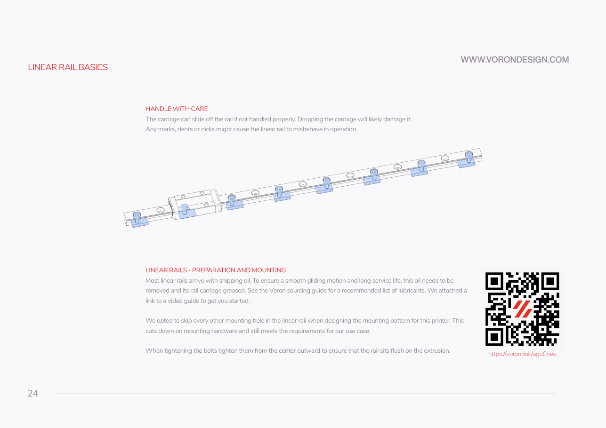

**What you're looking at:** Manual p.24 — a linear rail and its carriage. These four MGN9H rails are the vertical tracks the gantry's four corners ride up and down on; they were degreased and packed with grease in Ch 00 because that job needs access to the back of the rail, which stops existing the moment the rail is bolted to an extrusion ([glossary](16-glossary.md#f)).

**Parts:** MGN9H 400 mm rails ×4 (the four labelled Z0–Z3 in Ch 00).

**Do:** All seven rails were soaked in IPA, flip-and-packed with grease, wiped clean and labelled in **Ch 00 Steps 00.18–00.21** — flip-and-pack needs the back of the rail, so it cannot be done once a rail is bolted on. Unbag the four marked **Z0–Z3**, check the labels and the carriage tape, and run each carriage end to end: it should feel smooth and silent, not dry or notchy. If any rail was missed, do Ch 00 Steps 00.18–00.20 on it now and let it dry completely before it goes near the frame. Work over the bench, never over the floor — a dropped carriage spills its balls and is scrap.

**Check:** Four labelled rails on the bench, carriages taped or stoppered, each carriage smooth and silent over full travel, no grease left on the outside of any rail.

⚠ **Rev D+ / LDO:** the kit does **not** include grease, and the rails ship with a shipping oil rather than a lubricant. If you do have to prep a rail here, use NLGI 0 or NLGI 1 — Super Lube 21030, Mobilux EP1/EP2, or white lithium — never a thin oil or a PTFE dry lube. [src](https://docs.ldomotors.com/guides/rail_grease_guide)

Source: [Voron manual p.24](https://github.com/VoronDesign/Voron-2/blob/de7e89d/Manual/Assembly_Manual_2.4r2.pdf#page=24) · [LDO rail grease guide](https://docs.ldomotors.com/guides/rail_grease_guide) · [LDO Build Notes (Rev D)](https://docs.ldomotors.com/voron/voron2/build-faq)

### Step 02.06 — Fit the first Z rail, centred, with the MGN9 guides

**What you're looking at:** Manual p.25 — a rail going onto a vertical extrusion, with the printed rail guides drawn in green (the manual's colour for a jig). The guides straddle rail and extrusion and hold the rail centred on the 20 mm face while you start the screws, so the rail cannot drift a fraction of a millimetre off centre over its 400 mm length.

**Parts:** MGN9H 400 mm rail ×1; M3×8 SHCS ×9; M3 roll-in T-nut ×9; `MGN9_rail_guide_x2` jigs ×2; a 3 mm hex key as the feeler.

**Do:** Start with the front-left vertical. The rail goes on the face that looks toward the **back** of the machine (on the rear verticals it is the face looking toward the front — every Z rail faces the rail behind or in front of it, never the one across). Pre-load nine M3 T-nuts into that face's slot — LDO warns that extrusion/T-nut tolerances are tight, so test-fit each nut; if one jams, swap the nut, not the face. Slip a printed `MGN9_rail_guide` over the rail at each end; the guides centre the rail on the 20 mm face for you. Rest the bottom of the rail on a 3 mm hex key laid flat on the bottom frame rail at the foot of the vertical — that is the **3 mm gap between the rail and the printer frame** — and start every screw finger-tight before tightening any of them. Hole pattern: start at the **second** hole from the bottom end and use every other hole, stopping before the last hole at the top — holes 2, 4 … 18 on a 20-hole 400 mm rail, nine screws, both end holes left empty. Tape-mark those holes before you start; if your rail has a different hole count, keep the rule (second hole from the bottom, every other, no end holes) and use the same holes on all four rails. **Rail end-stop bands:** with the rail lying flat on the bench, peel off the two tape/zip-tie bands from Ch 00 Step 00.17 only now — never with the rail on edge or the carriage near an end — then slide the guide on.

**Check:** Rail on the rear-looking face of the front-left vertical, centred along its whole length (slide a guide up and down to confirm), sitting on the 3 mm key, all nine screws started in holes 2–18, none tight yet, both end holes empty.

⚠ **Rev D+ / LDO:** LDO's build note "do not use the holes on the ends of the rails, use the second ones from the ends" is written against manual p.88 (the gantry rails). The survey generalises it to every rail in the build (§4.4 #6). The pattern above — second hole from the bottom, every other, no end holes — satisfies it at both ends and matches the manual's p.25 every-other drawing. Apply it identically to all four Z rails. [src](https://docs.ldomotors.com/voron/voron2/build-faq)

Source: [Voron manual p.25](https://github.com/VoronDesign/Voron-2/blob/de7e89d/Manual/Assembly_Manual_2.4r2.pdf#page=25) · [LDO Build Notes (Rev D)](https://docs.ldomotors.com/voron/voron2/build-faq)

### Step 02.07 — Tighten from the centre outward

**What you're looking at:** Manual p.25 again — the same rail, now being tightened. Working outward from the middle presses the rail flat against the extrusion progressively; starting at one end walks a bow along the rail and traps it, and a bow is what you feel later as a tight spot in the carriage.

**Parts:** the rail from Step 02.06.

**Do:** Tighten the screws starting at the middle of the rail and working outward, alternating up and down. This is what pulls the rail flush against the extrusion instead of trapping a bow in it. Snug, not gorilla-tight — an M3 into a T-nut will strip.

**Check:** Run the carriage the full length of the rail with the guides removed. It must feel identical at every point. Any tight spot means the rail is not flush — back the screws off and re-tighten from the centre.

Source: [Voron manual p.25](https://github.com/VoronDesign/Voron-2/blob/de7e89d/Manual/Assembly_Manual_2.4r2.pdf#page=25) · [Voron manual p.24](https://github.com/VoronDesign/Voron-2/blob/de7e89d/Manual/Assembly_Manual_2.4r2.pdf#page=24)

### Step 02.08 — Secure the carriage before the printer is turned over

**What you're looking at:** Manual p.26 — the carriage and the risk. The carriage rides on recirculating ball bearings that are only retained by the rail itself, so it must be tethered before the frame is inverted in Step 02.11; a carriage that runs off the end spills its balls and is scrap.

**Parts:** masking tape, or the rail's plastic shipping stoppers, or optional `z_rail_stop_x4`.

**Do:** Tape the carriage to the rail, or refit the plastic shipping stopper, so gravity cannot walk it off the end while the frame is inverted. The printer goes upside down at Step 02.11 and an untethered carriage will slide straight off the bottom end and spill its bearing balls.

**Check:** The carriage cannot move to the end of the rail under its own weight.

Source: [Voron manual p.26](https://github.com/VoronDesign/Voron-2/blob/de7e89d/Manual/Assembly_Manual_2.4r2.pdf#page=26)

Pause: ~25 min since the last pause — the first Z rail is centred, tightened centre-outward, verified smooth over full travel, and its carriage is taped. A rail is a self-contained unit; stop only with one finished, never with half its screws started.

### Step 02.09 — Install the remaining three Z rails

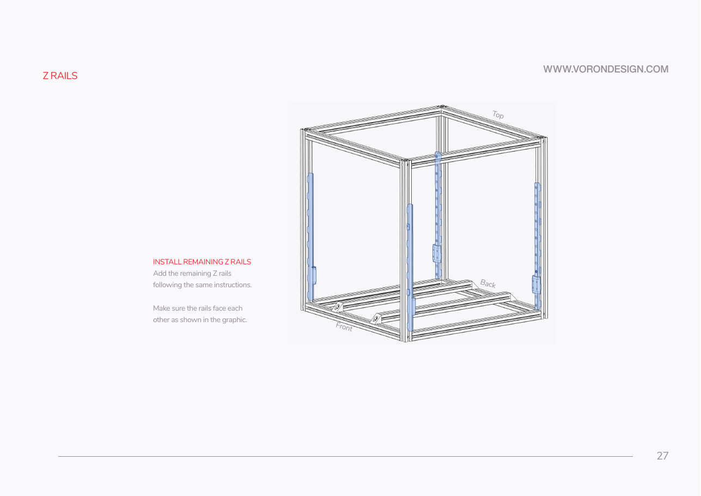
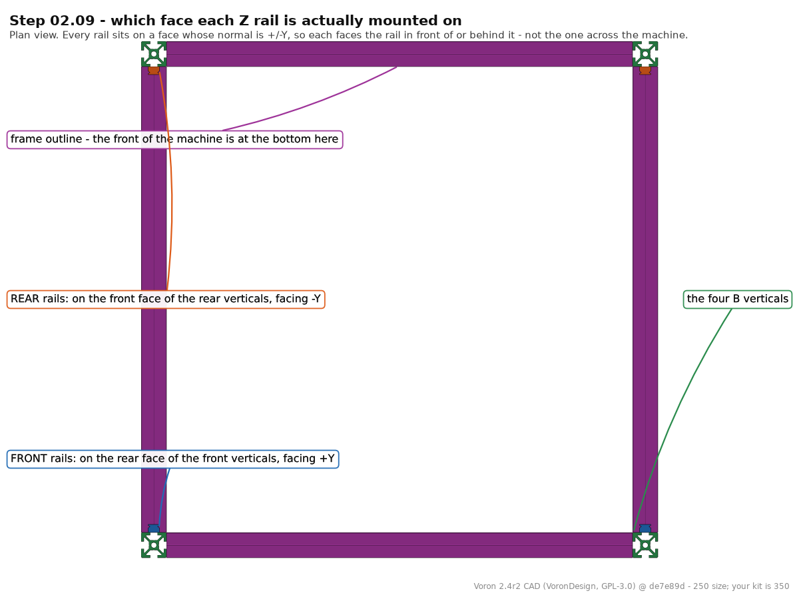
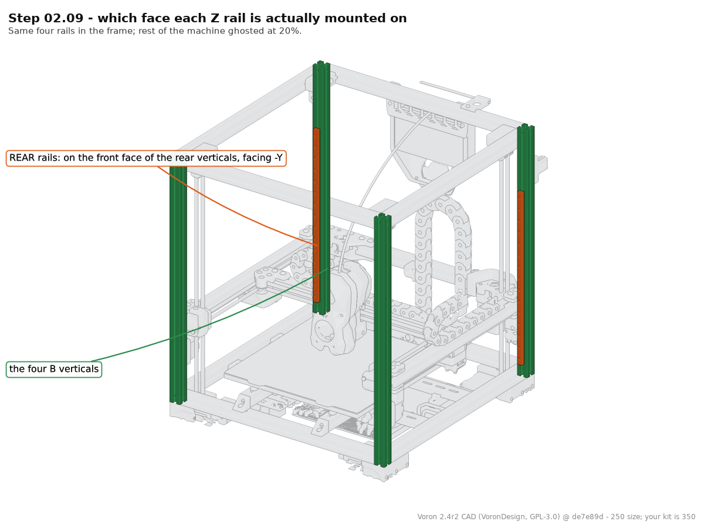

**What you're looking at:** Manual p.27 — all four Z rails on their verticals. Read the graphic for the mounting face, not the pairing: in the official CAD every Z rail sits on a face whose normal points along ±Y, so the two left-hand rails face each other across the machine's depth and the two right-hand rails do the same. All four carriages therefore travel in the same two planes the gantry's Z joints need.

**Parts:** MGN9H 400 mm rails ×3; M3×8 SHCS ×27; M3 roll-in T-nut ×27.

**Do:** Repeat Steps 02.06–02.08 on the other three vertical extrusions. **Each rail faces the other rail on its own side of the machine** — front-left faces rear-left, front-right faces rear-right — so all four rails are mounted on faces whose normal runs front-to-back, and the two front rails are parallel to each other rather than opposed. Keep the same 3 mm bottom gap (the hex key) and the same nine-hole pattern (holes 2–18) on all four.

**Check:** Four rails installed; sight along the machine's left side and then its right — on each side the two rails point at each other. All four bottom gaps equal, every carriage taped or stoppered, every carriage running smoothly over full travel.

⚠ Manual p.27 says only *"make sure the rails face each other as shown in the graphic"* and leaves the pairing to the drawing. An earlier revision of this step read it as front-left facing front-**right**; the official CAD at the pinned commit `de7e89d` says otherwise — every Z rail's mounting face is normal to ±Y, with the two rear rails facing forward (rail at y ≈ 345.5–352 on verticals at y ≈ 352–372) and the two front rails facing rearward (rail at y ≈ −18 to −11.5 on verticals at y ≈ −38 to −18). Corrected 2026-09-05. [src](assets/cad/PILOT.md)

Tip: The CAD is the 250 mm machine — its rails are MGN9 300 mm on 430 mm verticals. Yours are MGN9H 400 mm on the 350 verticals; which face the rail is on does not change with size.

Source: [Voron manual p.27](https://github.com/VoronDesign/Voron-2/blob/de7e89d/Manual/Assembly_Manual_2.4r2.pdf#page=27) · [CAD-render pilot §8 — Z rail orientation](assets/cad/PILOT.md) · [Voron-2 CAD `Voron_2.4r2_Assembly_STEP.zip` @ `de7e89d`](https://github.com/VoronDesign/Voron-2/blob/de7e89d/CAD/Voron_2.4r2_Assembly_STEP.zip) · CAD: Voron 2.4r2 STEP @ de7e89d

### Step 02.10 — Optional: fit the LDO rail stops at the top of each Z rail

{ width=240 }
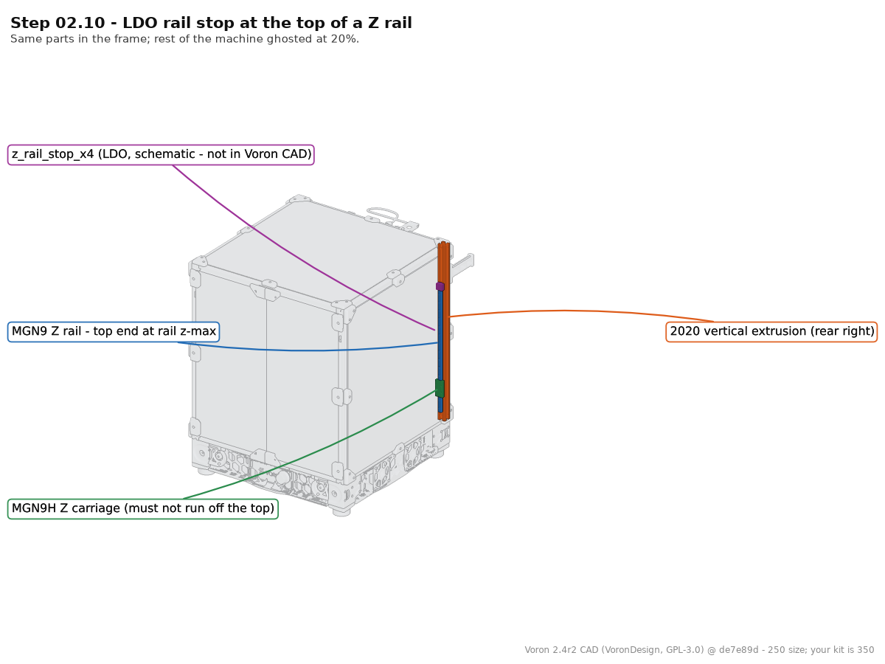

**What you're looking at:** The grey render is the actual STL of the LDO **rail stop** — a small printed clip that caps the rail's top end so a carriage cannot run off it during the gantry install in Ch 06. The CAD render shows where it goes: the top of one Z rail, where the rail stops short of the vertical extrusion's end — that free length is where the stop clips on, and the carriage below it is the thing the stop keeps captive. The stop itself is not in the Voron CAD (it is LDO's part), so the renderer draws it as a labelled placeholder.

**Parts:** `z_rail_stop_x4.stl` ×4 (LDO repo, black) — printed in batch **B05**, which comes *after* this chapter in the timeline.

**Do:** LDO publishes an optional printed stop that clips to the top of each Z rail so a carriage cannot run off the top end during the gantry install in Chapter 06. If B05 is already printed, fit them now while the rails are still open and accessible. If it is not, skip this step: the masking tape or shipping stoppers from Step 02.08 cover you until Ch 06 Step 06.10, where the printed stops go on at the top of each rail.

**Check:** A stop at the top of each of the four rails, or a conscious decision to defer them to Ch 06 with the tape left in place.

Tip: LDO also uses a rubber rail stopper under the Z joints as a gantry rest at manual p.114–116. That is Chapter 06 — do not confuse the two. [src](https://docs.ldomotors.com/voron/voron2/build-faq)

Tip: The CAD rail is MGN9 300 mm on a 430 mm vertical (250), leaving ~107 mm of bare extrusion above the rail. Your 400 mm rail on the 350 vertical leaves a different length — the stop clips to the rail end, not to a dimension.

Source: [LDO printed parts guide (Rev D)](https://docs.ldomotors.com/en/voron/voron2/printed_part_guide_rev_d) · [LDO Build Notes (Rev D)](https://docs.ldomotors.com/voron/voron2/build-faq) · [CAD render — assets/cad/PILOT.md](assets/cad/PILOT.md) · [Video: Part 4 @1:27:15](https://www.youtube.com/watch?v=ViB5Ulc9zDI&list=PL0fUJbigELQPqpeGOgHYisG4KaSXVtnNY&t=5235s) · CAD: Voron 2.4r2 STEP @ de7e89d

Pause: ~35 min since the last pause — all four Z rails are on, facing each other, sharing the same ~3 mm bottom gap and hole pattern, every carriage taped or stoppered. The frame is still the right way up. Do not turn it over until the carriages are secured.

### Step 02.11 — Turn the printer upside down and pre-load the deck T-nuts

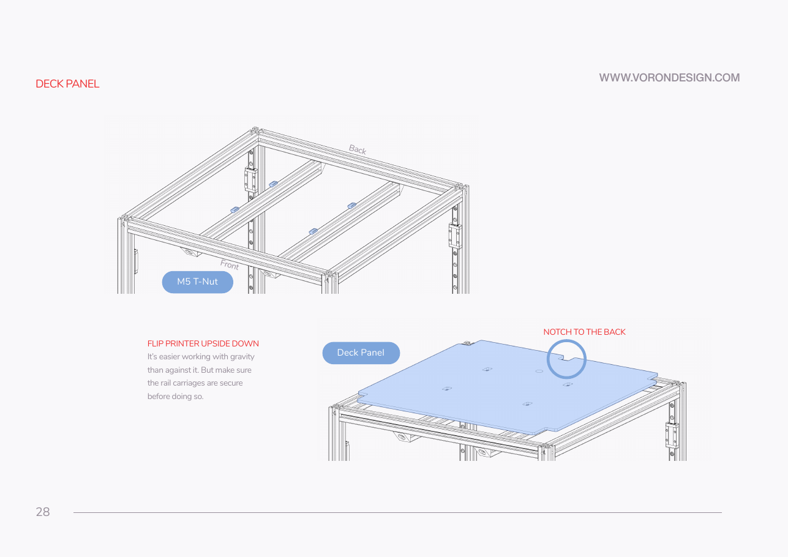

**What you're looking at:** Manual p.28 — the frame inverted, with four M5 roll-in T-nuts dropped into the top slots of the two bed extrusions. The printer spends the next fifteen manual pages upside down because every Z drive bolts to the *underside* of the bottom frame rails.

**Parts:** M5 roll-in T-nut ×4.

**Do:** Confirm every carriage is taped, then turn the frame upside down onto the flat reference surface. Slide **four M5 T-nuts** into the upward-facing slots of the two bed extrusions — two per extrusion, roughly where the deck panel's four holes will land.

**Check:** Frame sits flat and does not rock in this orientation; four T-nuts in, free to slide, none dropped inside an extrusion.

Tip: while the frame is inverted and the bottom extrusions are in front of you, load the 16 drive-corner M5 T-nuts too — four per bottom corner, two in each of the two extrusions that meet there — so Step 02.30 is just sliding them under the holes. Test-fit each slot once; LDO's T-nut tolerance note applies. [src](https://docs.ldomotors.com/voron/voron2/build-faq)

Source: [Voron manual p.28](https://github.com/VoronDesign/Voron-2/blob/de7e89d/Manual/Assembly_Manual_2.4r2.pdf#page=28)

### Step 02.12 — Caliper the deck panel and choose the support thickness

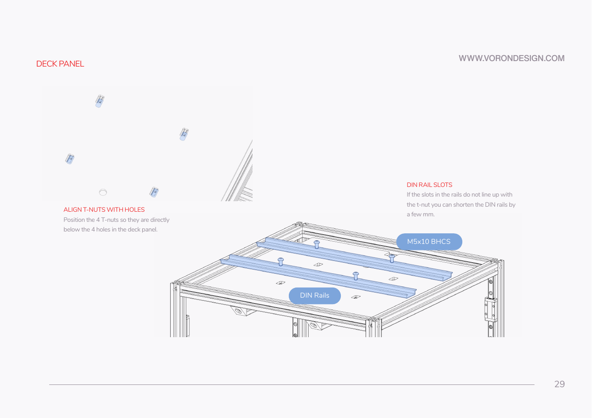

**What you're looking at:** Manual p.29 — the deck panel and its support clips. The **deck panel** is the acrylic floor that separates the electronics bay below from the print chamber above ([glossary](16-glossary.md#d)); the printed clips twist into the bottom-frame extrusions' slots and their ledges carry the panel's edges, and their slot width has to match the panel's thickness, which is why you caliper it rather than read it.

**Parts:** deck panel; caliper; `deck_support_3mm_x8` ×8 (printed, B01); `deck_support_4mm_x8` only if the caliper says 4 mm — a 30-minute reprint.

**Do:** Measure the actual thickness of your deck panel with the caliper, in three places. **Do not resolve this from documents.** Pick the clip set that matches what you measured; the clips go in at Step 02.14, after the panel.

**Check:** Three readings agree to within 0.1 mm, and the number is written in your build log. You have eight clips of the matching thickness on the bench.

⚠ **Rev D+ / LDO:** LDO's build note for p.29–30 says the LDO deck panel is **4 mm nominal — use `deck_support_4mm`**, but the Rev D 350 BOM lists the deck panel as *469×469×**3 mm***. The two LDO documents disagree (survey §4.3). The size-specific 350 BOM wins as the default, so B01 prints the **3 mm** set; both variants are 1.1 g and minutes of print time, so measure, fit whichever matches, reprint the other if you have to, and write the measured number in your build log. [src](https://docs.ldomotors.com/voron/voron2/build-faq) · [BOM](https://docs.ldomotors.com/en/voron/voron2/350_BOM/Rev_D)

Source: [Voron manual p.29](https://github.com/VoronDesign/Voron-2/blob/de7e89d/Manual/Assembly_Manual_2.4r2.pdf#page=29) · [LDO Build Notes (Rev D)](https://docs.ldomotors.com/voron/voron2/build-faq) · [LDO 350 Rev D BOM](https://docs.ldomotors.com/en/voron/voron2/350_BOM/Rev_D) · [Video: Part 2 @0:56:54](https://www.youtube.com/watch?v=2U0YahE8w_0&list=PL0fUJbigELQPqpeGOgHYisG4KaSXVtnNY&t=3414s)

### Step 02.13 — Drop the deck panel in, notch to the back

**What you're looking at:** Manual p.28 — the deck panel dropping onto the bed extrusions. The panel is cut about 1 mm smaller than the bottom frame's opening (a 469 mm panel on the 350, per the LDO BOM), so it sits *inside* the frame, lying on the two bed extrusions; upright, it hangs under them. The cut-out notch is the pass-through every cable between the chamber and the bay uses; put it anywhere but the back and there is no route for the bed harness, the toolhead umbilical or the Z chain.

**Parts:** deck panel ×1.

**Do:** Peel any protective film. Lower the panel into the bottom frame's opening with the **cut-out notch toward the back** of the printer — the notch is the wire pass-through and it is wrong in every other orientation — so it drops inside the frame and lies flat on the two bed extrusions, flush with the frame face. Line the four bolt holes up over the four T-nuts.

**Check:** Notch at the back. Panel inside the frame opening, flat on both bed extrusions and flush with the frame face, no rock and no gap at a corner.

Source: [Voron manual p.28](https://github.com/VoronDesign/Voron-2/blob/de7e89d/Manual/Assembly_Manual_2.4r2.pdf#page=28) · [LDO 350 Rev D BOM](https://docs.ldomotors.com/en/voron/voron2/350_BOM/Rev_D)

### Step 02.14 — Fit the deck support clips

**What you're looking at:** Manual p.29 — eight deck support clips going into the extrusion slots. Each `deck_support` is a small T-tab (about 20 × 14.5 × 5.8 mm on the STL) with a ledge: the tab locks in an extrusion slot and the ledge lies over the panel edge. When the printer is turned upright these eight ledges are the only thing carrying the panel until Ch 09 bolts it — the four M5×10 deck bolts wait for Ch 09 Step 09.5.

**Parts:** deck support clips ×8 (the thickness you chose in Step 02.12).

**Do:** Each clip is a T-tab with a ledge. Turn the tab end-on, push it into the **inward-facing slot of a bottom-frame extrusion** just above the panel edge (the printer is inverted, so "above" is the side away from the bed extrusions), and twist it 90° so the tab locks in the slot and the ledge lies over the panel edge. Two per side, evenly spaced along the span (spacing not specified by Voron or LDO). Fitted before the panel they sit in the panel's way, which is why the panel went in first. (Geometry from the STL — verify with one clip in hand.)

**Check:** Eight ledges over the panel edge, all the same thickness variant; the panel cannot be lifted out of the frame.

⚠ **Rev D+ / LDO:** this step is not in the official manual at all. LDO adds it here: *"This is a good time to install the deck supports."* Doing it later means the deck comes out and the frame comes partly apart (§5.2 W4). [src](https://docs.ldomotors.com/voron/voron2/build-faq)

Source: [Voron manual p.29](https://github.com/VoronDesign/Voron-2/blob/de7e89d/Manual/Assembly_Manual_2.4r2.pdf#page=29) · [LDO Build Notes (Rev D)](https://docs.ldomotors.com/voron/voron2/build-faq) · [Video: Part 2 @0:56:54](https://www.youtube.com/watch?v=2U0YahE8w_0&list=PL0fUJbigELQPqpeGOgHYisG4KaSXVtnNY&t=3414s)

### Step 02.15 — Line the four M5 T-nuts up under the deck holes and stop there

**What you're looking at:** Manual p.29 — the four T-nuts sitting under the four holes in the deck, and nothing else. The bolts that go through those holes also clamp the two DIN rails that carry the electronics, so they belong to one step in Ch 09 rather than being fitted twice.

**Parts:** the four M5 T-nuts from Step 02.11. **No bolts and no DIN rails yet.**

**Do:** Slide each T-nut until it sits directly under one of the four holes in the deck panel, then leave them there — once the panel is down you cannot see them, and Ch 09 has to find them again. The two 35 mm DIN rails and the four M5×10 BHCS that clamp them — and the deck — down go on in **Ch 09 Step 09.5**, which is the authoritative DIN-rail step (LDO's left-to-right orientation, plus the four end caps). Doing it twice is how the same four bolts end up counted in two chapters.

**Check:** Four T-nuts visible through the four deck holes, free to nudge but not lost inside an extrusion. Panel sitting flat, unbolted, notch to the back.

Tip: If a DIN rail's own slots will not line up when you get there, Ch 09 shortens the DIN rail rather than moving the panel. [src](https://docs.ldomotors.com/en/voron/voron2/wiring_guide_rev_d#installing-the-din-rails-and-wire-ducts)

Source: [Voron manual p.29](https://github.com/VoronDesign/Voron-2/blob/de7e89d/Manual/Assembly_Manual_2.4r2.pdf#page=29) · [LDO wiring guide § Installing the DIN Rails and Wire Ducts](https://docs.ldomotors.com/en/voron/voron2/wiring_guide_rev_d#installing-the-din-rails-and-wire-ducts)

### Step 02.16 — Fix the printer's orientation in your head

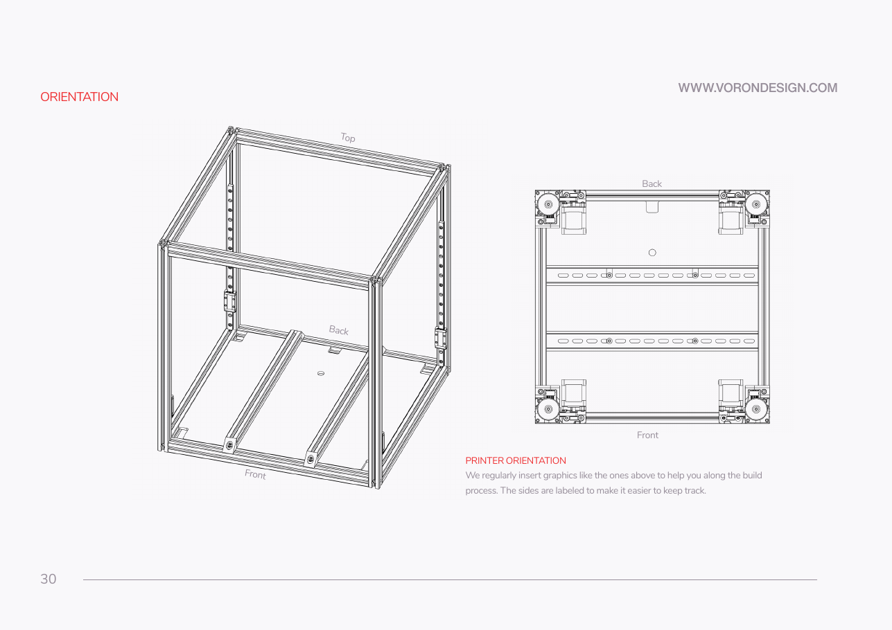

**What you're looking at:** Manual p.30 — the orientation cube the manual prints on every graphic from here on. With the printer inverted, front and back stop being obvious, and every "which corner" callout for the rest of the chapter is read against that marker.

**Parts:** none.

**Do:** The manual now labels Top / Front / Back on every graphic, and the printer spends the next fifteen pages upside down. Put a strip of masking tape on the **front bottom frame rail** — the one the front ends of the two bed extrusions run into — and write "FRONT" on it. Every "which corner is this?" callout for the rest of the chapter is read relative to that tape.

**Check:** Front face marked, and you can restate the Z0–Z3 map from Step 02.02 with the printer inverted.

Source: [Voron manual p.30](https://github.com/VoronDesign/Voron-2/blob/de7e89d/Manual/Assembly_Manual_2.4r2.pdf#page=30)

Pause: ~30 min since the last pause — the printer is inverted and stable, the deck panel is in with its notch to the back and captured by eight support clips of the measured thickness, the four M5 T-nuts sit under the deck holes, and the FRONT tape is on. Leave the deck unbolted: those four bolts belong to Ch 09 Step 09.5.

### Step 02.17 — Fit the 20T pulley to the 5×60 shaft, 33 mm out

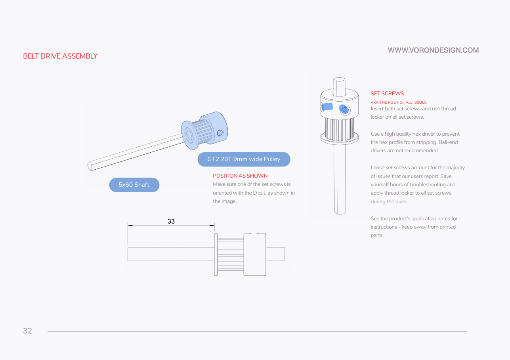

**What you're looking at:** Manual p.32 — the Z drive's shaft assembly starting to come together. The **5 × 60 mm shaft** is the axle the whole drive turns on; the **20T pulley** clamped near one end is what the long Z belt runs over to lift that corner of the gantry. A **set screw** is a headless screw that clamps a pulley to a shaft; one of each pair has to land on the shaft's machined flat, because a set screw tightened onto round steel will eventually slip ([glossary](16-glossary.md#s)).

**Parts:** 5×60 mm shaft ×1; GT2 20T 9 mm pulley ×1; M4×4 set screws ×2 (pre-threadlocked).

**Do:** Slide the 20T 9 mm pulley onto the shaft so **33 mm of shaft protrudes past the pulley** on the long side (the dimension on the page). Rotate the pulley until you can **see the D-cut flat down one set-screw hole** — look before you fit the screws, because a set screw bedded on round steel also passes a hand-twist. Fit both set screws and tighten with a proper hex driver — **not** a ball-end driver, which cams out and rounds the socket.

**Check:** Before the screws went in, one set-screw hole showed the flat. Then 33 mm on the caliper from the long shaft end to the pulley's toothed face (p.32).

⚠ **Rev D+ / LDO:** the kit's M4×4 set screws arrive with threadlocker pre-applied — do not add more. If a screw has clearly been used before or has no visible compound, add Loctite 243 and keep it off the printed parts. [src](https://docs.ldomotors.com/en/voron/voron2/350_BOM/Rev_D)

Source: [Voron manual p.32](https://github.com/VoronDesign/Voron-2/blob/de7e89d/Manual/Assembly_Manual_2.4r2.pdf#page=32) · [LDO 350 Rev D BOM](https://docs.ldomotors.com/en/voron/voron2/350_BOM/Rev_D)

### Step 02.18 — Verify the pulley with the jig, then repeat ×4

**What you're looking at:** Manual p.32 with the printed `pulley_jig` — a flat gauge with steps cut to the pulley heights the build uses. It repeats the 33 mm dimension across all four shafts without re-measuring, so the four corners lift on belts that all sit in the same plane.

**Parts:** `pulley_jig.stl`; the remaining three shafts and 20T pulleys; M4×4 set screws ×6.

**Do:** Check the pulley position against the printed `pulley_jig` — it gives you a repeatable stack height without re-measuring. Build the other three shaft/pulley pairs the same way.

**Check:** Four shafts, four 20T pulleys, all at the same protrusion, all with a set screw on the flat, all eight set screws tight.

Source: [Voron manual p.32](https://github.com/VoronDesign/Voron-2/blob/de7e89d/Manual/Assembly_Manual_2.4r2.pdf#page=32) · [Voron-2 `STLs/Tools`](https://github.com/VoronDesign/Voron-2/tree/de7e89d/STLs/Tools)

### Step 02.19 — Build the bearing/pulley stack on each shaft

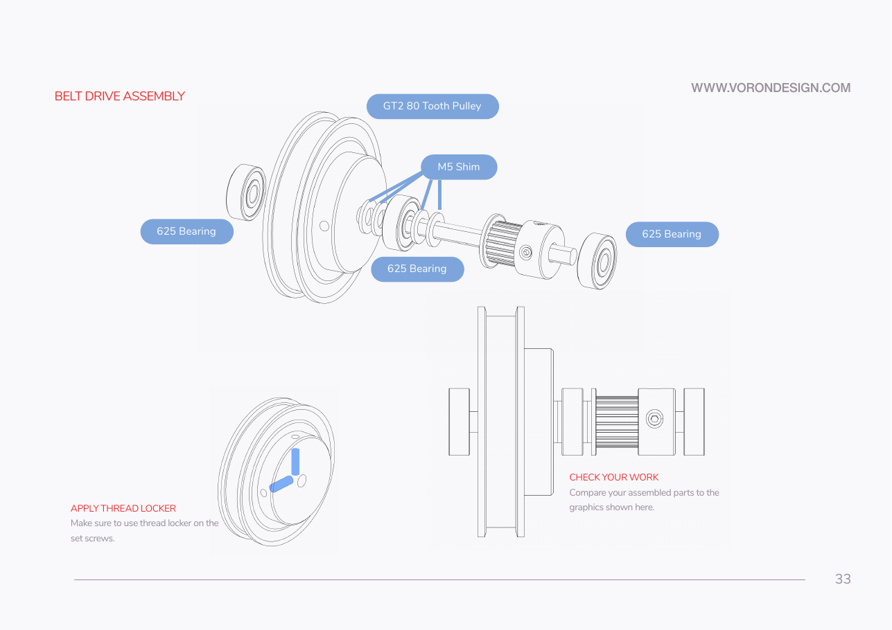
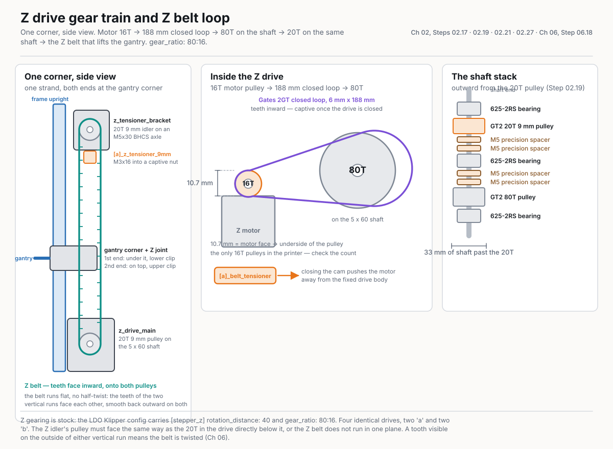

**What you're looking at:** Manual p.33 — the full stack on the shaft, in section. Three **625-2RS** bearings (plain 5 × 16 × 5 mm ball bearings, used only in the Z drives) carry the shaft; the **80T pulley** is the big one the short 188 mm belt drives, and the 80:16 tooth ratio between it and the motor pulley is the reduction that gives Z its resolution. The brass **precision spacers** between them set exactly how far apart everything sits ([glossary](16-glossary.md#p)). The diagram's shaft-stack panel lays out the same order this step gives, including the 33 mm of shaft that sits past the 20T pulley.

**Parts:** per drive — 625-2RS bearings ×3; GT2 80T pulley ×1; M5 precision spacer 1 mm ×4; the shaft from Step 02.17.

**Do:** Working outward from the 20T pulley along the shaft, the order in the exploded view is: **625 bearing** (outboard of the 20T pulley's set-screw collar), then on the other side of the 20T pulley — **two M5 precision spacers, a 625 bearing, two more M5 precision spacers, the 80T pulley, and the last 625 bearing on the very end of the shaft.** Push the bearings on square by hand; if one needs a press, press on the *inner* race only.

**Check:** Compare your stack side by side with the p.33 graphic before you go any further. Both outer bearings free to spin, no spacer trapped crooked, the 80T pulley running true (spin the shaft and watch the pulley rim for wobble).

⚠ **Rev D+ / LDO:** the manual says "M5 Shim". **The kit supplies brass M5 precision spacers instead — use those, everywhere in the manual from p.19 onward unless a note says otherwise.** Four per drive, 16 for this chapter. [src](https://docs.ldomotors.com/voron/voron2/build-faq)

Source: [Voron manual p.33](https://github.com/VoronDesign/Voron-2/blob/de7e89d/Manual/Assembly_Manual_2.4r2.pdf#page=33) · [LDO Build Notes (Rev D)](https://docs.ldomotors.com/voron/voron2/build-faq) · [Video: Part 2 @0:06:45](https://www.youtube.com/watch?v=2U0YahE8w_0&list=PL0fUJbigELQPqpeGOgHYisG4KaSXVtnNY&t=405s)

### Step 02.20 — Threadlock the 80T pulley set screws and check your work

**What you're looking at:** Manual p.33 — the 80T pulley's two set screws. This is the joint the entire weight of the gantry hangs on through the belt, and loose set screws are the most-reported failure on this machine, so both get threadlocker and one lands on the flat.

**Parts:** M4×4 set screws ×2 per 80T pulley.

**Do:** Set the 80T pulley so a set screw meets the flat of the shaft, fit both set screws with threadlocker, and tighten. The manual is blunt about this: loose set screws account for the majority of user problems on this machine. Build all four stacks.

**Check:** Four complete shaft assemblies, all matching the graphic, none able to slip when you twist the 80T pulley against the shaft by hand.

Source: [Voron manual p.33](https://github.com/VoronDesign/Voron-2/blob/de7e89d/Manual/Assembly_Manual_2.4r2.pdf#page=33) · [Video: Part 1 @3:46:04](https://www.youtube.com/watch?v=feTxcc0LIWM&list=PL0fUJbigELQPqpeGOgHYisG4KaSXVtnNY&t=13564s)

### Step 02.21 — Fit the 188 mm closed belt loop over the 80T pulley

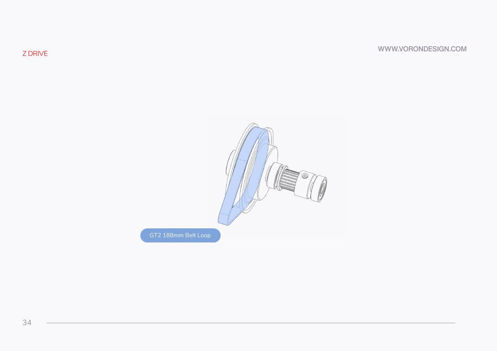

**What you're looking at:** Manual p.34 — the closed 188 mm belt loop dropped over the 80T pulley. It is a continuous loop with no join, so it has to be threaded on before the drive is closed; there is no way to add it afterwards without taking the drive apart again. The diagram's gear-train panel shows the same 188 mm loop becoming captive between the motor's 16T pulley and the shaft's 80T pulley once the drive body closes.

**Parts:** Gates 2GT closed loop 6 mm × 188 mm ×1 per drive.

**Do:** Drop the closed belt loop over the 80T pulley, teeth inward, before the shaft goes into the housing — the loop has no join, so this is the only moment it can go on. This loop is captive once the drive is closed — there is no way to add it later without dismantling the drive.

**Check:** Loop seated in the 80T pulley's teeth, hanging free, not twisted.

⚠ **Rev D+ / LDO:** LDO publishes **no** deviation for the Z belt loop, the 16T/80T pulleys or the Z gear ratio — the Build Notes for p.22–51 cover only p.29–30 (deck supports) and p.39 (stepper wiring). The kit's Klipper config confirms the stock arrangement: `[stepper_z] rotation_distance: 40`, `gear_ratio: 80:16`. Use the 188 mm loops as supplied. [src](https://github.com/MotorDynamicsLab/LDOVoron2/blob/main/Firmware/leviathan-printer-rev-d-sbv2.cfg)

Source: [Voron manual p.34](https://github.com/VoronDesign/Voron-2/blob/de7e89d/Manual/Assembly_Manual_2.4r2.pdf#page=34) · [LDO Build Notes (Rev D)](https://docs.ldomotors.com/voron/voron2/build-faq) · [LDO Klipper config `leviathan-printer-rev-d-sbv2.cfg`](https://raw.githubusercontent.com/MotorDynamicsLab/LDOVoron2/667521d/Firmware/leviathan-printer-rev-d-sbv2.cfg) · [Video: Part 1 @3:29:28](https://www.youtube.com/watch?v=feTxcc0LIWM&list=PL0fUJbigELQPqpeGOgHYisG4KaSXVtnNY&t=12568s)

Pause: ~35 min since the last pause — four complete shaft assemblies: 20T pulleys at 33 mm, bearing and precision-spacer stacks built, 80T pulleys threadlocked, and the 188 mm belt loops hung on. The bearings are only slid onto the shaft here, so nothing is mid-assembly. Do not start Step 02.22 until you can close a drive in one sitting.

### Step 02.22 — Seat the shaft assembly into `z_drive_retainer` (the shallow half)

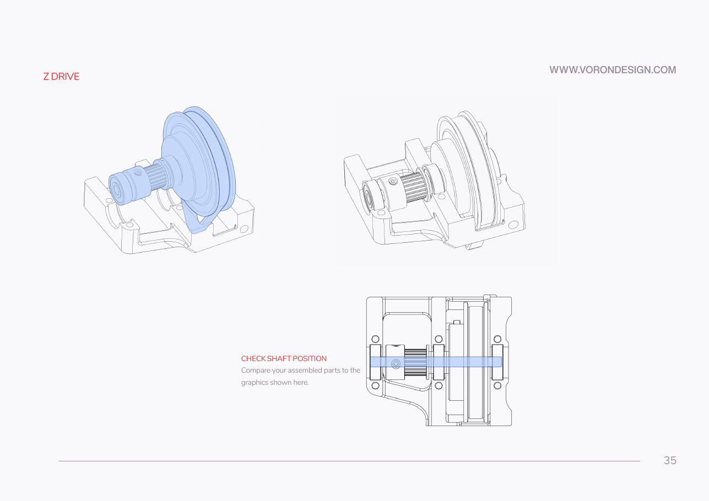

**What you're looking at:** Manual p.35 — the shaft assembly lowering into `z_drive_retainer`, the shallow tray half of the housing (16 mm deep, six brass inserts in its flat outer face). Its three half-round cradles take the outer races of the 625 bearings; the deeper `z_drive_main` closes over them at Step 02.24 and clamps them, which is what fixes the shaft's position relative to the frame.

**Parts:** `z_drive_retainer_a` or `_b` ×1 (inserts fitted, Step 02.04); the belted shaft assembly from Step 02.21.

**Do:** Put the retainer print-face down — that is the half with six brass inserts in its flat face; inserts down, cradles up. Lower the shaft assembly so each 625 drops into a cradle and the loop lies in the pocket. The bearings drop into half-round cradles and are clamped when the halves close; nothing is pressed into a bore. If one will not seat by hand the cradle is undersized — go back to the B00 press-fit coupon result; do not heat or hammer.

**Check:** All three bearings down in their cradles, the shaft parallel to the retainer's flat face, and the belt loop lying in the pocket.

Source: [Voron manual p.35](https://github.com/VoronDesign/Voron-2/blob/de7e89d/Manual/Assembly_Manual_2.4r2.pdf#page=35)

### Step 02.23 — Check the shaft position against the section view

**What you're looking at:** Manual p.35's section view beside your part. The section is the only place the manual shows which side of the 20T pulley each spacer and bearing belongs on — worth a careful comparison, because after the main goes on, six long screws have to come back out to fix it.

**Parts:** none.

**Do:** Hold your part next to the two isometric views and the section view on the page. Confirm the 20T pulley is on the same side as in the drawing, that the spacer stack sits between the same two bearings, and that the shaft ends are flush the same way.

**Check:** Your assembly and the drawing are indistinguishable. Fix it now — after the main goes on, six M3×40 have to come back out.

Source: [Voron manual p.35](https://github.com/VoronDesign/Voron-2/blob/de7e89d/Manual/Assembly_Manual_2.4r2.pdf#page=35)

### Step 02.24 — Close the drive with `z_drive_main` and six M3×40

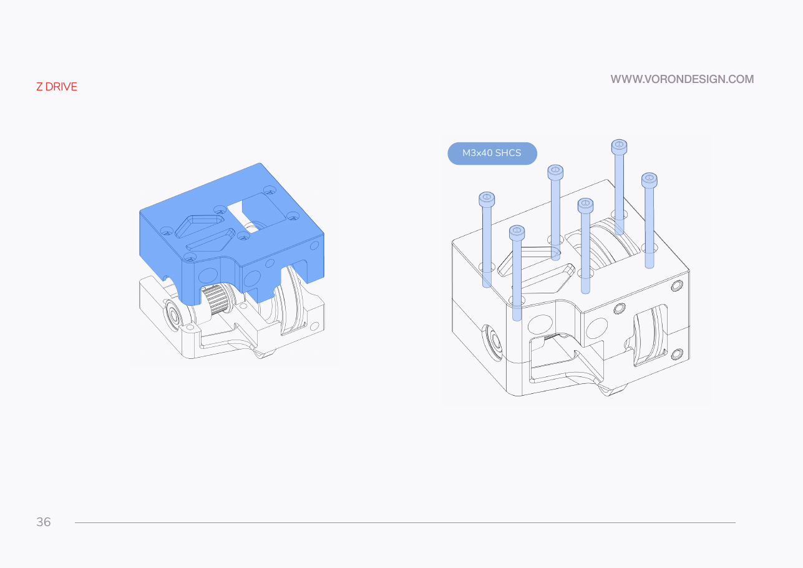

**What you're looking at:** Manual p.36 — `z_drive_main`, the deeper half (the blue part on the page), closing over the shaft. Its flat face carries six counterbored holes and no inserts; the belt window is in another face and the two deep M5 wells for the frame bolts are in its side. Its cradles clamp the same three bearings from the other side, and the six M3×40 run down through the main, across the joint and through the retainer, and bite the inserts in the retainer's outer face for the last few millimetres. `_a` and `_b` mains are mirror images: two of each, matched to the retainer they close.

**Parts:** `z_drive_main_a` or `_b` ×1 (side inserts fitted, Step 02.04); M3×40 SHCS ×6.

**Do:** Lower the main — the deeper half; its flat face has six counterbored holes and no inserts — over the shaft, counterbores up, until the two halves meet along the joint line with no gap. Drive the six M3×40 SHCS down through the counterbores; they pass through both halves and bite the retainer's inserts at the bottom of the stack. Tighten in a criss-cross pattern, a little at a time, so the halves pull together evenly. Snug, then stop — the thread is a brass insert in ASA. **Every head must sink into a counterbore — if a head is sitting on a brass ring you have the halves upside down: stop and back it out.**

**Check:** Six heads down in their counterbores, no gap anywhere along the joint line. The shaft still spins freely by hand with the belt on. If it binds, a bearing is trapped crooked — back the screws off and reseat.

Source: [Voron manual p.36](https://github.com/VoronDesign/Voron-2/blob/de7e89d/Manual/Assembly_Manual_2.4r2.pdf#page=36) · [Video: Part 1 @3:29:31](https://www.youtube.com/watch?v=feTxcc0LIWM&list=PL0fUJbigELQPqpeGOgHYisG4KaSXVtnNY&t=12571s)

### Step 02.25 — Fit the orange baseplate and its captive M5 nut

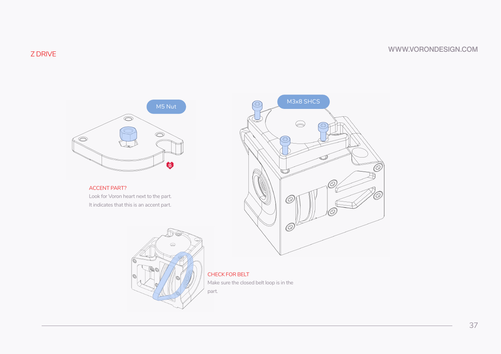
![`[a]_z_drive_baseplate_a` (left) vs `_b` (right) — plan view, counterbored face up](assets/parts/pair-z_drive_baseplate_x2-top.png)

**What you're looking at:** Manual p.37 — the orange `[a]_z_drive_baseplate`, the accent-coloured foot of the drive, with an M5 hex nut dropped into a pocket in it. That captive nut is the thread the rubber foot's M5×16 screws into at Step 02.36 — no nut, no foot. The Voron heart embossed on the part is the manual's marker for an accent-colour piece. `_a` and `_b` are mirrors — counterbored face up, C-notch opening to your left: the notch is far-left on `_a`, near-left on `_b` — so match the baseplate to the letter you wrote on its drive.

**Parts:** `[a]_z_drive_baseplate_a` or `_b` ×1 (orange); M5 hexnut ×1; M3×8 SHCS ×3.

**Do:** Drop the M5 hexnut into its pocket in the orange baseplate — the Voron heart on the part is the manual's accent-part marker, so this is the piece that ends up in your accent colour. Fit the baseplate across the drive's foot face — the face with the two deep M5 wells and the three side inserts, two in the main and one in the retainer — with the C-notch clearing one of the wells, and secure it with three M3×8 SHCS into those inserts.

**Check:** M5 nut fully seated in its pocket and not able to spin. Three M3×8 in, plate flat against the drive body with no rock.

Source: [Voron manual p.37](https://github.com/VoronDesign/Voron-2/blob/de7e89d/Manual/Assembly_Manual_2.4r2.pdf#page=37)

### Step 02.26 — Confirm the belt loop is captured

**What you're looking at:** Manual p.37 — the assembled drive with the belt loop visible inside it. The loop has to hang out of the belt window far enough to hook over the motor's 16T when the motor is slid in beside the bolted-down drive at Step 02.32, so this is the last chance to see it before then.

**Parts:** none.

**Do:** Look into the drive through the openings. The closed 188 mm loop must be inside the part, around the 80T pulley, with enough slack hanging to reach the motor pulley.

**Check:** Belt visible inside the drive and free to move. Repeat Steps 02.22–02.26 for the other three drives before moving on — two `a` and two `b`.

Source: [Voron manual p.37](https://github.com/VoronDesign/Voron-2/blob/de7e89d/Manual/Assembly_Manual_2.4r2.pdf#page=37)

Pause: ~35 min since the last pause — all four drives closed: shafts seated, retainers down on six M3×40 each, orange baseplates on with their captive M5 nuts, belt loops captive and free. Each drive is one ~9-minute unit, so if you stop earlier, stop with a drive fully closed and its baseplate on — never with a drive half-closed.

### Step 02.27 — Fit the 16T pulley to a Z motor at 10.7 mm

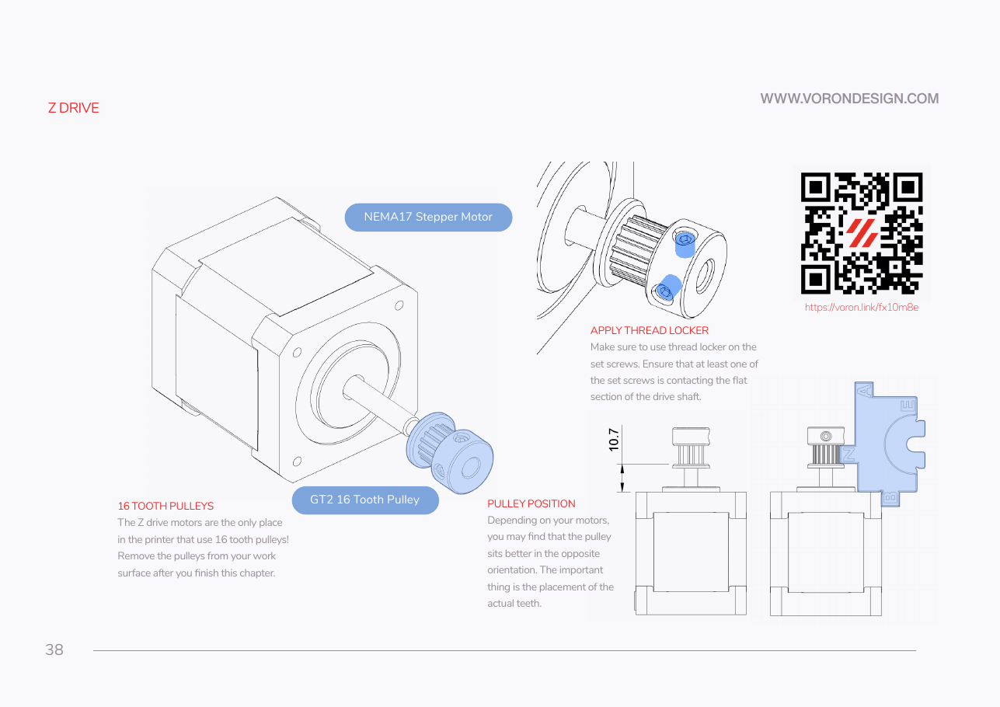

**What you're looking at:** Manual p.38 — a Z stepper motor with its **16T pulley**. The Z motors are the only place in this printer that uses 16T; the 20T pulleys everywhere else look almost identical, and fitting a 20T here silently changes the gear ratio the firmware assumes, so every Z dimension comes out wrong without any error appearing ([glossary](16-glossary.md#p)).

**Parts:** NEMA17 Z motor `LDO-42STH48-2004AC` ×1; GT2 **16T** pulley ×1; M4×4 set screws ×2.

**Do:** **These are the only 16T pulleys in the printer** — check the tooth count on the pulley itself, not the bag it came out of. Slide it onto the motor shaft so the gap from the motor's front face to the underside of the pulley is **10.7 mm**. Rotate so at least one set screw contacts the flat of the motor shaft, then fit and tighten both with threadlocker. Depending on the motor, the pulley may sit better flipped; what matters is where the *teeth* end up, not which way the boss faces.

**Check:** 10.7 mm on the caliper. Tooth band at the same height as the 80T it will drive — check with a closed drive alongside. Pulley will not slip on the shaft under hand force.

Tip: when all four are done, physically remove every remaining 16T pulley from the bench so one cannot end up on an A/B motor in Chapter 04. [src](https://docs.ldomotors.com/voron/voron2/build-faq)

Source: [Voron manual p.38](https://github.com/VoronDesign/Voron-2/blob/de7e89d/Manual/Assembly_Manual_2.4r2.pdf#page=38) · [LDO Build Notes (Rev D)](https://docs.ldomotors.com/voron/voron2/build-faq) · [Video: Part 2 @1:15:06](https://www.youtube.com/watch?v=2U0YahE8w_0&list=PL0fUJbigELQPqpeGOgHYisG4KaSXVtnNY&t=4506s)

### Step 02.28 — Bolt the motor to `z_motor_mount`, watching the cable exit

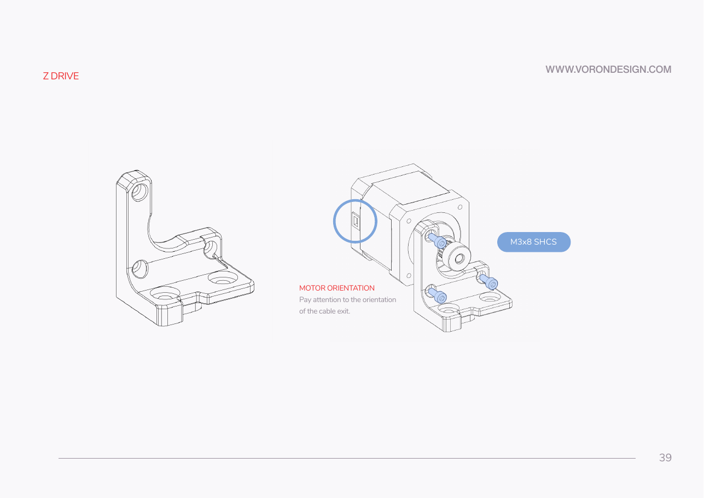

**What you're looking at:** Manual p.39 — the motor bolted to `z_motor_mount`, the printed L-bracket that stands the motor off the frame at the right height for its belt. The mounts are mirrored `_a` / `_b` and the two hands put the motor's cable exit on opposite sides, which is why the cable direction is checked against the graphic rather than chosen. Bench test: stood on its print face with the thick foot arm (two large counterbored holes) on your right running toward you, the thin motor plate is the far edge on `_a`, the near edge on `_b`.

**Parts:** `z_motor_mount_a` or `_b` ×1; M3×8 SHCS ×3.

**Do:** The motor's round boss sits in the half-round notch in the plate — three screw holes only, the fourth corner is open by design. Set the motor in the notch with the **cable exit oriented as in the graphic** (the circled feature on the page) and fit three M3×8 SHCS through the plate's counterbored holes into the motor. Build all four; two mounts are `a`, two are `b`.

**Check:** All four cable exits point the same way relative to their mount, the 16T pulley clears the mount, and the two large M5 clearance holes in the mount's foot are unobstructed.

⚠ **Rev D+ / LDO:** the manual's own stepper wiring instructions for this page do **not** apply to this kit. Wire the Z steppers per the LDO Rev D wiring guide (Z0 front-left→`STEPPER-0`, Z1 rear-left→`STEPPER-1`, Z2 rear-right→`STEPPER-2`, Z3 front-right→`STEPPER-3`). Label each motor cable with a kit cable tag now — in Chapter 10 the four cables are indistinguishable. [src](https://docs.ldomotors.com/voron/voron2/build-faq) · [wiring guide](https://docs.ldomotors.com/en/voron/voron2/wiring_guide_rev_d#connecting-steppers)

Source: [Voron manual p.39](https://github.com/VoronDesign/Voron-2/blob/de7e89d/Manual/Assembly_Manual_2.4r2.pdf#page=39) · [LDO Build Notes (Rev D)](https://docs.ldomotors.com/voron/voron2/build-faq) · [LDO wiring guide § Connecting Steppers](https://docs.ldomotors.com/en/voron/voron2/wiring_guide_rev_d#connecting-steppers) · [Video: Part 2 @1:19:26](https://www.youtube.com/watch?v=2U0YahE8w_0&list=PL0fUJbigELQPqpeGOgHYisG4KaSXVtnNY&t=4766s)

Pause: ~25 min since the last pause — four Z motors carry their 16T pulleys at 10.7 mm and are bolted to their `a`/`b` mounts with the cable exits matched. Get every remaining 16T pulley off the bench before you walk away, and leave the motor cables labelled.

### Step 02.29 — Identify Z0 and start there

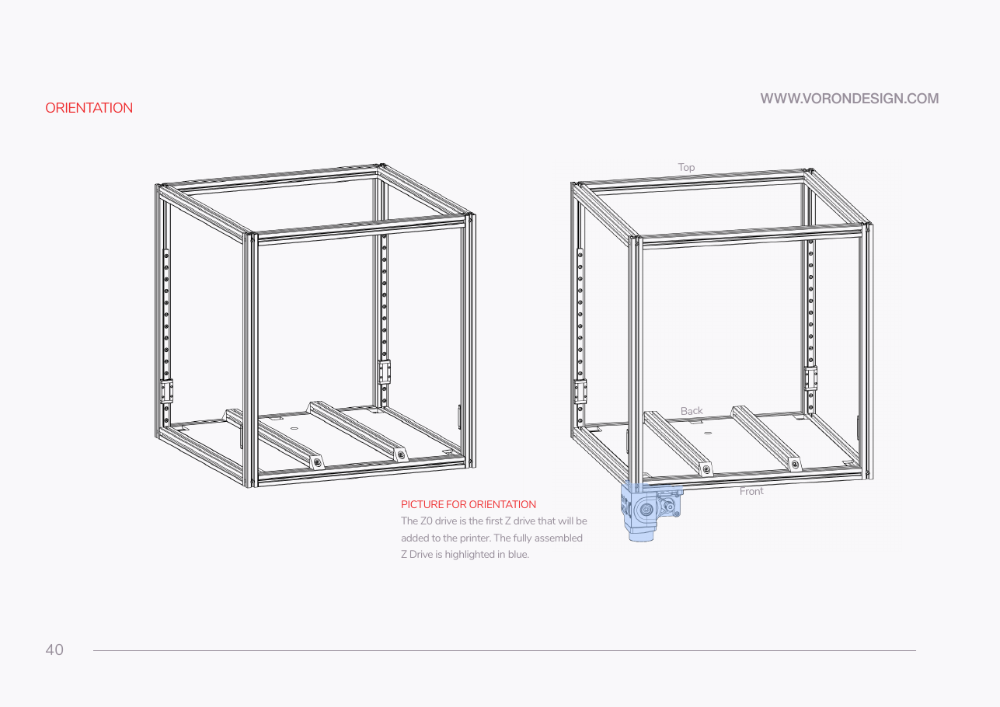

**What you're looking at:** Manual p.40 — the highlighted corner is Z0, front-left. The mirror hand of the printed parts decides which corner an assembly fits, so the drive and motor mount are matched to the corner before a single bolt goes in.

**Parts:** one complete `_a` drive + one `_a` motor/mount assembly.

**Do:** Z0 is the first drive to go on the printer. With the printer upside down, find the corner the graphic highlights — front-left, reading "front" off the FRONT tape from Step 02.16 — and lay an `_a` drive and an `_a` motor assembly beside it (map: `_a` = Z0 front-left and Z2 rear-right, `_b` = Z1 rear-left and Z3 front-right). Dry-fit before any bolt goes in: set the drive in the corner baseplate-up and hold the motor assembly beside it as p.41–42 show. The hand is right when the drive's belt window faces along the extrusion the motor sits on, the motor's foot lies flat on that extrusion, and the 16T lines up with the 80T through the window. If it only works with the `_b` parts, the map is reversed for your parts — swap every `_a` for `_b` for the rest of the chapter and write that in the build log.

**Check:** An `_a` drive and `_a` motor dry-fitted at front-left as p.41–42 show: belt window toward the motor's extrusion, baseplate up, 16T in line with the 80T.

Source: [Voron manual p.40](https://github.com/VoronDesign/Voron-2/blob/de7e89d/Manual/Assembly_Manual_2.4r2.pdf#page=40) · [Voron manual p.41](https://github.com/VoronDesign/Voron-2/blob/de7e89d/Manual/Assembly_Manual_2.4r2.pdf#page=41) · [Voron-2 CAD `Voron_2.4r2_Assembly_STEP.zip` @ `de7e89d`](https://github.com/VoronDesign/Voron-2/blob/de7e89d/CAD/Voron_2.4r2_Assembly_STEP.zip) (corner map)

### Step 02.30 — Pre-load four M5 T-nuts at the Z0 corner

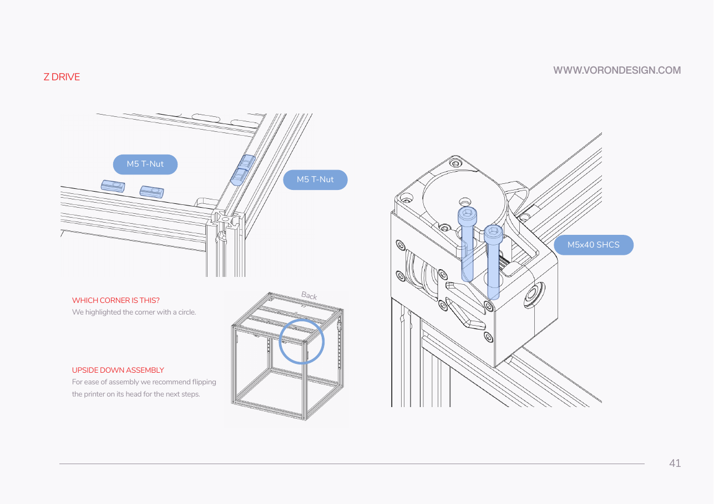

**What you're looking at:** Manual p.41 — four M5 roll-in T-nuts loaded into the two bottom extrusions meeting at this corner. They are the threads for everything that bolts down here: two for the drive body's M5×40, one for the motor foot's M5×10, one for the cam's M5×10.

**Parts:** M5 roll-in T-nut ×4 (or the four you pre-loaded at Step 02.11).

**Do:** Slide four M5 T-nuts into the two bottom extrusions meeting at this corner, two in each: the pair in the extrusion the drive body sits on take the drive's two M5×40; the pair in the extrusion the motor sits on take the motor foot's M5×10 and the cam's M5×10 (p.41). Test-fit them first: LDO warns the extrusion and roll-in T-nut tolerances are tight and vary by extrusion face.

**Check:** Four T-nuts in, two per extrusion, all free to slide, none jammed or dropped inside the extrusion.

Source: [Voron manual p.41](https://github.com/VoronDesign/Voron-2/blob/de7e89d/Manual/Assembly_Manual_2.4r2.pdf#page=41) · [LDO Build Notes (Rev D)](https://docs.ldomotors.com/voron/voron2/build-faq)

### Step 02.31 — Bolt the drive body down with two M5×40

**What you're looking at:** Manual p.41 — the finished drive landing in the corner on two long M5×40 screws that run down the body's two 35 mm wells into the T-nuts; the orange baseplate disc is what you see on top. The drive is the fixed half of the pair — the motor is the part the cam moves at Step 02.34.

**Parts:** M5×40 SHCS ×2; the completed `_a` drive.

**Do:** Set the finished drive into the corner, baseplate up (the printer is inverted, so the foot face points at the ceiling), belt window toward the extrusion the motor will sit on. Drop the two M5×40 SHCS down the two deep wells in the drive body — one well is inside the baseplate's C-notch, the other beside the baseplate — and run them into the T-nuts. Snug so the body sits hard in the corner; final tightening is Step 02.35.

**Check:** Body against both extrusions; the 188 mm loop hanging out of the belt window over the motor's extrusion.

Source: [Voron manual p.41](https://github.com/VoronDesign/Voron-2/blob/de7e89d/Manual/Assembly_Manual_2.4r2.pdf#page=41)

### Step 02.32 — Slide the motor assembly in at an angle

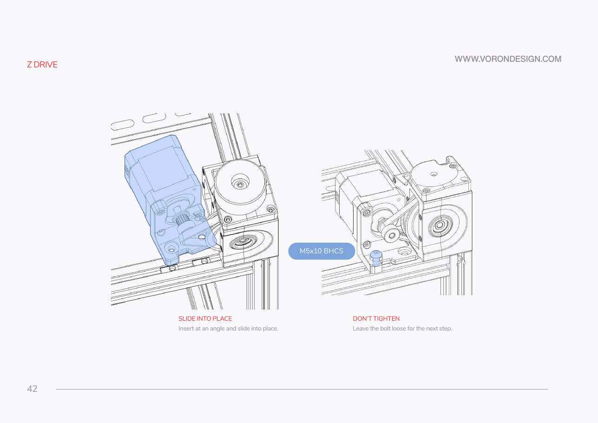
⚠ Rev D+ / LDO: **Interim notice (2026-09-06):** a verification re-read found that Steps 02.32–02.33 place the motor-foot M5×10 and the cam wrongly (review/2026-09-06/G2-ch02-03.md, G1). Per manual p.42–45 and the CAD: the single M5×10 goes in the foot hole **farthest from the drive**; the cam's lobe slides into the 4 mm pocket under the **drive end** of the foot and pivots on the drive-end screw, bearing on the drive body. Follow p.42–45 for these two steps until they are rewritten; the rest of the Z-drive sequence stands.

**What you're looking at:** Manual p.42 — the motor and its mount (blue on the page) sliding in beside the drive at an angle, with the hanging belt loop hooked over the 16T on the way in. That angled entry is the only path that gets the loop onto both pulleys with the drive already bolted down.

**Parts:** M5×10 BHCS ×1; the `_a` motor/mount assembly.

**Do:** Hold the motor/mount at an angle, hook the hanging loop over the 16T, and slide the mount's foot down onto the extrusion beside the drive (p.42). Fit one M5×10 BHCS through the foot hole nearest the drive into its T-nut. **Leave it loose** — the manual says so explicitly, and the cam has to move the motor.

**Check:** Belt loop engaged on both the 16T motor pulley and the 80T drive pulley, sitting squarely in both tooth bands. Motor foot flat on the extrusion, bolt started but loose.

Source: [Voron manual p.42](https://github.com/VoronDesign/Voron-2/blob/de7e89d/Manual/Assembly_Manual_2.4r2.pdf#page=42)

### Step 02.33 — Fit the orange belt tensioner, still loose

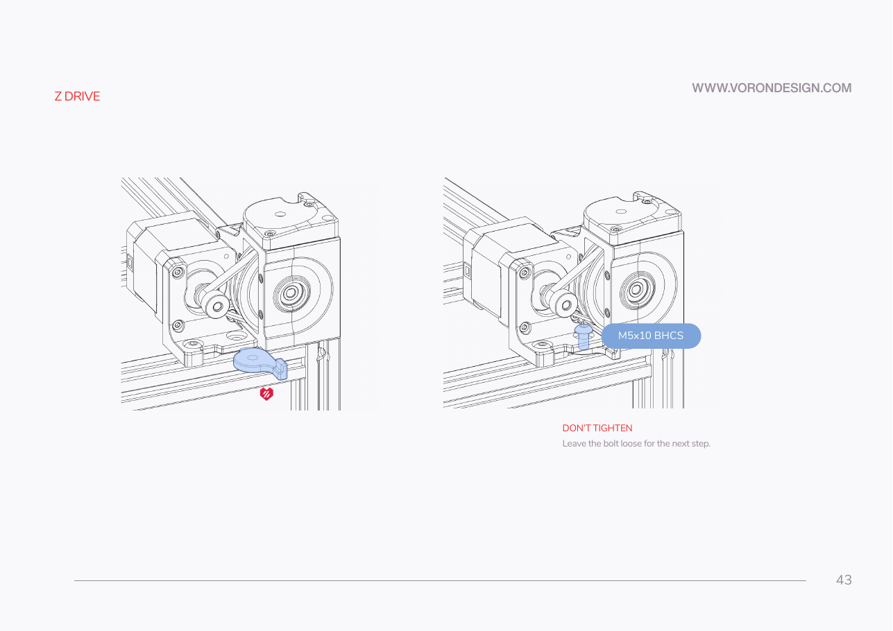
![`[a]_belt_tensioner_a` (left) vs `_b` (right) — plan view, flat face down](assets/parts/pair-belt_tensioner_x2-top.png)

**What you're looking at:** Manual p.43 — the orange `[a]_belt_tensioner`, a cam that pivots on a single M5 bolt. It is a lever, not a bracket: rotating it pushes the motor foot away from the drive body and takes up the slack in the 188 mm loop, so its bolt stays loose until the cam has done its work. The `_a` and `_b` cams are mirrors — flat face down, round lobe on your left: the upright tab is at the far-right on `_a`, near-right on `_b`. The wrong hand will swing *away* from the motor instead of into it.

**Parts:** `[a]_belt_tensioner_a` or `_b` ×1 (orange); M5×10 BHCS ×1.

**Do:** Lay the orange tensioner cam flat on the extrusion at the far end of the motor foot — the end away from the drive — in the open position shown, and fit one M5×10 BHCS through its pivot hole into the last T-nut. **Leave this bolt loose too** — it is a pivot at this point, not a fastener.

**Check:** Cam free to rotate about the bolt; motor still free to slide along the extrusion.

Source: [Voron manual p.43](https://github.com/VoronDesign/Voron-2/blob/de7e89d/Manual/Assembly_Manual_2.4r2.pdf#page=43) · [Video: Part 2 @1:18:50](https://www.youtube.com/watch?v=2U0YahE8w_0&list=PL0fUJbigELQPqpeGOgHYisG4KaSXVtnNY&t=4730s)

### Step 02.34 — Flip the tensioner latch closed

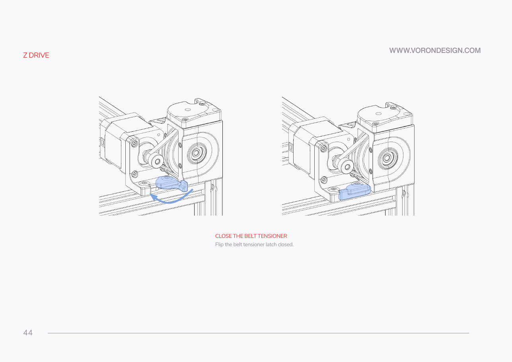

**What you're looking at:** Manual p.44 — the cam being rotated closed. Closing it is what tensions the belt; the arrow on the page is the direction that pushes the motor foot away from the drive body.

**Parts:** none.

**Do:** Rotate the cam closed, in the direction of the arrow (p.44). It pushes the motor foot away from the drive body and tensions the 188 mm loop.

**Check:** Cam fully closed and sitting flat against the extrusion. Belt loop now taut — you should be able to spin the 80T pulley by turning the motor shaft by hand, with no slip and no belt skip.

Source: [Voron manual p.44](https://github.com/VoronDesign/Voron-2/blob/de7e89d/Manual/Assembly_Manual_2.4r2.pdf#page=44)

### Step 02.35 — Tighten the M5 bolts

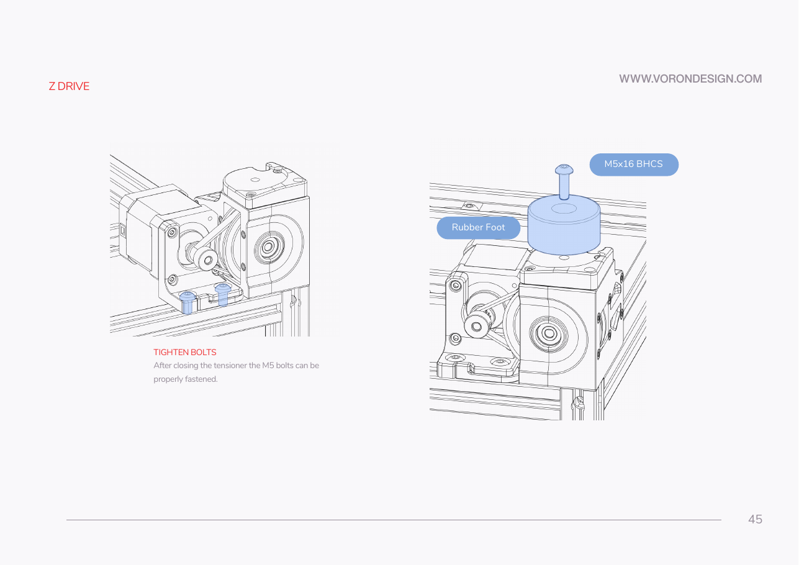

**What you're looking at:** Manual p.45 — the two M5×10 at this corner, motor foot and cam. They are tightened only now, with the cam closed, so the motor position the cam set is what gets locked in.

**Parts:** none — the four M5 bolts already fitted.

**Do:** Only now, with the cam closed, tighten the two M5×10 (motor foot, cam), then re-check the two M5×40 in the drive body are tight.

**Check:** All four bolts tight. Nothing has moved. The belt is still correctly seated in both pulleys.

Source: [Voron manual p.45](https://github.com/VoronDesign/Voron-2/blob/de7e89d/Manual/Assembly_Manual_2.4r2.pdf#page=45) · [Video: Part 2 @1:18:48](https://www.youtube.com/watch?v=2U0YahE8w_0&list=PL0fUJbigELQPqpeGOgHYisG4KaSXVtnNY&t=4728s)

### Step 02.36 — Fit the rubber foot

**What you're looking at:** Manual p.45 — one of the printer's four rubber feet, bolted to the corner while the machine is still upside down and the underside is reachable. Its M5×16 threads into the nut captive in the orange baseplate, which is why that nut went in at Step 02.25.

**Parts:** Rubber foot 38×19 mm ×1; M5×16 BHCS ×1.

**Do:** With the printer still upside down, set a rubber foot on the baseplate at this corner and fix it with one M5×16 BHCS through the foot into the M5 nut you dropped into the baseplate at Step 02.25.

**Check:** Foot square to the corner and firmly attached.

Source: [Voron manual p.45](https://github.com/VoronDesign/Voron-2/blob/de7e89d/Manual/Assembly_Manual_2.4r2.pdf#page=45) · [Video: Part 1 @3:34:45](https://www.youtube.com/watch?v=feTxcc0LIWM&list=PL0fUJbigELQPqpeGOgHYisG4KaSXVtnNY&t=12885s)

### Step 02.37 — Check the drive did not shift when the tensioner closed

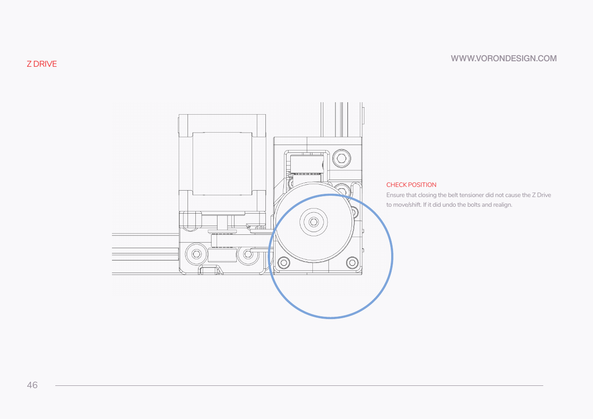

**What you're looking at:** Manual p.46 — a section through the finished corner. Closing the cam pushes the motor away from the drive body, and the reaction shoves the body; if it was not seated square against both extrusions it moves, and the section is how you tell.

**Parts:** none.

**Do:** Sight down the section view on the page and compare. The drive body must still sit hard against the corner and square to both extrusions.

**Check:** No skew, no gap at the corner, belt still fully on both pulleys. **If the drive moved when the tensioner closed, undo the bolts, realign, and redo Steps 02.34–02.35** — the manual calls this out specifically.

Source: [Voron manual p.46](https://github.com/VoronDesign/Voron-2/blob/de7e89d/Manual/Assembly_Manual_2.4r2.pdf#page=46)

Pause: ~30 min since the last pause — the Z0 corner is complete: drive body on its two M5×40, motor slid in, cam closed, both M5×10 tight, rubber foot on, and the p.46 section check passed. One corner is a self-contained unit and this is the natural stop.

### Step 02.38 — Build and fit the other three Z drives

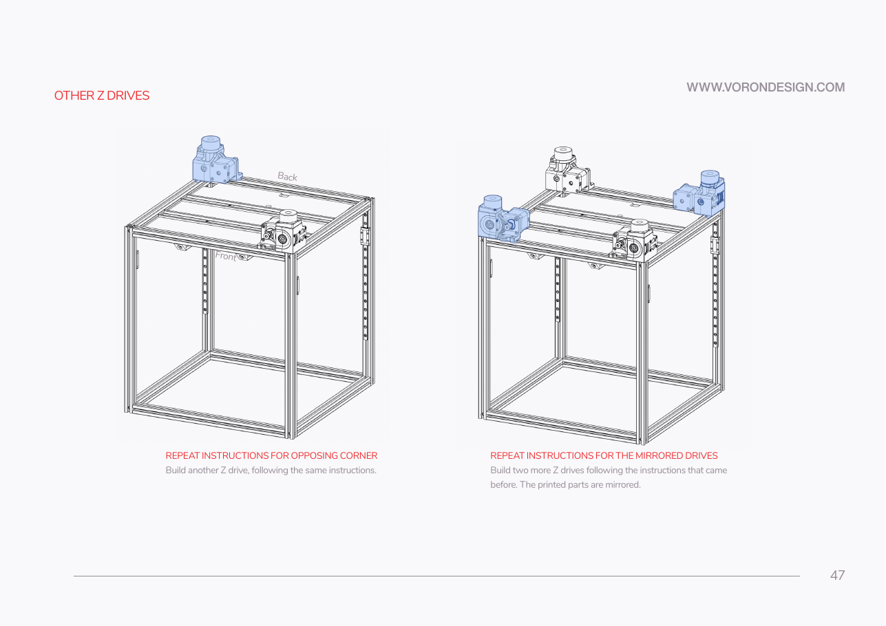

**What you're looking at:** Manual p.47 — all four corners done. Two corners take the `_a` hand of every printed part (Z0 and Z2) and two take `_b` (Z1 and Z3); the cable labels go on now because in Ch 10 four identical black stepper cables arrive at the mainboard together.

**Parts:** the remaining three drives, motors, mounts, tensioners, feet and their hardware.

**Do:** Repeat Steps 02.29–02.37 at the diagonally opposite corner (Z2, rear-right) with the other `_a` set, then at the two remaining corners (Z1 rear-left, Z3 front-right) with the **`_b`** parts — diagonal corners share a hand, neighbours are mirrors. Label each motor's cable Z0/Z1/Z2/Z3 by its physical corner as you go.

**Check:** Four drives on, four feet on, four belts tensioned, four cams closed, four cables labelled. Confirm the deck is still captured by its eight clips, then turn the frame back upright onto its rubber feet and confirm it does not rock.

Source: [Voron manual p.47](https://github.com/VoronDesign/Voron-2/blob/de7e89d/Manual/Assembly_Manual_2.4r2.pdf#page=47) · [LDO wiring guide § Connecting Steppers](https://docs.ldomotors.com/en/voron/voron2/wiring_guide_rev_d#connecting-steppers) · [Video: Part 2 @0:02:14](https://www.youtube.com/watch?v=2U0YahE8w_0&list=PL0fUJbigELQPqpeGOgHYisG4KaSXVtnNY&t=134s)

Pause: ~55 min since the last pause, in three ~18-min corners — Z1, Z2 and Z3 built and fitted the same way. Stop after any corner whose four M5 bolts are tight, tensioner closed and foot fitted; never with a cam open and the motor free to slide. All four cables labelled Z0–Z3 by physical corner.

### Step 02.39 — Assemble a Z idler cage

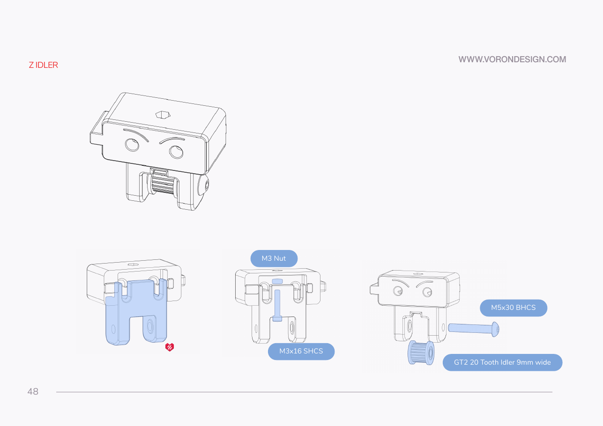

**What you're looking at:** Manual p.48 — the **Z idler**, the assembly that sits at the top corner directly above a drive and turns the long Z belt back down again. `z_tensioner_bracket` is the printed cage that bolts to the frame; the orange `[a]_z_tensioner_9mm` slides inside it on a screw, and that screw is what you turn to tension the Z belt in Ch 06 (final tension in Ch 14). The bracket comes in mirrored `_a` / `_b` hands — in plan, print face down with the two oval slots running left–right as in the render, the side tab is on the left for `_a` and on the right for `_b`; turning the part half a turn swaps that, so match the whole outline to the render, not the tab alone. The idler takes the same hand as the drive below it (`_a` at Z0/Z2, `_b` at Z1/Z3). The orange slider is the same part in all four.

**Parts:** `z_tensioner_bracket_a` or `_b` ×1; `[a]_z_tensioner_9mm` ×1 (orange); M3×16 SHCS ×1; M3 hexnut ×1.

**Do:** Drop the M3 hexnut into the pocket in the top of the bracket. Slide the orange tensioner into the bracket and run the M3×16 SHCS up through the tensioner into the nut. Leave it a couple of turns short of tight so the tensioner can still slide — this screw is the Z belt tension adjuster later.

**Check:** Nut captive, screw engaged, tensioner sliding smoothly in the bracket with no side play.

Source: [Voron manual p.48](https://github.com/VoronDesign/Voron-2/blob/de7e89d/Manual/Assembly_Manual_2.4r2.pdf#page=48) · [Video: Part 2 @1:37:11](https://www.youtube.com/watch?v=2U0YahE8w_0&list=PL0fUJbigELQPqpeGOgHYisG4KaSXVtnNY&t=5831s)

### Step 02.40 — Fit the 20T idler on its M5×30 axle

**What you're looking at:** Manual p.48 — a 20T **idler** dropped into the fork of the orange tensioner on an M5×30 screw used as its axle. An idler is a pulley that redirects a belt without driving it ([glossary](16-glossary.md#i)); it just has to spin freely and stay in plane.

**Parts:** GT2 20T 9 mm idler ×1; M5×30 BHCS ×1.

**Do:** Drive the M5×30 BHCS through the slider's fork — it cuts its own thread in the Ø5 holes, so expect resistance and keep it square — with the 20T 9 mm idler between the fork arms. The idler runs on its own bearings; the screw is only a pin. Build all four idlers — two `a` brackets, two `b`.

**Check:** Idler spins freely on the axle with no axial slop, and its tooth band sits centred in the fork. Four idlers built.

Source: [Voron manual p.48](https://github.com/VoronDesign/Voron-2/blob/de7e89d/Manual/Assembly_Manual_2.4r2.pdf#page=48)

Pause: ~20 min since the last pause — four idler cages assembled with their captive M3 nuts and 20T idlers on M5×30 axles, tensioner screws left deliberately short of tight. Nothing is mounted to the frame yet.

### Step 02.41 — Pre-load two M5 T-nuts at a top corner

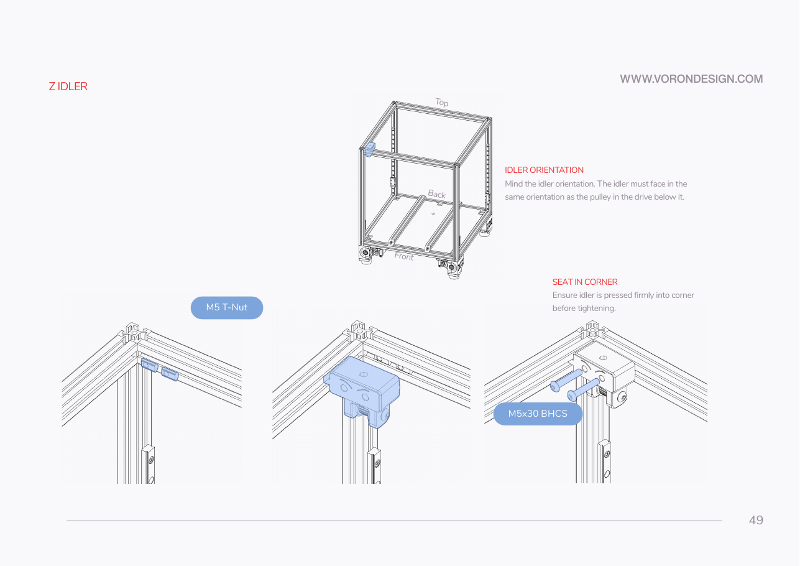

**What you're looking at:** Manual p.49 — two M5 T-nuts in the vertical extrusion at a top corner, positioned for the idler bracket's two mounting holes.

**Parts:** M5 roll-in T-nut ×2.

**Do:** Slide two M5 T-nuts into the vertical extrusion at the top corner directly above a Z drive, positioned where the idler bracket's two mounting holes will land.

**Check:** Two T-nuts in the correct extrusion face, free to slide.

Source: [Voron manual p.49](https://github.com/VoronDesign/Voron-2/blob/de7e89d/Manual/Assembly_Manual_2.4r2.pdf#page=49)

### Step 02.42 — Mount the idler, matching the drive below it

**What you're looking at:** Manual p.49 — the idler bracket going onto the top corner. Its pulley and the 20T pulley in the drive directly below it have to lie in one vertical plane, because the Z belt runs between them; a bracket that is not pressed hard into the corner before tightening leaves a twist in that plane.

**Parts:** M5×30 BHCS ×2; the idler from Step 02.40.

**Do:** Offer the idler up to the corner. **Its pulley must face the same way as the pulley in the drive directly below it** — this is what keeps the Z belt running in a single plane. Press the bracket **firmly into the corner** before you tighten anything, then fit two M5×30 BHCS into the T-nuts and tighten.

**Check:** Idler pulley and the drive's 20T pulley below it lie in the same vertical plane — sight down them, or hang a length of the 2GT belt between them and look for twist. Bracket hard against both faces of the corner.

Source: [Voron manual p.49](https://github.com/VoronDesign/Voron-2/blob/de7e89d/Manual/Assembly_Manual_2.4r2.pdf#page=49)

### Step 02.43 — Fit the remaining three Z idlers

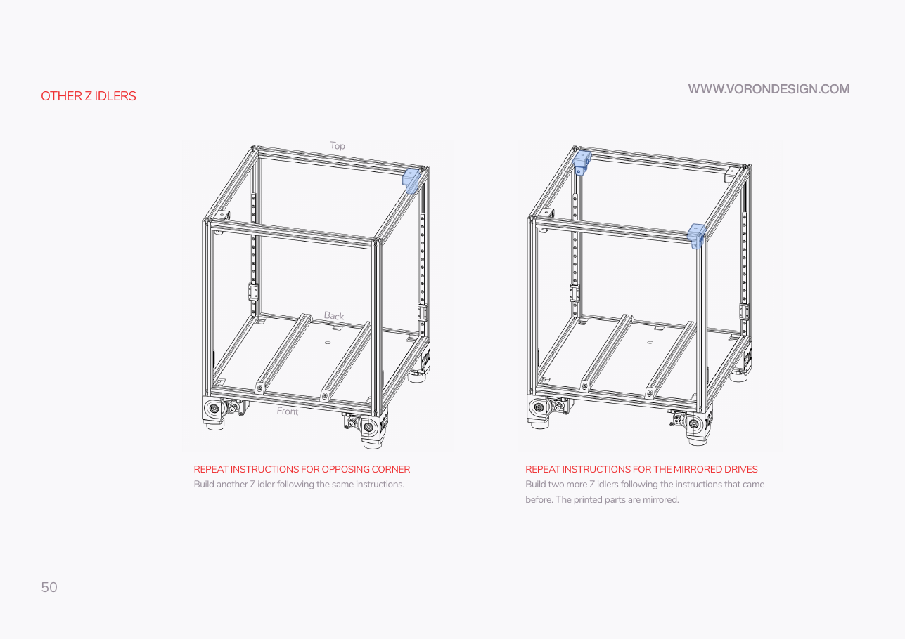

**What you're looking at:** Manual p.50 — the other three idlers, two `_a` brackets and two `_b`. Each one is aligned to the drive underneath it, so all four Z belts run true.

**Parts:** the remaining three idlers; M5×30 BHCS ×6; M5 roll-in T-nut ×6.

**Do:** Repeat Steps 02.41–02.42 at the diagonally opposite corner (Z2) with the other `_a` bracket, then at Z1 and Z3 with the `_b` brackets — the same map as the drives: each idler takes the hand of the drive below it.

**Check:** Four idlers fitted, each one aligned with the drive beneath it, all pressed into their corners, all eight M5×30 tight.

Source: [Voron manual p.50](https://github.com/VoronDesign/Voron-2/blob/de7e89d/Manual/Assembly_Manual_2.4r2.pdf#page=50)

### Step 02.44 — Close the chapter

**What you're looking at:** Manual p.51 is a divider page with no assembly content — the marker that the Z chapter is finished. Look the work over now, because the gantry and the electronics bay are about to cover most of what you just built.

**Parts:** none — p.51 is a filler page in the manual and carries no assembly step.

**Do:** Use it as the marker that the Z chapter is done. Turn the printer upright, work through Checkpoint 02, and make sure the measured deck thickness is in your build log.

**Check:** Checkpoint 02 fully ticked.

Source: [Voron manual p.51](https://github.com/VoronDesign/Voron-2/blob/de7e89d/Manual/Assembly_Manual_2.4r2.pdf#page=51)

Pause: ~25 min since the last pause — all four Z idlers mounted, each aligned with the drive below it, all eight M5×30 tight, printer back upright on its feet. Work through Checkpoint 02 before the gantry starts hiding this.

---

## Checkpoint 02

- [ ] All four Z rails run their full travel with no notch, tight spot or grinding; every carriage is taped or stoppered.
- [ ] Rail surfaces are clean and dry and grease is inside the carriages only — carried over from Ch 00 Steps 00.18–00.21 and re-confirmed at Step 02.05.
- [ ] All four rails are centred on their extrusions, each facing the rail on its own side of the machine (front-left ↔ rear-left, front-right ↔ rear-right), and share the same 3 mm bottom gap and the same nine-hole pattern (holes 2–18, no end holes).
- [ ] Deck panel notch is at the **back**; panel sits inside the frame opening on the bed extrusions, captured by eight clip ledges, no rock; four M5 T-nuts aligned under the four deck holes and left unbolted for Ch 09 Step 09.5.
- [ ] `_a` parts at Z0 and Z2, `_b` at Z1 and Z3 (or the reverse if the Step 02.29 dry-fit said so — written in the build log), and each idler the same hand as the drive below it.
- [ ] Measured deck-panel thickness is written down and the fitted deck supports (8 off) match it.
- [ ] Every 20T drive pulley sits 33 mm along its shaft; every 16T motor pulley sits 10.7 mm off the motor face.
- [ ] All 24 M4×4 set screws are tight, threadlocked, and at least one per pulley lands on the shaft flat.
- [ ] Four M5 precision spacers per drive (16 total) — **spacers, not shims**.
- [ ] Each Z drive shaft turns freely by hand through the belt, with no belt skip and no bearing rumble.
- [ ] All four tensioner cams are closed and no drive shifted when its cam closed (p.46 check).
- [ ] Four rubber feet fitted; the printer stands on all four without rocking on the reference surface.
- [ ] Each Z idler faces the same way as the pulley in the drive below it and is pressed hard into its corner.
- [ ] Four motor cables labelled Z0 / Z1 / Z2 / Z3 by physical corner.

## Common mistakes

- **Bolting a rail on dry.** Once a rail is on an extrusion you cannot use the flip-and-pack method, and a dry MGN9 wears out. Rails off again, or a compromised axis — check at Step 02.05 that Ch 00 really did all four (§5.2 W9).
- **Missing a heat-set insert before the drive is closed.** Six M3×40 have to come out and the shaft assembly has to be lifted to reach it. Do the insert pass as a batch, count the pockets, and only then start assembling (§5.2 W3).
- **A 20T pulley on a Z motor.** The 16T and 20T look nearly identical. The machine will home and move and be silently wrong on every Z dimension, because `gear_ratio: 80:16` is baked into the config. Count teeth, then clear the 16T pulleys off the bench (p.38).
- **Skipping the deck supports "until the panels chapter".** The deck cannot be lifted once the gantry and electronics are in — the frame has to come partly apart. LDO puts this at p.29–30 for a reason (§5.2 W4).
- **Tightening rail screws from one end.** The rail bows and the carriage develops a tight spot that no amount of greasing fixes. Always centre-outward (p.24).
- **Set screws finger-tight or off the flat.** They loosen under Z load, the belt slips, and the gantry drops out of level. Threadlocker on all of them, one on the flat, tightened with a proper hex driver (p.32, §5.2 W12).
- **Closing a drive with the halves upside down.** Screws started from above into the retainer's visible brass inserts thread only into that insert, clamp nothing, and pull the insert out of its boss. The M3×40 heads sink into the main's counterbores; the retainer's inserts are at the bottom of the stack (Step 02.24).
- **The wrong hand at a corner.** It bolts on fine and shows up in Ch 06 when the 20T is not under its idler. Diagonals share a hand (Step 02.02); dry-fit the first unit (Step 02.29).
- **M5×40 through the motor foot.** The foot's holes are 9 mm deep M5×10 holes; a 40 mm screw bottoms in the slot and jacks the T-nut. The long screws go down the drive body's wells (Step 02.31); the motor gets one M5×10 and is left loose for the cam.
- **Bolting the deck down here.** The four M5×10 go in with the DIN rails in Ch 09 Step 09.5. Fitting them now means undoing them again — and it double-counts the same four bolts in two chapters' hardware totals.

## Next

Chapter 03 — Build plate: bed, magnet sheet, spacers and the M3×20 mounting screws (manual p.52–61, with LDO's p.55/56 skips).
