# Chapter 03 — Build plate

Prepares the 355×355×10 mm heated plate and bolts it to the bed extrusions, so the frame has its datum surface and the bed harness is hanging below deck ready for Ch 10.

**What you're building in this chapter:** the heated bed, as a stack of four things. The **build plate** is a cast, ground aluminium slab with a mains-powered silicone **heater pad** and a 125 °C **thermal fuse** already bonded to its underside — both are factory-fitted on this kit, so two of the official manual's pages become inspections. On top of it you laminate the **magnetic pad**, an adhesive magnetised sheet, and onto that drops the **flex plate**: removable spring steel, the surface prints actually stick to and the reason you can pop a finished part off by flexing it. The whole stack sits on four **thumb-nut spacers** on the two bed extrusions from Ch 01, held by four bolts of which only one is ever tightened — the other three let a 355 mm aluminium plate expand as it heats instead of buckling. Nothing is wired here; the plate's three cables are left hanging below the deck for Ch 10.

**Time:** 1.5–2.5 h hands-on, first build (survey §7.2).

**Sessions:** 4 × ~30 min — the `Pause:` lines below break the chapter into 4 segments; every minute figure is a first-build estimate.

**Prerequisites:**

- **Ch 01 — Frame.** Squared, and the bed extrusions positioned with **65 mm from the centreline to each inner face** — a 130 mm clear gap, 150 mm centre-to-centre (manual p.20; Ch 01 Step 01.19).
- **Ch 02 — Z drives and idlers.** Deck panel and deck supports fitted (manual p.28–29); the wire opening in the deck must be clear and unobstructed.
- **Printed parts: none.** No print batch gates this chapter. The 2.4r2 mounts the plate straight onto the bed extrusions with metal hardware — there are no printed feet, bed mounts or spacers anywhere in p.52–61. The bed WAGO mount is supplied printed by LDO and is fitted in Ch 09, not here.

**Tools**

- Hex 2.5 mm and 3 mm
- Plastic scraper, squeegee or an old credit card (magnet application)
- Sharp craft knife with a fresh blade (trimming the magnet at the bolt holes; cutting the liner at Step 03.9)
- Masking tape (marking the back edge at Step 03.2; the hinge for the magnet at Step 03.9)
- Steel rule or straightedge ≥360 mm (flatness check and the 38 mm offset)
- Digital caliper

**Consumables:** IPA ≥90%, lint-free cloth, nitrile gloves. The plate's protective film goes in the bin.

**Printed parts**

| STL | Qty | Colour |
|---|---|---|
| — none — | 0 | — |

**Hardware** (chapter totals)

| Fastener / part | Qty | Note |
|---|---|---|
| Build plate, cast 5083 aluminium, Blanchard ground, 355×355×10 mm, LDO AC heatpad + 125 °C thermal fuse pre-applied | 1 | [LDO 350 Rev D BOM](https://docs.ldomotors.com/en/voron/voron2/350_BOM/Rev_D) |
| Magnetic Pad 2.4-350 | 1 | applied in this chapter |
| Spring Steel Flex Plate 2.4-350 | 1 | drops on, no fasteners |
| M3×20 SHCS | 4 | **not** the manual's M3×16 |
| M4 knurled thumb nut | 4 | used as the spacer, not as a nut |
| M3 roll-in T-nut, 2020 | 4 | bed extrusion top slots |
| M4×6 BHCS (bed PE) | 1 | already fitted to the plate — verify only, do not remove (washer: verify on bench) |
| M3×12 SHCS + M3 washer (thermal fuse) | 0 | manual p.56 hardware — **not used**, fuse is pre-installed |

**Read first**

- The heater pad (p.55) and the thermal fuse (p.56) are already on your plate. Both pages are **verify-only**. Do not peel, re-seat or re-bolt anything. [src](https://docs.ldomotors.com/voron/voron2/build-faq)
- Trim the magnet at the four bolt holes **immediately after** you roll it down and **before** you bolt anything. Discovering it at p.59 means peeling the magnet or drilling through it (survey §5.2 W6).
- Use **M3×20 SHCS**, not the manual's M3×16 — this plate and these spacers are thicker. [src](https://docs.ldomotors.com/voron/voron2/build-faq)
- The magnet goes on with the hinge method at Step 03.9 — one shot; read the whole step before you peel anything.
- Only one of the four bolts gets tightened (p.59). A bed clamped hard at all four corners while cold, then heated fast, tacos.
- No wiring happens here. The Omron SSR, the WAGO breakout, the bed PE run and the thermistor connection are all Ch 10. Leave the three bed cables loose below deck.

**Sources for this chapter:**

- [Voron 2.4r2 assembly manual (pinned `de7e89d`)](https://github.com/VoronDesign/Voron-2/blob/de7e89d/Manual/Assembly_Manual_2.4r2.pdf) pages 52–61 — plate orientation, magnet, bed-extrusion verification, spacers, the DON'T TIGHTEN rule
- [LDO Build Notes (Rev D)](https://docs.ldomotors.com/voron/voron2/build-faq) — p.55 and p.56 skipped (heater and fuse pre-applied), M4×6 PE screw, M3×20 instead of M3×16, trim the magnet now
- [LDO 350 Rev D BOM](https://docs.ldomotors.com/en/voron/voron2/350_BOM/Rev_D) — plate, magnetic pad, flex plate and thermal-fuse line items
- [LDO wiring guide § Wiring the Bed Heater](https://docs.ldomotors.com/en/voron/voron2/wiring_guide_rev_d#wiring-the-bed-heater) — where the three bed cables actually terminate (Ch 10)
- [magnet lamination demo](https://voron.link/rm6tpld) — the lamination demo the manual links from p.54
- [survey](../voron-build-instructions-survey.md) §5.2 W6
- The one mirrored image in this chapter (Step 03.4) is LDO Motors', used with attribution; see `assets/remote/03-build-plate/SOURCES.txt`. Its original URL stays on that step's `Source:` line.

**Video coverage (Steve Builds, pre-release LDO kit — differs from Rev D+):** [Part 1 @0:45:02](https://www.youtube.com/watch?v=feTxcc0LIWM&list=PL0fUJbigELQPqpeGOgHYisG4KaSXVtnNY&t=2702s) (+5m)

---

### Step 03.1 — Unpack the plate and read the end state

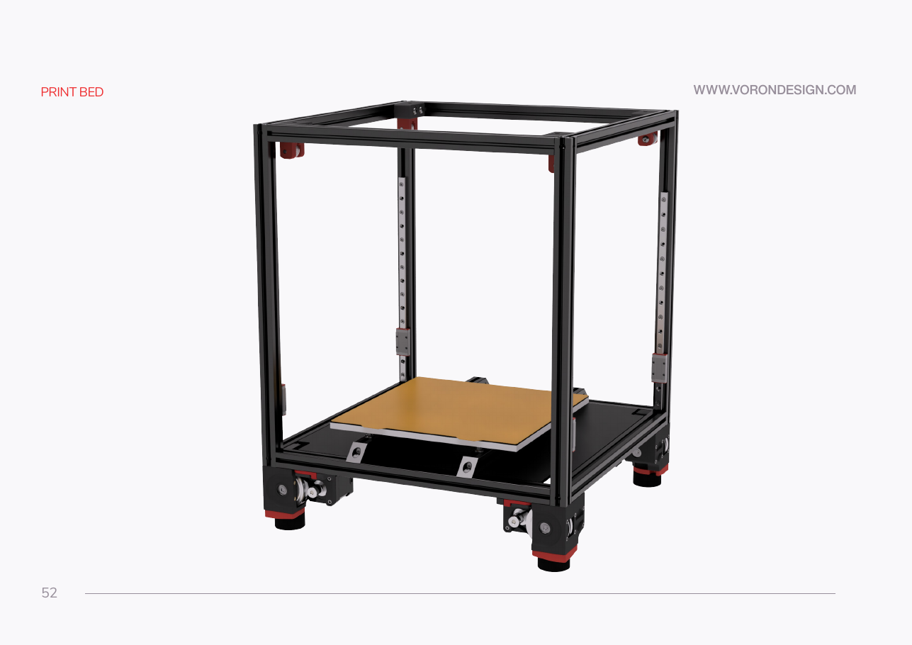

**What you're looking at:** Manual p.52: the finished bed and its three parts. The **build plate** is a 355 × 355 × 10 mm cast aluminium slab with the AC heater pad bonded underneath. The **magnetic pad** laminates on top. The **flex plate** is the removable spring-steel print surface.

**Parts:** build plate ×1, magnetic pad ×1, spring steel flex plate ×1.

**Do:** Take the plate out flat, never on edge; a dropped corner dents a 10 mm cast slab. Lay it on a clean towel. It ends up on the two bed extrusions above the deck panel, cables through the deck.

**Check:** Three cables leave the plate at the back-centre edge, with the M4×6 PE screw beside them. Washer type (verify on bench).

Source: [Voron manual p.52](https://github.com/VoronDesign/Voron-2/blob/de7e89d/Manual/Assembly_Manual_2.4r2.pdf#page=52) · [LDO 350 Rev D BOM](https://docs.ldomotors.com/en/voron/voron2/350_BOM/Rev_D) · [Video: Part 1 @0:44:56](https://www.youtube.com/watch?v=feTxcc0LIWM&list=PL0fUJbigELQPqpeGOgHYisG4KaSXVtnNY&t=2696s)

---

### Step 03.2 — Work out which side is which

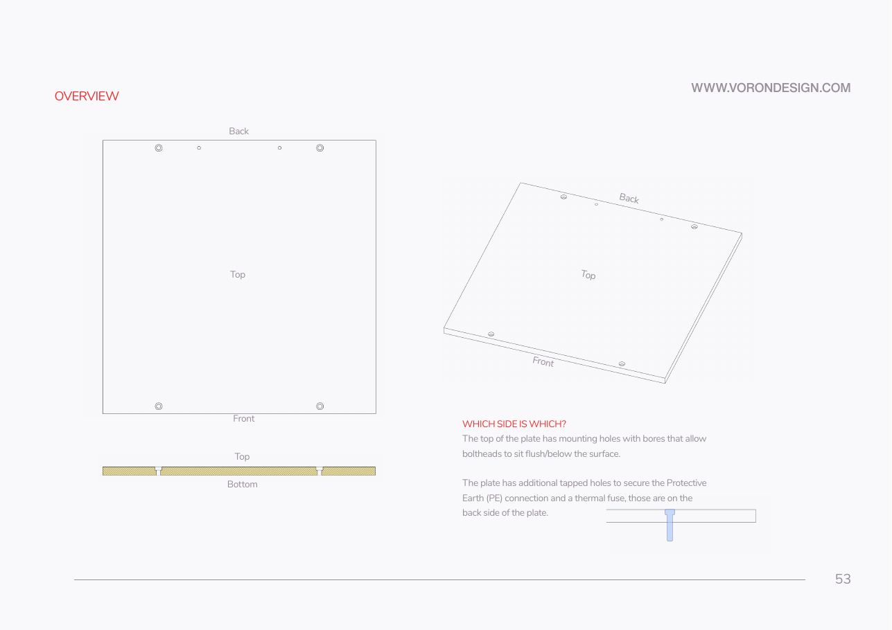

**What you're looking at:** Manual p.53: the plate's two faces. The top is the one whose four corner holes are **counterbored**, a pocket that lets the bolt head sit below the surface. The bottom carries the heater, the thermal fuse and the earth screw.

**Parts:** build plate.

**Do:**

1. Find the four corner mounting holes. The **counterbored** face is the **top**.
2. The face carrying the heater, thermal fuse and PE screw holes is the **bottom**.
3. Mark the back edge, where the cables leave, with masking tape.

**Check:** Drop an M3×20 SHCS into a corner hole from the top; the head sinks into the bore. From the other side it stands proud.

Source: [Voron manual p.53](https://github.com/VoronDesign/Voron-2/blob/de7e89d/Manual/Assembly_Manual_2.4r2.pdf#page=53)

---

### Step 03.3 — Strip the protective film

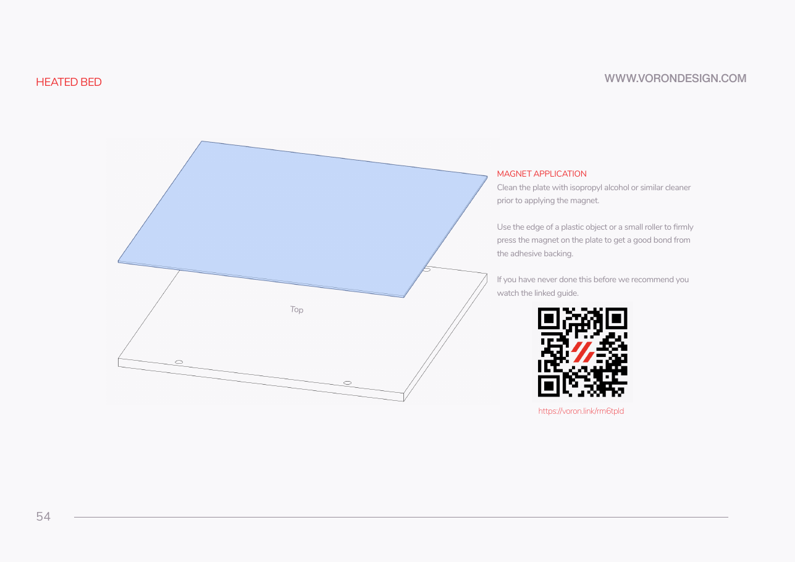

**What you're looking at:** Manual p.54: the ground top face under its protective film. The face is Blanchard-ground, the swirl pattern you will see. The film has to come off before the magnet; adhesive will not bond through it.

**Parts:** build plate.

**Do:** Peel the blue/clear protective film off the top face and bin it. Work from one corner; do not use a metal tool on the ground surface.

**Check:** No film left in the counterbores or under the edges. The ground surface is bare metal, matte, with visible Blanchard swirl.

⚠ **Rev D+ / LDO:** the manual never mentions the film — LDO adds this. Remove it now; the magnet will not bond through it. [src](https://docs.ldomotors.com/voron/voron2/build-faq)

Source: [Voron manual p.54](https://github.com/VoronDesign/Voron-2/blob/de7e89d/Manual/Assembly_Manual_2.4r2.pdf#page=54) · [LDO Build Notes (Rev D)](https://docs.ldomotors.com/voron/voron2/build-faq)

---

### Step 03.4 — Verify the heater pad (do not apply one)

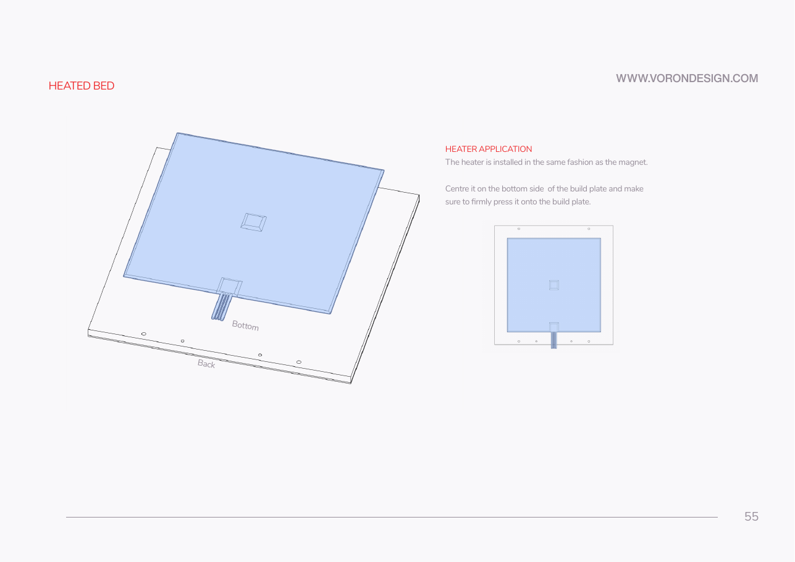
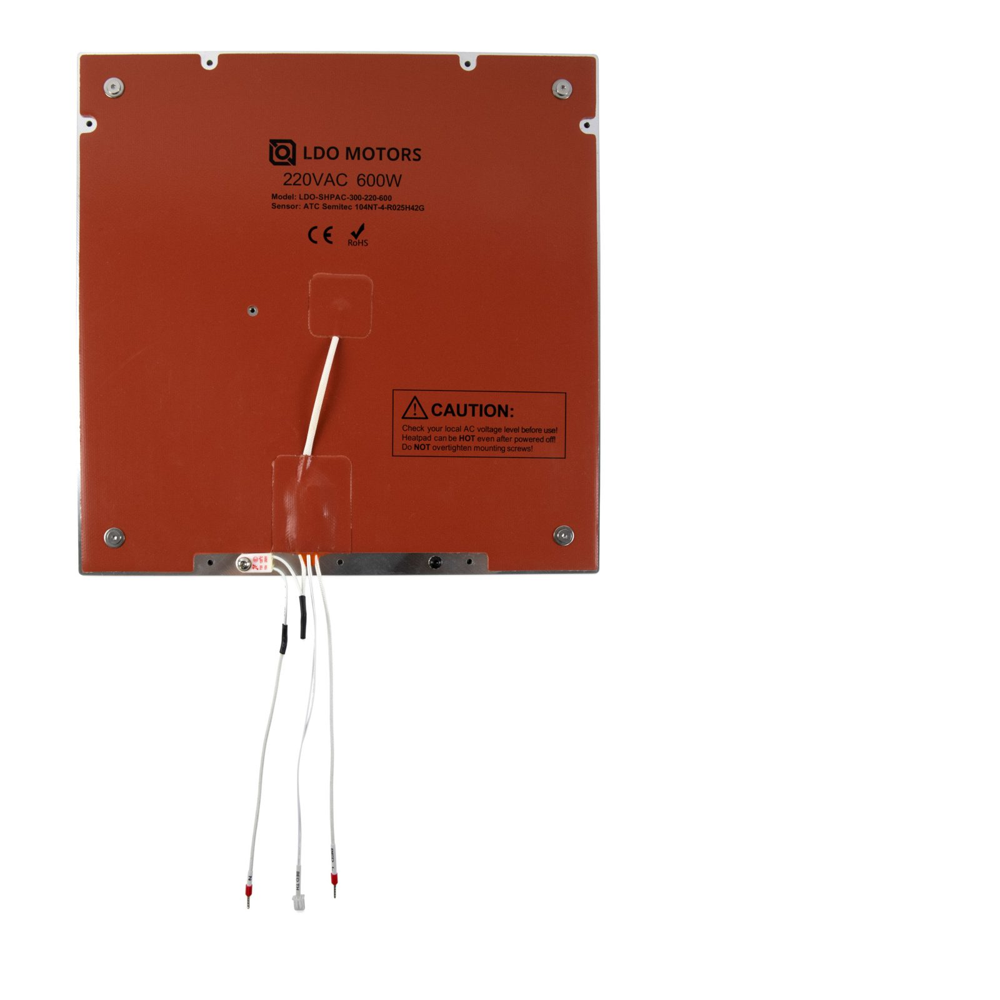

**What you're looking at:** Manual p.55 shows the official manual *applying* a heater pad, a page you skip. The LDO photo beside it is your plate from below: the silicone AC pad bonded and screwed down, the thermal-fuse patch, the cable exit. Compare layout, not ratings.

**Parts:** none.

**Do:**

1. Turn the plate bottom-up.
2. Confirm the AC heatpad is flat and centred: no lifted corner, wrinkle or trapped air.
3. Confirm every pad screw is present. Do not tighten them, add adhesive or re-press a lifted edge.

**Check:** Pad flat and centred; every pad screw present and untouched, head type (verify on bench); nothing peeling at the cable exit. No bubble size specified.

⚠ **Rev D+ / LDO:** **SKIP manual p.55 entirely** — the heater pad is pre-applied on Rev C and later kits. This step is inspection only. If the pad is genuinely lifting, stop and raise it in `#ldo_motors` before you bolt the plate in. [src](https://docs.ldomotors.com/voron/voron2/build-faq) · [wiring guide § Wiring the Bed Heater](https://docs.ldomotors.com/en/voron/voron2/wiring_guide_rev_d#wiring-the-bed-heater)

Source: [Voron manual p.55](https://github.com/VoronDesign/Voron-2/blob/de7e89d/Manual/Assembly_Manual_2.4r2.pdf#page=55) · [LDO Build Notes (Rev D)](https://docs.ldomotors.com/voron/voron2/build-faq) · [LDO wiring guide § Wiring the Bed Heater](https://docs.ldomotors.com/en/voron/voron2/wiring_guide_rev_d#wiring-the-bed-heater) · [image: LDO `build_plate_bottom_view.jpg`](https://raw.githubusercontent.com/MotorDynamicsLab/LDOVoron2/main/Images/WiringGuide/RevC/build_plate_bottom_view.jpg)

---

### Step 03.5 — Verify the thermal fuse (do not fit one)

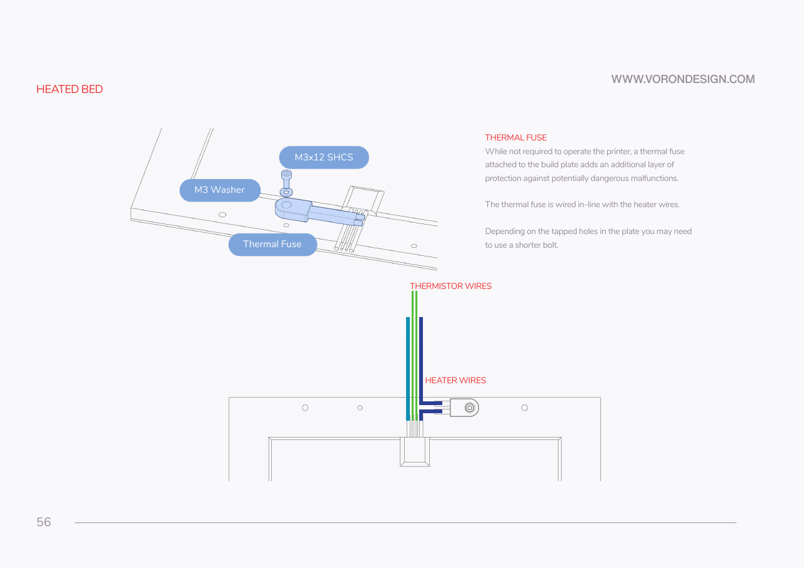

**What you're looking at:** Manual p.56, the fuse installation you skip. The **thermal fuse** is a one-shot cut-out that opens permanently at 125 °C, wired in series with one heater lead, so a runaway heater loses supply. It works only pressed flat against the aluminium. See the [glossary](16-glossary.md#t).

**Parts:** none. The manual's M3×12 SHCS and M3 washer stay in the bag.

**Do:**

1. Find the 125 °C thermal fuse on the bottom face by the cable exit.
2. Confirm its body is pressed flat to the aluminium, its single screw and washer tight.
3. It is wired in-line with one heater lead.

**Check:** Fuse flat to the plate, screw tight, no strain on either leg of the fuse where it joins the heater wire.

⚠ **Rev D+ / LDO:** **SKIP manual p.56 entirely** — the fuse is pre-installed. Inspect only. [src](https://docs.ldomotors.com/voron/voron2/build-faq)

Source: [Voron manual p.56](https://github.com/VoronDesign/Voron-2/blob/de7e89d/Manual/Assembly_Manual_2.4r2.pdf#page=56) · [LDO Build Notes (Rev D)](https://docs.ldomotors.com/voron/voron2/build-faq)

---

### Step 03.6 — Verify the PE screw and identify the three cables

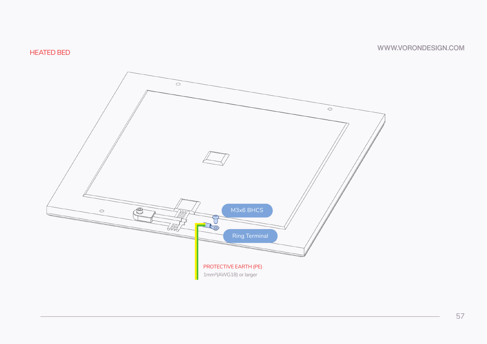

**What you're looking at:** Manual p.57: the plate's cable exit. Three cables leave here: two thick braided AC leads, **N** and **Bed L**, and one thin two-pin **BED TH** thermistor cable. Beside them the **protective-earth** M4×6 BHCS bonds the plate to earth. Washer (verify on bench). See the [glossary](16-glossary.md#p).

**Parts:** none — the PE screw is already fitted.

**Do:**

1. Identify the three cables at the back edge: **N**, **Bed L**, and the **BED TH** ATC Semitec 104NT thermistor.
2. Find the **M4×6 BHCS** beside them, the bed PE point.
3. Leave it in place until Ch 10.

**Check:** Three labelled cables, no chafe or cut in the braid, no exposed conductor. PE screw present, snug.

⚠ **Rev D+ / LDO:** the manual calls for an M3×6 BHCS you supply. Your plate ships with an **M4×6 BHCS** already attached — use that one. [src](https://docs.ldomotors.com/voron/voron2/build-faq)

⚠ **Rev D+ / LDO:** do **not** wire the PE, the heater leads or the thermistor here. The bed harness is a breakout design: the AC leads land on the bed WAGO mount and the SSR, and the thermistor on the 2×2 XH splicer PCB, all in Ch 10. [src](https://docs.ldomotors.com/en/voron/voron2/wiring_guide_rev_d#wiring-the-bed-heater)

Source: [Voron manual p.57](https://github.com/VoronDesign/Voron-2/blob/de7e89d/Manual/Assembly_Manual_2.4r2.pdf#page=57) · [LDO Build Notes (Rev D)](https://docs.ldomotors.com/voron/voron2/build-faq) · [LDO wiring guide § Wiring the Bed Heater](https://docs.ldomotors.com/en/voron/voron2/wiring_guide_rev_d#wiring-the-bed-heater)

Pause: ~30 min since the last pause — the plate is unpacked and identified top from bottom, the film is off, and the pre-applied heater, thermal fuse and PE screw are all inspected and left alone. The magnet is still in its backing. Do not start Step 03.9 until you can run 03.8–03.10 straight through: the magnet is a one-shot lamination.

---

### Step 03.7 — Check the plate for flatness before the magnet goes on

**What you're looking at:** The bare ground face and a straightedge. This is the last moment the aluminium is visible. Once the magnet is on, a dish or crown can only be inferred from a bed mesh, and neither mesh nor quad gantry level corrects it.

**Parts:** build plate, steel rule or straightedge.

**Do:** Stand the straightedge on edge on the ground face and sight against a light: one diagonal and one centreline, two minutes. Do it now; once the magnet is on you cannot inspect this surface again.

**Check:** No daylight under the straightedge. Flatness tolerance is **not specified**; raise it in `#ldo_motors` only if a sheet of paper slides under.

Tip: a cast, Blanchard-ground 5083 plate is deliberately thick and stress-relieved; a visible dish here does not get corrected by mesh or QGL later. [src](https://docs.ldomotors.com/en/voron/voron2/350_BOM/Rev_D)

Source: [Voron manual p.53](https://github.com/VoronDesign/Voron-2/blob/de7e89d/Manual/Assembly_Manual_2.4r2.pdf#page=53) · [LDO 350 Rev D BOM](https://docs.ldomotors.com/en/voron/voron2/350_BOM/Rev_D)

---

### Step 03.8 — Clean the top face

**What you're looking at:** The top face, IPA and a lint-free cloth. Oil, dust or a fingerprint left on the surface becomes a permanent bump under an adhesive sheet you cannot lift again.

**Parts:** build plate; IPA, lint-free cloth, gloves.

**Do:** Wipe the whole top face with IPA and let it flash off completely, so no solvent is trapped under the adhesive. Wear gloves from here on.

**Check:** Surface dry, no lint, no residue in the counterbores.

Source: [Voron manual p.54](https://github.com/VoronDesign/Voron-2/blob/de7e89d/Manual/Assembly_Manual_2.4r2.pdf#page=54)

---

### Step 03.9 — Apply the magnet sheet

**What you're looking at:** Manual p.54 and the magnetic pad: a flexible sheet of magnetised rubber with a pressure-sensitive adhesive back under a liner. Laminated to the plate, it holds the spring-steel flex plate down. On this kit it is a separate BOM line, not factory-applied.

**Parts:** Magnetic Pad 2.4-350 ×1; masking tape; plastic squeegee or card; knife or scissors for the liner.

**Do:**

1. Position the pad on the plate, liner down, and tape the **back** edge as a hinge.
2. Fold it back, peel and cut 40–50 mm of liner, squeegee it, then draw the liner out and press the sheet down.

**Check:** No bubbles, no wrinkles, pad square to the plate edges, borders even all round.

Tip: measure the pad first (verify on bench): at 355 mm lay it edge-flush to the back edge and one side; if smaller, centre it and note the border.

Tip: lift the first strip immediately if it lands crooked; past a few centimetres it will not reposition. Bubbles worked to an edge come out, ones in the middle do not.

Tip: The liner side is the adhesive; the plain rubber face is the magnet. Keep the unlaid pad lifted so adhesive never touches ahead of the squeegee.

⚠ **Rev D+ / LDO:** the magnetic pad is a **separate line item** in the 350 Rev D BOM — it is not laminated at the factory, unlike the heater and fuse. If your plate did arrive with the magnet already on, skip to 03.10 and check whether the four bolt holes are already cut. [src](https://docs.ldomotors.com/en/voron/voron2/350_BOM/Rev_D)

Source: [Voron manual p.54](https://github.com/VoronDesign/Voron-2/blob/de7e89d/Manual/Assembly_Manual_2.4r2.pdf#page=54) · [LDO 350 Rev D BOM](https://docs.ldomotors.com/en/voron/voron2/350_BOM/Rev_D) · [magnet lamination demo](https://voron.link/rm6tpld)

---

### Step 03.10 — Trim the magnet at the four bolt holes

**What you're looking at:** The laminated magnet with four dimples where the plate's counterbored corner holes sit underneath. The mounting bolts pass through those holes and a hex key has to reach their heads, so the magnet is cut away over each one.

**Parts:** Magnetic pad (applied), sharp craft knife.

**Do:**

1. Press down to find the four counterbored holes as dimples.
2. Cut the magnet away over each one, following the bore, in light repeated passes.
3. Do not gouge the aluminium; a burr stops the bolt head sitting flush.

**Check:** All four bores fully open. Test each with an M3×20 SHCS and the hex key before you go anywhere near the frame.

⚠ **Rev D+ / LDO:** LDO's note at p.54 exists because the magnet gets applied here and the bolts do not go in until p.59. Trimming now costs two minutes; discovering it at p.59 costs the magnet (survey §5.2 W6). [src](https://docs.ldomotors.com/voron/voron2/build-faq)

Source: [Voron manual p.54](https://github.com/VoronDesign/Voron-2/blob/de7e89d/Manual/Assembly_Manual_2.4r2.pdf#page=54) · [LDO Build Notes (Rev D)](https://docs.ldomotors.com/voron/voron2/build-faq)

Pause: ~30 min since the last pause — the top face is cleaned, the magnet is rolled down bubble-free and all four bolt holes are cut clear through it and test-fitted with an M3×20 and a hex key. The lamination is finished, so nothing is mid-adhesive. Lay the plate flat, magnet up, and cover it.

---

### Step 03.11 — Verify the bed extrusion position

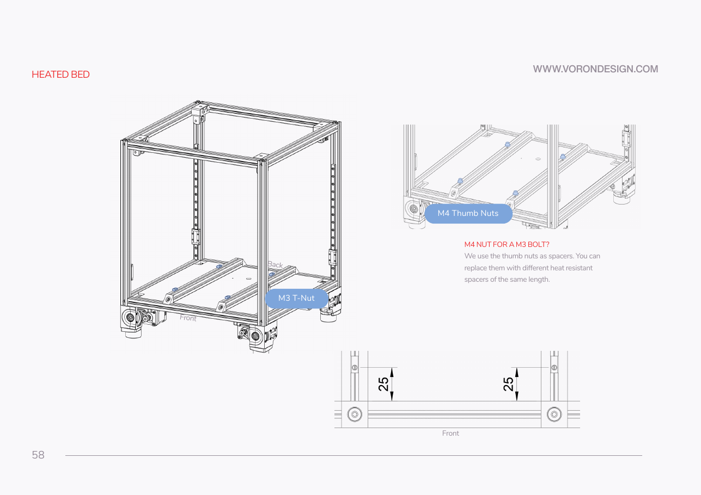

**What you're looking at:** Manual p.58: the front elevation of the frame with the bed extrusions in it. Those two extrusions carry the plate's four mounting points, so you re-check Ch 01's placement here. The bare 25 on the verticals is unidentified and nothing depends on it.

**Parts:** none — measurement only.

**Do:**

1. With the printer upright, measure between the facing inner faces of the two bed extrusions: **130 mm clear**.
2. Centre that gap, 65 mm from the centreline to each inner face.
3. Measure at both ends; both must match.

**Check:** 130 mm clear gap between the facing inner faces, so 150 mm centre-to-centre, 65 mm from the centreline to each, the same at both ends.

Source: [Voron manual p.58](https://github.com/VoronDesign/Voron-2/blob/de7e89d/Manual/Assembly_Manual_2.4r2.pdf#page=58) · [Voron manual p.20](https://github.com/VoronDesign/Voron-2/blob/de7e89d/Manual/Assembly_Manual_2.4r2.pdf#page=20)

---

### Step 03.12 — Load the four M3 T-nuts

**What you're looking at:** Manual p.58: four M3 roll-in T-nuts in the top slots of the bed extrusions, two per extrusion. Each is the thread one corner bolt picks up.

**Parts:** M3 roll-in T-nut, 2020 ×4 (two per bed extrusion).

**Do:** Roll two T-nuts into the **top** slot of each bed extrusion, one toward each end, and position them roughly under where the plate's corner holes will land. Leave them loose enough to slide.

**Check:** Four T-nuts, all in the top slot, all rotated so their threads face up and they cannot fall out.

⚠ **Rev D+ / LDO:** extrusion and roll-in T-nut tolerances on this kit are tight. Test-fit each nut and, if a slot is stiff, pick the extrusion face that accepts it best — do not force one and gall the slot. [src](https://docs.ldomotors.com/voron/voron2/build-faq)

Source: [Voron manual p.58](https://github.com/VoronDesign/Voron-2/blob/de7e89d/Manual/Assembly_Manual_2.4r2.pdf#page=58) · [LDO Build Notes (Rev D)](https://docs.ldomotors.com/voron/voron2/build-faq)

---

### Step 03.13 — Fit the four thumb nuts as spacers

**What you're looking at:** Manual p.58: four knurled **thumb nuts**, used as spacers rather than nuts. They hold the plate a fixed height above the extrusion; the bolt passes through the thumb nut's bore into the T-nut below. Any substitute must be the same length and heat-resistant.

**Parts:** M4 knurled thumb nut ×4.

**Do:** Stand one M4 thumb nut over each T-nut, knurl up, bore concentric with the T-nut thread. Do not thread anything into the thumb nut; the M3 bolt passes straight through its bore.

**Check:** Four thumb nuts standing on the extrusions, none tipped, each aligned with the T-nut under it and all four the same height.

Source: [Voron manual p.58](https://github.com/VoronDesign/Voron-2/blob/de7e89d/Manual/Assembly_Manual_2.4r2.pdf#page=58)

---

### Step 03.14 — Lower the plate on and feed the cables through the deck

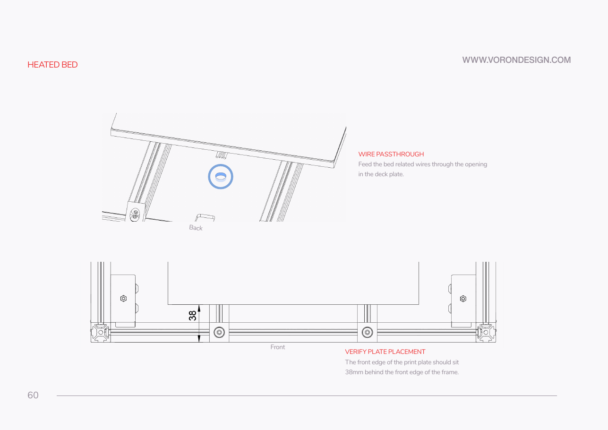

**What you're looking at:** Manual p.60: the plate coming down onto its four spacers, cables first. The three cables have to go through the deck opening before the plate lands; afterwards you cannot feed them through without lifting it again.

**Parts:** build plate assembly.

**Do:**

1. Two hands, plate flat, magnet up, cables at the **back**.
2. Feed the two AC leads and the thermistor cable down through the deck opening.
3. Lower the plate onto the four thumb nuts, cables clear of its edge.

**Check:** Plate rests on all four thumb nuts, none knocked over. All three cables hang free below the deck with slack, none trapped.

Source: [Voron manual p.60](https://github.com/VoronDesign/Voron-2/blob/de7e89d/Manual/Assembly_Manual_2.4r2.pdf#page=60) · [Video: Part 2 @1:36:04](https://www.youtube.com/watch?v=2U0YahE8w_0&list=PL0fUJbigELQPqpeGOgHYisG4KaSXVtnNY&t=5764s)

---

### Step 03.15 — Start the four bolts

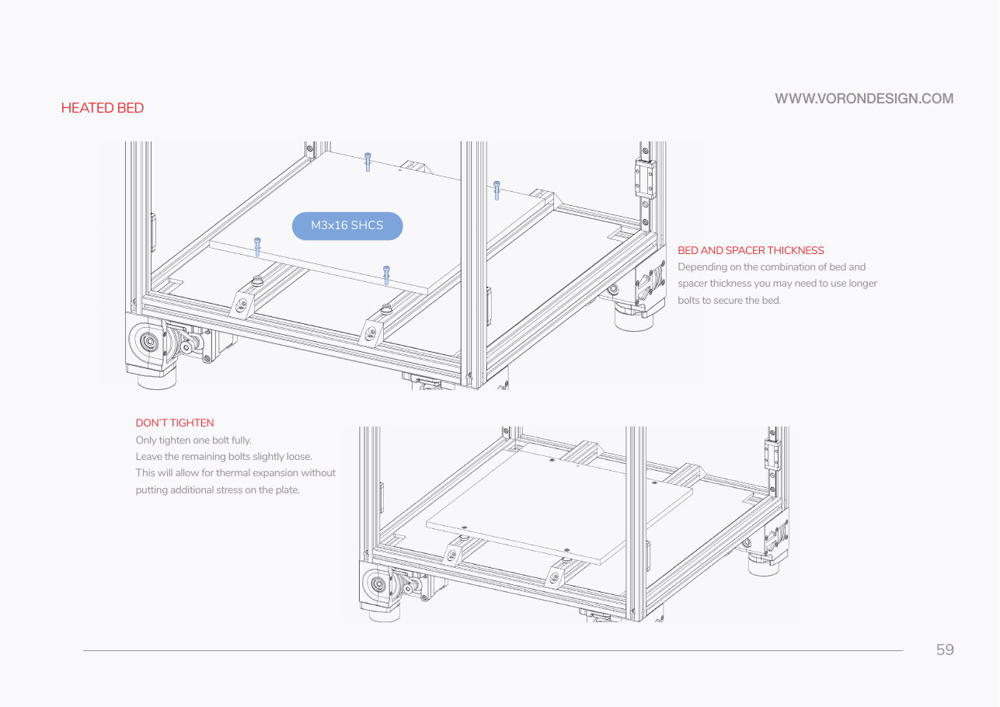

**What you're looking at:** Manual p.59: the four M3×20 bolts. They are longer than the official manual's M3×16 because this plate is 10 mm thick and sits on a spacer. Start them by hand so the T-nuts can still slide to meet each hole.

**Parts:** M3×20 SHCS ×4.

**Do:**

1. Start an M3×20 SHCS by hand through each trimmed corner hole and thumb nut into the T-nut below.
2. Nudge a T-nut if a bolt misses the thread.
3. Run all four down only until they just take up.

**Check:** All four bolts engaged and turning freely, plate still sitting flat on the spacers, no bolt cross-threaded.

⚠ **Rev D+ / LDO:** **M3×20 SHCS, not the manual's M3×16.** This plate is 10 mm and the spacer stack is taller, so an M3×16 will not reach enough thread. [src](https://docs.ldomotors.com/voron/voron2/build-faq)

Source: [Voron manual p.59](https://github.com/VoronDesign/Voron-2/blob/de7e89d/Manual/Assembly_Manual_2.4r2.pdf#page=59) · [LDO Build Notes (Rev D)](https://docs.ldomotors.com/voron/voron2/build-faq)

---

### Step 03.16 — Set the 38 mm front offset and centre the plate

**What you're looking at:** Manual p.60: the plate's position in plan. The 38 mm setback puts the plate where the toolhead can reach it. Equal side gaps keep it clear of the vertical extrusions and Z rails, tight for a 355 mm plate in a 350 mm machine.

**Parts:** steel rule / caliper.

**Do:**

1. With the bolts loose, slide the plate until its front edge sits **38 mm behind the frame's front edge**.
2. Split the left and right gaps evenly, then re-check the 38 mm.
3. Run a finger round the perimeter.

**Check:** 38 mm at both front corners, left and right gaps equal, nothing touching a vertical extrusion or a Z rail. No tolerance is specified.

Source: [Voron manual p.60](https://github.com/VoronDesign/Voron-2/blob/de7e89d/Manual/Assembly_Manual_2.4r2.pdf#page=60)

---

### Step 03.17 — Tighten one bolt only

**What you're looking at:** Manual p.59 and its **DON'T TIGHTEN** rule. One bolt locates the plate; the other three stay loose so the aluminium can grow as it heats. Clamped at all four corners and taken to 110 °C, a plate this size buckles for good.

**Parts:** the four M3×20 SHCS already fitted.

**Do:**

1. Tighten one bolt fully, at a front corner clear of the cable exit.
2. **Leave the other three slightly loose.** They locate the plate, not clamp it.
3. Torque is **not specified**: snug by hand feel, no torque driver.

**Check:** One bolt tight, the other three turnable with a fingertip on the hex key. A free corner gives slightly and returns.

⚠ **Rev D+ / LDO:** none — the manual's DON'T TIGHTEN rule stands unchanged (p.59). Aluminium at 110 °C grows against a steel-bolted frame; three loose bolts are what lets it grow.

Source: [Voron manual p.59](https://github.com/VoronDesign/Voron-2/blob/de7e89d/Manual/Assembly_Manual_2.4r2.pdf#page=59)

Pause: ~35 min since the last pause — the plate is on its four thumb-nut spacers, set 38 mm behind the frame's front edge and centred, one bolt tight and three deliberately loose, cables fed through the deck. This is the natural stop: the plate is bolted and the assembly is stable. Do not tighten the other three bolts.

---

### Step 03.18 — Verify the plate floats level

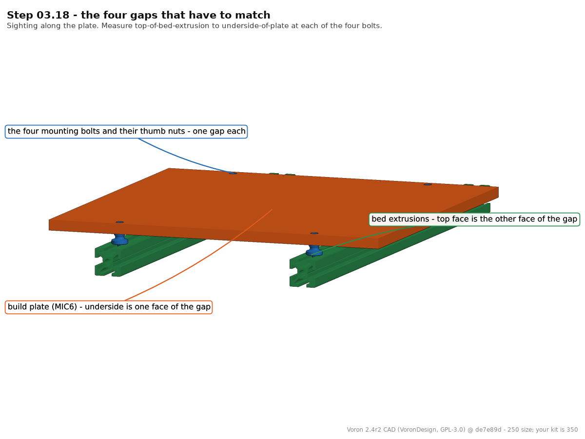
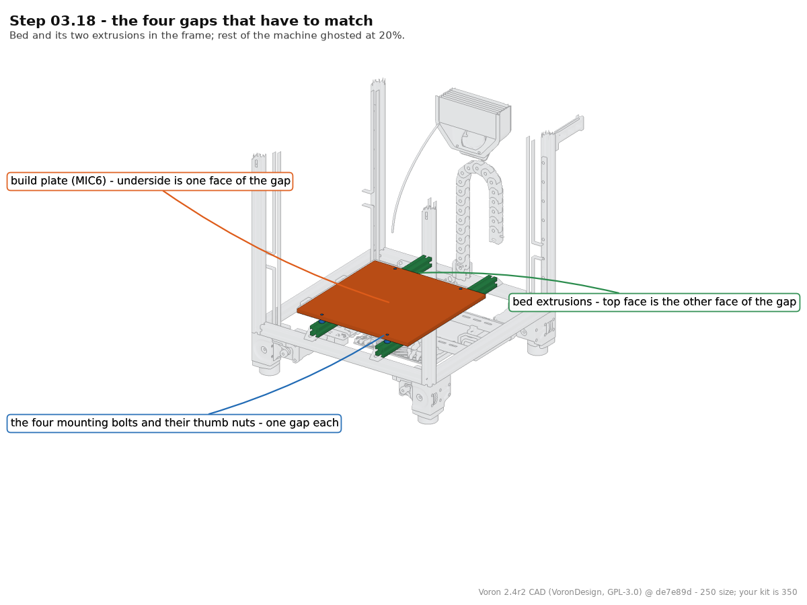

**What you're looking at:** The four corners and a caliper. The plate rides on four bolts above the two bed extrusions; the gap under each bolt is what you measure, and all four should match. A short corner is a permanent tilt every bed mesh has to fight.

**Parts:** caliper.

**Do:**

1. Measure the gap between extrusion top and plate underside at each bolt.
2. Sight along the plate at eye level, front and side.
3. A short corner means an unrolled T-nut, a tipped thumb nut or a tight bolt.

**Check:** All four gaps equal to the thumb-nut height and to each other. Press each corner in turn: no rock, no click.

Tip: do not level the plate to the gantry mechanically. Quad gantry level does that in software in Ch 13; this step only proves the plate floats evenly.

Tip: The CAD bed is the 10 in (254 mm) MIC6 plate on 370 mm bed extrusions (250). Yours is the 350 plate on the 350 frame: four bolts, four gaps.

Source: [Voron manual p.59](https://github.com/VoronDesign/Voron-2/blob/de7e89d/Manual/Assembly_Manual_2.4r2.pdf#page=59) · [Voron manual p.58](https://github.com/VoronDesign/Voron-2/blob/de7e89d/Manual/Assembly_Manual_2.4r2.pdf#page=58) · CAD: Voron 2.4r2 STEP @ de7e89d

---

### Step 03.19 — Dress the bed harness below deck

**What you're looking at:** Manual p.60: the three bed cables below the deck, loose. Nothing is terminated in this chapter. The AC pair goes to the relay and the WAGO bus, the thermistor to a splicer PCB, all in Ch 10.

**Parts:** none — no zip ties yet.

**Do:**

1. Below the deck, separate the two AC leads from the thermistor cable.
2. Lay them toward the electronics bay, generous slack at the plate end.
3. Keep them off the deck opening's sharp edge and off the bed extrusions.

**Check:** Slack loop at the plate; no cable under tension; no cable touching a cut edge; the thermal fuse's legs undisturbed. Nothing tied down.

⚠ **Rev D+ / LDO:** do not zip-tie or terminate anything yet. The bed harness is a breakout design specifically so the plate can be removed from the top of the deck panel later; final routing, the WAGO terminals, the 2×2 XH splicer and the Omron SSR are all Ch 10. [src](https://docs.ldomotors.com/en/voron/voron2/wiring_guide_rev_d#wiring-the-bed-heater)

Source: [Voron manual p.60](https://github.com/VoronDesign/Voron-2/blob/de7e89d/Manual/Assembly_Manual_2.4r2.pdf#page=60) · [LDO wiring guide § Wiring the Bed Heater](https://docs.ldomotors.com/en/voron/voron2/wiring_guide_rev_d#wiring-the-bed-heater)

---

### Step 03.20 — Fit the flex plate, then cover the bed

**What you're looking at:** Manual p.61: the **flex plate**, the removable spring-steel print surface that clicks onto the magnet. It goes on once to prove it sits flat, then straight back in its sleeve; the magnet is not something you can resurface.

**Parts:** Spring Steel Flex Plate 2.4-350 ×1.

**Do:**

1. Drop the spring steel flex plate onto the magnet, coated side up, square to the edges. No fasteners.
2. Take it straight back off and into its sleeve.
3. Lay cardboard over the magnet for the next six chapters.

**Check:** Flex plate sits flat with no rocking and does not overhang the magnet on any side. Bed covered.

⚠ **Rev D+ / LDO:** the flex plate is an LDO kit item; the official manual's PRINT BED section ends at p.60 and p.61 carries no build content. [src](https://docs.ldomotors.com/en/voron/voron2/350_BOM/Rev_D)

Source: [Voron manual p.61](https://github.com/VoronDesign/Voron-2/blob/de7e89d/Manual/Assembly_Manual_2.4r2.pdf#page=61) · [LDO 350 Rev D BOM](https://docs.ldomotors.com/en/voron/voron2/350_BOM/Rev_D)

Pause: ~20 min since the last pause — the four-corner gap check is done, the bed harness is dressed loose below deck with nothing tied or terminated, and the flex plate has been test-fitted, removed and the bed covered with cardboard. Work through Checkpoint 03; the cover stays on for the next six chapters.

---

## Checkpoint 03

- [ ] Protective film removed; top face clean, magnet applied with no bubbles or wrinkles.
- [ ] All four bolt holes trimmed clear through the magnet; a 2.5 mm hex key reaches each bolt head.
- [ ] Heater pad flat and centred, pad screws present and untouched — inspected, not re-applied.
- [ ] Thermal fuse flat against the plate, screw tight, in-line with a heater lead — inspected, not re-fitted.
- [ ] M4×6 BHCS present on the plate as the PE point (washer: verify on bench); nothing wired to it.
- [ ] Four M3 roll-in T-nuts in the bed extrusion top slots; four M4 thumb nuts standing as spacers.
- [ ] Four **M3×20** SHCS fitted (not M3×16); **one** tightened, three deliberately loose.
- [ ] Front edge of the plate 38 mm behind the front edge of the frame, both corners.
- [ ] Equal gap under all four corners; no rock; plate clear of every vertical extrusion and Z rail.
- [ ] Straightedge check done before the magnet went on — no gap you could slide paper under.
- [ ] Three bed cables hanging free below the deck with slack, unterminated, nothing pinched or tied.
- [ ] Flex plate test-fitted, removed, and the bed covered for the rest of the build.

## Common mistakes

- **Applying the magnet over untrimmed bolt holes and only noticing at p.59.** The fix is a peel-and-replace magnet or drilling through it — both bad. Trim at 03.10.
- **Using the M3×16 the manual calls for.** It engages barely any thread through a 10 mm plate plus spacer, and strips the T-nut on first tighten. M3×20.
- **Tightening all four bolts because three loose bolts feel wrong.** The plate tacos on the first fast heat-up to 110 °C and never comes flat again.
- **Trying to "fix" the pre-applied heater or fuse.** Peeling a bonded AC heatpad to re-seat it wrecks it. Inspect and ask in `#ldo_motors` if something looks wrong.
- **Wiring the bed here.** The PE, heater leads and thermistor all terminate in Ch 10 after the SSR and WAGOs are mounted. Landing them now means undoing them.
- **Building on the bare magnet, or leaving the surface exposed.** The magnet sheet is not a print surface, and everything you drop for the next six chapters lands on it.

## Next

Ch 04 — A/B drives and idlers (manual p.62–81): the two gantry drive units and the front idlers, built on the bench with the bed covered.
