# Chapter 04 — A/B drive units and front idlers

Builds the four CoreXY sub-assemblies that carry the A and B belts — two motor-carrying drive units and two front idlers with their tension arms. Unlocks Ch 05 (gantry), which bolts all four onto the Y extrusions.

**What you're building in this chapter:** the four corners the printer's two long belts run around. In **CoreXY**, two motors sit fixed at the back of the machine and pull two crossed belts; drive both the same way and the toolhead moves in X, drive them opposite ways and it moves in Y — nothing heavy has to move with the toolhead, which is why the machine can be fast ([glossary](16-glossary.md#c)). **A** is the rear-right corner and **B** the rear-left. Each is a **drive unit**: a printed frame in two halves, holding stacks of small flanged bearings on two standing bolts, with a stepper motor bolted underneath and a toothed pulley on its shaft. At the front, each belt turns around a **front idler** — the same printed sandwich of bearings, with no motor, plus an orange **tension arm** that carries the bearing stack on its own axle bolt and that a small screw draws forward to take up belt slack in Ch 07. The two belts run at two different heights so they never touch, and almost everything in this chapter exists to set those two heights exactly: the pulley height on each motor, the bearing-stack heights on each post, and the deliberately different heights of the two idler frames. All four assemblies are built on the bench and bagged; none of them touches the printer until Ch 05.

**Time:** 3.5–5.0 h hands-on, first build ([survey §5.1 P04](../voron-build-instructions-survey.md)).

**Sessions:** 6 × ~30 min — the `Pause:` lines below break the chapter into 6 segments; every minute figure is a first-build estimate.

**Prerequisites:**

- **Ch 01 — Frame.** Nothing from Ch 02 or Ch 03 is needed; this is bench work and can run in parallel with them (survey §5.1: P04 ← P01).
- **Print batch B03** — *A/B drive units + front idlers*, 2 plates, 8.5 h, 119 g black ([print plan](../voron-print-plan.md)). B03's plate captions were corrected 2026-09-05 to pair `front_idler_right_*` with the A drive and `front_idler_left_*` with B — see Step 04.2. Both plates print all eight frames either way.
- **Print batch B02** — *the orange day*, plate **B02-P2**, for `[a]_tensioner_left` and `[a]_tensioner_right`.
- **Print batch B00** — for `pulley_jig.stl`. Without it you are setting two different pulley heights with calipers.

**Tools**

- Hex drivers 2 mm, 2.5 mm, 3 mm, 4 mm — a 2.5 mm ball-end helps at the M3×40
- 1.5 mm hex — the pulley set screws (verify on bench against the kit's pulleys)
- Temperature-controlled soldering iron + LDO brass M3 insert tip (4 heat-set inserts, Steps 04.3–04.4)
- Printed `pulley_jig.stl` (Voron-2 `STLs/Tools/`)
- Digital caliper — pulley height fallback, and to confirm both drives match
- A 60 mm offcut of 6 mm 2GT belt, or a thin steel rule — the belt-path straightness check
- Tweezers or a small screwdriver to place spacers into the stacks without dropping them
- Masking tape + marker — label every assembly **A** or **B** as it is finished

**Consumables:** Loctite 243 (blue), for the pulley set screws if they are not already pre-applied.

**Printed parts**

Parts arrive in the bins named below (see the bin map in print/README.md#bins); check the bin label's list before you start.

| Looks like | STL | Bin | Qty | Colour |
|---|---|---|---|---|
| 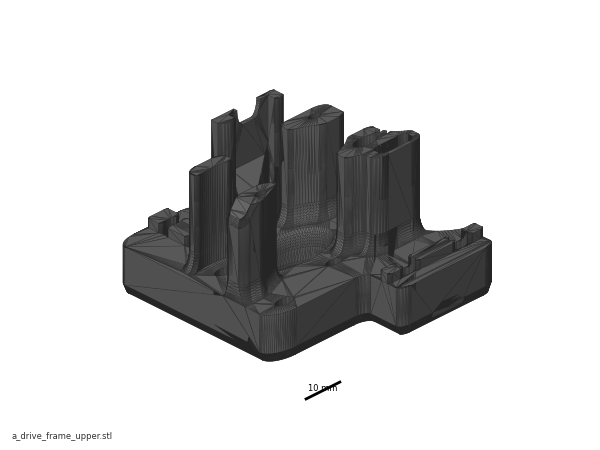{ width=96 } | `a_drive_frame_upper.stl` | 04-A | 1 | Black |
| 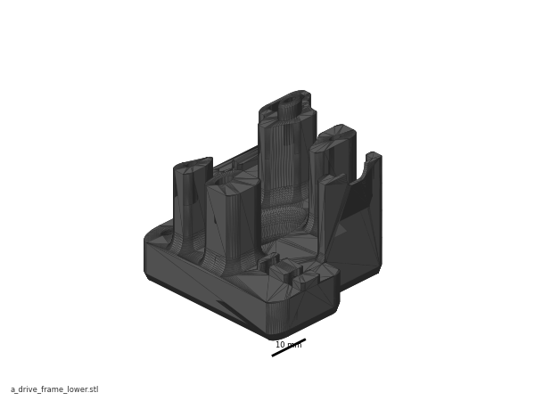{ width=96 } | `a_drive_frame_lower.stl` | 04-A | 1 | Black |
| 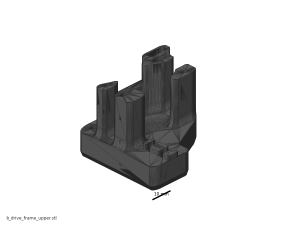{ width=96 } | `b_drive_frame_upper.stl` | 04-B | 1 | Black |
| 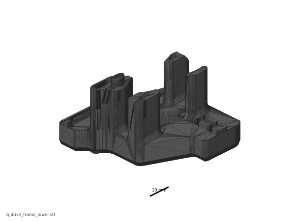{ width=96 } | `b_drive_frame_lower.stl` | 04-B | 1 | Black |
| 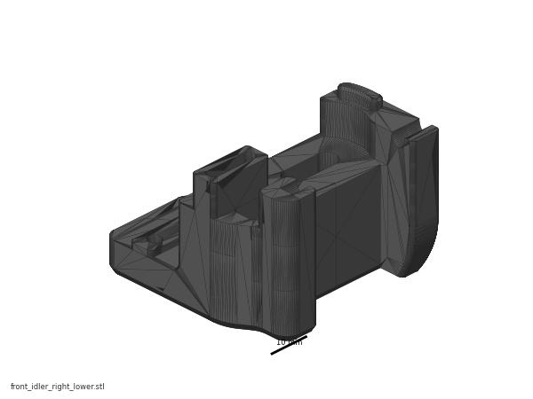{ width=96 } | `front_idler_right_lower.stl` | 04-A | 1 | Black |
| 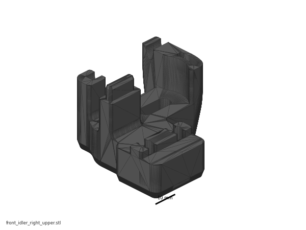{ width=96 } | `front_idler_right_upper.stl` | 04-A | 1 | Black |
| 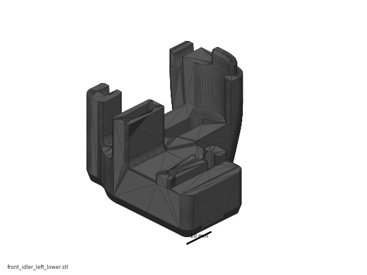{ width=96 } | `front_idler_left_lower.stl` | 04-B | 1 | Black |
| 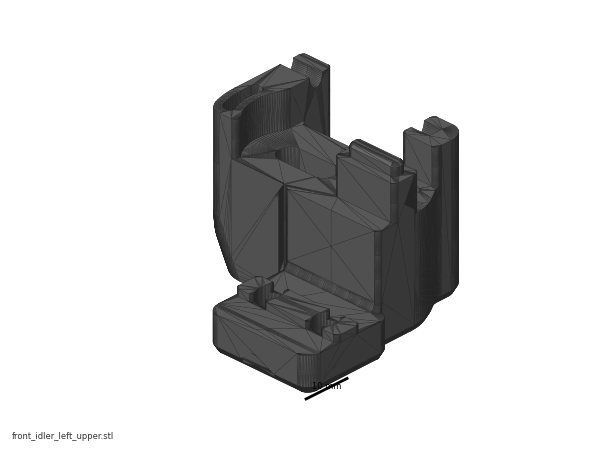{ width=96 } | `front_idler_left_upper.stl` | 04-B | 1 | Black |
| 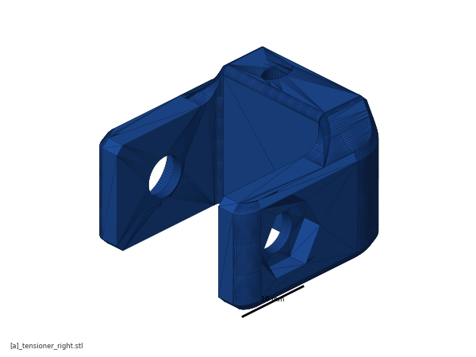{ width=96 } | `[a]_tensioner_right.stl` | 04-A | 1 | Orange |
| 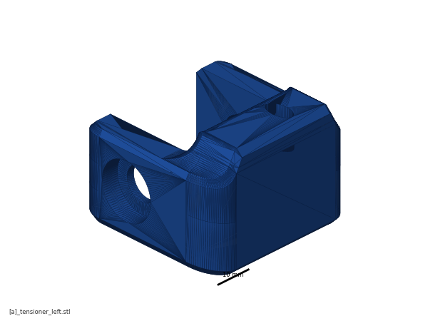{ width=96 } | `[a]_tensioner_left.stl` | 04-B | 1 | Orange |

All ten are in Voron-2 `STLs/Gantry/AB_Drive_Units/` and `STLs/Gantry/Front_Idlers/`. Two more parts sit in those same folders and are **not** used here: `[a]_cable_cover` (Ch 07) and `[a]_z_chain_retainer_bracket_x2` (Ch 06). Keep them bagged.

**Hardware** (chapter totals)

| Fastener / part | Qty | Where |
|---|---|---|
| Stepper motor, **0.9°**, `LDO-42STH48-2004MAH(VRN)` | 2 | one per drive (p.75, p.79) |
| GT2 pulley, 20 T, 5 mm bore, **6 mm wide** (`Pulley, 2GT, 20T, 5mm ID 6mm W`) | 2 | one per motor shaft (p.75, p.79). The kit has exactly two; the four **9 mm** 20T pulleys are the Z-drive pulleys used in Ch 02 |
| F695 flanged bearing (5×13×4 mm) | 16 | 6 per drive (p.74, p.78) + 2 per front idler (p.65, p.69). The A/B side uses **F695 only** — 625-2RS is the Z-drive bearing (Ch 02) |
| **M5 precision spacer, brass** — the manual's "M5 shim" | 16 | one above and one below every bearing pair |
| M5×30 BHCS | 4 | 2 per drive, upper frame → lower frame (p.73, p.77) |
| M5×40 SHCS | 2 | 1 per front idler — the idler **axle**: first the stack-building aid, then refitted from the top through the tension arm into its M5 nut and clamped firm (p.65–66, p.69–70) |
| M3×30 SHCS | 6 | 3 per motor (p.76, p.80) |
| M3×40 SHCS | 2 | 1 per front idler — the belt **tensioner** screw, through the frame's front wall into the arm's heat-set insert (p.67, p.71); set with the belt on in Ch 07 Step 07.5 |
| M3 washer | 2 | under each M3×40 head (p.67, p.71) |
| Heat-set insert, brass, M3×5×4 | 4 | 2 in `a_drive_frame_upper`, 1 in each tension arm (p.64) |
| M5 hex nut | 2 | 1 in each tension arm foot (p.64) |

**Read first**

- **A and B parts are mirrored and swap silently.** The A drive's printed frames carry a **cutout** the B frames do not have (p.73, circled). Only `a_drive_frame_upper` has the two heat-set insert bosses — `b_drive_frame_upper` has none. Build one complete assembly at a time; never have both sets of frames loose on the bench together.
- **Where each assembly ends up, standing in front of the printer: A = rear right, B = rear left.** The official manual shows it (p.63, p.83 — A on the right, B on the left, seen from the front) but never writes it; the LDO wiring guide does, and the LDO Klipper config repeats it (`## B Stepper - Left`, `## A Stepper - Right`). It follows that the A idler is the **front right** pair and the B idler the **front left** pair. [src](https://docs.ldomotors.com/en/voron/voron2/wiring_guide_rev_d)
- **The bearing stacks are the mistake everyone makes.** Every F695 pair goes **flange-out** — the two plain faces touch, the two flanges face away from each other — with one spacer above the pair and one below. The drive's far post takes **two** such pairs (4 bearings, 4 spacers); the near post and each front idler take **one** (2 bearings, 2 spacers).
- **The A and B pulleys sit at different heights and face opposite ways**: A is hub-down at 16.5 mm (p.75), B is hub-up at 6.5 mm (p.79). That difference is what stacks the two belt planes. No amount of belt tension in Ch 07 will fix it if you set them the same.
- **LDO's Build Notes have no entry for p.62–81.** The only kit deviation in this whole chapter is the standing substitution from their p.19 note: brass M5 precision spacer everywhere the manual writes "M5 shim". [src](https://docs.ldomotors.com/en/voron/voron2/build-faq)

**Sources for this chapter:**

- [Voron 2.4r2 assembly manual (pinned `de7e89d`)](https://github.com/VoronDesign/Voron-2/blob/de7e89d/Manual/Assembly_Manual_2.4r2.pdf) pages 62–81 — idler stacks, tension arms, drive frames, bearing stack-ups, pulley heights, motor orientation
- [LDO wiring guide (Rev D)](https://docs.ldomotors.com/en/voron/voron2/wiring_guide_rev_d) — A = rear right, B = rear left; the manual draws it (p.63, p.83) but never writes it
- [LDO Klipper config `leviathan-printer-rev-d-sbv2.cfg`](https://raw.githubusercontent.com/MotorDynamicsLab/LDOVoron2/667521d/Firmware/leviathan-printer-rev-d-sbv2.cfg) — `## A Stepper - Right` / `## B Stepper - Left`, and `full_steps_per_rotation: 400` for the 0.9° A/B motors
- [LDO Build Notes (Rev D)](https://docs.ldomotors.com/voron/voron2/build-faq) — no entry exists for p.62–81; the only deviation is the standing brass M5 precision spacer substitution from their p.19 note
- [LDO 350 Rev D BOM](https://docs.ldomotors.com/en/voron/voron2/350_BOM/Rev_D) — the two 6 mm 20T pulleys vs the four 9 mm Z pulleys, and the 0.9° motor part number
- [LDO heat-set insert tool guide](https://docs.ldomotors.com/guides/heatset_insert_tool_guide) — the four-insert pass
- [Voron-2 `STLs/Gantry/AB_Drive_Units`](https://github.com/VoronDesign/Voron-2/tree/de7e89d/STLs/Gantry/AB_Drive_Units), [Voron-2 `STLs/Gantry/Front_Idlers`](https://github.com/VoronDesign/Voron-2/tree/de7e89d/STLs/Gantry/Front_Idlers), [Voron-2 `STLs/Tools`](https://github.com/VoronDesign/Voron-2/tree/de7e89d/STLs/Tools)
- [survey](../voron-build-instructions-survey.md) §4.4 · [print plan](../voron-print-plan.md) batches B00/B02/B03

**Video coverage (Steve Builds, pre-release LDO kit — differs from Rev D+):** [Part 3 @0:58:20](https://www.youtube.com/watch?v=ii14-2COjuA&list=PL0fUJbigELQPqpeGOgHYisG4KaSXVtnNY&t=3500s) (+3m), [Part 3 @1:04:20](https://www.youtube.com/watch?v=ii14-2COjuA&list=PL0fUJbigELQPqpeGOgHYisG4KaSXVtnNY&t=3860s) (+14m), [Part 3 @1:07:20](https://www.youtube.com/watch?v=ii14-2COjuA&list=PL0fUJbigELQPqpeGOgHYisG4KaSXVtnNY&t=4040s) (+10m), [Part 3 @1:18:03](https://www.youtube.com/watch?v=ii14-2COjuA&list=PL0fUJbigELQPqpeGOgHYisG4KaSXVtnNY&t=4683s) (+2m), [Part 3 @1:23:20](https://www.youtube.com/watch?v=ii14-2COjuA&list=PL0fUJbigELQPqpeGOgHYisG4KaSXVtnNY&t=5000s) (+9m), [Part 5 @1:12:20](https://www.youtube.com/watch?v=hTKCBrk36R0&list=PL0fUJbigELQPqpeGOgHYisG4KaSXVtnNY&t=4340s) (+8m)

---

### Step 04.1 — Lay the chapter out as four separate kits

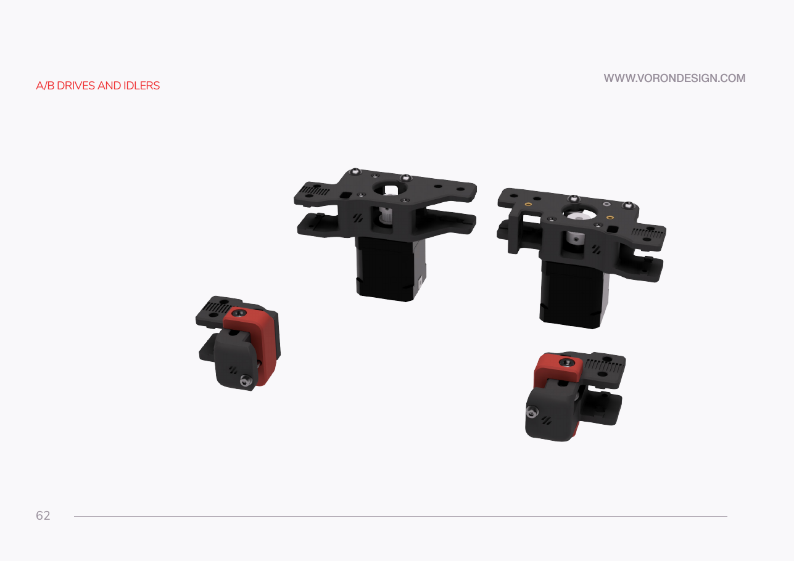

**What you're looking at:** Manual p.62 opens the A/B section; on the bench it is ten printed parts that make four sub-assemblies. Two **drive units** — a printed frame in two halves holding stacks of bearings, with a stepper motor bolted underneath — and two **front idlers**, the same idea without a motor. Together they are the four corners the two CoreXY belts loop around ([glossary](16-glossary.md#c)): the motors sit at the back and never move, and the belts they pull move the toolhead in X and Y.

**Parts:** all ten printed parts; four trays or bags.

**Do:** Split the bench into four labelled areas — **A DRIVE**, **B DRIVE**, **A IDLER**, **B IDLER** — so two mirrored parts are never loose on the bench at the same time. Put `a_drive_frame_upper` + `a_drive_frame_lower` in the first, `b_drive_frame_*` in the second, `front_idler_right_*` + `[a]_tensioner_right` in the third, `front_idler_left_*` + `[a]_tensioner_left` in the fourth. Only open one area at a time.

**Check:** Ten printed parts placed, none left over. If you have an eleventh, it is `[a]_cable_cover` or a `[a]_z_chain_retainer_bracket` — bag those for Ch 07 and Ch 06.

Source: [Voron manual p.62](https://github.com/VoronDesign/Voron-2/blob/de7e89d/Manual/Assembly_Manual_2.4r2.pdf#page=62) · [Voron-2 `STLs/Gantry/AB_Drive_Units`](https://github.com/VoronDesign/Voron-2/tree/de7e89d/STLs/Gantry/AB_Drive_Units) · [Voron-2 `STLs/Gantry/Front_Idlers`](https://github.com/VoronDesign/Voron-2/tree/de7e89d/STLs/Gantry/Front_Idlers)

---

### Step 04.2 — Fix which assembly is A and which is B

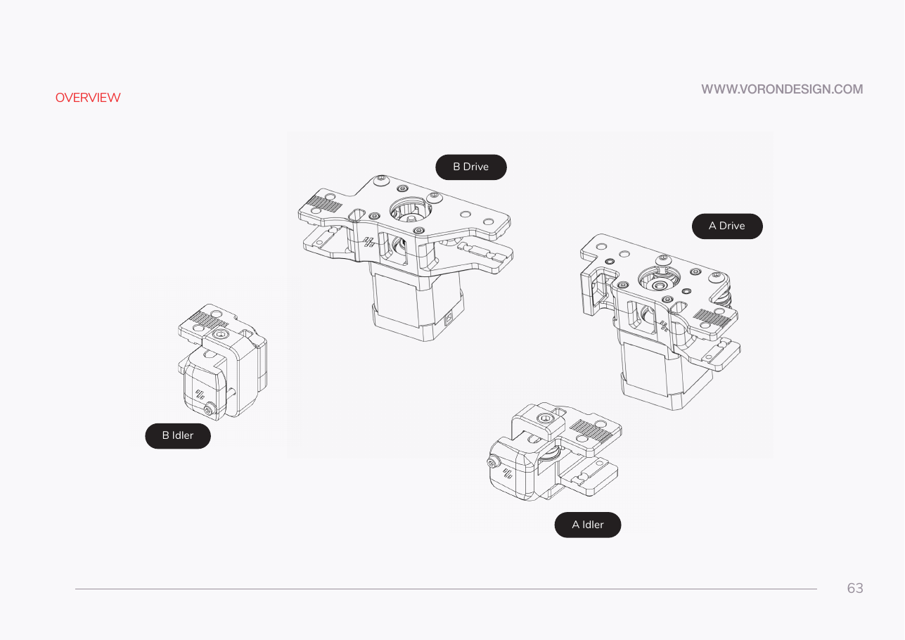

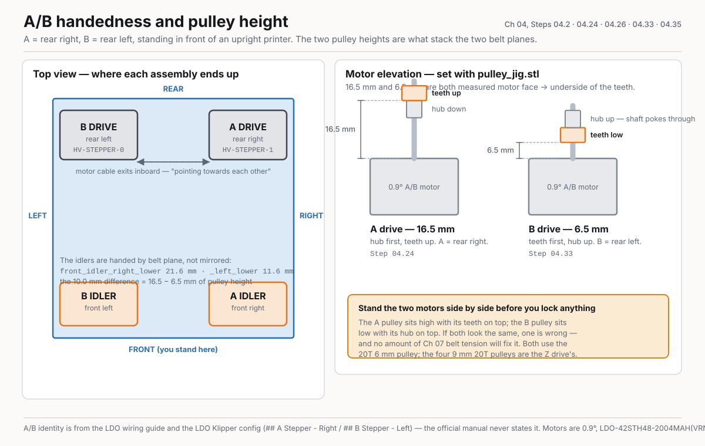

**What you're looking at:** Manual p.63 shows the four positions on the machine; the pair renders show how to tell the printed parts apart. **A is the rear-right drive and B the rear-left**, which makes the A idler the front-right pair and the B idler the front-left. On the idlers the give-away is height rather than handedness — the taller lower frame (21.6 mm against 11.6 mm) is the A idler's, and the upper frames run the other way — and that 10 mm is exactly the gap between the A and B pulley heights, which is what puts the two belts in two different planes. The diagram's top-view panel fixes A as rear right and B as rear left, with the idler and controller port that belongs to each.

**Parts:** masking tape, marker.

**Do:** Write the destination on every part now, before anything is assembled: `a_drive_*` → **rear right**; `b_drive_*` → **rear left**; `front_idler_right_*` + `[a]_tensioner_right` → **front right**; `front_idler_left_*` + `[a]_tensioner_left` → **front left**. All four positions are as seen standing in front of an upright printer. Then caliper the two **lower** idler frames to confirm the pairing: `front_idler_right_lower` is **21.6 mm** tall, `front_idler_left_lower` **11.6 mm**. That 10.0 mm difference is exactly the gap between the A and B pulley heights (16.5 mm vs 6.5 mm, p.75/p.79), so the tall lower frame belongs to the **A** (front right) idler and the short one to the **B** (front left) — the two idlers are handed by belt plane, not mirrored.

**Check:** Every part carries its destination in marker, and the taller of the two lower idler frames is the one labelled front right.

Tip: the upper frames are handed the other way — `front_idler_right_upper` is 12.0 mm and `front_idler_left_upper` 21.6 mm. Caliper those too if the lower pair is ambiguous.

⚠ Rev D+ / LDO: the motor identity comes from the wiring guide, not the manual: **A = rear right → HV-STEPPER-1**, **B = rear left → HV-STEPPER-0**. Get this backwards and the machine moves diagonally on a straight-line jog. [src](https://docs.ldomotors.com/en/voron/voron2/wiring_guide_rev_d)

Source: [Voron manual p.63](https://github.com/VoronDesign/Voron-2/blob/de7e89d/Manual/Assembly_Manual_2.4r2.pdf#page=63) · [LDO wiring guide (Rev D)](https://docs.ldomotors.com/en/voron/voron2/wiring_guide_rev_d) · [LDO Klipper config `leviathan-printer-rev-d-sbv2.cfg`](https://raw.githubusercontent.com/MotorDynamicsLab/LDOVoron2/667521d/Firmware/leviathan-printer-rev-d-sbv2.cfg) · [Video: Part 3 @1:18:02](https://www.youtube.com/watch?v=ii14-2COjuA&list=PL0fUJbigELQPqpeGOgHYisG4KaSXVtnNY&t=4682s)

---

### Step 04.3 — Heat-set the two inserts in `a_drive_frame_upper`

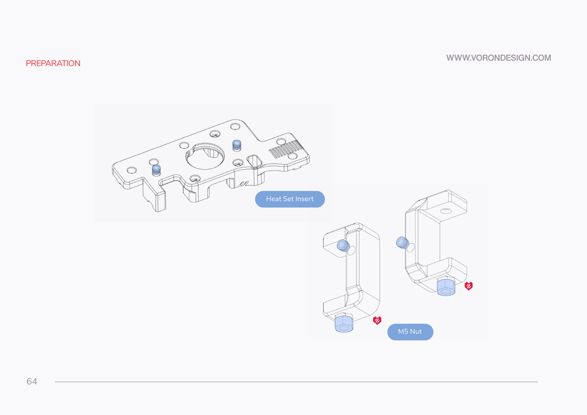

**What you're looking at:** Manual p.64 — the heat-set inserts for this chapter. Only **four**: two into `a_drive_frame_upper`, one into each tension arm. `a_drive_frame_upper` is the only drive frame with insert bosses at all, so the presence of two blind 4.7 mm holes beside the motor bore is itself the A/B test.

**Parts:** 2× M3×5×4 brass heat-set insert; `a_drive_frame_upper`.

**Do:** Find the two blind 4.7 mm bosses on the flat face of `a_drive_frame_upper`, one either side of the motor bore, ~56 mm apart. Set the iron to your ASA insert temperature (the one you proved on the B00 coupon), hold the part flat, and press each insert straight down until its top is flush with the surface. Let the plastic cool before touching the part.

**Check:** Both inserts flush and square — a tilted insert will not accept the screw in Ch 07. `b_drive_frame_upper` takes **no** inserts; if you find bosses on it you have picked up the A frame.

Tip: if your print batch already ran its insert pass ([survey §4.4 #4](../voron-build-instructions-survey.md)), just confirm the two are present and skip ahead.

Source: [Voron manual p.64](https://github.com/VoronDesign/Voron-2/blob/de7e89d/Manual/Assembly_Manual_2.4r2.pdf#page=64) · [LDO heat-set insert tool guide](https://docs.ldomotors.com/guides/heatset_insert_tool_guide)

---

### Step 04.4 — Heat-set one insert into each tension arm

**What you're looking at:** Manual p.64 and the two orange **tension arms** — the printed levers that carry each front idler's bearing stack and that a screw draws forward to tension a belt. Each arm is a C in section: a **top boss** with the counterbore the M5×40 axle's head sits in, a **foot** with the M5 nut pocket, and a **back wall** carrying one stepped bore — a 4.7 mm pocket for the insert, opening into a 3.5 mm bore that the M3×40 tensioner's tip runs on into as it is wound in. There is no bearing eye: the stack rides on the axle between boss and foot.

**Parts:** 2× M3×5×4 brass heat-set insert; `[a]_tensioner_left`, `[a]_tensioner_right`.

**Do:** Each tension arm has one through-bore that steps from 3.5 mm to 4.7 mm. Press the insert into the **4.7 mm end** — the wider opening. The 3.5 mm section is the M3×40's clearance and must stay clear.

**Check:** Bench test from the far (plain, 3.5 mm) end: push an M3×40 SHCS in by hand — it passes freely down the 3.5 mm bore and picks up thread only when it reaches the insert. If it binds early, the insert went in the wrong end or sits crooked. In the idler it goes in the other way, from the frame's front wall into the insert (Step 04.11).

Source: [Voron manual p.64](https://github.com/VoronDesign/Voron-2/blob/de7e89d/Manual/Assembly_Manual_2.4r2.pdf#page=64) · [LDO heat-set insert tool guide](https://docs.ldomotors.com/guides/heatset_insert_tool_guide)

---

### Step 04.5 — Press an M5 nut into each tension arm foot

**What you're looking at:** Manual p.64 — an M5 hex nut dropping into a pocket in the foot of each tension arm. That captive nut is what the vertical M5×40 axle threads into, so the bearing stack is clamped inside the arm and moves with it when the tensioner draws the arm forward.

**Parts:** 2× M5 hex nut; both tension arms.

**Do:** Drop an M5 nut into the hex pocket in the underside of each arm's foot. Seat it fully with a flat driver — the nut must sit below the face, not proud of it, or the arm will not lie flat in the frame channel.

**Check:** The nut does not rock in its pocket and does not stand above the foot. Nothing holds it in yet; keep the arms flat until Step 04.9.

Source: [Voron manual p.64](https://github.com/VoronDesign/Voron-2/blob/de7e89d/Manual/Assembly_Manual_2.4r2.pdf#page=64)

Pause: ~30 min since the last pause — the bench is split into four labelled kits, every part carries its destination in marker, the two inserts are in `a_drive_frame_upper`, one is in each tension arm and both M5 nuts are seated. Unplug the iron. Nothing is stacked yet.

---

### Step 04.6 — A idler: stand the assembly-aid bolt in the lower frame

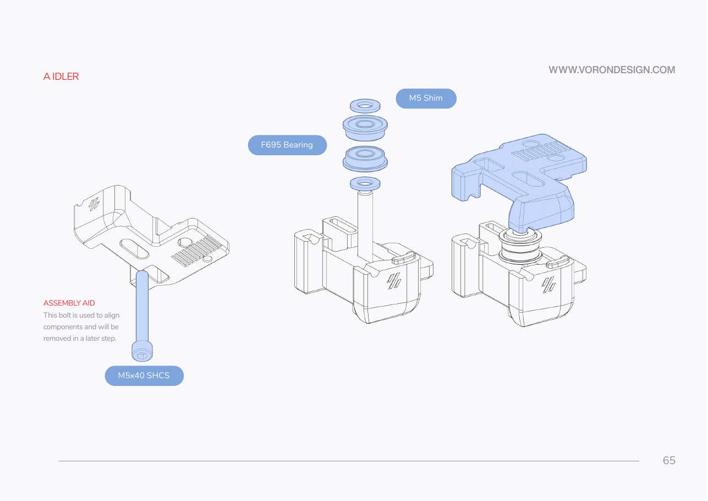
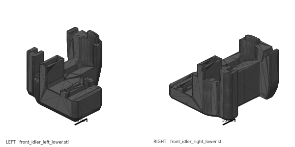

**What you're looking at:** Manual p.65 — the A (front-right) idler starting. `front_idler_right_lower` is the taller of the two lower frames (21.6 mm against 11.6 mm), and the M5×40 standing in its boss is not a fastener yet: it is a temporary spindle to thread the bearing stack onto so nothing falls over while you build it.

**Parts:** `front_idler_right_lower`; 1× M5×40 SHCS.

**Do:** Lay `front_idler_right_lower` flat with its idler boss facing up. Push the M5×40 SHCS up through the boss from underneath so the thread stands vertically. This bolt is only a stack alignment aid at this stage and comes out again at Step 04.9.

**Check:** The bolt stands square to the frame and the head sits fully home underneath. If it leans, the stack will not seat.

Source: [Voron manual p.65](https://github.com/VoronDesign/Voron-2/blob/de7e89d/Manual/Assembly_Manual_2.4r2.pdf#page=65)

---

### Step 04.7 — A idler: build the bearing stack

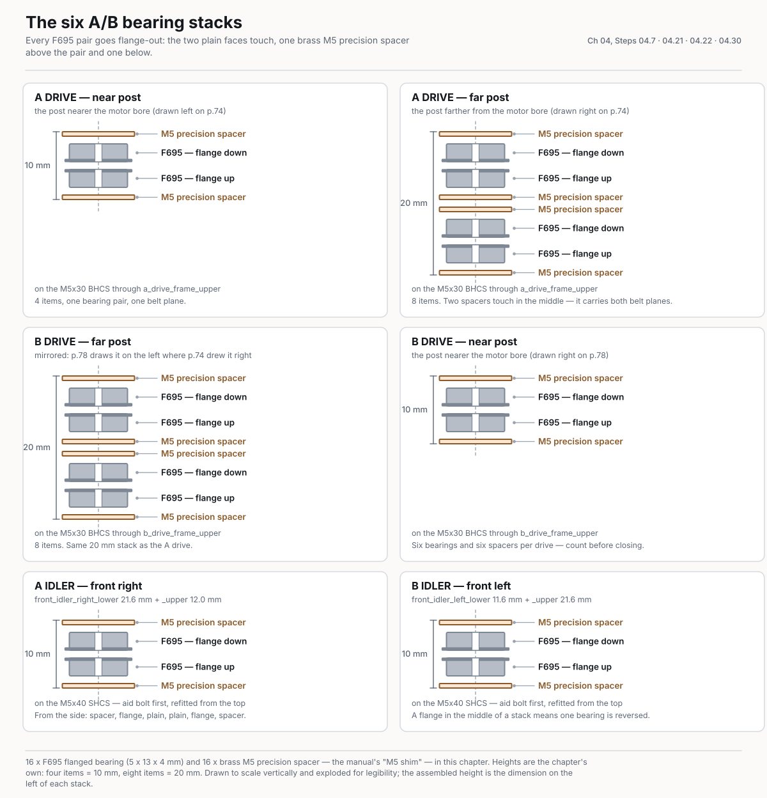

**What you're looking at:** Manual p.65 — the bearing stack. **F695** bearings are 5 × 13 × 4 mm ball bearings with a raised flange on one face ([glossary](16-glossary.md#f)); fitted plain-face to plain-face, their two flanges point outward and form a channel exactly one belt wide, which is what keeps the belt from walking off. A brass **precision spacer** above and below sets the stack's height in the frame. The diagram lays out all six F695 stacks in the build — both idlers and all four drive posts — as exploded columns so you can check this one against every other stack in the chapter.

**Parts:** 2× M5 precision spacer; 2× F695 bearing.

**Do:** Thread onto the standing bolt, **bottom to top**: (1) M5 precision spacer; (2) F695 bearing, **flange down**; (3) F695 bearing, **flange up**; (4) M5 precision spacer. The two bearings meet plain face to plain face, so their flanges point away from each other and form the belt channel.

**Check:** Sight the stack from the side — you see spacer, flange, plain, plain, flange, spacer. If you can see a flange in the middle of the stack, one bearing is reversed; strip it and rebuild. Spin the pair: both bearings must turn freely and independently.

⚠ Rev D+ / LDO: the manual's "M5 Shim" is the brass **M5 precision spacer** in this kit — one per callout, never two stacked to make up height. [src](https://docs.ldomotors.com/en/voron/voron2/build-faq)

Source: [Voron manual p.65](https://github.com/VoronDesign/Voron-2/blob/de7e89d/Manual/Assembly_Manual_2.4r2.pdf#page=65) · [LDO Build Notes (Rev D)](https://docs.ldomotors.com/voron/voron2/build-faq) · [Video: Part 3 @0:59:21](https://www.youtube.com/watch?v=ii14-2COjuA&list=PL0fUJbigELQPqpeGOgHYisG4KaSXVtnNY&t=3561s)

---

### Step 04.8 — A idler: cap the stack with the upper frame

**What you're looking at:** Manual p.65 — `front_idler_right_upper`, the 12.0 mm-tall cap. It captures the top spacer and closes the frame around the bearing pair; the two halves meeting with no gap is the evidence that nothing inside is out of place.

**Parts:** `front_idler_right_upper` (the 12.0 mm-tall one).

**Do:** Lower `front_idler_right_upper` over the stack so its nose captures the top spacer and the two frames meet along their mating faces.

**Check:** The two frames sit tight together with no gap and no rock. A visible gap means a spacer is out of place or a bearing is not centred on the bolt.

Source: [Voron manual p.65](https://github.com/VoronDesign/Voron-2/blob/de7e89d/Manual/Assembly_Manual_2.4r2.pdf#page=65) · [Video: Part 3 @1:06:14](https://www.youtube.com/watch?v=ii14-2COjuA&list=PL0fUJbigELQPqpeGOgHYisG4KaSXVtnNY&t=3974s)

---

### Step 04.9 — A idler: pull the aid bolt and slide in the tension arm

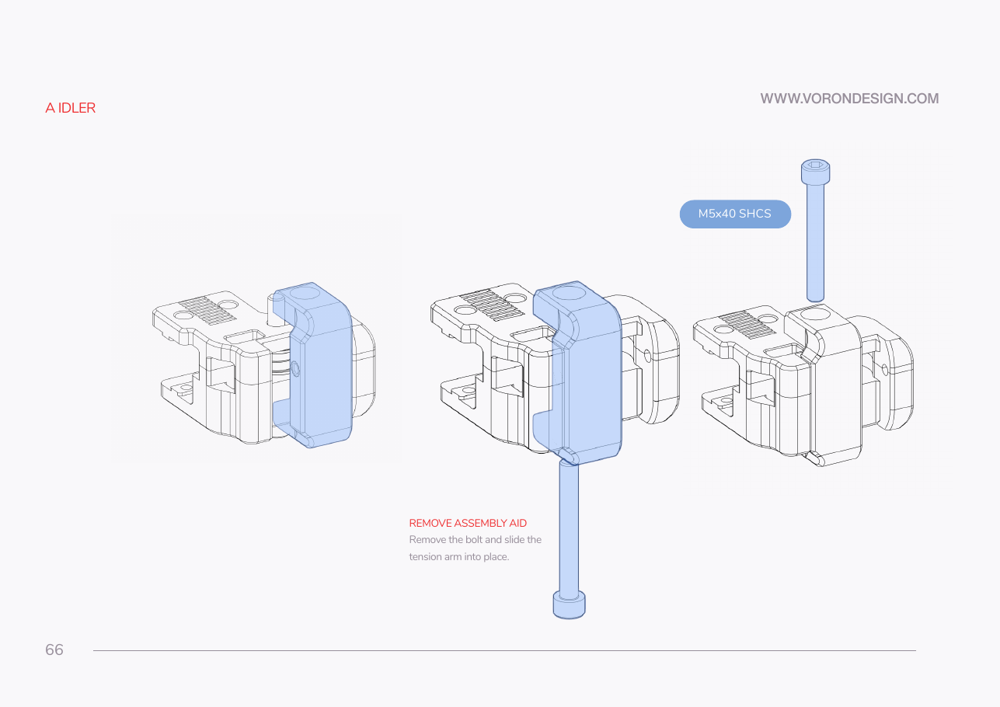
![`[a]_tensioner_left` vs `[a]_tensioner_right` — mirrors, same camera](assets/parts/pair-tensioner.png)

**What you're looking at:** Manual p.66 and the pair render — the orange `[a]_tensioner_right` sliding into the channel between the two idler frames. The two arms are mirrors — the same C of top boss, foot and back wall, handed the other way; in the render, both from one camera, they read as mirror images. The wrong hand simply will not lie flat in the channel.

**Parts:** `[a]_tensioner_right` (with its insert and M5 nut already fitted).

**Do:** Hold the two frames together, withdraw the M5×40 SHCS downwards, and slide `[a]_tensioner_right` into the channel between the frames until its top boss lines up with the hole in the upper frame. Keep the assembly pinched together while you do it — the bearing stack is unsupported for these few seconds.

**Check:** The arm sits flat in the channel and its top boss is concentric with the frame's top hole. The wrong-hand arm will not sit flat — if it fights you, you have `[a]_tensioner_left`.

Source: [Voron manual p.66](https://github.com/VoronDesign/Voron-2/blob/de7e89d/Manual/Assembly_Manual_2.4r2.pdf#page=66)

---

### Step 04.10 — A idler: refit the M5×40 SHCS from the top

**What you're looking at:** Manual p.66 — the M5×40 going back in, now from the top, as the idler's **axle**. Its head seats in the counterbore of the arm's top boss and its thread runs into the M5 nut in the arm's foot, so bolt, spacers, bearings and arm become one unit that slides together in the frame's slots when the tensioner moves it in Ch 07. It is not the tensioner.

**Parts:** the same 1× M5×40 SHCS.

**Do:** Drop the M5×40 SHCS in from the **top**, through the arm's top boss, and run it down into the M5 nut in the arm's foot until the head seats and the stack is clamped — **firm**; it threads into a steel nut, not plastic. This bolt is the idler's axle, not the tensioner.

**Check:** Head seated in the arm's top boss, both bearings spin free, and the whole arm — bolt and bearings with it — still slides fore-aft in the frame's slots when you push it (verify on bench).

Source: [Voron manual p.66](https://github.com/VoronDesign/Voron-2/blob/de7e89d/Manual/Assembly_Manual_2.4r2.pdf#page=66)

---

### Step 04.11 — A idler: fit the M3 washer and M3×40 SHCS

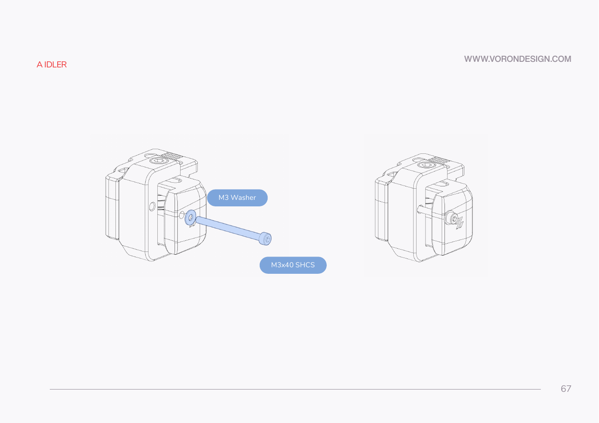

**What you're looking at:** Manual p.67 — the M3×40 that enters horizontally through the idler frame's front wall — the face away from the extrusion — a washer under its head, and threads into the heat-set insert in the tension arm's back wall. This is the belt **tensioner**: winding it in draws the arm, and the bearing stack riding on its axle, toward the wall; Ch 07 Step 07.5 sets it with the belt on. It does not clamp the frame halves together.

**Parts:** 1× M3 washer; 1× M3×40 SHCS.

**Do:** Put the M3 washer under the head of the M3×40 SHCS, enter it horizontally through the frame's front wall (the face away from the extrusion) and thread it into the heat-set insert in the arm's back wall. This is the belt tensioner — turning it in pulls the arm toward the wall. Run it in only until the arm is drawn up to the wall and the screw goes snug, no further; Ch 07 Step 07.5 backs it out to set tension.

**Check:** Snug, not torqued (the manual specifies no value); the arm sits against the wall with no preload beyond that. The washer is captive under the head and the head sits flat on the frame's front face.

Source: [Voron manual p.67](https://github.com/VoronDesign/Voron-2/blob/de7e89d/Manual/Assembly_Manual_2.4r2.pdf#page=67) · [Video: Part 3 @1:07:00](https://www.youtube.com/watch?v=ii14-2COjuA&list=PL0fUJbigELQPqpeGOgHYisG4KaSXVtnNY&t=4020s)

---

### Step 04.12 — A idler: check your work

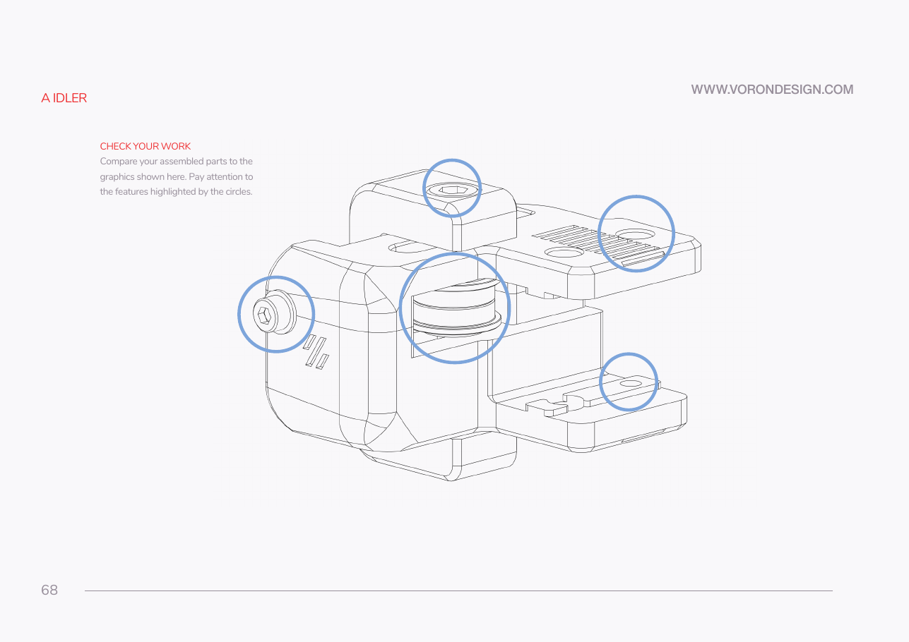

**What you're looking at:** Manual p.68 — the finished A idler with five features circled. Compare each one: the M5×40 axle head sitting down in the arm's top boss, the ribbed face of the upper frame, the exposed bearing pair with a flange top and bottom, the M3×40 tensioner head with its washer in the side of the frame, and the bolt hole in the lower frame's foot flange.

**Parts:** none.

**Do:** Compare your assembly against the five circled features on p.68: the M5×40 head recessed in the arm's top boss; the ribbed face of the upper frame; the exposed bearing pair with a flange top and bottom; the M3×40 head with its washer in the side of the **frame**; and the bolt hole in the lower frame's foot flange. Then set it in the **A IDLER** tray.

**Check:** All five features match the page. Spin the bearing pair once more with a fingertip — it must run free with the frames closed.

Source: [Voron manual p.68](https://github.com/VoronDesign/Voron-2/blob/de7e89d/Manual/Assembly_Manual_2.4r2.pdf#page=68)

Pause: ~40 min since the last pause — the A (front right) idler is complete and checked against p.68: bearings flange-out, M5×40 axle in from the top and clamped firm into the arm's nut, M3×40 tensioner with its washer snug. An idler is a self-contained unit; never stop with the aid bolt withdrawn and the stack unsupported.

---

### Step 04.13 — B idler: stand the assembly-aid bolt in the lower frame

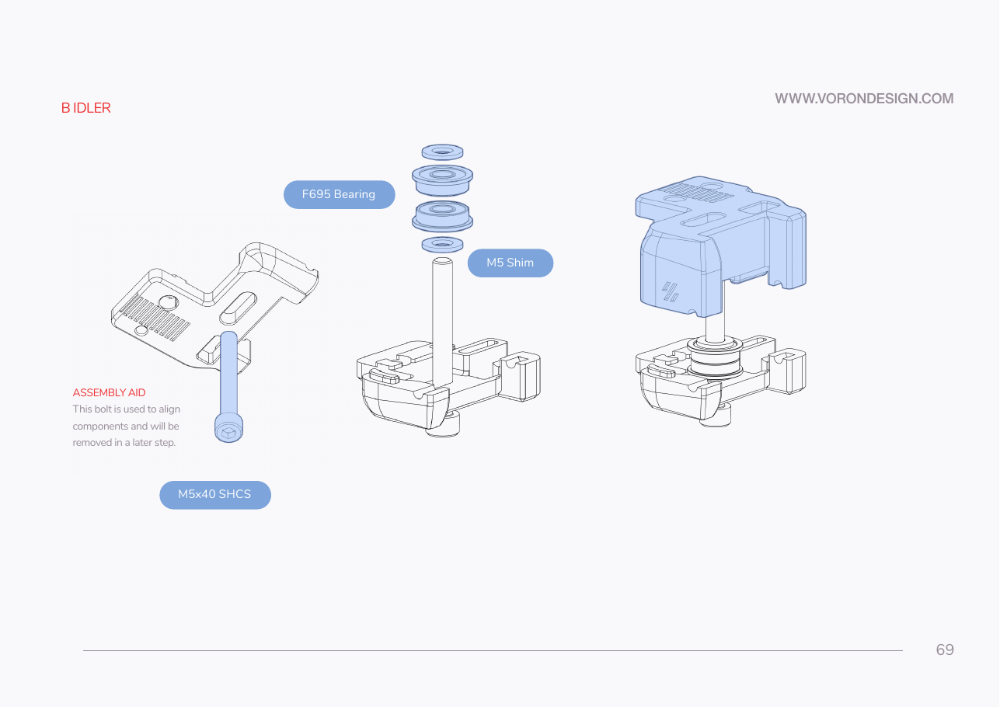

**What you're looking at:** Manual p.69 — the B (front-left) idler. `front_idler_left_lower` is the **short** one at 11.6 mm; its bearing stack therefore sits lower, which is the whole reason the B belt runs in a lower plane than the A belt.

**Parts:** `front_idler_left_lower` (the 11.6 mm-tall one); 1× M5×40 SHCS.

**Do:** Lay `front_idler_left_lower` flat with its idler boss up and push the M5×40 SHCS up through it from underneath. The B idler's boss is lower than the A idler's — that is correct, it carries the lower belt plane.

**Check:** Bolt vertical, head home. If the boss looks tall like the last one, you have the A idler's lower frame.

Source: [Voron manual p.69](https://github.com/VoronDesign/Voron-2/blob/de7e89d/Manual/Assembly_Manual_2.4r2.pdf#page=69)

---

### Step 04.14 — B idler: build the bearing stack

**What you're looking at:** Manual p.69 — the same four-item stack as the A idler: spacer, F695 flange down, F695 flange up, spacer. Identical hardware, different frame height.

**Parts:** 2× M5 precision spacer; 2× F695 bearing.

**Do:** Bottom to top: M5 precision spacer, F695 **flange down**, F695 **flange up**, M5 precision spacer. Identical to the A idler.

**Check:** No flange visible in the middle of the stack; both bearings spin free.

⚠ Rev D+ / LDO: brass **M5 precision spacer** in place of the manual's "M5 shim". [src](https://docs.ldomotors.com/en/voron/voron2/build-faq)

Source: [Voron manual p.69](https://github.com/VoronDesign/Voron-2/blob/de7e89d/Manual/Assembly_Manual_2.4r2.pdf#page=69) · [LDO Build Notes (Rev D)](https://docs.ldomotors.com/voron/voron2/build-faq) · [Video: Part 3 @1:23:36](https://www.youtube.com/watch?v=ii14-2COjuA&list=PL0fUJbigELQPqpeGOgHYisG4KaSXVtnNY&t=5016s)

---

### Step 04.15 — B idler: cap the stack with the upper frame

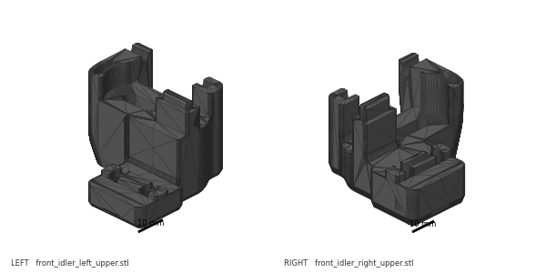

**What you're looking at:** Manual p.69 — `front_idler_left_upper`, and this is the tall one (21.6 mm) where the A idler's upper was short. The uppers are handed the opposite way to the lowers, so a pair that both look tall or both look short means you have two of the same hand.

**Parts:** `front_idler_left_upper` (the tall 21.6 mm one).

**Do:** Lower `front_idler_left_upper` over the stack until the two frames meet.

**Check:** Frames flush, no gap, no rock.

Source: [Voron manual p.69](https://github.com/VoronDesign/Voron-2/blob/de7e89d/Manual/Assembly_Manual_2.4r2.pdf#page=69)

---

### Step 04.16 — B idler: pull the aid bolt and slide in the tension arm

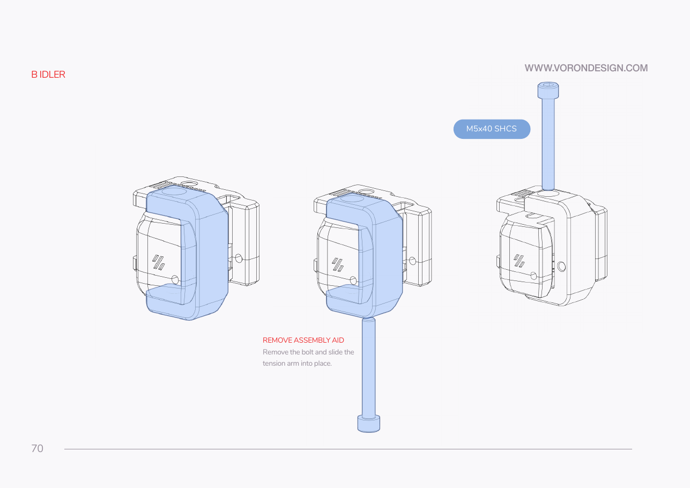

**What you're looking at:** Manual p.70 — `[a]_tensioner_left` going into the B idler's channel, the mirror of Step 04.9.

**Parts:** `[a]_tensioner_left`.

**Do:** Pinch the frames together, withdraw the M5×40 SHCS downwards, and slide `[a]_tensioner_left` into the channel until its top boss lines up with the frame's top hole.

**Check:** The arm lies flat in the channel; its boss is concentric with the hole above it.

Source: [Voron manual p.70](https://github.com/VoronDesign/Voron-2/blob/de7e89d/Manual/Assembly_Manual_2.4r2.pdf#page=70)

---

### Step 04.17 — B idler: refit the M5×40 SHCS from the top

**What you're looking at:** Manual p.70 — the M5×40 axle refitted from the top through the arm's top boss into its captive nut, mirror of Step 04.10. Clamped firm; it is the axle, not the tensioner.

**Parts:** the same 1× M5×40 SHCS.

**Do:** Drop it in from the top, through the arm's top boss, and run it down into the M5 nut in the arm's foot until the head seats and the stack is clamped — firm, into steel.

**Check:** Head seated in the top boss, both bearings spin free, and the arm with its bolt and bearings still slides fore-aft in the frame's slots (verify on bench).

Source: [Voron manual p.70](https://github.com/VoronDesign/Voron-2/blob/de7e89d/Manual/Assembly_Manual_2.4r2.pdf#page=70)

---

### Step 04.18 — B idler: fit the M3 washer and M3×40 SHCS

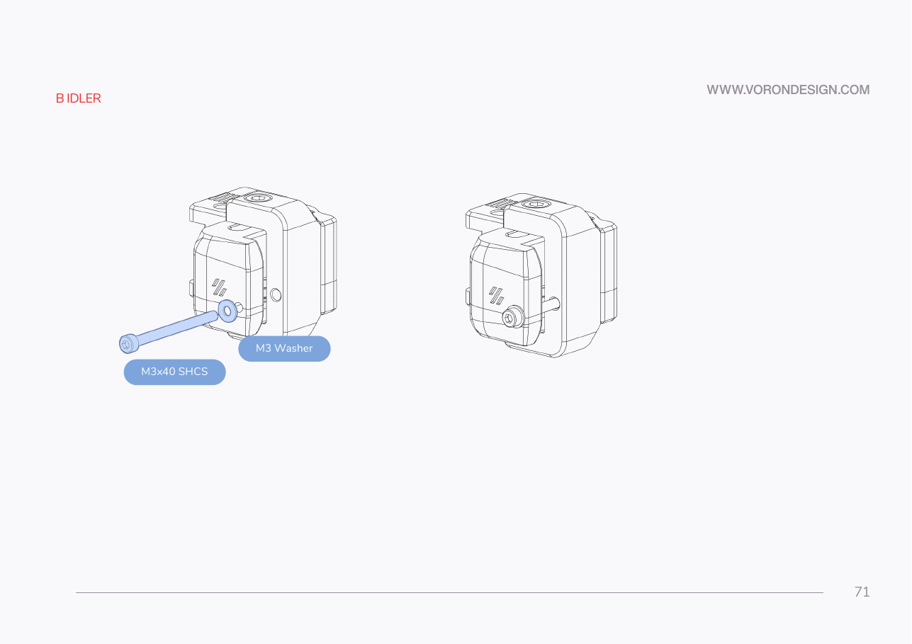

**What you're looking at:** Manual p.71 — the M3×40 tensioner and its washer through the B idler frame's front wall into the arm's insert, mirror of Step 04.11.

**Parts:** 1× M3 washer; 1× M3×40 SHCS.

**Do:** Washer under the head, in through the frame's front wall (the face away from the extrusion) into the arm's heat-set insert, until the arm is drawn up to the wall and the screw is snug — no further; Ch 07 Step 07.5 sets it.

**Check:** Snug, not torqued (not specified — snug). Head flat, washer captive.

Source: [Voron manual p.71](https://github.com/VoronDesign/Voron-2/blob/de7e89d/Manual/Assembly_Manual_2.4r2.pdf#page=71)

---

### Step 04.19 — B idler: check your work

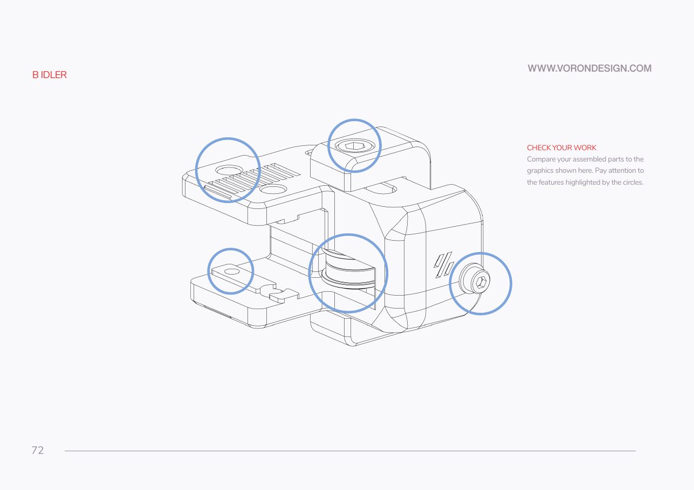

**What you're looking at:** Manual p.72 — the finished B idler with five circled features, plus the one comparison that catches a hand error: the two idlers side by side. Their bearing pairs must sit at visibly different heights, because that height difference *is* the separation between the two belt planes.

**Parts:** none.

**Do:** Match the five circled features on p.72 — ribbed face, M5×40 head in the top boss, exposed bearing pair, M3×40 head with washer, and the bolt hole in the lower frame's foot flange (the slot next to it is not circled). Set it in the **B IDLER** tray.

**Check:** All five match, bearings free. Hold the two idlers side by side: their bearing pairs must sit at visibly different heights. If they look the same, you built two of the same hand.

Source: [Voron manual p.72](https://github.com/VoronDesign/Voron-2/blob/de7e89d/Manual/Assembly_Manual_2.4r2.pdf#page=72)

Pause: ~35 min since the last pause — the B (front left) idler is complete and checked against p.72, and the two idlers sit side by side with visibly different bearing heights. Both are in their trays. Nothing is open.

---

### Step 04.20 — A drive: upper frame face down, two M5×30 BHCS

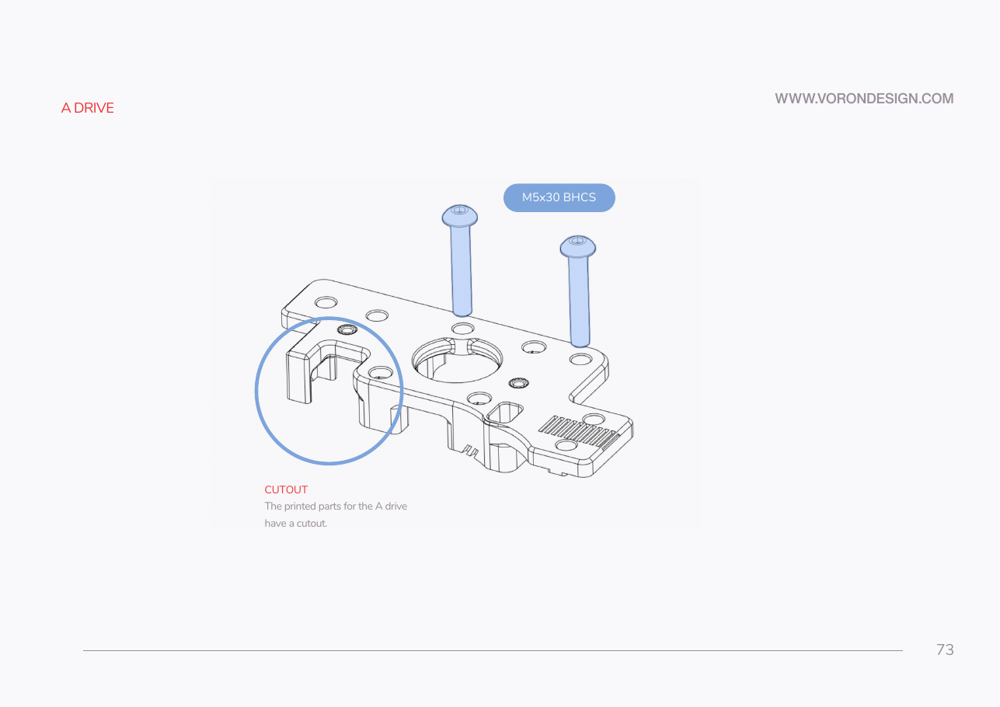

**What you're looking at:** Manual p.73 and the pair render — `a_drive_frame_upper`, built upside down — flat (insert) face on the bench — so the two M5×30 stand up through it as the axles the bearing stacks thread onto. There is no pillar: the manual's "post" is the standing bolt. This is the A part, and it has two features `b_drive_frame_upper` does not: the **cutout** circled on p.73 (visible in the render as the extra lobe on the base plate) and the two heat-set inserts you fitted in Step 04.3.

**Parts:** `a_drive_frame_upper`; 2× M5×30 BHCS.

**Do:** The manual builds both drives **upside down**. With the frame flat face **up** (p.73), drop the two M5×30 BHCS into the two 5.4 mm holes either side of the motor bore (37 mm apart) — they must enter from this flat, insert face. Holding the heads, turn the frame over onto the bench so the heads are underneath and the two threads stand up (p.74). The stacks build on these threads.

**Check:** This is an A part — it has the **cutout** circled on p.73 and the two heat-set inserts fitted at Step 04.3. Both bolts stand square, heads underneath and fully home in the plate — a bolt dropped in from the other side sits head-up and the lower frame will not close over it.

Source: [Voron manual p.73](https://github.com/VoronDesign/Voron-2/blob/de7e89d/Manual/Assembly_Manual_2.4r2.pdf#page=73) · [Video: Part 3 @1:04:59](https://www.youtube.com/watch?v=ii14-2COjuA&list=PL0fUJbigELQPqpeGOgHYisG4KaSXVtnNY&t=3899s)

---

### Step 04.21 — A drive: two-bearing stack on the near post

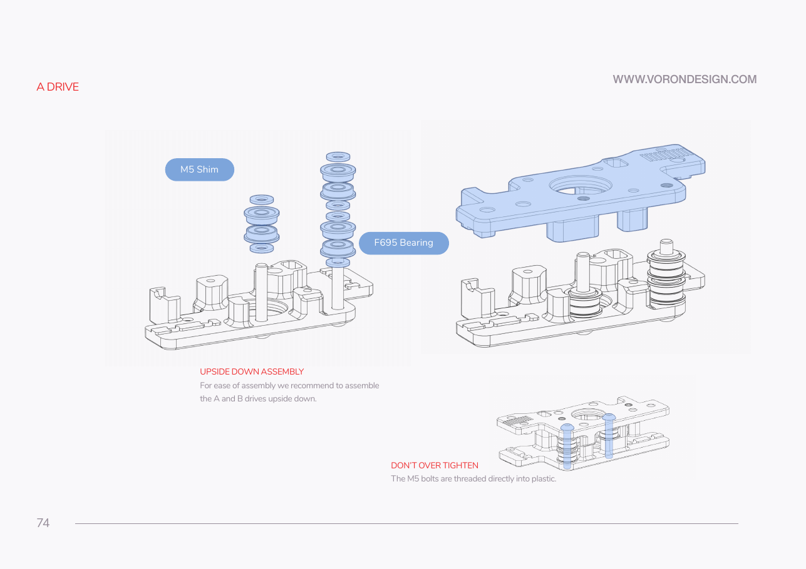

**What you're looking at:** Manual p.74 — the post **nearer** the motor bore, taking one bearing pair: spacer, two F695 flange-out, spacer. This post carries only one belt, so it takes half the stack of the other one.

**Parts:** 2× M5 precision spacer; 2× F695 bearing.

**Do:** Work on the **near** bolt — the one ~17 mm from the bore centre; the far one is ~34 mm. Measure with a rule if the drawing is unclear (p.74 draws it on the left; p.78 mirrors it). Bottom to top: M5 precision spacer, F695 **flange down**, F695 **flange up**, M5 precision spacer.

**Check:** One pair, flanges out, one spacer each end — four items, 10 mm of stack. If you have loaded four bearings here, you are on the wrong bolt.

⚠ Rev D+ / LDO: brass **M5 precision spacer** in place of the manual's "M5 shim". [src](https://docs.ldomotors.com/en/voron/voron2/build-faq)

Source: [Voron manual p.74](https://github.com/VoronDesign/Voron-2/blob/de7e89d/Manual/Assembly_Manual_2.4r2.pdf#page=74) · [LDO Build Notes (Rev D)](https://docs.ldomotors.com/voron/voron2/build-faq)

---

### Step 04.22 — A drive: four-bearing stack on the far post

**What you're looking at:** Manual p.74 — the post **farther** from the motor bore, taking two pairs. This is where both belt planes pass through the same drive, so it needs two channels stacked, separated by the two spacers that meet in the middle. Reading the stack edge-on is the only reliable check: no flange may ever face another flange. The diagram's four-bearing columns (A and B drive, far post) show the same order — spacer, flange, plain, plain, flange, spacer, spacer, flange, plain, plain, flange, spacer — this is the most often mis-stacked assembly in the build.

**Parts:** 4× M5 precision spacer; 4× F695 bearing.

**Do:** Work on the **far** bolt — ~34 mm from the bore centre (drawn on the right on p.74; measure if in doubt). Load two complete pairs, bottom to top: spacer, F695 **flange down**, F695 **flange up**, spacer, spacer, F695 **flange down**, F695 **flange up**, spacer. Note the two spacers that meet in the middle — one closes the lower pair, one opens the upper pair. Read the finished stack back from the side: spacer, flange, plain, plain, flange, spacer, spacer, flange, plain, plain, flange, spacer. This post carries both belt planes and is the single most-often mis-stacked assembly in the build.

**Check:** Eight items, 20 mm of stack, exactly **two** spacers touching in the middle, and no flange facing another flange.

⚠ Rev D+ / LDO: all four "M5 shims" here are brass **M5 precision spacers**. [src](https://docs.ldomotors.com/en/voron/voron2/build-faq)

Source: [Voron manual p.74](https://github.com/VoronDesign/Voron-2/blob/de7e89d/Manual/Assembly_Manual_2.4r2.pdf#page=74) · [LDO Build Notes (Rev D)](https://docs.ldomotors.com/voron/voron2/build-faq)

---

### Step 04.23 — A drive: close it with `a_drive_frame_lower`

**What you're looking at:** Manual p.74 and the pair render — `a_drive_frame_lower`, the other half of the printed frame, closing over both posts. The M5×30 bolts thread directly into the plastic of the lower frame, which is why they stop at closed-and-snug rather than being torqued.

**Parts:** `a_drive_frame_lower`.

**Do:** Lower `a_drive_frame_lower` onto both stacks, aligning the two M5×30 threads with their blind holes, and run both bolts down alternately a couple of turns at a time until the frames meet. **Do not over-tighten — the M5 bolts thread directly into plastic** (p.74): stop the moment the frames are closed and the bolt stops turning easily. If a bearing pair comes out pinched, back the bolts off and check the stack order.

**Check:** Both bearing pairs still spin free with the frames closed, and neither bolt was taken past closed-and-snug.

Source: [Voron manual p.74](https://github.com/VoronDesign/Voron-2/blob/de7e89d/Manual/Assembly_Manual_2.4r2.pdf#page=74)

---

### Step 04.24 — A drive: set the pulley on the A motor at 16.5 mm

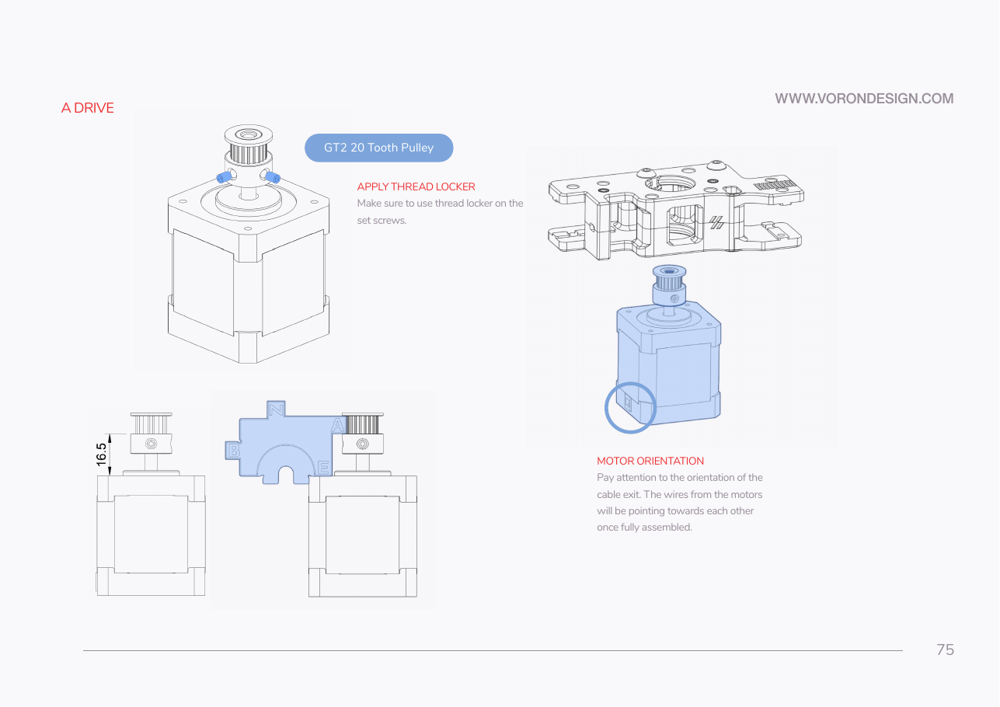

**What you're looking at:** Manual p.75 — the A motor and its **20T 6 mm-wide** GT2 pulley, set with the printed jig. The pulley height is what puts the belt in the same plane as the A idler's bearing channel; the underside of the jig's tab marked **A** repeats it without a caliper. The jig itself is a flat 3.2 mm plate, 47 mm long and 32 mm tall, with N, A, B and E moulded into one face — nothing like the block the render suggests: the A tab is the 5.5 mm ear at its top-right corner, the B tab the ear halfway up its left edge, and the half-round pocket and slot at the bottom centre play no part in setting a pulley. The diagram's elevation panel shows the A motor hub-down, teeth up, at 16.5 mm measured motor face to the underside of the teeth, next to the B motor's mirrored elevation for comparison.

**Parts:** 1× stepper motor (0.9° A/B motor); 1× GT2 20 T **6 mm** pulley; printed `pulley_jig.stl`.

**Do:** Slide the pulley onto the shaft **hub first — teeth up**. Hold the jig upright on the motor's face **beside** the pulley, letters facing you and upright, its long bottom edge flat on the face and the tab marked **A** (top-right corner) pointing at the pulley — the plate stands next to the pulley, never over the boss. The two small feet at the bottom centre hang down past the edge of the motor face, as p.75 draws them; the plate stands on the longer edge either side of them, and stood on the feet instead every height reads 3 mm high. The gauge is the **underside of the A tab**: on the STL it is 16.6 mm above that bottom edge, the manual's 16.5 mm (p.75). Slide the pulley down until the underside of its toothed section is level with the tab's underside — the tab just meets the top of the hub. The pulley does not sit *on* the tab: a flange resting on the tab's top is at 23.4 mm, 7 mm too high. Without the jig, set 16.5 mm with a caliper.

**Check:** Caliper it even with the jig: 16.5 mm from the motor face to the underside of the teeth. If you read ~23 mm the pulley is sitting on top of the tab; if you read ~19.5 mm the jig was stood on its feet. Teeth up, hub down. Compare against p.75's elevation before you lock anything.

⚠ Rev D+ / LDO: the two A/B motors are **0.9°** (`LDO-42STH48-2004MAH(VRN)`); the four Z motors are 1.8° and look identical. Read the label: **-2004MAH** = A/B (0.9°), **-2004AC** = Z (1.8°). Take an A/B motor, not a spare Z motor. This is why the LDO config carries `full_steps_per_rotation: 400` in `[stepper_x]` and `[stepper_y]` — you will set it in Ch 12, and it is the only place in the build the difference shows up. [src](https://github.com/MotorDynamicsLab/LDOVoron2/blob/main/Firmware/leviathan-printer-rev-d-sbv2.cfg)

Source: [Voron manual p.75](https://github.com/VoronDesign/Voron-2/blob/de7e89d/Manual/Assembly_Manual_2.4r2.pdf#page=75) · [LDO Klipper config `leviathan-printer-rev-d-sbv2.cfg`](https://raw.githubusercontent.com/MotorDynamicsLab/LDOVoron2/667521d/Firmware/leviathan-printer-rev-d-sbv2.cfg) · [LDO 350 Rev D BOM](https://docs.ldomotors.com/en/voron/voron2/350_BOM/Rev_D) · [Video: Part 3 @1:11:48](https://www.youtube.com/watch?v=ii14-2COjuA&list=PL0fUJbigELQPqpeGOgHYisG4KaSXVtnNY&t=4308s)

---

### Step 04.25 — A drive: threadlock and lock the pulley set screws

**What you're looking at:** Manual p.75 — the pulley's two set screws. Threadlocker goes on because a set screw that backs out lets the pulley slip on the shaft, and a slipping A or B pulley shows up as prints that drift diagonally rather than as an obvious failure.

**Parts:** 2× set screw (in the pulley); Loctite 243.

**Do:** Back both set screws out, put a drop of Loctite 243 on each, and refit. Rotate the shaft so the first set screw lands on the machined flat, if the shaft has one; tighten that one first, then the second. Recheck the height with the jig (tab underside level with the underside of the teeth) and then the caliper — set screws pull a pulley sideways as they bite.

**Check:** The pulley will not twist or slide on the shaft under firm hand pressure, and it still reads 16.5 mm. If the set screws already carry a dry blue patch, that is pre-applied threadlocker — do not add more.

Source: [Voron manual p.75](https://github.com/VoronDesign/Voron-2/blob/de7e89d/Manual/Assembly_Manual_2.4r2.pdf#page=75)

---

### Step 04.26 — A drive: offer the motor up with the cable exit inboard

**What you're looking at:** Manual p.75 — the motor going into the frame, right way up now. The manual's rule is that the two motors' cables point at each other once both drives are on the machine, which is what lets both reach the same cable duct across the back.

**Parts:** the A motor with its pulley.

**Do:** Turn the drive assembly the right way up (motor below the frames) and offer the motor up into the frame with the **cable exit facing inboard** — toward where the B drive will sit, i.e. toward the middle of the rear extrusion. The manual's rule: *"the wires from the motors will be pointing towards each other once fully assembled"* (p.75).

**Check:** With A at the rear right, the A motor's cable exits toward the machine's centreline, not out toward the right skirt. Getting this wrong is a full teardown of the drive once the gantry is in.

Source: [Voron manual p.75](https://github.com/VoronDesign/Voron-2/blob/de7e89d/Manual/Assembly_Manual_2.4r2.pdf#page=75) · [Video: Part 3 @1:07:37](https://www.youtube.com/watch?v=ii14-2COjuA&list=PL0fUJbigELQPqpeGOgHYisG4KaSXVtnNY&t=4057s)

---

### Step 04.27 — A drive: three M3×30 SHCS through the frames into the motor

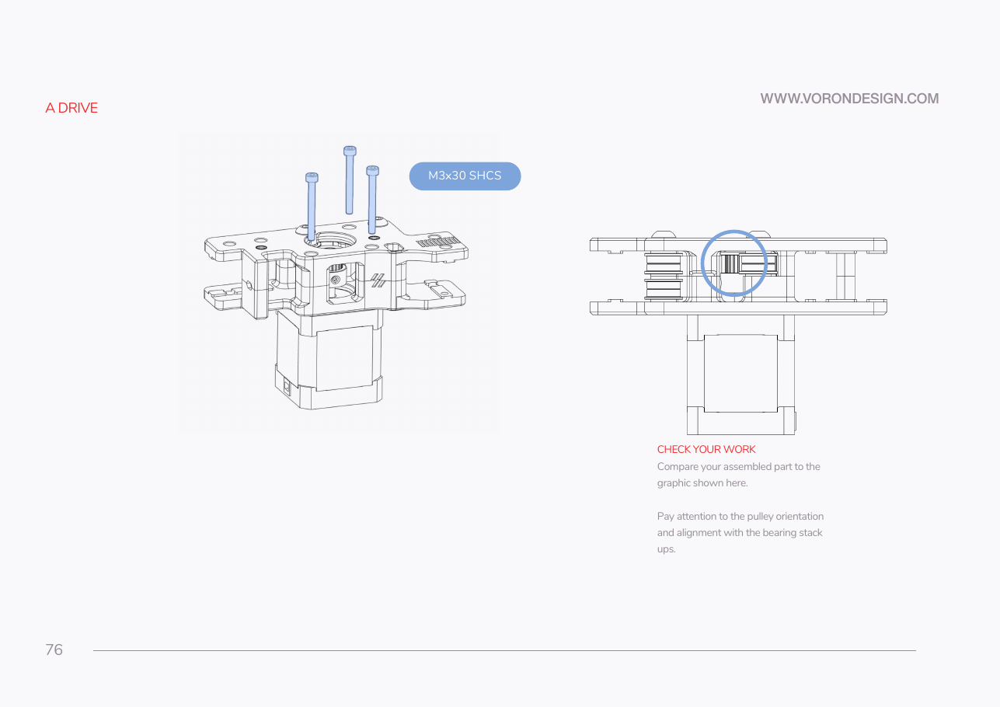

**What you're looking at:** Manual p.76 — three M3×30 running down through both printed frames into the motor's face. Three, not four: the fourth motor hole has no clearance hole above it.

**Parts:** 3× M3×30 SHCS.

**Do:** Line the motor's mounting holes up with the three clearance holes around the bore and run all three M3×30 SHCS down through both frames into the motor. Start all three by hand before tightening any, then tighten evenly, so the motor face is pulled down square and the pulley stays in the plane you just set.

**Check:** Three bolts, not four — the fourth motor hole is not used (p.76). All three pulled down evenly with the motor face flat against the frame.

Source: [Voron manual p.76](https://github.com/VoronDesign/Voron-2/blob/de7e89d/Manual/Assembly_Manual_2.4r2.pdf#page=76) · [Video: Part 3 @1:13:34](https://www.youtube.com/watch?v=ii14-2COjuA&list=PL0fUJbigELQPqpeGOgHYisG4KaSXVtnNY&t=4414s)

---

### Step 04.28 — A drive: check your work and the belt path

**What you're looking at:** Manual p.76's elevation, and a length of belt used as a straightedge. The pulley and the two bearing channels have to lie in one flat plane; laid across them, a belt offcut shows any step in height immediately, and a step here is belt whine and edge wear that no amount of tension will fix.

**Parts:** a 6 mm belt offcut or a thin steel rule.

**Do:** Compare against p.76's elevation — the manual asks you to *"pay attention to the pulley orientation and alignment with the bearing stack ups"*. Lay the belt offcut flat across the pulley teeth and then across each bearing pair in turn, following the path the belt will take. Any step in height here becomes belt whine and edge wear that no amount of Ch 07 belt tension will cure. When it checks out, label the assembly **A — REAR RIGHT** and set it aside.

**Check:** **The belt path is straight** — the offcut lies flat on the pulley and in each bearing groove without tilting, riding up a flange, or needing to twist.

Source: [Voron manual p.76](https://github.com/VoronDesign/Voron-2/blob/de7e89d/Manual/Assembly_Manual_2.4r2.pdf#page=76) · [Video: Part 5 @1:12:36](https://www.youtube.com/watch?v=hTKCBrk36R0&list=PL0fUJbigELQPqpeGOgHYisG4KaSXVtnNY&t=4356s)

Pause: ~50 min since the last pause — the A drive is finished: 2-bearing near post, 4-bearing far post, frames closed snug, pulley at 16.5 mm hub-down and threadlocked, motor in with three M3×30 and the cable exit inboard, belt path checked straight. Labelled **A — REAR RIGHT**. This is the natural stop; do not leave a bearing stack loaded with the lower frame off.

---

### Step 04.29 — B drive: upper frame face down, two M5×30 BHCS

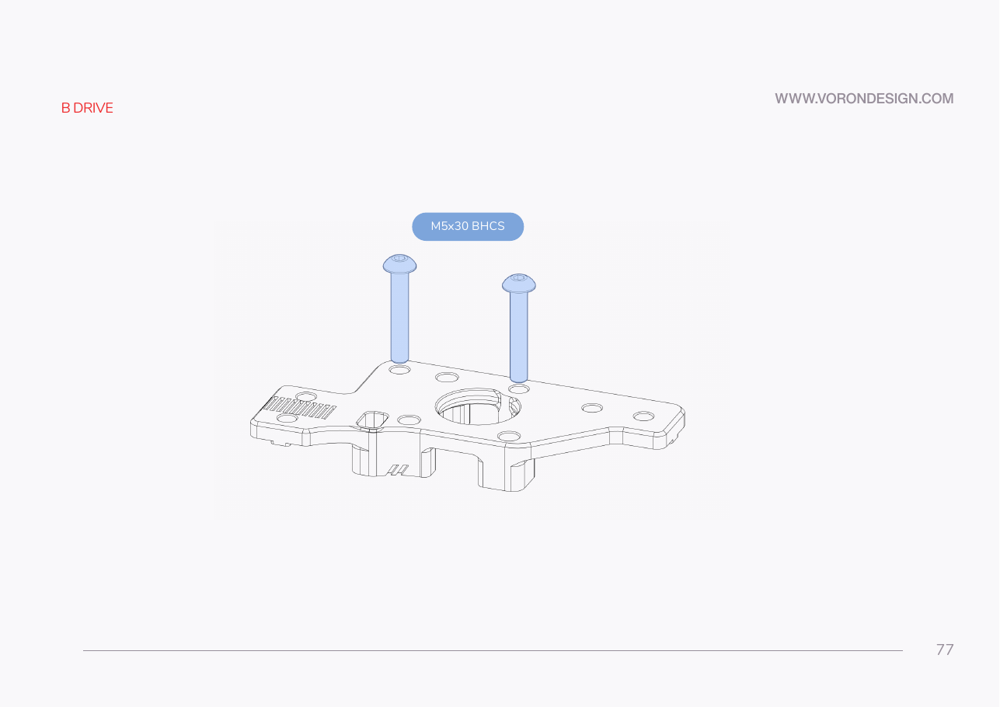
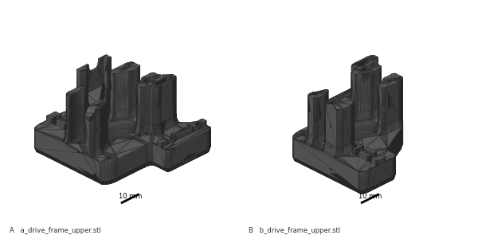

**What you're looking at:** Manual p.77 and the same pair render — `b_drive_frame_upper`, laid out the same upside-down way. This is the B part: compare it against `a_drive_frame_upper` in the render and it has **no cutout lobe on the base plate and no insert bosses**. Seeing either means you have picked up the A frame.

**Parts:** `b_drive_frame_upper`; 2× M5×30 BHCS.

**Do:** As at Step 04.20: flat face up, drop an M5×30 BHCS into each of the two 5.4 mm holes from the flat face, then turn the frame over onto the bench so the heads are underneath and the two threads stand up.

**Check:** This is a B part — **no cutout** and **no heat-set inserts**. If you can see either, you have picked up the A frame.

Source: [Voron manual p.77](https://github.com/VoronDesign/Voron-2/blob/de7e89d/Manual/Assembly_Manual_2.4r2.pdf#page=77)

---

### Step 04.30 — B drive: four-bearing stack on the far post

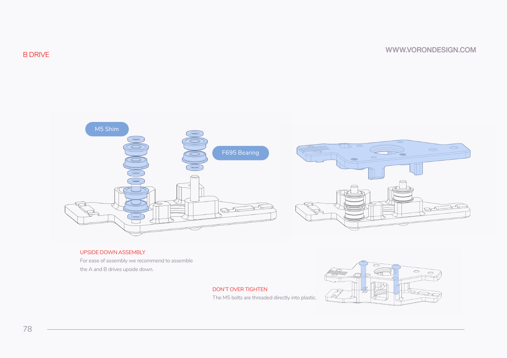

**What you're looking at:** Manual p.78 — the four-bearing post, which on the B frame is drawn on the **left** because the B frame is the mirror of the A frame. It is still the post farther from the motor bore; the position on the page changed, the rule did not.

**Parts:** 4× M5 precision spacer; 4× F695 bearing.

**Do:** Work on the **far** bolt — ~34 mm from the bore centre. Because the B frame is the mirror of the A frame, p.78 draws it on the **left**, where p.74 drew it on the right; measure rather than trust the drawing. Load two pairs: spacer, F695 **flange down**, F695 **flange up**, spacer, spacer, F695 **flange down**, F695 **flange up**, spacer.

**Check:** Eight items, two spacers meeting in the middle, no flange face-to-face anywhere. Same 20 mm stack as the A drive.

⚠ Rev D+ / LDO: brass **M5 precision spacers**, not shims. [src](https://docs.ldomotors.com/en/voron/voron2/build-faq)

Source: [Voron manual p.78](https://github.com/VoronDesign/Voron-2/blob/de7e89d/Manual/Assembly_Manual_2.4r2.pdf#page=78) · [LDO Build Notes (Rev D)](https://docs.ldomotors.com/voron/voron2/build-faq)

---

### Step 04.31 — B drive: two-bearing stack on the near post

**What you're looking at:** Manual p.78 — the two-bearing post, nearer the motor bore, drawn on the right. With this the two drives hold six bearings and six spacers each.

**Parts:** 2× M5 precision spacer; 2× F695 bearing.

**Do:** On the **near** bolt — ~17 mm from the bore centre (drawn on the right on p.78): spacer, F695 **flange down**, F695 **flange up**, spacer.

**Check:** Four items, 10 mm. Both drives now hold six bearings and six spacers each — count them before closing.

⚠ Rev D+ / LDO: brass **M5 precision spacers**, not shims — the last two of the sixteen this chapter uses. [src](https://docs.ldomotors.com/en/voron/voron2/build-faq)

Source: [Voron manual p.78](https://github.com/VoronDesign/Voron-2/blob/de7e89d/Manual/Assembly_Manual_2.4r2.pdf#page=78) · [LDO Build Notes (Rev D)](https://docs.ldomotors.com/voron/voron2/build-faq)

---

### Step 04.32 — B drive: close it with `b_drive_frame_lower`

**What you're looking at:** Manual p.78 — `b_drive_frame_lower` closing the B drive. Same plastic threads, same rule: closed and snug, then stop.

**Parts:** `b_drive_frame_lower`.

**Do:** Lower `b_drive_frame_lower` onto both stacks and run the two M5×30 BHCS down alternately until the frames meet.

**Check:** **Do not over-tighten — these bolts thread straight into plastic** (p.78). Both bearing pairs spin free with the frames closed.

Source: [Voron manual p.78](https://github.com/VoronDesign/Voron-2/blob/de7e89d/Manual/Assembly_Manual_2.4r2.pdf#page=78)

---

### Step 04.33 — B drive: set the pulley on the B motor at 6.5 mm — flipped

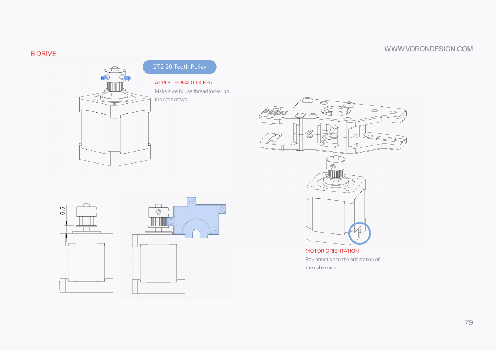

**What you're looking at:** Manual p.79 — the B motor's pulley, fitted **the other way up** from the A drive's. The two pulley heights (16.5 mm on A, 6.5 mm on B) are what separate the two belt planes; set them the same and the two belts try to occupy one plane and rub. The diagram's elevation panel shows the B motor hub-up, teeth low, at 6.5 mm measured motor face to the underside of the teeth, next to the A motor's elevation for comparison.

**Parts:** 1× stepper motor (0.9° A/B motor); 1× GT2 20 T **6 mm** pulley; `pulley_jig.stl`.

**Do:** Slide the pulley onto the shaft **the other way up from the A drive — teeth first, hub up**, so the shaft end pokes through the top of the hub. Hold the jig upright on the motor face as in Step 04.24, but on the other side of the pulley, letters still upright, so the tab marked **B** on its left edge points at the pulley and the feet hang past the edge of the face. Push the pulley down until the underside of its toothed section is level with the **underside of the B tab** — 6.6 mm above the plate's bottom edge on the STL, the manual's 6.5 mm from the motor face to the underside of the teeth (p.79). A flange sitting on top of the tab is at 13.4 mm — wrong.

**Check:** Caliper it: 6.5 mm from the motor face to the underside of the teeth, hub **up**. ~13 mm means the pulley is sitting on top of the tab. Stand the two motors side by side — the A pulley sits high with its teeth on top, the B pulley sits low with its hub on top. If both look the same, one is wrong.

Source: [Voron manual p.79](https://github.com/VoronDesign/Voron-2/blob/de7e89d/Manual/Assembly_Manual_2.4r2.pdf#page=79) · [Video: Part 3 @1:12:46](https://www.youtube.com/watch?v=ii14-2COjuA&list=PL0fUJbigELQPqpeGOgHYisG4KaSXVtnNY&t=4366s)

---

### Step 04.34 — B drive: threadlock and lock the pulley set screws

**What you're looking at:** Manual p.79 — the B pulley's set screws, threadlocked and re-measured, exactly as on the A drive.

**Parts:** 2× set screw (in the pulley); Loctite 243.

**Do:** Loctite 243 on both set screws, first one onto the shaft flat if there is one, then the second. Re-measure with the jig and then the caliper after tightening.

**Check:** No slip under hand pressure; still 6.5 mm.

Source: [Voron manual p.79](https://github.com/VoronDesign/Voron-2/blob/de7e89d/Manual/Assembly_Manual_2.4r2.pdf#page=79)

---

### Step 04.35 — B drive: offer the motor up with the cable exit inboard

**What you're looking at:** Manual p.79 — the B motor going in with its cable exit inboard, mirrored from the A drive. Held in their finished positions the two drives' cables face each other across the back of the machine.

**Parts:** the B motor with its pulley.

**Do:** Turn the assembly the right way up and fit the motor with the **cable exit facing inboard** (p.79, circled) — mirrored from the A drive, so with B at the rear left its cable also runs toward the machine's centreline.

**Check:** Hold both drives in their build positions: the two cable exits face each other. That is the manual's own test (p.75).

Source: [Voron manual p.79](https://github.com/VoronDesign/Voron-2/blob/de7e89d/Manual/Assembly_Manual_2.4r2.pdf#page=79) · [Video: Part 3 @1:16:29](https://www.youtube.com/watch?v=ii14-2COjuA&list=PL0fUJbigELQPqpeGOgHYisG4KaSXVtnNY&t=4589s)

---

### Step 04.36 — B drive: three M3×30 SHCS through the frames into the motor

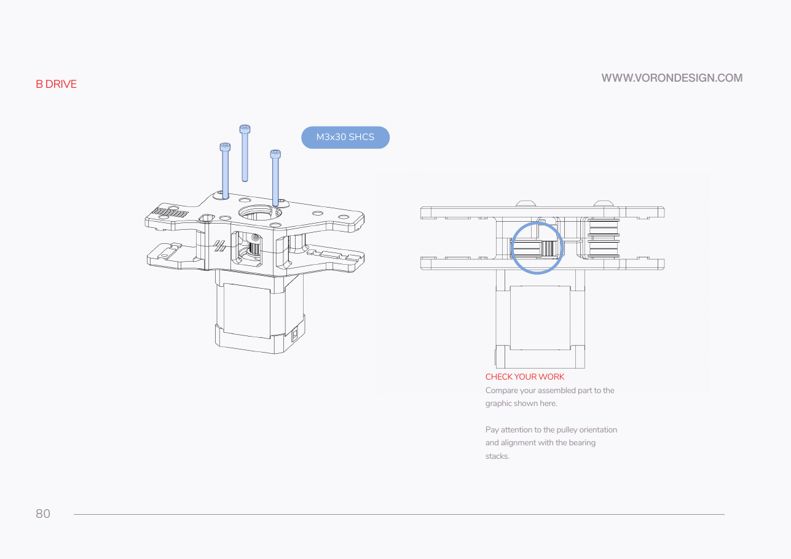

**What you're looking at:** Manual p.80 — the same three M3×30 through both frames into the motor face.

**Parts:** 3× M3×30 SHCS.

**Do:** Start all three by hand through both frames into the motor, then tighten evenly.

**Check:** Three bolts, motor face flat against the frame, nothing cross-threaded.

Source: [Voron manual p.80](https://github.com/VoronDesign/Voron-2/blob/de7e89d/Manual/Assembly_Manual_2.4r2.pdf#page=80)

---

### Step 04.37 — B drive: check your work and the belt path

**What you're looking at:** Manual p.80's elevation and the belt offcut again. Same straightness test as the A drive: flat on the pulley, flat in both bearing channels, no tilt and no contact with a flange.

**Parts:** the belt offcut or steel rule.

**Do:** Compare against p.80's elevation and run the offcut across the pulley and each bearing pair as you did for the A drive.

**Check:** **The belt path must be straight** — offcut flat on the pulley and in both grooves, no tilt, no flange contact. Label the assembly **B — REAR LEFT**.

Source: [Voron manual p.80](https://github.com/VoronDesign/Voron-2/blob/de7e89d/Manual/Assembly_Manual_2.4r2.pdf#page=80)

Pause: ~45 min since the last pause — the B drive is finished and labelled **B — REAR LEFT**, pulley at 6.5 mm hub-up, both cable exits facing each other when the drives are held in their build positions.

---

### Step 04.38 — Bag, label and hand off to Ch 05

**What you're looking at:** Manual p.81 is a divider page with no assembly content. On the bench: four finished sub-assemblies, each of which only fits one corner of the machine, so each goes into a bag with its destination written on it.

**Parts:** four finished assemblies; four bags; marker.

**Do:** Bag each assembly separately with its destination written on the bag: **A drive — rear right**, **B drive — rear left**, **A idler — front right**, **B idler — front left**. Manual p.81 is a filler page and carries no assembly step.

**Check:** Four bags, four labels, no loose bearings or spacers left on the bench. Leftover F695s or spacers mean a stack is short — find it now, not after the gantry is bolted up.

Source: [Voron manual p.81](https://github.com/VoronDesign/Voron-2/blob/de7e89d/Manual/Assembly_Manual_2.4r2.pdf#page=81)

Pause: ~15 min since the last pause — all four assemblies bagged and labelled with their destinations, and nothing left over on the bench. Work through Checkpoint 04 before Ch 05.

---

## Checkpoint 04

- [ ] Two drive units and two front idlers built, each labelled with its position on the machine.
- [ ] Every F695 pair is flange-out — plain faces touching — with one brass M5 precision spacer above and below each pair.
- [ ] Drive far posts: 4 bearings + 4 spacers, with two spacers meeting mid-stack. Drive near posts and both idlers: 2 bearings + 2 spacers.
- [ ] All six bearing groups spin free with the frames closed and bolted.
- [ ] Both idlers: M5×40 axle clamped firm into the arm's nut, arm still sliding in the frame's slots; M3×40 tensioner snug into the arm's insert.
- [ ] `a_drive_frame_upper` has its two heat-set inserts; `b_drive_frame_upper` has none.
- [ ] Both motor pulleys are the **6 mm-wide** 20T (`5mm ID 6mm W`), not one of the four 9 mm Z-drive pulleys.
- [ ] A pulley: hub down, 16.5 mm. B pulley: hub up, 6.5 mm. The two are visibly different.
- [ ] Both pulleys are threadlocked and will not slip under hand pressure.
- [ ] The belt offcut lies flat across pulley and bearing grooves on both drives — no tilt, no flange contact.
- [ ] Both motor cable exits point inboard; held in their build positions, they face each other.
- [ ] Every M5×30 BHCS is snug only — none was torqued down into the plastic thread.
- [ ] Zero bearings, spacers or fasteners left over.

## Common mistakes

- **A bearing pair fitted flange-to-flange (or flange-in).** The belt then rides on a flange edge instead of the bearing races and shreds. Fix: open the stack, turn the two bearings so their plain faces meet. Check by sighting the stack edge-on — a flange in the middle is always wrong.
- **Four bearings on the near post, two on the far post.** The frames will not close square, or they close and pinch a bearing. Fix: the four-bearing stack always goes on the post farther from the motor bore — right on p.74, left on p.78.
- **Fitting a 9 mm 20T pulley on an A/B motor.** It looks like the right pulley but it is a Z-drive part, and it will not sit in the 6 mm belt plane that a flange-out F695 pair forms. The kit ships exactly two 6 mm 20T pulleys and four 9 mm ones — count them before you start, and keep the 9 mm four with the Ch 02 Z bin.
- **Both pulleys set to the same height, or the B pulley fitted hub-down.** The A and B belts then try to share one plane and rub. This is not fixable at belting time. Fix: A = 16.5 mm hub down, B = 6.5 mm hub up, both re-checked after the set screws are tight — the jig's tab underside level with the underside of the teeth, then the caliper.
- **Leaving the idler M5×40 loose because "it is the tensioner".** It is the axle; the M3×40 through the frame's front wall is the tensioner (Ch 07 Step 07.5). Left loose, the stack rattles and the bearings tilt on the shank, found in Ch 07 as bad belt tracking. Fix: run it down firm into the arm's M5 nut.
- **Motor cable exits pointing outboard.** The cables will not reach the drag chain and the drive has to come apart with the gantry in the machine. Fix: check before the three M3×30 go in — the exits face each other.
- **M5×30 BHCS torqued down.** They thread into plastic (p.74, p.78) and strip permanently; a stripped post means reprinting a drive frame. Fix: stop at closed-and-snug.
- **A parts and B parts swapped.** The A frames have a cutout and `a_drive_frame_upper` has two heat-set inserts; the B frames have neither. On the idlers, the tall lower frame is the A (right) idler.

## Next

**Ch 05 — Gantry: X and Y axes, XY joints, X carriage, titanium backers.** The four assemblies you just built bolt onto the Y extrusions there (manual p.82–107); print batch **B04** must be done before you start it.
