# Chapter 05 — Gantry: X and Y axes, XY joints, X carriage, titanium backers

Builds the complete gantry on the bench — XY bridge, both Y axes with their MGN9 rails, both XY joints, the X extrusion with its MGN12 rail, and the titanium extrusion backers — and ends with the X axis riding on the Y carriages. Unlocks Ch 06 (gantry install, Z belts, squaring).

**Time:** 5.0–7.0 h hands-on, first build, two people ([survey §5.1 P05 / §7.2](../voron-build-instructions-survey.md)).

**Sessions:** 12 × ~30 min (first-build estimate; each `Pause:` line carries its own segment minutes).

**Prerequisites:**

- **Ch 04** — A drive, B drive and both front idler assemblies built and checked (manual p.62–81). This chapter consumes them whole.
- **Ch 00** — all seven rails cleaned and packed with grease *before* they go on an extrusion ([LDO rail grease guide](https://docs.ldomotors.com/guides/rail_grease_guide)); jigs `Tools/MGN9_rail_guide_x2.stl` and `Tools/MGN12_rail_guide_x2.stl` printed (batch **B00**).
- **Print batches: B04** (XY joints + X carriage, plate B04-P1, 7.3 h, black) and **B02-P3** (the orange accent plate — cable bridge and endstop pod) ([print plan §B04](../voron-print-plan.md)). B04 is itself gated on B00 + B02 + B03.
- **Titanium backer set** (Fabreeko/LDO, 350 size) unpacked and counted.
- Ch 01's bagged **C ×2, D ×1, E ×1** extrusions.

**Tools**

- Hex drivers 2 / 2.5 / 3 / 4 mm; a **ball-end 2.5 mm** helps at the XY joints
- **T10 Torx driver** — strongly preferred for the backer M3 FHCS; hex cams out of a countersink easily ([backers README](https://github.com/tanaes/whopping_Voron_mods/tree/main/extrusion_backers))
- Printed rail-centring jigs `MGN9_rail_guide_x2`, `MGN12_rail_guide_x2`
- Steel rule 300 mm and a caliper — to equalise the rail overhang at both ends
- Masking tape (carriage retention) and the kit's rubber rail stoppers
- 2.5 mm flat screwdriver (cable-chain latches, if you dry-fit the chain end)
- Camera for the build log

**Printed parts**

| STL | Qty | Colour |
|---|---|---|
| `xy_joint_left_lower_MGN12.stl` | 1 | Black |
| `xy_joint_left_upper_MGN12.stl` | 1 | Black |
| `xy_joint_right_lower_MGN12.stl` | 1 | Black |
| `xy_joint_right_upper_MGN12.stl` | 1 | Black |
| `[a]_xy_joint_cable_bridge_2hole.stl` | 1 | Orange |
| `XY_cable_chain_bridge-Igus-3mm_backer.stl` | 1 (alternate — fit whichever clears the backer) | Orange |
| `x_frame_V2TR_MGN12_left.stl` | 1 | Black — *staged here, fitted in Ch 07* |
| `x_frame_V2TR_MGN12_right.stl` | 1 | Black — *staged here, fitted in Ch 07* |
| `probe_retainer_bracket.stl` | 1 | Black — *staged here, fitted in Ch 07/08* |
| `[a]_endstop_pod_D2F_switch.stl` | 1 | Orange — *staged here, fitted at endstop wiring* |

Do **not** print `[a]_endstop_pod_hall_effect.stl`, `[a]_xy_joint_cable_bridge_3hole.stl`, or any `xy_joint_*_MGN9` — wrong variants for this kit ([print plan §7](../voron-print-plan.md)).

**Hardware** (chapter totals)

| Fastener / part | Qty | Where |
|---|---|---|
| E extrusion (XY bridge) | 1 | p.85 |
| C extrusion (Y axis) | 2 | p.88 |
| D extrusion (X axis) | 1 | p.101 |
| MGN9H rail + carriage | 2 | Y axes, p.88 |
| MGN12H rail + carriage | 1 | X axis, p.101 |
| M5 roll-in T-nut | 26 | 8 in E (p.85), 12 in the C pair (p.89, p.90), 6 in D (p.102) |
| M3 roll-in T-nut | ≈32 | ≈20 Y rails (p.88 — ~10 per 400 mm MGN9), 4 in the C pair (p.90), ≈8 X rail (p.101) |
| M3 roll-in T-nut, backers | ~30 | not supplied with the backers — order separately |
| M5×10 BHCS | 10 | 8 bridge-to-drive (p.86–87), 2 left XY joint (p.104) |
| M5×16 BHCS | 10 | 4 front idlers (p.91, p.93), 4 rear drive joints (p.95), 2 right XY joint + cable bridge (p.104) |
| M5×30 BHCS | 2 | XY joints from below (p.104) |
| M5×40 SHCS | 8 | 4 per XY joint (p.97–100) |
| M3×8 SHCS | ≈28 | ≈20 Y rails (~10 each), ≈8 X rail — count the holes on your own rails |
| M3×16 SHCS | 8 (6 fitted + 2 reserved) | XY joints to the Y carriages (p.106); 2 held back for the endstop pod |
| M5 nut | 6 | 3 per XY joint (p.96) |
| **M5 precision spacer, brass** | 2 | XY joint bearing stacks (p.97, p.99) — replaces the manual's "M5 shim" |
| **M5 washer, black** | 2 | under the M5×30 heads (p.104) — replaces the manual's "M5 shim" |
| F695 bearing | 4 | 2 per XY joint |
| GT2 20-tooth idler | 2 | 1 per XY joint |
| Titanium backer, Y | 2 | one per C extrusion |
| Titanium backer, X | 1 | D extrusion, rear face |
| M3×8 FHCS (backers, Y) | ~20 | count the holes in your backers *(verify on bench)* |
| M3×6 FHCS (backers, X) | ~8 | count the holes in your backer *(verify on bench)* |

The West3D/Fabreeko titanium set ships **22× M3×8 FHCS and 10× M3×6 FHCS** with a few spares, and **no T-nuts** ([West3D](https://west3d.com/products/titanium-backers-for-voron-2-4-trident-3-pack)).

**Read first**

- **The titanium backers go on during this chapter, not after it.** Fitting them once the gantry is assembled or installed means a teardown (survey §5.2 W2). They mount on the face **opposite the rail** — top of the Y extrusions, rear of the X extrusion. *"If you have a single MGN12 but decide to put a backer on top, you will be actively contributing to the problem of bimetallic expansion!"* [src](https://github.com/tanaes/whopping_Voron_mods/tree/main/extrusion_backers)
- **Do not tension the A/B belts and do not square the gantry here.** Both are Ch 06/07, and the official squaring procedure begins by *releasing* A/B tension — tension it now and you undo it (survey §4.4 #2, §5.2 W1). Several joints in this chapter are deliberately left "slightly loose".
- **Every T-nut this chapter needs must go in before the drive and idler frames cap the extrusion ends.** LDO: *"Due to the tight tolerances of the extrusions and roll-in t-nuts it is advisable to either test fit before assembly … or to pre-load the t-nuts into the extrusions."* [src](https://docs.ldomotors.com/en/voron/voron2/build-faq)
- **Rails ship dry.** If Ch 00's clean-and-pack pass has not been done, stop and do it — the flip-and-pack method needs access to the back of the rail (survey §4.4 #5).
- **Carriages slide off rails and are ruined by a drop** (manual p.88, p.101). Tape or stopper every carriage the moment its rail is on an extrusion.
- The gantry is assembled **upside down** through p.105 — that is a continuation of Ch 04's "UPSIDE DOWN ASSEMBLY" (manual p.74, p.78) — and is flipped at p.106.

**Sources for this chapter:**

- [Voron 2.4r2 assembly manual, p.82–107](https://github.com/VoronDesign/Voron-2/blob/de7e89d/Manual/Assembly_Manual_2.4r2.pdf#page=82) — the page sequence this chapter transcribes, pinned at commit `de7e89d`
- [LDO Build Notes § Voron 2.4 build FAQ](https://docs.ldomotors.com/en/voron/voron2/build-faq) — Rev D kit deviations, T-nut pre-loading, rail stoppers
- [LDO printed-parts guide (Rev D)](https://docs.ldomotors.com/en/voron/voron2/printed_part_guide_rev_d) — 2-hole cable bridge, D2F endstop pod
- [LDO rail-grease guide](https://docs.ldomotors.com/guides/rail_grease_guide) — rail clean-and-pack, done in Ch 00
- [LDO cable-chain guide](https://docs.ldomotors.com/guides/cable_chain_guide) — chain-end clearance over the backers
- [Ti extrusion-backers README (tanaes)](https://github.com/tanaes/whopping_Voron_mods/tree/main/extrusion_backers) — which face the backers go on, and why; source of the two backer images (GPL-3.0)
- [Fabreeko](https://www.fabreeko.com/products/v2-4-trident-titanium-extrusion-backers) and [West3D](https://west3d.com/products/titanium-backers-for-voron-2-4-trident-3-pack) backer sets — supplied screw counts
- [Voron docs § V2 Gantry Squaring](https://docs.vorondesign.com/build/mechanical/v2_gantry_squaring.html) — why nothing is squared or tensioned in this chapter

---

### Step 05.1 — Clear the bench and confirm the sub-assemblies

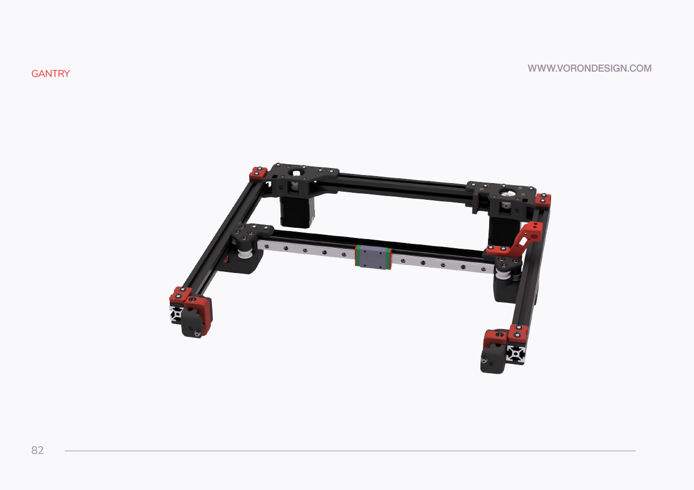

**Parts:** A drive, B drive, front idler left, front idler right (all from Ch 04); C extrusion ×2, D extrusion ×1, E extrusion ×1.

**Do:** Clear a bench at least 700 × 700 mm — the finished gantry is a 350's full footprint and you will rotate it repeatedly. Lay the four Ch 04 sub-assemblies out, drives at the top, idlers at the bottom, so left and right never get confused. Keep the A drive on the **right** and the B drive on the **left** as the overview draws them.

**Check:** Four Ch 04 assemblies present, pulleys and bearing stacks matching the p.80 "CHECK YOUR WORK" graphic, all four spinning freely.

Source: [Voron manual p.82](https://github.com/VoronDesign/Voron-2/blob/de7e89d/Manual/Assembly_Manual_2.4r2.pdf#page=82)

---

### Step 05.2 — Name the six gantry parts

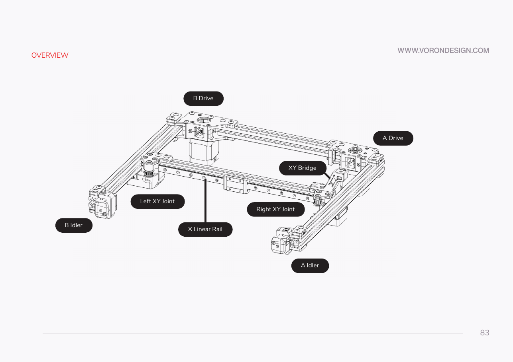

**Parts:** none.

**Do:** Read the overview and fix the vocabulary — B Drive (rear left), A Drive (rear right), XY Bridge (the E extrusion joining them), Left XY Joint, Right XY Joint, X Linear Rail, B Idler (front left), A Idler (front right). Write "A" and "B" on masking tape on the two drive units now; from here to Ch 10 the wiring, the belt paths and the Klipper config all use those letters.

**Check:** You can point at the A drive, the B idler and the right XY joint without hesitating.

Source: [Voron manual p.83](https://github.com/VoronDesign/Voron-2/blob/de7e89d/Manual/Assembly_Manual_2.4r2.pdf#page=83)

---

### Step 05.3 — Pick the cable-chain bridge

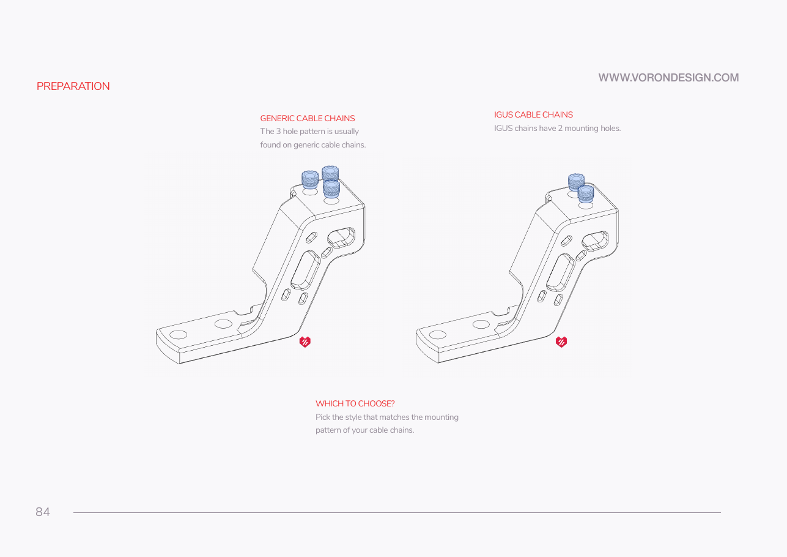

**Parts:** `[a]_xy_joint_cable_bridge_2hole.stl` ×1 (orange).

**Do:** The manual offers a 3-hole bridge (generic chains) and a 2-hole bridge (IGUS-pattern chains). Take the **2-hole** part and put the 3-hole one away.

⚠ **Rev D+ / LDO:** *"Our cable chain ends use the 2 hole configuration. When printing parts that interface with cable chains, always use the 2hole version instead of 3hole (e.g. xy_joint_cable_bridge_2hole instead of xy_joint_cable_bridge_3hole)."* [src](https://docs.ldomotors.com/en/voron/voron2/printed_part_guide_rev_d)

Tip: keep `XY_cable_chain_bridge-Igus-3mm_backer.stl` (also on plate B02-P3) beside it. It is the same 2-hole pattern raised for a ~3 mm backer. The titanium backers carry **pilot** holes for the chain end link, not tapped ones — drill 2.5 mm and tap M3 if you want to use them. Fit whichever bridge clears once the backers are on. [src](https://github.com/tanaes/whopping_Voron_mods/tree/main/extrusion_backers)

**Check:** One 2-hole bridge on the bench, one alternate beside it, the 3-hole variant binned.

Source: [Voron manual p.84](https://github.com/VoronDesign/Voron-2/blob/de7e89d/Manual/Assembly_Manual_2.4r2.pdf#page=84) · [LDO printed-parts guide (Rev D)](https://docs.ldomotors.com/en/voron/voron2/printed_part_guide_rev_d) · [Ti extrusion-backers README (tanaes)](https://github.com/tanaes/whopping_Voron_mods/tree/main/extrusion_backers)

---

### Step 05.4 — Test-fit T-nuts and stage the fasteners

(no image — see text)

**Parts:** M5 roll-in T-nut ×26, M3 roll-in T-nut ×27 (+ ~30 for the backers).

**Do:** Take one M5 and one M3 T-nut and roll them through each face of each of the four extrusions. Note which faces run freely and which bind, and mark the tight faces with tape. Count the fasteners out into labelled trays per the hardware table above — this chapter loads T-nuts on six different faces and there is no way to add one later.

**Check:** Every T-nut you will use rolls in without force. A forced roll-in nut galls the channel and the next one will not go in at all.

Source: [LDO Build Notes § Voron 2.4 build FAQ](https://docs.ldomotors.com/en/voron/voron2/build-faq) · [Voron manual p.85](https://github.com/VoronDesign/Voron-2/blob/de7e89d/Manual/Assembly_Manual_2.4r2.pdf#page=85)

Pause: ~25 min since the last pause — bench cleared, sub-assemblies laid out left/right, T-nuts test-rolled and counted into trays. Nothing is assembled; leave the trays covered so nothing gets swept off.

---

### Step 05.5 — Load the E extrusion (XY bridge)

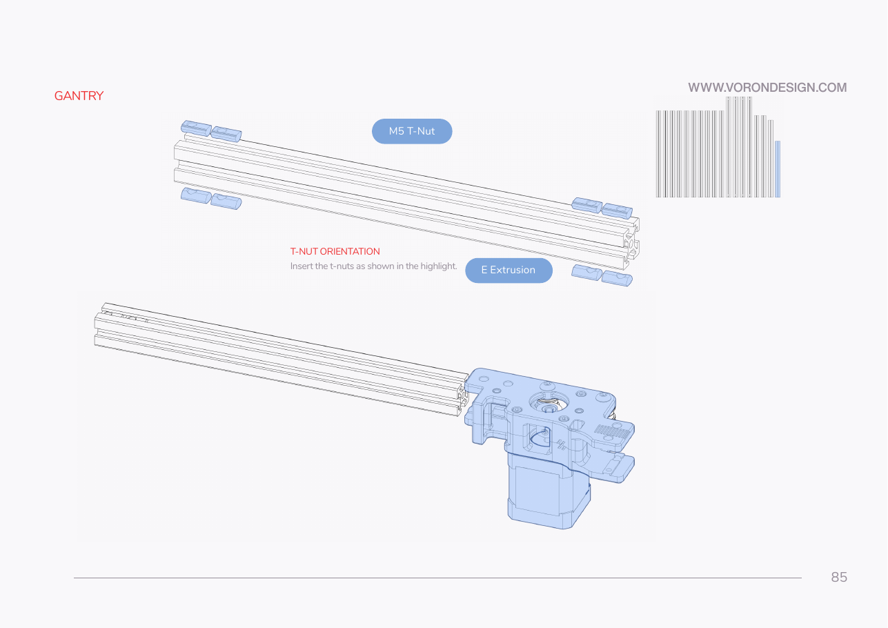

**Parts:** E extrusion ×1, M5 T-nut ×8.

**Do:** Slide **eight** M5 T-nuts into the E extrusion — four at each end, two per slot, in the two slots the highlight shows. Push them 10–15 mm in from the ends so they are clear of the drive frame's tongue but still under its bolt holes.

**Check:** 4 nuts at each end, threaded holes facing outward, none of them jammed.

Source: [Voron manual p.85](https://github.com/VoronDesign/Voron-2/blob/de7e89d/Manual/Assembly_Manual_2.4r2.pdf#page=85)

---

### Step 05.6 — Slide the A drive onto the E extrusion

**Parts:** A drive assembly ×1, E extrusion ×1.

**Do:** Push the A drive unit onto one end of the E extrusion, motor pointing **down** (the assembly stays upside down until p.106). Seat it until the printed part is flush with the extrusion end.

**Check:** Plastic flush to the aluminium end face, and the four M5 T-nuts visible through the drive frame's bolt holes.

Source: [Voron manual p.85](https://github.com/VoronDesign/Voron-2/blob/de7e89d/Manual/Assembly_Manual_2.4r2.pdf#page=85)

---

### Step 05.7 — Bolt the A drive to the bridge

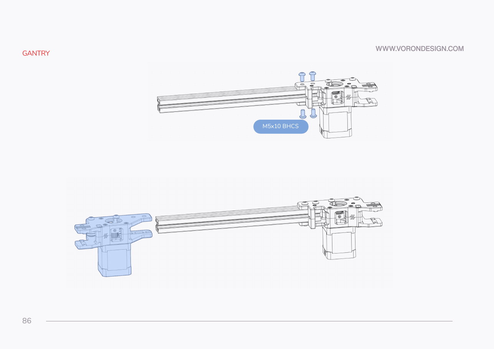

**Parts:** M5×10 BHCS ×4.

**Do:** Drive four M5×10 BHCS — two into the upper slot, two into the lower — and take them to snug, not torqued. If a bolt spins without pulling, the T-nut has not rolled; back it out and reseat the nut rather than forcing it.

**Check:** All four bolts bite. The drive frame does not rock on the extrusion.

Source: [Voron manual p.86](https://github.com/VoronDesign/Voron-2/blob/de7e89d/Manual/Assembly_Manual_2.4r2.pdf#page=86)

---

### Step 05.8 — Slide the B drive onto the other end

**Parts:** B drive assembly ×1.

**Do:** Push the B drive onto the free end of the E extrusion, motor down, flush to the end face. The two drives are mirror images — the motor cable exits must point **towards each other** (manual p.75, MOTOR ORIENTATION). If they point apart, you have the drives swapped end for end.

**Check:** Both motor cable exits face inboard, both printed parts flush.

Source: [Voron manual p.86](https://github.com/VoronDesign/Voron-2/blob/de7e89d/Manual/Assembly_Manual_2.4r2.pdf#page=86)

---

### Step 05.9 — Bolt the B drive and check the bridge

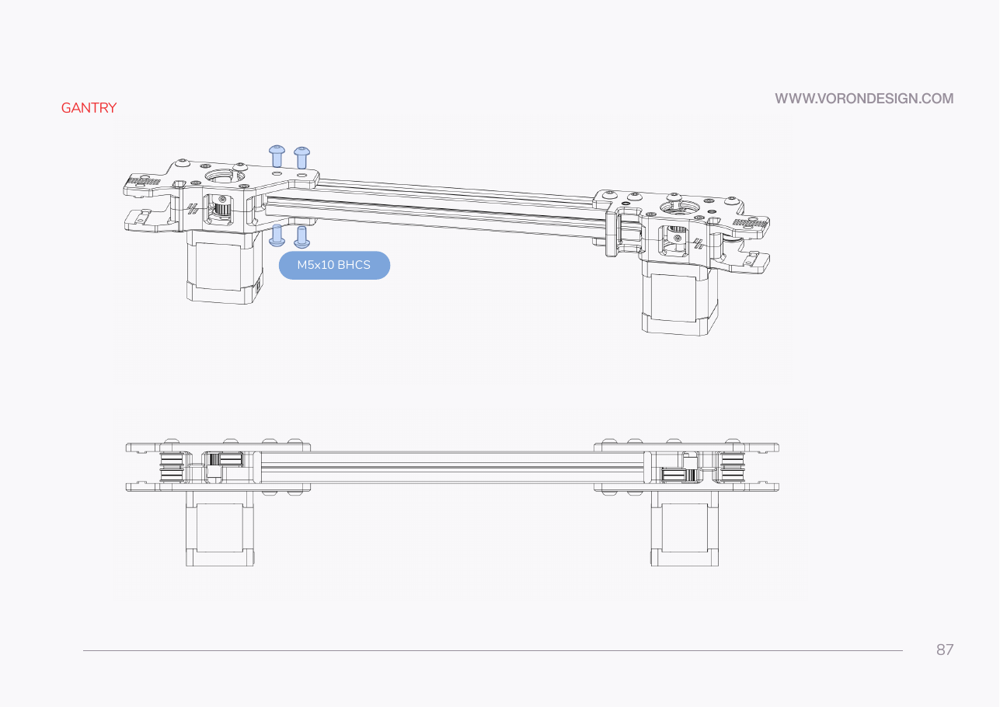

**Parts:** M5×10 BHCS ×4.

**Do:** Fit the last four M5×10 BHCS, snug. Then sight down the plan view: the two drive frames must be parallel and the two pulley stacks must line up across the bridge, exactly as the lower graphic shows.

**Check:** Drives parallel, no twist along the bridge, all eight M5×10 in and snug. Nothing here is torqued yet.

Source: [Voron manual p.87](https://github.com/VoronDesign/Voron-2/blob/de7e89d/Manual/Assembly_Manual_2.4r2.pdf#page=87)

Pause: ~30 min since the last pause — XY bridge bolted to both drive units, bridge bolts tight. Lay the assembly flat, still upside down. Do not start a Y rail: a rail must be centred and screwed down in one sitting.

---

### Step 05.10 — Load M3 T-nuts for the first Y rail

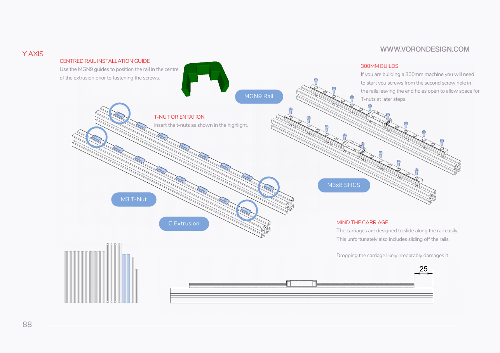

**Parts:** C extrusion ×1, M3 T-nut ×~10.

**Do:** This kit's Y rails are **400 mm** MGN9H (`LDO-SLR9H-400Z0`), not the 250-spec rails the manual's drawings are dimensioned from. A 400 mm MGN9 has 20 holes at 20 mm pitch and the pattern uses **every other hole**, so you need about **10** T-nuts per rail. Count the holes on your own rail and mark the ones you will use before loading any nuts. Slide them into the slot that will carry the rail, spread along its length, orientation as the highlight shows. Leave roughly 25 mm of free slot at each end — the rail does not reach the extrusion ends and later steps need that space.

**Check:** ~10 nuts, one per marked hole, evenly spread, all rolled flat in the channel, ~25 mm clear at both ends.

Source: [Voron manual p.88](https://github.com/VoronDesign/Voron-2/blob/de7e89d/Manual/Assembly_Manual_2.4r2.pdf#page=88) · [LDO Build Notes § Voron 2.4 build FAQ](https://docs.ldomotors.com/en/voron/voron2/build-faq)

---

### Step 05.11 — Centre and start the first MGN9 rail

**Parts:** MGN9H 400 mm rail ×1, `MGN9_rail_guide_x2` jig ×2, M3×8 SHCS ×~10 (one per marked hole).

**Do:** Tape the carriage to the middle of the rail before you pick it up. Sit the rail on the extrusion, slide a printed MGN9 guide onto each end and let them centre it side to side. Start the first screw in the **second hole from the end**, not the end hole, and work along.

⚠ **Rev D+ / LDO:** *"Do not use the holes on the ends of the rails, use the second ones from the ends."* [src](https://docs.ldomotors.com/en/voron/voron2/build-faq) — the manual only requires this on 300 mm builds; LDO requires it on every build, because the end holes sit over the T-nuts you load at Step 05.13/05.14.

**Check:** Rail centred on the extrusion by both jigs. The p.88 detail dimensions **25 mm** from the extrusion end to the rail end — measure both ends and make them equal.

Source: [Voron manual p.88](https://github.com/VoronDesign/Voron-2/blob/de7e89d/Manual/Assembly_Manual_2.4r2.pdf#page=88) · [LDO Build Notes § Voron 2.4 build FAQ](https://docs.ldomotors.com/en/voron/voron2/build-faq) · [LDO rail-grease guide](https://docs.ldomotors.com/guides/rail_grease_guide)

---

### Step 05.12 — Tighten the first Y rail

**Parts:** the ~10 M3×8 SHCS already started.

**Do:** Run every screw down finger-tight first, re-check the jigs at both ends and the middle, then tighten from the centre outwards in two passes. The manual gives no torque figure — take them to firm and even, not maximum. Re-fit a jig after the last pass to confirm nothing walked.

**Check:** Rail sits flat with no visible gap under it anywhere; the guide jig still slides on at both ends and the middle; the carriage runs the full length with no notch or tight spot.

Source: [Voron manual p.88](https://github.com/VoronDesign/Voron-2/blob/de7e89d/Manual/Assembly_Manual_2.4r2.pdf#page=88) · [LDO rail-grease guide](https://docs.ldomotors.com/guides/rail_grease_guide)

Pause: ~30 min since the last pause — first Y rail centred, all its M3×8 screwed down, carriage still on. Tape or stopper the carriage before you walk away.

---

### Step 05.13 — Second Y axis, then load the end M5 T-nuts

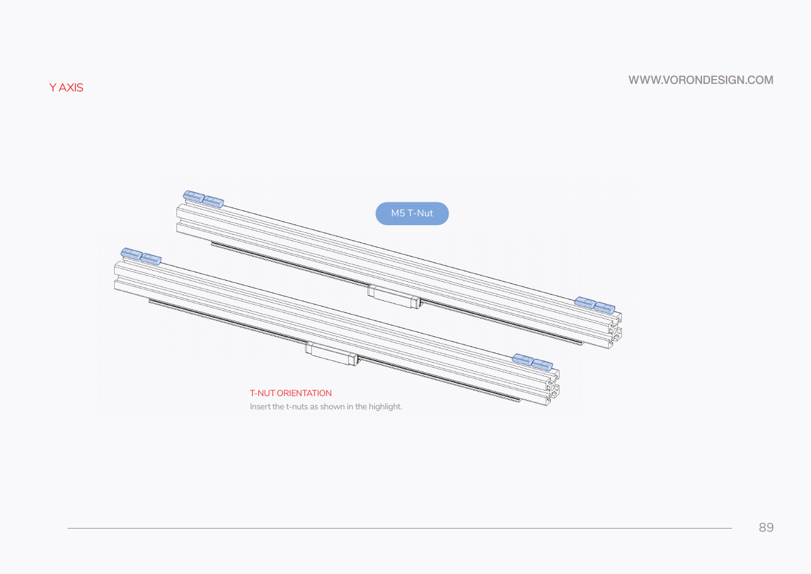

**Parts:** C extrusion ×1, MGN9H rail ×1, M3 T-nut ×8, M3×8 SHCS ×8; then M5 T-nut ×8.

**Do:** Repeat Steps 05.10–05.12 on the second C extrusion — it is a mirror, not a copy, so build it lying next to the first with both rails facing the same way. Then slide **two M5 T-nuts into each end of each C extrusion** (eight in total), in the slot and orientation the highlight shows. These are the nuts the front idler and the A/B drive frames bolt into.

**Check:** Two rails installed and equally centred. 2 M5 T-nuts sitting at each of the four extrusion ends.

Source: [Voron manual p.89](https://github.com/VoronDesign/Voron-2/blob/de7e89d/Manual/Assembly_Manual_2.4r2.pdf#page=89)

---

### Step 05.14 — Load the reserved M5 + M3 pair at each end

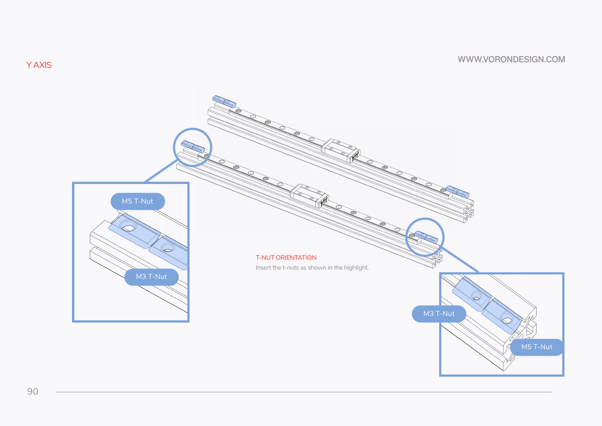

**Parts:** M5 T-nut ×4, M3 T-nut ×4.

**Do:** At each end of each C extrusion add **one M5 T-nut and one M3 T-nut** in the slot the blow-ups show — M5 outermost, M3 just inboard of it, both in the free slot beyond the rail end. Nothing in this chapter uses them; they are for the Z joints, chain retainers and endstop hardware in Ch 06 and Ch 10, and once the idler and drive frames are on you cannot get another nut into these slots.

**Check:** Four ends, each with one M5 and one M3 T-nut in addition to the pair from Step 05.13 — three M5 and one M3 per end. Count them before you go on.

Source: [Voron manual p.90](https://github.com/VoronDesign/Voron-2/blob/de7e89d/Manual/Assembly_Manual_2.4r2.pdf#page=90)

---

### Step 05.15 — Stop the carriages running off

(no image — see text)

**Parts:** rubber rail stoppers (LDO-supplied) or masking tape.

**Do:** Fit a rubber rail stopper — or a doubled tape flag — near each end of both Y rails so a carriage cannot run off. Keep the stoppers: LDO reuses them under the Z joints at manual p.114–116 to rest the gantry during install. [src](https://docs.ldomotors.com/en/voron/voron2/build-faq)

**Check:** Each Y carriage is captive. *"Dropping the carriage likely irreparably damages it"* (manual p.88).

Source: [Voron manual p.88](https://github.com/VoronDesign/Voron-2/blob/de7e89d/Manual/Assembly_Manual_2.4r2.pdf#page=88) · [LDO Build Notes § Voron 2.4 build FAQ](https://docs.ldomotors.com/en/voron/voron2/build-faq)

Pause: ~30 min since the last pause — both Y rails down and tightened, end M5/M3 T-nuts loaded, both carriages captive. Do not fit a backer now: start one only when you can finish it.

---

### Step 05.16 — Unpack and identify the titanium backers

(no image — see text)

**Parts:** titanium backer set ×3 (2 long "Y", 1 shorter "X"), M3×8 FHCS ×~20, M3×6 FHCS ×~8, M3 roll-in T-nut ×~30.

**Do:** Lay the three backers out. The two matching long pieces are the **Y** backers, the odd shorter one is the **X** backer. Check they are drilled and countersunk — the vendor sets ship *"pre drilled and ready for install"* ([Fabreeko](https://www.fabreeko.com/products/v2-4-trident-titanium-extrusion-backers)) — and count the holes so you know how many screws and T-nuts each one needs. A backer that is slightly bowed along its length is fine: *"During installation, they'll clamp down to the extrusion and straighten right out."*

**Check:** 2 Y + 1 X backer, hole counts written down, and you have at least that many M3 T-nuts. The set does not include T-nuts.

Source: [Ti extrusion-backers README (tanaes)](https://github.com/tanaes/whopping_Voron_mods/tree/main/extrusion_backers) · [Fabreeko backer set](https://www.fabreeko.com/products/v2-4-trident-titanium-extrusion-backers) · [West3D backer set](https://west3d.com/products/titanium-backers-for-voron-2-4-trident-3-pack)

---

### Step 05.17 — Fit the first Y backer

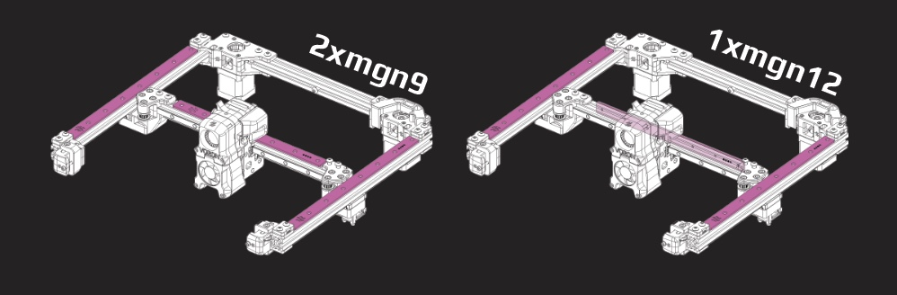

**Parts:** Y backer ×1, M3×8 FHCS ×~10, M3 T-nut ×~10, T10 Torx driver.

**Do:** Turn the first C extrusion so the MGN9 rail faces away from you and work on the **opposite face** — in the finished machine that is the top of the Y extrusion. Roll the T-nuts into that face's slot, lay the backer on, and start every screw before tightening any. Use **M3×8 FHCS for Y**, driven with Torx if you have it: *"the added contact surface area with the countersinks makes the M3 FHCS susceptible to camming out."* Tighten from the centre outwards so the backer flattens onto the extrusion rather than bowing between fixings.

⚠ **Never on the rail face:** the whole point is to put steel on the face *opposite* the rail and cancel the bending couple. Doubling up on the rail side makes the bow worse. [src](https://github.com/tanaes/whopping_Voron_mods/tree/main/extrusion_backers)

**Check:** Backer flat along its whole length, no rocking, every screw seated in its countersink and none of them cammed out. Both ends clear of where the idler and drive frames will land.

Source: [Ti extrusion-backers README (tanaes)](https://github.com/tanaes/whopping_Voron_mods/tree/main/extrusion_backers) (image [`x_axis.jpeg`](https://raw.githubusercontent.com/tanaes/whopping_Voron_mods/main/extrusion_backers/images/x_axis.jpeg))

---

### Step 05.18 — Fit the second Y backer

(no image — see text)

**Parts:** Y backer ×1, M3×8 FHCS ×~10, M3 T-nut ×~10.

**Do:** Repeat on the second C extrusion, again on the face opposite its rail. Lay the two finished Y assemblies side by side and confirm they are mirrored — rails facing the same way, backers facing the same way.

**Check:** Both backers on the rail-opposite face, both flat. Their cable-chain pilot holes end up on the same side of the machine.

Source: [Ti extrusion-backers README (tanaes)](https://github.com/tanaes/whopping_Voron_mods/tree/main/extrusion_backers)

Pause: ~35 min since the last pause — both titanium Y backers screwed down flat on the rail-opposite face. Check nothing is cammed out before you stop.

---

### Step 05.19 — Fit the front idler to the first Y axis

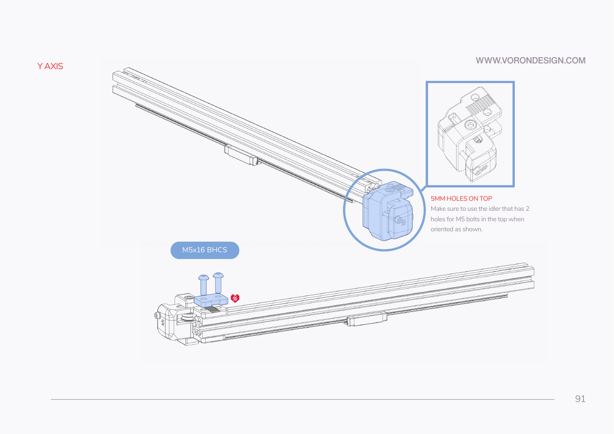

**Parts:** front idler assembly ×1, M5×16 BHCS ×2.

**Do:** Slide the idler onto the **front** end of the first C extrusion. Use the idler that has **two M5 holes in the top** when it is oriented as the page draws it — that is what tells the left idler from the right. Push it home, then drive two M5×16 BHCS down through its top flange into the M5 T-nuts from Step 05.13.

**Check:** Two M5 holes on top, both bolts biting into T-nuts, idler pulled up tight against the extrusion.

Source: [Voron manual p.91](https://github.com/VoronDesign/Voron-2/blob/de7e89d/Manual/Assembly_Manual_2.4r2.pdf#page=91)

---

### Step 05.20 — Check flush and notch orientation

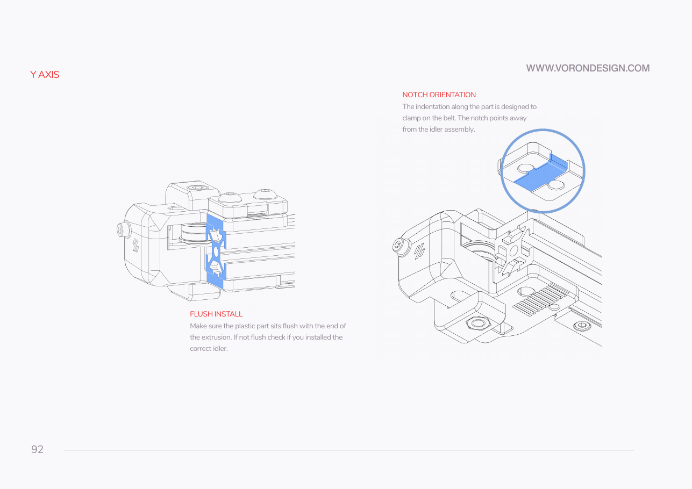

**Parts:** none.

**Do:** Look at the joint from the end: the printed part must sit flush with the aluminium end face. If it does not, you have the wrong-hand idler — take it off rather than pulling it down with the bolts. Then check the belt-clamp indentation: the notch points **away from the idler assembly**.

**Check:** Plastic flush to the extrusion end, notch pointing outboard.

Source: [Voron manual p.92](https://github.com/VoronDesign/Voron-2/blob/de7e89d/Manual/Assembly_Manual_2.4r2.pdf#page=92)

---

### Step 05.21 — Fit the second front idler

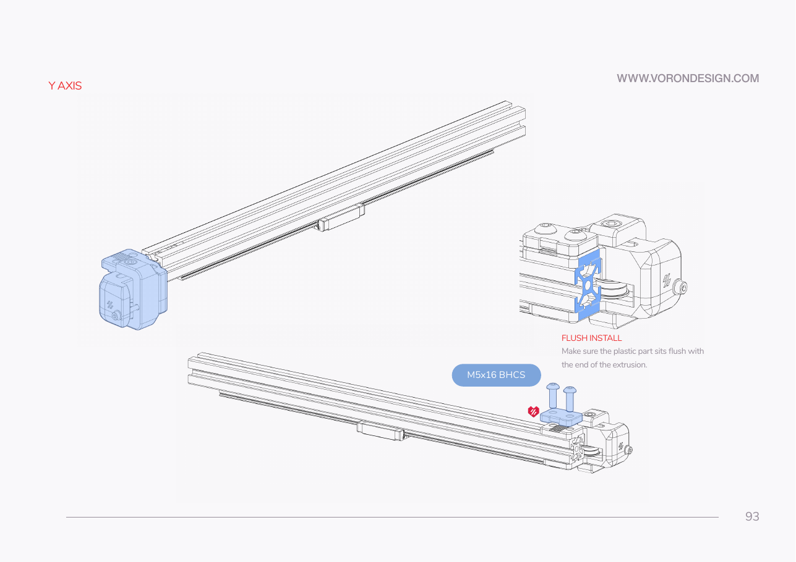

**Parts:** front idler assembly ×1, M5×16 BHCS ×2.

**Do:** Same on the second Y assembly with the opposite-hand idler. Push flush, two M5×16 BHCS into the top-slot T-nuts, snug.

**Check:** Both Y assemblies now have an idler at the front, both flush, both notches pointing away from the idler body.

Source: [Voron manual p.93](https://github.com/VoronDesign/Voron-2/blob/de7e89d/Manual/Assembly_Manual_2.4r2.pdf#page=93)

---

### Step 05.22 — Offer both Y axes to the drive units

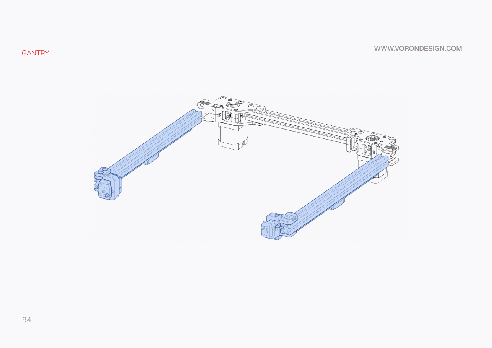

**Parts:** the two Y assemblies, the bridge + drives assembly.

**Do:** Bring the rear end of each C extrusion into its drive frame — the assembly with the A drive takes the right-hand Y axis, the B drive the left. Push each in until the printed frame is flush with the extrusion end. Work on a flat bench so the four corners stay in one plane.

**Check:** A U-shaped gantry: bridge across the back, two Y axes running forward, idlers at the front. Both rails face the same way; both backers face the same way.

Source: [Voron manual p.94](https://github.com/VoronDesign/Voron-2/blob/de7e89d/Manual/Assembly_Manual_2.4r2.pdf#page=94)

---

### Step 05.23 — Bolt the Y axes to the drives

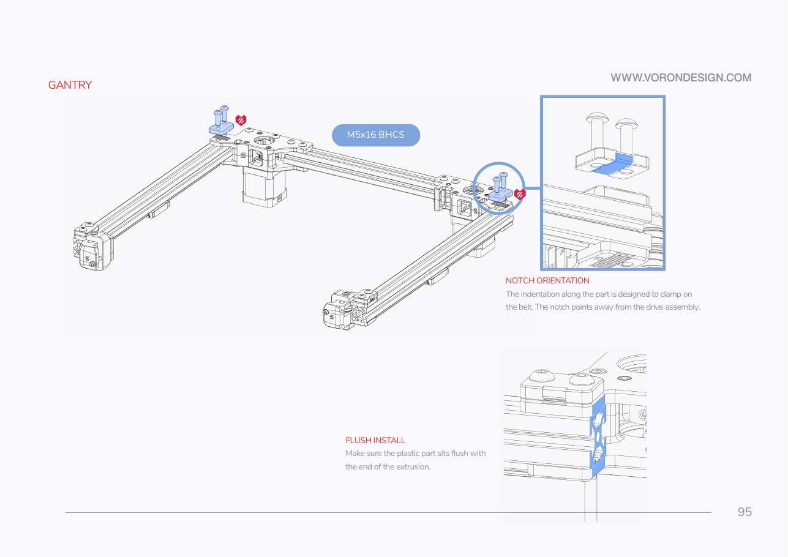

**Parts:** M5×16 BHCS ×4.

**Do:** Two M5×16 BHCS per side, down through the drive frame's top flange into the M5 T-nuts at the rear of each C extrusion. Snug only. Check the same two things as at the idlers: plastic flush with the extrusion end, and the belt-clamp notch pointing **away from the drive assembly**.

**Check:** Four bolts in, both rear joints flush, both notches outboard.

Source: [Voron manual p.95](https://github.com/VoronDesign/Voron-2/blob/de7e89d/Manual/Assembly_Manual_2.4r2.pdf#page=95)

---

### Step 05.24 — Sanity-check the gantry frame, then leave it alone

**Parts:** none.

**Do:** Lay the U-frame flat and measure from the inside face of one Y extrusion to the other, at the bridge and again at the idlers. They should match within about a millimetre. Push the gantry gently diagonally — it will rack, and that is expected at this stage.

**Check:** Front and rear spacing equal within ~1 mm. **Do not try to square or lock the gantry now** — squaring happens with the gantry in the frame, belts slack, in Ch 06 (survey §4.4 #2).

Source: [Voron manual p.95](https://github.com/VoronDesign/Voron-2/blob/de7e89d/Manual/Assembly_Manual_2.4r2.pdf#page=95)

Pause: ~40 min since the last pause — front idlers and both Y axes bolted to the drives, gantry frame sanity-checked and deliberately left slightly loose. Do not tighten anything further; do not start an XY joint (each joint is a bearing stack you must finish in one go).

---

### Step 05.25 — Seat the M5 nuts in both XY joints

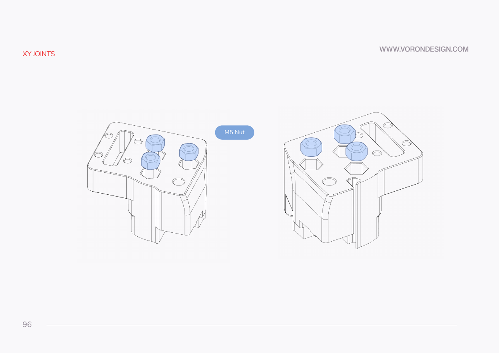

**Parts:** `xy_joint_left_lower_MGN12` ×1, `xy_joint_right_lower_MGN12` ×1, M5 nut ×6.

**Do:** Drop **three M5 nuts** into the hex pockets of each XY joint body, flats aligned to the pocket. Push each one fully home with a spare M5 bolt; a nut sitting proud will stop the joint closing later and will crack the pocket if you bolt through it.

**Check:** Three nuts per joint, all flush in their pockets, none rotated out of the hex.

Source: [Voron manual p.96](https://github.com/VoronDesign/Voron-2/blob/de7e89d/Manual/Assembly_Manual_2.4r2.pdf#page=96)

---

### Step 05.26 — Start the right XY joint bearing stack

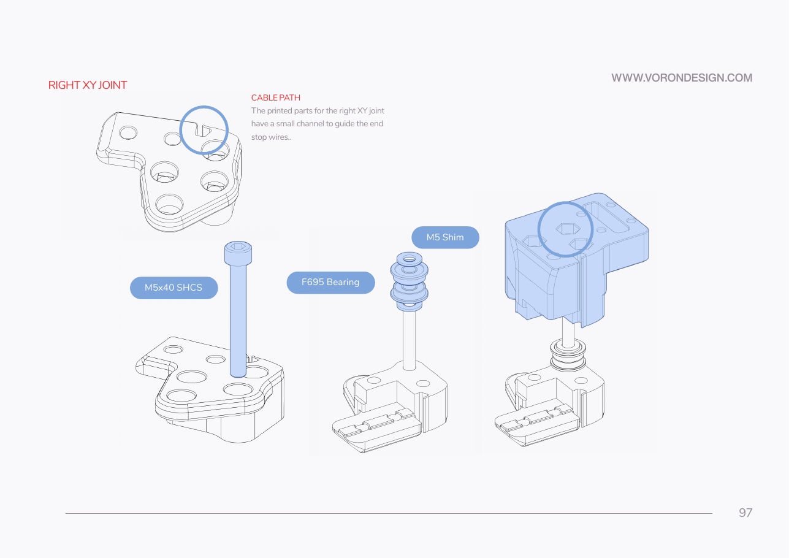

**Parts:** `xy_joint_right_upper_MGN12` ×1, M5×40 SHCS ×1, F695 bearing ×2, M5 precision spacer ×1.

**Do:** Note the small channel moulded into the right-hand joint parts — that is the **cable path** for the endstop wires; keep it clear and pointing the way the page shows. Push an M5×40 SHCS up through the joint's upper plate, then stack onto it, in order: F695 bearing, F695 bearing, spacer.

⚠ **Rev D+ / LDO:** the manual's "M5 Shim" is the brass **M5 precision spacer** in this kit, here and everywhere else unless a page is explicitly noted otherwise. [src](https://docs.ldomotors.com/en/voron/voron2/build-faq)

**Check:** Two bearings and one spacer on the bolt, in that order, bearings spinning freely, cable channel unobstructed.

Source: [Voron manual p.97](https://github.com/VoronDesign/Voron-2/blob/de7e89d/Manual/Assembly_Manual_2.4r2.pdf#page=97) · [LDO Build Notes § Voron 2.4 build FAQ](https://docs.ldomotors.com/en/voron/voron2/build-faq)

---

### Step 05.27 — Close the right XY joint

**Parts:** `xy_joint_right_lower_MGN12` ×1 (with its three M5 nuts).

**Do:** Bring the joint body down over the bearing stack so the M5×40's thread enters the nut pocket you loaded at Step 05.25. The two halves must meet with no gap and no bearing pinched between them.

**Check:** Halves closed flat, bolt engaged in its nut, bearing stack still turning by finger.

Source: [Voron manual p.97](https://github.com/VoronDesign/Voron-2/blob/de7e89d/Manual/Assembly_Manual_2.4r2.pdf#page=97)

---

### Step 05.28 — Bolt the right XY joint together

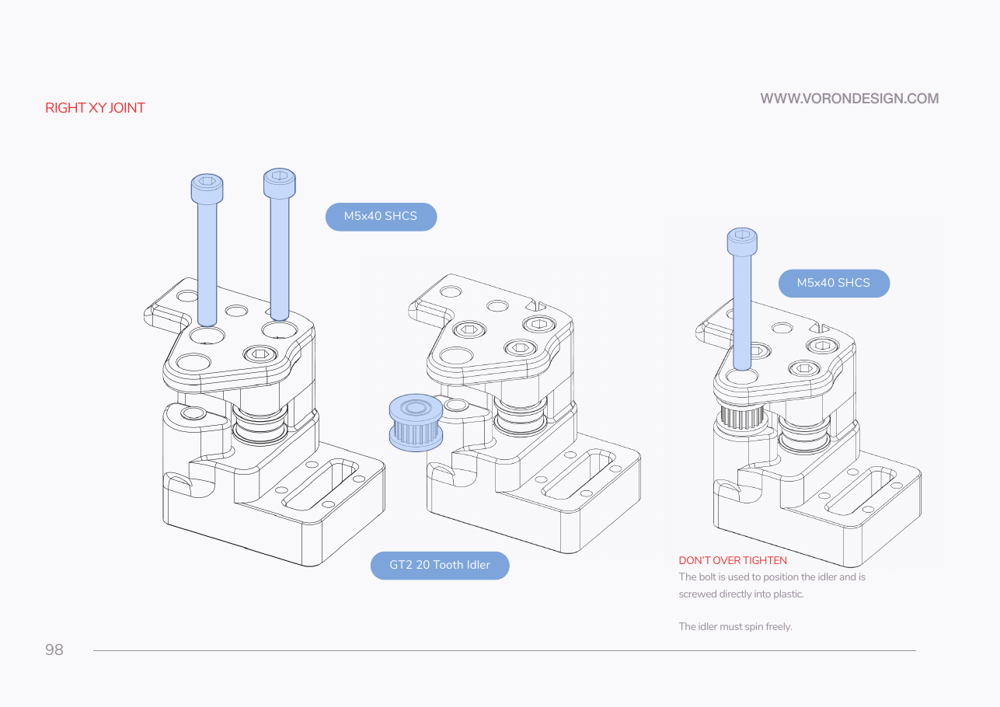

**Parts:** M5×40 SHCS ×2.

**Do:** Add the two remaining M5×40 SHCS from the top into the other two M5 nuts and tighten all three evenly. These clamp the joint into a single rigid part.

**Check:** No light between the halves anywhere. The bearing stack still spins.

Source: [Voron manual p.98](https://github.com/VoronDesign/Voron-2/blob/de7e89d/Manual/Assembly_Manual_2.4r2.pdf#page=98)

---

### Step 05.29 — Fit the right joint's 20-tooth idler

**Parts:** GT2 20-tooth idler ×1, M5×40 SHCS ×1.

**Do:** Drop the 20T idler into its pocket and run an M5×40 SHCS down through it. This bolt threads **directly into plastic** and only positions the idler.

⚠ Do not over-tighten. Stop the moment the head seats and the idler still spins freely; a crushed pocket here shows up as belt noise and premature wear in Ch 07.

**Check:** Idler spins under a fingernail flick with no drag and no wobble.

Source: [Voron manual p.98](https://github.com/VoronDesign/Voron-2/blob/de7e89d/Manual/Assembly_Manual_2.4r2.pdf#page=98)

Pause: ~25 min since the last pause — right XY joint fully built, bolted and its 20T idler fitted and spinning. Leave the left joint's parts bagged; do not part-build it.

---

### Step 05.30 — Build the left XY joint

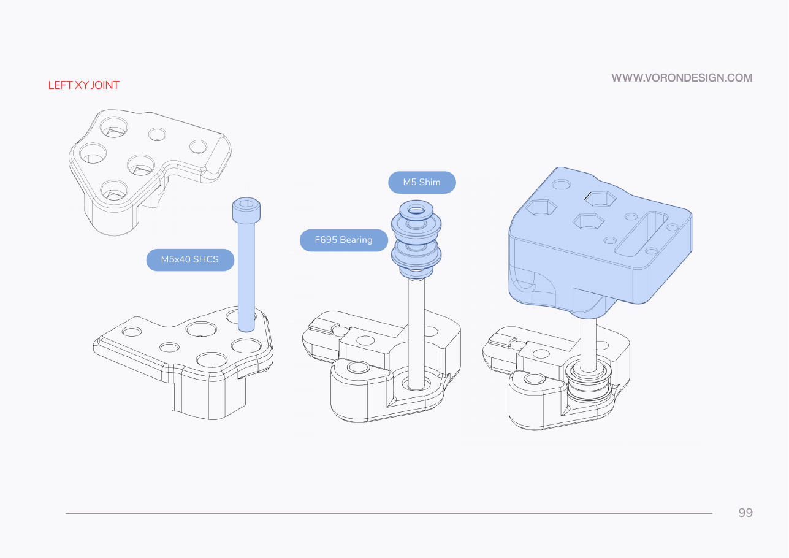

**Parts:** `xy_joint_left_upper_MGN12` ×1, `xy_joint_left_lower_MGN12` ×1, M5×40 SHCS ×1, F695 bearing ×2, M5 precision spacer ×1.

**Do:** Mirror of Steps 05.26–05.27 — M5×40 up through the upper plate, F695, F695, precision spacer, then close the joint body over it into its M5 nut. The left joint has no endstop cable channel; if the part you are holding has one, you have the right-hand pair.

**Check:** Left and right joints sit as mirror images on the bench, not as two of the same hand.

Source: [Voron manual p.99](https://github.com/VoronDesign/Voron-2/blob/de7e89d/Manual/Assembly_Manual_2.4r2.pdf#page=99)

---

### Step 05.31 — Bolt the left joint and fit its idler

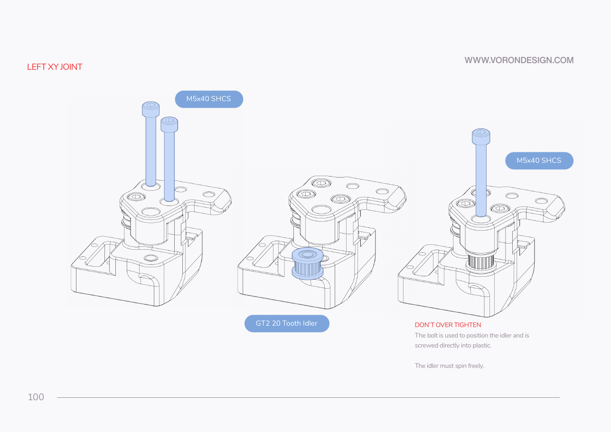

**Parts:** M5×40 SHCS ×3, GT2 20-tooth idler ×1.

**Do:** Two M5×40 SHCS from the top into the remaining M5 nuts, tightened evenly; then the 20T idler and its own M5×40 into plastic — snug only, must spin.

**Check:** Both joints complete: 4× M5×40 each, 2× F695 each, one spacer each, one 20T idler each, all four bearing stacks and both idlers free.

Source: [Voron manual p.100](https://github.com/VoronDesign/Voron-2/blob/de7e89d/Manual/Assembly_Manual_2.4r2.pdf#page=100)

Pause: ~20 min since the last pause — both XY joints built, bolted and idler-fitted, sitting loose on the bench. Do not slide them onto the X extrusion yet.

---

### Step 05.32 — Load M3 T-nuts for the X rail

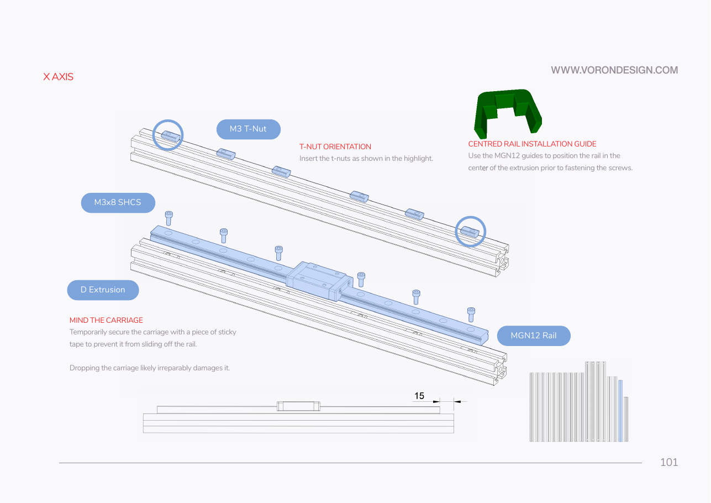

**Parts:** D extrusion ×1, M3 T-nut ×~8.

**Do:** The X rail is a **400 mm** MGN12H (`LDO-SLR12H-400Z1`): ~16 holes at 25 mm pitch, every other hole, so about **8** T-nuts. Count the holes and mark the ones you will use, then slide the nuts into the D extrusion's rail slot, spread along it, orientation per the highlight. Leave about 15 mm of clear slot at each end.

**Check:** ~8 nuts in, one per marked hole, flat, with clear slot at both ends.

Source: [Voron manual p.101](https://github.com/VoronDesign/Voron-2/blob/de7e89d/Manual/Assembly_Manual_2.4r2.pdf#page=101)

---

### Step 05.33 — Centre and fit the MGN12 rail

**Parts:** MGN12H 400 mm rail ×1, `MGN12_rail_guide_x2` jig ×2, M3×8 SHCS ×~8 (one per marked hole).

**Do:** *"Temporarily secure the carriage with a piece of sticky tape to prevent it from sliding off the rail"* before you handle it. Sit the rail on the D extrusion, centre it with an MGN12 guide at each end, and start the first screw in the **second hole from the end**. Run them all down finger-tight, re-check the jigs, then tighten centre-outwards in two passes.

⚠ **Rev D+ / LDO:** second hole in from each end here too, not the end hole. [src](https://docs.ldomotors.com/en/voron/voron2/build-faq)

**Check:** The p.101 detail dimensions **15 mm** of bare extrusion beyond the rail end — measure both ends and make them equal. Carriage runs the full rail with no tight spot; rail flat with no gap under it.

Source: [Voron manual p.101](https://github.com/VoronDesign/Voron-2/blob/de7e89d/Manual/Assembly_Manual_2.4r2.pdf#page=101) · [LDO Build Notes § Voron 2.4 build FAQ](https://docs.ldomotors.com/en/voron/voron2/build-faq) · [LDO rail-grease guide](https://docs.ldomotors.com/guides/rail_grease_guide)

---

### Step 05.34 — Fit the X backer to the rear face

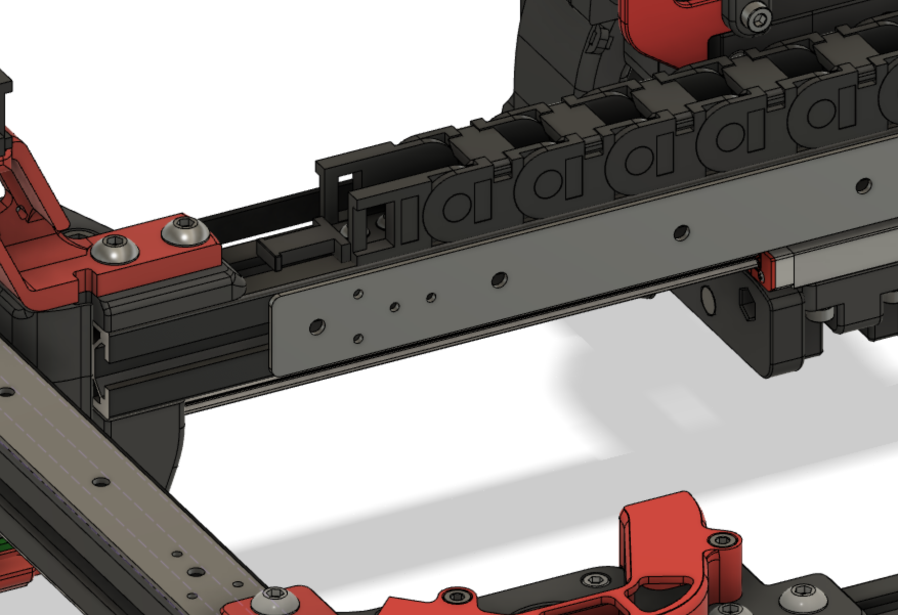

**Parts:** X backer ×1, M3×6 FHCS ×~8, M3 T-nut ×~8.

**Do:** Turn the D extrusion so the MGN12 rail faces you. The backer goes on the **rear face — the one directly opposite the rail**, not on top. Roll the T-nuts in, start every screw, then tighten centre-outwards. Use **M3×6 FHCS for X** — the 8 mm screws are for Y and will bottom out.

⚠ *"For X axes, in most cases you'll want to install them on the rear of the X extrusion, opposite the MGN12 rail… If you have a single MGN12 but decide to put a backer on top, you will be actively contributing to the problem of bimetallic expansion!"* [src](https://github.com/tanaes/whopping_Voron_mods/tree/main/extrusion_backers)

**Check:** Backer on the face opposite the MGN12, flat, all screws seated. Nothing added to the top face of the D extrusion — the XY joints and the cable bridge need that face clear.

Source: [Ti extrusion-backers README (tanaes)](https://github.com/tanaes/whopping_Voron_mods/tree/main/extrusion_backers) (image [`fusion_x_chainmount.png`](https://raw.githubusercontent.com/tanaes/whopping_Voron_mods/main/extrusion_backers/images/fusion_x_chainmount.png))

---

### Step 05.35 — Check backer clearance for the cable chain

(no image — see text)

**Parts:** cable-chain end link (dry fit only).

**Do:** The backers carry **pilot holes for the cable-chain end link**. Offer the chain's end link up to the X backer and to the Y backers and see whether the holes line up and whether the stock printed bridge still sits flat. Do not fit the chain — that is Ch 10 — you are only deciding which bridge to keep.

**Check:** You know whether you will use `[a]_xy_joint_cable_bridge_2hole` or the raised `XY_cable_chain_bridge-Igus-3mm_backer`. "Igus" = the 2-hole pattern LDO ships. [src](https://docs.ldomotors.com/guides/cable_chain_guide)

Source: [Ti extrusion-backers README (tanaes)](https://github.com/tanaes/whopping_Voron_mods/tree/main/extrusion_backers) · [LDO cable-chain guide](https://docs.ldomotors.com/guides/cable_chain_guide)

Pause: ~35 min since the last pause — MGN12 rail centred and screwed down on the X extrusion, titanium X backer on the rear face, cable-chain clearance checked. Carriage taped captive.

---

### Step 05.36 — Load the D extrusion's M5 T-nuts

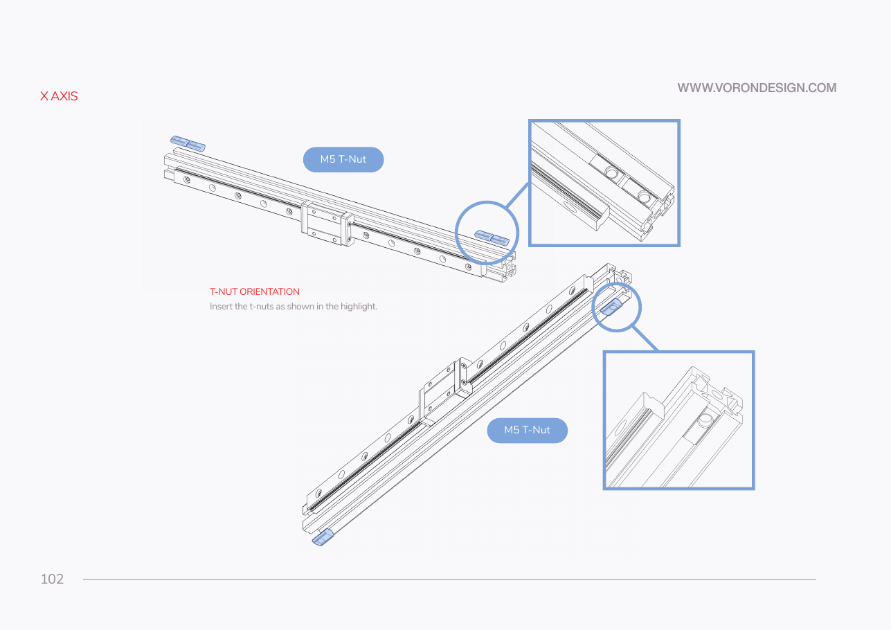

**Parts:** M5 T-nut ×6.

**Do:** Two slots are used here. In the slot on the face **adjacent to the rail** (the joints' bolting face) put **two M5 T-nuts at each end** — four in total. In the slot on the **opposite** face put **one M5 T-nut at each end** — two in total. Both blow-ups on the page show the orientation.

**Check:** 4 + 2 = six M5 T-nuts. The two singles line up with the through-holes the M5×30 bolts will use from underneath.

Source: [Voron manual p.102](https://github.com/VoronDesign/Voron-2/blob/de7e89d/Manual/Assembly_Manual_2.4r2.pdf#page=102)

---

### Step 05.37 — Slide both XY joints onto the X extrusion

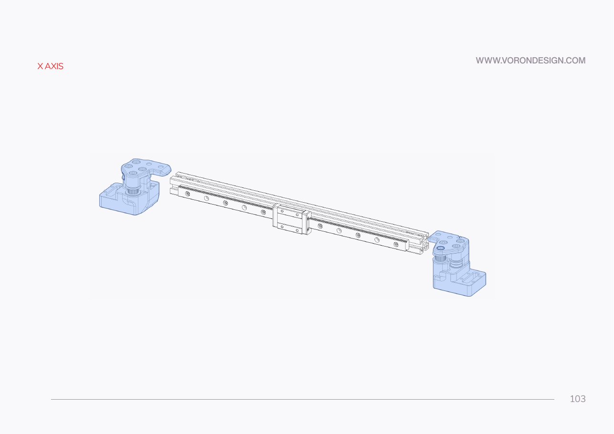

**Parts:** left XY joint ×1, right XY joint ×1.

**Do:** Push a joint onto each end of the D extrusion, left joint to the left end, right joint (the one with the endstop cable channel) to the right. Seat each until the extrusion bottoms out in the joint's pocket.

**Check:** Both joints fully home; the two 20T idlers and the two bearing stacks all face the same way along the extrusion.

Source: [Voron manual p.103](https://github.com/VoronDesign/Voron-2/blob/de7e89d/Manual/Assembly_Manual_2.4r2.pdf#page=103)

---

### Step 05.38 — Bolt the joints from above, with the cable bridge

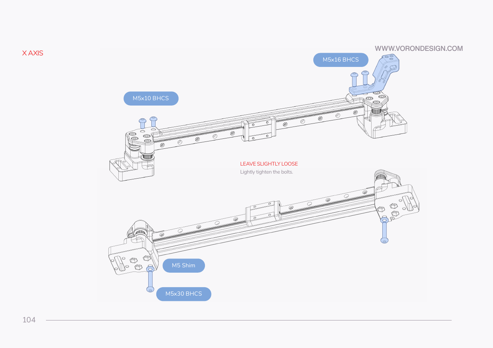

**Parts:** M5×10 BHCS ×2, `[a]_xy_joint_cable_bridge_2hole` ×1, M5×16 BHCS ×2.

**Do:** On the **left** joint, two M5×10 BHCS straight down into the extrusion's top-slot T-nuts. On the **right** joint, lay the cable bridge's foot over the same two holes and use the longer **M5×16 BHCS** to bolt through bridge and joint into the extrusion. *"LEAVE SLIGHTLY LOOSE — lightly tighten the bolts."* These joints are re-seated when the gantry is squared in Ch 06.

**Check:** Bridge foot flat with its arm standing up on the right-hand side; four bolts started and lightly tightened, none torqued.

Source: [Voron manual p.104](https://github.com/VoronDesign/Voron-2/blob/de7e89d/Manual/Assembly_Manual_2.4r2.pdf#page=104)

---

### Step 05.39 — Bolt the joints from below

**Parts:** M5×30 BHCS ×2, black M5 washer ×2.

**Do:** Turn the X assembly over and run an M5×30 BHCS with a washer under its head up into each of the single M5 T-nuts from Step 05.36. Light tightening again — the whole joint stays slightly loose until Ch 06.

⚠ **Rev D+ / LDO (p.104):** *"Use the black M5 Washer instead of the M5 Shim cause it looks nicer."* This page is the documented exception to the precision-spacer substitution. [src](https://docs.ldomotors.com/en/voron/voron2/build-faq)

**Check:** Two M5×30 in with black washers under the heads, both lightly tightened.

Source: [Voron manual p.104](https://github.com/VoronDesign/Voron-2/blob/de7e89d/Manual/Assembly_Manual_2.4r2.pdf#page=104) · [LDO Build Notes § Voron 2.4 build FAQ](https://docs.ldomotors.com/en/voron/voron2/build-faq)

---

### Step 05.40 — Check the X axis assembly

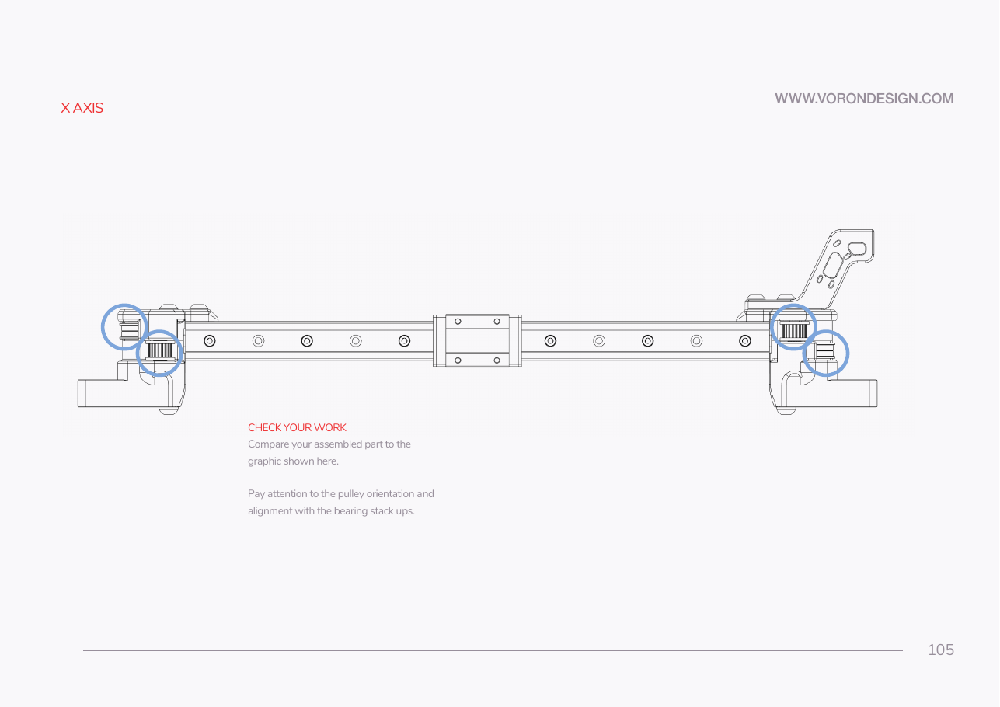

**Parts:** none.

**Do:** Compare your X assembly with the page. Sight along the extrusion at each end: the 20T idler and the F695 stack must be in the same plane as their opposite numbers, so a belt can run straight between them. Spin all four.

**Check:** Idler and bearing-stack heights match end to end; nothing binds; the MGN12 carriage still slides freely and is still taped.

Source: [Voron manual p.105](https://github.com/VoronDesign/Voron-2/blob/de7e89d/Manual/Assembly_Manual_2.4r2.pdf#page=105)

Pause: ~35 min since the last pause — both XY joints bolted to the X extrusion top and bottom, cable bridge on, assembly checked against p.105. Still upside down; leave it that way and do not attempt the flip alone.

---

### Step 05.41 — Flip the gantry

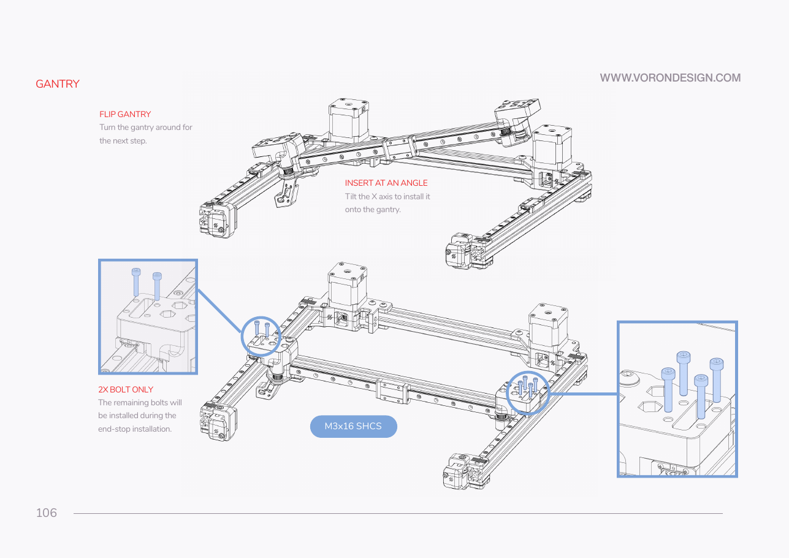

**Parts:** none.

**Do:** Turn the U-frame gantry over so the A/B motors point up and both MGN9 carriages face you. Everything from p.85 on was built inverted; this is the orientation the machine actually uses. Get a second pair of hands — it is large, unbraced, and the drives are heavy.

**Check:** Motors up, both Y carriages accessible from above, nothing dropped on a bearing stack.

Source: [Voron manual p.106](https://github.com/VoronDesign/Voron-2/blob/de7e89d/Manual/Assembly_Manual_2.4r2.pdf#page=106)

---

### Step 05.42 — Insert the X axis at an angle

**Parts:** the X axis assembly.

**Do:** *"Tilt the X axis to install it onto the gantry."* Bring one XY joint down onto its Y carriage first, then swing the other end across and drop it onto the second carriage. The left joint goes to the left Y rail, the right joint (cable bridge, endstop channel) to the right.

**Check:** Both joints sitting squarely on their carriages, bolt holes lined up, no bearing or idler fouling the Y extrusion.

Source: [Voron manual p.106](https://github.com/VoronDesign/Voron-2/blob/de7e89d/Manual/Assembly_Manual_2.4r2.pdf#page=106)

---

### Step 05.43 — Bolt the XY joints to the Y carriages

**Parts:** M3×16 SHCS ×6.

**Do:** The **left** joint takes all four M3×16 SHCS. The **right** joint — the one with the cable bridge, whose remaining two holes the endstop pod will share — takes **two only**. *"2X BOLT ONLY: the remaining bolts will be installed during the end-stop installation."* Take all six to snug.

**Check:** 4 bolts on one joint, 2 on the other, 2 M3×16 left over and bagged with `[a]_endstop_pod_D2F_switch`. Count them; the pod cannot go on later without them.

Source: [Voron manual p.106](https://github.com/VoronDesign/Voron-2/blob/de7e89d/Manual/Assembly_Manual_2.4r2.pdf#page=106)

---

### Step 05.44 — Run the X axis end to end

**Parts:** none.

**Do:** Push the X axis slowly from one end of the Y travel to the other, several times, with a hand on each XY joint. It should move with even, light resistance the whole way. A tight spot near one end usually means a rail is not centred; a general stiffness that grows towards one end usually means the gantry is racked — do **not** fix that by loosening rails.

**Check:** Full travel both directions, no notch, no rising resistance, both Y carriages moving together. Racking is normal and is corrected in Ch 06.

Source: [Voron manual p.106](https://github.com/VoronDesign/Voron-2/blob/de7e89d/Manual/Assembly_Manual_2.4r2.pdf#page=106)

Pause: ~30 min since the last pause — gantry flipped, X axis in and bolted to both Y carriages, running end to end without binding. Belts still bagged, XY joint bolts still only lightly tightened — leave both alone.

---

### Step 05.45 — Stage the X-carriage frame halves

(no image — see text)

**Parts:** `x_frame_V2TR_MGN12_left` ×1, `x_frame_V2TR_MGN12_right` ×1, `probe_retainer_bracket` ×1.

**Do:** Offer the two carriage halves to the MGN12 carriage and confirm the bolt pattern matches before you commit any heat-set inserts to them. These are the R2 / Clockwork-2 halves and they are **not** interchangeable with older X-carriage parts. Then bag them, labelled, with the probe retainer.

⚠ **Rev D+ / LDO (p.129–130):** *"If you are building Clockwork 2 double-check that you have the correct X-Carriage and follow the instructions in the Stealthburner manual."* [src](https://docs.ldomotors.com/en/voron/voron2/build-faq) The carriage goes on with the belts in Ch 07; the toolhead itself is Ch 08.

**Check:** Bolt pattern matches the MGN12 carriage; both halves and the probe retainer bagged and labelled for Ch 07.

Source: [Voron manual p.129](https://github.com/VoronDesign/Voron-2/blob/de7e89d/Manual/Assembly_Manual_2.4r2.pdf#page=129) · [LDO Build Notes § Voron 2.4 build FAQ](https://docs.ldomotors.com/en/voron/voron2/build-faq)

---

### Step 05.46 — Bag what belongs to later chapters

(no image — see text)

**Parts:** `[a]_endstop_pod_D2F_switch` ×1, M3×16 SHCS ×2, `[a]_tensioner_left/right`, `[a]_cable_cover`, the unused cable bridge variant.

**Do:** Put the endstop pod and its two reserved M3×16 SHCS in one labelled bag, the Ch 07 tensioners and cable cover in another. Print the D2F pod only — this kit has no hall-effect endstops anywhere.

⚠ **Rev D+ / LDO:** *"Our kit includes the XY microswitch PCB, print [a]_endstop_pod_D2F_switch instead of [a]_endstop_pod_hall_effect."* [src](https://docs.ldomotors.com/en/voron/voron2/printed_part_guide_rev_d)

**Check:** Two labelled bags; nothing loose on the bench that Ch 06 or Ch 07 will need.

Source: [LDO printed-parts guide (Rev D)](https://docs.ldomotors.com/en/voron/voron2/printed_part_guide_rev_d)

---

### Step 05.47 — Stop here: no belts, no squaring

**Parts:** none.

**Do:** The gantry is complete as a mechanism and deliberately unfinished as a machine. Do not cut, route or tension the A/B belts, do not tighten the XY joints "properly", and do not try to square the gantry on the bench. The official procedure squares it **in the frame, with A/B tension released and the lower Z joints dropped** — doing it now guarantees doing it twice. [src](https://docs.vorondesign.com/build/mechanical/v2_gantry_squaring.html)

**Check:** A/B belts still in their bag. XY joint bolts still only lightly tightened.

Source: [Voron manual p.107](https://github.com/VoronDesign/Voron-2/blob/de7e89d/Manual/Assembly_Manual_2.4r2.pdf#page=107) · [Voron docs § V2 Gantry Squaring](https://docs.vorondesign.com/build/mechanical/v2_gantry_squaring.html)

---

### Step 05.48 — Log it and photograph it

(no image — see text)

**Parts:** camera.

**Do:** Photograph the assembled gantry from above and from each end, plus a close-up of each backer showing which face it is on, and one of the right XY joint with the cable bridge. Record the rail overhangs you measured (Y and X, both ends) and note anything you left deliberately loose.

| Measurement | Target | Yours | Notes |
|---|---:|---|---|
| Y rail overhang, extrusion 1 — end A / end B | 25 / 25 mm | | |
| Y rail overhang, extrusion 2 — end A / end B | 25 / 25 mm | | |
| X rail overhang — end A / end B | 15 / 15 mm | | |
| Inside Y-to-Y spacing at the bridge | — | | |
| Inside Y-to-Y spacing at the idlers | = at bridge | | |
| M3×16 SHCS remaining for the endstop pod | 2 | | |

**Check:** Numbers written down, not "looked fine". You will want the Y-to-Y spacings when the gantry is squared in Ch 06.

---

## Checkpoint 05

- [ ] E extrusion joined to both drive units with 8× M5×10 BHCS; drives parallel, no twist
- [ ] Both MGN9 rails centred and tightened, first screw in the **second hole** from each end, overhang equal at both ends
- [ ] MGN12 rail centred and tightened, second hole in, overhang equal at both ends
- [ ] Every carriage retained by a stopper or tape; none dropped
- [ ] Three M5 and one M3 T-nut pre-loaded at each of the four C-extrusion ends
- [ ] **Titanium backers on the face opposite the rail** — top of both Y extrusions, rear of the X extrusion — flat, all screws seated, none cammed out
- [ ] Both front idlers and both rear drive joints flush with the extrusion ends, notches pointing away from the assembly
- [ ] Both XY joints: 3 M5 nuts, 4 M5×40 SHCS, 2 F695, 1 precision spacer, 1 free-spinning 20T idler
- [ ] Cable bridge fitted to the **right** XY joint with M5×16 BHCS; left joint on M5×10
- [ ] M5×30 BHCS with **black M5 washers** underneath, both lightly tightened
- [ ] XY joints bolted to the Y carriages: 4 bolts one side, 2 the other, **2× M3×16 SHCS bagged** with the endstop pod
- [ ] X axis runs the full Y travel with no tight spot
- [ ] A/B belts still unopened; nothing squared, nothing torqued down

## Common mistakes

- **Fitting the backers after the gantry is built.** Their T-nut slots are capped by the idler and drive frames, and the backer face is buried once the gantry is in the frame. It is a ~3 h teardown to fix (survey §5.2 W2).
- **Putting the X backer on top of the X extrusion.** With a single MGN12 on the front face, a top backer adds to the bimetallic bow instead of cancelling it, and it blocks the top slot the XY joints and cable bridge bolt into.
- **Using the rails' end holes.** The manual only forbids it on 300 mm builds; LDO forbids it on all of them, because the end holes sit exactly where the M5/M3 T-nuts of p.89–90 and p.102 have to live. Caught late, the rail comes off and goes back on.
- **Forgetting the reserved T-nuts at p.90.** Nothing in this chapter uses them, so they are easy to skip — and Ch 06's Z joints and Ch 10's chain hardware then have nowhere to bolt to. Count three M5 + one M3 per end before the idlers go on.
- **Torquing the XY joints and "squaring" on the bench.** The joints are meant to stay slightly loose and the gantry is squared in the frame with the belts slack. Tightening now, or tensioning belts now, costs a full de-tension in Ch 07 (survey §5.2 W1).
- **Over-tightening the 20T idler bolts.** They thread straight into plastic and only locate the idler. Crushed pockets show up later as belt noise you will blame on tension.

## Next

Ch 06 — Z axis: gantry install, Z belts and gantry squaring (manual p.108–123, plus the official 16-step squaring procedure); gated on batch **B05** (Z joints + Z chain, 1 plate, 5.2 h) — start it now if it is not already printed. Keep the rubber rail stoppers: LDO uses them under the Z joints to rest the gantry during install.

Source: [survey §7.5](../voron-build-instructions-survey.md) · [Voron manual p.107](https://github.com/VoronDesign/Voron-2/blob/de7e89d/Manual/Assembly_Manual_2.4r2.pdf#page=107)

Pause: ~25 min since the last pause — gantry complete, measurements written down, photographs taken, Ch 06/07 parts bagged and labelled. Do not tension belts and do not square the gantry: both are Ch 06/07 and both would be undone.
