# Chapter 05 — Gantry: X and Y axes, XY joints, X carriage, titanium backers

Builds the complete gantry on the bench — XY bridge, both Y axes with their MGN9 rails, both XY joints, the X extrusion with its MGN12 rail, and the titanium extrusion backers — and ends with the X axis riding on the Y carriages. Unlocks Ch 06 (gantry install, Z belts, squaring).

**What you're building in this chapter.** The gantry is the entire moving upper half of the printer — a rectangle of aluminium extrusion that later hangs on four belts and slides up and down, with the toolhead riding inside it. Its back edge is the **XY bridge**, the cross-beam that carries the A and B motors you built in Ch 04. Two side extrusions, the **Y axes**, run forward from that bridge; each has a linear rail along one face and a **front idler** block at its front end that turns its belt back. Spanning the two sides is the **X beam**, capped at each end by an **XY joint** — the printed blocks that ride on the Y carriages and turn each belt around from its Y run to its X run. Bolted to the face opposite every rail are the **titanium backers**, flat strips that stop a steel rail bowing its aluminium extrusion as the chamber heats. Nothing in this chapter gets belts or squaring: both belong to Ch 06/07, and both would undo work done here.

**Time:** 5.0–7.0 h hands-on, first build, two people ([survey §5.1 P05 / §7.2](../voron-build-instructions-survey.md)).

**Sessions:** 12 × ~30 min (first-build estimate; each `Pause:` line carries its own segment minutes).

**Prerequisites:**

- **Ch 04** — A drive, B drive and both front idler assemblies built and checked (manual p.62–81). This chapter consumes them whole.
- **Ch 00** — all seven rails cleaned and packed with grease *before* they go on an extrusion ([LDO rail grease guide](https://docs.ldomotors.com/guides/rail_grease_guide)); jigs `Tools/MGN9_rail_guide_x2.stl` and `Tools/MGN12_rail_guide_x2.stl` printed (batch **B00**). The rails still wear their Ch 00 end bands (Step 00.17) — they come off at Steps 05.11 / 05.33.
- **Print batches: B04** (XY joints + X carriage, plate B04-P1, 8.6 h, black) and **B02-P3** (the orange accent plate — cable bridge and endstop pod) ([print plan §B04](../voron-print-plan.md)). B04 needs Gate B (Step B00.7).
- **Titanium backer set** (Fabreeko/LDO, 350 size) unpacked and counted.
- Ch 01's bagged **C ×2, D ×1, E ×1** extrusions.

**Tools**

- Hex drivers 2 / 2.5 / 3 / 4 mm; a **ball-end 2.5 mm** helps at the XY joints
- **T10 Torx driver** — strongly preferred for the backer M3 FHCS; hex cams out of a countersink easily ([backers README](https://github.com/tanaes/whopping_Voron_mods/tree/main/extrusion_backers))
- Printed rail-centring jigs `MGN9_rail_guide_x2`, `MGN12_rail_guide_x2`
- Steel rule 300 mm and a caliper — to equalise the rail overhang at both ends
- Masking tape (carriage retention) and the kit's rubber rail stoppers
- 2.5 mm flat screwdriver (cable-chain latches, if you dry-fit the chain end)

**Printed parts**

Parts arrive in the bins named below (see the bin map in print/README.md#bins); check the bin label's list before you start.

| Looks like | STL | Bin | Qty | Colour |
|---|---|---|---|---|
| 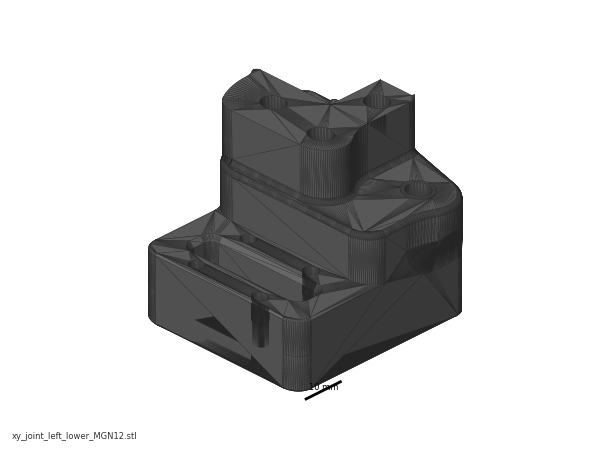{ width=96 } | `xy_joint_left_lower_MGN12.stl` | 05-XY | 1 | Black |
| 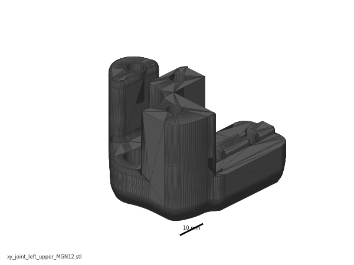{ width=96 } | `xy_joint_left_upper_MGN12.stl` | 05-XY | 1 | Black |
| 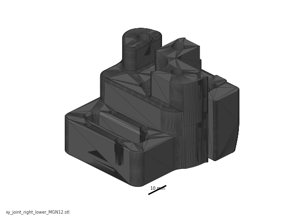{ width=96 } | `xy_joint_right_lower_MGN12.stl` | 05-XY | 1 | Black |
| 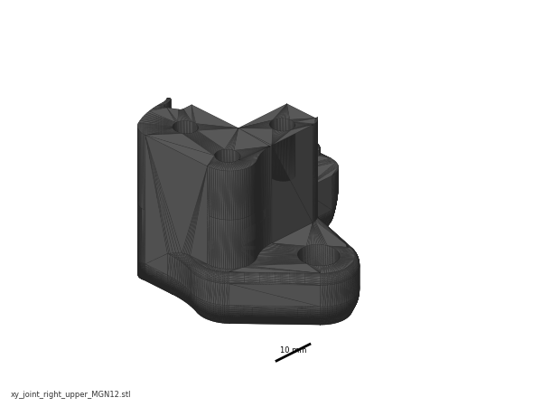{ width=96 } | `xy_joint_right_upper_MGN12.stl` | 05-XY | 1 | Black |
| { width=96 } | `[a]_xy_joint_cable_bridge_2hole.stl` | 05-XY | 1 | Orange |
| 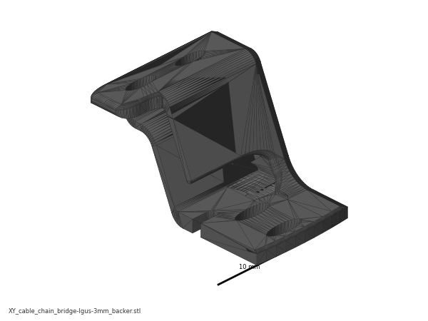{ width=96 } | `XY_cable_chain_bridge-Igus-3mm_backer.stl` | 05-XY | 1 (alternate — fit whichever clears the backer) | Orange |
| { width=96 } | `x_frame_V2TR_MGN12_left.stl` | 07-X | 1 | Black — *staged here, fitted in Ch 07* |
| { width=96 } | `x_frame_V2TR_MGN12_right.stl` | 07-X | 1 | Black — *staged here, fitted in Ch 07* |
| { width=96 } | `probe_retainer_bracket.stl` | 07-X | 1 | Black — *staged here, fitted in Ch 07/08* |
| { width=96 } | `[a]_endstop_pod_D2F_switch.stl` | 05-XY | 1 | Orange — *staged here, fitted at endstop wiring* |

Do **not** print `[a]_endstop_pod_hall_effect.stl`, `[a]_xy_joint_cable_bridge_3hole.stl`, or any `xy_joint_*_MGN9` — wrong variants for this kit ([print plan §7](../voron-print-plan.md)).

**Hardware** (chapter totals)

| Fastener / part | Qty | Where |
|---|---|---|
| E extrusion (XY bridge) | 1 | p.85 |
| C extrusion (Y axis) | 2 | p.88 |
| D extrusion (X axis) | 1 | p.101 |
| MGN9H rail + carriage | 2 | Y axes, p.88 |
| MGN12H rail + carriage | 1 | X axis, p.101 |
| M5 roll-in T-nut | 26 | 8 in E (p.85), 12 in the C pair (p.89, p.90), 6 in D (p.102) |
| M3 roll-in T-nut | ≈32 | ≈20 Y rails (p.88 — ~10 per 400 mm MGN9), 4 in the C pair (p.90), ≈8 X rail (p.101) |
| M3 roll-in T-nut, backers | ~30 | not supplied with the backers — count the kit's spare M3 T-nuts after Ch 03 before ordering any |
| M5×10 BHCS | 10 | 8 bridge-to-drive (p.86–87), 2 left XY joint (p.104) |
| M5×16 BHCS | 10 | 4 front idlers (p.91, p.93), 4 rear drive joints (p.95), 2 right XY joint + cable bridge (p.104) |
| M5×30 BHCS | 2 | XY joints from below (p.104) |
| M5×40 SHCS | 8 | 4 per XY joint (p.97–100) |
| M3×8 SHCS | ≈28 | ≈20 Y rails (~10 each), ≈8 X rail — count the holes on your own rails |
| M3×16 SHCS | 6 | XY joints to the Y carriages (p.106) — the right joint takes 2 only; the 2 you do not fit are spares, not the pod's bolts |
| M3×30 SHCS | 2 | bagged with the endstop pod for Ch 09 — p.164 fits the pod through its body with M3×30, not the M3×16 of p.106 (verify against the bag) |
| M5 nut | 6 | 3 per XY joint (p.96) |
| **M5 precision spacer, brass** | 4 | 2 per XY joint stack — one below and one above the F695 pair (p.97, p.99) — replaces the manual's "M5 shim" |
| **M5 washer, black** | 2 | under the M5×30 heads (p.104) — replaces the manual's "M5 shim" |
| F695 bearing | 4 | 2 per XY joint |
| GT2 20-tooth idler | 2 | 1 per XY joint |
| Titanium backer, Y | 2 | one per C extrusion |
| Titanium backer, X | 1 | D extrusion, rear face |
| M3×8 FHCS (backers, Y) | ~20 | count the holes in your backers *(verify on bench)* |
| M3×6 FHCS (backers, X) | ~8 | count the holes in your backer *(verify on bench)* |

The West3D/Fabreeko titanium set ships **22× M3×8 FHCS and 10× M3×6 FHCS** with a few spares, and **no T-nuts** ([West3D](https://west3d.com/products/titanium-backers-for-voron-2-4-trident-3-pack)).

**Read first**

- **The titanium backers go on during this chapter, not after it.** Fitting them once the gantry is assembled or installed means a teardown (survey §5.2 W2). They mount on the face **opposite the rail** — top of the Y extrusions, rear of the X extrusion. *"If you have a single MGN12 but decide to put a backer on top, you will be actively contributing to the problem of bimetallic expansion!"* [src](https://github.com/tanaes/whopping_Voron_mods/tree/main/extrusion_backers)
- **Do not tension the A/B belts and do not square the gantry here.** Both are Ch 06/07, and the official squaring procedure begins by *releasing* A/B tension — tension it now and you undo it (survey §4.4 #2, §5.2 W1). Several joints in this chapter are deliberately left "slightly loose".
- **Every T-nut this chapter needs must go in before the drive and idler frames cap the extrusion ends.** LDO: *"Due to the tight tolerances of the extrusions and roll-in t-nuts it is advisable to either test fit before assembly … or to pre-load the t-nuts into the extrusions."* [src](https://docs.ldomotors.com/en/voron/voron2/build-faq)
- **Rails ship dry.** If Ch 00's clean-and-pack pass has not been done, stop and do it — the flip-and-pack method needs access to the back of the rail (survey §4.4 #5).
- **Carriages slide off rails and are ruined by a drop** (manual p.88, p.101). Tape or stopper every carriage the moment its rail is on an extrusion.
- **Orientation.** Through p.105 the gantry is built the way it runs — motors hanging **down** below the bridge, Y rails **underneath** (p.85, p.116). p.106 turns it **upside down** (motors up, rails up) so the X axis can be lowered onto the Y carriages; it stays that way to the end of this chapter and is turned back in Ch 06 (Step 06.11). Every step that turns it over says so.

**Sources for this chapter:**

- [Voron 2.4r2 assembly manual, p.82–107](https://github.com/VoronDesign/Voron-2/blob/de7e89d/Manual/Assembly_Manual_2.4r2.pdf#page=82) — the page sequence this chapter transcribes, pinned at commit `de7e89d`
- [LDO Build Notes § Voron 2.4 build FAQ](https://docs.ldomotors.com/en/voron/voron2/build-faq) — Rev D kit deviations, T-nut pre-loading, rail stoppers
- [LDO printed-parts guide (Rev D)](https://docs.ldomotors.com/en/voron/voron2/printed_part_guide_rev_d) — 2-hole cable bridge, D2F endstop pod
- [LDO rail-grease guide](https://docs.ldomotors.com/guides/rail_grease_guide) — rail clean-and-pack, done in Ch 00
- [LDO cable-chain guide](https://docs.ldomotors.com/guides/cable_chain_guide) — chain-end clearance over the backers
- [Ti extrusion-backers README (tanaes)](https://github.com/tanaes/whopping_Voron_mods/tree/main/extrusion_backers) — which face the backers go on, and why; source of the two backer images (GPL-3.0)
- [Fabreeko](https://www.fabreeko.com/products/v2-4-trident-titanium-extrusion-backers) and [West3D](https://west3d.com/products/titanium-backers-for-voron-2-4-trident-3-pack) backer sets — supplied screw counts
- [Voron docs § V2 Gantry Squaring](https://docs.vorondesign.com/build/mechanical/v2_gantry_squaring.html) — why nothing is squared or tensioned in this chapter

**Video coverage (Steve Builds, pre-release LDO kit — differs from Rev D+):** [Part 3 @0:56:34](https://www.youtube.com/watch?v=ii14-2COjuA&list=PL0fUJbigELQPqpeGOgHYisG4KaSXVtnNY&t=3394s) (+2m), [Part 3 @1:19:23](https://www.youtube.com/watch?v=ii14-2COjuA&list=PL0fUJbigELQPqpeGOgHYisG4KaSXVtnNY&t=4763s) (+16m), [Part 3 @1:34:36](https://www.youtube.com/watch?v=ii14-2COjuA&list=PL0fUJbigELQPqpeGOgHYisG4KaSXVtnNY&t=5676s) (+9m), [Part 3 @1:43:29](https://www.youtube.com/watch?v=ii14-2COjuA&list=PL0fUJbigELQPqpeGOgHYisG4KaSXVtnNY&t=6209s) (+5m), [Part 4 @0:06:16](https://www.youtube.com/watch?v=ViB5Ulc9zDI&list=PL0fUJbigELQPqpeGOgHYisG4KaSXVtnNY&t=376s) (+7m), [Part 4 @0:34:10](https://www.youtube.com/watch?v=ViB5Ulc9zDI&list=PL0fUJbigELQPqpeGOgHYisG4KaSXVtnNY&t=2050s) (+9m), [Part 5 @1:05:40](https://www.youtube.com/watch?v=hTKCBrk36R0&list=PL0fUJbigELQPqpeGOgHYisG4KaSXVtnNY&t=3940s) (+1m), [Part 5 @1:20:27](https://www.youtube.com/watch?v=hTKCBrk36R0&list=PL0fUJbigELQPqpeGOgHYisG4KaSXVtnNY&t=4827s) (+13m)

---

### Step 05.1 — Clear the bench and confirm the sub-assemblies

**What you're looking at:** The [gantry](16-glossary.md#g) is the moving frame above the bed that carries the toolhead: a rectangle of extrusions whose X beam slides along two side rails. The page shows it finished, so you can see where the four Ch 04 sub-assemblies land at the corners.

**Parts:** A drive, B drive, front idler left, front idler right (all from Ch 04); C extrusion ×2, D extrusion ×1, E extrusion ×1.

**Do:** Clear a bench at least 700 × 700 mm. Lay the four Ch 04 sub-assemblies out, drives at the top, idlers at the bottom. Keep the A drive on the **right** and the B drive on the **left**.

**Check:** Four Ch 04 assemblies present, pulleys and bearing stacks matching the p.80 "CHECK YOUR WORK" graphic, all four spinning freely.

Source: [Voron manual p.82](https://github.com/VoronDesign/Voron-2/blob/de7e89d/Manual/Assembly_Manual_2.4r2.pdf#page=82) · [Video: Part 4 @0:06:30](https://www.youtube.com/watch?v=ViB5Ulc9zDI&list=PL0fUJbigELQPqpeGOgHYisG4KaSXVtnNY&t=390s)

---

### Step 05.2 — Name the six gantry parts

**What you're looking at:** The same rectangle, now labelled. **A** and **B** are the two [CoreXY](16-glossary.md#c) motors; neither one "is" an axis. The **XY bridge** holds the drives apart, the **XY joints** cap the ends of the X beam, and the front **[idlers](16-glossary.md#i)** turn each belt back.

**Parts:** none.

**Do:** Learn the names: B Drive rear left, A Drive rear right, XY Bridge, both XY Joints, X Linear Rail, B Idler front left, A Idler front right. Tape **A** and **B** onto the two drive units now.

**Check:** You can point at the A drive, the B idler and the right XY joint without hesitating.

Source: [Voron manual p.83](https://github.com/VoronDesign/Voron-2/blob/de7e89d/Manual/Assembly_Manual_2.4r2.pdf#page=83)

---

### Step 05.3 — Pick the cable-chain bridge

**What you're looking at:** The cable bridge is the orange arch on top of the right XY joint, lifting the toolhead's [drag chain](16-glossary.md#d) clear of the belts. The two versions differ in the end-link hole pattern: three for generic chains, two for the IGUS chains this kit ships.

**Parts:** `[a]_xy_joint_cable_bridge_2hole.stl` ×1 (orange).

**Do:** You printed only the 2-hole bridge, on plate B02-P3. Confirm it is the 2-hole one: two holes on the raised pad. Set it beside the raised alternate.

⚠ **Rev D+ / LDO:** *"Our cable chain ends use the 2 hole configuration. When printing parts that interface with cable chains, always use the 2hole version instead of 3hole (e.g. xy_joint_cable_bridge_2hole instead of xy_joint_cable_bridge_3hole)."* [src](https://docs.ldomotors.com/en/voron/voron2/printed_part_guide_rev_d)

Tip: keep `XY_cable_chain_bridge-Igus-3mm_backer.stl` beside it — same 2-hole pattern, raised ~3 mm for a backer. The backers' chain-end holes are pilot only: drill 2.5 mm, tap M3. [src](https://github.com/tanaes/whopping_Voron_mods/tree/main/extrusion_backers)

**Check:** One 2-hole bridge on the bench, one raised alternate beside it; no 3-hole part exists in this build.

Source: [Voron manual p.84](https://github.com/VoronDesign/Voron-2/blob/de7e89d/Manual/Assembly_Manual_2.4r2.pdf#page=84) · [LDO printed-parts guide (Rev D)](https://docs.ldomotors.com/en/voron/voron2/printed_part_guide_rev_d) · [Ti extrusion-backers README (tanaes)](https://github.com/tanaes/whopping_Voron_mods/tree/main/extrusion_backers) · [Video: Part 3 @1:43:24](https://www.youtube.com/watch?v=ii14-2COjuA&list=PL0fUJbigELQPqpeGOgHYisG4KaSXVtnNY&t=6204s)

---

### Step 05.4 — Test-fit T-nuts and stage the fasteners

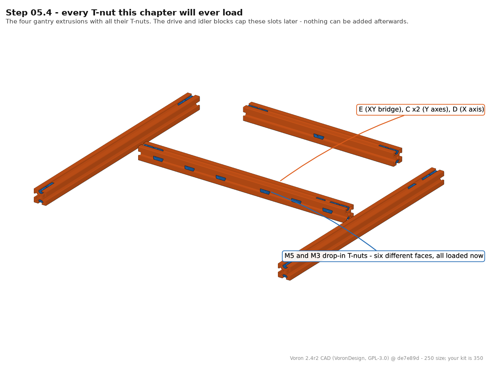
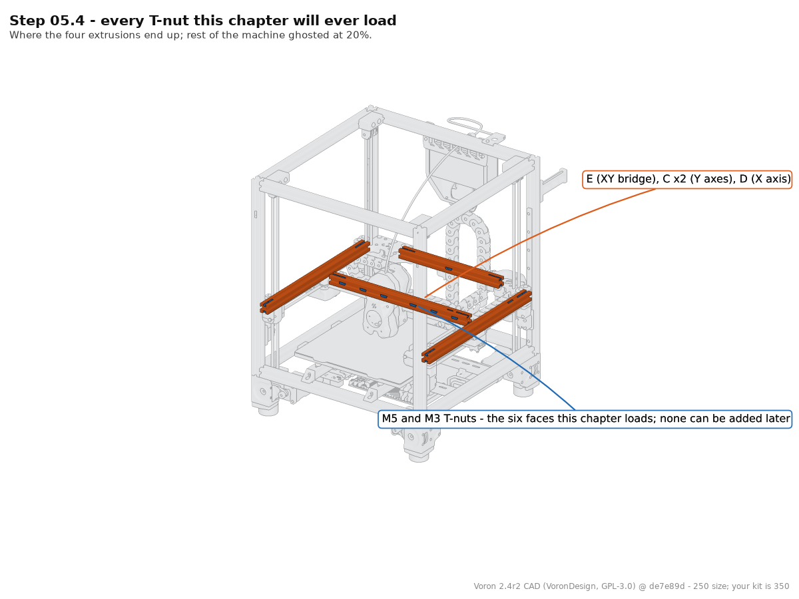

**What you're looking at:** A [roll-in T-nut](16-glossary.md#r) drops into an extrusion slot and rotates a quarter turn to lock, and almost every bolt in this chapter pulls against one. The renders show the four extrusions, E, both C beams and D, with every T-nut already in its slot.

**Parts:** M5 roll-in T-nut ×26, M3 roll-in T-nut ×≈32 (+ ~30 for the backers).

**Do:**

1. Roll one M5 and one M3 T-nut through each face of all four extrusions.
2. Mark any face that binds with tape.
3. Count the fasteners out into labelled trays per the hardware table above.

**Check:** Every T-nut you will use rolls in without force; a forced nut galls the channel.

Tip: The CAD extrusions are the 250 lengths (E 240, C 350, D 330 mm); yours are the 350 set. Which faces carry nuts, and how many, is what transfers.

Source: [LDO Build Notes § Voron 2.4 build FAQ](https://docs.ldomotors.com/en/voron/voron2/build-faq) · [Voron manual p.85](https://github.com/VoronDesign/Voron-2/blob/de7e89d/Manual/Assembly_Manual_2.4r2.pdf#page=85) · [Video: Part 4 @0:36:43](https://www.youtube.com/watch?v=ViB5Ulc9zDI&list=PL0fUJbigELQPqpeGOgHYisG4KaSXVtnNY&t=2203s) · CAD: Voron 2.4r2 STEP @ de7e89d

Pause: ~25 min since the last pause — bench cleared, sub-assemblies laid out left/right, T-nuts test-rolled and counted into trays. Nothing is assembled; leave the trays covered so nothing gets swept off.

---

### Step 05.5 — Load the E extrusion (XY bridge)

**What you're looking at:** The E extrusion is the **XY bridge**: the beam across the back of the gantry that holds the two drive blocks a fixed distance apart and so sets the gantry's width. The eight M5 T-nuts are what those blocks bolt down onto.

**Parts:** E extrusion ×1, M5 T-nut ×8.

**Do:** Slide **eight** M5 T-nuts into the E extrusion: per end, two in the **top** slot and two in the **bottom** slot. None in the side slots. Push them 10–15 mm from the ends, under the drive frame's bolt holes.

**Check:** 4 nuts at each end: 2 top, 2 bottom, threaded holes facing outward, none jammed.

Source: [Voron manual p.85](https://github.com/VoronDesign/Voron-2/blob/de7e89d/Manual/Assembly_Manual_2.4r2.pdf#page=85)

---

### Step 05.6 — Slide the A drive onto the E extrusion

**What you're looking at:** The A drive is the right-hand assembly from Ch 04: a stepper motor with its 20 T pulley, wrapped in a printed frame that carries the belt bearing posts. It slides over the end of the bridge extrusion like a sleeve.

**Parts:** A drive assembly ×1, E extrusion ×1.

**Do:** Push the A drive unit onto one end of the E extrusion, motor pointing **down**. It stays this way up until the flip at Step 05.41. Seat it until the printed part is flush with the extrusion end.

**Check:** Plastic flush to the aluminium end face, and the four M5 T-nuts visible through the drive frame's bolt holes.

Source: [Voron manual p.85](https://github.com/VoronDesign/Voron-2/blob/de7e89d/Manual/Assembly_Manual_2.4r2.pdf#page=85)

---

### Step 05.7 — Bolt the A drive to the bridge

**What you're looking at:** Four M5×10 BHCS pass through the drive frame's flange into the T-nuts underneath. This is what turns the drive block and the bridge into one rigid rear corner; a bolt that spins freely means its T-nut never rolled and the corner is holding on three.

**Parts:** M5×10 BHCS ×4.

**Do:** Drive four M5×10 BHCS, two into the upper slot and two into the lower, to snug, not torqued. If a bolt spins without pulling, its T-nut has not rolled: back it out and reseat the nut.

**Check:** All four bolts bite. The drive frame does not rock on the extrusion.

Source: [Voron manual p.86](https://github.com/VoronDesign/Voron-2/blob/de7e89d/Manual/Assembly_Manual_2.4r2.pdf#page=86)

---

### Step 05.8 — Slide the B drive onto the other end

**What you're looking at:** The B drive is the left-hand counterpart, not an identical copy: its motor pulley sits at 6.5 mm where the A drive's sits at 16.5 mm, which puts the two belts in separate planes so they can cross without touching.

**Parts:** B drive assembly ×1.

**Do:** Push the B drive onto the free end of the E extrusion, motor down, flush to the end face. The motor cable exits must point **towards each other**. If they point apart, the drives are swapped end for end.

**Check:** Both motor cable exits face inboard, both printed parts flush.

Source: [Voron manual p.86](https://github.com/VoronDesign/Voron-2/blob/de7e89d/Manual/Assembly_Manual_2.4r2.pdf#page=86)

---

### Step 05.9 — Bolt the B drive and check the bridge

**What you're looking at:** With both drives bolted on, bridge plus drives is a single rear beam: the fixed back edge of the gantry, and the reference everything else is built to. The plan view is the alignment check.

**Parts:** M5×10 BHCS ×4.

**Do:** Fit the last four M5×10 BHCS, snug. Then sight down the plan view: the two drive frames must be parallel and the two pulley stacks must line up across the bridge, exactly as the lower graphic shows.

**Check:** Drives parallel, no twist along the bridge, all eight M5×10 in and snug. Nothing here is torqued yet.

Source: [Voron manual p.87](https://github.com/VoronDesign/Voron-2/blob/de7e89d/Manual/Assembly_Manual_2.4r2.pdf#page=87)

Pause: ~30 min since the last pause — XY bridge bolted to both drive units, all eight M5×10 snug, none torqued. Lay the assembly flat, motors down. Do not start a Y rail: a rail must be centred and screwed down in one sitting.

---

### Step 05.10 — Load M3 T-nuts for the first Y rail

**What you're looking at:** The two C extrusions are the **Y axes**, the side rails the X beam slides along. Each carries an [MGN9](16-glossary.md#m) linear rail on one face. The M3 T-nuts anchor every rail screw; once the rail is down, no more can go in.

**Parts:** C extrusion ×1, M3 T-nut ×~10.

**Do:** The 400 mm MGN9H `LDO-SLR9H-400Z0` has 20 holes at 20 mm pitch and uses every other one, so about **10** T-nuts. Mark them. Slide the T-nuts into the rail's slot, spread out, leaving ~25 mm free at each end.

**Check:** ~10 nuts, one per marked hole, evenly spread, all rolled flat in the channel, ~25 mm clear at both ends.

Source: [Voron manual p.88](https://github.com/VoronDesign/Voron-2/blob/de7e89d/Manual/Assembly_Manual_2.4r2.pdf#page=88) · [LDO Build Notes § Voron 2.4 build FAQ](https://docs.ldomotors.com/en/voron/voron2/build-faq)

---

### Step 05.11 — Centre and start the first MGN9 rail

**What you're looking at:** An MGN9 rail is a hardened steel guide with a recirculating-ball carriage riding on it. The two printed guides are U-shaped clips that straddle rail and extrusion and hold the rail dead-centred while you start the screws.

**Parts:** MGN9H 400 mm rail ×1, `MGN9_rail_guide_x2` jig ×2, M3×8 SHCS ×~10 (one per marked hole).

**Do:**

1. Tape the carriage mid-rail; peel the Ch 00 end-stop bands off with the rail flat.
2. Sit the rail on the extrusion, centred by an MGN9 guide at each end.
3. Start at the **second hole from each end**.

⚠ **Rev D+ / LDO:** *"Do not use the holes on the ends of the rails, use the second ones from the ends."* [src](https://docs.ldomotors.com/en/voron/voron2/build-faq) — the manual only requires this on 300 mm builds; LDO requires it on every build, because the end holes sit over the M5/M3 nuts of Step 05.14, which share the rail's slot.

**Check:** Rail centred by both jigs; **25 mm** from extrusion end to rail end, measured equal at both ends.

Source: [Voron manual p.88](https://github.com/VoronDesign/Voron-2/blob/de7e89d/Manual/Assembly_Manual_2.4r2.pdf#page=88) · [LDO Build Notes § Voron 2.4 build FAQ](https://docs.ldomotors.com/en/voron/voron2/build-faq) · [LDO rail-grease guide](https://docs.ldomotors.com/guides/rail_grease_guide) · [Video: Part 3 @1:34:58](https://www.youtube.com/watch?v=ii14-2COjuA&list=PL0fUJbigELQPqpeGOgHYisG4KaSXVtnNY&t=5698s)

---

### Step 05.12 — Tighten the first Y rail

**What you're looking at:** The same rail, pulled flat onto the extrusion. Tightening from the centre outwards pushes any bow out to the free ends instead of trapping it in the middle. A rail screwed down bowed is a tight spot the carriage hits on every pass.

**Parts:** the ~10 M3×8 SHCS already started.

**Do:** Run every screw finger-tight, re-check the jigs at both ends and the middle, then tighten from the centre outwards in two passes. No torque is specified: firm and even, not maximum. Re-fit a jig afterwards to confirm nothing walked.

**Check:** No gap under the rail; the jig slides on at both ends and mid-span; the carriage runs the full length freely.

Source: [Voron manual p.88](https://github.com/VoronDesign/Voron-2/blob/de7e89d/Manual/Assembly_Manual_2.4r2.pdf#page=88) · [LDO rail-grease guide](https://docs.ldomotors.com/guides/rail_grease_guide)

Pause: ~30 min since the last pause — first Y rail centred, all its M3×8 screwed down, carriage still on. Tape or stopper the carriage before you walk away.

---

### Step 05.13 — Second Y axis, then load the end M5 T-nuts

**What you're looking at:** The second Y axis is a mirror of the first, not a copy: both rails must face the same way. The M5 T-nuts go into the face **opposite the rail**, the top face in the machine, for the idler and drive-frame flanges.

**Parts:** C extrusion ×1, MGN9H rail ×1, M3 T-nut ×~10, M3×8 SHCS ×~10 — count the holes as before; then M5 T-nut ×8.

**Do:** Repeat Steps 05.10–05.12 on the second C extrusion, both rails facing the same way. Then slide **two M5 T-nuts into each end of each C extrusion**, eight in total, into the slot on the face **opposite the rail**.

**Check:** Two rails equally centred; 2 M5 T-nuts in the top rail-opposite slot at each of the four extrusion ends, none in the rail slot.

Source: [Voron manual p.89](https://github.com/VoronDesign/Voron-2/blob/de7e89d/Manual/Assembly_Manual_2.4r2.pdf#page=89)

---

### Step 05.14 — Load the reserved M5 + M3 pair at each end

**What you're looking at:** Another M5 and M3 nut at each end, in the **rail's own slot**, the underside of the Y axis. They serve the Ch 06 [Z joints](16-glossary.md#z) and the Ch 10 chain and endstop mounts; the idler and drive frames close these slots permanently.

**Parts:** M5 T-nut ×4, M3 T-nut ×4.

**Do:** At each end of each C extrusion add **one M5 T-nut and one M3 T-nut** into the **rail's own slot**, in the bare 25 mm beyond each rail end: M5 outermost, M3 just inboard. Not the top slot.

**Check:** Per end: 2× M5 in the top slot, 1× M5 and 1× M3 in the rail slot beyond the rail end.

Source: [Voron manual p.90](https://github.com/VoronDesign/Voron-2/blob/de7e89d/Manual/Assembly_Manual_2.4r2.pdf#page=90)

---

### Step 05.15 — Stop the carriages running off

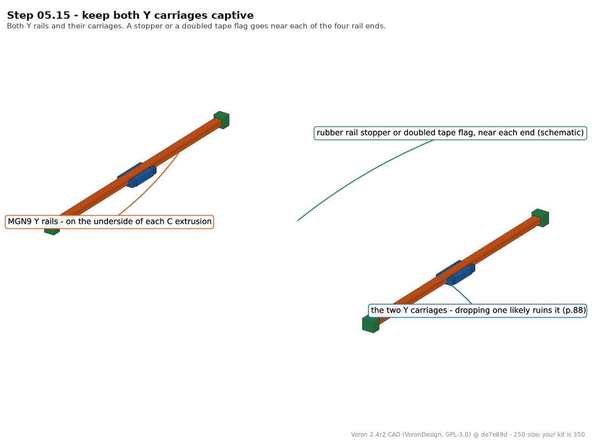
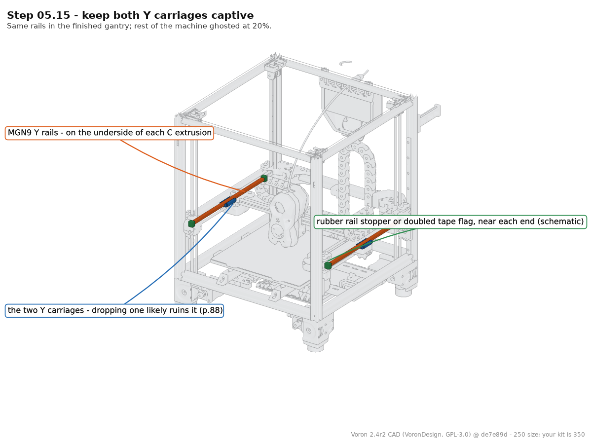

**What you're looking at:** A linear-rail carriage keeps its ball bearings only while it is on the rail: run it off the end and they scatter. The renders show the Y rails on the undersides of the C extrusions, each with one carriage and a stopper near each end.

**Parts:** rubber rail stoppers (LDO-supplied) or masking tape.

**Do:** Fit a rubber rail stopper, or a doubled tape flag, near each end of both Y rails so a carriage cannot run off. Keep the stoppers: LDO reuses them under the Z joints during the Ch 06 install. [src](https://docs.ldomotors.com/en/voron/voron2/build-faq)

**Check:** Each Y carriage is captive; the manual warns that *"dropping the carriage likely irreparably damages it"*.

Tip: The CAD Y rails are MGN9 300 mm; yours are 400 mm (Step 05.10). The stoppers go near the ends wherever those ends are.

Source: [Voron manual p.88](https://github.com/VoronDesign/Voron-2/blob/de7e89d/Manual/Assembly_Manual_2.4r2.pdf#page=88) · [LDO Build Notes § Voron 2.4 build FAQ](https://docs.ldomotors.com/en/voron/voron2/build-faq) · CAD: Voron 2.4r2 STEP @ de7e89d

Pause: ~30 min since the last pause — both Y rails down and tightened, end M5/M3 T-nuts loaded, both carriages captive. Do not fit a backer now: start one only when you can finish it.

---

### Step 05.16 — Unpack and identify the titanium backers

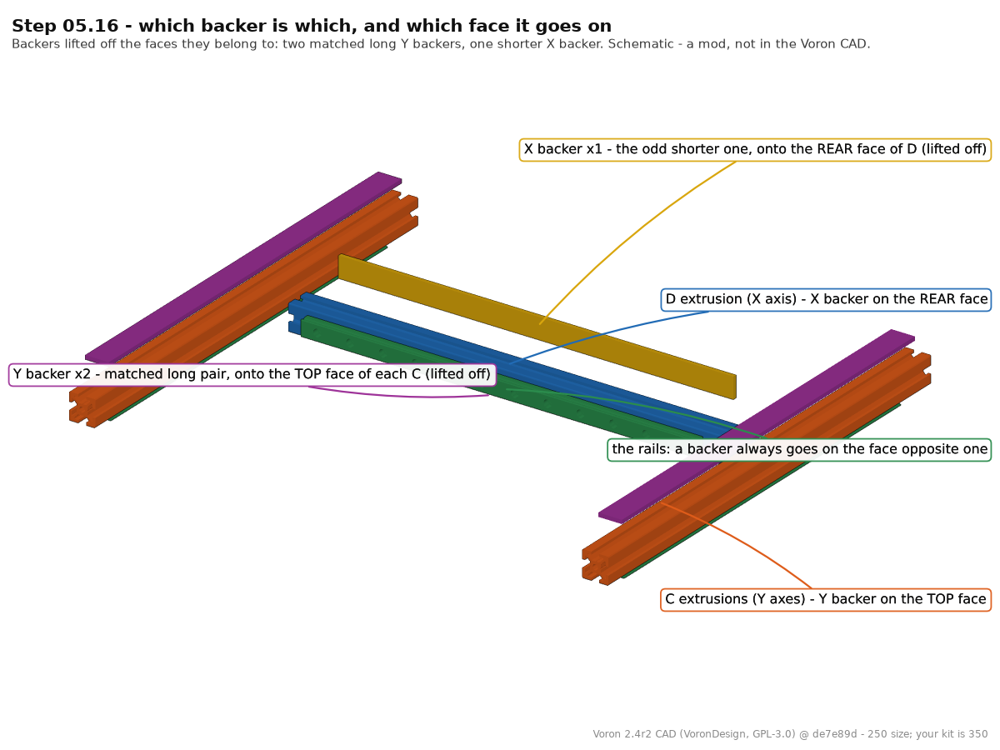

**What you're looking at:** The titanium [backers](16-glossary.md#b) are three flat drilled strips that bolt to the extrusion face **opposite** a linear rail. A steel rail on an aluminium extrusion bows as the chamber heats; the titanium strip opposite pulls the other way and cancels most of the bow.

**Parts:** titanium backer set ×3 (2 long "Y", 1 shorter "X"), M3×8 FHCS ×~20, M3×6 FHCS ×~8, M3 roll-in T-nut ×~30.

**Do:** Sort the three backers: the two matching long pieces are the **Y** backers, the odd shorter one is the **X** backer. Check they are drilled and countersunk, and count the holes in each.

**Check:** 2 Y + 1 X backer, hole counts written down, and you have at least that many M3 T-nuts. The set does not include T-nuts.

Tip: Backer lengths in the picture follow the 250 CAD. Sort by matched pair versus odd one, not by drawn length. A slightly bowed backer straightens as you clamp it down.

Source: [Ti extrusion-backers README (tanaes)](https://github.com/tanaes/whopping_Voron_mods/tree/main/extrusion_backers) · [Fabreeko backer set](https://www.fabreeko.com/products/v2-4-trident-titanium-extrusion-backers) · [West3D backer set](https://west3d.com/products/titanium-backers-for-voron-2-4-trident-3-pack) · CAD: Voron 2.4r2 STEP @ de7e89d

---

### Step 05.17 — Fit the first Y backer

**What you're looking at:** You are working on the bare face of the first Y extrusion, which becomes the top of the Y axis. FHCS are countersunk screws whose heads sink flush into the backer's chamfered holes; a hex key cams out, so use the T10 Torx.

**Parts:** Y backer ×1, M3×8 FHCS ×~10, M3 T-nut ×~10, T10 Torx driver.

**Do:** Turn the first C extrusion rail-down and work on the **opposite face**. Roll the M3 T-nuts in, lay the backer on, and start every screw before tightening any. Tighten **M3×8 FHCS** from the centre outwards, using Torx.

⚠ **Never on the rail face:** the whole point is to put steel on the face *opposite* the rail and cancel the bending couple. Doubling up on the rail side makes the bow worse. [src](https://github.com/tanaes/whopping_Voron_mods/tree/main/extrusion_backers)

**Check:** Backer flat along its whole length, every screw seated in its countersink, and both ends clear of where the idler and drive frames land.

Source: [Ti extrusion-backers README (tanaes)](https://github.com/tanaes/whopping_Voron_mods/tree/main/extrusion_backers) (image [`x_axis.jpeg`](https://raw.githubusercontent.com/tanaes/whopping_Voron_mods/main/extrusion_backers/images/x_axis.jpeg))

---

### Step 05.18 — Fit the second Y backer

**What you're looking at:** The second Y extrusion, same treatment on its rail-opposite face. The first render shows one Y extrusion from underneath, rail face and backer face both in frame. The second shows both Y beams in place: rails underneath on both, backers on top on both.

**Parts:** Y backer ×1, M3×8 FHCS ×~10, M3 T-nut ×~10.

**Do:** Repeat on the second C extrusion, again on the face opposite its rail. Lay the two finished Y assemblies side by side and confirm they are mirrored: rails facing the same way, backers facing the same way.

**Check:** Both backers on the rail-opposite face, both flat. Their cable-chain pilot holes end up on the same side of the machine.

Tip: The CAD C extrusion is 350 mm with a 300 mm rail (250 machine); yours is the 350-kit C with a 400 mm rail.

Source: [Ti extrusion-backers README (tanaes)](https://github.com/tanaes/whopping_Voron_mods/tree/main/extrusion_backers) · CAD: Voron 2.4r2 STEP @ de7e89d

Pause: ~35 min since the last pause — both titanium Y backers screwed down flat on the rail-opposite face. Check nothing is cammed out before you stop.

---

### Step 05.19 — Fit the front idler to the first Y axis

**What you're looking at:** The front idler block is the Ch 04 assembly that turns its belt around at the front corner: a printed frame around a stack of bearings, with a belt-clamp notch moulded into the outside. It slides onto the front end of a Y extrusion.

**Parts:** front idler assembly ×1, M5×16 BHCS ×2.

**Do:**

1. Take the **A idler**: FRONT RIGHT, tall 21.6 mm lower frame, **two M5 holes in the top**.
2. Slide it on the **front** end of the first C extrusion, then drive two M5×16 BHCS into its top T-nuts.

**Check:** Two M5 holes on top, both bolts biting into T-nuts, idler pulled up tight against the extrusion.

Source: [Voron manual p.91](https://github.com/VoronDesign/Voron-2/blob/de7e89d/Manual/Assembly_Manual_2.4r2.pdf#page=91) · [Video: Part 4 @0:06:41](https://www.youtube.com/watch?v=ViB5Ulc9zDI&list=PL0fUJbigELQPqpeGOgHYisG4KaSXVtnNY&t=401s)

---

### Step 05.20 — Check flush and notch orientation

**What you're looking at:** The two front idlers are handed, different parts not mirrored copies: their lower frames differ by 10 mm to match the belt planes. Plastic flush to the end face means the right hand; the notch outboard means the right way up.

**Parts:** none.

**Do:** Sight the joint from the end: the plastic must sit flush with the end face. A wrong-hand idler will not, so take it off rather than pulling it down with bolts. The notch points **away from the idler assembly**.

**Check:** Plastic flush to the extrusion end, notch pointing outboard.

Source: [Voron manual p.92](https://github.com/VoronDesign/Voron-2/blob/de7e89d/Manual/Assembly_Manual_2.4r2.pdf#page=92) · [Video: Part 4 @0:08:32](https://www.youtube.com/watch?v=ViB5Ulc9zDI&list=PL0fUJbigELQPqpeGOgHYisG4KaSXVtnNY&t=512s)

---

### Step 05.21 — Fit the second front idler

**What you're looking at:** The other front corner, with the opposite-hand idler. After this the two Y assemblies are complete as sides of the machine: rail, backer and idler on each.

**Parts:** front idler assembly ×1, M5×16 BHCS ×2.

**Do:** Same on the second Y assembly with the **B idler**: FRONT LEFT, the short 11.6 mm lower frame, which becomes the left-hand Y axis. Push flush, two M5×16 BHCS into the top-slot T-nuts, snug.

**Check:** Both Y assemblies now have an idler at the front, both flush, both notches pointing away from the idler body.

Source: [Voron manual p.93](https://github.com/VoronDesign/Voron-2/blob/de7e89d/Manual/Assembly_Manual_2.4r2.pdf#page=93)

---

### Step 05.22 — Offer both Y axes to the drive units

**What you're looking at:** Now the two sides meet the rear beam. The A drive takes the right-hand side and the B drive the left, so the Ch 04 belt planes reach the corners those belts run to. The result is a U, open at the front.

**Parts:** the two Y assemblies, the bridge + drives assembly.

**Do:** Bring each C extrusion into its drive frame: the **A idler** axis into the A drive, the B-idler axis into the B drive. Push each until the printed frame is flush with the extrusion end, on a flat bench.

**Check:** A U-shaped gantry: A idler with A drive on one beam, B with B, both rails and both backers facing the same way.

Source: [Voron manual p.94](https://github.com/VoronDesign/Voron-2/blob/de7e89d/Manual/Assembly_Manual_2.4r2.pdf#page=94) · [Video: Part 4 @0:34:56](https://www.youtube.com/watch?v=ViB5Ulc9zDI&list=PL0fUJbigELQPqpeGOgHYisG4KaSXVtnNY&t=2096s)

---

### Step 05.23 — Bolt the Y axes to the drives

**What you're looking at:** Two M5×16 per side, down through each drive frame's flange into the rear-end T-nuts, closing the two rear corners. The checks repeat the idler checks: a block not pushed fully home leaves that corner short, and a short corner cannot be squared.

**Parts:** M5×16 BHCS ×4.

**Do:** Two M5×16 BHCS per side, down through the drive frame's top flange into the M5 T-nuts at the rear of each C extrusion, snug only. Plastic flush with the extrusion end, notch pointing **away from the drive assembly**.

**Check:** Four bolts in, both rear joints flush, both notches outboard.

Source: [Voron manual p.95](https://github.com/VoronDesign/Voron-2/blob/de7e89d/Manual/Assembly_Manual_2.4r2.pdf#page=95)

---

### Step 05.24 — Sanity-check the gantry frame, then leave it alone

**What you're looking at:** Four corners, all snug, none torqued. Measuring inside face to inside face at both ends tells you the two Y axes are parallel. The frame can still [rack](16-glossary.md#r), deforming into a parallelogram, and that freedom is deliberate: Ch 06 squares it in the frame.

**Parts:** none.

**Do:** Lay the U-frame flat and measure from the inside face of one Y extrusion to the other, at the bridge and again at the idlers. A difference means a corner block is not pushed home.

**Check:** Front and rear spacing equal on the rule. **Do not square or lock the gantry now**; Ch 06 does it in the frame.

Source: [Voron manual p.95](https://github.com/VoronDesign/Voron-2/blob/de7e89d/Manual/Assembly_Manual_2.4r2.pdf#page=95)

Pause: ~40 min since the last pause — front idlers and both Y axes bolted to the drives, gantry frame sanity-checked and deliberately left slightly loose. Do not tighten anything further; do not start an XY joint (each joint is a bearing stack you must finish in one go).

---

### Step 05.25 — Seat the M5 nuts in both XY joints

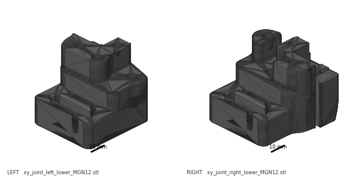

**What you're looking at:** The [XY joints](16-glossary.md#x) are the two printed blocks that ride on the Y carriages. Each is a thick **lower** body, ~34 mm, plus a thin **upper** plate, ~16 mm. The **right** lower body has a moulded wire channel; the **left** is plain.

**Parts:** `xy_joint_left_lower_MGN12` ×1, `xy_joint_right_lower_MGN12` ×1, M5 nut ×6.

**Do:** Drop **three M5 nuts** into the hex pockets of each XY joint body, flats aligned to the pocket. Push each fully home with a spare M5 bolt; a proud nut stops the joint closing and cracks the pocket.

**Check:** Three nuts per joint, all flush in their pockets, none rotated out of the hex.

Source: [Voron manual p.96](https://github.com/VoronDesign/Voron-2/blob/de7e89d/Manual/Assembly_Manual_2.4r2.pdf#page=96) · [Video: Part 5 @1:18:07](https://www.youtube.com/watch?v=hTKCBrk36R0&list=PL0fUJbigELQPqpeGOgHYisG4KaSXVtnNY&t=4687s) (differs: substitutes Trident-repo parts still in beta at the time)

---

### Step 05.26 — Start the right XY joint bearing stack

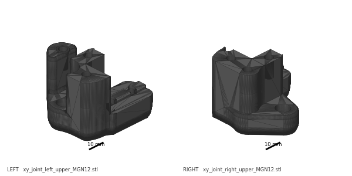

**What you're looking at:** The two upper plates, left and right, carry the same tell as the lower bodies: the right-hand plate has the endstop wire channel. The stack you build on the M5×40 is the belt corner: two F695 flanged bearings, flange-out, between two brass [precision spacers](16-glossary.md#p).

**Parts:** `xy_joint_right_upper_MGN12` ×1, M5×40 SHCS ×1, F695 bearing ×2, M5 precision spacer ×2.

**Do:**

1. Keep the right-hand joint's moulded **cable path** clear and pointing as the page shows.
2. Push an M5×40 SHCS up through the upper plate.
3. Thread on **bottom to top**: spacer, F695 **flange down**, F695 **flange up**, spacer.

⚠ **Rev D+ / LDO:** the manual's "M5 Shim" is the brass **M5 precision spacer** in this kit, here and everywhere else unless a page is explicitly noted otherwise. [src](https://docs.ldomotors.com/en/voron/voron2/build-faq)

**Check:** Four items on the bolt, reading spacer, flange, plain, plain, flange, spacer from the side; bearings spin freely, cable channel clear.

Source: [Voron manual p.97](https://github.com/VoronDesign/Voron-2/blob/de7e89d/Manual/Assembly_Manual_2.4r2.pdf#page=97) · [LDO Build Notes § Voron 2.4 build FAQ](https://docs.ldomotors.com/en/voron/voron2/build-faq) · [Video: Part 3 @1:27:47](https://www.youtube.com/watch?v=ii14-2COjuA&list=PL0fUJbigELQPqpeGOgHYisG4KaSXVtnNY&t=5267s) (differs: pre-release kit had no titanium rail backers)

---

### Step 05.27 — Close the right XY joint

**What you're looking at:** The lower body comes down over the bearing stack and the M5×40's thread picks up one of its seated M5 nuts. The two halves must close plastic-to-plastic with no gap; a bearing pinched between them drags on the belt until Ch 07 finds it.

**Parts:** `xy_joint_right_lower_MGN12` ×1 (with its three M5 nuts).

**Do:** Bring the joint body down over the bearing stack so the M5×40's thread enters the nut pocket you loaded at Step 05.25. The two halves must meet with no gap and no bearing pinched between them.

**Check:** Halves closed flat, bolt engaged in its nut, bearing stack still turning by finger.

Source: [Voron manual p.97](https://github.com/VoronDesign/Voron-2/blob/de7e89d/Manual/Assembly_Manual_2.4r2.pdf#page=97) · [Video: Part 3 @1:28:26](https://www.youtube.com/watch?v=ii14-2COjuA&list=PL0fUJbigELQPqpeGOgHYisG4KaSXVtnNY&t=5306s) (differs: pre-release kit had no titanium rail backers)

---

### Step 05.28 — Bolt the right XY joint together

**What you're looking at:** The other two M5×40 bolts. Three bolts into three captive nuts turn the two printed halves into a single rigid block, which it has to be: belt tension in Ch 07 pulls hard on this corner and tries to prise it open.

**Parts:** M5×40 SHCS ×2.

**Do:** Add the two remaining M5×40 SHCS from the top into the other two M5 nuts, then tighten all three evenly and **firm**: they thread into steel nuts and clamp the joint into one rigid part.

**Check:** No light between the halves anywhere. The bearing stack still spins.

Source: [Voron manual p.98](https://github.com/VoronDesign/Voron-2/blob/de7e89d/Manual/Assembly_Manual_2.4r2.pdf#page=98) · [Video: Part 3 @1:21:27](https://www.youtube.com/watch?v=ii14-2COjuA&list=PL0fUJbigELQPqpeGOgHYisG4KaSXVtnNY&t=4887s) (differs: pre-release kit had no titanium rail backers)

---

### Step 05.29 — Fit the right joint's 20-tooth idler

**What you're looking at:** The 20 T idler is a small toothed pulley running on its own bearing; the toothed side of the belt wraps it. Its M5×40 threads straight into plastic and only holds the idler in place, so it stops the instant the head seats.

**Parts:** GT2 20-tooth idler ×1, M5×40 SHCS ×1.

**Do:** Drop the 20T idler into its pocket and run an M5×40 SHCS down through it. This bolt threads **directly into plastic** and only positions the idler.

⚠ Do not over-tighten. Stop the moment the head seats and the idler still spins freely; a crushed pocket here shows up as belt noise and premature wear in Ch 07.

**Check:** Idler spins under a fingernail flick with no drag and no wobble.

Source: [Voron manual p.98](https://github.com/VoronDesign/Voron-2/blob/de7e89d/Manual/Assembly_Manual_2.4r2.pdf#page=98) · [Video: Part 3 @1:25:58](https://www.youtube.com/watch?v=ii14-2COjuA&list=PL0fUJbigELQPqpeGOgHYisG4KaSXVtnNY&t=5158s) (differs: pre-release kit had no titanium rail backers)

Pause: ~25 min since the last pause — right XY joint fully built, bolted and its 20T idler fitted and spinning. Leave the left joint's parts bagged; do not part-build it.

---

### Step 05.30 — Build the left XY joint

**What you're looking at:** The left joint, built exactly as the right was. The tell is the wire channel: only the right-hand pair has one. If the parts in your hand have a channel, put them down; they are the right joint's.

**Parts:** `xy_joint_left_upper_MGN12` ×1, `xy_joint_left_lower_MGN12` ×1, M5×40 SHCS ×1, F695 bearing ×2, M5 precision spacer ×2.

**Do:** Mirror of Steps 05.26–05.27: M5×40 up through the upper plate, then spacer, F695 **flange down**, F695 **flange up**, spacer. Close the joint body over it into its M5 nut. The left parts have no cable channel.

**Check:** Left and right joints sit as mirror images on the bench, not as two of the same hand.

Source: [Voron manual p.99](https://github.com/VoronDesign/Voron-2/blob/de7e89d/Manual/Assembly_Manual_2.4r2.pdf#page=99)

---

### Step 05.31 — Bolt the left joint and fit its idler

**What you're looking at:** Both joints finished and identical in content: 4× M5×40, 2× F695 between two precision spacers, and one 20 T idler each. Everything meant to spin must still spin freely; drag here becomes belt noise once the belts go on.

**Parts:** M5×40 SHCS ×3, GT2 20-tooth idler ×1.

**Do:** Two M5×40 SHCS from the top into the remaining M5 nuts, tightened evenly and firm into steel. Then the 20T idler and its own M5×40 into plastic: snug only, must spin.

**Check:** Both joints complete: 4× M5×40 each, 2× F695 each, two spacers each, one 20T idler each, all bearing stacks and both idlers free.

Source: [Voron manual p.100](https://github.com/VoronDesign/Voron-2/blob/de7e89d/Manual/Assembly_Manual_2.4r2.pdf#page=100) · [Video: Part 3 @1:31:05](https://www.youtube.com/watch?v=ii14-2COjuA&list=PL0fUJbigELQPqpeGOgHYisG4KaSXVtnNY&t=5465s) (differs: pre-release kit had no titanium rail backers)

Pause: ~20 min since the last pause — both XY joints built, bolted and idler-fitted, sitting loose on the bench. Do not slide them onto the X extrusion yet.

---

### Step 05.32 — Load M3 T-nuts for the X rail

**What you're looking at:** The D extrusion is the **X beam**, the one the toolhead runs along. It carries an [MGN12](16-glossary.md#m) rail, wider than the Y rails because it holds the toolhead off one carriage. Same T-nut rule: load them before the XY joints cap the ends.

**Parts:** D extrusion ×1, M3 T-nut ×~8.

**Do:** The **400 mm** MGN12H `LDO-SLR12H-400Z1` has ~16 holes at 25 mm pitch and uses every other one, so about **8** T-nuts. Mark them. Slide the T-nuts into the D extrusion's rail slot, leaving about 15 mm clear at each end.

**Check:** ~8 nuts in, one per marked hole, flat, with clear slot at both ends.

Source: [Voron manual p.101](https://github.com/VoronDesign/Voron-2/blob/de7e89d/Manual/Assembly_Manual_2.4r2.pdf#page=101)

---

### Step 05.33 — Centre and fit the MGN12 rail

**What you're looking at:** Same centre-and-tighten procedure as the Y rails, with the larger MGN12 guides. This is the rail that decides print quality across X: it must sit centred along its whole length and pull down flat with no gap underneath.

**Parts:** MGN12H 400 mm rail ×1, `MGN12_rail_guide_x2` jig ×2, M3×8 SHCS ×~8 (one per marked hole).

**Do:** Tape the carriage mid-rail; peel its Ch 00 bands off with the rail flat. Sit the rail on the D extrusion, centred by an MGN12 guide at each end. Start at the **second hole from each end**, then tighten centre-outwards.

⚠ **Rev D+ / LDO:** second hole in from each end here too, not the end hole. [src](https://docs.ldomotors.com/en/voron/voron2/build-faq)

**Check:** **15 mm** of bare extrusion beyond each rail end, equal; the carriage runs the rail with no tight spot and no gap underneath.

Source: [Voron manual p.101](https://github.com/VoronDesign/Voron-2/blob/de7e89d/Manual/Assembly_Manual_2.4r2.pdf#page=101) · [LDO Build Notes § Voron 2.4 build FAQ](https://docs.ldomotors.com/en/voron/voron2/build-faq) · [LDO rail-grease guide](https://docs.ldomotors.com/guides/rail_grease_guide) · [Video: Part 3 @1:34:46](https://www.youtube.com/watch?v=ii14-2COjuA&list=PL0fUJbigELQPqpeGOgHYisG4KaSXVtnNY&t=5686s)

---

### Step 05.34 — Fit the X backer to the rear face

**What you're looking at:** The X backer goes on the rear face, the one opposite the rail, same as on the Y axes: steel on one face, titanium on the other, the bows cancelling. The top face stays bare for the XY joints and cable bridge.

**Parts:** X backer ×1, M3×6 FHCS ×~8, M3 T-nut ×~8.

**Do:** Turn the D extrusion so the MGN12 rail faces you. The backer goes on the **rear face, opposite the rail**, not on top. Roll the T-nuts in, start every screw, then tighten centre-outwards. Use **M3×6 FHCS for X**.

⚠ *"For X axes, in most cases you'll want to install them on the rear of the X extrusion, opposite the MGN12 rail… If you have a single MGN12 but decide to put a backer on top, you will be actively contributing to the problem of bimetallic expansion!"* [src](https://github.com/tanaes/whopping_Voron_mods/tree/main/extrusion_backers)

**Check:** Backer on the face opposite the MGN12, flat, all screws **M3×6** and seated; the top face of the D extrusion still clear.

Source: [Ti extrusion-backers README (tanaes)](https://github.com/tanaes/whopping_Voron_mods/tree/main/extrusion_backers) (image [`fusion_x_chainmount.png`](https://raw.githubusercontent.com/tanaes/whopping_Voron_mods/main/extrusion_backers/images/fusion_x_chainmount.png))

---

### Step 05.35 — Check backer clearance for the cable chain

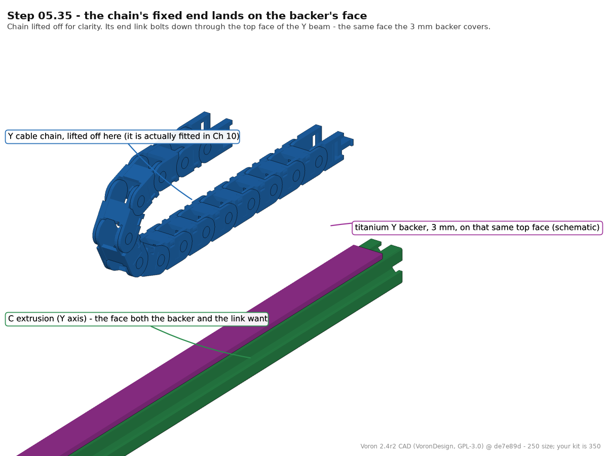
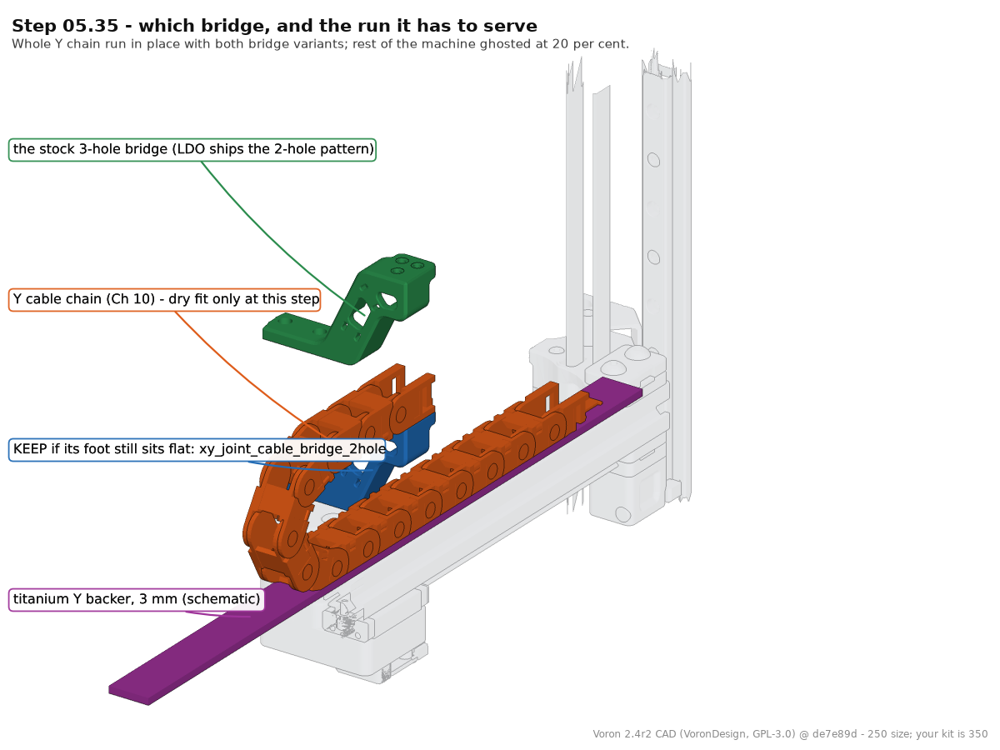

**What you're looking at:** A dry fit. The backers carry pilot holes for the cable chain's end link, and a 3 mm titanium strip may now hold the printed bridge's flat foot off the extrusion. The renders show the chain's fixed end and its run to the bridge.

**Parts:** cable-chain end link (dry fit only).

**Do:** Offer the chain's end link up to the X and Y backers and see whether the holes line up and the stock printed bridge sits flat. Do not fit the chain; you are only deciding which bridge to keep.

**Check:** You know whether you will use `[a]_xy_joint_cable_bridge_2hole` or the raised `XY_cable_chain_bridge-Igus-3mm_backer`. "Igus" = the 2-hole pattern LDO ships. [src](https://docs.ldomotors.com/guides/cable_chain_guide)

Tip: The CAD is the 250 machine's; a 350 chain run is longer. Only the face the end link lands on transfers. The raised bridge is a mod part.

Source: [Ti extrusion-backers README (tanaes)](https://github.com/tanaes/whopping_Voron_mods/tree/main/extrusion_backers) · [LDO cable-chain guide](https://docs.ldomotors.com/guides/cable_chain_guide) · CAD: Voron 2.4r2 STEP @ de7e89d

Pause: ~35 min since the last pause — MGN12 rail centred and screwed down on the X extrusion, titanium X backer on the rear face, cable-chain clearance checked. Carriage taped captive.

---

### Step 05.36 — Load the D extrusion's M5 T-nuts

**What you're looking at:** Six M5 T-nuts in two slots of the X beam: four in the top face the XY joints bolt onto, two in the bottom face for the bolts that come up from underneath. They clamp each joint from both sides so it cannot rock.

**Parts:** M5 T-nut ×6.

**Do:** In the **top** slot, at 90° to the rail face, put **two M5 T-nuts at each end**, four in total. In the **bottom** slot put **one at each end**, two in total. Nothing in the rail or backer slots.

**Check:** 4 + 2 = six M5 T-nuts. The two singles line up with the through-holes the M5×30 bolts will use from underneath.

Source: [Voron manual p.102](https://github.com/VoronDesign/Voron-2/blob/de7e89d/Manual/Assembly_Manual_2.4r2.pdf#page=102)

---

### Step 05.37 — Slide both XY joints onto the X extrusion

**What you're looking at:** Each joint's pocket slides over an end of the X beam. This is the first time the X axis exists as one object: beam, rail, backer and both belt corners.

**Parts:** left XY joint ×1, right XY joint ×1.

**Do:** Push a joint onto each end of the D extrusion: left joint to the left end, right joint, the one with the endstop cable channel, to the right. Seat each until the extrusion bottoms out in the joint's pocket.

**Check:** Both joints fully home; the two 20T idlers and the two bearing stacks all face the same way along the extrusion.

Source: [Voron manual p.103](https://github.com/VoronDesign/Voron-2/blob/de7e89d/Manual/Assembly_Manual_2.4r2.pdf#page=103)

---

### Step 05.38 — Bolt the joints from above, with the cable bridge

**What you're looking at:** Bolts through the top of each joint into the beam's top-slot T-nuts. On the right, the cable bridge's foot is sandwiched under the heads, so that side needs the longer M5×16. They stay slightly loose: Ch 06 squares the gantry by nudging these joints.

**Parts:** M5×10 BHCS ×2, `[a]_xy_joint_cable_bridge_2hole` ×1, M5×16 BHCS ×2.

**Do:**

1. **Left** joint: two M5×10 BHCS down into the top-slot T-nuts.
2. **Right** joint: lay the cable bridge's foot over the same two holes and bolt through both with the longer **M5×16 BHCS**.
3. *"LEAVE SLIGHTLY LOOSE"*: lightly tighten.

**Check:** Bridge foot flat with its arm standing up on the right-hand side; four bolts started and lightly tightened, none torqued.

Source: [Voron manual p.104](https://github.com/VoronDesign/Voron-2/blob/de7e89d/Manual/Assembly_Manual_2.4r2.pdf#page=104)

---

### Step 05.39 — Bolt the joints from below

**What you're looking at:** Two more bolts, this time up into the joints from underneath the beam, each with a black washer to spread the load across the plastic. Pulled from both faces the joint cannot rock, but stays lightly tightened until squaring.

**Parts:** M5×30 BHCS ×2, black M5 washer ×2.

**Do:** Turn the X assembly over and run an M5×30 BHCS with a washer under its head up into each of the single M5 T-nuts from Step 05.36. Light tightening again: the joint stays slightly loose until Ch 06.

⚠ **Rev D+ / LDO (p.104):** *"Use the black M5 Washer instead of the M5 Shim cause it looks nicer."* This page is the documented exception to the precision-spacer substitution. [src](https://docs.ldomotors.com/en/voron/voron2/build-faq)

**Check:** Two M5×30 in with black washers under the heads, both lightly tightened.

Source: [Voron manual p.104](https://github.com/VoronDesign/Voron-2/blob/de7e89d/Manual/Assembly_Manual_2.4r2.pdf#page=104) · [LDO Build Notes § Voron 2.4 build FAQ](https://docs.ldomotors.com/en/voron/voron2/build-faq)

---

### Step 05.40 — Check the X axis assembly

**What you're looking at:** The finished X axis, checked against the drawing. You are sighting for each belt's two corners at the same height: a corner a millimetre out of plane feeds the belt into the drive pulley at an angle and chews its edge.

**Parts:** none.

**Do:**

1. **Left** joint: F695 stack upper, 20T idler lower. **Right** joint: 20T upper, F695 lower.
2. Sight along the extrusion: left 20T level with right F695, left F695 level with right 20T. Spin all four.

**Check:** Left 20T level with right F695, left F695 level with right 20T; nothing binds; the MGN12 carriage still slides freely and is still taped.

Source: [Voron manual p.105](https://github.com/VoronDesign/Voron-2/blob/de7e89d/Manual/Assembly_Manual_2.4r2.pdf#page=105)

Pause: ~35 min since the last pause — both XY joints bolted to the X extrusion top and bottom, cable bridge on, assembly checked against p.105. Still motors-down, the way it runs. The flip is the next step — do not attempt it alone.

---

### Step 05.41 — Turn the gantry upside down

**What you're looking at:** So far the gantry has been built the way it runs: motors hanging below the bridge, Y rails underneath. Now it goes **upside down**, motors up and both Y rails facing up, so the X axis can be lowered onto the carriages.

**Parts:** none.

**Do:** Turn the gantry over so the A/B motors point **up** and both Y rails face you. **The gantry is now upside down** and stays that way through Step 05.48. Get help: it is large and the drives are heavy.

**Check:** Motors up, both Y rails and carriages up, nothing dropped on a bearing stack. Left and right are now swapped from where you stand.

Source: [Voron manual p.106](https://github.com/VoronDesign/Voron-2/blob/de7e89d/Manual/Assembly_Manual_2.4r2.pdf#page=106)

---

### Step 05.42 — Insert the X axis at an angle

**What you're looking at:** The X axis drops onto the two Y carriages, the sliding blocks on the Y rails. Tilting it lets you land one joint at a time; lowering it flat means fighting both carriages at once, and a carriage shoved off its rail is ruined.

**Parts:** the X axis assembly.

**Do:** Tilt the X axis in, one joint onto its Y carriage then the other. The right joint, with the cable bridge, goes on the **A drive** axis, on your **left** with the gantry inverted.

**Check:** Both joints square on their carriages, bolt holes lined up, nothing fouling the Y extrusion; the MGN12 rail faces the idler end.

Source: [Voron manual p.106](https://github.com/VoronDesign/Voron-2/blob/de7e89d/Manual/Assembly_Manual_2.4r2.pdf#page=106)

---

### Step 05.43 — Bolt the XY joints to the Y carriages

**What you're looking at:** M3×16 down through each XY joint into the threaded holes in the Y carriage below it. The right joint gets only two: the XY endstop pod fitted at wiring shares its other two holes. The pod's own bolts are **M3×30**.

**Parts:** M3×16 SHCS ×6.

**Do:** The **left** joint takes all four M3×16 SHCS. The **right** joint takes **two only**: *"2X BOLT ONLY: the remaining bolts will be installed during the end-stop installation."* Take all six to snug.

**Check:** 4 bolts on one joint, 2 on the other, and 2 M3×16 left over as spares; Step 05.46 bags the pod's 2× M3×30.

Source: [Voron manual p.106](https://github.com/VoronDesign/Voron-2/blob/de7e89d/Manual/Assembly_Manual_2.4r2.pdf#page=106)

---

### Step 05.44 — Run the X axis end to end

**What you're looking at:** The first real function test of the gantry as a mechanism. Even, light resistance the whole way means both rails are centred and both carriages sit square. Resistance growing towards one end is [racking](16-glossary.md#r), a Ch 06 problem, not a rail problem.

**Parts:** none.

**Do:** Push the X axis slowly end to end several times, a hand on each XY joint. A tight spot means a rail is not centred; rising stiffness means racking. Do **not** loosen rails to fix it.

**Check:** Full travel both directions, no notch, no rising resistance, both Y carriages moving together. Racking is normal and is corrected in Ch 06.

Source: [Voron manual p.106](https://github.com/VoronDesign/Voron-2/blob/de7e89d/Manual/Assembly_Manual_2.4r2.pdf#page=106)

Pause: ~30 min since the last pause — gantry upside down (motors up), X axis in and bolted to both Y carriages, running end to end without binding. It stays upside down into Ch 06. Belts still bagged, XY joint bolts still only lightly tightened — leave both alone.

---

### Step 05.45 — Stage the X-carriage frame halves

**What you're looking at:** The [X carriage](16-glossary.md#x) is the two-part frame that clamps onto the MGN12 carriage and becomes the mounting plate for the whole toolhead. These are the Clockwork-2 halves, handed so they nest only one way; older X-carriage parts look the same and will not fit.

**Parts:** `x_frame_V2TR_MGN12_left` ×1, `x_frame_V2TR_MGN12_right` ×1, `probe_retainer_bracket` ×1.

**Do:** Offer the two carriage halves to the MGN12 carriage and confirm the bolt pattern matches before you commit any heat-set inserts. Then bag them, labelled, with the probe retainer.

⚠ **Rev D+ / LDO (p.129–130):** *"If you are building Clockwork 2 double-check that you have the correct X-Carriage and follow the instructions in the Stealthburner manual."* [src](https://docs.ldomotors.com/en/voron/voron2/build-faq) The carriage goes on with the belts in Ch 07; the toolhead itself is Ch 08.

**Check:** Bolt pattern matches the MGN12 carriage; both halves and the probe retainer bagged and labelled for Ch 07.

Source: [Voron manual p.129](https://github.com/VoronDesign/Voron-2/blob/de7e89d/Manual/Assembly_Manual_2.4r2.pdf#page=129) · [LDO Build Notes § Voron 2.4 build FAQ](https://docs.ldomotors.com/en/voron/voron2/build-faq) · [Video: Part 5 @1:05:47](https://www.youtube.com/watch?v=hTKCBrk36R0&list=PL0fUJbigELQPqpeGOgHYisG4KaSXVtnNY&t=3947s) (differs: substitutes Trident-repo parts still in beta at the time · MGN12 X was a mod then; it is stock on this kit) · CAD: Voron 2.4r2 STEP @ de7e89d

---

### Step 05.46 — Bag what belongs to later chapters

**What you're looking at:** The [XY endstop pod](16-glossary.md#x) is the orange box carrying the X and Y limit switches on the right XY joint. The renders show both either/or choices pulled apart: the D2F pod and 2-hole bridge are kept, the hall-effect pod and 3-hole bridge are not.

**Parts:** `[a]_endstop_pod_D2F_switch` ×1, M3×30 SHCS ×2 (p.164 — verify against the bag), the 2 spare M3×16 kept back earlier, `[a]_cable_cover`, the unused cable bridge variant.

**Do:**

1. Bag the endstop pod with **2× M3×30 SHCS** and the two spare M3×16 from Step 05.43, labelled.
2. Bag the `[a]_cable_cover` and the unused bridge variant separately.

⚠ **Rev D+ / LDO:** *"Our kit includes the XY microswitch PCB, print [a]_endstop_pod_D2F_switch instead of [a]_endstop_pod_hall_effect."* [src](https://docs.ldomotors.com/en/voron/voron2/printed_part_guide_rev_d)

**Check:** Two labelled bags; nothing loose on the bench that Ch 06 or Ch 07 will need.

Source: [LDO printed-parts guide (Rev D)](https://docs.ldomotors.com/en/voron/voron2/printed_part_guide_rev_d) · CAD: Voron 2.4r2 STEP @ de7e89d

---

### Step 05.47 — Stop here: no belts, no squaring

**What you're looking at:** The gantry is complete as a mechanism and deliberately unfinished as a machine. Belts and squaring are held back because the official squaring procedure *begins* by releasing A/B belt tension; tension it now and Ch 06 simply undoes it.

**Parts:** none.

**Do:** Do not cut, route or tension the A/B belts, do not tighten the XY joints "properly", and do not square the gantry. Ch 06 squares it **in the frame, with A/B tension released and the lower Z joints dropped**.

**Check:** A/B belts still in their bag. XY joint bolts still only lightly tightened.

Source: [Voron manual p.107](https://github.com/VoronDesign/Voron-2/blob/de7e89d/Manual/Assembly_Manual_2.4r2.pdf#page=107) · [Voron docs § V2 Gantry Squaring](https://docs.vorondesign.com/build/mechanical/v2_gantry_squaring.html)

---

### Step 05.48 — Log the measurements

(no image — see text)

**What you're looking at:** The paperwork you will want in Ch 06. The rail overhangs are the evidence that each rail is centred; the two Y-to-Y spacings are the baseline you measure against once the gantry has been squared in the frame.

**Parts:** pen; the table below.

**Do:** Record the rail overhangs you measured, Y and X at both ends, the two Y-to-Y spacings, which face each backer is on, and anything you left deliberately loose.

| Measurement | Target | Yours | Notes |
|---|---:|---|---|
| Y rail overhang, extrusion 1 — end A / end B | 25 / 25 mm | | |
| Y rail overhang, extrusion 2 — end A / end B | 25 / 25 mm | | |
| X rail overhang — end A / end B | 15 / 15 mm | | |
| Inside Y-to-Y spacing at the bridge | — | | |
| Inside Y-to-Y spacing at the idlers | = at bridge | | |
| Backer face — Y1 / Y2 / X | top / top / rear | | |
| M3×30 SHCS bagged for the endstop pod (p.164) | 2 | | |

**Check:** Numbers written down, not "looked fine". You will want the Y-to-Y spacings when the gantry is squared in Ch 06.

Source: [Voron manual p.107](https://github.com/VoronDesign/Voron-2/blob/de7e89d/Manual/Assembly_Manual_2.4r2.pdf#page=107) · [survey §7.5](../voron-build-instructions-survey.md)

---

## Checkpoint 05

- [ ] E extrusion joined to both drive units with 8× M5×10 BHCS; drives parallel, no twist
- [ ] Both MGN9 rails centred and tightened, first screw in the **second hole** from each end, overhang equal at both ends
- [ ] MGN12 rail centred and tightened, second hole in, overhang equal at both ends
- [ ] Every carriage retained by a stopper or tape; none dropped
- [ ] At each of the four C-extrusion ends: 2× M5 in the top (backer) slot, 1× M5 + 1× M3 in the rail slot beyond the rail end
- [ ] **Titanium backers on the face opposite the rail** — top of both Y extrusions, rear of the X extrusion — flat, all screws seated, none cammed out
- [ ] Both front idlers and both rear drive joints flush with the extrusion ends, notches pointing away from the assembly
- [ ] Both XY joints: 3 M5 nuts, 4 M5×40 SHCS, 2 F695 flange-out between 2 precision spacers, 1 free-spinning 20T idler; the three joint bolts firm, the idler bolt snug
- [ ] Cable bridge fitted to the **right** XY joint with M5×16 BHCS; left joint on M5×10
- [ ] M5×30 BHCS with **black M5 washers** underneath, both lightly tightened
- [ ] XY joints bolted to the Y carriages: 4 bolts one side, 2 the other; **2× M3×30 SHCS bagged** with the endstop pod (p.164), the 2 unused M3×16 kept as spares
- [ ] X axis runs the full Y travel with no tight spot
- [ ] A/B belts still unopened; nothing squared, nothing torqued down
- [ ] Gantry is **upside down** (motors up, rails up) with the right joint (bridge, endstop channel) on the A-drive side; it is turned back at Ch 06 Step 06.11

## Common mistakes

- **Fitting the backers after the gantry is built.** Their T-nut slots are capped by the idler and drive frames, and the backer face is buried once the gantry is in the frame. It is a ~3 h teardown to fix (survey §5.2 W2).
- **Putting the X backer on top of the X extrusion.** With a single MGN12 on the front face, a top backer adds to the bimetallic bow instead of cancelling it, and it blocks the top slot the XY joints and cable bridge bolt into.
- **Using the rails' end holes.** The manual only forbids it on 300 mm builds; LDO forbids it on all of them, because the end holes sit exactly where the M5/M3 T-nuts of p.89–90 and p.102 have to live. Caught late, the rail comes off and goes back on.
- **Forgetting the reserved T-nuts at p.90.** Nothing in this chapter uses them, so they are easy to skip — and Ch 06's Z joints and Ch 10's chain hardware then have nowhere to bolt to. Count per slot — 2× M5 in the top slot, 1× M5 + 1× M3 in the rail slot — before the idlers go on.
- **One spacer in an XY joint stack, or a flange facing inward.** The pair drops 1 mm and its inner races are never clamped, or there is no belt channel at all; found in Ch 07 as belt rub, and both joints come apart again (3× M5×40 + idler each). Fix: spacer, flange down, flange up, spacer — read it from the side before closing the joint (p.97, p.99).
- **Torquing the XY joints and "squaring" on the bench.** The joints are meant to stay slightly loose and the gantry is squared in the frame with the belts slack. Tightening now, or tensioning belts now, costs a full de-tension in Ch 07 (survey §5.2 W1).
- **Over-tightening the 20T idler bolts.** They thread straight into plastic and only locate the idler. Crushed pockets show up later as belt noise you will blame on tension.

## Next

Ch 06 — Z axis: gantry install, Z belts and gantry squaring (manual p.108–123, plus the official 16-step squaring procedure); gated on batch **B05** (Z joints + Z chain, 1 plate, 6.4 h) — start it now if it is not already printed. Keep the rubber rail stoppers: LDO uses them under the Z joints to rest the gantry during install.

Source: [survey §7.5](../voron-build-instructions-survey.md) · [Voron manual p.107](https://github.com/VoronDesign/Voron-2/blob/de7e89d/Manual/Assembly_Manual_2.4r2.pdf#page=107)

Pause: ~25 min since the last pause — gantry complete and still upside down (motors up), measurements written down, Ch 06/07 parts bagged and labelled. Do not tension belts and do not square the gantry: both are Ch 06/07 and both would be undone.
