# Chapter 06 — Z axis (and Chapter 06b — Gantry squaring)

Hangs the finished gantry on the four Z joints, belts all four Z corners, and gets the gantry roughly square to the frame — after which the machine can move in Z. **Part B (Ch 06b) is the real gantry squaring and cannot be done here: it needs motor control, so it runs after Chapter 13.**

**Time:** 3.5–5.0 h hands-on for Part A, first build (survey §7.2). Part B adds ~1 h hands-on plus a 1½–2 h heat soak you do not sit through.

**Prerequisites:**
- **Ch 02 — Z drives, Z idlers, Z rails, deck.** Four Z drives built and bolted in, four Z idlers at the tops of the uprights, four MGN9 Z rails on the uprights with their carriages on, 16T/20T pulley stack verified, set screws threadlocked (survey §5.2 W12). The deck panel is in.
- **Ch 05 — Gantry.** Complete gantry: X and Y extrusions, XY joints, X carriage, titanium backers already fitted (survey §5.2 W2 — backers after this point means a teardown). Left off the printer, as the manual leaves it at p.106–107.
- **Print batch B05** — Z joints + Z chain (`docs/voron-print-plan.md` §3 B05). Black ASA, 1 plate, 5.2 h.
- **Print batch B02** — the single orange accent session, which carries the four Z belt clips (both halves) and the Z chain retainer brackets.
- Heat-set inserts already done for every part in both batches (survey §5.2 W3).

**Tools**
- Hex 2.5 mm, 3 mm and 4 mm; a ball-end 4 mm helps at the Z joints
- Hex 2 mm and 2.5 mm for Part B
- **Two people** for the gantry lift (survey §7.3, chapter 06 row) — Alex on one side, daughter on the other
- Four rubber rail stoppers taken off the Z rails (the LDO trick, below), or long zip ties as the fallback
- Needle-nose pliers or tweezers for belt routing (manual p.118)
- Steel rule / tape for cutting belt; flush cutters
- **Part B only:** 150 mm machinist square (DIN 875/2), digital caliper, 150 mm rule, phone with Spectroid (Android) / Sound Spectrum Analysis (iOS) / Gates Carbon Drive

**Consumables:** small zip ties ×4 (belt tails), long zip ties ×4 (only if you skip the rail-stopper trick), masking tape and marker.

**Printed parts**

| STL | Repo path | Qty | Colour | Batch |
|---|---|---:|---|---|
| `z_joint_lower_x4.stl` | Voron-2 `STLs/Gantry/Z_Joints/` | 4 | Black | B05 |
| `z_joint_upper_x4.stl` | Voron-2 `STLs/Gantry/Z_Joints/` | 4 | Black | B05 |
| `[a]_z_belt_clip_lower_x4.stl` | Voron-2 `STLs/Gantry/` | 4 | Orange | B02 |
| `[a]_z_belt_clip_upper_x4.stl` | Voron-2 `STLs/Gantry/` | 4 | Orange | B02 |
| `z_chain_bottom_anchor.stl` | Voron-2 `STLs/Gantry/` | 1 | Black | B05 — **fitted in Ch 10** (manual p.201) |
| `z_chain_guide.stl` | Voron-2 `STLs/Gantry/` | 1 | Black | B05 — **fitted in Ch 10** (manual p.203) |
| `[a]_z_chain_retainer_bracket_x2.stl` | Voron-2 `STLs/Gantry/AB_Drive_Units/` | 2 | Orange | B02 — **fitted in Ch 10** (manual p.204) |
| `z_rail_stop_x4.stl` | LDOVoron2 `STLs/` | 4 | Black | B05 — optional rail-end safety stop |
| `z_joint_upper_hall_effect.stl` | Voron-2 `STLs/Gantry/Z_Joints/` | **0** | — | **SKIP** per LDO — no hall-effect endstops in this kit, not printed |

**Hardware** (chapter totals — Part A)

| Fastener / part | Qty | Note |
|---|---:|---|
| M5 hex nut | 4 | one per Z bearing block, manual p.110 |
| M3×30 SHCS | 4 | one per corner; passes through top clip → block → lower clip → XY joint, p.111 |
| M5×30 BHCS | 4 | one per corner, same stack, p.111 |
| M3×20 SHCS | 16 | four per `z_joint_lower` into the MGN9 carriage, p.115 |
| M5×40 SHCS | 4 | one per Z joint, up from the lower joint into the block's M5 nut, p.115 |
| Gates open belt, 2GT, 9 mm | 4 × **~1400 mm** (manual minimum ≥1200 mm) | manual p.111 minimum for the 350; the kit ships **6 m** of 9 mm belt, so 4 × 1400 mm leaves ~400 mm spare for a mis-cut ([LDO 350 Rev D BOM](https://docs.ldomotors.com/en/voron/voron2/350_BOM/Rev_D)) |
| 6×3 mm magnet | **0** | hall-effect option only — not used |
| Zip tie, 3×150 mm (belt tails) | 4 | manual p.120 |
| Zip tie, long (gantry support) | 0–4 | only if you skip the rubber-rail-stopper trick |
| Rubber rail stopper | 4 | taken off the Z rails and re-fitted mid-rail — LDO note p.114–116 |

**Read first**
- **Do manual p.115–116 before p.114.** LDO: *"We recommend completing steps on page 115-116 then use the rubber rail stopper under the Z joints mid rail. This will allow you to set the Gantry on page 114 on the joints without the need for long zipties."* Fit the four lower Z joints and park them at a known height first, then lower the gantry onto them. [src](https://docs.ldomotors.com/en/voron/voron2/build-faq)
- **Ignore every hall-effect option on p.110 and p.113.** LDO note p.145: *"SKIP The kit does not use hall effect endstops."* Four plain `z_joint_upper_x4`, no 6×3 magnets, no `z_joint_upper_hall_effect.stl`. The XY endstop on this kit is the D2F PCB pod fitted in Ch 05. [src](https://docs.ldomotors.com/en/voron/voron2/build-faq)
- **The gantry lift is a two-person step and the manual says so** (p.114: *"An extra pair of hands helps with this step"*). Nobody holds a 350 gantry one-handed while fishing for an M5×40.
- **The gantry alignment on p.122 is not the gantry squaring.** p.122 gets the gantry square enough to belt. The real procedure (Part B) starts by *fully releasing* A/B belt tension and dropping the lower Z joints, so it has to come after firmware is up. Ch 07's A/B tension is provisional until Part B is signed off (survey §5.2 W1, §4.4 #2).
- **Belt tension targets:** Z belts **140 Hz** over a 150 mm span measured from the Z idler centres; A/B belts **110 Hz** over a 150 mm span. Both from [docs.vorondesign.com](https://docs.vorondesign.com/tuning/secondary_printer_tuning.html). voronldo.com's 80–100 Hz (A/B) and 110–130 Hz (Z) numbers are discarded — survey §4.3.
- **A Z carriage that runs off the end of its rail is a ruined carriage.** The balls fall out. Keep the printed `z_rail_stop_x4` (batch B05) at the top of each rail, or keep a hand on the carriage.

---

## Part A — Chapter 06: Z axis (mechanical)

Manual p.108–123. Nothing in this part needs power.

---

### Step 06.1 — Confirm the starting state

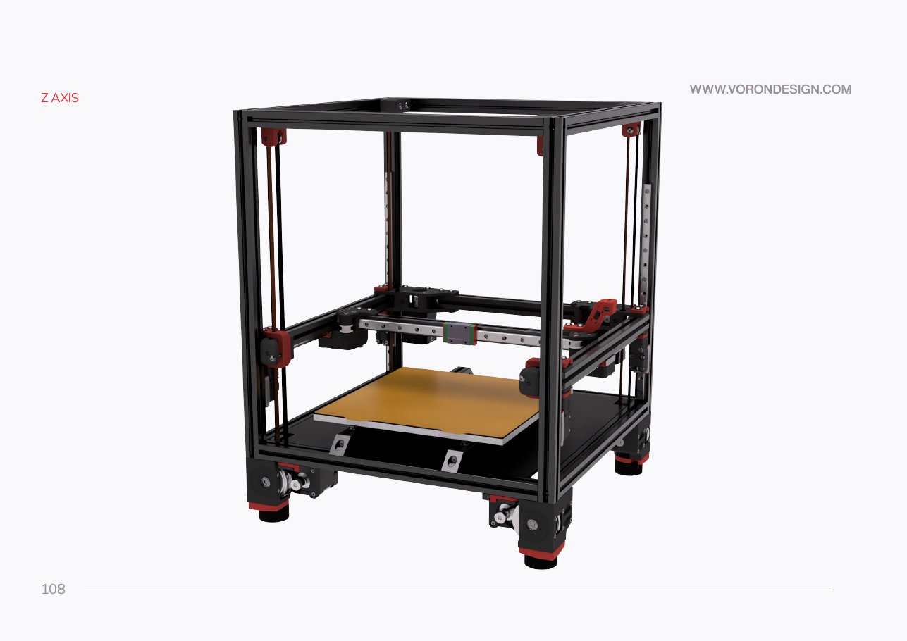

**Parts:** none.

**Do:** Before opening a bag, confirm the frame is finished from the deck down: four Z drives bolted in, four Z idlers at the tops of the uprights with their tensioners fitted, four MGN9 Z rails mounted on the second holes from each end (LDO note p.88) with carriages on and greased. Confirm the completed gantry is on the bench with its titanium backers already on.

**Check:** Push each Z carriage up and down its rail by hand — smooth, no notchiness, no gritty spots. Any rail you have to fight is a rail to fix now, not after the gantry is on it.

---

### Step 06.2 — Learn the four names

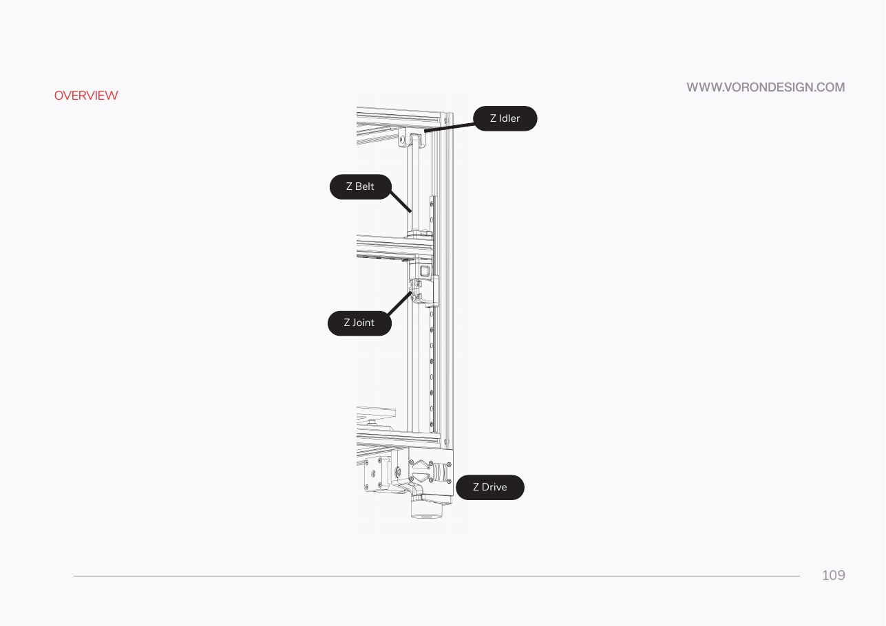

**Parts:** none.

**Do:** Read the overview. Each of the four corners has the same four things stacked vertically: the **Z drive** at the bottom (drives the belt), the **Z joint** in the middle (where the belt clamps and where the gantry hangs), the **Z belt** running between them, and the **Z idler** at the top of the upright. Each Z belt is one length whose *two ends both terminate at the Z joint* — it goes down to the drive, round it, up to the idler, over it, and back to the joint.

**Check:** You can point at all four features on the real machine at the front-left corner before you build the other three.

---

### Step 06.3 — Seat an M5 nut in each Z bearing block

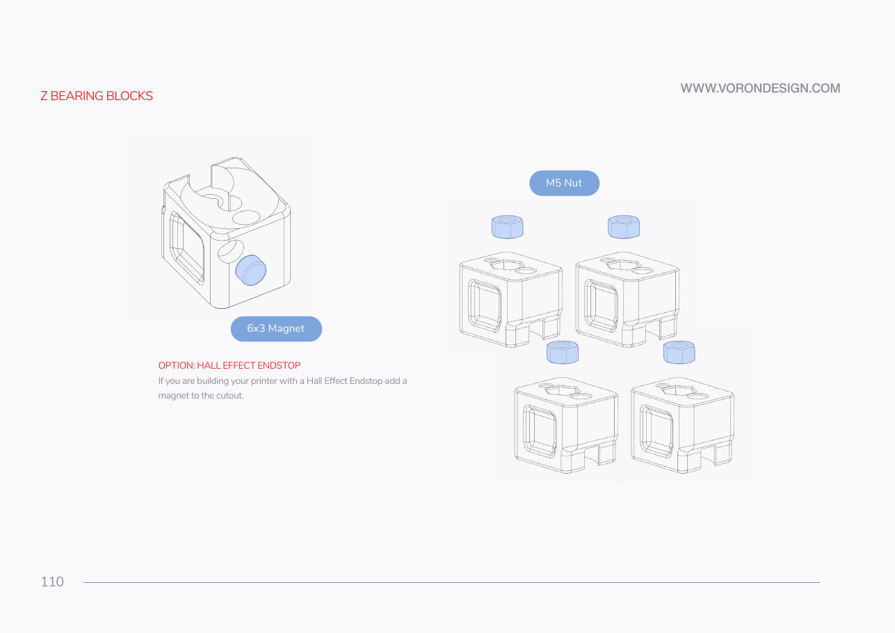

**Parts:** `z_joint_upper_x4` ×4, M5 hex nut ×4.

**Do:** Press one M5 hex nut fully into the pocket of each of the four `z_joint_upper` blocks. It should go in square and sit flush — if it stands proud, the M5×40 will bottom out later. Push it home with the flat of a screwdriver, not by threading a bolt through and cranking.

**Check:** The nut is flat in its pocket, its hex faces aligned with the pocket walls, and you can see clear thread through the block's bore from the other side.

⚠ **Rev D+ / LDO:** Do **not** fit the 6×3 mm magnet shown on this page. It belongs to the hall-effect endstop build. LDO note p.145: *"SKIP The kit does not use hall effect endstops."* All four blocks are the plain `z_joint_upper_x4`. [src](https://docs.ldomotors.com/en/voron/voron2/build-faq)

---

### Step 06.4 — Cut the four Z belts

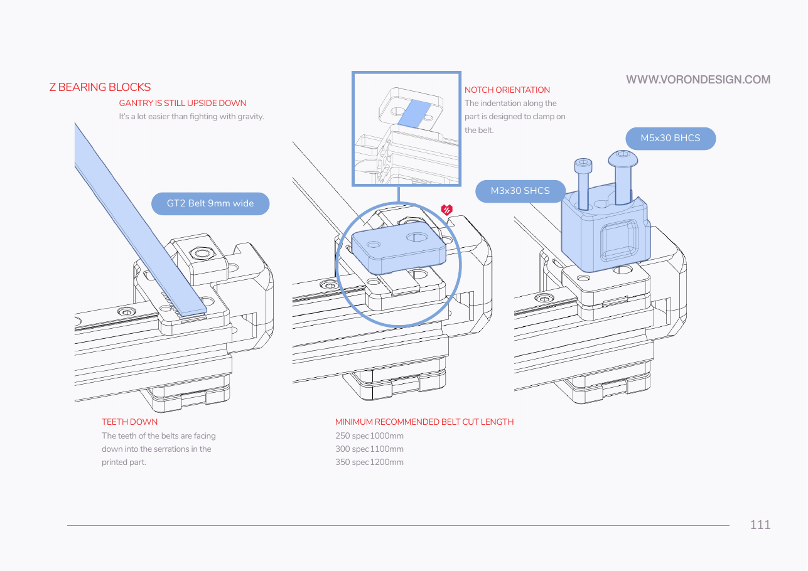

**Parts:** Gates open 2GT belt, 9 mm wide.

**Do:** Cut four lengths. The manual's minimum for a 350 is **1200 mm**. The kit supplies 6 m of 9 mm belt, so cut four at **~1400 mm** and trim the tails at the end — that leaves ~400 mm spare, where 4 × 1500 mm would use the whole 6 m exactly and leave nothing for a mis-cut or a re-clamp. Cut square with flush cutters, between teeth. Label them with masking tape so you don't mix a cut end with a factory end.

**Check:** Four belts, all the same length within a few mm, all with clean square ends and no frayed cords.

---

### Step 06.5 — Lay the first belt end into the XY joint

**Parts:** one Z belt.

**Do:** Work on the gantry off the printer, in the orientation the manual shows — p.111 notes the gantry is *still upside down* from the X-axis install, and says why: *"It's a lot easier than fighting with gravity."* Lay one belt end onto the clamping pad on the XY joint with the **teeth down**, into the serrations moulded into the printed part. Leave roughly 10 mm of belt past the pad (not specified — snug it up later).

**Check:** Belt teeth are meshed into the pad's serrations, not sitting on top of them. The belt leaves the pad straight, not skewed.

---

### Step 06.6 — Fit the lower belt clip

**Parts:** `[a]_z_belt_clip_lower_x4` ×1 (orange).

**Do:** Drop the lower belt clip onto the belt, **indented face down onto the belt**. The manual's NOTCH ORIENTATION callout: *"The indentation along the part is designed to clamp on the belt."* Line up the clip's small hole with the joint's M3 hole and its large hole with the M5 hole.

**Check:** The clip lies flat with the belt captured under its ribbed face; both holes line up with the joint underneath, no offset.

---

### Step 06.7 — Fit the Z bearing block and the top clip

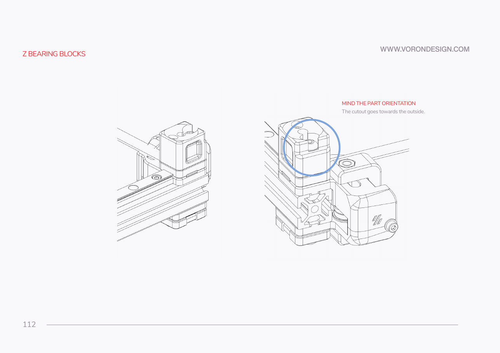

**Parts:** `z_joint_upper_x4` ×1 (with its M5 nut), `[a]_z_belt_clip_upper_x4` ×1 (orange), M3×30 SHCS ×1, M5×30 BHCS ×1.

**Do:** Set the Z bearing block on top of the lower clip with the **cutout facing outward** — p.112: *"MIND THE PART ORIENTATION. The cutout goes towards the outside."* Outward means away from the build volume, toward the frame upright the belt will run up. Put the upper belt clip on top of the block (nothing under it yet — its belt arrives at step 06.20). Drive one M3×30 SHCS and one M5×30 BHCS down through the whole stack — top clip, block, lower clip — into the XY joint. Tighten only to **snug**: enough that the lower clamp holds the belt, not so much that you crush the printed parts.

**Check:** The stack is top clip → block → lower clip → XY joint, one M3 and one M5 through all of it. Tug the belt tail firmly — it does not pull out. The block's cutout points outward.

---

### Step 06.8 — Repeat at all four corners

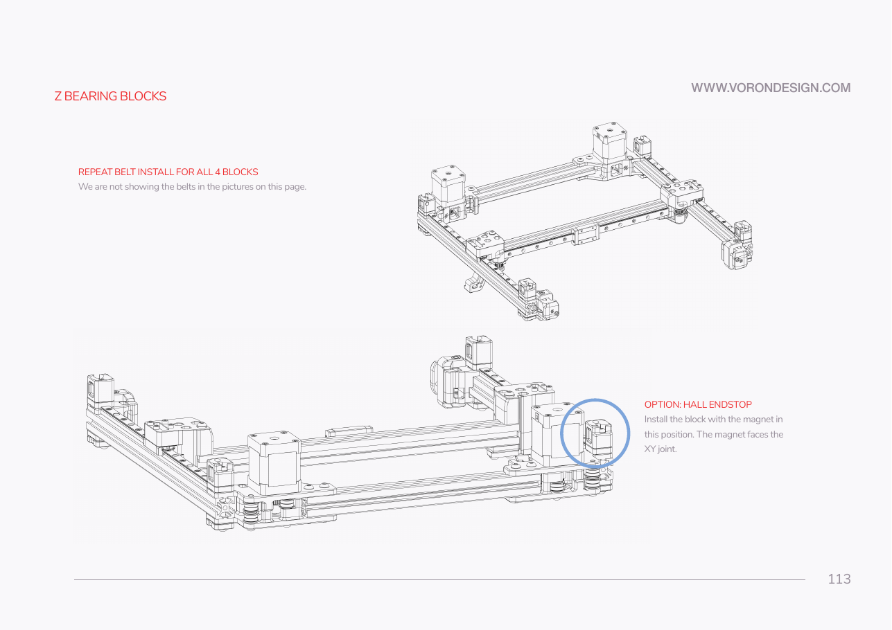

**Parts:** the remaining 3× belt, 3× lower clip, 3× block, 3× top clip, 3× M3×30 SHCS, 3× M5×30 BHCS.

**Do:** Repeat steps 06.5–06.7 at the other three gantry corners. The manual has not drawn the belts on this page (*"We are not showing the belts in the pictures on this page"*) — they are there in reality, four long tails hanging off the gantry. Coil each tail loosely and tape it to its own Y extrusion so it does not get trodden on during the lift.

**Check:** Four blocks fitted, all four cutouts pointing outward, four belt tails clamped and coiled. Nothing on this gantry needs a magnet.

---

### Step 06.9 — Fit the four lower Z joints to the Z carriages

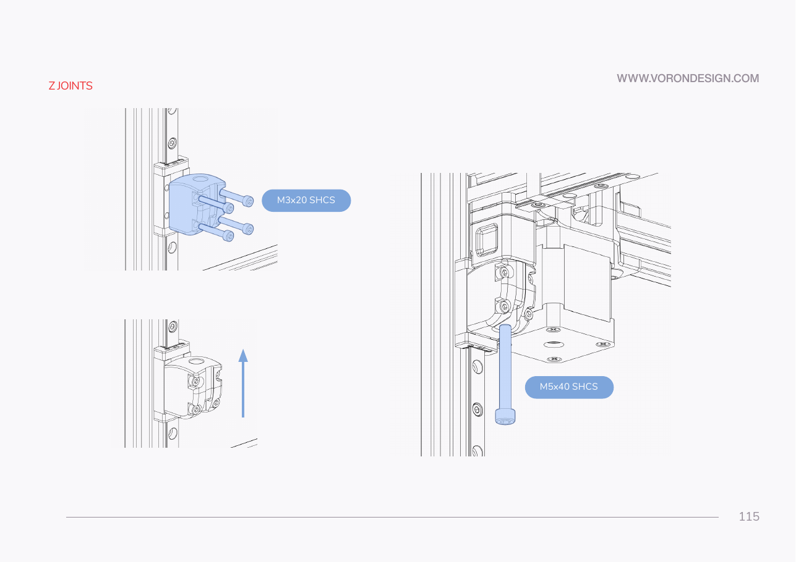

**Parts:** `z_joint_lower_x4` ×4, M3×20 SHCS ×16.

**Do:** Bolt one `z_joint_lower` to each MGN9 Z carriage with **four M3×20 SHCS**, driven horizontally into the carriage's tapped face. The joint's domed top with the central bore faces up. Tighten evenly, corner to corner, firm — these carry the whole gantry.

**Check:** All four joints sit flat on their carriages with no gap, and all four are at the same rotation. Slide each carriage up and down a few centimetres: the joint clears the upright and the Z rail's mounting screws.

⚠ **Rev D+ / LDO:** This page (and p.116) is done **before** the gantry install on p.114, not after. LDO: *"We recommend completing steps on page 115-116 then use the rubber rail stopper under the Z joints mid rail. This will allow you to set the Gantry on page 114 on the joints without the need for long zipties."* [src](https://docs.ldomotors.com/en/voron/voron2/build-faq)

---

### Step 06.10 — Park the four lower joints at a matched height

(no image — see text)

**Parts:** four rubber rail stoppers off the Z rails; `z_rail_stop_x4` ×4 (optional, from batch B05).

**Do:** Move each Z carriage to roughly mid-rail and screw a rubber rail stopper into a rail hole **directly under** it, so the carriage and its joint rest on the stopper and cannot drop. Do all four at **the same rail hole counted from the same end** — that is what makes the four joints land at the same height, which is what makes the gantry sit flat when you lower it on. Fit the printed `z_rail_stop_x4` at the *top* of each rail as well if you printed them; a carriage that runs off the top loses its balls.

**Check:** Measure from the deck to the top face of each lower joint at all four corners. All four within ~1 mm of each other. Push down on each carriage — it stops on its rubber stopper and stays there.

---

### Step 06.11 — Turn the gantry over and stage the lift

**Parts:** the gantry.

**Do:** Turn the gantry the right way up — motors up, X carriage's rail facing the front, Z bearing blocks and their belt tails at the four corners. Set it on the bench next to the printer with **Front** and **Back** marked in tape on both the gantry and the frame; the frame is not symmetrical and a reversed gantry means undoing everything. Agree the plan out loud before lifting: who holds which end, which way it tilts, where it lands.

**Check:** Front/back marked on both parts and they agree. Belt tails are taped up and out of the way. Both people can reach their side of the frame without leaning over the bed.

---

### Step 06.12 — Two-person lift: tilt the gantry into the frame

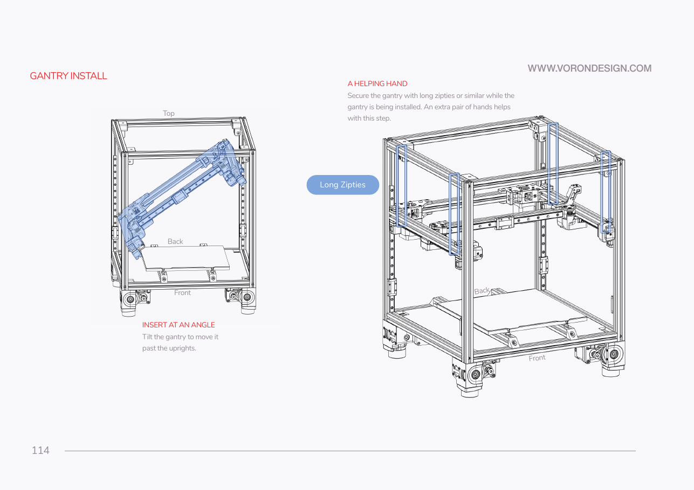

**Parts:** the gantry.

**Do:** **Two people.** One at the left Y extrusion, one at the right, hands on the extrusions — never on the X carriage, the drive units or the belts. Lift together, tilt the gantry at an angle to clear the four uprights (p.114: *"INSERT AT AN ANGLE — Tilt the gantry to move it past the uprights"*), bring it inside the frame, then level it out. Go slowly and talk: "up… tilt… clear on my side… coming level."

**Check:** The gantry is inside the frame, level, front to the front, with all four Z bearing blocks over their matching lower Z joints. No belt is pinched under anything.

---

### Step 06.13 — Set the gantry down onto the lower joints

**Parts:** the gantry; long zip ties ×4 only if you skipped step 06.10.

**Do:** Lower the gantry until each Z bearing block seats onto its lower Z joint. Nudge the carriages left/right along the rails until the bores line up — the block should drop the last millimetre by itself. Then let go, one person at a time. If you did not fit the rail stoppers, this is where the manual's long zip ties come in: strap each corner of the gantry to its upright before releasing (p.114, *"A HELPING HAND"*).

**Check:** The gantry rests on all four joints with nobody holding it. It does not rock, and no corner is visibly lower than the others.

---

### Step 06.14 — Bolt the first Z joint together

**Parts:** M5×40 SHCS ×1.

**Do:** From underneath, run one M5×40 SHCS **up** through the lower Z joint's bore and into the M5 nut captive in the Z bearing block. Tighten it **lightly only** — the joint must still be able to articulate. It gets its final torque at the very end of Part B, hot (Voron squaring step 16).

**Check:** The bolt threads in freely by hand for most of its length — if it binds early, the M5 nut is not seated (back to step 06.3). The joint still rocks slightly when you push the gantry corner.

---

### Step 06.15 — Repeat at the other three joints

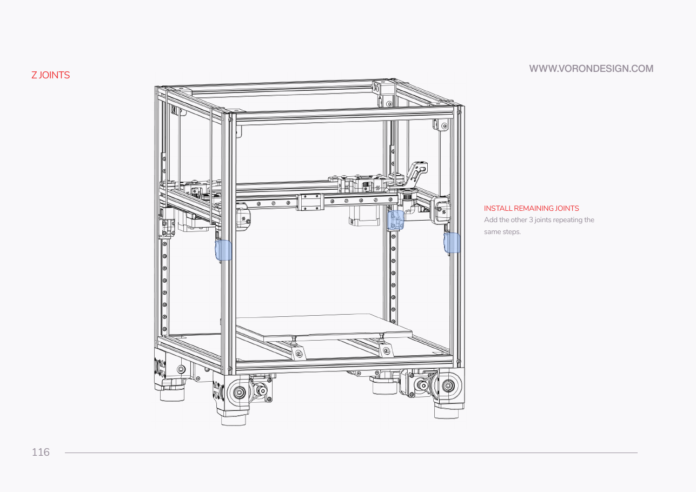

**Parts:** M5×40 SHCS ×3.

**Do:** *"INSTALL REMAINING JOINTS — Add the other 3 joints repeating the same steps."* Same light tightening on all four.

**Check:** Four M5×40 in, all light. Lift gently under one Y extrusion — the gantry moves as one piece and all four carriages start to move together.

---

### Step 06.16 — Extend all four Z idlers

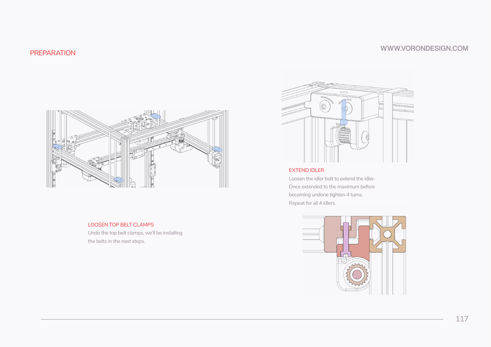

**Parts:** none (the four `[a]_z_tensioner_9mm_x4` fitted in Ch 02).

**Do:** At the top of each upright, loosen the idler bolt to extend the idler. Run it out *to the maximum before it comes undone*, then tighten back **4 turns**. Repeat for all four idlers. This gives you slack to get the belt on, and leaves adjustment in both directions for tensioning later.

**Check:** All four idlers extended and backed off by the same 4 turns — count them out loud. None of the four bolts has fallen out.

---

### Step 06.17 — Loosen the four top belt clamps

**Parts:** none.

**Do:** *"Undo the top belt clamps, we'll be installing the belts in the next steps."* At each corner, back off the M3×30 and M5×30 far enough that the second belt end will slide in under the top clip. **Do not undo them completely** — the same two screws also hold the lower clamp and the belt end you clamped at step 06.7. Loosen just enough, one corner at a time, and keep a finger on the lower belt tail.

**Check:** You can slip a strip of belt between the top clip and the block at all four corners, and the lower belt tail still will not pull out at any of them.

---

### Step 06.18 — Route the first belt down and around the Z drive

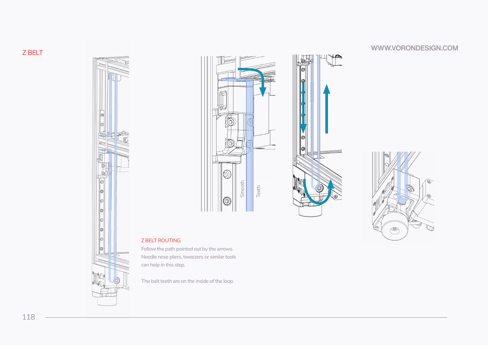

**Parts:** the belt tail at one corner.

**Do:** Take the hanging belt tail down the inside of the upright, past the Z joint, and around the Z drive pulley at the bottom, then bring it back up. Follow the arrows on the page. **Belt teeth face inward, onto the pulley.** Needle-nose pliers or tweezers make the wrap around the drive much easier than fingers.

**Check:** The belt is fully seated in the drive pulley's teeth all the way round — no partial engagement, no half-tooth. The two vertical runs are parallel and neither is twisted; the smooth back of one faces the toothed face of the other.

---

### Step 06.19 — Take the belt up and over the Z idler

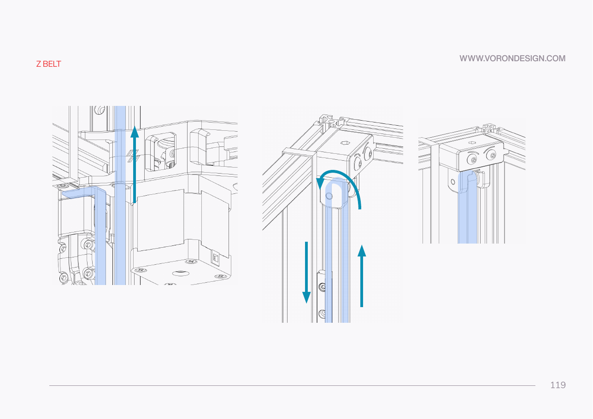

**Parts:** the same belt.

**Do:** Run the belt up the outer path to the top of the upright, over the Z idler pulley, and back down the inside toward the Z joint. Teeth stay on the inside of the loop throughout.

**Check:** The belt sits in the idler's groove, centred, with flanges either side; it is not riding a flange. Looking up the upright, both runs are vertical and do not touch the extrusion or any printed part.

---

### Step 06.20 — Clamp the second end and pull it tight

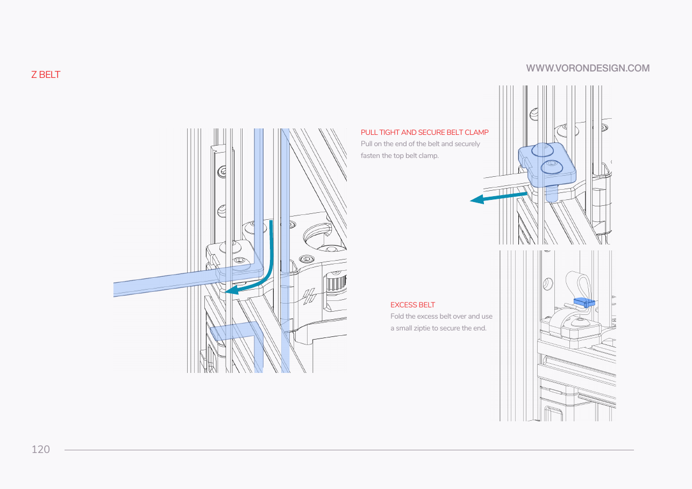

**Parts:** M3×30 SHCS and M5×30 BHCS at this corner (already in place).

**Do:** Feed the returning belt end between the block and the loosened top clip, teeth against the block's serrations. *"Pull on the end of the belt and securely fasten the top belt clamp."* Pull the tail hard and hold it while you tighten the M3 and then the M5 — this is what takes the slack out of the loop, so do not be gentle with the pull, but do keep the screws to firm rather than crushed.

**Check:** Pluck the long run — it has real tension, not a floppy note. Pull the tail again: no slip. The lower belt end is still clamped.

---

### Step 06.21 — Trim, fold and tie the excess

**Parts:** zip tie, 3×150 mm ×1.

**Do:** *"Fold the excess belt over and use a small ziptie to secure the end."* Fold the tail back on itself and zip-tie it to the running belt. Leave enough tail that you can re-clamp once if the tension comes out wrong — do not cut it flush yet. Trim the zip tie tail flush.

**Check:** The folded tail cannot flap into a pulley or a panel, and nothing rubs when you move the gantry up and down by hand a few centimetres.

---

### Step 06.22 — Do the other three Z belts

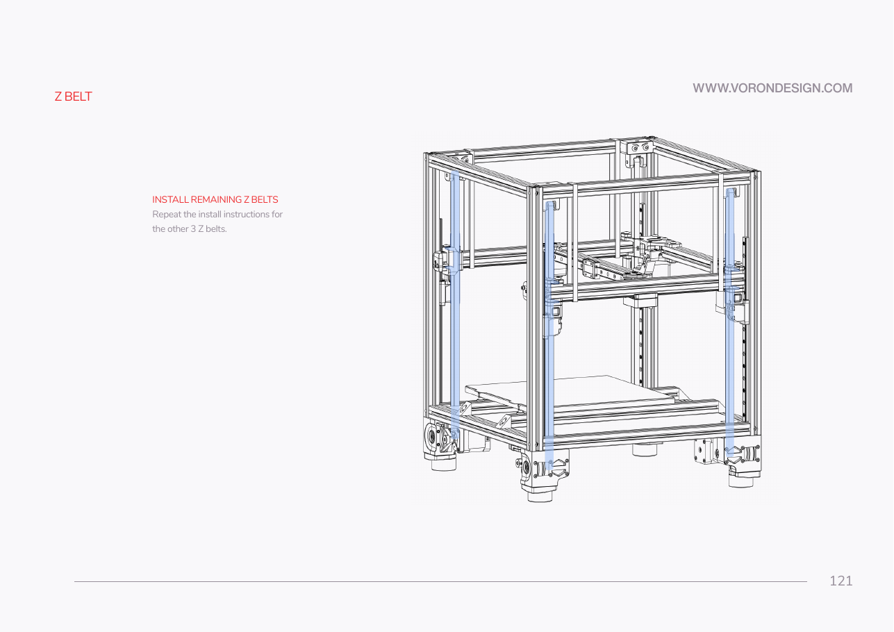

**Parts:** the remaining three belts, 3× zip tie.

**Do:** *"Repeat the install instructions for the other 3 Z belts."* Steps 06.18–06.21 at each of the remaining corners. Do them in the same order each time (drive → idler → clamp) so you notice if one comes out different.

**Check:** Four belts on, four tails tied. Every belt is fully seated on its drive pulley and its idler.

---

### Step 06.23 — Even the four belts by hand

(no image — see text)

**Parts:** none.

**Do:** Pluck each of the four Z belts on its fixed run and listen. They will not be equal yet. Bring them close by adjusting each corner's **Z idler tensioner bolt** at the top of the upright — a few turns at a time, going round all four. Aim for four notes that sound the same; the measured **140 Hz over a 150 mm span** target is set properly in Part B, once the gantry can be moved under power.

**Check:** All four belts sound within a semitone or so of each other. Lift one corner of the gantry by hand — all four carriages move together and the gantry stays roughly level.

---

### Step 06.24 — Square the gantry to the A/B drives and lock the X axis

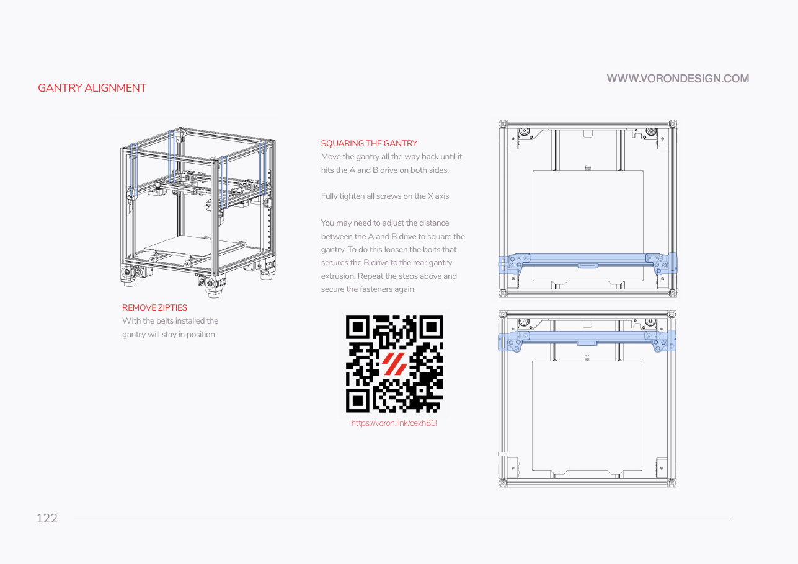

**Parts:** none.

**Do:** *"Move the gantry all the way back until it hits the A and B drive on both sides. Fully tighten all screws on the X axis."* Push the X extrusion back until the X/Y joints bottom out against the A drive on the right and the B drive on the left **at the same moment**. Hold it there and torque down every screw on the X axis. If one side hits first, the A/B drives are not equally spaced: *"loosen the bolts that secures the B drive to the rear gantry extrusion"*, push the gantry back again so both sides land together, and re-tighten.

**Check:** Looking down from above (as the two views on p.122 show), the X extrusion is parallel to the rear frame extrusion when pushed fully back, and parallel to the front frame extrusion when pushed fully forward. Both X/Y joints touch their drives at the same time.

Tip: This is a mechanical pre-square only. The manual's own QR code on this page ([voron.link/cekh81l](https://voron.link/cekh81l)) points at the full procedure, which is Part B of this chapter.

---

### Step 06.25 — Release the gantry and check it moves freely

**Parts:** none.

**Do:** *"REMOVE ZIPTIES — With the belts installed the gantry will stay in position."* Cut any long zip ties from step 06.13 and unscrew the four rubber rail stoppers from mid-rail (put them back at the rail ends, or fit the printed `z_rail_stop_x4`). Then turn one Z drive pulley by hand a few turns and watch that corner rise; do the same at each corner. Never spin a connected stepper fast by hand — back-EMF kills drivers (survey §4.4 #10) — and at this point the steppers are not wired anyway.

**Check:** The gantry stays where the belts hold it with nothing supporting it. Turning any Z drive by hand raises that corner smoothly with no belt slip and no rubbing against printed parts.

---

### Step 06.26 — Close out the mechanical Z axis

**Parts:** `z_chain_bottom_anchor` ×1, `z_chain_guide` ×1, `[a]_z_chain_retainer_bracket_x2` ×2, the 10×15 mm R28 drag chain.

**Do:** p.123 carries no build content. Before you leave this chapter, bag the Z cable-chain parts together and label the bag **"Ch 10 — Z chain, manual p.200–204"**: the two black frame mounts, the two orange retainer brackets and the drag chain. Prepare the chain now while you are not holding anything else — LDO's guide: open the link latches with a **2.5 mm flat screwdriver** on the side carrying the small screwdriver icon (prying the wrong side breaks the latch), and expand the notch on the notched end link with cutting pliers so that end link can bend too. Chain length and the actual mounting are Ch 10. [src](https://docs.ldomotors.com/en/guides/cable_chain_guide)

**Check:** One labelled bag, latches opening and closing with an audible click, one end link modified. Photograph all four Z joints as built — survey §7.5 #7 wants them for the squaring session.

---

## Checkpoint 06

- [ ] Four `z_joint_upper` blocks fitted, each with its M5 nut seated, **cutouts facing outward**
- [ ] Zero 6×3 magnets used; zero `z_joint_upper_hall_effect` parts printed or fitted
- [ ] Four `z_joint_lower` on the Z carriages, four M3×20 SHCS each, all four bolted flat
- [ ] Four M5×40 SHCS in, **all still light** — they are torqued hot at the end of Part B, not now
- [ ] Four Z belts routed drive → idler → clamp, teeth engaged on every pulley, none twisted
- [ ] Both belt ends clamped at every corner (lower clip and top clip), tails folded and zip-tied
- [ ] Four belts pluck to roughly the same note; nothing rubs anywhere in ±30 mm of Z travel
- [ ] X axis screws fully tightened with the gantry held back against both A/B drives (p.122)
- [ ] Gantry holds its own height on the belts; zip ties and mid-rail stoppers removed
- [ ] Z-chain parts bagged and labelled for Ch 10; chain latches tested, end link modified
- [ ] Photos taken of the four Z joints and the belt clamps before anything covers them

## Common mistakes

- **Doing p.114 before p.115–116.** Wrestling a 350 gantry on long zip ties while trying to line up four joints. Fit the lower joints and rest the gantry on rubber rail stoppers instead — LDO note p.114–116.
- **Fitting the hall-effect block or a 6×3 magnet** because the manual shows it. This kit has none (LDO p.145). If you printed `z_joint_upper_hall_effect.stl`, you printed the wrong file.
- **The block's cutout facing inward.** It is the one orientation error on p.112 that the manual calls out, and it is invisible once the belt is on. Fix: check all four before belting.
- **Undoing the top belt clamp screws completely at p.117**, which releases the *bottom* clamped belt end as well — the same two screws hold both. Loosen, don't remove.
- **Cutting Z belts to 1200 mm and finding it is exactly not enough** after the wrap. Cut ~1400 mm — long enough to wrap, and it still leaves ~400 mm of the kit's 6 m spare. Cutting four at 1500 mm consumes the whole reel.
- **Torquing the M5×40 Z joint bolts now.** They stay light through Part B and get their final tighten hot, at Voron squaring step 16. Tight joints here will fight every squaring adjustment you make.
- **Leaving a Z carriage unrestrained near the top of its rail.** It slides off, the balls go on the floor, and the carriage is scrap.

---

## Part B — Chapter 06b: Gantry squaring

> **Do this after Chapter 13 (first power-up and initial startup), not now.** The procedure needs `SET_IDLE_TIMEOUT`, `G28`, `QUAD_GANTRY_LEVEL` and `SET_STEPPER_ENABLE` — i.e. a machine with firmware, homing and a working QGL. Come back here as soon as Ch 13's QGL passes, then re-run QGL afterwards.

**Why it is split out:** the procedure's first moves are to *fully release A/B belt tension* and *drop the lower Z joints*. Anything you tension before this gets undone (survey §5.2 W1, §4.4 #2). Ch 07's A/B tension is therefore provisional, and its final value is set at step 06b.15 below.

**Source:** [V2 Gantry Squaring, docs.vorondesign.com](https://docs.vorondesign.com/build/mechanical/v2_gantry_squaring.html) — 17 numbered steps, transcribed below with the step number of the original cited on each. [Ellis' identical section](https://ellis3dp.com/Print-Tuning-Guide/articles/voron_v2_gantry_squaring.html) is the same text. The manual's own p.122 QR ([voron.link/cekh81l](https://voron.link/cekh81l)) points here.

**Extra tools for Part B:** 150 mm machinist square, digital caliper, 150 mm rule, phone spectrum app, hex 2/2.5/3/4 mm.

Tip: [Z Locks](https://github.com/VoronDesign/VoronUsers/tree/master/printer_mods/tallman5/z-locks/) make step 06b.8 easier by holding the gantry while the joints are off. Not required. [src](https://docs.vorondesign.com/build/mechanical/v2_gantry_squaring.html)

---

### Step 06b.1 — Set the Z belts to 140 Hz first

(no image — see text)

**Parts:** none.

**Do:** *Added step — not in the official squaring procedure, but do it first.* Jog the gantry up until the fixed side of a Z belt is **150 mm from the Z idler centres**. Pluck that 150 mm span and read the peak in your spectrum app. Adjust that corner's Z idler tensioner bolt until the lowest peak reads **≈140 Hz**. Do all four. Then move the gantry down a few centimetres and back up and re-check all four. Uneven Z belts are one of the named causes of a high-σ, non-repeatable QGL — squaring a machine with mismatched Z belts wastes the session (survey §4.3). [src](https://docs.vorondesign.com/tuning/secondary_printer_tuning.html)

**Check:** All four Z belts read 140 Hz ±5 Hz, and they still do after the gantry has moved and come back.

---

### Step 06b.2 — Raise the stepper idle timeout

(no image — see text)

**Parts:** none.

**Do:** In the console: `SET_IDLE_TIMEOUT TIMEOUT=99999`. The Z motors must stay energised and holding the gantry for the entire session — if they time out mid-procedure the gantry drops onto whatever is under it. (Voron step 1.)

**Check:** Command accepted, no error. The Z motors are audibly holding.

---

### Step 06b.3 — Home and level

(no image — see text)

**Parts:** none.

**Do:** `G28`, then `QUAD_GANTRY_LEVEL`. Let it complete cleanly. (Voron step 2.)

**Check:** QGL converges within its retry limit. If it will not, stop and fix that first — a machine that cannot QGL cannot be squared by this procedure.

---

### Step 06b.4 — Park the gantry in the middle

(no image — see text)

**Parts:** none.

**Do:** Jog the gantry to the centre of the build volume from Fluidd or the touchscreen. You need to reach both the top and the bottom of the gantry comfortably. (Voron step 3.)

**Check:** You can get a hex key onto an XY-joint bolt from above and from below without contorting.

---

### Step 06b.5 — Disable only the A and B motors

(no image — see text)

**Parts:** none.

**Do:** `SET_STEPPER_ENABLE STEPPER=stepper_x ENABLE=0` then `SET_STEPPER_ENABLE STEPPER=stepper_y ENABLE=0`. **Only** these two. The Z motors stay enabled — they are what is holding the gantry. (Voron step 4.)

**Check:** The X carriage now moves freely by hand; the gantry does not sink.

---

### Step 06b.6 — Release the A/B belt tension completely

**Parts:** none.

**Do:** Back both front idler tensioners fully off. *"Your belts should be fully disengaged. If there is still remaining tension with the idlers fully backed off, you may need to release the belt ends from the X carriage."* Leftover A/B tension pulls the gantry out of alignment while you are trying to align it. (Voron step 5.)

**Check:** Both A/B belts are slack enough to lift off their runs by 10 mm with one finger.

---

### Step 06b.7 — Take the side panels off

(no image — see text)

**Parts:** none.

**Do:** Remove both side panels so you can reach the Z joints and the XY joints from outside. (Voron step 6.)

**Check:** Clear access to all four Z joints and both XY joints.

---

### Step 06b.8 — Unscrew and drop the lower Z joints

**Parts:** the four M5×40 SHCS from step 06.14.

**Do:** Take the M5×40 out of each Z joint and slide the four lower joints down their rails, away from the gantry. *"Your gantry will now be floating on just the belts."* Do one at a time and keep a hand on the gantry. (Voron step 7.)

> **Warning (Voron):** *"Make sure your printer is on a (fairly) level surface. Unlevel surfaces could cause your gantry to swing too much to one side. It doesn't have to be perfectly level; just don't do it on a hill!"*

**Check:** All four lower joints are clear of the gantry, the gantry hangs on the four Z belts alone, and it is not swinging.

---

### Step 06b.9 — Partially loosen the X/Y joints

**Parts:** none.

**Do:** Loosen the bolts through the X/Y joints, top and bottom, on **both** sides — loose enough that the printed part can be slid along the extrusion by hand, no looser. (Voron step 8.1.)

> **Warning (Voron):** *"Where there are Z belt clamps, ensure that you do not loosen the bolts to the point of the Z-belts releasing. Only loosen enough to allow for adjustments."* On this machine that is exactly the M3×30 / M5×30 pair from step 06.7 — they hold both Z belt ends.

**Check:** Each X/Y joint slides along its extrusion under firm hand pressure, and no Z belt end has slipped.

---

### Step 06b.10 — Partially loosen the A/B joints and the front idlers

**Parts:** none.

**Do:** Same treatment on both A/B drive units, top and bottom, and on both front idler assemblies, top and bottom. The Voron pages repeat one warning on each: *"Don't overdo the belt clamps!"* (Voron steps 8.2 and 8.3.)

**Check:** All six printed assemblies on the Y extrusions can be nudged along the extrusion by hand. Every belt is still clamped.

---

### Step 06b.11 — Level the gantry onto the Z joints

**Parts:** none.

**Do:** This is the point of everything above. Slide the gantry components along their extrusions — closer together or further apart, at the rear (X) and at the sides (Y) — until the gantry sits perfectly on top of the four lower Z joints. The two acceptance conditions, verbatim: *"The Z joints feel perfectly flush along the side"*, and *"When raising and lowering your lower Z joint by hand, the bolt slides in perfectly without hitting the sides."* Test the second one at each corner: raise the lower joint to the block and try to start the M5×40 by hand — it should drop in without being coaxed. Then check you have not rotated an A/B joint in the process (compare the good/bad images below). (Voron steps 9.1 and 9.2.)

**Check:** Measure the gantry-to-frame distance at four points and write the numbers down — the horizontal gap between each **Y extrusion** and the frame upright beside it, with the caliper's depth rod, at front-left, rear-left, front-right and rear-right. Front and rear **on the same side** must agree within **0.5 mm** (a difference is the gantry skewed in the frame); left and right must agree within **1 mm** (a difference is the gantry off-centre). Then stand a machinist square on the front frame extrusion at **each front corner**, blade against the Y extrusion — no light under the blade at either corner.

This four-point measurement is a bench check, not part of the official text. Record it; you repeat it at 06b.12 and 06b.14.

| Point | Measured (mm) | Pass |
|---|---|---|
| Front-left (left Y ↔ front-left upright) | | |
| Rear-left (left Y ↔ rear-left upright) | | |
| Front-right (right Y ↔ front-right upright) | | |
| Rear-right (right Y ↔ rear-right upright) | | |

---

### Step 06b.12 — Retighten everything except the X/Y joints

(no image — see text)

**Parts:** none.

**Do:** Tighten every extrusion bolt you loosened at steps 06b.9–06b.10 **except the X/Y joint bolts** — those get tightened during the de-racking step. Voron: *"Ensure that your Z joints still align properly. Sometimes, tightening can move things around."* Re-run the flush-and-bolt-slides check at all four corners after tightening. (Voron step 10.)

**Check:** A/B joints and front idlers are tight; the M5×40 still starts by hand at all four Z joints; the four-point measurement from 06b.11 is unchanged.

---

### Step 06b.13 — Reinstall the lower Z joints, lightly

(no image — see text)

**Parts:** M5×40 SHCS ×4.

**Do:** Slide the four lower joints back up and run the M5×40 into each one — *"lightly tighten the M5 bolts. Don't fully tighten them down yet - just lightly. The joint should still be able to articulate freely."* (Voron step 11.)

**Check:** All four in. Each joint still articulates when you push the gantry corner sideways.

---

### Step 06b.14 — De-rack the gantry, then tighten the X/Y joints

(no image — see text)

**Parts:** none.

**Do:** The Voron doc delegates this step to [Nero3D's de-racking video](https://www.youtube.com/watch?v=cOn6u9kXvy0) rather than writing it out. The method, in words: with the A/B motors still disabled and the belts still slack, push the X extrusion **fully back** by hand until both X/Y joints bottom out against the A drive and the B drive — the same reference the manual uses on p.122. Hold it there, hard, against both stops. With the gantry held square that way, tighten the X/Y joint bolts (top and bottom, both sides) in a cross pattern, a bit at a time, so the extrusion cannot creep as they come up. Release, push the gantry fully back again and confirm both sides still land together; if one leads, loosen and repeat. Community variant if racking persists after this: loosen each A/B belt's anchor at the X carriage until the belt slides through under a firm pull, pull both belts to equal tension with pliers while feeling the tooth engagement, then re-anchor — described in the Voron forum's de-racking thread. [src](https://forum.vorondesign.com/threads/de-racking-again.1342/)

> Voron's own note on this step: *"Make sure to come back here afterwards! The following steps are still important."*

**Check:** Machinist square at **both front corners**, blade against the Y extrusion, base on the front frame extrusion — square at both, with the gantry pushed fully forward and again fully back. Both X/Y joints contact their drive units at the same instant when the gantry is pushed back. Re-measure the four points from 06b.11 and confirm the same-side pair still agrees within 0.5 mm.

---

### Step 06b.15 — Re-tension the A/B belts to 110 Hz

(no image — see text)

**Parts:** none.

**Do:** Move the X extrusion forward until the X/Y idler centres are **150 mm** from the front idler centres. Pluck that 150 mm span and adjust each front tensioner until the lowest peak reads **≈110 Hz**. The two belts affect each other — go back and forth until they are equal. Then move the X extrusion back a few centimetres, return, and re-check. (Voron step 13.) 110 Hz ≈ 2 lb, deliberately at the low end. Ignore voronldo.com's 80–100 Hz figure for a 350 — it names no span, which is what makes a frequency meaningful (survey §4.3). [src](https://docs.vorondesign.com/tuning/secondary_printer_tuning.html)

**Check:** A and B read within a few Hz of each other at ~110 Hz, and still do after the gantry has been moved and brought back.

---

### Step 06b.16 — Refit the panels and heat soak

(no image — see text)

**Parts:** none.

**Do:** Put the side panels back on and fully heat soak the machine for **1½–2 hours minimum** — chamber closed, bed at its normal print temperature. (Voron step 14.) Nothing about the next two steps works cold; the whole point is to lock the gantry in at full thermal expansion.

**Check:** Chamber temperature has plateaued and has been flat for at least 20 minutes before you go on.

---

### Step 06b.17 — Run QGL three to five times

(no image — see text)

**Parts:** none.

**Do:** `QUAD_GANTRY_LEVEL`, three to five times, to settle the gantry in and level it for the next step. Voron: *"If you are getting new tolerance or retry errors, you may have left your Z joints a bit too loose. Try tightening them up just a bit more."* (Voron step 15.)

**Check:** Each run converges, and the correction it applies gets smaller each time rather than bouncing around.

---

### Step 06b.18 — Tighten the Z joint M5 bolts hot

(no image — see text)

**Parts:** the four M5×40 SHCS.

**Do:** Open the front door and **fully tighten the four M5×40 Z joint bolts while the machine is still hot**. This is the first and only time they get full torque. Voron gives two reasons: it *"somewhat 'locks in' your QGL at its state in full thermal expansion"* (helps first-layer consistency) and it *"stabilizes your gantry"* (helps ringing and layer consistency). A gantry left with loose Z joints visibly displaces back and forth while printing. Then `RESTART` to clear the idle timeout from 06b.2. (Voron steps 16 and 17.)

**Check:** All four bolts firm. `RESTART` completes; `SET_IDLE_TIMEOUT` is back to the config default. Re-run `QUAD_GANTRY_LEVEL` once after the restart and confirm it still converges.

---

## Checkpoint 06b

- [ ] Four Z belts measured at **140 Hz** over a 150 mm span, all four within ±5 Hz
- [ ] `SET_IDLE_TIMEOUT TIMEOUT=99999` set at the start and cleared by `RESTART` at the end
- [ ] Only `stepper_x` and `stepper_y` were disabled; Z motors held the gantry throughout
- [ ] A/B belts were fully slack before any adjustment was made
- [ ] Both A/B joints checked for rotation against the good/bad reference images
- [ ] At all four Z joints, the M5×40 starts by hand with the joint raised — no coaxing
- [ ] **Four-point gantry-to-frame gap recorded**: same-side front/rear within 0.5 mm, left/right within 1 mm
- [ ] Machinist square shows no light at **both** front corners, gantry forward and gantry back
- [ ] A/B belts re-tensioned to **110 Hz** over a 150 mm span, matched to each other
- [ ] Panels back on, 1½–2 h heat soak done, QGL run 3–5 times hot
- [ ] Four Z joint M5×40 bolts tightened **hot**, and QGL still converges afterwards
- [ ] Photos taken of the dropped Z joints, released tensioners and the flush/hole checks (survey §7.5 #7)

## Common mistakes (06b)

- **Doing this before Ch 13.** Four of the seventeen steps are g-code. Attempting it dry means guessing at "level" with no QGL to check against.
- **Tensioning the A/B belts in Ch 07 and treating that as final.** Step 06b.6 undoes it. Ch 07's tension is a working value; 06b.15 sets the real one.
- **Loosening the Z belt clamps too far at steps 06b.9–06b.10** and releasing a Z belt end. Both Voron pages warn about this twice. Loosen only enough to slide.
- **Squaring cold, or tightening the Z joints cold.** The whole value of steps 06b.16–06b.18 is locking the gantry in at full thermal expansion. Cold-tightening throws that away and shows up as first-layer inconsistency.
- **Fully tightening the Z joints back in step 06b.13.** They must stay light through de-racking and the QGL runs — otherwise every adjustment fights them.
- **Skipping the de-racking step because QGL passed.** QGL levels the gantry in Z; it says nothing about whether the X extrusion is square to the Y axes. A racked gantry passes QGL happily and prints skewed parts.
- **Believing voronldo.com's tension numbers.** 80–100 Hz (A/B) and 110–130 Hz (Z) conflict with the official figures and name no span. Use 110 Hz and 140 Hz over 150 mm (survey §4.3).

## Next

**Ch 07 — A/B belts and tensioning** (manual p.124–145) once Part A's checkpoint is clear; tension provisionally, because Part B will release it. Then return to **Ch 06b** immediately after Ch 13's QGL passes, and re-run QGL before Ch 14.
