# Chapter 06 — Z axis (and Chapter 06b — Gantry squaring)

Hangs the finished gantry on the four Z joints, belts all four Z corners, and gets the gantry roughly square to the frame — after which the machine can move in Z. **Part B (Ch 06b) is the real gantry squaring and cannot be done here: it needs motor control, so it runs out of the middle of Chapter 13 (Step 13.34), cold; the hot lock-in is Ch 14's.**

**What you're building in this chapter.** Four **Z joints** — one at each corner of the gantry — and the four **Z belts** that hang the gantry from them. A Z joint is a pair of printed blocks: the `z_joint_lower` bolts to the ball-bearing carriage riding the Z rail on an upright, the `z_joint_upper` bolts under the gantry's XY joint and clamps *both* ends of that corner's Z belt, and one M5×40 bolt joins the two. Each corner's belt runs from that joint down to the **Z drive** at the bottom of the upright, around its pulley, up to the **Z idler** at the top, and back to the joint — so turning one drive raises one corner, and four of them together lift and level the gantry. Part A gets all of that built, the gantry lifted into the frame, and the machine roughly square. Part B is the real squaring, and it needs a running printer, so it runs from inside Ch 13 (Step 13.34) — cold and with the machine open. The heat soak and the hot lock-in follow in Ch 14, once the panels are on.

**Time:** 3.5–5.0 h hands-on for Part A, first build (survey §7.2). Part B adds ~1 h hands-on, cold (the heat soak and hot lock-in now live in Ch 14).

**Sessions:** 9 × ~30 min (first-build estimate — 8 in Part A, 1 in Part B, which is deliberately unbroken; each `Pause:` line carries its own segment minutes).

**Prerequisites:**

- **Ch 02 — Z drives, Z idlers, Z rails, deck.** Four Z drives built and bolted in, four Z idlers at the tops of the uprights, four MGN9 Z rails on the uprights with their carriages on, 16T/20T pulley stack verified, set screws threadlocked (survey §5.2 W12). The deck panel is in.
- **Ch 05 — Gantry.** Complete gantry: X and Y extrusions, XY joints, X carriage, titanium backers already fitted (survey §5.2 W2 — backers after this point means a teardown). Left off the printer, as the manual leaves it at p.106–107.
- **Print batch B05** — Z joints + Z chain (`docs/voron-print-plan.md` §3 B05). Black ASA, 1 plate, 6.4 h.
- **Print batch B02** — the single orange accent session, which carries the four Z belt clips (both halves) and the Z chain retainer brackets.
- Heat-set inserts already done for every part in both batches (survey §5.2 W3).

**Tools**

- Hex 2.5 mm, 3 mm and 4 mm; a ball-end 4 mm helps at the Z joints
- Hex 2 mm and 2.5 mm for Part B
- **Two people** for the gantry lift (survey §7.3, chapter 06 row) — Alex on one side, daughter on the other
- Four rubber rail stoppers taken off the Z rails (the LDO trick, below), or long zip ties as the fallback
- Needle-nose pliers or tweezers for belt routing (manual p.118)
- Steel rule / tape for cutting belt; flush cutters
- **Part B only:** 150 mm machinist square (DIN 875/2), digital caliper, 150 mm rule, phone with Spectroid (Android) / Sound Spectrum Analysis (iOS) / Gates Carbon Drive

**Consumables:** small zip ties ×4 (belt tails), long zip ties ×4 (only if you skip the rail-stopper trick), masking tape and marker.

**Printed parts**

Parts arrive in the bins named below (see the bin map in print/README.md#bins); check the bin label's list before you start.

| Looks like | STL | Bin | Repo path | Qty | Colour | Batch |
|---|---|---|---|---:|---|---|
| 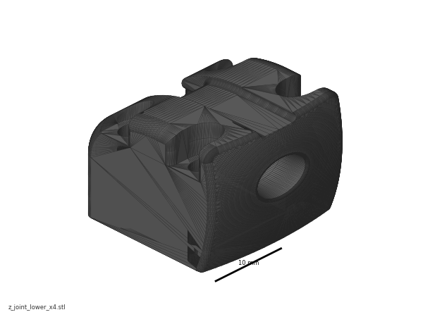{ width=96 } | `z_joint_lower_x4.stl` | 06-Z-joints | Voron-2 `STLs/Gantry/Z_Joints/` | 4 | Black | B05 |
| 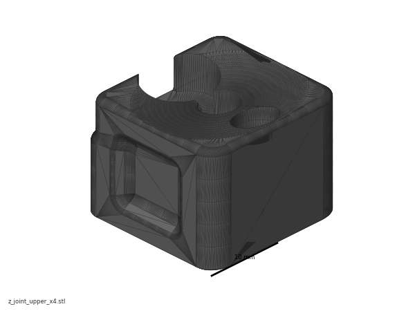{ width=96 } | `z_joint_upper_x4.stl` | 06-Z-joints | Voron-2 `STLs/Gantry/Z_Joints/` | 4 | Black | B05 |
| { width=96 } | `[a]_z_belt_clip_lower_x4.stl` | 06-Z-joints | Voron-2 `STLs/Gantry/` | 4 | Orange | B02 |
| { width=96 } | `[a]_z_belt_clip_upper_x4.stl` | 06-Z-joints | Voron-2 `STLs/Gantry/` | 4 | Orange | B02 |
| { width=96 } | `z_chain_bottom_anchor.stl` | 10-chains | Voron-2 `STLs/Gantry/` | 1 | Black | B05 — **fitted in Ch 10** (manual p.201–203) |
| { width=96 } | `z_chain_guide.stl` | 10-chains | Voron-2 `STLs/Gantry/` | 1 | Black | B05 — **fitted in Ch 10** (manual p.201–203) |
| { width=96 } | `[a]_z_chain_retainer_bracket_x2.stl` | 10-chains | Voron-2 `STLs/Gantry/AB_Drive_Units/` | 2 | Orange | B02 — **fitted in Ch 10** (manual p.204) |
| { width=96 } | `z_rail_stop_x4.stl` | 06-Z-joints | LDOVoron2 `STLs/` | 4 | Black | B05 — optional rail-end safety stop |
| — | `z_joint_upper_hall_effect.stl` | — | Voron-2 `STLs/Gantry/Z_Joints/` | **0** | — | **SKIP** per LDO — no hall-effect endstops in this kit, not printed |

**Hardware** (chapter totals — Part A)

| Fastener / part | Qty | Note |
|---|---:|---|
| M5 hex nut | 4 | one per Z bearing block, manual p.110 |
| M3×30 SHCS | 4 | one per corner; passes through top clip → block → lower clip → XY joint, p.111 |
| M5×30 BHCS | 4 | one per corner, same stack, p.111 |
| M3×20 SHCS | 16 | four per `z_joint_lower` into the MGN9 carriage, p.115 |
| M5×40 SHCS | 4 | one per Z joint, up from the lower joint into the block's M5 nut, p.115 |
| Gates open belt, 2GT, 9 mm | 4 × **~1400 mm** (manual minimum ≥1200 mm) | manual p.111 minimum for the 350; the kit ships **6 m** of 9 mm belt, so 4 × 1400 mm leaves ~400 mm spare for a mis-cut ([LDO 350 Rev D BOM](https://docs.ldomotors.com/en/voron/voron2/350_BOM/Rev_D)) |
| 6×3 mm magnet | **0** | hall-effect option only — not used |
| Zip tie, 3×150 mm (belt tails) | 4 | manual p.120 |
| Zip tie, long (gantry support) | 0–4 | only if you skip the rubber-rail-stopper trick |
| Rubber rail stopper | 4 | taken off the Z rails and re-fitted mid-rail — LDO note p.114–116 |

**Read first**

- **Do manual p.115–116 before p.114.** LDO: *"We recommend completing steps on page 115-116 then use the rubber rail stopper under the Z joints mid rail. This will allow you to set the Gantry on page 114 on the joints without the need for long zipties."* Fit the four lower Z joints and park them at a known height first, then lower the gantry onto them. [src](https://docs.ldomotors.com/en/voron/voron2/build-faq)
- **Ignore every hall-effect option on p.110 and p.113.** LDO note p.145: *"SKIP The kit does not use hall effect endstops."* Four plain `z_joint_upper_x4`, no 6×3 magnets, no `z_joint_upper_hall_effect.stl`. The XY endstop on this kit is the D2F PCB pod fitted in Ch 05. [src](https://docs.ldomotors.com/en/voron/voron2/build-faq)
- **The gantry lift is a two-person step and the manual says so** (p.114: *"An extra pair of hands helps with this step"*). Nobody holds a 350 gantry one-handed while fishing for an M5×40.
- **The gantry alignment on p.122 is not the gantry squaring.** p.122 gets the gantry square enough to belt. The real procedure (Part B) starts by *fully releasing* A/B belt tension and dropping the lower Z joints, so it has to come after firmware is up. Ch 07's A/B tension is provisional, and so is Part B's (survey §5.2 W1, §4.4 #2). A/B tension is set three times on purpose: Ch 07 (provisional — enough to home and QGL), Ch 06b Step 06b.15 (provisional again, after squaring, machine cold and open) and Ch 14 Step 14.4 (final — panels on, machine cold, door open, immediately before the closed-chamber soak and hot Z-joint tighten of Step 14.6). Z belts: Ch 06b Step 06b.3 (so QGL converges for squaring), set for the last time at Ch 14 Step 14.5, in the same cold session.
- **Belt tension targets:** Z belts **140 Hz** over a 150 mm span measured from the Z idler centres; A/B belts **110 Hz** over a 150 mm span. Both from [docs.vorondesign.com](https://docs.vorondesign.com/tuning/secondary_printer_tuning.html). voronldo.com's 80–100 Hz (A/B) and 110–130 Hz (Z) numbers are discarded — survey §4.3.
- **A Z carriage that runs off the end of its rail is a ruined carriage.** The balls fall out. Keep the printed `z_rail_stop_x4` (batch B05) at the top of each rail, or keep a hand on the carriage.

**Sources for this chapter:**

- [Voron 2.4r2 assembly manual, p.108–123](https://github.com/VoronDesign/Voron-2/blob/de7e89d/Manual/Assembly_Manual_2.4r2.pdf#page=108) — the page sequence Part A transcribes, pinned at commit `de7e89d`
- [Voron docs § V2 Gantry Squaring](https://docs.vorondesign.com/build/mechanical/v2_gantry_squaring.html) — the 17 numbered steps Part B transcribes, and the source of Part B's 15 mirrored images (GPL-3.0)
- [Ellis' Print Tuning Guide § V2 gantry squaring](https://ellis3dp.com/Print-Tuning-Guide/articles/voron_v2_gantry_squaring.html) — the same procedure, in Ellis' words
- [Voron docs § Secondary printer tuning](https://docs.vorondesign.com/tuning/secondary_printer_tuning.html) — the 140 Hz Z and 110 Hz A/B belt targets
- [LDO Build Notes § Voron 2.4 build FAQ](https://docs.ldomotors.com/en/voron/voron2/build-faq) — p.115–116-before-p.114 ordering, hall-effect skips
- [LDO cable-chain guide](https://docs.ldomotors.com/en/guides/cable_chain_guide) — Z chain, fitted later in Ch 10
- [Voron forum — de-racking thread](https://forum.vorondesign.com/threads/de-racking-again.1342/) and [Nero3D's de-racking video](https://www.youtube.com/watch?v=cOn6u9kXvy0) — the de-racking method Voron's step 12 delegates to

**Video coverage (Steve Builds, pre-release LDO kit — differs from Rev D+):** [Part 4 @0:12:41](https://www.youtube.com/watch?v=ViB5Ulc9zDI&list=PL0fUJbigELQPqpeGOgHYisG4KaSXVtnNY&t=761s) (+18m), [Part 4 @0:55:52](https://www.youtube.com/watch?v=ViB5Ulc9zDI&list=PL0fUJbigELQPqpeGOgHYisG4KaSXVtnNY&t=3352s) (+32m), [Part 4 @1:30:00](https://www.youtube.com/watch?v=ViB5Ulc9zDI&list=PL0fUJbigELQPqpeGOgHYisG4KaSXVtnNY&t=5400s) (+14m), [Part 5 @0:46:00](https://www.youtube.com/watch?v=hTKCBrk36R0&list=PL0fUJbigELQPqpeGOgHYisG4KaSXVtnNY&t=2760s) (+14m), [Part 5 @1:03:16](https://www.youtube.com/watch?v=hTKCBrk36R0&list=PL0fUJbigELQPqpeGOgHYisG4KaSXVtnNY&t=3796s) (+10m), [Part 6 @1:34:40](https://www.youtube.com/watch?v=8pWoYkY1DiA&list=PL0fUJbigELQPqpeGOgHYisG4KaSXVtnNY&t=5680s) (+2m), [Part 9 @2:49:00](https://www.youtube.com/watch?v=dmNwxUm4oik&list=PL0fUJbigELQPqpeGOgHYisG4KaSXVtnNY&t=10140s) (+5m)

---

## Part A — Chapter 06: Z axis (mechanical)

Manual p.108–123. Nothing in this part needs power.

---

### Step 06.1 — Confirm the starting state

**What you're looking at:** The frame as it has to stand before the gantry goes in: a **Z drive** at each bottom corner (the motor and its pulleys), a **Z idler** at the top of each upright, and a **Z rail** with a carriage on each upright. Those four carriages are what the whole gantry will hang from, so a rail that fights you now is a rail you fix now — after this chapter there is a gantry of roughly 3 kg (verify on bench: weigh it) — awkward rather than heavy — in the way.

**Parts:** none.

**Do:** Before opening a bag, confirm the frame is finished from the deck down: four Z drives bolted in, four Z idlers at the tops of the uprights with their tensioners fitted, four MGN9 Z rails mounted on the second holes from each end (LDO note p.88) with carriages on and greased. Confirm the completed gantry is on the bench with its titanium backers already on.

**Check:** Push each Z carriage up and down its rail by hand — smooth, no notchiness, no gritty spots. Any rail you have to fight is a rail to fix now, not after the gantry is on it.

Source: [Voron manual p.108](https://github.com/VoronDesign/Voron-2/blob/de7e89d/Manual/Assembly_Manual_2.4r2.pdf#page=108)

---

### Step 06.2 — Learn the four names

**What you're looking at:** One corner, top to bottom: the **Z idler** at the top of the upright, the **Z joint** in the middle (the printed pair that clamps the belt and carries the gantry corner), the **Z belt**, and the **Z drive** at the bottom. Both ends of each Z belt end at the same Z joint, so turning the drive pulley pays belt out on one side and takes it in on the other and that corner rises — four of these, driven independently, are what lift and level the gantry.

**Parts:** none.

**Do:** Read the overview. Each of the four corners has the same four things stacked vertically: the **Z drive** at the bottom (drives the belt), the **Z joint** in the middle (where the belt clamps and where the gantry hangs), the **Z belt** running between them, and the **Z idler** at the top of the upright. Each Z belt is one length whose *two ends both terminate at the Z joint* — it goes down to the drive, round it, up to the idler, over it, and back to the joint.

**Check:** You can point at all four features on the real machine at the front-left corner before you build the other three.

Source: [Voron manual p.109](https://github.com/VoronDesign/Voron-2/blob/de7e89d/Manual/Assembly_Manual_2.4r2.pdf#page=109) · [Video: Part 4 @0:55:46](https://www.youtube.com/watch?v=ViB5Ulc9zDI&list=PL0fUJbigELQPqpeGOgHYisG4KaSXVtnNY&t=3346s)

---

### Step 06.3 — Seat an M5 nut in each Z bearing block

**What you're looking at:** These two black blocks are the look-alike pair of this chapter. The **`z_joint_upper`** in your hand bolts under the gantry's XY joint, clamps both ends of that corner's Z belt, and holds the M5 nut you are seating; the **`z_joint_lower`** bolts to the Z carriage on the upright, and one M5×40 later joins the two into a [Z joint](16-glossary.md#z). Tell them apart by bulk: the **lower** is the chunkier one (~30 mm long, ~10.8 cm³ of plastic, with four M3 holes in one face for the rail carriage); the **upper** is smaller (~25 mm, ~7.4 cm³), has the hex pocket you are filling, and has the off-centre cutout.

**Parts:** `z_joint_upper_x4` ×4, M5 hex nut ×4.

**Do:** Press one M5 hex nut fully into the pocket of each of the four `z_joint_upper` blocks. It should go in square and sit flush — if it stands proud, the M5×40 will bottom out later. Push it home with the flat of a screwdriver, not by threading a bolt through and cranking.

**Check:** The nut is flat in its pocket, its hex faces aligned with the pocket walls, and you can see clear thread through the block's bore from the other side.

⚠ **Rev D+ / LDO:** Do **not** fit the 6×3 mm magnet shown on this page. It belongs to the hall-effect endstop build. LDO note p.145: *"SKIP The kit does not use hall effect endstops."* All four blocks are the plain `z_joint_upper_x4`. [src](https://docs.ldomotors.com/en/voron/voron2/build-faq)

Source: [Voron manual p.110](https://github.com/VoronDesign/Voron-2/blob/de7e89d/Manual/Assembly_Manual_2.4r2.pdf#page=110) · [LDO Build Notes § Voron 2.4 build FAQ](https://docs.ldomotors.com/en/voron/voron2/build-faq)

---

### Step 06.4 — Cut the four Z belts

**What you're looking at:** Plain open-ended GT2 belt off the reel. This is the **9 mm** wide belt — the Z belts; the A/B belts in Ch 07 are the narrower 6 mm. Unlike the A/B belts these are not loops: each is a single cut length whose two ends both get clamped at the same Z joint.

**Parts:** Gates open 2GT belt, 9 mm wide.

**Do:** Cut four lengths. The manual's minimum for a 350 is **1200 mm**. The kit supplies 6 m of 9 mm belt, so cut four at **~1400 mm** and trim the tails at the end — that leaves ~400 mm spare, where 4 × 1500 mm would use the whole 6 m exactly and leave nothing for a mis-cut or a re-clamp. Cut square with flush cutters, between teeth. Label them with masking tape so you don't mix a cut end with a factory end.

**Check:** Four belts, all the same length within a few mm, all with clean square ends and no frayed cords.

Source: [Voron manual p.111](https://github.com/VoronDesign/Voron-2/blob/de7e89d/Manual/Assembly_Manual_2.4r2.pdf#page=111)

Pause: ~30 min since the last pause — M5 nuts seated in all four Z bearing blocks, four Z belts cut to length and labelled by corner. Do not start clipping a belt end in: each corner is one continuous clip-and-clamp job.

---

### Step 06.5 — Lay the first belt end into the XY joint

**What you're looking at:** The first belt end goes onto the flat clamping pad on the XY joint you built in Ch 05. The pad has fine serrations moulded into it at the belt's tooth pitch, so teeth-down means the belt's teeth mesh into the plastic and cannot creep under load; teeth-up is a belt that will slowly pull through.

**Parts:** one Z belt.

**Do:** Work on the gantry off the printer, in the orientation the manual shows — p.111 notes the gantry is *still upside down* — A/B motors pointing up — from the X-axis install (p.106 turned it over — *"Turn the gantry around for the next step"* — to insert the X axis, and it has simply stayed upside down for this Z-joint stack; it goes back the running way up, motors down, at Step 06.11), and says why: *"It's a lot easier than fighting with gravity."* Lay one belt end onto the clamping pad on the XY joint with the **teeth down**, into the serrations moulded into the printed part. Leave roughly 10 mm of belt past the pad (not specified — snug it up later).

**Check:** Belt teeth are meshed into the pad's serrations, not sitting on top of them. The belt leaves the pad straight, not skewed.

Source: [Voron manual p.111](https://github.com/VoronDesign/Voron-2/blob/de7e89d/Manual/Assembly_Manual_2.4r2.pdf#page=111) · [Voron manual p.106](https://github.com/VoronDesign/Voron-2/blob/de7e89d/Manual/Assembly_Manual_2.4r2.pdf#page=106) · [Video: Part 4 @0:10:12](https://www.youtube.com/watch?v=ViB5Ulc9zDI&list=PL0fUJbigELQPqpeGOgHYisG4KaSXVtnNY&t=612s)

---

### Step 06.6 — Fit the lower belt clip

**What you're looking at:** The two orange belt clips are the second look-alike pair, and both are simple ribbed pads that squeeze belt against plastic. The **lower** clip goes on now, ribbed face down onto this first belt end; the **upper** clip goes on at Step 06.7 and stays empty until the belt comes back round at Step 06.20. On the bench the upper is the longer of the two (~28 mm against ~25 mm) — caliper them if you are unsure.

**Parts:** `[a]_z_belt_clip_lower_x4` ×1 (orange).

**Do:** Drop the lower belt clip onto the belt, **indented face down onto the belt**. The manual's NOTCH ORIENTATION callout: *"The indentation along the part is designed to clamp on the belt."* Line up the clip's small hole with the joint's M3 hole and its large hole with the M5 hole.

**Check:** The clip lies flat with the belt captured under its ribbed face; both holes line up with the joint underneath, no offset.

Source: [Voron manual p.111](https://github.com/VoronDesign/Voron-2/blob/de7e89d/Manual/Assembly_Manual_2.4r2.pdf#page=111) · [Video: Part 4 @0:12:33](https://www.youtube.com/watch?v=ViB5Ulc9zDI&list=PL0fUJbigELQPqpeGOgHYisG4KaSXVtnNY&t=753s)

---

### Step 06.7 — Fit the Z bearing block and the top clip

**What you're looking at:** The Z bearing block goes on top of the sandwich, and one M3 and one M5 run down through top clip, block, lower clip and into the XY joint — the same two screws hold the whole stack and *both* belt clamps, which matters at Step 06.17 and again in Part B. The block's cutout faces outward, away from the build volume and towards the upright, because that is the side the belt runs up.

**Parts:** `z_joint_upper_x4` ×1 (with its M5 nut), `[a]_z_belt_clip_upper_x4` ×1 (orange), M3×30 SHCS ×1, M5×30 BHCS ×1.

**Do:** Set the Z bearing block on top of the lower clip with the **cutout facing outward** — p.112: *"MIND THE PART ORIENTATION. The cutout goes towards the outside."* Outward means away from the build volume, toward the frame upright the belt will run up. Put the upper belt clip on top of the block, ribbed (indented) face **down** toward the block, where the second belt end will lie (nothing under it yet — its belt arrives at step 06.20). Drive one M3×30 SHCS and one M5×30 BHCS down through the whole stack — top clip, block, lower clip — into the XY joint. Tighten only to **snug**: enough that the lower clamp holds the belt, not so much that you crush the printed parts.

**Check:** The stack is top clip → block → lower clip → XY joint, one M3 and one M5 through all of it. Tug the belt tail firmly — it does not pull out. The block's cutout points outward.

Source: [Voron manual p.112](https://github.com/VoronDesign/Voron-2/blob/de7e89d/Manual/Assembly_Manual_2.4r2.pdf#page=112) · [Video: Part 4 @0:12:53](https://www.youtube.com/watch?v=ViB5Ulc9zDI&list=PL0fUJbigELQPqpeGOgHYisG4KaSXVtnNY&t=773s)

---

### Step 06.8 — Repeat at all four corners

**What you're looking at:** The same stack at the other three corners. The manual leaves the belts out of these drawings, but in reality you now have four long tails hanging off the gantry — coil and tape each one, because a trodden-on belt is a re-cut belt and there is only ~400 mm spare.

**Parts:** the remaining 3× belt, 3× lower clip, 3× block, 3× top clip, 3× M3×30 SHCS, 3× M5×30 BHCS.

**Do:** Repeat steps 06.5–06.7 at the other three gantry corners. The manual has not drawn the belts on this page (*"We are not showing the belts in the pictures on this page"*) — they are there in reality, four long tails hanging off the gantry. Coil each tail loosely and tape it to its own Y extrusion so it does not get trodden on during the lift.

**Check:** Four blocks fitted, all four cutouts pointing outward, four belt tails clamped and coiled. Nothing on this gantry needs a magnet.

Source: [Voron manual p.113](https://github.com/VoronDesign/Voron-2/blob/de7e89d/Manual/Assembly_Manual_2.4r2.pdf#page=113)

Pause: ~40 min since the last pause — all four belt ends clipped into their XY joints with the Z bearing blocks and top clips on. Gantry still on the bench, belts hanging free — coil each tail and tape it so nothing gets stood on.

---

### Step 06.9 — Fit the four lower Z joints to the Z carriages

**What you're looking at:** The `z_joint_lower` is the other half of each Z joint: it bolts sideways onto the MGN9 carriage that rides the upright's Z rail, and its domed top is what the gantry's bearing block will land on. Four M3×20 per corner and no fewer — these four joints carry the entire weight of the gantry.

**Parts:** `z_joint_lower_x4` ×4, M3×20 SHCS ×16.

**Do:** Bolt one `z_joint_lower` to each MGN9 Z carriage with **four M3×20 SHCS**, driven horizontally into the carriage's tapped face. The joint's domed top with the central bore faces up. Tighten evenly, corner to corner, firm — these carry the whole gantry.

**Check:** All four joints sit flat on their carriages with no gap, and all four are at the same rotation. Slide each carriage up and down a few centimetres: the joint clears the upright and the Z rail's mounting screws.

⚠ **Rev D+ / LDO:** This page (and p.116) is done **before** the gantry install on p.114, not after. LDO: *"We recommend completing steps on page 115-116 then use the rubber rail stopper under the Z joints mid rail. This will allow you to set the Gantry on page 114 on the joints without the need for long zipties."* [src](https://docs.ldomotors.com/en/voron/voron2/build-faq)

Source: [Voron manual p.115](https://github.com/VoronDesign/Voron-2/blob/de7e89d/Manual/Assembly_Manual_2.4r2.pdf#page=115) · [LDO Build Notes § Voron 2.4 build FAQ](https://docs.ldomotors.com/en/voron/voron2/build-faq) · [Video: Part 4 @0:58:18](https://www.youtube.com/watch?v=ViB5Ulc9zDI&list=PL0fUJbigELQPqpeGOgHYisG4KaSXVtnNY&t=3498s)

---

### Step 06.10 — Park the four lower joints at a matched height

**What you're looking at:** No manual page for this — it is LDO's re-ordering of p.114/115. A rubber rail stopper is a small screw-in block that sits in one of the rail's own mounting holes and physically blocks the carriage; screwed in directly under each lower joint it becomes a shelf, so all four joints park at the same height and the gantry can simply be lowered onto them instead of being juggled on zip ties. The printed `z_rail_stop_x4` shown here does the same job at the *top* of each rail, where a carriage that runs off the end loses its ball bearings.

**Parts:** four rubber rail stoppers off the Z rails; `z_rail_stop_x4` ×4 (optional, from batch B05).

**Do:** Move each Z carriage to roughly mid-rail and screw a rubber rail stopper into a **free** rail hole **directly under** it, so the carriage and its joint rest on the stopper and cannot drop — if the hole under the carriage already carries a rail screw, take the nearest free one. Do all four at **the same rail hole counted from the same end** — that is what makes the four joints land at the same height, which is what makes the gantry sit flat when you lower it on. Fit the printed `z_rail_stop_x4` at the *top* of each rail as well if you printed them; a carriage that runs off the top loses its balls.

**Check:** Measure from the deck to the top face of each lower joint at all four corners. All four within ~1 mm of each other. Push down on each carriage — it stops on its rubber stopper and stays there.

Source: [Voron manual p.115](https://github.com/VoronDesign/Voron-2/blob/de7e89d/Manual/Assembly_Manual_2.4r2.pdf#page=115) · [LDO Build Notes § Voron 2.4 build FAQ](https://docs.ldomotors.com/en/voron/voron2/build-faq)

Pause: ~25 min since the last pause — four lower Z joints on the Z carriages and parked at a matched height. Do not attempt the gantry lift until your second person is there: the next segment is one unbroken two-person move.

---

### Step 06.11 — Turn the gantry over and stage the lift

**What you're looking at:** The gantry back the way it runs, for the first time since p.106 turned it over: A/B motors hanging **down** below the rear extrusion, Y rails on the underside, X rail facing the front, the four Z bearing blocks at the corners with their belt tails hanging. p.116 shows it in the frame this way up. The frame is not front-to-back symmetric, so the tape marks are the only thing standing between you and lifting a 350 gantry back out again.

**Parts:** the gantry.

**Do:** Turn the gantry back the right way up — the way it runs: A/B motors hanging **down**, Y rails underneath, the X carriage's rail facing the front. (p.106 turned it upside down, motors up, for the X-axis install, and it stayed that way through the Z-joint stack at Steps 06.5–06.8; p.116 shows the running orientation in the frame.) Z bearing blocks and their belt tails at the four corners. Set it on the bench next to the printer with **Front** and **Back** marked in tape on both the gantry and the frame; the frame is not symmetrical and a reversed gantry means undoing everything. Agree the plan out loud before lifting: who holds which end, which way it tilts, where it lands.

**Check:** Front/back marked on both parts and they agree. Belt tails are taped up and out of the way. Both people can reach their side of the frame without leaning over the bed.

Source: [Voron manual p.113](https://github.com/VoronDesign/Voron-2/blob/de7e89d/Manual/Assembly_Manual_2.4r2.pdf#page=113) · [Voron manual p.106](https://github.com/VoronDesign/Voron-2/blob/de7e89d/Manual/Assembly_Manual_2.4r2.pdf#page=106) · [Voron manual p.116](https://github.com/VoronDesign/Voron-2/blob/de7e89d/Manual/Assembly_Manual_2.4r2.pdf#page=116) · [Video: Part 4 @1:01:50](https://www.youtube.com/watch?v=ViB5Ulc9zDI&list=PL0fUJbigELQPqpeGOgHYisG4KaSXVtnNY&t=3710s)

---

### Step 06.12 — Two-person lift: tilt the gantry into the frame

**What you're looking at:** The lift itself. The gantry will not pass the four uprights flat, which is why it goes in tilted and then levels out inside the frame. Hands on the Y extrusions only — the X carriage, the drive units and the belts are not handles, and a drive unit taking the gantry's weight will move on its extrusion.

**Parts:** the gantry.

**Do:** Cover the bed with a folded towel or cardboard first. **Two people.** One at the left Y extrusion, one at the right, hands on the extrusions — never on the X carriage, the drive units or the belts. Lift from above the frame. Tilt **side-to-side**, not front-down: your Y extrusion goes down into the frame first while the other stays high (p.114: *"INSERT AT AN ANGLE — Tilt the gantry to move it past the uprights"* — the page shows one Y extrusion low, the other high), so the gantry's diagonal passes the Z idlers at the top corners and the four parked lower joints, which stick inboard mid-rail; then bring the high side down and level out. Go slowly and talk: "up… tilt… clear on my side… coming level." Call out when your two Z blocks are above their lower joints.

**Check:** The gantry is inside the frame, level, front to the front. Each person can see both of their Z bearing blocks sitting directly over their lower joints. No belt is pinched under anything.

Source: [Voron manual p.114](https://github.com/VoronDesign/Voron-2/blob/de7e89d/Manual/Assembly_Manual_2.4r2.pdf#page=114)

---

### Step 06.13 — Set the gantry down onto the lower joints

**What you're looking at:** Each Z bearing block comes down onto the domed top of its lower joint. The last millimetre should be gravity, not force: if a block will not seat, that carriage is a few millimetres out along its rail, so slide the carriage rather than levering the gantry.

**Parts:** the gantry; long zip ties ×4 only if you skipped step 06.10.

**Do:** Lower the gantry until each Z bearing block seats onto its lower Z joint. Nudge the carriages left/right along the rails until the bores line up — the block should drop the last millimetre by itself. Then let go, one person at a time. If you did not fit the rail stoppers, this is where the manual's long zip ties come in: strap each corner of the gantry to its upright before releasing (p.114, *"A HELPING HAND"*).

**Check:** The gantry rests on all four joints with nobody holding it. It does not rock, and no corner is visibly lower than the others.

Source: [Voron manual p.114](https://github.com/VoronDesign/Voron-2/blob/de7e89d/Manual/Assembly_Manual_2.4r2.pdf#page=114) · [Video: Part 4 @1:10:15](https://www.youtube.com/watch?v=ViB5Ulc9zDI&list=PL0fUJbigELQPqpeGOgHYisG4KaSXVtnNY&t=4215s)

---

### Step 06.14 — Bolt the first Z joint together

**What you're looking at:** One M5×40 runs up through the lower joint's bore into the M5 nut you seated at Step 06.3, turning the two blocks into one Z joint. It is left light on purpose — the joint has to swivel a little while the gantry is squared, and it gets full torque exactly once, hot, in Ch 14 (Steps 14.4–14.6) — after Part B has squared it cold.

**Parts:** M5×40 SHCS ×1.

**Do:** From underneath, run one M5×40 SHCS **up** through the lower Z joint's bore and into the M5 nut captive in the Z bearing block. Tighten it **lightly only** — the joint must still be able to articulate. It gets its final torque in Ch 14, hot (Voron squaring step 16, handed off at Step 06b.16).

**Check:** The bolt threads in freely by hand for most of its length — if it binds early, the M5 nut is not seated (back to step 06.3). The joint still rocks slightly when you push the gantry corner.

Source: [Voron manual p.115](https://github.com/VoronDesign/Voron-2/blob/de7e89d/Manual/Assembly_Manual_2.4r2.pdf#page=115)

---

### Step 06.15 — Repeat at the other three joints

**What you're looking at:** The other three corners, same single bolt, same lightness. With four in, the gantry is properly attached to all four Z carriages and moves as one piece up and down the uprights.

**Parts:** M5×40 SHCS ×3.

**Do:** *"INSTALL REMAINING JOINTS — Add the other 3 joints repeating the same steps."* Same light tightening on all four.

**Check:** Four M5×40 in, all light. Lift gently under one Y extrusion — the gantry moves as one piece and all four carriages start to move together.

Source: [Voron manual p.116](https://github.com/VoronDesign/Voron-2/blob/de7e89d/Manual/Assembly_Manual_2.4r2.pdf#page=116) · [Video: Part 4 @1:20:06](https://www.youtube.com/watch?v=ViB5Ulc9zDI&list=PL0fUJbigELQPqpeGOgHYisG4KaSXVtnNY&t=4806s)

Pause: ~45 min since the last pause — gantry lifted into the frame and bolted to all four Z joints, articulating freely. This segment could not be broken (two-person lift). Z belts are still unrouted; leave the idlers alone.

---

### Step 06.16 — Extend all four Z idlers

**What you're looking at:** The Z idler is the toothed pulley on a sliding bracket at the top of each upright; its bolt is the tensioner, moving the pulley up or down and so changing how much belt the loop needs. Winding all four out to the limit and back the same four turns parks them identically, with enough slack to thread the belt and adjustment left in both directions.

**Parts:** none (the four `[a]_z_tensioner_9mm_x4` fitted in Ch 02).

**Do:** At the top of each upright, the tensioner is the M3×16 whose head faces **down** out of the orange slider — it runs up through the slider into a nut in the bracket top (Ch 02 Step 02.39), so it takes a 2.5 mm key from below. Loosen it (anticlockwise, looking up at the head) to extend the idler. Run it out *to the maximum before it comes undone*, then tighten back **4 turns**. Repeat for all four idlers. This gives you slack to get the belt on, and leaves adjustment in both directions for tensioning later.

**Check:** All four idlers extended and backed off by the same 4 turns — count them out loud. None of the four bolts has fallen out.

Source: [Voron manual p.117](https://github.com/VoronDesign/Voron-2/blob/de7e89d/Manual/Assembly_Manual_2.4r2.pdf#page=117)

---

### Step 06.17 — Loosen the four top belt clamps

**What you're looking at:** The upper clip is where the belt's *second* end will be clamped, so its two screws have to open up enough to admit a belt. Those same two screws also hold the lower clip and the end already in it — that is why they are loosened one corner at a time and never taken out.

**Parts:** none.

**Do:** *"Undo the top belt clamps, we'll be installing the belts in the next steps."* At each corner, back off the M3×30 and M5×30 far enough that the second belt end will slide in under the top clip. **Do not undo them completely** — the same two screws also hold the lower clamp and the belt end you clamped at step 06.7. Loosen just enough, one corner at a time, and keep a finger on the lower belt tail.

**Check:** You can slip a strip of belt between the top clip and the block at all four corners, and the lower belt tail still will not pull out at any of them.

Source: [Voron manual p.117](https://github.com/VoronDesign/Voron-2/blob/de7e89d/Manual/Assembly_Manual_2.4r2.pdf#page=117)

---

### Step 06.18 — Route the first belt down and around the Z drive

**What you're looking at:** The belt tail runs down the rail side of the upright and wraps the toothed pulley in the Z drive at the bottom — the pulley that actually lifts this corner. Teeth face inward so they engage; a belt running smooth-side-on over a toothed pulley will skip teeth and lose that corner's height mid-print. The diagram's corner elevation shows this same wrap in side view — the Z belt down the rail side of the upright, around the drive's 20T pulley, up the run further from the rail, over the Z idler, back down to the Z joint.

**Parts:** the belt tail at one corner.

**Do:** Take the hanging belt tail down past the lower Z joint and its carriage, on the rail side (the run nearest the rail is the one that carries the joint), and around the Z drive pulley at the bottom, then bring it back up the run further from the rail. Follow the arrows on the page. **Belt teeth face inward, onto the pulley.** Needle-nose pliers or tweezers make the wrap around the drive much easier than fingers.

**Check:** The belt is fully seated in the drive pulley's teeth all the way round — no partial engagement, no half-tooth. Between the two vertical runs the teeth face each other (p.118: *"The belt teeth are on the inside of the loop"*); each run shows its smooth back outward — toward the rail on the run that carries the joint, away from the rail on the continuous run. If you can see teeth on the outside of either run anywhere, the belt is twisted.

Source: [Voron manual p.118](https://github.com/VoronDesign/Voron-2/blob/de7e89d/Manual/Assembly_Manual_2.4r2.pdf#page=118) · [Video: Part 4 @1:30:31](https://www.youtube.com/watch?v=ViB5Ulc9zDI&list=PL0fUJbigELQPqpeGOgHYisG4KaSXVtnNY&t=5431s)

---

### Step 06.19 — Take the belt up and over the Z idler

**What you're looking at:** The same belt continues up the run further from the rail, over the Z idler, and back down on the rail side towards the joint — that closes the loop. The idler's flanges are all that keep the belt on it, so a belt riding up onto a flange is one that will fray and eventually let a corner go.

**Parts:** the same belt.

**Do:** Run the belt up the run further from the rail to the top of the upright, over the Z idler pulley, and back down on the rail side toward the Z joint. Teeth stay on the inside of the loop throughout.

**Check:** The belt sits in the idler's groove, centred, with flanges either side; it is not riding a flange. Looking up the upright, both runs are vertical and do not touch the extrusion or any printed part.

Source: [Voron manual p.119](https://github.com/VoronDesign/Voron-2/blob/de7e89d/Manual/Assembly_Manual_2.4r2.pdf#page=119)

---

### Step 06.20 — Clamp the second end and pull it tight

**What you're looking at:** The returning end feeds in under the upper clip against the block's serrations, exactly as the first end did under the lower clip. Pulling hard on the tail while you tighten is what takes the slack out of the whole loop — the tensioner at the top only fine-tunes what is left, and cannot rescue a slack clamp.

**Parts:** M3×30 SHCS and M5×30 BHCS at this corner (already in place).

**Do:** Feed the returning belt end between the block and the loosened top clip, teeth against the block's serrations. *"Pull on the end of the belt and securely fasten the top belt clamp."* Pull the tail hard and hold it while you tighten the M3 and then the M5 — this is what takes the slack out of the loop, so do not be gentle with the pull, but do keep the screws to firm rather than crushed.

**Check:** Pluck the long run — it has real tension, not a floppy note. Pull the tail again: no slip. The lower belt end is still clamped.

Source: [Voron manual p.120](https://github.com/VoronDesign/Voron-2/blob/de7e89d/Manual/Assembly_Manual_2.4r2.pdf#page=120) · [Video: Part 5 @0:47:55](https://www.youtube.com/watch?v=hTKCBrk36R0&list=PL0fUJbigELQPqpeGOgHYisG4KaSXVtnNY&t=2875s)

---

### Step 06.21 — Trim, fold and tie the excess

**What you're looking at:** The leftover belt past the clamp. Folded back and zip-tied it cannot flap into a pulley or a panel; left long rather than cut flush, it gives you one free re-clamp if the tension comes out wrong.

**Parts:** zip tie, 3×150 mm ×1.

**Do:** *"Fold the excess belt over and use a small ziptie to secure the end."* Fold the tail back on itself and zip-tie it to the running belt. Leave enough tail that you can re-clamp once if the tension comes out wrong — do not cut it flush yet. Trim the zip tie tail flush.

**Check:** The folded tail cannot flap into a pulley or a panel, and nothing rubs when you move the gantry up and down by hand a few centimetres.

Source: [Voron manual p.120](https://github.com/VoronDesign/Voron-2/blob/de7e89d/Manual/Assembly_Manual_2.4r2.pdf#page=120)

Pause: ~40 min since the last pause — all four Z idlers extended, top clamps loosened, and the **first** Z belt routed, clamped at both ends, trimmed and tied. Never stop with a belt half-routed: finish the corner you are on.

---

### Step 06.22 — Do the other three Z belts

**What you're looking at:** The other three corners, the same four operations each. Doing them in the same order every time is how you notice a corner that came out different, rather than discovering it as a QGL that will not converge.

**Parts:** the remaining three belts, 3× zip tie.

**Do:** *"Repeat the install instructions for the other 3 Z belts."* Steps 06.18–06.21 at each of the remaining corners. Do them in the same order each time (drive → idler → clamp) so you notice if one comes out different.

**Check:** Four belts on, four tails tied. Every belt is fully seated on its drive pulley and its idler.

Source: [Voron manual p.121](https://github.com/VoronDesign/Voron-2/blob/de7e89d/Manual/Assembly_Manual_2.4r2.pdf#page=121)

Pause: ~30 min since the last pause — all four Z belts routed, clamped, trimmed and tied. Belts are hand-even but not tensioned; do not touch the A/B front-idler tension screws (Ch 07's).

---

### Step 06.23 — Even the four belts by hand

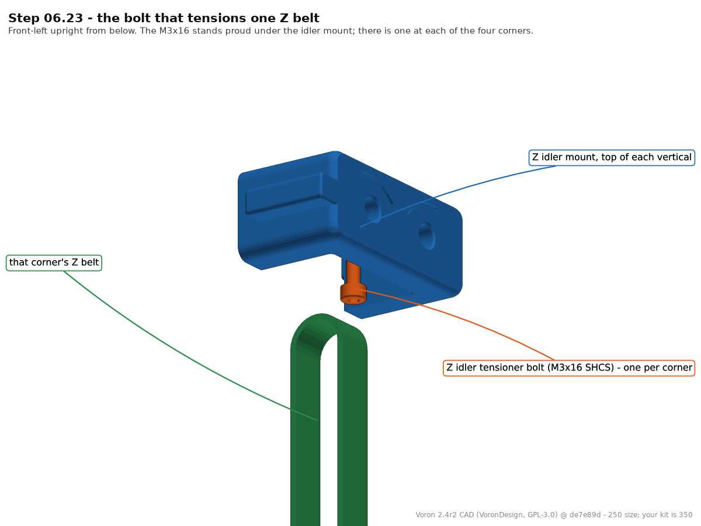
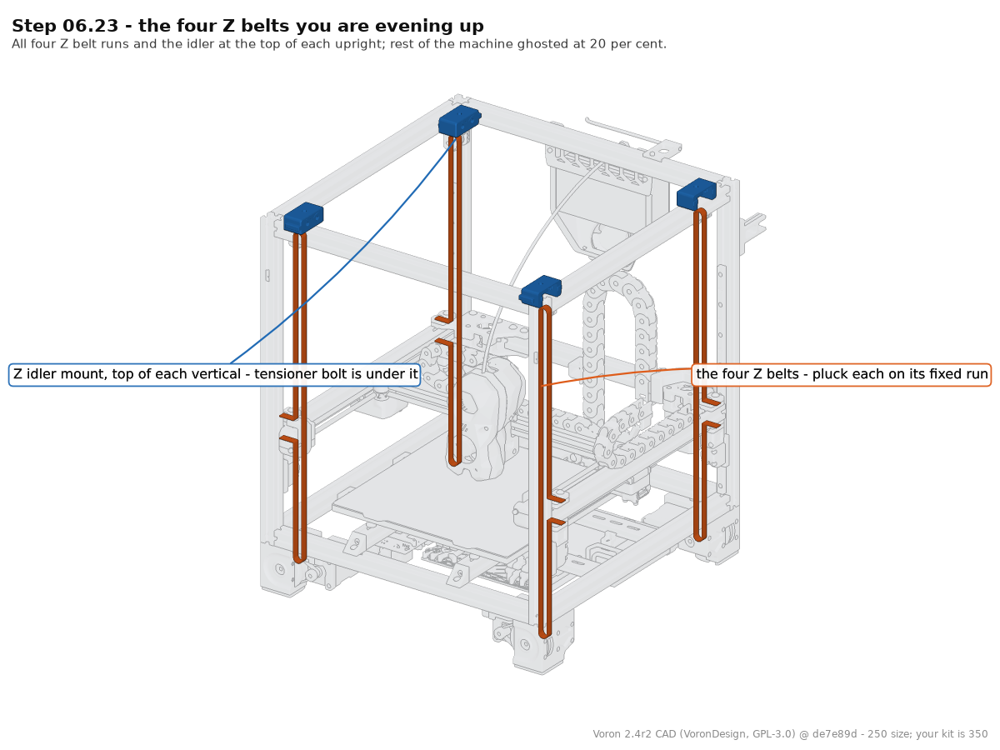

**What you're looking at:** The Z idler at the top of one upright, seen from underneath — the small bolt standing proud below it is the tensioner, and turning it changes that corner's belt tension — and the four Z belts that hang the gantry, one down each upright, each running from its drive at the bottom, up over the idler at the top, and back to the gantry corner. This step is done by ear: plucking a belt and listening is a rough tension reading, and the four Z belts need to be close to equal or the gantry will not sit flat and QGL will not repeat. The real number (140 Hz over a measured 150 mm span) needs the gantry moving under power, so it waits for Part B.

**Parts:** none.

**Do:** Pluck each of the four Z belts on the short run between the top belt clip and the Z idler and listen. They will not be equal yet. Bring them close by adjusting each corner's **Z idler tensioner bolt** at the top of the upright — head under the orange slider, 2.5 mm key from below, clockwise looking up = tighter — a few turns at a time, going round all four. Aim for four notes that sound the same; the measured **140 Hz over a 150 mm span** target is set properly at Step 06b.3, once the gantry can be moved under power.

**Check:** All four belts sound within a semitone or so of each other. Lift one corner of the gantry by hand — all four carriages move together and the gantry stays roughly level.

Tip: The CAD idler height is the 250 machine's. There is one of these at each of the four corners either way.

Source: [Voron manual p.121](https://github.com/VoronDesign/Voron-2/blob/de7e89d/Manual/Assembly_Manual_2.4r2.pdf#page=121) · [Voron docs § Secondary printer tuning — A/B and Z belts](https://docs.vorondesign.com/tuning/secondary_printer_tuning.html) · CAD: Voron 2.4r2 STEP @ de7e89d

---

### Step 06.24 — Square the gantry to the A/B drives and lock the X axis

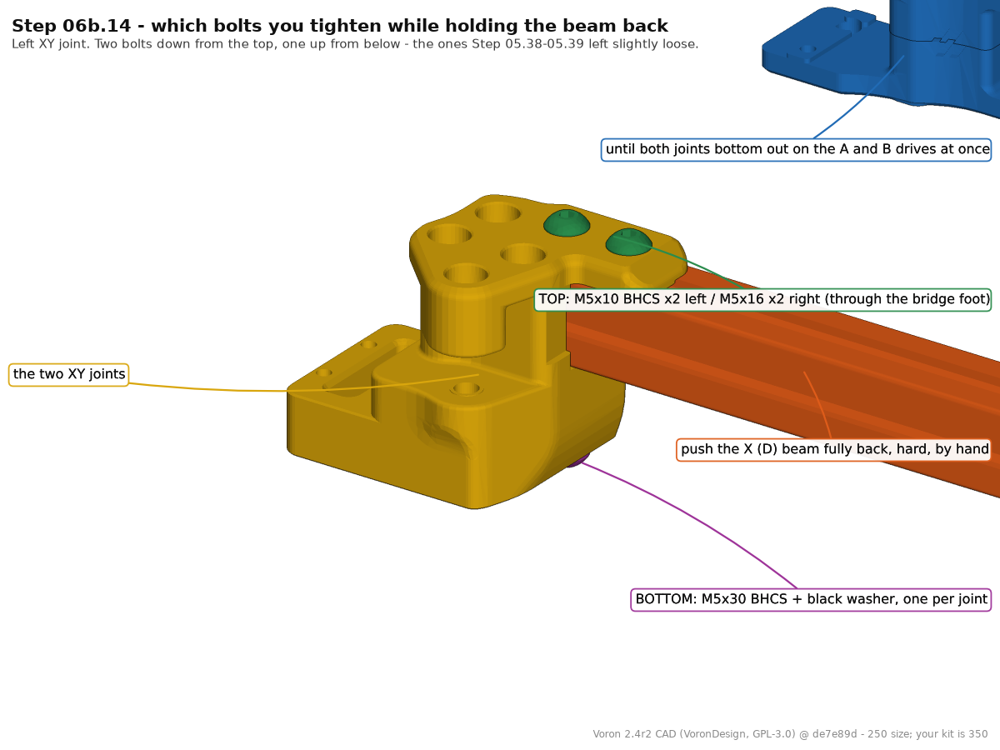

**What you're looking at:** Pushing the X extrusion back until both XY joints touch their drive units uses the two rear drive blocks as a square: if the extrusion is square to the Y axes, both sides make contact at the same instant. This is a mechanical pre-square — enough to belt the machine, nothing like enough to print with.

**Parts:** none.

**Do:** *"Move the gantry all the way back until it hits the A and B drive on both sides. Fully tighten all screws on the X axis."* Push the X extrusion back until the X/Y joints bottom out against the A drive on the right and the B drive on the left **at the same moment**. Hold it there and tighten the six bolts that clamp the XY joints to the X beam — at each joint the two BHCS from above (M5×10 left / M5×16 right, Step 05.38; green in the render) and the one M5×30 + black washer from below (Step 05.39; purple). *Not* the M3×30 / M5×30 belt-clamp pair beside them, *not* the rail screws — "all screws on the X axis" means these six. If one side hits first, the A/B drives are not equally spaced: *"loosen the bolts that secures the B drive to the rear gantry extrusion"*, push the gantry back again so both sides land together, and re-tighten.

**Check:** Looking down from above (as the two views on p.122 show), the X extrusion is parallel to the rear frame extrusion when pushed fully back, and parallel to the front frame extrusion when pushed fully forward. Both X/Y joints touch their drives at the same time.

Tip: This is a mechanical pre-square only. The manual's own QR code on this page ([voron.link/cekh81l](https://voron.link/cekh81l)) points at the full procedure, which is Part B of this chapter.

Source: [Voron manual p.122](https://github.com/VoronDesign/Voron-2/blob/de7e89d/Manual/Assembly_Manual_2.4r2.pdf#page=122) · [Voron docs § V2 Gantry Squaring](https://docs.vorondesign.com/build/mechanical/v2_gantry_squaring.html) · CAD: Voron 2.4r2 STEP @ de7e89d · [Video: Part 6 @1:34:55](https://www.youtube.com/watch?v=8pWoYkY1DiA&list=PL0fUJbigELQPqpeGOgHYisG4KaSXVtnNY&t=5695s)

---

### Step 06.25 — Release the gantry and check it moves freely

**What you're looking at:** With four belts on, the gantry holds its own weight; the zip ties and the mid-rail stoppers were only scaffolding. Turning a Z drive by hand is the first end-to-end test of a whole corner at once — belt, both clamps, drive pulley and idler.

**Parts:** none.

**Do:** *"REMOVE ZIPTIES — With the belts installed the gantry will stay in position."* Cut any long zip ties from step 06.13 and unscrew the four rubber rail stoppers from mid-rail (put them back at the rail ends, or fit the printed `z_rail_stop_x4`). Then turn one Z drive pulley by hand a few turns and watch that corner rise; do the same at each corner. Never spin a connected stepper fast by hand — back-EMF kills drivers (survey §4.4 #10) — and at this point the steppers are not wired anyway.

**Check:** The gantry stays where the belts hold it with nothing supporting it. Turning any Z drive by hand raises that corner smoothly with no belt slip and no rubbing against printed parts.

Source: [Voron manual p.122](https://github.com/VoronDesign/Voron-2/blob/de7e89d/Manual/Assembly_Manual_2.4r2.pdf#page=122)

Pause: ~35 min since the last pause — gantry squared against the A/B drives, X axis locked and released, everything moving freely by hand. Leave the machine powered off.

---

### Step 06.26 — Close out the mechanical Z axis

**What you're looking at:** A closing page with no build content of its own. The Z [drag chain](16-glossary.md#d) is the plastic link chain that carries cables from the fixed frame up to the moving gantry; its two black frame mounts and two orange retainer brackets are printed here and fitted in Ch 10. Preparing the links now is purely convenience — the latches are far easier to work when you are not also holding a chain full of wires.

**Parts:** `z_chain_bottom_anchor` ×1, `z_chain_guide` ×1, `[a]_z_chain_retainer_bracket_x2` ×2, the 10×15 mm R28 drag chain.

**Do:** p.123 carries no build content. Before you leave this chapter, bag the Z cable-chain parts together and label the bag **"Ch 10 — Z chain, manual p.200–204"**: the two black frame mounts, the two orange retainer brackets and the drag chain. Prepare the chain now while you are not holding anything else — LDO's guide: open the link latches with a **2.5 mm flat screwdriver** on the side carrying the small screwdriver icon (prying the wrong side breaks the latch), and expand the notch on the notched end link with cutting pliers so that end link can bend too. Chain length and the actual mounting are Ch 10. [src](https://docs.ldomotors.com/en/guides/cable_chain_guide)

**Check:** One labelled bag, latches opening and closing with an audible click, one end link modified.

Source: [Voron manual p.123](https://github.com/VoronDesign/Voron-2/blob/de7e89d/Manual/Assembly_Manual_2.4r2.pdf#page=123) · [LDO cable-chain guide](https://docs.ldomotors.com/en/guides/cable_chain_guide)

Pause: ~15 min since the last pause — Z axis mechanically complete and logged. Stop here and go to Ch 07: Part B below cannot start until Ch 13 hands off to it at Step 13.34.

---

## Checkpoint 06

- [ ] Four `z_joint_upper` blocks fitted, each with its M5 nut seated, **cutouts facing outward**
- [ ] Zero 6×3 magnets used; zero `z_joint_upper_hall_effect` parts printed or fitted
- [ ] Four `z_joint_lower` on the Z carriages, four M3×20 SHCS each, all four bolted flat
- [ ] Four M5×40 SHCS in, **all still light** — they are torqued hot in Ch 14, not now and not in Part B
- [ ] Four Z belts routed drive → idler → clamp, teeth engaged on every pulley, none twisted
- [ ] Both belt ends clamped at every corner (lower clip and top clip), tails folded and zip-tied
- [ ] Four belts pluck to roughly the same note; nothing rubs anywhere in ±30 mm of Z travel
- [ ] The six XY-joint-to-X-beam bolts (Steps 05.38–05.39) fully tightened with the gantry held back against both A/B drives (p.122); belt-clamp pair and rail screws untouched
- [ ] Gantry holds its own height on the belts; zip ties and mid-rail stoppers removed
- [ ] Z-chain parts bagged and labelled for Ch 10; chain latches tested, end link modified

## Common mistakes

- **Doing p.114 before p.115–116.** Wrestling a 350 gantry on long zip ties while trying to line up four joints. Fit the lower joints and rest the gantry on rubber rail stoppers instead — LDO note p.114–116.
- **Fitting the hall-effect block or a 6×3 magnet** because the manual shows it. This kit has none (LDO p.145). If you printed `z_joint_upper_hall_effect.stl`, you printed the wrong file.
- **The block's cutout facing inward.** It is the one orientation error on p.112 that the manual calls out, and it is invisible once the belt is on. Fix: check all four before belting.
- **Undoing the top belt clamp screws completely at p.117**, which releases the *bottom* clamped belt end as well — the same two screws hold both. Loosen, don't remove.
- **Cutting Z belts to 1200 mm and finding it is exactly not enough** after the wrap. Cut ~1400 mm — long enough to wrap, and it still leaves ~400 mm of the kit's 6 m spare. Cutting four at 1500 mm consumes the whole reel.
- **Torquing the M5×40 Z joint bolts now.** They stay light through Part B and get their final tighten hot, in Ch 14 (Voron squaring step 16). Tight joints here will fight every squaring adjustment you make.
- **Leaving a Z carriage unrestrained near the top of its rail.** It slides off, the balls go on the floor, and the carriage is scrap.

---

## Part B — Chapter 06b: Gantry squaring

> **Do this from inside Chapter 13, not now.** Come back here from [Ch 13 Step 13.34](13-initial-startup.md#step-1334-hand-off-to-ch-06b-square-the-gantry-then-re-tension-ab), once the machine homes and QGLs: the procedure needs `SET_IDLE_TIMEOUT`, `G28`, `QUAD_GANTRY_LEVEL` and `SET_STEPPER_ENABLE`. It is done **cold, with the machine open**, and it ends at Step 06b.16 by sending you back to Ch 13 Step 13.35. Final belt tension (Ch 14 Steps 14.4–14.5, cold, door open) and then the heat soak, the hot QGL runs and the hot tighten of the Z joints (Step 14.6) are Ch 14's, after the panels go on in Ch 11 Part B.

**Why it is split out:** the procedure's first moves are to *fully release A/B belt tension* and *drop the lower Z joints*. Anything you tension before this gets undone (survey §5.2 W1, §4.4 #2). Ch 07's A/B tension is therefore provisional — and so is the one you set at step 06b.15 below. A/B tension is set three times on purpose: Ch 07 (provisional — enough to home and QGL), Ch 06b Step 06b.15 (provisional again, after squaring, machine cold and open) and Ch 14 Step 14.4 (final — panels on, machine cold, door open, immediately before the closed-chamber soak and hot Z-joint tighten of Step 14.6). Z belts: Ch 06b Step 06b.3 (so QGL converges for squaring), set for the last time at Ch 14 Step 14.5, in the same cold session.

**Part B is transcribed from:** [V2 Gantry Squaring, docs.vorondesign.com](https://docs.vorondesign.com/build/mechanical/v2_gantry_squaring.html) — 17 numbered steps. Steps 1–13 are transcribed below with the original number cited on each (plus one added Z-belt step); steps 14–17 (soak, hot QGL, hot Z-joint tighten, restart) are handed to Ch 14 at Step 06b.16. [Ellis' identical section](https://ellis3dp.com/Print-Tuning-Guide/articles/voron_v2_gantry_squaring.html) is the same text. The manual's own p.122 QR ([voron.link/cekh81l](https://voron.link/cekh81l)) points here.

**Extra tools for Part B:** 150 mm machinist square, digital caliper, 150 mm rule, phone spectrum app, hex 2/2.5/3/4 mm.

Tip: [Z Locks](https://github.com/VoronDesign/VoronUsers/tree/master/printer_mods/tallman5/z-locks/) make step 06b.8 easier by holding the gantry while the joints are off. Not required. [src](https://docs.vorondesign.com/build/mechanical/v2_gantry_squaring.html)

Source: [Voron docs § V2 Gantry Squaring](https://docs.vorondesign.com/build/mechanical/v2_gantry_squaring.html)

---

### Step 06b.1 — Raise the stepper idle timeout

(no image — see text)

**What you're looking at:** A console command; nothing to look at. Klipper de-energises idle steppers by default (600 s), and with the Z motors released the gantry simply falls. This sets the timeout to effectively never for the length of the session — which is why it is the first thing you do, before any belt is plucked or any bolt is touched.

**Parts:** none.

**Do:** In the console: `SET_IDLE_TIMEOUT TIMEOUT=99999`. The Z motors must stay energised and holding the gantry for the entire session — if they time out mid-procedure the gantry drops onto whatever is under it. Nothing else in Part B happens before this. (Voron step 1.)

**Check:** Command accepted, no error. The Z motors are audibly holding.

Source: [Voron docs § V2 Gantry Squaring, step 1](https://docs.vorondesign.com/build/mechanical/v2_gantry_squaring.html)

---

### Step 06b.2 — Home and level

(no image — see text)

**What you're looking at:** `G28` homes the machine; `QUAD_GANTRY_LEVEL` ([QGL](16-glossary.md#q)) probes four points and drives the four Z motors independently until the gantry is parallel to the bed. QGL corrects **height only** — it cannot see racking, which is exactly what the rest of this procedure exists to fix.

**Parts:** none.

**Do:** `G28`, then `QUAD_GANTRY_LEVEL`. Let it complete cleanly. From here on the machine stays homed and the Z motors stay holding — every later step assumes both. (Voron step 2.)

**Check:** QGL converges within its retry limit. If it will not, stop and fix that first — a machine that cannot QGL cannot be squared by this procedure.

Source: [Voron docs § V2 Gantry Squaring, step 2](https://docs.vorondesign.com/build/mechanical/v2_gantry_squaring.html)

---

### Step 06b.3 — Set the Z belts to 140 Hz

(no image — see text)

**What you're looking at:** This one is done with a phone. Plucking a *measured* 150 mm span and reading the lowest peak in a spectrum app is what turns belt tension from an opinion into a number; 140 Hz over that span is Voron's figure for the 9 mm Z belt. Four Z belts at four different tensions make QGL wander, which would waste the whole squaring session. The Z motors are holding the gantry while you do this — that is why it comes after Steps 06b.1–06b.2 and not before.

**Parts:** none.

**Do:** *Added step — not in the official squaring procedure; do it here, only after the idle timeout is raised and the machine is homed, so the Z motors hold the gantry the whole time.* Jog the gantry up until the top belt clip on a Z bearing block is **150 mm below that corner's Z idler pulley centre** — rule from the idler axle down to the clip. Pluck the short vertical run between clip and idler and read the lowest peak in your spectrum app. (Voron's *"fixed side"* is this end of the belt, the one fixed at the joint — verify on bench.) The tensioner head is under the orange slider: 2.5 mm key from below, clockwise as you look up at the head = tighter (Ch 02 Step 02.39; verify on bench — the note rises). Adjust until the lowest peak reads **≈140 Hz**. Do all four. Then move the gantry down a few centimetres and back up and re-check all four, and finish with one more `QUAD_GANTRY_LEVEL` — moving a tensioner moves that corner. Uneven Z belts are one of the named causes of a high-σ, non-repeatable QGL — squaring a machine with mismatched Z belts wastes the session (survey §4.3). This is the working setting QGL squares from; [Ch 14 Step 14.5](14-calibration.md#step-145-set-the-four-z-belts-to-140-hz-over-150-mm) sets it for the last time, cold, in the same session as the final A/B tension and before the closed-chamber soak. [src](https://docs.vorondesign.com/tuning/secondary_printer_tuning.html)

**Check:** All four Z belts read 140 Hz ±5 Hz, and they still do after the gantry has moved and come back; QGL converges again afterwards.

Source: [Voron docs § V2 Gantry Squaring, step 1](https://docs.vorondesign.com/build/mechanical/v2_gantry_squaring.html) (prerequisite) · [Voron docs § Secondary printer tuning — A/B and Z belts](https://docs.vorondesign.com/tuning/secondary_printer_tuning.html) · [Ellis' Print Tuning Guide § V2 gantry squaring](https://ellis3dp.com/Print-Tuning-Guide/articles/voron_v2_gantry_squaring.html)

---

### Step 06b.4 — Park the gantry in the middle

(no image — see text)

**What you're looking at:** Parking the gantry mid-volume is purely about access: the steps that follow need a hex key on the XY joint bolts from above *and* from below.

**Parts:** none.

**Do:** Jog the gantry to the centre of the build volume from Mainsail or the touchscreen. You need to reach both the top and the bottom of the gantry comfortably. (Voron step 3.)

**Check:** You can get a hex key onto an XY-joint bolt from above and from below without contorting.

Source: [Voron docs § V2 Gantry Squaring, step 3](https://docs.vorondesign.com/build/mechanical/v2_gantry_squaring.html)

---

### Step 06b.5 — Disable only the A and B motors

(no image — see text)

**What you're looking at:** Disabling only the two CoreXY motors lets you push the X extrusion around by hand. The Z motors stay energised because they, and nothing else, are holding the gantry off the bed.

**Parts:** none.

**Do:** `SET_STEPPER_ENABLE STEPPER=stepper_x ENABLE=0` then `SET_STEPPER_ENABLE STEPPER=stepper_y ENABLE=0`. **Only** these two. The Z motors stay enabled — they are what is holding the gantry. (Voron step 4.)

**Check:** The X carriage now moves freely by hand; the gantry does not sink.

Source: [Voron docs § V2 Gantry Squaring, step 4](https://docs.vorondesign.com/build/mechanical/v2_gantry_squaring.html)

---

### Step 06b.6 — Release the A/B belt tension completely

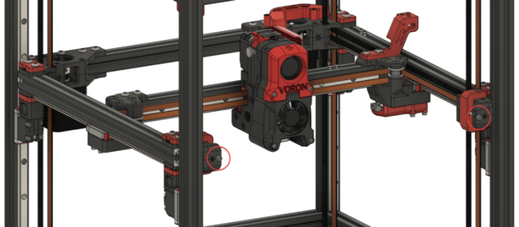

**What you're looking at:** The two front idler tensioners, backed fully off. The A/B belts pull the X extrusion diagonally, so any tension left in them drags the gantry back out of alignment while you are trying to align it — which is why this happens before anything else is loosened.

**Parts:** none.

**Do:** Back both front idler tensioners fully off. *"Your belts should be fully disengaged. If there is still remaining tension with the idlers fully backed off, you may need to release the belt ends from the X carriage."* Leftover A/B tension pulls the gantry out of alignment while you are trying to align it. (Voron step 5.)

**Check:** Both A/B belts are slack enough to lift off their runs by 10 mm with one finger.

Source: [Voron docs § V2 Gantry Squaring, step 5](https://docs.vorondesign.com/build/mechanical/v2_gantry_squaring.html) · image [`Gantry-ABTension.png`](https://raw.githubusercontent.com/VoronDesign/Voron-Documentation/master/build/mechanical/images/v2_gantry_squaring/Gantry-ABTension.png)

---

### Step 06b.7 — Confirm access to the Z and XY joints (the side panels are not on yet)

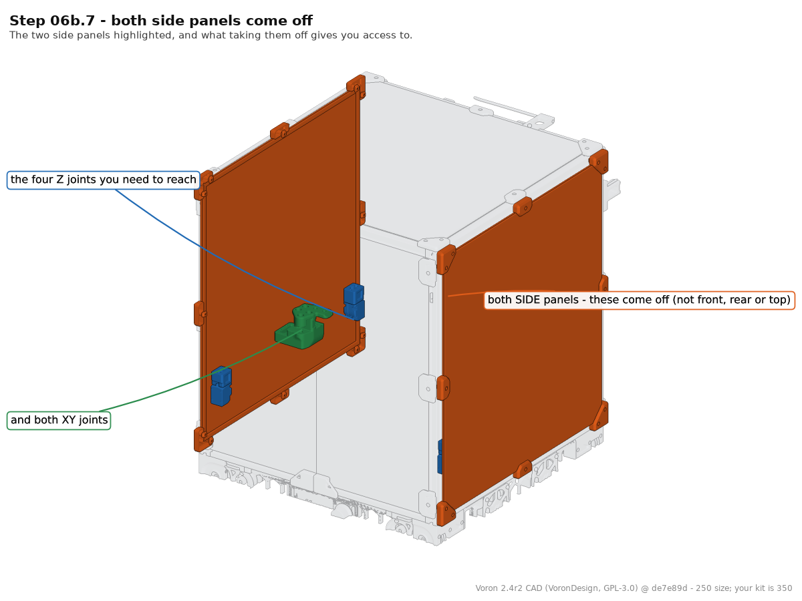

**What you're looking at:** Voron's step 6 is written for a finished, panelled machine and takes the two side panels off purely for access. The render shows that: the side panels of the enclosure, and behind them the four Z joints in the corners and the two XY joints on the gantry — the parts every step in Part B has to reach from outside the frame.

**Parts:** none.

**Do:** Voron's step 6 assumes a finished machine. Your side, back and top panels are not on yet — Ch 13 runs with them off, and [Ch 11 Part B](11-skirts-panels-door.md#part-b-after-ch-13) fits them after it — so there is nothing to remove. Confirm instead that all four Z joints and both XY joints are reachable from outside the frame with a hex key, top and bottom, and move anything leaning against the frame out of the way. (Voron step 6.)

**Check:** Clear access to all four Z joints and both XY joints.

Source: [Voron docs § V2 Gantry Squaring, step 6](https://docs.vorondesign.com/build/mechanical/v2_gantry_squaring.html) · CAD: Voron 2.4r2 STEP @ de7e89d

---

### Step 06b.8 — Unscrew and drop the lower Z joints

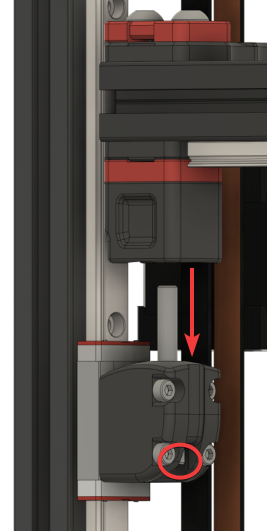
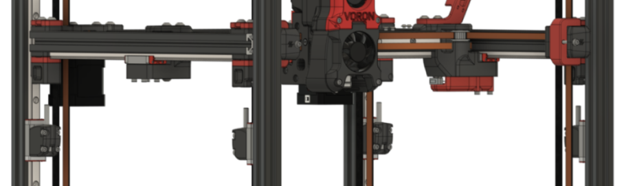

**What you're looking at:** The four lower Z joints, unbolted and slid down their rails, away from the gantry. With them out of the way the gantry hangs on nothing but its four Z belts and can settle into its own natural position instead of the position the joints were forcing on it — which is the position you are about to build the joints back to.

**Parts:** the four M5×40 SHCS from step 06.14.

**Do:** Take the M5×40 out of each Z joint and slide the four lower joints down their rails, away from the gantry. *"Your gantry will now be floating on just the belts."* Do one at a time and keep a hand on the gantry. (Voron step 7.)

> **Warning (Voron):** *"Make sure your printer is on a (fairly) level surface. Unlevel surfaces could cause your gantry to swing too much to one side. It doesn't have to be perfectly level; just don't do it on a hill!"*

**Check:** All four lower joints are clear of the gantry, the gantry hangs on the four Z belts alone, and it is not swinging.

Source: [Voron docs § V2 Gantry Squaring, step 7](https://docs.vorondesign.com/build/mechanical/v2_gantry_squaring.html) · images [`ZJoint-Lowered.png`](https://raw.githubusercontent.com/VoronDesign/Voron-Documentation/master/build/mechanical/images/v2_gantry_squaring/ZJoint-Lowered.png), [`ZJoints-Lowered.png`](https://raw.githubusercontent.com/VoronDesign/Voron-Documentation/master/build/mechanical/images/v2_gantry_squaring/ZJoints-Lowered.png)

---

### Step 06b.9 — Partially loosen the X/Y joints

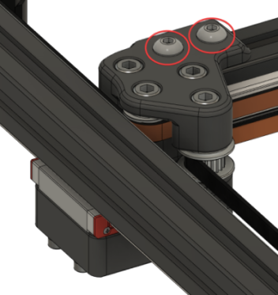
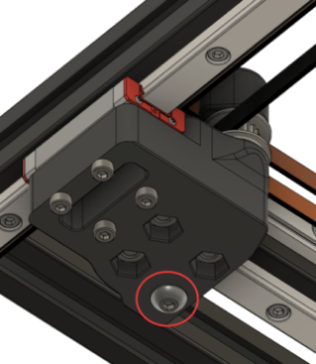

**What you're looking at:** The three bolts that clamp each XY joint to the X beam — two BHCS down from above (M5×10 on the left joint, M5×16 on the right, Step 05.38; green in the render) and one M5×30 with its black washer up from below (Step 05.39; purple) — the same six bolts you torqued at Step 06.24. Loosened just enough, each joint slides along the X extrusion, and that is how the gantry's width gets adjusted. From below, each joint also shows the M3×30 / M5×30 pair from Step 06.7 passing through the Z bearing block: that pair is *not* part of this step — it carries both Z belt clamps, and the gantry is hanging from those belts right now.

**Parts:** none.

**Do:** At each XY joint loosen only the three bolts that clamp the joint to the X beam: the two BHCS from above (Step 05.38) and the one M5×30 + washer from below (Step 05.39) — the bolts the render picks out — on **both** sides. Loose enough that the printed part can be slid along the extrusion by hand, no looser. (Voron step 8.1.)

⚠ **Do not touch the M3×30 / M5×30 pair beside them that passes through the Z bearing block while the gantry hangs on the belts.** Those two hold both ends of the Z belt this corner is hanging from (Step 06.7); easing them lets a belt end creep and drops that corner. Voron's own warning: *"Where there are Z belt clamps, ensure that you do not loosen the bolts to the point of the Z-belts releasing. Only loosen enough to allow for adjustments."*

**Check:** Each X/Y joint slides along its extrusion under firm hand pressure; the belt-clamp pair at every corner is untouched and no Z belt end has slipped.

Source: [Voron docs § V2 Gantry Squaring, step 8.1](https://docs.vorondesign.com/build/mechanical/v2_gantry_squaring.html) · images [`XYLoosen-Top.png`](https://raw.githubusercontent.com/VoronDesign/Voron-Documentation/master/build/mechanical/images/v2_gantry_squaring/XYLoosen-Top.png), [`XYLoosen-Bottom.png`](https://raw.githubusercontent.com/VoronDesign/Voron-Documentation/master/build/mechanical/images/v2_gantry_squaring/XYLoosen-Bottom.png) · CAD: Voron 2.4r2 STEP @ de7e89d

---

### Step 06b.10 — Partially loosen the A/B joints and the front idlers

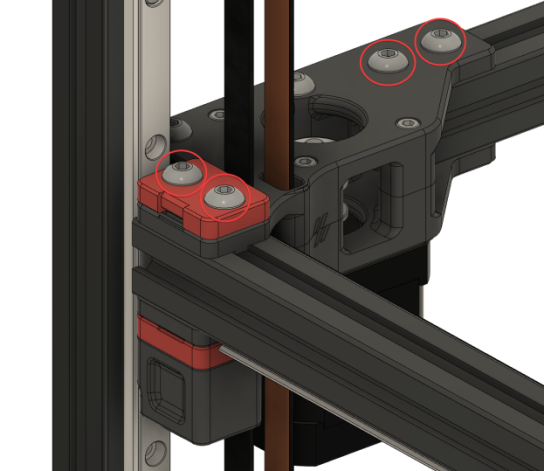
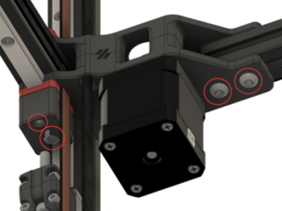
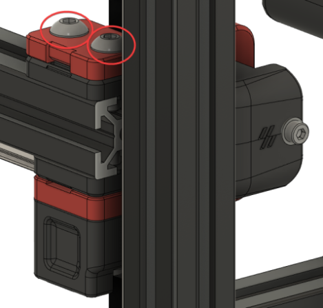
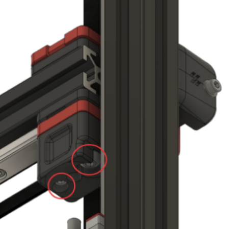

**What you're looking at:** The same treatment on the two A/B drive blocks and the two front idler blocks — the other four printed assemblies clamped to the Y extrusions. With all six sliding, the gantry rectangle can be reshaped in both directions; the good/bad reference images at Step 06b.11 exist because a block can also *rotate* while you slide it.

**Parts:** none.

**Do:** Same treatment on both A/B drive units, top and bottom, and on both front idler assemblies, top and bottom. The Voron pages repeat one warning on each: *"Don't overdo the belt clamps!"* (Voron steps 8.2 and 8.3.)

**Check:** All six printed assemblies on the Y extrusions can be nudged along the extrusion by hand. Every belt is still clamped.

Source: [Voron docs § V2 Gantry Squaring, step 8.2–8.3](https://docs.vorondesign.com/build/mechanical/v2_gantry_squaring.html) · images [`ABLoosen-Top.png`](https://raw.githubusercontent.com/VoronDesign/Voron-Documentation/master/build/mechanical/images/v2_gantry_squaring/ABLoosen-Top.png), [`ABLoosen-Bottom.png`](https://raw.githubusercontent.com/VoronDesign/Voron-Documentation/master/build/mechanical/images/v2_gantry_squaring/ABLoosen-Bottom.png), [`IdlersLoosen-Top.png`](https://raw.githubusercontent.com/VoronDesign/Voron-Documentation/master/build/mechanical/images/v2_gantry_squaring/IdlersLoosen-Top.png), [`IdlersLoosen-Bottom.png`](https://raw.githubusercontent.com/VoronDesign/Voron-Documentation/master/build/mechanical/images/v2_gantry_squaring/IdlersLoosen-Bottom.png)

---

### Step 06b.11 — Level the gantry onto the Z joints

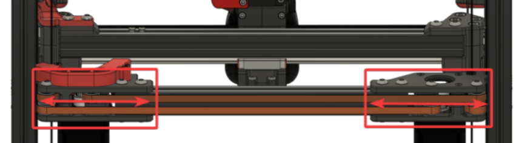
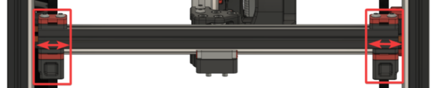
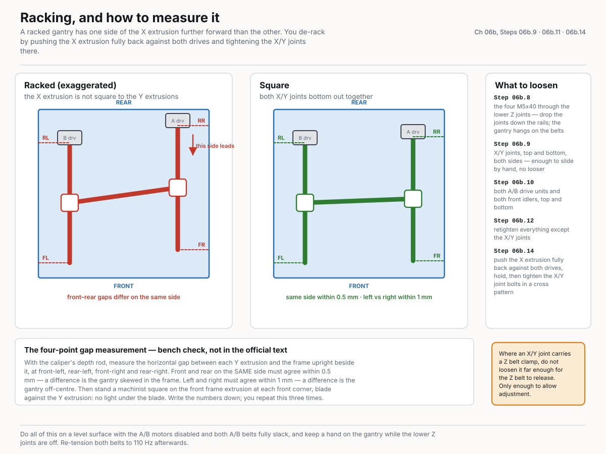

**What you're looking at:** This is the actual squaring. You slide the six loosened assemblies along their extrusions until the gantry's four corners land exactly over the four lower Z joints. The acceptance test is mechanical rather than visual: with the joint raised, the M5×40 must drop in by hand without being coaxed, at all four corners. The diagram's measurement half shows a racked gantry against a square one, with the same four points — front-left, rear-left, front-right, rear-right — marked for the front/rear-within-0.5mm and left/right-within-1mm tolerances below.

**Parts:** none.

**Do:** This is the point of everything above. Slide the gantry components along their extrusions — closer together or further apart, at the rear (X) and at the sides (Y) — until the gantry sits perfectly on top of the four lower Z joints. The two acceptance conditions, verbatim: *"The Z joints feel perfectly flush along the side"*, and *"When raising and lowering your lower Z joint by hand, the bolt slides in perfectly without hitting the sides."* Test the second one at each corner: raise the lower joint to the block and try to start the M5×40 by hand — it should drop in without being coaxed. Then check you have not rotated an A/B joint in the process (compare the good/bad images below). (Voron steps 9.1 and 9.2.)

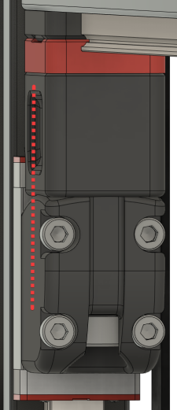
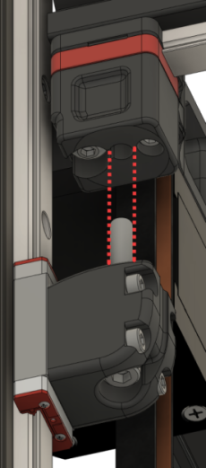
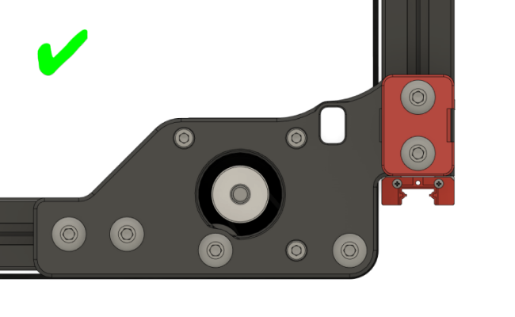
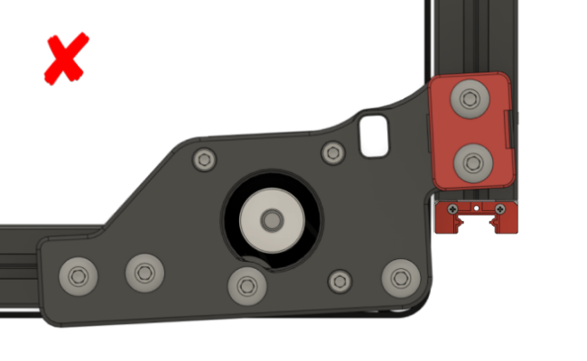

**Check:** Both Voron conditions met at all four corners — joint flush along the side, M5×40 starts by hand without coaxing — and no A/B joint rotated. Four-point gap measurement inside tolerance.

??? note "The four-point gap measurement (bench check, not in the official text)"

    With the caliper's depth rod, measure the horizontal gap between each **Y extrusion** and the frame upright beside it, at front-left, rear-left, front-right and rear-right. Front and rear **on the same side** must agree within **0.5 mm** — a difference is the gantry skewed in the frame. Left and right must agree within **1 mm** — a difference is the gantry off-centre. Then stand a machinist square on the front frame extrusion at **each front corner**, blade against the Y extrusion: no light under the blade at either corner. Write the numbers down; you repeat this at 06b.12 and 06b.14.

    | Point | Measured (mm) | Pass |
    |---|---|---|
    | Front-left (left Y ↔ front-left upright) | | |
    | Rear-left (left Y ↔ rear-left upright) | | |
    | Front-right (right Y ↔ front-right upright) | | |
    | Rear-right (right Y ↔ rear-right upright) | | |

Source: [Voron docs § V2 Gantry Squaring, step 9.1–9.2](https://docs.vorondesign.com/build/mechanical/v2_gantry_squaring.html) · images [`XAdjust.png`](https://raw.githubusercontent.com/VoronDesign/Voron-Documentation/master/build/mechanical/images/v2_gantry_squaring/XAdjust.png), [`YAdjust.png`](https://raw.githubusercontent.com/VoronDesign/Voron-Documentation/master/build/mechanical/images/v2_gantry_squaring/YAdjust.png), [`Alignment-Side.png`](https://raw.githubusercontent.com/VoronDesign/Voron-Documentation/master/build/mechanical/images/v2_gantry_squaring/Alignment-Side.png), [`Alignment-Hole.png`](https://raw.githubusercontent.com/VoronDesign/Voron-Documentation/master/build/mechanical/images/v2_gantry_squaring/Alignment-Hole.png), [`Alignment-AB-Good.png`](https://raw.githubusercontent.com/VoronDesign/Voron-Documentation/master/build/mechanical/images/v2_gantry_squaring/Alignment-AB-Good.png), [`Alignment-AB-Bad.png`](https://raw.githubusercontent.com/VoronDesign/Voron-Documentation/master/build/mechanical/images/v2_gantry_squaring/Alignment-AB-Bad.png)

---

### Step 06b.12 — Retighten everything except the X/Y joints

(no image — see text)

**What you're looking at:** Everything you loosened gets tightened again except the XY joints. Those stay free because the next step pushes the X extrusion hard against the two drive units and tightens the joints in *that* position — the extrusion has to be able to find it first.

**Parts:** none.

**Do:** Tighten every extrusion bolt you loosened at steps 06b.9–06b.10 **except the three joint-to-beam bolts at each X/Y joint** (Step 06b.9's) — those get tightened during the de-racking step. The Z belt-clamp pair at each corner stays untouched, as it has been throughout. Voron: *"Ensure that your Z joints still align properly. Sometimes, tightening can move things around."* Re-run the flush-and-bolt-slides check at all four corners after tightening. (Voron step 10.)

**Check:** A/B joints and front idlers are tight; the M5×40 still starts by hand at all four Z joints; the four-point measurement from 06b.11 is unchanged.

Source: [Voron docs § V2 Gantry Squaring, step 10](https://docs.vorondesign.com/build/mechanical/v2_gantry_squaring.html)

---

### Step 06b.13 — Reinstall the lower Z joints, lightly

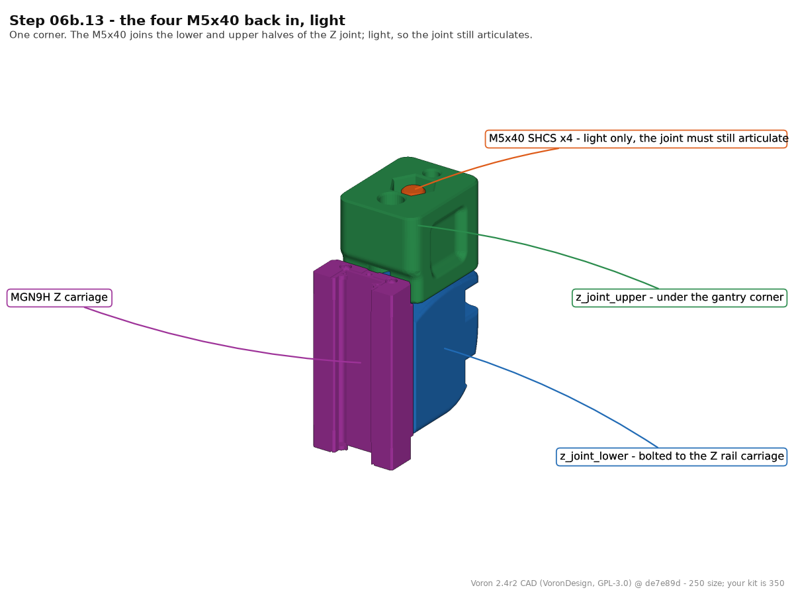
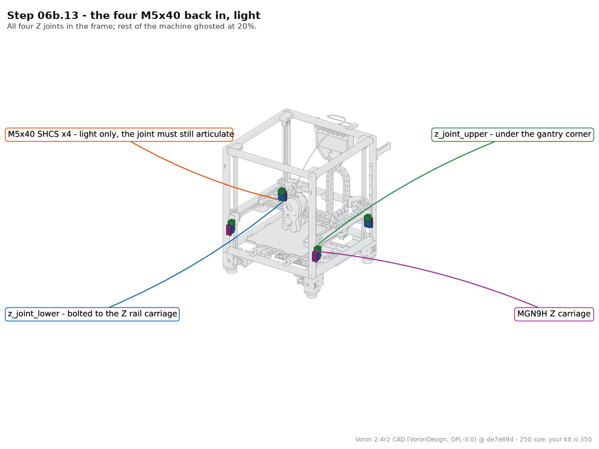

**What you're looking at:** The four M5×40 go back in, light again. Light because the de-racking and the QGL runs that follow both need the joints free to articulate; they get their one and only full tighten hot, at Ch 14 Step 14.6, once the chamber can close. A Z joint at one corner — the lower block rides the Z rail carriage, the upper block sits under the gantry corner, and one M5x40 joins the two; left light, the pair can still pivot.

**Parts:** M5×40 SHCS ×4.

**Do:** Slide the four lower joints back up and run the M5×40 into each one — *"lightly tighten the M5 bolts. Don't fully tighten them down yet - just lightly. The joint should still be able to articulate freely."* (Voron step 11.)

**Check:** All four in. Each joint still articulates when you push the gantry corner sideways.

Source: [Voron docs § V2 Gantry Squaring, step 11](https://docs.vorondesign.com/build/mechanical/v2_gantry_squaring.html) · CAD: Voron 2.4r2 STEP @ de7e89d

---

### Step 06b.14 — De-rack the gantry, then tighten the X/Y joints

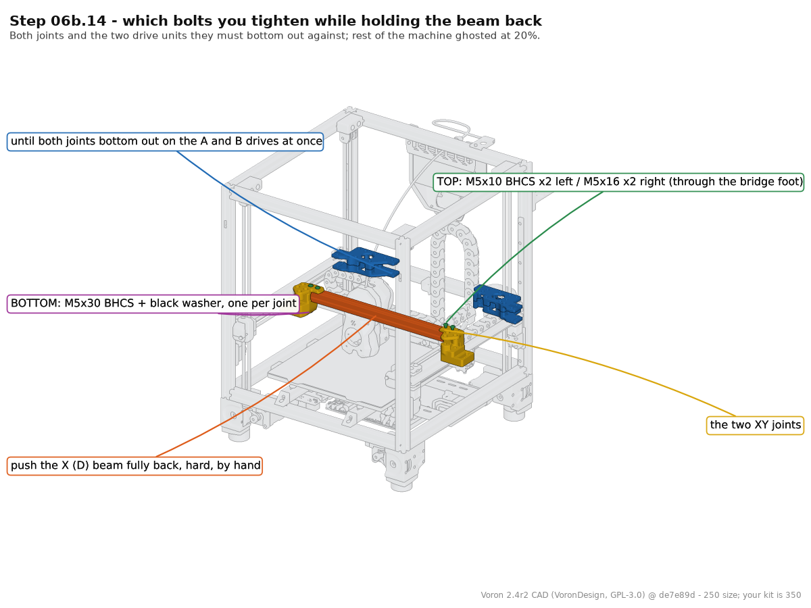

**What you're looking at:** [Racking](16-glossary.md#r) is the gantry sitting as a parallelogram instead of a rectangle — QGL passes happily on a racked gantry and the parts come out skewed. Pushing the X extrusion hard against both drive units squares it against the only reference the machine has, and tightening the joints while it is held there locks it in. The diagram's de-racking half shows which fasteners come loose and in what order — lower Z joints, X/Y joints, A/B joints and front idlers — and the one joint not to over-loosen: an X/Y joint that also carries a Z belt clamp. The XY joint clamped to the end of the X beam: two bolts come down from the top of the beam and one comes up from underneath, and those are the ones you tighten while the beam is held hard back against both drive units. This same render serves Steps 06.24, 06b.9 and 06b.12 — it identifies exactly the three bolts per joint those steps mean, and by omission the belt-clamp pair they do not.

**Parts:** none.

**Do:** With the A/B motors still disabled and the belts still slack, push the X extrusion **fully back** by hand until both X/Y joints bottom out against the A drive and the B drive — the same reference the manual uses on p.122. Hold it there hard, against both stops. Tighten the three joint-to-beam bolts at each X/Y joint (Steps 05.38–05.39 — the render's bolts, both sides; still not the belt-clamp pair) in a cross pattern, a bit at a time, so the extrusion cannot creep as they come up. The Voron doc delegates the method to [Nero3D's de-racking video](https://www.youtube.com/watch?v=cOn6u9kXvy0) rather than writing it out; this is that method in words.

> Voron's own note on this step: *"Make sure to come back here afterwards! The following steps are still important."*

**Check:** Release, push the gantry fully back again, and both X/Y joints contact their drive units at the same instant. Machinist square shows square at both front corners, pushed fully forward and again fully back.

??? note "If one side still leads"

    Loosen the X/Y joint bolts and repeat — the extrusion crept while they came up. If racking persists after two attempts, the community fallback is to loosen each A/B belt's anchor at the X carriage until the belt slides through under a firm pull, pull both belts to equal tension with pliers while feeling the tooth engagement, then re-anchor. Described in the Voron forum's de-racking thread. Re-measure the four points from 06b.11 afterwards and confirm the same-side pair still agrees within 0.5 mm.

Source: [Voron docs § V2 Gantry Squaring, step 12](https://docs.vorondesign.com/build/mechanical/v2_gantry_squaring.html) · [Nero3D — de-racking video](https://www.youtube.com/watch?v=cOn6u9kXvy0) · [Voron forum — de-racking thread](https://forum.vorondesign.com/threads/de-racking-again.1342/) · CAD: Voron 2.4r2 STEP @ de7e89d

---

### Step 06b.15 — Re-tension the A/B belts to 110 Hz (provisional, cold)

(no image — see text)

**What you're looking at:** The A/B belts get their second tension here — still provisional — because Step 06b.6 released whatever Ch 07 set, and the machine cannot yet be run hot and closed. 110 Hz measured over a 150 mm span is Voron's figure; a plucked frequency only means something with a stated span, which is why numbers from other sources are not interchangeable with it. A/B tension is set three times on purpose: Ch 07 (provisional — enough to home and QGL), Ch 06b Step 06b.15 (provisional again, after squaring, machine cold and open) and Ch 14 Step 14.4 (final — panels on, machine cold, door open, immediately before the closed-chamber soak and hot Z-joint tighten of Step 14.6). Z belts: Ch 06b Step 06b.3 (so QGL converges for squaring), set for the last time at Ch 14 Step 14.5, in the same cold session.

**Parts:** none.

**Do:** Move the X extrusion forward until the X/Y idler centres are **150 mm** from the front idler centres. Pluck that 150 mm span and adjust each front tensioner until the lowest peak reads **≈110 Hz**. The two belts affect each other — go back and forth until they are equal. Then move the X extrusion back a few centimetres, return, and re-check. (Voron step 13.) 110 Hz ≈ 2 lb, deliberately at the low end. Ignore voronldo.com's 80–100 Hz figure for a 350 — it names no span, which is what makes a frequency meaningful (survey §4.3). This is a cold, open-machine working value: Ch 14 Step 14.4 sets it for the last time with the panels on, cold and door open, just before the soak — do not chase the last few Hz here. [src](https://docs.vorondesign.com/tuning/secondary_printer_tuning.html)

**Check:** A and B read within a few Hz of each other at ~110 Hz, and still do after the gantry has been moved and brought back.

Source: [Voron docs § V2 Gantry Squaring, step 13](https://docs.vorondesign.com/build/mechanical/v2_gantry_squaring.html) · [Voron docs § Secondary printer tuning — A/B and Z belts](https://docs.vorondesign.com/tuning/secondary_printer_tuning.html) · [survey §4.3 / §7.5](../voron-build-instructions-survey.md)

---

### Step 06b.16 — Hand off: RESTART, then back to Ch 13 Step 13.35 — panels (Ch 11 Part B) and Ch 14's final tension and hot lock-in come after

(no image — see text)

**What you're looking at:** Voron's steps 14–17 — the heat soak, three to five hot QGL runs, the hot tighten of the four M5×40 and the restart — need a chamber that actually closes, and right now the back, side and top panels are not on yet and there is no door (Ch 11 Part B fits them after Ch 13). So the squaring stops here, cold: the gantry is square and de-racked, the Z joints are light and articulate, and the A/B belts are at a working tension. Everything hot belongs to Ch 14, which is the sole owner of final belt tension.

**Parts:** none.

**Do:** `RESTART`, so the idle timeout from Step 06b.1 goes back to the config default (Voron step 17 — done now rather than in Ch 14 because the M5×40 stay light for days, not minutes). Then go back to [Ch 13 Step 13.35](13-initial-startup.md#step-1335-re-heat-and-re-qgl-after-squaring) — `G28`, re-QGL, Z=0, bed mesh and the first cube — and finish Ch 13. Then fit the back, side and top panels and the Clicky-Clack door ([Ch 11 Part B](11-skirts-panels-door.md#part-b-after-ch-13)). The final A/B and Z belt tension (cold, door open — Steps 14.4–14.5), then the heat soak, the 3–5 hot QGL runs and the hot tighten of the four M5×40 Z-joint bolts (Step 14.6) are [Ch 14 Part B](14-calibration.md#part-b-belts-final-tension). Leave the four M5×40 **light** until then; nothing set in this part is final.

**Check:** `RESTART` completed and `SET_IDLE_TIMEOUT` is back to the config default. The four M5×40 are still light, the gantry holds its height, and your next page is Ch 13 Step 13.35.

Source: [Voron docs § V2 Gantry Squaring, steps 14–17](https://docs.vorondesign.com/build/mechanical/v2_gantry_squaring.html) · [Ch 14 Part B — Belts, final tension](14-calibration.md#part-b-belts-final-tension) · [Ch 11 Part B](11-skirts-panels-door.md#part-b-after-ch-13)

---

## Checkpoint 06b

- [ ] `SET_IDLE_TIMEOUT TIMEOUT=99999` set **first** (Step 06b.1), machine homed and QGL'd (06b.2) before any belt was plucked or any bolt touched
- [ ] Four Z belts measured at **140 Hz** over a 150 mm span (Step 06b.3), all four within ±5 Hz — set finally at Ch 14 Step 14.5 (cold, same session as 14.4)
- [ ] Only `stepper_x` and `stepper_y` were disabled; Z motors held the gantry throughout
- [ ] A/B belts were fully slack before any adjustment was made
- [ ] At every XY joint only the three joint-to-beam bolts (Steps 05.38–05.39) were loosened; the M3×30 / M5×30 Z belt-clamp pair was never touched
- [ ] Both A/B joints checked for rotation against the good/bad reference images
- [ ] At all four Z joints, the M5×40 starts by hand with the joint raised — no coaxing
- [ ] **Four-point gantry-to-frame gap recorded**: same-side front/rear within 0.5 mm, left/right within 1 mm
- [ ] Machinist square shows no light at **both** front corners, gantry forward and gantry back
- [ ] A/B belts re-tensioned to a provisional **110 Hz** over a 150 mm span, matched to each other — final value is Ch 14 Step 14.4
- [ ] Four Z joint M5×40 bolts **still light** — they are tightened hot in Ch 14, not here
- [ ] `RESTART` run at Step 06b.16; idle timeout back to default; next page is Ch 13 Step 13.35

## Common mistakes (06b)

- **Doing this before Ch 13.** Four of the seventeen steps are g-code. Attempting it dry means guessing at "level" with no QGL to check against.
- **Plucking the Z belts before the idle timeout is raised and the machine is homed.** Klipper's default 600 s timeout releases the Z motors mid-step and the gantry sags onto whatever is under it. Steps 06b.1–06b.2 first, every time.
- **Tensioning the A/B belts in Ch 07 — or here — and treating that as final.** Step 06b.6 undoes Ch 07's, and Ch 14 Step 14.4 sets the real one with the panels on, cold, immediately before the closed-chamber soak. Both earlier values are working values.
- **Loosening the wrong bolts at step 06b.9.** The gantry is hanging on the Z belts; the M3×30 / M5×30 pair through each Z bearing block holds both ends of that belt. Only the three joint-to-beam bolts move — and at 06b.10, "don't overdo the belt clamps" either.
- **Tightening the Z joints cold, here.** The point of the hot lock-in (Ch 14 Step 14.6) is freezing the gantry at full thermal expansion; cold-tightening throws that away and shows up as first-layer inconsistency. They stay light from 06b.13 until Ch 14, and light through the rest of Ch 13.
- **Skipping the de-racking step because QGL passed.** QGL levels the gantry in Z; it says nothing about whether the X extrusion is square to the Y axes. A racked gantry passes QGL happily and prints skewed parts.
- **Believing voronldo.com's tension numbers.** 80–100 Hz (A/B) and 110–130 Hz (Z) conflict with the official figures and name no span. Use 110 Hz and 140 Hz over 150 mm (survey §4.3).

## Next

**After Part A:** [Ch 07 — A/B belts and tensioning](07-ab-belts.md) (manual p.124–145) once Checkpoint 06 is clear; tension provisionally, because Part B will release it. **After Part B:** back to [Ch 13 Step 13.35](13-initial-startup.md#step-1335-re-heat-and-re-qgl-after-squaring) (re-heat, re-QGL, Z=0, mesh, first cube); then [Ch 11 Part B](11-skirts-panels-door.md#part-b-after-ch-13) (panels and door); then [Ch 14 Steps 14.4–14.6](14-calibration.md#part-b-belts-final-tension) for final belt tension (cold), then the hot soak and the hot Z-joint tighten.

Source: [Voron docs § V2 Gantry Squaring, steps 14–17](https://docs.vorondesign.com/build/mechanical/v2_gantry_squaring.html)

Pause: ~60 min since the last pause — gantry squared and de-racked cold, A/B belts at a provisional 110 Hz, four Z-joint M5×40 still light, `RESTART` run. Part B is one session by design: it starts by releasing all A/B tension, so stopping part-way leaves the machine unusable. Do not tighten the Z joints and do not chase the belt numbers — both are Ch 14's (belts cold at 14.4–14.5, joints hot at 14.6).
