# Chapter 07 — A/B belts and tensioning

Cut, route and clamp the two CoreXY belts, set a provisional tension, and finish the X carriage with the inductive probe. This makes the gantry a working XY motion system — everything after it (toolhead, wiring, bring-up) assumes the belts are on.

**What you're building in this chapter.** Two belt loops and the printed carriage that clamps them. In [CoreXY](16-glossary.md#c) neither motor owns an axis: the rear-**right** motor drives the **A** belt, the rear-**left** drives the **B** belt, and the toolhead moves in X when both turn the same way and in Y when they turn opposite ways. Each belt is one long loop that starts and ends at the [X carriage](16-glossary.md#x), and on a Voron the two loops sit at **different heights and never cross** — each stays in its own horizontal plane the whole way round. Where a belt has to be *driven* it wraps a toothed motor pulley teeth-first; everywhere it is merely turned, it runs **smooth-side-on** over a plain bearing stack. Both loops are the same length by design, so two belts cut identical arrive at identical tension — and no amount of tensioner adjustment can undo a length error, which is why they are cut together and their protruding tails measured against each other at the carriage. The chapter finishes by fitting the inductive probe that later levels the gantry and maps the bed.

**Time:** 2.5–4.0 h hands-on, first build ([survey §5.1 P07 / §7.2 Ch 07](../voron-build-instructions-survey.md)).

**Sessions:** 5 × ~30 min (first-build estimate; each `Pause:` line carries its own segment minutes — note that segment 3, threading both belts, cannot be broken and needs ~80 min in one sitting).

**Prerequisites:**

- Ch 04 (A/B drives and front idlers assembled, motor pulley set screws threadlocked), Ch 05 (gantry, XY joints, X carriage on the rail, Ti backers), **Ch 06a** (gantry installed on the Z joints, Z belts clamped).
- Print batches **B02** (accent: `[a]_tensioner_left/right`, `[a]_cable_cover`), **B03** (front idlers), **B04** (XY joints + X carriage + `probe_retainer_bracket`), **B05** (gates *A/B Belts* in the print plan).
- The gantry must move freely by hand over its full travel with no belts on. Fix binding now, not after belting.

**Tools**

- Ball-end hex 2.0 mm and 2.5 mm
- Needle-nose pliers and tweezers (belt threading; the manual calls these out on p.132)
- Flush cutters or sharp scissors for belt; steel rule or tape ≥ 2.2 m; 150 mm steel rule for the tension span; marker
- Phone with a spectrum app: **Spectroid** (Android), **Sound Spectrum Analysis** (iOS), or **Gates Carbon Drive** (both — use the "motorcycle" option) ([Voron tuning docs](https://docs.vorondesign.com/tuning/secondary_printer_tuning.html))
- Temperature-controlled soldering iron + M3 brass tip, only if the heat-set inserts on p.129 were not done in the Ch 00 insert pass

**Printed parts**

| Looks like | STL | Qty | Colour |
|---|---|---:|---|
| 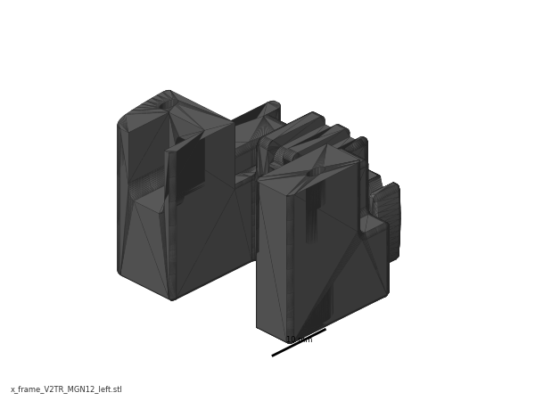{ width=96 } | `Gantry/X_Axis/X_Carriage/x_frame_V2TR_MGN12_left` | 1 | Black |
| 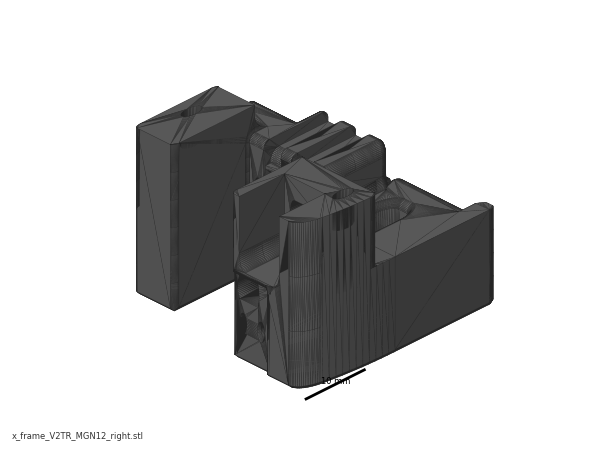{ width=96 } | `Gantry/X_Axis/X_Carriage/x_frame_V2TR_MGN12_right` | 1 | Black |
| 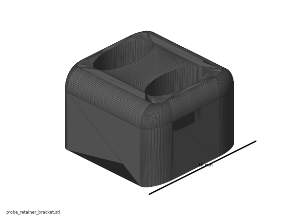{ width=96 } | `Gantry/X_Axis/X_Carriage/probe_retainer_bracket` | 1 | Black |
| { width=96 } | `Gantry/Front_Idlers/[a]_tensioner_left` | 1 | Orange — fitted in Ch 04, adjusted here |
| { width=96 } | `Gantry/Front_Idlers/[a]_tensioner_right` | 1 | Orange — fitted in Ch 04, adjusted here |
| { width=96 } | `Gantry/AB_Drive_Units/[a]_cable_cover` | 1 | Orange |

**Hardware** (chapter totals)

| Fastener / part | Qty | Where |
|---|---|---|
| Gates 2GT open belt, 6 mm wide | 2 lengths, cut equal | A and B belts (p.125, p.131 — see Step 07.8) |
| M3×8 SHCS | 4 | belt clamps, 2 per X carriage half (p.131, p.140) |
| M3×12 SHCS | 2 | 1 per X carriage half, set to 3 mm protrusion (p.130) |
| M3×30 SHCS | 4 | 2 carriage bolts (p.140) + 2 probe retainer bracket (p.143) |
| M3 nut | 2 | right X carriage half, capture the M3×30 carriage bolts (p.129) |
| M3 heat-set insert | 4 | 1 per X carriage half + 2 in `probe_retainer_bracket` (p.129) |
| M3×40 SHCS + M3 washer | 2 + 2 | front-idler tensioners — **already fitted in Ch 04** (p.67, p.71); adjusted on p.128, temporarily removable on p.134 |
| Inductive probe, Omron TL-Q5MC | 1 | X carriage (p.143) |
| Fibreglass tape (LDO-supplied) | as needed | probe insulation, front + sides only (LDO note p.143) |

**Read first**

- **The tension you set here is provisional.** Gantry squaring (Ch 06b) *begins* by fully releasing A/B belt tension, and it needs a running printer (`G28`, `QUAD_GANTRY_LEVEL`, `SET_STEPPER_ENABLE`), so it happens after Ch 13. Set enough tension to run the machine, then re-tension in Ch 06b. Tensioning to final now just gets undone — that is [survey §5.2 W1](../voron-build-instructions-survey.md), a ~1.5 h rework.
- **Equal length is the whole trick.** Both belt paths are the same length by design, so if the two belts are cut identical, equal tension follows (p.125). Cut them together, not one after the other.
- **There is no sourced deflection number.** The official manual gives *no* tension figure at all — only the equal-length rule. The one sourced number in this build's document set is **110 Hz over a 150 mm span** ([Voron secondary tuning](https://docs.vorondesign.com/tuning/secondary_printer_tuning.html)). voronldo.com's 80–100 Hz is discarded ([survey §4.3](../voron-build-instructions-survey.md)). Do not substitute a "push it 2 mm with your finger" test — nothing here calibrates it.
- **Nothing in this chapter is torqued.** Belt clamps and carriage bolts go on lightly, the belts get pulled tight by hand, then the carriage bolts are fully tightened (p.140–141). The manual specifies no torque values; don't invent one.
- Three LDO deviations land in this page range: the X-carriage variant check (p.129–130), probe insulation (p.143), and p.145 skipped entirely.
- **The inductive probe is built once, here.** Insulation, fitting, the 6 mm height and the cable route are Steps 07.34–07.37 (manual p.143–144). Ch 08 does not touch the probe again — it only confirms the decision and bags the Klicky set. The `probe_retainer_bracket` and the fibreglass tape are counted in this chapter's totals, not Ch 08's.

**Sources for this chapter:**

- [Voron 2.4r2 assembly manual, p.124–145](https://github.com/VoronDesign/Voron-2/blob/de7e89d/Manual/Assembly_Manual_2.4r2.pdf#page=124) — the page sequence this chapter transcribes, pinned at commit `de7e89d`
- [Voron docs § Secondary printer tuning — A/B Belts](https://docs.vorondesign.com/tuning/secondary_printer_tuning.html) — the only sourced tension figure, 110 Hz over 150 mm, and the source of the spectrum image (GPL-3.0)
- [Voron docs § V2 Gantry Squaring](https://docs.vorondesign.com/build/mechanical/v2_gantry_squaring.html) — why this tension is provisional
- [LDO Build Notes § Voron 2.4 build FAQ](https://docs.ldomotors.com/en/voron/voron2/build-faq) — X-carriage variant check, probe insulation, p.145 skipped
- [LDO 350 Rev D BOM](https://docs.ldomotors.com/en/voron/voron2/350_BOM/Rev_D) and [onetwo3D's 350 BOM](https://www.onetwo3d.co.uk/voron-bill-of-material/voron-2-4-350mm-bill-of-material/) — belt supplied as 6.21 m bulk, 2000 mm per belt
- [`STLs/Gantry/AB_Drive_Units/`](https://github.com/VoronDesign/Voron-2/tree/Voron2.4/STLs/Gantry/AB_Drive_Units) — the `[a]_cable_cover` the manual has no page for

**Video coverage (Steve Builds, pre-release LDO kit — differs from Rev D+):** [Part 4 @1:38:20](https://www.youtube.com/watch?v=ViB5Ulc9zDI&list=PL0fUJbigELQPqpeGOgHYisG4KaSXVtnNY&t=5900s) (+6m), [Part 5 @1:52:44](https://www.youtube.com/watch?v=hTKCBrk36R0&list=PL0fUJbigELQPqpeGOgHYisG4KaSXVtnNY&t=6764s) (+8m), [Part 6 @0:01:10](https://www.youtube.com/watch?v=8pWoYkY1DiA&list=PL0fUJbigELQPqpeGOgHYisG4KaSXVtnNY&t=70s) (+18m), [Part 8 @1:43:45](https://www.youtube.com/watch?v=Q3Q1szaFfSE&list=PL0fUJbigELQPqpeGOgHYisG4KaSXVtnNY&t=6225s) (+6m)

---

## Understand the path before you cut anything

### Step 07.1 — Confirm the gate before you start

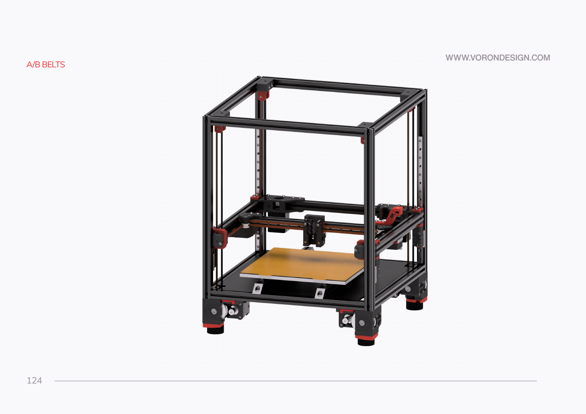

**What you're looking at:** The gate check. What you have at this point is a gantry that slides freely in X and Y with nothing driving it — the two CoreXY belts are the last mechanical link, and they thread through six separate bearing stacks. Any binding is far cheaper to find now than with two belts in the way.

**Parts:** none.

**Do:** Confirm the gantry is on the Z joints and the Z belts are clamped (Ch 06a). Push the gantry through its full Y travel and the X carriage through its full X travel by hand. Everything from here forward is harder to correct once two belts are threaded through six bearing stacks.

**Check:** No notchiness, no rising resistance at either end of travel, no rail carriage running off the end of a rail. The X carriage coasts when you push it.

Source: [Voron manual p.124](https://github.com/VoronDesign/Voron-2/blob/de7e89d/Manual/Assembly_Manual_2.4r2.pdf#page=124)

### Step 07.2 — Learn the rule that governs this chapter

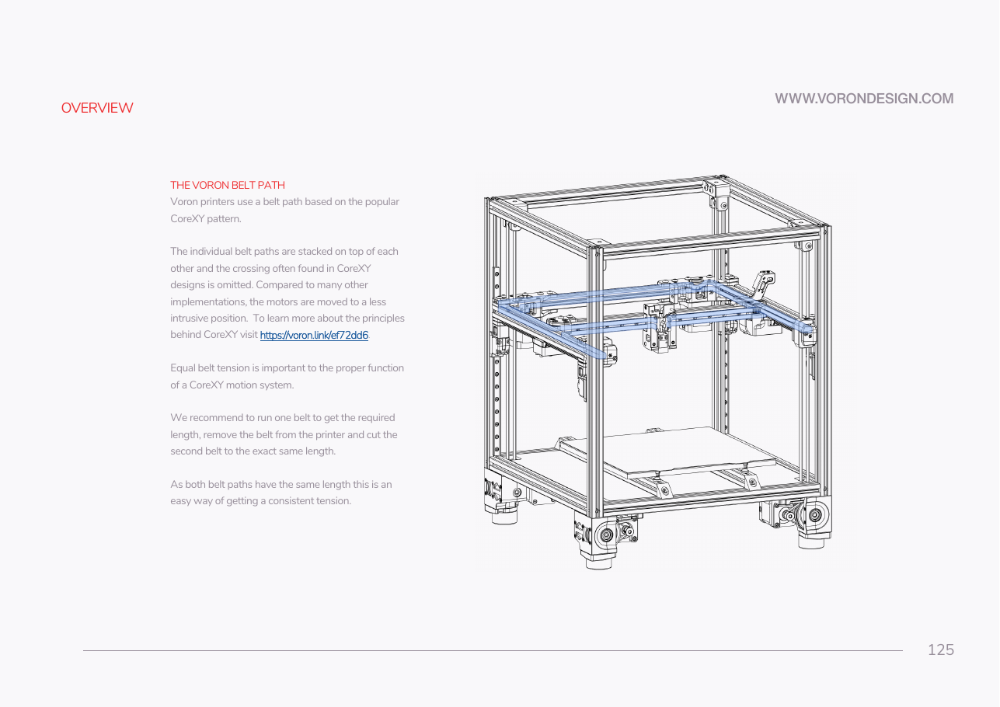

**What you're looking at:** The concept page. In [CoreXY](16-glossary.md#c) neither motor owns an axis: two long belt loops connect both motors to the carriage, and the toolhead moves in X when the motors turn together and in Y when they turn opposite ways. On a Voron the two loops sit at **different heights and never cross** — each stays in one horizontal plane for its whole run — and because both paths are the same length by design, two belts cut identical end up at identical tension.

**Parts:** none.

**Do:** Read p.125. The two belt paths are **stacked at different heights and never cross** — that is the Voron variant of CoreXY. Each belt stays in one horizontal plane for its entire loop. Equal belt tension is what makes the motion system behave, and equal length is how you get it.

**Check:** You can state, without looking, where the A belt leaves the carriage and where it comes back.

Source: [Voron manual p.125](https://github.com/VoronDesign/Voron-2/blob/de7e89d/Manual/Assembly_Manual_2.4r2.pdf#page=125)

### Step 07.3 — Trace the A belt path

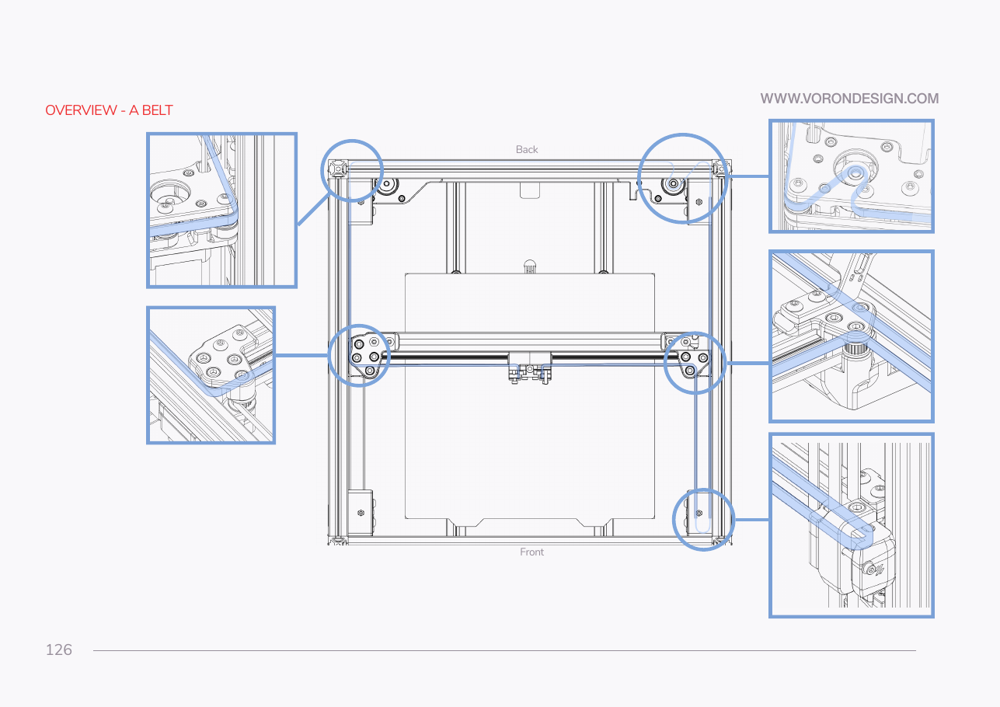
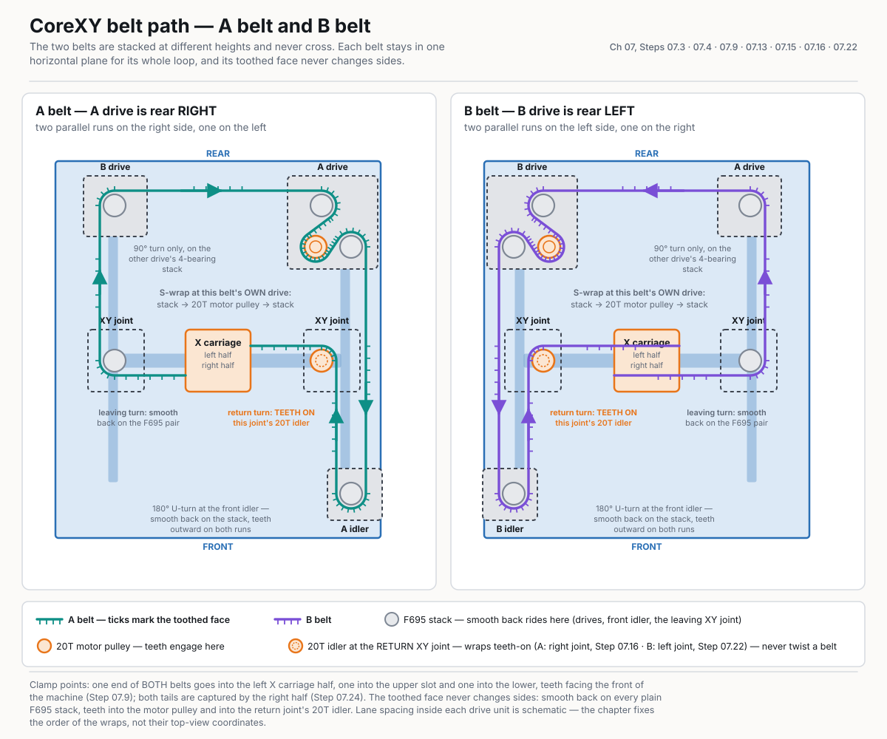

**What you're looking at:** The **A** belt is the one driven by the rear-**right** motor. Trace it on the real machine with the page open rather than reading it. What identifies it afterwards on sight: on the right-hand side of the machine the A belt gives you **two** parallel runs — out to the front idler and back — and on the left only one. The diagram's A-belt panel traces the same loop top-down with every 90° turn, the S-wrap at the drive and the 180° U-turn at the front idler marked, and the toothed face carried continuously along the belt.

**Parts:** none.

**Do:** Work through the five detail insets on p.126 with the machine in front of you, front of the printer facing you. The A belt runs: **X carriage → left XY joint (90°) → rearward along the left Y extrusion → idler stack at the rear-left drive unit (90°) → right along the rear extrusion → A drive at the rear-right (S-wrap around the motor pulley) → forward along the right Y extrusion, past the right XY joint → front-right idler (180° U-turn) → rearward → right XY joint (90°) → back to the X carriage.**

**Check:** On the right-hand side of the machine the A belt gives you **two** parallel runs (front idler out and back); on the left-hand side, **one**. The A drive is the rear-**right** unit ([survey §7.2 Ch 10 stepper map](../voron-build-instructions-survey.md): A = rear right).

Source: [Voron manual p.126](https://github.com/VoronDesign/Voron-2/blob/de7e89d/Manual/Assembly_Manual_2.4r2.pdf#page=126)

### Step 07.4 — Trace the B belt path

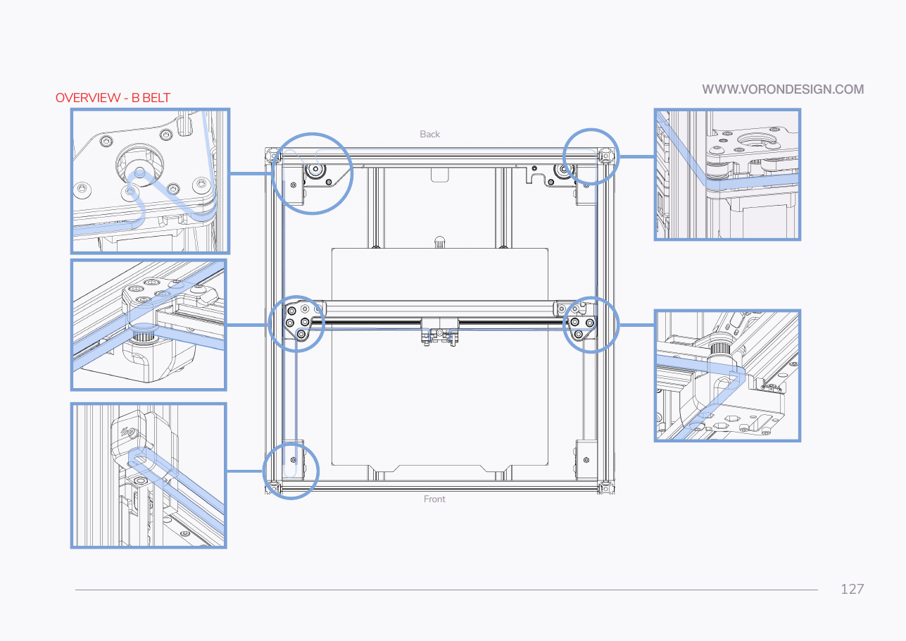

**What you're looking at:** The **B** belt is the mirror image, driven by the rear-**left** motor and running in the other plane: two runs on the left, one on the right. The structural fact this page exists to teach is that each rear drive unit carries **two** things — the toothed motor pulley for its own belt, and a plain bearing stack for the *other* belt, at a different height. The diagram's B-belt panel shows the mirrored two-runs-on-one-side asymmetry — two parallel runs on the left, one on the right, the opposite of the A panel.

**Parts:** none.

**Do:** The B belt is the mirror image, in the other plane: **X carriage → right XY joint (90°) → rearward along the right Y extrusion → idler stack at the rear-right (A) drive unit (90°) → left along the rear extrusion → B drive at the rear-left (S-wrap around the motor pulley) → forward along the left Y extrusion, past the left XY joint → front-left idler (180° U-turn) → rearward → left XY joint (90°) → back to the X carriage.**

**Check:** Each drive unit carries the motor pulley for *its own* belt plus an idler stack for the *other* belt, at a different height. If you find yourself wrapping both belts around the same pulley, stop and re-read p.126/p.127.

---

## Prepare the idlers and the X carriage

Source: [Voron manual p.127](https://github.com/VoronDesign/Voron-2/blob/de7e89d/Manual/Assembly_Manual_2.4r2.pdf#page=127)

### Step 07.5 — Set both front-idler tensioners

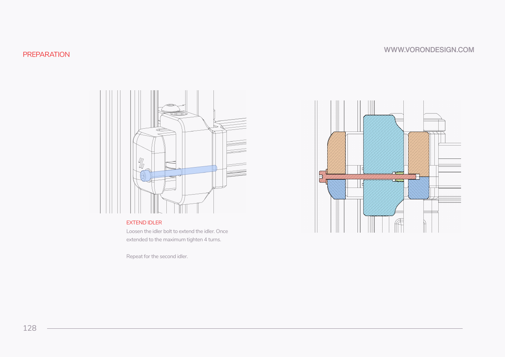

**What you're looking at:** The front-idler tensioners are the two orange parts at the front corners; each carries an M3×40 whose only job is belt tension — winding it **in** pulls the idler forward and tightens that belt, backing it **out** releases it. They are a handed pair, not two of the same: left and right are mirror parts (their bounding boxes read 45×25 mm and 25×45 mm). Both get wound to the same starting point now so the two belts begin life equal.

**Parts:** the two M3×40 SHCS + M3 washers already in the front idlers (Ch 04, p.67 and p.71).

**Do:** Manual text, verbatim: *"Loosen the idler bolt to extend the idler. Once extended to the maximum tighten 4 turns. Repeat for the second idler."* Operationally: back the M3×40 out until the tension arm is at its slackest end of travel, then wind it back in exactly 4 turns. Count the turns and give both idlers the same number. **Turning the tensioner screw in pulls the tension arm forward and adds belt tension; backing it out releases it** — this is the same screw the squaring procedure means when it says *"idlers fully backed off"* ([V2 gantry squaring, step 5](https://docs.vorondesign.com/build/mechanical/v2_gantry_squaring.html)).

**Check:** Both tensioner screws stand proud of the front idler bodies by the same amount. You have travel left in both directions — this is what you will adjust in Step 07.32 and again in Ch 06b.

Source: [Voron manual p.128](https://github.com/VoronDesign/Voron-2/blob/de7e89d/Manual/Assembly_Manual_2.4r2.pdf#page=128) · [Voron docs § V2 Gantry Squaring, step 5](https://docs.vorondesign.com/build/mechanical/v2_gantry_squaring.html)

Pause: ~25 min since the last pause — both belt paths traced against p.126–127 and both front-idler tensioners backed out to the loose starting position. Nothing is cut. Do not start cutting belt unless you can also thread it.

### Step 07.6 — Fit the heat-set inserts and M3 nuts

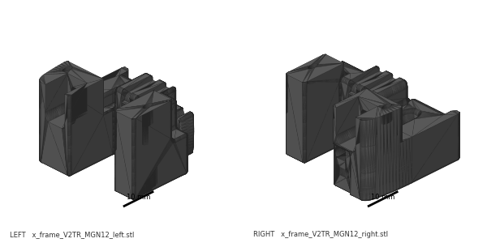

**What you're looking at:** A [heat-set insert](16-glossary.md#h) is a knurled brass sleeve melted into the plastic so a steel screw has metal threads to bite into; four go in here, one per [X carriage](16-glossary.md#x) half and two in the probe retainer bracket. The two M3 nuts press into pockets in the **right** half and will capture the long bolts that squeeze the two halves together onto the belts. The two halves are a handed pair — left and right, shown together in the render — and the Clockwork-2 versions look much like the older Afterburner ones.

**Parts:** M3 heat-set insert ×4 (1 per X carriage half, 2 in the probe retainer bracket); M3 nut ×2 (both in the right X carriage half).

**Do:** If the inserts went in during the Ch 00 batch insert pass, verify them and skip the iron. Otherwise set all four flush with the plastic, square to the face — a proud or tilted insert in a carriage half means splitting the carriage back open later. Press the two M3 nuts into their pockets in the right carriage half; these capture the M3×30 carriage bolts in Step 07.27.

**Check:** Inserts flush and square; nuts fully seated with no gap behind them; an M3 screw starts by hand in every insert.

⚠ **Rev D+ / LDO:** *"If you are building Clockwork 2 double-check that you have the correct X-Carriage and follow the instructions in the Stealthburner manual."* For this kit that is the pair `x_frame_V2TR_MGN12_left` / `x_frame_V2TR_MGN12_right` — the R2 / Clockwork-2 halves, not the Afterburner ones. Confirm the filenames against what you actually printed before the belts go in. [src](https://docs.ldomotors.com/voron/voron2/build-faq) (p.129–130)

Source: [Voron manual p.129](https://github.com/VoronDesign/Voron-2/blob/de7e89d/Manual/Assembly_Manual_2.4r2.pdf#page=129) · [LDO Build Notes § Voron 2.4 build FAQ](https://docs.ldomotors.com/en/voron/voron2/build-faq)

### Step 07.7 — Set the two carriage stop screws to 3 mm

**What you're looking at:** These two M3×12 are stop screws rather than fasteners. The 3 mm of thread standing proud of each half is what sets how the two halves meet over the belt when they are bolted together, so the two must match each other as well as the number.

**Parts:** M3×12 SHCS ×2.

**Do:** Thread one M3×12 into the heat-set insert in each carriage half, from the face shown, until **3 mm** of screw stands proud of the plastic (p.130, right-hand dimension). Measure it with the caliper depth blade or a rule — this sets how the two halves meet on the belt.

**Check:** Both screws at 3 mm ±0.5 mm, and the same on both halves.

---

## Cut and clamp

Source: [Voron manual p.130](https://github.com/VoronDesign/Voron-2/blob/de7e89d/Manual/Assembly_Manual_2.4r2.pdf#page=130)

### Step 07.8 — Cut both belts to the same length

(no image — see text)

**What you're looking at:** No picture, and the most consequential measurement in the chapter. Both belt paths are the same length by design, so two belts of identical length arrive at identical tension — and a few millimetres of difference is a permanent imbalance that the tensioners cannot remove, only mask. Folding the belt back on itself and cutting through both layers in one pass is what makes them identical rather than merely carefully measured.

**Parts:** Gates 2GT 6 mm open belt, 2 lengths.

**Do:** The manual gives **no cut length** — only p.125's rule: run one belt to find the length, then cut the second to match. The LDO Rev D 350 BOM supplies **6.21 m of "Gates Open Belt, 2GT, 6 mm (by metre)"** — **bulk, not pre-cut**, and the LDO Build Notes list no belt deviation anywhere in p.124–145, so there is no pre-cut pair in the box to look for ([LDO 350 Rev D BOM](https://docs.ldomotors.com/en/voron/voron2/350_BOM/Rev_D), [Build Notes](https://docs.ldomotors.com/voron/voron2/build-faq)). Cut **two lengths of 2000 mm**: fold the belt back on itself so both lengths lie together, and cut both ends through the pair in one pass, square across the belt, so they are identical. 2000 mm is the per-belt figure third-party 350 BOMs use, and the routed path on a 350 works out at roughly 1.8 m (340 mm X extrusion + 2 × 450 mm Y extrusions, plus wraps), which leaves about 100 mm of tail at each carriage clamp. ([onetwo3D's Voron 2.4 350 BOM](https://www.onetwo3d.co.uk/voron-bill-of-material/voron-2-4-350mm-bill-of-material/) lists "GT2 Open Belt LL-2GT-6 (6 mm wide) — 2000 mm ×2"; verify against your own kit's belt on the bench.)

**Check:** Lay both belts side by side with one pair of ends against a square edge — the far ends are flush. A mismatch you can see is a mismatch you will chase with the tensioners forever.

Tip: Mark one belt "A" with a dot of marker on the smooth back near each end. Once both are threaded they are impossible to tell apart. ([survey §7.2 Ch 07](../voron-build-instructions-survey.md))

Source: [Voron manual p.125](https://github.com/VoronDesign/Voron-2/blob/de7e89d/Manual/Assembly_Manual_2.4r2.pdf#page=125) · [LDO 350 Rev D BOM](https://docs.ldomotors.com/en/voron/voron2/350_BOM/Rev_D) · [LDO Build Notes § Voron 2.4 build FAQ](https://docs.ldomotors.com/en/voron/voron2/build-faq) · [onetwo3D Voron 2.4 350 BOM](https://www.onetwo3d.co.uk/voron-bill-of-material/voron-2-4-350mm-bill-of-material/)

Pause: ~30 min since the last pause — heat-set inserts and M3 nuts in the carriage halves, stop screws set to 3 mm, both belts cut to matched length and marked A and B. Coil the two belts and bag them; the next segment is the one that cannot be broken.

### Step 07.9 — Clamp the first end of both belts in the left carriage half

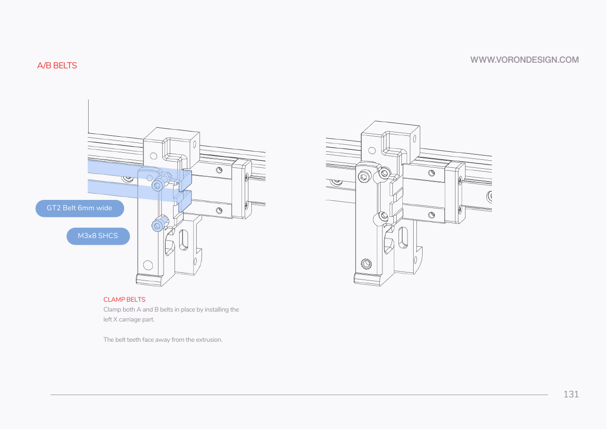

**What you're looking at:** The X carriage clamps a belt by squeezing it between its two printed halves. Both belts' *first* ends go into the **left** half — one in the upper slot, one in the lower — because the two belts live at two different heights and keep those heights all the way to the clamp. Teeth face away from the extrusion, towards the front of the machine, on both.

**Parts:** M3×8 SHCS ×2; both belts.

**Do:** Feed one end of each belt into its clamp slot in the **left** X carriage part — one belt into the upper slot, one into the lower. Install the left carriage part against the rail carriage and run the two M3×8 SHCS in. **The belt teeth face away from the extrusion** (p.131), i.e. towards the front of the machine, on both belts. Snug only — you will pull these tight later.

**Check:** Both belt ends are captured in their slots and cannot pull out with a firm tug; both belts leave the carriage in the same direction with teeth facing the same way; neither belt is twisted where it exits.

---

## Route the A belt

Work in one direction round the loop. Needle-nose pliers or tweezers make the bearing stacks manageable (p.132). Do not force a belt round a stack — if it will not go, use the access trick in Step 07.13.

Source: [Voron manual p.131](https://github.com/VoronDesign/Voron-2/blob/de7e89d/Manual/Assembly_Manual_2.4r2.pdf#page=131)

### Step 07.10 — A belt: leave the carriage and turn at the left XY joint

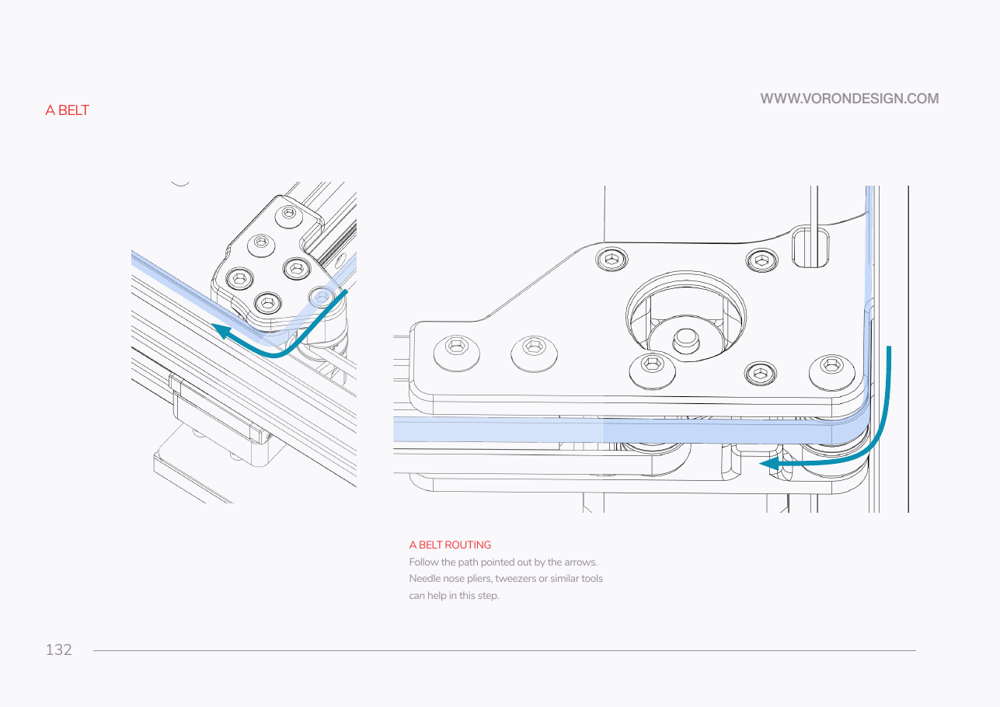

**What you're looking at:** The left XY joint's bearing stack is the belt corner you built in Ch 05; the A belt turns 90° on it, from running along X to running along Y. Centred in the groove is the whole requirement — a belt climbing a flange wears its own edge away and eventually frays through.

**Parts:** A belt.

**Do:** Take the A belt end left along the X extrusion to the left XY joint and wrap it 90° around the joint's idler stack, so it turns to run rearward along the left Y extrusion. Follow the arrows on p.132.

**Check:** The belt sits squarely in its groove in the stack, centred, not climbing a flange, and has not picked up a twist between the carriage and the joint.

Source: [Voron manual p.132](https://github.com/VoronDesign/Voron-2/blob/de7e89d/Manual/Assembly_Manual_2.4r2.pdf#page=132)

### Step 07.11 — A belt: run rearward up the left Y extrusion

**What you're looking at:** The single long run down the left-hand side of the machine. Nothing turns the belt here, so the only things to get right are that it stays parallel to the extrusion and clears every printed part on the way.

**Parts:** A belt.

**Do:** Run the belt straight back along the left Y extrusion to the rear-left drive unit. This is the single run on the left side of the machine (the p.126 top-left inset).

**Check:** The run is parallel to the extrusion along its whole length and clears the printed parts and the Z belt.

Source: [Voron manual p.126](https://github.com/VoronDesign/Voron-2/blob/de7e89d/Manual/Assembly_Manual_2.4r2.pdf#page=126)

### Step 07.12 — A belt: turn 90° at the rear-left idler stack

**What you're looking at:** The rear-left corner is the **B** drive unit, and it carries two things at two heights: B's toothed motor pulley, and a plain bearing stack that belongs to the **A** belt. A wraps the plain stack only. Putting it on the motor pulley instead looks entirely plausible and locks the two axes together — you find out at first homing.

**Parts:** A belt.

**Do:** Wrap the belt round the **idler stack** at the rear-left corner — *not* the B motor pulley next to it — and turn it to run right, along the rear extrusion, towards the A drive. The p.126 top-left inset is the reference for this corner.

**Check:** The B motor pulley is untouched and free to spin. The A belt runs along the rear extrusion at a constant height.

Source: [Voron manual p.126](https://github.com/VoronDesign/Voron-2/blob/de7e89d/Manual/Assembly_Manual_2.4r2.pdf#page=126)

### Step 07.13 — A belt: S-wrap the A drive motor pulley

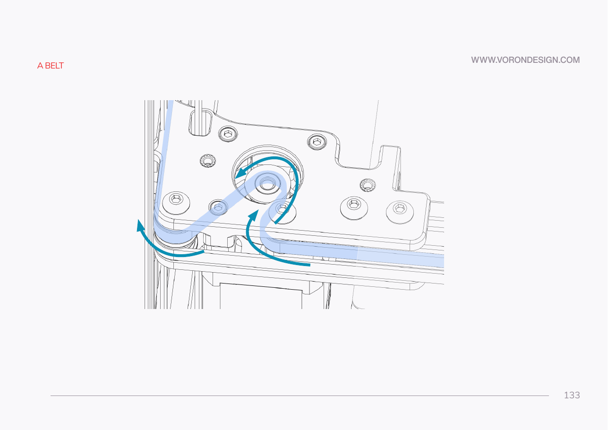

**What you're looking at:** The S-wrap is what gives a drive pulley its grip: the belt comes in over one bearing, wraps a large arc of the toothed motor pulley, and leaves over a second bearing. More teeth in contact means the belt cannot skip a tooth under hard acceleration, which would silently shift the whole coordinate system.

**Parts:** A belt.

**Do:** At the rear-right (A) drive unit, take the belt round the first bearing stack, over the toothed motor pulley, and back out round the second bearing stack — the S-shape drawn on p.133. This is the wrap that gives the drive pulley its grip, so make sure the belt is seated on the pulley teeth, not riding up on a flange.

**Check:** Nudge the belt along its run — the motor pulley turns with it and indexes tooth by tooth; it does not slip. The belt leaves the drive unit heading forward along the right Y extrusion.

Tip: If a bearing stack will not take the belt, temporarily remove the **M3×40 SHCS** at that idler to open it up, thread the belt, then refit (manual p.134, "BELTING IDLERS").

Source: [Voron manual p.133](https://github.com/VoronDesign/Voron-2/blob/de7e89d/Manual/Assembly_Manual_2.4r2.pdf#page=133)

### Step 07.14 — A belt: run forward down the right Y extrusion

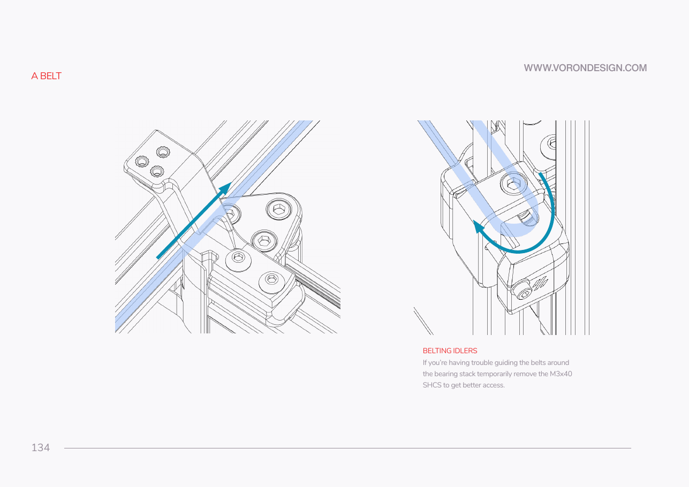

**What you're looking at:** The outbound A run passes the right XY joint at its own height without wrapping it — this belt's business with that joint comes on the *return* run at Step 07.16. Sighting the belt at the same height at both ends of a long run is how a half-twist gets caught before it is buried under the second belt.

**Parts:** A belt.

**Do:** Run the belt forward along the right Y extrusion, **past** the right XY joint without wrapping it, all the way to the front-right idler. The left-hand image on p.134 shows the belt passing the joint at its own height.

**Check:** The belt clears the XY joint's printed parts entirely — no rub, no contact. It is at the same height at the front of the run as at the rear.

Source: [Voron manual p.134](https://github.com/VoronDesign/Voron-2/blob/de7e89d/Manual/Assembly_Manual_2.4r2.pdf#page=134)

### Step 07.15 — A belt: U-turn at the front-right idler

**What you're looking at:** The front-right idler is a 180° turnaround: the belt goes round it and comes straight back, which is why the right-hand side of the machine ends up with two parallel runs. It is the **smooth back** of the belt that rides this stack, not the teeth.

**Parts:** A belt.

**Do:** Wrap the belt 180° around the front-right idler bearing stack and bring it back rearward, parallel to the run you just made (p.134, right-hand image).

**Check:** The two runs on the right side are parallel and do not touch each other. The smooth back of the belt is what contacts the idler stack; the teeth face outward on both runs.

Source: [Voron manual p.134](https://github.com/VoronDesign/Voron-2/blob/de7e89d/Manual/Assembly_Manual_2.4r2.pdf#page=134)

### Step 07.16 — A belt: turn at the right XY joint and return to the carriage

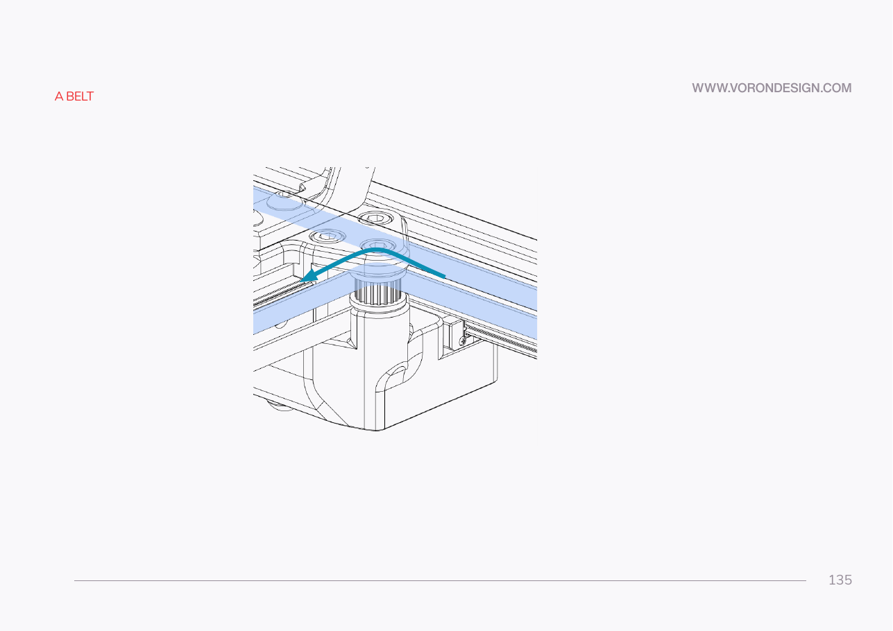

**What you're looking at:** The right XY joint turns the returning run back along X to the carriage and closes the A loop. Walking the whole loop once with a finger — confirming it never changes height and never crosses itself — is the last cheap check before the B belt goes in on top of it.

**Parts:** A belt.

**Do:** Take the returning run rearward to the right XY joint, wrap it 90° round the joint's idler stack, and bring it left along the X extrusion back to the X carriage. Leave the tail loose at the carriage for now — it gets captured in Step 07.24.

**Check:** The A belt is now a closed path with both ends at the carriage. Walk the whole loop once with a finger and confirm it never changes height and never crosses itself.

---

## Route the B belt

Source: [Voron manual p.135](https://github.com/VoronDesign/Voron-2/blob/de7e89d/Manual/Assembly_Manual_2.4r2.pdf#page=135)

### Step 07.17 — B belt: leave the carriage and turn at the right XY joint

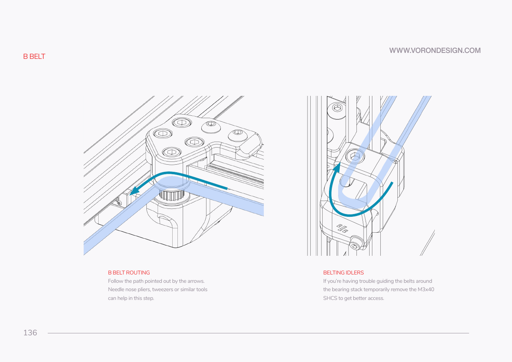

**What you're looking at:** The B belt leaves the same carriage but turns right instead of left, and wraps the right XY joint at the **other** height. A visible gap between the two belts at this joint is the evidence that you really are in two planes and not about to run one belt on top of the other.

**Parts:** B belt.

**Do:** Take the B belt end right along the X extrusion to the right XY joint and wrap it 90° round the joint's stack at the **other** height from the A belt, so it turns rearward along the right Y extrusion.

**Check:** A and B are clearly in two different planes at this joint, with a visible gap between them. Neither is riding on the other.

Source: [Voron manual p.136](https://github.com/VoronDesign/Voron-2/blob/de7e89d/Manual/Assembly_Manual_2.4r2.pdf#page=136)

### Step 07.18 — B belt: run rearward and turn at the rear-right idler stack

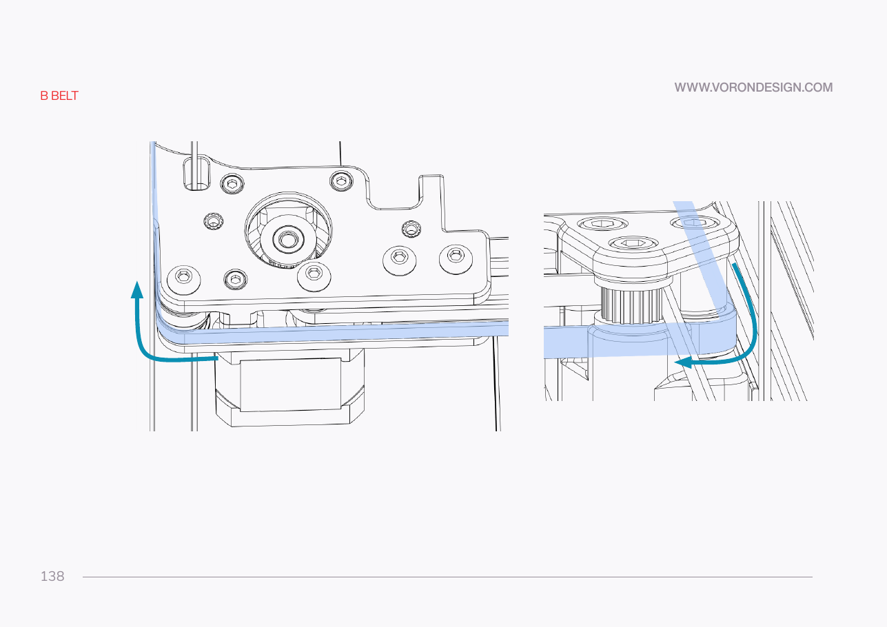

**What you're looking at:** The rear-right corner is the **A** drive unit and, like the rear-left, it carries a motor pulley (A's) and a plain stack (B's). B wraps the plain stack. The test is simple: with only the A belt on it, the A motor pulley must still turn freely by hand.

**Parts:** B belt.

**Do:** Run the belt back along the right Y extrusion to the **A** drive unit at the rear-right, wrap it round that unit's idler stack — not the A motor pulley — and turn it left along the rear extrusion (p.138, left-hand image, and the p.127 top-right inset).

**Check:** The A motor pulley still turns freely with only the A belt on it. The B belt is at its own height along the rear extrusion, above or below the A belt, not touching it.

Source: [Voron manual p.138](https://github.com/VoronDesign/Voron-2/blob/de7e89d/Manual/Assembly_Manual_2.4r2.pdf#page=138)

### Step 07.19 — B belt: S-wrap the B drive motor pulley

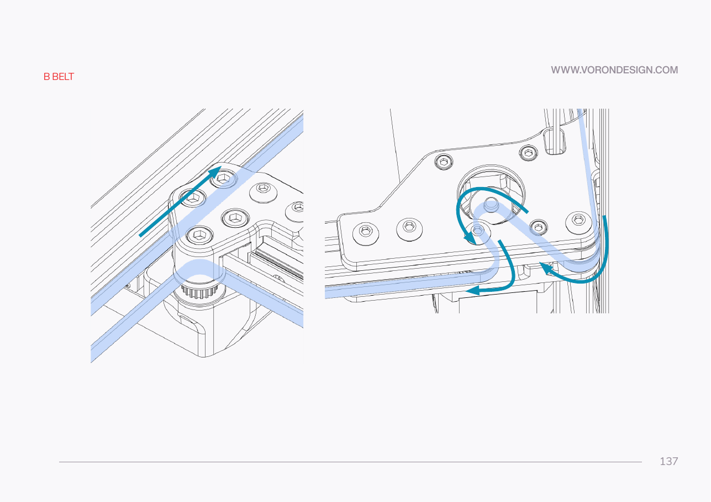

**What you're looking at:** The same S-wrap as the A drive, this time on the B motor at the rear-left. Nudging the belt and watching the pulley index tooth by tooth is the check that the teeth are actually engaged and the belt is not riding a flange.

**Parts:** B belt.

**Do:** At the rear-left (B) drive unit, take the belt round the first bearing stack, over the toothed motor pulley, and back out round the second stack — the same S-shape as the A drive.

**Check:** Nudge the belt: the B motor pulley indexes tooth by tooth. The belt leaves heading forward along the left Y extrusion.

Source: [Voron manual p.137](https://github.com/VoronDesign/Voron-2/blob/de7e89d/Manual/Assembly_Manual_2.4r2.pdf#page=137)

### Step 07.20 — B belt: run forward down the left Y extrusion

**What you're looking at:** The B belt's outbound run down the left side, passing the left XY joint at its own height without touching it. Mirror image of Step 07.14.

**Parts:** B belt.

**Do:** Run the belt forward along the left Y extrusion, **past** the left XY joint without wrapping it, to the front-left idler.

**Check:** The belt clears the left XY joint's printed parts completely. Constant height along the run.

Source: [Voron manual p.137](https://github.com/VoronDesign/Voron-2/blob/de7e89d/Manual/Assembly_Manual_2.4r2.pdf#page=137)

### Step 07.21 — B belt: U-turn at the front-left idler

**What you're looking at:** The 180° turnaround at the front-left idler, which gives the left-hand side its two parallel runs. Mirror image of Step 07.15 — smooth back on the stack, teeth outward.

**Parts:** B belt.

**Do:** Wrap 180° around the front-left idler bearing stack and bring the belt back rearward, parallel to the outbound run (p.136, right-hand image; p.127 bottom-left inset).

**Check:** Two parallel, non-touching runs on the left side. Smooth back on the idler, teeth outward.

Source: [Voron manual p.136](https://github.com/VoronDesign/Voron-2/blob/de7e89d/Manual/Assembly_Manual_2.4r2.pdf#page=136)

### Step 07.22 — B belt: turn at the left XY joint and return to the carriage

**What you're looking at:** The left XY joint turns B's returning run back along X to the carriage, closing the second loop. Both belts are now complete paths with all four ends waiting at the X carriage.

**Parts:** B belt.

**Do:** Take the returning run to the left XY joint, wrap it 90° at the B-belt height, and bring it right along the X extrusion back to the carriage. Leave the tail loose.

**Check:** Both belts are now closed paths with all four ends at the carriage.

Source: [Voron manual p.138](https://github.com/VoronDesign/Voron-2/blob/de7e89d/Manual/Assembly_Manual_2.4r2.pdf#page=138)

### Step 07.23 — Check both belts against the overviews before closing the carriage

**What you're looking at:** Two complete loops, still open at the carriage — the last moment when a mis-route costs minutes rather than an hour of unthreading. Four things get tested individually here: teeth on the toothed pulleys, smooth back on every plain stack, no half-twist in either loop, and the two belts stacked rather than crossed. The diagram shows both loops side by side one final time as the pre-close check, with the toothed face marked continuously along each belt so the smooth back on every bearing stack is visible at a glance.

**Parts:** none.

**Do:** Put p.126 and p.127 side by side with the machine and walk both loops, inset by inset. This is the last cheap moment to fix a mis-route. Test each item: nudge the belt at each motor pulley and watch that the pulley *indexes* rather than slipping; sight down every straight run to see the teeth facing the same way at both ends; turn each pulley by hand.

**Check:**
- Teeth on both motor pulleys, smooth back on every plain stack, teeth away from the extrusion at the carriage.
- No half-twist in either loop.
- Belts stacked, not crossed, each in its own plane.
- Every pulley turns freely.

---

## Capture the ends, pull tight, inspect

Source: [Voron manual p.127](https://github.com/VoronDesign/Voron-2/blob/de7e89d/Manual/Assembly_Manual_2.4r2.pdf#page=127) · [Voron manual p.126](https://github.com/VoronDesign/Voron-2/blob/de7e89d/Manual/Assembly_Manual_2.4r2.pdf#page=126)

### Step 07.24 — Fit the right X carriage half to capture the belt ends

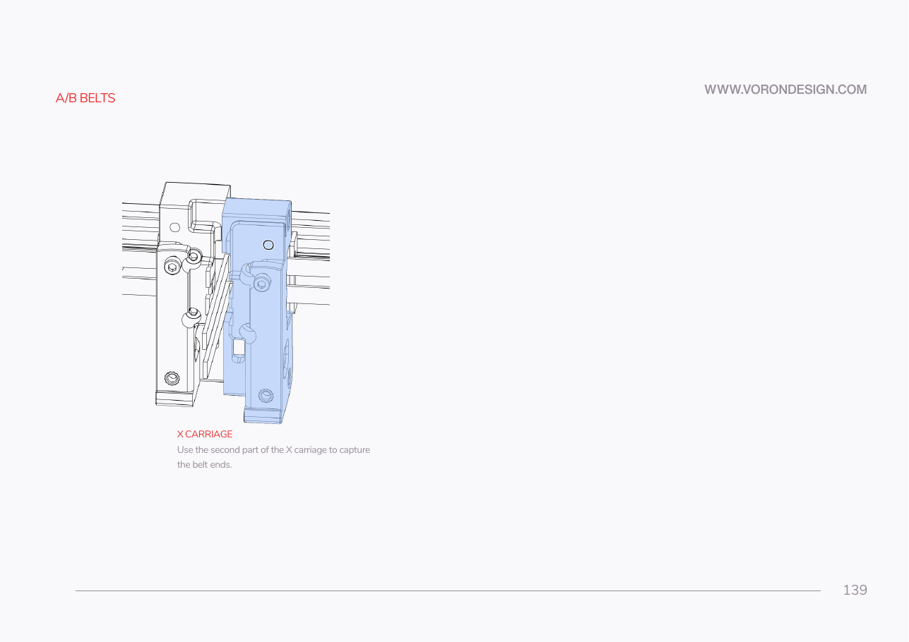

**What you're looking at:** The right carriage half is the other jaw of the clamp. Each loose tail goes into the slot at its own height, so the two belts stay in their own planes right up to the point where they are gripped.

**Parts:** `x_frame_V2TR_MGN12_right`; both loose belt tails.

**Do:** Feed the two loose belt tails into their clamp slots in the right X carriage part — each into the slot at its own height — and offer the part up to the carriage. Don't fasten anything yet.

**Check:** Both tails are seated in their slots and both belts leave the carriage without twist.

Source: [Voron manual p.139](https://github.com/VoronDesign/Voron-2/blob/de7e89d/Manual/Assembly_Manual_2.4r2.pdf#page=139)

### Step 07.25 — Fix the belts, lightly

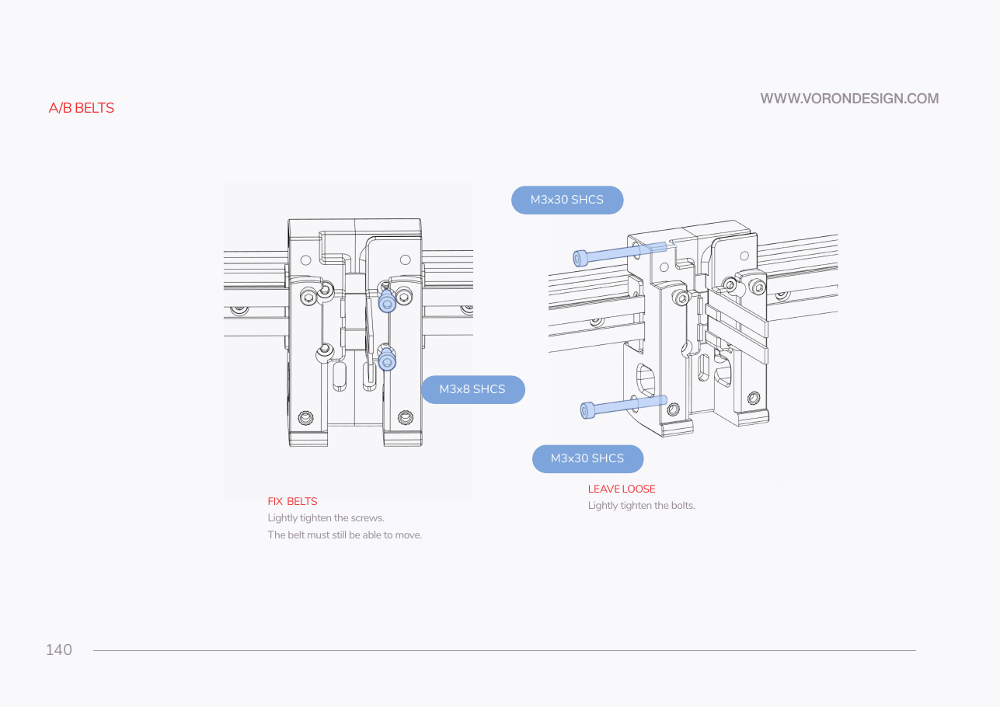

**What you're looking at:** Deliberately loose. The clamp still has to let belt be pulled through, because the next steps take the slack out of both loops by pulling on these tails — tighten now and you lock in whatever slack the loop currently has.

**Parts:** M3×8 SHCS ×2.

**Do:** Run the two M3×8 SHCS into the right carriage half. *"Lightly tighten the screws. The belt must still be able to move."* (p.140) — you need to be able to pull belt through the clamp in the next step.

**Check:** You can still draw belt through the clamp by hand with moderate effort.

Source: [Voron manual p.140](https://github.com/VoronDesign/Voron-2/blob/de7e89d/Manual/Assembly_Manual_2.4r2.pdf#page=140)

### Step 07.26 — Fit the carriage bolts and leave them loose

**What you're looking at:** The two M3×30 pass through both carriage halves into the M3 nuts you pressed in at Step 07.6; they are what actually squeeze the halves together onto the belts. Also left light, for the same reason as the clamp screws.

**Parts:** M3×30 SHCS ×2 (into the M3 nuts from Step 07.6).

**Do:** Pass the two M3×30 SHCS through the carriage — one top, one bottom — into the captive M3 nuts. *"Lightly tighten the bolts."* (p.140)

**Check:** The two carriage halves are held together but can still shift slightly. Nothing is torqued.

Source: [Voron manual p.140](https://github.com/VoronDesign/Voron-2/blob/de7e89d/Manual/Assembly_Manual_2.4r2.pdf#page=140)

### Step 07.27 — Pull both belts tight and equalise the tails

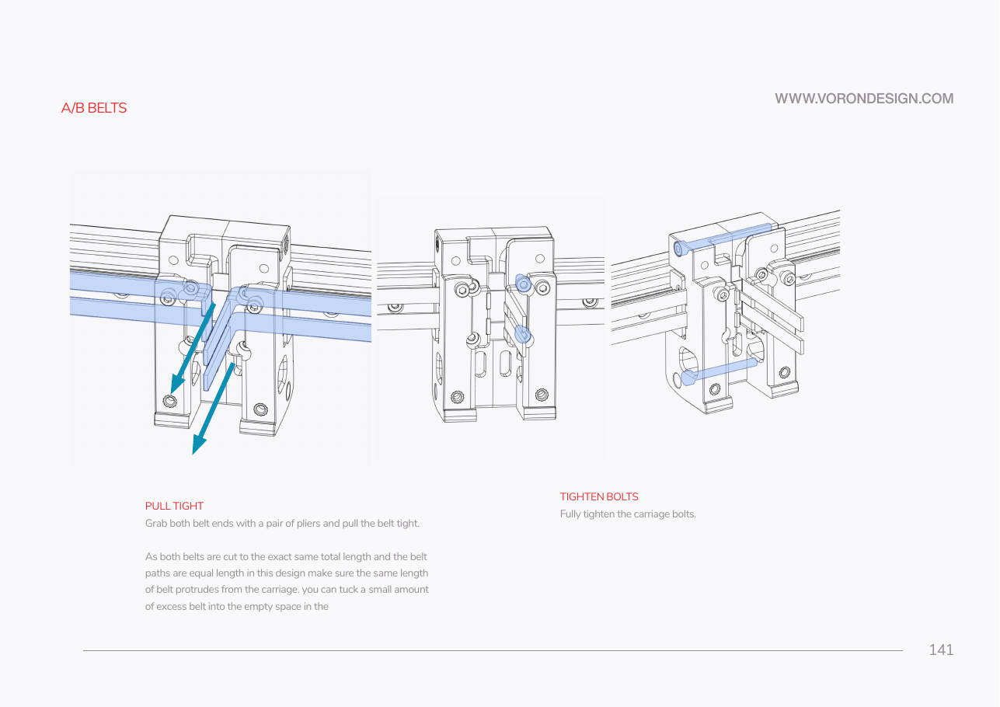

**What you're looking at:** This is where belt tension is really set — the tensioners only trim what you achieve here. Because both belts and both paths are the same length, **equal tail length protruding from the carriage** is a direct measurement of equal tension, which is why the manual asks you to measure the tails rather than judge the feel.

**Parts:** none.

**Do:** Grab both belt ends with pliers and pull the belt tight (p.141). Because both belts were cut to the same length and both paths are the same length, **the same length of belt must protrude from the carriage on both belts** — that is your equality check, not a feel test. Pull one, then the other, then back again; they interact. Tuck the small remaining excess into the empty space in the carriage.

**Check:** Measure the protruding tails with the rule — they match. Move the gantry by hand through the full XY travel and back to the middle; re-check that the tails still match. If one belt has crept, back off its M3×8, re-pull, re-clamp.

Source: [Voron manual p.141](https://github.com/VoronDesign/Voron-2/blob/de7e89d/Manual/Assembly_Manual_2.4r2.pdf#page=141) · [Voron docs § Secondary printer tuning — A/B Belts](https://docs.vorondesign.com/tuning/secondary_printer_tuning.html)

### Step 07.28 — Tighten the carriage bolts

**What you're looking at:** Everything closed and firm at last. These screws go into printed plastic and captive nuts, so "solid" is the stopping point: the manual gives no torque figure, and a stripped insert here means splitting the carriage back open with both belts threaded through it.

**Parts:** none.

**Do:** *"Fully tighten the carriage bolts."* (p.141) Then fully tighten the four M3×8 belt-clamp screws. Snug and firm — these thread into plastic and captive nuts, so stop at solid, don't lean on the driver. No torque figure is specified *(not specified — snug)*.

**Check:** Pull hard on each belt at the carriage: nothing slips. The X carriage still runs the full length of the X rail without the belts fouling anything.

Source: [Voron manual p.141](https://github.com/VoronDesign/Voron-2/blob/de7e89d/Manual/Assembly_Manual_2.4r2.pdf#page=141)

Pause: ~80 min since the last pause — the long one, and it has no safe interior stop: both belts routed, both ends captured in the carriage, tails equalised and the carriage bolts tightened. Only stop here once the carriage is closed and both belts are held at both ends.

### Step 07.29 — Belt-rub inspection at every idler stack

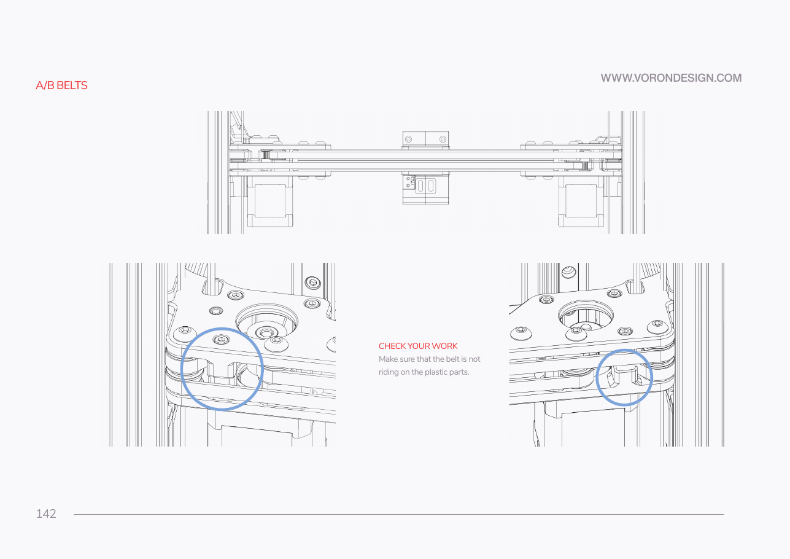

**What you're looking at:** Six bearing stacks, each inspected with the gantry parked in four different places — a belt that clears at centre travel can still bite at the ends of X or Y. A belt riding a printed flange ticks once per pulley revolution and leaves plastic dust behind it; found now it is an adjustment, found later it is a shredded belt and a full re-thread.

**Parts:** none.

**Do:** *"Make sure that the belt is not riding on the plastic parts."* (p.142) Go round all six stacks in turn — left XY joint, right XY joint, front-left idler, front-right idler, A drive (rear-right), B drive (rear-left) — and look at the belt edges where they enter and leave each stack, top edge and bottom edge. Then push the gantry to the extreme front, the extreme rear, and both ends of X, and look again at each stack in each position: a belt that clears at centre travel can still bite at the ends. A tick once per pulley revolution is a belt riding a flange; plastic dust on a drive frame is the same thing, already happening.

**Check:** Visible daylight between both belt edges and the printed part, at every stack in every position. No witness marks, no plastic dust, no tick or squeak as the gantry moves.

---

## Initial tension (provisional)

> The final tension is set in **Ch 06b**, after gantry squaring, on a printer that can home and QGL — the squaring procedure starts by releasing this tension completely ([V2 gantry squaring, step 5](https://docs.vorondesign.com/build/mechanical/v2_gantry_squaring.html); [survey §4.4 #2 and §5.2 W1](../voron-build-instructions-survey.md)). Ch 14 re-checks it after the machine has been heat-soaked. What you set here only needs to be good enough to home, QGL and run the bring-up in Ch 13.

Source: [Voron manual p.142](https://github.com/VoronDesign/Voron-2/blob/de7e89d/Manual/Assembly_Manual_2.4r2.pdf#page=142) · [Voron docs § V2 Gantry Squaring, step 5](https://docs.vorondesign.com/build/mechanical/v2_gantry_squaring.html) · [Video: Part 4 @1:39:56](https://www.youtube.com/watch?v=ViB5Ulc9zDI&list=PL0fUJbigELQPqpeGOgHYisG4KaSXVtnNY&t=5996s)

### Step 07.30 — Set the 150 mm measuring span

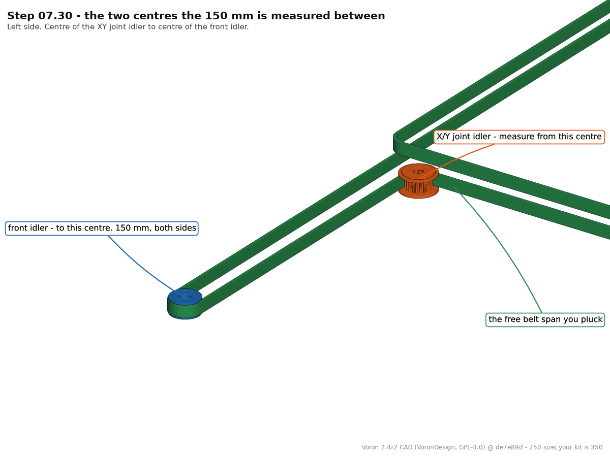
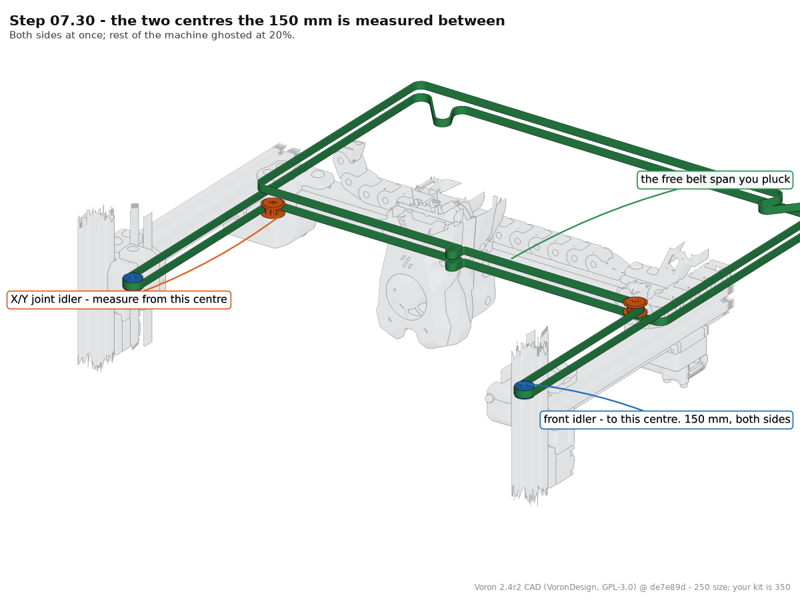

**What you're looking at:** No picture — this is a measurement, not an operation. A plucked belt's pitch depends on the length of the span, so a tension figure only means anything with its span stated: 150 mm centre-to-centre between the XY joint idler and the front idler is the span Voron's number is quoted for. The two idlers a belt runs between on each side — one in the XY joint at the back of the Y beam, one in the front idler block — and the free length of belt between them that you pluck.

**Parts:** none.

**Do:** Move the X extrusion forwards by hand until the **X/Y idler centres are 150 mm from the front idler centres** ([Voron secondary tuning § A/B Belts](https://docs.vorondesign.com/tuning/secondary_printer_tuning.html)). Measure centre-to-centre with the 150 mm rule, on both sides — the gantry must be square-ish to the frame, not skewed, or the two spans will differ and so will the readings.

**Check:** 150 mm on the left and 150 mm on the right, measured to the same features.

Tip: The 150 mm is set by moving the gantry, and the CAD shows a parked 250 machine, not the measuring pose. Take which two centres from the picture, take the number from the rule.

Source: [Voron docs § Secondary printer tuning — A/B Belts](https://docs.vorondesign.com/tuning/secondary_printer_tuning.html) · [Voron manual p.141](https://github.com/VoronDesign/Voron-2/blob/de7e89d/Manual/Assembly_Manual_2.4r2.pdf#page=141) · [Video: Part 6 @0:10:08](https://www.youtube.com/watch?v=8pWoYkY1DiA&list=PL0fUJbigELQPqpeGOgHYisG4KaSXVtnNY&t=608s) · CAD: Voron 2.4r2 STEP @ de7e89d

### Step 07.31 — Read both belts with the phone

**What you're looking at:** The spectrum app turns a plucked belt into a plot of frequency against level. The number you want is the **lowest** peak — the fundamental. A plucked belt also rings at two and three times that, and reading a harmonic tells you the belt is twice as tight as it really is, which sends you loosening a correctly tensioned belt.

**Parts:** none.

**Do:** Start the spectrum app, hold the phone close to the belt, and pluck the free 150 mm section like a guitar string. Read **the lowest frequency peak in the plot** — not the loudest, and not a harmonic. With Gates Carbon Drive, use the "motorcycle" option; it gives one number instead of a plot, which is harder to capture but easier to read. Do both belts.

**Check:** You get a repeatable number — three plucks in a row land within a few Hz of each other. If the reading jumps around, you are picking up a harmonic or room noise; move somewhere quieter and pluck harder.

Source: [Voron docs § Secondary printer tuning — A/B Belts](https://docs.vorondesign.com/tuning/secondary_printer_tuning.html) · image [`sound-spectrum-belt.jpg`](https://raw.githubusercontent.com/VoronDesign/Voron-Documentation/main/tuning/images/sound-spectrum-belt.jpg)

### Step 07.32 — Bring both belts to ~110 Hz

(no image — see text)

**What you're looking at:** The two tensions interact: tightening one belt shifts the X extrusion and changes the other. That is why this converges by alternating quarter turns between the two rather than by finishing one belt and then starting the other.

**Parts:** none.

**Do:** Adjust with the front-idler tensioner screws from Step 07.5 — **in for more tension, out for less**. Target **approximately 110 Hz over the 150 mm span**; that is about 2 lb of tension, deliberately at the low end of the useful range. **The two tensions affect each other — tightening one also tightens the other — so go back and forth in small increments (quarter turns) until they are equal**, rather than finishing one belt and then starting the other ([Voron secondary tuning § A/B Belts](https://docs.vorondesign.com/tuning/secondary_printer_tuning.html)).

**Check:** Both belts read ~110 Hz. Do not chase the absolute number hard at this stage — it is provisional.

Source: [Voron docs § Secondary printer tuning — A/B Belts](https://docs.vorondesign.com/tuning/secondary_printer_tuning.html)

### Step 07.33 — Move the gantry, return, and re-check

(no image — see text)

**What you're looking at:** Moving the gantry and bringing it back re-seats both belts in every stack and lets any trapped slack redistribute. A reading that only holds while the gantry has not moved is not a reading.

**Parts:** none.

**Do:** Move the X extrusion back at least a few centimetres and then forward again to re-establish the 150 mm span. Re-measure both belts.

**Check:** Both belts read within a few Hz of each other, at about 110 Hz, after moving the gantry and returning.

??? note "Why equality beats the absolute number here — and what to do if they won't converge"

    Equality between A and B matters more right now than hitting 110 Hz exactly: unequal A/B tension racks the gantry and will fight the squaring you do in Ch 06b, which releases this tension completely anyway. If the two will not converge, the usual causes in order are unequal belt lengths (Step 07.8), unequal tail protrusion at the carriage (Step 07.27), or a belt rubbing somewhere (Step 07.29).

---

## Finish the X carriage: inductive probe

Source: [Voron docs § Secondary printer tuning — A/B Belts](https://docs.vorondesign.com/tuning/secondary_printer_tuning.html) · [survey §7.2 Ch 07](../voron-build-instructions-survey.md) · [Video: Part 6 @0:15:01](https://www.youtube.com/watch?v=8pWoYkY1DiA&list=PL0fUJbigELQPqpeGOgHYisG4KaSXVtnNY&t=901s)

Pause: ~30 min since the last pause — belt-rub inspection clean at all six stacks, both belts reading ~110 Hz over a 150 mm span and equal to each other after moving the gantry. This tension is provisional; do not chase the number further, Ch 06b releases it entirely.

### Step 07.34 — Insulate the probe and trim its wires

**What you're looking at:** The [inductive probe](16-glossary.md#i) is a metal-sensing barrel that detects the steel bed from a few millimetres away without touching it — it is what the machine later uses for [QGL](16-glossary.md#q) and for the bed mesh. LDO's tape wrap goes on **before** the probe is fitted, front and sides only so the sensing face at the bottom and the back stay bare, because it is far more awkward once the probe is captured in the carriage.

**Parts:** Omron TL-Q5MC inductive probe ×1; fibreglass tape.

**Do:** Cut the probe wires to about **150 mm** (p.143). The manual's photo shows the recommended Omron TL-Q5MC, which is what this kit ships.

**Check:** ~150 mm of lead, insulation intact, conductors not nicked.

⚠ **Rev D+ / LDO:** *"We recommend you insulated the inductive probe prior to installation."* Wrap the probe body with the supplied fibreglass tape **before** it goes into the carriage — **front and sides only, not the back and not the bottom sensing face**. It is far more awkward to do once the probe is captured. [src](https://docs.ldomotors.com/voron/voron2/build-faq) (p.143), [survey §4.2](../voron-build-instructions-survey.md)

Source: [Voron manual p.143](https://github.com/VoronDesign/Voron-2/blob/de7e89d/Manual/Assembly_Manual_2.4r2.pdf#page=143) · [LDO Build Notes § Voron 2.4 build FAQ](https://docs.ldomotors.com/en/voron/voron2/build-faq)

### Step 07.35 — Fit the probe and its retainer bracket

**What you're looking at:** The retainer bracket is the small printed clip that traps the probe barrel in its channel in the X carriage. Snug rather than tight at this stage, because the probe still has to slide up and down for the height setting in the next step.

**Parts:** `probe_retainer_bracket` ×1; M3×30 SHCS ×2.

**Do:** Slide the probe into its channel in the X carriage, fit the retainer bracket over it, and run the two M3×30 SHCS into the bracket's heat-set inserts. Snug enough to hold the probe against gravity but still let it slide for the height adjustment in the next step.

**Check:** The probe is held square, parallel to the carriage face, and can still be pushed up and down with firm finger pressure.

Tip: If the probe barrel measures 9 mm rather than 8 mm, use `probe_retainer_bracket_9mm.stl` instead — a 0.5 g reprint. ([print plan, batch B04](../voron-print-plan.md))

Source: [Voron manual p.143](https://github.com/VoronDesign/Voron-2/blob/de7e89d/Manual/Assembly_Manual_2.4r2.pdf#page=143)

### Step 07.36 — Set the probe height

**What you're looking at:** 6 mm of probe standing below the plastic is a starting position, not a calibration — it puts the sensing face where it will see the bed with margin to spare. The real trigger offset is measured during bring-up in Ch 13.

**Parts:** none.

**Do:** Set the probe so its tip sits about **6 mm below the plastic part** (p.144). This is a starting position only — it gets fine-tuned during bring-up in Ch 13. Then fully tighten the two M3×30.

**Check:** 6 mm ±1 mm, measured with the caliper depth blade. The probe does not move when you push on it.

Source: [Voron manual p.144](https://github.com/VoronDesign/Voron-2/blob/de7e89d/Manual/Assembly_Manual_2.4r2.pdf#page=144)

### Step 07.37 — Route the probe cable

**What you're looking at:** The moulded slot is the one place the probe cable can sit where it will not be caught between the belts and the rail carriage across the full X travel. It is left lying in the channel here; connecting it and dressing it into the drag chain is Ch 10.

**Parts:** none.

**Do:** Guide the probe cable into the moulded slot in the carriage (p.144, right-hand image). Leave it lying in the channel; it gets connected and dressed into the drag chain in Ch 10.

**Check:** The cable is captive in the slot, clear of both belts and of the X rail carriage over the full travel. Move the carriage end to end and watch it.

Source: [Voron manual p.144](https://github.com/VoronDesign/Voron-2/blob/de7e89d/Manual/Assembly_Manual_2.4r2.pdf#page=144)

### Step 07.38 — Hall-effect endstop magnet: skip

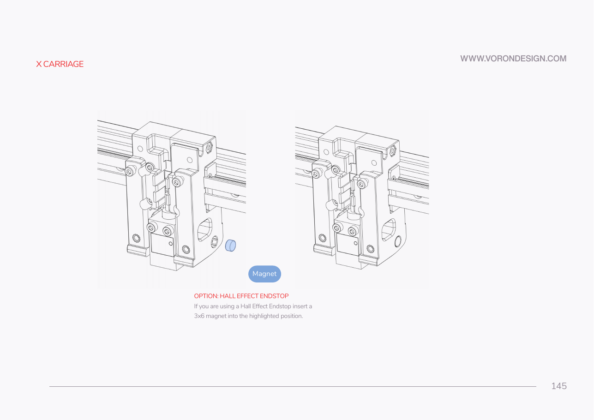

**What you're looking at:** A page you skip entirely. The pocket shown in the carriage takes a magnet for the hall-effect endstop option; this kit uses a microswitch PCB in the printed endstop pod fitted in Ch 05, so the pocket stays empty.

**Parts:** none.

**Do:** Nothing.

**Check:** No magnet in the carriage pocket.

⚠ **Rev D+ / LDO:** *"PAGE 145 SKIP — The kit does not use hall effect endstops."* This kit ships the XY microswitch PCB and the `[a]_endstop_pod_D2F_switch` printed part (fitted in Ch 05). Do not insert a 3×6 magnet. [src](https://docs.ldomotors.com/voron/voron2/build-faq) (p.145), [survey §4.2](../voron-build-instructions-survey.md)

Source: [Voron manual p.145](https://github.com/VoronDesign/Voron-2/blob/de7e89d/Manual/Assembly_Manual_2.4r2.pdf#page=145) · [LDO Build Notes § Voron 2.4 build FAQ](https://docs.ldomotors.com/en/voron/voron2/build-faq)

### Step 07.39 — Fit the A/B drive cable cover

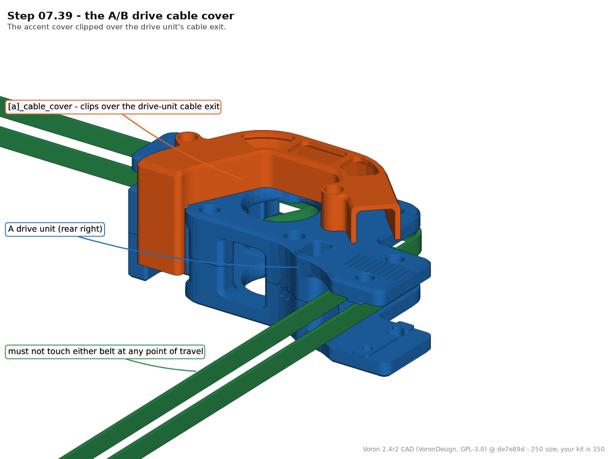
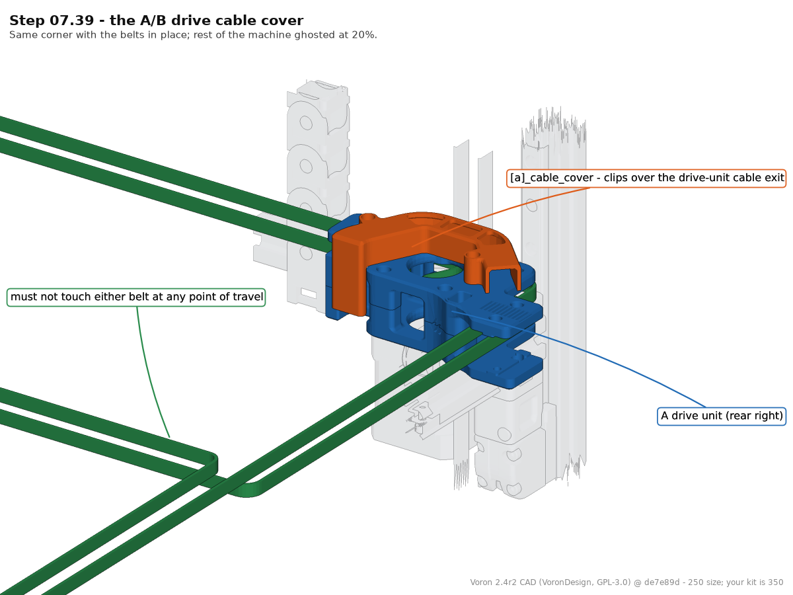

**What you're looking at:** The `[a]_cable_cover` is the orange shroud that tidies the A/B motor leads where they leave a drive unit. The official manual has no page for it — it goes on now purely because the rear of the gantry is still open and easy to reach. The printed cable cover that clips over the cable exit on a drive unit, and the two belts running past it that it must never touch.

**Parts:** `[a]_cable_cover` ×1.

**Do:** Clip the accent cable cover onto the drive-unit cable exit now, while the rear of the gantry is still open and reachable. The official manual has no page for this part; if the A/B motor leads are not yet dressed, leave it off and fit it during the gantry cable routing in Ch 10 instead. ([`Gantry/AB_Drive_Units/[a]_cable_cover.stl`](https://github.com/VoronDesign/Voron-2/tree/Voron2.4/STLs/Gantry/AB_Drive_Units), print batch B02)

**Check:** The cover does not touch either belt at any point of travel — re-run the Step 07.29 rub inspection at that drive unit after fitting it.

Source: CAD: Voron 2.4r2 STEP @ de7e89d

---

## Checkpoint 07

- [ ] Both belts routed to match p.126 (A) and p.127 (B); each belt stays in one plane, neither crosses the other.
- [ ] No half-twist anywhere; belt teeth face away from the extrusion at the X carriage.
- [ ] Teeth meshed on both toothed motor pulleys — each pulley indexes when the belt is nudged, no slip.
- [ ] Belt not riding on any printed part at any of the six stacks, checked at both ends of X travel and both ends of Y travel (p.142).
- [ ] Equal length of belt protruding from the X carriage on both belts, after moving the gantry and returning (p.141).
- [ ] Carriage bolts and all four M3×8 belt clamps fully tightened; nothing slips under a hard pull.
- [ ] **Both belts read within a few Hz of each other at ~110 Hz over a 150 mm span**, re-checked after moving the gantry.
- [ ] Gantry moves through the full XY envelope by hand with even resistance, no ticking, no notchiness.
- [ ] Probe insulated (front + sides only), fitted, wires cut to ~150 mm, tip 6 mm below the plastic, cable in its channel.
- [ ] No hall-effect magnet fitted (p.145 skipped).
- [ ] Photos taken: each of the six stacks with the belt seated, and the carriage clamp with both tails visible. ([survey §7.5](../voron-build-instructions-survey.md))

## Common mistakes

- **Tensioning to final now.** Ch 06b releases A/B tension completely as its first move, and it cannot run until the printer is alive (Ch 13). Set ~110 Hz, confirm A ≈ B, move on. Chasing the last 5 Hz here is time you will spend again.
- **Cutting the second belt after the first is installed.** Any length error becomes a permanent tension imbalance you will try to fix with the tensioners, which cannot fix it. Cut both together against a square edge (Step 07.8).
- **Wrapping the wrong element of a rear drive unit.** Each drive unit holds the motor pulley for its own belt *and* an idler stack for the other belt. Putting the A belt on the B motor pulley looks plausible and locks the two axes together. The p.126 top-left and p.127 top-right insets show which is which.
- **A half-twist in a long run.** It shows up as a belt that runs fine at one end of travel and rubs at the other. Sight down each straight run and confirm the teeth face the same way at both ends.
- **Reading a harmonic on the phone.** Spectrum apps show peaks at 2× and 3× the fundamental; 220 Hz reads as "too tight" and sends you loosening a correctly tensioned belt. Take the *lowest* peak, and take three plucks.
- **Forcing a belt round a bearing stack.** You will damage the flange or unseat a bearing. Pull the M3×40 SHCS at that idler, thread the belt, refit (p.134).

## Next

Ch 08 — Toolhead: Stealthburner, Clockwork 2 and the Nitehawk-SB V2, where all five Rev D+ deviations land.

Source: [`STLs/Gantry/AB_Drive_Units/`](https://github.com/VoronDesign/Voron-2/tree/Voron2.4/STLs/Gantry/AB_Drive_Units) · [Voron manual p.142](https://github.com/VoronDesign/Voron-2/blob/de7e89d/Manual/Assembly_Manual_2.4r2.pdf#page=142)

Pause: ~30 min since the last pause — inductive probe insulated, fitted, set to height and its cable routed; endstop magnet correctly skipped; A/B cable cover on. Gantry is a working XY system. Do not tension further and do not square the gantry.

