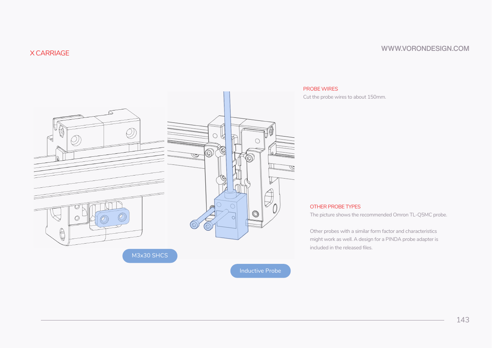

# Chapter 08 — Toolhead: Stealthburner, Clockwork 2, Revo HF, Nitehawk-SB V2

Builds the complete toolhead on the bench — extruder, hotend, fans, LEDs, toolboard — and hangs it on the X carriage with every connector made, so Ch 10 only has to pull one umbilical through the chain.

**Time:** 3.0–4.5 h hands-on, first build (survey §7.2).

**Prerequisites:**
- **Ch 05 — Gantry.** X carriage halves (`x_frame_V2TR_MGN12_left/right`) built, heat-set inserts and M3 nuts already in them, carriage running the full X travel with no bind.
- **Ch 07 — A/B belts.** Belts clamped into the carriage and tensioned. The carriage must be finished before anything hangs off it.
- **Print batches: B2** (the orange accent parts: `[a]_stealthburner_main_body`, `[a]_guidler_a/b`, `[a]_latch`, `[a]_latch_shuttle`, spare `[a]_pcb_spacer`), **B6** (Stealthburner `revo_voron` printheads, Clockwork 2 black parts, `cw2_captive_pcb_cover`, the Klicky set), and **B4** for the carriage. Batch ids from `docs/voron-print-plan.md`.
- **LDO-supplied printed parts, no print needed:** CW2 Chain Anchor Tilted ×1, CW2 PCB Spacer ×1, Stealthburner LED Diffuser ×1 (clear PETG), LDO Nozzle Probe ×1, NH Adapter Mount ×1. [src](https://docs.ldomotors.com/en/voron/voron2/350_BOM/Rev_D)

**Tools**
- Hex 1.5 / 2 / 2.5 mm (1.5 mm is supplied)
- Temperature-controlled soldering iron + the supplied brass M3 insert tip
- Flush cutters and a small flat file (5015 fan ears)
- Multimeter (continuity and thermistor resistance)
- Digital caliper (drive-gear position, PTFE stickout)
- JST-PH2.0 crimp tool — **only** if you re-terminate the Revo pigtails yourself
- Fine sandpaper (supplied ×2), for the drive shaft face and the fan ears
- Small pliers, tweezers

**Consumables:** medium-strength threadlocker (Loctite 243), light grease for the BMG idler bearings, fibreglass tape 2×12 cm (supplied, probe insulation), E0508 ferrules, zip ties 3×150 mm.

**Printed parts**

| STL | Qty | Colour |
|---|---|---|
| `[a]_stealthburner_main_body.stl` | 1 | Orange (accent) |
| `stealthburner_printhead_revo_voron_front.stl` | 1 | Black |
| `stealthburner_printhead_revo_voron_rear_cw2.stl` | 1 | Black |
| `[o]_stealthburner_LED_carrier.stl` | 1 | Black (opaque) |
| `[o]_stealthburner_LED_diffuser_mask.stl` | 1 | Black (opaque) |
| `[c]_stealthburner_LED_diffuser.stl` | 1 | **Supplied printed** in clear PETG — do not print |
| `main_body.stl` (Clockwork 2) | 1 | Black |
| `motor_plate.stl` (Clockwork 2) | 1 | Black |
| `[a]_guidler_a.stl` / `[a]_guidler_b.stl` | 1 each | Orange (accent) |
| `[a]_latch.stl` / `[a]_latch_shuttle.stl` | 1 each | Orange (accent) |
| `[a]_pcb_spacer.stl` (CW2) | 1 | **Supplied printed**; you printed a 0.3 g spare |
| `cw2_captive_pcb_cover.stl` (Nitehawk-SB repo) | 1 | Black — replaces the stock `cable_door` |
| CW2 Chain Anchor Tilted | 1 | **Supplied printed** — do **not** print `chain_anchor_2hole` |
| `probe_retainer_bracket.stl` | 1 | Black (printed in B4, fitted here) |
| Klicky set (`KlickyProbe_v2` ×2, `Probe_Dock_v2.1`, `Probe_magnet_holder`, `Probe_pressfit_holder`, `KlickyProbe_AB_mount_v2` + holder, `Mount_*`, `Dock_mount_fixed_v2`) | 1 set | Black — **alternative path only**, bag it (Step 08.54) |

**Hardware** (chapter totals)

| Fastener / part | Qty | Note |
|---|---|---|
| Heat-set insert, brass, M3×5×4 | 15 | 4 CW2 main body, 4 CW2 motor plate, 1 latch, 1 guidler arm, 3 chain anchor, 2 printhead rear — all `(verify on bench)`, the SB manual highlights locations, not counts |
| M3×8 SHCS | 10 | 1 motor, 1 cable bridge, 4 tool cartridge, 2 toolboard, 2 CW2→carriage |
| M3×16 SHCS | 3 | 1 guidler pivot, 2 tool cartridge |
| M3×20 SHCS | 1 | chain anchor |
| M3×25 SHCS | 6 | 2 motor plate, 1 tension arm, 1 latch, 2 SB mounting |
| M3×30 SHCS | 3 | 1 motor, 2 inductive probe |
| M3×50 SHCS | 2 | SB mounting (lower pair) |
| M3×6 FHCS | 3 | 1 CW2 main body (threadlocked), 2 part-cooling fan |
| M3×10 FHCS | 2 | fan adapter PCB to the 5015 |
| M3×6 captive screw | 1 | LDO cable cover; kit ships 2 |
| M3 washer | 1 | under the M3×8 motor bolt |
| M2×10 self-tapping | 2 | LDO nozzle-probe PCB to its printed part |
| M3×2 set screw, pre-applied threadlocker | 1 | nozzle-probe pulley — snug only |
| MR85 bearing | 2 | 1 motor plate, 1 main body |
| Bondtech IGDA gear set | 1 | drive gear + 50T gear + shaft |
| Thumb Screw Kit (thumbscrew, spring ~12 mm × 6 mm OD × 1 mm wire, washer) | 1 | |
| LDO-36STH20-1004AHG(VRN) pancake stepper, NEMA14 36 mm | 1 | |
| E3D Revo Hotend (HF), Revo Voron form factor | 1 | 40 W, 300 °C max, Semitec 104NT-4-R025H42G |
| PTFE 4 mm OD / 2 mm ID, 10 cm | 1 | tool cartridge, 11 mm stickout |
| 40×40×10 axial fan, 24 V | 1 | hotend fan |
| 50×50×15 centrifugal fan, 24 V | 1 | part cooling |
| Nitehawk-SB V2 toolboard | 1 | STM32G0B1, integrated ADXL345 |
| Stealthburner Fan Adapter PCB (SBurnerFanAdapter_V2.0) | 1 | |
| Toolhead cable (combined USB + 24 V), XT30(2+2) | 1 | from the Toolhead PCB Cables bag |
| Ferrule, E0508 | 2 | hotend heater, if you re-terminate |
| Fibreglass tape, 2×12 cm | 1 | inductive probe insulation |
| M3×10 SHCS | 3 | USB adapter stack (assembled here, mounted in Ch 09) |
| Ring-lug ground wire, toolboard → extruder motor | 1 | ⚠ see Step 08.53 |

**Read first**
- **Do the insert pass before you assemble anything.** A missed insert in the CW2 main body means stripping the extruder back to bare plastic (survey §5.2 W3). All 15 go in first, in Steps 08.3–08.7.
- **Five of the six Rev D+ deltas land in this chapter.** PROBE / TH0 / XY-Endstop are **JST-PH2.0**, not XH2.5; the board-to-board fan header is **keyed and gender-reversed**; there is no ADXL mount; the USB-adapter cover is the V2 part; and there is an undocumented grounding scheme (survey §4.1).
- **The kit ships both probes and you build the inductive one.** LDO's wiring guide, the Rev D+ Klipper config and survey §4.3 all assume the Omron inductive probe for QGL plus the LDO nozzle probe as the Z endstop. The Klicky parts are printed; bag them (Step 08.54).
- **Skip the ADXL mount entirely.** The Nitehawk-SB has an ADXL345 on board. Do not fit the two extra inserts SB p.38 highlights, and do not print `ADXL345_Mounts/*`. [src](https://docs.ldomotors.com/en/voron/voron2/printed_part_guide_rev_d)
- **The XY-endstop port on the toolboard is unused** in a standard build, and the PROBE port's third pin is 24 V — Klicky must not have it populated. [src](https://docs.ldomotors.com/en/voron/voron2/wiring_guide_rev_d#wiring-the-toolhead-pcb)

---

## A — Part preparation and heat-set inserts

### Step 08.1 — Sort the printed parts and confirm the hotend code

(SB manual p.37, not embedded)

**Parts:** all B2 and B6 toolhead prints; the two `revo_voron` printhead halves.

**Do:** Lay the parts out in build order. Find the hotend code embossed on both printhead halves and read it — it must say **E-RV** (E3D Revo Voron). Confirm the rear half is the `_rear_cw2` variant: it has the corner opening for Clockwork 2 wire routing that the CW1 variant lacks. Set the Klicky bag aside; you are not building it (Step 08.54).

**Check:** `E-RV` on both halves, and the rear half's wire-routing corner is open. If you printed a different printhead folder, stop and reprint — no other mount fits the Revo.

Tip: the `revo_voron` folder is the settled choice for this kit; the SB printhead README maps "E3D Revo Voron → E-RV". [src](https://github.com/VoronDesign/Voron-Stealthburner/blob/main/STLs/Stealthburner/Printheads/README.md)

---

### Step 08.2 — Snap the built-in supports out of the Stealthburner body

(SB manual p.45, not embedded)

**Parts:** `[a]_stealthburner_main_body` ×1.

**Do:** The orange main body prints with seven bodies' worth of built-in support. **Snap** the highlighted supports out with flush cutters — pry and break them, do not carve. Leave the supports inside the fan cavities alone: SB p.52 says those are designed to break when the fans go in, and breaking them early loses the fans' clip retention.

**Check:** The LED pockets, diffuser channels and the two mounting bores are clear. The fan cavities still have their thin support webs in place.

---

### Step 08.3 — Inserts: Clockwork 2 main body

(SB manual p.11–12 and p.13, not embedded)

**Parts:** `main_body.stl`, heat-set inserts M3×5×4 ×4.

**Do:** Set the iron to ~230 °C with the brass M3 tip and adjust the tongue so it bottoms flush with the insert. SB p.11–12 highlight **three** locations on the main body across two views — two enter from one face, one from the far foot. SB p.13 adds a **fourth** for the toolhead PCB; you are fitting a Nitehawk, so that one is required. Press each in square, then let the part cool before you touch it.

**Check:** All four sit below the surface, none is cocked, and an M3 screw starts by hand in each. Count: 4 `(verify on bench — the manual highlights locations, not counts)`.

⚠ Rev D+ / LDO: the p.13 "OPTION: TOOLHEAD PCB" inserts are not optional here. The Nitehawk-SB V2 bolts to the CW2 sides with two M3×8 into these inserts. [src](https://docs.ldomotors.com/en/voron/voron2/wiring_guide_rev_d#wiring-the-toolhead-pcb)

Tip: the p.13 insert on the main body sits next to a tall wall — the manual warns it is easy to touch that wall with the iron. Approach it from directly above.

---

### Step 08.4 — Inserts: Clockwork 2 motor plate

(SB manual p.12 and p.13, not embedded)

**Parts:** `motor_plate.stl`, heat-set inserts M3×5×4 ×4.

**Do:** The motor plate is the thin (8.2 mm) part with the large central bore. SB p.12 highlights **three** locations on it and calls out two of them explicitly: the top insert and the bottom insert must both sit **below** the surface. Mind the cutout beside the bottom one and keep the insert straight. SB p.13 adds the **fourth**, for the toolhead PCB.

**Check:** Lay a steel rule across each insert — no insert stands proud. Count: 4 `(verify on bench)`.

---

### Step 08.5 — Inserts: latch and guidler arm (flush, not below)

(SB manual p.15, not embedded)

**Parts:** `[a]_latch` ×1, `[a]_guidler_a` ×1, heat-set inserts M3×5×4 ×2.

**Do:** These two accent parts (both carry the Voron heart) take one insert each. Unlike the body inserts, these must finish **flush or only slightly below** the surface — sunk too deep and the latch will not close on the shuttle.

**Check:** A straightedge across the insert face rocks on the plastic, not on the brass. Count: 2 `(verify on bench)`.

---

### Step 08.6 — Inserts: CW2 chain anchor (Igus 2-hole pattern)

(SB manual p.14, not embedded)

**Parts:** CW2 Chain Anchor Tilted (LDO, supplied printed), heat-set inserts M3×5×4 ×3.

**Do:** SB p.14 shows two anchor variants. Your kit ships **Igus-pattern 2-hole** drag chain, so use the two-hole row: **two** inserts along the top face plus **one** in the front tab that bolts to the extruder. Ignore the three-hole generic pattern entirely.

**Check:** Offer a chain end plate to the anchor — its two screw holes line up over your two inserts. Count: 3 `(verify on bench)`.

⚠ Rev D+ / LDO: do not print or use `Clockwork2/chain_anchor_2hole.stl`. LDO supplies the **tilted** anchor printed, and the print plan lists the Voron file as deliberately not printed. Always take `_2hole`, never `_3hole`, anywhere in this build. [src](https://docs.ldomotors.com/en/voron/voron2/printed_part_guide_rev_d)

---

### Step 08.7 — Inserts: rear printhead half — and the two you skip

(SB manual p.38, not embedded)

**Parts:** `stealthburner_printhead_revo_voron_rear_cw2` ×1, heat-set inserts M3×5×4 ×2.

**Do:** SB p.38 highlights four locations on the rear printhead. Fit only the **two on the top face**. The **two inside the circled region are the ADXL PCB mount** — leave those holes empty.

**Check:** Two inserts on the top face; the circled pair are bare plastic. Count: 2 `(verify on bench)`.

⚠ Rev D+ / LDO: the Nitehawk-SB V2 carries an ADXL345 on board with `[resonance_tester] accel_per_hz: 100` already configured. There is no toolhead accelerometer to mount, now or later. [src](https://github.com/MotorDynamicsLab/LDOVoron2/blob/main/Firmware/leviathan-printer-rev-d-sbv2.cfg)

---

### Step 08.8 — Confirm the X carriage is ready to receive a toolhead

**Parts:** X carriage (already on the gantry from Ch 05/07).

**Do:** Before the toolhead exists, verify the carriage. Manual p.129 shows the carriage prep: its heat-set inserts and M3 nuts must already be fitted, and SB p.59 shows the same parts from the toolhead side. Check that both belt clamps are closed and the belts terminated.

**Check:** Every carriage insert and nut present; carriage slides the full X travel by hand with no bind; both belts clamped.

⚠ Rev D+ / LDO: LDO Build Notes flag p.129–130 specifically — verify you have the **Clockwork 2** carriage (`x_frame_V2TR_MGN12_left/right`), not an older MGN9 or CW1 variant, and follow the Stealthburner manual for the carriage detail. [src](https://docs.ldomotors.com/voron/voron2/build-faq)

---

## B — Clockwork 2 extruder

### Step 08.9 — Build the BMG idler assembly and grease it

(SB manual p.17, not embedded)

**Parts:** BMG idler gear, idler shaft, bearing sleeve (from the Bondtech IGDA set).

**Do:** Slide the idler assembly together on its shaft. Wipe a light grease film onto the bearing surfaces — the Voron sourcing guide calls for a "light grease"; the Super Lube you used on the rails is fine. Note the orientation shown: the toothed face goes towards the filament path.

**Check:** The idler spins freely with no gritty feel and no axial slop.

---

### Step 08.10 — Close the guidler arm

(SB manual p.16, not embedded)

**Parts:** `[a]_guidler_a` ×1, `[a]_guidler_b` ×1, M3×16 SHCS ×1, the idler assembly from 08.9.

**Do:** Trap the greased idler assembly between the two guidler halves in the orientation from p.17, then join them with one M3×16 SHCS. Snug, not torqued — this bolt is the idler axle.

**Check:** The idler still spins freely with the halves closed. The two halves meet with no gap.

---

### Step 08.11 — Build the BMG thumbscrew assembly

(SB manual p.18, not embedded)

**Parts:** Thumb Screw Kit — thumbscrew ×1, spring ×1, washer ×1.

**Do:** Slide the spring then the washer onto the thumbscrew shaft in that order, and thread the assembly into the guidler arm's threaded boss.

**Check:** The spring measures roughly 12 mm long, 6 mm OD, 1 mm wire. A different spring changes the tension characteristic and prints badly — if yours is visibly different, source the Bondtech part before continuing.

---

### Step 08.12 — Seat the first MR85 in the motor plate

(SB manual p.19, not embedded)

**Parts:** `motor_plate.stl`, MR85 bearing ×1 (of 2).

**Do:** Press the MR85 fully into its plastic pocket with even pressure on the **outer** ring only — never push on the inner ring. If it needs real force the part is over-extruded; back off and check the print rather than hammering it.

**Check:** The bearing face is flush with the pocket floor and spins freely.

---

### Step 08.13 — Check the drive shaft slides through both bearings

(SB manual p.19, not embedded)

**Parts:** Bondtech drive shaft, both MR85 bearings, fine sandpaper (supplied).

**Do:** The bearings must **slip on and off the shaft by hand** so the gear can self-centre. Pressing a bearing onto the shaft destroys it. If either is tight, lightly sand the shaft — a few passes, then re-test.

**Check:** Each bearing slides on and off with fingertip force and no rocking.

---

### Step 08.14 — Seat the second MR85 in the main body and lock it

(SB manual p.20, not embedded)

**Parts:** `main_body.stl`, MR85 bearing ×1, M3×6 FHCS ×1, threadlocker.

**Do:** Press the second MR85 into the main-body pocket, outer ring only. Then put a small drop of **medium-strength threadlocker** on the M3×6 FHCS and drive it into the retaining position shown.

**Check:** Bearing flush and free; the flat head sits level in its countersink.

---

### Step 08.15 — Set the drive gear at its initial position and threadlock it

(SB manual p.21, not embedded)

**Parts:** Bondtech filament drive gear, 50T gear, drive shaft, caliper, threadlocker.

**Do:** Read SB p.21–24 end to end before you open the threadlocker — the position is set across three pages and you want to be moving when the glue is wet. Slide the drive gear onto the shaft so its **set screw seats against the notch machined in the shaft**, set the initial spacing to **15.6 mm** as dimensioned on p.21, apply threadlocker, and tighten the set screw carefully. The set-screw head strips easily.

**Check:** Caliper reads 15.6 mm at the dimensioned face. The set screw is on the notch, not on the round of the shaft. Final position is corrected in Step 08.18.

---

### Step 08.16 — Drop the drive assembly into the main body

(SB manual p.22, not embedded)

**Parts:** drive assembly from 08.15, `main_body.stl`.

**Do:** Lower the shaft-and-gears assembly into the main body so the shaft enters the MR85 you fitted in 08.14 and the 50T gear sits in its chamber.

**Check:** The shaft turns by hand with only bearing drag. No gear rubs the plastic.

---

### Step 08.17 — Close the extruder with the motor plate

(SB manual p.23, not embedded)

**Parts:** `motor_plate.stl` (from 08.12), M3×25 SHCS ×2.

**Do:** Bring the motor plate onto the main body so the shaft picks up its second MR85, then fit two M3×25 SHCS. Tighten until the parts meet and stop. The manual's wording is deliberate: tighten too far and the plastic bends and cracks — at which point you back off two turns, bin the part and reprint.

**Check:** No visible gap at the parting line and no stress whitening at either bolt boss. The shaft still turns freely.

---

### Step 08.18 — Verify drive-gear alignment with real filament

(SB manual p.24, not embedded)

**Parts:** a 100 mm offcut of 1.75 mm filament.

**Do:** Push the filament down the extruder's filament path. It must land on the **toothed** section of the drive gear, not on the shoulder either side. If it is off, loosen the set screw, nudge the gear, re-check, re-tighten. Then confirm the shaft's end face does not stand proud of the printed part — the drive shaft must not touch the motor housing when the stepper goes on. Sand the shaft face if it does.

**Check:** Filament centres on the gear teeth; the shaft end sits at or below the plastic surface when fully seated.

---

### Step 08.19 — Hang the tension arm — and leave it loose

(SB manual p.25, not embedded)

**Parts:** guidler assembly from 08.10, M3×25 SHCS ×1.

**Do:** Locate the guidler/tension arm on its pivot and pass one M3×25 SHCS through. **Do not tighten it.** This bolt is a hinge pin; torquing it locks the arm and kills filament tensioning.

**Check:** The arm swings through its full travel under finger pressure and falls back under spring load.

---

### Step 08.20 — Fit the latch

(SB manual p.26, not embedded)

**Parts:** `[a]_latch` ×1 (insert fitted in 08.5), M3×25 SHCS ×1.

**Do:** Drop the latch over its post and secure with one M3×25 SHCS. Snug — the latch must still pivot.

**Check:** The latch swings over the guidler and holds it closed, and releases cleanly when lifted.

---

### Step 08.21 — Set the tension and the anti-squish stop

(SB manual p.27, not embedded)

**Parts:** the assembled extruder, 1.75 mm filament offcut.

**Do:** Clockwise on the thumbscrew increases grip. Set it to just enough that the filament cannot be pulled back through by hand. Then set the CW2 anti-squish adjustment — the stop that fixes the **minimum** distance between drive gear and idler — so the gears mesh without binding and soft filament is not crushed.

**Check:** With filament loaded, the arm closes without the gears grinding against each other, and the filament shows shallow tooth marks rather than a flattened track.

---

### Step 08.22 — Fit the pancake stepper, first bolt

(SB manual p.28, not embedded)

**Parts:** LDO-36STH20-1004AHG(VRN) NEMA14 pancake stepper ×1, M3×30 SHCS ×1.

**Do:** Present the stepper to the motor plate with its pinion entering the 50T gear chamber and its cable exiting where the CW2 body routes it. Start the M3×30 SHCS in the upper mounting position. Leave it loose — mesh is set two steps from now.

**Check:** The motor sits flat against the plate with the pinion engaged, not bottomed.

---

### Step 08.23 — Fit the second motor bolt through the front access hole

(SB manual p.29, not embedded)

**Parts:** M3×8 SHCS ×1, M3 washer ×1.

**Do:** Put the washer on the M3×8 SHCS and drive it into the second motor position. It is reached from the **front** of the extruder through the access hole. Leave this one loose too.

**Check:** Both motor bolts started, both still finger-loose, and the motor can be nudged in its slots.

---

### Step 08.24 — Set the gear mesh, then tighten both motor bolts

(SB manual p.30, not embedded)

**Parts:** the extruder assembly.

**Do:** Slide the motor until the pinion and the 50T gear teeth fully overlap with a **very small** gap between the tooth faces. You want a faint play, not a preload. Turn the drive shaft by hand while you adjust. When it feels right, tighten the M3×30 first, then the M3×8 — the manual's most-missed step is forgetting the second bolt.

**Check:** Rotating the drive gear by hand gives a barely perceptible backlash and no tight spot anywhere through a full turn. Both bolts tight.

---

### Step 08.25 — Fit the LDO tilted chain anchor

(SB manual p.31, not embedded)

**Parts:** CW2 Chain Anchor Tilted (supplied printed, inserts from 08.6), M3×20 SHCS ×1.

**Do:** Sit the anchor onto the rear of the CW2 so its chain face points back along the X extrusion, and fix it with one M3×20 SHCS.

**Check:** The anchor is solid on the body and its two chain holes face rearwards and slightly up.

---

### Step 08.26 — Fit the cable-bridge bolt

(SB manual p.32, not embedded)

**Parts:** M3×8 SHCS ×1.

**Do:** Drive the M3×8 SHCS into the cable-bridge position on the side of the extruder — the second fixing that ties the anchor and the cable path to the body.

**Check:** The anchor no longer twists when you push it sideways.

---

## C — Tool cartridge and E3D Revo HF

### Step 08.27 — Assemble the Revo HF hotend

(no image — see [E3D Revo Voron support](https://e3d-online.com/pages/revo-support-voron); SB manual p.39, not embedded)

**Parts:** Revo Voron heatsink ×1, retaining spring ×1, Revo HeaterCore ×1, Revo nozzle ×1.

**Do:** Fit the spring into the groove on the **bottom** of the heatsink. Push the HeaterCore onto the heatsink-and-spring assembly. Then screw the nozzle into the heatsink — **finger-tight only**, no tools; it should slide freely through the HeaterCore as it goes. To point the HeaterCore's cables where you want them, rotate it **anti-clockwise only**: turning it clockwise disengages the spring.

**Check:** Nozzle fully home and hand-tight. HeaterCore captive under spring load. Cables pointing to the rear.

---

### Step 08.28 — Bend the strain relief so the nozzle can seat fully

(SB manual p.40, not embedded)

**Parts:** Revo assembly.

**Do:** Route the hotend wires as SB p.40 shows — the routing is the same for every hotend type. Then carefully bend the HeaterCore's stainless strain relief so it clears the printed part. Hold the HeaterCore firmly while you bend so you do not put load on the nozzle. This is not cosmetic: **the nozzle cannot be fully hand-tightened into the heatsink unless the strain relief is bent out of the way.**

**Check:** With the strain relief bent, the nozzle turns the last part-turn home by hand, and the wires exit rearwards without touching the nozzle.

---

### Step 08.29 — Seat the hotend in the rear printhead half

(SB manual p.39, not embedded)

**Parts:** `stealthburner_printhead_revo_voron_rear_cw2` (inserts from 08.7), Revo assembly.

**Do:** Drop the Revo Voron heatsink into the rear printhead half so the heatsink's groove locates on the printed rib and the wires leave through the CW2 corner opening.

**Check:** The heatsink cannot rotate in the pocket, and the nozzle protrudes centrally.

---

### Step 08.30 — Close the tool cartridge

(SB manual p.41, not embedded)

**Parts:** `stealthburner_printhead_revo_voron_front` ×1, M3×16 SHCS ×2.

**Do:** Bring the front half onto the rear half around the hotend and fix with two M3×16 SHCS.

**Check:** The two halves close with no gap and the hotend has zero play in any direction.

---

### Step 08.31 — Fit the four tool-cartridge mounting bolts

(SB manual p.42, not embedded)

**Parts:** M3×8 SHCS ×4.

**Do:** Drive four M3×8 SHCS into the top face of the tool cartridge. These are the studs the cartridge later hangs on when it slides up into the toolhead (Step 08.66) — do not overtighten and do not leave them proud.

**Check:** Four bolts, all seated to the same depth.

---

### Step 08.32 — Cut and fit the PTFE to 11 mm stickout

(SB manual p.43, not embedded)

**Parts:** PTFE 4 mm OD / 2 mm ID (10 cm piece), caliper, flush cutters.

**Do:** Push the PTFE down into the tool cartridge until it bottoms on the heatsink, then cut it so exactly **11 mm** stands above the surface of the printed part. Cut square — a diagonal cut leaves a filament-catching step. The 11 mm figure is specific to Clockwork 2.

**Check:** Caliper across the stickout reads 11 mm. Push 1.75 mm filament through — it enters the hotend with no catch.

---

### Step 08.33 — Terminate the hotend leads for the Nitehawk V2

(no image — see [Nitehawk-SB V2 pinout](https://github.com/MotorDynamicsLab/Nitehawk-SB-V2/blob/master/Images/nhsbv2_pcb_pinout.jpg); link only, the V2 repo carries no licence file)

**Parts:** Revo heater and thermistor leads, E0508 ferrules ×2, JST-PH2.0 2-pin housing + crimps (only if re-terminating).

**Do:** The Revo HF arrives with integrated heater and thermistor terminated in Molex Micro-Fit 3.0 2-pin. The Nitehawk V2 wants **E0508 ferrules** in the `HE0` screw terminal for the heater (polarity does not matter) and a **JST-PH2.0 2-pin** plug on `TH0` for the thermistor. Open the Toolhead PCB Cables bag first: if LDO's pre-terminated hotend cables mate with the Revo's Micro-Fit connectors, use them as-is and crimp nothing. If they do not, cut the Revo pigtails to length and fit ferrules and a PH2.0 housing yourself. `(verify on bench — depends on what LDO packed for the Revo option)`

**Check:** Heater leads end in two crimped E0508 ferrules with no stray strands. Thermistor lead ends in a 2-pin PH2.0 housing that drops into `TH0` without force.

⚠ Rev D+ / LDO: the Rev D wiring guide still says *"the connector type to use is JST-XH2.5 two pin"* for the hotend thermistor. On the V2 board `TH0`, `PROBE` and the XY endstop are **JST-PH2.0**. An XH2.5 housing will not fit, and the smaller PH2.0 body is easy to force into the wrong header — check the silkscreen before every insertion. [src](https://github.com/MotorDynamicsLab/Nitehawk-SB-V2)

---

### Step 08.34 — Prepare the 5015 part-cooling blower

(SB manual p.55, not embedded)

**Parts:** 50×50×15 centrifugal fan (24 V) ×1, flush cutters, small flat file.

**Do:** Remove the front cover of the 5015. Clip the stock mounting ears off flush and file the remains down until the housing sides are flat. A trimming jig STL ships in the Stealthburner release if you want one — it is not in the repo's `STLs/` tree, only in the release archive.

**Check:** No ear stands proud of the housing wall. Test-fit the fan into the SB main body pocket — it drops in without spreading the printed walls.

---

## D — Stealthburner body: LEDs and fans

### Step 08.35 — Build the logo LED into its carrier

(SB manual p.47, not embedded)

**Parts:** `[o]_stealthburner_LED_carrier` ×1, `[o]_stealthburner_LED_diffuser_mask` ×1, `[c]_stealthburner_LED_diffuser` ×1 (supplied, clear PETG), logo LED (chain index 1).

**Do:** Seat the logo LED in the carrier with its wires exiting upwards. Fit the **opaque black mask** behind and the **clear PETG diffuser** in front — the mask blocks light bleed so the logo reads crisply, the diffuser spreads it.

**Check:** Mask is the opaque part, diffuser is the translucent one. Do not swap them. Nothing rattles.

---

### Step 08.36 — Wire the three-LED chain

(SB manual p.46, not embedded)

**Parts:** logo LED (index 1), toolhead LED right (index 2), toolhead LED left (index 3); 3-core 0.16 mm² (AWG26–30) — 120 mm controller→logo, 100 mm between each LED.

**Do:** Many Rev D kits ship this chain pre-soldered in the toolhead cable bag — check first and skip this step if so. If you are soldering it: connect **OUT of one LED to IN of the next**, in the order logo (1) → right (2) → left (3). Both the IN and the OUT wires of every LED must **exit in the same direction**, or the pigtails will not lie in the printed channels.

**Check:** Continuity from the connector's DIN through each LED's DIN/DOUT pair in chain order; 5 V and GND common along the chain; no 5 V–GND short at the connector.

⚠ Rev D+ / LDO: the config declares `chain_count: 3` and `color_order: GRBW`. A colour-order mismatch shows up as wrong colours, never as a failure — if the LEDs light in the wrong colours in Ch 13, change `color_order`, do not rewire. [src](https://github.com/MotorDynamicsLab/LDOVoron2/blob/main/Firmware/leviathan-printer-rev-d-sbv2.cfg)

---

### Step 08.37 — Seat the two toolhead LEDs

(SB manual p.48, not embedded)

**Parts:** toolhead LED left (index 3), toolhead LED right (index 2), `[a]_stealthburner_main_body`.

**Do:** Push each toolhead LED into its pocket in the top corners of the main body, from the outside inwards, wires trailing outboard. Left and right are mirror pockets — match the chain so index 2 lands on the right and index 3 on the left as seen from the front.

**Check:** Both LEDs bottom in their pockets and face down into the print area.

---

### Step 08.38 — Insert the LED diffusers and push them forward

(SB manual p.49–50, not embedded)

**Parts:** the printed diffuser parts.

**Do:** Drop the diffuser parts into their slots from above and push them **towards the front** of the body until they stop.

**Check:** Diffuser faces sit flush with the front of the body; no gap behind them.

---

### Step 08.39 — Route the LED wires out of the body

(SB manual p.51, not embedded)

**Parts:** the LED chain in the body.

**Do:** Lay the LED wires into the moulded channels so the whole harness **exits on the right side** of the body. Keep them out of the fan cavities.

**Check:** With the body face-down, no wire crosses either fan opening and the harness leaves as a single bundle on the right.

---

### Step 08.40 — Clip in the hotend fan, correct way round

(SB manual p.53, not embedded)

**Parts:** 40×40×10 axial fan, 24 V ×1.

**Do:** Rotate the fan so its **wires exit at the top** and its airflow pushes **inwards** — into the heatsink, not out of it. Read the moulded arrow on the fan frame to confirm. Insert it at a slight angle and clip it into place; it will snap the body's built-in support webs as it seats, which is intended.

**Check:** Wires at top, airflow arrow pointing into the body. Spin the impeller with a finger — free, no rub.

---

### Step 08.41 — Route the hotend fan wires

(SB manual p.54, not embedded)

**Parts:** hotend fan wires.

**Do:** Lay the fan wires into their channel so they exit on the **right side**, alongside the LED harness.

**Check:** All wire exits are on one side; nothing is pinched under the fan frame.

---

### Step 08.42 — Fit the part-cooling blower

(SB manual p.56, not embedded)

**Parts:** trimmed 5015 from 08.34, M3×6 FHCS ×2.

**Do:** Drop the trimmed blower into the lower cavity so its outlet feeds the ducts, and fix it with two M3×6 FHCS. Blower wires exit right, like everything else.

**Check:** The blower is square in the cavity, the impeller spins freely, and the outlet is aimed down through the duct.

---

## E — Nitehawk-SB V2 and the fan adapter

### Step 08.43 — Bolt the Nitehawk-SB V2 to the Clockwork 2

(no image — see [LDO wiring guide § Wiring the Toolhead PCB](https://docs.ldomotors.com/en/voron/voron2/wiring_guide_rev_d#wiring-the-toolhead-pcb))

**Parts:** Nitehawk-SB V2 ×1, CW2 PCB Spacer ×1 (supplied printed), M3×8 SHCS ×2.

**Do:** Sit the PCB spacer against the side of the CW2, then the toolboard on top of it, and fix with two M3×8 SHCS into the inserts you fitted in 08.3–08.4. Handle the board by its edges. Do not force a screw — if a screw will not start, an insert is cocked.

**Check:** The board is parallel to the CW2 side with the spacer taking up the gap; no component is pressed against plastic; the 10-pin board-to-board header faces forward, towards where the SB body will go.

---

### Step 08.44 — Mount the fan adapter PCB on the back of the 5015

(no image — see [SB V2 fan adapter pinout](https://github.com/MotorDynamicsLab/Nitehawk-SB-V2/blob/master/Images/sbv2_fan_adapter_pcb_pinout.jpg); link only)

**Parts:** Stealthburner Fan Adapter PCB (SBurnerFanAdapter_V2.0) ×1, M3×10 FHCS ×2.

**Do:** The adapter mounts to the **rear of the Stealthburner main body, directly onto the back of the 5015 fan**, with two M3×10 FHCS.

**Check:** Board flat against the fan; its P1 header points at the toolboard's header when the body is offered up.

---

### Step 08.45 — Check the fan-voltage solder jumpers before anything is powered

(no image — see [SB V2 fan adapter pinout](https://github.com/MotorDynamicsLab/Nitehawk-SB-V2/blob/master/Images/sbv2_fan_adapter_pcb_pinout.jpg); link only)

**Parts:** fan adapter PCB, magnifier.

**Do:** The adapter carries two three-pad selectors silkscreened `24V  V_HEF  5V` and `24V  V_PCF  5V`. Each selects the supply for that fan port. Both of your fans are **24 V** (a 24 V 4010 axial and a 24 V 5015 centrifugal per the Rev D 350 BOM), so both selectors must be on the **24 V** side. LDO's procedure for a 5 V fan is *"cut the trace between 24V and HEF, solder a bridge between HEF and 5V"* — you are doing neither. Do not cut anything.

**Check:** Both selectors continuous from the middle pad to the `24V` pad, open to the `5V` pad. `(verify on bench with a multimeter — factory default is 24 V)`

---

### Step 08.46 — Plug the fans and the LED chain into the adapter

(no image — see [SB V2 fan adapter pinout](https://github.com/MotorDynamicsLab/Nitehawk-SB-V2/blob/master/Images/sbv2_fan_adapter_pcb_pinout.jpg); link only)

**Parts:** hotend fan lead, 5015 lead, LED chain lead.

**Do:** Three JST-PH2.0 3-pin plugs, one per port:

| Port | What plugs in | Pinout, silkscreen order |
|---|---|---|
| **P2** | 4010 axial **hotend fan** | `+` / `A1` (tacho) / `−` |
| **P3** | **Neopixel** LED chain | `5V` / `GND` / `RGB` |
| **P4** | 5015 **part cooling** blower | `−` / `A2` (tacho) / `+` |

If you ever re-crimp a fan lead, take the polarity from the silkscreen next to the port, not from the fan's wire colours.

**Check:** All three plugs fully home, latch engaged, no wire in tension. P2 goes to the axial, P4 to the blower — swapping them is the classic error.

⚠ Source conflict — wire by function, fix in software: LDO's board graphic `nhsbv2_pcb_pinout.jpg` labels the Fan/RGB header `PA15 → HEF` and `PD0 → PCF`. The fan adapter's own silkscreen and the Rev D+ Klipper config say the opposite — the config drives `[fan]` (part cooling) on `nhk:PA15` with tacho `nhk:PD2`, and `[heater_fan hotend_fan]` on `nhk:PD0` with tacho `nhk:PD1`, and the adapter silk reads `PCF PA15` / `HEF PD0`. Two of the three sources agree, so wire the fans by **port function** (P2 axial, P4 blower) as above and leave it. If Ch 13's *Verify Fans* shows the wrong fan spinning, swap the `pin:` values between `[fan]` and `[heater_fan hotend_fan]` in `printer.cfg` — **do not re-crimp connectors**. [src](https://github.com/MotorDynamicsLab/LDOVoron2/blob/main/Firmware/leviathan-printer-rev-d-sbv2.cfg)

---

### Step 08.47 — Hotend heater into the screw terminal

(no image — see [Nitehawk-SB V2 pinout](https://github.com/MotorDynamicsLab/Nitehawk-SB-V2/blob/master/Images/nhsbv2_pcb_pinout.jpg); link only)

**Parts:** Revo heater leads with E0508 ferrules (from 08.33).

**Do:** Land the two ferruled heater leads in the `HE0` screw terminal. **Polarity does not matter** on a resistive heater. Tighten firmly with the 2.5 mm slot-head driver and tug-test each lead.

**Check:** No copper visible outside the ferrule; neither lead pulls out; the two terminals cannot touch.

---

### Step 08.48 — Hotend thermistor into TH0

(no image — see [Nitehawk-SB V2 pinout](https://github.com/MotorDynamicsLab/Nitehawk-SB-V2/blob/master/Images/nhsbv2_pcb_pinout.jpg); link only)

**Parts:** thermistor lead with JST-PH2.0 2-pin plug.

**Do:** Plug the thermistor into `TH0`. It is a **2-pin JST-PH2.0** immediately left of the heater terminal, signal on `PB12`. It is not polarised electrically, but the housing only goes one way.

**Check:** Housing fully seated. Measure resistance across the pigtail before plugging: a Semitec 104NT-4-R025H42G reads about **100 kΩ at 25 °C**. Anything near 0 Ω or open is a broken lead. `(verify on bench)`

---

### Step 08.49 — Extruder motor into E MOTOR

(no image — see [Nitehawk-SB V2 pinout](https://github.com/MotorDynamicsLab/Nitehawk-SB-V2/blob/master/Images/nhsbv2_pcb_pinout.jpg); link only)

**Parts:** pancake stepper lead.

**Do:** The `E MOTOR` port is a **JST-XH2.5 4-pin on the reverse side of the board**, pin order `B2 B1 A1 A2`. Plug the stepper in. This one connector did **not** change to PH2.0.

**Check:** Plug fully home in the rear header. Never plug or unplug a stepper with the printer powered — back-EMF kills drivers.

---

### Step 08.50 — Probe into PROBE

(no image — see [Nitehawk-SB V2 pinout](https://github.com/MotorDynamicsLab/Nitehawk-SB-V2/blob/master/Images/nhsbv2_pcb_pinout.jpg); link only)

**Parts:** Omron inductive probe lead (pre-terminated, from the Toolhead PCB Cables bag).

**Do:** Plug the probe into `PROBE` — **JST-PH2.0 3-pin**, `GND / SIG (PC15) / 24V`. The kit's Z probe ships in the toolhead cable bag already terminated for this port.

**Check:** Plug seated, and you can trace GND / SIG / 24V against the silkscreen.

⚠ Rev D+ / LDO: the third pin is a live **24 V** feed. If you ever fit a Klicky here, its 24 V pin must be left unpopulated; if you fit a TAP-style board, confirm it is 24 V-tolerant first. [src](https://docs.ldomotors.com/en/voron/voron2/wiring_guide_rev_d#wiring-the-toolhead-pcb)

---

### Step 08.51 — Chamber thermistor into CT, then close the LDO cable cover

(no image — see [Nitehawk-SB V2 pinout](https://github.com/MotorDynamicsLab/Nitehawk-SB-V2/blob/master/Images/nhsbv2_pcb_pinout.jpg); link only)

**Parts:** `cw2_captive_pcb_cover.stl` ×1, M3×6 captive screw ×1, chamber thermistor lead.

**Do:** Plug the external chamber thermistor into `CT` — **JST-PH2.0 2-pin**, signal on `PB2`. Then fit LDO's `cw2_captive_pcb_cover` over the board: it carries the holder that positions the chamber thermistor outside the toolhead, and it closes with a single **M3×6 captive screw**. Open the filament latch first if the bolt pocket is obscured.

**Check:** Cover closed with the captive screw, thermistor bead sitting in its external holder and not touching plastic or the hotend.

⚠ Rev D+ / LDO: this cover replaces the stock `Clockwork2/cable_door.stl` from SB p.33–34. That part is on the "deliberately not printed" list for this build. [src](https://docs.ldomotors.com/en/voron/voron2/wiring_guide_rev_d#wiring-the-toolhead-pcb)

---

### Step 08.52 — Account for the ports you are not using

(no image — see [Nitehawk-SB V2 pinout](https://github.com/MotorDynamicsLab/Nitehawk-SB-V2/blob/master/Images/nhsbv2_pcb_pinout.jpg); link only)

**Parts:** none.

**Do:** Walk the board once and confirm what stays empty:

| Port | Type | Status in this build |
|---|---|---|
| `XY ENDSTOP` | JST-PH2.0 4P — `GND / X (PB0) / Y (PB1) / 5V` | **Unused.** The XY endstop PCB wires to the Leviathan, not the toolhead |
| `I2C` | JST-PH2.0 4P — `SCL (PB3) / SDA (PB4) / 3V3 / GND` | **Unused** |
| `USB` expansion | JST-ZH1.5 5P — `GND / GND / D+ / D− / 5V` | **Unused now.** This is the "+" in Rev D+; leave it physically reachable |
| `BOOT` / `RESET` buttons | tactile, beside the USB header | Leave clear — Ch 12 flashing may need them |

**Check:** Nothing plugged into `XY ENDSTOP` or `I2C`. The USB expansion header and both buttons are not buried under a cable bundle.

⚠ Rev D+ / LDO: leave enough umbilical slack that the secondary USB port stays reachable without pulling the toolhead off. A future eddy-current probe or nozzle camera plugs in there, and that port is the entire reason this kit is "Rev D+". [src](https://www.fabreeko.com/products/ldo-voron-v2-4-kit)

---

### Step 08.53 — Fit the ground wire from the toolboard to the extruder motor

(no image — see [`grounding_scheme.jpg`](https://github.com/MotorDynamicsLab/Nitehawk-SB-V2/blob/master/Images/grounding_scheme.jpg) and [`toolboard_ground_routing.jpg`](https://github.com/MotorDynamicsLab/Nitehawk-SB-V2/blob/master/Images/toolboard_ground_routing.jpg); link only)

**Parts:** the **supplied** short grounding cable, ring-lugged.

**Do:** LDO's "ESD Hardening" section documents this as one continuous discharge path — *extruder motor
body → toolboard ground → umbilical → USB adapter → frame → earth*. Run the short grounding cable from the
toolboard's grounding point to the extruder motor body, bending the connector at an angle on the motor end
so it clears the cable-chain anchor. The frame-side leg of the same path (USB adapter's exposed mounting
point → frame) is fitted in Ch 09/10, Step 10.58. [src](https://docs.ldomotors.com/en/Toolboard/nitehawk-sb-v2#esd-hardening)

**Check:** Continuity from the toolboard `GND` pad to the motor can, and the wire cannot reach any moving part.

⚠ Rev D+ / LDO: **use the supplied grounding cable** — LDO warns that larger ring-lug connectors can short
the PCB. **If your kit did not include the grounding cables**, stop and ask in `#ldo_motors` before
improvising a ground connection; this scheme was undocumented prose until LDO's board doc was updated
2026-07-10 (survey §4.1 ⑤).

---

## F — Probe

### Step 08.54 — Confirm the probe decision before you drill into it

(no image — decision step; the probe pages are manual p.143–144, used at Steps 08.56–08.57)

**Parts:** none — this is a decision step.

**Do:** Your kit contains **both** an Omron-style inductive probe and a full Klicky Probe Kit, and you printed the Klicky parts in B6-P2. **Build the inductive probe.** Three sources agree: LDO's wiring guide wires the inductive probe to `PROBE` as the default; the Rev D+ Klipper config's `[probe]` block is written for it (`pin: nhk:PC15`, `x_offset: 0`, `y_offset: 25.0`, comment *"This probe is not used for Z height, only Quad Gantry Leveling"*) and contains no Klicky attach/dock macros; and the probe ships **pre-terminated** in the Toolhead PCB Cables bag while Klicky needs a cable you make yourself. Z height comes from the LDO nozzle probe, not from either of these.

**Check:** You have the inductive probe and its pre-made lead in hand, and the Klicky bag is closed.

> **Alternative — Klicky probe (do not build now)**
>
> Klicky is a supported mod, not a different wiring plan: it uses the same `PROBE` port with the **24 V pin left unpopulated**, and adds a magnetically docked probe plus the macros and dock-safety logic to drive it.
> - **Parts:** `KlickyProbe_v2` (print 2 — one is a spare), `KlickyProbe_AB_mount_v2` + `_holder`, `Probe_Dock_v2.1`, `Dock_mount_fixed_v2`, `Mount_*` and `Probe_*` magnet press-fit jigs.
> - **Magnets:** 6×3 mm N35 — 4 in the probe, 3 in the toolhead mount, 1 in the dock. Press them in with the printed helpers; a crooked magnet is a probe that does not repeat. Glue is optional insurance.
> - **Switch:** Omron D2F-5 or D2F-5L with the lever removed.
> - **Hardware:** 2× M3×8 SHCS (mount to the AB carriage), 2× M3×20 (dock), 2× M5×10 + T-nuts (dock to the rear gantry rail).
> - **Wiring:** signal and ground only — the magnets carry the switch circuit.
> - **Cost of switching later:** the dock, the macros and a fresh probe calibration. Nothing you build in this chapter has to be undone.
> - [src](https://github.com/jlas1/Klicky-Probe/tree/main/Printers/Voron/v1.8_v2.4_Legacy_Trident)
>
> If you later add the Decontaminator purge bucket you need `Dock_sidemount_fixed_v2` + `Dock_sidemount_left_v2` instead of `Dock_mount_fixed_v2` — reprint then, not now.

---

### Step 08.55 — Insulate the inductive probe

(no image — see [LDO wiring guide § Insulating the Z Probe](https://docs.ldomotors.com/en/voron/voron2/wiring_guide_rev_d))

**Parts:** Omron-style inductive probe ×1, fibreglass tape 2×12 cm (supplied), sharp knife.

**Do:** Wrap **at least two layers** of the supplied fibreglass tape around the **front and sides** of the probe barrel to shield it from the hotend's radiant heat. Do **not** cover the **back** or the **bottom** — covering the sensing face stops it triggering. Offset the tape slightly up from the bottom edge so it cannot interfere with sensing. Optionally cut a small window over the probe's LED so you can see it trigger.

**Check:** Front and sides double-wrapped; back and bottom bare; the tape's lower edge stands clear of the sensing face.

⚠ Rev D+ / LDO: this is LDO Build Note p.143 and it is easy to over-apply. If the probe will not trigger during Ch 13, remove tape a strip at a time before you suspect the board. [src](https://docs.ldomotors.com/voron/voron2/build-faq)

---

### Step 08.56 — Mount the probe on the X carriage and set its height

**Parts:** `probe_retainer_bracket.stl` ×1 (from B4), insulated probe ×1, M3×30 SHCS ×2.

**Do:** Slide the probe retainer bracket into its slot on the carriage, drop the probe barrel through, and clamp the stack with two M3×30 SHCS. Set the probe so its tip sits about **6 mm below** the printed part — an initial position only; it is fine-tuned in Ch 13. Guide the probe cable into the moulded channel on the carriage.

**Check:** 6 mm ±1 mm below the plastic, probe axis vertical, cable in its channel and not trapped by the clamp.

⚠ Rev D+ / LDO: the bracket comes in 8 mm and 9 mm barrel variants. You printed the 8 mm. Caliper the barrel — if it is 9 mm, print `probe_retainer_bracket_9mm.stl` (0.5 g) before clamping it.

---

### Step 08.57 — Cut the probe lead to length

**Parts:** probe lead.

**Do:** Cut the probe wires to about **150 mm** measured from the probe body, then terminate for the `PROBE` port (JST-PH2.0 3-pin) if you cut off the factory plug. Route the lead back along the carriage to the toolboard.

**Check:** ~150 mm of lead, plug fits `PROBE` without force, no strain on the probe body at either end of X travel.

---

### Step 08.58 — Assemble the LDO nozzle probe (Z endstop)

(no image — see [LDO wiring guide § Assembling the Nozzle Probe](https://docs.ldomotors.com/en/voron/voron2/wiring_guide_rev_d))

**Parts:** LDO Nozzle Probe printed part (supplied) ×1, Z Endstop PCB ×1, shaft for nozzle probe ×1, M2×10 self-tapping ×2, M3×2 set screw with pre-applied threadlocker ×1.

**Do:** Build this now while the small parts are on the bench. Fasten the PCB to LDO's printed part with two **M2×10 self-tapping** screws — they pass through the two holes in the D2F switch and thread **sideways** into the plastic. Drop the shaft into the probe body and fit **one** set screw into the pulley to capture it. The set screw must stop the shaft falling out while still letting it slide freely up and down — do not overtighten.

**Check:** Lift the shaft and let go: it drops back under its own weight and clicks the switch. If it sticks, back the set screw off.

**Boundary:** the finished nozzle probe bolts to the frame with **2× M3×25 SHCS** in **Ch 09**, and its cable lands on the Leviathan's `Z-ENDSTOP`, not on the toolboard. Bag it labelled.

⚠ Rev D+ / LDO: LDO's nozzle probe replaces the official Voron endstop and uses LDO's own printed part — `nozzle_probe.stl` and `nozzle_probe_ldo.stl` are both on the do-not-print list because the part is supplied. [src](https://docs.ldomotors.com/en/voron/voron2/printed_part_guide_rev_d)

---

## G — Mounting the toolhead

### Step 08.59 — Read the handoff page and get help for the lift

**Parts:** none.

**Do:** Manual p.146–147 is where the printer manual hands you to the Stealthburner manual and expects you back. You are back. From here the assembled toolhead goes onto a gantry that is already belted, so support the carriage with one hand while you work — do not let the toolhead's weight hang on a half-started bolt.

**Check:** Gantry parked mid-travel, carriage accessible from front and both sides, nothing else on the bed to drop a screwdriver onto.

⚠ Rev D+ / LDO: LDO's Build Notes mark p.146–147 as "Stealthburner + CW2 per the SB manual" — the printer manual contains no toolhead steps at all, only this pointer. Everything from Step 08.1 to here came from the Stealthburner manual and LDO's own guides, which is why this chapter is written out rather than transcribed. [src](https://docs.ldomotors.com/voron/voron2/build-faq)

---

### Step 08.60 — Hang the Clockwork 2 on the carriage, first bolt

(SB manual p.64, not embedded)

**Parts:** CW2 assembly (with toolboard fitted), M3×8 SHCS ×1.

**Do:** Offer the CW2 up to the X carriage so its hooks engage the carriage and the extruder hangs plumb. Start one M3×8 SHCS in the accessible position and take it to snug.

**Check:** The extruder is supported by the carriage, not by your hand, and it is not rotated.

---

### Step 08.61 — Second CW2 bolt, through the front access hole

(SB manual p.65, not embedded)

**Parts:** M3×8 SHCS ×1.

**Do:** The second bolt is reached from the **front** of the extruder through the access hole. Drive it, then tighten both to snug.

**Check:** Push and pull the extruder — no movement relative to the carriage. Both bolts tight.

---

### Step 08.62 — Plug in the toolhead cable

(no image — see [Nitehawk-SB V2 pinout](https://github.com/MotorDynamicsLab/Nitehawk-SB-V2/blob/master/Images/nhsbv2_pcb_pinout.jpg); link only)

**Parts:** toolhead cable (combined USB + 24 V), XT30(2+2).

**Do:** Now that the extruder is on the carriage, plug the toolhead cable into its **XT30(2+2)** connector — `D+ / D− / GND / 24V`. The wiring guide explicitly says to leave this until after the CW2 is mounted, because the connector is behind the board. Do not plug the other end into anything yet; the USB adapter is wired in Ch 10.

**Check:** Connector fully home and audibly seated. The free end is coiled and labelled, not dangling into the bed area.

---

### Step 08.63 — Slide the tool cartridge into place

(SB manual p.66, not embedded)

**Parts:** tool cartridge from 08.32 (hotend, PTFE, four M3×8 studs).

**Do:** Lift the tool cartridge up into the toolhead from below so its four M3×8 bolt heads engage the CW2's keyholes, then let it settle. Feed the hotend's heater and thermistor leads up past the extruder as it goes.

**Check:** The cartridge hangs squarely with the nozzle centred, and it cannot drop out. The PTFE has picked up the extruder's filament path.

---

### Step 08.64 — Fit the Stealthburner body and mate the board-to-board header

(SB manual p.67, not embedded)

**Parts:** `[a]_stealthburner_main_body` with LEDs, both fans and the fan adapter, M3×25 SHCS ×2, M3×50 SHCS ×2.

**Do:** Bring the orange body onto the front of the toolhead. As it closes, the fan adapter's header must mate with the toolboard's header. **It is keyed: if it does not drop in, it is the wrong way round — do not press harder.** With the header seated and the body sitting flush, fit **two M3×25 SHCS** in the upper pair of holes and **two M3×50 SHCS** in the lower pair, through the blower area.

**Check:** No gap anywhere along the body-to-cartridge parting line. All four bolts snug. The header is fully seated — a partly seated header is the single most common cause of dead toolhead fans and LEDs.

⚠ Rev D+ / LDO: LDO's Rev D guide calls this a "2×4 header". On the V2 board it is a **10-pin, 2×5** interface, and both the **gender and the keying changed** from V1, so every Rev D photo of this joint is wrong for your hardware. Row order on the toolboard side is tacho / tacho, the two fan drives, `RGB (PD3)` and 5 V, `GND` and NC, NC and 24 V — see Step 08.46 for the fan-pin source conflict. [src](https://github.com/MotorDynamicsLab/Nitehawk-SB-V2)

---

### Step 08.65 — Anchor the umbilical to the chain, with slack

(no image — see [`cable_chain_ties.jpg`](https://github.com/MotorDynamicsLab/Nitehawk-SB-V2/blob/master/Images/cable_chain_ties.jpg); link only)

**Parts:** toolhead cable, zip ties 3×150 mm ×2–3.

**Do:** Lay the toolhead cable back along the X extrusion into the chain anchor you fitted in 08.25, and zip-tie it at the anchor and at the chain's first link. Leave a visible **service loop** of slack between the anchor and the chain so the cable is never in tension at either end of X travel. Trim tie tails flush.

**Check:** Run the carriage slowly to both X ends by hand. The cable never goes taut, never rubs the belt, and never pulls on the XT30 connector.

⚠ Rev D+ / LDO: taut wires inside a drag chain fatigue and break — it is LDO's most repeated warning, and manual p.194–195 says the same. The cable must be **pulled through the chain before the chain ends are mounted** in Ch 10; doing it after means taking the chain apart (survey §5.2 W7).

---

### Step 08.66 — Set the USB adapter aside with the right cover

(no image — see [`usb_adapter_gnd.jpg`](https://github.com/MotorDynamicsLab/Nitehawk-SB-V2/blob/master/Images/usb_adapter_gnd.jpg); link only)

**Parts:** USB Adapter PCB ×1, NH Adapter Mount base (supplied printed) ×1, `usb_adapter_mount_partial_cover.stl` (**Nitehawk-SB-V2 repo**) ×1, M3×10 SHCS ×3.

**Do:** Stack the USB adapter into its supplied mount base and close it with the **V2 partial cover**, not the full cover from the V1 `usb_adapter_mount.stl`. The V2 cover deliberately leaves one mounting point exposed so a ring lug can be bolted there — that is the frame-side leg of the grounding scheme in Step 08.53. Bag the assembly for Ch 09.

**Check:** One mounting screw head is exposed and reachable through the cover. The board's `24V IN` terminal and its 4-pin toolhead-cable header are both accessible.

⚠ Rev D+ / LDO: **this contradicts the print plan.** `docs/voron-print-plan.md` §0 records Rev D+ as *"electrical only — no printed-part change"*, and batch **B7** lists the V1 `Nitehawk-SB/STLs/usb_adapter_mount.stl`. That is wrong for one part: the Nitehawk-SB-V2 repo's `STLs/` folder contains exactly one file, `usb_adapter_mount_partial_cover.stl`, and it is the cover this kit needs. Print it; the V1 file is still worth printing for a spare **base** only. [src](https://github.com/MotorDynamicsLab/Nitehawk-SB-V2/tree/master/STLs)

---

### Step 08.67 — Return to the printer manual

**Parts:** none.

**Do:** Manual p.147 is the "return here to proceed" page. The toolhead is mechanically complete and every toolhead-side connector is made. Everything below the deck — the USB adapter, the 24 V feed, the Z endstop and the drag-chain runs — is Ch 09 and Ch 10.

**Check:** Nothing on the toolhead is loose, nothing is left unplugged that you meant to plug in, and the free end of the umbilical is coiled and labelled.

---

## Checkpoint 08 — bench test before anything is powered

Do all of this with the printer **unplugged**. It is the last chance to find a toolhead fault cheaply; after Ch 10 the bay is closed and after Ch 13 a wiring error costs a component.

- [ ] **Heater resistance.** Across the two `HE0` ferrules: a low, stable, non-zero reading. A 40 W 24 V Revo cartridge is roughly **14 Ω**; anything near 0 Ω is a short and anything open is a broken lead. `(verify against the value E3D prints on your cartridge)`
- [ ] **Heater isolation.** No continuity between either heater lead and the heatsink, the nozzle, the frame, or the toolboard `GND` pad.
- [ ] **Thermistor at room temperature.** Across the `TH0` pigtail: about **100 kΩ at 25 °C** for the Semitec 104NT-4-R025H42G. Warm the HeaterCore with your fingers and watch the resistance **fall** — an NTC that rises is the wrong part or a bad connection.
- [ ] **Probe.** Continuity from each `PROBE` pin to the matching probe wire; no continuity between `24V` and `GND`.
- [ ] **LED chain.** No short between 5 V and GND at the chain connector; continuity along the chain in the order logo → right → left.
- [ ] **Fan orientation, checked visually.** The hotend fan's moulded arrow points **into** the heatsink and its wires exit at the top. The 5015 discharges down into the ducts. Both impellers spin freely with a finger flick and no rub. Powered spin-up is confirmed in Ch 13 *Verify Fans*.
- [ ] **Fan-voltage jumpers.** `V_HEF` and `V_PCF` both on **24 V**, nothing cut, nothing bridged to 5 V.
- [ ] **Fan ports.** Axial on **P2**, blower on **P4**, LEDs on **P3**. If the wrong fan spins in Ch 13, fix it in the config, not by re-crimping — see *Common mistakes*.
- [ ] **Board-to-board header** fully seated, SB front snapped on with **no gap** at the parting line.
- [ ] **Mechanical.** Extruder shaft turns freely by hand; gear mesh has a faint play; tension arm swings; latch closes; filament runs from the CW2 inlet through the PTFE to the nozzle with no catch.
- [ ] **Probe height** set to ~6 mm below the plastic; probe insulated front and sides only.
- [ ] **Cable discipline.** Run X to both extremes by hand — nothing goes taut, nothing rubs a belt, nothing touches the nozzle. The secondary USB port is still reachable.
- [ ] The toolboard-to-motor ground wire (Step 08.53) is fitted per LDO's ESD Hardening section, or — if the kit is missing the grounding cables — logged as an unanswered `#ldo_motors` question. Do not let Ch 10 close the bay with this unresolved.

---

## Common mistakes

- **Assembling before the insert pass.** A missed insert in the CW2 main body or motor plate means stripping the extruder back to bare plastic and re-melting brass into a part that already has a bearing and a gear train in it. Do Steps 08.3–08.7 first, every time.
- **Forcing a JST-PH2.0 plug into the wrong header.** The PH2.0 bodies on `PROBE`, `TH0`, `CT` and `XY ENDSTOP` are small and similar, and the Rev D guide's XH2.5 text sends people looking for the wrong connector. Read the silkscreen before every insertion.
- **Pressing the board-to-board header home when it will not go.** The V2 interface is keyed *and* gender-reversed against every Rev D photo. If it resists, it is backwards. Pressing harder bends pins and the damage is not visible once the body is on.
- **Overtightening the tension-arm or motor-plate bolts.** The tension arm's M3×25 is a hinge pin; torque it and the extruder cannot tension filament. The motor plate's M3×25 pair will crack the main body if you keep turning — the manual's own advice is to bin the part and reprint.
- **Skipping the strain-relief bend on the Revo.** If the strain relief is not bent clear, the nozzle cannot be fully hand-tightened into the heatsink, and you get a molten-plastic leak at the first hot print.
- **Building Klicky because the parts are on the bench.** They are printed as a future option. The kit's config, wiring guide and pre-terminated cable are all for the inductive probe; mixing the two costs you a probe recalibration and a set of macros you do not have yet.

---

## Next

**Ch 09 — Electronics bay.** DIN rails, the Leviathan and its voltage-selection jumpers, the Pi, and the USB adapter you bagged in Step 08.66 — including the frame-side leg of the grounding scheme.
