# Chapter 08 — Toolhead: Stealthburner, Clockwork 2, Revo HF, Nitehawk-SB V2

Builds the complete toolhead on the bench — extruder, hotend, fans, LEDs, toolboard — and hangs it on the X carriage with every connector made, so Ch 10 only has to pull one umbilical through the chain.

**What you're building in this chapter.** The toolhead — the part that actually prints — in four named assemblies. **[Clockwork 2](16-glossary.md#c)** is the extruder: a slim stepper turning two geared wheels that grip the filament between them and push it down. The **tool cartridge** is the removable block holding the **[Revo HF](16-glossary.md#r)** hotend — heatsink, HeaterCore and a nozzle you change by hand — plus the PTFE tube that feeds it. **[Stealthburner](16-glossary.md#s)** is the orange shroud that wraps the front, carrying two fans (one blowing through the hotend's heatsink to keep its cold side cold, one blowing cooling air at the print) and three addressable LEDs behind a diffuser. The **[Nitehawk-SB V2](16-glossary.md#n)** is the toolboard: a small PCB riding on the toolhead that collects the heater, thermistor, fans, LEDs, probe and extruder motor onto a single USB-plus-24 V umbilical instead of a loom. All four are built on the bench and only then hung on the X carriage, with every toolhead-side connector already made.

**Time:** 3.0–4.5 h hands-on, first build (survey §7.2).

**Sessions:** 10 × ~30 min — every minute figure in this chapter, here and in the Pause lines, is a first-build estimate.

**Prerequisites:**

- **Ch 05 — Gantry.** X carriage halves (`x_frame_V2TR_MGN12_left/right`) built, heat-set inserts and M3 nuts already in them, carriage running the full X travel with no bind.
- **Ch 07 — A/B belts.** Belts clamped into the carriage and tensioned. The carriage must be finished before anything hangs off it.
- **Print batches: B02** (the orange accent parts: `[a]_stealthburner_main_body`, `[a]_guidler_a/b`, `[a]_latch`, `[a]_latch_shuttle`, spare `[a]_pcb_spacer`), **B06** (Stealthburner `revo_voron` printheads, Clockwork 2 black parts, `cw2_captive_pcb_cover`, the Klicky set), and **B04** for the carriage. Batch ids from `docs/voron-print-plan.md`.
- **LDO-supplied printed parts, no print needed:** CW2 Chain Anchor Tilted ×1, CW2 PCB Spacer ×1, Stealthburner LED Diffuser ×1 (clear PETG), LDO Nozzle Probe ×1, NH Adapter Mount ×1. [src](https://docs.ldomotors.com/en/voron/voron2/350_BOM/Rev_D)

**Tools**

- Hex 1.5 / 2 / 2.5 mm (1.5 mm is supplied)
- Temperature-controlled soldering iron + the supplied brass M3 insert tip
- Flush cutters and a small flat file (5015 fan ears)
- Multimeter (continuity and thermistor resistance)
- Digital caliper (drive-gear position, PTFE stickout)
- JST-PH2.0 crimp tool — **only** if you re-terminate the Revo pigtails yourself
- Fine sandpaper (supplied ×2), for the drive shaft face and the fan ears
- Small pliers, tweezers

**Consumables:** medium-strength threadlocker (Loctite 243), light grease for the BMG idler bearings, E0508 ferrules, zip ties 3×150 mm.

**Printed parts**

| Looks like | STL | Qty | Colour |
|---|---|---|---|
| { width=96 } | `[a]_stealthburner_main_body.stl` | 1 | Orange |
| 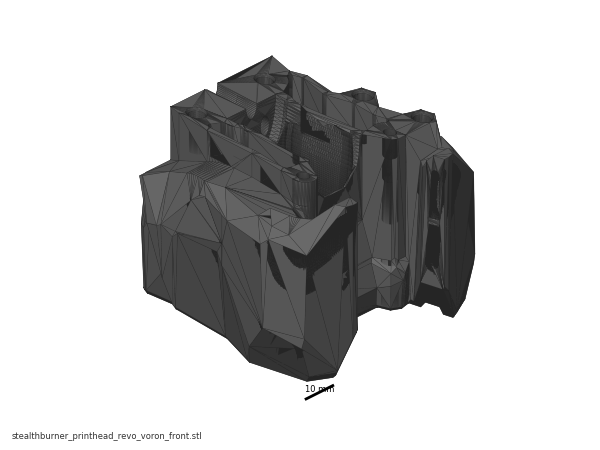{ width=96 } | `stealthburner_printhead_revo_voron_front.stl` | 1 | Black |
| 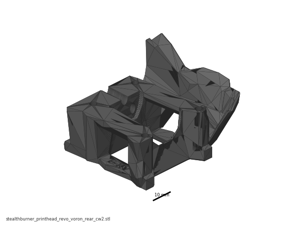{ width=96 } | `stealthburner_printhead_revo_voron_rear_cw2.stl` | 1 | Black |
| { width=96 } | `[o]_stealthburner_LED_carrier.stl` | 1 | Black (opaque) |
| { width=96 } | `[o]_stealthburner_LED_diffuser_mask.stl` | 1 | Black (opaque) |
| — | `[c]_stealthburner_LED_diffuser.stl` | 1 | **kit-supplied** in clear PETG — not printed here |
| 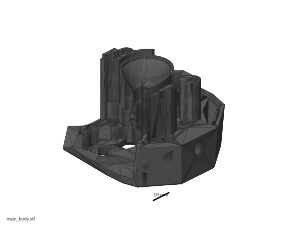{ width=96 } | `main_body.stl` (Clockwork 2) | 1 | Black |
| 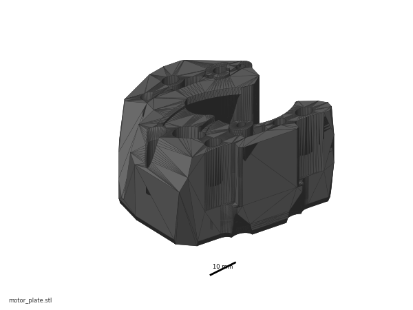{ width=96 } | `motor_plate.stl` (Clockwork 2) | 1 | Black |
| { width=96 } { width=96 } | `[a]_guidler_a.stl` / `[a]_guidler_b.stl` | 1 each | Orange |
| { width=96 } { width=96 } | `[a]_latch.stl` / `[a]_latch_shuttle.stl` | 1 each | Orange |
| { width=96 } | `[a]_pcb_spacer.stl` (CW2) | 1 | **Supplied printed**; you printed a 0.3 g spare |
| 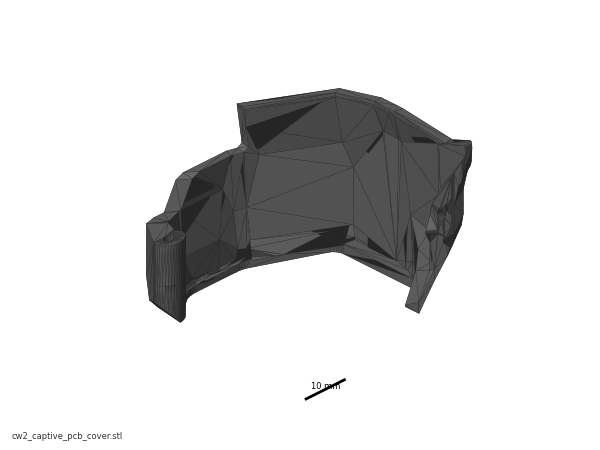{ width=96 } | `cw2_captive_pcb_cover.stl` (Nitehawk-SB repo) | 1 | Black — replaces the stock `cable_door` |
| — | CW2 Chain Anchor Tilted | 1 | **Supplied printed** — do **not** print `chain_anchor_2hole` |
| — | Klicky set (`KlickyProbe_v2` ×2, `Probe_Dock_v2.1`, `Probe_magnet_holder`, `Probe_pressfit_holder`, `KlickyProbe_AB_mount_v2` + holder, `Mount_*`, `Dock_mount_fixed_v2`) | 1 set | Black — **alternative path only**, bag it (Step 08.54) |

**Hardware** (chapter totals)

| Fastener / part | Qty | Note |
|---|---|---|
| Heat-set insert, brass, M3×5×4 | 16 | 4 CW2 main body, 4 CW2 motor plate, 1 latch, 1 latch shuttle, 1 guidler arm, 3 chain anchor, 2 printhead rear — all `(verify on bench)`, the SB manual highlights locations, not counts |
| M3×8 SHCS | 10 | 1 motor, 1 cable bridge, 4 tool cartridge, 2 toolboard, 2 CW2→carriage |
| M3×16 SHCS | 3 | 1 joins the guidler halves, 2 tool cartridge |
| M3×20 SHCS | 1 | chain anchor |
| M3×25 SHCS | 6 | 2 motor plate, 1 tension arm, 1 latch, 2 SB mounting |
| M3×30 SHCS | 1 | 1 motor (the probe's 2 are counted in Ch 07) |
| M3×50 SHCS | 2 | SB mounting (lower pair) |
| M3×6 FHCS | 3 | 1 CW2 main body (threadlocked), 2 part-cooling fan |
| M3×10 FHCS | 2 | fan adapter PCB to the 5015 |
| M3×6 captive screw | 1 | LDO cable cover; kit ships 2 |
| M3 washer | 1 | under the M3×8 motor bolt |
| Nozzle-probe hardware (M2×10 self-tapping ×2, M3 set screw ×1) | 0 here | the nozzle probe is built once, in Ch 09 Steps 09.27–09.29 — counted in that chapter's table |
| MR85 bearing | 2 | 1 motor plate, 1 main body |
| Bondtech IDGA gear set | 1 | drive gear + 50T gear + shaft |
| Thumb Screw Kit (thumbscrew, spring ~12 mm × 6 mm OD × 1 mm wire, washer) | 1 | |
| LDO-36STH20-1004AHG(VRN) pancake stepper, NEMA14 36 mm | 1 | |
| E3D Revo Hotend (HF), Revo Voron form factor | 1 | 60 W (LDO Edition HeaterCore), 300 °C max, Semitec 104NT-4-R025H42G |
| PTFE 4 mm OD / 2 mm ID, 10 cm | 1 | tool cartridge, 11 mm stickout |
| 40×40×10 axial fan, 24 V | 1 | hotend fan |
| 50×50×15 centrifugal fan, 24 V | 1 | part cooling |
| Nitehawk-SB V2 toolboard | 1 | STM32G0B1, integrated ADXL345 |
| Stealthburner Fan Adapter PCB (SBurnerFanAdapter_V2.0) | 1 | |
| Toolhead cable (combined USB + 24 V), XT30(2+2) | 1 | from the Toolhead PCB Cables bag |
| Ferrule, E0508 | 2 | hotend heater, if you re-terminate |
| M3×10 SHCS | 3 | USB adapter stack (assembled here, mounted in Ch 09) |
| Ring-lug ground wire, toolboard → extruder motor, plus its short motor-end screw | 1 | supplied; board end under a toolboard M3×8 at Step 08.43, motor end at Step 08.53 — screw length `(verify on bench)` |

**Read first**

- **Do the insert pass before you assemble anything.** A missed insert in the CW2 main body means stripping the extruder back to bare plastic (survey §5.2 W3). All 16 go in first, in Steps 08.3–08.7.
- **Five of the six Rev D+ deltas land in this chapter.** PROBE / TH0 / XY-Endstop are **JST-PH2.0**, not XH2.5; the board-to-board fan header is **keyed and gender-reversed**; there is no ADXL mount; the USB-adapter cover is the V2 part; and there is an undocumented grounding scheme (survey §4.1).
- **The kit ships both probes and you build the inductive one.** LDO's wiring guide, the Rev D+ Klipper config and survey §4.3 all assume the Omron inductive probe for QGL plus the LDO nozzle probe as the Z endstop. The Klicky parts are printed; bag them (Step 08.54).
- **Skip the ADXL mount entirely.** The Nitehawk-SB has an ADXL345 on board. Do not fit the two extra inserts SB p.38 highlights, and do not print `ADXL345_Mounts/*`. [src](https://docs.ldomotors.com/en/voron/voron2/printed_part_guide_rev_d)
- **The XY-endstop port on the toolboard is unused** in a standard build, and the PROBE port's third pin is 24 V — Klicky must not have it populated. [src](https://docs.ldomotors.com/en/voron/voron2/wiring_guide_rev_d#wiring-the-toolhead-pcb)
- **Bench-only work for a print-idle window** (the index's *while it prints* rows assume you use them): Steps 08.3–08.7 (inserts), 08.9–08.11 (idler, guidler, thumbscrew), 08.12–08.14 (bearings), 08.27 (Revo) and 08.33–08.36 (leads, 5015 ears, LED chain) need no printer. If plate B07-P3 is already off the Prusa, heat-set the inlet panel (Ch 09 Step 09.10) and the bed WAGO mount (Ch 09 Step 09.34) in the same iron session as 08.3–08.7 — those two steps then become a confirm.

**Sources for this chapter**

- [Stealthburner assembly manual](https://github.com/VoronDesign/Voron-Stealthburner/blob/1bccf0543f40741243d81505c4ad5406eb822715/Manual/Assembly_Manual_SB.pdf#page=11), pinned commit `1bccf05` — pp. 11–32, 37–56, 64–67. The spine of this chapter: 48 of the 65 steps.
- [Voron 2.4r2 assembly manual](https://github.com/VoronDesign/Voron-2/blob/de7e89d/Manual/Assembly_Manual_2.4r2.pdf#page=129), pinned commit `de7e89d` — pp. 129–130 (carriage prep), 144 (probe), 146–147 (the hand-off to and from the SB manual).
- LDO Rev D wiring guide — [§ Wiring the Toolhead PCB](https://docs.ldomotors.com/en/voron/voron2/wiring_guide_rev_d#wiring-the-toolhead-pcb) and [§ Assembling the Nozzle Probe](https://docs.ldomotors.com/en/voron/voron2/wiring_guide_rev_d).
- [LDO Rev D printed-parts guide](https://docs.ldomotors.com/en/voron/voron2/printed_part_guide_rev_d) — which parts LDO supplies printed and which are on the do-not-print list.
- [LDO Rev D 350 BOM](https://docs.ldomotors.com/en/voron/voron2/350_BOM/Rev_D) — fan voltages, supplied printed parts.
- [LDO Build Notes / build FAQ](https://docs.ldomotors.com/voron/voron2/build-faq) — the per-page deviations for pp. 129–130, 144, 146–147.
- [LDO Nitehawk-SB V2 board doc § ESD Hardening](https://docs.ldomotors.com/en/Toolboard/nitehawk-sb-v2#esd-hardening) — the grounding scheme (Step 08.53).
- [Nitehawk-SB-V2 repo](https://github.com/MotorDynamicsLab/Nitehawk-SB-V2) — board [pinout](https://github.com/MotorDynamicsLab/Nitehawk-SB-V2/blob/master/Images/nhsbv2_pcb_pinout.jpg), [fan-adapter pinout](https://github.com/MotorDynamicsLab/Nitehawk-SB-V2/blob/master/Images/sbv2_fan_adapter_pcb_pinout.jpg), [grounding scheme](https://github.com/MotorDynamicsLab/Nitehawk-SB-V2/blob/master/Images/grounding_scheme.jpg), [ground routing](https://github.com/MotorDynamicsLab/Nitehawk-SB-V2/blob/master/Images/toolboard_ground_routing.jpg), [chain ties](https://github.com/MotorDynamicsLab/Nitehawk-SB-V2/blob/master/Images/cable_chain_ties.jpg), [USB-adapter ground](https://github.com/MotorDynamicsLab/Nitehawk-SB-V2/blob/master/Images/usb_adapter_gnd.jpg), [`STLs/`](https://github.com/MotorDynamicsLab/Nitehawk-SB-V2/tree/master/STLs). The repo carries no LICENSE file (re-checked 2026-09-05); the six board images this chapter needs are nevertheless mirrored into `assets/remote/08-toolhead/` under Alex's 2026-09-05 image-licensing ruling (CONVENTIONS.md — LDO / Nitehawk-SB V2 / Leviathan / LDOVoron2 material, attributed, non-commercial), with the original URLs kept in every Source line. See that folder's `SOURCES.txt`.
- [LDO Rev D+ Klipper config `leviathan-printer-rev-d-sbv2.cfg`](https://github.com/MotorDynamicsLab/LDOVoron2/blob/main/Firmware/leviathan-printer-rev-d-sbv2.cfg) — `chain_count`, `color_order`, the fan pins, `[probe]`, `[resonance_tester]`.
- [E3D Revo Voron support](https://e3d-online.com/pages/revo-support-voron) — hotend assembly order and the anti-clockwise-only rule.
- [Voron Stealthburner printheads README](https://github.com/VoronDesign/Voron-Stealthburner/blob/main/STLs/Stealthburner/Printheads/README.md) — the `E-RV` hotend code.
- [Klicky Probe (Voron v2.4)](https://github.com/jlas1/Klicky-Probe/tree/main/Printers/Voron/v1.8_v2.4_Legacy_Trident) — alternative path only, Step 08.54.
- [Fabreeko LDO Voron 2.4 kit page](https://www.fabreeko.com/products/ldo-voron-v2-4-kit) — what "Rev D+" means (the secondary USB port).

**Video coverage (Steve Builds, pre-release LDO kit — differs from Rev D+):** [Part 5 @1:33:00](https://www.youtube.com/watch?v=hTKCBrk36R0&list=PL0fUJbigELQPqpeGOgHYisG4KaSXVtnNY&t=5580s) (+13m), [Part 5 @1:45:23](https://www.youtube.com/watch?v=hTKCBrk36R0&list=PL0fUJbigELQPqpeGOgHYisG4KaSXVtnNY&t=6323s) (+8m), [Part 5 @2:00:12](https://www.youtube.com/watch?v=hTKCBrk36R0&list=PL0fUJbigELQPqpeGOgHYisG4KaSXVtnNY&t=7212s) (+22m), [Part 5 @2:17:50](https://www.youtube.com/watch?v=hTKCBrk36R0&list=PL0fUJbigELQPqpeGOgHYisG4KaSXVtnNY&t=8270s) (+30m), [Part 5 @3:07:12](https://www.youtube.com/watch?v=hTKCBrk36R0&list=PL0fUJbigELQPqpeGOgHYisG4KaSXVtnNY&t=11232s) (+10m), [Part 5 @3:17:06](https://www.youtube.com/watch?v=hTKCBrk36R0&list=PL0fUJbigELQPqpeGOgHYisG4KaSXVtnNY&t=11826s) (+22m), [More Extras! @0:46:09](https://www.youtube.com/watch?v=D_44fDp9xt8&list=PL0fUJbigELQPqpeGOgHYisG4KaSXVtnNY&t=2769s) (+26m)

---

## A — Part preparation and heat-set inserts

### Step 08.1 — Sort the printed parts and confirm the hotend code

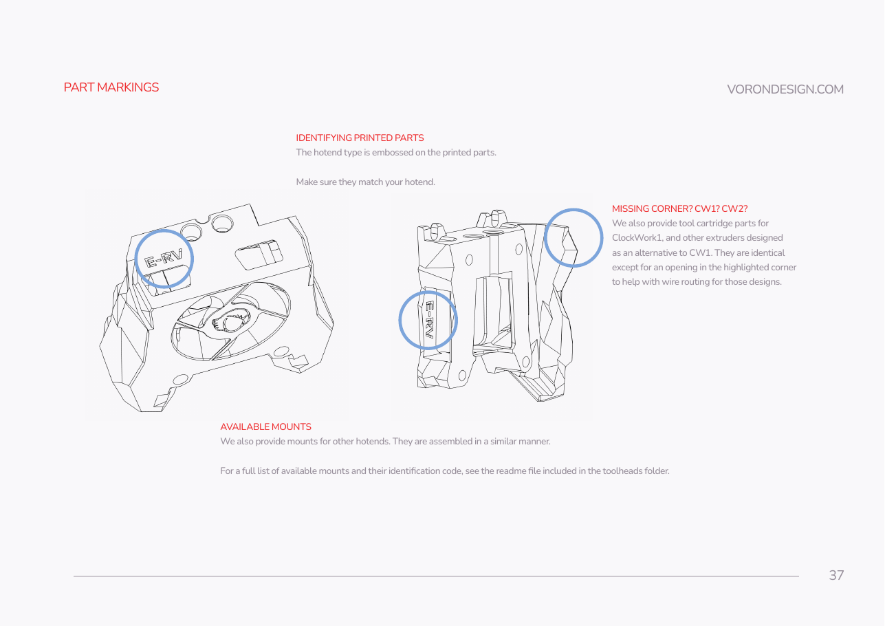

**What you're looking at:** [Stealthburner](16-glossary.md#s) is the Voron toolhead: a printed shroud carrying two fans and three LEDs, wrapped around a removable **tool cartridge** that holds the hotend. The two black printhead halves in front of you are that cartridge, and the code moulded into them says which hotend they fit — **E-RV** is E3D Revo Voron. The `_rear_cw2` half is the variant for [Clockwork 2](16-glossary.md#c), the extruder — and its circled corner is **solid**. The CW1/other-extruder variants are the ones with that corner cut open for their wire routing (SB p.37).

**Parts:** all B02 and B06 toolhead prints; the two `revo_voron` printhead halves.

**Do:** Lay the parts out in build order. Find the hotend code embossed on both printhead halves and read it — it must say **E-RV** (E3D Revo Voron). Confirm the rear half is the `_rear_cw2` variant: the corner SB p.37 circles is **solid**. A rear half with a notch cut out of that corner is the CW1/other-extruder variant — wrong for this build. Set the Klicky bag aside; you are not building it (Step 08.54).

**Check:** `E-RV` on both halves, and the circled corner of the rear half is closed. If you printed a different printhead folder, stop and reprint — no other mount fits the Revo.

Tip: the `revo_voron` folder is the settled choice for this kit; the SB printhead README maps "E3D Revo Voron → E-RV". [src](https://github.com/VoronDesign/Voron-Stealthburner/blob/main/STLs/Stealthburner/Printheads/README.md)

Source: [SB manual p.37](https://github.com/VoronDesign/Voron-Stealthburner/blob/1bccf0543f40741243d81505c4ad5406eb822715/Manual/Assembly_Manual_SB.pdf#page=37)

---

### Step 08.2 — Snap the built-in supports out of the Stealthburner body

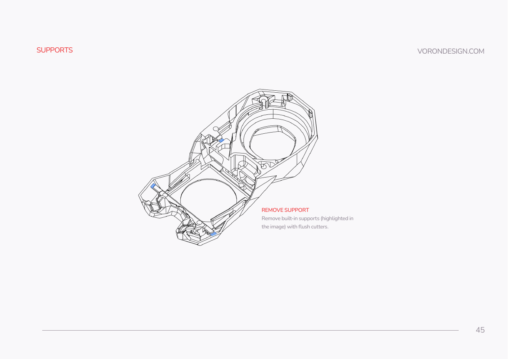

**What you're looking at:** The orange body is the Stealthburner shroud itself — the part that carries the LEDs, the air ducts and both fans, and the part everyone recognises the printer by. It prints with sacrificial support inside it. The thin webs across the fan cavities are the exception: they are designed to snap as a fan is pushed in, and that snap is what holds the fan captive afterwards.

**Parts:** `[a]_stealthburner_main_body` ×1.

**Do:** The orange main body prints with a handful of built-in supports — SB p.45 highlights the three to remove. **Snap** them out with flush cutters — pry and break them, do not carve. Leave the supports inside the fan cavities alone: SB p.52 says those are designed to break when the fans go in, and breaking them early loses the fans' clip retention.

**Check:** The LED pockets, diffuser channels and the two mounting bores are clear. The fan cavities still have their thin support webs in place.

Source: [SB manual p.45](https://github.com/VoronDesign/Voron-Stealthburner/blob/1bccf0543f40741243d81505c4ad5406eb822715/Manual/Assembly_Manual_SB.pdf#page=45)

---

### Step 08.3 — Inserts: Clockwork 2 main body

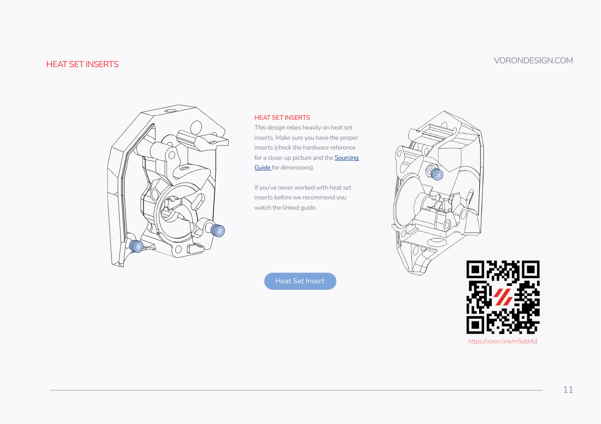
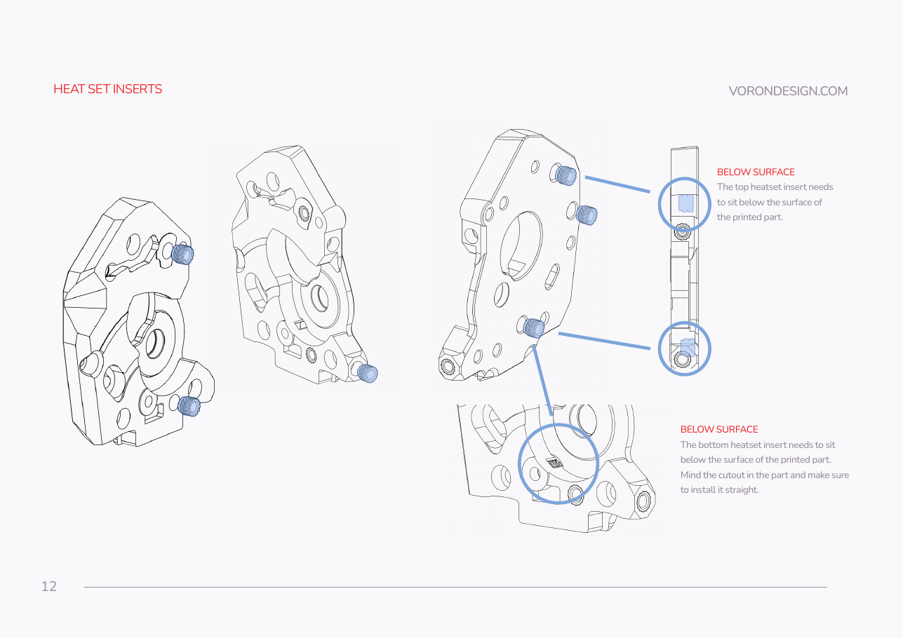
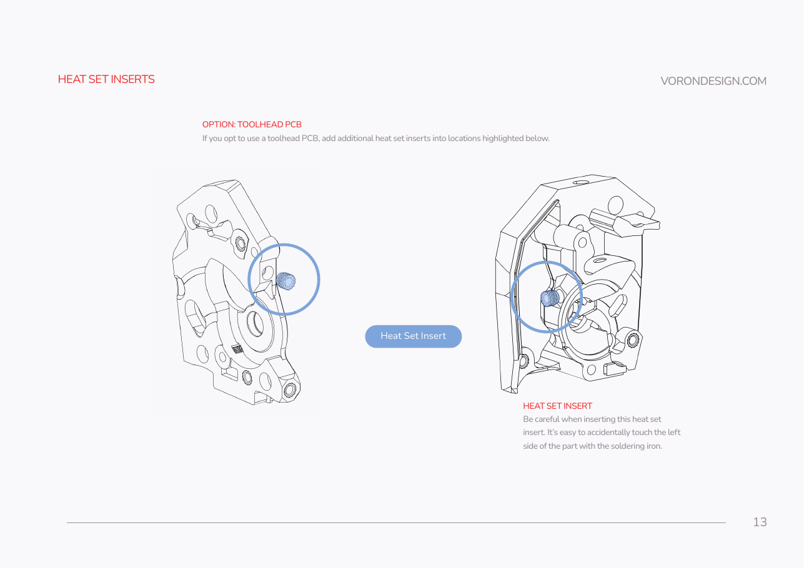

**What you're looking at:** [Clockwork 2](16-glossary.md#c) is the extruder — the geared drive that grips filament and pushes it into the hotend — and `main_body` is its larger half, holding the drive gear, one bearing and the filament path. A [heat-set insert](16-glossary.md#h) is a knurled brass sleeve melted into the plastic so a steel screw threads into metal instead of into the print. Every one goes in now, because the gear train that follows buries them.

**Parts:** `main_body.stl`, heat-set inserts M3×5×4 ×4.

**Do:** Fit the brass M3 tip and start at the **low end of your iron's range for ASA**, adjusting on the practice coupon from Ch 00 Step 00.14 — LDO publishes no figure, so the working temperature is the one written on the tape on your iron's base. Set the iron there and adjust the tongue so it bottoms flush with the insert. SB p.11 highlights **three** locations on the main body — one in the foot, one in each side face (p.12 is the motor plate). SB p.13 adds a **fourth** for the toolhead PCB; you are fitting a Nitehawk, so that one is required. Press each in square, then let the part cool before you touch it.

**Check:** All four sit below the surface, none is cocked, and an M3 screw starts by hand in each. Count: 4 `(verify on bench — the manual highlights locations, not counts)`.

⚠ Rev D+ / LDO: the p.13 "OPTION: TOOLHEAD PCB" inserts are not optional here. The Nitehawk-SB V2 bolts to the CW2 sides with two M3×8 into these inserts. [src](https://docs.ldomotors.com/en/voron/voron2/wiring_guide_rev_d#wiring-the-toolhead-pcb)

Tip: the p.13 insert on the main body sits next to a tall wall — the manual warns it is easy to touch that wall with the iron. Approach it from directly above.

Source: [SB manual p.11](https://github.com/VoronDesign/Voron-Stealthburner/blob/1bccf0543f40741243d81505c4ad5406eb822715/Manual/Assembly_Manual_SB.pdf#page=11) · [SB manual p.12](https://github.com/VoronDesign/Voron-Stealthburner/blob/1bccf0543f40741243d81505c4ad5406eb822715/Manual/Assembly_Manual_SB.pdf#page=12) · [SB manual p.13](https://github.com/VoronDesign/Voron-Stealthburner/blob/1bccf0543f40741243d81505c4ad5406eb822715/Manual/Assembly_Manual_SB.pdf#page=13)

---

### Step 08.4 — Inserts: Clockwork 2 motor plate

**What you're looking at:** The motor plate is the other half: the thin (8.2 mm) plate with the large central bore that closes the extruder and carries the pancake stepper. Its inserts have to finish **below** the surface — one standing proud stops the motor sitting flat, and the motor's seating is what sets the gear mesh.

**Parts:** `motor_plate.stl`, heat-set inserts M3×5×4 ×4.

**Do:** The motor plate is the thin (8.2 mm) part with the large central bore. SB p.12 highlights **three** locations on it and calls out two of them explicitly: the top insert and the bottom insert must both sit **below** the surface. Mind the cutout beside the bottom one and keep the insert straight. SB p.13 adds the **fourth**, for the toolhead PCB.

**Check:** Lay a steel rule across each insert — no insert stands proud. Count: 4 `(verify on bench)`.

Source: [SB manual p.12](https://github.com/VoronDesign/Voron-Stealthburner/blob/1bccf0543f40741243d81505c4ad5406eb822715/Manual/Assembly_Manual_SB.pdf#page=12) · [SB manual p.13](https://github.com/VoronDesign/Voron-Stealthburner/blob/1bccf0543f40741243d81505c4ad5406eb822715/Manual/Assembly_Manual_SB.pdf#page=13)

---

### Step 08.5 — Inserts: latch, latch shuttle and guidler arm (flush, not below)

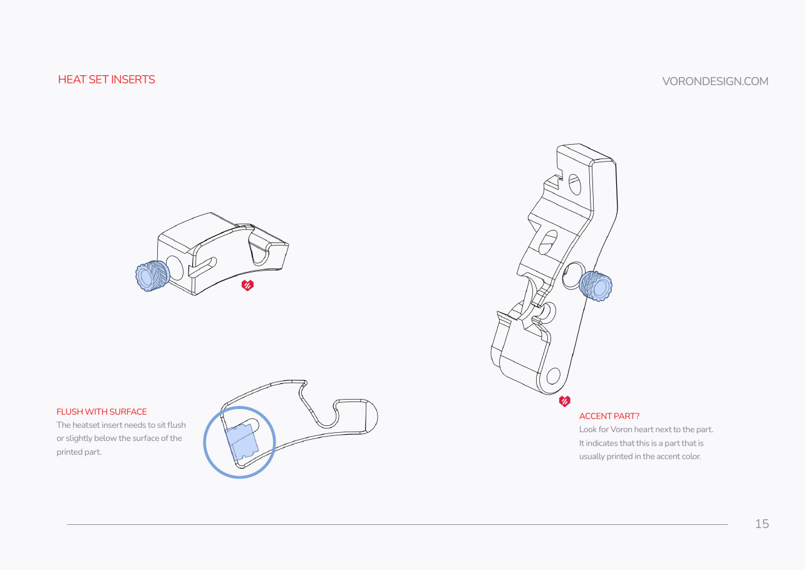

**What you're looking at:** The latch, the latch shuttle and the guidler arm are the extruder's three small orange parts: the guidler arm swings the idler wheel against the drive gear to grip the filament, the shuttle is the hooked block the thumbscrew threads into on top of the arm, and the latch hooks over the shuttle to hold the arm closed. Their inserts finish **flush**, not sunk — sunk, and the latch can no longer reach the shuttle it has to catch.

**Parts:** `[a]_latch` ×1, `[a]_latch_shuttle` ×1, `[a]_guidler_a` ×1, heat-set inserts M3×5×4 ×3.

**Do:** These three accent parts (each carries the Voron heart on SB p.15) take one insert each: the shuttle's enters its end face, the latch's and the guidler arm's their side bosses. Unlike the body inserts, these must finish **flush or only slightly below** the surface — the p.15 "flush" callout is drawn on the latch cross-section `(verify on bench which part it belongs to)` — sunk too deep and the latch will not close on the shuttle.

**Check:** A straightedge across the insert face rocks on the plastic, not on the brass. Count: 3 `(verify on bench)`.

Source: [SB manual p.15](https://github.com/VoronDesign/Voron-Stealthburner/blob/1bccf0543f40741243d81505c4ad5406eb822715/Manual/Assembly_Manual_SB.pdf#page=15)

---

### Step 08.6 — Inserts: CW2 chain anchor (Igus 2-hole pattern)

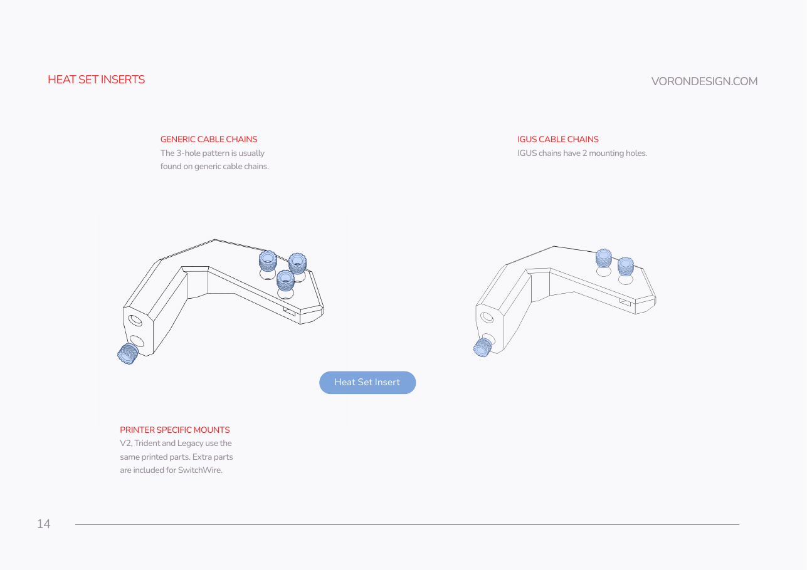

**What you're looking at:** The chain anchor is the printed block on the back of the extruder that the toolhead [drag chain](16-glossary.md#d)'s end plate bolts to — it is what makes the chain pull on plastic rather than on the toolboard's connectors. Two hole patterns exist; this kit's chain is the IGUS-style two-hole, so two inserts go along the top face and one in the front tab.

**Parts:** CW2 Chain Anchor Tilted (LDO, supplied printed), heat-set inserts M3×5×4 ×3.

**Do:** SB p.14 shows two anchor variants. Your kit ships **Igus-pattern 2-hole** drag chain, so use the two-hole row: **two** inserts along the top face plus **one** in the front tab that bolts to the extruder. Ignore the three-hole generic pattern entirely.

**Check:** Offer a chain end plate to the anchor — its two screw holes line up over your two inserts. Count: 3 `(verify on bench)`.

⚠ Rev D+ / LDO: do not print or use `Clockwork2/chain_anchor_2hole.stl`. LDO supplies the **tilted** anchor printed, and the print plan lists the Voron file as deliberately not printed. Always take `_2hole`, never `_3hole`, anywhere in this build. [src](https://docs.ldomotors.com/en/voron/voron2/printed_part_guide_rev_d)

Source: [SB manual p.14](https://github.com/VoronDesign/Voron-Stealthburner/blob/1bccf0543f40741243d81505c4ad5406eb822715/Manual/Assembly_Manual_SB.pdf#page=14)

---

### Step 08.7 — Inserts: rear printhead half — and the two you skip

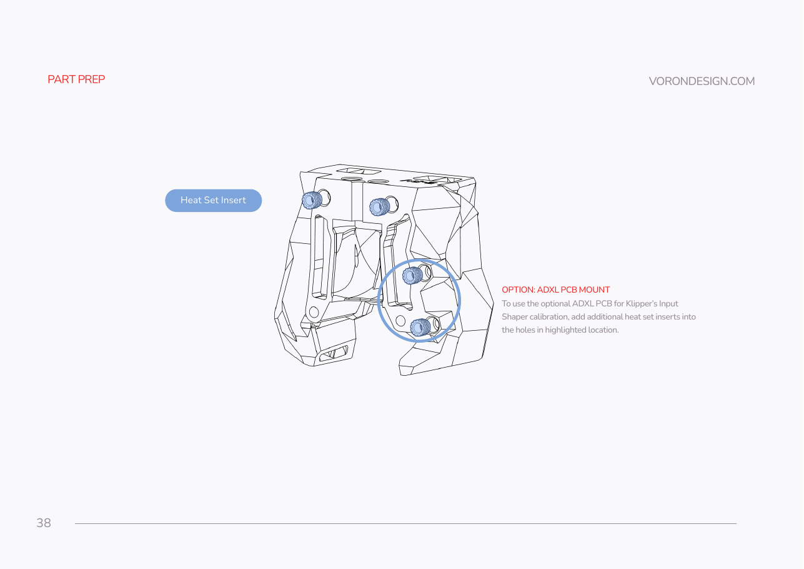

**What you're looking at:** The rear printhead half is the back of the tool cartridge — the part the hotend actually sits in. Two of the four holes SB p.38 highlights are the mount for an [ADXL345](16-glossary.md#a) accelerometer PCB; the [Nitehawk-SB V2](16-glossary.md#n) toolboard has one built into it, so those two stay bare plastic.

**Parts:** `stealthburner_printhead_revo_voron_rear_cw2` ×1, heat-set inserts M3×5×4 ×2.

**Do:** SB p.38 highlights four locations on the rear printhead. Fit only the **two on the top face**. The **two inside the circled region are the ADXL PCB mount** — leave those holes empty.

**Check:** Two inserts on the top face; the circled pair are bare plastic. Count: 2 `(verify on bench)`.

⚠ Rev D+ / LDO: the Nitehawk-SB V2 carries an ADXL345 on board with `[resonance_tester] accel_per_hz: 100` already configured. There is no toolhead accelerometer to mount, now or later. [src](https://github.com/MotorDynamicsLab/LDOVoron2/blob/main/Firmware/leviathan-printer-rev-d-sbv2.cfg)

Source: [SB manual p.38](https://github.com/VoronDesign/Voron-Stealthburner/blob/1bccf0543f40741243d81505c4ad5406eb822715/Manual/Assembly_Manual_SB.pdf#page=38)

---

### Step 08.8 — Confirm the X carriage is ready to receive a toolhead

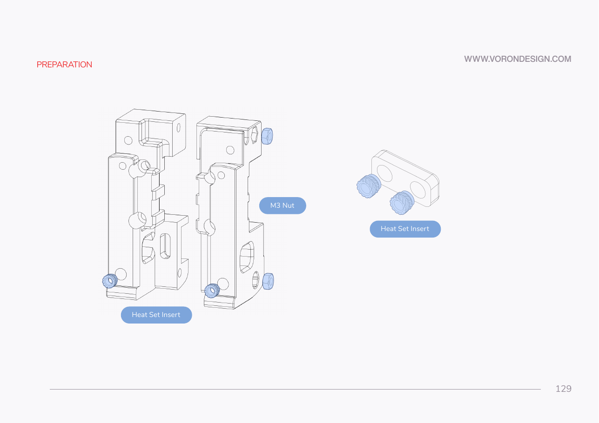
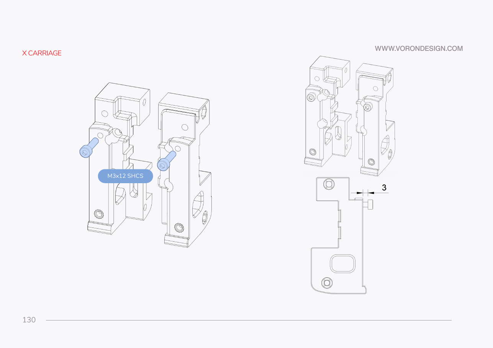

**What you're looking at:** The [X carriage](16-glossary.md#x) is the pair of printed halves clamped to the MGN12 carriage and to both belts in Ch 05/07 — the whole toolhead hangs off it. Nothing is fitted here: this is the verification that every insert, nut and belt clamp is already in, because a toolhead bolted over a missing insert comes off again.

**Parts:** X carriage (already on the gantry from Ch 05/07).

**Do:** Before the toolhead exists, verify the carriage. Manual p.129 shows the carriage prep: its heat-set inserts and M3 nuts must already be fitted, and SB p.59 shows the same parts from the toolhead side. Check that both belt clamps are closed and the belts terminated.

**Check:** Every carriage insert and nut present; carriage slides the full X travel by hand with no bind; both belts clamped.

⚠ Rev D+ / LDO: LDO Build Notes flag p.129–130 specifically — verify you have the **Clockwork 2** carriage (`x_frame_V2TR_MGN12_left/right`), not an older MGN9 or CW1 variant, and follow the Stealthburner manual for the carriage detail. [src](https://docs.ldomotors.com/voron/voron2/build-faq)

Source: [Voron manual p.129](https://github.com/VoronDesign/Voron-2/blob/de7e89d/Manual/Assembly_Manual_2.4r2.pdf#page=129) · [Voron manual p.130](https://github.com/VoronDesign/Voron-2/blob/de7e89d/Manual/Assembly_Manual_2.4r2.pdf#page=130)

Pause: ~35 min since the last pause — all 16 heat-set inserts are in and cool, the printed parts are sorted in build order, and the carriage is verified. Nothing is assembled yet. Leave the iron to cool on its stand; do not start the extruder with any insert still missing, because Steps 08.12 onwards bury them under a bearing and a gear train.

---

## B — Clockwork 2 extruder

### Step 08.9 — Build the BMG idler assembly and grease it

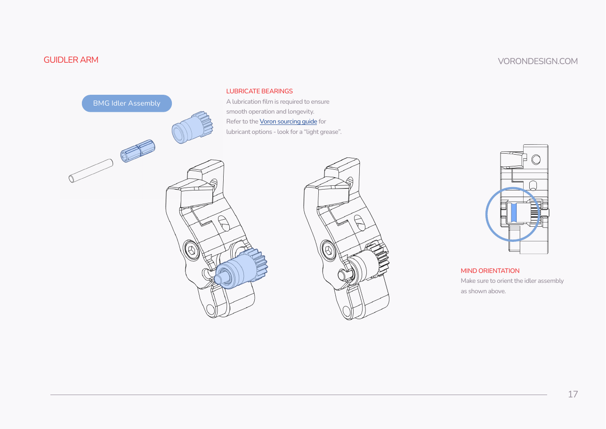

**What you're looking at:** A Bondtech dual-drive extruder grips filament between **two** geared wheels rather than one wheel and a plain bearing. This is the second of those: the BMG idler gear, running on a bearing sleeve on its own shaft, with its toothed face towards the filament. The light grease film is what keeps that bearing free for the life of the machine.

**Parts:** BMG idler gear, idler shaft, bearing sleeve (from the Bondtech IDGA set).

**Do:** Slide the idler assembly together on its shaft. Wipe a light grease film onto the bearing surfaces — the Voron sourcing guide calls for a "light grease"; the Super Lube you used on the rails is fine. Note the orientation shown: the toothed face goes towards the filament path.

**Check:** The idler spins freely with no gritty feel and no axial slop.

Source: [SB manual p.17](https://github.com/VoronDesign/Voron-Stealthburner/blob/1bccf0543f40741243d81505c4ad5406eb822715/Manual/Assembly_Manual_SB.pdf#page=17)

---

### Step 08.10 — Close the guidler arm

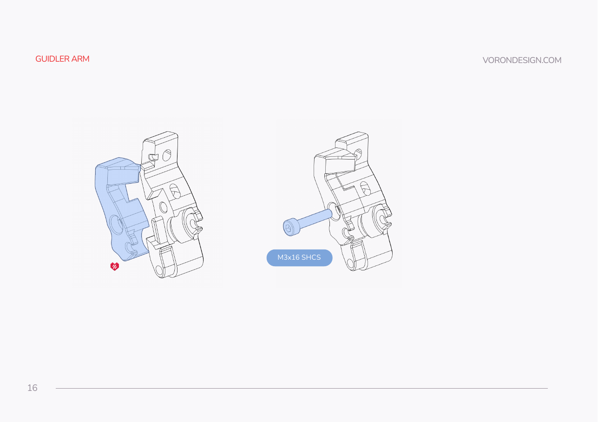

**What you're looking at:** The guidler is the swinging arm that carries the idler — two orange halves joined by a single M3×16 (p.16); the idler assembly then slides into the joined arm on its own shaft (p.17). Snug rather than torqued, because the bolt only closes the halves, and plastic crushed under it distorts the arm.

**Parts:** `[a]_guidler_a` ×1, `[a]_guidler_b` ×1, M3×16 SHCS ×1, the idler assembly from 08.9.

**Do:** Join the two guidler halves with one M3×16 SHCS (p.16), then slide the greased idler assembly from 08.9 into the joined arm from the side, in the orientation p.17 circles — toothed face toward the filament path. Snug — this bolt only closes the halves; the idler turns on its own shaft.

**Check:** The idler spins freely in the closed arm. The two halves meet with no gap.

Source: [SB manual p.16](https://github.com/VoronDesign/Voron-Stealthburner/blob/1bccf0543f40741243d81505c4ad5406eb822715/Manual/Assembly_Manual_SB.pdf#page=16)

---

### Step 08.11 — Fit the latch shuttle and the BMG thumbscrew assembly

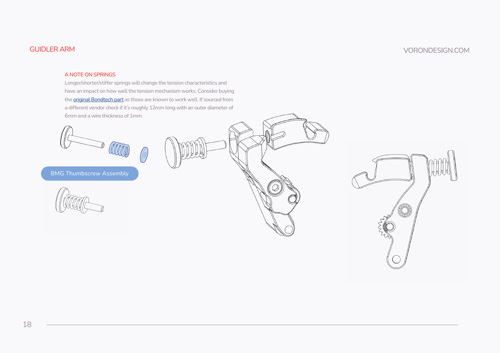

**What you're looking at:** The thumbscrew, spring and washer are the extruder's grip adjustment, and the latch shuttle is what they thread into: the thumbscrew passes through the guidler's top boss and screws into the shuttle sitting on top of the arm, so winding it in compresses the spring and pushes the guidler arm — and so the idler — harder onto the filament. The latch (Step 08.20) hooks over that shuttle. The spring's rate is what sets that grip curve, which is why a substitute spring of the wrong size prints differently rather than just feeling different.

**Parts:** `[a]_latch_shuttle` ×1 (insert from 08.5), Thumb Screw Kit — thumbscrew ×1, spring ×1, washer ×1.

**Do:** Seat the latch shuttle on top of the guidler's boss with its hook facing the latch side (p.18, right-hand drawing). Slide the spring then the washer onto the thumbscrew shaft in that order, pass the thumbscrew through the boss and thread it into the shuttle's insert.

**Check:** The shuttle is captive and can be drawn against the spring by hand. The spring measures roughly 12 mm long, 6 mm OD, 1 mm wire. A different spring changes the tension characteristic and prints badly — if yours is visibly different, source the Bondtech part before continuing.

Source: [SB manual p.18](https://github.com/VoronDesign/Voron-Stealthburner/blob/1bccf0543f40741243d81505c4ad5406eb822715/Manual/Assembly_Manual_SB.pdf#page=18)

---

### Step 08.12 — Seat the first MR85 in the motor plate

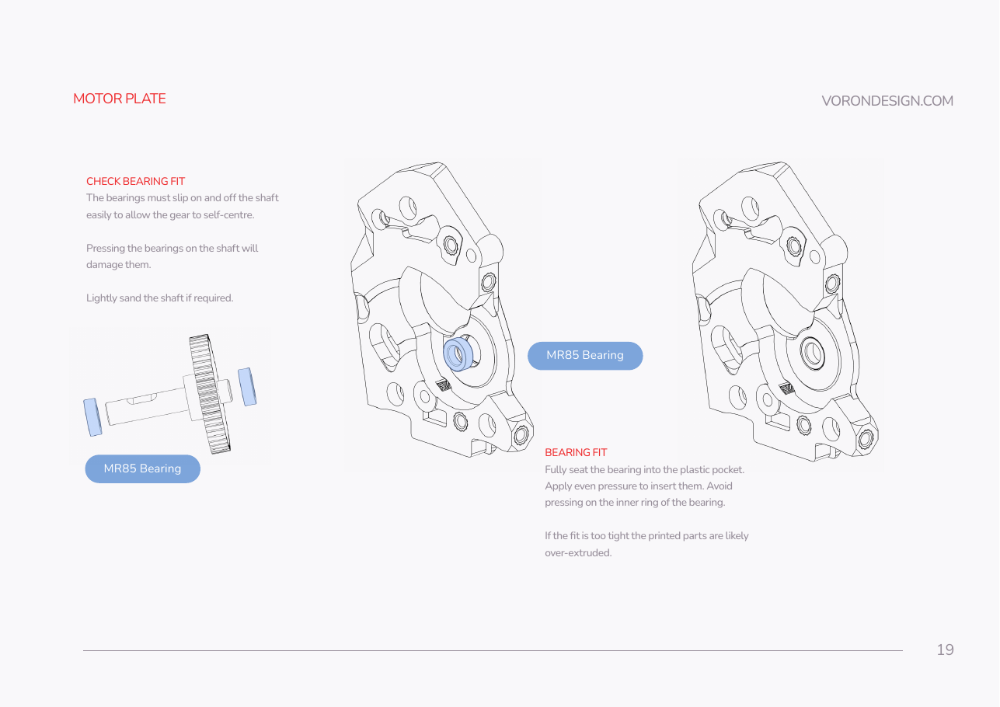

**What you're looking at:** An MR85 is a small ball bearing (5 mm bore, 8 mm outside); two of them carry the extruder's drive shaft, one in each printed half. Pressing on the **inner** ring drives the load through the balls and dents the races — always press only on the outer ring.

**Parts:** `motor_plate.stl`, MR85 bearing ×1 (of 2).

**Do:** Press the MR85 fully into its plastic pocket with even pressure on the **outer** ring only — never push on the inner ring. If it needs real force the part is over-extruded; back off and check the print rather than hammering it.

**Check:** The bearing face is flush with the pocket floor and spins freely.

Source: [SB manual p.19](https://github.com/VoronDesign/Voron-Stealthburner/blob/1bccf0543f40741243d81505c4ad5406eb822715/Manual/Assembly_Manual_SB.pdf#page=19)

---

### Step 08.13 — Check the drive shaft slides through both bearings

**What you're looking at:** The drive shaft carries the filament drive gear and the 50 T gear that the motor's pinion turns. The bearings must be a **slide** fit on it, not a press fit, so the gear train can find its own centre between the two halves; a bearing forced on is a bearing already damaged.

**Parts:** Bondtech drive shaft, both MR85 bearings, fine sandpaper (supplied).

**Do:** The bearings must **slip on and off the shaft by hand** so the gear can self-centre. Pressing a bearing onto the shaft destroys it. If either is tight, lightly sand the shaft — a few passes, then re-test.

**Check:** Each bearing slides on and off with fingertip force and no rocking.

Source: [SB manual p.19](https://github.com/VoronDesign/Voron-Stealthburner/blob/1bccf0543f40741243d81505c4ad5406eb822715/Manual/Assembly_Manual_SB.pdf#page=19)

---

### Step 08.14 — Seat the second MR85 in the main body and lock it

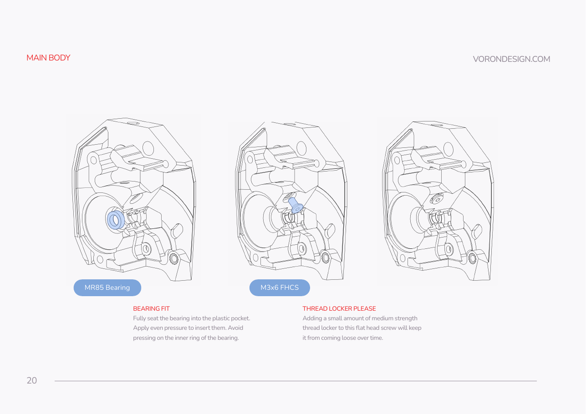

**What you're looking at:** The second MR85, this time in the main body, plus one countersunk screw to retain it. Threadlocker rather than more torque: the screw goes into printed plastic, and vibration — not slackness — is what would otherwise back it out.

**Parts:** `main_body.stl`, MR85 bearing ×1, M3×6 FHCS ×1, threadlocker.

**Do:** Press the second MR85 into the main-body pocket, outer ring only. Then put a small drop of **medium-strength threadlocker** on the M3×6 FHCS and drive it into the retaining position shown.

**Check:** Bearing flush and free; the flat head sits level in its countersink.

Source: [SB manual p.20](https://github.com/VoronDesign/Voron-Stealthburner/blob/1bccf0543f40741243d81505c4ad5406eb822715/Manual/Assembly_Manual_SB.pdf#page=20)

---

### Step 08.15 — Set the drive gear at its initial position and threadlock it

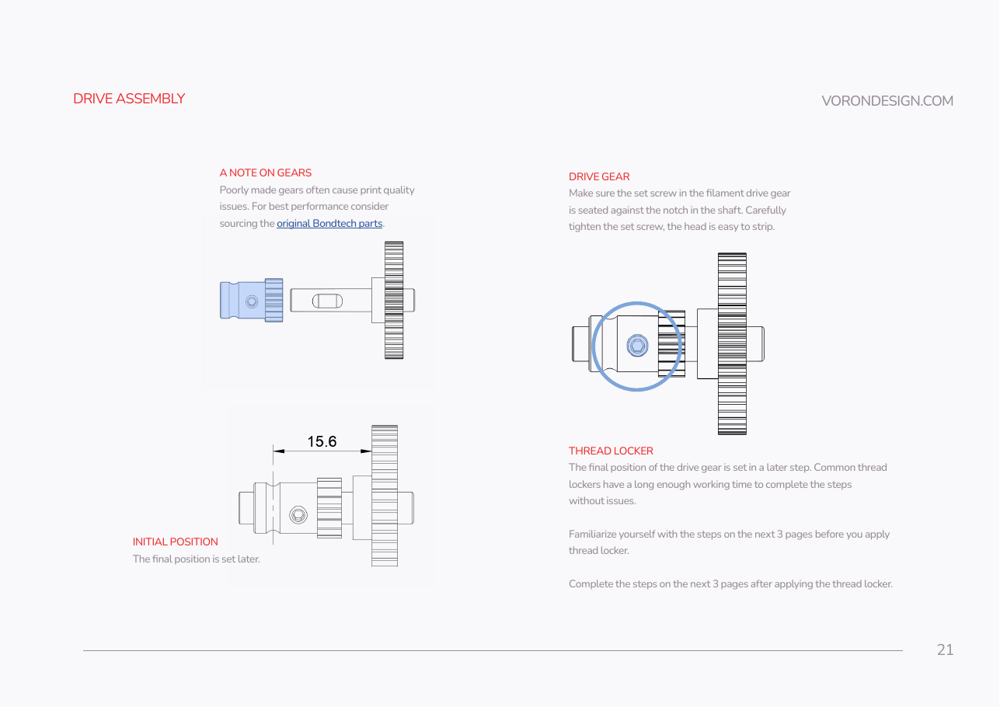

**What you're looking at:** The filament drive gear is the toothed wheel that actually pushes the filament, and 15.6 mm is where along the shaft its teeth line up with the filament path. Its set screw must land on the **flat machined into the shaft**, not on the round: on the round it creeps, and a drive gear that has crept reads later as random under-extrusion.

**Parts:** Bondtech filament drive gear, 50T gear, drive shaft, caliper, threadlocker.

**Do:** Read SB p.21–24 end to end before you open the threadlocker — the position is set across three pages and you want to be moving when the glue is wet. Slide the drive gear onto the shaft so its **set screw seats against the notch machined in the shaft**, set the initial spacing to **15.6 mm** as dimensioned on p.21, apply threadlocker, and tighten the set screw carefully. The set-screw head strips easily.

**Check:** Caliper reads 15.6 mm at the dimensioned face. The set screw is on the notch, not on the round of the shaft. Final position is corrected in Step 08.18.

Source: [SB manual p.21](https://github.com/VoronDesign/Voron-Stealthburner/blob/1bccf0543f40741243d81505c4ad5406eb822715/Manual/Assembly_Manual_SB.pdf#page=21)

---

### Step 08.16 — Drop the drive assembly into the main body

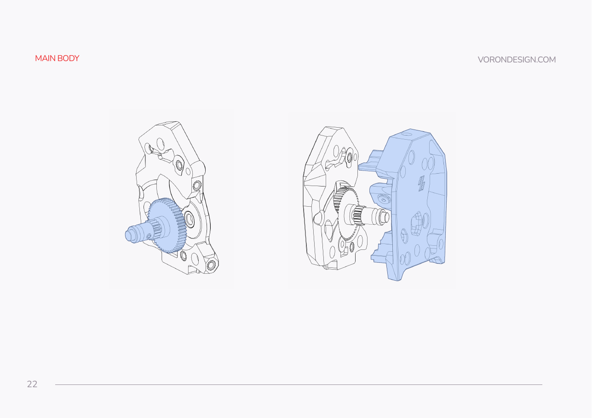

**What you're looking at:** Shaft, drive gear and 50 T gear go into the main body as one assembly, the shaft picking up the bearing you fitted at Step 08.14. Everything should turn on bearing drag alone — a gear touching plastic here wears a groove and adds a load the extruder never loses.

**Parts:** drive assembly from 08.15, `main_body.stl`.

**Do:** Lower the shaft-and-gears assembly into the main body so the shaft enters the MR85 you fitted in 08.14 and the 50T gear sits in its chamber.

**Check:** The shaft turns by hand with only bearing drag. No gear rubs the plastic.

Source: [SB manual p.22](https://github.com/VoronDesign/Voron-Stealthburner/blob/1bccf0543f40741243d81505c4ad5406eb822715/Manual/Assembly_Manual_SB.pdf#page=22)

---

### Step 08.17 — Close the extruder with the motor plate

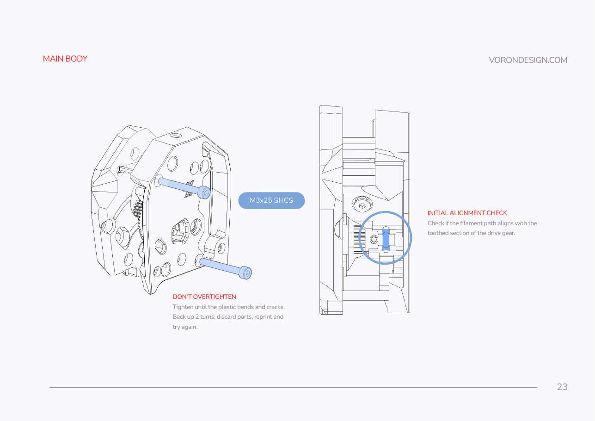

**What you're looking at:** The motor plate closes the extruder and picks up the shaft's second bearing. The manual's warning is exact: these two M3×25 pull two printed parts together, and past the point where they actually meet you are bending plastic rather than tightening a joint.

**Parts:** `motor_plate.stl` (from 08.12), M3×25 SHCS ×2.

**Do:** Bring the motor plate onto the main body so the shaft picks up its second MR85, then fit two M3×25 SHCS. Tighten until the parts meet and stop. The manual's wording is deliberate: tighten too far and the plastic bends and cracks — at which point you back off two turns, bin the part and reprint.

**Check:** No visible gap at the parting line and no stress whitening at either bolt boss. The shaft still turns freely.

Source: [SB manual p.23](https://github.com/VoronDesign/Voron-Stealthburner/blob/1bccf0543f40741243d81505c4ad5406eb822715/Manual/Assembly_Manual_SB.pdf#page=23)

---

### Step 08.18 — Verify drive-gear alignment with real filament

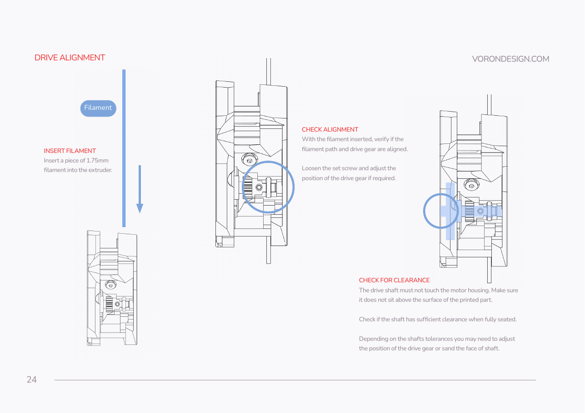

**What you're looking at:** A live check with real filament, because the 15.6 mm figure is only a starting point. The filament must land on the drive gear's **toothed band**, not on the smooth shoulder either side — a gear a millimetre out grips only intermittently, which reads as under-extrusion you will chase in the slicer.

**Parts:** a 100 mm offcut of 1.75 mm filament.

**Do:** Push the filament down the extruder's filament path. It must land on the **toothed** section of the drive gear, not on the shoulder either side. If it is off, loosen the set screw, nudge the gear, re-check, re-tighten. Then confirm the shaft's end face does not stand proud of the printed part — the drive shaft must not touch the motor housing when the stepper goes on. Sand the shaft face if it does.

**Check:** Filament centres on the gear teeth; the shaft end sits at or below the plastic surface when fully seated.

Source: [SB manual p.24](https://github.com/VoronDesign/Voron-Stealthburner/blob/1bccf0543f40741243d81505c4ad5406eb822715/Manual/Assembly_Manual_SB.pdf#page=24)

Pause: ~30 min since the last pause — the drive train is closed between the main body and the motor plate, and threadlocker is curing on the drive-gear set screw and on the M3×6 FHCS. Do not re-open the set screw or work the drive gear against a tight spot while the threadlocker sets; the motor is not on yet, so nothing is under load.

---

### Step 08.19 — Hang the tension arm — and leave it loose

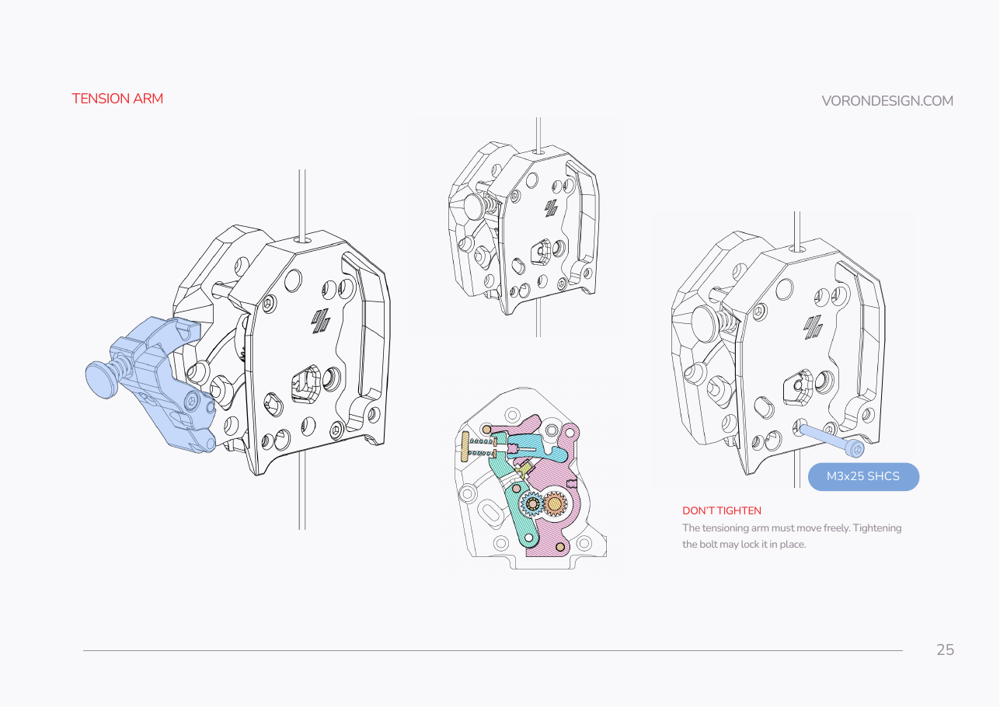

**What you're looking at:** The tension arm's M3×25 is a **hinge pin**, not a fastener. Tightened, the arm cannot swing and the extruder cannot tension filament at all; left loose, the arm swings and the spring does the work it was fitted for.

**Parts:** guidler assembly from 08.10, M3×25 SHCS ×1.

**Do:** Locate the guidler/tension arm on its pivot and pass one M3×25 SHCS through. **Do not tighten it.** This bolt is a hinge pin; torquing it locks the arm and kills filament tensioning.

**Check:** The arm swings through its full travel under finger pressure and falls back under spring load.

Source: [SB manual p.25](https://github.com/VoronDesign/Voron-Stealthburner/blob/1bccf0543f40741243d81505c4ad5406eb822715/Manual/Assembly_Manual_SB.pdf#page=25)

---

### Step 08.20 — Fit the latch

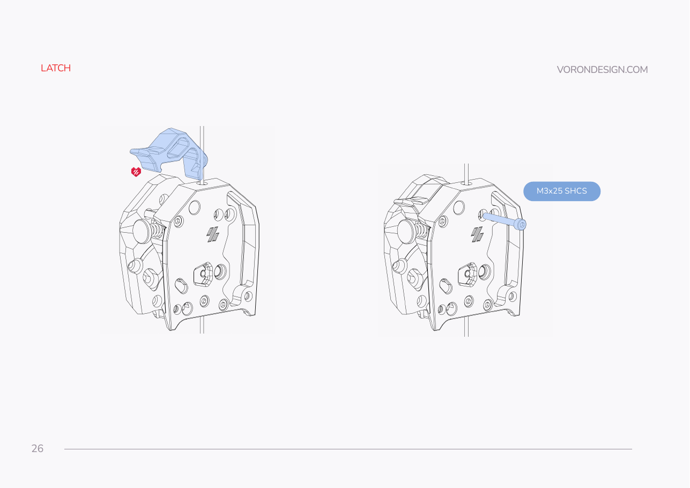

**What you're looking at:** The latch is the orange lever that hooks over the latch shuttle (08.11) to hold the guidler arm closed against spring pressure, so filament can be loaded one-handed. It also has to pivot, so it too is snug rather than tight.

**Parts:** `[a]_latch` ×1 (insert fitted in 08.5), M3×25 SHCS ×1.

**Do:** Drop the latch over its post and secure with one M3×25 SHCS. Snug — the latch must still pivot.

**Check:** The latch swings over and hooks the shuttle, holding the guidler closed, and releases cleanly when lifted.

Source: [SB manual p.26](https://github.com/VoronDesign/Voron-Stealthburner/blob/1bccf0543f40741243d81505c4ad5406eb822715/Manual/Assembly_Manual_SB.pdf#page=26) · [Video: Part 5 @1:48:10](https://www.youtube.com/watch?v=hTKCBrk36R0&list=PL0fUJbigELQPqpeGOgHYisG4KaSXVtnNY&t=6490s) (differs: builds Afterburner + Clockwork 1; this kit is Stealthburner + Clockwork 2 + Revo HF)

---

### Step 08.21 — Set the tension and the anti-squish stop

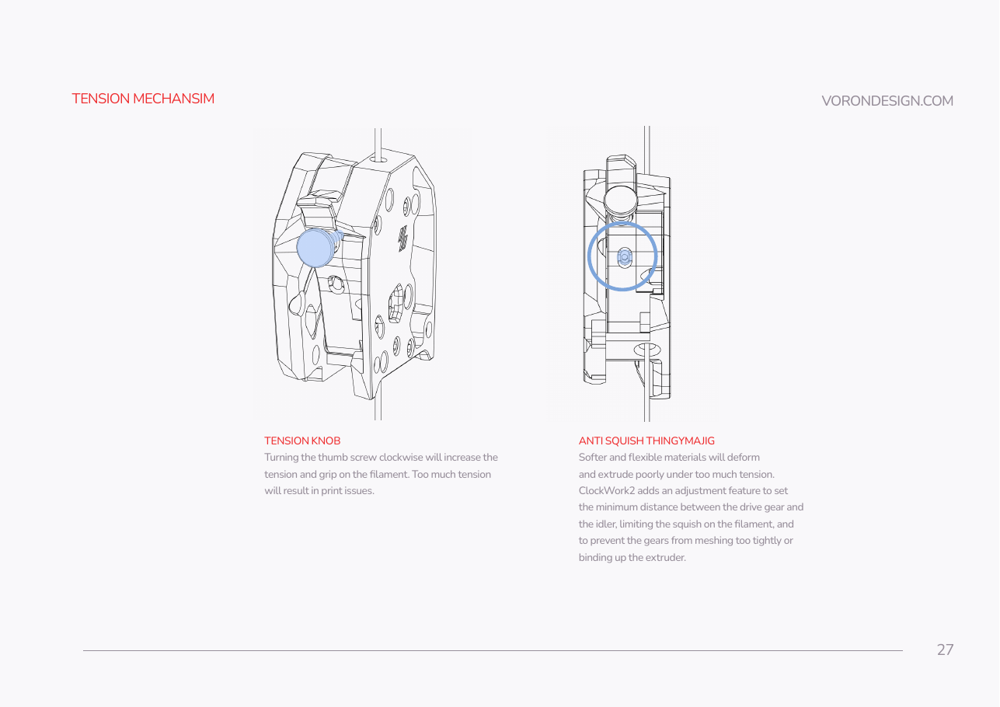

**What you're looking at:** Two independent adjustments meet here. The thumbscrew sets **how hard** the idler presses; the CW2 anti-squish stop sets the **minimum** gap, so the two gears can never be driven into each other. Shallow tooth marks on the filament are correct — a flattened track means the filament is being deformed instead of gripped.

**Parts:** the assembled extruder, 1.75 mm filament offcut.

**Do:** Clockwise on the thumbscrew increases grip. Set it to just enough that the filament cannot be pulled back through by hand. Then set the CW2 anti-squish adjustment — the stop that fixes the **minimum** distance between drive gear and idler — so the gears mesh without binding and soft filament is not crushed.

**Check:** With filament loaded, the arm closes without the gears grinding against each other, and the filament shows shallow tooth marks rather than a flattened track.

Source: [SB manual p.27](https://github.com/VoronDesign/Voron-Stealthburner/blob/1bccf0543f40741243d81505c4ad5406eb822715/Manual/Assembly_Manual_SB.pdf#page=27)

---

### Step 08.22 — Fit the pancake stepper, first bolt

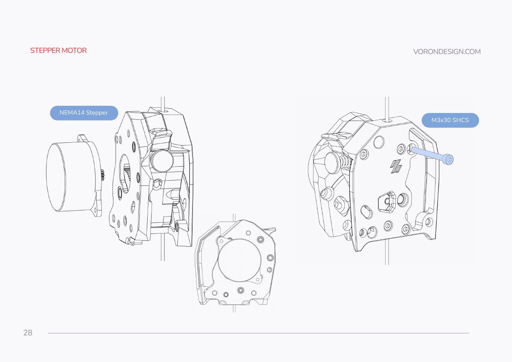

**What you're looking at:** The pancake stepper is a slim NEMA14 motor; its pinion drives the 50 T gear, and that reduction is what gives the extruder its pushing force. Both its bolts stay loose to start with, because the motor's position in its slots **is** the gear-mesh adjustment.

**Parts:** LDO-36STH20-1004AHG(VRN) NEMA14 pancake stepper ×1, M3×30 SHCS ×1.

**Do:** Present the stepper to the motor plate with its pinion entering the 50T gear chamber and its cable exiting where the CW2 body routes it. Start the M3×30 SHCS in the upper mounting position. Leave it loose — mesh is set two steps from now.

**Check:** The motor sits flat against the plate with the pinion engaged, not bottomed.

Source: [SB manual p.28](https://github.com/VoronDesign/Voron-Stealthburner/blob/1bccf0543f40741243d81505c4ad5406eb822715/Manual/Assembly_Manual_SB.pdf#page=28)

---

### Step 08.23 — Fit the second motor bolt through the front access hole

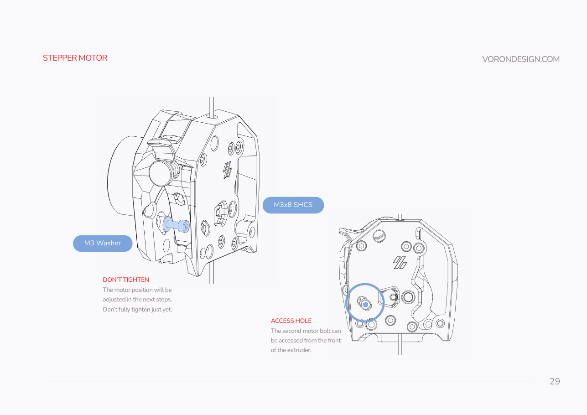

**What you're looking at:** The second motor bolt is reached from the front of the extruder through an access hole. This is the bolt that gets forgotten — and a motor held by one bolt slowly rotates in its slots under load until the mesh is gone.

**Parts:** M3×8 SHCS ×1, M3 washer ×1.

**Do:** Put the washer on the M3×8 SHCS and drive it into the second motor position. It is reached from the **front** of the extruder through the access hole. Leave this one loose too.

**Check:** Both motor bolts started, both still finger-loose, and the motor can be nudged in its slots.

Source: [SB manual p.29](https://github.com/VoronDesign/Voron-Stealthburner/blob/1bccf0543f40741243d81505c4ad5406eb822715/Manual/Assembly_Manual_SB.pdf#page=29)

---

### Step 08.24 — Set the gear mesh, then tighten both motor bolts

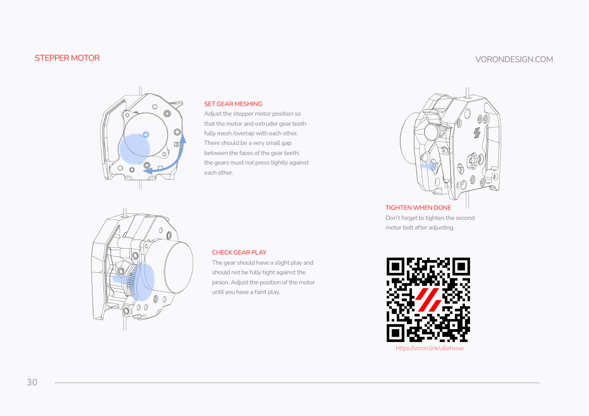

**What you're looking at:** Gear mesh is how deeply the pinion and the 50 T teeth overlap. Too shallow and the teeth skip under load; preloaded together and the drivetrain binds and whines. What you want is full tooth overlap with a faint, just-perceptible backlash, then the motor locked there — M3×30 first, then the M3×8.

**Parts:** the extruder assembly.

**Do:** Slide the motor until the pinion and the 50T gear teeth fully overlap with a **very small** gap between the tooth faces. You want a faint play, not a preload. Turn the drive shaft by hand while you adjust. When it feels right, tighten the M3×30 first, then the M3×8 — the manual's most-missed step is forgetting the second bolt.

**Check:** Rotating the drive gear by hand gives a barely perceptible backlash and no tight spot anywhere through a full turn. Both bolts tight.

Source: [SB manual p.30](https://github.com/VoronDesign/Voron-Stealthburner/blob/1bccf0543f40741243d81505c4ad5406eb822715/Manual/Assembly_Manual_SB.pdf#page=30) · [Video: Part 5 @1:41:54](https://www.youtube.com/watch?v=hTKCBrk36R0&list=PL0fUJbigELQPqpeGOgHYisG4KaSXVtnNY&t=6114s) (differs: builds Afterburner + Clockwork 1; this kit is Stealthburner + Clockwork 2 + Revo HF)

---

### Step 08.25 — Fit the LDO tilted chain anchor

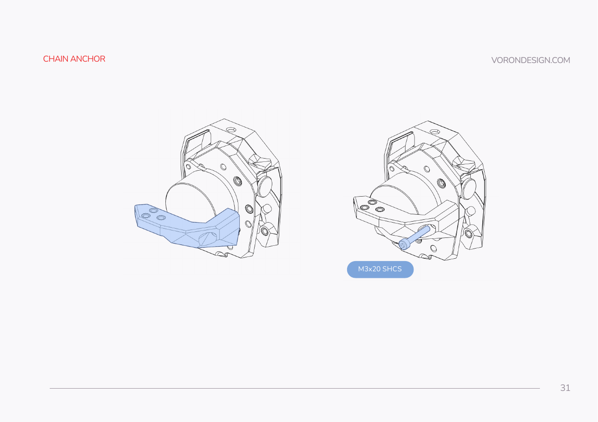

**What you're looking at:** The chain anchor is the terminus of the toolhead's cable run: the umbilical is tied to it, so every pull from the moving drag chain lands on this printed block rather than on the toolboard's connectors.

**Parts:** CW2 Chain Anchor Tilted (supplied printed, inserts from 08.6), M3×20 SHCS ×1.

**Do:** Sit the anchor onto the rear of the CW2 so its chain face points back along the X extrusion, and fix it with one M3×20 SHCS.

**Check:** The anchor is solid on the body and its two chain holes face rearwards and slightly up.

Source: [SB manual p.31](https://github.com/VoronDesign/Voron-Stealthburner/blob/1bccf0543f40741243d81505c4ad5406eb822715/Manual/Assembly_Manual_SB.pdf#page=31)

---

### Step 08.26 — Fit the cable-bridge bolt

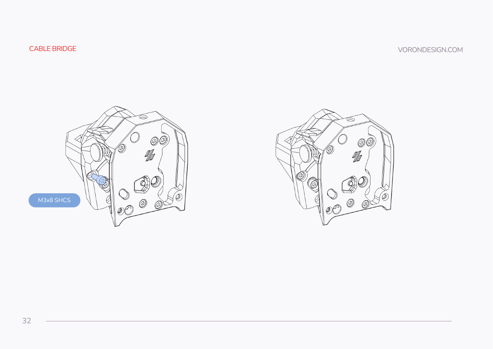

**What you're looking at:** The cable-bridge bolt is the anchor's second fixing. On one bolt the anchor can twist; on two the cable path is rigid, which is what a drag chain tugging at it needs.

**Parts:** M3×8 SHCS ×1.

**Do:** Drive the M3×8 SHCS into the cable-bridge position on the side of the extruder — the second fixing that ties the anchor and the cable path to the body.

**Check:** The anchor no longer twists when you push it sideways.

Source: [SB manual p.32](https://github.com/VoronDesign/Voron-Stealthburner/blob/1bccf0543f40741243d81505c4ad5406eb822715/Manual/Assembly_Manual_SB.pdf#page=32)

Pause: ~25 min since the last pause — Clockwork 2 is a complete, self-supporting sub-assembly: mesh set, both motor bolts tight, chain anchor and cable bridge fitted. The tension arm's M3×25 is deliberately loose and is a hinge pin — do not torque it to tidy the assembly up before you walk away.

---

## C — Tool cartridge and E3D Revo HF

### Step 08.27 — Assemble the Revo HF hotend

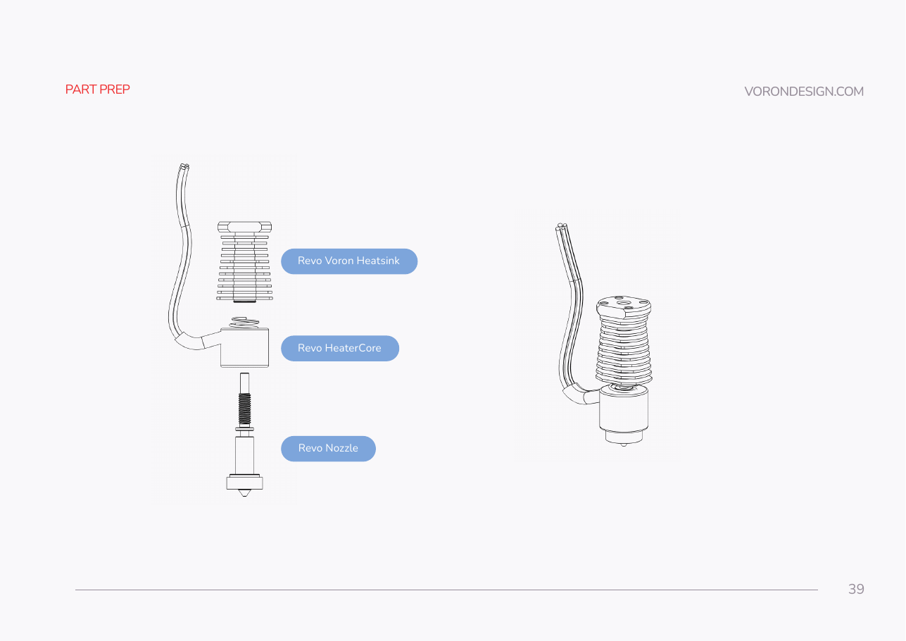

**What you're looking at:** The [Revo HF](16-glossary.md#r) is E3D's quick-change hotend, in three pieces: the **heatsink** (the finned top the filament enters through, kept cold by the 4010 fan), the **HeaterCore** (heater and thermistor in one module) and a **nozzle** that screws in **by hand** — no tools, ever. A retaining spring holds the HeaterCore captive, and turning it clockwise disengages that spring, which is why the cables are aimed by rotating it anti-clockwise only.

**Parts:** Revo Voron heatsink ×1, retaining spring ×1, Revo HeaterCore ×1, Revo nozzle ×1.

**Do:** Fit the spring into the groove on the **bottom** of the heatsink. Push the HeaterCore onto the heatsink-and-spring assembly. Then screw the nozzle into the heatsink — **finger-tight only**, no tools; it should slide freely through the HeaterCore as it goes. To point the HeaterCore's cables where you want them, rotate it **anti-clockwise only**: turning it clockwise disengages the spring.

**Check:** Nozzle fully home and hand-tight. HeaterCore captive under spring load. Cables pointing to the rear.

Source: [SB manual p.39](https://github.com/VoronDesign/Voron-Stealthburner/blob/1bccf0543f40741243d81505c4ad5406eb822715/Manual/Assembly_Manual_SB.pdf#page=39) · [E3D Revo Voron support](https://e3d-online.com/pages/revo-support-voron)

---

### Step 08.28 — Seat the hotend in the rear printhead half

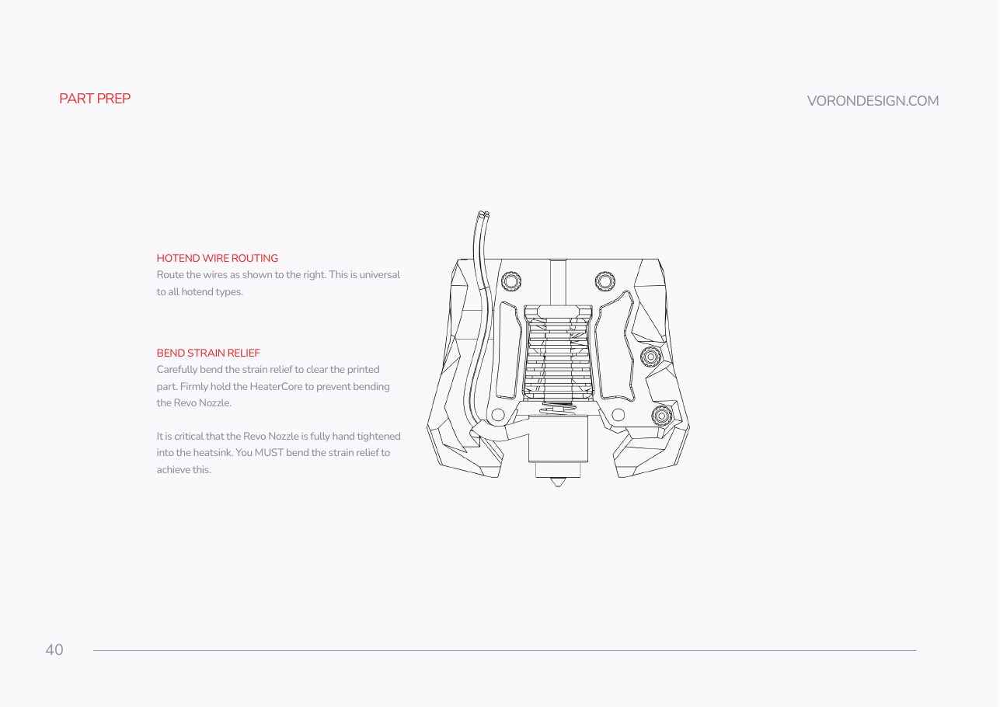

**What you're looking at:** The rear printhead half is the pocket the hotend lives in. The heatsink's groove locates on a moulded rib, and that rib is what stops the hotend rotating when you hand-tighten the nozzle or change it later. SB p.40 draws the hotend already sitting in this half — it goes in *before* the wires are routed, so the strain relief gets bent once, against the real wall it has to clear.

**Parts:** `stealthburner_printhead_revo_voron_rear_cw2` (inserts from 08.7), Revo assembly.

**Do:** Drop the Revo Voron heatsink into the rear printhead half so the heatsink's groove locates on the printed rib, with the HeaterCore's wires pointing up the side p.40 draws them on. Do not bend anything yet.

**Check:** The heatsink cannot rotate in the pocket, and the nozzle protrudes centrally.

Source: [SB manual p.39](https://github.com/VoronDesign/Voron-Stealthburner/blob/1bccf0543f40741243d81505c4ad5406eb822715/Manual/Assembly_Manual_SB.pdf#page=39) · [SB manual p.40](https://github.com/VoronDesign/Voron-Stealthburner/blob/1bccf0543f40741243d81505c4ad5406eb822715/Manual/Assembly_Manual_SB.pdf#page=40)

---

### Step 08.29 — Route the wires and bend the strain relief so the nozzle can seat fully

**What you're looking at:** The strain relief is the stainless sleeve where the HeaterCore's wires leave the module. Bending it clear is not tidiness: with it in the way the nozzle cannot go the last part-turn home, and a nozzle not fully seated leaks molten plastic up into the printhead on the first hot print. With the hotend in its half you bend it once, against the wall it has to clear — bending blind means re-bending, and a crimped wire exit fatigues.

**Parts:** Revo assembly in the rear half (from 08.28).

**Do:** Route the hotend wires up the side of the rear half as SB p.40 shows — the routing is the same for every hotend type. Then carefully bend the HeaterCore's stainless strain relief so it clears the printed part. Hold the HeaterCore firmly while you bend so you do not put load on the nozzle. This is not cosmetic: **the nozzle cannot be fully hand-tightened into the heatsink unless the strain relief is bent out of the way.**

**Check:** With the rear half in your hand the relief clears its wall, the nozzle still turns the last part-turn home by hand, and the wires exit rearwards without touching the nozzle.

Source: [SB manual p.40](https://github.com/VoronDesign/Voron-Stealthburner/blob/1bccf0543f40741243d81505c4ad5406eb822715/Manual/Assembly_Manual_SB.pdf#page=40)

---

### Step 08.30 — Close the tool cartridge

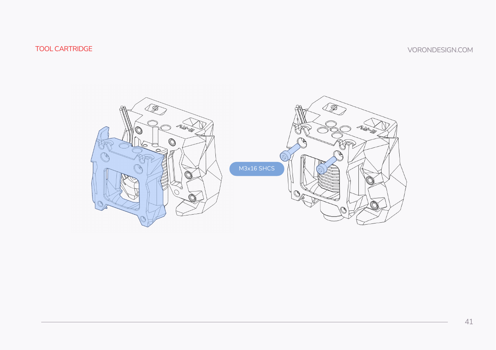

**What you're looking at:** Front half on, two bolts, and the **tool cartridge** now exists as an object: hotend, both printhead halves and (next) the PTFE, as one unit that later slides up into the toolhead. Zero play matters because any movement here is movement of the nozzle relative to the bed.

**Parts:** `stealthburner_printhead_revo_voron_front` ×1, M3×16 SHCS ×2.

**Do:** Bring the front half onto the rear half around the hotend and fix with two M3×16 SHCS.

**Check:** The two halves close with no gap and the hotend has zero play in any direction.

Source: [SB manual p.41](https://github.com/VoronDesign/Voron-Stealthburner/blob/1bccf0543f40741243d81505c4ad5406eb822715/Manual/Assembly_Manual_SB.pdf#page=41)

---

### Step 08.31 — Fit the four tool-cartridge mounting bolts

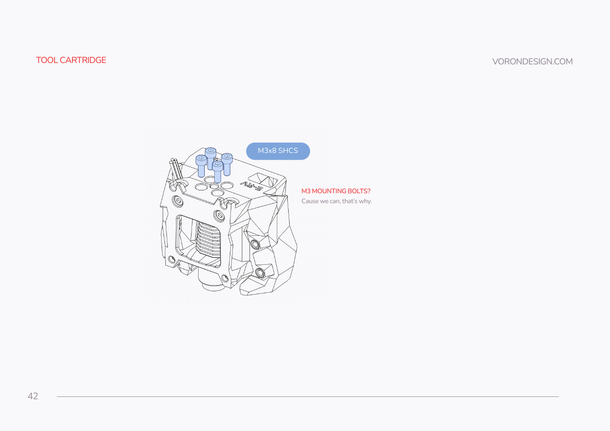

**What you're looking at:** These four M3×8 are **studs**, not fasteners. Their heads engage keyholes in the Clockwork 2 when the cartridge slides up into place at Step 08.61, so all four must stand at exactly the same height or the cartridge hangs crooked.

**Parts:** M3×8 SHCS ×4.

**Do:** Drive four M3×8 SHCS into the top face of the tool cartridge. These are the studs the cartridge later hangs on when it slides up into the toolhead (Step 08.61) — do not overtighten and do not leave them proud.

**Check:** Four bolts, all seated to the same depth.

Source: [SB manual p.42](https://github.com/VoronDesign/Voron-Stealthburner/blob/1bccf0543f40741243d81505c4ad5406eb822715/Manual/Assembly_Manual_SB.pdf#page=42)

---

### Step 08.32 — Cut and fit the PTFE to 11 mm stickout

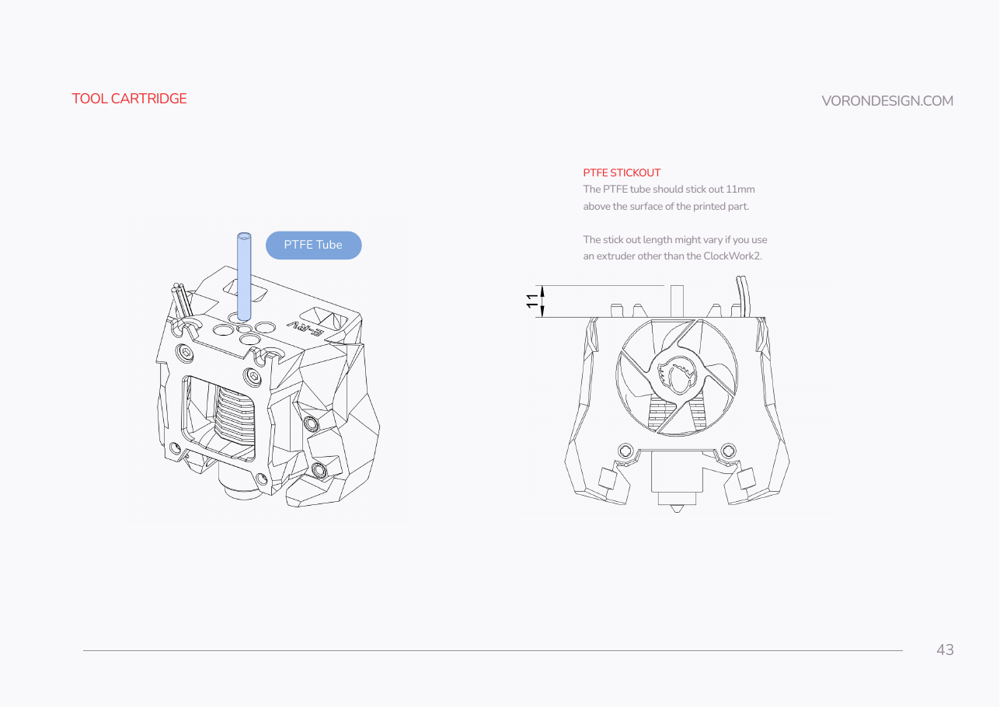

**What you're looking at:** The PTFE tube is the low-friction liner that guides filament from the extruder's outlet down into the hotend. 11 mm of stickout is the Clockwork 2 figure: it is the length that closes the gap between the two, so the filament is guided the whole way and cannot buckle sideways under extrusion pressure.

**Parts:** PTFE 4 mm OD / 2 mm ID (10 cm piece), caliper, flush cutters.

**Do:** Push the PTFE down into the tool cartridge until it bottoms on the heatsink, then cut it so exactly **11 mm** stands above the surface of the printed part. Cut square — a diagonal cut leaves a filament-catching step. The 11 mm figure is specific to Clockwork 2.

**Check:** Caliper across the stickout reads 11 mm. Push 1.75 mm filament through — it enters the hotend with no catch.

Source: [SB manual p.43](https://github.com/VoronDesign/Voron-Stealthburner/blob/1bccf0543f40741243d81505c4ad5406eb822715/Manual/Assembly_Manual_SB.pdf#page=43) · [Video: Part 5 @2:06:01](https://www.youtube.com/watch?v=hTKCBrk36R0&list=PL0fUJbigELQPqpeGOgHYisG4KaSXVtnNY&t=7561s) (differs: builds Afterburner + Clockwork 1; this kit is Stealthburner + Clockwork 2 + Revo HF)

Pause: ~20 min since the last pause — the tool cartridge is closed around the Revo, the four M3×8 studs are in, and the PTFE is cut to 11 mm. Bag it nozzle-up. Do not put a tool on the nozzle and do not stand the cartridge on its nozzle; both undo the hand-tight seat you just set.

---

### Step 08.33 — Terminate the hotend leads for the Nitehawk V2

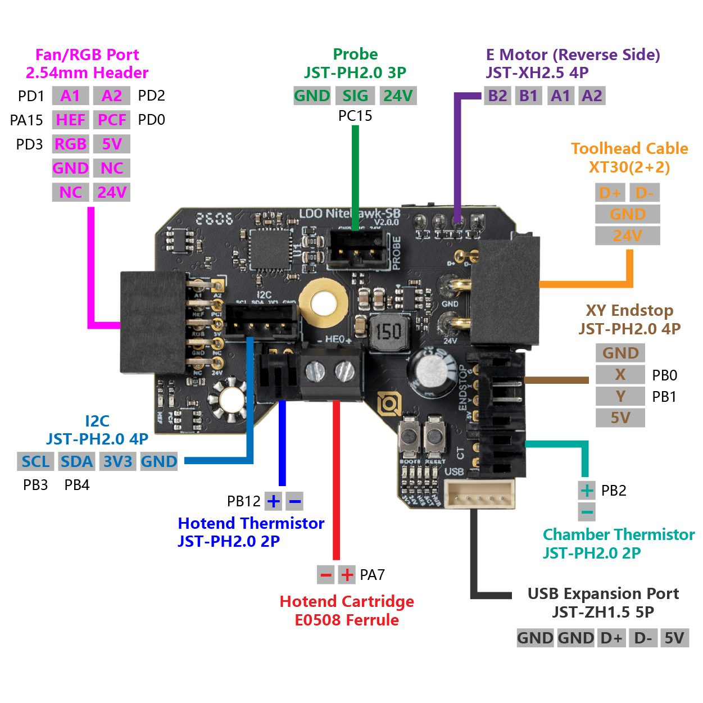

**What you're looking at:** The [Nitehawk-SB V2](16-glossary.md#n) is the **toolboard** — a small PCB that rides on the toolhead and collects the heater, thermistor, both fans, the LEDs, the probe and the extruder motor onto one thin USB-plus-24 V umbilical instead of a loom of eight cables. On it, `HE0` is a screw terminal for the heater and `TH0` a 2-pin [JST-PH2.0](16-glossary.md#j) socket for the thermistor. A [ferrule](16-glossary.md#f) is a metal sleeve crimped over stranded wire so it clamps in a screw terminal without splaying.

**Parts:** Revo heater and thermistor leads, E0508 ferrules ×2, JST-PH2.0 2-pin housing + crimps (only if re-terminating).

**Do:** The Revo HF arrives with integrated heater and thermistor terminated in Molex Micro-Fit 3.0 2-pin. The Nitehawk V2 wants **E0508 ferrules** in the `HE0` screw terminal for the heater (polarity does not matter) and a **JST-PH2.0 2-pin** plug on `TH0` for the thermistor. Open the Toolhead PCB Cables bag first: if LDO's pre-terminated hotend cables mate with the Revo's Micro-Fit connectors, use them as-is and crimp nothing. If they do not, cut the Revo pigtails to length and fit ferrules and a PH2.0 housing yourself. `(verify on bench — depends on what LDO packed for the Revo option)`

**Check:** Heater leads end in two crimped E0508 ferrules with no stray strands. Thermistor lead ends in a 2-pin PH2.0 housing that drops into `TH0` without force.

⚠ Rev D+ / LDO: the Rev D wiring guide still says *"the connector type to use is JST-XH2.5 two pin"* for the hotend thermistor. On the V2 board `TH0`, `PROBE` and the XY endstop are **JST-PH2.0**. An XH2.5 housing will not fit, and the smaller PH2.0 body is easy to force into the wrong header — check the silkscreen before every insertion. [src](https://github.com/MotorDynamicsLab/Nitehawk-SB-V2)

Source: [Nitehawk-SB V2 pinout](https://github.com/MotorDynamicsLab/Nitehawk-SB-V2/blob/master/Images/nhsbv2_pcb_pinout.jpg)

---

### Step 08.34 — Prepare the 5015 part-cooling blower

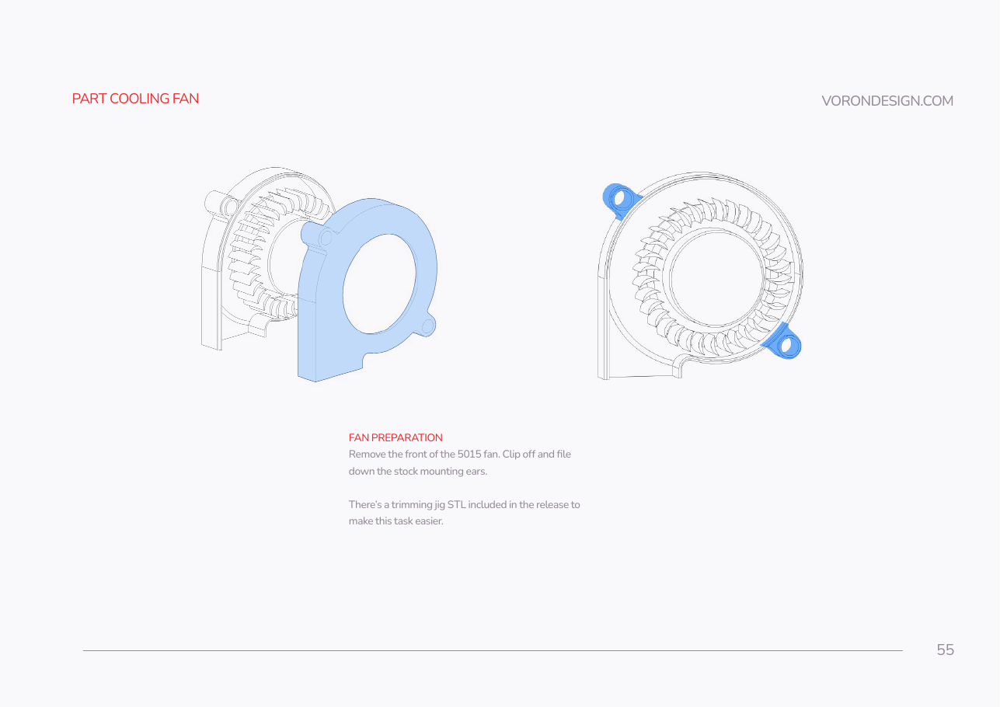

**What you're looking at:** The 5015 is the **part-cooling blower**: a centrifugal fan that throws air sideways out of a nozzle rather than straight through, which is what lets it feed the printhead's narrow ducts. Its moulded mounting ears belong to a different machine — Stealthburner grips the bare housing, so the ears come off flush.

**Parts:** 50×50×15 centrifugal fan (24 V) ×1, flush cutters, small flat file.

**Do:** Remove the front cover of the 5015. Clip the stock mounting ears off flush and file the remains down until the housing sides are flat. A trimming jig STL ships in the Stealthburner release if you want one — it is not in the repo's `STLs/` tree, only in the release archive.

**Check:** No ear stands proud of the housing wall. Test-fit the fan into the SB main body pocket — it drops in without spreading the printed walls.

Source: [SB manual p.55](https://github.com/VoronDesign/Voron-Stealthburner/blob/1bccf0543f40741243d81505c4ad5406eb822715/Manual/Assembly_Manual_SB.pdf#page=55) · [Video: Part 6 @0:20:10](https://www.youtube.com/watch?v=8pWoYkY1DiA&list=PL0fUJbigELQPqpeGOgHYisG4KaSXVtnNY&t=1210s)

---

## D — Stealthburner body: LEDs and fans

### Step 08.35 — Build the logo LED into its carrier

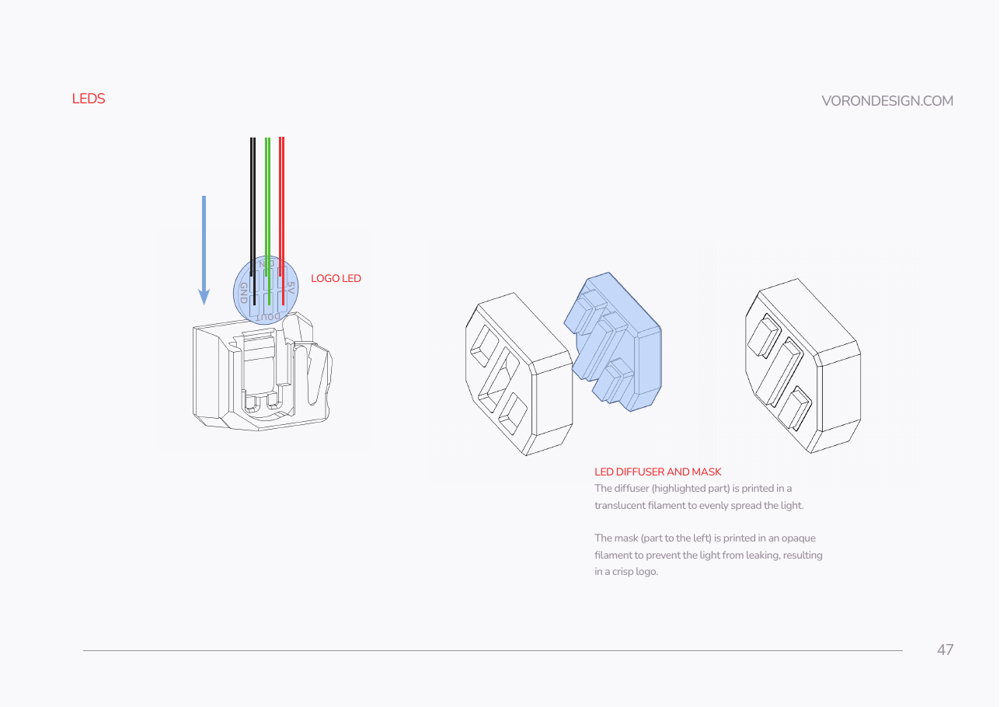

**What you're looking at:** The logo LED and its three-part sandwich. From the outside in: the **opaque black mask** (three windows) is the face you see; the **clear PETG diffuser** sits behind it, its three prongs poking forward through the mask's windows; the carrier with the LED sits behind both. Swap the order and the prongs face the LED and nothing fits.

**Parts:** `[o]_stealthburner_LED_carrier` ×1, `[o]_stealthburner_LED_diffuser_mask` ×1, `[c]_stealthburner_LED_diffuser` ×1 (supplied, clear PETG), logo LED (chain index 1).

**Do:** Seat the logo LED in the carrier with its wires exiting upwards. Then stack, from the outside in: mask (opaque, three windows) → diffuser (three prongs forward through the windows, flat base behind) → LED carrier with the LED — SB p.47's right-hand drawing is the assembled result. The mask blocks light bleed so the logo reads crisply; the diffuser spreads it.

**Check:** Three translucent bars sit flush in the black face with no light path around them; the diffuser's flat base is behind the mask, not in front of it. Nothing rattles.

Source: [SB manual p.47](https://github.com/VoronDesign/Voron-Stealthburner/blob/1bccf0543f40741243d81505c4ad5406eb822715/Manual/Assembly_Manual_SB.pdf#page=47)

---

### Step 08.36 — Wire the three-LED chain

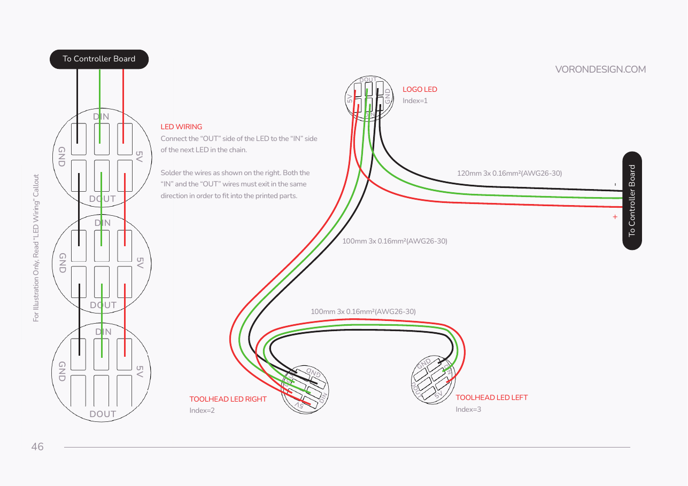

**What you're looking at:** These are addressable LEDs wired as a chain: data goes **in** to the first, **out** of it and in to the second, and so on, so each LED's position in the chain is its address. Logo is index 1, right toolhead LED is 2, left is 3 — the order the Klipper config's `chain_count: 3` and every LED macro assume.

**Parts:** logo LED (index 1), toolhead LED right (index 2), toolhead LED left (index 3); 3-core 0.16 mm² (AWG26–30) — 120 mm controller→logo, 100 mm between each LED.

**Do:** Many Rev D kits ship this chain pre-soldered in the toolhead cable bag — check first and skip this step if so. If you are soldering it: connect **OUT of one LED to IN of the next**, in the order logo (1) → right (2) → left (3). Both the IN and the OUT wires of every LED must **exit in the same direction**, or the pigtails will not lie in the printed channels.

**Check:** Continuity from the connector's DIN through each LED's DIN/DOUT pair in chain order; 5 V and GND common along the chain; no 5 V–GND short at the connector.

⚠ Rev D+ / LDO: the config declares `chain_count: 3` and `color_order: GRBW`. A colour-order mismatch shows up as wrong colours, never as a failure — if the LEDs light in the wrong colours in Ch 13, change `color_order`, do not rewire. [src](https://github.com/MotorDynamicsLab/LDOVoron2/blob/main/Firmware/leviathan-printer-rev-d-sbv2.cfg)

Source: [SB manual p.46](https://github.com/VoronDesign/Voron-Stealthburner/blob/1bccf0543f40741243d81505c4ad5406eb822715/Manual/Assembly_Manual_SB.pdf#page=46)

Pause: ~25 min since the last pause — the hotend leads are terminated, the 5015 ears are trimmed and filed, and the three-LED chain is soldered and continuity-checked. Nothing is in the Stealthburner body yet. Iron off and cool. Do not coil the chain tightly: the 100 and 120 mm pigtails are cut to fit the printed channels and kinking them loses that length.

---

### Step 08.37 — Seat the two toolhead LEDs

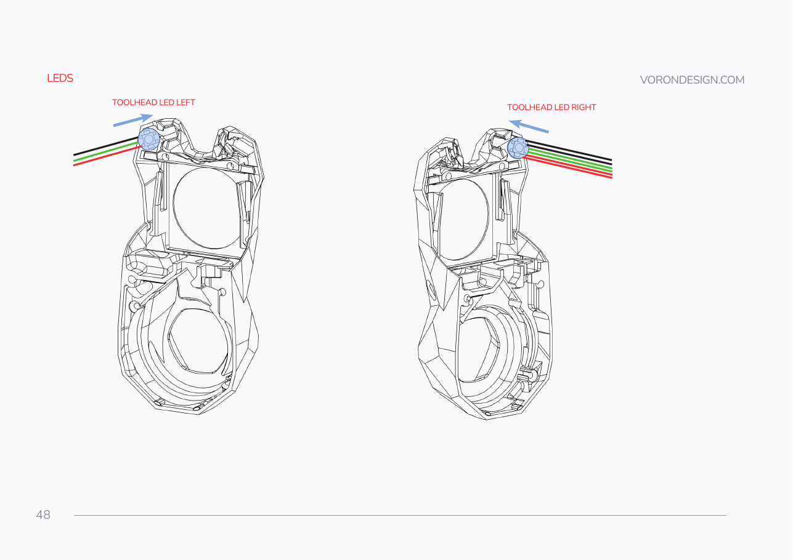

**What you're looking at:** The two toolhead LEDs sit in the top corners of the body and light the print area from above — they are what you actually watch a first layer by. The two pockets are mirror images. SB p.48 names them from behind: its "TOOLHEAD LED RIGHT" (index 2) is the toolhead's own right — the pocket on **your left** when you face the printer. Either way round only changes which pocket is index 2 in the config.

**Parts:** toolhead LED left (index 3), toolhead LED right (index 2), `[a]_stealthburner_main_body`.

**Do:** Push each toolhead LED into its pocket in the top corners of the main body, from the outside inwards, wires trailing outboard. Use the SB manual's convention: p.48 is drawn from behind, so its "RIGHT" pocket (index 2) is the toolhead's own right and its "LEFT" pocket (index 3) the toolhead's own left.

**Check:** Both LEDs bottom in their pockets and face down into the print area.

Source: [SB manual p.48](https://github.com/VoronDesign/Voron-Stealthburner/blob/1bccf0543f40741243d81505c4ad5406eb822715/Manual/Assembly_Manual_SB.pdf#page=48)

---

### Step 08.38 — Insert the LED diffusers and push them forward

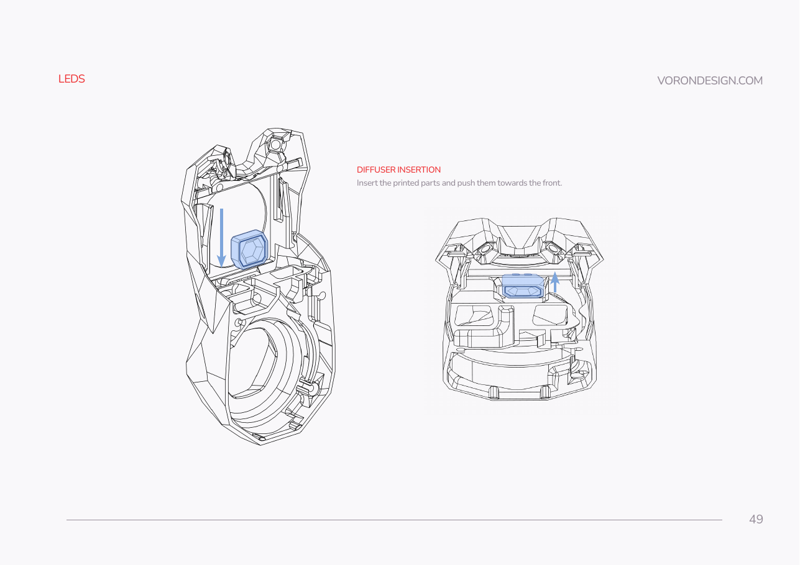
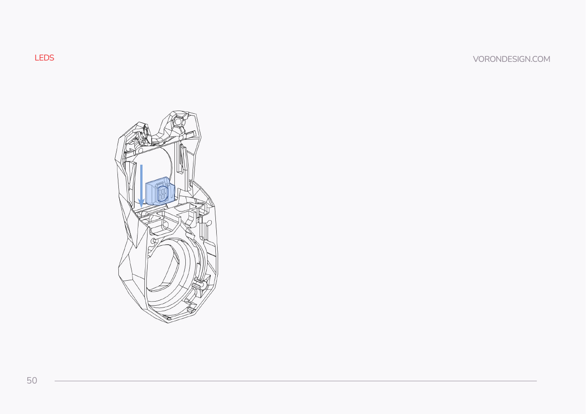

**What you're looking at:** The diffusers are the translucent panels that give Stealthburner its lit face. Pushed fully forward they sit flush with the front of the body; left back, they leave a shadow line and a gap that collects dust.

**Parts:** the printed diffuser parts.

**Do:** Drop the diffuser parts into their slots from above and push them **towards the front** of the body until they stop.

**Check:** Diffuser faces sit flush with the front of the body; no gap behind them.

Source: [SB manual p.49](https://github.com/VoronDesign/Voron-Stealthburner/blob/1bccf0543f40741243d81505c4ad5406eb822715/Manual/Assembly_Manual_SB.pdf#page=49) · [SB manual p.50](https://github.com/VoronDesign/Voron-Stealthburner/blob/1bccf0543f40741243d81505c4ad5406eb822715/Manual/Assembly_Manual_SB.pdf#page=50) · [Video: More Extras! @1:06:03](https://www.youtube.com/watch?v=D_44fDp9xt8&list=PL0fUJbigELQPqpeGOgHYisG4KaSXVtnNY&t=3963s) (differs: builds Afterburner + Clockwork 1; this kit is Stealthburner + Clockwork 2 + Revo HF)

---

### Step 08.39 — Route the LED wires out of the body

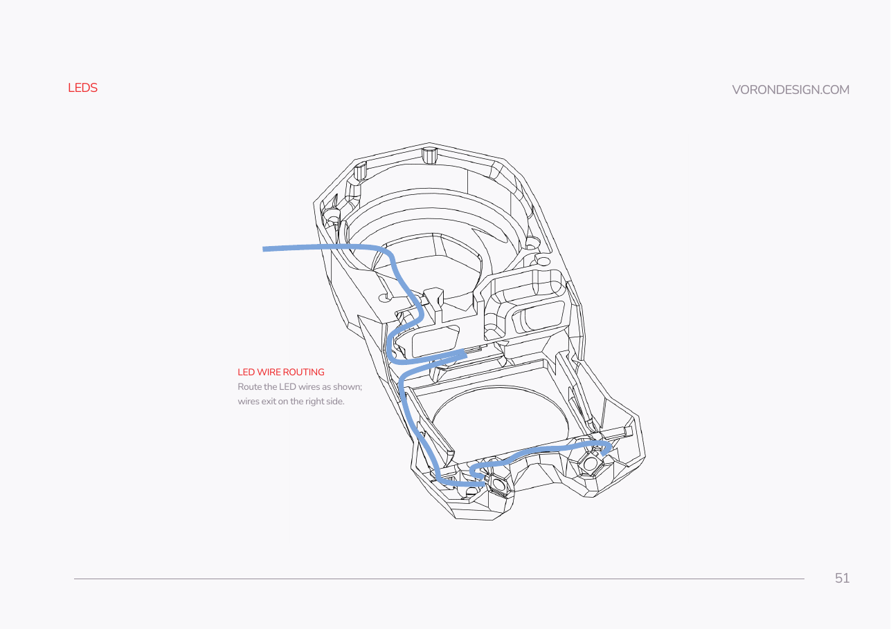

**What you're looking at:** Every wire in the body is routed to leave on **one** side, so the whole harness can be taken to the fan adapter as a single bundle. A wire crossing a fan opening is a wire an impeller will eventually find.

**Parts:** the LED chain in the body.

**Do:** Lay the LED wires into the moulded channels so the whole harness **exits on the right side** of the body. Keep them out of the fan cavities.

**Check:** With the body face-down, no wire crosses either fan opening and the harness leaves as a single bundle on the right.

Source: [SB manual p.51](https://github.com/VoronDesign/Voron-Stealthburner/blob/1bccf0543f40741243d81505c4ad5406eb822715/Manual/Assembly_Manual_SB.pdf#page=51)

---

### Step 08.40 — Clip in the hotend fan, correct way round

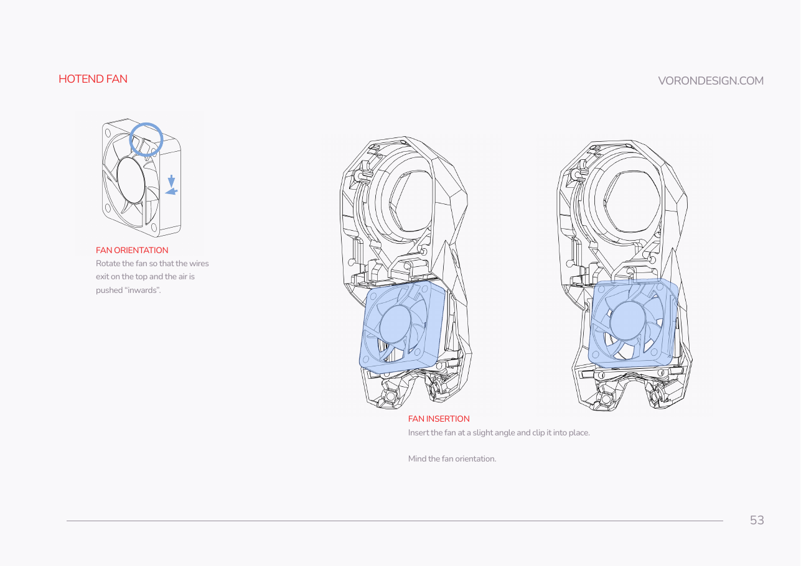

**What you're looking at:** The 4010 axial fan is the **hotend** fan: it blows through the heatsink's fins to keep the cold side of the hotend cold, so filament only softens in the melt zone. Direction is absolute — the moulded arrow must point *into* the heatsink. As it seats, the fan snaps the body's support webs, and that is exactly what retains it.

**Parts:** 40×40×10 axial fan, 24 V ×1.

**Do:** Rotate the fan so its **wires exit at the top** and its airflow pushes **inwards** — into the heatsink, not out of it. Read the moulded arrow on the fan frame to confirm. Insert it at a slight angle and clip it into place; it will snap the body's built-in support webs as it seats, which is intended.

**Check:** Wires at top, airflow arrow pointing into the body. Spin the impeller with a finger — free, no rub.

Source: [SB manual p.53](https://github.com/VoronDesign/Voron-Stealthburner/blob/1bccf0543f40741243d81505c4ad5406eb822715/Manual/Assembly_Manual_SB.pdf#page=53)

---

### Step 08.41 — Route the hotend fan wires

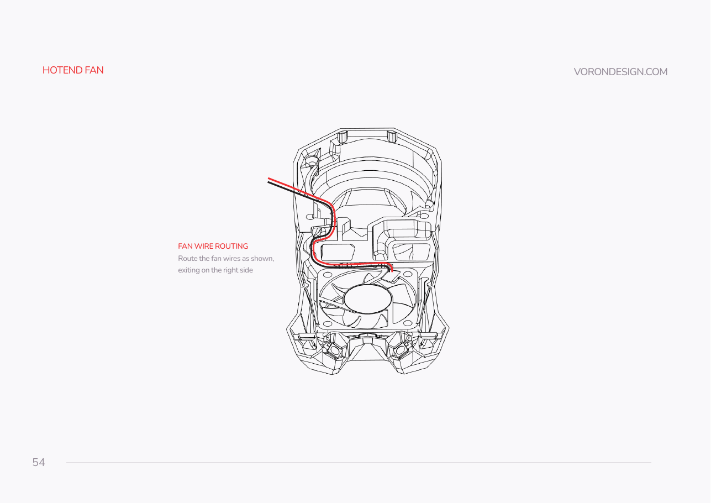

**What you're looking at:** The fan wires join the LED harness in the same right-hand channel — one bundle, one exit, and nothing trapped under the fan frame where it would be pinched every time the body is closed.

**Parts:** hotend fan wires.

**Do:** Lay the fan wires into their channel so they exit on the **right side**, alongside the LED harness.

**Check:** All wire exits are on one side; nothing is pinched under the fan frame.

Source: [SB manual p.54](https://github.com/VoronDesign/Voron-Stealthburner/blob/1bccf0543f40741243d81505c4ad5406eb822715/Manual/Assembly_Manual_SB.pdf#page=54)

---

### Step 08.42 — Fit the part-cooling blower

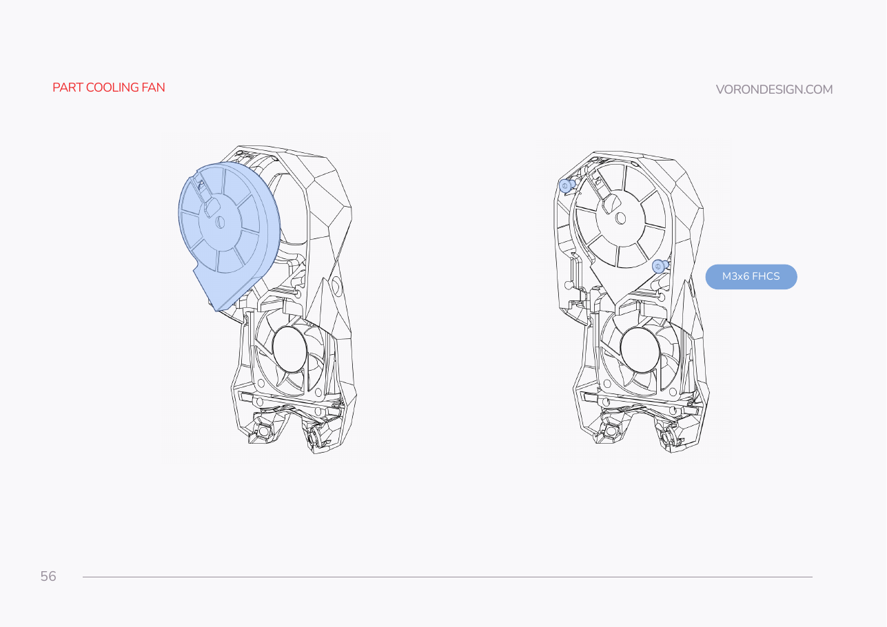

**What you're looking at:** The trimmed 5015 goes in the **upper** cavity, above the hotend fan you clipped in two steps ago. Which fan is which matters beyond tidiness: the config drives them on different pins, and Ch 13's fan verification is precisely the test of whether top and bottom got swapped.

**Parts:** trimmed 5015 from 08.34, M3×6 FHCS ×2.

**Do:** Drop the trimmed blower into the **upper** cavity, above the hotend fan you clipped in at Step 08.40, so its outlet feeds the ducts, and fix it with two M3×6 FHCS. Blower wires exit right, like everything else. Remember the split — part cooling is the **top** fan, the hotend fan the **bottom** one — because Ch 13 *Verify Fans* confirms exactly that, electrically.

**Check:** The blower is square in the upper cavity with the 4010 below it, the impeller spins freely, and the outlet aims down through the duct.

Source: [SB manual p.56](https://github.com/VoronDesign/Voron-Stealthburner/blob/1bccf0543f40741243d81505c4ad5406eb822715/Manual/Assembly_Manual_SB.pdf#page=56)

Pause: ~20 min since the last pause — the Stealthburner body is fully populated: three LEDs seated, diffusers pushed forward, both fans in, every wire exiting on the right. Rest it face-down on a soft cloth. Do not put weight on the diffuser faces or spin the impellers with anything but a finger.

---

## E — Nitehawk-SB V2 and the fan adapter

### Step 08.43 — Bolt the Nitehawk-SB V2 to the Clockwork 2

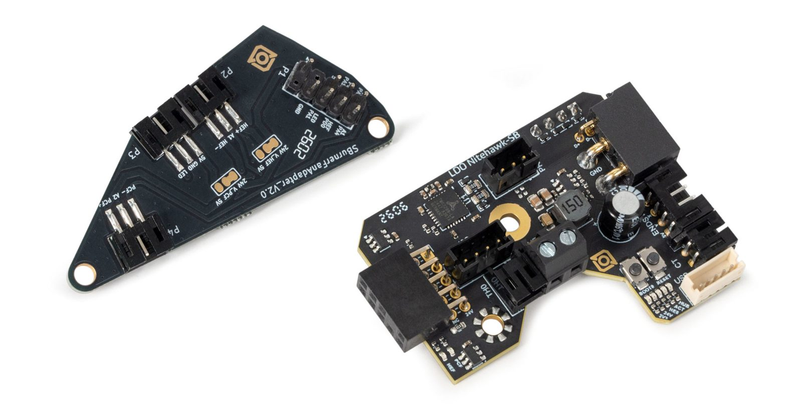

**What you're looking at:** The [Nitehawk-SB V2](16-glossary.md#n) toolboard is the larger board on the right of this photo; the small triangular board beside it is the Stealthburner Fan Adapter, which you fit at Step 08.44. The two mate through a keyed board-to-board header when the orange body closes at Step 08.62. The printed spacer sets the standoff so nothing on the board's underside is pressed against plastic.

**Parts:** Nitehawk-SB V2 ×1, CW2 PCB Spacer ×1 (supplied printed), M3×8 SHCS ×2.

**Do:** Sit the PCB spacer against the side of the CW2, then the toolboard on top of it, and fix with two M3×8 SHCS into the inserts you fitted in 08.3–08.4. As the board goes on, trap the **supplied short ground cable's ring lug under the head of the lower of the two M3×8** — LDO's `toolboard_ground_routing.jpg` (Step 08.53) shows it there, at the board's bottom corner nearest the motor `(verify on bench — the photo, not LDO's prose, is the source)`. Its motor end waits for Step 08.53. Handle the board by its edges. Do not force a screw — if a screw will not start, an insert is cocked.

**Check:** The board is parallel to the CW2 side with the spacer taking up the gap; no component is pressed against plastic; the 10-pin board-to-board header faces forward, towards where the SB body will go. The ground lug is under a screw head, not just resting on one, and its tail hangs free.

Source: [LDO wiring guide § Wiring the Toolhead PCB](https://docs.ldomotors.com/en/voron/voron2/wiring_guide_rev_d#wiring-the-toolhead-pcb)

---

### Step 08.44 — Mount the fan adapter PCB on the back of the 5015

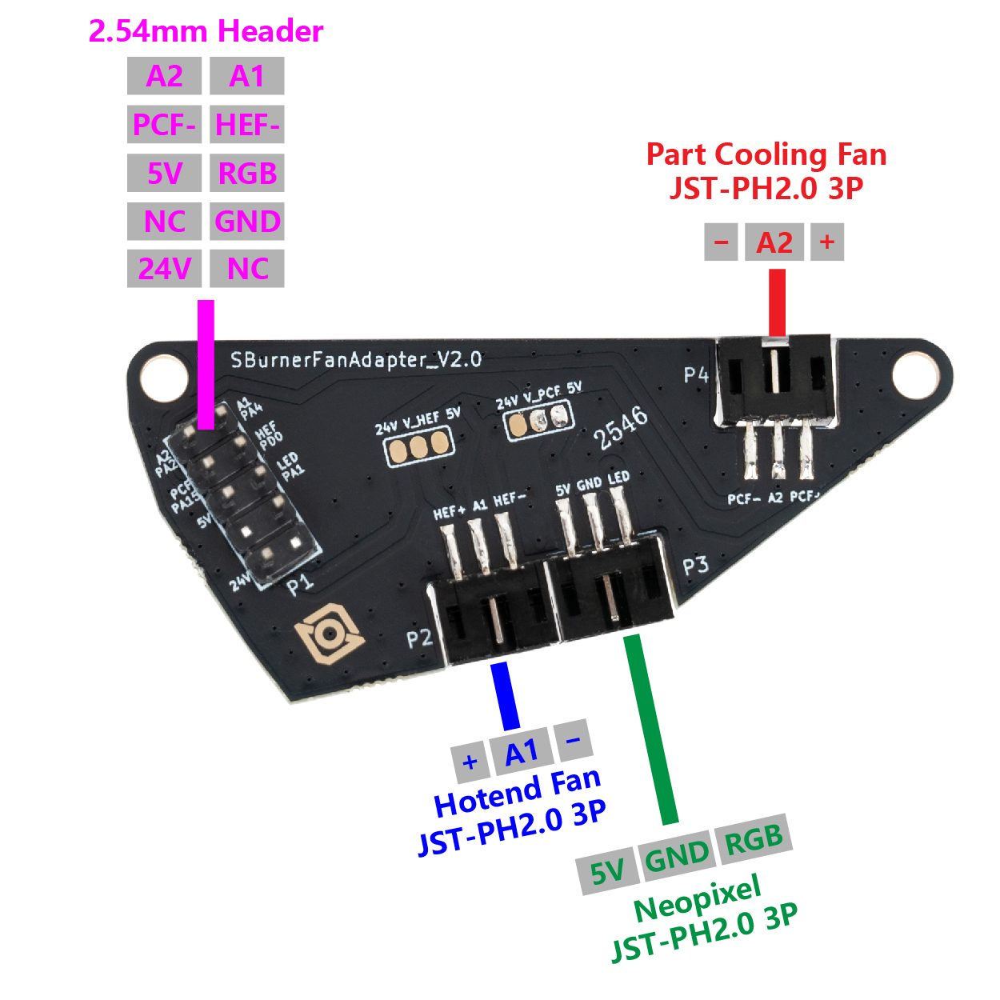

**What you're looking at:** The fan adapter is the little PCB that collects both fans and the LED chain on the *body* side and hands them to the toolboard through a single board-to-board header — so the orange body can be lifted off with three plugs still made up, instead of six loose wires. It bolts to the back of the 5015.

**Parts:** Stealthburner Fan Adapter PCB (SBurnerFanAdapter_V2.0) ×1, M3×10 FHCS ×2.

**Do:** The adapter mounts to the **rear of the Stealthburner main body, directly onto the back of the 5015 fan**, with two M3×10 FHCS through the PCB's two end holes. Which fan holes those share with the two M3×6 FHCS from Step 08.42, and whether those M3×6 come back out to be replaced by the longer screw, LDO does not draw — `(verify on bench; no LDO photo of the mounted adapter has been found)`.

**Check:** Board flat against the fan; its P1 header points at the toolboard's header when the body is offered up.

Source: [SB V2 fan adapter pinout](https://github.com/MotorDynamicsLab/Nitehawk-SB-V2/blob/master/Images/sbv2_fan_adapter_pcb_pinout.jpg)

---

### Step 08.45 — Check the fan-voltage solder jumpers before anything is powered

**What you're looking at:** The two three-pad groups are **solder jumpers**: whichever outer pad is joined to the middle pad chooses 24 V or 5 V for that fan port. From the factory that join is a hair-thin PCB trace between `24V` and the middle pad — LDO's own photo shows it — not a solder blob; only a 5 V conversion cuts that trace and bridges the other side with solder. Both fans in this kit are 24 V and 24 V is the factory default, so this is a verification and never a modification — a 5 V fan on a 24 V port dies instantly, and the mistake is unrecoverable.

**Parts:** fan adapter PCB, magnifier.

**Do:** The adapter carries two three-pad selectors silkscreened `24V  V_HEF  5V` and `24V  V_PCF  5V`. Each selects the supply for that fan port. Both of your fans are **24 V** (a 24 V 4010 axial and a 24 V 5015 centrifugal per the Rev D 350 BOM), so both selectors must be on the **24 V** side. LDO's procedure for a 5 V fan is *"cut the trace between 24V and HEF, solder a bridge between HEF and 5V"* — you are doing neither. Do not cut anything.

**Check:** Both selectors continuous from the middle pad to the `24V` pad, open to the `5V` pad — by meter, since the factory trace is too thin to see without the magnifier. No solder blob anywhere means the default is intact, not that the selector is unset. `(verify on bench — factory default is 24 V)`

Source: [SB V2 fan adapter pinout](https://github.com/MotorDynamicsLab/Nitehawk-SB-V2/blob/master/Images/sbv2_fan_adapter_pcb_pinout.jpg)

---

### Step 08.46 — Plug the fans and the LED chain into the adapter

**What you're looking at:** Three JST-PH2.0 3-pin plugs, one per port; the middle pin on each fan port is the tacho line that lets Klipper report the fan's real RPM. The classic error is swapping P2 and P4 — both fans then run, but the machine cools the hotend when it means to cool the print.

**Parts:** hotend fan lead, 5015 lead, LED chain lead.

**Do:** Three JST-PH2.0 3-pin plugs, one per port:

| Port | What plugs in | Pinout, silkscreen order |
|---|---|---|
| **P2** | 4010 axial **hotend fan** | `+` / `A1` (tacho) / `−` |
| **P3** | **Neopixel** LED chain | `5V` / `GND` / `RGB` |
| **P4** | 5015 **part cooling** blower | `−` / `A2` (tacho) / `+` |

If you ever re-crimp a fan lead, take the polarity from the silkscreen next to the port, not from the fan's wire colours.

**Check:** All three plugs fully home, latch engaged, no wire in tension. P2 goes to the axial, P4 to the blower — swapping them is the classic error.

⚠ Source conflict — wire by function, fix in software: LDO's board graphic `nhsbv2_pcb_pinout.jpg` labels the Fan/RGB header `PA15 → HEF` and `PD0 → PCF`. The fan adapter's own silkscreen and the Rev D+ Klipper config say the opposite — the config drives `[fan]` (part cooling) on `nhk:PA15` with tacho `nhk:PD2`, and `[heater_fan hotend_fan]` on `nhk:PD0` with tacho `nhk:PD1`, and the adapter silk reads `PCF PA15` / `HEF PD0`. Two of the three sources agree, so wire the fans by **port function** (P2 axial, P4 blower) as above and leave it. If Ch 13's *Verify Fans* shows the wrong fan spinning, swap the `pin:` values between `[fan]` and `[heater_fan hotend_fan]` in `printer.cfg` — **do not re-crimp connectors**. [src](https://github.com/MotorDynamicsLab/LDOVoron2/blob/main/Firmware/leviathan-printer-rev-d-sbv2.cfg)

Source: [SB V2 fan adapter pinout](https://github.com/MotorDynamicsLab/Nitehawk-SB-V2/blob/master/Images/sbv2_fan_adapter_pcb_pinout.jpg)

Pause: ~20 min since the last pause — the Nitehawk-SB V2 and the fan adapter are mounted, both fan-voltage selectors are verified at 24 V, and the three PH2.0 fan and LED plugs are in. Do not mate the board-to-board header yet — that happens with the Stealthburner body at Step 08.62 — and do not cut or bridge a voltage-selector pad.

---

### Step 08.47 — Hotend heater into the screw terminal

**What you're looking at:** `HE0` is the heater output — by far the highest-current thing on this board, which is why it is a screw terminal and not a plug. A cartridge heater is a plain resistor, so polarity is irrelevant; what matters is that no stray strand escapes the ferrule and bridges the two terminals.

**Parts:** Revo heater leads with E0508 ferrules (from 08.33).

**Do:** Land the two ferruled heater leads in the `HE0` screw terminal. **Polarity does not matter** on a resistive heater. Tighten firmly with the 2.5 mm slot-head driver and tug-test each lead.

**Check:** No copper visible outside the ferrule; neither lead pulls out; the two terminals cannot touch.

Source: [Nitehawk-SB V2 pinout](https://github.com/MotorDynamicsLab/Nitehawk-SB-V2/blob/master/Images/nhsbv2_pcb_pinout.jpg)

---

### Step 08.48 — Hotend thermistor into TH0

**What you're looking at:** `TH0` reads the hotend thermistor — an NTC resistor whose resistance **falls** as it heats. Klipper computes temperature from that resistance, so an open lead looks like a hotend that never warms and a shorted one like a hotend on fire. That is why the ~100 kΩ is worth measuring before the plug goes in.

**Parts:** thermistor lead with JST-PH2.0 2-pin plug.

**Do:** First measure resistance across the thermistor pigtail: a Semitec 104NT-4-R025H42G reads about **100 kΩ at 25 °C**; anything near 0 Ω or open is a broken lead. Then plug it into `TH0` — a **2-pin JST-PH2.0** immediately left of the heater terminal, signal on `PB12`. It is not polarised electrically, but the housing only goes one way.

**Check:** Housing fully seated, and the ~100 kΩ reading was taken before it went in. `(verify on bench)`

Source: [Nitehawk-SB V2 pinout](https://github.com/MotorDynamicsLab/Nitehawk-SB-V2/blob/master/Images/nhsbv2_pcb_pinout.jpg)

---

### Step 08.49 — Extruder motor into E MOTOR

**What you're looking at:** `E MOTOR` is the only [JST-XH2.5](16-glossary.md#j) connector left on this board, and it is on the **reverse** side. A stepper is a pair of coils: plugging or unplugging one on a live board dumps their stored energy straight back into the driver and kills it.

**Parts:** pancake stepper lead.

**Do:** The `E MOTOR` port is a **JST-XH2.5 4-pin on the reverse side of the board**, pin order `B02 B01 A1 A2`. Plug the stepper in. This one connector did **not** change to PH2.0.

**Check:** Plug fully home in the rear header. Never plug or unplug a stepper with the printer powered — back-EMF kills drivers.

Source: [Nitehawk-SB V2 pinout](https://github.com/MotorDynamicsLab/Nitehawk-SB-V2/blob/master/Images/nhsbv2_pcb_pinout.jpg)

---

### Step 08.50 — Probe into PROBE

**What you're looking at:** `PROBE` is the 3-pin port for the [inductive probe](16-glossary.md#i) you fitted in Ch 07 — the sensor the machine uses for [QGL](16-glossary.md#q) and the bed mesh. Its third pin carries a live **24 V**, which is why any probe expecting 5 V there has to have that pin left out of the housing.

**Parts:** Omron inductive probe lead (pre-terminated, from the Toolhead PCB Cables bag).

**Do:** Plug the probe into `PROBE` — **JST-PH2.0 3-pin**, `GND / SIG (PC15) / 24V`. The kit's Z probe ships in the toolhead cable bag already terminated for this port.

**Check:** Plug seated, and you can trace GND / SIG / 24V against the silkscreen.

⚠ Rev D+ / LDO: the third pin is a live **24 V** feed. If you ever fit a Klicky here, its 24 V pin must be left unpopulated; if you fit a TAP-style board, confirm it is 24 V-tolerant first. [src](https://docs.ldomotors.com/en/voron/voron2/wiring_guide_rev_d#wiring-the-toolhead-pcb)

Source: [Nitehawk-SB V2 pinout](https://github.com/MotorDynamicsLab/Nitehawk-SB-V2/blob/master/Images/nhsbv2_pcb_pinout.jpg)

---

### Step 08.51 — Chamber thermistor into CT, then close the LDO cable cover

**What you're looking at:** `CT` takes the chamber thermistor, which measures the air inside the enclosure rather than any heater. LDO's printed cover does two jobs: it closes the board, and it holds that thermistor's bead out in the chamber air away from the hotend, so it reads the chamber and not the toolhead's own waste heat.

**Parts:** `cw2_captive_pcb_cover.stl` ×1, M3×6 captive screw ×1, chamber thermistor lead.

**Do:** Plug the external chamber thermistor into `CT` — **JST-PH2.0 2-pin**, signal on `PB2`. Then fit LDO's `cw2_captive_pcb_cover` over the board: it carries the holder that positions the chamber thermistor outside the toolhead, and it closes with a single **M3×6 captive screw**. Open the filament latch first if the bolt pocket is obscured.

**Check:** Cover closed with the captive screw, thermistor bead sitting in its external holder and not touching plastic or the hotend.

⚠ Rev D+ / LDO: this cover replaces the stock `Clockwork2/cable_door.stl` from SB p.33–34. That part is on the "deliberately not printed" list for this build. [src](https://docs.ldomotors.com/en/voron/voron2/wiring_guide_rev_d#wiring-the-toolhead-pcb)

Source: [Nitehawk-SB V2 pinout](https://github.com/MotorDynamicsLab/Nitehawk-SB-V2/blob/master/Images/nhsbv2_pcb_pinout.jpg) · [Video: Part 5 @3:41:55](https://www.youtube.com/watch?v=hTKCBrk36R0&list=PL0fUJbigELQPqpeGOgHYisG4KaSXVtnNY&t=13315s) (differs: no toolboard — loom to the mainboard; this kit runs a Nitehawk-SB V2 on one USB+24 V umbilical)

---

### Step 08.52 — Account for the ports you are not using

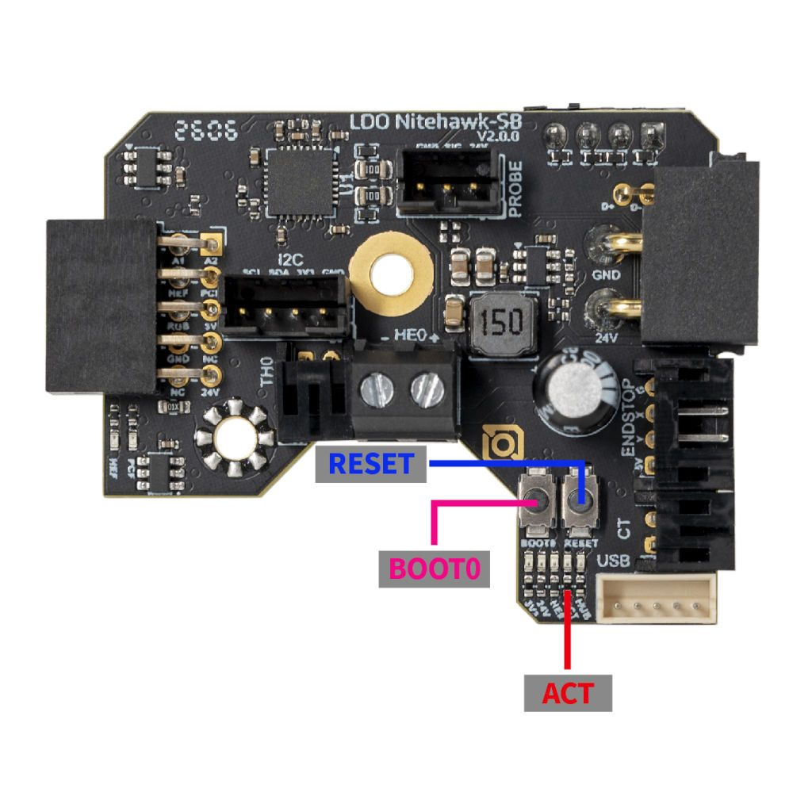

**What you're looking at:** An audit of what stays empty. `XY ENDSTOP` is unused because this kit's XY switch PCB wires back to the mainboard, not to the toolhead. The **USB expansion** header and the `BOOT0` / `RESET` buttons must stay reachable: the buttons put the board into firmware-flashing mode in Ch 12, and that spare USB port is the whole reason this kit is called Rev D**+**. The diagram's toolhead half shows every Nitehawk-SB V2 port with its connector type and pin, including the empty `XY ENDSTOP` and `I2C` headers this table lists.

**Parts:** none.

**Do:** Walk the board once and confirm what stays empty:

| Port | Type | Status in this build |
|---|---|---|
| `XY ENDSTOP` | JST-PH2.0 4P — `GND / X (PB0) / Y (PB1) / 5V` | **Unused.** The XY endstop PCB wires to the Leviathan, not the toolhead |
| `I2C` | JST-PH2.0 4P — `SCL (PB3) / SDA (PB4) / 3V3 / GND` | **Unused** |
| `USB` expansion | JST-ZH1.5 5P — `GND / GND / D+ / D− / 5V` | **Unused now.** This is the "+" in Rev D+; leave it physically reachable |
| `BOOT` / `RESET` buttons | tactile, beside the USB header | Leave clear — Ch 12 flashing may need them |

**Check:** Nothing plugged into `XY ENDSTOP` or `I2C`. The USB expansion header and both buttons are not buried under a cable bundle.

⚠ Rev D+ / LDO: leave enough umbilical slack that the secondary USB port stays reachable without pulling the toolhead off. A future eddy-current probe or nozzle camera plugs in there, and that port is the entire reason this kit is "Rev D+". [src](https://www.fabreeko.com/products/ldo-voron-v2-4-kit)

Source: [Nitehawk-SB V2 pinout](https://github.com/MotorDynamicsLab/Nitehawk-SB-V2/blob/master/Images/nhsbv2_pcb_pinout.jpg)

---

### Step 08.53 — Land the ground wire's motor end on the extruder motor

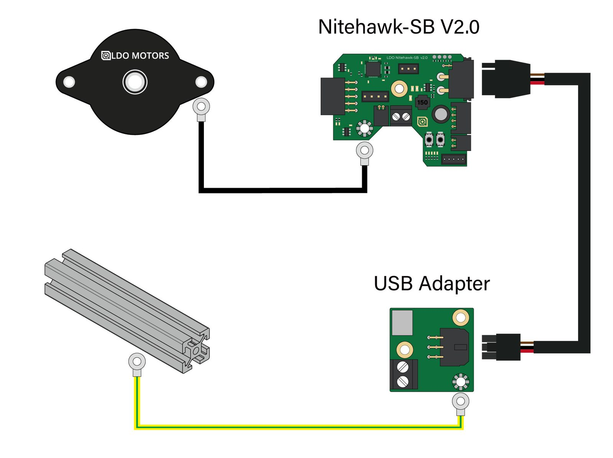

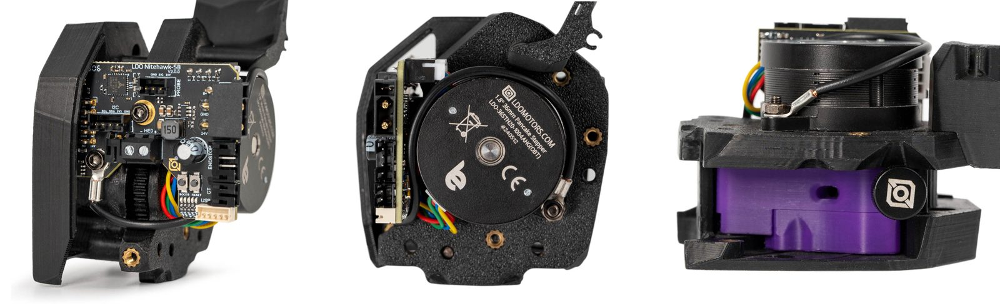

**What you're looking at:** One short ring-lugged wire, and the reason it exists is static. LDO's ESD scheme makes one continuous path — extruder motor body → toolboard ground → umbilical → USB adapter → frame → earth — so a discharge has somewhere to go other than through the microcontroller. Use the **supplied** cable: LDO warns that a larger ring lug can short against the PCB. Its board end went under a toolboard screw at Step 08.43; this step lands the motor end.

**Parts:** the **supplied** short grounding cable (board end already under a toolboard M3×8 from Step 08.43), short M3 screw for the motor end `(verify on bench — supplied with the cable; length not published)`.

**Do:** LDO's "ESD Hardening" section documents this as one continuous discharge path — *extruder motor
body → toolboard ground → umbilical → USB adapter → frame → earth*. Land the motor-end ring lug on a short screw into one of
the NEMA14's two **free face holes** — the two the motor bolts of 08.22–08.23 do not use; LDO's routing photo uses the
lower one nearest the chain anchor — and bend the lug at an angle so it clears the anchor (photo, right). Snug only:
the screw goes into the motor's own threaded face. The frame-side leg of the same path (USB adapter's exposed mounting
point → frame) is fitted in Ch 09/10, Step 10.58. [src](https://docs.ldomotors.com/en/Toolboard/nitehawk-sb-v2#esd-hardening)

**Check:** Continuity from the toolboard `GND` pad to the motor can; both lugs are under a screw head; the wire cannot reach any moving part.

**Boundary:** this step is the source of record for the ESD grounding scheme. Ch 10 Step 10.58 fits the frame-side leg and re-checks the path; if LDO changes the procedure, correct it here first and make Ch 10 point back.

⚠ Rev D+ / LDO: **use the supplied grounding cable** — LDO warns that larger ring-lug connectors can short
the PCB. **If your kit did not include the grounding cables**, stop and ask in `#ldo_motors` before
improvising a ground connection; this scheme was undocumented prose until LDO's board doc was updated
2026-07-10 (survey §4.1 ⑤).

Source: [`grounding_scheme.jpg`](https://github.com/MotorDynamicsLab/Nitehawk-SB-V2/blob/master/Images/grounding_scheme.jpg) · [`toolboard_ground_routing.jpg`](https://github.com/MotorDynamicsLab/Nitehawk-SB-V2/blob/master/Images/toolboard_ground_routing.jpg)

Pause: ~25 min since the last pause — every toolboard-side connector is made, the LDO cable cover is closed on its captive screw, and the ground wire runs from the toolboard to the motor body. Nothing is powered and nothing is on the carriage. Do not plug the umbilical's far end into anything and do not power the printer to "just check" — Checkpoint 08 and Ch 13 do that, in that order.

---

## F — Probe

### Step 08.54 — Confirm the probe decision and bag the Klicky set

(no image — decision step; the probe itself was fitted in Ch 07 Steps 07.34–07.37)

**What you're looking at:** A decision, not an operation. [Klicky](16-glossary.md#k) is a magnetically docked microswitch probe: the toolhead picks it up from a dock, probes with it, and puts it back. This build uses the [inductive probe](16-glossary.md#i) instead — already fitted in Ch 07, already terminated, and the one the kit's Klipper config is written for — while Z zero comes from the [nozzle probe](16-glossary.md#n) built in Ch 09 (Steps 09.27–09.29).

**Parts:** none — this is a decision step.

**Do:** Your kit contains **both** an Omron-style inductive probe and a full Klicky Probe Kit, and you printed the Klicky parts in B06-P2. **The inductive probe is the one to build, and Ch 07 Steps 07.34–07.37 already fitted it to the X carriage.** Three sources agree: LDO's wiring guide wires the inductive probe to `PROBE` as the default; the Rev D+ Klipper config's `[probe]` block is written for it (`pin: nhk:PC15`, `x_offset: 0`, `y_offset: 25.0`, comment *"This probe is not used for Z height, only Quad Gantry Leveling"*) and contains no Klicky attach/dock macros; and the probe ships **pre-terminated** in the Toolhead PCB Cables bag while Klicky needs a cable you make yourself. Z height comes from the LDO nozzle probe, not from either of these.

**Check:** The inductive probe is on the carriage from Ch 07 and the Klicky bag is closed.

> **Alternative — Klicky probe (do not build now)**
>
> Klicky is a supported mod, not a different wiring plan: it uses the same `PROBE` port with the **24 V pin left unpopulated**, and adds a magnetically docked probe plus the macros and dock-safety logic to drive it.
> - **Parts:** `KlickyProbe_v2` (print 2 — one is a spare), `KlickyProbe_AB_mount_v2` + `_holder`, `Probe_Dock_v2.1`, `Dock_mount_fixed_v2`, `Mount_*` and `Probe_*` magnet press-fit jigs.
> - **Magnets:** 6×3 mm N35 — 4 in the probe, 3 in the toolhead mount, 1 in the dock. Press them in with the printed helpers; a crooked magnet is a probe that does not repeat. Glue is optional insurance.
> - **Switch:** Omron D2F-5 or D2F-5L with the lever removed.
> - **Hardware:** 2× M3×8 SHCS (mount to the AB carriage), 2× M3×20 (dock), 2× M5×10 + T-nuts (dock to the rear gantry rail).
> - **Wiring:** signal and ground only — the magnets carry the switch circuit.
> - **Cost of switching later:** the dock, the macros and a fresh probe calibration. Nothing you build in this chapter has to be undone.
> - [src](https://github.com/jlas1/Klicky-Probe/tree/main/Printers/Voron/v1.8_v2.4_Legacy_Trident)
>
> If you later add the Decontaminator purge bucket you need `Dock_sidemount_fixed_v2` + `Dock_sidemount_left_v2` instead of `Dock_mount_fixed_v2` — reprint then, not now.

Source: decision step — see Ch 07 Steps 07.34–07.37 · [Video: More Extras! @0:30:00](https://www.youtube.com/watch?v=D_44fDp9xt8&list=PL0fUJbigELQPqpeGOgHYisG4KaSXVtnNY&t=1800s)

---

### Step 08.55 — Confirm the inductive probe fitted in Ch 07

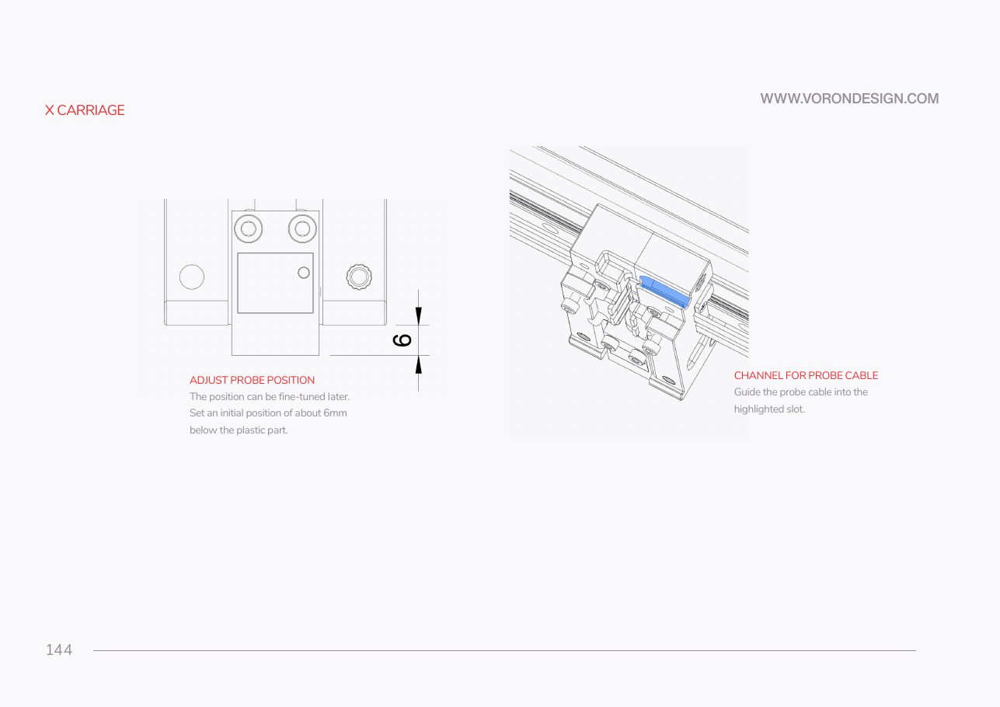

**What you're looking at:** A confirmation pass over Ch 07's work rather than new assembly. The thing most worth re-checking is the tape: over-taping, especially anywhere near the bottom sensing face, is the usual reason an inductive probe will not trigger in Ch 13 — and it is easy to blame the board instead.

**Parts:** none — confirmation only.

**Do:** The probe was insulated, seated in `probe_retainer_bracket`, set to ~6 mm below the plastic and its lead trimmed to ~150 mm in **Ch 07 Steps 07.34–07.37**; nothing more happens to it here. Confirm the two M3×30 SHCS are tight, the fibreglass tape is intact, and the lead is lying in the carriage's moulded channel ready for Ch 10.

**Check:** The probe does not move under firm finger pressure, sits 6 mm ±1 mm below the plastic, is taped on the **front and sides only** with the back and bottom bare, and its lead is captive in the channel.

⚠ Rev D+ / LDO: if the tape is torn, re-wrap front and sides only — never the back or the bottom sensing face. Over-taping is the usual cause of a probe that will not trigger in Ch 13; remove a strip at a time before you suspect the board. [src](https://docs.ldomotors.com/voron/voron2/build-faq)

Source: [Voron manual p.144](https://github.com/VoronDesign/Voron-2/blob/de7e89d/Manual/Assembly_Manual_2.4r2.pdf#page=144)

---

### Step 08.56 — The LDO nozzle probe is built in Ch 09 — not here

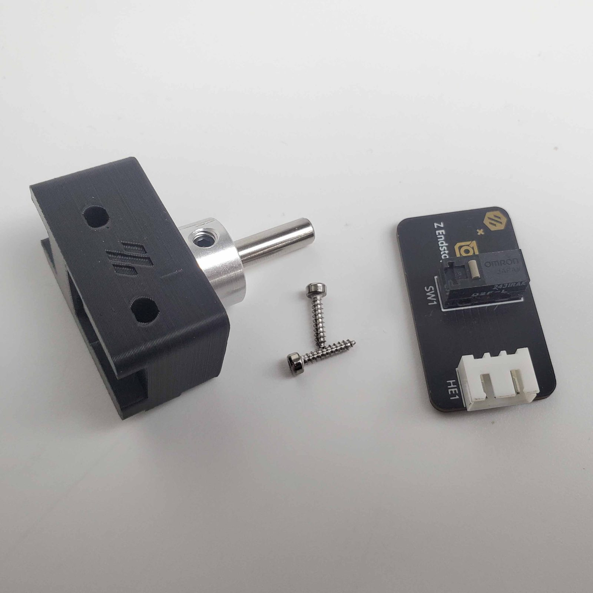

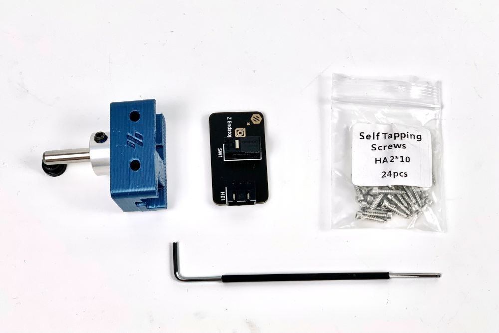

**What you're looking at:** The LDO [nozzle probe](16-glossary.md#n) is this kit's **Z endstop**, and it works differently from a bed probe: it is a sprung shaft on a microswitch, mounted on the *frame*, that the nozzle itself is driven down onto. That makes Z zero a measurement of the real nozzle tip, so changing a nozzle does not invalidate it. It is a frame part, not a toolhead part, so it is built once, at its mounting location, in **Ch 09 Steps 09.27–09.29** and bolted on at Step 09.30.

**Parts:** none here — the printed body (LDO-supplied, collar pre-pressed), the Z Endstop PCB, the shaft, two M2×10 self-tapping screws and the set screw are counted in Ch 09's hardware table.

**Do:** Nothing. Leave the nozzle-probe bag closed and labelled for Ch 09. Its cable lands on the Leviathan's `Z-ENDSTOP`, never on the toolboard, so there is no toolhead-side work on it at all.

**Check:** The nozzle-probe bag is still sealed and labelled for Ch 09.

**Boundary:** Ch 09 Steps 09.27–09.29 own the assembly and Step 09.30 the mounting (**2× M3×25 SHCS** into the bed extrusion's side slot); Ch 10 lands the cable. If LDO changes the assembly, correct Ch 09 and keep this pointer.

⚠ Rev D+ / LDO: LDO's nozzle probe replaces the official Voron endstop and uses LDO's own printed part — `nozzle_probe.stl` and `nozzle_probe_ldo.stl` are both on the do-not-print list because the part is supplied. [src](https://docs.ldomotors.com/en/voron/voron2/printed_part_guide_rev_d)

Source: [LDO wiring guide § Assembling the Nozzle Probe](https://docs.ldomotors.com/en/voron/voron2/wiring_guide_rev_d)

Pause: ~10 min since the last pause — the probe decision is recorded, the inductive probe is confirmed on the carriage from Ch 07, and the nozzle-probe bag is still closed for Ch 09. The Klicky bag stays closed. Do not open either bag to "get ahead": the nozzle probe is built at its mounting location in Ch 09.

---

## G — Mounting the toolhead

### Step 08.57 — Read the handoff page and get help for the lift

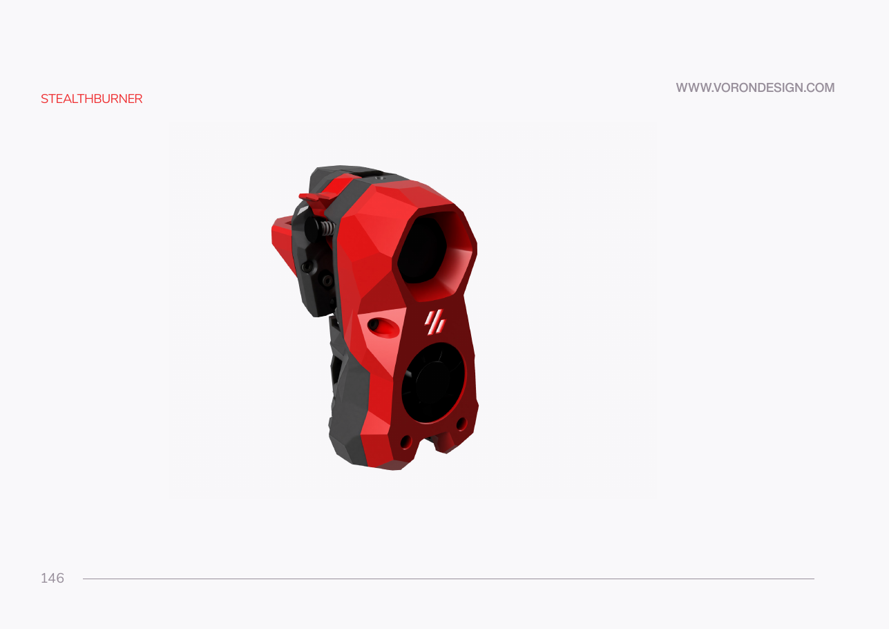

**What you're looking at:** The hand-off page. Everything from Step 08.1 to here came out of the Stealthburner manual, because the printer manual carries no toolhead content of its own — p.146 points you there and p.147 expects you back.

**Parts:** none.

**Do:** Manual p.146–147 is where the printer manual hands you to the Stealthburner manual and expects you back. You are back. From here the assembled toolhead goes onto a gantry that is already belted, so support the carriage with one hand while you work — do not let the toolhead's weight hang on a half-started bolt.

**Check:** Gantry parked mid-travel, carriage accessible from front and both sides, nothing else on the bed to drop a screwdriver onto.

⚠ Rev D+ / LDO: LDO's Build Notes mark p.146–147 as "Stealthburner + CW2 per the SB manual" — the printer manual contains no toolhead steps at all, only this pointer. Everything from Step 08.1 to here came from the Stealthburner manual and LDO's own guides, which is why this chapter is written out rather than transcribed. [src](https://docs.ldomotors.com/voron/voron2/build-faq)

Source: [Voron manual p.146](https://github.com/VoronDesign/Voron-2/blob/de7e89d/Manual/Assembly_Manual_2.4r2.pdf#page=146)

---

### Step 08.58 — Hang the Clockwork 2 on the carriage, first bolt

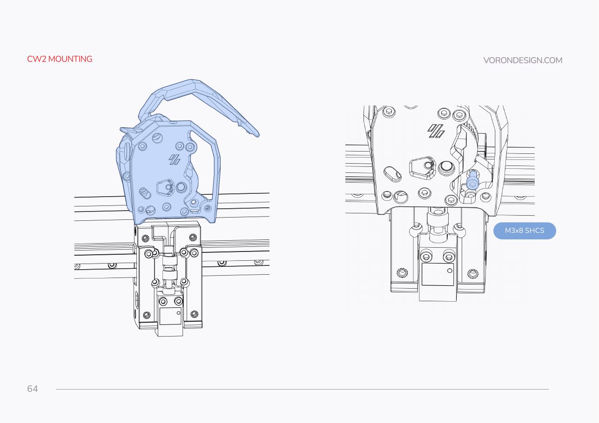

**What you're looking at:** The extruder hooks onto the X carriage and hangs from it, held by two M3×8. Until the first one is snug the carriage is taking the weight through your hand, and a toolhead let go on a half-started bolt lands on the bed.

**Parts:** CW2 assembly (with toolboard fitted), M3×8 SHCS ×1.

**Do:** Offer the CW2 up to the X carriage so its hooks engage the carriage and the extruder hangs plumb. Start one M3×8 SHCS in the accessible position and take it to snug.

**Check:** The extruder is supported by the carriage, not by your hand, and it is not rotated.

Source: [SB manual p.64](https://github.com/VoronDesign/Voron-Stealthburner/blob/1bccf0543f40741243d81505c4ad5406eb822715/Manual/Assembly_Manual_SB.pdf#page=64)

---

### Step 08.59 — Second CW2 bolt, through the front access hole

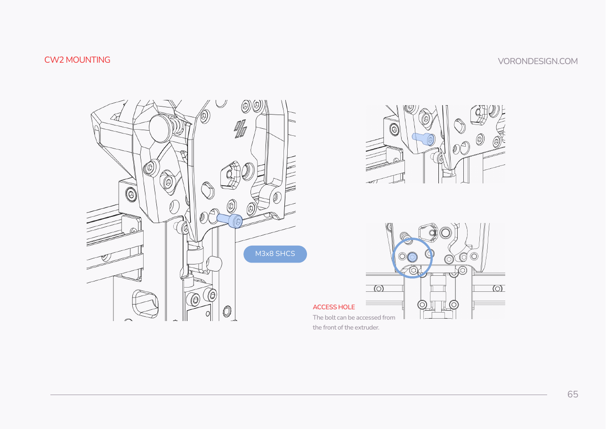

**What you're looking at:** The second bolt again comes from the front, through the access hole. With both in, extruder and carriage are one rigid body — which is what stops the toolhead rotating under belt acceleration and printing a smeared corner.

**Parts:** M3×8 SHCS ×1.

**Do:** The second bolt is reached from the **front** of the extruder through the access hole. Drive it, then tighten both to snug.

**Check:** Push and pull the extruder — no movement relative to the carriage. Both bolts tight.

Source: [SB manual p.65](https://github.com/VoronDesign/Voron-Stealthburner/blob/1bccf0543f40741243d81505c4ad5406eb822715/Manual/Assembly_Manual_SB.pdf#page=65)

---

### Step 08.60 — Plug in the toolhead cable

**What you're looking at:** The [umbilical](16-glossary.md#u) is the single cable carrying USB data and 24 V to the toolhead, on an XT30(2+2) connector — two large power pins and two small signal pins in one shell. LDO's guide holds this connection until the extruder is on the carriage, because the connector sits behind the board.

**Parts:** toolhead cable (combined USB + 24 V), XT30(2+2).

**Do:** Now that the extruder is on the carriage, plug the toolhead cable into its **XT30(2+2)** connector — `D+ / D− / GND / 24V`. The wiring guide explicitly says to leave this until after the CW2 is mounted, because the connector is behind the board. Do not plug the other end into anything yet; the USB adapter is wired in Ch 10.

**Check:** Connector fully home and audibly seated. The free end is coiled and labelled, not dangling into the bed area.

Source: [Nitehawk-SB V2 pinout](https://github.com/MotorDynamicsLab/Nitehawk-SB-V2/blob/master/Images/nhsbv2_pcb_pinout.jpg)

---

### Step 08.61 — Slide the tool cartridge into place

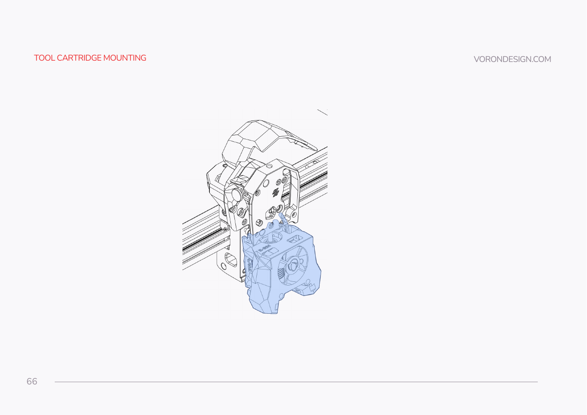

**What you're looking at:** The tool cartridge slides up from below and its four stud heads drop into keyholes in the Clockwork 2 — that is what makes the hotend a swappable unit rather than something bolted in. As it rises, the PTFE picks up the extruder's filament path.

**Parts:** tool cartridge from 08.32 (hotend, PTFE, four M3×8 studs).

**Do:** Lift the tool cartridge up into the toolhead from below so its four M3×8 bolt heads engage the CW2's keyholes, then let it settle. Feed the hotend's heater and thermistor leads up past the extruder as it goes.

**Check:** The cartridge hangs squarely with the nozzle centred, and it cannot drop out. The PTFE has picked up the extruder's filament path.

Source: [SB manual p.66](https://github.com/VoronDesign/Voron-Stealthburner/blob/1bccf0543f40741243d81505c4ad5406eb822715/Manual/Assembly_Manual_SB.pdf#page=66)

---

### Step 08.62 — Fit the Stealthburner body and mate the board-to-board header

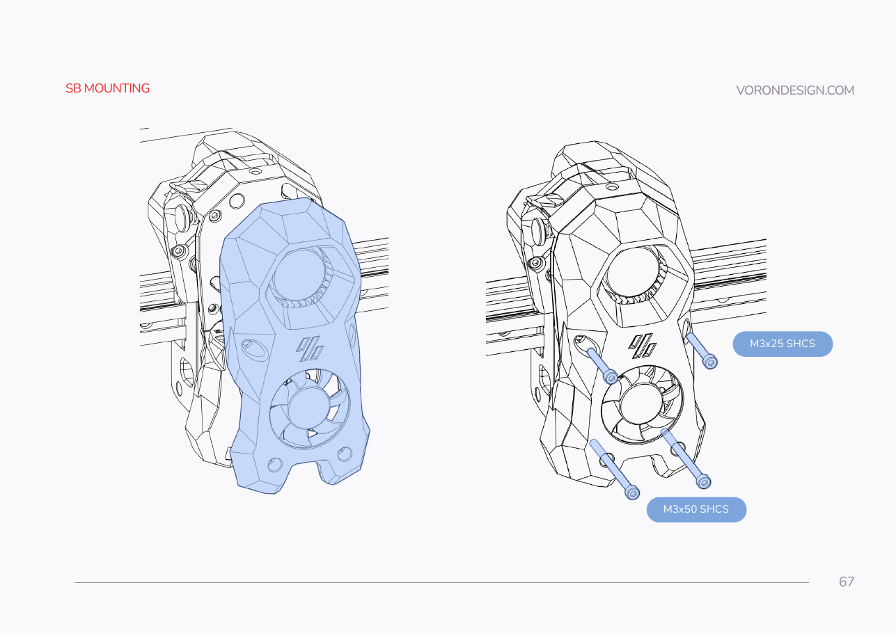

**What you're looking at:** The last mechanical act: the orange body closes onto the front of the toolhead and, as it does, the fan adapter's header mates with the toolboard's. That header is keyed **and** its gender was reversed from V1, so every older photo of this joint is wrong for this board — resistance means it is backwards, never that it needs more force. The diagram's keyed-header panel shows the same 2×5 header and row order, at the point where the board-to-board joint is actually mated.

**Parts:** `[a]_stealthburner_main_body` with LEDs, both fans and the fan adapter, M3×25 SHCS ×2, M3×50 SHCS ×2.

**Do:** Bring the orange body onto the front of the toolhead. As it closes, the fan adapter's header must mate with the toolboard's header. **It is keyed: if it does not drop in, it is the wrong way round — do not press harder.** With the header seated and the body sitting flush, fit **two M3×25 SHCS** in the upper pair of holes and **two M3×50 SHCS** in the lower pair, through the blower area.

**Check:** No gap anywhere along the body-to-cartridge parting line. All four bolts snug. The header is fully seated — a partly seated header is the single most common cause of dead toolhead fans and LEDs.

⚠ Rev D+ / LDO: LDO's Rev D guide calls this a "2×4 header". On the V2 board it is a **10-pin, 2×5** interface, and both the **gender and the keying changed** from V1, so every Rev D photo of this joint is wrong for your hardware. Row order on the toolboard side is tacho / tacho, the two fan drives, `RGB (PD3)` and 5 V, `GND` and NC, NC and 24 V — see Step 08.46 for the fan-pin source conflict. [src](https://github.com/MotorDynamicsLab/Nitehawk-SB-V2)

Source: [SB manual p.67](https://github.com/VoronDesign/Voron-Stealthburner/blob/1bccf0543f40741243d81505c4ad5406eb822715/Manual/Assembly_Manual_SB.pdf#page=67) · [Video: Part 5 @3:12:08](https://www.youtube.com/watch?v=hTKCBrk36R0&list=PL0fUJbigELQPqpeGOgHYisG4KaSXVtnNY&t=11528s) (differs: builds Afterburner + Clockwork 1; this kit is Stealthburner + Clockwork 2 + Revo HF · no toolboard — loom to the mainboard; this kit runs a Nitehawk-SB V2 on one USB+24 V umbilical)

---

### Step 08.63 — Park the umbilical on the chain anchor — chain ties are Ch 10

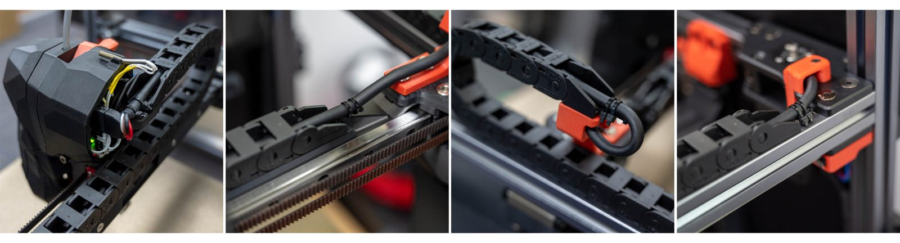

**What you're looking at:** A **service loop** is deliberate slack: enough spare cable between the anchor and the chain that the umbilical is never in tension at either end of X travel. Wires held taut inside a moving drag chain work-harden and break — usually months later, always inside the sheath where you cannot see it. The X drag chain is not on the machine yet — Ch 10 Step 10.59 fits it and Step 10.66 ties every chain end — so here the cable only gets parked.

**Parts:** toolhead cable, zip tie 3×150 mm ×1 (left loose).

**Do:** Lay the toolhead cable back over the chain anchor you fitted in 08.25 and put **one loose zip tie** through the anchor's tab — loose enough that the cable still slides, so Ch 10 can set the final slack. Coil the free end and label it. The service loop and the chain-link ties are **Ch 10 Steps 10.59 and 10.66**, once the X chain exists.

**Check:** The cable leaves the toolhead over the anchor, not over a fan or a belt; the coil hangs clear of the bed; nothing pulls on the XT30 connector.

⚠ Rev D+ / LDO: taut wires inside a drag chain fatigue and break — it is LDO's most repeated warning, and manual p.194–195 says the same. The cable must be **pulled through the chain before the chain ends are mounted** in Ch 10; doing it after means taking the chain apart (survey §5.2 W7).

Source: [`cable_chain_ties.jpg`](https://github.com/MotorDynamicsLab/Nitehawk-SB-V2/blob/master/Images/cable_chain_ties.jpg)

---

### Step 08.64 — Set the USB adapter aside with the right cover

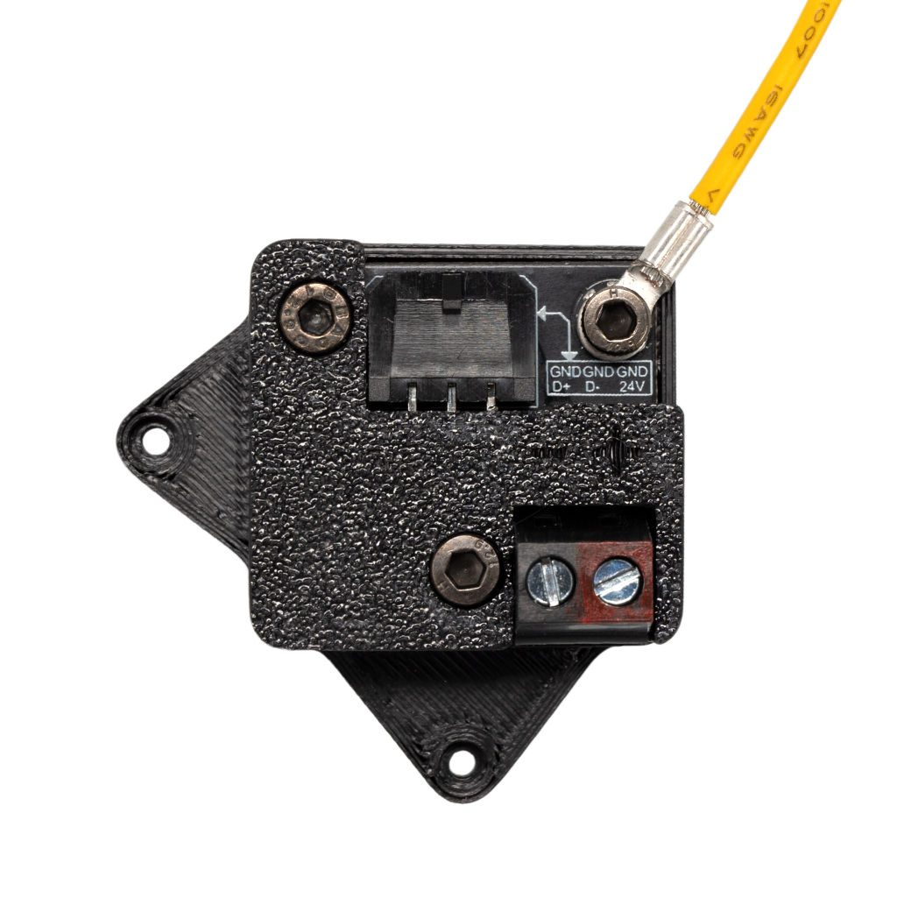

**What you're looking at:** The [USB adapter PCB](16-glossary.md#u) is the frame-side end of the umbilical: 24 V goes in, and the toolhead cable comes out as a plain USB connection to the Pi. The V2 **partial** cover deliberately leaves one mounting screw exposed so a ring lug can be bolted to it — that exposed screw is the frame end of the grounding path from Step 08.53.

**Parts:** USB Adapter PCB ×1, NH Adapter Mount base (supplied printed) ×1, `usb_adapter_mount_partial_cover.stl` (**Nitehawk-SB-V2 repo**) ×1, M3×10 SHCS ×3.

**Do:** Stack the USB adapter into its supplied mount base and close it with the **V2 partial cover**, not the full cover from the V1 `usb_adapter_mount.stl`. The V2 cover deliberately leaves one mounting point exposed so a ring lug can be bolted there — that is the frame-side leg of the grounding scheme in Step 08.53. Bag the assembly for Ch 09.

**Check:** One mounting screw head is exposed and reachable through the cover. The board's `24V IN` terminal and its Micro-Fit 3.0 socket (the 4-pin umbilical socket) are both accessible.

⚠ Rev D+ / LDO: the Nitehawk-SB-V2 repo's `STLs/` folder contains exactly one file, `usb_adapter_mount_partial_cover.stl`, and it is the cover this kit needs (print plan §0, correction #1). B07 also prints the V1 `Nitehawk-SB/STLs/usb_adapter_mount.stl` — for a spare **base** only. [src](https://github.com/MotorDynamicsLab/Nitehawk-SB-V2/tree/master/STLs)

Source: [`usb_adapter_gnd.jpg`](https://github.com/MotorDynamicsLab/Nitehawk-SB-V2/blob/master/Images/usb_adapter_gnd.jpg)

---

### Step 08.65 — Return to the printer manual

**What you're looking at:** The return page. The toolhead is mechanically complete and every connector on the toolhead side is made; everything below the deck — the USB adapter, the 24 V feed, the Z endstop and the drag-chain runs — is Ch 09 and Ch 10.

**Parts:** none.

**Do:** Manual p.147 is the "return here to proceed" page. The toolhead is mechanically complete and every toolhead-side connector is made. Everything below the deck — the USB adapter, the 24 V feed, the Z endstop and the drag-chain runs — is Ch 09 and Ch 10.

**Check:** Nothing on the toolhead is loose, nothing is left unplugged that you meant to plug in, and the free end of the umbilical is coiled and labelled.

Source: [Voron manual p.147](https://github.com/VoronDesign/Voron-2/blob/de7e89d/Manual/Assembly_Manual_2.4r2.pdf#page=147)

Pause: ~35 min since the last pause — the toolhead is on the carriage, the body is on with the board-to-board header mated, the umbilical is parked on the chain anchor with one loose tie and its free end is coiled and labelled. This is the end of the hands-on work in this chapter. Do not apply power: Checkpoint 08 below is a cold bench test and it is the last cheap chance to find a toolhead fault.

---

## Checkpoint 08 — bench test before anything is powered

Do all of this with the printer **unplugged**. It is the last chance to find a toolhead fault cheaply; after Ch 10 the bay is closed and after Ch 13 a wiring error costs a component.

- [ ] **Heater resistance.** Across the two `HE0` ferrules: a low, stable, non-zero reading. A 60 W 24 V Revo HF cartridge is roughly **9.6 Ω** (24²/60); anything near 0 Ω is a short and anything open is a broken lead. `(verify against the value E3D prints on your cartridge)`
- [ ] **Heater isolation.** No continuity between either heater lead and the heatsink, the nozzle, the frame, or the toolboard `GND` pad.
- [ ] **Thermistor at room temperature.** Across the `TH0` pigtail: about **100 kΩ at 25 °C** for the Semitec 104NT-4-R025H42G. Warm the HeaterCore with your fingers and watch the resistance **fall** — an NTC that rises is the wrong part or a bad connection.
- [ ] **Probe.** Continuity from each `PROBE` pin to the matching probe wire; no continuity between `24V` and `GND`.
- [ ] **LED chain.** No short between 5 V and GND at the chain connector; continuity along the chain in the order logo → right → left.
- [ ] **Fan orientation, checked visually.** The hotend fan's moulded arrow points **into** the heatsink and its wires exit at the top. The 5015 discharges down into the ducts. Both impellers spin freely with a finger flick and no rub. Powered spin-up is confirmed in Ch 13 *Verify Fans*.
- [ ] **Fan-voltage jumpers.** `V_HEF` and `V_PCF` both on **24 V**, nothing cut, nothing bridged to 5 V.
- [ ] **Fan ports.** Axial on **P2**, blower on **P4**, LEDs on **P3**. If the wrong fan spins in Ch 13, fix it in the config, not by re-crimping — see *Common mistakes*.
- [ ] **Board-to-board header** fully seated, SB front snapped on with **no gap** at the parting line.
- [ ] **Mechanical.** Extruder shaft turns freely by hand; gear mesh has a faint play; tension arm swings; latch closes; filament runs from the CW2 inlet through the PTFE to the nozzle with no catch.
- [ ] **Probe height** still ~6 mm below the plastic and the insulation intact, front and sides only — set in Ch 07 Steps 07.34–07.37, re-checked at Step 08.55.
- [ ] **Cable discipline.** Run X to both extremes by hand — the parked umbilical never goes taut, nothing rubs a belt, nothing touches the nozzle. The secondary USB port is still reachable. (Chain slack and the chain ties are Ch 10 Steps 10.59 and 10.66.)
- [ ] The toolboard-to-motor ground wire (Steps 08.43 and 08.53) is fitted per LDO's ESD Hardening section, or — if the kit is missing the grounding cables — logged as an unanswered `#ldo_motors` question. Do not let Ch 10 close the bay with this unresolved.

---

## Common mistakes

- **Assembling before the insert pass.** A missed insert in the CW2 main body or motor plate means stripping the extruder back to bare plastic and re-melting brass into a part that already has a bearing and a gear train in it. Do Steps 08.3–08.7 first, every time.
- **Forcing a JST-PH2.0 plug into the wrong header.** The PH2.0 bodies on `PROBE`, `TH0`, `CT` and `XY ENDSTOP` are small and similar, and the Rev D guide's XH2.5 text sends people looking for the wrong connector. Read the silkscreen before every insertion.
- **Pressing the board-to-board header home when it will not go.** The V2 interface is keyed *and* gender-reversed against every Rev D photo. If it resists, it is backwards. Pressing harder bends pins and the damage is not visible once the body is on.
- **Overtightening the tension-arm or motor-plate bolts.** The tension arm's M3×25 is a hinge pin; torque it and the extruder cannot tension filament. The motor plate's M3×25 pair will crack the main body if you keep turning — the manual's own advice is to bin the part and reprint.
- **Skipping the strain-relief bend on the Revo.** If the strain relief is not bent clear, the nozzle cannot be fully hand-tightened into the heatsink, and you get a molten-plastic leak at the first hot print.
- **Building Klicky because the parts are on the bench.** They are printed as a future option. The kit's config, wiring guide and pre-terminated cable are all for the inductive probe; mixing the two costs you a probe recalibration and a set of macros you do not have yet.

---

## Next

**Ch 09 — Electronics bay.** DIN rails, the Leviathan and its voltage-selection jumpers, the Pi, and the USB adapter you bagged in Step 08.64 — including the frame-side leg of the grounding scheme.
