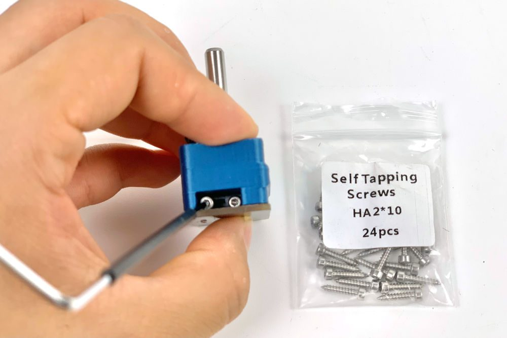

# Chapter 09 — Electronics bay

Fits out the space under the deck panel: two DIN rails and five wire ducts, the Meanwell 24 V PSU, the Omron SSR, the Leviathan mainboard carrying the Raspberry Pi 4B, the Nitehawk USB adapter, the mains inlet and WAGO blocks, and both endstops. Everything is mounted and nothing is wired — that unlocks Ch 10, which is one continuous harness job ending at Checkpoint #1.

**What you're building in this chapter.** The bay is the space under the deck panel, and this chapter fits it out without connecting a single wire. Two **DIN rails** — the standard 35 mm slotted steel rail that industrial gear clips onto — run left to right across the deck, and five slotted **wire ducts** loop around them to carry the harness Ch 10 will lay in. On the rear rail go the **PSU** (the Meanwell supply that turns mains into the 24 V everything runs on) and the **SSR** (a solid-state relay: the contactless electronic switch that lets a low-voltage board turn the mains bed heater on and off). On the front rail go the **Leviathan** — this kit's mainboard, driving all five steppers, both heaters, the fans and the endstops, with the Raspberry Pi bolted on top of it — and the **USB adapter** that terminates the toolhead umbilical. Round the rear frame go the **IEC inlet** module (socket, switch and fuse in one) and three **WAGO** lever connectors that distribute live, neutral and earth. Both endstops — the frame-mounted **nozzle probe** that sets Z zero and the **XY endstop PCB** in its pod on the gantry — are built and mounted here too.

**Left and right in this chapter** are always the printer's own — the way you would say them standing at the front of the upright machine, display towards you. With the printer on its head, work from the printer's **rear** (the edge the deck notch points to — 09.4 — with the A/B motors hanging from the gantry's rear corners above it) and look down into the bay: the front edge is far from you, and your left is the printer's left. That is exactly the view in LDO's placement photo (display at the top of the frame) and in the manual's p.169/p.171 insets (labelled *Front* at the top). Stand at the front of the inverted printer instead and everything below is mirrored — and the bay is not symmetric.

**Time:** 2.5–4.0 h hands-on, first build (survey §7.2).

**Sessions:** 7 × ~30 min (first-build estimate; each `Pause:` line carries its own segment minutes).

**Prerequisites:**

- **Ch 01–03.** Frame squared, deck panel and deck supports in (manual p.28–30), build plate on with its three cables hanging free below the deck.
- **Ch 06.** Gantry installed — step 09.33 mounts the XY endstop pod to it.
- **Batch B07 — Electronics bay + lighting.** Plate **B07-P3** carries `power_inlet_IECGS_1mm` (moved out of B08 — index correction #11); the manual fits the inlet panel at p.156/167, i.e. in this chapter, so B07-P3 must be printed before you start or steps 09.10–09.12 stall. The COB light-strip mounts on plate B07-P2 are *not* consumed here; they are Ch 10. **No part of B08 is needed in this chapter.**
- **Batch B00 heat-set pass.** The inlet panel and the bed WAGO mount both need inserts before assembly (survey §5.2 W3).

**Tools**

- 2.5 mm flat-blade screwdriver (supplied — this is the tool for every plug-type terminal in the bay)
- PH1 (M2 self-tapping) and PH2 (PSU and SSR terminals) screwdrivers
- Hex 2 / 2.5 / 3 mm
- Soldering iron + brass M3 heat-set tip
- Hacksaw or fine-tooth saw + file (DIN rail), side cutters or a fine saw (wire duct)
- Steel rule ≥300 mm, marker, digital caliper
- Multimeter (used properly in Ch 10; keep it on the bench from now on)

**Consumables:** 3M VHB tape (supplied, for the wire ducts), IPA + lint-free cloth, masking tape and marker for labelling.

**Printed parts**

Parts arrive in the bins named below (see the bin map in print/README.md#bins); check the bin label's list before you start.

| Looks like | STL | Bin | Qty | Colour |
|---|---|---|---|---|
| { width=96 } | `Electronics_Bay/lrs_200_psu_bracket_x2` | 09-bay | 2 | Black |
| { width=96 } | `Electronics_Bay/wago_221-415_mount_3by5` | 09-bay | 1 | Black |
| { width=96 } | `Electronics_Bay/pcb_din_clip_x3` | 09-bay | 1 file = 3 clips (spares — kit supplies 4) | Black |
| { width=96 } | `Electronics_Bay/PSU_stabilizer_50mm` | 09-bay | 1 — **fit only if needed**, see 09.16 | Black |
| { width=96 } | `Nitehawk-SB-V2/usb_adapter_mount_partial_cover` | 09-bay | 1 | Black |
| { width=96 } | `Skirts/power_inlet_IECGS_1mm` | 09-bay | 1 (batch B07-P3) | Black |

**Supplied printed by LDO — do not print these:** Leviathan Bracket Left ×1, Leviathan Bracket Right ×1, NH Adapter Mount ×1, DIN Clip ×4, LDO Nozzle Probe ×1, Bed WAGO Mount ×1. [src](https://docs.ldomotors.com/en/voron/voron2/350_BOM/Rev_D)

**Hardware** (chapter totals)

| Fastener / part | Qty | Note |
|---|---|---|
| DIN rail, 35 mm W, slotted | 2 | length not stated by the manual or LDO — **(verify on bench)** |
| DIN rail plastic end cap | 4 | 2 per rail |
| PVC wire duct, 20 W × 25 H | 5 | 3 across, 2 front-to-back; cut lengths **(verify on bench)** |
| M5×10 BHCS | 8 | 4 DIN rails, 2 mains WAGO mount, 2 bed WAGO mount |
| M5 T-nut | 4 | 2 mains WAGO mount, 2 bed WAGO mount **(verify on bench for the bed WAGO mount)** — the 4 DIN-rail T-nuts are placed in Ch 02 Step 02.11, 0 new here |
| M4×6 BHCS | 6 | 4 PSU brackets **(verify)**, 2 SSR to its metal bracket |
| M3×8 SHCS | 8 | 4 Leviathan to brackets **(verify)**, 2 inlet panel, 2 XY endstop PCB |
| M3×6 BHCS | 2 | 2×2 XH splicer PCB to the bed WAGO mount |
| M3×10 FHCS | 2 | IEC inlet module into the printed panel **(verify on bench)** |
| M3×25 SHCS | 2 | nozzle probe to the bed extrusion — **not** the manual's M3×20 |
| M3×30 SHCS | 2 | XY endstop pod to the gantry (manual p.164) — bagged with the pod by Ch 05 Step 05.46 `(verify against the bag)` |
| M3 T-nut | 4 | 2 inlet panel, 2 nozzle probe |
| M2×10 self-tapping | 8 (LDO's bag holds 24) | 4 DIN clips to Leviathan brackets (09.20), 2 the USB adapter's DIN clip (09.25), 2 Z endstop PCB (09.28) — the adapter stack itself is held by 3× M3×10 SHCS fitted in Ch 08 Step 08.64 |
| M3×5×4 heat-set insert | 2+ | 2 bed WAGO mount; inlet panel and mains WAGO mount **(verify on bench)** |
| Meanwell LRS-200-24 PSU | 1 | 115/230 V selector switch on the side |
| Omron G3NB-210B-1 SSR + metal DIN mount bracket | 1 + 1 | bracket is off-the-shelf metal; there is no printed SSR mount |
| AC inlet, integrated switch & fuse | 1 | one module — not the manual's separate inlet + rocker |
| WAGO 221-415 (5-way) | 3 | mains distribution, L / N / PE |
| WAGO 221-412 (2-way) | 2 | bed WAGO mount |
| Ferrule, VE0508 | 5 | fitted in Ch 10, counted here so you can find them |
| LDO Leviathan mainboard | 1 | |
| Raspberry Pi 4B + heatsink + standoffs + 3/4 HAT power adapter | 1 set | Pi is a reseller-optional line item |
| XY endstop PCB / Z endstop PCB / USB adapter PCB / 2×2 XH splicer PCB | 1 each | |
| GT2 20-tooth pulley (a plain collar) + 5 mm shaft + M3 set screw | 1 each | nozzle probe — LDO ships the collar pressed into the printed body `(verify on bench)` |

**Read first**

- **Remove *every* voltage-selection jumper from the Leviathan before it goes anywhere near the rail** (step 09.19). Mixing voltages on the shared 24 V supply permanently destroys the controller and whatever is plugged into it. Jumpers go back in Ch 10, one at a time, after each component's voltage is confirmed. [src](https://ldomotion.com/guides/voron-leviathan-v1-3)
- **Nothing is wired in this chapter.** Mains wiring is the one step in this build that can kill you, and it is done as one deliberate sequence in Ch 10 that ends at LDO's **Checkpoint #1** — continuity within each colour group, no continuity between L, N and PE, PSU selector confirmed, all with the cord unplugged. Leave the C13 cord in its bag. (survey §4.4 #8)
- **The manual pages p.148–172 describe a different machine** — a BTT Octopus, a mini12864, a 5 V PSU and a separate Pi bracket. Use them for the DIN-rail technique and the mounting geometry only; every part that differs carries a `⚠` callout at its step. [src](https://docs.ldomotors.com/voron/voron2/build-faq)
- **Do not close the bay.** Skirts and the bottom panel go on in Ch 11, only after Checkpoint #1 passes. Fitting them now costs an hour of re-opening plus the safety check you skipped (survey §5.2 W8).
- **Test-fit every roll-in T-nut.** Extrusion and T-nut tolerances on this kit are tight; a forced nut galls the slot. [src](https://docs.ldomotors.com/voron/voron2/build-faq)
- **Bench-only work for a print-idle window** (the index's *while it prints* rows assume you use them): 09.10 and 09.34's inserts, 09.14–09.15 (PSU selector and brackets), 09.17 (SSR on its bracket), 09.19–09.23 (Leviathan brackets, jumpers, Pi, HAT adapter), 09.25 (USB-adapter clip) and 09.27–09.29 (nozzle probe) need no printer. If you did the two heat-set jobs in Ch 08's iron session, 09.10 and 09.34 start with a confirm.

**Sources for this chapter:**

- [Voron 2.4r2 assembly manual, p.148–172](https://github.com/VoronDesign/Voron-2/blob/de7e89d/Manual/Assembly_Manual_2.4r2.pdf#page=148) — mounting geometry and DIN technique only; the boards on those pages are a different machine. Pinned at commit `de7e89d`. p.28–29 supply the deck and DIN-rail pages
- [LDO wiring guide (Rev D)](https://docs.ldomotors.com/en/voron/voron2/wiring_guide_rev_d) — the placement this chapter actually builds: [General Placement](https://docs.ldomotors.com/en/voron/voron2/wiring_guide_rev_d#general-placement), [DIN rails and wire ducts](https://docs.ldomotors.com/en/voron/voron2/wiring_guide_rev_d#installing-the-din-rails-and-wire-ducts), [Preparing the inlet](https://docs.ldomotors.com/en/voron/voron2/wiring_guide_rev_d#preparing-the-inlet), [Preparing the PSU](https://docs.ldomotors.com/en/voron/voron2/wiring_guide_rev_d#preparing-the-power-supply-unit), [Preparing the mainboard](https://docs.ldomotors.com/en/voron/voron2/wiring_guide_rev_d#preparing-the-mainboard-ldo-voron-leviathan-board), [Assembling the nozzle probe](https://docs.ldomotors.com/en/voron/voron2/wiring_guide_rev_d#assembling-the-nozzle-probe), [Wiring the bed heater](https://docs.ldomotors.com/en/voron/voron2/wiring_guide_rev_d#wiring-the-bed-heater), [Checkpoint #1](https://docs.ldomotors.com/en/voron/voron2/wiring_guide_rev_d#checkpoint-1)
- [LDO Build Notes § Voron 2.4 build FAQ](https://docs.ldomotors.com/en/voron/voron2/build-faq) — every page in p.148–172 that this kit skips or replaces
- [LDO Leviathan V1.3 board guide](https://ldomotion.com/guides/voron-leviathan-v1-3) — voltage-selection jumpers and Pi mounting (link-only; no licence)
- [LDO printed-parts guide (Rev D)](https://docs.ldomotors.com/en/voron/voron2/printed_part_guide_rev_d) and [LDO 350 Rev D BOM](https://docs.ldomotors.com/en/voron/voron2/350_BOM/Rev_D) — which brackets to print, what the kit supplies
- [Nitehawk-SB V2 repo](https://github.com/MotorDynamicsLab/Nitehawk-SB-V2) — the USB adapter stack and its grounding wire
- [LDO XY-endstop repin guide](https://docs.ldomotors.com/en/guides/XY_Endstop_Cable_Reconnecting_Guide) — connector order on the XY endstop PCB
- Mirrored images in this chapter are LDO Motors' (docs.ldomotors.com, LDOVoron2, Nitehawk-SB V2), used with attribution; see `assets/remote/09-electronics-bay/SOURCES.txt`

**Video coverage (Steve Builds, pre-release LDO kit — differs from Rev D+):** [Part 5 @2:47:07](https://www.youtube.com/watch?v=hTKCBrk36R0&list=PL0fUJbigELQPqpeGOgHYisG4KaSXVtnNY&t=10027s) (+21m), [Part 6 @1:30:45](https://www.youtube.com/watch?v=8pWoYkY1DiA&list=PL0fUJbigELQPqpeGOgHYisG4KaSXVtnNY&t=5445s) (+12m), [Part 7 @0:05:08](https://www.youtube.com/watch?v=eHo0k2wQsJw&list=PL0fUJbigELQPqpeGOgHYisG4KaSXVtnNY&t=308s) (+4m), [Part 7 @0:24:27](https://www.youtube.com/watch?v=eHo0k2wQsJw&list=PL0fUJbigELQPqpeGOgHYisG4KaSXVtnNY&t=1467s) (+9m), [Part 7 @0:31:06](https://www.youtube.com/watch?v=eHo0k2wQsJw&list=PL0fUJbigELQPqpeGOgHYisG4KaSXVtnNY&t=1866s) (+5m), [Part 7 @0:35:54](https://www.youtube.com/watch?v=eHo0k2wQsJw&list=PL0fUJbigELQPqpeGOgHYisG4KaSXVtnNY&t=2154s) (+20m), [Part 7 @0:59:20](https://www.youtube.com/watch?v=eHo0k2wQsJw&list=PL0fUJbigELQPqpeGOgHYisG4KaSXVtnNY&t=3560s) (+12m), [Part 8 @0:31:02](https://www.youtube.com/watch?v=Q3Q1szaFfSE&list=PL0fUJbigELQPqpeGOgHYisG4KaSXVtnNY&t=1862s) (+23m), [Part 8 @1:54:21](https://www.youtube.com/watch?v=Q3Q1szaFfSE&list=PL0fUJbigELQPqpeGOgHYisG4KaSXVtnNY&t=6861s) (+21m)

---

### Step 09.1 — Read the end state

**What you're looking at:** The bay is the space under the deck panel where every electronic part lives. Two **[DIN rails](16-glossary.md#d)**, the 35 mm steel top-hat rail industrial gear clips onto, run across it: boards on the front rail, power on the rear.

**Parts:** none.

**Do:** Look at the render: the two rails and their geometry are right for your kit, even though three of the four components pictured are wrong. Nothing is fastened to the acrylic except the wire ducts.

**Check:** The parts on your bench are LDO's Leviathan, LRS-200-24 and Omron SSR, not the manual's Octopus, 5 V PSU and Pi bracket.

Source: [Voron manual p.148](https://github.com/VoronDesign/Voron-2/blob/de7e89d/Manual/Assembly_Manual_2.4r2.pdf#page=148) · [LDO wiring guide § General Placement](https://docs.ldomotors.com/en/voron/voron2/wiring_guide_rev_d#general-placement) · [Video: Part 7 @0:05:02](https://www.youtube.com/watch?v=eHo0k2wQsJw&list=PL0fUJbigELQPqpeGOgHYisG4KaSXVtnNY&t=302s)

---

### Step 09.2 — Read the placement you are actually building

**What you're looking at:** The layout you actually build, not the one drawn. Front rail: **Leviathan** with the Pi on it, and the USB adapter. Rear rail: the **SSR** switching the mains bed heater, and the **PSU** making 24 V. Rear frame: mains **WAGO** blocks and the IEC inlet.

**Parts:** none.

**Do:** Match the bay against LDO's placement photo [`S0General_Placement.jpg`](https://raw.githubusercontent.com/MotorDynamicsLab/LDOVoron2/main/Images/WiringGuide/RevD/S0General_Placement.jpg). Front rail: Leviathan and Pi, USB adapter beside it. Rear rail: SSR left, PSU right, terminal block facing the SSR. Rear-left: inlet panel against the Z-motor mount, mains WAGO right of it.

**Check:** You have that photo open on a phone or second screen. You will check the finished bay against it at 09.36.

⚠ **Rev D+ / LDO:** the manual shows a **Raspberry Pi on its own bracket**, a **BTT Octopus**, and a **5 V PSU**. Your kit has none of those: the Pi mounts *on* the Leviathan, the Leviathan replaces the Octopus, and the Leviathan supplies the Pi's 5 V instead. [src](https://docs.ldomotors.com/voron/voron2/build-faq) · [wiring guide § General Placement](https://docs.ldomotors.com/en/voron/voron2/wiring_guide_rev_d#general-placement)

Source: [Voron manual p.149](https://github.com/VoronDesign/Voron-2/blob/de7e89d/Manual/Assembly_Manual_2.4r2.pdf#page=149) · [LDO wiring guide § General Placement](https://docs.ldomotors.com/en/voron/voron2/wiring_guide_rev_d#general-placement) · image [`S0General_Placement.jpg`](https://raw.githubusercontent.com/MotorDynamicsLab/LDOVoron2/main/Images/WiringGuide/RevD/S0General_Placement.jpg) · [LDO Build Notes § Voron 2.4 build FAQ](https://docs.ldomotors.com/en/voron/voron2/build-faq)

---

### Step 09.3 — Turn the printer over and pre-load the rear T-nuts

**What you're looking at:** The bay is on the *underside* of the machine, so this chapter happens with the printer inverted. The two M3 T-nuts go in now because once the inlet panel is against that slot, no nut can be fed in behind it.

**Parts:** M3 T-nut ×2.

**Do:**

1. Strap the gantry at the top, or clamp the four Z belts.
2. Take the flex plate off and invert the printer onto a blanket, two people.
3. Drop two M3 T-nuts into the rear extrusion's upward slot.

**Check:** Printer stable on its top, gantry strapped with no load on the belts, two M3 T-nuts free to slide in the rear slot.

Source: [Voron manual p.166](https://github.com/VoronDesign/Voron-2/blob/de7e89d/Manual/Assembly_Manual_2.4r2.pdf#page=166) · [LDO wiring guide § Installing the DIN rails and wire ducts](https://docs.ldomotors.com/en/voron/voron2/wiring_guide_rev_d#installing-the-din-rails-and-wire-ducts)

---

### Step 09.4 — Verify the deck panel before you drill anything into the layout

**What you're looking at:** The deck panel separates the print chamber above from the bay below; the DIN rails bolt **through** it into the bed extrusions. Measure its thickness: the deck supports come in 3 mm and 4 mm versions, and the wrong pair leaves the panel flexing.

**Parts:** deck panel ×1 (already fitted in Ch 02).

**Do:** Confirm the notch faces the back and the rear wire opening is clear. Caliper the edge: the BOM lists 469 × 469 × **3 mm**, LDO's guide assumes 4 mm, and the deck supports must match what you measure.

**Check:** Notch to the back. Wire opening unobstructed. Deck thickness recorded, and the deck supports fitted in Ch 02 are the matching variant.

⚠ **Rev D+ / LDO:** if Ch 02 fitted `deck_support_4mm_x8` and your panel calipers at 3 mm, swap them for `deck_support_3mm_x8` now — the deck is about to carry the DIN rails and everything on them. [src](https://docs.ldomotors.com/en/voron/voron2/350_BOM/Rev_D)

Source: [Voron manual p.28](https://github.com/VoronDesign/Voron-2/blob/de7e89d/Manual/Assembly_Manual_2.4r2.pdf#page=28) · [LDO wiring guide § Installing the DIN rails and wire ducts](https://docs.ldomotors.com/en/voron/voron2/wiring_guide_rev_d#installing-the-din-rails-and-wire-ducts) · [LDO 350 Rev D BOM](https://docs.ldomotors.com/en/voron/voron2/350_BOM/Rev_D)

---

### Step 09.5 — Fit the two DIN rails, running left to right

**What you're looking at:** The two rails: 35 mm slotted steel top-hat, cut to length. Everything electronic clips onto one of these, so a board can slide along or lift off without touching the deck. They run left to right across *both* bed extrusions, one screw into each.

**Parts:** DIN rail ×2, DIN rail plastic end cap ×4, M5×10 BHCS ×4, the four M5 T-nuts staged in Ch 02 Step 02.11.

**Do:**

1. Slide the four M5 T-nuts so each rail crosses **both** extrusions, one nut in each.
2. One rail front, one rear, a duct's width apart.
3. Bolt each rail down with M5×10 BHCS, snug, then cap the ends.

**Check:** Both rails parallel, left-to-right, two screws each, inside the deck edges, clear of the Z belts and the gantry's travel, four end caps on.

⚠ **Rev D+ / LDO:** no **cut length** is published for a 350's rails — **(verify on bench)**. Cut both the same, keep them inside the deck panel, and use p.29's escape hatch: if a rail slot does not land on a T-nut, shorten the rail by a few mm rather than moving the nut off the extrusion.

Source: [Voron manual p.29](https://github.com/VoronDesign/Voron-2/blob/de7e89d/Manual/Assembly_Manual_2.4r2.pdf#page=29) · [LDO wiring guide § Installing the DIN rails and wire ducts](https://docs.ldomotors.com/en/voron/voron2/wiring_guide_rev_d#installing-the-din-rails-and-wire-ducts) · [Video: Part 2 @0:56:00](https://www.youtube.com/watch?v=2U0YahE8w_0&list=PL0fUJbigELQPqpeGOgHYisG4KaSXVtnNY&t=3360s)

---

### Step 09.6 — Cut and stick the five wire ducts

**What you're looking at:** Wire duct is slotted PVC channel with a snap-on lid: cables drop in anywhere and the lid closes over them. Five form a loop around the bay. They are the only thing stuck to the acrylic, hence the IPA wipe before the VHB tape.

**Parts:** PVC wire duct 20 W × 25 H ×5, VHB tape.

**Do:**

1. Cut three ducts left-right: ahead of the front rail, between the rails, behind the rear.
2. Cut two front-to-back down each side.
3. Dry-lay all five, wipe with IPA, VHB down, rear duct behind the wire opening.

**Check:** Five ducts down, none crossing the wire opening, none fouling a rail or a component. Every lid still off, kept for Ch 10.

⚠ **Rev D+ / LDO:** duct lengths are not published — **(verify on bench)**. Cut to fit between the side runs and the frame, and leave the offcuts: Ch 10 uses short pieces to bridge gaps. [src](https://docs.ldomotors.com/en/voron/voron2/wiring_guide_rev_d#installing-the-din-rails-and-wire-ducts)

Source: [LDO wiring guide § Installing the DIN rails and wire ducts](https://docs.ldomotors.com/en/voron/voron2/wiring_guide_rev_d#installing-the-din-rails-and-wire-ducts) · image [`S0_Din_Raill.jpg`](https://raw.githubusercontent.com/MotorDynamicsLab/LDOVoron2/main/Images/WiringGuide/RevD/S0_Din_Raill.jpg) · [Video: Part 7 @0:55:08](https://www.youtube.com/watch?v=eHo0k2wQsJw&list=PL0fUJbigELQPqpeGOgHYisG4KaSXVtnNY&t=3308s)

---

### Step 09.7 — Learn the DIN clip motion once

**What you're looking at:** A [DIN clip](16-glossary.md#d) is the sprung foot that grips the rail: one side a fixed hook, the other a spring latch. Every clipped component in this chapter goes on the same way, and pressing one on flat-first breaks the latch.

**Parts:** one spare printed `pcb_din_clip` ×1.

**Do:** Practise on a spare clip: hook the **fixed** side over one rail edge, rotate the part down flat with that hook engaged, then press until the sprung side snaps over the other edge.

**Check:** The clip sits square on the rail, does not rock, and slides along the rail with firm thumb pressure but not under its own weight.

Source: [Voron manual p.168](https://github.com/VoronDesign/Voron-2/blob/de7e89d/Manual/Assembly_Manual_2.4r2.pdf#page=168) · [LDO wiring guide § Installing the DIN rails and wire ducts](https://docs.ldomotors.com/en/voron/voron2/wiring_guide_rev_d#installing-the-din-rails-and-wire-ducts) · [Video: Part 7 @0:28:22](https://www.youtube.com/watch?v=eHo0k2wQsJw&list=PL0fUJbigELQPqpeGOgHYisG4KaSXVtnNY&t=1702s)

Pause: ~25 min since the last pause — printer on its top, rear T-nuts pre-loaded, deck panel verified, both DIN rails on and all five wire ducts cut and stuck. Nothing is clipped to a rail yet. Leave the printer where it is if you can; standing it back up costs you the T-nut access.

---

### Step 09.8 — Do not build the Pi bracket

**What you're looking at:** A deliberate skip. The manual mounts the Raspberry Pi on its own printed bracket because its reference machine uses a separate controller board; the Leviathan has a dedicated Pi area with its own standoffs, so both pages are dead here.

**Parts:** none.

**Do:** Skip both pages. Put the Pi aside for step 09.22.

**Check:** No `raspberrypi_bracket` or `beefy_raspberry_bracket` in your printed-parts bin: the print plan never printed them.

⚠ **Rev D+ / LDO:** **SKIP manual p.150–151.** LDO's note on p.150 points at the Beefy Raspberry Pi Mount and then says *"it does not apply for rev D kits"* — the Leviathan has a dedicated Pi mounting area with its own standoffs. [src](https://docs.ldomotors.com/voron/voron2/build-faq)

Source: [Voron manual p.150](https://github.com/VoronDesign/Voron-2/blob/de7e89d/Manual/Assembly_Manual_2.4r2.pdf#page=150) · [Voron manual p.151](https://github.com/VoronDesign/Voron-2/blob/de7e89d/Manual/Assembly_Manual_2.4r2.pdf#page=151) · [LDO wiring guide § General Placement](https://docs.ldomotors.com/en/voron/voron2/wiring_guide_rev_d#general-placement) · [LDO Build Notes § Voron 2.4 build FAQ](https://docs.ldomotors.com/en/voron/voron2/build-faq)

---

### Step 09.9 — Do not fit a 5 V PSU

**What you're looking at:** Another skip, for a related reason: the manual's machine carries a second, 5 V power supply just to run the Pi. The Leviathan generates the Pi's 5 V itself, so this build has exactly one PSU in it.

**Parts:** none.

**Do:** Skip both pages. There is no RS25-5 in the kit and no space allocated for one.

**Check:** No RS-25-5 or second supply in the kit boxes; the Pi power lead and 3/4 HAT adapter are bagged for 09.23.

⚠ **Rev D+ / LDO:** **SKIP manual p.152 and p.172** — *"The kit does not use a 5V PSU."* The Leviathan supplies the Pi's 5 V through the GPIO power adapter fitted at 09.23. This also removes manual p.190 later in the build. [src](https://docs.ldomotors.com/voron/voron2/build-faq)

Source: [Voron manual p.152](https://github.com/VoronDesign/Voron-2/blob/de7e89d/Manual/Assembly_Manual_2.4r2.pdf#page=152) · [Voron manual p.172](https://github.com/VoronDesign/Voron-2/blob/de7e89d/Manual/Assembly_Manual_2.4r2.pdf#page=172) · [LDO wiring guide § Preparing the power supply unit](https://docs.ldomotors.com/en/voron/voron2/wiring_guide_rev_d#preparing-the-power-supply-unit) · [LDO Build Notes § Voron 2.4 build FAQ](https://docs.ldomotors.com/en/voron/voron2/build-faq)

---

### Step 09.10 — Heat-set the power inlet panel

**What you're looking at:** The inlet panel is the printed plate that fills a cut-out in the rear skirt and carries the mains socket. [Heat-set inserts](16-glossary.md#h) give the plastic real metal threads for the module's screws, and they go in before the module does.

**Parts:** `power_inlet_IECGS_1mm` ×1, M3×5×4 heat-set inserts **(verify on bench — count the bosses on your printed part)**.

**Do:** If Ch 08's insert pass already did this panel, confirm the inserts and move on. Otherwise set the iron to ASA insert temperature, press one insert into each boss on the back, square and flush, and let it cool.

**Check:** Every insert flush or a hair below, none tilted, no bulged plastic around a boss.

⚠ **Rev D+ / LDO:** the manual's part is `power_inlet_filtered`. Yours is **`power_inlet_IECGS_1mm`** — LDO ships the **1.0 mm AC inlet with an integrated switch**, so the printed panel is a different file with a different cut-out. [src](https://docs.ldomotors.com/voron/voron2/build-faq) · [Rev D printed parts guide](https://docs.ldomotors.com/en/voron/voron2/printed_part_guide_rev_d)

Source: [Voron manual p.156](https://github.com/VoronDesign/Voron-2/blob/de7e89d/Manual/Assembly_Manual_2.4r2.pdf#page=156) · [LDO wiring guide § Preparing the inlet](https://docs.ldomotors.com/en/voron/voron2/wiring_guide_rev_d#preparing-the-inlet) · [LDO printed-parts guide (Rev D)](https://docs.ldomotors.com/en/voron/voron2/printed_part_guide_rev_d) · [LDO Build Notes § Voron 2.4 build FAQ](https://docs.ldomotors.com/en/voron/voron2/build-faq)

---

### Step 09.11 — Fit the combined IEC inlet module

**What you're looking at:** The **IEC inlet** is where mains enters the machine: one module combining the C14 socket, the on/off rocker and the fuse holder. It is live the moment a cord is in, so nothing touches its spade terminals until Ch 10.

**Parts:** AC inlet with integrated switch & fuse ×1, M3×10 FHCS ×2 **(verify on bench)**.

**Do:** Press the module into the panel from the outside, earth pin at the top when the printer is upright, switch facing out. Fasten with M3×10 FHCS into the inserts. Connect nothing to its spade terminals.

**Check:** Module square in the panel, no rocking, fuse drawer accessible, switch rocks freely. Nothing wired.

⚠ **Rev D+ / LDO:** the manual fits **two** parts here, a filtered inlet *and* a separate rocker switch; yours is **one module** containing inlet, switch and fuse. Check its factory wiring **by eye only** against LDO's inlet layout above: L fused, N direct, PE never switched or fused. Nothing lights up until Ch 10's first power-on. [src](https://docs.ldomotors.com/en/voron/voron2/wiring_guide_rev_d#preparing-the-inlet)

Source: [LDO wiring guide § Preparing the inlet](https://docs.ldomotors.com/en/voron/voron2/wiring_guide_rev_d#preparing-the-inlet) · image [`S2_inlet.jpg`](https://raw.githubusercontent.com/MotorDynamicsLab/LDOVoron2/main/Images/WiringGuide/RevD/S2_inlet.jpg)

---

### Step 09.12 — Mount the inlet panel to the rear extrusion

**What you're looking at:** The panel hooks over the rear extrusion's slot and bolts to the two T-nuts from Step 09.3. Position matters twice: hard against the Z-motor mount so the rear skirt segments line up, and inside the footprint where the rear skirt lands in Ch 11.

**Parts:** M3×8 SHCS ×2, the two M3 T-nuts pre-loaded at 09.3.

**Do:**

1. Hook the panel's lip over the rear extrusion's slot, line the holes up with the T-nuts and drive M3×8 SHCS in.
2. Slide it along until it touches the rear-left Z-motor mount. The WAGO block goes to its right.

**Check:** Panel flat against the extrusion, no gap at the lip, no overhang where the rear skirt lands in Ch 11, inlet reachable from outside.

Source: [Voron manual p.167](https://github.com/VoronDesign/Voron-2/blob/de7e89d/Manual/Assembly_Manual_2.4r2.pdf#page=167) · [LDO wiring guide § Preparing the inlet](https://docs.ldomotors.com/en/voron/voron2/wiring_guide_rev_d#preparing-the-inlet) · [Video: Part 7 @0:59:57](https://www.youtube.com/watch?v=eHo0k2wQsJw&list=PL0fUJbigELQPqpeGOgHYisG4KaSXVtnNY&t=3597s)

---

### Step 09.13 — Build and mount the mains WAGO block

**What you're looking at:** A **[WAGO 221](16-glossary.md#w)** is a lever-operated push-in connector: lift the lever, push a stripped conductor in, drop the lever, and it is clamped. These three 5-way blocks are the mains distribution nodes, one each for live, neutral and protective earth.

**Parts:** `wago_221-415_mount_3by5` ×1, WAGO 221-415 (5-way) ×3, M5×10 BHCS ×2, M5 T-nut ×2.

**Do:**

1. Snap the three WAGO 221-415 clamps into the mount, levers facing outward.
2. Slide two M5 T-nuts into the rear extrusion's inner slot, **right** of the inlet panel.
3. Hook the mount on and fasten with M5×10 BHCS.

**Check:** All three clamps seated with no step between clamp and mount, every lever free to lift, mount solid within reach of the inlet's leads.

⚠ **Rev D+ / LDO:** the manual titles p.165 *"ALTERNATE MAINS DISTRIBUTION — WAGO"*. For this kit it is not an alternate — it is the only path. The BOM ships three 221-415 clamps, and Ch 10 uses them as the L / N / PE distribution nodes. [src](https://docs.ldomotors.com/en/voron/voron2/350_BOM/Rev_D)

⚠ **Rev D+ / LDO:** if your printed mount has insert bosses, heat-set them in the same pass as 09.10 — **(verify on bench)**; the stock Voron part is snap-fit only.

Source: [Voron manual p.165](https://github.com/VoronDesign/Voron-2/blob/de7e89d/Manual/Assembly_Manual_2.4r2.pdf#page=165) · [LDO wiring guide § Preparing the inlet](https://docs.ldomotors.com/en/voron/voron2/wiring_guide_rev_d#preparing-the-inlet) · [LDO 350 Rev D BOM](https://docs.ldomotors.com/en/voron/voron2/350_BOM/Rev_D)

Pause: ~30 min since the last pause — Pi bracket and 5 V PSU correctly skipped, inlet panel heat-set and fitted with the IEC module, panel bolted to the rear extrusion, mains WAGO block built and mounted. **Nothing is terminated and the C13 cord stays in its bag** — do not connect anything to the inlet.

---

### Step 09.14 — Set the PSU voltage selector to 115 V

**What you're looking at:** The **PSU** is the Meanwell LRS-200-24, which makes the 24 V that runs the motors, fans, boards and toolhead. It is not auto-ranging: a recessed slide switch selects 115 V or 230 V, and 115 V on 230 V mains destroys it.

**Parts:** Meanwell LRS-200-24 ×1.

**Do:** Find the recessed slide switch on the side of the PSU, next to the yellow warning label. Push it to **115 V** for US mains with the 2.5 mm flat screwdriver, while it is still easy to reach.

**Check:** Selector reads 115 V, or 120 V on units marked that way: either is the low-voltage position.

⚠ **Rev D+ / LDO:** LDO calls this out twice, in *Preparing the Power Supply Unit* and again in Checkpoint #1: *"Flick the switch to the correct value before powering it on! Failing to do so can destroy the power supply!"* Ch 10 re-checks it before the first power-on. [src](https://docs.ldomotors.com/en/voron/voron2/wiring_guide_rev_d#preparing-the-power-supply-unit)

Tip: EU builds may get a Meanwell RSP-200-24 instead: PFC, universal input, no switch. If yours has no selector, that is the unit and nothing needs setting. [src](https://docs.ldomotors.com/en/voron/voron2/wiring_guide_rev_d#preparing-the-power-supply-unit)

Source: [LDO wiring guide § Preparing the power supply unit](https://docs.ldomotors.com/en/voron/voron2/wiring_guide_rev_d#preparing-the-power-supply-unit) · image [`psu_switch.jpg`](https://raw.githubusercontent.com/MotorDynamicsLab/LDOVoron2/main/Images/WiringGuide/psu_switch.jpg) · [Video: Part 8 @0:40:16](https://www.youtube.com/watch?v=Q3Q1szaFfSE&list=PL0fUJbigELQPqpeGOgHYisG4KaSXVtnNY&t=2416s)

---

### Step 09.15 — Fit the printed DIN brackets to the PSU

**What you're looking at:** The two printed brackets are the PSU's *entire* mounting system. They screw into the factory M4 holes on its solid, unvented face and give it two DIN hooks. Screws longer than M4×6 reach inside a 200 W mains supply.

**Parts:** `lrs_200_psu_bracket_x2` ×2, M4×6 BHCS ×4 **(verify on bench)**.

**Do:** Sit the two brackets on the PSU's long face, the one *without* vents, over the factory M4 holes, and drive M4×6 BHCS. Both must face the same way so their DIN hooks line up. No longer screws.

**Check:** Both hooks parallel and coplanar, terminal block on the edge that will face the SSR. On a rail offcut, both hooks engage at once.

⚠ **Rev D+ / LDO:** the manual's "24 V PSU" here is a generic block. Yours is the **Meanwell LRS-200-24** and these two printed brackets are the *whole* mounting system for it. [src](https://docs.ldomotors.com/en/voron/voron2/350_BOM/Rev_D)

Source: [Voron manual p.153](https://github.com/VoronDesign/Voron-2/blob/de7e89d/Manual/Assembly_Manual_2.4r2.pdf#page=153) · [LDO wiring guide § Preparing the power supply unit](https://docs.ldomotors.com/en/voron/voron2/wiring_guide_rev_d#preparing-the-power-supply-unit) · [LDO 350 Rev D BOM](https://docs.ldomotors.com/en/voron/voron2/350_BOM/Rev_D) · [Video: Part 8 @0:37:04](https://www.youtube.com/watch?v=Q3Q1szaFfSE&list=PL0fUJbigELQPqpeGOgHYisG4KaSXVtnNY&t=2224s)

---

### Step 09.16 — Clip the PSU onto the rear rail

**What you're looking at:** Hook, rotate, snap: the motion from Step 09.7, now with the heaviest component in the bay. Position is decided by access, because a PH2 driver has to reach every terminal screw later, with the bay full.

**Parts:** PSU assembly from 09.15.

**Do:** Hook, rotate and snap the PSU onto the **rear** DIN rail, toward the right of the bay with its terminal block facing left. Slide it clear of the right-hand vertical duct so a PH2 driver reaches every terminal screw.

**Check:** PSU square with both brackets latched, no rocking under a screwdriver, vented face clear of ducts and deck, terminal block reachable.

⚠ **Rev D+ / LDO:** **SKIP the bottom half of p.169** — the L-shaped support bracket with its M5 T-nut, M5×10 BHCS and M4×6 BHCS. LDO: *"PAGE 169 SKIP. The kit does not use a support bracket."* The two printed DIN brackets carry the PSU on their own. [src](https://docs.ldomotors.com/voron/voron2/build-faq)

⚠ **Rev D+ / LDO:** the print plan prints `PSU_stabilizer_50mm` anyway as a 4 g insurance part. Fit it **only** if the PSU visibly sags or rocks on the rail; otherwise it stays in the spares bin. [src](../voron-print-plan.md) §6

Source: [Voron manual p.169](https://github.com/VoronDesign/Voron-2/blob/de7e89d/Manual/Assembly_Manual_2.4r2.pdf#page=169) · [LDO wiring guide § General Placement](https://docs.ldomotors.com/en/voron/voron2/wiring_guide_rev_d#general-placement) · [LDO Build Notes § Voron 2.4 build FAQ](https://docs.ldomotors.com/en/voron/voron2/build-faq) · [print plan §B08](../voron-print-plan.md)

---

### Step 09.17 — Fit the SSR to its metal DIN bracket

**What you're looking at:** The **[SSR](16-glossary.md#s)**, a solid-state relay, is a contactless electronic switch: DC on its input terminals switches the mains through its load terminals. Terminals **1 / 2 are LOAD**, **3 + / 4 − are INPUT**, and swapping them is the error LDO calls catastrophic.

**Parts:** Omron G3NB-210B-1 SSR ×1, metal DIN rail mount bracket ×1, M4×6 BHCS ×2.

**Do:**

1. Find the stamped metal bracket in the hardware bags.
2. Lay the SSR on it, two M4×6 BHCS through its mounting ears.
3. Read the label before tightening: which pair is LOAD, which is INPUT, LED beside terminal 3.

**Check:** SSR square on the bracket, both screws tight, the bracket's spring latch free to move, and you can say which pair is load.

Source: [Voron manual p.157](https://github.com/VoronDesign/Voron-2/blob/de7e89d/Manual/Assembly_Manual_2.4r2.pdf#page=157) · [LDO wiring guide § General Placement](https://docs.ldomotors.com/en/voron/voron2/wiring_guide_rev_d#general-placement) · [Video: Part 8 @0:36:59](https://www.youtube.com/watch?v=Q3Q1szaFfSE&list=PL0fUJbigELQPqpeGOgHYisG4KaSXVtnNY&t=2219s)

---

### Step 09.18 — Clip the SSR onto the rear rail

**What you're looking at:** The bracket's spring latch holds the SSR on the rail and locks open so both hands are free. Orientation is the point of this step: control terminals facing the front rail, load terminals facing the rear, so no mains conductor crosses the bay.

**Parts:** SSR assembly from 09.17.

**Do:**

1. Pull the latch open with the 2.5 mm screwdriver; it locks open.
2. Hook it over the rear rail **left of the PSU**, release the latch, mind your fingers.
3. INPUT to the front rail, LOAD to the rear.

**Check:** SSR latched square with no rocking, both terminal pairs reachable with a PH2 driver, roughly 30 mm of clear rail between SSR and PSU.

⚠ **Rev D+ / LDO:** the SSR body is stamped **"EARTH THE MOUNTING RAIL"**. Your DIN rails bolt through the deck panel into the aluminium bed extrusions (09.5), so they are earthed once the frame PE lands in Ch 10. Verify rail-to-frame continuity with the multimeter at Checkpoint #1 — do not assume it. [src](https://docs.ldomotors.com/en/voron/voron2/wiring_guide_rev_d#checkpoint-1)

Tip: LDO flags the SSR wiring as *"critical — an incorrect connection can cause catastrophic damage"*. Getting the orientation right now makes Ch 10 unambiguous (survey §4.4 #8).

Source: [Voron manual p.171](https://github.com/VoronDesign/Voron-2/blob/de7e89d/Manual/Assembly_Manual_2.4r2.pdf#page=171) · [LDO wiring guide § Checkpoint #1](https://docs.ldomotors.com/en/voron/voron2/wiring_guide_rev_d#checkpoint-1)

Pause: ~30 min since the last pause — PSU voltage selector confirmed at 115 V, PSU and SSR both on their DIN brackets and clipped to the rear rail. Mains terminals still bare; leave the PSU cover on and the cord bagged.

---

### Step 09.19 — Strip every voltage-selection jumper off the Leviathan

**What you're looking at:** The **[Leviathan](16-glossary.md#l)** is this kit's mainboard: it drives all five steppers, both heaters, the fans and the endstops, and carries the Pi on top. The five headers arrowed here are its **voltage-selection jumpers**, each picking 5 V or 24 V for that output.

**Parts:** LDO Leviathan mainboard ×1, a small pot or bag for the jumpers.

**Do:** On an anti-static surface, pull **all** the voltage-selection jumpers, the four fan headers and the Z-probe voltage header, into a labelled bag taped to the bay wall. Do this before the board goes on the rail.

**Check:** Zero jumpers left in any voltage-selection header. Bag labelled and stored where Ch 10 will find it.

⚠ **Rev D+ / LDO:** LDO's rule, verbatim: *"Remove all of the jumpers used for voltage selection prior to installation."* and *"Mixing voltage will permanantly damage the controller and attached components."* Jumpers go back only in Ch 10, one component at a time, after each attached device's voltage is verified. [src](https://ldomotion.com/guides/voron-leviathan-v1-3)

⚠ **Rev D+ / LDO:** ignore manual p.174–178 entirely when you get there — that is Octopus jumper configuration. LDO: *"Follow the instruction in the LDO guide for configuring the Leviathan controller board."* [src](https://docs.ldomotors.com/voron/voron2/build-faq)

Source: [LDO Leviathan V1.3 board guide](https://ldomotion.com/guides/voron-leviathan-v1-3) · [LDO Build Notes § Voron 2.4 build FAQ](https://docs.ldomotors.com/en/voron/voron2/build-faq)

---

### Step 09.20 — Fit DIN clips to the two Leviathan brackets

**What you're looking at:** Two LDO-supplied printed brackets, one for each short end of the board, each carrying a DIN clip. M2 self-tapping screws cut their own thread in ASA. Run one in and out a few times and the boss is stripped.

**Parts:** Leviathan Bracket Left ×1, Leviathan Bracket Right ×1 (both LDO-supplied printed), DIN Clip ×2, M2×10 self-tapping ×4.

**Do:** Sit a DIN clip on each bracket and drive two M2×10 self-tapping screws through the clip into the bracket with a PH1. Go slowly and stop the moment the head seats.

**Check:** Two bracket-and-clip assemblies, mirror images of each other, clips square and both hooks facing the same direction.

⚠ **Rev D+ / LDO:** p.154 shows the **Octopus** bracket set and its siblings. You use `Leviathan_bracket_set` — supplied printed by LDO, do not print it — with **two** DIN clips. The assembly method on this page is the same; only the parts differ. [src](https://docs.ldomotors.com/en/voron/voron2/wiring_guide_rev_d#preparing-the-mainboard-ldo-voron-leviathan-board)

Source: [Voron manual p.154](https://github.com/VoronDesign/Voron-2/blob/de7e89d/Manual/Assembly_Manual_2.4r2.pdf#page=154) · [LDO wiring guide § Preparing the mainboard](https://docs.ldomotors.com/en/voron/voron2/wiring_guide_rev_d#preparing-the-mainboard-ldo-voron-leviathan-board) · [Video: Part 7 @0:32:16](https://www.youtube.com/watch?v=eHo0k2wQsJw&list=PL0fUJbigELQPqpeGOgHYisG4KaSXVtnNY&t=1936s)

---

### Step 09.21 — Bolt the Leviathan to its brackets

**What you're looking at:** The board bolts to those brackets at its corner mounting holes, the only place a PCB takes a screw without flexing. The two DIN hooks must end up coplanar: a twisted pair means only one clip engages the rail.

**Parts:** Leviathan ×1, the two bracket assemblies from 09.20, M3×8 SHCS ×4 **(verify on bench)**.

**Do:** Lay the Leviathan face down on a clean anti-static surface. Set a bracket under each short end, line up the corner mounting holes and drive M3×8 SHCS, finger-tight plus a nudge.

**Check:** Board flat on both brackets with no twist, the two DIN hooks coplanar. On a rail offcut, both clips engage together.

⚠ **Rev D+ / LDO:** the manual's board is a dummy Octopus fastened with **M3×6 BHCS**. The Leviathan takes **M3×8 SHCS** through the LDO brackets. Confirm the screw seats without bottoming out before you drive all four. [src](https://docs.ldomotors.com/en/voron/voron2/wiring_guide_rev_d#preparing-the-mainboard-ldo-voron-leviathan-board)

Source: [Voron manual p.155](https://github.com/VoronDesign/Voron-2/blob/de7e89d/Manual/Assembly_Manual_2.4r2.pdf#page=155) · [LDO wiring guide § Preparing the mainboard](https://docs.ldomotors.com/en/voron/voron2/wiring_guide_rev_d#preparing-the-mainboard-ldo-voron-leviathan-board)

---

### Step 09.22 — Heatsink and mount the Raspberry Pi 4B on the Leviathan

**What you're looking at:** The Raspberry Pi is the computer that runs Klipper; the Leviathan is only the motion controller it commands. The Pi mounts on the Leviathan's own standoffs, so its ports must be aimed clear of the Leviathan's connector banks before anything is bolted down.

**Parts:** Raspberry Pi 4B ×1, Pi heatsink ×1, Leviathan standoffs (supplied with the board) **(verify on bench — typically 4)**, 32 GB SD card ×1.

**Do:**

1. Stick the heatsink on the Pi's SoC first.
2. Screw the standoffs in, sit the Pi on them with USB and Ethernet facing **outward, away from the connector banks**, and fasten.
3. Slide the SD card in now.

**Check:** Pi flat on all standoffs, Ethernet and one USB-A port clear of the Leviathan's headers, SD card seated, nothing shorting underneath.

⚠ **Rev D+ / LDO:** *"Some ports of the Raspberry Pi may not be usable due to interference with the Leviathan ports."* Check which ones you lose **now**, while you can still rotate the Pi, because Ch 10 needs the Ethernet port and Ch 12 needs a USB port for the toolboard. [src](https://ldomotion.com/guides/voron-leviathan-v1-3)

Source: [LDO Leviathan V1.3 board guide](https://ldomotion.com/guides/voron-leviathan-v1-3) · [LDO wiring guide § General Placement](https://docs.ldomotors.com/en/voron/voron2/wiring_guide_rev_d#general-placement) · image [`S0General_Placement.jpg`](https://raw.githubusercontent.com/MotorDynamicsLab/LDOVoron2/main/Images/WiringGuide/RevD/S0General_Placement.jpg) · [Video: Part 7 @1:10:35](https://www.youtube.com/watch?v=eHo0k2wQsJw&list=PL0fUJbigELQPqpeGOgHYisG4KaSXVtnNY&t=4235s) (differs: BTT Octopus + separate Raspberry Pi; this kit is a Leviathan with the Pi mounted on it)

---

### Step 09.23 — Fit the Raspberry Pi 3/4 HAT power adapter

**What you're looking at:** This is how the Pi gets powered: a small adapter sits on its GPIO header and takes 5 V from a dedicated port on the Leviathan. The kit ships Pi 5 and Pi 3/4 versions, and they are not interchangeable.

**Parts:** Raspberry Pi **3/4** HAT power adapter ×1.

**Do:** Seat the **3/4** adapter onto the Pi's GPIO header in the orientation LDO's image shows, and connect its lead to the Leviathan's Raspberry Pi supply port. There is no USB-C brick in this machine.

**Check:** Adapter fully seated on the GPIO pins with no row offset. Lead reaches the Leviathan's Pi power port without tension.

⚠ **Rev D+ / LDO:** the kit ships adapters for both **Pi 5** and **Pi 3/4**, and *"the orientation differs"* between them. You have a Pi 4B — use the 3/4 adapter. Fitting the Pi 5 adapter to a Pi 4 puts supply on the wrong pins. [src](https://ldomotion.com/guides/voron-leviathan-v1-3)

⚠ **Rev D+ / LDO:** this replaces manual p.190 as well (*"the kit uses the Leviathan to supply the 5v power for the Raspberry PI"*). [src](https://docs.ldomotors.com/voron/voron2/build-faq)

Source: [LDO Leviathan V1.3 board guide](https://ldomotion.com/guides/voron-leviathan-v1-3) · [LDO Build Notes § Voron 2.4 build FAQ](https://docs.ldomotors.com/en/voron/voron2/build-faq) · [Video: Part 8 @1:55:00](https://www.youtube.com/watch?v=Q3Q1szaFfSE&list=PL0fUJbigELQPqpeGOgHYisG4KaSXVtnNY&t=6900s) (differs: BTT Octopus + separate Raspberry Pi; this kit is a Leviathan with the Pi mounted on it)

---

### Step 09.24 — Clip the Leviathan and Pi onto the front rail

**What you're looking at:** Hook, rotate, snap for the third time, now with the Pi on the board. Biased left so the right-hand end of the front rail stays free for the USB adapter, high-current terminals facing the PSU so the 24 V wires run short.

**Parts:** Leviathan + Pi assembly.

**Do:** Hook, rotate and snap the assembly onto the **front** DIN rail, biased left so the right-hand end stays free for the USB adapter. Keep the high-current terminal block facing the PSU.

**Check:** Both clips latched, board square, no part of the Pi or Leviathan touching a duct, the deck or the frame, every connector bank reachable.

⚠ **Rev D+ / LDO:** **SKIP the manual's arrangement on p.170–171.** LDO: *"Refer to the wiring guide for Leviathan and electronics general placement."* The manual puts a Pi and an Octopus on the same rail as separate items; you have one clipped assembly. [src](https://docs.ldomotors.com/voron/voron2/build-faq)

Source: [Voron manual p.170](https://github.com/VoronDesign/Voron-2/blob/de7e89d/Manual/Assembly_Manual_2.4r2.pdf#page=170) · [LDO wiring guide § General Placement](https://docs.ldomotors.com/en/voron/voron2/wiring_guide_rev_d#general-placement) · [LDO Build Notes § Voron 2.4 build FAQ](https://docs.ldomotors.com/en/voron/voron2/build-faq)

Pause: ~30 min since the last pause — every voltage-selection jumper off the Leviathan and bagged, board on its brackets with the Pi and its HAT adapter, the whole stack clipped to the front rail. Do not put a jumper back: they go in one at a time in Ch 10.

---

### Step 09.25 — Confirm the USB adapter stack and clip it

**What you're looking at:** The **[USB adapter](16-glossary.md#u)** is the bay-side end of the toolhead umbilical: 24 V goes in, and the toolhead cable comes out as a USB connection to the Pi. The V2 **partial** cover leaves one mounting screw bare on purpose, for the ESD ring terminal.

**Parts:** the USB adapter assembly bagged in **Ch 08 Step 08.64** (NH Adapter Mount base + USB adapter PCB + `usb_adapter_mount_partial_cover`, held together by **M3×10 SHCS ×3**), DIN Clip ×1, M2×10 self-tapping ×2 (clip only) **(verify on bench)**.

**Do:**

1. Confirm the bagged stack: three M3×10 SHCS, and the **partial** cover.
2. Fit a DIN clip to the base's back with the M2×10 self-tappers.
3. Bolt the supplied grounding cable's ring terminal to the exposed mounting point.

**Check:** PCB captive, the 4-pin Micro-Fit 3.0 socket and USB connector both accessible, cover on, ring terminal on the one bare mounting point.

⚠ **Rev D+ / LDO:** the stack takes **3× M3×10 SHCS** — LDO's Rev D Printed Parts Guide: *"Use 3 M3x10 SHCS screws to attach the base, adapter PCB, and cover together."* The M2×10 self-tappers are for the DIN clip only. If your stack has the **V1** full cover, swap in [`usb_adapter_mount_partial_cover.stl`](https://raw.githubusercontent.com/MotorDynamicsLab/Nitehawk-SB-V2/master/STLs/usb_adapter_mount_partial_cover.stl) rather than omitting the ground (survey §4.1 ⑤). [src](https://docs.ldomotors.com/en/voron/voron2/printed_part_guide_rev_d)

⚠ **Rev D+ / LDO:** use the **supplied** grounding cable. LDO: *"Be sure to use the supplied grounding cable since using larger O ring connectors may cause inadvertent shorting of the PCB boards."*

Source: [Nitehawk-SB V2 repo](https://github.com/MotorDynamicsLab/Nitehawk-SB-V2) · [LDO printed-parts guide (Rev D)](https://docs.ldomotors.com/en/voron/voron2/printed_part_guide_rev_d) · image [`usb_adapter_gnd.jpg`](https://raw.githubusercontent.com/MotorDynamicsLab/Nitehawk-SB-V2/master/Images/usb_adapter_gnd.jpg)

---

### Step 09.26 — Clip the USB adapter to the front rail

**What you're looking at:** The CAD renders show the position. The adapter goes on the right-hand end of the front rail, the rail nearer the door, with its umbilical socket pointing where the drag chain drops into the bay, so nothing pulls sideways on the connector.

**Parts:** USB adapter assembly from 09.25.

**Do:** Clip it onto the **right-hand end of the front DIN rail**, beside the Leviathan, umbilical connector facing where the cable chain drops into the bay. Route the ground lead to the nearest frame extrusion and leave it hanging.

**Check:** Adapter latched and square. Umbilical socket points at the chain entry, not at a wire duct. Ground lead reaches a frame extrusion with slack.

⚠ **Rev D+ / LDO:** this is the Rev D+ ESD path: extruder motor body → toolboard → umbilical → USB adapter → **frame/earth**. Skipping the frame end leaves the chain broken. LDO's procedure is the board doc § ESD Hardening (Ch 08 Step 08.53); ask in `#ldo_motors` only if your hardware differs. (survey §4.1 ⑤)

Tip: The CAD bay layout is the 250 machine's; the rails are shorter than yours, but front/rear and left/right are the same.

Source: [LDO wiring guide § General Placement](https://docs.ldomotors.com/en/voron/voron2/wiring_guide_rev_d#general-placement) · image [`S0General_Placement.jpg`](https://raw.githubusercontent.com/MotorDynamicsLab/LDOVoron2/main/Images/WiringGuide/RevD/S0General_Placement.jpg) · CAD: Voron 2.4r2 STEP @ de7e89d

---

### Step 09.27 — Confirm the collar in the LDO nozzle-probe body

 ·

**What you're looking at:** The **[nozzle probe](16-glossary.md#n)** is this kit's Z endstop, not a bed probe: a free-sliding 5 mm shaft in a printed body bolted to the *frame*, which the nozzle is driven down onto to find Z zero.

**Parts:** LDO Nozzle Probe printed part ×1 (LDO-supplied) with the collar (BOM: GT2 20-tooth pulley) pre-pressed `(verify on bench)`.

**Do:** Confirm the collar is fully home in its seat. If yours arrived loose, press it in with steady thumb or vice pressure, never a hammer, until it bottoms out.

**Check:** Collar flush and square in the body, no gap under its flange, printed part not split.

⚠ **Rev D+ / LDO:** use LDO's own printed part, not the Voron `nozzle_probe.stl` — it is supplied printed in the kit and the print plan deliberately never printed either version. Ignore the manual's "remove flange & set screws" and lever-removal instructions: those are for a bare microswitch build. [src](https://docs.ldomotors.com/voron/voron2/build-faq)

Source: [Voron manual p.158](https://github.com/VoronDesign/Voron-2/blob/de7e89d/Manual/Assembly_Manual_2.4r2.pdf#page=158) · [LDO wiring guide § Assembling the nozzle probe](https://docs.ldomotors.com/en/voron/voron2/wiring_guide_rev_d#assembling-the-nozzle-probe) · image [`z_stop_parts.jpg`](https://raw.githubusercontent.com/MotorDynamicsLab/LDOVoron2/main/Images/WiringGuide/z_stop_parts.jpg) · [LDO Build Notes § Voron 2.4 build FAQ](https://docs.ldomotors.com/en/voron/voron2/build-faq)

---

### Step 09.28 — Fit the Z endstop PCB

 ·

**What you're looking at:** The Z endstop PCB is a small board carrying a D2F microswitch and a plug, so nothing is soldered. Its plunger sits under the shaft's bore: the shaft drops onto it, the switch clicks, and Klipper reads that as Z zero.

**Parts:** Z endstop PCB (D2F switch board) ×1, M2×10 self-tapping ×2.

**Do:** Sit the PCB against the printed body so the switch plunger is under the pulley bore. Drive two M2×10 self-tapping screws **sideways** through the switch's two holes into the printed part. PH1, slow, stop when seated.

**Check:** PCB solid, switch square under the bore, plunger free. Pressing the plunger gives a clean audible click and it returns fully.

⚠ **Rev D+ / LDO:** p.160 is titled *"ALTERNATE Z ENDSTOP"* in the manual — for this kit it is the only path. LDO: *"Use the LDO Z endstop printed part and PCB."* Note it is **two** screws through the switch, not the four the manual's render shows. There is nothing to solder — the PCB carries a connector. [src](https://docs.ldomotors.com/en/voron/voron2/wiring_guide_rev_d#assembling-the-nozzle-probe)

Source: [Voron manual p.160](https://github.com/VoronDesign/Voron-2/blob/de7e89d/Manual/Assembly_Manual_2.4r2.pdf#page=160) · [LDO wiring guide § Assembling the nozzle probe](https://docs.ldomotors.com/en/voron/voron2/wiring_guide_rev_d#assembling-the-nozzle-probe) · image [`z_stop_install_3.jpg`](https://raw.githubusercontent.com/MotorDynamicsLab/LDOVoron2/main/Images/WiringGuide/z_stop_install_3.jpg)

---

### Step 09.29 — Fit the 5 mm shaft and its retaining set screw

**What you're looking at:** The 5 mm shaft is the part the nozzle actually touches. The single set screw only has to stop it falling out. Any tighter and it clamps the shaft, and a shaft that will not drop under its own weight drifts Z zero.

**Parts:** 5 mm shaft ×1 (LDO ships it in the collar), M3 set screw ×1 (in the collar; LDO's BOM lists pre-applied threadlocker `(verify on bench)`).

**Do:**

1. Drop the 5 mm shaft through the bore onto the switch plunger.
2. Run the collar's set screw in until it just retains the shaft, still sliding freely.
3. If unnotched, stop the screw short of the shaft.

**Check:** Released, the shaft drops freely and clicks the switch. Upside down, a notched shaft stays put, an un-notched one may slide.

⚠ **Rev D+ / LDO:** LDO: *"Remember to install one set screw into the pulley, but do not overtighten it… it should not be so tight as to impede the shaft from freely moving up and down."* Follow **only** the 5 mm shaft part of p.159 — the soldered-connector half of the page does not apply to the PCB version. [src](https://docs.ldomotors.com/voron/voron2/build-faq)

Source: [Voron manual p.159](https://github.com/VoronDesign/Voron-2/blob/de7e89d/Manual/Assembly_Manual_2.4r2.pdf#page=159) · [LDO wiring guide § Assembling the nozzle probe](https://docs.ldomotors.com/en/voron/voron2/wiring_guide_rev_d#assembling-the-nozzle-probe) · [LDO Build Notes § Voron 2.4 build FAQ](https://docs.ldomotors.com/en/voron/voron2/build-faq)

---

### Step 09.30 — Mount the nozzle probe on the bed extrusion

 ·

**What you're looking at:** There is no rear bed extrusion: the two run front-to-back. The probe bolts to the **side slot** of one, at its rear end past the plate, pin beside the plate's rear edge where the nozzle can drive onto it.

**Parts:** nozzle probe assembly, M3×25 SHCS ×2, M3 T-nut ×2.

**Do:**

1. Slide two M3 T-nuts into the right-hand extrusion's **side slot** `(verify on bench)`.
2. Hold the probe flat on that face, M3×25 SHCS snug.
3. Slide it until the pin rises through the deck notch, **1.5 mm** from the plate.

**Check:** Pin ~1.5 mm clear of the plate's rear edge, clicking the switch when pushed and returning to its stop. Body square, screws snug, connector reachable.

⚠ **Rev D+ / LDO:** the manual calls for **M3×20 SHCS**. LDO's nozzle probe needs **M3×25 SHCS ×2** — the printed body is thicker. [src](https://docs.ldomotors.com/en/voron/voron2/wiring_guide_rev_d#assembling-the-nozzle-probe)

Source: [Voron manual p.161](https://github.com/VoronDesign/Voron-2/blob/de7e89d/Manual/Assembly_Manual_2.4r2.pdf#page=161) · [LDO wiring guide § Assembling the nozzle probe](https://docs.ldomotors.com/en/voron/voron2/wiring_guide_rev_d#assembling-the-nozzle-probe) · image [`z_stop_final.jpg`](https://raw.githubusercontent.com/MotorDynamicsLab/LDOVoron2/main/Images/WiringGuide/z_stop_final.jpg)

Pause: ~30 min since the last pause — USB adapter stack confirmed and clipped, nozzle probe assembled (collar, PCB, 5 mm shaft) and mounted in the bed extrusion's side slot; the printer is still on its head. Nothing plugged in.

---

### Step 09.31 — Do not build the soldered X/Y microswitches

**What you're looking at:** A skip. The manual builds its XY endstops from two loose microswitches with soldered flying leads; this kit ships them as one small PCB with a single 4-pin connector, so there is nothing to cut, strip or solder.

**Parts:** none.

**Do:** Skip the page. No wire is cut, stripped or soldered here.

**Check:** Your XY endstop is one PCB with one 4-pin JST-XH connector, not two loose microswitches with flying leads.

⚠ **Rev D+ / LDO:** **SKIP manual p.162** — *"The kit uses the X/Y Endstop PCB board."* Also skip the hall-effect option on p.163: this kit has no hall-effect endstops anywhere (LDO note on p.145). [src](https://docs.ldomotors.com/voron/voron2/build-faq)

Source: [Voron manual p.162](https://github.com/VoronDesign/Voron-2/blob/de7e89d/Manual/Assembly_Manual_2.4r2.pdf#page=162) · [LDO Build Notes § Voron 2.4 build FAQ](https://docs.ldomotors.com/en/voron/voron2/build-faq)

---

### Step 09.32 — Fit the XY endstop PCB to the pod

**What you're looking at:** The XY endstop PCB carries both the X and Y limit switches, which tell the machine where each axis physically ends and give `G28` a repeatable origin. It bolts into the orange pod printed for Ch 05, which puts the switches in the toolhead's path.

**Parts:** `[a]_endstop_pod_D2F_switch` ×1 (orange, B02-P3; bagged with its 2× M3×30 at Ch 05 Step 05.46 — fitted here, at 09.33), XY endstop PCB ×1, M3×8 SHCS ×2.

**Do:** Follow the **left-hand** option only. Seat the XY endstop board on the pod so both switches face the directions the toolhead and the frame will hit them, and fasten with two M3×8 SHCS.

**Check:** Board flat on the pod, both switches proud and clicking cleanly, connector accessible from below.

⚠ **Rev D+ / LDO:** LDO: *"Follow only the step for the XY Endstop board."* Ignore the hall-effect half of the page. [src](https://docs.ldomotors.com/voron/voron2/build-faq)

⚠ **Rev D+ / LDO:** check the cable labels before Ch 10. LDO documents a batch whose XY endstop cable is labelled *"X Stop / Y Stop"* instead of *"XES / YES"* and needs re-pinning. [XY endstop repin guide](https://docs.ldomotors.com/en/guides/XY_Endstop_Cable_Reconnecting_Guide)

Source: [Voron manual p.163](https://github.com/VoronDesign/Voron-2/blob/de7e89d/Manual/Assembly_Manual_2.4r2.pdf#page=163) · [LDO Build Notes § Voron 2.4 build FAQ](https://docs.ldomotors.com/en/voron/voron2/build-faq) · [LDO XY-endstop repin guide](https://docs.ldomotors.com/en/guides/XY_Endstop_Cable_Reconnecting_Guide)

---

### Step 09.33 — Mount the endstop pod to the gantry

**What you're looking at:** The pod bolts up into the right-hand XY joint on two **M3×30 SHCS**, long enough to pass through the pod body; the M3×16 of p.106 cannot reach the joint through it. With the printer inverted the joint's underside faces up.

**Parts:** pod assembly, M3×30 SHCS ×2 — the manual p.164 value, bagged by Ch 05 (Step 05.46) `(verify against the bag)`.

**Do:** Hold the pod against the underside of the **right-hand XY joint**, facing up with the printer inverted, and drive two M3×30 SHCS through it into the joint's two free holes.

**Check:** Pod solid with no rotation. Through full X and Y travel it fouls nothing: frame, Z rail, chain or toolhead.

Source: [Voron manual p.164](https://github.com/VoronDesign/Voron-2/blob/de7e89d/Manual/Assembly_Manual_2.4r2.pdf#page=164) · [LDO Build Notes § Voron 2.4 build FAQ](https://docs.ldomotors.com/en/voron/voron2/build-faq) · [Video: Part 6 @1:30:12](https://www.youtube.com/watch?v=8pWoYkY1DiA&list=PL0fUJbigELQPqpeGOgHYisG4KaSXVtnNY&t=5412s)

---

### Step 09.34 — Build and mount the bed WAGO breakout

**What you're looking at:** The bed WAGO mount is a small breakout under the deck where the bed's three cables, live, neutral and thermistor, terminate at connectors instead of being spliced into the harness, so the plate can be lifted off from above.

**Parts:** Bed WAGO Mount ×1 (LDO-supplied printed), M3×5×4 heat-set inserts ×2, 2×2 XH splicer PCB ×1, M3×6 BHCS ×2, WAGO 221-412 (2-way) ×2, M5×10 BHCS ×2, M5 T-nut ×2 **(verify on bench)**.

**Do:**

1. Heat-set two inserts into the **front** face; let them cool.
2. Fasten the splicer PCB with M3×6 BHCS, snap in two WAGO 221-412.
3. Bolt it to the rear extrusion's side slot with M5×10 BHCS **(verify on bench)**.

**Check:** Inserts flush, splicer PCB solid, both levers free and facing into the bay, three bed cables reaching with slack, plate still liftable from above.

⚠ **Rev D+ / LDO:** this whole sub-assembly is a Rev C+ addition with no page in the manual. It lets the build plate detach from above without unpicking the harness. Two 2-way WAGOs break out the bed power lines; the splicer PCB breaks out the bed thermistor. Terminating any of it is Ch 10. [src](https://docs.ldomotors.com/en/voron/voron2/wiring_guide_rev_d#wiring-the-bed-heater)

Source: [LDO wiring guide § Wiring the bed heater](https://docs.ldomotors.com/en/voron/voron2/wiring_guide_rev_d#wiring-the-bed-heater) · [LDO 350 Rev D BOM](https://docs.ldomotors.com/en/voron/voron2/350_BOM/Rev_D) · image [`bed_wago_mount.jpg`](https://docs.ldomotors.com/v2_wire_guide/bed_wago_mount.jpg)

Pause: ~25 min since the last pause — XY endstop PCB in its pod and the pod on the gantry, bed WAGO breakout built and mounted under the deck. All three bed cables reach with slack; none of them terminated.

---

### Step 09.35 — Stage the mains-safety hardware, then stop

(no image — see text)

**What you're looking at:** No picture; this is a laying-out step. A **[ferrule](16-glossary.md#f)** is a metal sleeve crimped over a stranded conductor so it enters a screw terminal as one solid pin. Every stranded conductor entering a screw terminal here gets one.

**Parts:** VE0508 ferrules ×5, C13 power cord ×1 (stays bagged), ring terminal for the frame PE, cable tags.

**Do:**

1. Lay out five **VE0508 ferrules**, the crimp tool, the ring terminal and tags.
2. Identify the frame's PE point, paint or anodising clear under it.
3. Identify the inlet's strain relief and confirm the C13 cord is bagged.

**Check:** Five ferrules present and the crimp tool to hand. A clean metal-to-metal frame PE point identified. Cord bagged and the inlet switch off.

⚠ **Rev D+ / LDO:** **no wiring happens in this chapter and no plug goes in a socket.** LDO: *"Mains wiring should only be performed by certified personnel…"* Ch 10 gates on **Checkpoint #1** before anything is switched on: cord unplugged, continuity within each colour group, **no** continuity between L, N and PE, PSU selector at 115 V. [src](https://docs.ldomotors.com/en/voron/voron2/wiring_guide_rev_d#checkpoint-1)

Source: [LDO wiring guide § Checkpoint #1](https://docs.ldomotors.com/en/voron/voron2/wiring_guide_rev_d#checkpoint-1) · [survey §7.5](../voron-build-instructions-survey.md)

---

### Step 09.36 — Check the bay against LDO's layout and hand it to Ch 10

(no image — see text)

**What you're looking at:** A comparison pass, not a build step. LDO's placement image is the Rev D reference and nothing published matches a Rev D+ bay exactly, so compare component by component, not pixel by pixel. Tag everything now, while there is nothing in the way.

**Parts:** none.

**Do:**

1. Light the bay from the side and compare it against LDO's [`S0General_Placement.jpg`](https://raw.githubusercontent.com/MotorDynamicsLab/LDOVoron2/main/Images/WiringGuide/RevD/S0General_Placement.jpg) component by component, standing at the rear.
2. Tag the boards and the WAGO blocks with the supplied cable tags.

**Check:** Bay matches LDO's layout in kind and roughly in position, every component latched or bolted, nothing wired, no duct lids on, wire opening clear.

---

## Checkpoint 09

- [ ] Two DIN rails run **left-to-right**, each bolted with one M5×10 BHCS into each bed extrusion, all four plastic end caps fitted.
- [ ] Five wire ducts VHB'd down; the rear duct runs rearward of the deck's wire opening, and the opening is clear.
- [ ] Meanwell LRS-200-24 selector set to **115 V**, on the rear rail via its two printed brackets — and **no** support bracket fitted.
- [ ] Omron SSR on its metal bracket, latched to the rear rail left of the PSU, LOAD (1/2) and INPUT (3+/4−) identified and reachable.
- [ ] **Every** Leviathan voltage-selection jumper removed and bagged.
- [ ] Leviathan on the front rail with the Pi 4B mounted on it, heatsink fitted, SD card in, and the **3/4** HAT power adapter seated.
- [ ] USB adapter on the front rail with the partial cover and the supplied grounding cable attached to its exposed point; frame end left loose for Ch 10.
- [ ] IEC inlet module (one part, not two) in `power_inlet_IECGS_1mm`, panel bolted to the rear extrusion hard against the rear-left Z-motor mount; three WAGO 221-415 clamps in the mains WAGO mount to its right.
- [ ] Nozzle probe assembled — collar home, PCB on two M2×10, shaft free — and mounted on **M3×25 SHCS** in the bed extrusion's side slot, pin rising through the deck's rear notch and ~1.5 mm clear of the plate's rear edge. If the 5 mm shaft is out (un-notched, 09.29), it is bagged and labelled `probe shaft — refit before 13.24`.
- [ ] XY endstop PCB on the pod, pod on the gantry, full X and Y travel with no fouling.
- [ ] Bed WAGO breakout built and mounted; the plate still lifts off the deck from above.
- [ ] Nothing wired. Nothing plugged in. Duct lids off, skirts and bottom panel off. Multimeter on the bench.

## Common mistakes

- **Fitting the p.169 support bracket "because it's in the manual".** LDO explicitly skips it; the two printed brackets are the mount. Bolting an unneeded L-bracket to the frame just puts a screw where a cable wants to go.
- **Leaving the Leviathan's voltage jumpers in.** The one mistake in this chapter that destroys hardware. They come out before the board is installed, not before it is wired.
- **Setting the PSU selector after the bay is full.** Once the PSU is on the rail behind a wire duct the switch is nearly invisible. Set it at 09.14, before it goes on the rail.
- **Fitting the V1 USB adapter cover.** It hides the grounding point that Rev D+ exists to expose, and the ESD path silently ends up broken.
- **Closing the bay, or plugging the cord in "just to see the PSU light".** Both belong after Checkpoint #1 in Ch 10 (survey §5.2 W8).
- **Over-driving M2 self-tapping screws into ASA.** Two turns too far strips the boss and the DIN clip or the Z endstop PCB never sits solid again.

## Next

Ch 10 — Wiring: above-deck, below-deck, mains and **Checkpoint #1** (LDO wiring guide, in its own order, plus manual p.194–195 for drag-chain slack). Nothing in this bay gets energised until that checkpoint passes.

Source: [LDO wiring guide § General Placement](https://docs.ldomotors.com/en/voron/voron2/wiring_guide_rev_d#general-placement) · [survey §7.5](../voron-build-instructions-survey.md)

Pause: ~15 min since the last pause — bay fully populated, tagged and checked against LDO's layout, printer still on its head, mains-safety hardware staged in one labelled bag, meter beside it. **Do not start Ch 10 in a leftover ten minutes**: mains work is a fresh session with a clear head, and it ends at LDO's Checkpoint #1.

