# Chapter 09 — Electronics bay

Fits out the space under the deck panel: two DIN rails and five wire ducts, the Meanwell 24 V PSU, the Omron SSR, the Leviathan mainboard carrying the Raspberry Pi 4B, the Nitehawk USB adapter, the mains inlet and WAGO blocks, and both endstops. Everything is mounted and nothing is wired — that unlocks Ch 10, which is one continuous harness job ending at Checkpoint #1.

**What you're building in this chapter.** The bay is the space under the deck panel, and this chapter fits it out without connecting a single wire. Two **DIN rails** — the standard 35 mm slotted steel rail that industrial gear clips onto — run left to right across the deck, and five slotted **wire ducts** loop around them to carry the harness Ch 10 will lay in. On the rear rail go the **PSU** (the Meanwell supply that turns mains into the 24 V everything runs on) and the **SSR** (a solid-state relay: the contactless electronic switch that lets a low-voltage board turn the mains bed heater on and off). On the front rail go the **Leviathan** — this kit's mainboard, driving all five steppers, both heaters, the fans and the endstops, with the Raspberry Pi bolted on top of it — and the **USB adapter** that terminates the toolhead umbilical. Round the rear frame go the **IEC inlet** module (socket, switch and fuse in one) and three **WAGO** lever connectors that distribute live, neutral and earth. Both endstops — the frame-mounted **nozzle probe** that sets Z zero and the **XY endstop PCB** in its pod on the gantry — are built and mounted here too.

**Left and right in this chapter** are always the printer's own — the way you would say them standing at the front of the upright machine, display towards you. With the printer on its head, work from the printer's **rear** (the edge with the inlet cut-out and the rear Z motors) and look down into the bay: the front edge is far from you, and your left is the printer's left. That is exactly the view in LDO's placement photo (display at the top of the frame) and in the manual's p.169/p.171 insets (labelled *Front* at the top). Stand at the front of the inverted printer instead and everything below is mirrored — and the bay is not symmetric.

**Time:** 2.5–4.0 h hands-on, first build (survey §7.2).

**Sessions:** 7 × ~30 min (first-build estimate; each `Pause:` line carries its own segment minutes).

**Prerequisites:**

- **Ch 01–03.** Frame squared, deck panel and deck supports in (manual p.28–30), build plate on with its three cables hanging free below the deck.
- **Ch 06.** Gantry installed — step 09.33 mounts the XY endstop pod to it.
- **Batch B07 — Electronics bay + lighting.** Plate **B07-P3** carries `power_inlet_IECGS_1mm` (moved out of B08 — index correction #11); the manual fits the inlet panel at p.156/167, i.e. in this chapter, so B07-P3 must be printed before you start or steps 09.10–09.12 stall. The COB light-strip mounts on plate B07-P2 are *not* consumed here; they are Ch 10. **No part of B08 is needed in this chapter.**
- **Batch B00 heat-set pass.** The inlet panel and the bed WAGO mount both need inserts before assembly (survey §5.2 W3).

**Tools**

- 2.5 mm flat-blade screwdriver (supplied — this is the tool for every plug-type terminal in the bay)
- PH1 (M2 self-tapping) and PH2 (PSU and SSR terminals) screwdrivers
- Hex 2 / 2.5 / 3 mm
- Soldering iron + brass M3 heat-set tip
- Hacksaw or fine-tooth saw + file (DIN rail), side cutters or a fine saw (wire duct)
- Steel rule ≥300 mm, marker, digital caliper
- Multimeter (used properly in Ch 10; keep it on the bench from now on)

**Consumables:** 3M VHB tape (supplied, for the wire ducts), IPA + lint-free cloth, masking tape and marker for labelling.

**Printed parts**

| Looks like | STL | Qty | Colour |
|---|---|---|---|
| 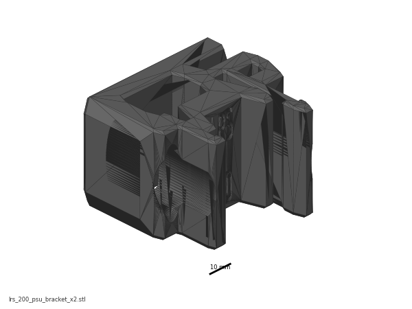{ width=96 } | `Electronics_Bay/lrs_200_psu_bracket_x2` | 2 | Black |
| { width=96 } | `Electronics_Bay/wago_221-415_mount_3by5` | 1 | Black |
| 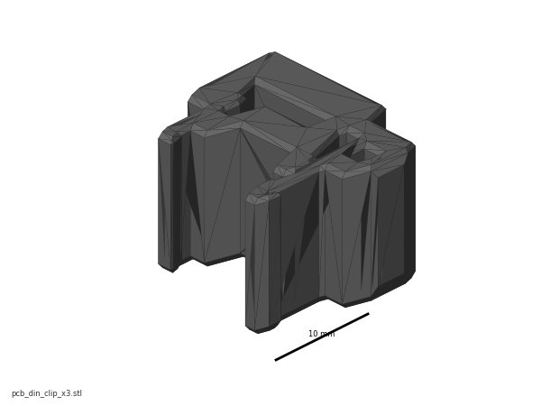{ width=96 } | `Electronics_Bay/pcb_din_clip_x3` | 1 file = 3 clips (spares — kit supplies 4) | Black |
| 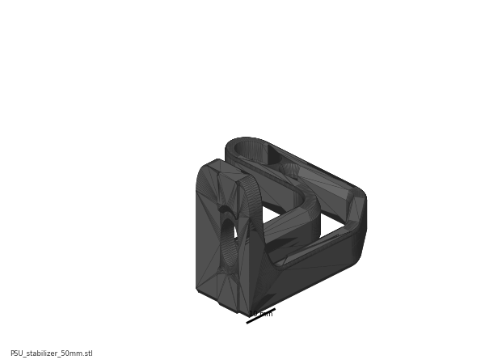{ width=96 } | `Electronics_Bay/PSU_stabilizer_50mm` | 1 — **fit only if needed**, see 09.16 | Black |
| { width=96 } | `Nitehawk-SB-V2/usb_adapter_mount_partial_cover` | 1 | Black |
| { width=96 } | `Skirts/power_inlet_IECGS_1mm` | 1 (batch B07-P3) | Black |

**Supplied printed by LDO — do not print these:** Leviathan Bracket Left ×1, Leviathan Bracket Right ×1, NH Adapter Mount ×1, DIN Clip ×4, LDO Nozzle Probe ×1, Bed WAGO Mount ×1. [src](https://docs.ldomotors.com/en/voron/voron2/350_BOM/Rev_D)

**Hardware** (chapter totals)

| Fastener / part | Qty | Note |
|---|---|---|
| DIN rail, 35 mm W, slotted | 2 | length not stated by the manual or LDO — **(verify on bench)** |
| DIN rail plastic end cap | 4 | 2 per rail |
| PVC wire duct, 20 W × 25 H | 5 | 3 across, 2 front-to-back; cut lengths **(verify on bench)** |
| M5×10 BHCS | 8 | 4 DIN rails, 2 mains WAGO mount, 2 bed WAGO mount |
| M5 T-nut | 4 | 2 mains WAGO mount, 2 bed WAGO mount **(verify on bench for the bed WAGO mount)** — the 4 DIN-rail T-nuts are placed in Ch 02 Step 02.11, 0 new here |
| M4×6 BHCS | 6 | 4 PSU brackets **(verify)**, 2 SSR to its metal bracket |
| M3×8 SHCS | 8 | 4 Leviathan to brackets **(verify)**, 2 inlet panel, 2 XY endstop PCB |
| M3×6 BHCS | 2 | 2×2 XH splicer PCB to the bed WAGO mount |
| M3×10 FHCS | 2 | IEC inlet module into the printed panel **(verify on bench)** |
| M3×25 SHCS | 2 | nozzle probe to the bed extrusion — **not** the manual's M3×20 |
| M3×30 SHCS | 2 | XY endstop pod to the gantry, the manual p.164 value — the two M3×16 Ch 05 Step 05.43 bagged with the pod are spares here `(verify against your Ch 05 bag)` |
| M3 T-nut | 4 | 2 inlet panel, 2 nozzle probe |
| M2×10 self-tapping | 6+ | 4 DIN clips to Leviathan brackets, 2 Z endstop PCB, plus the USB adapter's DIN clip **(verify on bench)** — the adapter stack itself is held by 3× M3×10 SHCS fitted in Ch 08 Step 08.64 |
| M3×5×4 heat-set insert | 2+ | 2 bed WAGO mount; inlet panel and mains WAGO mount **(verify on bench)** |
| Meanwell LRS-200-24 PSU | 1 | 115/230 V selector switch on the side |
| Omron G3NB-210B-1 SSR + metal DIN mount bracket | 1 + 1 | bracket is off-the-shelf metal; there is no printed SSR mount |
| AC inlet, integrated switch & fuse | 1 | one module — not the manual's separate inlet + rocker |
| WAGO 221-415 (5-way) | 3 | mains distribution, L / N / PE |
| WAGO 221-412 (2-way) | 2 | bed WAGO mount |
| Ferrule, VE0508 | 5 | fitted in Ch 10, counted here so you can find them |
| LDO Leviathan mainboard | 1 | |
| Raspberry Pi 4B + heatsink + standoffs + 3/4 HAT power adapter | 1 set | Pi is a reseller-optional line item |
| XY endstop PCB / Z endstop PCB / USB adapter PCB / 2×2 XH splicer PCB | 1 each | |
| GT2 20-tooth pulley (a plain collar) + 5 mm shaft + M3 set screw | 1 each | nozzle probe — LDO ships the collar pressed into the printed body `(verify on bench)` |

**Read first**

- **Remove *every* voltage-selection jumper from the Leviathan before it goes anywhere near the rail** (step 09.19). Mixing voltages on the shared 24 V supply permanently destroys the controller and whatever is plugged into it. Jumpers go back in Ch 10, one at a time, after each component's voltage is confirmed. [src](https://ldomotion.com/guides/voron-leviathan-v1-3)
- **Nothing is wired in this chapter.** Mains wiring is the one step in this build that can kill you, and it is done as one deliberate sequence in Ch 10 that ends at LDO's **Checkpoint #1** — continuity within each colour group, no continuity between L, N and PE, PSU selector confirmed, all with the cord unplugged. Leave the C13 cord in its bag. (survey §4.4 #8)
- **The manual pages p.148–172 describe a different machine** — a BTT Octopus, a mini12864, a 5 V PSU and a separate Pi bracket. Use them for the DIN-rail technique and the mounting geometry only; every part that differs carries a `⚠` callout at its step. [src](https://docs.ldomotors.com/voron/voron2/build-faq)
- **Do not close the bay.** Skirts and the bottom panel go on in Ch 11, only after Checkpoint #1 passes. Fitting them now costs an hour of re-opening plus the safety check you skipped (survey §5.2 W8).
- **Test-fit every roll-in T-nut.** Extrusion and T-nut tolerances on this kit are tight; a forced nut galls the slot. [src](https://docs.ldomotors.com/voron/voron2/build-faq)
- **Bench-only work for a print-idle window** (the index's *while it prints* rows assume you use them): 09.10 and 09.34's inserts, 09.14–09.15 (PSU selector and brackets), 09.17 (SSR on its bracket), 09.19–09.23 (Leviathan brackets, jumpers, Pi, HAT adapter), 09.25 (USB-adapter clip) and 09.27–09.29 (nozzle probe) need no printer. If you did the two heat-set jobs in Ch 08's iron session, 09.10 and 09.34 start with a confirm.

**Sources for this chapter:**

- [Voron 2.4r2 assembly manual, p.148–172](https://github.com/VoronDesign/Voron-2/blob/de7e89d/Manual/Assembly_Manual_2.4r2.pdf#page=148) — mounting geometry and DIN technique only; the boards on those pages are a different machine. Pinned at commit `de7e89d`. p.28–29 supply the deck and DIN-rail pages
- [LDO wiring guide (Rev D)](https://docs.ldomotors.com/en/voron/voron2/wiring_guide_rev_d) — the placement this chapter actually builds: [General Placement](https://docs.ldomotors.com/en/voron/voron2/wiring_guide_rev_d#general-placement), [DIN rails and wire ducts](https://docs.ldomotors.com/en/voron/voron2/wiring_guide_rev_d#installing-the-din-rails-and-wire-ducts), [Preparing the inlet](https://docs.ldomotors.com/en/voron/voron2/wiring_guide_rev_d#preparing-the-inlet), [Preparing the PSU](https://docs.ldomotors.com/en/voron/voron2/wiring_guide_rev_d#preparing-the-power-supply-unit), [Preparing the mainboard](https://docs.ldomotors.com/en/voron/voron2/wiring_guide_rev_d#preparing-the-mainboard-ldo-voron-leviathan-board), [Assembling the nozzle probe](https://docs.ldomotors.com/en/voron/voron2/wiring_guide_rev_d#assembling-the-nozzle-probe), [Wiring the bed heater](https://docs.ldomotors.com/en/voron/voron2/wiring_guide_rev_d#wiring-the-bed-heater), [Checkpoint #1](https://docs.ldomotors.com/en/voron/voron2/wiring_guide_rev_d#checkpoint-1)
- [LDO Build Notes § Voron 2.4 build FAQ](https://docs.ldomotors.com/en/voron/voron2/build-faq) — every page in p.148–172 that this kit skips or replaces
- [LDO Leviathan V1.3 board guide](https://ldomotion.com/guides/voron-leviathan-v1-3) — voltage-selection jumpers and Pi mounting (link-only; no licence)
- [LDO printed-parts guide (Rev D)](https://docs.ldomotors.com/en/voron/voron2/printed_part_guide_rev_d) and [LDO 350 Rev D BOM](https://docs.ldomotors.com/en/voron/voron2/350_BOM/Rev_D) — which brackets to print, what the kit supplies
- [Nitehawk-SB V2 repo](https://github.com/MotorDynamicsLab/Nitehawk-SB-V2) — the USB adapter stack and its grounding wire
- [LDO XY-endstop repin guide](https://docs.ldomotors.com/en/guides/XY_Endstop_Cable_Reconnecting_Guide) — connector order on the XY endstop PCB
- Mirrored images in this chapter are LDO Motors' (docs.ldomotors.com, LDOVoron2, Nitehawk-SB V2), used with attribution; see `assets/remote/09-electronics-bay/SOURCES.txt`

**Video coverage (Steve Builds, pre-release LDO kit — differs from Rev D+):** [Part 5 @2:47:07](https://www.youtube.com/watch?v=hTKCBrk36R0&list=PL0fUJbigELQPqpeGOgHYisG4KaSXVtnNY&t=10027s) (+21m), [Part 6 @1:30:45](https://www.youtube.com/watch?v=8pWoYkY1DiA&list=PL0fUJbigELQPqpeGOgHYisG4KaSXVtnNY&t=5445s) (+12m), [Part 7 @0:05:08](https://www.youtube.com/watch?v=eHo0k2wQsJw&list=PL0fUJbigELQPqpeGOgHYisG4KaSXVtnNY&t=308s) (+4m), [Part 7 @0:24:27](https://www.youtube.com/watch?v=eHo0k2wQsJw&list=PL0fUJbigELQPqpeGOgHYisG4KaSXVtnNY&t=1467s) (+9m), [Part 7 @0:31:06](https://www.youtube.com/watch?v=eHo0k2wQsJw&list=PL0fUJbigELQPqpeGOgHYisG4KaSXVtnNY&t=1866s) (+5m), [Part 7 @0:35:54](https://www.youtube.com/watch?v=eHo0k2wQsJw&list=PL0fUJbigELQPqpeGOgHYisG4KaSXVtnNY&t=2154s) (+20m), [Part 7 @0:59:20](https://www.youtube.com/watch?v=eHo0k2wQsJw&list=PL0fUJbigELQPqpeGOgHYisG4KaSXVtnNY&t=3560s) (+12m), [Part 8 @0:31:02](https://www.youtube.com/watch?v=Q3Q1szaFfSE&list=PL0fUJbigELQPqpeGOgHYisG4KaSXVtnNY&t=1862s) (+23m), [Part 8 @1:54:21](https://www.youtube.com/watch?v=Q3Q1szaFfSE&list=PL0fUJbigELQPqpeGOgHYisG4KaSXVtnNY&t=6861s) (+21m)

---

### Step 09.1 — Read the end state

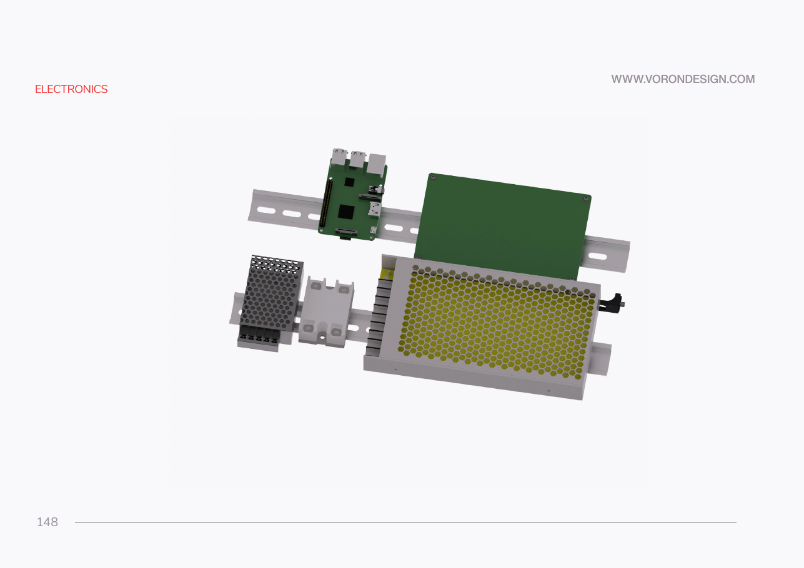

**What you're looking at:** The bay is the space under the deck panel where every electronic part of the machine lives. Two **[DIN rails](16-glossary.md#d)** run across it — DIN rail is the standard 35 mm steel top-hat rail that industrial gear clips onto, so components hang off the rail rather than being screwed to the acrylic. Boards go on the front rail, power on the rear; the only things fixed to the deck itself are the plastic wire ducts.

**Parts:** none.

**Do:** Look at the render. Two DIN rails run across the bay; boards clip onto one, power onto the other. That geometry is correct for your kit even though three of the four components pictured are wrong. Nothing here is fastened to the acrylic itself except the wire ducts.

**Check:** The p.148 render and LDO's placement photo are side by side, and the parts on your bench are LDO's — Leviathan, LRS-200-24, Omron SSR — not the manual's Octopus, 5 V PSU and Pi bracket.

Source: [Voron manual p.148](https://github.com/VoronDesign/Voron-2/blob/de7e89d/Manual/Assembly_Manual_2.4r2.pdf#page=148) · [LDO wiring guide § General Placement](https://docs.ldomotors.com/en/voron/voron2/wiring_guide_rev_d#general-placement) · [Video: Part 7 @0:05:02](https://www.youtube.com/watch?v=eHo0k2wQsJw&list=PL0fUJbigELQPqpeGOgHYisG4KaSXVtnNY&t=302s)

---

### Step 09.2 — Read the placement you are actually building

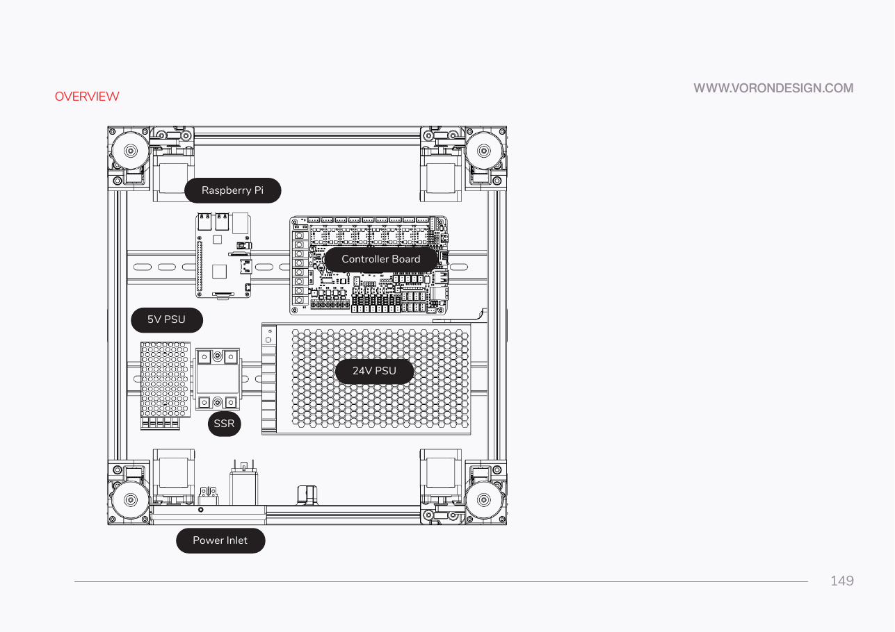

**What you're looking at:** The layout you are actually building, which is not the one drawn. Front rail: the **Leviathan** (this kit's mainboard, with the Raspberry Pi mounted on it) and the USB adapter. Rear rail: the **SSR** — a solid-state relay, the electronic switch that lets the low-voltage board turn the mains bed heater on and off — and the **PSU**, the Meanwell supply that turns mains into the 24 V everything else runs on. Rear frame: the mains **WAGO** blocks and the IEC inlet.

**Parts:** none.

**Do:** Compare the manual's overview against LDO's Rev D placement photo, [`S0General_Placement.jpg`](https://raw.githubusercontent.com/MotorDynamicsLab/LDOVoron2/main/Images/WiringGuide/RevD/S0General_Placement.jpg). Front rail: Leviathan with the Pi mounted on it, plus the USB adapter at the right-hand end. Rear rail: Omron SSR at the left, Meanwell LRS-200-24 to its right with its terminal block facing the SSR. Rear-left, in this order from the Z motor inward: the IEC inlet panel hard against the rear-left Z-motor mount, then the mains WAGO block to its right on the same extrusion.

**Check:** You have that photo open on a phone or second screen. You will check the finished bay against it at 09.36.

⚠ **Rev D+ / LDO:** the manual shows a **Raspberry Pi on its own bracket**, a **BTT Octopus**, and a **5 V PSU**. Your kit has none of those: the Pi mounts *on* the Leviathan, the Leviathan replaces the Octopus, and there is no 5 V PSU at all — the Leviathan supplies the Pi's 5 V. [src](https://docs.ldomotors.com/voron/voron2/build-faq) · [wiring guide § General Placement](https://docs.ldomotors.com/en/voron/voron2/wiring_guide_rev_d#general-placement)

Source: [Voron manual p.149](https://github.com/VoronDesign/Voron-2/blob/de7e89d/Manual/Assembly_Manual_2.4r2.pdf#page=149) · [LDO wiring guide § General Placement](https://docs.ldomotors.com/en/voron/voron2/wiring_guide_rev_d#general-placement) · image [`S0General_Placement.jpg`](https://raw.githubusercontent.com/MotorDynamicsLab/LDOVoron2/main/Images/WiringGuide/RevD/S0General_Placement.jpg) · [LDO Build Notes § Voron 2.4 build FAQ](https://docs.ldomotors.com/en/voron/voron2/build-faq)

---

### Step 09.3 — Turn the printer over and pre-load the rear T-nuts

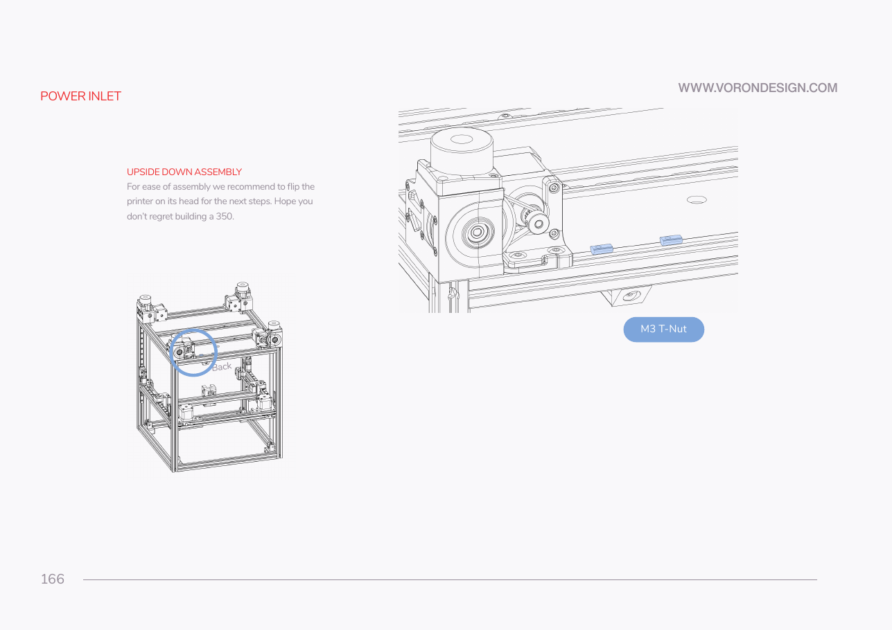

**What you're looking at:** The bay is on the *underside* of the machine, so everything in this chapter happens with the printer inverted. The two M3 T-nuts go into the rear extrusion now because once the inlet panel is up against that slot there is no way to feed a nut in behind it.

**Parts:** M3 T-nut ×2.

**Do:** Take the flex plate off and put it away, lay a folded blanket on the bench, and turn the printer onto its top with two people — a 350 with a gantry and a 10 mm plate in it is heavy and top-corner-fragile. Before the flip, run the gantry to the top of its travel by hand and strap each side to the top frame (a velcro strap or a zip tie through each Z joint), or clamp the four Z belts — inverted, an unpowered gantry with a toolhead on it back-drives toward the top frame. With the bay now facing up, stand at the printer's rear (left and right as defined at the top of this chapter) and drop two M3 roll-in T-nuts into the inner slot of the **rear lower extrusion**, where the inlet panel will sit — hard against the rear-left Z-motor mount (p.167) — and leave them loose.

**Check:** Printer sits stable and level on its top; gantry strapped, no load on the motors or belts. Two M3 T-nuts free to slide in the rear extrusion slot.

Source: [Voron manual p.166](https://github.com/VoronDesign/Voron-2/blob/de7e89d/Manual/Assembly_Manual_2.4r2.pdf#page=166) · [LDO wiring guide § Installing the DIN rails and wire ducts](https://docs.ldomotors.com/en/voron/voron2/wiring_guide_rev_d#installing-the-din-rails-and-wire-ducts)

---

### Step 09.4 — Verify the deck panel before you drill anything into the layout

**What you're looking at:** The deck panel is the flat sheet separating the print chamber above from the electronics bay below, and the DIN rails bolt **through** it into the bed extrusions. Its thickness is worth measuring because the printed deck supports come in 3 mm and 4 mm versions, and the wrong pair leaves the panel flexing under everything you are about to hang on it.

**Parts:** deck panel ×1 (already fitted in Ch 02).

**Do:** Confirm the panel's **notch faces the back** and that the round wire opening near the rear centre is clear. Caliper the panel edge and write the number down — the Rev D 350 BOM lists 469 × 469 × **3 mm** while LDO's own guide assumes a 4 mm deck, and the deck supports must match what you measured (survey §4.3).

**Check:** Notch to the back. Wire opening unobstructed. Deck thickness recorded, and the deck supports fitted in Ch 02 are the matching variant.

⚠ **Rev D+ / LDO:** if Ch 02 fitted `deck_support_4mm_x8` and your panel calipers at 3 mm, swap them for `deck_support_3mm_x8` now — the deck is about to carry the DIN rails and everything on them. [src](https://docs.ldomotors.com/en/voron/voron2/350_BOM/Rev_D)

Source: [Voron manual p.28](https://github.com/VoronDesign/Voron-2/blob/de7e89d/Manual/Assembly_Manual_2.4r2.pdf#page=28) · [LDO wiring guide § Installing the DIN rails and wire ducts](https://docs.ldomotors.com/en/voron/voron2/wiring_guide_rev_d#installing-the-din-rails-and-wire-ducts) · [LDO 350 Rev D BOM](https://docs.ldomotors.com/en/voron/voron2/350_BOM/Rev_D)

---

### Step 09.5 — Fit the two DIN rails, running left to right

**What you're looking at:** The two rails: 35 mm slotted steel top-hat, cut to length. Everything electronic in the bay clips onto one of these instead of being screwed down, so a board can be slid along or lifted off without touching the deck. They run left to right across *both* bed extrusions, one screw into each — exactly as p.29 draws them and as LDO describes: *"These DIN rails run from left to right."*

**Parts:** DIN rail ×2, DIN rail plastic end cap ×4, M5×10 BHCS ×4, the four M5 T-nuts staged in Ch 02 Step 02.11.

**Do:** Slide the four M5 T-nuts staged in Ch 02 Step 02.11 along the two bed extrusions so that each rail crosses **both** extrusions and picks up one T-nut in each. Position one rail toward the front of the bay and one toward the rear, leaving room between them for a wire duct. Bolt through the rail slot and the deck panel into the T-nut with M5×10 BHCS, snug only. Push a plastic end cap onto each of the four rail ends.

**Check:** Both rails parallel, running left–right, each held by two screws. Rails do not overhang the deck panel or foul the Z belts or the gantry's lowest travel. All four end caps on.

⚠ **Rev D+ / LDO:** neither the manual nor LDO publishes a **cut length** for a 350's rails — **(verify on bench)**. Cut both to the same length, keep them inside the deck panel, and use the manual's own escape hatch at p.29: if a rail slot does not land on a T-nut, shorten the rail by a few mm rather than moving the nut off the extrusion.

Source: [Voron manual p.29](https://github.com/VoronDesign/Voron-2/blob/de7e89d/Manual/Assembly_Manual_2.4r2.pdf#page=29) · [LDO wiring guide § Installing the DIN rails and wire ducts](https://docs.ldomotors.com/en/voron/voron2/wiring_guide_rev_d#installing-the-din-rails-and-wire-ducts) · [Video: Part 2 @0:56:00](https://www.youtube.com/watch?v=2U0YahE8w_0&list=PL0fUJbigELQPqpeGOgHYisG4KaSXVtnNY&t=3360s)

---

### Step 09.6 — Cut and stick the five wire ducts

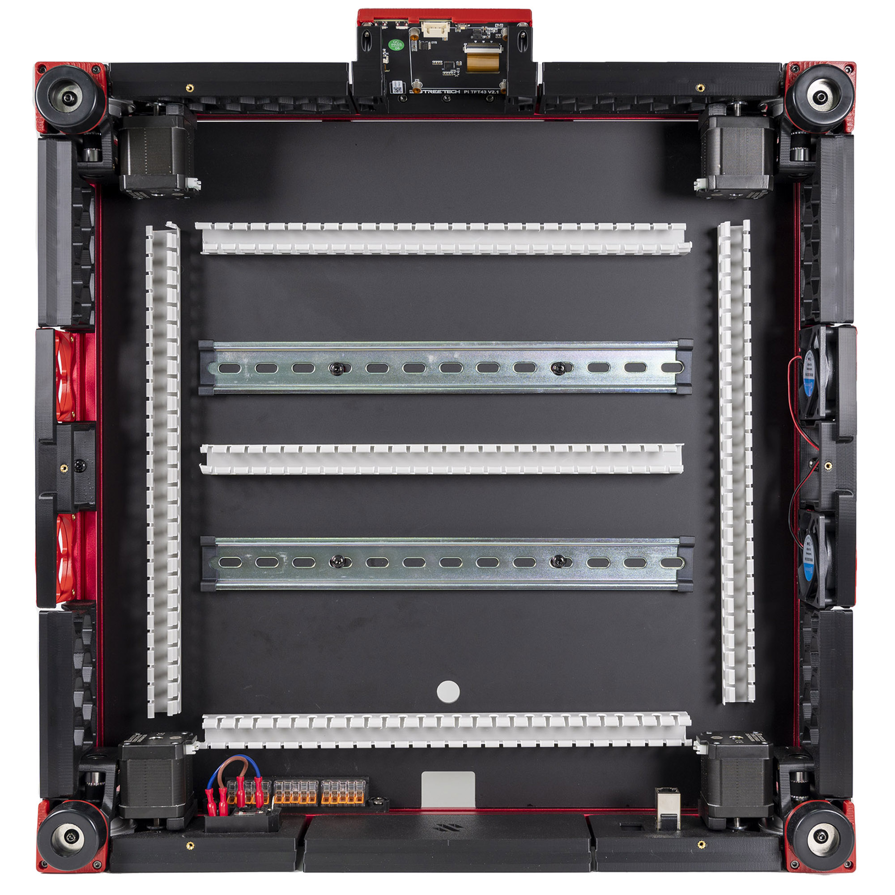

**What you're looking at:** Wire duct is slotted PVC channel with a snap-on lid: cables drop in through the slots anywhere along the run and the lid closes over them, which is what makes a bay re-wireable instead of a bundle of zip ties. Five of them form a loop around the bay. They are the only thing in here stuck to the acrylic, which is what the IPA wipe before the VHB tape is for.

**Parts:** PVC wire duct 20 W × 25 H ×5, VHB tape.

**Do:** Cut three ducts to run left–right — one in front of the front rail, one between the two rails, one behind the rear rail — and two to run front-to-back down the left and right sides of the bay, joining the three. Dry-lay all five first. Wipe the deck with IPA, then VHB the ducts down. Put the rear duct **rearward of the deck's wire opening** — between it and the rear extrusion, as LDO's photo shows — never across it.

**Check:** Five ducts, no duct crossing the wire opening, none fouling a DIN rail or the components you are about to clip on. Every duct still has its snap-on lid (they go on in Ch 10, after wiring).

⚠ **Rev D+ / LDO:** duct lengths are not published — **(verify on bench)**. Cut to fit between the side runs and the frame, and leave the offcuts: Ch 10 uses short pieces to bridge gaps. [src](https://docs.ldomotors.com/en/voron/voron2/wiring_guide_rev_d#installing-the-din-rails-and-wire-ducts)

Source: [LDO wiring guide § Installing the DIN rails and wire ducts](https://docs.ldomotors.com/en/voron/voron2/wiring_guide_rev_d#installing-the-din-rails-and-wire-ducts) · image [`S0_Din_Raill.jpg`](https://raw.githubusercontent.com/MotorDynamicsLab/LDOVoron2/main/Images/WiringGuide/RevD/S0_Din_Raill.jpg) · [Video: Part 7 @0:55:08](https://www.youtube.com/watch?v=eHo0k2wQsJw&list=PL0fUJbigELQPqpeGOgHYisG4KaSXVtnNY&t=3308s)

---

### Step 09.7 — Learn the DIN clip motion once

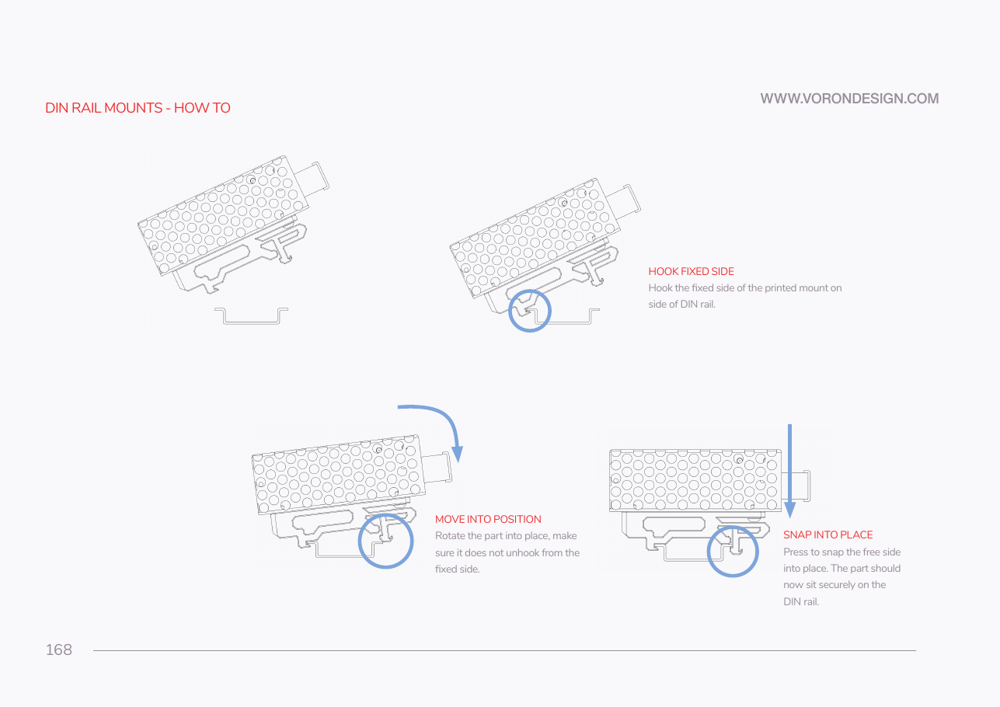

**What you're looking at:** A [DIN clip](16-glossary.md#d) is the sprung foot that grips the rail: one side is a fixed hook, the other a spring latch. The motion is hook the fixed side over one rail edge, rotate the part down flat, then press until the spring snaps over the other edge — every clipped component in this chapter goes on that way, and pressing one on flat-first breaks the latch.

**Parts:** one spare printed `pcb_din_clip` ×1.

**Do:** Practise on a spare clip. Hook the **fixed** side of the clip over one edge of the rail, rotate the part down flat while keeping that hook engaged, then press until the sprung side snaps over the other edge. Every clipped component in this chapter goes on this way.

**Check:** The clip sits square on the rail, does not rock, and slides along the rail with firm thumb pressure but not under its own weight.

Source: [Voron manual p.168](https://github.com/VoronDesign/Voron-2/blob/de7e89d/Manual/Assembly_Manual_2.4r2.pdf#page=168) · [LDO wiring guide § Installing the DIN rails and wire ducts](https://docs.ldomotors.com/en/voron/voron2/wiring_guide_rev_d#installing-the-din-rails-and-wire-ducts) · [Video: Part 7 @0:28:22](https://www.youtube.com/watch?v=eHo0k2wQsJw&list=PL0fUJbigELQPqpeGOgHYisG4KaSXVtnNY&t=1702s)

Pause: ~25 min since the last pause — printer on its top, rear T-nuts pre-loaded, deck panel verified, both DIN rails on and all five wire ducts cut and stuck. Nothing is clipped to a rail yet. Leave the printer where it is if you can; standing it back up costs you the T-nut access.

---

### Step 09.8 — Do not build the Pi bracket

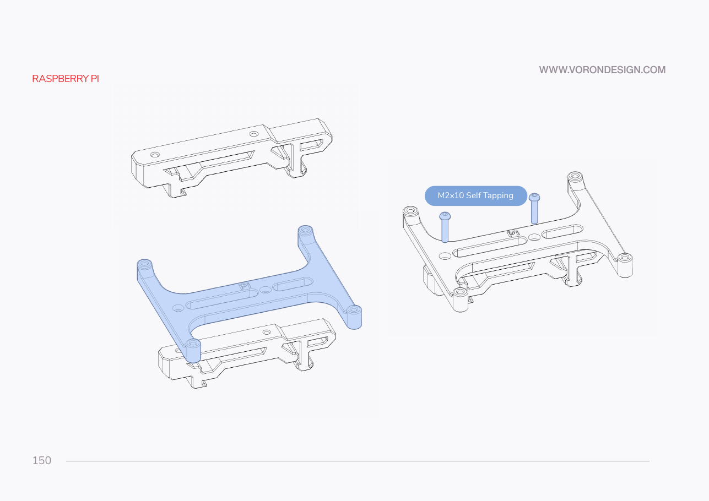
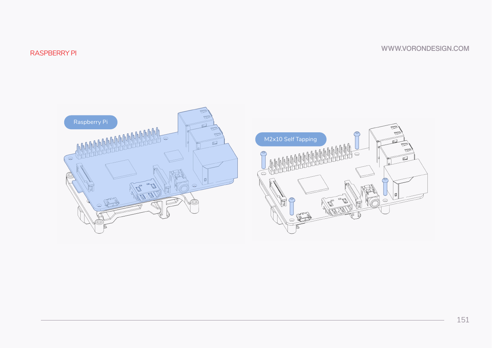

**What you're looking at:** A deliberate skip. The manual mounts the Raspberry Pi on its own printed bracket because its reference machine uses a separate controller board; the Leviathan has a dedicated Pi area with its own standoffs, so both pages are dead here.

**Parts:** none.

**Do:** Skip both pages. Put the Pi aside for step 09.22.

**Check:** No `raspberrypi_bracket` or `beefy_raspberry_bracket` in your printed-parts bin — the print plan deliberately never printed them.

⚠ **Rev D+ / LDO:** **SKIP manual p.150–151.** LDO's note on p.150 points at the Beefy Raspberry Pi Mount and then says *"it does not apply for rev D kits"* — the Leviathan has a dedicated Pi mounting area with its own standoffs. [src](https://docs.ldomotors.com/voron/voron2/build-faq)

Source: [Voron manual p.150](https://github.com/VoronDesign/Voron-2/blob/de7e89d/Manual/Assembly_Manual_2.4r2.pdf#page=150) · [Voron manual p.151](https://github.com/VoronDesign/Voron-2/blob/de7e89d/Manual/Assembly_Manual_2.4r2.pdf#page=151) · [LDO wiring guide § General Placement](https://docs.ldomotors.com/en/voron/voron2/wiring_guide_rev_d#general-placement) · [LDO Build Notes § Voron 2.4 build FAQ](https://docs.ldomotors.com/en/voron/voron2/build-faq)

---

### Step 09.9 — Do not fit a 5 V PSU

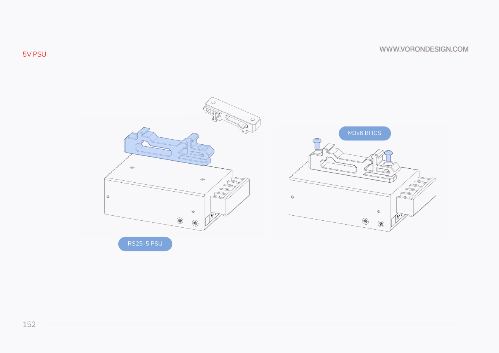
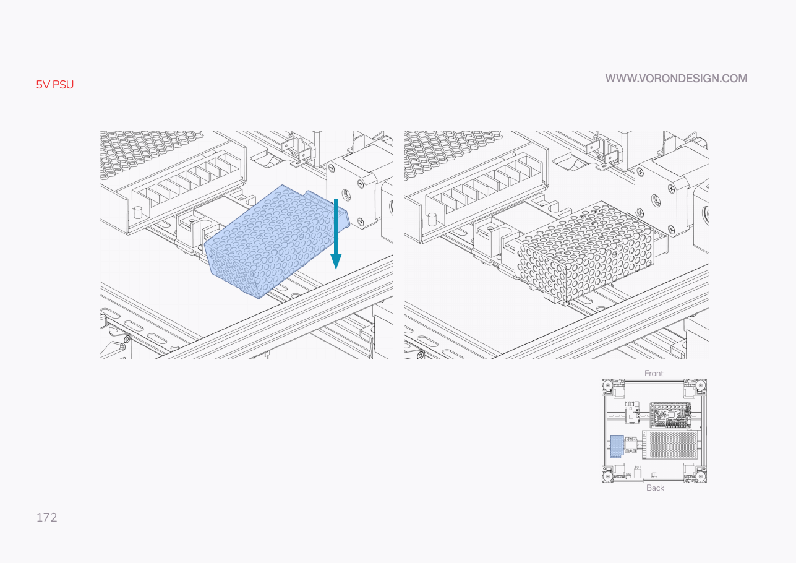

**What you're looking at:** Another skip, for a related reason: the manual's machine carries a second, 5 V power supply just to run the Pi. The Leviathan generates the Pi's 5 V itself, so this build has exactly one PSU in it.

**Parts:** none.

**Do:** Skip both pages. There is no RS25-5 in the kit and no space allocated for one.

**Check:** No RS-25-5 or any second supply in the kit boxes; the Leviathan's Pi power lead and the 3/4 HAT adapter are in the bag for 09.23.

⚠ **Rev D+ / LDO:** **SKIP manual p.152 and p.172** — *"The kit does not use a 5V PSU."* The Leviathan supplies the Pi's 5 V through the GPIO power adapter fitted at 09.23. This also removes manual p.190 later in the build. [src](https://docs.ldomotors.com/voron/voron2/build-faq)

Source: [Voron manual p.152](https://github.com/VoronDesign/Voron-2/blob/de7e89d/Manual/Assembly_Manual_2.4r2.pdf#page=152) · [Voron manual p.172](https://github.com/VoronDesign/Voron-2/blob/de7e89d/Manual/Assembly_Manual_2.4r2.pdf#page=172) · [LDO wiring guide § Preparing the power supply unit](https://docs.ldomotors.com/en/voron/voron2/wiring_guide_rev_d#preparing-the-power-supply-unit) · [LDO Build Notes § Voron 2.4 build FAQ](https://docs.ldomotors.com/en/voron/voron2/build-faq)

---

### Step 09.10 — Heat-set the power inlet panel

**What you're looking at:** The inlet panel is the printed plate that fills a cut-out in the rear skirt and carries the mains socket. [Heat-set inserts](16-glossary.md#h) give the plastic real metal threads for the module's screws, and they go in now because melting brass into a panel that already has a mains module bolted to it is not an option.

**Parts:** `power_inlet_IECGS_1mm` ×1, M3×5×4 heat-set inserts **(verify on bench — count the bosses on your printed part)**.

**Do:** If you heat-set this panel during Ch 08's insert pass (Ch 08 Read first), confirm the inserts and move on. Otherwise set the iron to your ASA insert temperature and press one insert into each boss on the back of the panel, square and flush with the surface. Let it cool completely before you touch anything to it.

**Check:** Every insert flush or a hair below, none tilted, no bulged plastic around a boss.

⚠ **Rev D+ / LDO:** the manual's part is `power_inlet_filtered`. Yours is **`power_inlet_IECGS_1mm`** — LDO ships the **1.0 mm AC inlet with an integrated switch**, so the printed panel is a different file with a different cut-out. [src](https://docs.ldomotors.com/voron/voron2/build-faq) · [Rev D printed parts guide](https://docs.ldomotors.com/en/voron/voron2/printed_part_guide_rev_d)

Source: [Voron manual p.156](https://github.com/VoronDesign/Voron-2/blob/de7e89d/Manual/Assembly_Manual_2.4r2.pdf#page=156) · [LDO wiring guide § Preparing the inlet](https://docs.ldomotors.com/en/voron/voron2/wiring_guide_rev_d#preparing-the-inlet) · [LDO printed-parts guide (Rev D)](https://docs.ldomotors.com/en/voron/voron2/printed_part_guide_rev_d) · [LDO Build Notes § Voron 2.4 build FAQ](https://docs.ldomotors.com/en/voron/voron2/build-faq)

---

### Step 09.11 — Fit the combined IEC inlet module

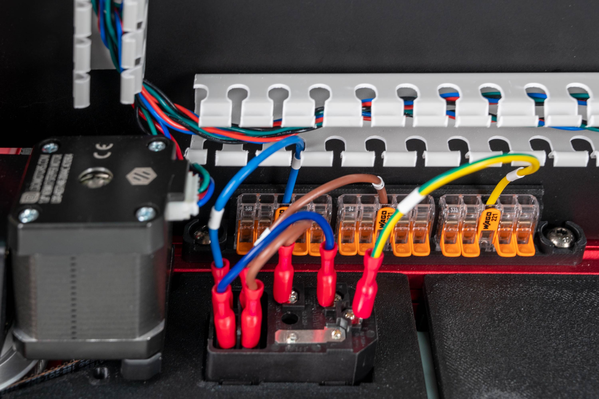
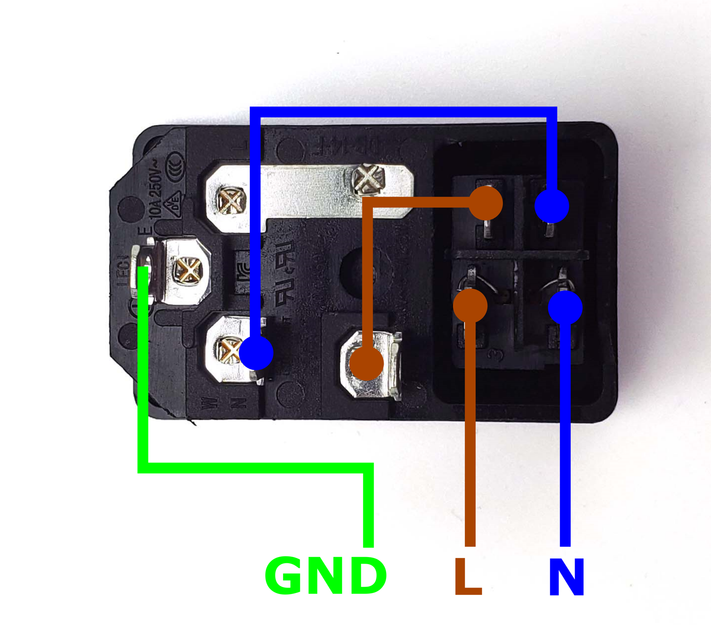

**What you're looking at:** The **IEC inlet** is where mains enters the machine. This kit's is a single module combining the C14 socket the power cord plugs into, the on/off rocker and the fuse holder, where the manual's build used two separate parts. Everything about it is live the moment a cord is in, which is why nothing touches its spade terminals until Ch 10's checked sequence. LDO's photo shows the module already wired; yours has bare spades until Ch 10. The second image is LDO's map of the module's factory-internal wiring.

**Parts:** AC inlet with integrated switch & fuse ×1, M3×10 FHCS ×2 **(verify on bench)**.

**Do:** Press the inlet module into the panel from the outside so the earth pin is at the top when the printer is upright and the switch faces out. Fasten with M3×10 FHCS into the inserts. Do not connect anything to its spade terminals — the pre-wired inlet cable lands in Ch 10.

**Check:** Module square in the panel, no rocking, fuse drawer accessible, switch rocks freely. Nothing wired.

⚠ **Rev D+ / LDO:** the manual fits **two** parts here — a filtered inlet *and* a separate rocker switch. Your kit is **one module** containing inlet, switch and fuse. Ignore the manual's switch. Compare the module's factory wiring **by eye only** against LDO's inlet layout above: on the back of the module a short metal link runs from the socket's **L** spade into the fuse holder, the fuse's other spade feeds one pole of the rocker, the socket's **N** spade feeds the rocker's other pole, and the **E** spade goes straight out to nothing but the earth pin — L fused, N direct, PE never switched or fused. Nothing is plugged in and nothing lights up in this chapter; the rocker lights for the first time at Ch 10's first power-on, after Checkpoint #1. [src](https://docs.ldomotors.com/en/voron/voron2/wiring_guide_rev_d#preparing-the-inlet)

Source: [LDO wiring guide § Preparing the inlet](https://docs.ldomotors.com/en/voron/voron2/wiring_guide_rev_d#preparing-the-inlet) · image [`S2_inlet.jpg`](https://raw.githubusercontent.com/MotorDynamicsLab/LDOVoron2/main/Images/WiringGuide/RevD/S2_inlet.jpg)

---

### Step 09.12 — Mount the inlet panel to the rear extrusion

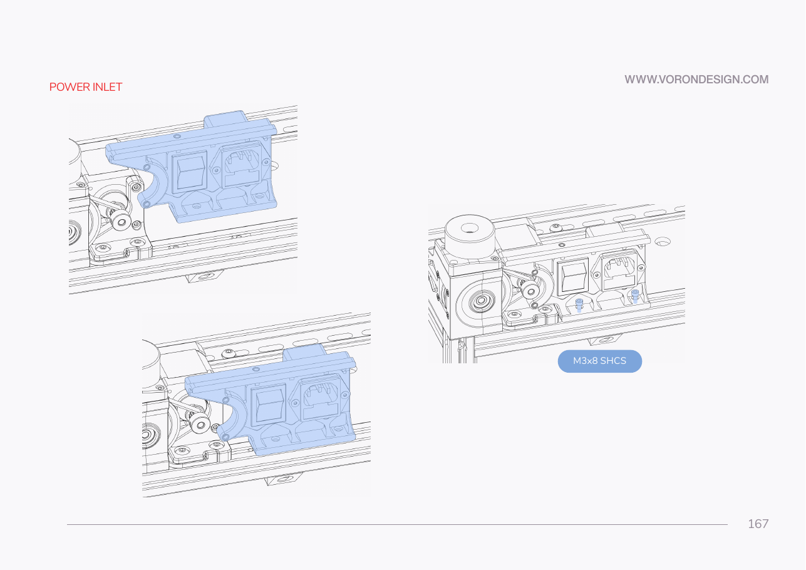

**What you're looking at:** The panel hooks over the rear extrusion's slot and bolts to the two T-nuts from Step 09.3. Position matters twice: against the Z-motor mount so the rear skirt segments line up, and inside the footprint where the rear skirt lands in Ch 11 — a panel that overhangs means a skirt that will not sit flat.

**Parts:** M3×8 SHCS ×2, the two M3 T-nuts pre-loaded at 09.3.

**Do:** Slide the panel over the rear extrusion so its lip hooks the slot, line the two holes up with the T-nuts and drive M3×8 SHCS in. Slide the panel along the extrusion until it touches the rear-left Z-motor mount, as p.167 draws it — the panel is one of the three rear skirt segments, and Ch 11 builds the rear run outward from it. The WAGO block goes to its right, inboard.

**Check:** Panel flat against the extrusion, no gap at the lip. Panel does not overhang where the rear skirt will land in Ch 11. Inlet reachable from outside.

Source: [Voron manual p.167](https://github.com/VoronDesign/Voron-2/blob/de7e89d/Manual/Assembly_Manual_2.4r2.pdf#page=167) · [LDO wiring guide § Preparing the inlet](https://docs.ldomotors.com/en/voron/voron2/wiring_guide_rev_d#preparing-the-inlet) · [Video: Part 7 @0:59:57](https://www.youtube.com/watch?v=eHo0k2wQsJw&list=PL0fUJbigELQPqpeGOgHYisG4KaSXVtnNY&t=3597s)

---

### Step 09.13 — Build and mount the mains WAGO block

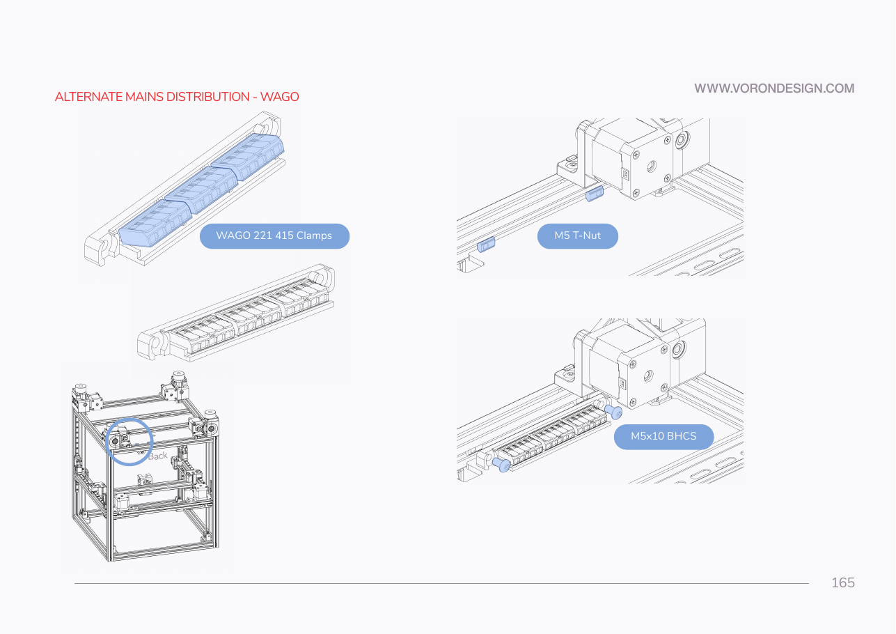

**What you're looking at:** A **[WAGO 221](16-glossary.md#w)** is a lever-operated push-in connector: lift the lever, push a stripped conductor in, drop the lever, and it is clamped — no screws, no solder, and it can be undone. These three 5-way blocks are the mains distribution nodes, one each for live, neutral and protective earth, so every mains consumer taps a common point instead of being daisy-chained.

**Parts:** `wago_221-415_mount_3by5` ×1, WAGO 221-415 (5-way) ×3, M5×10 BHCS ×2, M5 T-nut ×2.

**Do:** Snap the three 5-way WAGO 221-415 clamps into the printed mount, levers facing outward so you can reach them with the bay open. Slide two M5 T-nuts into the rear extrusion's inner slot immediately to the **right** of the inlet panel — LDO's photo reads motor, inlet, WAGOs from the left — hook the mount over the slot and fasten with M5×10 BHCS.

**Check:** All three clamps fully seated (no visible step between clamp and mount), every lever free to lift, mount solid on the extrusion and within reach of the inlet's flying leads.

⚠ **Rev D+ / LDO:** the manual titles p.165 *"ALTERNATE MAINS DISTRIBUTION — WAGO"*. For this kit it is not an alternate — it is the only path. The BOM ships three 221-415 clamps, and Ch 10 uses them as the L / N / PE distribution nodes. [src](https://docs.ldomotors.com/en/voron/voron2/350_BOM/Rev_D)

⚠ **Rev D+ / LDO:** if your printed mount has insert bosses, heat-set them in the same pass as 09.10 — **(verify on bench)**; the stock Voron part is snap-fit only.

Source: [Voron manual p.165](https://github.com/VoronDesign/Voron-2/blob/de7e89d/Manual/Assembly_Manual_2.4r2.pdf#page=165) · [LDO wiring guide § Preparing the inlet](https://docs.ldomotors.com/en/voron/voron2/wiring_guide_rev_d#preparing-the-inlet) · [LDO 350 Rev D BOM](https://docs.ldomotors.com/en/voron/voron2/350_BOM/Rev_D)

Pause: ~30 min since the last pause — Pi bracket and 5 V PSU correctly skipped, inlet panel heat-set and fitted with the IEC module, panel bolted to the rear extrusion, mains WAGO block built and mounted. **Nothing is terminated and the C13 cord stays in its bag** — do not connect anything to the inlet.

---

### Step 09.14 — Set the PSU voltage selector to 115 V

**What you're looking at:** The **PSU** is the Meanwell LRS-200-24 — it turns mains into the 24 V that runs the motors, fans, boards and toolhead. It is not auto-ranging: a recessed slide switch selects 115 V or 230 V input, and leaving it at 115 V on 230 V mains destroys the supply the first time it is switched on. It is set now because a wire duct is about to hide the switch completely. LDO's photo shows the switch at 230 — yours must read 115 (or 120).

**Parts:** Meanwell LRS-200-24 ×1.

**Do:** Find the small recessed slide switch on the side of the PSU next to the yellow warning label. Push it to **115 V** for US mains with the 2.5 mm flat screwdriver. Look at it once more now, while it is still easy to see — once the PSU is on the rail with a duct in front of it, it is not; Ch 10 Step 10.2 re-checks it before power-on.

**Check:** Selector reads 115 V (some units print 115, some 120 — either marking is the low-voltage position). Yellow label on the PSU says *"AC INPUT VOLTAGE CAN BE SELECTED BY SWITCH, CHECK INPUT VOLTAGE AVOIDING DAMAGE BEFORE POWER ON"* — you have just done that.

⚠ **Rev D+ / LDO:** LDO calls this out twice, in *Preparing the Power Supply Unit* and again in Checkpoint #1: *"Flick the switch to the correct value before powering it on! Failing to do so can destroy the power supply!"* Ch 10 re-checks it before the first power-on. [src](https://docs.ldomotors.com/en/voron/voron2/wiring_guide_rev_d#preparing-the-power-supply-unit)

Tip: EU builds may get a Meanwell RSP-200-24 instead, which has PFC and a universal input and no switch at all. If yours has no selector, you have that unit — nothing to set. [src](https://docs.ldomotors.com/en/voron/voron2/wiring_guide_rev_d#preparing-the-power-supply-unit)

Source: [LDO wiring guide § Preparing the power supply unit](https://docs.ldomotors.com/en/voron/voron2/wiring_guide_rev_d#preparing-the-power-supply-unit) · image [`psu_switch.jpg`](https://raw.githubusercontent.com/MotorDynamicsLab/LDOVoron2/main/Images/WiringGuide/psu_switch.jpg) · [Video: Part 8 @0:40:16](https://www.youtube.com/watch?v=Q3Q1szaFfSE&list=PL0fUJbigELQPqpeGOgHYisG4KaSXVtnNY&t=2416s)

---

### Step 09.15 — Fit the printed DIN brackets to the PSU

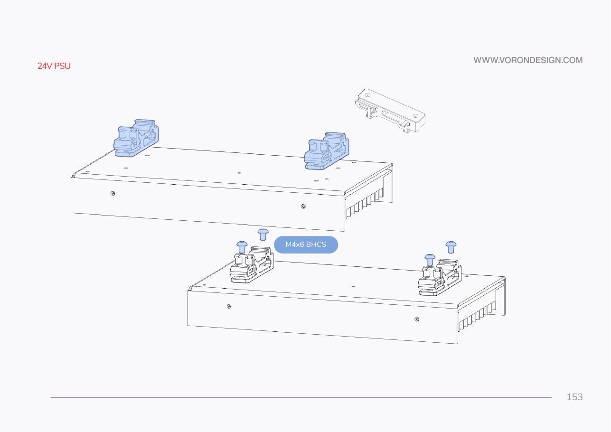

**What you're looking at:** The two printed brackets are the PSU's *entire* mounting system — they screw into the factory M4 holes on its solid (unvented) face and give it two DIN hooks. Screws longer than M4×6 reach inside a 200 W mains supply, which is a short circuit across the live rails.

**Parts:** `lrs_200_psu_bracket_x2` ×2, M4×6 BHCS ×4 **(verify on bench)**.

**Do:** Sit the two printed brackets on the PSU's long face — the one *without* the vents — using the factory M4 threaded holes, and drive M4×6 BHCS. Both brackets must face the same way so their DIN hooks line up. Do not use longer screws: an M4 that reaches inside a 200 W PSU is a short circuit.

**Check:** Both DIN hooks parallel and coplanar; the PSU's screw terminal block is on the edge that will face the SSR, i.e. to the left. Rest the PSU on a spare rail offcut and confirm both hooks engage at once.

⚠ **Rev D+ / LDO:** the manual's "24 V PSU" here is a generic block. Yours is the **Meanwell LRS-200-24** and these two printed brackets are the *whole* mounting system for it. [src](https://docs.ldomotors.com/en/voron/voron2/350_BOM/Rev_D)

Source: [Voron manual p.153](https://github.com/VoronDesign/Voron-2/blob/de7e89d/Manual/Assembly_Manual_2.4r2.pdf#page=153) · [LDO wiring guide § Preparing the power supply unit](https://docs.ldomotors.com/en/voron/voron2/wiring_guide_rev_d#preparing-the-power-supply-unit) · [LDO 350 Rev D BOM](https://docs.ldomotors.com/en/voron/voron2/350_BOM/Rev_D) · [Video: Part 8 @0:37:04](https://www.youtube.com/watch?v=Q3Q1szaFfSE&list=PL0fUJbigELQPqpeGOgHYisG4KaSXVtnNY&t=2224s)

---

### Step 09.16 — Clip the PSU onto the rear rail

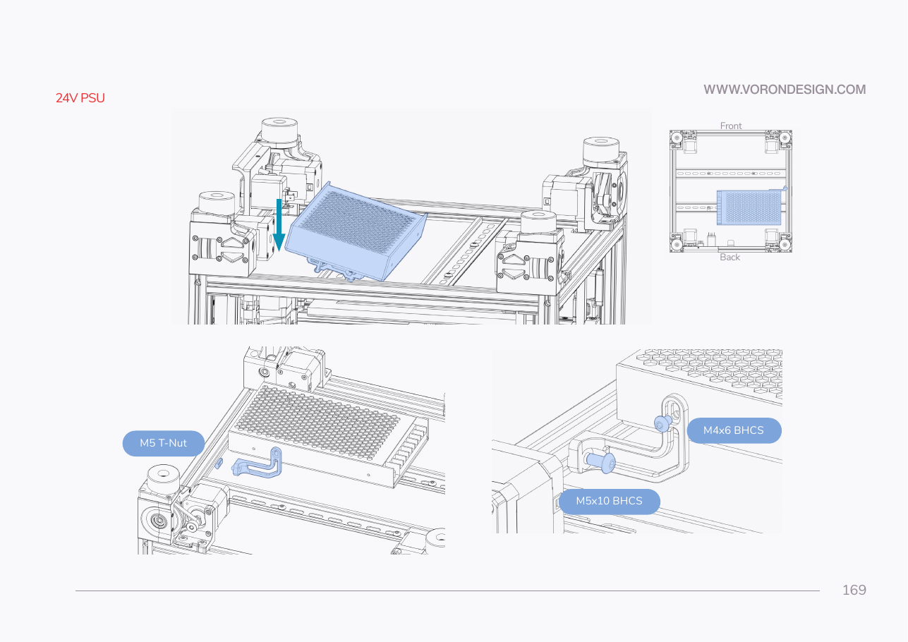

**What you're looking at:** Hook, rotate, snap — the motion from Step 09.7, now with the heaviest component in the bay. What decides the exact position is access: you have to get a PH2 driver square onto every terminal screw later, with the bay as crowded as it is ever going to be.

**Parts:** PSU assembly from 09.15.

**Do:** Hook, rotate and snap the PSU onto the **rear** DIN rail (top-left render on p.169), positioned toward the right of the bay with its terminal block facing left. Slide it until the terminal block is clear of the right-hand vertical wire duct and you can get a PH2 driver squarely onto every terminal screw.

**Check:** PSU sits square with both brackets latched; it does not rock when you push a screwdriver against a terminal. Vented face clear of ducts and the deck. Terminal block accessible without removing anything.

⚠ **Rev D+ / LDO:** **SKIP the bottom half of p.169** — the L-shaped support bracket with its M5 T-nut, M5×10 BHCS and M4×6 BHCS. LDO: *"PAGE 169 SKIP. The kit does not use a support bracket."* The two printed DIN brackets carry the PSU on their own. [src](https://docs.ldomotors.com/voron/voron2/build-faq)

⚠ **Rev D+ / LDO:** the print plan prints `PSU_stabilizer_50mm` anyway as a 4 g insurance part. Fit it **only** if the PSU visibly sags or rocks on the rail; otherwise it stays in the spares bin. [src](../voron-print-plan.md) §6

Source: [Voron manual p.169](https://github.com/VoronDesign/Voron-2/blob/de7e89d/Manual/Assembly_Manual_2.4r2.pdf#page=169) · [LDO wiring guide § General Placement](https://docs.ldomotors.com/en/voron/voron2/wiring_guide_rev_d#general-placement) · [LDO Build Notes § Voron 2.4 build FAQ](https://docs.ldomotors.com/en/voron/voron2/build-faq) · [print plan §B08](../voron-print-plan.md)

---

### Step 09.17 — Fit the SSR to its metal DIN bracket

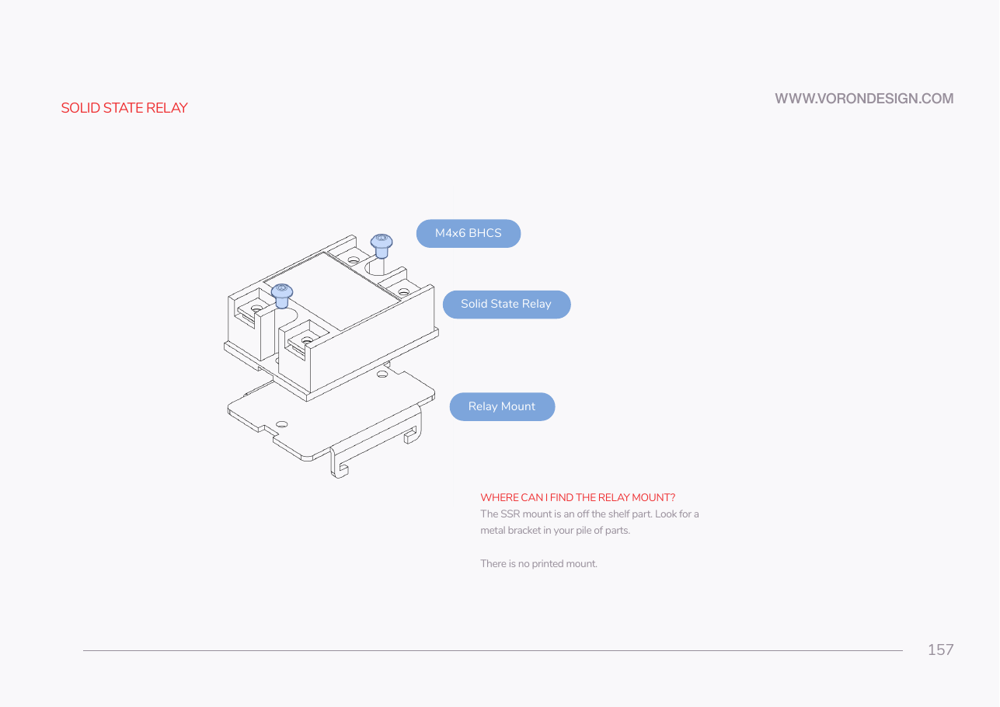

**What you're looking at:** The **[SSR](16-glossary.md#s)** (solid-state relay) is an electronic switch with no moving contacts: a few milliamps of DC on its input terminals switch the mains current flowing through its load terminals. That is how a low-voltage control board turns the mains bed heater on and off thousands of times a print. Terminals **1 / 2 are LOAD** (mains) and **3 + / 4 − are INPUT** (control) — swapping them is the error LDO calls catastrophic.

**Parts:** Omron G3NB-210B-1 SSR ×1, metal DIN rail mount bracket ×1, M4×6 BHCS ×2.

**Do:** Find the stamped metal bracket in the hardware bags — there is no printed SSR mount anywhere in this build. Lay the SSR on it and drive the two M4×6 BHCS through the SSR's mounting ears into the bracket. Before you tighten, read the SSR's own label and note which pair of terminals is which: **1 / 2 = LOAD, 24–220 VAC 10 A**; **3 + / 4 − = INPUT, 5–24 VDC**, with the indicator LED next to terminal 3.

**Check:** SSR square on the bracket, both screws tight, spring latch on the back of the bracket free to move. You can state from memory which pair is load and which is control.

Source: [Voron manual p.157](https://github.com/VoronDesign/Voron-2/blob/de7e89d/Manual/Assembly_Manual_2.4r2.pdf#page=157) · [LDO wiring guide § General Placement](https://docs.ldomotors.com/en/voron/voron2/wiring_guide_rev_d#general-placement) · [Video: Part 8 @0:36:59](https://www.youtube.com/watch?v=Q3Q1szaFfSE&list=PL0fUJbigELQPqpeGOgHYisG4KaSXVtnNY&t=2219s)

---

### Step 09.18 — Clip the SSR onto the rear rail

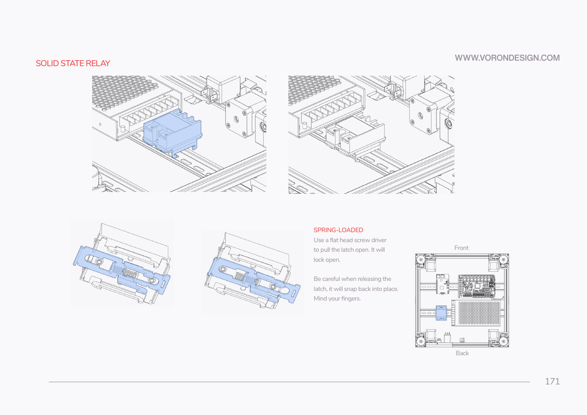

**What you're looking at:** The stamped metal bracket's spring latch is what holds the SSR on the rail, and it locks in the open position so you have both hands free. Orientation is the entire point of this step: control terminals facing the front rail where the Leviathan's signal wire comes from, load terminals facing the rear where the mains lives, so no mains conductor ever has to cross the bay.

**Parts:** SSR assembly from 09.17.

**Do:** Use the 2.5 mm flat screwdriver to pull the bracket's spring latch open — it locks in the open position. Hook the bracket over the rear rail to the **left of the PSU**, then release the latch. Mind your fingers: it snaps back hard. Orient the SSR so the **INPUT (3 + / 4 −)** terminals face the front rail, where the Leviathan's DC control wire comes from, and the **LOAD (1 / 2)** terminals face the rear, toward the inlet and WAGO block.

**Check:** SSR latched, square, no rocking. Both terminal pairs reachable with a PH2 driver. Roughly 30 mm of clear rail between the SSR and the PSU so both sets of screws can be driven.

⚠ **Rev D+ / LDO:** the SSR body is stamped **"EARTH THE MOUNTING RAIL"**. Your DIN rails bolt through the deck panel into the aluminium bed extrusions (09.5), so they are earthed once the frame PE lands in Ch 10. Verify rail-to-frame continuity with the multimeter at Checkpoint #1 — do not assume it. [src](https://docs.ldomotors.com/en/voron/voron2/wiring_guide_rev_d#checkpoint-1)

Tip: the SSR wiring is the one connection LDO flags as *"critical — an incorrect connection can cause catastrophic damage"*. Getting the orientation right now is what makes Ch 10 unambiguous (survey §4.4 #8).

Source: [Voron manual p.171](https://github.com/VoronDesign/Voron-2/blob/de7e89d/Manual/Assembly_Manual_2.4r2.pdf#page=171) · [LDO wiring guide § Checkpoint #1](https://docs.ldomotors.com/en/voron/voron2/wiring_guide_rev_d#checkpoint-1)

Pause: ~30 min since the last pause — PSU voltage selector confirmed at 115 V, PSU and SSR both on their DIN brackets and clipped to the rear rail. Mains terminals still bare; leave the PSU cover on and the cord bagged.

---

### Step 09.19 — Strip every voltage-selection jumper off the Leviathan

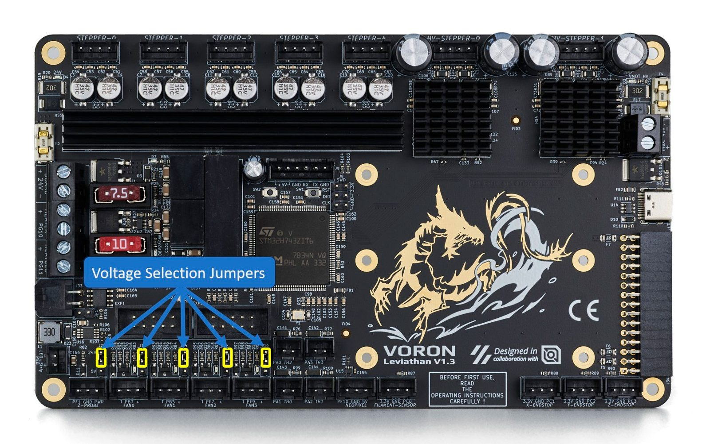

**What you're looking at:** The **[Leviathan](16-glossary.md#l)** is this kit's mainboard — the controller that drives all five steppers, both heaters, the fans and the endstops, and that carries the Raspberry Pi bolted on top of it. The five headers arrowed in this photo are its **voltage-selection jumpers**: each one picks whether that output delivers 5 V or 24 V. All of them come out now, because a jumper on the wrong voltage destroys the board and whatever is plugged into it — they go back one at a time in Ch 10, after each device's voltage is confirmed. The diagram is the picture of what "all of them" means: all five headers by name, none fitted yet.

**Parts:** LDO Leviathan mainboard ×1, a small pot or bag for the jumpers.

**Do:** On the bench, on an anti-static surface, pull **all** of the voltage-selection jumpers — the four fan headers and the Z-probe voltage header — and put them in a labelled bag taped to the bay wall. Do this before the board goes on the rail, not after.

**Check:** Zero jumpers left in any voltage-selection header. Bag labelled and stored where Ch 10 will find it.

⚠ **Rev D+ / LDO:** LDO's rule, verbatim: *"Remove all of the jumpers used for voltage selection prior to installation."* and *"Mixing voltage will permanantly damage the controller and attached components."* Jumpers go back only in Ch 10, one component at a time, after each attached device's voltage is verified. [src](https://ldomotion.com/guides/voron-leviathan-v1-3)

⚠ **Rev D+ / LDO:** ignore manual p.174–178 entirely when you get there — that is Octopus jumper configuration. LDO: *"Follow the instruction in the LDO guide for configuring the Leviathan controller board."* [src](https://docs.ldomotors.com/voron/voron2/build-faq)

Source: [LDO Leviathan V1.3 board guide](https://ldomotion.com/guides/voron-leviathan-v1-3) · [LDO Build Notes § Voron 2.4 build FAQ](https://docs.ldomotors.com/en/voron/voron2/build-faq)

---

### Step 09.20 — Fit DIN clips to the two Leviathan brackets

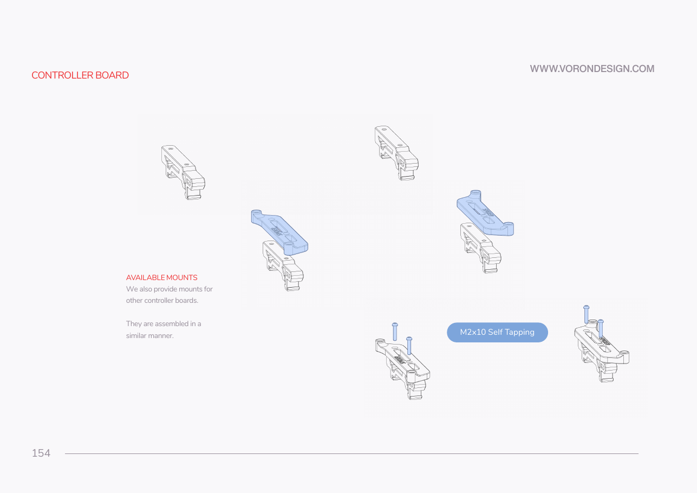

**What you're looking at:** Two LDO-supplied printed brackets, one for each short end of the board, each carrying a DIN clip. M2 self-tapping screws cut their own thread in ASA as they go in — run one in and out a few times and the boss is stripped, and there is no second thread underneath to fall back on.

**Parts:** Leviathan Bracket Left ×1, Leviathan Bracket Right ×1 (both LDO-supplied printed), DIN Clip ×2, M2×10 self-tapping ×4.

**Do:** Sit a DIN clip on each bracket and drive two M2×10 self-tapping screws through the clip into the bracket with a PH1. Self-tappers cut their own thread in ASA — go slowly, stop the moment the head seats, and do not run them in and out repeatedly.

**Check:** Two bracket-and-clip assemblies, mirror images of each other, clips square and both hooks facing the same direction.

⚠ **Rev D+ / LDO:** p.154 shows the **Octopus** bracket set and its siblings. You use `Leviathan_bracket_set` — supplied printed by LDO, do not print it — with **two** DIN clips. The assembly method on this page is the same; only the parts differ. [src](https://docs.ldomotors.com/en/voron/voron2/wiring_guide_rev_d#preparing-the-mainboard-ldo-voron-leviathan-board)

Source: [Voron manual p.154](https://github.com/VoronDesign/Voron-2/blob/de7e89d/Manual/Assembly_Manual_2.4r2.pdf#page=154) · [LDO wiring guide § Preparing the mainboard](https://docs.ldomotors.com/en/voron/voron2/wiring_guide_rev_d#preparing-the-mainboard-ldo-voron-leviathan-board) · [Video: Part 7 @0:32:16](https://www.youtube.com/watch?v=eHo0k2wQsJw&list=PL0fUJbigELQPqpeGOgHYisG4KaSXVtnNY&t=1936s)

---

### Step 09.21 — Bolt the Leviathan to its brackets

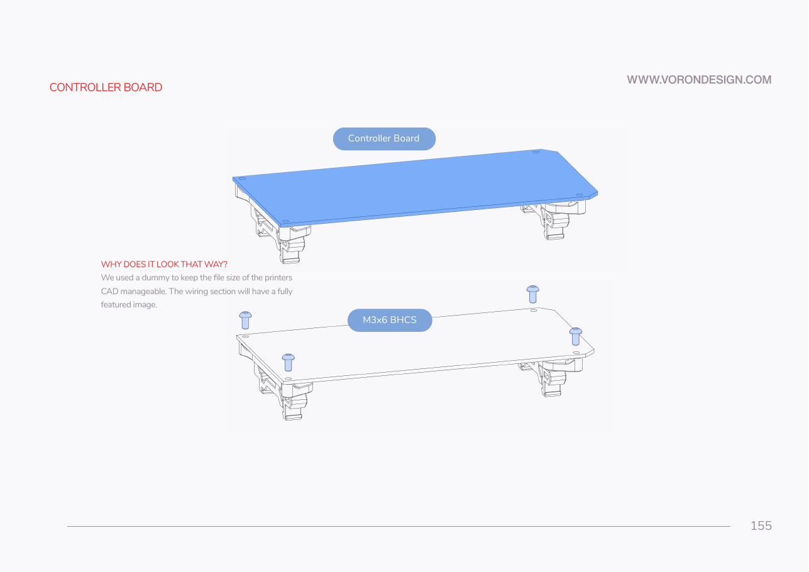

**What you're looking at:** The board bolts to those brackets at its corner mounting holes, which is the only place a PCB takes a screw without flexing its substrate and cracking traces. The check that matters is that the two DIN hooks end up coplanar: a twisted pair means only one clip ever engages the rail.

**Parts:** Leviathan ×1, the two bracket assemblies from 09.20, M3×8 SHCS ×4 **(verify on bench)**.

**Do:** Lay the Leviathan face down on a clean anti-static surface. Set a bracket under each short end, line up the PCB's corner mounting holes and drive M3×8 SHCS — finger-tight plus a nudge. Over-torquing an M3 into a PCB corner cracks the board.

**Check:** Board flat on both brackets with no twist; the two DIN hooks are coplanar. Rest the assembly on a rail offcut — both clips must engage together.

⚠ **Rev D+ / LDO:** the manual's board is a dummy Octopus fastened with **M3×6 BHCS**. The Leviathan takes **M3×8 SHCS** through the LDO brackets. Confirm the screw seats without bottoming out before you drive all four. [src](https://docs.ldomotors.com/en/voron/voron2/wiring_guide_rev_d#preparing-the-mainboard-ldo-voron-leviathan-board)

Source: [Voron manual p.155](https://github.com/VoronDesign/Voron-2/blob/de7e89d/Manual/Assembly_Manual_2.4r2.pdf#page=155) · [LDO wiring guide § Preparing the mainboard](https://docs.ldomotors.com/en/voron/voron2/wiring_guide_rev_d#preparing-the-mainboard-ldo-voron-leviathan-board)

---

### Step 09.22 — Heatsink and mount the Raspberry Pi 4B on the Leviathan

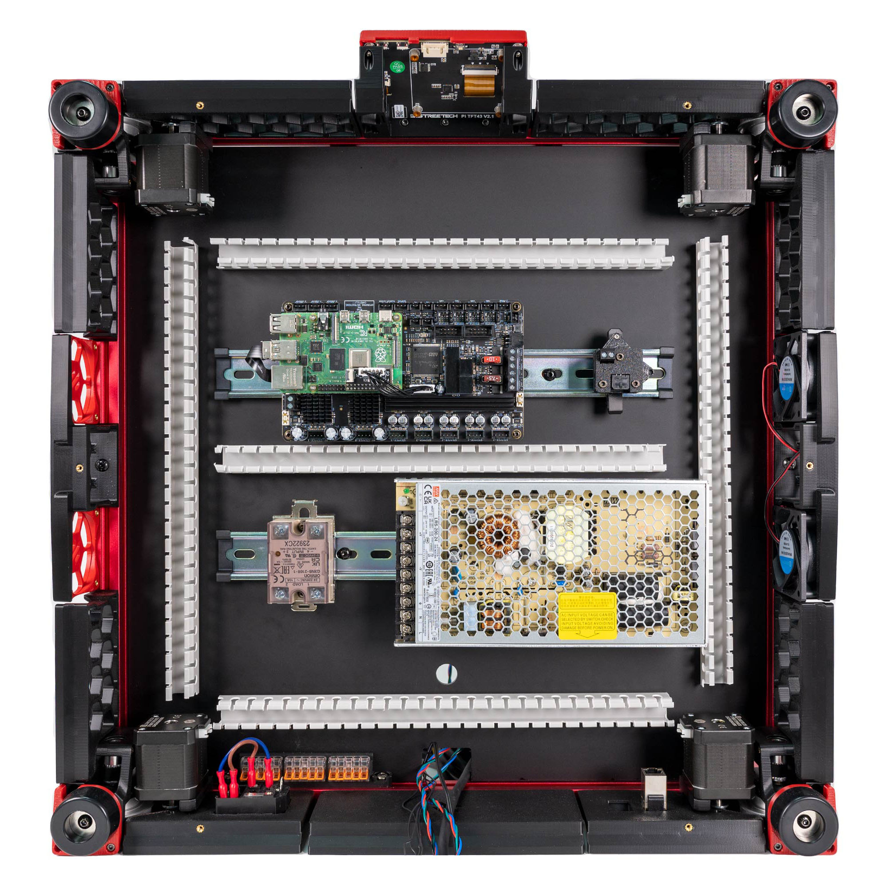

**What you're looking at:** The Raspberry Pi is the computer that runs Klipper and serves the web interface; the Leviathan is only the motion controller it commands. Here the Pi mounts directly on the Leviathan's own standoffs — which is why the manual's Pi bracket was skipped — and its ports have to be aimed clear of the Leviathan's connector banks *before* anything is bolted down, because Ch 10 needs the Ethernet port and Ch 12 needs a USB one.

**Parts:** Raspberry Pi 4B ×1, Pi heatsink ×1, Leviathan standoffs (supplied with the board) **(verify on bench — typically 4)**, 32 GB SD card ×1.

**Do:** Stick the heatsink on the Pi's SoC first — you cannot get at it once the Pi is on the board. Screw the standoffs into the Leviathan's dedicated Pi mounting area, then sit the Pi on them with its USB and Ethernet ports facing **outward, away from the Leviathan's connector banks**, and fasten. Slide the SD card in now; it is far easier here than on the rail.

**Check:** Pi flat on all standoffs, no flex. Ethernet and at least one USB-A port clear of the Leviathan's headers. SD card seated. Nothing shorting between the Pi's underside and the Leviathan.

⚠ **Rev D+ / LDO:** *"Some ports of the Raspberry Pi may not be usable due to interference with the Leviathan ports."* Check which ones you lose **now**, while you can still rotate the Pi, because Ch 10 needs the Ethernet port and Ch 12 needs a USB port for the toolboard. [src](https://ldomotion.com/guides/voron-leviathan-v1-3)

Source: [LDO Leviathan V1.3 board guide](https://ldomotion.com/guides/voron-leviathan-v1-3) · [LDO wiring guide § General Placement](https://docs.ldomotors.com/en/voron/voron2/wiring_guide_rev_d#general-placement) · image [`S0General_Placement.jpg`](https://raw.githubusercontent.com/MotorDynamicsLab/LDOVoron2/main/Images/WiringGuide/RevD/S0General_Placement.jpg) · [Video: Part 7 @1:10:35](https://www.youtube.com/watch?v=eHo0k2wQsJw&list=PL0fUJbigELQPqpeGOgHYisG4KaSXVtnNY&t=4235s) (differs: BTT Octopus + separate Raspberry Pi; this kit is a Leviathan with the Pi mounted on it)

---

### Step 09.23 — Fit the Raspberry Pi 3/4 HAT power adapter

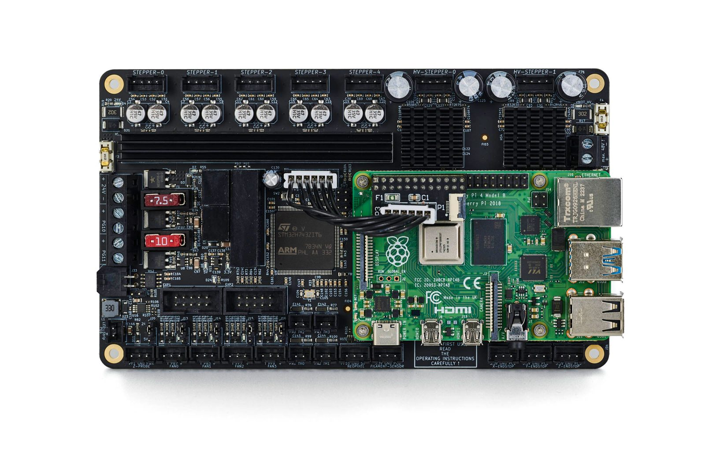

**What you're looking at:** This is how the Pi gets powered: a small adapter sits on its GPIO header and takes 5 V from a dedicated port on the Leviathan (the short black lead in the photo), which is why this machine has no USB-C brick and no second PSU. The kit ships two versions, for Pi 5 and for Pi 3/4, and they are not interchangeable — the supply lands on different pins.

**Parts:** Raspberry Pi **3/4** HAT power adapter ×1.

**Do:** Seat the 3/4-version adapter onto the Pi's GPIO header in the orientation LDO's image shows, and connect its lead to the Leviathan's dedicated Raspberry Pi supply port. This is how the Pi gets its 5 V — there is no USB-C brick and no 5 V PSU in this machine.

**Check:** Adapter fully seated on the GPIO pins with no row offset. Lead reaches the Leviathan's Pi power port without tension.

⚠ **Rev D+ / LDO:** the kit ships adapters for both **Pi 5** and **Pi 3/4**, and *"the orientation differs"* between them. You have a Pi 4B — use the 3/4 adapter. Fitting the Pi 5 adapter to a Pi 4 puts supply on the wrong pins. [src](https://ldomotion.com/guides/voron-leviathan-v1-3)

⚠ **Rev D+ / LDO:** this replaces manual p.190 as well (*"the kit uses the Leviathan to supply the 5v power for the Raspberry PI"*). [src](https://docs.ldomotors.com/voron/voron2/build-faq)

Source: [LDO Leviathan V1.3 board guide](https://ldomotion.com/guides/voron-leviathan-v1-3) · [LDO Build Notes § Voron 2.4 build FAQ](https://docs.ldomotors.com/en/voron/voron2/build-faq) · [Video: Part 8 @1:55:00](https://www.youtube.com/watch?v=Q3Q1szaFfSE&list=PL0fUJbigELQPqpeGOgHYisG4KaSXVtnNY&t=6900s) (differs: BTT Octopus + separate Raspberry Pi; this kit is a Leviathan with the Pi mounted on it)

---

### Step 09.24 — Clip the Leviathan and Pi onto the front rail

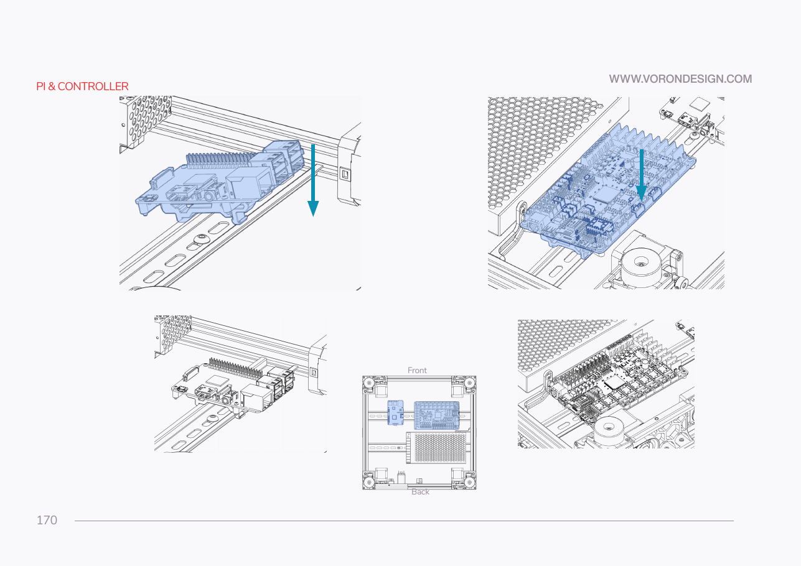

**What you're looking at:** Hook, rotate, snap for the third time, this time with the Pi already on the board. Biased left so the right-hand end of the front rail stays free for the USB adapter, and with the Leviathan's high-current terminals facing the PSU so the fat 24 V wires take the shortest possible run.

**Parts:** Leviathan + Pi assembly.

**Do:** Hook, rotate and snap the assembly onto the **front** DIN rail, roughly centred left-to-right but biased left so the right-hand end of the rail is free for the USB adapter. Keep the Leviathan's high-current terminal block on the side facing the PSU.

**Check:** Both clips latched, board square, and no part of the Pi or the Leviathan touching a wire duct, the deck panel or the frame. You can reach every connector bank with the bay open.

⚠ **Rev D+ / LDO:** **SKIP the manual's arrangement on p.170–171.** LDO: *"Refer to the wiring guide for Leviathan and electronics general placement."* The manual puts a Pi and an Octopus on the same rail as separate items; you have one clipped assembly. [src](https://docs.ldomotors.com/voron/voron2/build-faq)

Source: [Voron manual p.170](https://github.com/VoronDesign/Voron-2/blob/de7e89d/Manual/Assembly_Manual_2.4r2.pdf#page=170) · [LDO wiring guide § General Placement](https://docs.ldomotors.com/en/voron/voron2/wiring_guide_rev_d#general-placement) · [LDO Build Notes § Voron 2.4 build FAQ](https://docs.ldomotors.com/en/voron/voron2/build-faq)

Pause: ~30 min since the last pause — every voltage-selection jumper off the Leviathan and bagged, board on its brackets with the Pi and its HAT adapter, the whole stack clipped to the front rail. Do not put a jumper back: they go in one at a time in Ch 10.

---

### Step 09.25 — Confirm the USB adapter stack and clip it

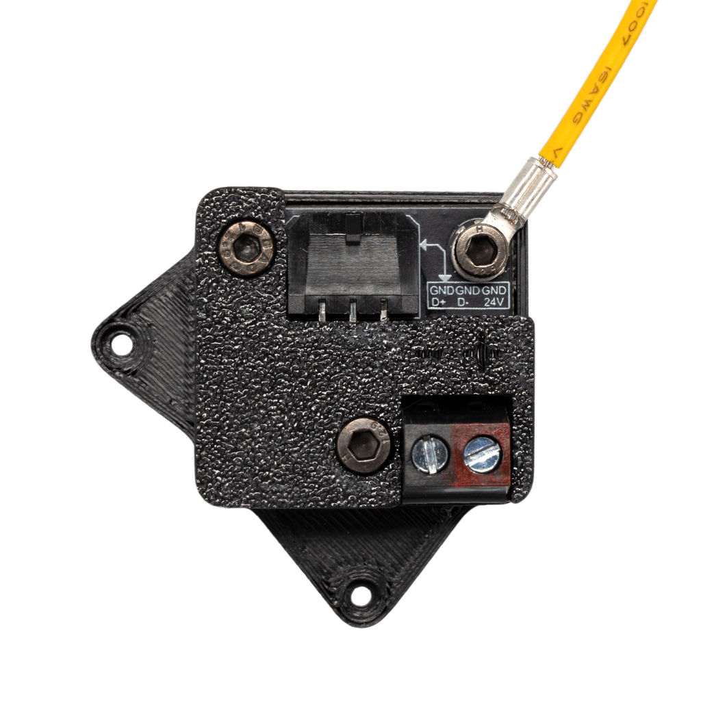

**What you're looking at:** The **[USB adapter](16-glossary.md#u)** is the bay-side end of the toolhead umbilical: 24 V goes into it, and the toolhead cable comes back out as a plain USB connection to the Pi. The V2 **partial** cover leaves one mounting screw bare on purpose — the ring terminal that bolts to it is the frame end of the ESD path that starts at the extruder motor back in Ch 08 Step 08.53.

**Parts:** the USB adapter assembly bagged in **Ch 08 Step 08.64** (NH Adapter Mount base + USB adapter PCB + `usb_adapter_mount_partial_cover`, held together by **M3×10 SHCS ×3**), DIN Clip ×1, M2×10 self-tapping ×2 (clip only) **(verify on bench)**.

**Do:** Do not rebuild the stack — take it out of the bag and confirm the three M3×10 SHCS still hold base, PCB and cover together and that the cover is the **partial** one, whose cut-out leaves a mounting point exposed. Fit a DIN clip to the back of the base with the M2×10 self-tappers, then attach the supplied grounding cable's ring terminal to the exposed mounting point. Leave the free end of the ground lead loose.

**Check:** PCB captive, Micro-Fit 3.0 socket (the 4-pin umbilical socket) and USB connector both accessible, cover on, and one mounting point still bare with the ground ring terminal on it.

⚠ **Rev D+ / LDO:** the stack takes **3× M3×10 SHCS** — LDO's Rev D Printed Parts Guide: *"Use 3 M3x10 SHCS screws to attach the base, adapter PCB, and cover together."* The M2×10 self-tappers are for the DIN clip only. If your bagged stack has the **V1** full cover on it, swap in [`usb_adapter_mount_partial_cover.stl`](https://raw.githubusercontent.com/MotorDynamicsLab/Nitehawk-SB-V2/master/STLs/usb_adapter_mount_partial_cover.stl) now rather than omitting the ground (Ch 08 Step 08.64; survey §4.1 ⑤). [src](https://docs.ldomotors.com/en/voron/voron2/printed_part_guide_rev_d)

⚠ **Rev D+ / LDO:** use the **supplied** grounding cable. LDO: *"Be sure to use the supplied grounding cable since using larger O ring connectors may cause inadvertent shorting of the PCB boards."*

Source: [Nitehawk-SB V2 repo](https://github.com/MotorDynamicsLab/Nitehawk-SB-V2) · [LDO printed-parts guide (Rev D)](https://docs.ldomotors.com/en/voron/voron2/printed_part_guide_rev_d) · image [`usb_adapter_gnd.jpg`](https://raw.githubusercontent.com/MotorDynamicsLab/Nitehawk-SB-V2/master/Images/usb_adapter_gnd.jpg)

---

### Step 09.26 — Clip the USB adapter to the front rail

(no image — see text; position matches the right-hand end of the front rail in [`S0General_Placement.jpg`](https://raw.githubusercontent.com/MotorDynamicsLab/LDOVoron2/main/Images/WiringGuide/RevD/S0General_Placement.jpg))
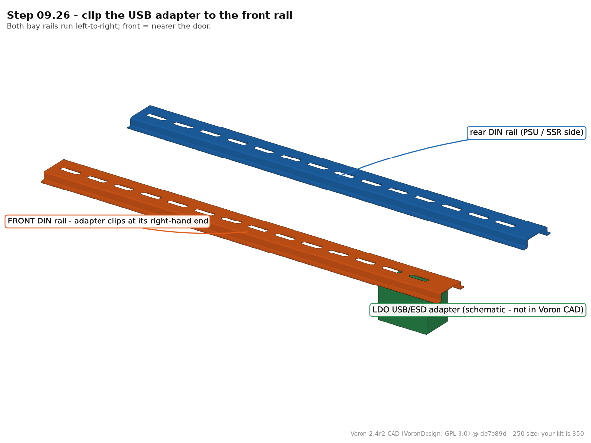
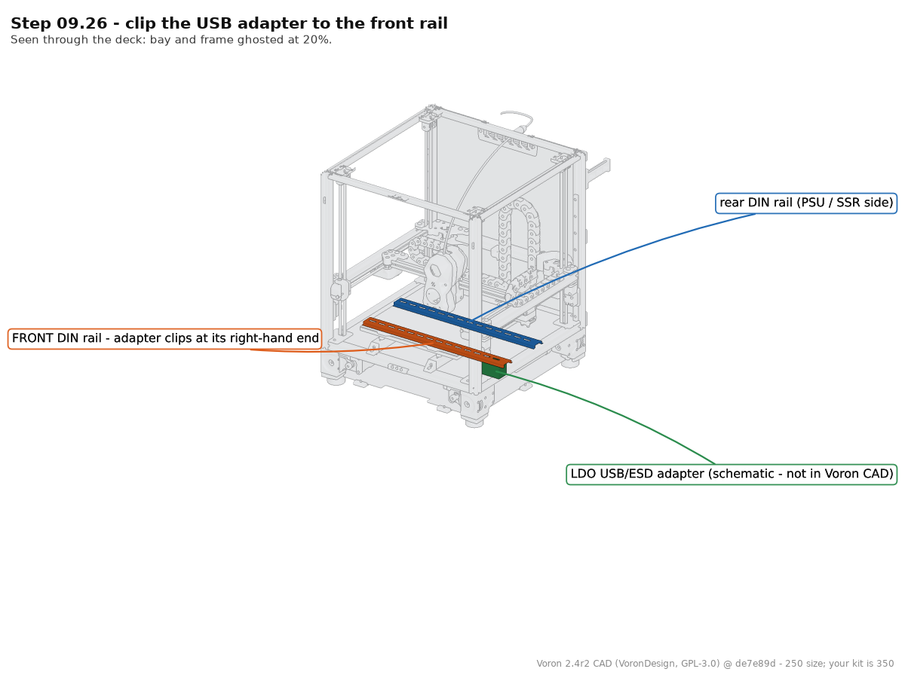

**What you're looking at:** No picture; the position is read off LDO's placement photo instead. Right-hand end of the front rail, umbilical socket pointing at the spot where the drag chain drops into the bay — that gives the toolhead cable the shortest, straightest run and means nothing pulls sideways on the connector as the gantry moves. The two DIN rails that run across the electronics bay — the front one is the one nearer the door, and the adapter clips onto its right-hand end.

**Parts:** USB adapter assembly from 09.25.

**Do:** Clip it onto the **right-hand end of the front DIN rail**, beside the Leviathan, with the umbilical connector facing where the cable chain drops into the bay. Route the ground lead toward the nearest frame extrusion and leave it hanging — it terminates on the frame during Ch 10's PE step.

**Check:** Adapter latched and square. Umbilical socket points at the chain entry, not at a wire duct. Ground lead reaches a frame extrusion with slack.

⚠ **Rev D+ / LDO:** this is the Rev D+ ESD path: extruder motor body → toolboard → umbilical → USB adapter → **frame/earth**. Skipping the frame end leaves the chain broken, and LDO ships this hardware with no written procedure — treat the repo images as the spec and ask in `#ldo_motors` if anything is ambiguous. (survey §4.1 ⑤)

Tip: The CAD bay layout is the 250 machine's; the rails are shorter than yours, but front/rear and left/right are the same.

Source: [LDO wiring guide § General Placement](https://docs.ldomotors.com/en/voron/voron2/wiring_guide_rev_d#general-placement) · image [`S0General_Placement.jpg`](https://raw.githubusercontent.com/MotorDynamicsLab/LDOVoron2/main/Images/WiringGuide/RevD/S0General_Placement.jpg) · CAD: Voron 2.4r2 STEP @ de7e89d

---

### Step 09.27 — Confirm the collar in the LDO nozzle-probe body

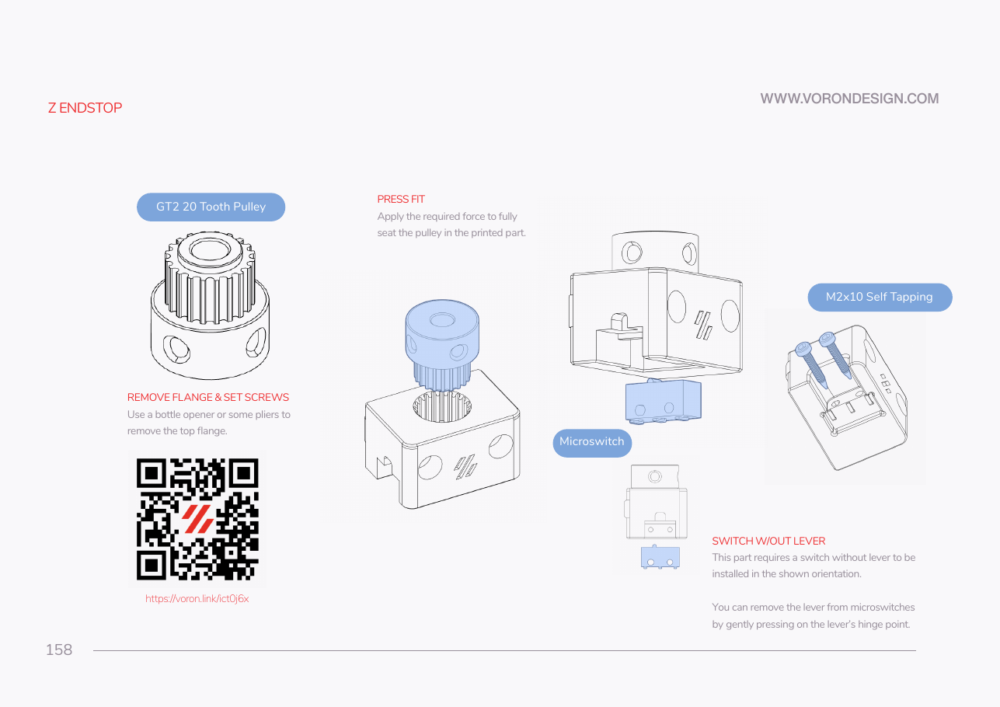 ·
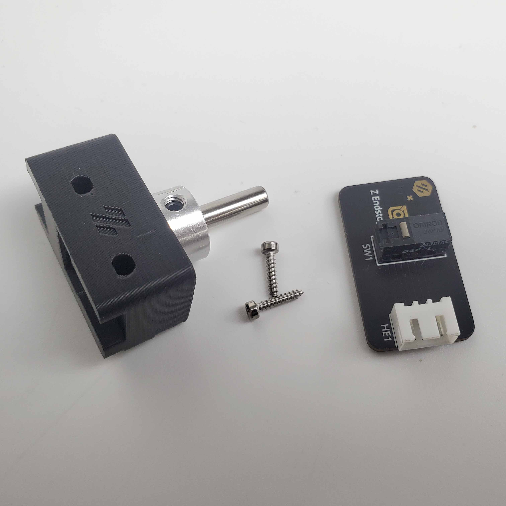

**What you're looking at:** The **[nozzle probe](16-glossary.md#n)** is this kit's Z endstop, and it is not a bed probe: it is a free-sliding 5 mm shaft in a printed body bolted to the *frame*, which the nozzle itself is driven down onto to find Z zero. What LDO's BOM calls a GT2 20-tooth pulley is simply the aluminium collar that carries the set screw retaining that shaft — and LDO's photo shows it already pressed into the printed body, shaft and set screw in place. This chapter builds the probe once; Ch 08 Step 08.56 is only a pointer here.

**Parts:** LDO Nozzle Probe printed part ×1 (LDO-supplied) with the collar (BOM: GT2 20-tooth pulley) pre-pressed `(verify on bench)`.

**Do:** Confirm the collar is fully home in its seat in the printed body. If yours arrived loose, press it in — it is an interference fit, so use steady thumb or vice pressure, not a hammer — until it bottoms out.

**Check:** Collar flush and square in the body, no gap under its flange, printed part not split.

⚠ **Rev D+ / LDO:** use LDO's own printed part, not the Voron `nozzle_probe.stl` — it is supplied printed in the kit and the print plan deliberately never printed either version. Ignore the manual's "remove flange & set screws" and lever-removal instructions: those are for a bare microswitch build. [src](https://docs.ldomotors.com/voron/voron2/build-faq)

Source: [Voron manual p.158](https://github.com/VoronDesign/Voron-2/blob/de7e89d/Manual/Assembly_Manual_2.4r2.pdf#page=158) · [LDO wiring guide § Assembling the nozzle probe](https://docs.ldomotors.com/en/voron/voron2/wiring_guide_rev_d#assembling-the-nozzle-probe) · image [`z_stop_parts.jpg`](https://raw.githubusercontent.com/MotorDynamicsLab/LDOVoron2/main/Images/WiringGuide/z_stop_parts.jpg) · [LDO Build Notes § Voron 2.4 build FAQ](https://docs.ldomotors.com/en/voron/voron2/build-faq)

---

### Step 09.28 — Fit the Z endstop PCB

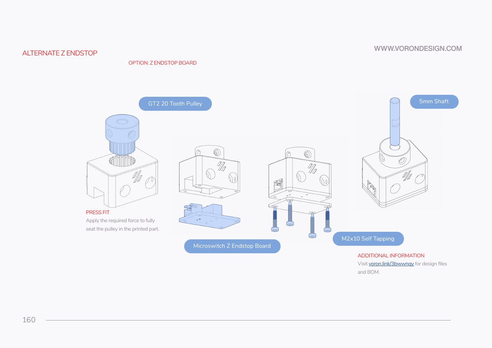 ·
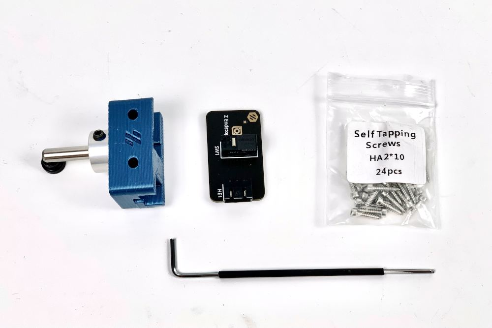

**What you're looking at:** The Z endstop PCB is a small board carrying a D2F microswitch and a plug, so nothing here has to be soldered. Its plunger ends up directly under the shaft's bore: the shaft drops onto the plunger, the switch clicks, and Klipper reads that click as Z zero.

**Parts:** Z endstop PCB (D2F switch board) ×1, M2×10 self-tapping ×2.

**Do:** Sit the PCB against the printed body so the D2F switch's plunger is under the pulley bore. Drive two M2×10 self-tapping screws **sideways** through the two holes in the D2F switch and into the printed part. PH1, slow, stop when seated.

**Check:** PCB solid, switch square under the bore, plunger free. Pressing the plunger gives a clean audible click and it returns fully.

⚠ **Rev D+ / LDO:** p.160 is titled *"ALTERNATE Z ENDSTOP"* in the manual — for this kit it is the only path. LDO: *"Use the LDO Z endstop printed part and PCB."* Note it is **two** screws through the switch, not the four the manual's render shows. There is nothing to solder — the PCB carries a connector. [src](https://docs.ldomotors.com/en/voron/voron2/wiring_guide_rev_d#assembling-the-nozzle-probe)

Source: [Voron manual p.160](https://github.com/VoronDesign/Voron-2/blob/de7e89d/Manual/Assembly_Manual_2.4r2.pdf#page=160) · [LDO wiring guide § Assembling the nozzle probe](https://docs.ldomotors.com/en/voron/voron2/wiring_guide_rev_d#assembling-the-nozzle-probe) · image [`z_stop_install_1.jpg`](https://raw.githubusercontent.com/MotorDynamicsLab/LDOVoron2/main/Images/WiringGuide/z_stop_install_1.jpg)

---

### Step 09.29 — Fit the 5 mm shaft and its retaining set screw

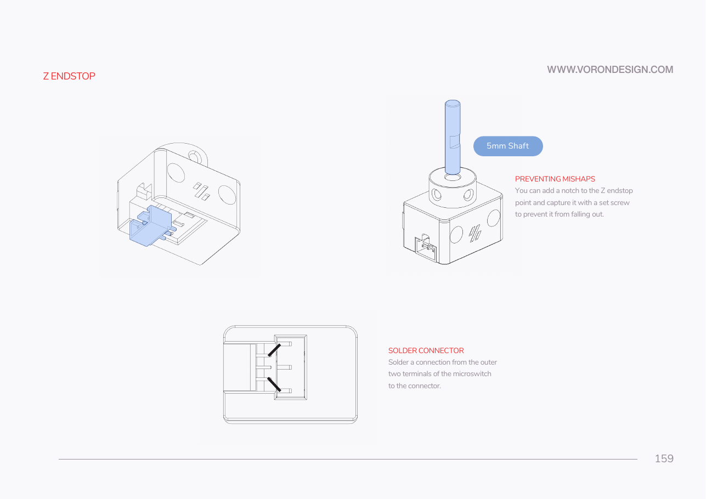

**What you're looking at:** The 5 mm shaft is the part the nozzle actually touches. The single set screw only has to stop it falling out of the body — any tighter and it clamps the shaft, and a shaft that will not drop back under its own weight gives a Z zero that drifts on every probe.

**Parts:** 5 mm shaft ×1 (LDO ships it in the collar), M3 set screw ×1 (in the collar; LDO's BOM lists pre-applied threadlocker `(verify on bench)`).

**Do:** Drop the 5 mm shaft down through the pulley bore so it rests on the switch plunger. Run the collar's one set screw in until it just stops the shaft falling out — enough to retain it, loose enough that the shaft still slides up and down under its own weight. p.159's notch is one *you can add* to the shaft; LDO's shaft in `z_stop_parts.jpg` shows none and LDO only says *do not overtighten* `(verify on bench)`. If there is no notch, stop the screw a whisker short of the shaft: LDO's test is that it drops under its own weight, not that it is captive upside down.

**Check:** Lift the shaft and let go: it drops freely and clicks the switch. Turn the assembly upside down: a notched shaft stays put; an un-notched one may slide to the set screw — free movement is the requirement, so note which you have for Step 09.30.

⚠ **Rev D+ / LDO:** LDO: *"Remember to install one set screw into the pulley, but do not overtighten it… it should not be so tight as to impede the shaft from freely moving up and down."* Follow **only** the 5 mm shaft part of p.159 — the soldered-connector half of the page does not apply to the PCB version. [src](https://docs.ldomotors.com/voron/voron2/build-faq)

Source: [Voron manual p.159](https://github.com/VoronDesign/Voron-2/blob/de7e89d/Manual/Assembly_Manual_2.4r2.pdf#page=159) · [LDO wiring guide § Assembling the nozzle probe](https://docs.ldomotors.com/en/voron/voron2/wiring_guide_rev_d#assembling-the-nozzle-probe) · [LDO Build Notes § Voron 2.4 build FAQ](https://docs.ldomotors.com/en/voron/voron2/build-faq)

---

### Step 09.30 — Mount the nozzle probe on the bed extrusion

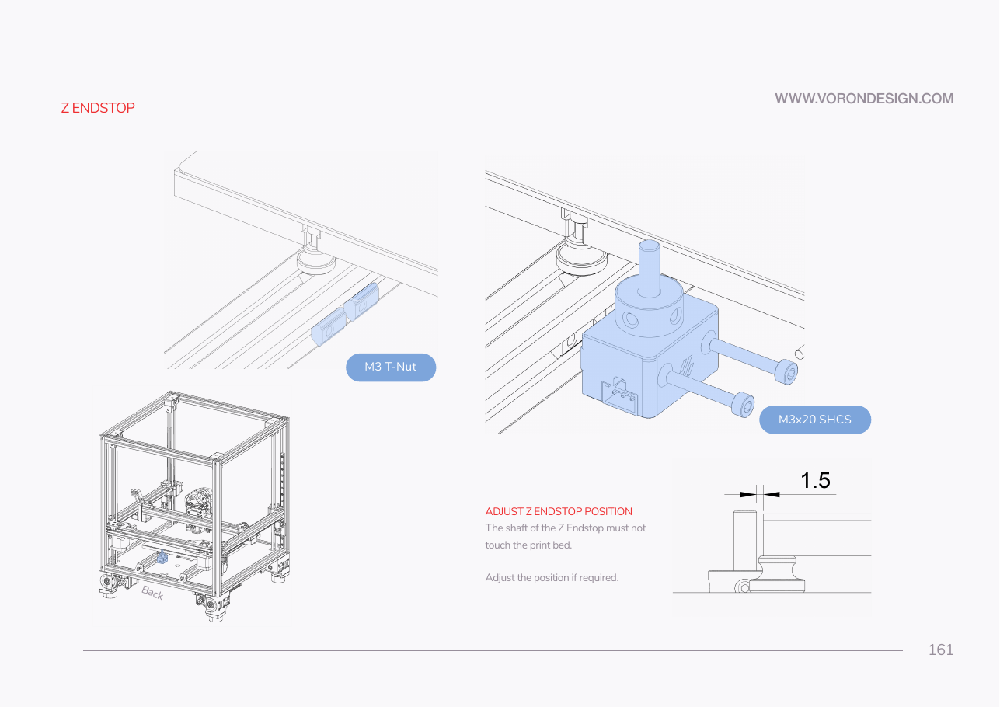 ·

**What you're looking at:** There is no rear bed extrusion — the two bed extrusions run front-to-back (p.28). The probe bolts to the **side slot** of one of them, at its rear end just past the plate, with the pin standing beside the plate's rear edge so the toolhead can drive the nozzle onto it. p.161's 1.5 is the horizontal gap between pin and plate edge — the pin is struck by the nozzle, never by the plate. The printer stays on its head: the slot is reachable through the open rear of the frame.

**Parts:** nozzle probe assembly, M3×25 SHCS ×2, M3 T-nut ×2.

**Do:** No flip. Reach in through the open rear of the inverted frame to the rear end of the bed extrusion on the Z-endstop side — p.161's overview draws it on the **right-hand** extrusion `(verify on bench: any spot beside the plate that the nozzle can reach works, and Ch 13 measures the real X/Y for` `home_xy_position)`. Slide two M3 T-nuts into that extrusion's **side slot** past the rear edge of the plate, hold the probe body flat against the extrusion's side with the pin pointing the same way as the plate's print surface (down, while the printer is inverted), and fasten with M3×25 SHCS, snug. Slide the body along the extrusion — front/back, not sideways — until the pin is about **1.5 mm** clear of the plate's rear edge, per the p.161 detail. If 09.29 showed your shaft is not captive upside down, lift it out for this step and drop it back in the next time the printer is upright, before Ch 13 Step 13.24 needs it.

**Check:** Sighting along the plate's rear edge, the pin clears it by ~1.5 mm and touches nothing. Push the pin toward the body: it clicks the switch and slides back out to its stop when you let go. Probe body square, screws snug, connector reachable for Ch 10.

⚠ **Rev D+ / LDO:** the manual calls for **M3×20 SHCS**. LDO's nozzle probe needs **M3×25 SHCS ×2** — the printed body is thicker. [src](https://docs.ldomotors.com/en/voron/voron2/wiring_guide_rev_d#assembling-the-nozzle-probe)

Source: [Voron manual p.161](https://github.com/VoronDesign/Voron-2/blob/de7e89d/Manual/Assembly_Manual_2.4r2.pdf#page=161) · [LDO wiring guide § Assembling the nozzle probe](https://docs.ldomotors.com/en/voron/voron2/wiring_guide_rev_d#assembling-the-nozzle-probe) · image [`z_stop_final.jpg`](https://raw.githubusercontent.com/MotorDynamicsLab/LDOVoron2/main/Images/WiringGuide/z_stop_final.jpg)

Pause: ~30 min since the last pause — USB adapter stack confirmed and clipped, nozzle probe assembled (collar, PCB, 5 mm shaft) and mounted in the bed extrusion's side slot; the printer is still on its head. Nothing plugged in.

---

### Step 09.31 — Do not build the soldered X/Y microswitches

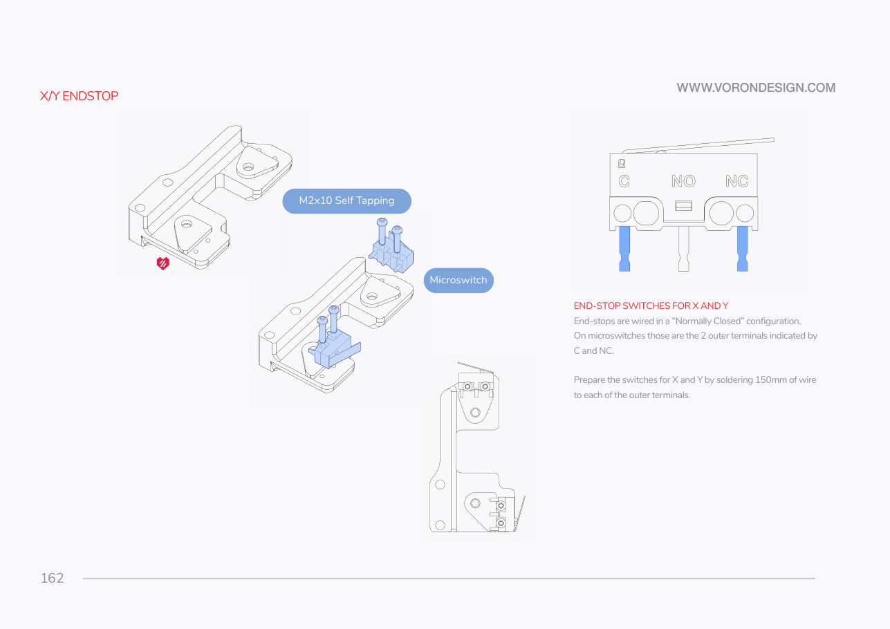

**What you're looking at:** A skip. The manual builds its XY endstops from two loose microswitches with soldered flying leads; this kit ships them as one small PCB with a single 4-pin connector, so there is nothing to cut, strip or solder.

**Parts:** none.

**Do:** Skip the page. No wire is cut, stripped or soldered here.

**Check:** Your XY endstop is one PCB with one 4-pin JST-XH connector, not two loose microswitches with flying leads.

⚠ **Rev D+ / LDO:** **SKIP manual p.162** — *"The kit uses the X/Y Endstop PCB board."* Also skip the hall-effect option on p.163: this kit has no hall-effect endstops anywhere (LDO note on p.145). [src](https://docs.ldomotors.com/voron/voron2/build-faq)

Source: [Voron manual p.162](https://github.com/VoronDesign/Voron-2/blob/de7e89d/Manual/Assembly_Manual_2.4r2.pdf#page=162) · [LDO Build Notes § Voron 2.4 build FAQ](https://docs.ldomotors.com/en/voron/voron2/build-faq)

---

### Step 09.32 — Fit the XY endstop PCB to the pod

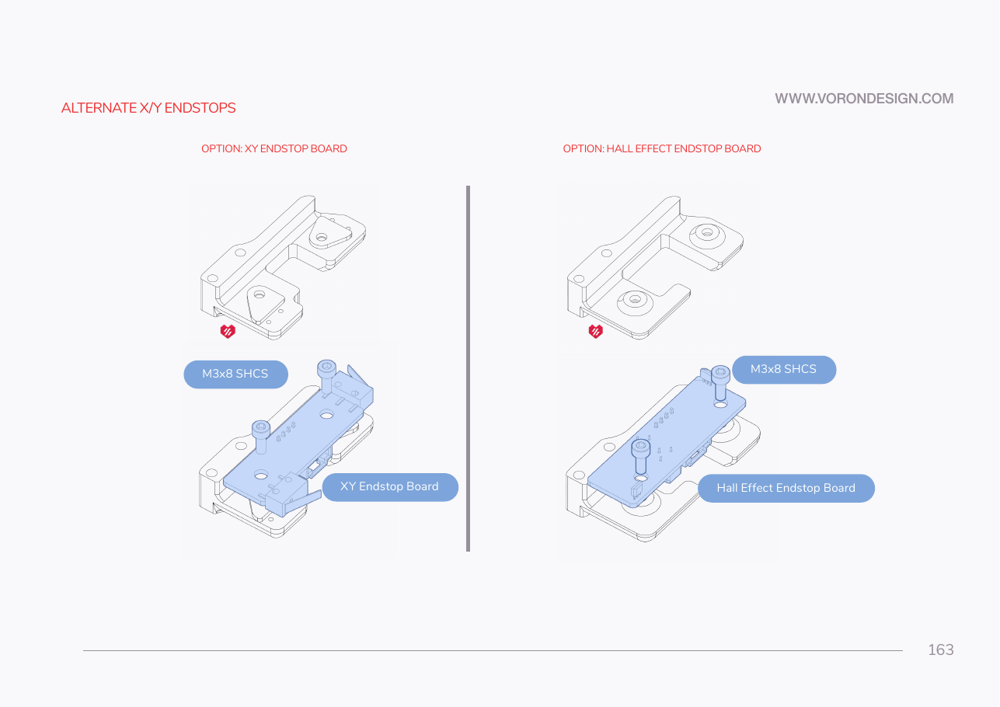

**What you're looking at:** The XY endstop PCB carries both the X and the Y limit switches — the switches that tell the machine where each axis physically ends, which is what gives `G28` a repeatable origin to home to. It bolts into the orange pod printed for Ch 05, and that pod is what puts the switches in the toolhead's and the frame's path.

**Parts:** `[a]_endstop_pod_D2F_switch` ×1 (orange, batch B02; fitted to the gantry in Ch 05), XY endstop PCB ×1, M3×8 SHCS ×2.

**Do:** Follow the **left-hand** option only. Seat the XY endstop board on the pod so both switches face the directions the toolhead and the frame will hit them, and fasten with two M3×8 SHCS.

**Check:** Board flat on the pod, both switches proud and clicking cleanly, connector accessible from below.

⚠ **Rev D+ / LDO:** LDO: *"Follow only the step for the XY Endstop board."* Ignore the hall-effect half of the page. [src](https://docs.ldomotors.com/voron/voron2/build-faq)

⚠ **Rev D+ / LDO:** check the cable labels before Ch 10. LDO documents a batch whose XY endstop cable is labelled *"X Stop / Y Stop"* instead of *"XES / YES"* and needs re-pinning. [XY endstop repin guide](https://docs.ldomotors.com/en/guides/XY_Endstop_Cable_Reconnecting_Guide)

Source: [Voron manual p.163](https://github.com/VoronDesign/Voron-2/blob/de7e89d/Manual/Assembly_Manual_2.4r2.pdf#page=163) · [LDO Build Notes § Voron 2.4 build FAQ](https://docs.ldomotors.com/en/voron/voron2/build-faq) · [LDO XY-endstop repin guide](https://docs.ldomotors.com/en/guides/XY_Endstop_Cable_Reconnecting_Guide)

---

### Step 09.33 — Mount the endstop pod to the gantry

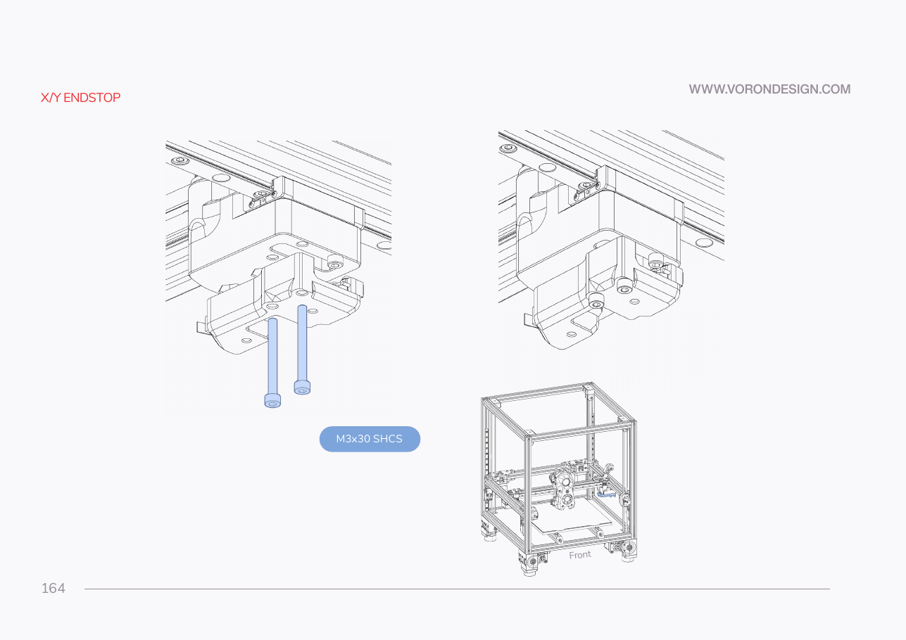

**What you're looking at:** The pod bolts up into the right-hand XY joint on two **M3×30 SHCS** (manual p.164) — long enough to pass through the pod body. The two screws Ch 05 held back from that joint were **M3×16**, which cannot reach the joint through the pod. With the printer still inverted the joint's underside faces up, which is the easy direction. Running the gantry through its full X and Y travel afterwards is the check that the pod only meets something at the two places it is meant to.

**Parts:** pod assembly, M3×30 SHCS ×2 — the manual p.164 value; Ch 05 Step 05.43 bagged two **M3×16** with the pod, which are spares here `(verify against your Ch 05 bag)`.

**Do:** Hold the pod against the underside of the **right-hand XY joint** — facing up with the printer inverted — and drive two M3×30 SHCS through it into the joint's two free holes, the ones Ch 05 left empty. If Ch 05 already fitted the pod, this step is: drop the two screws, fit the PCB from 09.32, and put the screws back.

**Check:** Pod solid with no rotation. Run the gantry through its full X and Y travel by hand — the pod must not foul the frame, a Z rail, the drag chain or the toolhead anywhere except where it is meant to be triggered.

Source: [Voron manual p.164](https://github.com/VoronDesign/Voron-2/blob/de7e89d/Manual/Assembly_Manual_2.4r2.pdf#page=164) · [LDO Build Notes § Voron 2.4 build FAQ](https://docs.ldomotors.com/en/voron/voron2/build-faq) · [Video: Part 6 @1:30:12](https://www.youtube.com/watch?v=8pWoYkY1DiA&list=PL0fUJbigELQPqpeGOgHYisG4KaSXVtnNY&t=5412s)

---

### Step 09.34 — Build and mount the bed WAGO breakout

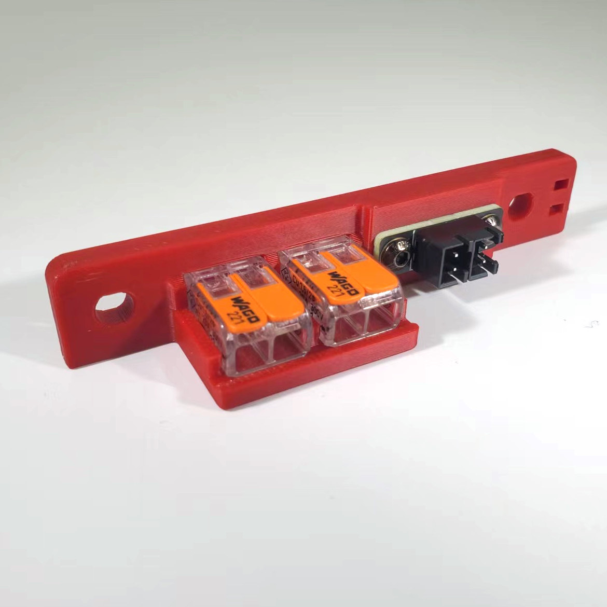

**What you're looking at:** The bed WAGO mount is a small breakout under the deck so the heated bed's three cables — live, neutral and thermistor — terminate at connectors instead of being spliced into the harness. That is what lets the build plate be lifted off from above without unpicking any wiring. The two 2-way WAGOs take the power lines; the little splicer PCB breaks out the thermistor.

**Parts:** Bed WAGO Mount ×1 (LDO-supplied printed), M3×5×4 heat-set inserts ×2, 2×2 XH splicer PCB ×1, M3×6 BHCS ×2, WAGO 221-412 (2-way) ×2, M5×10 BHCS ×2, M5 T-nut ×2 **(verify on bench)**.

**Do:** Heat-set two inserts into the **front** face of the printed mount and let them cool (or confirm them, if you did this in Ch 08's iron session). Fasten the 2×2 XH splicer PCB to them with M3×6 BHCS. Snap the two 2-way WAGO 221-412 clamps directly into their slots. Bolt the finished assembly by its two end holes to a vertical extrusion face beside the bed-cable drop: two M5 T-nuts in the side slot of the rear frame extrusion between the deck's wire opening and the rear-right Z-motor mount (the rear-left is taken by the inlet and the mains WAGOs), WAGO levers facing into the bay, two M5×10 BHCS `(verify on bench — LDO's § Wiring the bed heater does not draw the location; any face where all three bed cables reach with slack and nothing blocks the plate lifting off will do)`.

**Check:** Inserts flush, splicer PCB solid, both WAGO levers free. The three bed cables from Ch 03 — Bed L, N and BED TH — reach the mount with slack, and the plate can still be lifted off the deck from above without disturbing it.

⚠ **Rev D+ / LDO:** this whole sub-assembly is a Rev C+ addition with no page in the manual. Its point is that the build plate detaches from the top of the deck panel without unpicking the harness. Two 2-way WAGOs break out the bed power lines; the splicer PCB breaks out the bed thermistor. Terminating any of it is Ch 10. [src](https://docs.ldomotors.com/en/voron/voron2/wiring_guide_rev_d#wiring-the-bed-heater)

Source: [LDO wiring guide § Wiring the bed heater](https://docs.ldomotors.com/en/voron/voron2/wiring_guide_rev_d#wiring-the-bed-heater) · [LDO 350 Rev D BOM](https://docs.ldomotors.com/en/voron/voron2/350_BOM/Rev_D) · image [`bed_wago_mount.jpg`](https://docs.ldomotors.com/v2_wire_guide/bed_wago_mount.jpg)

Pause: ~25 min since the last pause — XY endstop PCB in its pod and the pod on the gantry, bed WAGO breakout built and mounted under the deck. All three bed cables reach with slack; none of them terminated.

---

### Step 09.35 — Stage the mains-safety hardware, then stop

(no image — see text)

**What you're looking at:** No picture; this is a laying-out step. A **[ferrule](16-glossary.md#f)** is a metal sleeve crimped over a stranded conductor so it enters a screw terminal as a single solid pin — bare strands spread under the screw, work loose and eventually arc. Everything Ch 10 needs is staged now so its mains sequence runs uninterrupted.

**Parts:** VE0508 ferrules ×5, C13 power cord ×1 (stays bagged), ring terminal for the frame PE, cable tags.

**Do:** Lay out what Ch 10 needs and check you have it, then do nothing else. Every stranded conductor that enters a screw terminal in this machine gets a **VE0508 ferrule** crimped on first — bare strands in a PSU or SSR terminal work loose and arc. Identify the frame's PE point and confirm the paint or anodising is clear under it. Identify where the mains cable will be strain-relieved at the inlet so no conductor takes load from the cord. Confirm the C13 cord is still in its bag.

**Check:** Five ferrules present and the crimp tool to hand. A clean metal-to-metal frame PE point identified. Cord bagged and the inlet switch off.

⚠ **Rev D+ / LDO:** **no wiring happens in this chapter and no plug goes in a socket.** LDO's own warning: *"Mains wiring should only be performed by certified personnel trained in local regulations and safety standards."* Ch 10 runs the full harness in LDO's order and gates on **Checkpoint #1** — with the cord unplugged, continuity within each colour group, **no** continuity between L, N and PE, and the PSU selector re-confirmed at 115 V — before anything is ever switched on. [src](https://docs.ldomotors.com/en/voron/voron2/wiring_guide_rev_d#checkpoint-1)

Source: [LDO wiring guide § Checkpoint #1](https://docs.ldomotors.com/en/voron/voron2/wiring_guide_rev_d#checkpoint-1) · [survey §7.5](../voron-build-instructions-survey.md)

---

### Step 09.36 — Check the bay against LDO's layout and hand it to Ch 10

(no image — see text)

**What you're looking at:** A comparison pass, not a build step. LDO's placement image is the Rev D reference and nothing published matches a Rev D+ bay exactly, so you compare component by component, not pixel by pixel — and you tag everything now, while there is nothing in the way, because once Ch 10 has filled the ducts and closed the lids the tags are what you read.

**Parts:** none.

**Do:** With the printer still on its head, light the bay from the side and compare it against LDO's [`S0General_Placement.jpg`](https://raw.githubusercontent.com/MotorDynamicsLab/LDOVoron2/main/Images/WiringGuide/RevD/S0General_Placement.jpg) component by component, standing at the rear as the chapter intro defines: SSR left of the PSU on the rear rail, Leviathan and Pi with the USB adapter at the right-hand end of the front rail, inlet and WAGOs at the rear-left. Tag the boards and the WAGO blocks with the supplied cable tags now, while there is nothing in the way.

**Check:** Your bay matches LDO's layout in kind and roughly in position. Every component is latched or bolted, nothing is wired, no duct lids are on, and the deck's wire opening is clear.

---

## Checkpoint 09

- [ ] Two DIN rails run **left-to-right**, each bolted with one M5×10 BHCS into each bed extrusion, all four plastic end caps fitted.
- [ ] Five wire ducts VHB'd down; the rear duct runs rearward of the deck's wire opening, and the opening is clear.
- [ ] Meanwell LRS-200-24 selector set to **115 V**, on the rear rail via its two printed brackets — and **no** support bracket fitted.
- [ ] Omron SSR on its metal bracket, latched to the rear rail left of the PSU, LOAD (1/2) and INPUT (3+/4−) identified and reachable.
- [ ] **Every** Leviathan voltage-selection jumper removed and bagged.
- [ ] Leviathan on the front rail with the Pi 4B mounted on it, heatsink fitted, SD card in, and the **3/4** HAT power adapter seated.
- [ ] USB adapter on the front rail with the partial cover and the supplied grounding cable attached to its exposed point; frame end left loose for Ch 10.
- [ ] IEC inlet module (one part, not two) in `power_inlet_IECGS_1mm`, panel bolted to the rear extrusion hard against the rear-left Z-motor mount; three WAGO 221-415 clamps in the mains WAGO mount to its right.
- [ ] Nozzle probe assembled — collar home, PCB on two M2×10, shaft free — and mounted on **M3×25 SHCS** in the bed extrusion's side slot, pin ~1.5 mm clear of the plate's rear edge.
- [ ] XY endstop PCB on the pod, pod on the gantry, full X and Y travel with no fouling.
- [ ] Bed WAGO breakout built and mounted; the plate still lifts off the deck from above.
- [ ] Nothing wired. Nothing plugged in. Duct lids off, skirts and bottom panel off. Multimeter on the bench.

## Common mistakes

- **Fitting the p.169 support bracket "because it's in the manual".** LDO explicitly skips it; the two printed brackets are the mount. Bolting an unneeded L-bracket to the frame just puts a screw where a cable wants to go.
- **Leaving the Leviathan's voltage jumpers in.** The one mistake in this chapter that destroys hardware. They come out before the board is installed, not before it is wired.
- **Setting the PSU selector after the bay is full.** Once the PSU is on the rail behind a wire duct the switch is nearly invisible. Set it at 09.14, before it goes on the rail.
- **Fitting the V1 USB adapter cover.** It hides the grounding point that Rev D+ exists to expose, and the ESD path silently ends up broken.
- **Closing the bay, or plugging the cord in "just to see the PSU light".** Both belong after Checkpoint #1 in Ch 10 (survey §5.2 W8).
- **Over-driving M2 self-tapping screws into ASA.** Two turns too far strips the boss and the DIN clip or the Z endstop PCB never sits solid again.

## Next

Ch 10 — Wiring: above-deck, below-deck, mains and **Checkpoint #1** (LDO wiring guide, in its own order, plus manual p.194–195 for drag-chain slack). Nothing in this bay gets energised until that checkpoint passes.

Source: [LDO wiring guide § General Placement](https://docs.ldomotors.com/en/voron/voron2/wiring_guide_rev_d#general-placement) · [survey §7.5](../voron-build-instructions-survey.md)

Pause: ~15 min since the last pause — bay fully populated, tagged and checked against LDO's layout, printer still on its head, mains-safety hardware staged in one labelled bag, meter beside it. **Do not start Ch 10 in a leftover ten minutes**: mains work is a fresh session with a clear head, and it ends at LDO's Checkpoint #1.

