# Chapter 10 — Wiring and Checkpoint #1

Builds every harness — mains, 24 V, motion, sensors, lighting, toolhead umbilical — and ends at the gate that must pass before the machine is ever plugged in.

**What you're building in this chapter.** Four systems, in this order. The **mains side** — the C14 inlet with its integrated switch and fuse, a three-block WAGO bus for Live, Neutral and earth, the 24 V PSU, and the solid-state relay that lets firmware switch a mains bed heater — goes in first and is then proved with a meter before anything is plugged in. The **24 V side** fans out from the PSU to the Leviathan mainboard, to its separate high-voltage stepper supply, and to the USB adapter PCB that feeds the toolhead. The **signal side** is everything the machine senses and lights with: six motor cables on their mapped driver sockets, the XY endstop pod on the gantry, the mechanical nozzle probe that sets Z=0, the bed thermistor, two COB light strips and their junction PCB, the bay and filter fans, and the Pi's screen, network and USB links. Finally the three **drag chains** — X, Y and Z — are mounted and filled, so every cable can follow the moving gantry for years without fatiguing. The chapter ends unplugged, open and metered, with LDO's Checkpoint #1 behind you.

**Time:** 5.0–7.0 h hands-on, first build (survey §5.1, §7.2).

**Sessions:** 14 × ~30 min (Pause segments below; every minute figure in this chapter is a first-build estimate derived from the Time range and the step count).

**Prerequisites:**

- **Ch 03 — Build plate.** Plate bolted down; heater, thermistor and PE leads hanging loose below deck.
- **Ch 06 — Z axis.** Gantry in, Z belts on. The gantry must move by hand over its full Z travel — that is what sets the chain slack.
- **Ch 07 — A/B belts.** Probe wires already dressed along the X extrusion (manual p.143).
- **Ch 08 — Toolhead.** Stealthburner + CW2 + Nitehawk-SB **V2** assembled, all toolhead-side connectors seated, USB-adapter PCB stack built.
- **Ch 09 — Electronics bay.** DIN rails, wire ducts, Leviathan on its brackets, Raspberry Pi mounted on its standoffs with the HAT power adapter, nozzle-probe PCB assembled and mounted, bed WAGO mount fitted, SSR on its DIN bracket, USB-adapter PCB on its DIN clip.
- **Print batches: B05** (Z joints + Z chain), **B07** (electronics bay + lighting — the eight COB mounts and the 3×5 WAGO mount), which also carries `power_inlet_IECGS_1mm` on **plate B07-P3** (moved out of B08 — index correction #11). No plate of B08 is needed before Ch 11.

**Tools**

- **Multimeter — mandatory.** Continuity/beeper, resistance to at least 2 MΩ, and a DC volts range. No multimeter, no power-on.
- 2.5 mm flat-blade screwdriver (supplied) — WAGO levers, plug-type terminals, drag-chain latches
- PH2 Phillips — PSU terminal block and SSR terminals
- Hex 2 / 2.5 / 3 / 4 mm
- Flush cutters, small long-nose pliers, tweezers (endstop repin)
- Soldering iron + brass M3 insert tip (COB mounts, Z chain guide)
- Label maker, or the cable tags supplied in the kit

**Consumables:** zip ties (of the 100 supplied, this chapter eats 30–40), VE0508 ferrules ×5 (spares), IPA and a lint-free cloth for the extrusion slots before the covers go on.

**Printed parts**

| Looks like | STL | Qty | Colour |
|---|---|---|---|
| 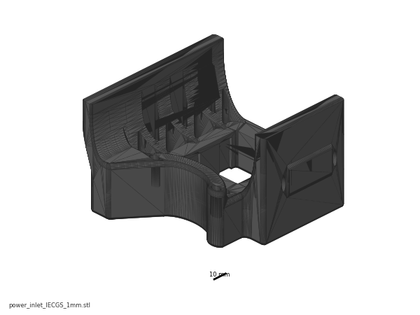{ width=96 } | `power_inlet_IECGS_1mm.stl` (Voron-2 `STLs/Skirts/`) | 1 | Black |
| 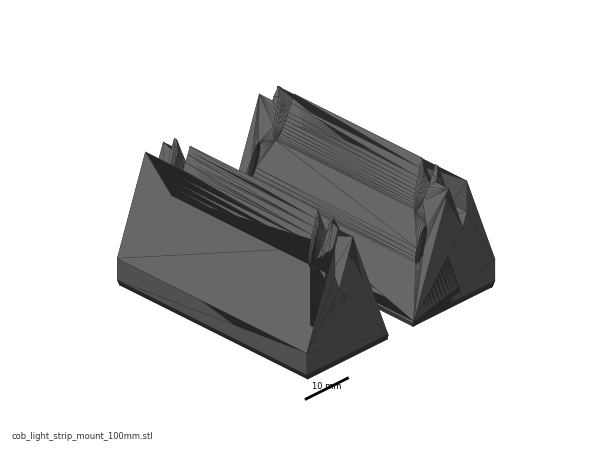{ width=96 } | `cob_light_strip_mount_100mm.stl` (LDOVoron2 `STLs/COB Light Strip/`) | 6 | Black |
| 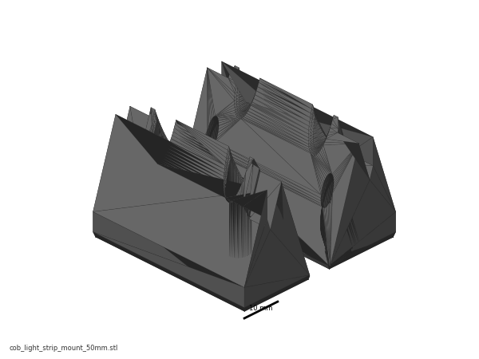{ width=96 } | `cob_light_strip_mount_50mm.stl` (LDOVoron2 `STLs/COB Light Strip/`) | 2 | Black |
| 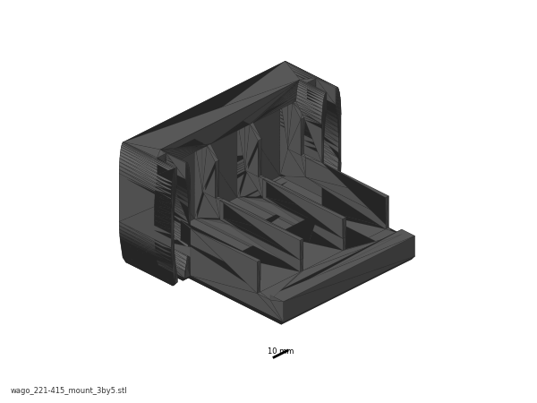{ width=96 } | `wago_221-415_mount_3by5.stl` (Voron-2 `STLs/Electronics_Bay/`) | 1 | Black — fitted in Ch 09, populated here |
| 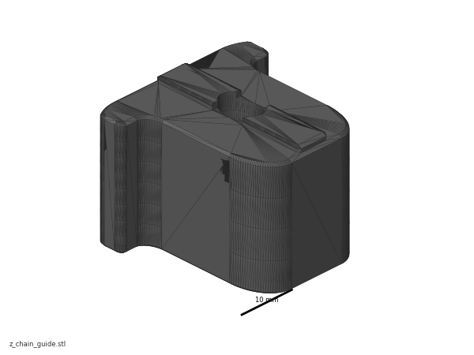{ width=96 } 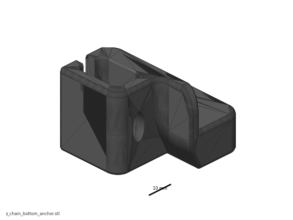{ width=96 } | `z_chain_guide` / `z_chain_bottom_anchor` (batch B05) | 1 / 1 | Black |
| { width=96 } | `[a]_z_chain_retainer_bracket_x2` (batch **B02**, plate B02-P3) | 2 printed, 1 fitted, 1 spare **(verify on bench)** | Orange |
|  | `2x3 Splitter Spacer` | 2 | LDO-supplied printed — do not print |
| 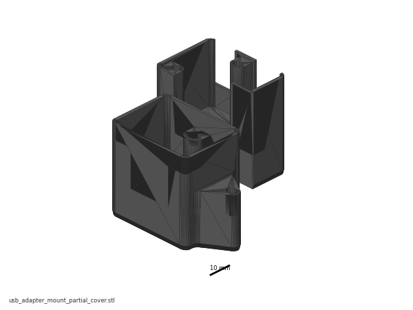{ width=96 } | `usb_adapter_mount_partial_cover.stl` (**Nitehawk-SB-V2** repo) | 1 | Black — fitted in Ch 08/09, used here |

**Hardware** (chapter totals)

| Fastener / part | Qty | Note |
|---|---|---|
| AC inlet, integrated switch + fuse | 1 | pre-wired; verify, don't rewire |
| Meanwell LRS-200-24 PSU | 1 | 24 V 8.8 A; 115/230 V selector on the side |
| Omron SSR G3NB-210B-1 + DIN bracket | 1 | 24–220 VAC 10 A |
| WAGO 221-415 (5-way) | 3 | N / L / PE bus |
| WAGO 221-412 (2-way) | 2 | bed L and bed N breakout, on the bed WAGO mount |
| 3×2 XH splicer PCB | 2 | one for the 6020 fan pair, one as the LED junction |
| 2×2 XH splicer PCB | 1 | bed thermistor breakout (fitted Ch 09) |
| Drag chain 10×10 R18 | 2 | X chain and Y chain |
| Drag chain 10×15 R28 | 1 | Z chain |
| M3×5×4 brass heat-set insert | 18 | 16 for the COB mounts, 2 for the Z chain guide |
| M3×6 FHCS | 16 | COB mount halves |
| M3×8 SHCS | 20 | 16 COB mounts to extrusion, 2 per splicer PCB ×2 |
| M3 hammerhead T-nut, 2020 | 20 | pairs with the M3×8 SHCS above |
| M3×6 FHCS (chain ends, X and Y) | (verify on bench) | manual p.197, p.199 — 2-hole chain ends |
| M3 roll-in T-nut, 2020 | 2 | X and Y chain ends |
| M3×10 FHCS | 4 | Z chain top and bottom ends (p.202) |
| M3×12 SHCS | 2 | Z chain retainer bracket to the A drive (p.204) |
| M5×10 BHCS + M5 roll-in T-nut | 2 + 2 | Z chain guide (p.201), Z chain bottom anchor (p.203) |
| M3×10 FHCS (inlet into plug panel) | (verify on bench) | manual p.156 — the IECGS panel has fewer inserts than the stock one |
| M3×8 SHCS + M3 roll-in T-nut (plug panel to frame) | (verify on bench) | LDO does not specify; the rear skirt traps it in Ch 11 |
| M5×10 BHCS + M5 roll-in T-nut (frame PE) | 1 + 1 | plus the two M5 locking washers below |
| M5 locking washer | 2 | frame PE stack |
| Extrusion slot cover, 6 mm | up to 9 | closes the slots the LED leads run in |
| VE0508 ferrule | 5 | spares |
| Zip ties 3×150 mm | ~35 | from the 100 supplied |

**Read first**

- **Mains is the one step in this build that can kill you.** Nothing gets plugged in until Checkpoint #1 passes with a meter. If your local regulations forbid you from wiring the mains side, stop at step 10.4 and get it done by someone certified. [src](https://docs.ldomotors.com/en/voron/voron2/wiring_guide_rev_d)
- **Set the PSU's 115/230 V selector before anything else** and check it again at Checkpoint #1. Getting it wrong destroys the PSU on the first switch-on. [src](https://docs.ldomotors.com/en/voron/voron2/wiring_guide_rev_d#preparing-the-power-supply-unit)
- **Keep every wire loose inside every drag chain.** Taut wires fatigue and break — the single most-repeated LDO warning, and the umbilical is the cable it kills. [src](https://docs.ldomotors.com/voron/voron2/build-faq)
- **Close nothing until Checkpoint #1 passes.** No duct covers, no skirts, no bottom panel. Re-opening a closed bay costs an hour and tempts you to skip the meter (survey §5.2 W8).
- **Never plug or unplug a stepper, or the Micro-Fit umbilical connector, with power on.** Back-EMF kills drivers; hot-plugging the umbilical can take out the Nitehawk or the Pi. [src](https://docs.ldomotors.com/en/Toolboard/nitehawk-sb-v2#cable-pinout-adapter-side)
- Your Rev D+ toolboard is a **Nitehawk-SB V2**. The Klipper config and the USB serial-ID pattern both differ from the Rev D wiring guide — that is Ch 12's problem, but do not let anyone talk you into loading `leviathan-printer-rev-d.cfg` on this board (survey §4.1 ①②).

**Sources for this chapter:**

- [Voron 2.4r2 Assembly Manual](https://github.com/VoronDesign/Voron-2/blob/de7e89d/Manual/Assembly_Manual_2.4r2.pdf), pinned commit `de7e89d` — p.143, p.156, p.181, p.194–195, p.197–204
- [LDO wiring guide, Rev D](https://docs.ldomotors.com/en/voron/voron2/wiring_guide_rev_d) — every connector step below cites its own section anchor
- [LDO Build Notes (build FAQ)](https://docs.ldomotors.com/voron/voron2/build-faq#build-notes) — the per-page SKIP notes for p.152, p.162–163, p.169, p.172, p.190, p.194–198
- [LDO Rev D printed-parts guide](https://docs.ldomotors.com/en/voron/voron2/printed_part_guide_rev_d) and [Rev D 350 BOM](https://docs.ldomotors.com/en/voron/voron2/350_BOM/Rev_D)
- [LDO Leviathan V1.3 guide](https://ldomotion.com/guides/voron-leviathan-v1-3) — board silkscreen, jumper block, port map
- [Nitehawk-SB V2 board doc](https://docs.ldomotors.com/en/Toolboard/nitehawk-sb-v2) and the [Nitehawk-SB-V2 repo](https://github.com/MotorDynamicsLab/Nitehawk-SB-V2/tree/42ae497) at commit `42ae497` (pinout, grounding and cable-chain images)
- [LDO XY endstop reconnecting guide](https://docs.ldomotors.com/en/guides/XY_Endstop_Cable_Reconnecting_Guide) and [BTT 4.3" screen rotate guide](https://docs.ldomotors.com/en/guides/btt_43_rotate_guide)
- [`leviathan-printer-rev-d-sbv2.cfg`](https://github.com/MotorDynamicsLab/LDOVoron2/blob/667521d/Firmware/leviathan-printer-rev-d-sbv2.cfg) at commit `667521d` — the pin assignments this chapter wires to
- [Klipper `temperature_sensors.cfg`](https://github.com/Klipper3d/klipper/blob/f0892d8/klippy/extras/temperature_sensors.cfg) at commit `f0892d8` — the thermistor curve in step 10.76
- Step images mirrored into `assets/remote/10-wiring/` — [LDOVoron2](https://github.com/MotorDynamicsLab/LDOVoron2/tree/8270e8c/Images/WiringGuide) at `8270e8c`, the [Nitehawk-SB-V2 images](https://github.com/MotorDynamicsLab/Nitehawk-SB-V2/tree/42ae497/Images) at `42ae497`, and six diagrams from the LDO wiki. All are LDO Motors' work, mirrored with attribution for this non-commercial manual; owner, source URL, date and sha256 for each are in that folder's `SOURCES.txt`

**Manual pages this chapter replaces.** The official manual's Wiring chapter describes a BTT Octopus machine with a 5 V PSU. Per LDO's build notes, **skip p.182–183, 186–193, 196 and 205–209 entirely** and follow the LDO wiring guide instead. Only p.181 (PSU voltage check), p.194–195 (cable-chain overview) and p.197–204 (chain mounting) survive, and they appear below as steps. [src](https://docs.ldomotors.com/voron/voron2/build-faq)

---

## Section 1 — Mains: inlet → switch → PSU → SSR → bed heater

### Step 10.1 — Empty the bay and set the end state

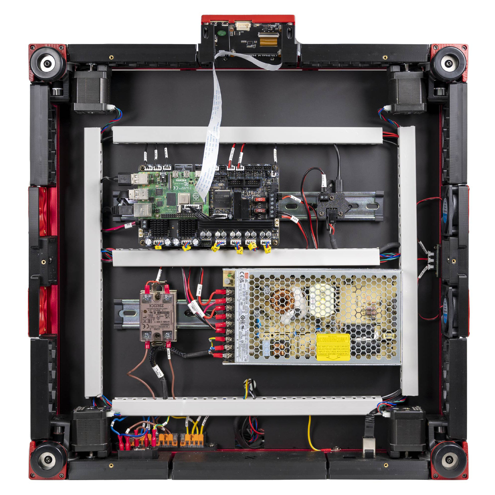

**What you're looking at:** The photo is LDO's finished Rev D electronics bay — the state this chapter ends in — seen from below with the printer on its side. Everything in it was placed in Ch 09: two [DIN rails](16-glossary.md#d) (the standard 35 mm steel strips every board clips onto), the slotted [wire ducts](16-glossary.md#w) that cable runs hide inside, the Leviathan mainboard with the Raspberry Pi on top, the PSU, the relay, and the empty WAGO mount. Yours is that same bay with nothing wired yet.

**Parts:** none.

**Do:** Stand the printer on its side or lay it on its back so the deck underside faces you, on a blanket. Confirm the bay contains only what Ch 09 put there: DIN rails with end caps, wire ducts, Leviathan + Pi, SSR on its bracket, USB-adapter PCB on its DIN clip, bed WAGO mount, and the empty 3×5 WAGO mount. Unplug the C13 cord and put it in another room.

**Check:** The photo above is the target. Nothing is connected yet and no duct covers are on.

Source: [LDO Rev D photo VS9 finished bay](https://raw.githubusercontent.com/MotorDynamicsLab/LDOVoron2/8270e8c/Images/WiringGuide/RevD/VS9_Final.jpg) · [LDO wiring guide § Finish line](https://docs.ldomotors.com/en/voron/voron2/wiring_guide_rev_d#finish-line)

---

### Step 10.2 — Set the PSU input-voltage selector

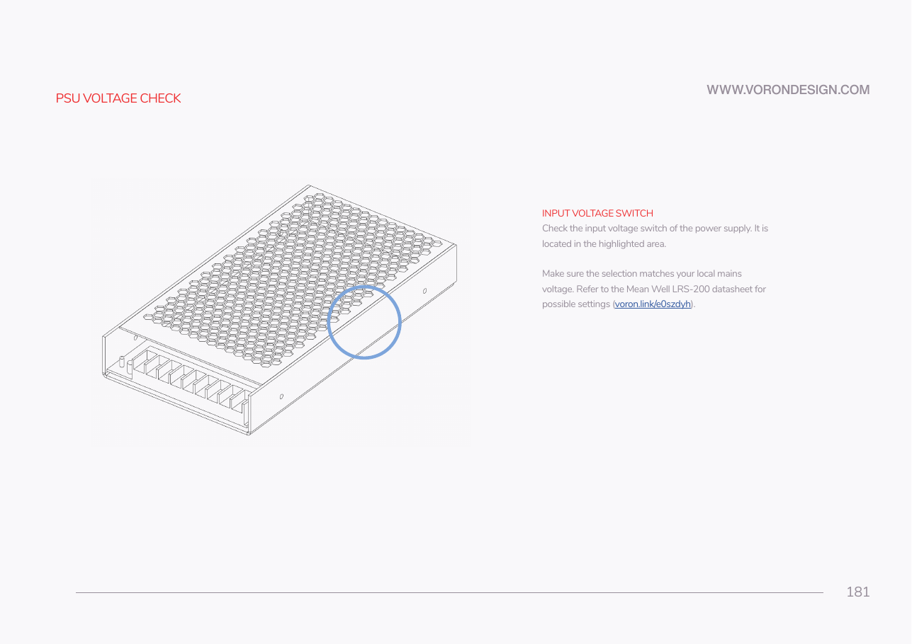

**What you're looking at:** The grey brick is the [Meanwell LRS-200-24](16-glossary.md#m), the 24 V supply that powers everything in the machine except the bed heater. The manual page shows where it sits in the bay; the second photo is a close-up of the small red slide switch in its side, which tells the unit whether it is being fed 115 V or 230 V mains.

**Parts:** Meanwell LRS-200-24 ×1.

**Do:** Find the small red slide switch in the cut-out on the PSU's long side. Slide it so the window shows **115** for a US 110/120 V supply, **230** for a 230 V supply. Use the flat screwdriver, not a fingernail — the switch is stiff and detented.

**Check:** Read the number in the window out loud and compare it to your wall socket. The yellow warning label on the PSU lid says the same thing: *"AC INPUT VOLTAGE CAN BE SELECTED BY SWITCH, CHECK INPUT VOLTAGE AVOIDING DAMAGE BEFORE POWER ON."*

⚠ Rev D+ / LDO: EU kits may ship the **Meanwell RSP-200-24** instead. That unit has power-factor correction and a universal AC input — there is no selector and nothing to set. If your PSU has no red switch, you have the RSP; skip this step. [src](https://docs.ldomotors.com/en/voron/voron2/wiring_guide_rev_d#preparing-the-power-supply-unit)

Source: [Voron manual p.181](https://github.com/VoronDesign/Voron-2/blob/de7e89d/Manual/Assembly_Manual_2.4r2.pdf#page=181) · [LDO wiring guide § Preparing the power supply unit](https://docs.ldomotors.com/en/voron/voron2/wiring_guide_rev_d#preparing-the-power-supply-unit) · [LDO wiring photo psu_switch.jpg](https://raw.githubusercontent.com/MotorDynamicsLab/LDOVoron2/8270e8c/Images/WiringGuide/psu_switch.jpg)

---

### Step 10.3 — Confirm the Leviathan voltage-selection jumpers are off

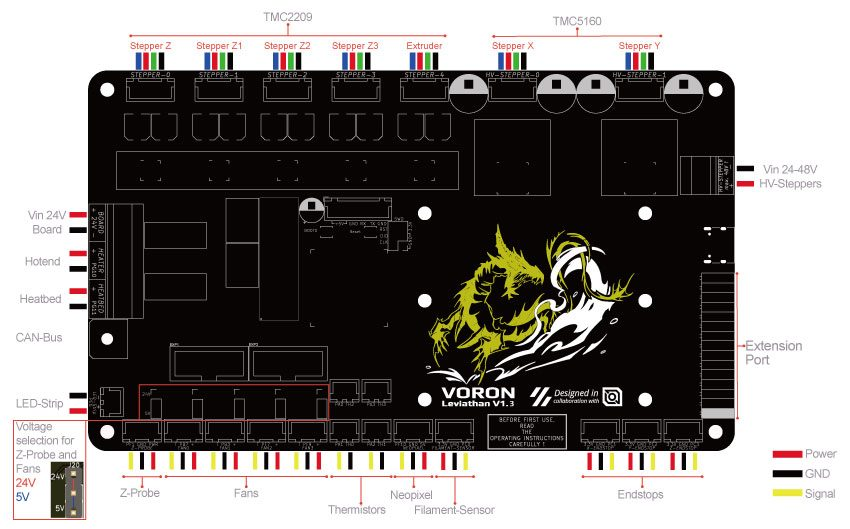

**What you're looking at:** The [Leviathan](16-glossary.md#l) is LDO's mainboard — the one board that drives all six motors, reads the bed thermistor and the endstops, and supplies the Raspberry Pi with 5 V. The jumper block here is a row of five pin pairs that choose 24 V or 5 V for the probe port and the four fan ports; a jumper is the tiny removable cap that shorts one pair.

**Parts:** Leviathan mainboard ×1.

**Do:** Look at the jumper block silkscreened *Voltage selection for Z-Probe and Fans* (24 V / 5 V) next to the fan headers. All five positions — **Probe, Fan0, Fan1, Fan2, Fan3** — must be bare. Ch 09 should have removed them; verify now, because two of them go back on in step 10.28 and you need to know they started clean.

**Check:** Five empty jumper pairs. Any jumper still fitted at 5 V while a 24 V load is plugged in shorts 5 V to 24 V and destroys the board.

⚠ Rev D+ / LDO: this build uses an **active** toolboard, so the Leviathan's own probe port and Fan0/Fan1 stay unused and unjumpered for the whole build. [src](https://ldomotion.com/guides/voron-leviathan-v1-3) · Leviathan V1.3 manual p.7

Source: [LDO wiring guide § Preparing the mainboard](https://docs.ldomotors.com/en/voron/voron2/wiring_guide_rev_d#preparing-the-mainboard-ldo-voron-leviathan-board) · [LDO Leviathan V1.3 guide](https://ldomotion.com/guides/voron-leviathan-v1-3) (manual p.7) · [Leviathan repo `wiring_V1.3.jpg`](https://raw.githubusercontent.com/MotorDynamicsLab/Leviathan/878c3c4/Media/wiring_V1.3.jpg)

---

### Step 10.4 — Fit the AC inlet into the printed plug panel

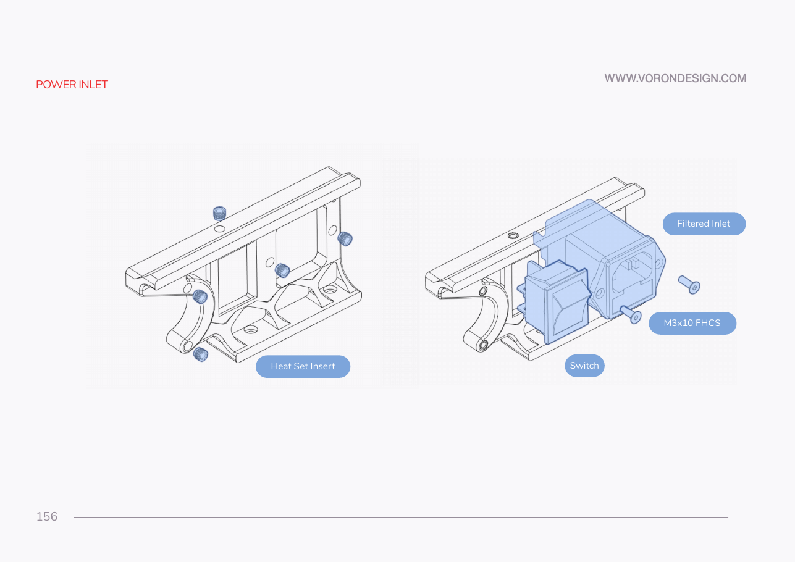

**What you're looking at:** `power_inlet_IECGS_1mm` is the printed panel that carries mains into the machine. The module clicking into it combines three things in one body — the [C14 inlet](16-glossary.md#i) the kettle lead plugs into, the on/off rocker, and the fuse drawer — which is why the manual page, drawn for the stock Voron separate inlet and rocker, does not match what you are holding.

**Parts:** `power_inlet_IECGS_1mm` ×1, AC inlet module ×1, M3×5×4 heat-set inserts (verify on bench), M3×10 FHCS (verify on bench).

**Do:** Melt the heat-set inserts into the printed panel from the flat face. Push the inlet module into the rectangular opening from the outside until its latches click, then run the M3×10 FHCS into the inserts. **Do not** use the manual's stock plug panel — the kit ships a combined inlet/switch/fuse module, not the manual's separate filtered inlet plus rocker.

**Check:** The inlet sits square in the panel with no rock, the fuse drawer opens freely, and the rocker switch clicks both ways.

⚠ Rev D+ / LDO: LDO note p.156 — use `power_inlet_IECGS_1mm` (1.0 mm AC inlet with integrated switch). [src](https://docs.ldomotors.com/voron/voron2/build-faq)

Source: [Voron manual p.156](https://github.com/VoronDesign/Voron-2/blob/de7e89d/Manual/Assembly_Manual_2.4r2.pdf#page=156) · [LDO Build Notes p.156](https://docs.ldomotors.com/voron/voron2/build-faq#build-notes) · [LDO wiring guide § Preparing the inlet](https://docs.ldomotors.com/en/voron/voron2/wiring_guide_rev_d#preparing-the-inlet)

Pause: ~25 min since the last pause — printer on its side, PSU selector set, Leviathan jumpers off, AC inlet fitted into the printed plug panel. **No mains wiring started.** Do not start the inlet-to-WAGO run until you can finish it: the next segment ends with the whole inlet→WAGO→PSU chain terminated.

---

### Step 10.5 — Verify the pre-wired inlet before you trust it

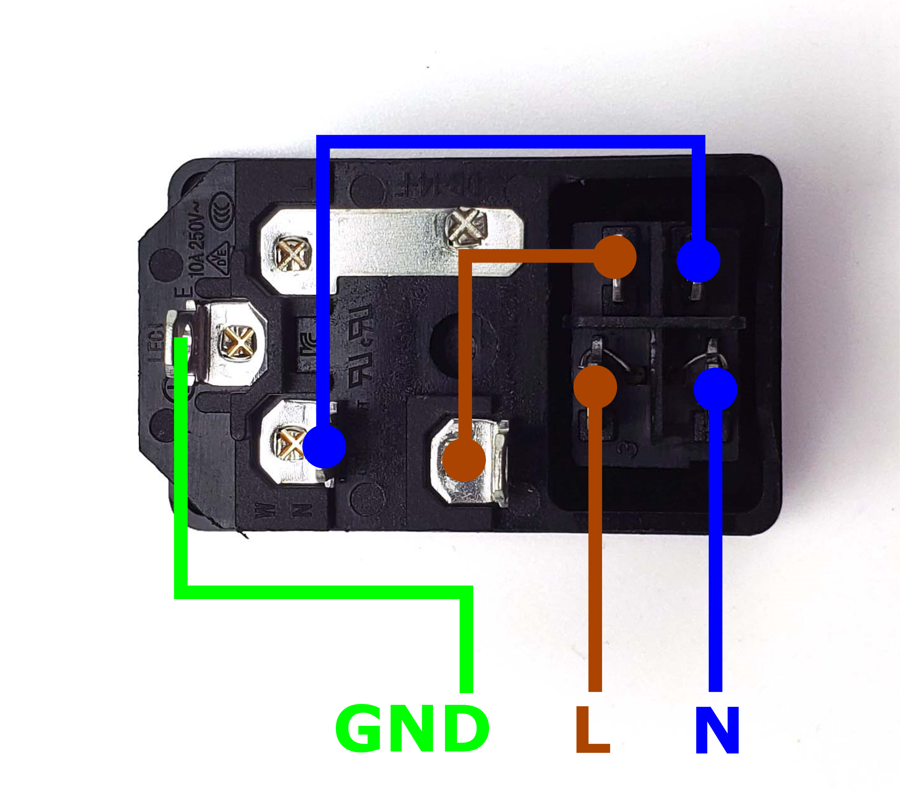

**What you're looking at:** The diagram is LDO's internal map of that inlet module: which spade tab feeds which, with the fuse in series with Live and the rocker breaking both Live and Neutral. The green/yellow wire is [protective earth](16-glossary.md#p), the conductor that bonds the metalwork so the machine stays safe to touch — it is deliberately neither switched nor fused.

**Parts:** AC inlet assembly ×1.

**Do:** The inlet arrives pre-wired between its C14 pins, the fuse holder and the rocker. Compare yours against LDO's diagram, tab by tab: the **fuse sits in series with Live**; Live and Neutral both pass through the rocker; the **Earth spade is neither switched nor fused** and goes straight out. Three wires leave the assembly — brown L, blue N, green/yellow PE.

**Check:** Meter on continuity, nothing plugged in.
- C14 **E** pin → outgoing green/yellow: **beeps, switch in either position.**
- C14 **L** pin → outgoing brown: **beeps only with the rocker ON.**
- C14 **N** pin → outgoing blue: **beeps only with the rocker ON.**
- Pull the fuse: C14 L → outgoing brown now **open** even with the rocker on. Put the fuse back.

Any deviation from that pattern means the inlet is miswired — stop and fix it before anything else. [src](https://docs.ldomotors.com/en/voron/voron2/wiring_guide_rev_d#preparing-the-inlet)

Source: [LDO wiring guide § Preparing the inlet](https://docs.ldomotors.com/en/voron/voron2/wiring_guide_rev_d#preparing-the-inlet) · [LDO wiki inlet layout diagram](https://docs.ldomotors.com/v01_wire_guide/inlet_layout.png)

---

### Step 10.6 — Mount the plug panel to the rear frame

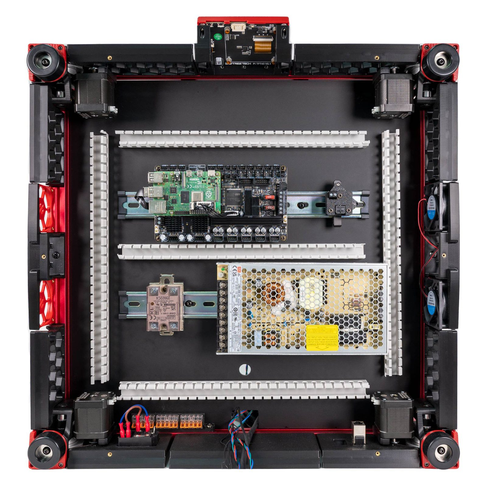

**What you're looking at:** The panel from 10.4 now becomes part of the machine's rear wall, low down and to the left of the opening that will take the Ethernet socket. LDO's general-placement photo shows where it sits relative to the PSU, rails and ducts already in the bay.

**Parts:** inlet assembly from 10.5, M3×8 SHCS + M3 roll-in T-nut (verify on bench).

**Do:** Slide the panel onto the rear-bottom frame extrusion in the position LDO's bay photos show — bottom rear, left of the Ethernet keystone opening. Snug the screws; the rear skirt in Ch 11 will trap it properly.

**Check:** The C14 socket faces straight out of the back of the machine and the rocker is reachable with the printer upright. The three wires reach the WAGO block position with 50–80 mm to spare.

Source: [Voron manual p.156](https://github.com/VoronDesign/Voron-2/blob/de7e89d/Manual/Assembly_Manual_2.4r2.pdf#page=156) · [LDO wiring guide § General placement](https://docs.ldomotors.com/en/voron/voron2/wiring_guide_rev_d#general-placement) · [LDO Rev D photo S0 general placement](https://raw.githubusercontent.com/MotorDynamicsLab/LDOVoron2/8270e8c/Images/WiringGuide/RevD/S0General_Placement.jpg)

---

### Step 10.7 — Populate and label the WAGO bus

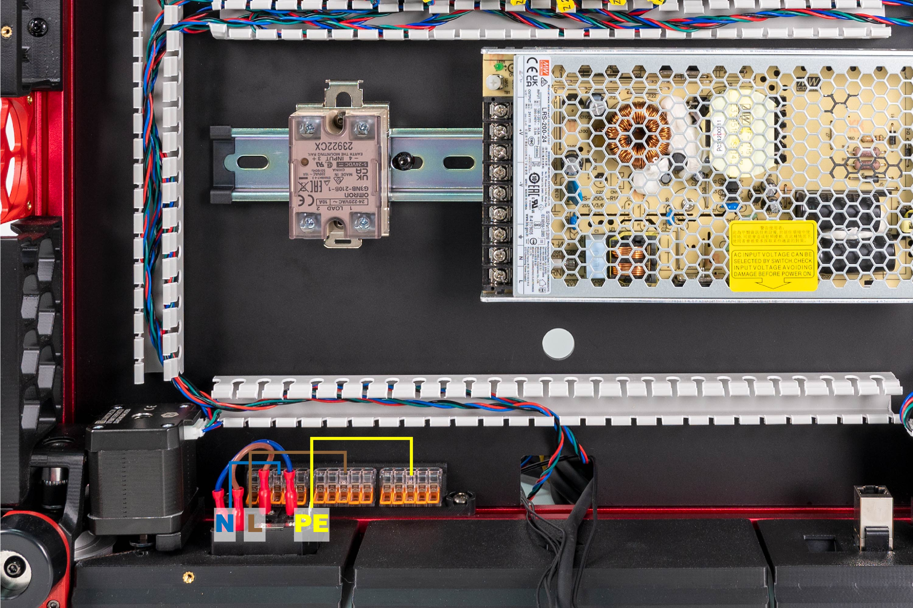

**What you're looking at:** [WAGO 221](16-glossary.md#w) blocks are lever-clamp connectors: lift the orange lever, push a stripped wire in to the stop, close the lever. Three 5-way blocks in their printed mount become the machine's mains bus — one block for Neutral, one for Live, one for earth — so every mains wire lands in a labelled block instead of being spliced onto another wire.

**Parts:** WAGO 221-415 (5-way) ×3, `wago_221-415_mount_3by5` (fitted Ch 09).

**Do:** Snap the three 5-way WAGOs into the printed mount. Label them left to right **N**, **L**, **PE**. Use the label maker — these three words are the whole safety story of the bay and you will read them a dozen times today.

**Check:** Three labelled 5-way blocks, all levers up, all fifteen ports empty.

Source: [LDO Rev D photo S2 inlet/WAGO mapping](https://raw.githubusercontent.com/MotorDynamicsLab/LDOVoron2/8270e8c/Images/WiringGuide/RevD/S2_mapping.jpg) · [LDO wiring guide § Connecting inlet and WAGO](https://docs.ldomotors.com/en/voron/voron2/wiring_guide_rev_d#connecting-inlet-and-wago)

---

### Step 10.8 — Inlet → WAGO bus

**What you're looking at:** This is the first mains run in the machine: the three wires leaving the inlet module land in their matching WAGO blocks. The photo shows the finished result in LDO's bay, with the run buried in a [wire duct](16-glossary.md#w) — the slotted plastic channel that keeps cable off the open deck.

**Parts:** inlet cable (3 cores), WAGO N / L / PE.

**Do:** Lift a lever, insert the stripped core to the stop, close the lever. Blue → **N**, brown → **L**, green/yellow → **PE**. Route the run inside the wire duct, not across open deck.

**Check:** Tug each core hard. None comes out. No copper is visible outside any WAGO port — a whisker of exposed strand next to a live terminal is the failure mode here.

Source: [LDO Rev D photo S2 inlet wired](https://raw.githubusercontent.com/MotorDynamicsLab/LDOVoron2/8270e8c/Images/WiringGuide/RevD/S2_inlet.jpg) · [LDO wiring guide § Connecting inlet and WAGO](https://docs.ldomotors.com/en/voron/voron2/wiring_guide_rev_d#connecting-inlet-and-wago)

---

### Step 10.9 — WAGO bus → PSU

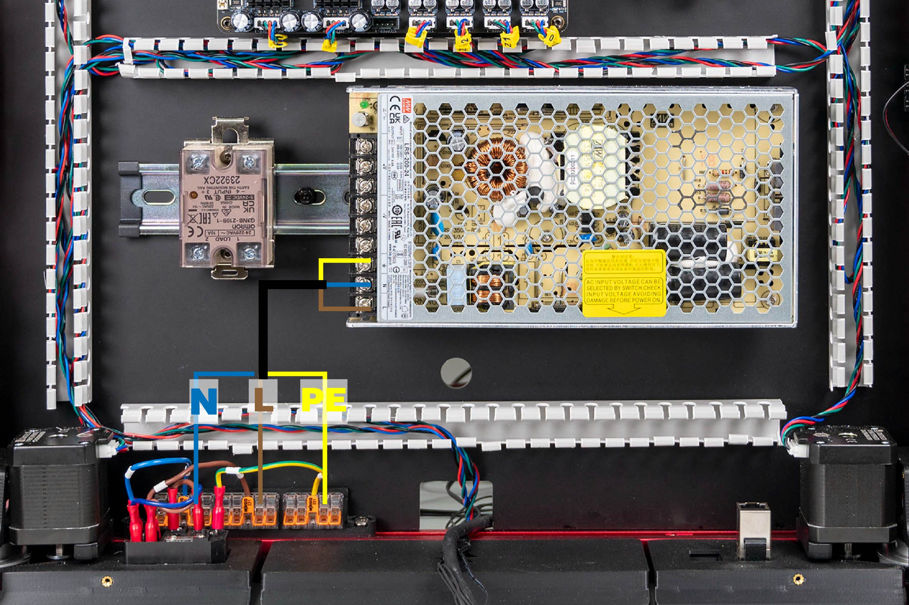

**What you're looking at:** The PSU's terminal block is the row of screws along its short end. The three at one end are the AC input — earth, Neutral, Live — and the rest are the 24 V DC output, which stays completely empty until step 10.24.

**Parts:** PSU AC cable set (3 cores), PH2 screwdriver.

**Do:** The LRS-200-24's terminal block ends in three AC terminals, in this order along the block: **⏚ (earth), N, L** — L is the outermost. Land green/yellow on ⏚, blue on N, brown on L. Torque with the PH2 until the wire cannot be pulled out; these are the only screw terminals in the machine that carry mains.

**Check:** Pull-test all three. Read the silkscreen next to each screw and say the colour out loud. The DC side (+V / −V) is still completely empty at this point.

Source: [LDO Rev D photo S3 WAGO/PSU mapping](https://raw.githubusercontent.com/MotorDynamicsLab/LDOVoron2/8270e8c/Images/WiringGuide/RevD/S3_mapping.jpg) · [LDO wiring guide § Connecting WAGO and PSU](https://docs.ldomotors.com/en/voron/voron2/wiring_guide_rev_d#connecting-wago-and-psu)

Pause: ~30 min since the last pause — inlet verified, plug panel on the frame, WAGO bus labelled N/L/PE, and the inlet→WAGO→PSU run fully terminated at both ends. Nothing plugged in, cord out of the room. Do not walk away with a stripped mains core outside a WAGO lever.

---

### Step 10.10 — Read the SSR terminal numbers before you wire it

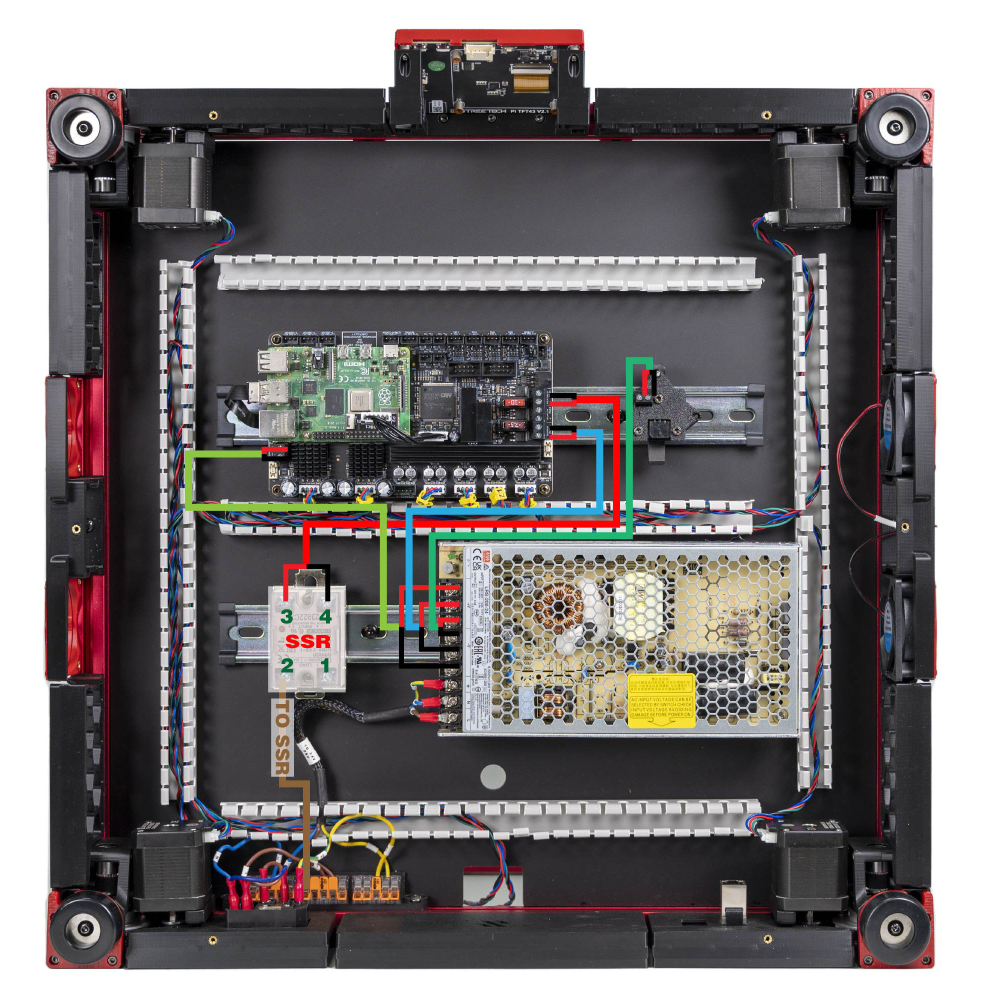
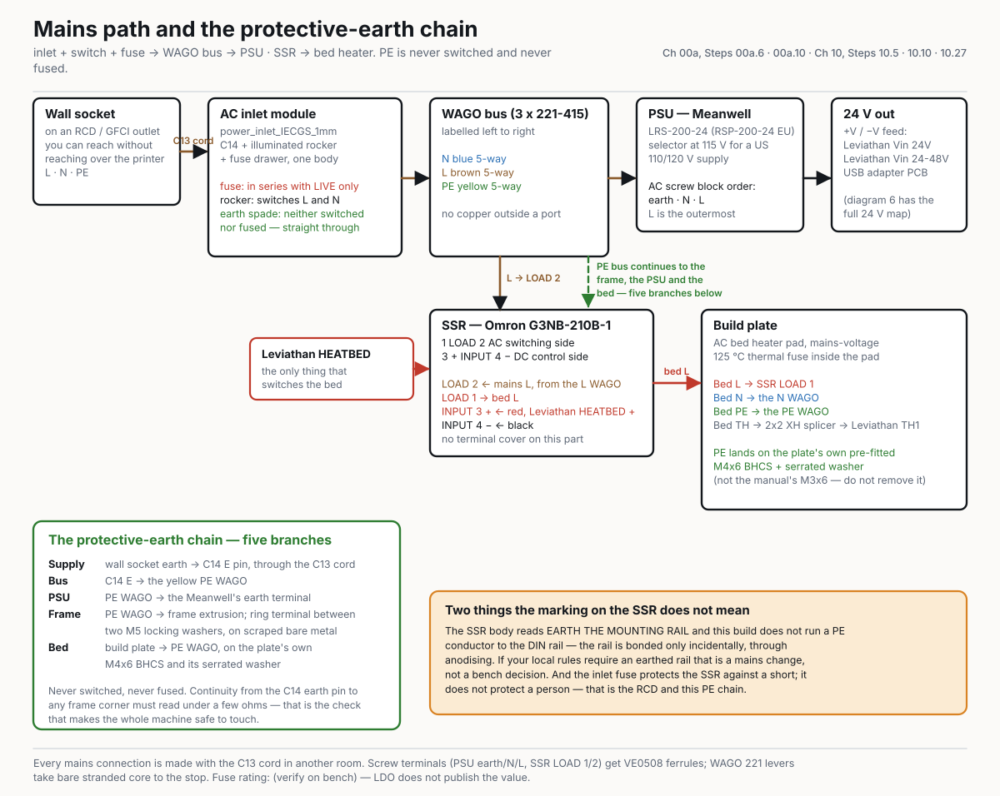

**What you're looking at:** The [SSR](16-glossary.md#s) is the black brick on the DIN rail: a solid-state relay, a switch with no moving contacts, so the mainboard can turn a mains-powered bed heater on and off with a small DC signal. Its four screws are two separate circuits — `1`/`2` is the mains it switches, `3 +`/`4 −` is the low-voltage side that tells it when to switch. The diagram's SSR panel shows all four terminals with what lands on each, including the red-to-3 / black-to-4 control pair from the Leviathan's HEATBED terminals, before you land a single wire.

**Parts:** Omron SSR on its DIN bracket (fitted Ch 09).

**Do:** The SSR has four screw terminals in two pairs, numbered on the body. The pair silkscreened **1 LOAD 2** is the AC switching side. The pair silkscreened **3 + INPUT 4 −** is the DC control side. Note which end the yellow indicator LED sits at — LDO's photo shows the correct orientation on the rail.

**Check:** You can point at terminal 1, 2, 3 and 4 without hesitating, and the LED is on the same side as in the photo.

⚠ Rev D+ / LDO: *"The SSR connection is **critical**, an incorrect connection can cause catastrophic damage."* Nothing else in this chapter carries that warning. [src](https://docs.ldomotors.com/en/voron/voron2/wiring_guide_rev_d#connecting-24v)

Note: the SSR body is also marked *EARTH THE MOUNTING RAIL*. LDO's build does not run a separate PE to the DIN rail. If your local rules require an earthed rail, that is a mains change — have it specified by whoever signs off your mains work.

Source: [LDO Rev D photo S4 24 V/SSR mapping](https://raw.githubusercontent.com/MotorDynamicsLab/LDOVoron2/8270e8c/Images/WiringGuide/RevD/S4_mapping.jpg) · [LDO wiring guide § Connecting 24V](https://docs.ldomotors.com/en/voron/voron2/wiring_guide_rev_d#connecting-24v)

---

### Step 10.11 — Live from the WAGO bus → SSR LOAD 2

**What you're looking at:** The *SSR to Wago* cable is one of the kit's pre-made mains leads: a bare stripped end for the WAGO lever, and a [ferruled](16-glossary.md#f) end — a crimped metal sleeve that turns stranded wire into a solid tube a screw can clamp — for the relay. It brings switched mains Live up to the relay's input side.

**Parts:** *SSR to Wago* cable ×1 (one end tagged **TO SSR**).

**Do:** Land the free end in a spare port of the brown **L** WAGO. Land the **TO SSR** end on SSR terminal **LOAD 2**. PH2, tight. (LDO's text swaps the two labels — *"Connect the To SSR end … to a brown wago slot and the other end to LOAD 2"* — so go by the connector type: the ferruled end belongs in the SSR screw terminal.)

**Check:** Continuity from the C14 L pin (rocker ON) all the way through to SSR terminal 2. Nothing on terminal 1 yet.

Source: [LDO Rev D photo S4 24 V/SSR mapping](https://raw.githubusercontent.com/MotorDynamicsLab/LDOVoron2/8270e8c/Images/WiringGuide/RevD/S4_mapping.jpg) · [LDO wiring guide § Connecting 24V](https://docs.ldomotors.com/en/voron/voron2/wiring_guide_rev_d#connecting-24v)

---

### Step 10.12 — Bed harness into the bed WAGO breakout

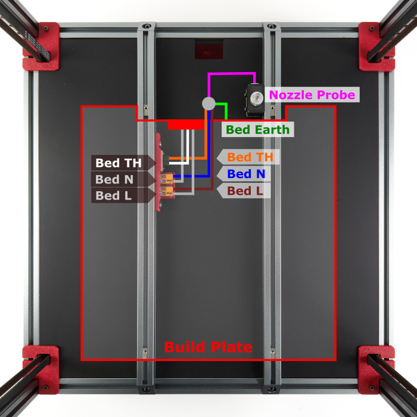

**What you're looking at:** Four things come down from the build plate: the two mains leads of the silicone heater pad bonded under it, the pad's earth ring terminal, and the bed thermistor that reports plate temperature. The bed WAGO mount fitted in Ch 09 is the small printed block below the deck that splits them out, and the 2×2 splicer PCB is a passive board that simply joins the thermistor pair to the cable heading for the mainboard.

**Parts:** the three cables hanging from the plate (**Bed L**, **N**, **BED TH**) plus the bed PE stud, bed WAGO mount with 2× WAGO 221-412 and the 2×2 XH splicer (fitted Ch 09).

**Do:** Land **Bed L** in one 2-way WAGO and **N** in the other — one bed lead per terminal, never both in one. Plug **BED TH** into the 2×2 XH splicer. Bolt the PE ring terminal to the plate's pre-fitted **M4×6 BHCS + serrated washer** from Ch 03 — verify that screw is tight; do not remove it and re-fit it.

**Check:** Four leads leave the bed WAGO mount downward through the deck opening: L, N, PE, TH. The plate can still be lifted 20 mm without any lead going tight.

Source: [LDO wiring guide § Wiring the bed heater](https://docs.ldomotors.com/en/voron/voron2/wiring_guide_rev_d#wiring-the-bed-heater) · [LDO wiki build-plate mapping](https://docs.ldomotors.com/v2_wire_guide/build_plate_mapping.png)

---

### Step 10.13 — Measure the bed heater before you connect it

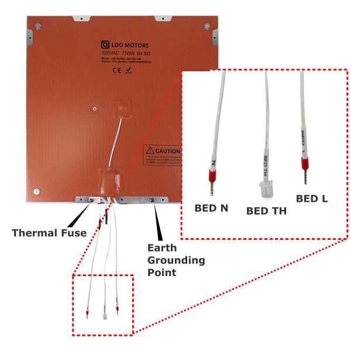

**What you're looking at:** You are measuring the heater pad itself, before it can ever be energised. To its own two leads it should look like a resistor of a few tens of ohms; to the aluminium plate it is bonded to it should look like nothing at all. The photo identifies which lead is which on the Rev D plate, and the pad's own label carries the voltage and wattage the step's resistance sum needs.

**Parts:** multimeter, bed L and bed N leads (still unconnected below the WAGO breakout).

**Do:** Meter on Ω. Measure **Bed L → Bed N** at the free ends. Then measure **Bed L → the aluminium plate** and **Bed N → the aluminium plate** (touch a bare spot, or the PE stud).

**Check:** All three readings must land in these bands.

| Measurement | Expected |
|---|---|
| Bed L → Bed N | a stable reading in the **tens of ohms**. Not 0 Ω. Not `OL`. |
| Bed L → plate / PE | `OL` (open) — well above 10 MΩ |
| Bed N → plate / PE | `OL` (open) — well above 10 MΩ |

A dead short means the pad is damaged and must not be connected; `OL` means the pad or its 125 °C thermal fuse is open. Either way, stop.

??? note "Why 'tens of ohms', and how to compute your own target"

    LDO does not publish the pad's wattage on the Rev D BOM, so derive the number
    yourself: **R = V² ÷ P**, using the mains voltage the pad is wound for and the
    wattage printed on the pad's own label. Worked examples — *not* your value:
    750 W at 120 V → 19.2 Ω; 750 W at 230 V → 70.5 Ω. Read your own label, do the
    division, and expect the meter to land within a few ohms of it.

Source: [LDO wiring guide § Wiring the bed heater](https://docs.ldomotors.com/en/voron/voron2/wiring_guide_rev_d#wiring-the-bed-heater) · [LDO Rev D 350 BOM](https://docs.ldomotors.com/en/voron/voron2/350_BOM/Rev_D) · [LDO wiring guide image `bed_heater_wires_revd.jpg`](https://docs.ldomotors.com/en/voron/voron2/wiring_guide_rev_d#wiring-the-bed-heater)

---

### Step 10.14 — Bed Live → SSR LOAD 1

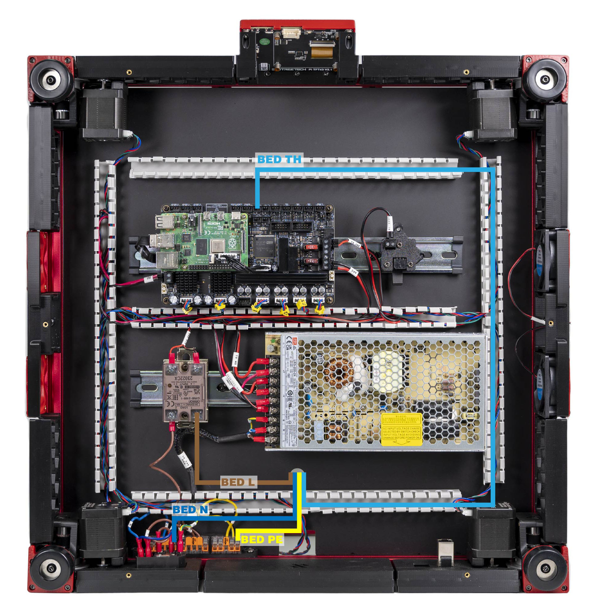

**What you're looking at:** Terminal 1 is the relay's output — the side that is live only while the SSR is switched on. Landing the bed's Live lead here is what makes the heater controllable instead of permanently connected to the mains.

**Parts:** *Bed L* cable ×1.

**Do:** Run the Bed L lead from the bed WAGO breakout down through the deck opening, along the duct, to SSR terminal **LOAD 1**. PH2, tight. This is the only AC that ever reaches the build plate, and the SSR is the only thing switching it.

**Check:** Terminal 1 = bed, terminal 2 = mains Live. If those are swapped nothing works and the SSR sees the wrong side of the load — re-check against the photo.

Source: [LDO Rev D photo S5 build-plate mapping](https://raw.githubusercontent.com/MotorDynamicsLab/LDOVoron2/8270e8c/Images/WiringGuide/RevD/S5_mapping.jpg) · [LDO wiring guide § Connecting build plate](https://docs.ldomotors.com/en/voron/voron2/wiring_guide_rev_d#connecting-build-plate)

---

### Step 10.15 — Bed Neutral and bed PE → the WAGO bus

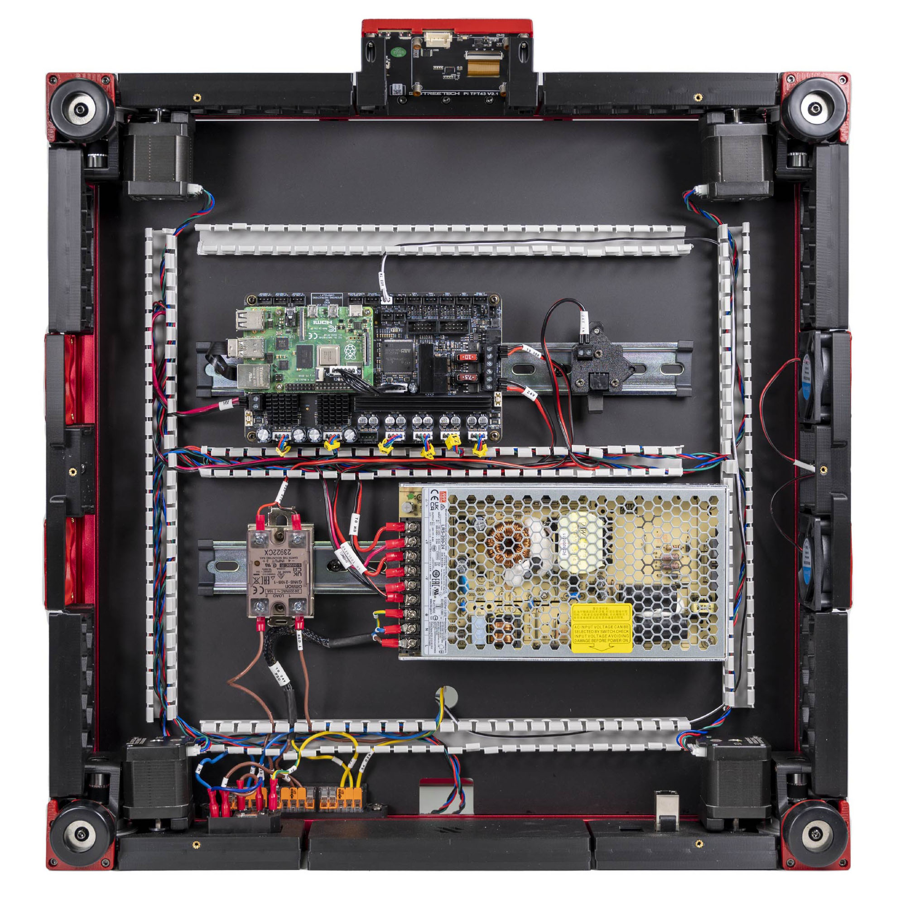

**What you're looking at:** The heater's return path (Neutral) and the plate's earth both go straight to the bus, unswitched; only the Live side passes through the relay. That earth connection is what keeps the aluminium plate safe to touch if the heater pad ever fails onto it.

**Parts:** *Bed N* and *Bed PE* leads.

**Do:** Bed N into a spare port of the blue **N** WAGO. Bed PE into a spare port of the yellow **PE** WAGO.

**Check:** Continuity from the C14 earth pin, through the PE WAGO, to bare aluminium on the build plate. That path must exist before the plate ever sees mains.

Source: [LDO Rev D photo S5 bed wired](https://raw.githubusercontent.com/MotorDynamicsLab/LDOVoron2/8270e8c/Images/WiringGuide/RevD/S5_bed.jpg) · [LDO wiring guide § Connecting build plate](https://docs.ldomotors.com/en/voron/voron2/wiring_guide_rev_d#connecting-build-plate)

---

### Step 10.16 — Frame PE

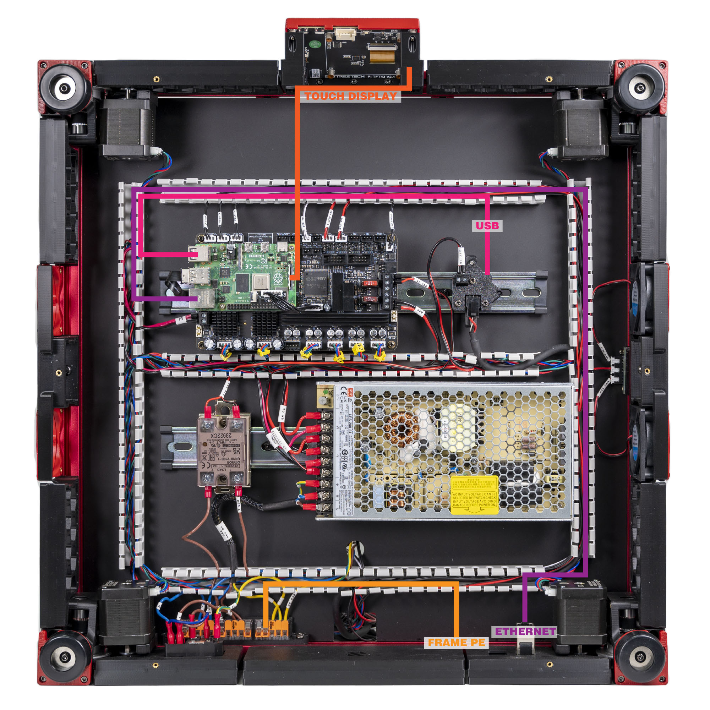

**What you're looking at:** *FRAME PE* is the single green/yellow lead that bonds the whole aluminium frame to earth. [Anodising](16-glossary.md#a) — the hard oxide layer on the extrusions — is an electrical insulator, so the ring terminal has to bite through to bare metal; the two locking washers are what do the biting.

**Parts:** *FRAME PE* cable ×1, M5 locking washer ×2, M5×10 BHCS + M5 roll-in T-nut (verify on bench).

**Do:** Sandwich the ring terminal between the two M5 locking washers and screw the stack into a frame extrusion slot on the bottom rail, on bare metal — scrape the anodising under the washer if the extrusion is coated. Land the other end in a spare port of the yellow **PE** WAGO.

**Check:** Continuity from the C14 earth pin to **any** frame extrusion, measured at a far corner. Under a few ohms. This is the check that makes the whole machine safe to touch.

Source: [LDO Rev D photo VS8 mapping](https://raw.githubusercontent.com/MotorDynamicsLab/LDOVoron2/8270e8c/Images/WiringGuide/RevD/VS8_mapping.jpg) · [LDO wiring guide § Connecting the FFC cable, Ethernet cable, USB cable and frame PE](https://docs.ldomotors.com/en/voron/voron2/wiring_guide_rev_d#connecting-the-ffc-cable-ethernet-cable-usb-cable-and-fame-pe)

Pause: ~30 min since the last pause — every mains connection made and pull-tested: SSR LOAD 1/2, bed L/N/PE, frame PE. Cord still out of the room and the DC side untouched. Next segment is LDO's Checkpoint #1 — start it only when you have an uninterrupted 25 minutes.

---

## Section 2 — Checkpoint #1, exactly as LDO writes it

LDO's own words: *"Incorrect wiring of AC/mains can be dangerous — therefore, always double check your work, and then triple check it once more."* Do all seven steps in order. Do not skip ahead to the 24 V section.

### Step 10.17 — De-energise and set up

(no image — see text)

**What you're looking at:** Nothing to look at on the machine — this step is about the meter and the absent cord. Continuity mode makes the meter beep whenever a conductive path joins its two probes, and that beep is the instrument for every measurement in this section.

**Parts:** multimeter.

**Do:** Confirm the C13 power cord is **not** plugged into the inlet and is not in the room. Set the meter to continuity/beeper and test it by shorting the probes.

**Check:** The meter beeps on a dead short. No cord anywhere near the machine.

Source: [LDO wiring guide § Checkpoint 1](https://docs.ldomotors.com/en/voron/voron2/wiring_guide_rev_d#checkpoint-1)

---

### Step 10.18 — Colour groups are shorted

(no image — see text)

**What you're looking at:** You are proving each WAGO block really is one electrical node: every wire in the Live block joined to every other, and likewise for Neutral and earth. A core that went into a lever without seating looks perfect from outside and beeps not at all.

**Parts:** multimeter.

**Do:** LDO: *"Check that the blue, brown and yellow wires should go into their respective 5pin wago terminals. Use a multimeter to check continuity between all nodes of the same colour — they should be shorted."* Probe every occupied port of each WAGO against every other occupied port of the same WAGO.

**Check:** Every pair in every group beeps.

| Group | Every node to every other node |
|---|---|
| Blue / **N** | beeps |
| Brown / **L** (with the inlet rocker ON) | beeps |
| Yellow / **PE** | beeps |

A node that does not beep is a core that did not seat in its WAGO lever. Re-strip and re-seat it.

Source: [LDO wiring guide § Checkpoint 1](https://docs.ldomotors.com/en/voron/voron2/wiring_guide_rev_d#checkpoint-1)

---

### Step 10.19 — L, N and PE are isolated from each other

(no image — see text)

**What you're looking at:** The mirror image of the previous check — the three buses must have no path between them at all. Live touching Neutral is a short across the mains; Live touching earth is what makes the metalwork lethal.

**Parts:** multimeter.

**Do:** LDO: *"Use the multimeter to check continuity between Live, Neutral, Earth — they should **not be shorted** with each other."* Probe L→N, L→PE, N→PE. Do it with the inlet rocker **on** and again with it **off**.

**Check:** Silence on all six measurements. Switch to the Ω range and confirm each pair reads `OL`.

**If L→N beeps:** something is bridging the mains. The two candidates are a stray strand at a WAGO and the bed pad itself — pull the bed L lead out of the SSR and re-measure to isolate which.

Source: [LDO wiring guide § Checkpoint 1](https://docs.ldomotors.com/en/voron/voron2/wiring_guide_rev_d#checkpoint-1)

---

### Step 10.20 — The switch actually switches

(no image — see text)

**What you're looking at:** The rocker in the inlet module is the machine's only mains isolator, so it has to genuinely break both poles rather than just one. This check watches the meter change state as you toggle it.

**Parts:** multimeter.

**Do:** With the meter across the C14 L pin and a brown WAGO node, toggle the rocker.

**Check:** Beeps with the rocker **on**, silent with it **off**. Repeat for N. If either stays connected with the switch off, the inlet is miswired — go back to step 10.5.

Source: [LDO wiring guide § Checkpoint 1](https://docs.ldomotors.com/en/voron/voron2/wiring_guide_rev_d#checkpoint-1)

---

### Step 10.21 — The SSR is open when unpowered

**What you're looking at:** With nothing on terminals 3 and 4 the relay's semiconductor switch must be off, so its two mains terminals should have no path between them. The close-up shows the numbered terminals you are probing — it is a Rev C bay, so ignore the terminal blocks above the relay and read only the SSR body.

**Parts:** multimeter.

**Do:** Measure SSR **LOAD 1 → LOAD 2** with nothing energised.

**Check:** No beep. An unpowered SSR must not conduct — a solid-state relay that reads short is dead, and the bed would be permanently live. Also confirm **INPUT 3/4 are still empty**; the DC control wiring comes later, in step 10.27.

Source: [LDO wiring guide § Checkpoint 1](https://docs.ldomotors.com/en/voron/voron2/wiring_guide_rev_d#checkpoint-1) · [LDO wiring photo SSR_Close_Up.jpg](https://raw.githubusercontent.com/MotorDynamicsLab/LDOVoron2/8270e8c/Images/WiringGuide/RevC/SSR_Close_Up.jpg)

---

### Step 10.22 — Re-check the voltage selector

**What you're looking at:** The same red slide switch as step 10.2, read a second time now that the PSU is wired in place and half in shadow. It is the one setting that destroys the supply on first switch-on.

**Parts:** none.

**Do:** LDO: *"Check again that the power supply voltage input switch is set to the correct value: 115V vs 230V."* Look at the window a second time, now that the PSU is wired and the light is worse.

**Check:** The number in the window matches your mains. If you have the EU RSP-200-24 there is no switch and nothing to check.

Source: [LDO wiring guide § Checkpoint 1](https://docs.ldomotors.com/en/voron/voron2/wiring_guide_rev_d#checkpoint-1) · [LDO wiring photo psu_switch.jpg](https://raw.githubusercontent.com/MotorDynamicsLab/LDOVoron2/8270e8c/Images/WiringGuide/psu_switch.jpg)

---

### Step 10.23 — First power-on, then off again

(no image — see text)

**What you're looking at:** The only moment in this chapter when mains is present. The PSU's own indicator LED and a 24 V reading across its +V and −V output terminals are the two observations that say the mains half of the machine works.

**Parts:** C13 power cord ×1.

**Do:** Keep hands clear of the terminal block. Plug the cord into the inlet, then into the wall, then switch the inlet rocker on. LDO: *"The power supply should turn on and it's LED should light up."*

**Check:** All four observations, in this order.

| Observe | Expected |
|---|---|
| Inlet rocker | illuminates |
| PSU indicator LED | lights green |
| Meter on DC V, PSU +V → −V | 24 V ± 0.5 V |
| Noise / smell | none. Any buzz, click-cycling or smell → switch off at the wall immediately |

Then switch the rocker off, **unplug the cord and take it back out of the room.** Everything from here to the end of the chapter is done dead.

⚠ Rev D+ / LDO: this is the only power-on in the chapter. The Leviathan, Pi and toolboard are all still unpowered — the PSU's DC terminals are empty. [src](https://docs.ldomotors.com/en/voron/voron2/wiring_guide_rev_d#checkpoint-1)

Source: [LDO wiring guide § Checkpoint 1](https://docs.ldomotors.com/en/voron/voron2/wiring_guide_rev_d#checkpoint-1)

Pause: ~25 min since the last pause — Checkpoint #1 passed end to end and the machine was powered once and switched off. **Cord unplugged and back out of the room.** Everything from here is done dead.

---

## Section 3 — 24 V distribution

### Step 10.24 — PSU → Leviathan board supply

**What you're looking at:** *24V PSU to MB* is the kit lead that feeds the Leviathan's own electronics, and `Vin 24V / Board` is the screw-terminal pair on the mainboard that accepts it. The board has a second, separate supply input for the stepper drivers, which is wired next.

**Parts:** *24V PSU to MB* cable ×1 (ends tagged **24V** and **TO MB**).

**Do:** Land the **TO MB** end on the PSU's +V and −V terminals. Land the **24V** end on the Leviathan screw terminal silkscreened **Vin 24V / Board**. Red to +, black to −.

**Check:** Polarity read twice, at both ends. The Leviathan has reverse-polarity protection but do not test it.

Source: [LDO Rev D photo S4 24 V/SSR mapping](https://raw.githubusercontent.com/MotorDynamicsLab/LDOVoron2/8270e8c/Images/WiringGuide/RevD/S4_mapping.jpg) · [LDO wiring guide § Connecting 24V](https://docs.ldomotors.com/en/voron/voron2/wiring_guide_rev_d#connecting-24v) · [LDO Leviathan V1.3 guide](https://ldomotion.com/guides/voron-leviathan-v1-3) (manual p.8)

---

### Step 10.25 — PSU → Leviathan HV stepper supply

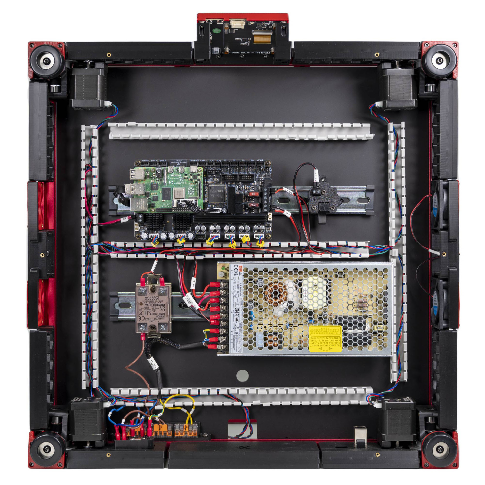

**What you're looking at:** `Vin 24-48V / HV-Steppers` is that second input, feeding only the two [HV stepper](16-glossary.md#h) drivers — the TMC5160 chips that run the A and B motors. On this build both inputs come from the same 24 V PSU; the port simply also accepts up to 48 V.

**Parts:** *HV to MB HV* cable ×1 (ends tagged **HV** and **TO MB HV**).

**Do:** **TO MB HV** end onto the PSU's +V / −V terminals (alongside the board supply). **HV** end onto the Leviathan terminal silkscreened **Vin 24-48V / HV-Steppers**. This is the rail that feeds the two TMC5160s driving A and B.

**Check:** Polarity. Both PSU-side cables share the same +V/−V pair — confirm each ferrule is fully under its screw and no strand crosses between +V and −V.

Source: [LDO Rev D photo S4 mainboard/PSU wired](https://raw.githubusercontent.com/MotorDynamicsLab/LDOVoron2/8270e8c/Images/WiringGuide/RevD/S4_MB_PSU.jpg) · [LDO wiring guide § Connecting 24V](https://docs.ldomotors.com/en/voron/voron2/wiring_guide_rev_d#connecting-24v)

---

### Step 10.26 — PSU → USB adapter PCB (toolhead 24 V)

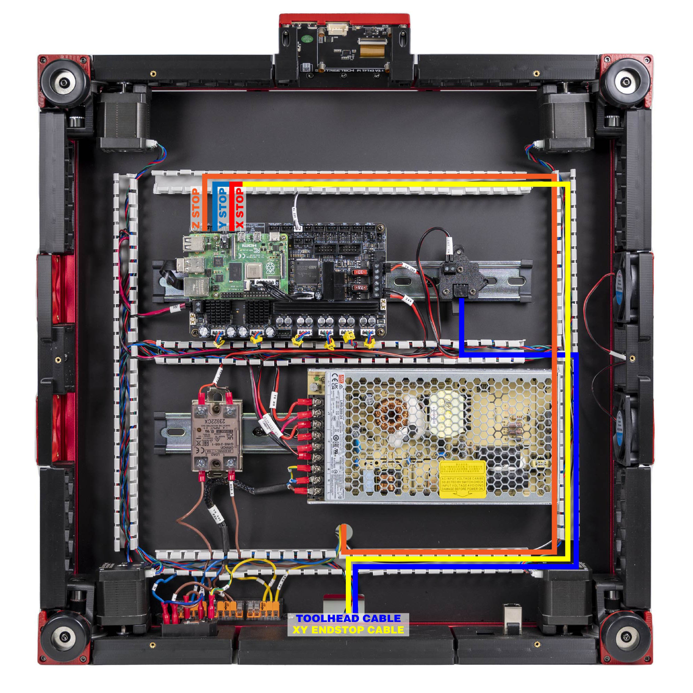

**What you're looking at:** The [USB adapter PCB](16-glossary.md#u) on its DIN clip is the bay-side end of the toolhead link: 24 V and USB arrive on this side as two separate cables and leave on the other side as one umbilical. This step is the 24 V half.

**Parts:** *24V power* cable ×1 (ends tagged **TO TOOLHEAD** and **24V IN**).

**Do:** **TO TOOLHEAD** end onto the PSU +V/−V. **24V IN** end onto the USB adapter PCB on its DIN clip. This is what powers the Nitehawk down the umbilical.

**Check:** Polarity at the USB adapter end matches the silkscreen. The adapter PCB's cover is the **partial** cover — see step 10.57.

Source: [LDO Rev D photo S6 gantry-cable mapping](https://raw.githubusercontent.com/MotorDynamicsLab/LDOVoron2/8270e8c/Images/WiringGuide/RevD/S6_mapping.jpg) · [LDO wiring guide § Connecting 24V](https://docs.ldomotors.com/en/voron/voron2/wiring_guide_rev_d#connecting-24v)

---

### Step 10.27 — Leviathan HEATBED → SSR INPUT

**What you're looking at:** `HEATBED` on the Leviathan is a low-current DC output — it never carries bed power, it only tells the relay when to conduct. This polarised red/black pair is the entire control link between the firmware and a mains heater.

**Parts:** *SSR to MB* cable ×1 (ends tagged **SSR SIG** and **To SSR**).

**Do:** LDO, verbatim: *"Connect the **SSR SIG** end of the SSR to MB cable to **INPUT 3&4** on the SSR. The red cable goes to **INPUT 3** and the black cable goes to **INPUT 4**. Connect the **To SSR** end to the **HEATBED** terminals on the controller."*

**Check:** Red on 3, black on 4, no exceptions. Red on the Leviathan HEATBED **+**. Trace the pair with a finger from board to relay and say "three, red; four, black" out loud.

⚠ Rev D+ / LDO: get this backwards and the SSR either never fires or latches on — a latched bed heater with no thermal control is the worst failure this machine has. [src](https://docs.ldomotors.com/en/voron/voron2/wiring_guide_rev_d#connecting-24v)

Source: [LDO Rev D photo S4 24 V/SSR mapping](https://raw.githubusercontent.com/MotorDynamicsLab/LDOVoron2/8270e8c/Images/WiringGuide/RevD/S4_mapping.jpg) · [LDO wiring guide § Connecting 24V](https://docs.ldomotors.com/en/voron/voron2/wiring_guide_rev_d#connecting-24v)

---

### Step 10.28 — Set the FAN2 and FAN3 jumpers to 24 V

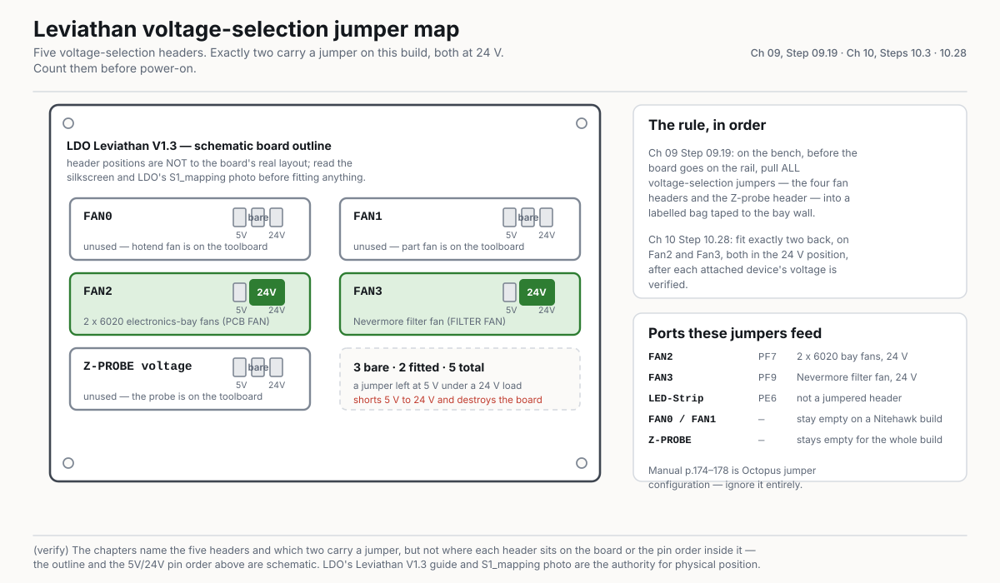

**What you're looking at:** The jumper block from step 10.3, now being set. Fitting a jumper across a port's 24 V pins selects the voltage that port will send to whatever is plugged into it; FAN2 will drive the two 6020 electronics-bay fans and FAN3 the Nevermore filter fan, all of which are 24 V parts. The diagram is the picture of the end state: five headers by name, Fan2 and Fan3 fitted at 24 V, Fan0/Fan1/the Z-probe header left bare — 5 headers, 2 fitted, 3 bare.

**Parts:** 2 of the jumpers removed in Ch 09.

**Do:** Fit a jumper on **Fan2** and one on **Fan3**, both in the **24 V** position. Those two ports drive the 6020 electronics-bay fans (PCB FAN) and the Nevermore filter fan — the Rev D BOM lists all three as 24 V parts. Leave **Fan0**, **Fan1** and **Probe** bare; nothing in a Rev D+ build uses them.

**Check:** Exactly two jumpers on the board, both on the 24 V pins, on Fan2 and Fan3. Count them.

⚠ Rev D+ / LDO: on a Nitehawk build the hotend, part fan and probe all live on the toolboard, so the Leviathan's probe and Fan0/Fan1 ports stay unused — that is why they stay unjumpered. [src](https://ldomotion.com/guides/voron-leviathan-v1-3) · [BOM](https://docs.ldomotors.com/en/voron/voron2/350_BOM/Rev_D)

Source: [LDO Leviathan V1.3 guide](https://ldomotion.com/guides/voron-leviathan-v1-3) (manual p.7) · [LDO Rev D 350 BOM](https://docs.ldomotors.com/en/voron/voron2/350_BOM/Rev_D) · [Leviathan repo `wiring_V1.3.jpg`](https://raw.githubusercontent.com/MotorDynamicsLab/Leviathan/878c3c4/Media/wiring_V1.3.jpg)

---

### Step 10.29 — Meter the 24 V rail for shorts

(no image — see text)

**What you're looking at:** Nothing to see — this is a resistance sweep across every 24 V input you have just wired, with no power anywhere. A shorted rail reads like a piece of wire; a healthy one reads a resistance that climbs as the board's input capacitors charge from the meter's own test current.

**Parts:** multimeter.

**Do:** With the PSU still unplugged, measure across the PSU's **+V → −V** terminals on the Ω range, then across the Leviathan's **Vin 24V** terminals, the **Vin 24-48V** terminals, and the USB adapter's 24 V input.

**Check:** Every one of them reads a finite resistance that **rises** as the input capacitors charge from the meter's own current — typically hundreds of ohms climbing into the kΩ. None of them reads **0 Ω** or beeps continuously. A dead short here is a reversed ferrule or a stray strand; find it before the next power-on.

Source: [LDO wiring guide § Connecting 24V](https://docs.ldomotors.com/en/voron/voron2/wiring_guide_rev_d#connecting-24v) · [survey §5.2 W8](../voron-build-instructions-survey.md)

Pause: ~25 min since the last pause — 24 V distribution complete: board supply, HV stepper supply, USB-adapter feed, HEATBED→SSR control pair, Fan2/Fan3 jumpers at 24 V, and every rail metered with no short. Nothing above deck touched yet.

---

## Section 4 — Above deck: probe, endstops, nozzle probe, lighting

### Step 10.30 — Insulate the inductive probe

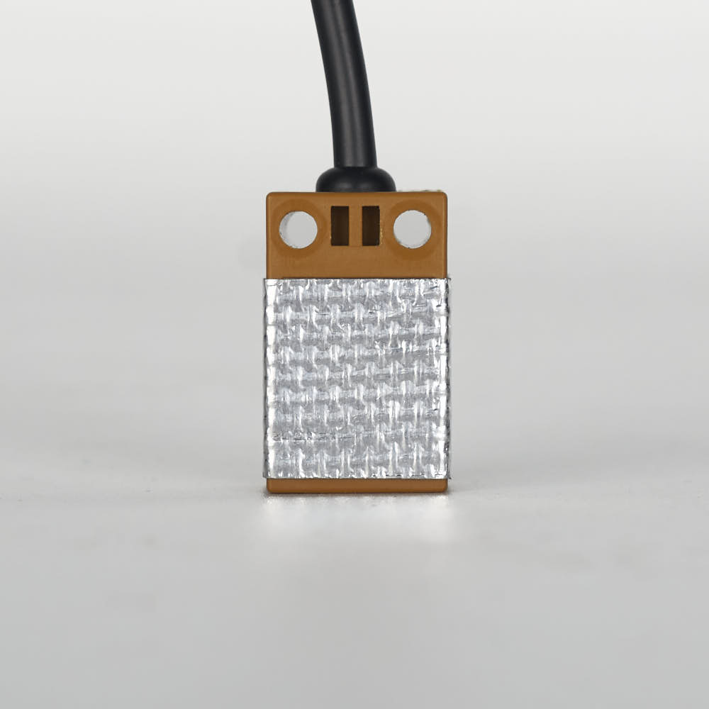

**What you're looking at:** The [inductive probe](16-glossary.md#i) is the small rectangular Omron sensor on the X carriage that senses the metal bed for gantry levelling — it never sets Z=0. The fibreglass tape is a heat shield against the hotend beside it, on the front and sides only, because the sensing face on the bottom has to stay bare.

**Parts:** Omron inductive probe (fitted to the X carriage in Ch 05/07), fibreglass tape 2×12 cm ×1.

**Do:** Wrap at least two layers of the supplied fibreglass tape around the **front and sides** of the probe body. **Do not cover the back or the bottom.** Offset the tape slightly up from the bottom edge so it cannot interfere with sensing. Optional: cut a window over the probe's LED so you can see it trigger.

**Check:** The sensing face is bare, the back is bare, and the tape does not bulge past the probe's lower rim. If you already did this at manual p.143 in Ch 07, just verify.

⚠ Rev D+ / LDO: LDO note p.143 — the tape is a heat shield against the hotend, not a spacer. Too much of it and the probe stops triggering. [src](https://docs.ldomotors.com/en/voron/voron2/wiring_guide_rev_d#insulating-the-z-probe)

Source: [Voron manual p.143](https://github.com/VoronDesign/Voron-2/blob/de7e89d/Manual/Assembly_Manual_2.4r2.pdf#page=143) · [LDO wiring guide § Insulating the Z-probe](https://docs.ldomotors.com/en/voron/voron2/wiring_guide_rev_d#insulating-the-z-probe) · [LDO wiki probe insulation photo](https://docs.ldomotors.com/v2_wire_guide/v2_revc/probe_insulation.jpg)

---

### Step 10.31 — Read the XY endstop cable labels

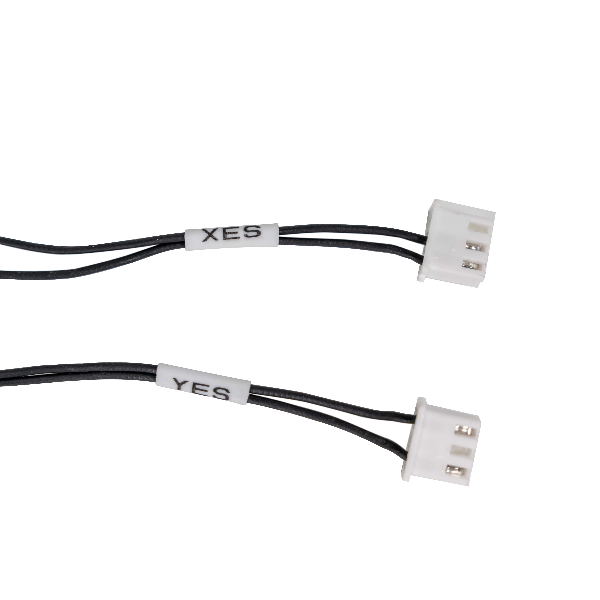

**What you're looking at:** One cable carries both limit switches: a single 4-pin plug at the gantry end that splits into two 3-pin plugs at the mainboard end. The photo is LDO's side-by-side of a correctly labelled cable and one from the mis-labelled batch.

**Parts:** XY endstop cable ×1 (4-pin JST-XH one end, two 3-pin JST-XH the other).

**Do:** Read the two 3-pin connectors' labels.

**Check:** Read the two 3-pin connectors and match one row.

| Labels read | Meaning |
|---|---|
| **XES** and **YES** | correct cable — go to step 10.33 |
| **X Stop** and **Y Stop** | known bad batch — do step 10.32 first |

⚠ Rev D+ / LDO: a mis-pinned cable will not damage the Leviathan, but X and Y homing simply will not work and you will not find out until Ch 13. Check now. [src](https://docs.ldomotors.com/en/guides/XY_Endstop_Cable_Reconnecting_Guide)

Source: [LDO wiring guide § Wiring the XY endstop](https://docs.ldomotors.com/en/voron/voron2/wiring_guide_rev_d#wiring-the-xy-endstop) · [LDO XY endstop reconnecting guide](https://docs.ldomotors.com/en/guides/XY_Endstop_Cable_Reconnecting_Guide)

---

### Step 10.32 — Repin the XY endstop cable (only if labelled X Stop / Y Stop)

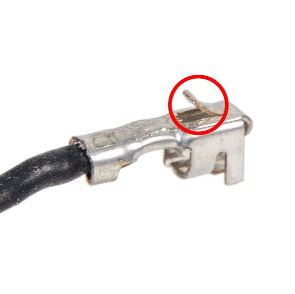

**What you're looking at:** Inside a JST housing each crimped wire is held by a small springy retention tab; press the tab flat and the wire slides out, bend it back up and it locks into its new position. The photo shows that tab.

**Parts:** XY endstop cable ×1, tweezers or the supplied 2.5 mm flat screwdriver.

**Do:** On the **X Stop** connector, press the retention tab in position **3** down, pull that wire out, bend the tab back up with the tweezers, and insert it into position **2**. On the **Y Stop** connector, move the wire from position **2** to position **3** the same way. Light force only — if it resists, the tab is not pressed far enough.

**Check:** Meter on continuity, against LDO's map:

| JST-XH 4P pin | goes to |
|---|---|
| 4 | X Stop pin 2 |
| 3 | X Stop pin 1 |
| 2 | Y Stop pin 1 |
| 1 | Y Stop pin 3 |

All four beep, and each repinned wire survives a light tug.

Source: [LDO XY endstop reconnecting guide](https://docs.ldomotors.com/en/guides/XY_Endstop_Cable_Reconnecting_Guide) · [LDO guide image `retention_tab.jpg`](https://docs.ldomotors.com/en/guides/XY_Endstop_Cable_Reconnecting_Guide)

---

### Step 10.33 — XY endstop cable → the gantry PCB

**What you're looking at:** The [XY endstop pod](16-glossary.md#x) is the small PCB on the left XY joint carrying both the X and the Y microswitch, which the gantry presses at the ends of its travel. Plugging the 4-pin end in here brings both switches onto one cable.

**Parts:** XY endstop cable ×1, XY endstop PCB (on the left XY joint, fitted in Ch 05).

**Do:** Plug the **4-pin** end into the XY endstop PCB. Leave the two 3-pin ends free; they reach the Leviathan in step 10.48. Dress the cable along the Y extrusion toward the rear-left, ready to enter the Y chain.

**Check:** The connector is fully home and the cable leaves the PCB without loading the switch bodies.

⚠ Rev D+ / LDO: the kit uses one XY microswitch PCB, not the manual's hall-effect pods. Manual p.162 and p.169 are skipped entirely. [src](https://docs.ldomotors.com/voron/voron2/build-faq)

Source: [LDO Rev D photo S6 gantry-cable mapping](https://raw.githubusercontent.com/MotorDynamicsLab/LDOVoron2/8270e8c/Images/WiringGuide/RevD/S6_mapping.jpg) · [LDO wiring guide § Wiring the XY endstop](https://docs.ldomotors.com/en/voron/voron2/wiring_guide_rev_d#wiring-the-xy-endstop) · [LDO Build Notes p.162, p.163, p.169](https://docs.ldomotors.com/voron/voron2/build-faq#build-notes)

---

### Step 10.34 — Nozzle-probe (Z endstop) cable

**What you're looking at:** The [nozzle probe](16-glossary.md#n) is LDO's mechanical Z endstop: a sprung 5 mm pin below the bed that the nozzle itself presses down onto a D2F microswitch, on the little PCB Ch 09 mounted. This, not the inductive probe, is what sets Z=0.

**Parts:** Z endstop cable ×1, nozzle-probe PCB (assembled and mounted in Ch 09).

**Do:** Plug the 3-pin connector onto the nozzle-probe PCB. Route the lead across the deck to the wire opening, following LDO's build-plate mapping — it drops through the deck alongside the bed cables.

**Check:** Press the 5 mm shaft down with a finger: it moves freely, clicks the D2F, and springs back. The pulley set screw stops the shaft falling out but must not grip it.

Source: [LDO wiring guide § Assembling the nozzle probe](https://docs.ldomotors.com/en/voron/voron2/wiring_guide_rev_d#assembling-the-nozzle-probe) · [LDO wiring photo z_stop_final.jpg](https://raw.githubusercontent.com/MotorDynamicsLab/LDOVoron2/8270e8c/Images/WiringGuide/z_stop_final.jpg)

Pause: ~25 min since the last pause — probe taped, XY endstop cable read (and repinned if needed) and plugged into the gantry PCB, nozzle-probe lead run to the deck opening. Both cables are loose on the gantry, not yet in a chain.

---

### Step 10.35 — Assemble the eight COB light-strip mounts

(no image — see [COB README](https://github.com/MotorDynamicsLab/LDOVoron2/tree/main/STLs/COB%20Light%20Strip))

**What you're looking at:** [COB light strips](16-glossary.md#c) are the chamber lighting — a continuous line of LEDs under one phosphor rather than separate dots. Each printed mount is a two-piece clamshell that grips the strip and bolts to a frame extrusion; three 100 mm mounts plus one 50 mm cover a 350 mm strip.

**Parts:** `cob_light_strip_mount_100mm` ×6, `cob_light_strip_mount_50mm` ×2, M3×5×4 heat-set inserts ×16, M3×6 FHCS ×16.

**Do:** Each mount is a two-piece print. Melt two inserts into one half, close the two halves and run two M3×6 FHCS in. Build four mounts per strip: three 100 mm plus one 50 mm makes the 350 mm run.

**Check:** The halves close **flush** — a gap here means an insert sits proud and the strip will not seat. Lay each finished mount on glass and confirm it does not rock.

Source: [LDOVoron2 `STLs/COB Light Strip`](https://github.com/MotorDynamicsLab/LDOVoron2/tree/8270e8c/STLs/COB%20Light%20Strip) · [LDO wiring guide § Routing the LED strips](https://docs.ldomotors.com/en/voron/voron2/wiring_guide_rev_d#routing-the-led-strips)

---

### Step 10.36 — Mount the COB strips left and right

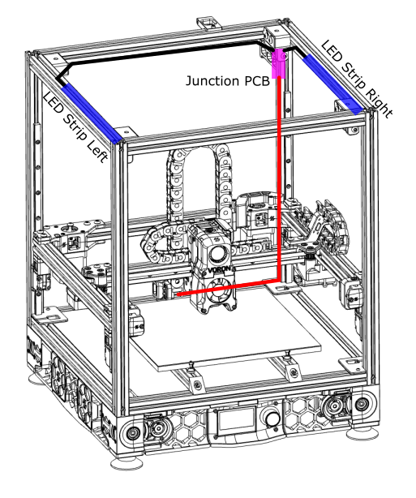

**What you're looking at:** The strips go on the inner faces of the two top side extrusions, aimed down into the chamber. The diagram is LDO's routing plan for both strips and for the leads that meet at the rear.

**Parts:** COB LED strips ×2, assembled mounts ×8, M3×8 SHCS ×16, M3 hammerhead T-nut ×16.

**Do:** Slide four mounts into the inner face of the top-left frame extrusion and four into the top-right, spaced to support the whole strip. Fasten each with two M3×8 SHCS into hammerhead nuts. Press the COB strips into their channels with the leads pointing to the rear.

**Check:** Both strips are level, fully seated, and their leads meet near the rear centre of the ceiling with slack to spare.

Source: [LDO wiring guide § Routing the LED strips](https://docs.ldomotors.com/en/voron/voron2/wiring_guide_rev_d#routing-the-led-strips) · [LDO wiring photo led_route.png](https://raw.githubusercontent.com/MotorDynamicsLab/LDOVoron2/8270e8c/Images/WiringGuide/led_route.png)

---

### Step 10.37 — Mount the LED junction PCB on its spacer

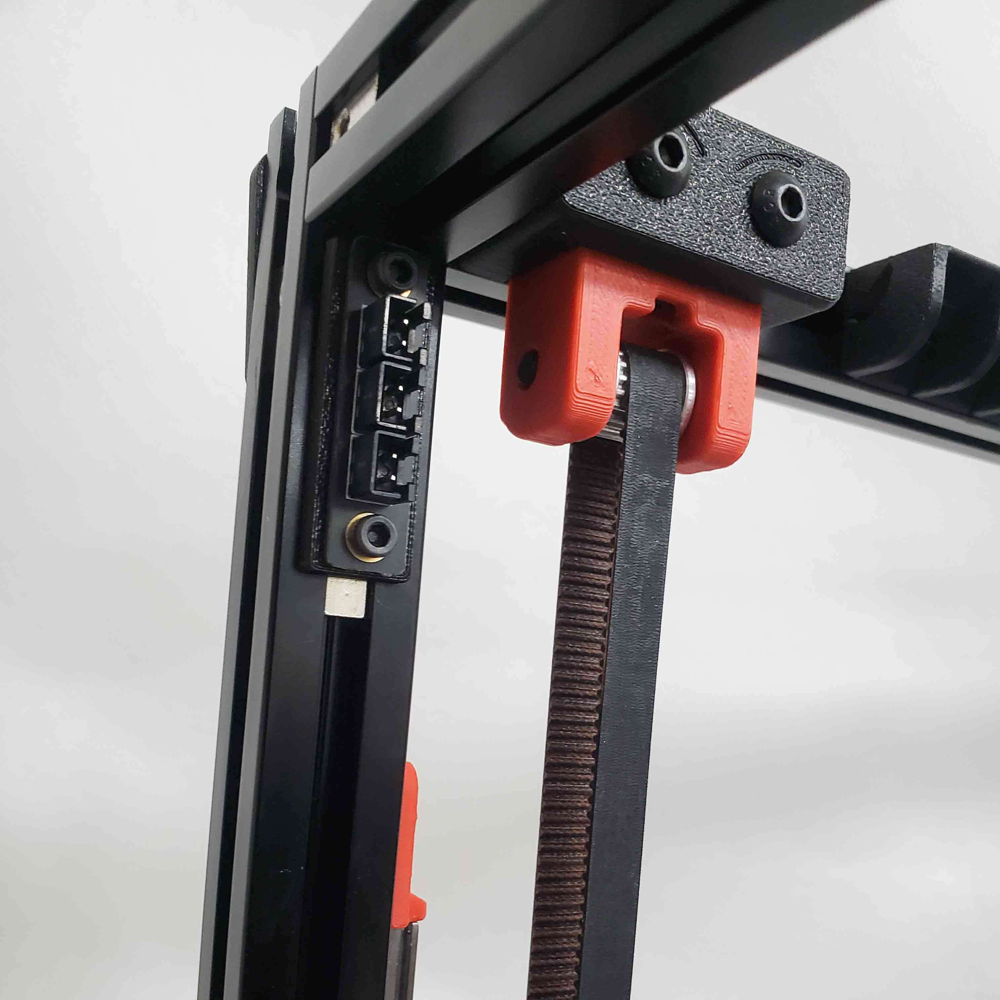

**What you're looking at:** The 3×2 splicer PCB is a passive junction board: the two strip leads plug into two of its ports and the third port carries a single cable down to the mainboard. The printed spacer holds the bare board off the aluminium extrusion, which would otherwise short its underside.

**Parts:** 3×2 XH splicer PCB ×1, `2x3 Splitter Spacer` ×1 (LDO-supplied printed), M3×8 SHCS ×2, M3 hammerhead T-nut ×2.

**Do:** Stack the PCB on the printed spacer and bolt the sandwich to the inner face of the rear top extrusion where both strip leads reach. Plug the left and right strip leads into two of the three ports; the third carries the run down to the Leviathan.

**Check:** **The spacer is fitted.** LDO calls it out twice: bolting the bare PCB against the extrusion shorts it. Nothing on the PCB's underside touches aluminium.

Source: [LDO wiring guide § Routing the LED strips](https://docs.ldomotors.com/en/voron/voron2/wiring_guide_rev_d#routing-the-led-strips) · [LDO wiring photo led_splitter_placement.jpg](https://raw.githubusercontent.com/MotorDynamicsLab/LDOVoron2/8270e8c/Images/WiringGuide/led_splitter_placement.jpg)

---

### Step 10.38 — Route the LED lead down to the deck and close the slots

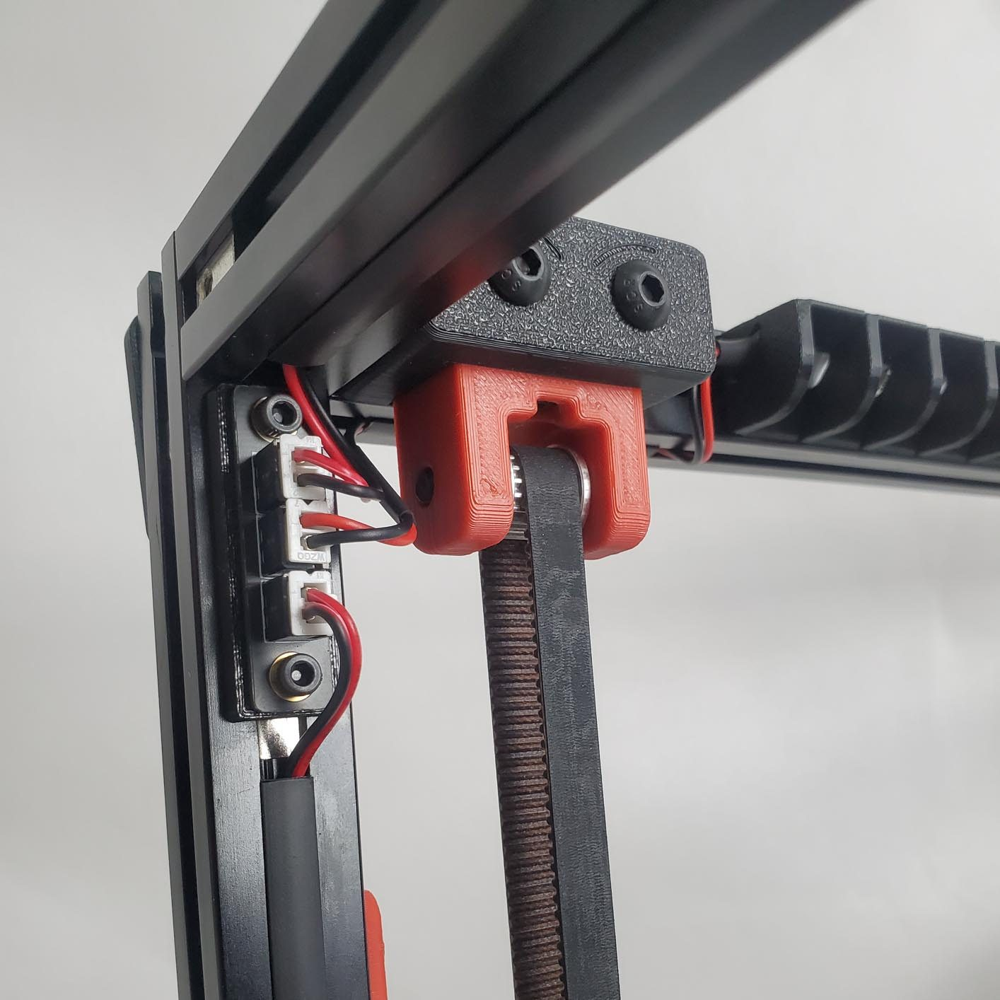

**What you're looking at:** Extrusion slot covers are the flexible plastic strips that press into an empty extrusion groove; here they hide and protect the LED cable along its whole route down to the deck. Ch 11's top panel and Z-belt covers close this path for good.

**Parts:** extrusion slot covers, 6 mm — up to 9.

**Do:** Run the junction PCB's third lead along the top rear extrusion slot, down a rear vertical extrusion, and into the deck. Press the 6 mm slot covers over every slot the cable occupies. Do this **now** — after the top panel and the Z belt covers go on in Ch 11 you cannot get back in without taking them off (survey §5.2 W5).

**Check:** No cable is visible outside a covered slot, and nothing crosses the gantry's Z travel.

**Alternative:** you may instead route through the **Z-motor A opening**; if you do, print the [alternate Z-belt cover `z_belt_cover_a_led.stl`](https://github.com/MotorDynamicsLab/LDOVoron2/blob/main/STLs/z_belt_cover_a_led.stl) for Ch 11. Decide now, not in Ch 11. [src](https://docs.ldomotors.com/voron/voron2/build-faq)

Source: [LDO wiring guide § Routing the LED strips](https://docs.ldomotors.com/en/voron/voron2/wiring_guide_rev_d#routing-the-led-strips) · [LDO wiring photo led_final.jpg](https://raw.githubusercontent.com/MotorDynamicsLab/LDOVoron2/8270e8c/Images/WiringGuide/led_final.jpg) · [LDOVoron2 `z_belt_cover_a_led.stl`](https://github.com/MotorDynamicsLab/LDOVoron2/blob/8270e8c/STLs/z_belt_cover_a_led.stl) · [survey §5.2 W5](../voron-build-instructions-survey.md)

---

### Step 10.39 — Chamber thermistor, if your batch includes one

(no image — see text)

**What you're looking at:** The chamber thermistor is a small temperature sensor left hanging in free air inside the enclosure, reporting how hot the chamber has become. On a Rev D+ machine it belongs on the toolboard's `CT` port, not on any of the Leviathan's four thermistor inputs.

**Parts:** chamber thermistor (batch-dependent).

**Do:** Nothing on the Leviathan. On a Rev D+ machine the chamber thermistor lands on the **toolboard's CT port** and is anchored by the zip-tie loop on the CW2 cable cover — that is a Ch 08 step. If yours is still loose, dress it now so its tip hangs in free chamber air, away from the hotend and out of the toolhead's travel.

**Check:** Your batch BOM says whether the part is in the kit. The Klipper config's `[temperature_sensor chamber_temp]` reads `nhk:PB2`, i.e. the toolboard, not the mainboard.

⚠ Rev D+ / LDO: the Leviathan has four thermistor inputs and it is tempting to put the chamber sensor on one of them. Do not — `leviathan-printer-rev-d-sbv2.cfg` expects it on the toolboard. [src](https://github.com/MotorDynamicsLab/LDOVoron2/blob/main/Firmware/leviathan-printer-rev-d-sbv2.cfg)

Source: [`leviathan-printer-rev-d-sbv2.cfg`](https://github.com/MotorDynamicsLab/LDOVoron2/blob/667521d/Firmware/leviathan-printer-rev-d-sbv2.cfg) · [Nitehawk-SB V2 doc § Port and pin definitions](https://docs.ldomotors.com/en/Toolboard/nitehawk-sb-v2#port-and-pin-definitions)

Pause: ~35 min since the last pause — eight COB mounts built, both strips mounted and plugged into the junction PCB on its spacer, LED lead routed and **every occupied extrusion slot covered**. Do not leave a slot open: Ch 11's top panel and Z-belt covers close this route for good.

---

## Section 5 — Leviathan connections

### Step 10.40 — Tag every stepper cable before you plug anything in

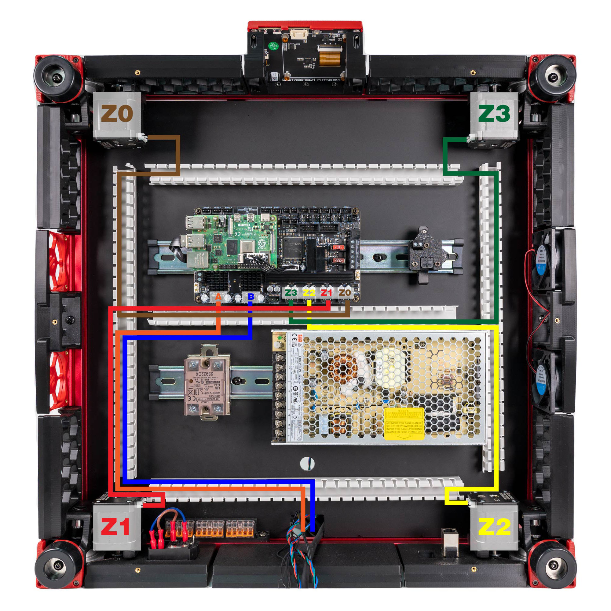
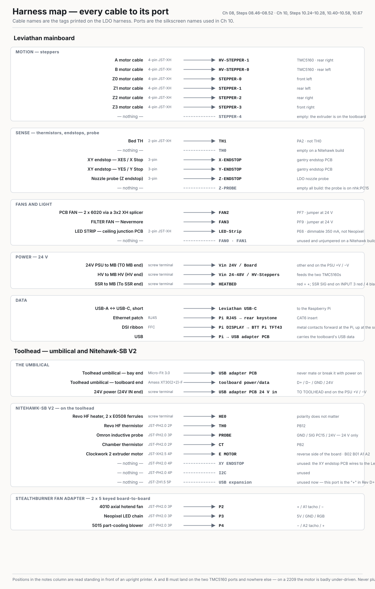

**What you're looking at:** Six identical 4-pin motor cables arrive at the board and nothing about them says which corner each came from. LDO's mapping photo names every port on the Leviathan; the tags are what stop you from guessing at the end of a long session. The diagram's Leviathan half shows both HV-STEPPER ports and STEPPER-0..3 by corner alongside every other cable on the board, including which ports stay empty and why.

**Parts:** cable tags (supplied) ×7.

**Do:** Transcribe LDO's table onto tags and fit one to each motor cable at the board end. Positions are given *"as if standing in front of an upright printer and looking towards it."*

| Stepper | Physical position | Controller port |
|---|---|---|
| **A** | rear **right** of gantry | `HV-STEPPER-1` |
| **B** | rear **left** of gantry | `HV-STEPPER-0` |
| **Z0** | front left | `STEPPER-0` |
| **Z1** | rear left | `STEPPER-1` |
| **Z2** | rear right | `STEPPER-2` |
| **Z3** | front right | `STEPPER-3` |
| *(not used)* | — | `STEPPER-4` |

**Check:** Seven tags written, six cables tagged, and you can trace each cable back to the motor it came from without guessing.

Source: [LDO Rev D photo S1 stepper mapping](https://raw.githubusercontent.com/MotorDynamicsLab/LDOVoron2/8270e8c/Images/WiringGuide/RevD/S1_mapping.jpg) · [LDO wiring guide § Connecting steppers](https://docs.ldomotors.com/en/voron/voron2/wiring_guide_rev_d#connecting-steppers)

---

### Step 10.41 — A motor → HV-STEPPER-1

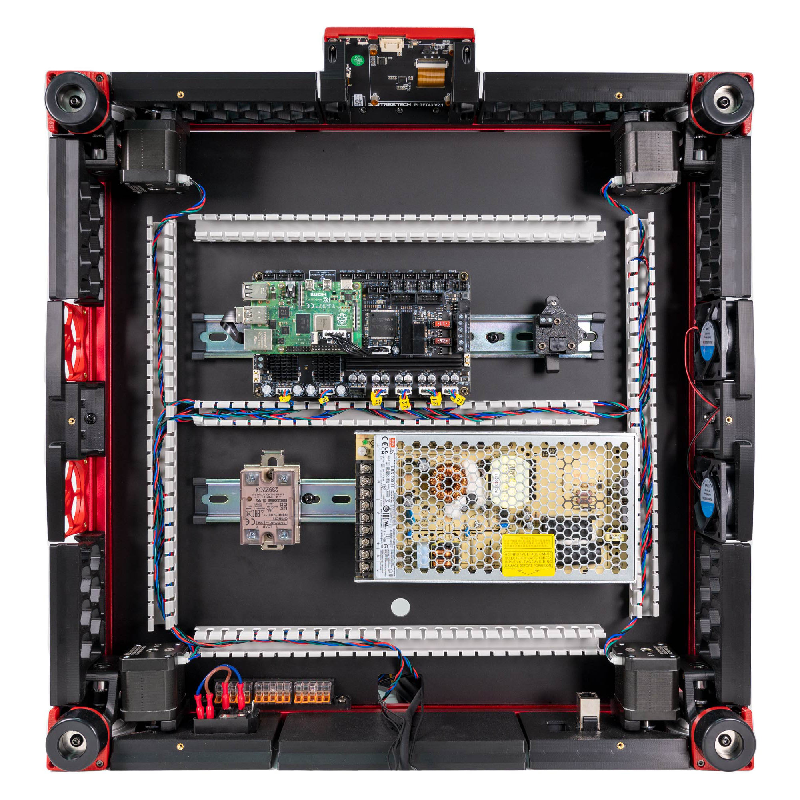

**What you're looking at:** `HV-STEPPER-1` is one of the two high-voltage driver sockets on the Leviathan — a TMC5160, the strongest driver pair on the board, reserved for the two CoreXY motors. The 4-pin plug carries the motor's two coils, two wires each.

**Parts:** A motor cable ×1 (4-pin JST-XH).

**Do:** Plug the A motor — rear right — into the TMC5160 port LDO's diagram labels `HV-STEPPER-1`. The two 5160 slots sit apart from the five 2209 slots; match your board against `S1_mapping.jpg` rather than reading the silkscreen, which the Leviathan V1.3 manual writes as *Stepper X* and *Stepper Y*.

**Check:** Connector fully home, latch engaged, cable dressed into the duct with no tension on the header.

⚠ Rev D+ / LDO: never plug or unplug a stepper with power on, and never spin a connected motor by hand. Back-EMF kills drivers. [src](https://docs.ldomotors.com/en/voron/voron2/wiring_guide_rev_d#connecting-steppers)

Source: [LDO Rev D photo S1 steppers wired](https://raw.githubusercontent.com/MotorDynamicsLab/LDOVoron2/8270e8c/Images/WiringGuide/RevD/S1_steppers.jpg) · [LDO wiring guide § Connecting steppers](https://docs.ldomotors.com/en/voron/voron2/wiring_guide_rev_d#connecting-steppers)

---

### Step 10.42 — B motor → HV-STEPPER-0

**What you're looking at:** `HV-STEPPER-0` is the other TMC5160 socket. A and B are the two rear-corner motors that between them produce every X and Y move, so both belong on the high-current drivers; the five `STEPPER-n` sockets alongside are weaker TMC2209s.

**Parts:** B motor cable ×1.

**Do:** Plug the B motor — rear left — into `HV-STEPPER-0`, the other 5160 port.

**Check:** A and B are in the two 5160 ports and nowhere else. If either lands on a 2209 the motor will be badly under-driven and you will chase it for hours.

**If your B motor cable is too short** to follow the mapping photo, LDO publishes an alternate route: [alternate B-motor mapping](assets/remote/10-wiring/ldo-b-motor-alternate-mapping.jpg) and [B-motor cable wiring](assets/remote/10-wiring/ldo-b-motor-cable-wiring.jpg). Take the alternate route rather than pulling the cable tight. [src](https://docs.ldomotors.com/en/voron/voron2/wiring_guide_rev_d#connecting-steppers)

Source: [LDO Rev D photo S1 stepper mapping](https://raw.githubusercontent.com/MotorDynamicsLab/LDOVoron2/8270e8c/Images/WiringGuide/RevD/S1_mapping.jpg) · [LDO wiring guide § Connecting steppers](https://docs.ldomotors.com/en/voron/voron2/wiring_guide_rev_d#connecting-steppers)

---

### Step 10.43 — Z0–Z3 → STEPPER-0 to STEPPER-3

**What you're looking at:** `STEPPER-0` to `STEPPER-3` are four of those TMC2209 sockets, one per Z motor — [Z0–Z3](16-glossary.md#z) being the four corners that lift the gantry independently. `STEPPER-4` would carry the extruder on a normal build; here the extruder motor is driven by the toolboard instead, so it stays empty.

**Parts:** Z motor cables ×4.

**Do:** Working left to right along the 2209 header row as `S1_mapping.jpg` shows it — `STEPPER-3`, `STEPPER-2`, `STEPPER-1`, `STEPPER-0` — plug in Z3 (front right), Z2 (rear right), Z1 (rear left), Z0 (front left). Leave `STEPPER-4` empty; the extruder lives on the toolboard.

**Check:** Four connectors, four tags, and each tag's physical position matches the corner its cable physically runs to. `STEPPER-4` is empty.

**Verification deferred:** the definitive test is `STEPPER_BUZZ` per motor in Ch 13. If a corner buzzes that you did not name, swap the two cables — do not edit the config.

Source: [LDO Rev D photo S1 steppers wired](https://raw.githubusercontent.com/MotorDynamicsLab/LDOVoron2/8270e8c/Images/WiringGuide/RevD/S1_steppers.jpg) · [LDO wiring guide § Connecting steppers](https://docs.ldomotors.com/en/voron/voron2/wiring_guide_rev_d#connecting-steppers)

---

### Step 10.44 — Bed thermistor → TH1

**What you're looking at:** `TH1` is a two-pin thermistor input. A thermistor is just a resistor whose value changes with temperature, so the port only measures resistance and there is no polarity to get wrong. The bed's sensor lands here; `TH0` beside it is the hotend input, unused on this build.

**Parts:** *Bed TH* cable ×1 (2-pin JST-XH).

**Do:** Before plugging it in, measure it — see the table in step 10.76. Then plug it into the Leviathan thermistor port silkscreened **TH1**. Polarity does not matter on a thermistor.

**Check:** `TH1`, not TH0. TH0 is the hotend port and is unused on a Nitehawk build; the config reads the bed on `PA2` = TH1.

Source: [LDO Rev D photo S5 build-plate mapping](https://raw.githubusercontent.com/MotorDynamicsLab/LDOVoron2/8270e8c/Images/WiringGuide/RevD/S5_mapping.jpg) · [LDO wiring guide § Connecting build plate](https://docs.ldomotors.com/en/voron/voron2/wiring_guide_rev_d#connecting-build-plate) · [LDO Leviathan V1.3 guide](https://ldomotion.com/guides/voron-leviathan-v1-3) (manual p.9)

---

### Step 10.45 — XY endstops → X-ENDSTOP and Y-ENDSTOP

**What you're looking at:** The two 3-pin ends of the cable from step 10.31 finally reach the board. Each endstop port watches one switch open or close a circuit to ground, and that transition is what tells Klipper the axis has reached its limit.

**Parts:** the two 3-pin ends of the XY endstop cable.

**Do:** **XES / X Stop** into the port labelled `X-ENDSTOP`; **YES / Y Stop** into `Y-ENDSTOP`. LDO's mapping photo labels the three endstop headers **Z STOP / Y STOP / X STOP** in that order along the board.

**Check:** Both fully seated. Press each microswitch on the gantry PCB with a fingertip — you should feel a distinct click. Electrical verification happens at the XY Endstop Check in Ch 13.

Source: [LDO Rev D photo S6 gantry-cable mapping](https://raw.githubusercontent.com/MotorDynamicsLab/LDOVoron2/8270e8c/Images/WiringGuide/RevD/S6_mapping.jpg) · [LDO wiring guide § Connecting the gantry cables](https://docs.ldomotors.com/en/voron/voron2/wiring_guide_rev_d#connecting-the-gantry-cables)

---

### Step 10.46 — Nozzle probe → Z-ENDSTOP

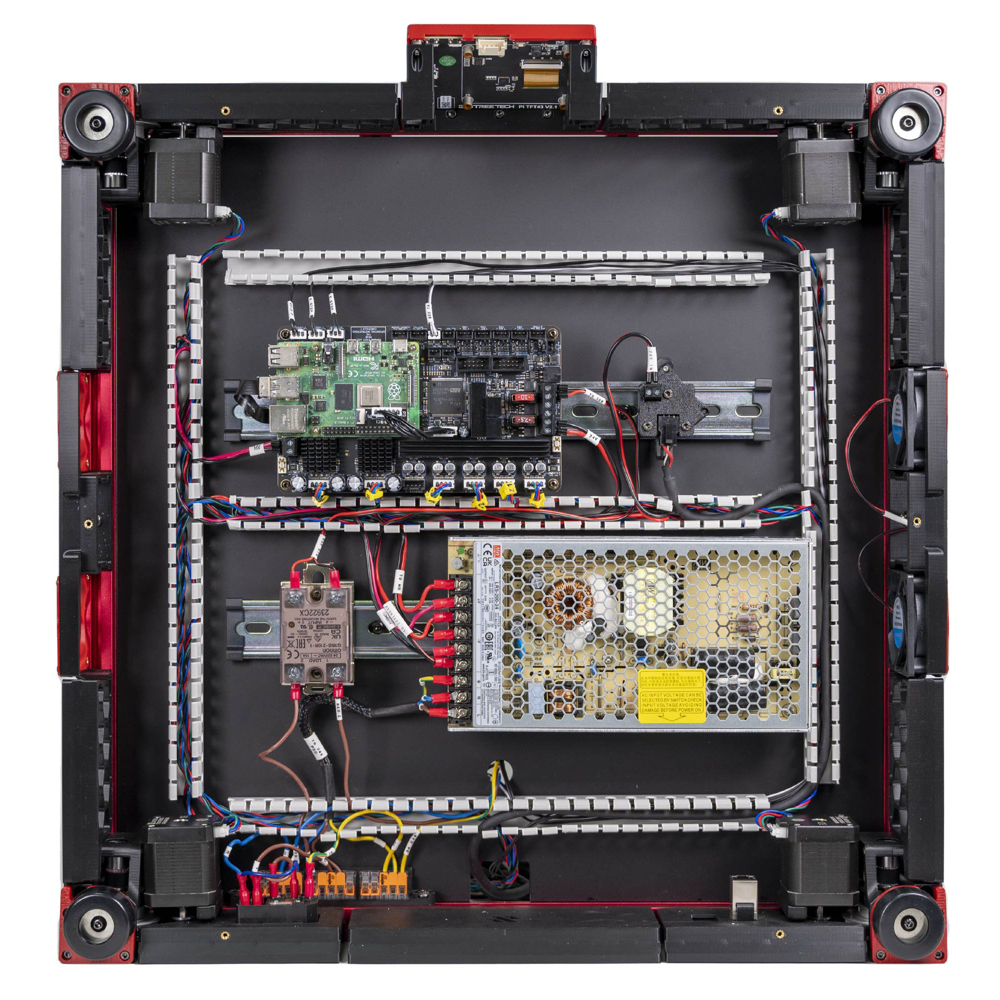

**What you're looking at:** `Z-ENDSTOP` and `Z-PROBE` are two different headers a few millimetres apart on the same board. The mechanical nozzle probe belongs on `Z-ENDSTOP`; `Z-PROBE` stays empty for the entire build, because the inductive probe is wired to the toolboard instead.

**Parts:** Z endstop cable ×1 (3-pin).

**Do:** Plug the nozzle-probe lead into the port labelled `Z-ENDSTOP`.

**Check:** `Z-ENDSTOP`, not `Z-PROBE`. The Leviathan's `Z-PROBE` header stays **empty** for the whole build — the Omron inductive probe is on the toolboard's `PROBE` port, not the mainboard, and the config reads it as `nhk:PC15`.

⚠ Rev D+ / LDO: the stock config's comment says *"Connected to Z-PROBE"* above a `nhk:` pin. The comment is stale; the pin is authoritative. [src](https://github.com/MotorDynamicsLab/LDOVoron2/blob/main/Firmware/leviathan-printer-rev-d-sbv2.cfg)

Source: [LDO Rev D photo S6 endstops wired](https://raw.githubusercontent.com/MotorDynamicsLab/LDOVoron2/8270e8c/Images/WiringGuide/RevD/S6_Endstop.jpg) · [LDO wiring guide § Connecting the gantry cables](https://docs.ldomotors.com/en/voron/voron2/wiring_guide_rev_d#connecting-the-gantry-cables) · [`leviathan-printer-rev-d-sbv2.cfg`](https://github.com/MotorDynamicsLab/LDOVoron2/blob/667521d/Firmware/leviathan-printer-rev-d-sbv2.cfg)

Pause: ~30 min since the last pause — six steppers tagged and plugged on their mapped ports, `STEPPER-4` empty, bed thermistor on TH1, XY endstops and the nozzle probe on their headers. No chain work started.

---

### Step 10.47 — Electronics-bay fan pair → FAN2

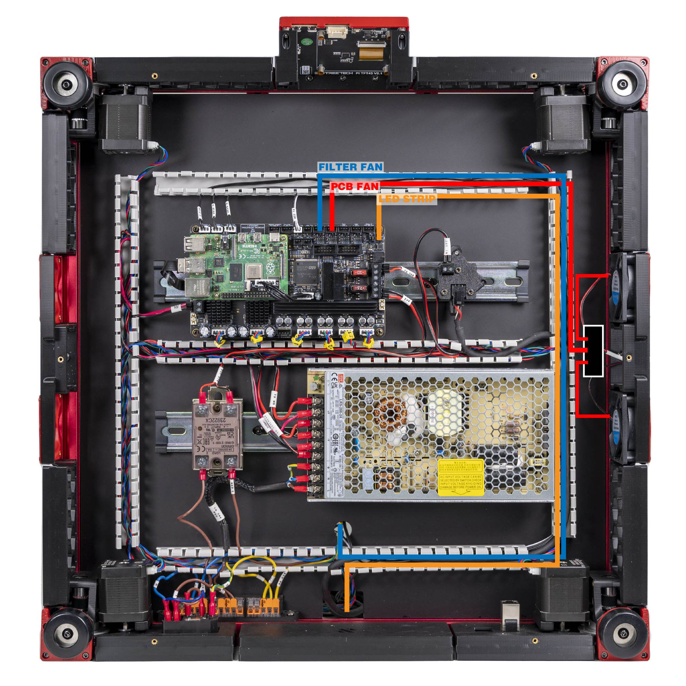

**What you're looking at:** The two 6020 fans are 60 × 20 mm blowers that move air through the electronics bay. The 3×2 splicer PCB joins them into one lead so a single Leviathan fan port drives both, and — as with the LED junction — its printed spacer keeps the bare board off the extrusion.

**Parts:** 6020 fans ×2, 3×2 XH splicer PCB ×1, `2x3 Splitter Spacer` ×1, M3×8 SHCS ×2, M3 hammerhead T-nut ×2, *PCB FAN* cable ×1.

**Do:** Bolt the splicer PCB to its printed spacer and mount the sandwich to a frame extrusion in the bay. Plug both 6020 fans into it and run the *PCB FAN* cable from the splicer to the Leviathan port `FAN2` (pin `PF7`).

**Check:** The spacer is fitted — same short-circuit rule as the LED junction. If the fans themselves are not mounted yet, that happens with the skirts in Ch 11; coil their leads and zip-tie them clear of the gantry for now.

| Item | Cable label | Controller position |
|---|---|---|
| PCB fan | `PCB FAN` | `FAN2` / `PF7` |
| LED strip | `LED STRIP` | `LED-Strip` / `PE6` |
| Filter fan | `FILTER FAN` | `FAN3` / `PF9` |

Source: [LDO Rev D photo S7 fan/LED mapping](https://raw.githubusercontent.com/MotorDynamicsLab/LDOVoron2/8270e8c/Images/WiringGuide/RevD/S7_mapping.jpg) · [LDO wiring guide § Connecting the fans and the LED strip](https://docs.ldomotors.com/en/voron/voron2/wiring_guide_rev_d#connecting-the-fans-and-the-led-strip)

---

### Step 10.48 — Filter fan → FAN3

**What you're looking at:** `FAN3` is the port reserved for the Nevermore: the recirculating activated-carbon filter that scrubs ASA fumes inside the chamber. The filter itself is built in Ch 11, so only its cable is placed and parked now.

**Parts:** *FILTER FAN* cable ×1.

**Do:** Plug the board end into `FAN3` (`PF9`). Route the free end up through the deck opening toward the Nevermore position at the rear of the chamber and leave 150 mm of slack coiled there.

**Check:** The cable is at the board and the free end is parked where Ch 11 will need it. The Nevermore itself is built in Ch 11 — do not chase it now.

Source: [LDO Rev D photo S7 fans wired](https://raw.githubusercontent.com/MotorDynamicsLab/LDOVoron2/8270e8c/Images/WiringGuide/RevD/S7_fan.jpg) · [LDO wiring guide § Connecting the fans and the LED strip](https://docs.ldomotors.com/en/voron/voron2/wiring_guide_rev_d#connecting-the-fans-and-the-led-strip)

---

### Step 10.49 — LED strip → LED-Strip

**What you're looking at:** `LED-Strip` is a dimmable constant-current output that powers plain LEDs directly, up to 350 mA. The `Neopixel` header next to it instead sends a data signal to addressable LEDs — that is what the Stealthburner logo uses, and it runs from the toolboard, not from here.

**Parts:** *LED STRIP* cable ×1 (2-pin JST-XH).

**Do:** Plug the lead from the ceiling junction PCB into the Leviathan port silkscreened `LED-Strip` (`PE6`).

**Check:** `LED-Strip`, not `Neopixel`. `LED-Strip` is a dimmable 350 mA constant-current output; `Neopixel` is data. The Stealthburner LEDs are addressable and hang off the toolboard, not this port.

Source: [LDO Rev D photo S7 fan/LED mapping](https://raw.githubusercontent.com/MotorDynamicsLab/LDOVoron2/8270e8c/Images/WiringGuide/RevD/S7_mapping.jpg) · [LDO wiring guide § Connecting the fans and the LED strip](https://docs.ldomotors.com/en/voron/voron2/wiring_guide_rev_d#connecting-the-fans-and-the-led-strip) · [LDO Leviathan V1.3 guide](https://ldomotion.com/guides/voron-leviathan-v1-3) (manual p.5)

---

### Step 10.50 — DSI ribbon: Raspberry Pi ↔ touchscreen

**What you're looking at:** The FFC is the flat flexible ribbon that carries the display signal (DSI) between the Raspberry Pi and the 4.3" touchscreen. It has no polarity key, so the bare metal contacts on one face are the only clue to which way round it goes; the dark bar at each socket is the latch that clamps it.

**Parts:** FFC ribbon cable ×1, 4.3" capacitive DSI display ×1.

**Do:** Lift the black latch on the Pi's **DISPLAY** connector, slide the ribbon in with the **metal contacts facing forward and the blue tab to the rear**, and press the latch down. At the screen end (BTT Pi TFT43), the **metal contacts face up, blue tab at the back**. Route the ribbon up through the deck to the front, and tape the screen loosely to the frame — it gets mounted with the front skirt in Ch 11.

**Check:** Both latches closed evenly, ribbon square in both slots, no fold or crease. Metal to metal at both ends.

⚠ Rev D+ / LDO: *"Incorrect orientation of the FFC cables can result in damage to your Raspberry Pi and/or touchscreen."* An FFC has no polarity key — the metal contacts are the only clue. [src](https://docs.ldomotors.com/en/guides/btt_43_rotate_guide)

Source: [LDO Rev D photo VS8 mapping](https://raw.githubusercontent.com/MotorDynamicsLab/LDOVoron2/8270e8c/Images/WiringGuide/RevD/VS8_mapping.jpg) · [LDO wiring guide § Setting up the touch screen](https://docs.ldomotors.com/en/voron/voron2/wiring_guide_rev_d#setting-up-the-touch-screen) · [LDO BTT 4.3" rotate guide](https://docs.ldomotors.com/en/guides/btt_43_rotate_guide)

---

### Step 10.51 — Ethernet: Raspberry Pi ↔ rear keystone

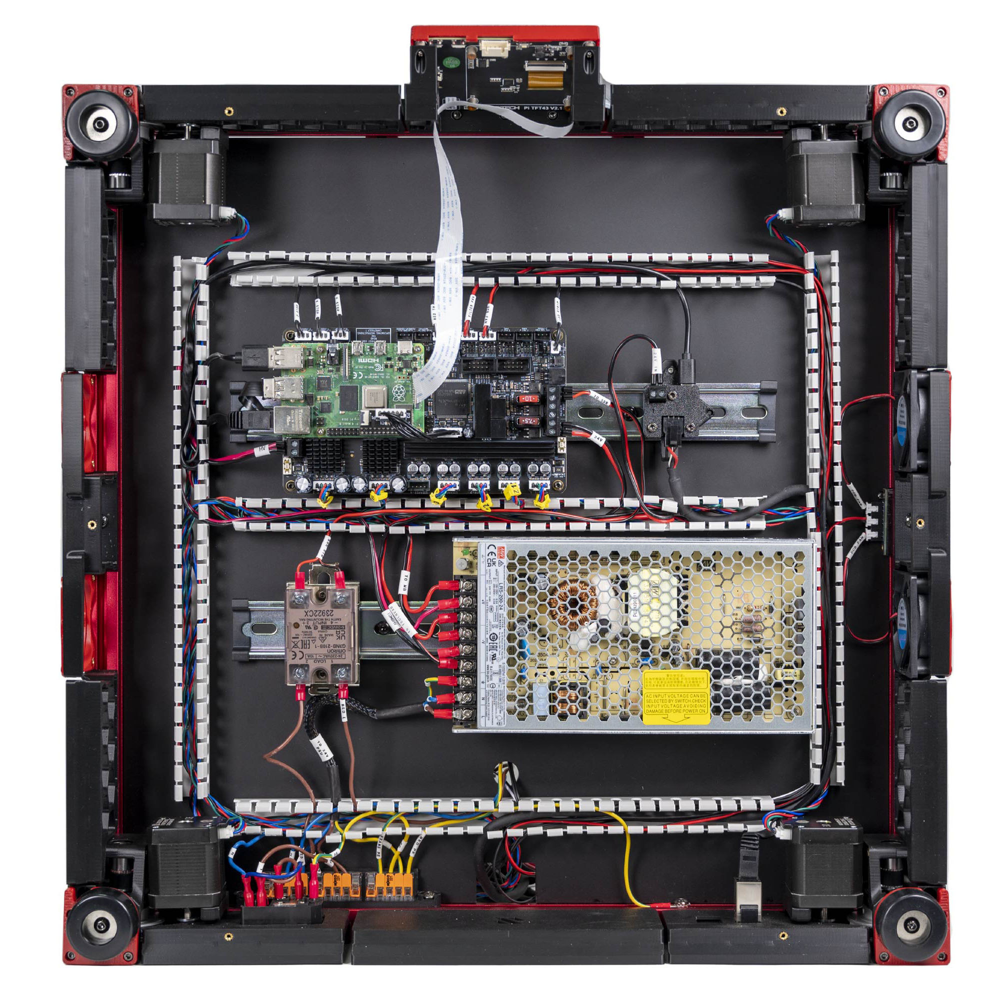

**What you're looking at:** A keystone insert is the snap-in module that turns an opening in a printed panel into a proper RJ45 socket on the outside of the machine. This step runs the Pi's network cable to it so Ethernet reaches the outside world without a lead dangling out of the bay.

**Parts:** Ethernet patch cable ×1, Keystone CAT6 insert ×1.

**Do:** Plug one end into the Pi's RJ45. Run the cable through the duct to the rear-right of the bay and plug the other end into the keystone insert. The keystone's printed panel is a Ch 11 part; for now leave the insert loose in position.

**Check:** Both plugs click. The run does not cross the PSU's AC terminals or lie against the SSR.

Source: [LDO Rev D photo VS8 Ethernet/USB wired](https://raw.githubusercontent.com/MotorDynamicsLab/LDOVoron2/8270e8c/Images/WiringGuide/RevD/VS8_Misc.jpg) · [LDO wiring guide § Connecting the FFC cable, Ethernet cable, USB cable and frame PE](https://docs.ldomotors.com/en/voron/voron2/wiring_guide_rev_d#connecting-the-ffc-cable-ethernet-cable-usb-cable-and-fame-pe)

---

### Step 10.52 — USB: Raspberry Pi ↔ Leviathan

**What you're looking at:** This short cable is the whole link between the Raspberry Pi — the *host*, which plans the motion — and the Leviathan, the MCU that executes it. The photo shows the finished set of Pi connections in LDO's bay.

**Parts:** short USB-A to USB-C cable ×1.

**Do:** Plug USB-A into a Pi port and USB-C into the Leviathan's USB port. Keep it short and dress it flat — this loop is only 60 mm of travel and a long cable will foul the DIN clips.

**Check:** Both ends seated. The Leviathan has exactly one USB-C socket, so there is nothing to get wrong.

Note: the Leviathan can alternatively talk over UART on its dedicated 5-pin Raspberry Pi power/UART port. Ch 12 decides. Wire USB now — the Rev D+ config addresses the mainboard as `/dev/serial/by-id/...`, which is USB. [src](https://ldomotion.com/guides/voron-leviathan-v1-3) · Leviathan V1.3 manual p.5

Source: [LDO Rev D photo VS8 Ethernet/USB wired](https://raw.githubusercontent.com/MotorDynamicsLab/LDOVoron2/8270e8c/Images/WiringGuide/RevD/VS8_Misc.jpg) · [LDO wiring guide § Connecting the FFC cable, Ethernet cable, USB cable and frame PE](https://docs.ldomotors.com/en/voron/voron2/wiring_guide_rev_d#connecting-the-ffc-cable-ethernet-cable-usb-cable-and-fame-pe) · [LDO Leviathan V1.3 guide](https://ldomotion.com/guides/voron-leviathan-v1-3) (manual p.5)

---

### Step 10.53 — USB: Raspberry Pi ↔ USB adapter PCB

**What you're looking at:** The second Pi USB lead is the data half of the toolhead link; the 24 V half went on in step 10.26. The adapter PCB merges the two into the single umbilical socket.

**Parts:** USB cable ×1 (supplied).

**Do:** Plug one end into a second Pi USB port and the other into the USB adapter PCB on its DIN clip. This carries the toolboard's USB data; the 24 V it also needs arrived in step 10.26.

**Check:** Both ends seated. The USB adapter PCB now has three things on it — 24 V in, USB in, and the umbilical socket, which is still empty.

Source: [LDO Rev D photo VS8 mapping](https://raw.githubusercontent.com/MotorDynamicsLab/LDOVoron2/8270e8c/Images/WiringGuide/RevD/VS8_mapping.jpg) · [LDO wiring guide § Connecting the FFC cable, Ethernet cable, USB cable and frame PE](https://docs.ldomotors.com/en/voron/voron2/wiring_guide_rev_d#connecting-the-ffc-cable-ethernet-cable-usb-cable-and-fame-pe)

Pause: ~30 min since the last pause — bay fans, filter fan and LED strip on their Leviathan ports, DSI ribbon latched at both ends, Ethernet and both USB links made. The umbilical is still unconnected at both ends.

---

## Section 6 — Toolhead umbilical and the drag chains

### Step 10.54 — Identify your umbilical and its two connectors

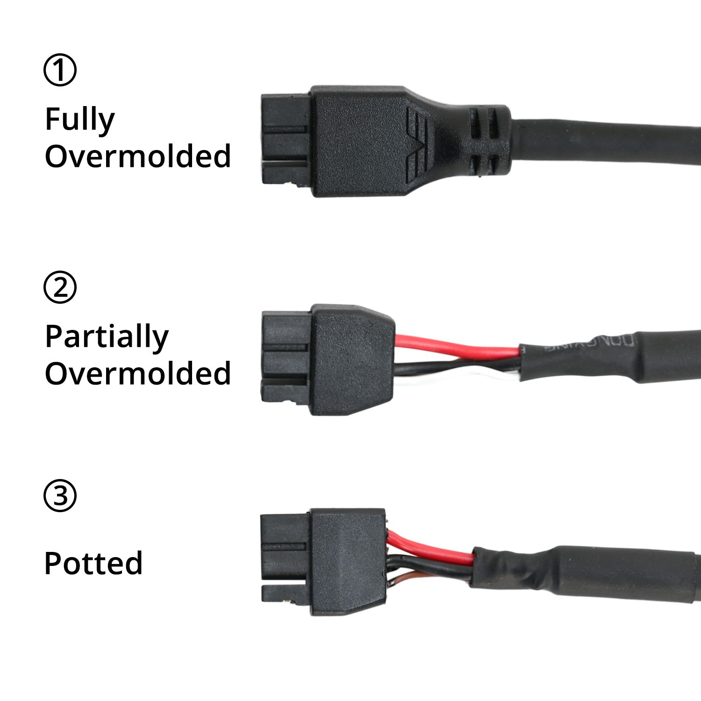

**What you're looking at:** The [umbilical](16-glossary.md#u) is the one thick cable running between the bay and the toolhead, carrying 24 V and USB together. The Amass XT30(2+2) at the toolboard end is a four-contact power-plus-signal connector; the Micro-Fit 3.0 at the bay end is the latching rectangular one. The photo compares the three toolboard-end variants LDO ships; yours is ②, partially overmolded. The diagram's toolhead half shows this same umbilical — Micro-Fit at the bay, XT30(2+2) at the toolboard — against every Nitehawk-SB V2 port with its connector type and pin.

**Parts:** toolhead umbilical cable ×1.

**Do:** The toolboard end is an **Amass XT30(2+2)-F**; kits ship the *partially overmolded* variant, with a short length of exposed wiring so the cable can bend at the toolhead. The bay end is a **Micro-Fit 3.0**. Nominal bend radius **28 mm**, max operating temperature **105 °C**.

**Check:** Both connectors are undamaged and the sheath is unnicked over its whole length.

⚠ Rev D+ / LDO: **never plug or unplug the Micro-Fit end with the machine powered** — it can take out the Nitehawk or the Pi. [src](https://docs.ldomotors.com/en/Toolboard/nitehawk-sb-v2#cable-pinout-adapter-side)

Source: [Nitehawk-SB V2 doc § Umbilical cable](https://docs.ldomotors.com/en/Toolboard/nitehawk-sb-v2#umbilical-cable) · [Nitehawk-SB V2 doc § Cable pinout — adapter side](https://docs.ldomotors.com/en/Toolboard/nitehawk-sb-v2#cable-pinout-adapter-side) · [LDO board doc image `nk36_cable_comparison.jpg`](https://docs.ldomotors.com/en/Toolboard/nitehawk-sb-v2#umbilical-cable)

---

### Step 10.55 — Connector types on the V2 toolboard

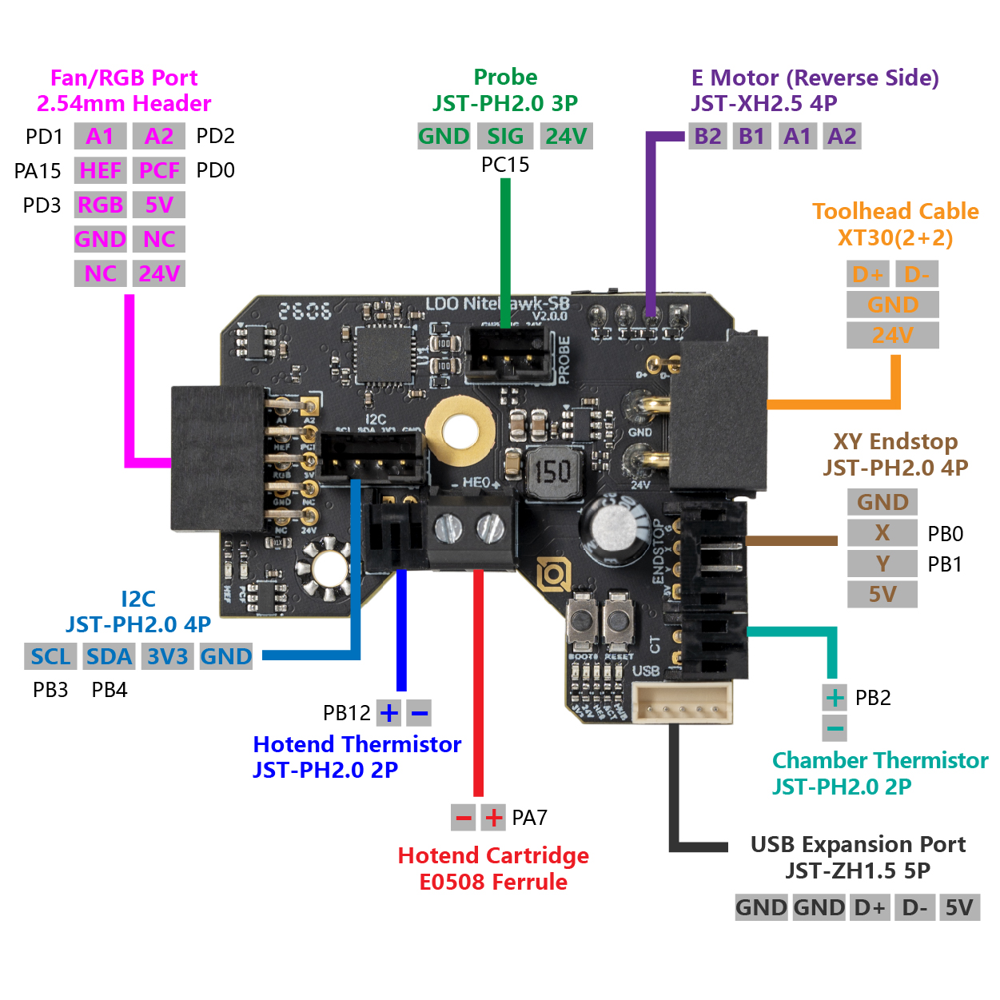
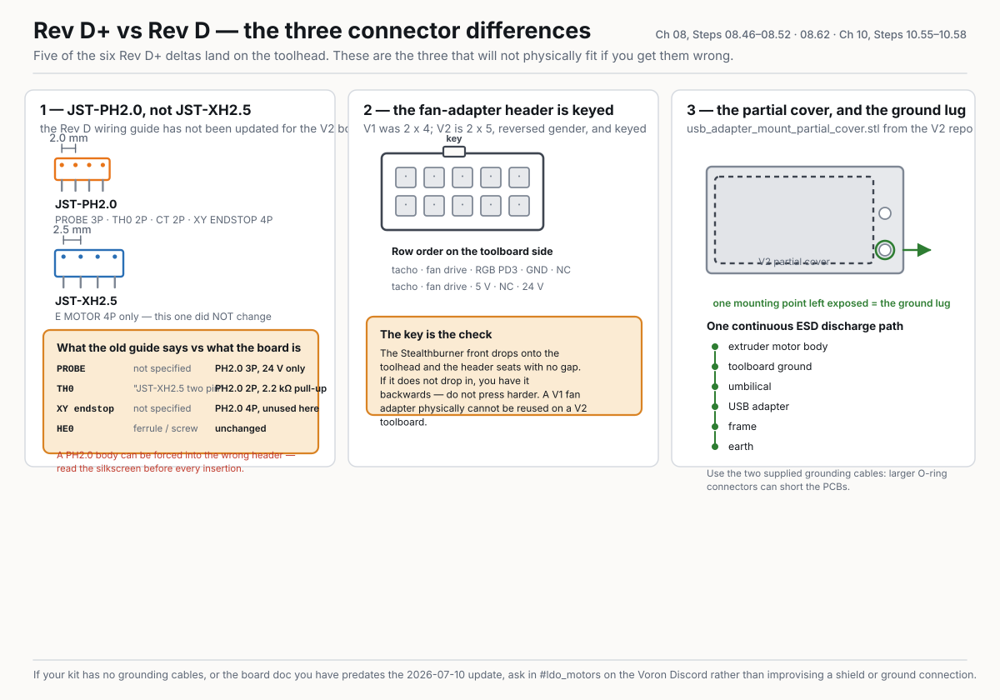

**What you're looking at:** The [Nitehawk-SB V2](16-glossary.md#n) is the toolboard — the small PCB riding on the toolhead that drives the hotend, fans, LEDs, probe and accelerometer, so only one cable has to cross the moving gantry. Its pinout photo matters because V2 uses the finer [JST-PH2.0](16-glossary.md#j) 2.0 mm housings where the Rev D guide still names the coarser XH2.5. The diagram's pitch panel draws JST-PH2.0 and JST-XH2.5 to the same scale so the 2.0 mm vs 2.5 mm difference is visible, and marks the four ports that are PH2.0 against the one that is not.

**Parts:** none — verification only.

**Do:** Before you touch anything on the toolhead, confirm what Ch 08 fitted:

| Port | Rev D wiring guide says | **Rev D+ / Nitehawk V2 actually is** |
|---|---|---|
| `PROBE` | not specified | **JST-PH2.0 3P**, 24 V only |
| `TH0` (hotend thermistor) | *"JST-XH2.5 two pin"* | **JST-PH2.0 2P**, 2.2 kΩ pull-up |
| `Endstop` (X/Y) | not specified — only *"the endstop port isn't used in a standard Rev D build"* | **JST-PH2.0 4P** — unused in a standard build |
| `HE0` (hotend heater) | screw terminal / E0508 ferrule | unchanged |

`TH0` is the one real conflict: JST-XH2.5 is the only connector the Rev D guide names for the toolhead, and for the SB fans it names JST-PH2.0.

**Check:** Every toolhead connector is the small PH2.0 housing, not the larger XH2.5. If you have a spare thermistor or probe pigtail crimped to the documented XH2.5, it will not fit — and a PH2.0 housing can be forced into the wrong header.

⚠ Rev D+ / LDO: the Rev D wiring guide has not been updated for this. Trust the V2 board doc. [src](https://docs.ldomotors.com/en/Toolboard/nitehawk-sb-v2#changes-from-the-nitehawk-sb-v1) — survey §4.1 ③

Source: [Nitehawk-SB-V2 repo `nhsbv2_pcb_pinout.jpg`](https://github.com/MotorDynamicsLab/Nitehawk-SB-V2/blob/42ae497/Images/nhsbv2_pcb_pinout.jpg) · [Nitehawk-SB V2 doc § Connector variants — toolboard side](https://docs.ldomotors.com/en/Toolboard/nitehawk-sb-v2#connector-variants-toolboard-side) · [Nitehawk-SB V2 README § Change list from Nitehawk-SB V1](https://github.com/MotorDynamicsLab/Nitehawk-SB-V2/blob/42ae497/README.md#change-list-from-nitehawk-sb-v1)

---

### Step 10.56 — The fan-adapter header is keyed and reversed

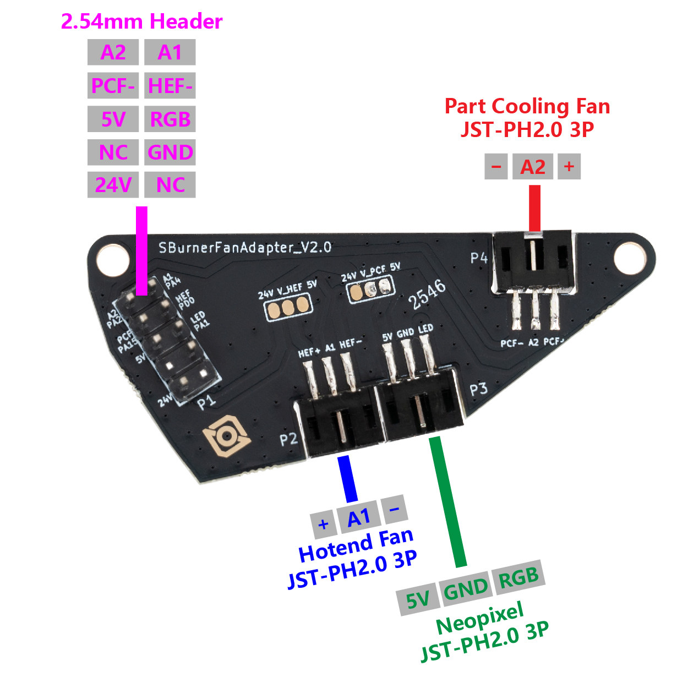

**What you're looking at:** The fan-adapter PCB is the small board inside the Stealthburner front that carries the part-cooling and hotend fans; it mates to the toolboard through a pin header rather than a cable. The photo is the V2 header: 2×5 pins, keyed, and reversed in gender from V1. The diagram's keyed-header panel shows the 2×5 header with its key and the toolboard-side row order, and why a V1 2×4 adapter cannot be reused.

**Parts:** none — verification only.

**Do:** The board-to-board interface between the Stealthburner fan adapter and the main toolboard is a **2×5 (10-pin)** header on V2 (V1 used 2×4), with **reversed gender** and **keying**. Every Rev D photo you will find online shows the old arrangement.

**Check:** The Stealthburner front drops onto the toolhead and the header seats with **no gap**. **If it does not drop in, you have it backwards — do not press harder.** The key is the check.

⚠ Rev D+ / LDO: a V1 fan adapter PCB physically cannot be reused on a V2 toolboard. [src](https://docs.ldomotors.com/en/Toolboard/nitehawk-sb-v2#pinout-fan-adapter-pcb) — survey §4.1 ④

Source: [Nitehawk-SB-V2 repo `sbv2_fan_adapter_pcb_pinout.jpg`](https://github.com/MotorDynamicsLab/Nitehawk-SB-V2/blob/42ae497/Images/sbv2_fan_adapter_pcb_pinout.jpg) · [Nitehawk-SB V2 doc § Pinout — fan adapter PCB](https://docs.ldomotors.com/en/Toolboard/nitehawk-sb-v2#pinout-fan-adapter-pcb)

---

### Step 10.57 — The USB adapter cover is the partial cover

**What you're looking at:** The printed cover clips over the [USB adapter PCB](16-glossary.md#u) in the bay. The V2 version deliberately leaves one mounting hole open so a grounding wire can be bolted to it; the V1 cover encloses that hole, which is why the part number matters. The diagram's partial-cover panel shows the V2 cover with its deliberately exposed mounting point, carrying into the full ESD ground chain from the extruder motor body to earth fitted at Step 10.58.

**Parts:** `usb_adapter_mount_partial_cover.stl` (Nitehawk-SB-**V2** repo) ×1.

**Do:** Confirm the cover on the USB adapter PCB is the V2 **partial** cover, which deliberately leaves one mounting point exposed. The printed-parts guide still points at the V1 `usb_adapter_mount.stl` / `cw2_captive_pcb_cover.stl`; that cover encloses the point you need.

**Check:** One mounting hole on the USB adapter PCB is uncovered and reachable with a screwdriver. If yours is fully enclosed, you printed the V1 part — reprint from the V2 repo before continuing.

⚠ Rev D+ / LDO: *"A newly designed cover exposes one of the mounting points to connect a grounding point."* [src](https://docs.ldomotors.com/en/Toolboard/nitehawk-sb-v2#printed-parts) — survey §4.1 ⑤

Source: [Nitehawk-SB-V2 repo `usb_adapter_gnd.jpg`](https://github.com/MotorDynamicsLab/Nitehawk-SB-V2/blob/42ae497/Images/usb_adapter_gnd.jpg) · [Nitehawk-SB V2 doc § Printed parts](https://docs.ldomotors.com/en/Toolboard/nitehawk-sb-v2#printed-parts)

---

### Step 10.58 — Fit the ESD grounding path

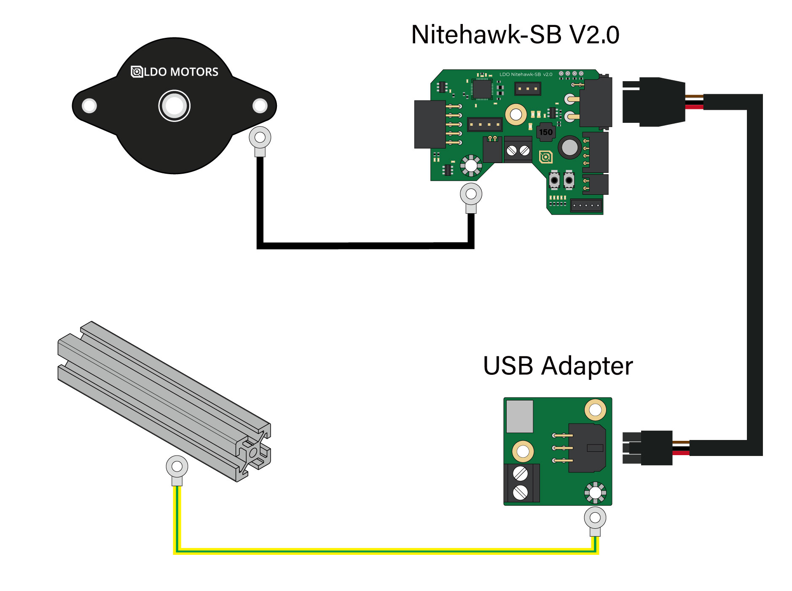

Detail photos: [toolboard ground routing](assets/remote/10-wiring/nitehawk-sb-v2-toolboard-ground-routing.jpg) · [USB-adapter ground point](assets/remote/10-wiring/nitehawk-sb-v2-usb-adapter-gnd.jpg)

**What you're looking at:** [ESD](16-glossary.md#e) — electrostatic discharge — is the static that filament and moving belts build up, and it is what kills toolboards. The two supplied cables build one continuous path from the extruder motor body, through the toolboard and umbilical, to the USB adapter and out to the earthed frame.

**Parts:** the two **supplied** grounding cables (one short, toolhead; one long, bay).

**Do:** LDO's scheme creates one continuous discharge path — *extruder motor body → toolboard ground → umbilical → USB adapter → frame → earth*:
1. Toolhead: run the short grounding cable from the **toolboard's grounding point** to the **extruder motor body**. Bend the connector at an angle on the motor end so it clears the cable-chain anchor.
2. Bay: run the long grounding cable from the **USB adapter PCB's exposed mounting point** (step 10.57) to the **printer frame**.

**Check:** Continuity from the extruder motor body all the way to the C14 earth pin. Under a few ohms.

⚠ Rev D+ / LDO: **use the supplied grounding cable.** LDO: *"using larger O ring connectors may cause inadvertent shorting of the PCB boards."*

⚠ **If your kit did not include the grounding cables**, or your board doc predates the update: stop here, post the three images above in `#ldo_motors` on the Voron Discord and wait for LDO's answer before improvising a shield or ground connection. This scheme was undocumented prose until the board doc was updated **2026-07-10**; if what you are looking at does not match, ask rather than guess. [src](https://docs.ldomotors.com/en/Toolboard/nitehawk-sb-v2#esd-hardening) — survey §4.1 ⑤, now superseded by LDO's own text

Source: [Nitehawk-SB-V2 repo `grounding_scheme.jpg`](https://github.com/MotorDynamicsLab/Nitehawk-SB-V2/blob/42ae497/Images/grounding_scheme.jpg) · [Nitehawk-SB-V2 repo `toolboard_ground_routing.jpg`](https://github.com/MotorDynamicsLab/Nitehawk-SB-V2/blob/42ae497/Images/toolboard_ground_routing.jpg) · [Nitehawk-SB V2 doc § ESD hardening](https://docs.ldomotors.com/en/Toolboard/nitehawk-sb-v2#esd-hardening)

Pause: ~25 min since the last pause — the three Rev D+ toolhead deviations verified (PH2.0 housings, keyed 2×5 fan-adapter header, V2 partial cover) and both ESD grounding cables fitted and continuity-checked. Toolhead is closed and the umbilical is still loose.

---

### Step 10.59 — Fit the X drag chain

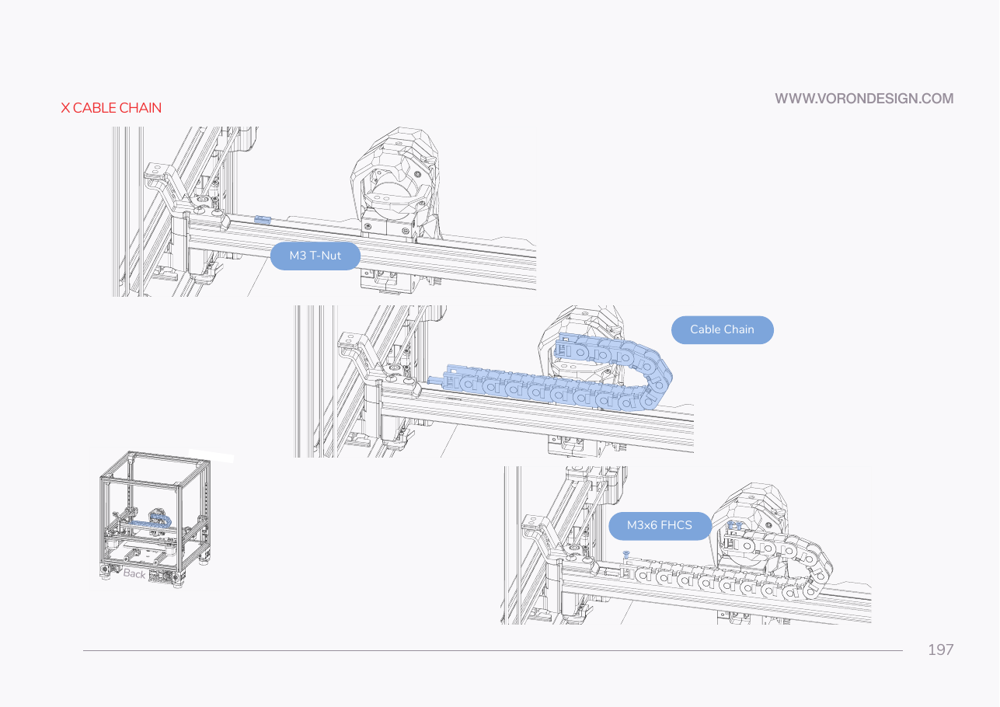

**What you're looking at:** A [drag chain](16-glossary.md#d) is an articulated plastic conduit that lets a cable follow a moving part without ever flexing in the same spot twice. The X chain runs along the top of the X extrusion, fixed at one end and clipped to the toolhead's printed anchor at the other.

**Parts:** drag chain 10×10 R18 ×1 (cut to length), M3 roll-in T-nut ×1, M3×6 FHCS (verify on bench), CW2 chain anchor tilted (LDO-supplied printed, fitted Ch 08).

**Do:** Slide the T-nut into the top slot of the X extrusion. Mount the fixed end of the chain to it with the M3×6 FHCS, and clip the moving end onto the CW2 chain anchor on the toolhead. The chain runs along the top of the X extrusion.

**Check:** Push the toolhead through its full X travel by hand. The chain rolls, never drags on the extrusion, and never reaches full extension.

⚠ Rev D+ / LDO: the kit ships **2-hole** chain ends — print `*_2hole` variants, never `*_3hole`. [src](https://docs.ldomotors.com/en/voron/voron2/printed_part_guide_rev_d)

Source: [Voron manual p.197](https://github.com/VoronDesign/Voron-2/blob/de7e89d/Manual/Assembly_Manual_2.4r2.pdf#page=197) · [LDO printed-parts guide Rev D](https://docs.ldomotors.com/en/voron/voron2/printed_part_guide_rev_d)

---

### Step 10.60 — Fit the Y drag chain

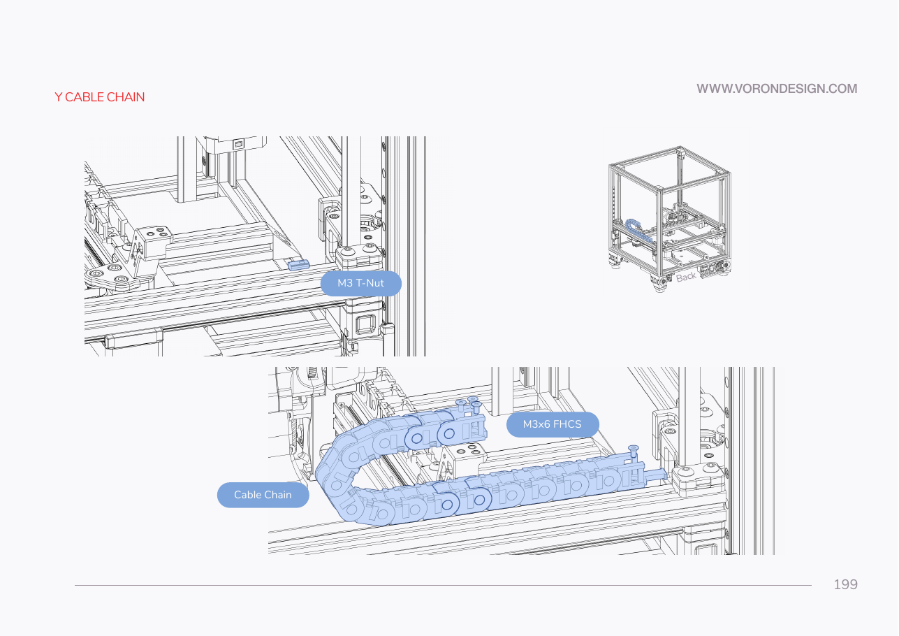
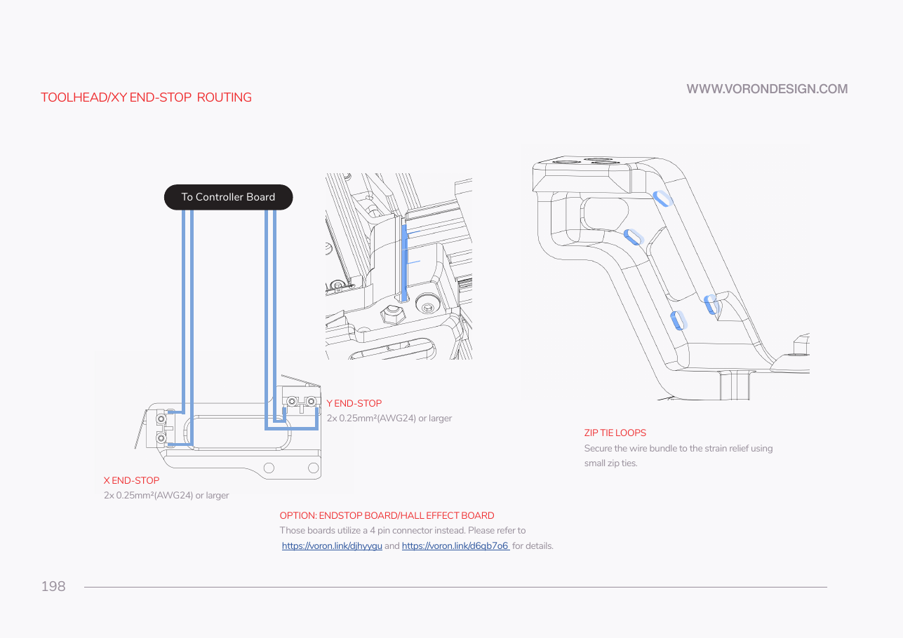

**What you're looking at:** The Y chain does the same job one level out: fixed to the left Y extrusion, moving with the XY joint, so the toolhead umbilical and the endstop cable can travel front to back. The two manual pages show the mounting position and the strain-relief ties.

**Parts:** drag chain 10×10 R18 ×1, M3 roll-in T-nut ×1, M3×6 FHCS (verify on bench), small zip ties ×2.

**Do:** T-nut into the left Y extrusion, chain fixed end onto it, moving end onto the XY joint's cable bridge. This chain carries the toolhead umbilical and the XY endstop cable rearwards. Manual p.198: secure the wire bundle to the chain's strain relief with **small** zip ties.

**Check:** Run the gantry front to back by hand over the full Y travel. The chain articulates freely and the loop stays clear of the bed extrusions.

⚠ Rev D+ / LDO: ignore p.198's separate X and Y endstop wiring — the kit uses one 4-pin XY endstop PCB (LDO notes p.162, p.163, p.169). [src](https://docs.ldomotors.com/voron/voron2/build-faq)

Source: [Voron manual p.199](https://github.com/VoronDesign/Voron-2/blob/de7e89d/Manual/Assembly_Manual_2.4r2.pdf#page=199) · [Voron manual p.198](https://github.com/VoronDesign/Voron-2/blob/de7e89d/Manual/Assembly_Manual_2.4r2.pdf#page=198) · [LDO Build Notes p.198](https://docs.ldomotors.com/voron/voron2/build-faq#build-notes)

---

### Step 10.61 — Secure the A and B motor cables

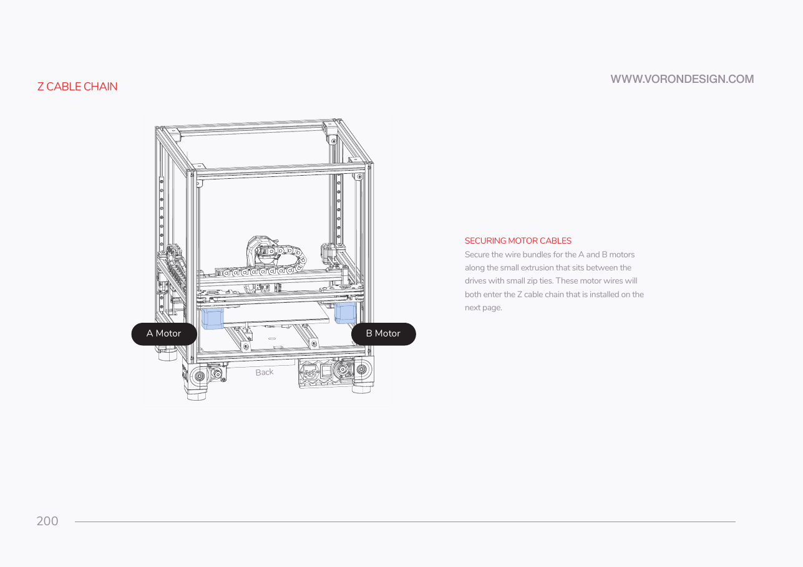

**What you're looking at:** The A and B motor leads run from the two rear drive units along the small extrusion between them and then join everything else in the Z chain. Nothing here moves relative to the frame — the ties exist only to keep the cables out of the belts and pulleys.

**Parts:** zip ties ×4–6.

**Do:** Bundle the A and B motor cables along the small extrusion between the two drive units, tying every 60–80 mm. Both bundles feed into the Z chain next.

**Check:** No cable can reach a moving belt or pulley. Ties are snug, not crushing.

Source: [Voron manual p.200](https://github.com/VoronDesign/Voron-2/blob/de7e89d/Manual/Assembly_Manual_2.4r2.pdf#page=200)

---

### Step 10.62 — Fit the Z chain guide and the Z chain

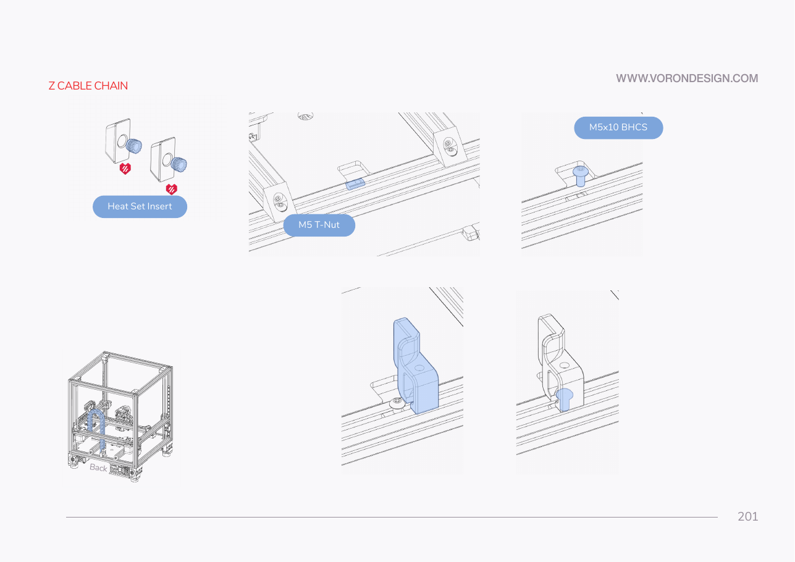
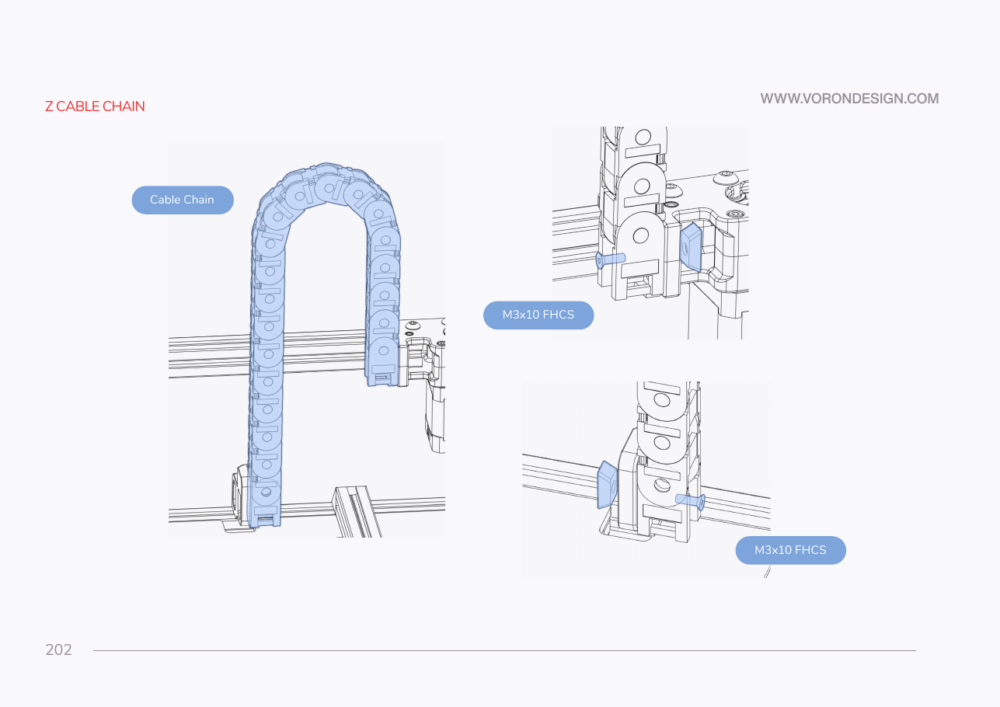

**What you're looking at:** The Z chain is the largest of the three (10 × 15 mm links, 28 mm bend radius) because it carries the entire gantry harness down to the deck. The printed guide bolts to the frame and holds the chain's lower run in a clean vertical loop as the gantry rises and falls.

**Parts:** Z chain guide (batch B05) ×1, M3×5×4 heat-set inserts ×2, M5 roll-in T-nut ×1, M5×10 BHCS ×1, drag chain 10×15 R28 ×1, M3×10 FHCS ×2.

**Do:** Melt the two inserts into the printed guide. Bolt it to the frame extrusion with the M5 T-nut and M5×10 BHCS at the position the page shows. Attach the chain's lower end to the guide with two M3×10 FHCS (manual p.202).

**Check:** The guide is square to the extrusion and the chain hangs in a clean vertical loop.

Source: [Voron manual p.201](https://github.com/VoronDesign/Voron-2/blob/de7e89d/Manual/Assembly_Manual_2.4r2.pdf#page=201) · [Voron manual p.202](https://github.com/VoronDesign/Voron-2/blob/de7e89d/Manual/Assembly_Manual_2.4r2.pdf#page=202)

---

### Step 10.63 — Fit the Z chain bottom anchor

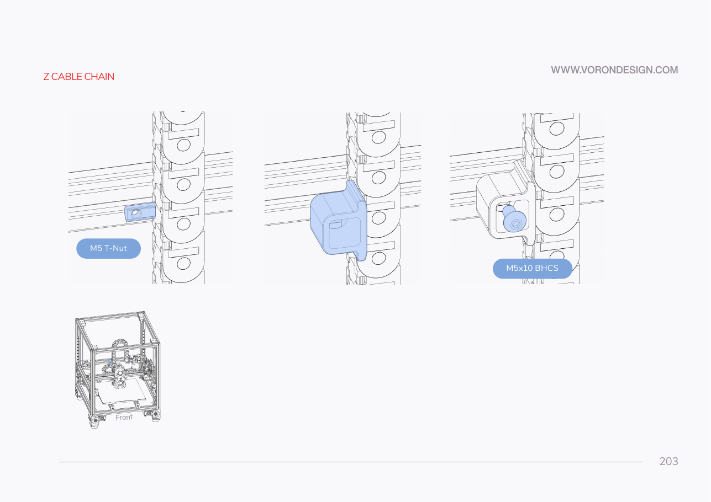

**What you're looking at:** The bottom anchor is the printed block that pins the fixed end of that vertical loop to the frame. Its height is what decides how much chain is left over at each end of the gantry's Z travel.

**Parts:** Z chain bottom anchor (batch B05) ×1, M5 roll-in T-nut ×1, M5×10 BHCS ×1.

**Do:** T-nut into the vertical extrusion at the height the page shows, anchor over it, M5×10 BHCS through.

**Check:** With the gantry at the bottom of its travel the chain loop is still open; with it at the top the chain is not stretched.

Source: [Voron manual p.203](https://github.com/VoronDesign/Voron-2/blob/de7e89d/Manual/Assembly_Manual_2.4r2.pdf#page=203)

---

### Step 10.64 — Fit the Z chain retainer bracket and set the wire path

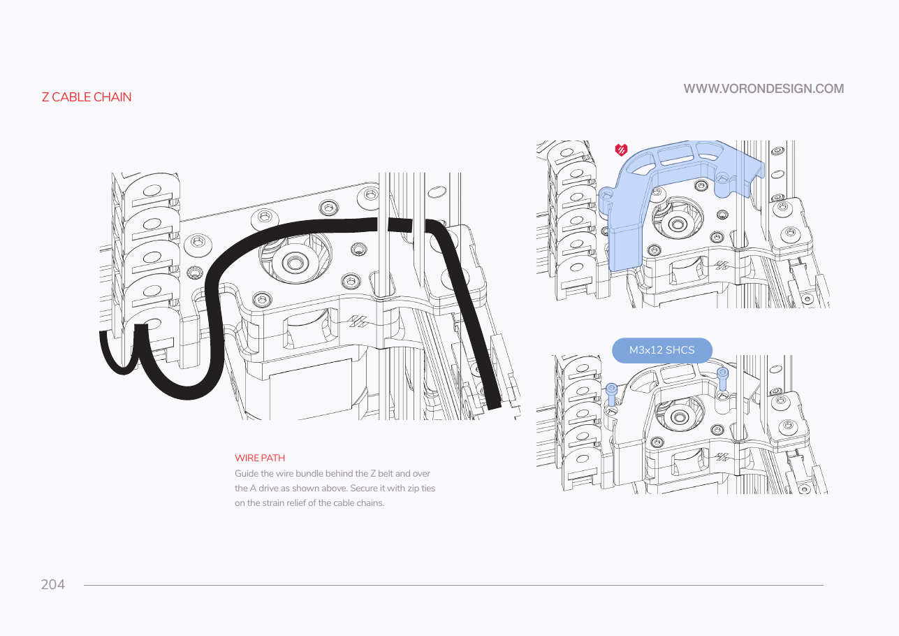

**What you're looking at:** The orange `[a]_z_chain_retainer_bracket` bolts to the A drive at the top of the loop and carries the chain's moving end up and down with the gantry. The manual page also fixes the wire path — behind the Z belt and over the drive — so the bundle can never rub the belt.

**Parts:** `[a]_z_chain_retainer_bracket` ×1 (batch **B02**, plate B02-P3; B02 prints 2 and Ch 06 Step 06.26 bags both — the second is a spare **(verify on bench)**), M3×12 SHCS ×2, M3×10 FHCS ×2, zip ties ×2.

**Do:** Bolt the retainer bracket to the A drive with two M3×12 SHCS and attach the chain's upper end with two M3×10 FHCS. Manual p.204: *"Guide the wire bundle behind the Z belt and over the A drive as shown above. Secure it with zip ties on the strain relief of the cable chains."*

**Check:** Move the gantry through full Z travel. The bundle never touches the Z belt and the chain's top end never twists.

Source: [Voron manual p.204](https://github.com/VoronDesign/Voron-2/blob/de7e89d/Manual/Assembly_Manual_2.4r2.pdf#page=204)

Pause: ~35 min since the last pause — X, Y and Z chains all mounted at both ends, A/B motor cables bundled, retainer bracket on the A drive. **Chains are empty and latched.** Do not part-fill a chain and walk away — the next segment fills all three in one go.

---

### Step 10.65 — Lay the harness into the chains

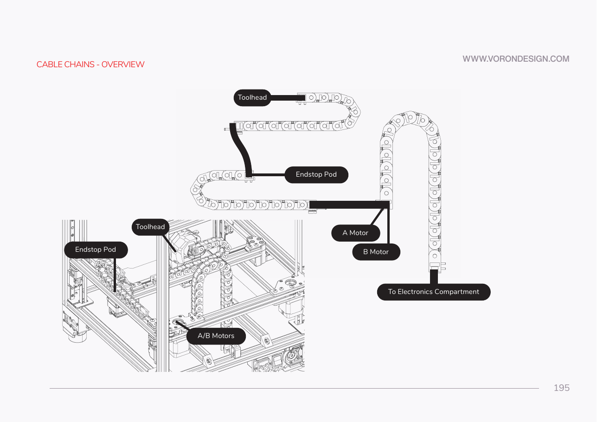
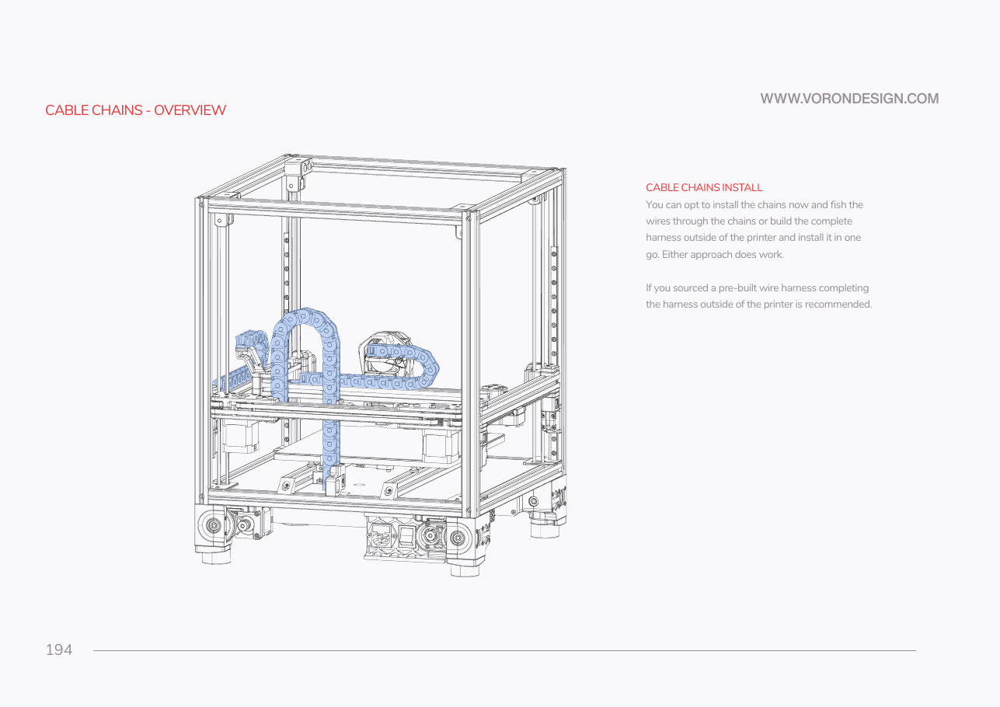

**What you're looking at:** Every drag-chain link has a hinged latch down one side, marked with a small screwdriver icon on the side you may pry. With the latches open the chain is an open trough, so cables are laid into it rather than threaded through it.

**Parts:** umbilical ×1, XY endstop cable ×1, A and B motor bundles, 2.5 mm flat screwdriver.

**Do:** Open the chain latches with the flat screwdriver — look for the small screwdriver icon on the latch, pry **only** that side, and press each latch back until it clicks. Lay cables in; do not fish them through. Fill in the order the manual's overview shows: toolhead umbilical and endstop pod cable into the X chain, then both into the Y chain, then everything plus the A and B motor bundles into the Z chain and down to the electronics compartment.

**Check:** Every latch is clicked shut. With the gantry parked mid-travel, you can pinch each cable inside a chain link and slide it a few millimetres. If you cannot, it is too tight.

⚠ Rev D+ / LDO: LDO note p.194–195 — *"When running wires in the cable chain, it is important to keep the wires loose. Pulling the wires tight inside the cable chain will result to excessive wire fatigue and possible pre-mature wire breaks."* This is the most-repeated warning in the whole LDO documentation set. [src](https://docs.ldomotors.com/voron/voron2/build-faq)

Note: the umbilical's nominal bend radius is **28 mm** and the X and Y chains are **R18**. LDO ships this combination and rates the cable for drag-chain use, but it is the cable most likely to fail first — which is exactly why the next two steps exist.

Source: [Voron manual p.195](https://github.com/VoronDesign/Voron-2/blob/de7e89d/Manual/Assembly_Manual_2.4r2.pdf#page=195) · [Voron manual p.194](https://github.com/VoronDesign/Voron-2/blob/de7e89d/Manual/Assembly_Manual_2.4r2.pdf#page=194) · [LDO Build Notes p.194–195](https://docs.ldomotors.com/voron/voron2/build-faq#build-notes)

---

### Step 10.66 — Zip-tie both ends of every chain

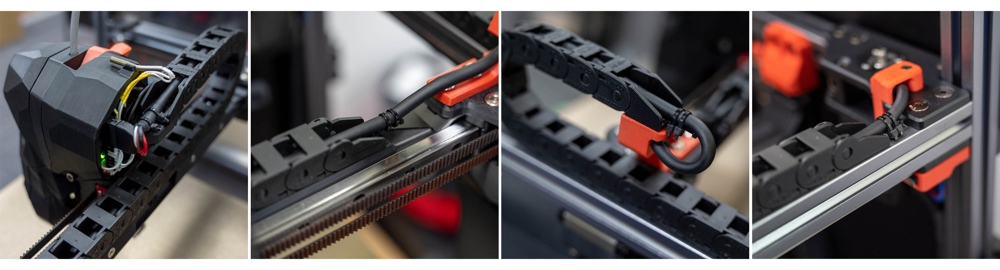

**What you're looking at:** Each end link of a chain has a small tab moulded on for a zip tie. The tie is a strain relief: pull on the umbilical and the load stops at the tie instead of arriving at the XT30 or Micro-Fit connector.

**Parts:** zip ties ×12.

**Do:** LDO: *"**Always** ensure that the umbilical cable is **secured (with zipties) on both ends** of the chains."* Tie to the small tab that sticks out of each end link. Do this at all six chain ends. If a tab is in the way of something you can cut it off — but then tie around the end link itself.

**Check:** Six tie points. Pull the umbilical from the toolhead end: the strain lands on the zip tie, not the XT30 connector. Repeat at the bay end for the Micro-Fit.

Source: [Nitehawk-SB V2 doc § Working with cable chains](https://docs.ldomotors.com/en/Toolboard/nitehawk-sb-v2#working-with-cable-chains) · [Nitehawk-SB-V2 repo `cable_chain_ties.jpg`](https://github.com/MotorDynamicsLab/Nitehawk-SB-V2/blob/42ae497/Images/cable_chain_ties.jpg)

---

### Step 10.67 — Umbilical → USB adapter PCB

**What you're looking at:** The bay end of the umbilical finally lands on the adapter PCB that has been waiting since steps 10.26 and 10.53. The Micro-Fit's latch is the click you are listening for.

**Parts:** umbilical Micro-Fit 3.0 end.

**Do:** With the machine unplugged and confirmed dead, push the Micro-Fit connector into the USB adapter PCB until the latch clicks.

**Check:** Latch engaged, connector square, and the cable leaves the PCB with a gentle curve — no bend tighter than 28 mm anywhere in the run.

⚠ Rev D+ / LDO: leave enough slack at the toolhead that the V2's **secondary USB port stays reachable without pulling the toolhead off**. That port is the whole point of the "+" in Rev D+ (USB passthrough for a future eddy-current probe); designing it out now costs you a re-route later. [src](https://docs.ldomotors.com/en/Toolboard/nitehawk-sb-v2#features) — survey §4.1, sixth item

Source: [LDO Rev D photo S6 gantry-cable mapping](https://raw.githubusercontent.com/MotorDynamicsLab/LDOVoron2/8270e8c/Images/WiringGuide/RevD/S6_mapping.jpg) · [Nitehawk-SB V2 README § Features](https://github.com/MotorDynamicsLab/Nitehawk-SB-V2/blob/42ae497/README.md#features)

Pause: ~25 min since the last pause — every cable laid into its chain, all six chain ends zip-tied, every latch clicked shut, umbilical Micro-Fit seated in the USB adapter. Gantry moves through full X, Y and Z travel by hand.

---

## Section 7 — Cable management

### Step 10.68 — Dress the below-deck runs into the ducts

**What you're looking at:** [Wire ducts](16-glossary.md#w) are the slotted plastic channels screwed to the deck: a cable presses in between the fingers and a lid clips over later. From here the bay carries two independent runs — a mains group and a signal group — that meet only where they cross at right angles.

**Parts:** none.

**Do:** Push every below-deck run down into a wire duct. Keep the mains group (inlet, WAGO bus, PSU AC, SSR load) in its own duct run, separate from the signal group (endstops, thermistor, USB, Ethernet, DSI). Cross them at right angles where they must cross.

**Check:** No cable lies loose on the deck. Nothing rests on the PSU's AC terminal block or the SSR.

Source: [LDO Rev D photo VS9 finished bay](https://raw.githubusercontent.com/MotorDynamicsLab/LDOVoron2/8270e8c/Images/WiringGuide/RevD/VS9_Final.jpg) · [LDO wiring guide § Finish line](https://docs.ldomotors.com/en/voron/voron2/wiring_guide_rev_d#finish-line)

---

### Step 10.69 — Strain-relieve the deck opening

(no image — see text)

**What you're looking at:** The deck opening is the single hole every above-deck cable passes through. Tying the bundle just below it puts the weight of the whole above-deck harness on the frame instead of on a connector.

**Parts:** zip ties ×3–4.

**Do:** The bundle passing through the deck opening (bed L/N/PE/TH, nozzle probe, umbilical, XY endstop, filter fan) carries the whole above-deck harness. Tie it to the deck support or the frame just below the opening so the weight never hangs on a connector.

**Check:** Lift the bundle above deck: the strain stops at the tie. No connector below deck moves.

Source: [LDO wiring guide § Below-deck wiring](https://docs.ldomotors.com/en/voron/voron2/wiring_guide_rev_d#below-deck-wiring)

---

### Step 10.70 — Tag every cable at the board end

(no image — see text)

**What you're looking at:** The same cable tags as step 10.40, now applied to everything else that reaches a board. This is the only documentation of a Rev D+ bay that will ever exist.

**Parts:** cable tags (supplied).

**Do:** Every cable that reaches the Leviathan, the PSU, the SSR or the USB adapter gets a tag naming what it is and where its far end goes. LDO ships the tags for exactly this reason.

**Check:** You could disconnect the whole board and put it back tomorrow from the tags alone.

Source: [LDO wiring guide § Finish line](https://docs.ldomotors.com/en/voron/voron2/wiring_guide_rev_d#finish-line)

---

### Step 10.71 — Leave the duct covers off

(no image — see text)

**What you're looking at:** Duct covers are the snap-on lids for the channels from step 10.68. They are the last thing to fit, not the first: the bay has to stay reachable with a meter probe until Ch 13 has driven every motor, heater and fan at least once.

**Parts:** duct covers — **not** fitted.

**Do:** Nothing. LDO's "Finish Line" tells you to cover the ducts; do not. Leave them off until Checkpoint 10 passes and Ch 13 has driven every motor, heater and fan at least once.

**Check:** Every duct is open and every terminal is reachable with a meter probe.

Survey §5.2 W8: closing the bay before the checkpoint costs an hour to re-open and tempts you to skip the meter entirely.

Source: [LDO wiring guide § Finish line](https://docs.ldomotors.com/en/voron/voron2/wiring_guide_rev_d#finish-line) · [survey §5.2 W8](../voron-build-instructions-survey.md)

---

### Step 10.72 — Photograph the bay

(no image — see text)

**What you're looking at:** Nothing to fit here. Rev D+ — Rev D plus the Nitehawk-SB V2 — is not photographed anywhere online in this configuration, so these five shots become the reference you will use when something needs re-tracing.

**Parts:** phone.

**Do:** Take one overhead shot of the whole bay and four close-ups: the WAGO bus, the SSR terminals, the PSU terminal block, and the Leviathan's connector rows. Rev D+ is undocumented in this configuration — your own photos are the reference nobody else has.

**Check:** Every terminal label is legible at full zoom.

Source: [survey §7.5](../voron-build-instructions-survey.md)

Pause: ~20 min since the last pause — below-deck runs dressed into the ducts with mains and signal separated, deck opening strain-relieved, every cable tagged, **duct covers still off**, bay photographed. Do not fit the covers or any skirt.

---

## Section 8 — Pre-power-on meter sweep

Everything here is measured **unplugged**. Nothing in this section powers anything on.

### Step 10.73 — Confirm dead

(no image — see text)

**What you're looking at:** A PSU holds charge in its bulk capacitors after the cord comes out. Reading 0 V across its DC output, and watching it stay there for ten seconds, is what proves the machine is safe to probe.

**Parts:** multimeter.

**Do:** Cord out of the inlet and out of the room. Meter on DC V across the PSU's +V and −V.

**Check:** 0 V, and it stays 0 V for ten seconds. The bulk caps are discharged.

Source: [LDO wiring guide § Checkpoint 1](https://docs.ldomotors.com/en/voron/voron2/wiring_guide_rev_d#checkpoint-1)

---

### Step 10.74 — 24 V rails

(no image — see text)

**What you're looking at:** Each row is one 24 V input measured against its own ground with no power present. A healthy input behaves like a capacitor charging — a resistance that rises as you watch; a shorted one behaves like a piece of wire.

**Parts:** multimeter on Ω.

**Do:** Measure each 24 V node against its ground.

**Check:** Every row, measured against the node's own ground.

| Node | Expected |
|---|---|
| PSU +V → −V | finite, rising as caps charge. **Never 0 Ω** |
| Leviathan `Vin 24V` + → − | finite, rising. Never 0 Ω |
| Leviathan `Vin 24-48V` + → − | finite, rising. Never 0 Ω |
| USB adapter 24 V in + → − | finite, rising. Never 0 Ω |
| Any 24 V node → **PE** | `OL` |

A continuous beep on any row is a reversed ferrule or a stray strand. Find it now.

Source: [LDO wiring guide § Connecting 24V](https://docs.ldomotors.com/en/voron/voron2/wiring_guide_rev_d#connecting-24v)

---

### Step 10.75 — 5 V rail

(no image — see text)

**What you're looking at:** There is no 5 V power supply in this kit: the Leviathan makes 5 V itself and sends it to the Pi through the 5-pin power/UART port and the HAT adapter. This check confirms that rail is not shorted, and that no jumper is left anywhere that could bridge it to 24 V.

**Parts:** multimeter on Ω.

**Do:** There is no 5 V PSU in this kit — the Leviathan's own buck converter feeds the Pi through the 5-pin JST-XH power/UART port and the HAT adapter. Measure across the adapter cable's 5 V and GND at the Pi end.

**Check:** Finite, and **not** 0 Ω. Then re-confirm from step 10.28: exactly two jumpers on the board, both Fan2 and Fan3, both on the 24 V pins. With no jumper in a 5 V position there is no path that can bridge 5 V to 24 V.

⚠ Rev D+ / LDO: LDO notes p.152, p.172 and p.190 are all **SKIP** — the manual's 5 V PSU does not exist in this kit and the Pi is never powered over its own USB-C. [src](https://docs.ldomotors.com/voron/voron2/build-faq)

Source: [LDO Build Notes p.152, p.172, p.190](https://docs.ldomotors.com/voron/voron2/build-faq#build-notes) · [LDO Leviathan V1.3 guide](https://ldomotion.com/guides/voron-leviathan-v1-3) (manual p.5)

---

### Step 10.76 — Thermistors at room temperature

(no image — see text)

**What you're looking at:** A thermistor is a resistor whose value falls as it gets hotter; both of this machine's are the same ATC Semitec part, nominally 100 kΩ at 25 °C. Measuring them cold against the table is how a crushed or broken lead is caught before any heater ever runs.

**Parts:** multimeter on Ω, room thermometer.

**Do:** Unplug the bed thermistor from `TH1` and measure across its two pins. Do the same at the toolboard's `TH0` if the toolhead is still open. Both are **ATC Semitec 104NT-4-R025H42G**.

**Check:** Read your room temperature, then compare against Klipper's own curve for that part:

| Room temp | Expected resistance |
|---|---|
| 15 °C | ≈ 162 kΩ |
| 18 °C | ≈ 140 kΩ |
| 20 °C | ≈ 127 kΩ |
| 22 °C | ≈ 115 kΩ |
| 25 °C | ≈ 100 kΩ |
| 28 °C | ≈ 87 kΩ |
| 30 °C | ≈ 79 kΩ |

Within ±15 % of the row for your room is fine. **0 Ω** means a crushed lead; **`OL`** means a broken one or an unseated crimp. Plug the bed thermistor back into `TH1` when you are done.

Derived from the `[thermistor ATC Semitec 104NT-4-R025H42G]` definition in [Klipper's `temperature_sensors.cfg`](https://github.com/Klipper3d/klipper/blob/master/klippy/extras/temperature_sensors.cfg) (100 kΩ at 25 °C), which is the curve the printer will actually use.

Source: [Klipper `temperature_sensors.cfg`](https://github.com/Klipper3d/klipper/blob/f0892d8/klippy/extras/temperature_sensors.cfg) · [LDO wiring guide § Connecting build plate](https://docs.ldomotors.com/en/voron/voron2/wiring_guide_rev_d#connecting-build-plate)

---

### Step 10.77 — Protective-earth bonding

(no image — see text)

**What you're looking at:** The last earth check. Every piece of metal a hand can reach must have a low-resistance path back to the earth pin of the inlet, and nothing that carries current may have any path at all. This is the measurement that makes the machine safe to touch.

**Parts:** multimeter on Ω.

**Do:** With one probe on the **C14 earth pin**, touch the other to each of these in turn.

**Check:** Every metal thing you can touch is bonded; nothing live is.

| Point | Expected |
|---|---|
| PE WAGO, any port | < 1 Ω |
| PSU ⏚ terminal | < 1 Ω |
| Frame, at a far corner | a few Ω or less |
| Bare aluminium on the build plate | a few Ω or less |
| Extruder motor body (via the ESD ground) | a few Ω or less |
| Bed heater L or N | `OL` |
| Any 24 V node | `OL` |

A failed row here is either a missing PE lead or anodising under a washer. Fix it before Ch 11 closes the bay.

Source: [LDO wiring guide § Connecting the FFC cable, Ethernet cable, USB cable and frame PE](https://docs.ldomotors.com/en/voron/voron2/wiring_guide_rev_d#connecting-the-ffc-cable-ethernet-cable-usb-cable-and-fame-pe)

---

### Step 10.78 — SSR polarity and isolation, one last time

(no image — see text)

**What you're looking at:** The same four terminals as step 10.10, now with all four cables attached, plus one measurement the earlier check could not make: mains side to control side must be open, because the relay's isolation barrier is the only thing standing between the mains and the mainboard.

**Parts:** multimeter.

**Do:** Read the SSR terminals with the harness attached: **1** = bed L, **2** = mains L from the brown WAGO, **3** = red from the Leviathan HEATBED, **4** = black.

**Check:** All five rows, with the harness attached.

| Measurement | Expected |
|---|---|
| SSR 1 → SSR 2 | `OL` — unpowered SSR is open |
| SSR 3 → SSR 4 | the Leviathan's bed output impedance, a finite reading. Not 0 Ω |
| SSR 1 or 2 → SSR 3 or 4 | `OL` — mains and DC control are galvanically isolated |
| SSR 1 → SSR 2 wire colours | bed cable on 1, brown WAGO cable on 2 |
| SSR 3 wire colour | **red** |

If mains-to-control is not open, the SSR's isolation barrier is gone. Replace it; do not power the machine.

Source: [LDO wiring guide § Connecting 24V](https://docs.ldomotors.com/en/voron/voron2/wiring_guide_rev_d#connecting-24v) · [LDO Rev D photo S4 24 V/SSR mapping](https://raw.githubusercontent.com/MotorDynamicsLab/LDOVoron2/8270e8c/Images/WiringGuide/RevD/S4_mapping.jpg)

---

### Step 10.79 — Connector audit

(no image — see text)

**What you're looking at:** A final pass over every socket on the Leviathan and the USB adapter, naming each one aloud as you press it home. A half-seated connector and a header plugged one position across are the two faults that survive every electrical test in this chapter.

**Parts:** none.

**Do:** Walk the board with a finger and press every connector home: seven stepper ports (six used, `STEPPER-4` empty), `TH1`, `X-ENDSTOP`, `Y-ENDSTOP`, `Z-ENDSTOP`, `Z-PROBE` (empty), `FAN2`, `FAN3`, `LED-Strip`, `Vin 24V`, `Vin 24-48V`, `HEATBED`, USB-C. Then the USB adapter: 24 V in, USB in, umbilical, ground.

**Check:** Nothing rocks, nothing is half-seated, no header pin is bent, no connector is one position off on a header.

Source: [LDO wiring guide § Finish line](https://docs.ldomotors.com/en/voron/voron2/wiring_guide_rev_d#finish-line)

Pause: ~20 min since the last pause — the dead meter sweep is complete and every reading is in band. The machine is unplugged, open and ready for Checkpoint 10. Do not plug the cord in again until Ch 13.

---

## Checkpoint 10

Do not start Ch 11 until every line is ticked.

- [ ] PSU voltage selector matches your mains — verified twice (10.2, 10.22)
- [ ] LDO's **Checkpoint #1** passed in full: colour groups shorted, L/N/PE mutually isolated, switch switches, PSU LED lit, then unplugged (10.17–10.23)
- [ ] Bed heater reads tens of ohms L→N and `OL` to the plate (10.13)
- [ ] SSR: bed on **LOAD 1**, mains L on **LOAD 2**, red on **INPUT 3**, black on **INPUT 4**; load and control sides isolated (10.14, 10.27, 10.78)
- [ ] Protective earth reaches the frame, the build plate and the extruder motor body from the C14 earth pin (10.16, 10.58, 10.77)
- [ ] No 24 V node and no 5 V node reads 0 Ω; exactly two jumpers on the Leviathan, Fan2 and Fan3, both at 24 V (10.28, 10.74, 10.75)
- [ ] Both thermistors read within ±15 % of the room-temperature table (10.76)
- [ ] Six steppers on their mapped ports, tagged; `STEPPER-4` and `Z-PROBE` empty (10.40–10.43, 10.46)
- [ ] All three Rev D+ toolhead deviations verified: PH2.0 connectors, keyed 2×5 (10-pin) fan header seated with no gap, V2 partial cover with the grounding cable fitted (10.55–10.58)
- [ ] Every cable in every chain can be slid by hand; all six chain ends zip-tied; gantry moves through full X, Y and Z travel with no snag (10.65, 10.66)
- [ ] Duct covers **off**, skirts **off**, bottom panel **off**
- [ ] Overhead and close-up photos taken (10.72)

## Common mistakes

- **Skipping the meter because "it looks right."** Every mains fault in this chapter is invisible and silent until the moment it is not. Checkpoint #1 takes fifteen minutes.
- **SSR terminals 1 and 2 swapped, or 3 and 4 swapped.** The bed either never heats or heats with no control. LDO calls this connection *critical* and it is the only one they do.
- **Probe plugged into the Leviathan's `Z-PROBE` header.** On a Nitehawk build the probe lives on the toolboard's `PROBE` port. The stock config's comment says otherwise and the comment is wrong.
- **Chamber thermistor on a Leviathan `TH` port.** The Rev D+ config reads it as `nhk:PB2`. Put it on the toolboard's `CT` port.
- **Cables pulled tight in the chains.** They will survive assembly and fail in three months, mid-print, usually the umbilical at a connector. Loose, and zip-tied at both ends of every chain.
- **Forcing a PH2.0 housing into the wrong V2 header, or pressing the fan-adapter 2×5 (10-pin) header in backwards.** Both are physically possible and both destroy something. The key is the check — if it needs force, it is wrong.
- **LED routing left until the panels are on.** The slot covers and the Z-belt cover choice both have to happen before Ch 11 closes the top (survey §5.2 W5).

## Next

**Ch 11 — Skirts, panels, Clicky-Clack door, Nevermore and spool holder**, which closes the bay you just wired. Klipper configuration and the two remaining Rev D+ deviations — the `-sbv2` config file and the `stm32g0b1xx` USB ID — are Ch 12.
