# Chapter 11 — Skirts, panels, Clicky-Clack door, filtration

Closes the machine: the skirt ring and its front touchscreen module, the electronics-bay fans, the bottom panel, the Z belt covers, the Nevermore Micro V5 Duo, the spool holder — then, **after Ch 13 has proved the machine moves and heats**, the back, side and top panels and the Clicky-Clack door.

**Time:** 4.0–6.0 h hands-on, first build (survey §5.1, P11). Split roughly **3.0–4.0 h for Part A** (before first power-up) and **1.0–2.0 h for Part B** (after Ch 13).

**Prerequisites**
- **Ch 10 — Wiring**, complete, including LDO **Checkpoint #1** (multimeter, unplugged). This is a hard gate: once the skirts and bottom panel go on, the bay is closed and re-opening costs an hour (survey §5.2 W8).
- **Ch 10** must also have finished LED routing and the extrusion covers — a skirt over an unrouted LED wire means the skirt comes off again (survey §5.2 W5).
- **Print batch B8** — skirts and front modules (6 plates, 27.6 h).
- **Print batch B9** — panels, filtration, spool (5 plates, 19.1 h).
- **Print batch B10** — Clicky-Clack door (1 plate, 5.1 h) + `Handle.stl` from **B2**.
- **Print batch B2** — the orange accent parts used here: belt guards, fan grills, fan grill retainers, keystone blank, TFT faceplate, Clicky-Clack handle.
- **Print batch B7** — `handlebar_spacer_x4` (used at the top panel, step 11.60).
- **Part B additionally requires Ch 13 — First power-up and initial startup**, and the Ch 06b gantry-squaring pass that runs inside it. Do not close the machine before those pass.

**Tools**
- Hex 2 / 2.5 / 3 / 4 mm
- Temperature-controlled soldering iron + M3 brass heat-set tip (skirts, fan grill retainers, Nevermore, Clicky-Clack latch)
- Soldering iron + solder for the Nevermore bridge PCB; multimeter for the short check
- Small hammer (Clicky-Clack dowel pins and split bushings)
- Side cutters / flush cutters (5015 fan enclosures, rubber retainer strip)
- Sharp scissors or a craft knife (foam tape, VHB, gasket mitres)
- 150 mm steel rule and a machinist square (door frame corners)
- Flat reference surface (the stone counter) to check every skirt segment for rock

**Consumables:** 1 mm foam tape, 3 mm foam tape, 3M VHB tape, super glue (magnets), IPA and a lint-free cloth, blue tape (holding the door while you hang it), thread locker (optional, hammerhead quick-release trick).

**Printed parts** (chapter totals; batch ids from `docs/voron-print-plan.md`)

| STL | Qty | Colour | Batch |
|---|---:|---|---|
| `rear_center_skirt_350.stl` | 1 | Black | B8 |
| `front_skirt_a_350.stl` | 1 | Black | B8 |
| `front_skirt_b_350.stl` | 1 | Black | B8 |
| `side_skirt_a_350_x2.stl` | 2 | Black | B8 |
| `side_skirt_b_350_x2.stl` | 2 | Black | B8 |
| `side_fan_support_x2.STL` | 2 | Black | B8 |
| `keystone_panel.stl` | 1 | Black | B8 |
| `power_inlet_IECGS_1mm.stl` | 1 | Black | B8 *(fitted in Ch 10; listed here because it is a ring segment)* |
| `mount.stl` (BTT Pi TFT4.3 Mount) | 1 | Black | B8 |
| `[a]_faceplate.stl` (BTT Pi TFT4.3 Mount) | 1 | Orange | B2 |
| `[a]_belt_guard_a_x2.stl` | 2 | Orange | B2 |
| `[a]_belt_guard_b_x2.stl` | 2 | Orange | B2 |
| `[a]_fan_grill_a_x2.stl` | 2 | Orange | B2 |
| `[a]_fan_grill_b_x2.stl` | 2 | Orange | B2 |
| `[a]_fan_grill_retainer_x2.stl` | 2 | Orange | B2 |
| `[a]_keystone_blank_insert.stl` | 2 *(1 used, 1 spare)* | Orange | B2 |
| `ldo_bestagon_insert.stl` | 1 *(optional trim)* | Orange | B2 |
| `corner_panel_clip_4mm_x8.stl` | 8 | Black | B9 |
| `midspan_panel_clip_4mm_x7.stl` | 7 | Black | B9 |
| `corner_panel_clip_6mm_x8.stl` | 8 | Black | B9 |
| `midspan_panel_clip_6mm_x8.stl` | 8 | Black | B9 |
| `bottom_panel_clip_x4.stl` | 4 | Black | B9 |
| `bottom_panel_hinge_x2.stl` | 2 | Black | B9 |
| `z_belt_cover_a_x2.stl` | 2 | Black | B9 |
| `z_belt_cover_b_x2.stl` | 2 | Black | B9 |
| `z_belt_cover_a_led.stl` (LDO) | 0–2 *(alternate — see 11.22)* | Black | optional |
| `exhaust_cover.stl` (LDO) | 1 | Black | B9 |
| `exhaust_filter_grill.stl` (Voron) | 1 | Black | B9 |
| `V2_Duo_Plenum.stl` | 1 | Black | B9 |
| `V2_Duo_Plenum_LID.stl` | 1 | Black | B9 |
| `Regular_Cartridge(contributed_by_Bucknova).3mf` | 1 | Black | B9 |
| `Regular_Cartridge_Lid(contributed_by_Bucknova).3mf` | 1 | Black | B9 |
| `spool_holder.stl` | 1 | Black | B9 |
| `bowden_retainer.stl` | 1 | Black | B9 |
| `handlebar_spacer_x4.stl` (LDO) | 4 | Black | B7 |
| `Handle-Hinge_Top.stl` / `Handle-Hinge_Bottom.stl` | 1 each | Black | B10 |
| `Hinge-L-sleeve-2X.stl` / `Hinge-L-solid-2X.stl` | 2 each | Black | B10 |
| `Latch.stl` / `Panel_Clip.stl` | 1 each | Black | B10 |
| `Handle.stl` (Clicky-Clack) | 1 | Orange | B2 |

**Not printed, not installed** — the Clicky-Clack replaces the stock front doors and the BTT touchscreen replaces the mini12864, so none of these exist on this machine: `Panel_Mounting/Front_Doors/door_hinge_x6`, `handle_a_x2`, `handle_b_x2`, `latch_x2`; LDO's whole `LDO Door/` set; `mini12864_case_front`, `mini12864_case_rear`, `[a]_mini12864_case_hinge`, `[a]_mini12864_case_front_insert`, `[a]_btt_knob_light_shield`; `exhaust_filter_housing`, `[a]_exhaust_filter_mount_x2`, `[a]_filter_access_cover`, `[a]_exhaust_fan_grill`. Manual pages p.211, p.214–216, p.220–221, p.245–249 and p.250–253/256 are therefore dead pages for this build (print plan §7).

**Hardware** (chapter totals)

| Fastener / part | Qty | Where |
|---|---:|---|
| M3×8 SHCS | 7 | back-panel clips (p.239) |
| M3×8 SHCS | 8 | top-panel clips (p.243) |
| M3×8 SHCS | 8 | electronics-bay fans, 4 per fan (p.228) |
| M3×8 SHCS | 6 | bottom-panel clips and hinges (p.233) |
| M3×8 SHCS | 5 | BTT TFT4.3 mount + faceplate ([mount README](https://github.com/MotorDynamicsLab/LDOVoronTrident/tree/master/STLs/BTT%20Pi%20TFT4.3%20Mount)) |
| M3×8 SHCS | 1 | bowden retainer (p.257) |
| M3×8 SHCS | belt guards, keystone panel, skirt-to-skirt and skirt-to-frame joints | *(verify on bench — p.217, 219, 222–224, 227, 230 name the fastener with no count)* |
| M3×12 SHCS | 16 | side-panel clips, 8 per side (p.241) |
| M3×12 SHCS | 2 | exhaust grill to exhaust cover (p.254) |
| M3×6 BHCS | 4 | Z belt covers (p.234) |
| M3 hammerhead T-nut, 2020 | 7 + 8 + 16 + 4 | back / top / side panel clips, Z belt covers |
| M3 hammerhead T-nut, 2020 | 1 | bowden retainer (p.257) |
| M3 roll-in T-nut, 2020 | 3 | BTT TFT4.3 mount |
| M3 roll-in T-nut, 2020 | skirt ring | *(verify on bench — p.218, 222, 226, 229)* |
| M3 heat-set insert, brass M3×5×4 | 8 | fan grill retainers, 4 each (p.213) |
| M3 heat-set insert, brass M3×5×4 | 2 | BTT TFT4.3 mount |
| M3 heat-set insert, brass M3×5×4 | 6 | Nevermore: 4 fans, 1 plenum, 1 cartridge ([LDO guide](https://ldomotion.com/guides/nevermore-v5-duo---v24)) |
| M3 heat-set insert, brass M3×5×4 | 1 | Clicky-Clack latch |
| M3 heat-set insert, brass M3×5×4 | skirt segments | *(verify on bench — p.212 shows 2–3 per segment)* |
| M2.5×6 | 4 | BTT screen into its mount (supplied with the screen) |
| M5×10 BHCS | 2 | skirt ring to frame (p.227, p.230) |
| M5×16 BHCS | 2 | spool holder arm *(verify on bench — p.259)* |
| M5×14 BHCS | 4 | aluminium handlebars (LDO extra, not in the manual) |
| M5 T-nut, roll-in 2020 | 2 | spool holder (p.259) |
| M5 T-nut, roll-in 2020 | 2 | skirt ring (p.226, p.229) |
| M5 hammerhead T-nut, 2020 | 4 | aluminium handlebars |
| 60×60×20 mm 24 V fan | 2 | electronics bay ([LDO 350 Rev D BOM](https://docs.ldomotors.com/en/voron/voron2/350_BOM/Rev_D)) |
| 3×2 XH splicer PCB | 1 | joins the two bay fans ([wiring guide](https://docs.ldomotors.com/en/voron/voron2/wiring_guide_rev_d)) |
| 5015 fan (Nevermore) | 2 | supplied in the kit's "Nevermore Micro V5 Parts" bag |
| Nevermore bridge PCB | 1 | supplied |
| 6×3 mm neodymium magnet | 8 | Nevermore plenum + cartridge (print plan B9; LDO's guide gives no count) |
| 6×3 mm neodymium magnet | 12 | Clicky-Clack handle, latch, handle hinges ([mod BOM](https://github.com/tanaes/whopping_Voron_mods/tree/main/clickyclacky_door)) |
| M3×16 BHCS | 4 | Nevermore fans to plenum |
| M3×12 SHCS | 2 | Nevermore plenum to bed extrusions |
| M3×6 BHCS | 2 (+1 optional M3×4 BHCS) | Nevermore plenum lid and cartridge lid |
| M3 T-nut, roll-in 2020 | 2 | Nevermore plenum |
| M5×16 BHCS | 4 | Clicky-Clack door frame blind joints |
| M5×45 dowel pin | 4 | Clicky-Clack hinges and handle |
| M5×7×8 split bushing | 6 | Clicky-Clack hinges and handle hinges |
| M3×20 SHCS | 4 | Clicky-Clack door hinges to frame |
| M3×8 SHCS | 12 | Clicky-Clack (hinges, handle locating screws, latch) |
| M3×8 BHCS | 1 | Clicky-Clack `Panel_Clip` into the latch |
| Keystone CAT6 insert | 1 | keystone panel |
| Foam tape, 1 mm | back panel + top panel perimeters | supplied, 1 roll |
| Foam tape, 3 mm | both side panels + the Clicky-Clack door opening | supplied, 1 roll |
| 3M VHB tape | 6 pads | bottom-panel clips and hinges (p.232) |
| Aluminium handle | 2 | top panel (LDO) |
| Extrusion slot cover, 6 mm | 2 × 9 m | optional cosmetic finish (LDO) |

Counts marked *(verify on bench)* are pages where the manual prints the fastener callout with no quantity. Count them off the exploded view as you go; the kit ships 283 M3×8 SHCS, 135 M3 roll-in T-nuts and 75 M3 hammerhead T-nuts in total, so you are not going to run short.

**The LDO panel stack for a 350** — read this table before you cut a single strip of foam tape. Thicknesses are from the [LDO 350 Rev D BOM](https://docs.ldomotors.com/en/voron/voron2/350_BOM/Rev_D); the clip assignment is derived in 11.53/11.57/11.59.

| Panel | Material | Size (mm) | Thickness | Foam tape | Clips | Screw |
|---|---|---|---|---|---|---|
| Deck | Acrylic, black | 469 × 469 | **3 mm** ⚠ *(see below)* | — | `deck_support_*mm_x8`, fitted in **Ch 02** | — |
| Bottom | Acrylic, black | 469 × 469 | **4 mm** | none — VHB pads instead | `bottom_panel_clip_x4` ×4 + `bottom_panel_hinge_x2` ×2 | M3×8 SHCS ×6 |
| Back | Acrylic, black | 483 × 503 | **3 mm** | **1 mm** | 4 × `corner_panel_clip_4mm` + 3 × `midspan_panel_clip_4mm` | M3×8 SHCS ×7 |
| Side (×2) | PC, clear | 483 × 503 | **3 mm** | **3 mm** | 4 × `corner_panel_clip_6mm` + 4 × `midspan_panel_clip_6mm`, **each side** | M3×12 SHCS ×8 each |
| Top | PC, clear | 483 × 483 | **3 mm** | **1 mm** | 4 × `corner_panel_clip_4mm` + 4 × `midspan_panel_clip_4mm` | M3×8 SHCS ×8 |
| Front door (stock, ×2) | PC, clear | 241 × 503 | 3 mm | — | **NOT INSTALLED** | — |
| Front door (Clicky-Clack) | Acrylic, clear (Fabreeko) | 480 × 500 | **3 mm** | **3 mm** on the frame face it seals against | extrusion frame + rubber retainer strip | M5×16 BHCS ×4 (frame) |

Clip totals: 4 mm → 8 corner + 7 midspan = exactly `corner_panel_clip_4mm_x8` + `midspan_panel_clip_4mm_x7`. 6 mm → 8 corner + 8 midspan = exactly `corner_panel_clip_6mm_x8` + `midspan_panel_clip_6mm_x8`. Nothing left over, nothing short.

⚠ **Deck panel thickness — unresolved conflict.** LDO's Build Notes for p.29–30 say *"The LDO deck panel has a 4mm nominal thickness, use deck_support_4mm instead of its 3mm counterpart"*, but LDO's own 350 Rev D BOM lists the deck panel as **469×469×3 mm** (and the *bottom* panel as 4 mm). One of the two documents is wrong. **Caliper the deck panel; do not resolve this from documents** (print plan §6). This is a **Ch 02** decision — if you fitted `deck_support_4mm_x8` under a 3 mm panel, the deck rattles and the skirt ring will not sit flat, and you fix it now, before the ring goes on, not later. [src](https://docs.ldomotors.com/voron/voron2/build-faq) · [src](https://docs.ldomotors.com/en/voron/voron2/350_BOM/Rev_D)

**Read first**
- **Do not start until Checkpoint #1 has passed.** The skirt ring and bottom panel close the electronics bay. Reopening it costs an hour plus the safety risk of having skipped the check (survey §5.2 W8).
- **Only Part A happens now.** The back, side and top panels and the door go on in **Part B, after Ch 13** — the startup wizard's motor, endstop and probe checks and the Ch 06b gantry-squaring pass all need the machine open on every face.
- **The Clicky-Clack replaces the entire stock front-door assembly**, not the front skirt. `front_skirt_a_350` + the TFT module + `front_skirt_b_350` still go on. Manual p.245–249 are dead pages.
- **The BTT 4.3" DSI touchscreen replaces the mini12864 module.** Manual p.211, p.214–216 and p.220–221 are dead pages; the mount STL lives in the **Trident** repo, not the Voron-2 repo. [src](https://docs.ldomotors.com/voron/voron2/build-faq)
- **Nevermore replaces the stock exhaust filter.** Manual p.250–253 and p.256 are skipped; you print LDO's `exhaust_cover` and use it with the stock `exhaust_filter_grill` to seal the back panel's exhaust cut-out. Decide this now — a back panel sealed the wrong way means the panel comes off and a part gets reprinted (survey §5.2 W11).
- **Lay every skirt segment on the flat reference and check for rock before you fit anything.** `rear_center_skirt_350` is 182 mm on its long axis and the worst warp candidate in the whole build. A bowed skirt is the most visible defect on a finished Voron (print plan §5.2, B8 checkpoint).

---

## Part A — before first power-up

Everything in Part A is done with the machine open. Work through it, then stop at the marker before 11.52.

### Step 11.1 — Dry-fit the whole skirt ring

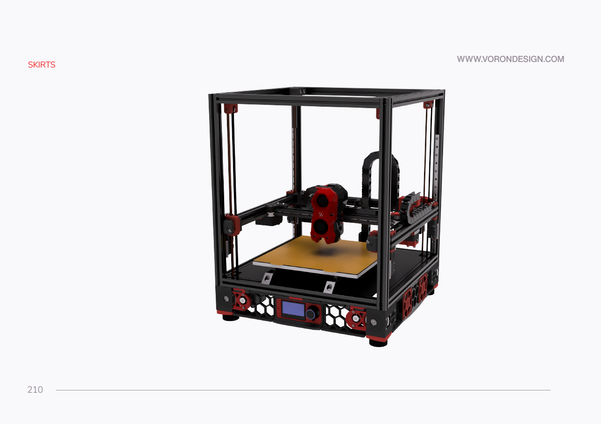

**Parts:** all twelve ring segments — `front_skirt_a_350`, BTT `mount`, `front_skirt_b_350`, `rear_center_skirt_350`, `power_inlet_IECGS_1mm`, `keystone_panel`, `side_skirt_a_350` ×2, `side_skirt_b_350` ×2, `side_fan_support` ×2.

**Do:** Lay every segment face-down on the flat reference and press each corner in turn — none should rock. Then lay the ring out on the bench in its finished order: front = `front_skirt_a` + TFT mount + `front_skirt_b`; rear = `rear_center_skirt` + `power_inlet` + `keystone_panel`; each side = `side_skirt_a` + `side_fan_support` + `side_skirt_b`. Every segment shares the same 67 × 20 mm cross-section, so a mis-ordered ring still bolts together and looks wrong.

**Check:** Twelve segments, no rock on any of them, the ring closes with the front and rear runs the same length as each other and the two sides the same as each other. The `power_inlet_IECGS_1mm` segment already carries the AC inlet from Ch 10 — do not remove it.

Tip: the built-in supports in the skirt front covers snap out; don't cut them. [src](https://docs.ldomotors.com/en/voron/voron2/printed_part_guide_rev_d)

---

### Step 11.2 — Heat-set the skirt segments

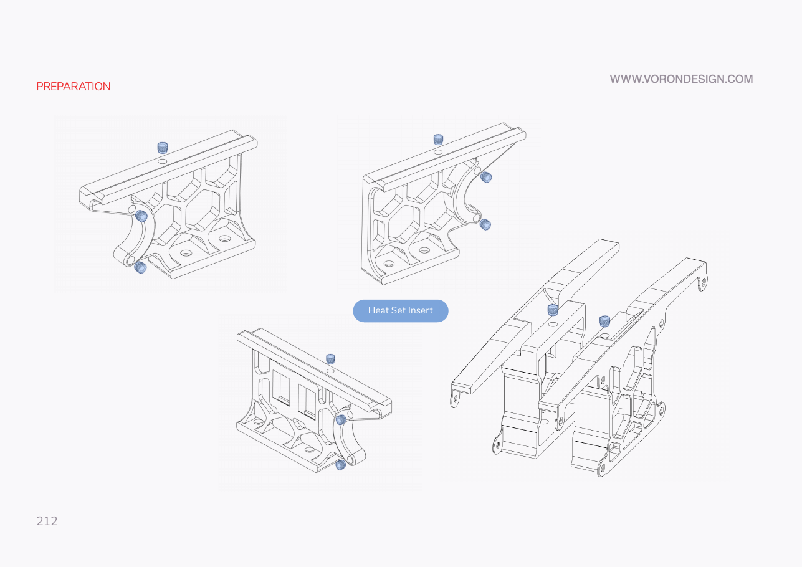

**Parts:** M3×5×4 brass heat-set inserts — the page shows 2–3 per segment *(verify on bench)*.

**Do:** Press an insert into every blind boss the page highlights: the single boss on the top rail and the pair inside each curved cut-out. Work at the same tip temperature you used for the 153 inserts in the earlier batches, with the part flat on the bench and the tongue set flush to the insert height. Keep the insert square — a cocked insert in a skirt shows through the outside face.

**Check:** Every insert flush with or just below the surface, none proud, no melted bulge visible from the show face. An M3×8 SHCS turns in freely by hand.

---

### Step 11.3 — Heat-set the fan grill retainers and identify the bay fans

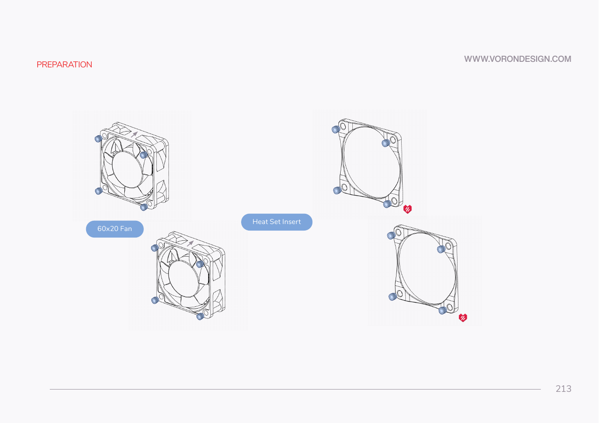

**Parts:** `[a]_fan_grill_retainer` ×2, M3×5×4 heat-set inserts ×8 (4 per retainer), 60×60×20 mm 24 V fan ×2.

**Do:** Press four inserts into the corner bosses of each retainer. Then find the two 60×20 fans and read the airflow arrow moulded into each hub — you will orient both the same way at 11.11.

**Check:** Eight inserts flush; a fan sits flat on a retainer with all four holes lining up on the inserts.

⚠ **Rev D+ / LDO:** the kit ships exactly **two** 60×60×20 mm 24 V fans and **one** 3×2 XH splicer PCB, which joins them into a single "PCB FAN" run. Do not expect four. [src](https://docs.ldomotors.com/en/voron/voron2/350_BOM/Rev_D) · [src](https://docs.ldomotors.com/en/voron/voron2/wiring_guide_rev_d)

---

### Step 11.4 — Do not build the mini12864 module

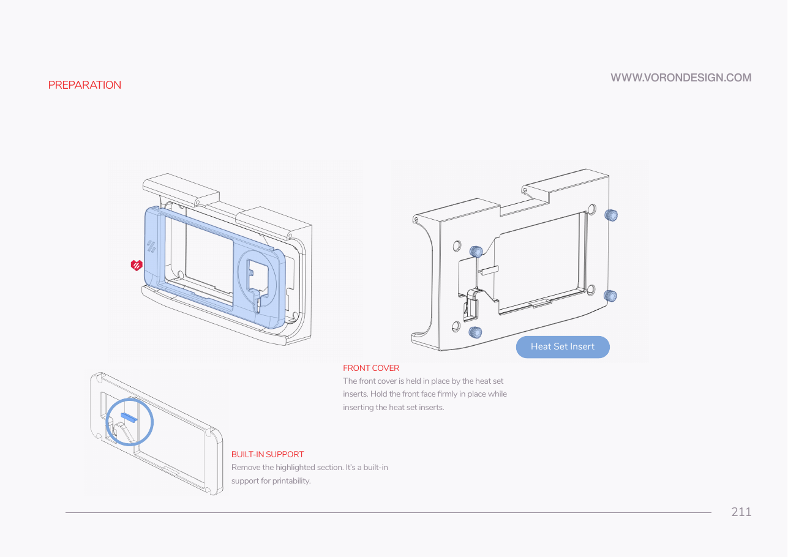
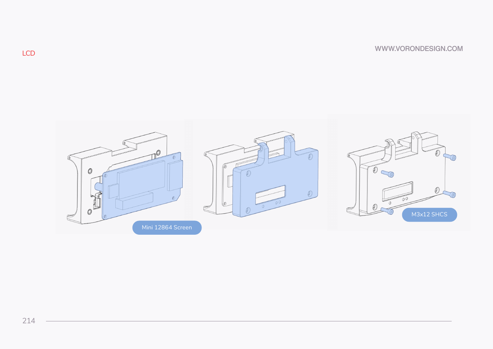
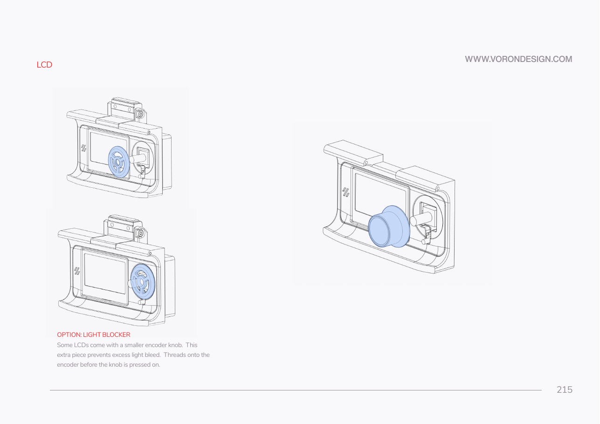
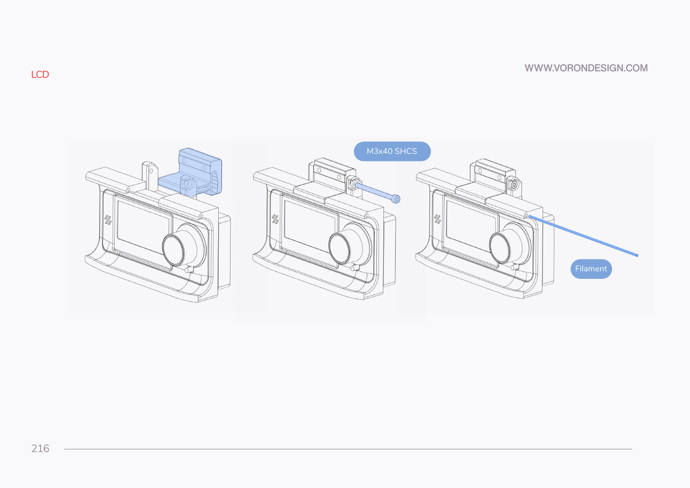

**Parts:** none. The M3×12 SHCS, M3×40 SHCS and the length of filament these pages call for stay in the bag.

**Do:** Skip all four pages. p.211 (front cover heat-sets and built-in support), p.214 (mini12864 screen into the case rear, M3×12 SHCS), p.215 (encoder light blocker) and p.216 (M3×40 SHCS hinge pin plus a filament offcut as the second pin) describe a display module this kit does not have. Confirm you never printed `mini12864_case_front`, `mini12864_case_rear`, `[a]_mini12864_case_hinge`, `[a]_mini12864_case_front_insert` or `[a]_btt_knob_light_shield`.

**Check:** No mini12864 parts in your bins. The front-centre ring position is filled by the BTT mount from B8.

⚠ **Rev D+ / LDO:** *"For Rev C/D please use The BigTreeTech touchscreen, print the mount from here."* The mount STL is in the **LDOVoronTrident** repo — it is not in the Voron-2 tree. [src](https://docs.ldomotors.com/voron/voron2/build-faq) · [mount](https://github.com/MotorDynamicsLab/LDOVoronTrident/tree/master/STLs/BTT%20Pi%20TFT4.3%20Mount)

---

### Step 11.5 — Heat-set and face the BTT TFT4.3 mount

(no image — see [mount README](https://github.com/MotorDynamicsLab/LDOVoronTrident/tree/master/STLs/BTT%20Pi%20TFT4.3%20Mount))

**Parts:** `mount.stl` ×1 (black), `[a]_faceplate.stl` ×1 (orange), M3×5×4 heat-set inserts ×2, M3×8 SHCS ×2.

**Do:** Press one heat-set insert into each of the two faceplate bosses in the mount. Offer the orange faceplate up to the mount and drive an M3×8 SHCS into each side. Snug only — you will loosen these again to seat the screen.

**Check:** Faceplate sits flush all round with no gap at the top edge; the screen aperture is square to the mount's top rail.

⚠ **Rev D+ / LDO:** you printed `mount.stl` (30 g, 44.8 mm tall), not `mount_thick.stl` (74 g, 67.8 mm). `mount_thick` exists only to give a pointy tool access to the screen's brightness buttons. If you find you want that access, reprint — LDO links the folder, not a file. [src](https://github.com/MotorDynamicsLab/LDOVoronTrident/tree/master/STLs/BTT%20Pi%20TFT4.3%20Mount) · print plan §6

---

### Step 11.6 — Fit the BTT Pi TFT4.3 screen into the mount

(no image — see [LDO touchscreen guide](https://docs.ldomotors.com/en/guides/btt_43_rotate_guide))

**Parts:** 4.3" capacitive DSI display ×1, M2.5×6 screws ×4 (supplied in the BTT packaging).

**Do:** Peel the screen's protective film only from the *back*; leave the front film on until the build is finished. Seat the screen in the mount with the FFC connector at the bottom edge and its blue pull-tab facing the rear of the printer, and fasten the four M2.5×6 screws finger-tight plus a nudge — they thread into plastic. Route the FFC out through the mount's cable slot before you tighten anything.

**Check:** Screen sits square in the faceplate aperture with an even bezel gap; the FFC exits cleanly with no kink or fold at the connector.

---

### Step 11.7 — Fit the touchscreen module into the front skirt run

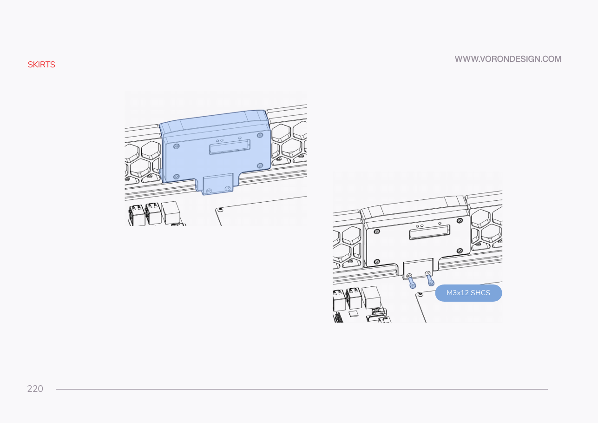

**Parts:** the TFT module from 11.6, M3×8 SHCS ×3, M3 roll-in T-nut ×3.

**Do:** The BTT module occupies exactly the ring position the manual gives the mini12864 on p.220 — centre-front, between `front_skirt_a_350` and `front_skirt_b_350`. Roll three M3 T-nuts into the front extrusion slot, slide the module into place between the two front skirts so the top rails line up flush, and drive three M3×8 SHCS into the T-nuts. Leave them snug so you can slide the module for final alignment once both front skirts are on.

**Check:** The module's top rail is flush and continuous with both front skirt rails; the screen is level; the gaps to `front_skirt_a` and `front_skirt_b` are equal.

⚠ **Rev D+ / LDO:** the manual's p.220 fastener is M3×12 SHCS into the mini12864 case. The BTT mount uses **M3×8 SHCS into M3 roll-in nuts** — 5 M3×8 and 3 roll-in nuts across steps 11.5 and 11.7. [src](https://github.com/MotorDynamicsLab/LDOVoronTrident/tree/master/STLs/BTT%20Pi%20TFT4.3%20Mount)

---

### Step 11.8 — Route and connect the FFC ribbon to the Pi

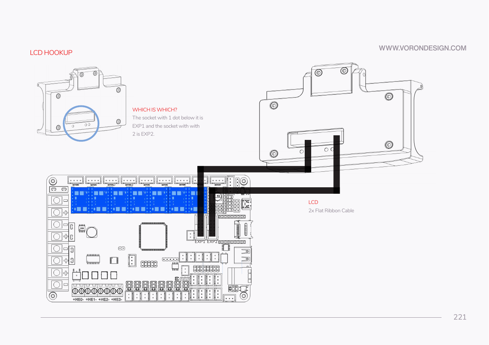

**Parts:** FFC ribbon cable ×1 (supplied).

**Do:** The manual's p.221 wires two flat ribbon cables to EXP1/EXP2 on the controller — ignore it entirely. Instead run the single FFC from the screen down through the deck opening to the Raspberry Pi's DSI connector; the FFC carries **both data and power**, so there is no second cable. **Orientation is not reversible and getting it wrong can destroy the Pi or the screen.** On the **BTT Pi TFT43** the FFC's metal contacts face **up**, blue tab to the back. On the **Raspberry Pi 4B** the metal contacts face **forward**, blue tab to the back. Lift the connector's latch, slide the ribbon fully home, and close the latch. Leave a gentle service loop — no tight radius at either end.

**Check:** Both latches closed with the ribbon square and fully seated; no exposed contacts outside either connector; the ribbon is not pinched by the skirt or trapped against an extrusion edge.

⚠ **Rev D+ / LDO:** this is the wiring guide's *"Connecting the FFC Cable, Ethernet Cable, USB Cable and Frame PE"* step. If you left it for later in Ch 10 because the screen was not mounted yet, this is where it gets done. Screen rotation (`display_lcd_rotate=2` plus the `rpi-ft5406` overlay) is a **Ch 12** software step, not a wiring one. [src](https://docs.ldomotors.com/en/voron/voron2/wiring_guide_rev_d) · [src](https://docs.ldomotors.com/en/guides/btt_43_rotate_guide)

---

### Step 11.9 — Fit the belt guards to the skirt segments

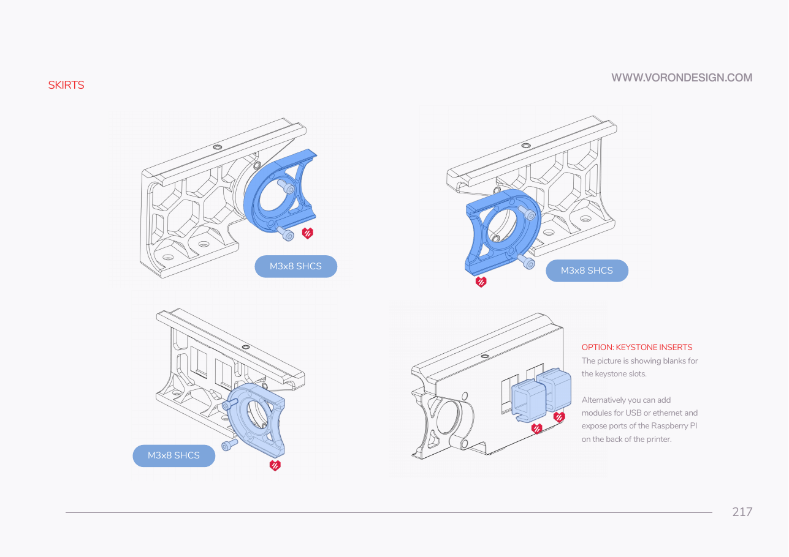

**Parts:** `[a]_belt_guard_a` ×2, `[a]_belt_guard_b` ×2 (orange), M3×8 SHCS *(verify on bench)*.

**Do:** Each belt guard is the orange ring that closes the circular cut-out in a skirt segment over an idler. Offer guard `a` up to its skirt from the outside so the raised boss drops into the cut-out, and drive the M3×8 SHCS through the guard into the heat-set inserts you fitted at 11.2. The `a` and `b` guards are mirrored: dry-fit before you drive anything, and check the guard's aperture is concentric with the pulley it will sit over.

**Check:** All four guards fitted, none proud of the skirt's outer face, each aperture concentric with its cut-out. The orange reads as a deliberate ring, not as a part that got forced.

---

### Step 11.10 — Populate the keystone panel

**Parts:** `keystone_panel` ×1, Keystone CAT6 insert ×1 (supplied), `[a]_keystone_blank_insert` ×1 (orange; the second is a spare).

**Do:** The panel has **two** keystone slots and the kit supplies **one** CAT6 keystone. Snap the CAT6 keystone into whichever slot suits your cable run to the Pi's Ethernet port, and snap the orange blank into the other. Both clip in from the inside face and latch — no fasteners.

**Check:** Both slots filled, both inserts flush with the outside face, neither rattling. The RJ45 opening faces out.

Tip: if you want more of the LDO logo on the machine, `ldo_bestagon_insert` snaps into any of the skirt hexagons — print extras. [src](https://github.com/MotorDynamicsLab/LDOVoron2/tree/main/STLs)

---

### Step 11.11 — Build the electronics-bay fan modules

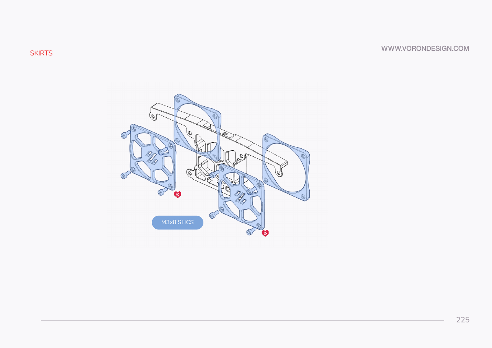
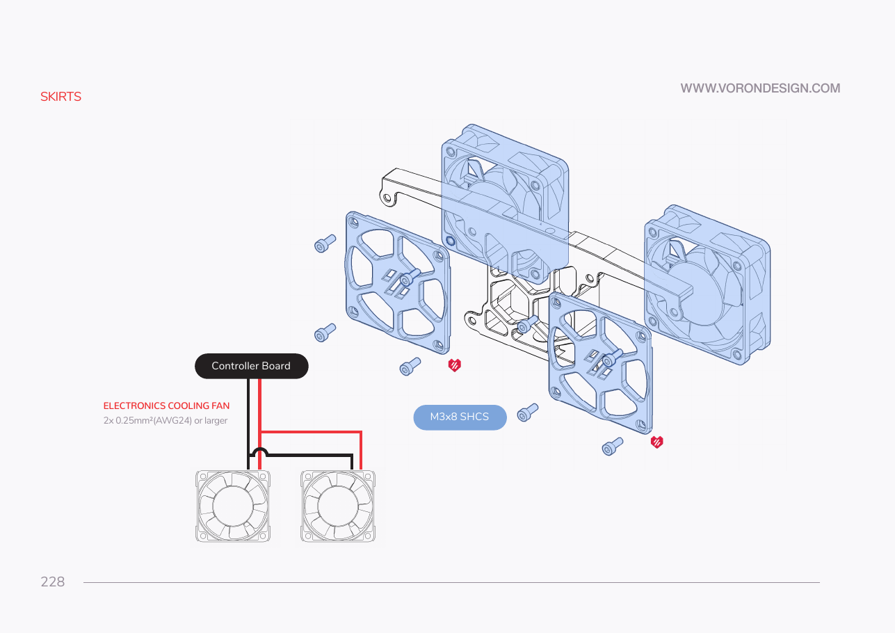

**Parts:** 60×60×20 mm 24 V fan ×2, `side_fan_support` ×2, `[a]_fan_grill_a` / `[a]_fan_grill_b` (orange), `[a]_fan_grill_retainer` ×2 (from 11.3), M3×8 SHCS ×4 per fan (8 total).

**Do:** Build the sandwich: orange grill on the **outside** face, then the fan, then the `side_fan_support` segment, then the retainer on the inside. Drive four M3×8 SHCS from the outside, through grill and fan, into the retainer's heat-set inserts. Set both fans to the **same** airflow direction — the arrow on the hub against the exploded view on p.225 — so the pair either both pressurise the bay or both extract, never fight each other. Leave the fan leads long enough to reach the 3×2 splicer PCB, and do not cut them yet.

**Check:** Each fan spins freely with no blade rubbing on a grill; the screws are snug but the fan body is not crushed; both airflow arrows point the same way; two fan positions populated in total.

⚠ **Rev D+ / LDO:** the kit contains **two** 60×20 fans and **one** 3×2 splicer PCB, so exactly two fan positions get fans. The manual illustrates the side-skirt and fan work twice (p.226–228 and p.229–231, from outside and from inside the bay) — count the fans you have, not the illustrations. *(verify on bench — the manual gives no fan-per-side count; settle it with the ring dry-fit from 11.1.)* [src](https://docs.ldomotors.com/en/voron/voron2/350_BOM/Rev_D)

Tip: `[a]_fan_grill_open_optional_x2` is an alternate grill with more open area and less filtering, if the bay runs warm. [src](https://github.com/VoronDesign/Voron-2/tree/Voron2.4/STLs/Skirts)

---

### Step 11.12 — Pre-load the skirt T-nuts

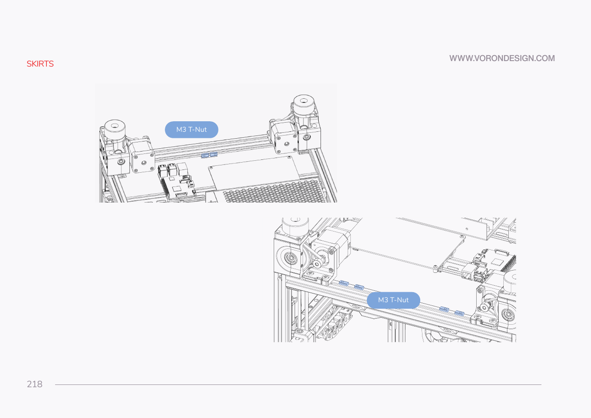
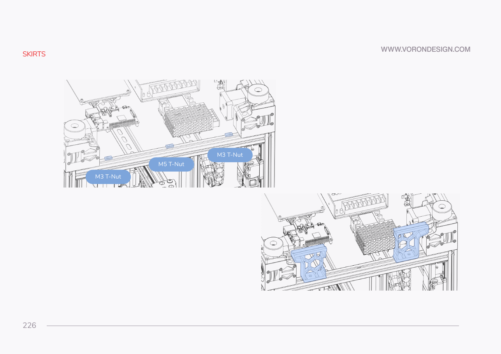
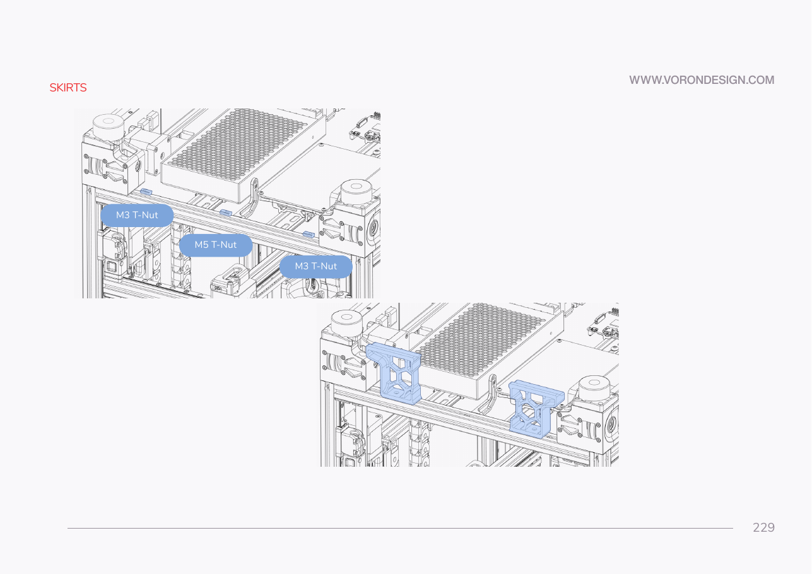

**Parts:** M3 roll-in T-nuts and M5 roll-in T-nuts *(verify on bench — count them off p.218, p.226 and p.229)*.

**Do:** Roll every T-nut the skirt ring needs into the frame extrusions **before** you offer any segment up. Work around the perimeter: M3 T-nuts at each skirt-to-frame screw position and M5 T-nuts where p.226/p.229 show the larger M5×10 BHCS. Slide each one roughly to position and leave it loose. LDO warns that extrusion and roll-in T-nut tolerances on these kits are tight — test-fit or pre-load rather than fighting a nut with a skirt in the way.

**Check:** Every T-nut sits flat in its slot and slides with light finger pressure. None jammed, none dropped inside a closed extrusion end.

⚠ **Rev D+ / LDO:** *"Due to the tight tolerances of the extrusions and roll-in t-nuts it is advisable to either test fit before assembly to identify the sides of the extrusions that fits the best or to pre-load the t-nuts into the extrusions."* [src](https://docs.ldomotors.com/voron/voron2/build-faq)

---

### Step 11.13 — Mount the front skirt segments

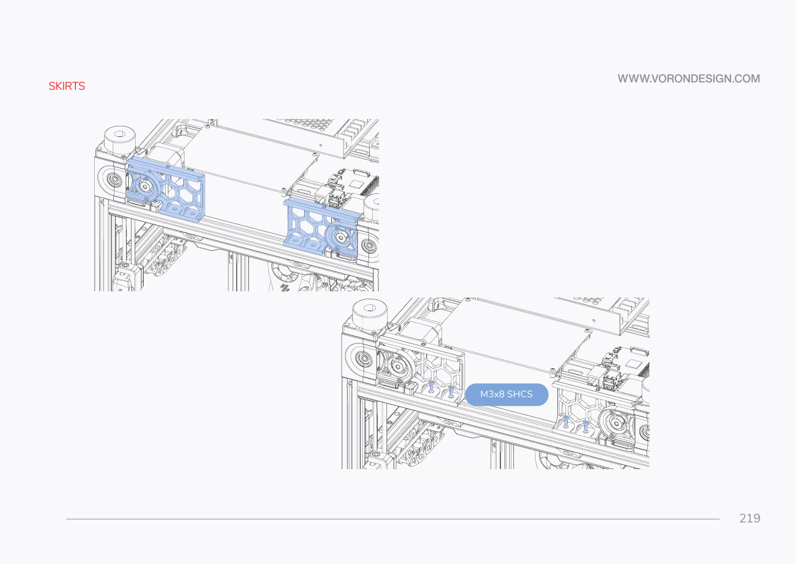

**Parts:** `front_skirt_a_350` ×1, `front_skirt_b_350` ×1, M3×8 SHCS *(verify on bench)*.

**Do:** Hang each front skirt on its pre-loaded T-nuts with the belt-guard aperture over the front idler, then drive the M3×8 SHCS up from underneath. Bring both up snug, then loosen them a quarter turn, push both skirts hard against the TFT module to close the joints, and tighten.

**Check:** Front run reads as one continuous band: skirt–module–skirt with equal, tight joints and a flush top rail. No daylight at the front idler apertures.

---

### Step 11.14 — Mount the rear skirt run

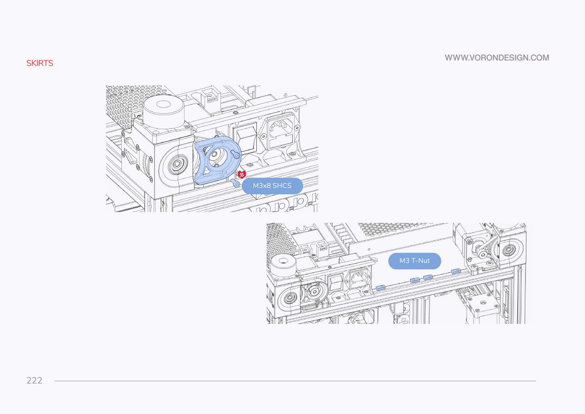
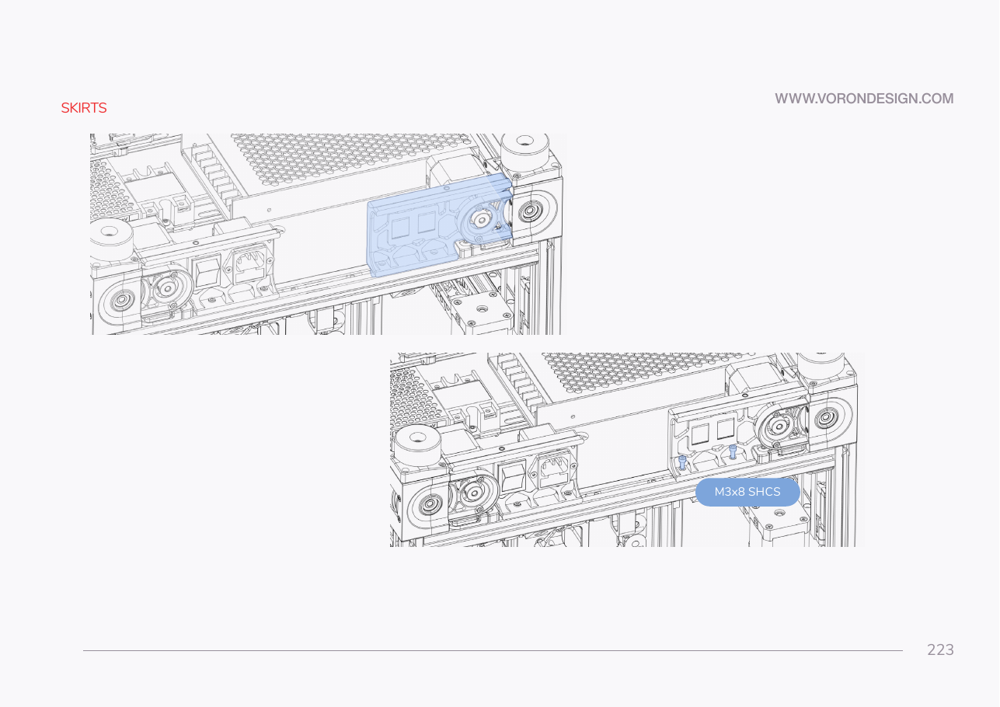
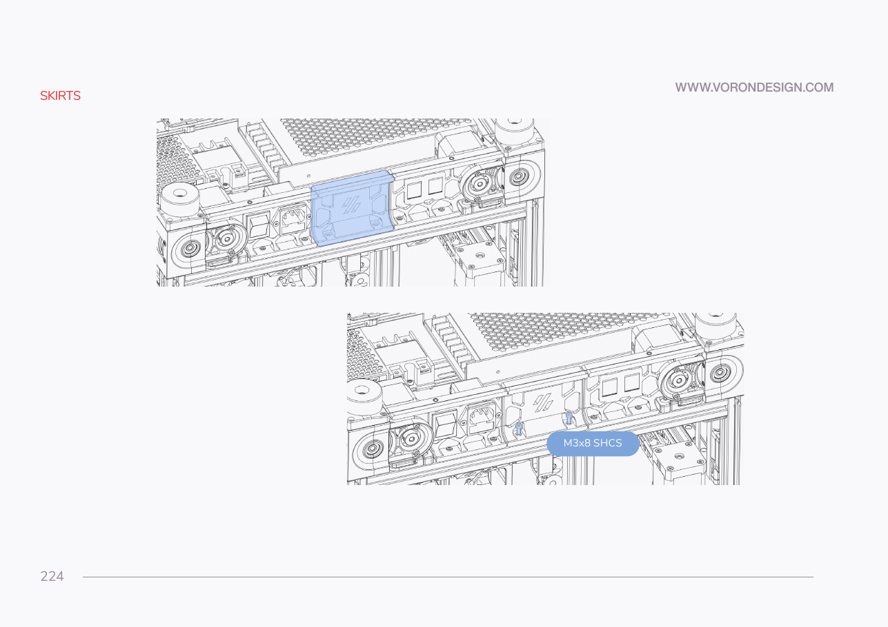

**Parts:** `rear_center_skirt_350` ×1, `keystone_panel` ×1 (from 11.10), the already-fitted `power_inlet_IECGS_1mm` segment, M3×8 SHCS and M3 T-nuts *(verify on bench)*.

**Do:** Work outward from the `power_inlet` segment, which is already on the frame with the AC inlet and switch wired from Ch 10. Fit the belt guard segment shown on p.222, then `keystone_panel` (p.223), then `rear_center_skirt_350` (p.224). Feed the Ethernet run through the CAT6 keystone before you close the last joint. Snug everything, close the joints, then tighten.

**Check:** Rear run continuous and flush; the AC switch is reachable and moves freely; the RJ45 keystone is square in its slot; nothing is pinching the Ethernet or AC leads behind the ring.

⚠ **Rev D+ / LDO:** the inlet segment is `power_inlet_IECGS_1mm` — the 1.0 mm AC inlet with the integrated switch. The 1.2 mm variants and `power_inlet_filtered` are wrong for this kit. [src](https://docs.ldomotors.com/voron/voron2/build-faq)

---

### Step 11.15 — Mount the first side skirt run

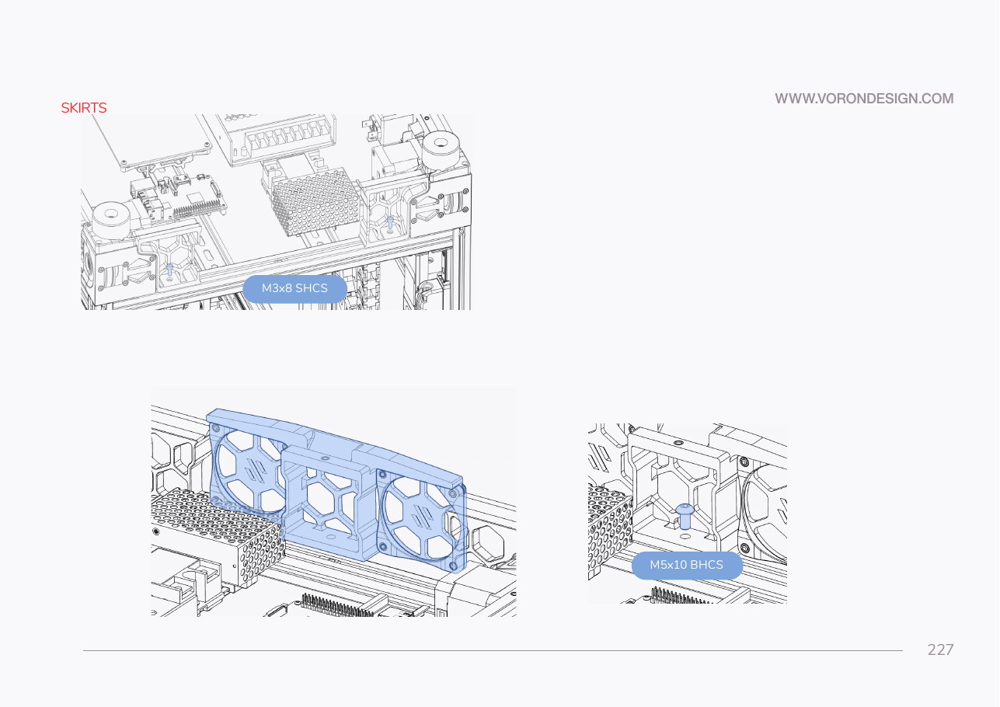

**Parts:** `side_skirt_a_350` ×1, `side_skirt_b_350` ×1, one fan module from 11.11, M3×8 SHCS, M5×10 BHCS ×1 *(verify on bench)*.

**Do:** Fit `side_skirt_a` at the front end of the side and `side_skirt_b` at the rear, leaving the fan-module gap between them. Drive the M3×8 SHCS into the pre-loaded M3 T-nuts (p.227, top) and the M5×10 BHCS into the M5 T-nut. Keep everything snug, not tight — the fan module has to drop into the remaining gap next.

**Check:** Both side segments hang parallel to the extrusion with the top rails level with the front and rear runs; the gap left for the fan module matches the module's width.

---

### Step 11.16 — Drop in the fan module and close the side run

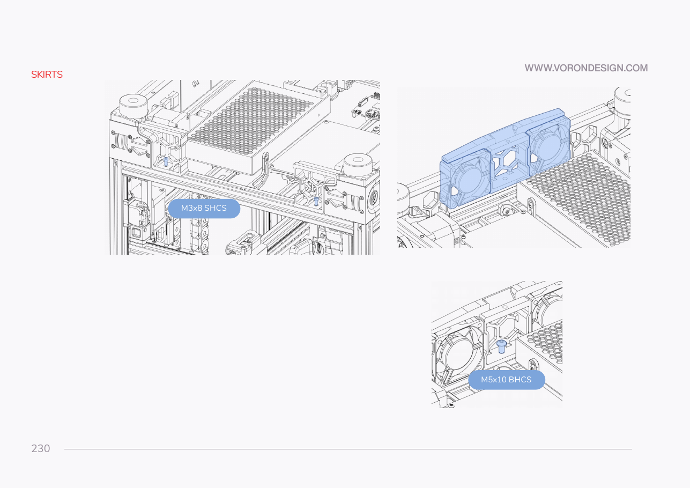

**Parts:** fan module from 11.11, M5×10 BHCS ×1 *(verify on bench)*.

**Do:** Slide the module into the gap from outside so its top rail lands on the extrusion and the grills face out. Push the two side skirts against it to close both joints, then drive the M5×10 BHCS up into the M5 T-nut from underneath (p.230, lower right). Now go back and tighten every screw on this side run.

**Check:** The whole side reads as one band with flush joints; the fans spin freely with the module clamped; no lead trapped between the module and the extrusion.

---

### Step 11.17 — Mount the second side skirt run

**Parts:** `side_skirt_a_350` ×1, `side_skirt_b_350` ×1, the second `side_fan_support` and its fan/grill/retainer set, M3×8 SHCS, M5×10 BHCS ×1 *(verify on bench)*.

**Do:** Repeat 11.15 and 11.16 on the opposite side. The manual shows this run from the other side of the bay (p.229 for the T-nuts, p.230 for the fasteners); the operation is identical.

**Check:** The ring is closed all the way round: front, both sides, rear. Every joint tight, every top rail flush, the machine reads as one continuous band from any angle.

---

### Step 11.18 — Verify the bay-fan wiring

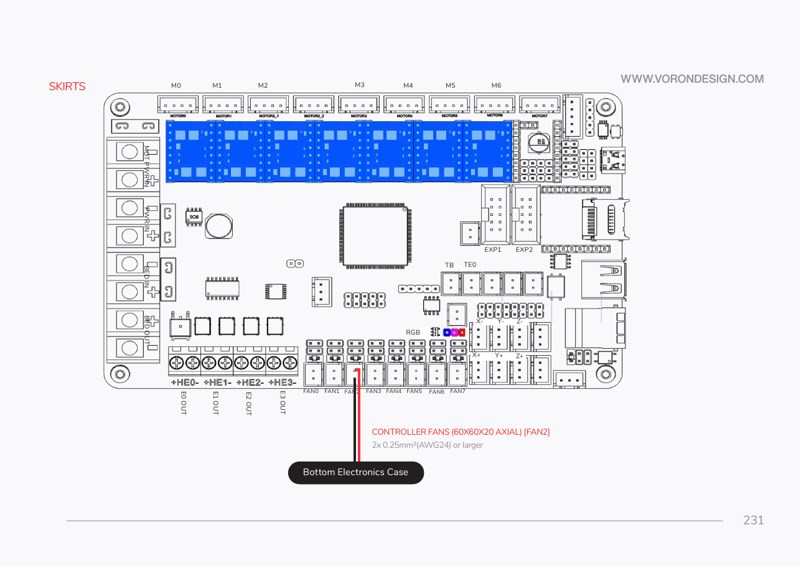

**Parts:** 3×2 XH splicer PCB ×1, its printed spacer (supplied printed by LDO).

**Do:** Do not follow p.228's wire-and-solder sketch or p.231's controller diagram — both describe an Octopus-class board this kit does not have. Confirm the Ch 10 wiring instead: the two 60×20 fans are joined at the 3×2 XH splicer PCB, the splicer PCB is mounted on its **printed spacer** so it cannot short against the extrusion, and the resulting run is labelled **PCB FAN** and lands on the Leviathan at **FAN2 / PF7**. Dress the leads into the duct and zip-tie them clear of the fan blades.

**Check:** Both fans on one splicer; splicer on its spacer, not touching aluminium; PCB FAN plugged into FAN2/PF7; no lead within reach of a blade.

⚠ **Rev D+ / LDO:** fan map for this build — PCB fan → `FAN2/PF7`; LED strip → `LED-Strip/PE6`; filter fan → `FAN3/PF9`. *"Please remember to mount 3x2 splicing PCBs using the printed part to prevent a short with the extrusion."* [src](https://docs.ldomotors.com/en/voron/voron2/wiring_guide_rev_d)

---

### Step 11.19 — Fit the bestagon insert (optional)

(no image — see [LDO STLs README](https://github.com/MotorDynamicsLab/LDOVoron2/tree/main/STLs))

**Parts:** `ldo_bestagon_insert` ×1 (orange), or as many as you printed.

**Do:** Push the insert into one of the skirt hexagons from the outside until it snaps. Pick a hexagon on the front-left or front-right skirt where it reads without competing with the touchscreen.

**Check:** Insert flush and retained; the hexagon is not stressed white at the corners.

---

### Step 11.20 — VHB the bottom-panel clips and hinges

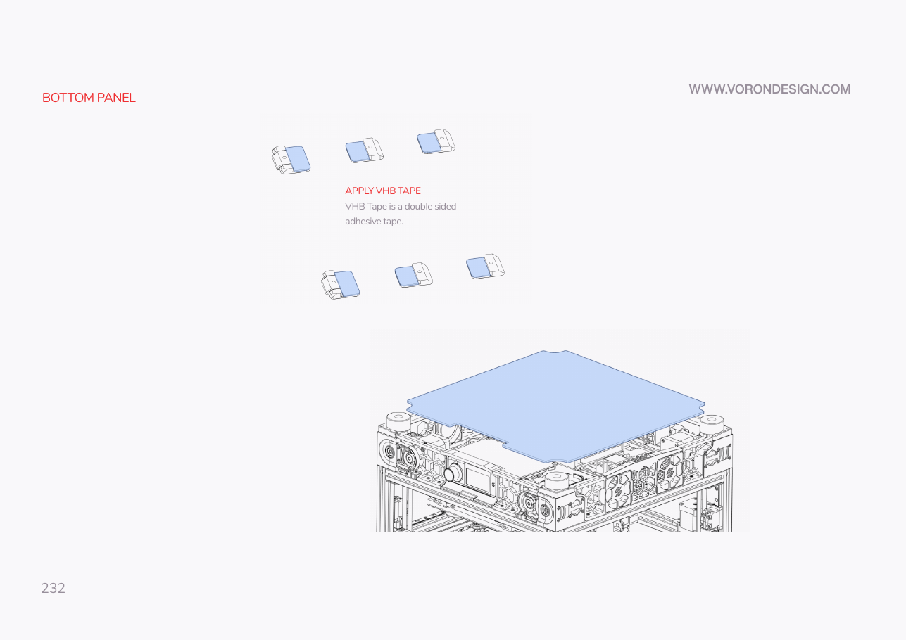

**Parts:** `bottom_panel_clip_x4` ×4, `bottom_panel_hinge_x2` ×2, 3M VHB tape ×6 pads.

**Do:** Wipe the pad face of all six printed parts with IPA and let it flash off. Cut six VHB pads to match the flat pad on each part, press one onto each, and leave the release liner on. VHB reaches most of its strength in the first hour and is effectively permanent — get the pad centred on the pad face the first time.

**Check:** Six parts, six pads, each centred with no overhang onto a curved face, liners still on.

---

### Step 11.21 — Fit the bottom panel

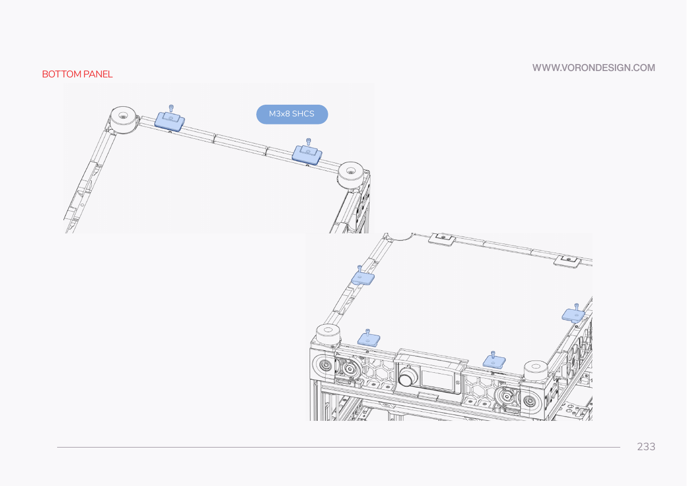

**Parts:** bottom panel (acrylic, black, 469×469×**4 mm**) ×1, the six taped parts from 11.20, M3×8 SHCS ×6.

**Do:** Screw all six parts to the bottom frame extrusions in the positions p.233 shows — four clips and two hinges — with one M3×8 SHCS each. Peel the protective film off both faces of the bottom panel. Pull the release liners, offer the panel up square, and press it home onto the VHB pads with firm even pressure across each pad.

**Check:** Panel square to the frame with equal margins; no rock; every pad bonded with no visible gap; the bay is now closed from below. Nothing you still need to reach is on the wrong side of it.

⚠ **Rev D+ / LDO:** the bottom panel is the **4 mm** acrylic, not the 3 mm deck panel. If you are holding a 469×469 panel and cannot tell which is which, caliper it — 3 mm is the deck (fitted back in Ch 02), 4 mm is this one. [src](https://docs.ldomotors.com/en/voron/voron2/350_BOM/Rev_D)

---

### Step 11.22 — Choose the Z belt cover variant

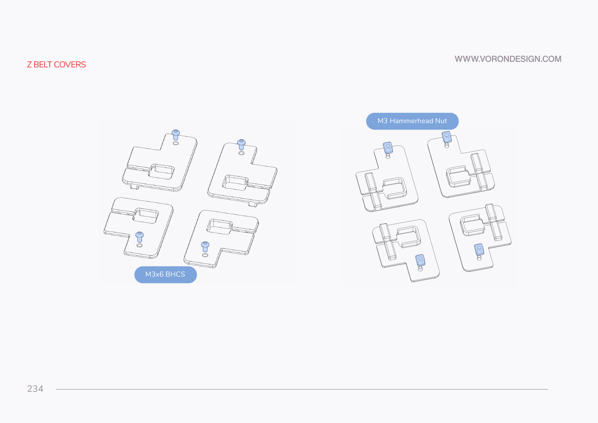

**Parts:** `z_belt_cover_a_x2` ×2 and `z_belt_cover_b_x2` ×2 — **or** LDO's `z_belt_cover_a_led` in place of `z_belt_cover_a`.

**Do:** Look at how you routed the chamber LED wiring in Ch 10. If any LED wire passes through a **Z-motor opening**, that corner needs LDO's `z_belt_cover_a_led`, which leaves a slot for the cable; the stock cover will pinch it. If your LED runs went another way, use the stock covers. Print the LED variant now if you need it — it is a 7 g, 25-minute part.

**Check:** You can state, per corner, which cover goes on and why. No cable crosses a stock cover's sealing face.

⚠ **Rev D+ / LDO:** *"PAGE 234 Use the alternate Z-belt cover if you routed the LED wires through the Z-motor opening."* [src](https://docs.ldomotors.com/voron/voron2/build-faq) · [part](https://github.com/MotorDynamicsLab/LDOVoron2/blob/main/STLs/z_belt_cover_a_led.stl)

---

### Step 11.23 — Load each cover with a hammerhead nut

**Parts:** Z belt covers ×4, M3 hammerhead T-nut ×4, M3×6 BHCS ×4.

**Do:** Drop an M3 hammerhead nut into the recess on the back of each cover and start an M3×6 BHCS into it from the front — two or three turns only, so the nut is captive but still free to rotate. All four covers get the same treatment.

**Check:** Nut captive, screw started, nut still able to turn. The screw head sits proud enough that you can still reach it with a 2 mm hex once the cover is on.

---

### Step 11.24 — Fit the first Z belt cover

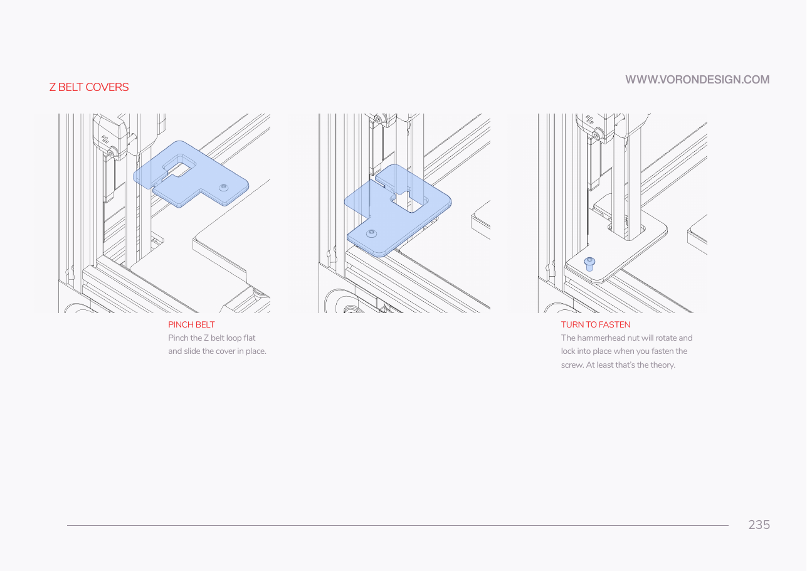

**Parts:** one loaded cover from 11.23.

**Do:** Pinch the Z belt loop flat between finger and thumb and slide the cover in so the belt passes through the cover's slot and the hammerhead nut enters the extrusion channel. Hold the cover square against the extrusion and tighten the M3×6 BHCS — the hammerhead rotates a quarter turn and locks. If it spins instead of locking, back the screw off, re-seat the nut squarely in the channel and try again; do not force it.

**Check:** Cover flat against the extrusion, not cocked; the Z belt runs through it freely with no rub; the cover does not move when you push it.

---

### Step 11.25 — Fit the remaining three Z belt covers

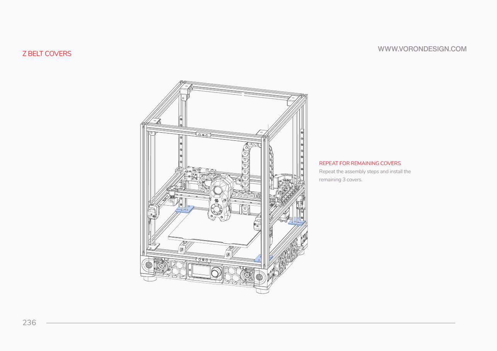

**Parts:** the three remaining loaded covers.

**Do:** Repeat 11.24 at the other three Z belt corners. Then run the gantry up and down its full travel by hand and watch each cover — a cover that touches the belt makes noise and eventually cuts the belt edge.

**Check:** Four covers on, all four belts running clear, no rubbing anywhere in the full Z travel. (p.237 is a page of Voron history — nothing to build.)

---

### Step 11.26 — Break out the Nevermore printed supports

(no image — see [LDO Nevermore V5 Duo guide](https://ldomotion.com/guides/nevermore-v5-duo---v24))

**Parts:** `V2_Duo_Plenum`, `V2_Duo_Plenum_LID`, `Regular_Cartridge`, `Regular_Cartridge_Lid`.

**Do:** The cartridge and the plenum each carry a built-in printed support. Push them out — they are designed to break at the interface. Do not cut them out with a knife.

**Check:** Both supports removed cleanly, no torn layers on the sealing faces, the cartridge lid slides freely in the cartridge grooves.

⚠ **Rev D+ / LDO:** you are building the **Regular** cartridge, not the XL — the XL wants a larger carbon charge and a faster, louder fan. [src](https://github.com/nevermore3d/Nevermore_Micro)

---

### Step 11.27 — Modify both 5015 fan enclosures

(no image — see [LDO Nevermore guide § Preparation](https://ldomotion.com/guides/nevermore-v5-duo---v24))

**Parts:** 5015 fan ×2 (supplied in the kit's Nevermore bag).

**Do:** Pry the tabs that hold each fan's enclosure together and separate it. With wire snips, carefully remove the section of plastic the guide highlights from each fan housing. Repeat for both fans. **Be very careful if you reach for a box cutter or blade here** — snips are the safer tool and the guide says so explicitly.

**Check:** Both fans modified identically, impellers still spin freely, no cracked housing, no swarf left inside the scroll.

---

### Step 11.28 — Heat-set the Nevermore parts

(no image — see [LDO Nevermore guide § Preparation](https://ldomotion.com/guides/nevermore-v5-duo---v24))

**Parts:** M3×5×4 heat-set inserts ×6.

**Do:** Four inserts go into the **fan mounting holes**, one into the **plenum**, one into the **cartridge**. Six total.

**Check:** All six flush and square; an M3 screw starts freely in each.

---

### Step 11.29 — Cut the connector off the long-wire fan

(no image — see [LDO Nevermore guide § Preparation](https://ldomotion.com/guides/nevermore-v5-duo---v24))

**Parts:** the 5015 fan with the longer lead.

**Do:** Cut the JST connector off the longer-leaded fan. **Keep the connector pigtail** — it gets soldered back onto the bridge PCB at 11.33 and is the only thing that will mate with the kit's "FILTER FAN" extension.

**Check:** Connector cut free and set aside somewhere you will not lose it; both fan leads still long enough to route through the plenum.

---

### Step 11.30 — Fit the first fan into the plenum

(no image — see [LDO Nevermore guide § Install Fans](https://ldomotion.com/guides/nevermore-v5-duo---v24))

**Parts:** the cut-lead fan from 11.29, plenum.

**Do:** Route the fan's wires from the **right** side of the plenum, right to left along the wire channel, using tweezers. Then seat the fan into the **right** side of the plenum and pull the wire through so it lies flat in the channel.

**Check:** Fan seated fully with the impeller clear of the plenum wall; wire flat in the channel, not crossing the fan aperture.

---

### Step 11.31 — Fit the second fan and trim the leads

(no image — see [LDO Nevermore guide § Install Fans](https://ldomotion.com/guides/nevermore-v5-duo---v24))

**Parts:** the second 5015 fan.

**Do:** Route its wires from the **left** side of the plenum, right to left, and seat the fan in the left side. Now cut both fans' wires to equal length, roughly **30–40 mm** proud of the enclosure.

**Check:** Both fans seated, all four wire ends the same length at 30–40 mm, both impellers spin freely.

---

### Step 11.32 — Bolt the fans to the plenum

(no image — see [LDO Nevermore guide § Install Fans](https://ldomotion.com/guides/nevermore-v5-duo---v24))

**Parts:** M3×16 BHCS ×4.

**Do:** Drive the four M3×16 BHCS into the fan heat-sets from 11.28. Snug — a 5015 housing distorts and the impeller rubs if you crank them.

**Check:** Both fans held with no rock; spin each impeller by hand and listen for rub.

---

### Step 11.33 — Solder the fans to the bridge PCB

(no image — see [LDO Nevermore guide § Install Fans](https://ldomotion.com/guides/nevermore-v5-duo---v24))

**Parts:** bridge PCB ×1, the connector pigtail saved at 11.29.

**Do:** Solder both fans' wires and the pigtail to the bridge PCB — **red (positive) to the top pads, black (negative) to the bottom**. Arrange the wires as the guide's photo shows so the finished PCB tucks into its compartment. Then **check with a multimeter that there is no short between positive and negative.**

**Check:** Continuity reads open between + and −; all six joints shiny and mechanically sound; PCB sits in its compartment without pressing on a wire.

⚠ A bad solder here shorts a 24 V rail. LDO: *"A bad solder will result in permanently damaging the controller board."* Do the meter check before anything gets plugged in. [src](https://ldomotion.com/guides/nevermore-v5-duo---v24)

---

### Step 11.34 — Glue the plenum magnets

(no image — see [LDO Nevermore guide § Nevermore Assembly](https://ldomotion.com/guides/nevermore-v5-duo---v24))

**Parts:** 6×3 mm neodymium magnets, super glue.

**Do:** Drop a spot of super glue into each magnet pocket in the plenum and press a magnet in, one at a time, **all with the same pole facing out**. Press each fully home so none stands proud — a proud magnet wears against its opposite number every time the cartridge comes off.

**Check:** All plenum magnets flush, same polarity across the set (a spare magnet is attracted to every one of them the same way).

---

### Step 11.35 — Close the plenum lid

(no image — see [LDO Nevermore guide § Nevermore Assembly](https://ldomotion.com/guides/nevermore-v5-duo---v24))

**Parts:** `V2_Duo_Plenum_LID`, M3×6 BHCS ×1 (optional second M3×4 BHCS for symmetry).

**Do:** Slide the lid into the plenum body's grooves and secure with the M3×6 BHCS into the plenum heat-set. Add the optional M3×4 on the other side if you want it to look symmetric.

**Check:** Lid fully home in both grooves, screw snug, no wire pinched at the lid edge.

---

### Step 11.36 — Glue the cartridge magnets to match

(no image — see [LDO Nevermore guide § Cartridge Assembly](https://ldomotion.com/guides/nevermore-v5-duo---v24))

**Parts:** 6×3 mm neodymium magnets, super glue, a marker.

**Do:** Before gluing, stick each magnet to the assembled plenum, mark the exposed face with the marker, and keep that orientation. Then glue them into the cartridge pockets one at a time, marked face out. Get this backwards and the cartridge repels instead of latching, and you are digging glued magnets out of a printed part.

**Check:** Cartridge offers up to the plenum and snaps home; it holds against a firm shake; all magnets flush.

---

### Step 11.37 — Fill and close the cartridge

(no image — see [LDO Nevermore guide § Cartridge Assembly](https://ldomotion.com/guides/nevermore-v5-duo---v24))

**Parts:** `Regular_Cartridge_Lid`, M3×6 BHCS ×1, activated carbon pellets — **not supplied**.

**Do:** Fill the cartridge with acid-free activated carbon pellets, then slide the lid into its grooves and secure with the M3×6 BHCS into the cartridge heat-set.

**Check:** Cartridge full but not packed so tight that airflow stops; lid home; no pellets loose in the grooves.

⚠ **Media not in the kit.** LDO: *"NOT INCLUDED WITH THE KIT"*, and acid-free pellets are specified. Nevermore media is on the deferred list for this build (`CLAUDE.md`), so expect to install and wire the filter now and fill the cartridge later. Fit the **empty, closed** cartridge for now so the plenum is sealed — an open plenum just blows chamber air around. [src](https://ldomotion.com/guides/nevermore-v5-duo---v24)

---

### Step 11.38 — Mount the plenum in the chamber

(no image — see [LDO Nevermore guide § Installation for Voron V2.4](https://ldomotion.com/guides/nevermore-v5-duo---v24))

**Parts:** M3 roll-in T-nut ×2, M3×12 SHCS ×2.

**Do:** Roll one M3 T-nut into the **inside** face of each of the two bed extrusions — *not* into the top slot — and bolt the plenum on with two M3×12 SHCS. This exact position is not optional in practice: the fan leads were cut to length for it at 11.31.

**Check:** Plenum solid on the extrusions, sitting inboard and below the bed surface; nothing it can foul as the gantry descends; both screws snug.

---

### Step 11.39 — Attach the cartridge

(no image — see [LDO Nevermore guide § Installation for Voron V2.4](https://ldomotion.com/guides/nevermore-v5-duo---v24))

**Parts:** cartridge from 11.37.

**Do:** Slide the cartridge along until the magnets take, and let it pull itself home.

**Check:** Cartridge seated square on the plenum with no gap at the joint; it comes off with a deliberate pull and not with an accidental knock.

---

### Step 11.40 — Connect the filter fan

(no image — see [LDO wiring guide § Connecting the Fans and the LED Strip](https://docs.ldomotors.com/en/voron/voron2/wiring_guide_rev_d))

**Parts:** the kit's **FILTER FAN** extension wire.

**Do:** Mate the Nevermore's pigtail with the FILTER FAN extension and follow it back to the Leviathan. It lands on **FAN3 / PF9**. Confirm that header's voltage-selection jumper is set for **24 V** before anything is powered.

**Check:** Filter fan on FAN3/PF9; 24 V jumper confirmed; the lead is routed in the duct and cannot be caught by the bed or the gantry.

⚠ **Rev D+ / LDO:** the Nevermore guide was written for a **BTT Octopus** and tells you to use *"Octopus Fan3 - Pinout PD13"*. This machine has a **Leviathan**. Use **FAN3 / PF9** from the Rev D wiring guide's fan table. [src](https://docs.ldomotors.com/en/voron/voron2/wiring_guide_rev_d)

---

### Step 11.41 — Note the filter fan config for Ch 12

(no image — see [LDO Nevermore guide § Configuration printer.cfg](https://ldomotion.com/guides/nevermore-v5-duo---v24))

**Parts:** none.

**Do:** Write the pin on a tag and tape it to the plenum so Ch 12 does not have to re-derive it. The `[heater_fan exhaust_fan]` section from LDO's Nevermore guide is correct in shape — `max_power: 1.0`, `shutdown_speed: 0.0`, `kick_start_time: 5.0`, `heater: heater_bed`, `heater_temp: 60`, `fan_speed: 1.0` — but its `pin: PD13` is the Octopus pin and must become the Leviathan's **PF9**. Nothing to edit yet; the config work is Ch 12.

**Check:** Tag on the plenum reading "FILTER FAN → FAN3 / PF9". Ch 12's config checklist has the Nevermore section on it.

---

### Step 11.42 — Fit the bowden retainer

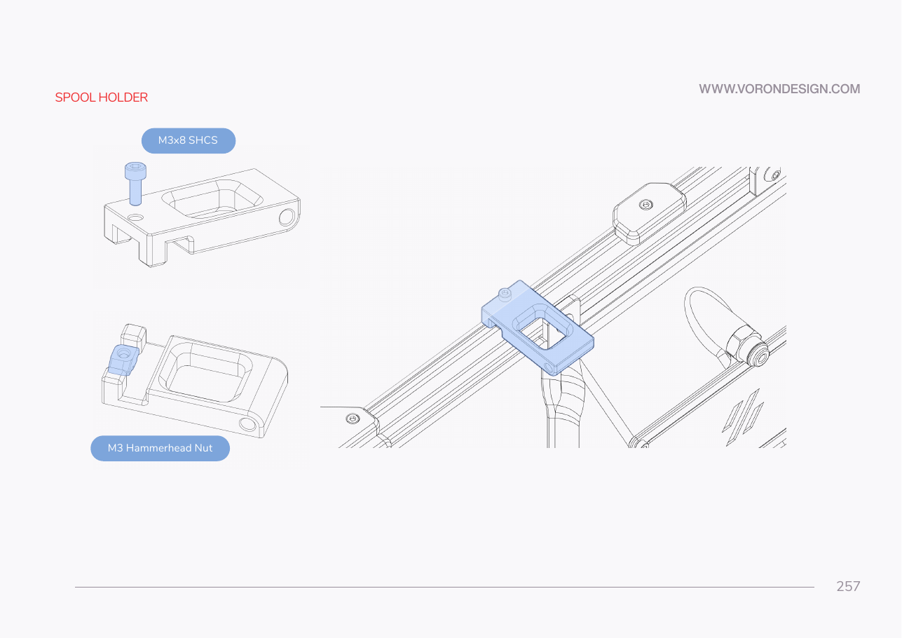
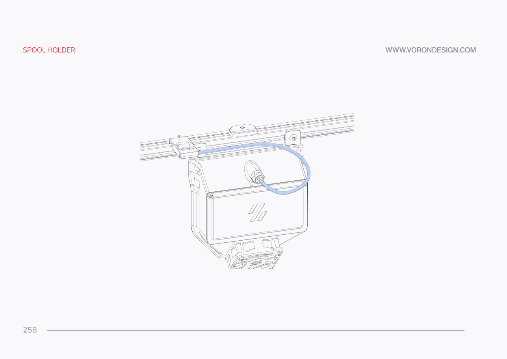

**Parts:** `bowden_retainer` ×1, M3 hammerhead T-nut ×1, M3×8 SHCS ×1.

**Do:** Drop the hammerhead nut into the retainer's recess, start the M3×8 SHCS into it, and slide the assembly onto the top rear extrusion. Position it so the PTFE tube from the spool runs a smooth curve into the toolhead umbilical with no kink at either end. Tighten to lock the hammerhead.

**Check:** Retainer solid on the extrusion; the PTFE passes through with light drag only; no sharp bend where the tube leaves the retainer.

---

### Step 11.43 — Fit the spool holder arm

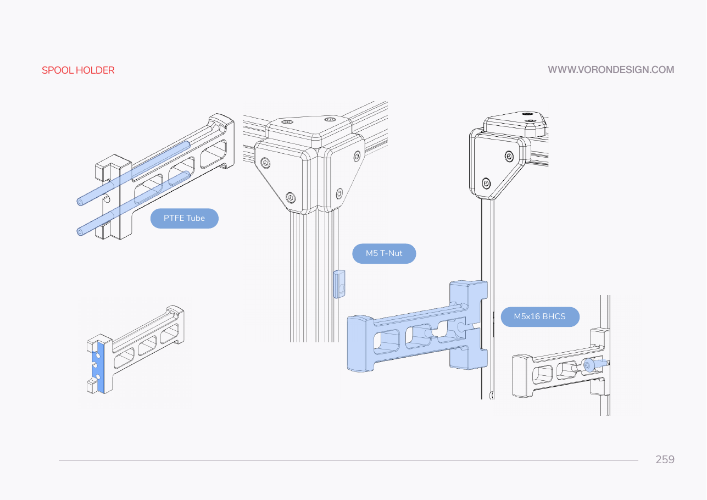

**Parts:** `spool_holder` ×1, PTFE tube offcuts ×2 (4 mm OD), M5 T-nut ×2, M5×16 BHCS ×2 *(verify on bench)*.

**Do:** Press the two short PTFE lengths into the grooves along the spool holder arm — they are the low-friction bearing surface the spool rides on. Roll the M5 T-nuts into the rear vertical extrusion at spool height, offer the arm up, and drive the M5×16 BHCS home.

**Check:** Arm level and solid enough to carry a full 1 kg spool without deflecting; both PTFE inserts seated; a spool spins on it with light finger pressure and does not bind or wobble off.

---

### Step 11.44 — Assemble the Clicky-Clack door frame

(no image — see [KB3D install guide](https://wiki.kb-3d.com/en/home/LDO/LDO_Clicky_Clacky_Door_Mod) · [mod README](https://github.com/tanaes/whopping_Voron_mods/tree/main/clickyclacky_door))

**Parts:** door frame extrusions — 2 × `HFSFB5-2020-470-TPW` (X) and 2 × `HFSFB5-2020-530-LCH-RCH` (Z) for a 350 — M5×16 BHCS ×4, the 480 × 500 × 3 mm clear acrylic door panel.

**Do:** The two **shorter** frame pieces have threaded ends. Start an M5×16 BHCS about halfway into each end. Bring the two long pieces onto the ends of **one** short piece and tighten through the long pieces' pre-drilled holes, checking the corners against a machinist square or 123 blocks as you go — a racked door frame will not seal. Assemble **three sides only**, slide the acrylic into the slot, then fit and tighten the fourth side.

**Check:** All four corners square; the acrylic fully home in the slot on all four sides with no bow; the frame does not twist when laid on a flat surface.

⚠ You are using the plain acrylic panel from Fabreeko, not the NanoNest stack the KB3D guide illustrates. Skip the KB3D guide's NanoNest taping section entirely; the panel goes straight into the frame slot. [src](https://www.fabreeko.com/products/acrylic-pannel-for-clicky-clacky-door)

---

### Step 11.45 — Fit the rubber panel retainer strip

(no image — see [mod README](https://github.com/tanaes/whopping_Voron_mods/tree/main/clickyclacky_door))

**Parts:** `HSCPF3H-B-2000` retainer strip (supplied in the LDO frame kit).

**Do:** Cut the strip to length for each side with **45° mitres** at the corners, then press it into the extrusion groove alongside the acrylic. It takes up the clearance and stops the panel rattling.

**Check:** Strip seated all the way round with the mitres closed; the acrylic no longer moves in the frame when you tap it.

---

### Step 11.46 — Build the door hinges: dowel into the solid halves

(no image — see [mod README § Assembly](https://github.com/tanaes/whopping_Voron_mods/tree/main/clickyclacky_door))

**Parts:** `Hinge-L-solid` ×2, M5×45 dowel pin ×2, small hammer.

**Do:** Tap an M5×45 dowel into each solid hinge half. It is meant to be a very tight fit. Stop when about **20 mm** protrudes — measure against the shoulder of an M3×20 screw if you want a quick gauge. Do not drive it flush.

**Check:** Both pins about 20 mm proud, both perpendicular to the hinge face, neither part split.

---

### Step 11.47 — Bush the sleeve halves

(no image — see [mod README § Assembly](https://github.com/tanaes/whopping_Voron_mods/tree/main/clickyclacky_door))

**Parts:** `Hinge-L-sleeve` ×2, M5×7×8 split bushings ×4.

**Do:** Slide two bushings over one of the dowels you just fitted, offer the empty sleeve part over them, and tap the sleeve down until the bushings are fully inside — **nothing protruding**. Repeat for the second sleeve. (A soldering iron works instead of a hammer: melt them in like a heat-set.)

**Check:** Both sleeves bushed with nothing standing proud; a sleeve half drops onto a solid half's dowel and rotates freely with no slop and no bind.

---

### Step 11.48 — Glue the handle, latch and handle-hinge magnets

(no image — see [KB3D guide § Hinge & Handle Assembly](https://wiki.kb-3d.com/en/home/LDO/LDO_Clicky_Clacky_Door_Mod))

**Parts:** `Handle` (orange), `Latch`, `Handle-Hinge_Top`, `Handle-Hinge_Bottom`, 6×3 mm magnets ×12, super glue.

**Do:** Press magnets into the hexagon pockets with a drop of glue in the bottom of each. **Polarity is the whole point of this mod.** The handle has four magnet positions that must **attract** their four opposite numbers in the latch; the two handle hinges each have a magnet that must attract the handle. Test each pair with a loose magnet before you commit glue. Press every one fully home — a proud magnet grinds against its partner on every open and close.

**Check:** Handle and latch pull together firmly and click; both handle hinges pull to the handle; nothing standing proud of a pocket.

Tip: put a magnet on the end of a steel tool and use that to press each one into its pocket. [src](https://wiki.kb-3d.com/en/home/LDO/LDO_Clicky_Clacky_Door_Mod)

---

### Step 11.49 — Fit the latch's heat-set and panel clip

(no image — see [KB3D guide § Hinge & Handle Assembly](https://wiki.kb-3d.com/en/home/LDO/LDO_Clicky_Clacky_Door_Mod))

**Parts:** `Latch`, M3×5×4 heat-set insert ×1, `Panel_Clip`, M3×8 BHCS ×1.

**Do:** Press one heat-set insert into the hole in the middle of the latch and let it cool for a few minutes. Then screw the `Panel_Clip` onto the latch with the M3×8 BHCS — this single printed part is both the door catch and the middle side-panel clip for that side.

**Check:** Insert square and flush; the panel clip is solid on the latch and its panel groove is unobstructed.

---

### Step 11.50 — Finish the handle

(no image — see [mod README § Assembly](https://github.com/tanaes/whopping_Voron_mods/tree/main/clickyclacky_door))

**Parts:** `Handle`, M5×45 dowel pin ×2, M5×7×8 split bushing ×2, M3×8 SHCS ×2, `Handle-Hinge_Top` / `Handle-Hinge_Bottom`.

**Do:** Push the two remaining M5×45 pins into the handle — these are a deliberately **looser** fit than the door hinges. Tap **one** bushing into each handle hinge. Drive the two M3×8 locating screws into the small holes at each end of the handle; these limit handle travel, so run them in carefully and do not over-tighten. Slide the handle hinges onto the handle pins — the magnets hold the assembly together.

**Check:** Handle hinges slide on and stay put by magnet alone; the handle rotates through its full arc and stops against the locating screws; nothing binds.

---

### Step 11.51 — Foam-tape the front opening

(no image — see [KB3D guide § Frame Assembly](https://wiki.kb-3d.com/en/home/LDO/LDO_Clicky_Clacky_Door_Mod))

**Parts:** 3 mm foam tape.

**Do:** Run 3 mm foam tape around the **inner** face of the front opening's extrusions — this is the surface the door frame closes onto, and the latch is designed to draw the door against it. Butt the corners; do not overlap.

**Check:** Continuous, unbroken seal on all four sides of the opening, no overlaps standing proud, no gaps at the corners.

---

## ⛔ Stop here until Ch 13 is complete

**Everything above is done with the machine open. Do not fit the back, side or top panels or hang the door yet.**

Go now to **Ch 12** (software), then **Ch 13** (first power-up and initial startup) — which includes the Ch 06b gantry-squaring pass and a QGL re-run. All of it needs the machine reachable from every face: `STEPPER_BUZZ` per motor, the XY endstop and homing checks, bed locating and the 0,0 point, `PROBE_ACCURACY`, dropping the Z joints and releasing the A/B tensioners for squaring.

Come back here at **11.52** once Ch 13's Finish page is done. The rest of this chapter is about 1.0–2.0 h.

**Sub-sections that wait for Ch 13:** 11.52–11.55 (back panel and exhaust), 11.56–11.58 (side panels), 11.59–11.60 (top panel and handlebars), 11.61–11.65 (Clicky-Clack door hung on the machine), 11.66 (final seal check).

---

## Part B — after Ch 13

### Step 11.52 — Foam-tape the back panel

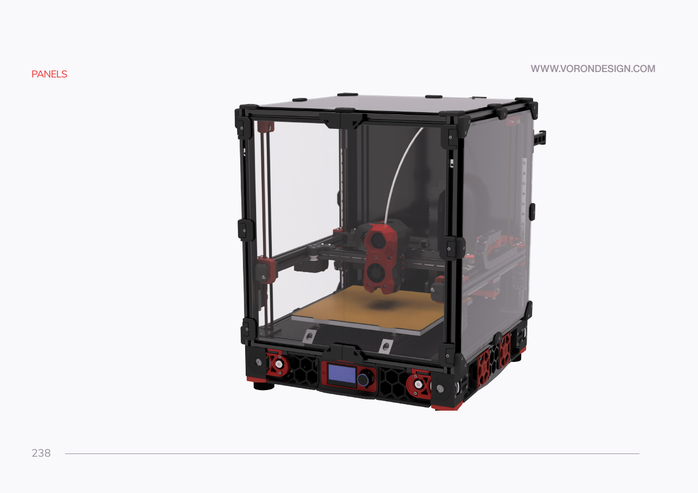
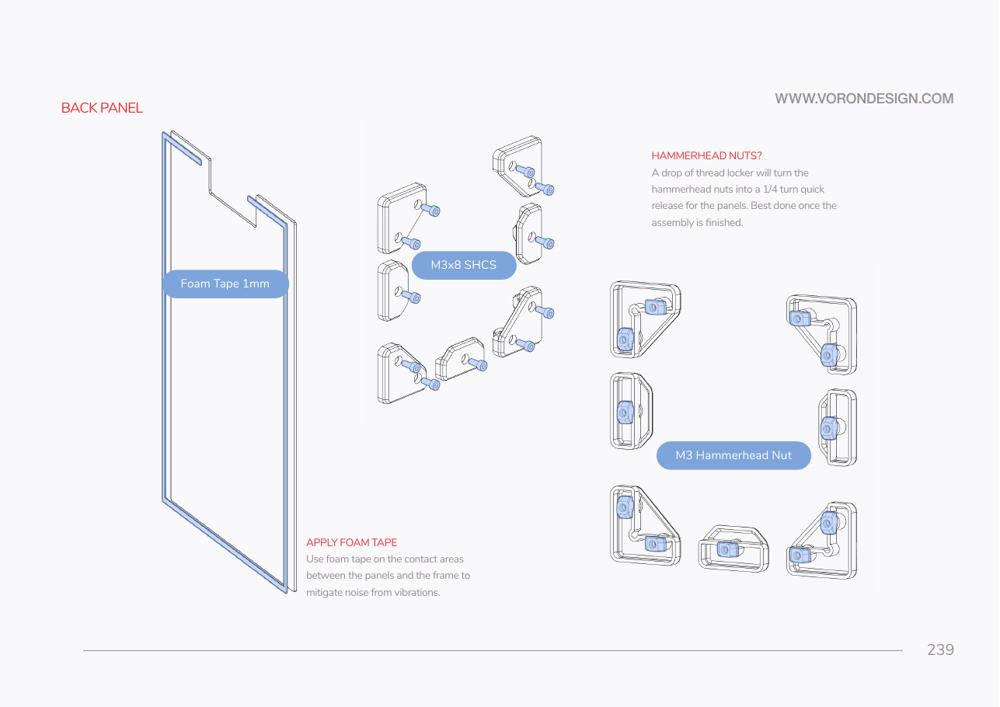

**Parts:** back panel (acrylic, black, 483 × 503 × 3 mm) ×1, **1 mm** foam tape.

**Do:** Peel the protective film from both faces. Run **1 mm** foam tape around the perimeter of the face that will meet the frame, on the contact areas only — this is noise control, not a gasket, so butt the corners rather than overlapping them.

**Check:** Continuous 1 mm tape on all four edges of the inner face; no tape where a clip has to sit; film off both faces.

⚠ Back and top panels get **1 mm** foam. Side panels get **3 mm**. Mixing them up either lets the gantry rub a side panel or leaves the back panel proud of its clips.

---

### Step 11.53 — Fit the back-panel clips

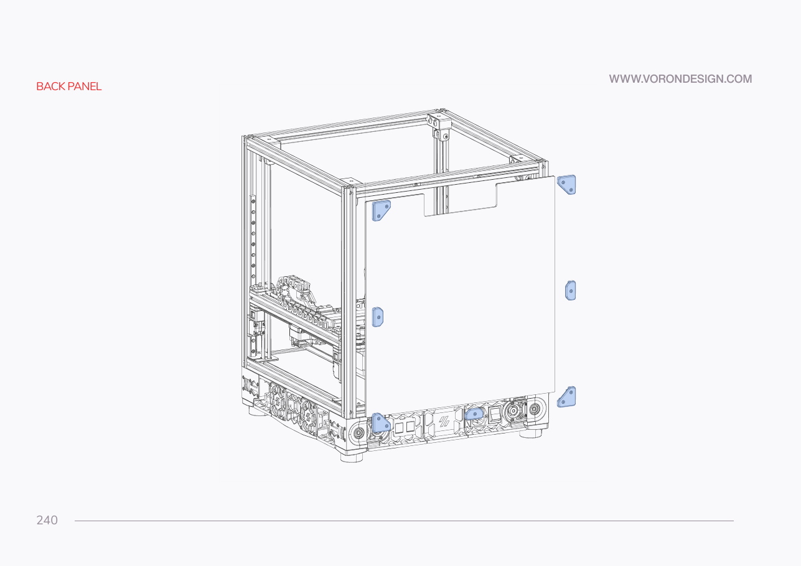

**Parts:** `corner_panel_clip_4mm` ×4, `midspan_panel_clip_4mm` ×3, M3×8 SHCS ×7, M3 hammerhead T-nut ×7.

**Do:** Load each clip with a hammerhead nut and an M3×8 SHCS, started but loose. Fit the four corner clips first, then the three midspan clips in the positions p.239 shows. Offer the back panel up, slide every clip onto its edge, and tighten — the hammerheads rotate and lock as you go.

**Check:** Seven clips, all engaged on the panel edge, panel flat against the frame with the 1 mm foam just compressed. No clip loaded so hard it bows the acrylic.

⚠ **Clip-thickness assignment — verify before you commit.** The manual never says which clip goes on which panel; this is the print plan's inference (§B9), and it is corroborated three ways: 3 mm panel + 1 mm foam = **4 mm**, the back panel takes **7** clips and the top panel **8** (counted off p.239 and p.243) which is exactly `_4mm_x8` + `_4mm_x7`, and the manual specifies **M3×8** here versus **M3×12** for the side panels — the longer screw is for the thicker 6 mm clip. **Test-fit one 4 mm clip and one 6 mm clip on an extrusion with a 3 mm panel offcut and the right foam tape before you commit all 31 clips.** The 4 mm clip should hold a 3 mm panel plus 1 mm foam with light preload; the 6 mm clip on the same stack will be visibly loose. [src](https://github.com/VoronDesign/Voron-2/tree/Voron2.4/STLs/Panel_Mounting)

Tip: a drop of thread locker turns each hammerhead nut into a quarter-turn quick release for the panel — but do it once the whole assembly is finished, not now. [Voron manual p.239]

---

### Step 11.54 — Fit the exhaust cover and grill

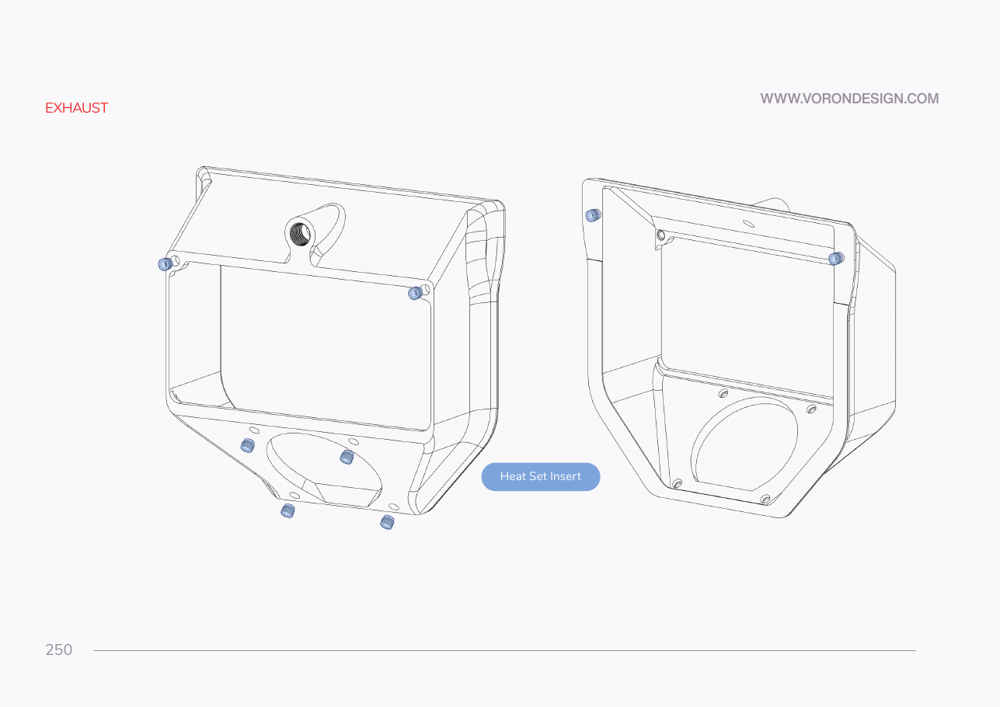
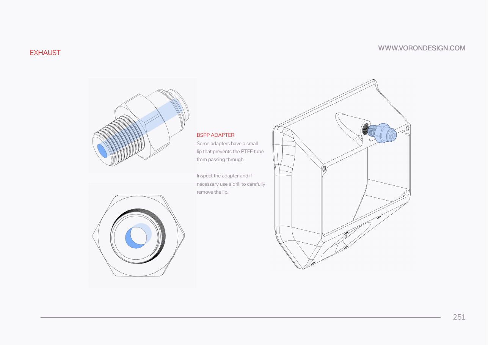
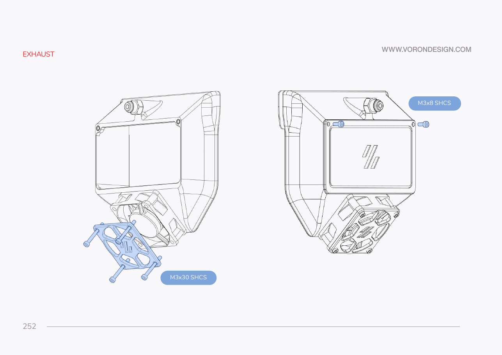
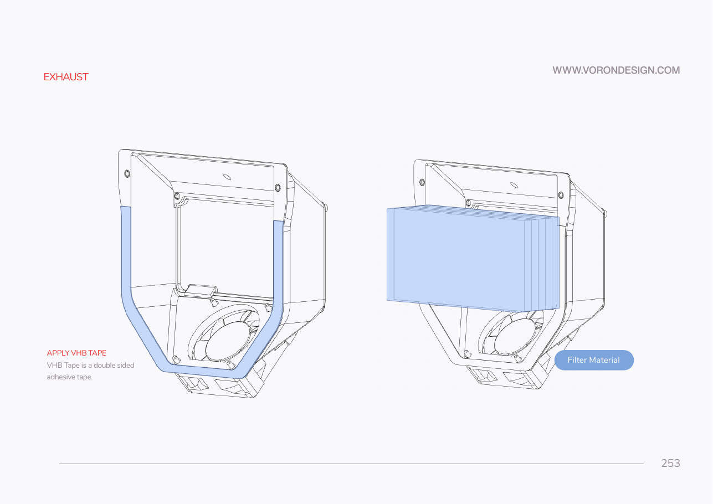
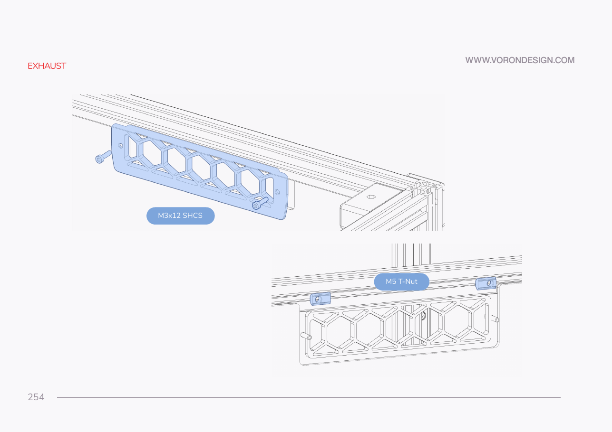
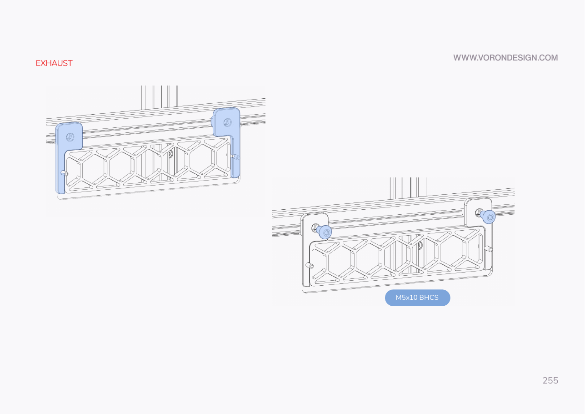
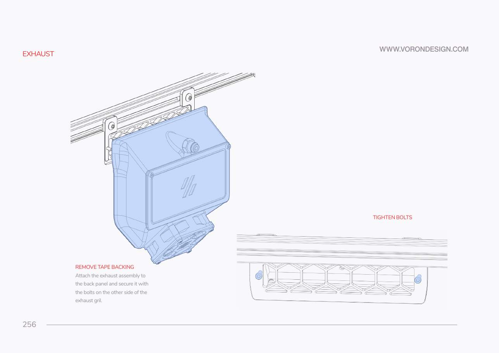

**Parts:** LDO `exhaust_cover` ×1, Voron `exhaust_filter_grill` ×1, M3×12 SHCS ×2 *(verify on bench)*.

**Do:** You are not building the Voron exhaust filter. Skip p.250 (housing heat-sets), p.251 (BSPP adapter lip), p.252 (M3×8 and M3×30 housing screws), p.253 (VHB and filter material) and p.256 (hanging the housing) entirely. Instead, sandwich the back panel's exhaust cut-out: LDO's `exhaust_cover` on the **inside** face, the Voron `exhaust_filter_grill` on the **outside**, bolted through the panel with M3×12 SHCS. Dry-fit both parts against the cut-out before you drive anything.

**Check:** Cut-out fully covered from both faces, no light through the joint, panel not stressed white around the screw holes, grill sitting flat.

⚠ **Rev D+ / LDO:** *"PAGE 250-253 & 256 SKIP — Please follow our guide for Nevermore mod."* and *"If you decide to build the Nevermore internal circulation filter, print this exhaust cover to seal the back panel."* LDO's page list stops short of p.254–255, but those two pages hang the Voron housing on `[a]_exhaust_filter_mount_x2` (M5 T-nuts and M5×10 BHCS into the top rear extrusion) — parts you deliberately did not print, so those fasteners are unused here. *(verify on bench — LDO publishes no step-by-step for the exhaust cover; the sandwich is inferred from p.256's "secure it with the bolts on the other side of the exhaust gril" and the cover's stated purpose.)* [src](https://docs.ldomotors.com/voron/voron2/build-faq) · [src](https://github.com/MotorDynamicsLab/LDOVoron2/tree/main/STLs)

---

### Step 11.55 — Hang the back panel

**Parts:** back panel assembly from 11.52–11.54.

**Do:** Lift the panel into the clips, check the exhaust cut-out lines up with whatever it needs to clear behind it, and tighten every clip screw. Work opposite corners rather than around the perimeter.

**Check:** Panel square and flat with even margins; the foam is compressed but not squashed flat; the exhaust cover clears the Nevermore, the umbilical and every cable behind it.

---

### Step 11.56 — Foam-tape the side panels

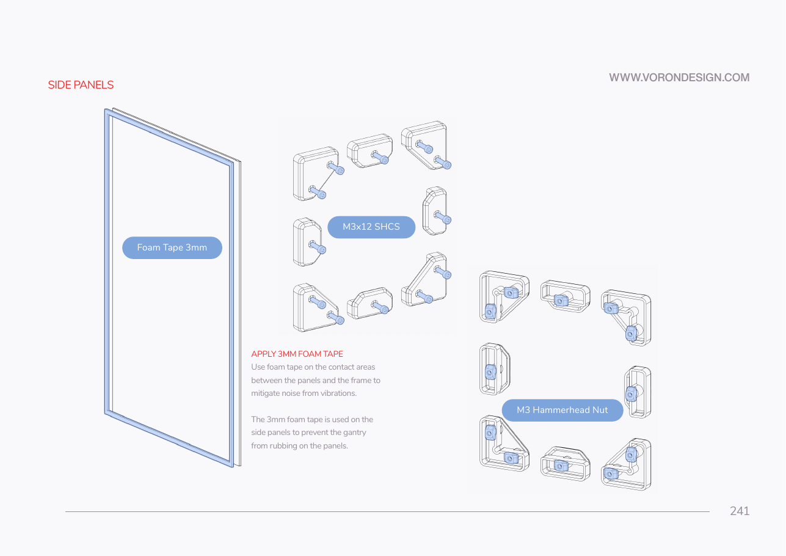

**Parts:** side panel (PC, clear, 483 × 503 × 3 mm) ×2, **3 mm** foam tape.

**Do:** Peel the film from both faces of both panels. Run **3 mm** foam tape around the perimeter of each inner face. The manual is explicit about why this one is thicker: *"The 3mm foam tape is used on the side panels to prevent the gantry from rubbing on the panels."*

**Check:** 3 mm tape on both panels, all four edges, corners butted. This is a functional standoff — do not substitute the 1 mm tape to make it look neater.

---

### Step 11.57 — Fit the first side panel

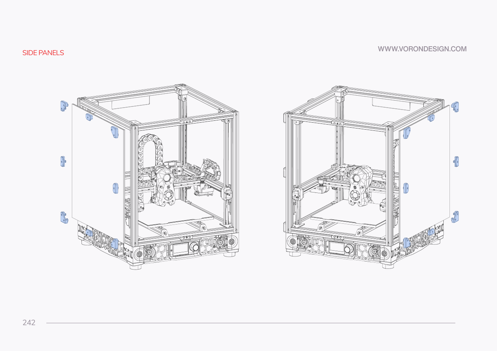

**Parts:** `corner_panel_clip_6mm` ×4, `midspan_panel_clip_6mm` ×4, M3×12 SHCS ×8, M3 hammerhead T-nut ×8.

**Do:** Load eight clips with hammerhead nuts and M3×12 SHCS. Fit the four corners then the four midspans in the p.241 positions, offer the panel up, engage every clip and tighten. Note that the middle clip on the door side of one panel will later be replaced by the Clicky-Clack `Latch` + `Panel_Clip` assembly (11.63) — leave that one accessible.

**Check:** Panel flat with equal margins; **run the gantry through its full XY travel by hand and confirm nothing touches the panel** — this is what the 3 mm foam is buying you.

⚠ Side panels take **M3×12 SHCS**, not M3×8. The 6 mm clip is thicker and an M3×8 will not reach the hammerhead nut with any thread to spare.

---

### Step 11.58 — Fit the second side panel

**Parts:** `corner_panel_clip_6mm` ×4, `midspan_panel_clip_6mm` ×4, M3×12 SHCS ×8, M3 hammerhead T-nut ×8.

**Do:** Repeat 11.57 on the other side.

**Check:** Both panels on; the gantry clears both through full travel; 6 mm clip stock is now exhausted — 8 corner and 8 midspan, nothing left over.

---

### Step 11.59 — Fit the top panel

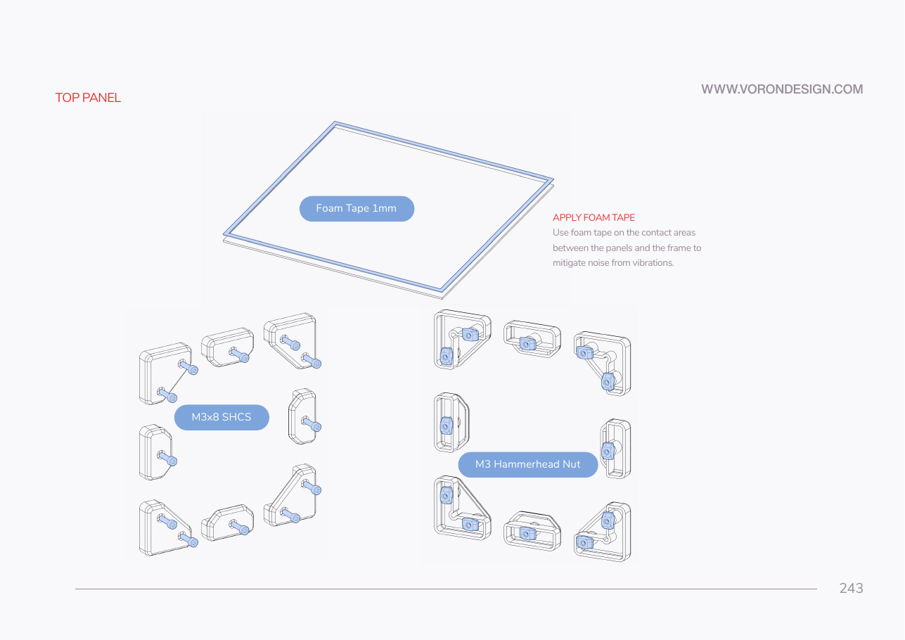
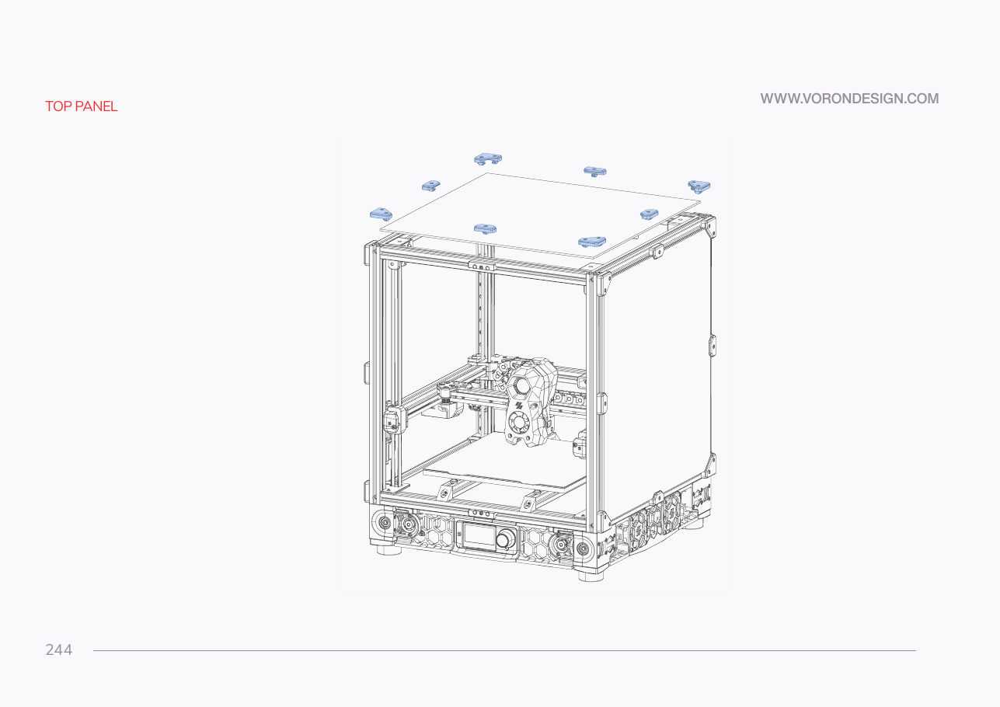

**Parts:** top panel (PC, clear, 483 × 483 × 3 mm) ×1, **1 mm** foam tape, `corner_panel_clip_4mm` ×4, `midspan_panel_clip_4mm` ×4, M3×8 SHCS ×8, M3 hammerhead T-nut ×8.

**Do:** Film off both faces, 1 mm foam around the perimeter of the underside. Load eight clips, fit four corners and four midspans as p.243 shows, drop the panel on and tighten. That consumes the last of the 4 mm clips — 8 corner and 7 midspan across back and top.

**Check:** Panel flat with even margins on all four sides; foam compressed evenly; the machine is now closed on five faces.

---

### Step 11.60 — Fit the aluminium handlebars

(no image — see [LDO STLs README](https://github.com/MotorDynamicsLab/LDOVoron2/tree/main/STLs))

**Parts:** aluminium handle ×2 (LDO), `handlebar_spacer_x4` ×4 (batch B7), M5×14 BHCS ×4, M5 hammerhead T-nut ×4.

**Do:** The manual has no handlebar step — this is an LDO kit extra. Put a printed spacer under each handle foot to take up the top panel's thickness, then bolt each handle down with M5×14 BHCS into M5 hammerhead nuts in the top frame extrusions. One handle per side, positioned so a two-person lift is balanced.

**Check:** Both handles solid; the spacers carry the load rather than the polycarbonate; lift the machine an inch by the handles and confirm nothing flexes at the panel.

⚠ **Rev D+ / LDO:** *"This optional part offsets the top panel thickness and helps mount the included aluminium handle bar."* The 350 Rev D BOM ships two aluminium handles and four M5×14 BHCS. [src](https://github.com/MotorDynamicsLab/LDOVoron2/tree/main/STLs) · [src](https://docs.ldomotors.com/en/voron/voron2/350_BOM/Rev_D)

---

### Step 11.61 — Do not fit the stock doors

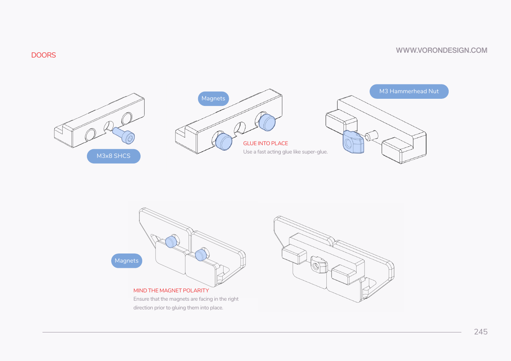
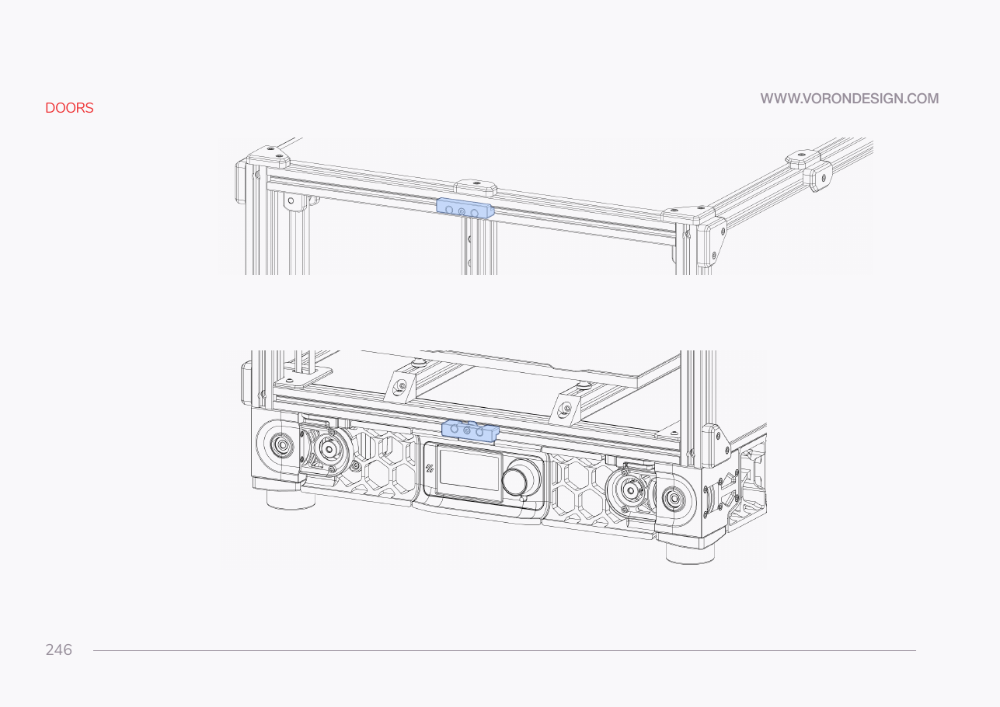
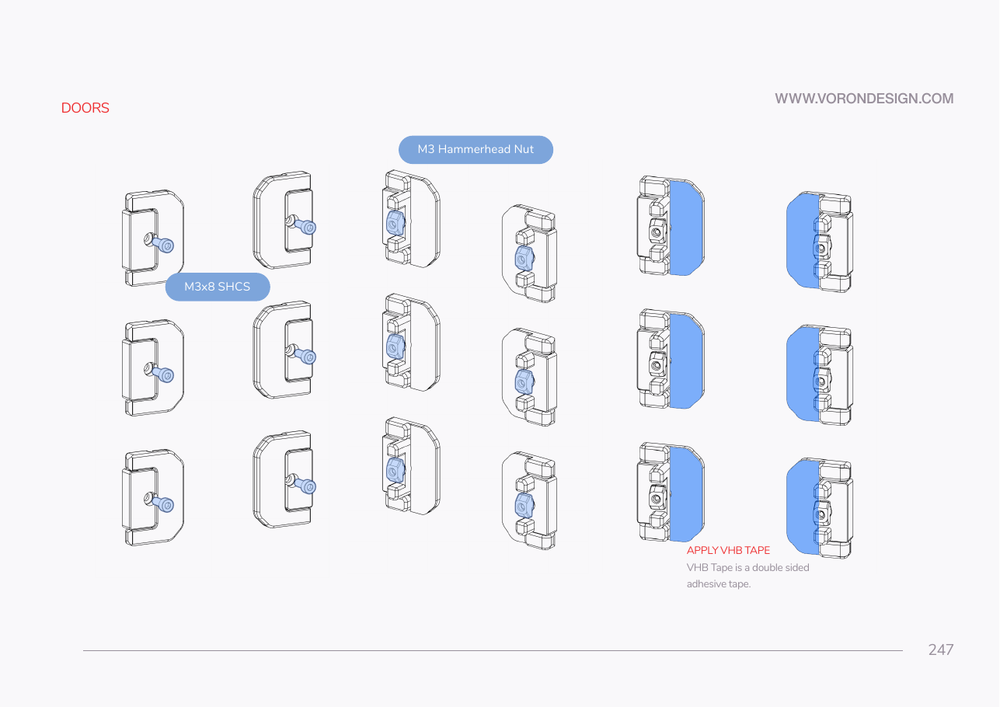
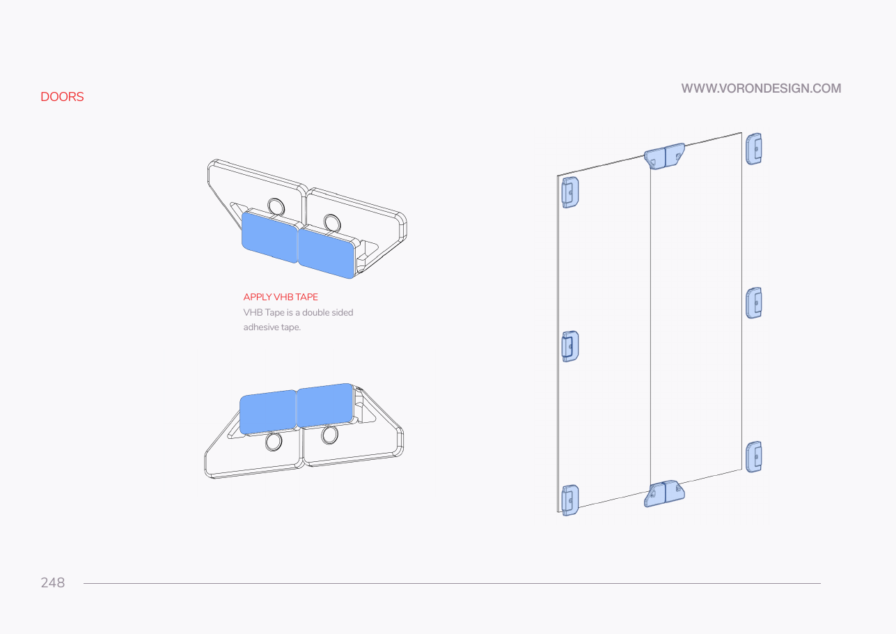
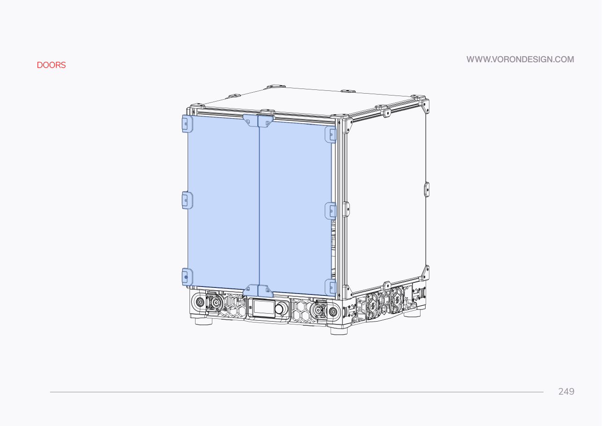

**Parts:** none. The kit's two 241 × 503 × 3 mm clear PC door panels, and the 6×3 mm magnets those pages would have you glue into the front extrusions, are not used here.

**Do:** Skip all five DOORS pages. p.245 glues magnets into the front frame and the printed handles and warns about polarity; p.247–248 fit `door_hinge_x6` with M3×8 SHCS and hammerhead nuts and VHB the panels to them. None of it applies — the Clicky-Clack is a single framed door with its own hinges, latch and magnets. Confirm you never printed `door_hinge_x6`, `handle_a_x2`, `handle_b_x2`, `latch_x2` or LDO's `LDO Door/` set. Bag the two stock door panels and the spare magnets as spares.

**Check:** No stock door hardware installed; the front opening is bare extrusion with the 3 mm foam gasket from 11.51 on it.

⚠ Fitting Clicky-Clack means you also lose LDO's kit-number nameplate, which lives on `LDO Door/handle_b_nameplate.stl`. Print it and glue it elsewhere if you want it (print plan §3, B10).

---

### Step 11.62 — Hang the door hinges

(no image — see [KB3D guide § Frame Assembly](https://wiki.kb-3d.com/en/home/LDO/LDO_Clicky_Clacky_Door_Mod))

**Parts:** the two hinge assemblies from 11.46–11.47, M3×20 SHCS ×4, M3 roll-in T-nut ×8 (4 on the printer, 4 on the door frame), blue tape.

**Do:** Tape the door temporarily in the opening so you can see where it wants to sit. Roll four M3 T-nuts onto the hinge-side vertical of the printer and line them up against the **bottom corner panel clip** and the **top corner panel clip** — those two clips are the alignment datum this mod uses. Screw each hinge onto its nuts loosely first, then slide into position. The hinge **pins must point up**. Leave a small gap at the top hinge rather than clamping it tight. Roll four more M3 T-nuts into the door frame's hinge edge for the door-side halves.

**Check:** Both hinge halves on the printer with pins up; the door lifts straight off the pins and drops back on; the door hangs parallel to the opening with an even gap top to bottom.

---

### Step 11.63 — Fit the latch

(no image — see [KB3D guide § Frame Assembly](https://wiki.kb-3d.com/en/home/LDO/LDO_Clicky_Clacky_Door_Mod))

**Parts:** `Latch` + `Panel_Clip` assembly from 11.49, M3 hammerhead T-nut (reuse the one from the middle side-panel clip you displace).

**Do:** Remove the middle panel clip from the latch-side vertical and reuse its hammerhead nut for the latch. Centre the latch vertically on that side panel edge, and **do not tighten it fully yet** — the latch is what you will move to align the door at 11.64.

**Check:** Latch on the frame and still adjustable; its `Panel_Clip` half is holding the side panel edge exactly as the clip it replaced did.

---

### Step 11.64 — Fit the handle and align the door

(no image — see [KB3D guide § Frame Assembly](https://wiki.kb-3d.com/en/home/LDO/LDO_Clicky_Clacky_Door_Mod))

**Parts:** handle assembly from 11.50, M3×8 SHCS ×4, M3 roll-in T-nut ×4 (door side).

**Do:** Attach the two handle hinges loosely to the door's latch-side edge. Slip a shim — a few sheets of paper — between the handle and handle-hinge magnets while you position everything, so the handle has clearance to swing and does not bind on friction between the printed parts. Float the handle over the latch and slide it up and down until the two line up. Lock the latch down first, then tighten the four handle screws, then pull the shim.

**Check:** The door closes with a click; the latch **draws the door in** against the 3 mm foam rather than just touching it; the handle swings its full arc without rubbing; the door seals on all four sides.

Tip: if the latch will not catch cleanly, the problem is almost always door alignment at the hinges, not the latch position. Re-align at 11.62 rather than moving the latch further. [src](https://wiki.kb-3d.com/en/home/LDO/LDO_Clicky_Clacky_Door_Mod)

---

### Step 11.65 — Thread-lock the hammerhead nuts

**Parts:** thread locker (optional).

**Do:** Now that every panel is on and aligned, put a drop of thread locker on each panel clip's hammerhead nut. The nut then stays put when you slacken the screw, so each clip becomes a quarter-turn quick release and a panel comes off in seconds.

**Check:** Every clip still holds its panel; a quarter turn of any clip screw releases the panel edge without the nut falling into the extrusion.

---

### Step 11.66 — Final seal and clearance check

(no image — see text)

**Parts:** none. Optional: extrusion slot cover, 6 mm.

**Do:** Peel any remaining protective film. Close the door and look along every seam for daylight. Push the gantry through its full XY travel by hand once more with all panels on, and run Z through its full travel — nothing should touch. Confirm the touchscreen is level and readable, the AC switch is reachable, the Ethernet keystone is accessible and the spool arm clears the back panel. Trim and press the 6 mm slot cover into any empty extrusion slots you want to hide.

**Check:** No daylight at any panel seam or around the door; no contact anywhere in full XY or Z travel; the door latches with one push; the chamber will now hold heat for the ASA work in Ch 14.

---

## Checkpoint 11

**Part A — before you go to Ch 12**

- [ ] Checkpoint #1 passed **before** any of this started; deck panel calipered and the Ch 02 deck supports match it.
- [ ] All twelve skirt segments checked for rock on the flat reference; the ring is closed with flush, tight joints all round, and no mini12864 parts exist anywhere on the machine.
- [ ] BTT TFT4.3 module in the front-centre position; FFC seated at both ends in the correct orientation (contacts up at the screen, forward at the Pi) with a service loop.
- [ ] Two 60×20 bay fans, matching airflow direction, joined by the 3×2 splicer PCB **on its printed spacer**, landing on FAN2/PF7.
- [ ] Bottom panel bonded on six VHB pads and screwed with six M3×8 SHCS; four Z belt covers on, correct variant per corner, belts clear through full Z travel.
- [ ] Nevermore built and installed: 6 heat-sets, both 5015 fans modified and bolted, bridge PCB **meter-checked for shorts**, magnets polarity-matched, plenum on the bed extrusions, filter fan on **FAN3/PF9** with the 24 V jumper confirmed, carbon fill status recorded.
- [ ] Spool holder and bowden retainer fitted; a full spool spins freely with no kink in the PTFE.
- [ ] Clicky-Clack door frame square, acrylic retained, hinges and handle assembled, all magnet pairs attracting; 3 mm foam on the front opening.

**Part B — after Ch 13**

- [ ] **Ch 12 and Ch 13 complete**, including the Ch 06b gantry-squaring pass, before any panel went on.
- [ ] Clips test-fitted for thickness before all 31 were committed: 4 mm on back + top with M3×8, 6 mm on both sides with M3×12; none left over, none short. Foam tape correct per panel: 1 mm back and top, 3 mm both sides.
- [ ] Gantry run through full XY travel with the side panels on — no contact. Exhaust cover and grill sealing the back panel; no Voron filter housing fitted. Both handlebars on their printed spacers.
- [ ] No stock door parts fitted; the Clicky-Clack latches with a click and draws the door onto the 3 mm foam; no daylight at any seam; thread locker on the panel-clip hammerhead nuts.

## Common mistakes

- **Closing the machine too early.** Starting before Checkpoint #1 seals an unverified electronics bay; fitting the back, side and top panels before Ch 13 means taking them off again for gantry squaring and the startup wizard's motor, endstop and probe checks — an hour, plus the foam tape you tear getting them off (survey §5.2 W8).
- **Mixing up the foam tape.** 1 mm on back and top, 3 mm on the sides. The 3 mm is not cosmetic — it is the standoff that keeps the gantry off the panel. A side panel taped with 1 mm gets scored.
- **Assuming the 4 mm and 6 mm clips are interchangeable.** They are not, and the screw length gives it away: M3×8 for the 4 mm clips, M3×12 for the 6 mm. Test-fit one of each before committing 31 clips.
- **Resolving the deck panel thickness from the documents.** LDO's build note says 4 mm and LDO's own BOM says 3 mm. Caliper it. If Ch 02 got the wrong deck supports, fix it before the skirt ring goes on.
- **Trusting the Nevermore guide's board.** It was written for a BTT Octopus: `PD13`. This machine is a Leviathan — **FAN3 / PF9**, 24 V jumper confirmed. And do not skip the multimeter check on the bridge PCB; a short across the 24 V fan rail takes the controller with it. Same class of mistake: the 3×2 bay-fan splicer must sit on its printed spacer, not bare on the extrusion.
- **Forcing a Clicky-Clack latch that will not catch, or gluing the cartridge magnets without marking polarity first.** The latch is almost never the problem — re-hang the door at the hinges. And backwards magnets mean digging cyanoacrylate-bonded neodymium out of a printed part.

## Next

Ch 12 — Software: Pi image, Klipper/Moonraker/Fluidd/KlipperScreen, firmware and `printer.cfg` — using `leviathan-printer-rev-d-sbv2.cfg`, with the Nevermore `[heater_fan exhaust_fan]` pin corrected to `PF9`. Then Ch 13, then back here for Part B.
