# Chapter 11 — Skirts, panels, Clicky-Clack door, filtration

Closes the machine: the skirt ring and its front touchscreen module, the electronics-bay fans, the bottom panel, the Z belt covers, the Nevermore Micro V5 Duo, the spool holder — then, **after Ch 13 has proved the machine moves and heats**, the back, side and top panels and the Clicky-Clack door.

**What you're building in this chapter.** Five sub-assemblies turn an open frame into an enclosure. The **skirt ring** is the band of twelve printed segments around the base that hides and closes the electronics bay; built into it are the orange belt guards over the Z drive belts at the four corners, the two 60 × 20 mm bay fans — both in the right-hand fan support, beside the PSU — the keystone panel carrying the network socket, the already-wired AC inlet segment from Ch 09, and the **BTT TFT4.3 touchscreen module** that fills the centre-front position. The **bottom panel** is a door: VHB-bonded to two rear hinges and four clips, it unclips and swings down so the bay stays reachable through Ch 13. Four **Z belt covers** clip over the belts at the frame corners. The **Nevermore Micro V5 Duo** is a recirculating carbon filter built from a printed plenum, two 5015 blowers and a magnetic cartridge, mounted inside the chamber on the bed extrusions. Then the **panels** — back and top on 1 mm foam and 4 mm clips, both sides on 3 mm foam and 6 mm clips, the thicker foam holding the gantry clear — and the **Clicky-Clack door**, a framed acrylic panel on lift-off hinges with a magnetic handle and latch. Everything from the back panel onward waits until Ch 13 has run the machine with every face open.

**Time:** 4.0–6.0 h hands-on, first build (survey §5.1, P11). Split roughly **3.0–4.0 h for Part A** (before Ch 13) and **1.0–2.0 h for Part B** (after Ch 13).

**Sessions:** 17 × ~30 min (12 in Part A, 5 in Part B; every minute figure in this chapter is a first-build estimate derived from the Time split and the step count).

**Prerequisites**

- **Ch 10 — Wiring**, complete, including LDO **Checkpoint #1** (multimeter, unplugged). This is a hard gate: once the skirts and bottom panel go on, the bay is closed and re-opening costs an hour (survey §5.2 W8).
- **Ch 10** must also have finished LED routing and the extrusion covers — a skirt over an unrouted LED wire means the skirt comes off again (survey §5.2 W5).
- **Ch 12 Part 2 complete** — [Step 12.11](12-software.md#step-1211-gate-power-the-bay-and-confirm-both-mcus-enumerate) to Checkpoint 12: the bay powered once, both MCUs flashed, `printer.cfg` in. It runs with the bay **open**, before this part closes it; the touchscreen module (11.5–11.6) was already built from Ch 10 Step 10.50 and its panel proved at 12.11.
- **Print batch B08** — skirts and front modules (6 plates, 29.2 h).
- **Print batch B09** — panels, filtration, spool (5 plates, 21.8 h).
- **Print batch B10** — Clicky-Clack door (1 plate, 5.7 h) + `Handle.stl` from **B02**.
- **Print batch B02** — the orange accent parts used here: belt guards, fan grills, fan grill retainers, keystone blank, TFT faceplate, Clicky-Clack handle.
- **Print batch B07** — `handlebar_spacer_x4` (used at the top panel, step 11.60).
- **Part B additionally requires Ch 13 — Initial startup**, and the Ch 06b gantry-squaring pass that runs inside it. Do not close the machine before those pass.

**Tools**

- Hex 2 / 2.5 / 3 / 4 mm
- Temperature-controlled soldering iron + M3 brass heat-set tip (skirts, fan grill retainers, Nevermore, Clicky-Clack latch)
- Soldering iron + solder for the Nevermore bridge PCB; multimeter for the short check
- Small hammer (Clicky-Clack dowel pins and split bushings)
- Side cutters / flush cutters (5015 fan enclosures, rubber retainer strip)
- Sharp scissors or a craft knife (foam tape, VHB, gasket mitres)
- 150 mm steel rule and a machinist square (door frame corners)
- Flat reference surface (the stone counter) to check every skirt segment for rock

**Consumables:** 1 mm foam tape, 3 mm foam tape, 3M VHB tape, super glue (magnets), IPA and a lint-free cloth, blue tape (holding the door while you hang it), thread locker (optional, hammerhead quick-release trick).

**Printed parts** (chapter totals; batch ids from `docs/voron-print-plan.md`)

Parts arrive in the bins named below (see the bin map in print/README.md#bins); check the bin label's list before you start.

| Looks like | STL | Bin | Qty | Colour | Batch |
|---|---|---|---:|---|---|
| 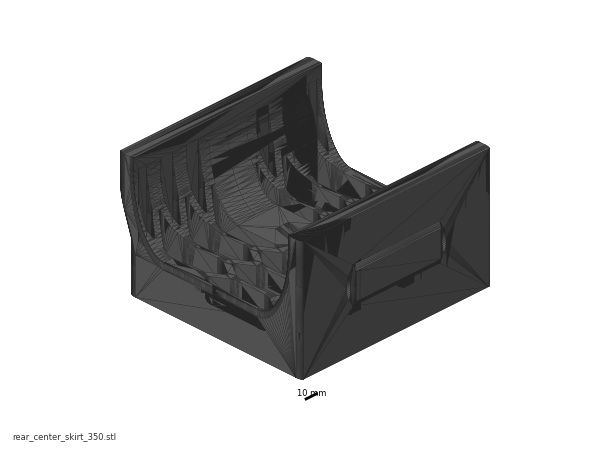{ width=96 } | `rear_center_skirt_350.stl` | 11-skirts | 1 | Black | B08 |
| 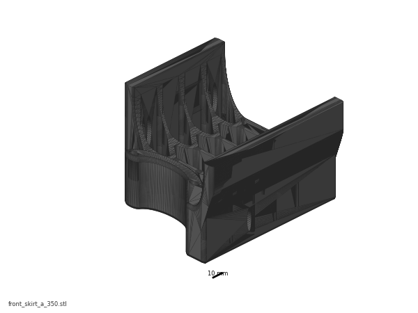{ width=96 } | `front_skirt_a_350.stl` | 11-skirts | 1 | Black | B08 |
| 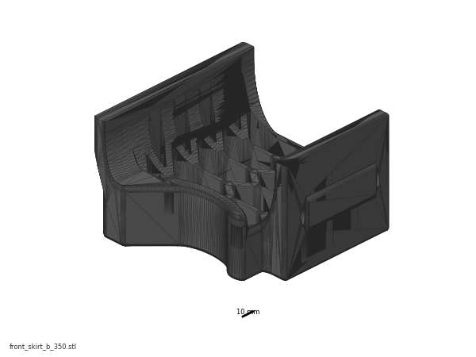{ width=96 } | `front_skirt_b_350.stl` | 11-skirts | 1 | Black | B08 |
| 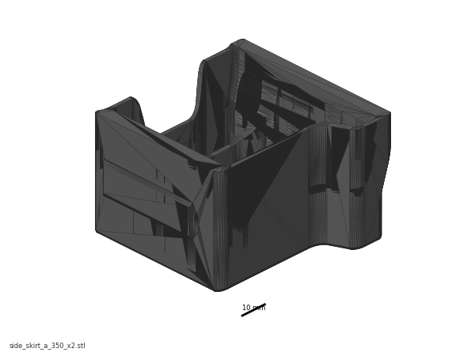{ width=96 } | `side_skirt_a_350_x2.stl` | 11-skirts | 2 | Black | B08 |
| 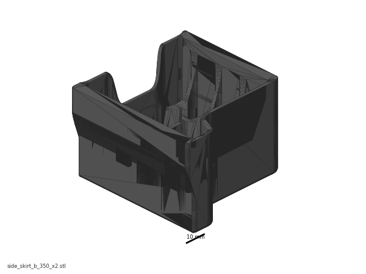{ width=96 } | `side_skirt_b_350_x2.stl` | 11-skirts | 2 | Black | B08 |
| 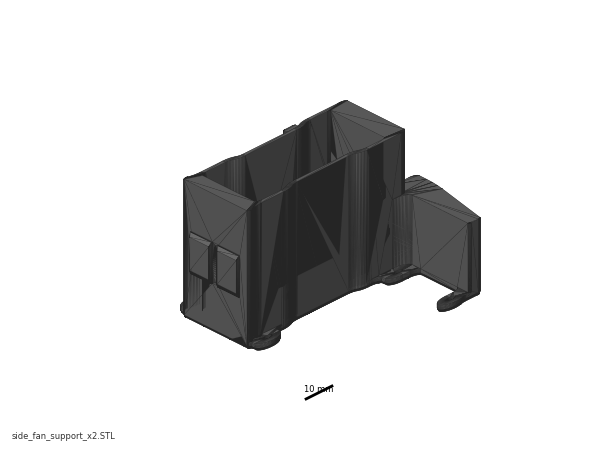{ width=96 } | `side_fan_support_x2.STL` | 11-skirts | 2 | Black | B08 |
| 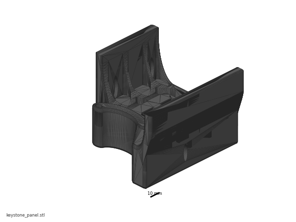{ width=96 } | `keystone_panel.stl` | 11-skirts | 1 | Black | B08 |
| { width=96 } | `power_inlet_IECGS_1mm.stl` | 09-bay | 1 | Black | **B07-P3** *(fitted in Ch 09 Steps 09.10–09.12; listed here because it is a ring segment)* |
| 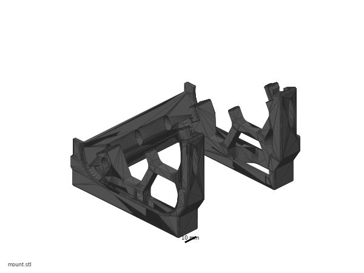{ width=96 } | `mount.stl` (BTT Pi TFT4.3 Mount) | 11-skirts | 1 | Black | B08 |
| { width=96 } | `[a]_faceplate.stl` (BTT Pi TFT4.3 Mount) | 11-skirts | 1 | Orange | B02 |
| { width=96 } | `[a]_belt_guard_a_x2.stl` | 11-fans | 2 | Orange | B02 |
| { width=96 } | `[a]_belt_guard_b_x2.stl` | 11-fans | 2 | Orange | B02 |
| { width=96 } | `[a]_fan_grill_a_x2.stl` | 11-fans | 2 | Orange | B02 |
| { width=96 } | `[a]_fan_grill_b_x2.stl` | 11-fans | 2 | Orange | B02 |
| { width=96 } | `[a]_fan_grill_retainer_x2.stl` | 11-fans | 2 | Orange | B02 |
| { width=96 } | `[a]_keystone_blank_insert.stl` | 11-skirts | 2 *(1 used, 1 spare)* | Orange | B02 |
| 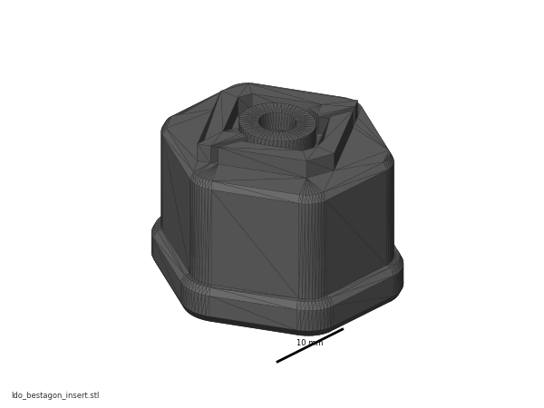{ width=96 } | `ldo_bestagon_insert.stl` | 11-skirts | 1 *(optional trim)* | Orange | B02 |
| 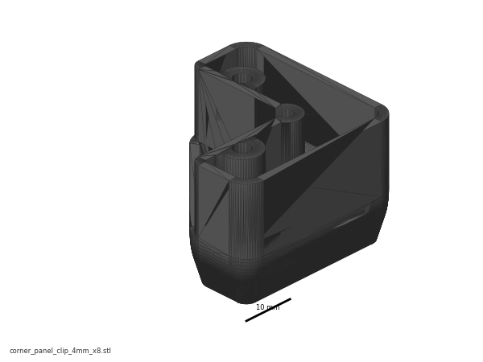{ width=96 } | `corner_panel_clip_4mm_x8.stl` | 11-clips-4mm | 8 | Black | B09 |
| 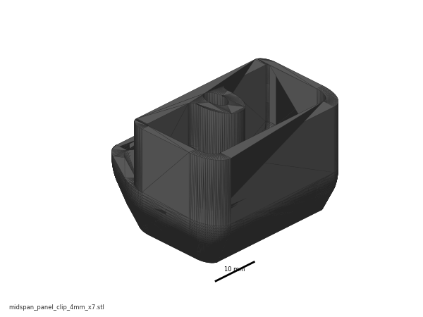{ width=96 } | `midspan_panel_clip_4mm_x7.stl` | 11-clips-4mm | 7 | Black | B09 |
| { width=96 } | `corner_panel_clip_6mm_x8.stl` | 11-clips-6mm | 8 | Black | B09 |
| 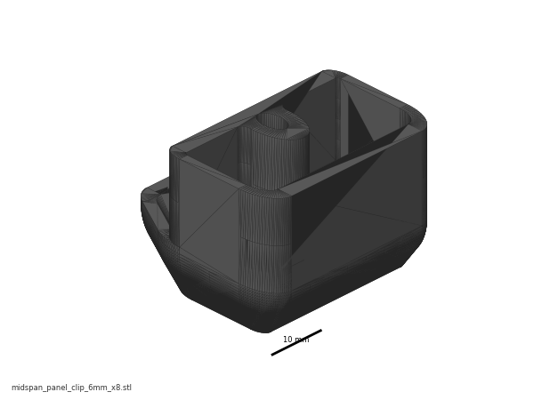{ width=96 } | `midspan_panel_clip_6mm_x8.stl` | 11-clips-6mm | 8 | Black | B09 |
| 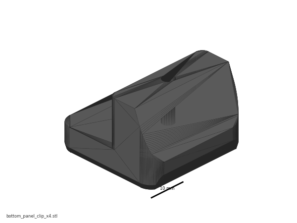{ width=96 } | `bottom_panel_clip_x4.stl` | 11-panels | 4 | Black | B09 |
| 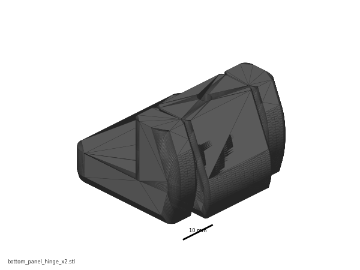{ width=96 } | `bottom_panel_hinge_x2.stl` | 11-panels | 2 | Black | B09 |
| 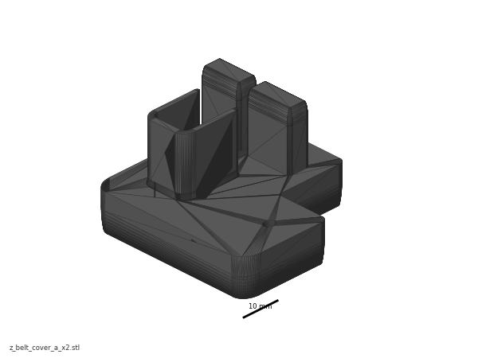{ width=96 } | `z_belt_cover_a_x2.stl` | 11-panels | 2 | Black | B09 |
| 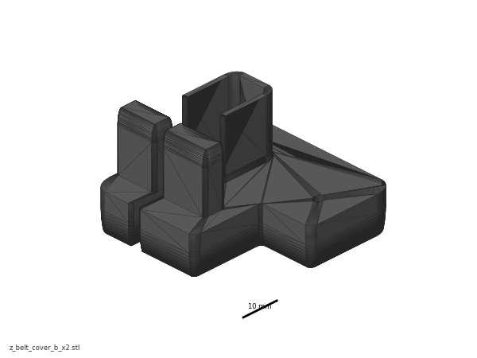{ width=96 } | `z_belt_cover_b_x2.stl` | 11-panels | 2 | Black | B09 |
|  | `z_belt_cover_a_led.stl` (LDO) | — | 0 | Black | not printed — Ch 10 Step 10.38 routes the LED lead through the extrusion slot, not the Z-motor opening; see 11.22 for the rejected alternative |
| 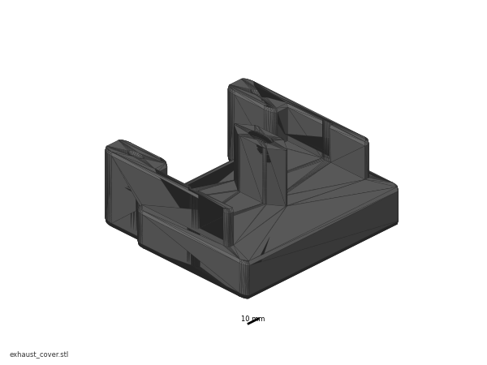{ width=96 } | `exhaust_cover.stl` (LDO) | 11-nevermore | 1 | Black | B09 |
| 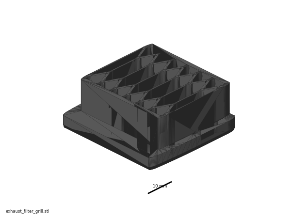{ width=96 } | `exhaust_filter_grill.stl` (Voron) | 11-nevermore | 1 | Black | B09 |
| 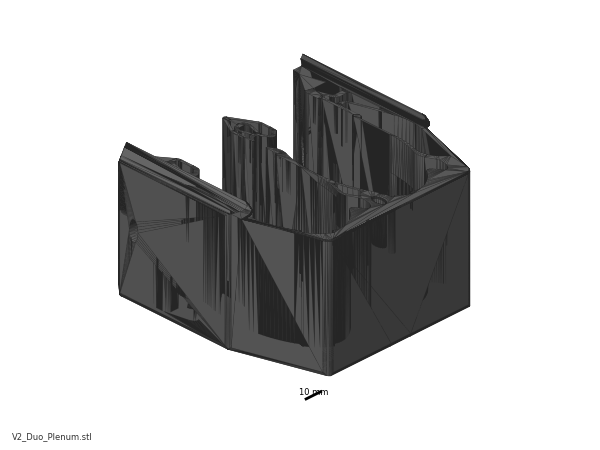{ width=96 } | `V2_Duo_Plenum.stl` | 11-nevermore | 1 | Black | B09 |
| 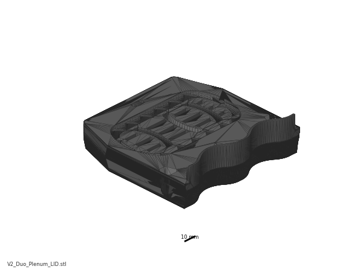{ width=96 } | `V2_Duo_Plenum_LID.stl` | 11-nevermore | 1 | Black | B09 |
| { width=96 } | `Regular_Cartridge(contributed_by_Bucknova).3mf` | 11-nevermore | 1 | Black | B09 |
| { width=96 } | `Regular_Cartridge_Lid(contributed_by_Bucknova).3mf` | 11-nevermore | 1 | Black | B09 |
| 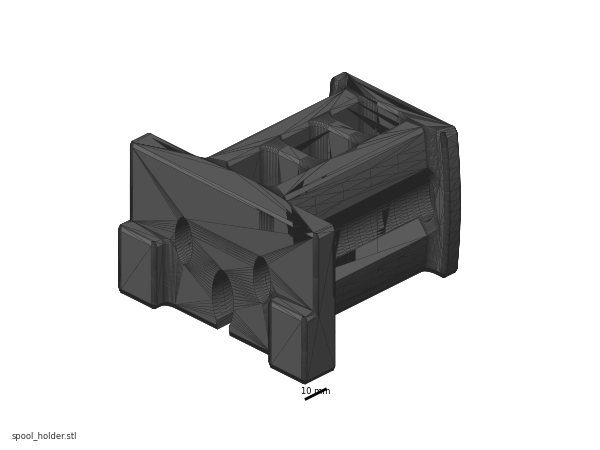{ width=96 } | `spool_holder.stl` | 11-spool | 1 | Black | B09 |
| 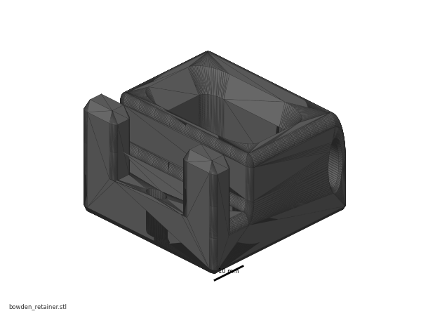{ width=96 } | `bowden_retainer.stl` | 11-spool | 1 | Black | B09 |
| 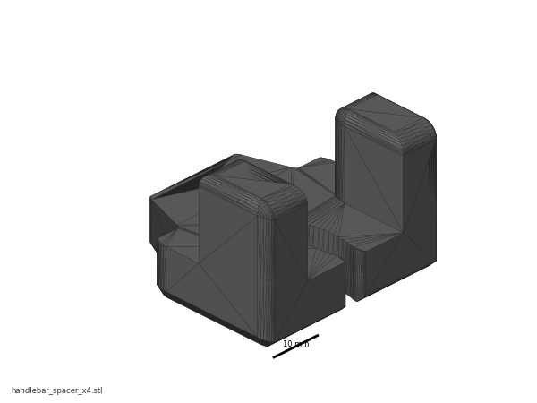{ width=96 } | `handlebar_spacer_x4.stl` (LDO) | 11-panels | 4 | Black | B07 |
| 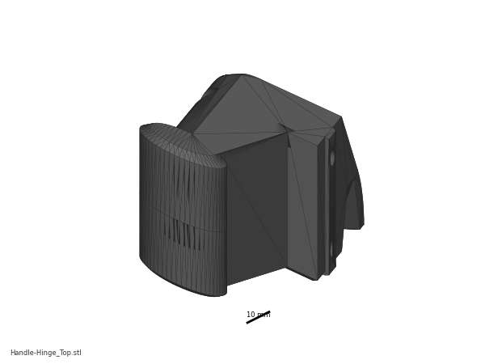{ width=96 } 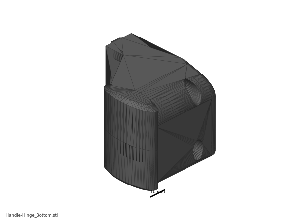{ width=96 } | `Handle-Hinge_Top.stl` / `Handle-Hinge_Bottom.stl` | 11-door | 1 each | Black | B10 |
| { width=96 } 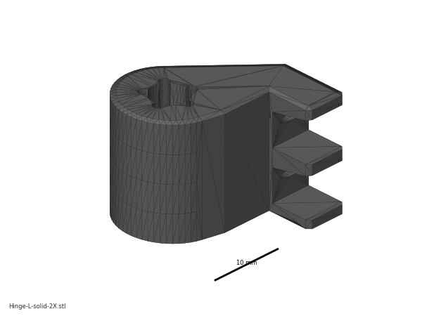{ width=96 } | `Hinge-L-sleeve-2X.stl` / `Hinge-L-solid-2X.stl` | 11-door | 2 each | Black | B10 |
| 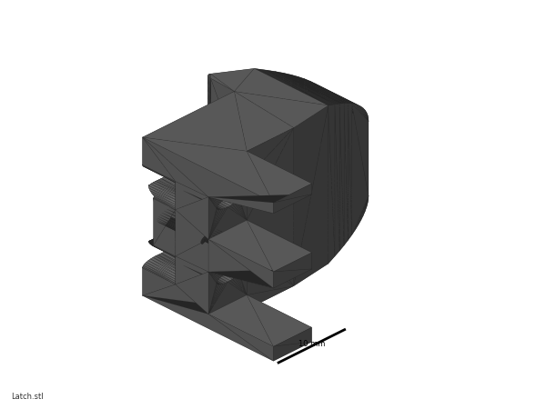{ width=96 } 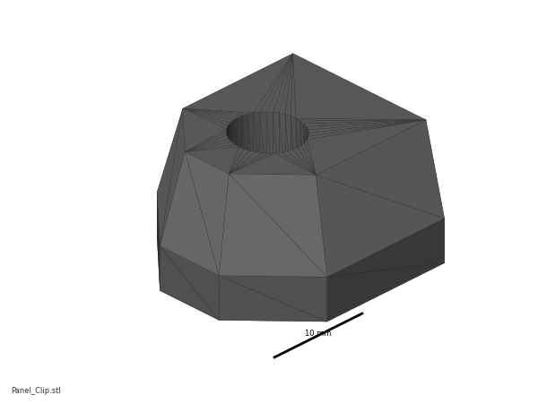{ width=96 } | `Latch.stl` / `Panel_Clip.stl` | 11-door | 1 each | Black | B10 |
| 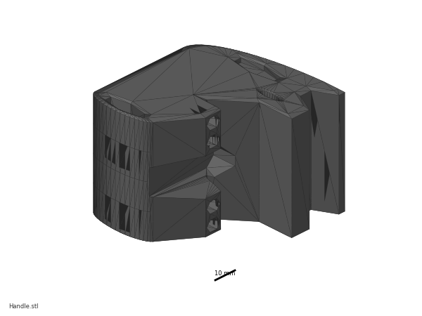{ width=96 } | `Handle.stl` (Clicky-Clack) | 11-door | 1 | Orange | B02 |

**Not printed, not installed** — the Clicky-Clack replaces the stock front doors and the BTT touchscreen replaces the mini12864, so none of these exist on this machine: `Panel_Mounting/Front_Doors/door_hinge_x6`, `handle_a_x2`, `handle_b_x2`, `latch_x2`; LDO's whole `LDO Door/` set; `mini12864_case_front`, `mini12864_case_rear`, `[a]_mini12864_case_hinge`, `[a]_mini12864_case_front_insert`, `[a]_btt_knob_light_shield`; `exhaust_filter_housing`, `[a]_exhaust_filter_mount_x2`, `[a]_filter_access_cover`, `[a]_exhaust_fan_grill`. Manual pages p.211, p.214–216, p.220–221, p.245–249 and p.250–253/256 are therefore dead pages for this build (print plan §7).

**Hardware** (chapter totals)

| Fastener / part | Qty | Where |
|---|---:|---|
| M3×8 SHCS | 7 | back-panel clips (p.239) |
| M3×8 SHCS | 8 | top-panel clips (p.243) |
| M3×8 SHCS | 8 | electronics-bay fans, 4 per fan (p.228) |
| M3×8 SHCS | 6 | bottom-panel clips and hinges (p.233) |
| M3 T-nut, 2020 (hammerhead or roll-in) | 6 | bottom-panel clips and hinges — p.233 draws the screws straight into the bottom extrusions and names no nut; one per screw *(verify on bench)* |
| M3×8 SHCS | 5 | BTT TFT4.3 mount + faceplate ([mount README](https://github.com/MotorDynamicsLab/LDOVoronTrident/tree/master/STLs/BTT%20Pi%20TFT4.3%20Mount)) |
| M3×8 SHCS | 1 | bowden retainer (p.257) |
| M3×8 SHCS | belt guards, keystone panel, skirt-to-skirt and skirt-to-frame joints | *(verify on bench — p.217, 219, 222–224, 227, 230 name the fastener with no count)* |
| M3×12 SHCS | 16 | side-panel clips, 8 per side (p.241) |
| M3×12 SHCS | 2 | exhaust grill to exhaust cover (p.254) |
| M3×6 BHCS | 4 | Z belt covers (p.234) |
| M3 hammerhead T-nut, 2020 | 7 + 8 + 16 + 4 | back / top / side panel clips, Z belt covers |
| M3 hammerhead T-nut, 2020 | 1 | bowden retainer (p.257) |
| M3 roll-in T-nut, 2020 | 3 | BTT TFT4.3 mount |
| M3 roll-in T-nut, 2020 | 12 | skirt ring: p.218 ×4 (front skirts), p.222 ×4 (rear run), p.226 ×2 and p.229 ×2 (side runs) |
| M3 roll-in T-nut, 2020 | 12 | Clicky-Clack: door hinges ×8 (11.62 — 4 on the printer, 4 on the door frame), handle hinges ×4 (11.64) |
| M3 heat-set insert, brass M3×5×4 | 8 | fan grill retainers, 4 each (p.213) |
| M3 heat-set insert, brass M3×5×4 | 2 | BTT TFT4.3 mount |
| M3 heat-set insert, brass M3×5×4 | 6 | Nevermore: 4 fans, 1 plenum, 1 cartridge ([LDO guide](https://ldomotion.com/guides/nevermore-v5-duo---v24)) |
| M3 heat-set insert, brass M3×5×4 | 1 | Clicky-Clack latch |
| M3 heat-set insert, brass M3×5×4 | skirt segments | *(verify on bench — p.212 shows 2–3 per segment)* |
| M2.5×6 | 4 | BTT screen into its mount (supplied with the screen) |
| M5×10 BHCS | 2 | skirt ring to frame (p.227, p.230) |
| M5×16 BHCS | 2 | spool holder arm *(verify on bench — p.259)* |
| M5×14 BHCS | 4 | aluminium handlebars (LDO extra, not in the manual) |
| M5 T-nut, roll-in 2020 | 2 | spool holder (p.259) |
| M5 T-nut, roll-in 2020 | 2 | skirt ring (p.226, p.229) |
| M5 hammerhead T-nut, 2020 | 4 | aluminium handlebars |
| 60×60×20 mm 24 V fan | 2 | electronics bay ([LDO 350 Rev D BOM](https://docs.ldomotors.com/en/voron/voron2/350_BOM/Rev_D)) |
| 3×2 XH splicer PCB | 1 | joins the two bay fans ([wiring guide](https://docs.ldomotors.com/en/voron/voron2/wiring_guide_rev_d)) |
| 5015 fan (Nevermore) | 2 | supplied in the kit's "Nevermore Micro V5 Parts" bag |
| Nevermore bridge PCB | 1 | supplied |
| 6×3 mm neodymium magnet | 8 | Nevermore plenum + cartridge (print plan B09; LDO's guide gives no count) |
| 6×3 mm neodymium magnet | 12 | Clicky-Clack handle, latch, handle hinges ([mod BOM](https://github.com/tanaes/whopping_Voron_mods/tree/main/clickyclacky_door)) |
| M3×16 BHCS | 4 | Nevermore fans to plenum |
| M3×12 SHCS | 2 | Nevermore plenum to bed extrusions |
| M3×6 BHCS | 2 (+1 optional M3×4 BHCS) | Nevermore plenum lid and cartridge lid |
| M3 T-nut, roll-in 2020 | 2 | Nevermore plenum |
| M5×16 BHCS | 4 | Clicky-Clack door frame blind joints |
| M5×45 dowel pin | 4 | Clicky-Clack hinges and handle |
| M5×7×8 split bushing | 6 | Clicky-Clack hinges and handle hinges |
| M3×20 SHCS | 4 | Clicky-Clack door hinges to frame |
| M3×8 SHCS | 12 | Clicky-Clack (hinges, handle locating screws, latch) |
| M3×8 BHCS | 1 | Clicky-Clack `Panel_Clip` into the latch |
| Keystone CAT6 insert | 1 | keystone panel |
| Foam tape, 1 mm | back panel + top panel perimeters | supplied, 1 roll |
| Foam tape, 3 mm | both side panels + the Clicky-Clack door opening | supplied, 1 roll |
| 3M VHB tape | 6 pads | bottom-panel clips and hinges (p.232) |
| Aluminium handle | 2 | top panel (LDO) |
| Extrusion slot cover, 6 mm | 2 × 9 m | optional cosmetic finish (LDO) |

Counts marked *(verify on bench)* are pages where the manual prints the fastener callout with no quantity. Count them off the exploded view as you go; the kit ships 283 M3×8 SHCS, 135 M3 roll-in T-nuts and 75 M3 hammerhead T-nuts in total, so you are not going to run short.

**The LDO panel stack for a 350** — read this table before you cut a single strip of foam tape. Thicknesses are from the [LDO 350 Rev D BOM](https://docs.ldomotors.com/en/voron/voron2/350_BOM/Rev_D); the clip assignment is derived in 11.53/11.57/11.59.

| Panel | Material | Size (mm) | Thickness | Foam tape | Clips | Screw |
|---|---|---|---|---|---|---|
| Deck | Acrylic, black | 469 × 469 | **3 mm** (verify — see below) | — | `deck_support_*mm_x8`, fitted in **Ch 02** | — |
| Bottom | Acrylic, black | 469 × 469 | **4 mm** | none — VHB pads instead | `bottom_panel_clip_x4` ×4 + `bottom_panel_hinge_x2` ×2 | M3×8 SHCS ×6 |
| Back | Acrylic, black | 483 × 503 | **3 mm** | **1 mm** | 4 × `corner_panel_clip_4mm` + 3 × `midspan_panel_clip_4mm` | M3×8 SHCS ×7 |
| Side (×2) | PC, clear | 483 × 503 | **3 mm** | **3 mm** | 4 × `corner_panel_clip_6mm` + 4 × `midspan_panel_clip_6mm`, **each side** | M3×12 SHCS ×8 each |
| Top | PC, clear | 483 × 483 | **3 mm** | **1 mm** | 4 × `corner_panel_clip_4mm` + 4 × `midspan_panel_clip_4mm` | M3×8 SHCS ×8 |
| Front door (stock, ×2) | PC, clear | 241 × 503 | 3 mm | — | **NOT INSTALLED** | — |
| Front door (Clicky-Clack) | Acrylic, clear (Fabreeko) | 480 × 500 | **3 mm** | **3 mm** on the frame face it seals against | extrusion frame + rubber retainer strip | M5×16 BHCS ×4 (frame) |

Clip totals: 4 mm → 8 corner + 7 midspan = exactly `corner_panel_clip_4mm_x8` + `midspan_panel_clip_4mm_x7`. 6 mm → 8 corner + 8 midspan = exactly `corner_panel_clip_6mm_x8` + `midspan_panel_clip_6mm_x8`. Nothing left over, nothing short.

⚠ **Deck panel thickness — unresolved conflict.** LDO's Build Notes for p.29–30 say *"The LDO deck panel has a 4mm nominal thickness, use deck_support_4mm instead of its 3mm counterpart"*, but LDO's own 350 Rev D BOM lists the deck panel as **469×469×3 mm** (and the *bottom* panel as 4 mm). One of the two documents is wrong. **Caliper the deck panel; do not resolve this from documents** (print plan §6). This is a **Ch 02** decision — if you fitted `deck_support_4mm_x8` under a 3 mm panel, the deck rattles and the skirt ring will not sit flat, and you fix it now, before the ring goes on, not later. [src](https://docs.ldomotors.com/voron/voron2/build-faq) · [src](https://docs.ldomotors.com/en/voron/voron2/350_BOM/Rev_D)

**Read first**

- **Do not start until Checkpoint #1 has passed and Ch 12 Part 2 is done.** The skirt ring and bottom panel close the electronics bay, and 12.11–12.37 need it open. Reopening it costs an hour plus the safety risk of having skipped the check (survey §5.2 W8).
- **Only Part A happens now.** The back, side and top panels and the door go on in **Part B, after Ch 13** — the startup wizard's motor, endstop and probe checks and the Ch 06b gantry-squaring pass all need the machine open on every face.
- **The Clicky-Clack replaces the entire stock front-door assembly**, not the front skirt. `front_skirt_a_350` + the TFT module + `front_skirt_b_350` still go on. Manual p.245–249 are dead pages.
- **The BTT 4.3" DSI touchscreen replaces the mini12864 module.** Manual p.211, p.214–216 and p.220–221 are dead pages; the mount STL lives in the **Trident** repo, not the Voron-2 repo. [src](https://docs.ldomotors.com/voron/voron2/build-faq)
- **Nevermore replaces the stock exhaust filter.** Manual p.250–253 and p.256 are skipped; you print LDO's `exhaust_cover` and use it with the stock `exhaust_filter_grill` to seal the back panel's exhaust cut-out. Decide this now — a back panel sealed the wrong way means the panel comes off and a part gets reprinted (survey §5.2 W11).
- **Lay every skirt segment on the flat reference and check for rock before you fit anything.** `rear_center_skirt_350` is 182 mm on its long axis and the worst warp candidate in the whole build. A bowed skirt is the most visible defect on a finished Voron (print plan §5.2, B08 checkpoint).

**Sources for this chapter:**

- [Voron 2.4r2 Assembly Manual](https://github.com/VoronDesign/Voron-2/blob/de7e89d/Manual/Assembly_Manual_2.4r2.pdf), pinned commit `de7e89d` — p.210–259 (the whole Skirts/Panels/Doors/Spool section; the dead pages listed below are shown but not followed)
- [LDO Build Notes (build FAQ)](https://docs.ldomotors.com/voron/voron2/build-faq#build-notes) — the dead-page list for p.211, p.214–216, p.220–221, p.245–249, p.250–253 and p.256
- [LDO Rev D 350 BOM](https://docs.ldomotors.com/en/voron/voron2/350_BOM/Rev_D) — panel sizes and thicknesses, bay fans; [LDO Rev D printed-parts guide](https://docs.ldomotors.com/en/voron/voron2/printed_part_guide_rev_d)
- [LDO wiring guide, Rev D](https://docs.ldomotors.com/en/voron/voron2/wiring_guide_rev_d) — bay fans, LED strip, touchscreen; [BTT 4.3" screen guide](https://docs.ldomotors.com/en/guides/btt_43_rotate_guide)
- [LDO BTT Pi TFT4.3 mount](https://github.com/MotorDynamicsLab/LDOVoronTrident/tree/5b0496a/STLs/BTT%20Pi%20TFT4.3%20Mount) at commit `5b0496a` — the mount lives in the **Trident** repo, not Voron-2
- [LDO Nevermore Micro V5 Duo guide](https://ldomotion.com/guides/nevermore-v5-duo---v24) (link-only, no stated licence) and the [Nevermore Micro repo](https://github.com/nevermore3d/Nevermore_Micro/tree/8740b34)
- [KB3D Clicky-Clack install guide](https://wiki.kb-3d.com/en/home/LDO/LDO_Clicky_Clacky_Door_Mod) (link-only) and the [mod README](https://github.com/tanaes/whopping_Voron_mods/tree/62268ed/clickyclacky_door) at commit `62268ed`
- STL folders: [Voron-2 `STLs/`](https://github.com/VoronDesign/Voron-2/tree/de7e89d/STLs) and [LDOVoron2 `STLs/`](https://github.com/MotorDynamicsLab/LDOVoron2/tree/8270e8c/STLs)
- All step images in this chapter are rendered pages of the official manual, already committed under `assets/manual-pages/` — nothing is hot-linked

**Video coverage (Steve Builds, pre-release LDO kit — differs from Rev D+):** [Part 1 @1:45:51](https://www.youtube.com/watch?v=feTxcc0LIWM&list=PL0fUJbigELQPqpeGOgHYisG4KaSXVtnNY&t=6351s) (+10m), [Part 5 @4:16:40](https://www.youtube.com/watch?v=hTKCBrk36R0&list=PL0fUJbigELQPqpeGOgHYisG4KaSXVtnNY&t=15400s) (+20m), [Part 9 @2:53:49](https://www.youtube.com/watch?v=dmNwxUm4oik&list=PL0fUJbigELQPqpeGOgHYisG4KaSXVtnNY&t=10429s) (+12m), [Part 9 @3:15:32](https://www.youtube.com/watch?v=dmNwxUm4oik&list=PL0fUJbigELQPqpeGOgHYisG4KaSXVtnNY&t=11732s) (+3m), [Part 9 @3:18:00](https://www.youtube.com/watch?v=dmNwxUm4oik&list=PL0fUJbigELQPqpeGOgHYisG4KaSXVtnNY&t=11880s) (+33m), [Part 9 @3:50:40](https://www.youtube.com/watch?v=dmNwxUm4oik&list=PL0fUJbigELQPqpeGOgHYisG4KaSXVtnNY&t=13840s) (+28m), [Part 9 @4:18:11](https://www.youtube.com/watch?v=dmNwxUm4oik&list=PL0fUJbigELQPqpeGOgHYisG4KaSXVtnNY&t=15491s) (+26m), [Extras! @0:08:09](https://www.youtube.com/watch?v=0aPi1rBwDC0&list=PL0fUJbigELQPqpeGOgHYisG4KaSXVtnNY&t=489s) (+5m), [Extras! @0:13:00](https://www.youtube.com/watch?v=0aPi1rBwDC0&list=PL0fUJbigELQPqpeGOgHYisG4KaSXVtnNY&t=780s) (+2m), [Extras! @2:04:44](https://www.youtube.com/watch?v=0aPi1rBwDC0&list=PL0fUJbigELQPqpeGOgHYisG4KaSXVtnNY&t=7484s) (+42m), [Extras! @3:02:15](https://www.youtube.com/watch?v=0aPi1rBwDC0&list=PL0fUJbigELQPqpeGOgHYisG4KaSXVtnNY&t=10935s) (+7m), [Extras! @3:08:25](https://www.youtube.com/watch?v=0aPi1rBwDC0&list=PL0fUJbigELQPqpeGOgHYisG4KaSXVtnNY&t=11305s) (+18m), [More Extras! @1:20:31](https://www.youtube.com/watch?v=D_44fDp9xt8&list=PL0fUJbigELQPqpeGOgHYisG4KaSXVtnNY&t=4831s) (+14m)

---

## Part A — before first power-up

Everything in Part A is done with the machine open and, in the build order, **after Ch 12 Part 2**: the boards were powered for the first time at Step 12.11 with the bay open, so "first power-up" here means Ch 13 — the first time the machine moves and heats (13.3). Work through it, then stop at the marker before 11.52. Three runs are off-machine: the touchscreen module (11.5–11.6) is built **from Ch 10 Step 10.50**, before its ribbon is latched; the Nevermore (11.26–11.41, after B09) and the Clicky-Clack sub-assembly (11.44–11.50, after B10) can be done any time after their batch has printed — for instance while Ch 12 flashes images.

### Step 11.1 — Dry-fit the whole skirt ring

**What you're looking at:** The [skirt](16-glossary.md#s) is the band of printed segments that wraps the base of the machine: it hides the electronics bay, closes it against dust, and carries the belt guards, fan grills, keystone panel, AC inlet and touchscreen. Twelve segments make the ring on a 350 — three across the front, three across the back, three down each side — and they all share the same 67 × 20 mm cross-section, so a wrong one still bolts on.

**Parts:** all twelve ring segments — `front_skirt_a_350`, BTT `mount`, `front_skirt_b_350`, `rear_center_skirt_350`, `power_inlet_IECGS_1mm`, `keystone_panel`, `side_skirt_a_350` ×2, `side_skirt_b_350` ×2, `side_fan_support` ×2.

**Do:** Lay every segment face-down on the flat reference and press each corner in turn — none should rock. Then lay the ring out on the bench in its finished order, seen from the front: front = `front_skirt_a` + TFT mount + `front_skirt_b`; rear = `power_inlet` in one corner + `rear_center_skirt` in the **middle** + `keystone_panel` in the other corner — the two corner segments carry the circular belt-guard cut-outs over the rear Z drives, and `rear_center` has none, which is why it cannot go in a corner; each side = `side_skirt_a` + `side_fan_support` + `side_skirt_b`. The inlet corner is whichever one Ch 09 bolted the plug panel to (LDO's bay photos: rear-left seen from the front; the manual's p.222–224 are drawn from the rear and show the mirror image). Every segment shares the same 67 × 20 mm cross-section, so a mis-ordered ring still bolts together and looks wrong.

**Check:** Twelve segments, no rock on any of them, the ring closes with the front and rear runs the same length as each other and the two sides the same as each other. The `power_inlet_IECGS_1mm` segment is already on the frame with the AC inlet wired from Ch 09/10 — it stays there; lay the ring out around it.

Tip: the built-in supports in the skirt front covers snap out; don't cut them. [src](https://docs.ldomotors.com/en/voron/voron2/printed_part_guide_rev_d)

Source: [Voron manual p.210](https://github.com/VoronDesign/Voron-2/blob/de7e89d/Manual/Assembly_Manual_2.4r2.pdf#page=210) · [LDO Rev D printed-parts guide](https://docs.ldomotors.com/en/voron/voron2/printed_part_guide_rev_d) · [Video: Part 5 @4:18:21](https://www.youtube.com/watch?v=hTKCBrk36R0&list=PL0fUJbigELQPqpeGOgHYisG4KaSXVtnNY&t=15501s)

---

### Step 11.2 — Heat-set the skirt segments

**What you're looking at:** [Heat-set inserts](16-glossary.md#h) are brass M3×5×4 sleeves melted into a printed boss to give it a real metal thread. The skirt segments take two or three each: one in the top rail, a pair inside each curved cut-out, which is what the belt guards and joining screws later bite into.

**Parts:** M3×5×4 brass heat-set inserts — the page shows 2–3 per segment *(verify on bench)*.

**Do:** Press an insert into every blind boss the page highlights: the single boss on the top rail and the pair inside each curved cut-out. Work at the same tip temperature you used for the 153 inserts in the earlier batches, with the part flat on the bench and the tongue set flush to the insert height. Keep the insert square — a cocked insert in a skirt shows through the outside face.

**Check:** Every insert flush with or just below the surface, none proud, no melted bulge visible from the show face. An M3×8 SHCS turns in freely by hand.

Tip: the iron is hot — do every insert in this chapter now in one sitting (fan grill retainers ×8 at 11.3, TFT mount ×2 at 11.5, Nevermore ×6 at 11.28, Clicky-Clack latch ×1 at 11.49) and those steps then find their inserts already in. [src](https://docs.ldomotors.com/en/voron/voron2/printed_part_guide_rev_d)

Source: [Voron manual p.212](https://github.com/VoronDesign/Voron-2/blob/de7e89d/Manual/Assembly_Manual_2.4r2.pdf#page=212) · [LDO Rev D printed-parts guide](https://docs.ldomotors.com/en/voron/voron2/printed_part_guide_rev_d)

---

### Step 11.3 — Heat-set the fan grill retainers and identify the bay fans

**What you're looking at:** The fan grill retainer is the printed frame that sits on the inside of a `side_fan_support` opening with a bay fan captured inside it; its four corner bosses take the inserts that the grill screws bite into from outside. The two 60 × 20 mm fans are the electronics-bay coolers wired to `FAN2` in Ch 10 — the airflow arrow moulded into each fan's **frame edge** (p.213 shows it there, not on the hub) says which way it blows. Both fans, both retainers and two of the four grills go into the one right-hand support at 11.11.

**Parts:** `[a]_fan_grill_retainer` ×2, M3×5×4 heat-set inserts ×8 (4 per retainer), 60×60×20 mm 24 V fan ×2.

**Do:** Press four inserts into the corner bosses of each retainer. Then find the two 60×20 fans and read the airflow arrow on each frame edge — you will orient both the same way at 11.11.

**Check:** Eight inserts flush; a fan sits flat on a retainer with all four holes lining up on the inserts.

⚠ **Rev D+ / LDO:** the kit ships exactly **two** 60×60×20 mm 24 V fans and **one** 3×2 XH splicer PCB, which joins them into a single "PCB FAN" run. Do not expect four. [src](https://docs.ldomotors.com/en/voron/voron2/350_BOM/Rev_D) · [src](https://docs.ldomotors.com/en/voron/voron2/wiring_guide_rev_d)

Source: [Voron manual p.213](https://github.com/VoronDesign/Voron-2/blob/de7e89d/Manual/Assembly_Manual_2.4r2.pdf#page=213) · [LDO Rev D 350 BOM](https://docs.ldomotors.com/en/voron/voron2/350_BOM/Rev_D) · [LDO wiring guide § Connecting the fans and the LED strip](https://docs.ldomotors.com/en/voron/voron2/wiring_guide_rev_d#connecting-the-fans-and-the-led-strip)

---

### Step 11.4 — Do not build the mini12864 module

**What you're looking at:** The four manual pages show the mini12864 — the small monochrome LCD with a click-wheel that a stock Voron uses as its display. This kit ships a 4.3" colour touchscreen instead, so all four pages, and every part on them, are dead.

**Parts:** none. The M3×12 SHCS, M3×40 SHCS and the length of filament these pages call for stay in the bag.

**Do:** Skip all four pages. p.211 (front cover heat-sets and built-in support), p.214 (mini12864 screen into the case rear, M3×12 SHCS), p.215 (encoder light blocker) and p.216 (M3×40 SHCS hinge pin plus a filament offcut as the second pin) describe a display module this kit does not have. Confirm you never printed `mini12864_case_front`, `mini12864_case_rear`, `[a]_mini12864_case_hinge`, `[a]_mini12864_case_front_insert` or `[a]_btt_knob_light_shield`.

**Check:** No mini12864 parts in your bins. The front-centre ring position is filled by the BTT mount from B08.

⚠ **Rev D+ / LDO:** *"For Rev C/D please use The BigTreeTech touchscreen, print the mount from here."* The mount STL is in the **LDOVoronTrident** repo — it is not in the Voron-2 tree. [src](https://docs.ldomotors.com/voron/voron2/build-faq) · [mount](https://github.com/MotorDynamicsLab/LDOVoronTrident/tree/master/STLs/BTT%20Pi%20TFT4.3%20Mount)

Source: [Voron manual p.211](https://github.com/VoronDesign/Voron-2/blob/de7e89d/Manual/Assembly_Manual_2.4r2.pdf#page=211) · [Voron manual p.214–216](https://github.com/VoronDesign/Voron-2/blob/de7e89d/Manual/Assembly_Manual_2.4r2.pdf#page=214) · [LDO Build Notes p.211, p.214–216](https://docs.ldomotors.com/voron/voron2/build-faq#build-notes) · [LDO BTT Pi TFT4.3 mount README](https://github.com/MotorDynamicsLab/LDOVoronTrident/tree/5b0496a/STLs/BTT%20Pi%20TFT4.3%20Mount)

Pause: ~20 min since the last pause — every skirt segment dry-fitted and checked for rock, inserts melted into the segments and the two fan grill retainers, and the mini12864 parts set aside unbuilt. Nothing is bolted to the frame yet.

---

### Step 11.5 — Heat-set and face the BTT TFT4.3 mount

(no image — see [mount README](https://github.com/MotorDynamicsLab/LDOVoronTrident/tree/master/STLs/BTT%20Pi%20TFT4.3%20Mount))

**What you're looking at:** `mount.stl` is the black printed carrier that holds the BTT Pi TFT4.3 touchscreen and occupies one ring position at the centre-front; `[a]_faceplate.stl` is the orange bezel that trims the screen aperture. The photo of the parts is in the mount's README — the mount lives in LDO's **Trident** repo, not the Voron-2 tree.

**Parts:** `mount.stl` ×1 (black), `[a]_faceplate.stl` ×1 (orange), M3×5×4 heat-set inserts ×2, M3×8 SHCS ×2.

**Do:** You arrive here from [Ch 10 Step 10.50](10-wiring.md#step-1050-dsi-ribbon-raspberry-pi-touchscreen), which needs the module built before the ribbon is latched — do 11.5 and 11.6 on the bench now, then go back to 10.50. Press one heat-set insert into each of the two faceplate bosses in the mount. Offer the orange faceplate up to the mount and drive an M3×8 SHCS into each side. Snug only — you will loosen these again to seat the screen.

**Check:** Faceplate sits flush all round with no gap at the top edge; the screen aperture is square to the mount's top rail.

⚠ **Rev D+ / LDO:** you printed `mount.stl` (30 g, 44.8 mm tall), not `mount_thick.stl` (74 g, 67.8 mm). `mount_thick` exists only to give a pointy tool access to the screen's brightness buttons. If you find you want that access, reprint — LDO links the folder, not a file. [src](https://github.com/MotorDynamicsLab/LDOVoronTrident/tree/master/STLs/BTT%20Pi%20TFT4.3%20Mount) · print plan §6

Source: [LDO BTT Pi TFT4.3 mount README](https://github.com/MotorDynamicsLab/LDOVoronTrident/tree/5b0496a/STLs/BTT%20Pi%20TFT4.3%20Mount)

---

### Step 11.6 — Fit the BTT Pi TFT4.3 screen into the mount

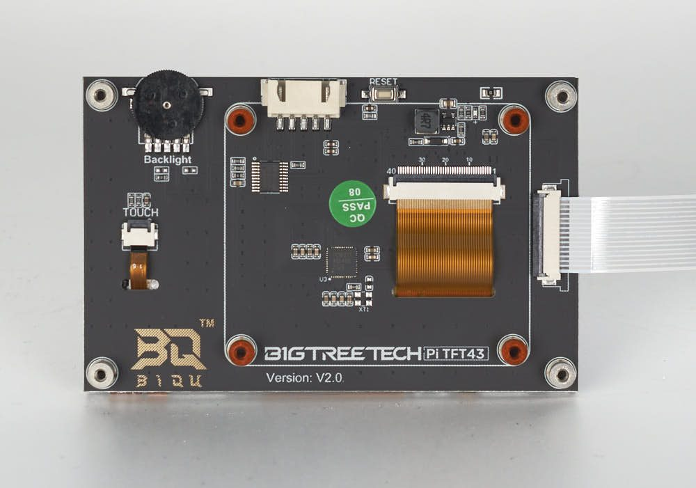

**What you're looking at:** The BTT Pi TFT43 is a 4.3" capacitive display that talks to the Raspberry Pi over one flat ribbon carrying both power and video, so there is no second cable. The photo is the back of the board: the white socket on its edge is where the ribbon seats, and the four corner holes are what the M2.5×6 screws take.

**Parts:** 4.3" capacitive DSI display ×1, FFC ribbon cable ×1, M2.5×6 screws ×4 (supplied in the BTT packaging).

**Do:** Peel the screen's protective film only from the *back*; leave the front film on until the build is finished. Seat the ribbon's **screen end** first: lift the socket's latch, slide the ribbon in with the **metal contacts facing up, blue tab at the back**, and press the latch down — once. Then seat the screen in the mount with the FFC connector at the bottom edge and its blue pull-tab facing the rear of the printer, pass the ribbon's free end out through the mount's cable slot, and fasten the four M2.5×6 screws finger-tight plus a nudge — they thread into plastic. Fold a piece of tape over the free end's bare contacts and take the module back to Ch 10 Step 10.50, which latches the Pi end.

**Check:** Screen-end latch closed evenly, ribbon square in the socket, metal to metal; the screen sits square in the faceplate aperture with an even bezel gap; the FFC exits the slot cleanly with no kink or fold at the connector.

⚠ **Rev D+ / LDO:** *"Incorrect orientation of the FFC cables can result in damage to your Raspberry Pi and/or touchscreen."* An FFC has no polarity key — the metal contacts are the only clue, and each end is latched exactly once in this build. [src](https://docs.ldomotors.com/en/guides/btt_43_rotate_guide)

Source: [LDO BTT 4.3" screen guide](https://docs.ldomotors.com/en/guides/btt_43_rotate_guide) · [LDO wiring photo PITFT43_FFC.jpg](https://raw.githubusercontent.com/MotorDynamicsLab/LDOVoron2/8270e8c/Images/WiringGuide/RevC/PITFT43_FFC.jpg)

---

### Step 11.7 — Fit the touchscreen module into the front skirt run

**What you're looking at:** The finished touchscreen module now becomes a skirt segment in its own right, filling the centre-front gap between the two front skirts. Its top rail has to line up flush with theirs or the front of the machine reads as three separate parts.

**Parts:** the TFT module built at 10.50 (11.5–11.6) — taped to the front extrusion since Ch 10, ribbon latched at both ends and proved at 12.11 — M3×8 SHCS ×3, M3 roll-in T-nut ×3.

**Do:** The BTT module occupies exactly the ring position the manual gives the mini12864 on p.220 — centre-front, between `front_skirt_a_350` and `front_skirt_b_350`. Free the module from its tape and keep the ribbon's service loop slack in your other hand — it is connected at both ends, so nothing may pull on it. Roll three M3 T-nuts into the front extrusion slot, slide the module into place between the two front skirts so the top rails line up flush, and drive three M3×8 SHCS into the T-nuts. Leave them snug so you can slide the module for final alignment once both front skirts are on.

**Check:** The module's top rail is flush and continuous with both front skirt rails; the screen is level; the gaps to `front_skirt_a` and `front_skirt_b` are equal.

⚠ **Rev D+ / LDO:** the manual's p.220 fastener is M3×12 SHCS into the mini12864 case. The BTT mount uses **M3×8 SHCS into M3 roll-in nuts** — 5 M3×8 and 3 roll-in nuts across steps 11.5 and 11.7. [src](https://github.com/MotorDynamicsLab/LDOVoronTrident/tree/master/STLs/BTT%20Pi%20TFT4.3%20Mount)

Source: [Voron manual p.220](https://github.com/VoronDesign/Voron-2/blob/de7e89d/Manual/Assembly_Manual_2.4r2.pdf#page=220) · [LDO BTT Pi TFT4.3 mount README](https://github.com/MotorDynamicsLab/LDOVoronTrident/tree/5b0496a/STLs/BTT%20Pi%20TFT4.3%20Mount)

---

### Step 11.8 — Route and connect the FFC ribbon to the Pi

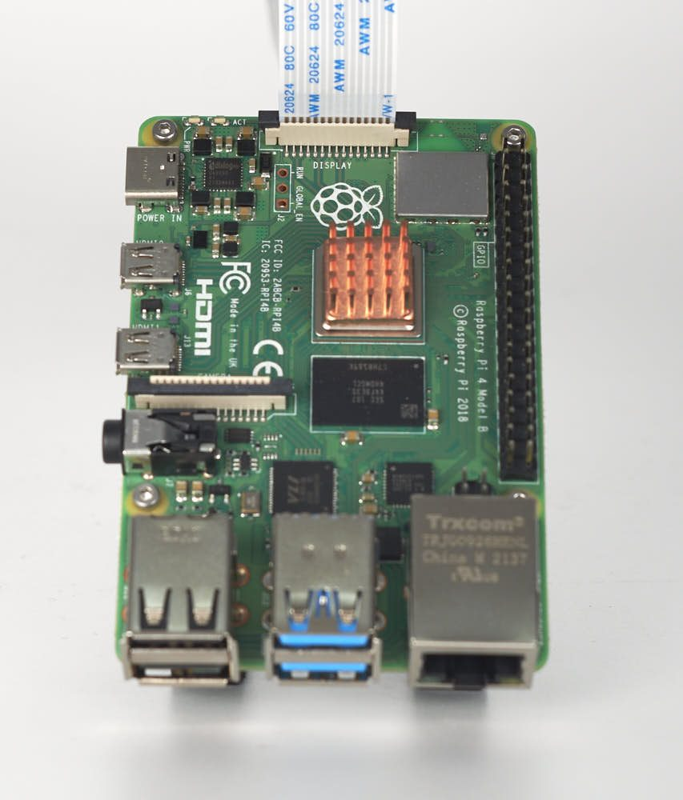

**What you're looking at:** The FFC is the one cable between screen and Pi, and it is not keyed — the bare contacts on one face are the only clue to orientation, and getting it wrong can destroy either end. It was routed and latched at both ends at Ch 10 Step 10.50, and the panel was proved at Ch 12 Step 12.11; with the module now bolted into the ring, this step is the walk along that run. The manual page shown wires two ribbon cables to an EXP1/EXP2 header this machine does not have; the LDO photo beside it is the Pi-side connector — the tie-breaker 10.50 sent you here to look at.

**Parts:** none — the FFC ribbon cable ×1 (supplied) is already in.

**Do:** The manual's p.221 wires two flat ribbon cables to EXP1/EXP2 on the controller — ignore it entirely. The single FFC carries **both data and power**, so there is no second cable, and both of its ends were latched once at 10.50 (screen end at 11.6, Pi end at the Pi's **DISPLAY** connector, metal contacts facing **forward** with the blue tab to the rear — the `RPI_DSI_FFC.jpg` photo). Follow the ribbon from the module down through the deck opening to the Pi and confirm nothing has changed: both latches still closed, a gentle service loop at each end, no tight radius, and the run clear of the front skirts you just fitted. Do **not** open a latch to look — if 12.11 showed the panel, the ribbon is right. If 10.50 had to leave the Pi end taped because the mount was not printed, connect it now exactly as 10.50 describes; the panel then gets its first look at Ch 13 Step 13.3.

**Check:** Both latches closed with the ribbon square and fully seated; no exposed contacts outside either connector; the ribbon is not pinched by the skirt or trapped against an extrusion edge.

⚠ **Rev D+ / LDO:** this is the wiring guide's *"Connecting the FFC Cable, Ethernet Cable, USB Cable and Frame PE"* step — done at 10.50 in this build, so that the one connector that can kill a Pi or a screen is latched exactly once at each end and the panel is proved with the bay still open. Screen rotation is a **Ch 12** software step, not a wiring one — Step 12.10 writes it into `/boot/firmware/cmdline.txt` (`video=DSI-1:…rotate=`) and 12.11 proves it. Do **not** use `display_lcd_rotate`: that is the legacy fake-KMS path and does nothing on MainsailOS 3.x. [src](https://docs.ldomotors.com/en/voron/voron2/wiring_guide_rev_d) · [src](https://docs.ldomotors.com/en/guides/btt_43_rotate_guide)

Source: [Voron manual p.221](https://github.com/VoronDesign/Voron-2/blob/de7e89d/Manual/Assembly_Manual_2.4r2.pdf#page=221) · [LDO wiring guide § Setting up the touch screen](https://docs.ldomotors.com/en/voron/voron2/wiring_guide_rev_d#setting-up-the-touch-screen) · [LDO BTT 4.3" screen guide](https://docs.ldomotors.com/en/guides/btt_43_rotate_guide) · [LDO wiring photo RPI_DSI_FFC.jpg](https://raw.githubusercontent.com/MotorDynamicsLab/LDOVoron2/8270e8c/Images/WiringGuide/RevC/RPI_DSI_FFC.jpg)

Pause: ~10 min since the last pause — the touchscreen module (built at 10.50) is bolted into the front of the ring, snug, and its FFC run checked end to end, latched at both ends. Do not leave an FFC half-latched — the latch is what holds the contacts.

---

### Step 11.9 — Fit the belt guards to the skirt segments

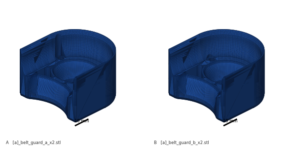

**What you're looking at:** A belt guard is the orange ring that closes the circular cut-out in a skirt segment over an idler pulley, so nothing can reach a moving belt from outside. Guards `a` and `b` are mirror images of each other — the pair render shows both so you can tell them apart before driving a screw.

**Parts:** `[a]_belt_guard_a` ×2, `[a]_belt_guard_b` ×2 (orange), M3×8 SHCS ×1 per guard (p.222 shows one; *verify on bench*).

**Do:** Three of the four corner segments are on the bench — `front_skirt_a`, `front_skirt_b`, `keystone_panel` — and get their guards now. The fourth corner is the plug panel, already on the frame since Ch 09; its guard goes on **in situ** at 11.14 (p.222). Offer a guard up to its segment from the outside so the raised boss drops into the cut-out, and drive the M3×8 SHCS through the guard into the heat-set insert you fitted at 11.2. The `a` and `b` guards are mirrored and the manual gives no per-corner assignment: dry-fit each corner before you drive anything — the boss only drops in one way round — and note which of `a`/`b` landed where, so the plug-panel corner gets the one that is left.

**Check:** Three guards fitted, none proud of the skirt's outer face, each aperture concentric with its cut-out; the fourth guard set aside for 11.14 with its corner known. The orange reads as a deliberate ring, not as a part that got forced.

Source: [Voron manual p.217](https://github.com/VoronDesign/Voron-2/blob/de7e89d/Manual/Assembly_Manual_2.4r2.pdf#page=217)

---

### Step 11.10 — Populate the keystone panel

**What you're looking at:** The keystone panel is the rear skirt segment with two rectangular cut-outs for snap-in network modules. The CAT6 keystone is the RJ45 socket that Ch 10's Ethernet run plugs into from the inside; the orange blank fills the second slot so there is no hole into the bay.

**Parts:** `keystone_panel` ×1, Keystone CAT6 insert ×1 (supplied), `[a]_keystone_blank_insert` ×1 (orange; the second is a spare).

**Do:** The panel has **two** keystone slots and the kit supplies **one** CAT6 keystone. Snap the CAT6 keystone into whichever slot suits your cable run to the Pi's Ethernet port, and snap the orange blank into the other. Both clip in from the inside face and latch — no fasteners.

**Check:** Both slots filled, both inserts flush with the outside face, neither rattling. The RJ45 opening faces out.

Tip: if you want more of the LDO logo on the machine, `ldo_bestagon_insert` snaps into any of the skirt hexagons — print extras. [src](https://github.com/MotorDynamicsLab/LDOVoron2/tree/main/STLs)

Source: [Voron manual p.217](https://github.com/VoronDesign/Voron-2/blob/de7e89d/Manual/Assembly_Manual_2.4r2.pdf#page=217) · [LDOVoron2 `STLs/`](https://github.com/MotorDynamicsLab/LDOVoron2/tree/8270e8c/STLs)

---

### Step 11.11 — Build the electronics-bay fan modules

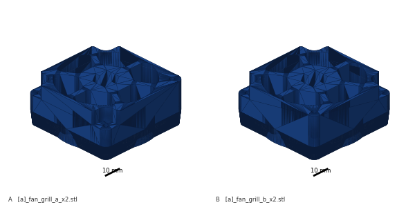

**What you're looking at:** Each `side_fan_support` has **two** fan openings, and this kit has two fans, two retainers and four grills — so **both fans go in one support**, the right-hand one (seen from the front, the PSU side, where LDO's finished-bay photos show them), and the left support's two openings get grills only. At each populated opening the stack is, from outside in: orange grill → the support wall → the retainer from 11.3, with the fan captured inside the retainer's frame (verify on bench: the retainer's inserts must sit within ~8 mm of the grill face for an M3×8 to reach them, so it is the part directly behind the wall — p.225 and p.228 show the fan behind the wall but not where the retainer sits). Grills `a` and `b` are mirrored — the pair render shows both. Both fans must blow the same way, or they cancel each other and the bay gets no airflow at all.

**Parts:** 60×60×20 mm 24 V fan ×2, `side_fan_support` ×2, `[a]_fan_grill_a` ×2 / `[a]_fan_grill_b` ×2 (orange), `[a]_fan_grill_retainer` ×2 (from 11.3), M3×8 SHCS ×4 per fan (8 total).

**Do:** Take the support that will go on the **right-hand** side. At each of its two openings: seat a fan inside a retainer's frame, hold the retainer against the inside of the support wall with the fan's leads toward the bay, put the matching grill on the outside, and drive four M3×8 SHCS from outside through the grill and the support wall into the retainer's inserts. The screw never passes through the fan — an M3×8 cannot span a 20 mm fan body; the retainer's frame is what holds the fan. Set both fans to the **same** airflow direction, arrows on the frame edges pointing **into** the bay, so the grills filter the intake air (the manual gives no direction — p.225's exploded view shows none — and blowing in is the common choice; if you prefer both extracting, keep them matched). Leave the fan leads long enough to reach the 3×2 splicer PCB, and do not cut them yet. The second support is the **left-hand** one: it gets the two remaining grills as blanks and no retainer *(verify on bench — with no retainer behind them the blank grills need their own fixing, an M3 nut behind the wall or a short screw into the support if it has bosses; the manual does not show a blank grill)*.

**Check:** Two fans in the right-hand support, each spinning freely with no blade rubbing on a grill, screws snug but the fan bodies not crushed, both airflow arrows pointing into the bay. Left-hand support: two grills over empty openings, no fan.

⚠ **Rev D+ / LDO:** the kit contains **two** 60×20 fans, **two** retainers, **four** grills and **one** 3×2 splicer PCB. The manual illustrates the side-skirt and fan work twice (p.226–228 and p.229–231, from outside and from inside the bay) and draws fans in both supports — count the fans you have, not the illustrations. LDO's Rev D bay photos (S1, S4, S6) put both fans beside the PSU. [src](https://docs.ldomotors.com/en/voron/voron2/350_BOM/Rev_D) · [src](https://docs.ldomotors.com/en/voron/voron2/wiring_guide_rev_d#connecting-the-fans-and-the-led-strip)

Tip: `[a]_fan_grill_open_optional_x2` is an alternate grill with more open area and less filtering, if the bay runs warm. [src](https://github.com/VoronDesign/Voron-2/tree/Voron2.4/STLs/Skirts)

Source: [Voron manual p.225](https://github.com/VoronDesign/Voron-2/blob/de7e89d/Manual/Assembly_Manual_2.4r2.pdf#page=225) · [Voron manual p.228](https://github.com/VoronDesign/Voron-2/blob/de7e89d/Manual/Assembly_Manual_2.4r2.pdf#page=228) · [LDO Rev D 350 BOM](https://docs.ldomotors.com/en/voron/voron2/350_BOM/Rev_D) · [Voron-2 `STLs/Skirts/`](https://github.com/VoronDesign/Voron-2/tree/de7e89d/STLs/Skirts)

---

### Step 11.12 — Pre-load the skirt T-nuts

**What you're looking at:** A [roll-in T-nut](16-glossary.md#r) drops into an extrusion slot and rotates a quarter turn to lock, so it can be added after a frame is built. Loading all of them before any skirt goes on matters because once a segment covers the slot you can no longer get a nut into it.

**Parts:** M3 roll-in T-nut ×12 — front extrusion ×4 (p.218), rear ×4 (p.222), each side ×2 (p.226, p.229); M5 roll-in T-nut ×2 — one per side (p.226, p.229). The TFT mount's three M3 T-nuts went in at 11.7.

**Do:** Roll every T-nut the skirt ring needs into the frame extrusions **before** you offer any segment up. Work around the perimeter: M3 T-nuts at each skirt-to-frame screw position and M5 T-nuts where p.226/p.229 show the larger M5×10 BHCS — the M5 sits between the two M3 on each side, under the fan support. Slide each one roughly to position and leave it loose. LDO warns that extrusion and roll-in T-nut tolerances on these kits are tight — test-fit or pre-load rather than fighting a nut with a skirt in the way.

**Check:** Every T-nut sits flat in its slot and slides with light finger pressure. None jammed, none dropped inside a closed extrusion end.

⚠ **Rev D+ / LDO:** *"Due to the tight tolerances of the extrusions and roll-in t-nuts it is advisable to either test fit before assembly to identify the sides of the extrusions that fits the best or to pre-load the t-nuts into the extrusions."* [src](https://docs.ldomotors.com/voron/voron2/build-faq)

Source: [Voron manual p.218](https://github.com/VoronDesign/Voron-2/blob/de7e89d/Manual/Assembly_Manual_2.4r2.pdf#page=218) · [Voron manual p.226](https://github.com/VoronDesign/Voron-2/blob/de7e89d/Manual/Assembly_Manual_2.4r2.pdf#page=226) · [Voron manual p.229](https://github.com/VoronDesign/Voron-2/blob/de7e89d/Manual/Assembly_Manual_2.4r2.pdf#page=229) · [LDO Build Notes p.218](https://docs.ldomotors.com/voron/voron2/build-faq#build-notes) · [Video: Part 5 @4:24:04](https://www.youtube.com/watch?v=hTKCBrk36R0&list=PL0fUJbigELQPqpeGOgHYisG4KaSXVtnNY&t=15844s)

Pause: ~15 min since the last pause — three belt guards on their segments (the fourth waits for the plug panel at 11.14), keystone panel populated, the right-hand fan support built with both fans and the left one blanked, and every skirt T-nut pre-loaded in the right slot. The ring is still off the machine.

---

### Step 11.13 — Mount the front skirt segments

**What you're looking at:** The front run is the most-looked-at part of a finished Voron: skirt, touchscreen module, skirt, reading as one continuous band. Snugging first and only then closing the joints is what makes the two seams disappear.

**Parts:** `front_skirt_a_350` ×1, `front_skirt_b_350` ×1, M3×8 SHCS *(verify on bench)*.

**Do:** Hang each front skirt on its pre-loaded T-nuts with the belt-guard aperture over the front idler, then drive the M3×8 SHCS up from underneath. Bring both up snug, then loosen them a quarter turn, push both skirts hard against the TFT module to close the joints, and tighten.

**Check:** Front run reads as one continuous band: skirt–module–skirt with equal, tight joints and a flush top rail. No daylight at the front idler apertures.

Source: [Voron manual p.219](https://github.com/VoronDesign/Voron-2/blob/de7e89d/Manual/Assembly_Manual_2.4r2.pdf#page=219)

---

### Step 11.14 — Mount the rear skirt run

**What you're looking at:** The rear run has three segments and one of them — the `power_inlet_IECGS_1mm` panel carrying the AC inlet — has been on the machine since Ch 09 and was wired in Ch 10, so it never moves. p.222 is not a segment: it shows the last belt guard going onto that already-mounted plug panel, plus the four M3 T-nuts for the other two segments. The pages are drawn from the **rear**, plug panel on the image-left — that is the printer's right; LDO's bay puts the panel on the printer's left. Follow the panel that is on your frame, not the picture's side.

**Parts:** the fourth belt guard from 11.9 + M3×8 SHCS ×1 (p.222), `keystone_panel` ×1 (from 11.10, guard already on), `rear_center_skirt_350` ×1, the already-fitted `power_inlet_IECGS_1mm` segment, M3×8 SHCS ×4 into the four M3 T-nuts pre-loaded at 11.12.

**Do:** First the plug panel's belt guard, in situ: offer it up from outside over the panel's cut-out and drive one M3×8 SHCS into the panel's insert (p.222, top). Then `keystone_panel` into the **far** rear corner (p.223), then `rear_center_skirt_350` into the gap between them (p.224) — it is the middle segment, the one with no belt-guard cut-out. Feed the Ethernet run through the CAT6 keystone before you close the last joint. Snug everything, push the joints closed, then tighten.

**Check:** Rear run continuous and flush, plug panel – centre – keystone; all four guards now on; the AC switch is reachable and moves freely; the RJ45 keystone is square in its slot; nothing is pinching the Ethernet or AC leads behind the ring.

⚠ **Rev D+ / LDO:** the inlet segment is `power_inlet_IECGS_1mm` — the 1.0 mm AC inlet with the integrated switch. The 1.2 mm variants and `power_inlet_filtered` are wrong for this kit. [src](https://docs.ldomotors.com/voron/voron2/build-faq)

Source: [Voron manual p.222–224](https://github.com/VoronDesign/Voron-2/blob/de7e89d/Manual/Assembly_Manual_2.4r2.pdf#page=222) · [LDO Build Notes p.222–224](https://docs.ldomotors.com/voron/voron2/build-faq#build-notes) · [Video: Part 6 @1:39:57](https://www.youtube.com/watch?v=8pWoYkY1DiA&list=PL0fUJbigELQPqpeGOgHYisG4KaSXVtnNY&t=5997s)

---

### Step 11.15 — Mount the first side skirt run

**What you're looking at:** Each side run is three segments: `side_skirt_a` at the front, the fan support in the middle, `side_skirt_b` at the rear. The two skirts go on first and stay loose, because the fan support has to drop into the gap they leave. Start with the **right-hand** side (seen from the front) — the side that takes the support with both fans in it.

**Parts:** `side_skirt_a_350` ×1, `side_skirt_b_350` ×1, M3×8 SHCS ×2 — the right-hand fan support from 11.11 (two fans) waits for 11.16.

**Do:** On the right-hand side, fit `side_skirt_a` at the front end and `side_skirt_b` at the rear, leaving the fan-support gap between them. Drive the M3×8 SHCS into the pre-loaded M3 T-nuts (p.227, top). The M5 T-nut between them stays **empty** — it is the fan support's, at 11.16. Keep everything snug, not tight — the fan module has to drop into the remaining gap next.

**Check:** Both side segments hang parallel to the extrusion with the top rails level with the front and rear runs; the gap left for the fan module matches the module's width.

Source: [Voron manual p.226](https://github.com/VoronDesign/Voron-2/blob/de7e89d/Manual/Assembly_Manual_2.4r2.pdf#page=226) · [Voron manual p.227](https://github.com/VoronDesign/Voron-2/blob/de7e89d/Manual/Assembly_Manual_2.4r2.pdf#page=227)

---

### Step 11.16 — Drop in the fan module and close the side run

**What you're looking at:** The right-hand fan support from 11.11 — both fans in it — is the middle segment of the side run, and it is trapped rather than screwed at its ends — pushing the two skirts against it is what closes both joints. Only then does the whole run get tightened.

**Parts:** the right-hand fan support from 11.11, M5×10 BHCS ×1.

**Do:** Slide the support into the gap from outside so its top rail lands on the extrusion and the grills face out, with both fan leads led into the bay toward the splicer PCB. Push the two side skirts against it to close both joints, then drive the M5×10 BHCS up into the M5 T-nut from underneath (p.230, lower right). Now go back and tighten every screw on this side run.

**Check:** The whole side reads as one band with flush joints; both fans spin freely with the support clamped; no lead trapped between the support and the extrusion.

Source: [Voron manual p.227](https://github.com/VoronDesign/Voron-2/blob/de7e89d/Manual/Assembly_Manual_2.4r2.pdf#page=227) · [Voron manual p.230](https://github.com/VoronDesign/Voron-2/blob/de7e89d/Manual/Assembly_Manual_2.4r2.pdf#page=230)

---

### Step 11.17 — Mount the second side skirt run

**What you're looking at:** The same three-segment run on the **left-hand** side, shown from the other side of the bay. Its middle segment is the second `side_fan_support` — no fans in it, just the two blank grills from 11.11. When it closes, the skirt ring is continuous the whole way round the machine.

**Parts:** `side_skirt_a_350` ×1, `side_skirt_b_350` ×1, the left-hand `side_fan_support` with its two blank grills, M3×8 SHCS ×2, M5×10 BHCS ×1.

**Do:** Repeat 11.15 and 11.16 on the left-hand side with the blanked support. The manual shows this run from the other side of the bay (p.229 for the T-nuts, p.230 for the fasteners) and draws fans in it; yours has none — the operation is otherwise identical.

**Check:** The ring is closed all the way round: front, both sides, rear. Every joint tight, every top rail flush, the machine reads as one continuous band from any angle. Two fans on the right, two blank grills on the left.

Source: [Voron manual p.229](https://github.com/VoronDesign/Voron-2/blob/de7e89d/Manual/Assembly_Manual_2.4r2.pdf#page=229) · [Voron manual p.230](https://github.com/VoronDesign/Voron-2/blob/de7e89d/Manual/Assembly_Manual_2.4r2.pdf#page=230)

Pause: ~20 min since the last pause — front, rear and both side skirt runs mounted, both bay fans trapped in the right-hand run, the left run blanked. The ring is complete all the way round; no run is half-fastened.

---

### Step 11.18 — Verify the bay-fan wiring

**What you're looking at:** The two manual pages describe a BTT Octopus controller this kit does not have, so neither applies. What you are confirming instead is Ch 10's wiring: both fans on one 3×2 splicer PCB, that PCB standing on its printed spacer so its underside cannot short against the aluminium, and the run landing on the Leviathan's `FAN2` port.

**Parts:** 3×2 XH splicer PCB ×1, its printed spacer (supplied printed by LDO).

**Do:** Do not follow p.228's wire-and-solder sketch or p.231's controller diagram — both describe an Octopus-class board this kit does not have. Confirm the Ch 10 wiring instead: the two 60×20 fans are joined at the 3×2 XH splicer PCB, the splicer PCB is mounted on its **printed spacer** so it cannot short against the extrusion, and the resulting run is labelled **PCB FAN** and lands on the Leviathan at **FAN2 / PF7**. Dress the leads into the duct and zip-tie them clear of the fan blades.

**Check:** Both fans on one splicer; splicer on its spacer, not touching aluminium; PCB FAN plugged into FAN2/PF7; no lead within reach of a blade.

⚠ **Rev D+ / LDO:** fan map for this build — PCB fan → `FAN2/PF7`; LED strip → `LED-Strip/PE6`; filter fan → `FAN3/PF9`. *"Please remember to mount 3x2 splicing PCBs using the printed part to prevent a short with the extrusion."* [src](https://docs.ldomotors.com/en/voron/voron2/wiring_guide_rev_d)

Source: [Voron manual p.228](https://github.com/VoronDesign/Voron-2/blob/de7e89d/Manual/Assembly_Manual_2.4r2.pdf#page=228) · [Voron manual p.231](https://github.com/VoronDesign/Voron-2/blob/de7e89d/Manual/Assembly_Manual_2.4r2.pdf#page=231) · [LDO wiring guide § Connecting the fans and the LED strip](https://docs.ldomotors.com/en/voron/voron2/wiring_guide_rev_d#connecting-the-fans-and-the-led-strip)

---

### Step 11.19 — Fit the bestagon insert (optional)

(no image — see [LDO STLs README](https://github.com/MotorDynamicsLab/LDOVoron2/tree/main/STLs))

**What you're looking at:** The bestagon insert is a purely cosmetic orange plug that snaps into one of the hexagonal openings in a skirt segment. Nothing depends on it.

**Parts:** `ldo_bestagon_insert` ×1 (orange), or as many as you printed.

**Do:** Push the insert into one of the skirt hexagons from the outside until it snaps. Pick a hexagon on the front-left or front-right skirt where it reads without competing with the touchscreen.

**Check:** Insert flush and retained; the hexagon is not stressed white at the corners.

Source: [LDOVoron2 `STLs/`](https://github.com/MotorDynamicsLab/LDOVoron2/tree/8270e8c/STLs)

---

### Step 11.20 — VHB the bottom-panel clips and hinges

**What you're looking at:** 3M VHB is a double-sided acrylic foam tape that reaches most of its strength within an hour and does not come off again. These six printed parts — four clips and two hinges — are what the bottom panel bonds to, so a pad placed off-centre is placed off-centre for good.

**Parts:** `bottom_panel_clip_x4` ×4, `bottom_panel_hinge_x2` ×2, 3M VHB tape ×6 pads.

**Do:** Put the printer on its side, as in Ch 10 Step 10.1 — the next step bonds a 469 mm panel to six pads from below and then swings it, and on its feet there is no room for either. Wipe the pad face of all six printed parts with IPA and let it flash off. Cut six VHB pads to match the flat pad on each part, press one onto each, and leave the release liner on. VHB reaches most of its strength in the first hour and is effectively permanent — get the pad centred on the pad face the first time.

**Check:** Six parts, six pads, each centred with no overhang onto a curved face, liners still on.

Source: [Voron manual p.232](https://github.com/VoronDesign/Voron-2/blob/de7e89d/Manual/Assembly_Manual_2.4r2.pdf#page=232)

---

### Step 11.21 — Fit the bottom panel

**What you're looking at:** The bottom panel is the 4 mm black acrylic floor that closes the electronics bay from underneath — and it is a **door**, not a lid. VHB-bonded to the two hinges on the rear extrusion and held by the four snap clips around the front and sides (p.232–233), it unclips at the front and swings down on the hinges, so the bay stays reachable with a meter through Ch 13 while the duct covers stay off (Ch 10 Step 10.71). It is easy to confuse with the 3 mm deck panel above it, which is the same 469 × 469 outline — calipers settle it.

**Parts:** bottom panel (acrylic, black, 469×469×**4 mm**) ×1, the six taped parts from 11.20, M3×8 SHCS ×6, M3 T-nut ×6 *(p.233 draws the screws straight into the extrusion — one nut per screw, verify on bench)*.

**Do:** Screw all six parts to the bottom frame extrusions in the positions p.233 shows — the two **hinges on the rear** extrusion, the four **clips** around the front and sides — with one M3×8 SHCS each into a T-nut. Peel the protective film off both faces of the bottom panel. Pull the release liners, offer the panel up square with the hinge edge at the rear, and press it home onto the VHB pads with firm even pressure across each pad. Leave it closed while the VHB cures.

**Check:** Panel square to the frame with equal margins; no rock; every pad bonded with no visible gap. Once the VHB has had its hour, and with the machine still on its side (or lifted onto blocks — the feet leave no room): release the front clips and swing the panel down on its hinges once — it must clear the skirt ring and every duct must still be reachable — then close it again. The bay is closed from below, but nothing is on the wrong side of it.

⚠ **Rev D+ / LDO:** the bottom panel is the **4 mm** acrylic, not the 3 mm deck panel. If you are holding a 469×469 panel and cannot tell which is which, caliper it — 3 mm is the deck (fitted back in Ch 02), 4 mm is this one. [src](https://docs.ldomotors.com/en/voron/voron2/350_BOM/Rev_D)

Source: [Voron manual p.232](https://github.com/VoronDesign/Voron-2/blob/de7e89d/Manual/Assembly_Manual_2.4r2.pdf#page=232) · [Voron manual p.233](https://github.com/VoronDesign/Voron-2/blob/de7e89d/Manual/Assembly_Manual_2.4r2.pdf#page=233) · [LDO Rev D 350 BOM](https://docs.ldomotors.com/en/voron/voron2/350_BOM/Rev_D)

Pause: ~20 min since the last pause — bay-fan wiring verified against Ch 10, bestagon insert decided, VHB pads pressed and the bottom panel hung on its rear hinges and front clips. **Leave the VHB to cure undisturbed** — do not swing the door open until it has; do not press a pad and walk away before the panel is on it.

---

### Step 11.22 — Choose the Z belt cover variant

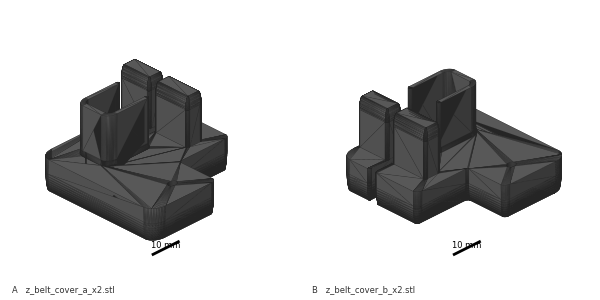

**What you're looking at:** A Z belt cover is a small printed shroud that clips over each of the four Z belts where they pass a frame corner, so nothing can be drawn into the belt. LDO publishes an alternate `_a_led` version with a cable slot for builders who routed the chamber LED wiring through a Z-motor opening; the Ch 10 route used the extrusion slot instead, so the stock covers are the ones you fitted for.

**Parts:** `z_belt_cover_a_x2` ×2 and `z_belt_cover_b_x2` ×2 — **or** LDO's `z_belt_cover_a_led` in place of `z_belt_cover_a`.

**Do:** Look at how you routed the chamber LED wiring in Ch 10. If any LED wire passes through a **Z-motor opening**, that corner needs LDO's `z_belt_cover_a_led`, which leaves a slot for the cable; the stock cover will pinch it. If your LED runs went another way, use the stock covers. Print the LED variant now if you need it — it is a 7 g, 25-minute part.

**Check:** You can state, per corner, which cover goes on and why. No cable crosses a stock cover's sealing face.

⚠ **Rev D+ / LDO:** *"PAGE 234 Use the alternate Z-belt cover if you routed the LED wires through the Z-motor opening."* [src](https://docs.ldomotors.com/voron/voron2/build-faq) · [part](https://github.com/MotorDynamicsLab/LDOVoron2/blob/main/STLs/z_belt_cover_a_led.stl)

Source: [Voron manual p.234](https://github.com/VoronDesign/Voron-2/blob/de7e89d/Manual/Assembly_Manual_2.4r2.pdf#page=234) · [LDO Build Notes p.234](https://docs.ldomotors.com/voron/voron2/build-faq#build-notes) · [LDOVoron2 `z_belt_cover_a_led.stl`](https://github.com/MotorDynamicsLab/LDOVoron2/tree/8270e8c/STLs/z_belt_cover_a_led.stl)

---

### Step 11.23 — Load each cover with a hammerhead nut

**What you're looking at:** A [hammerhead T-nut](16-glossary.md#h) drops straight into an extrusion slot from the face rather than rolling in from an end, then rotates a quarter turn under load to lock. Starting the screw a couple of turns keeps the nut captive in the cover's recess while still letting it turn.

**Parts:** Z belt covers ×4, M3 hammerhead T-nut ×4, M3×6 BHCS ×4.

**Do:** Drop an M3 hammerhead nut into the recess on the back of each cover and start an M3×6 BHCS into it from the front — two or three turns only, so the nut is captive but still free to rotate. All four covers get the same treatment.

**Check:** Nut captive, screw started, nut still able to turn. The screw head sits proud enough that you can still reach it with a 2 mm hex once the cover is on.

Source: [Voron manual p.234](https://github.com/VoronDesign/Voron-2/blob/de7e89d/Manual/Assembly_Manual_2.4r2.pdf#page=234)

---

### Step 11.24 — Fit the first Z belt cover

**What you're looking at:** The cover has to go on with the belt already threaded through its slot, which is why the belt is pinched flat first. The click you are feeling for is the hammerhead nut rotating and biting inside the extrusion channel — if it just spins, it went in crooked.

**Parts:** one loaded cover from 11.23.

**Do:** Pinch the Z belt loop flat between finger and thumb and slide the cover in so the belt passes through the cover's slot and the hammerhead nut enters the extrusion channel. Hold the cover square against the extrusion and tighten the M3×6 BHCS — the hammerhead rotates a quarter turn and locks. If it spins instead of locking, back the screw off, re-seat the nut squarely in the channel and try again; do not force it.

**Check:** Cover flat against the extrusion, not cocked; the Z belt runs through it freely with no rub; the cover does not move when you push it.

Source: [Voron manual p.235](https://github.com/VoronDesign/Voron-2/blob/de7e89d/Manual/Assembly_Manual_2.4r2.pdf#page=235)

---

### Step 11.25 — Fit the remaining three Z belt covers

**What you're looking at:** The remaining three corners are identical. The full-travel run afterwards is the real test: a cover that touches a belt makes noise now and cuts the belt edge over months.

**Parts:** the three remaining loaded covers.

**Do:** Repeat 11.24 at the other three Z belt corners. Then run the gantry up and down its full travel by hand and watch each cover — a cover that touches the belt makes noise and eventually cuts the belt edge.

**Check:** Four covers on, all four belts running clear, no rubbing anywhere in the full Z travel. (p.237 is a page of Voron history — nothing to build.)

Source: [Voron manual p.236](https://github.com/VoronDesign/Voron-2/blob/de7e89d/Manual/Assembly_Manual_2.4r2.pdf#page=236) · [Voron manual p.237](https://github.com/VoronDesign/Voron-2/blob/de7e89d/Manual/Assembly_Manual_2.4r2.pdf#page=237)

Pause: ~15 min since the last pause — all four Z belt covers on, each with its hammerhead nut, and the gantry runs its full Z travel without touching one.

---

### Step 11.26 — Break out the Nevermore printed supports

(no image — see [LDO Nevermore V5 Duo guide](https://ldomotion.com/guides/nevermore-v5-duo---v24))

**What you're looking at:** The [Nevermore](16-glossary.md#n) is a recirculating activated-carbon filter that sits inside the chamber and scrubs the fumes ASA gives off, rather than venting them. Four printed parts make it: a plenum that holds two blower fans, its lid, and a magnetically attached cartridge with its own lid that carries the carbon. Each carries a printed support designed to snap out at the interface.

**Parts:** `V2_Duo_Plenum`, `V2_Duo_Plenum_LID`, `Regular_Cartridge`, `Regular_Cartridge_Lid`.

**Do:** The cartridge and the plenum each carry a built-in printed support. Push them out — they are designed to break at the interface. Do not cut them out with a knife.

**Check:** Both supports removed cleanly, no torn layers on the sealing faces, the cartridge lid slides freely in the cartridge grooves.

⚠ **Rev D+ / LDO:** you are building the **Regular** cartridge, not the XL — the XL wants a larger carbon charge and a faster, louder fan. [src](https://github.com/nevermore3d/Nevermore_Micro)

Source: [LDO Nevermore V5 Duo guide § Preparation](https://ldomotion.com/guides/nevermore-v5-duo---v24) · [Nevermore Micro repo](https://github.com/nevermore3d/Nevermore_Micro/tree/8740b34)

---

### Step 11.27 — Modify both 5015 fan enclosures

(no image — see [LDO Nevermore guide § Preparation](https://ldomotion.com/guides/nevermore-v5-duo---v24))

**What you're looking at:** A 5015 blower is a 50 × 15 mm squirrel-cage fan — it makes pressure rather than free-air flow, which is what pushes chamber air through packed carbon. Both housings have to be opened and a section of plastic removed so they fit the plenum.

**Parts:** 5015 fan ×2 (supplied in the kit's Nevermore bag).

**Do:** Pry the tabs that hold each fan's enclosure together and separate it. With wire snips, carefully remove the section of plastic the guide highlights from each fan housing. Repeat for both fans. **Be very careful if you reach for a box cutter or blade here** — snips are the safer tool and the guide says so explicitly.

**Check:** Both fans modified identically, impellers still spin freely, no cracked housing, no swarf left inside the scroll.

Source: [LDO Nevermore V5 Duo guide § Preparation](https://ldomotion.com/guides/nevermore-v5-duo---v24) · [Video: Extras! @2:30:00](https://www.youtube.com/watch?v=0aPi1rBwDC0&list=PL0fUJbigELQPqpeGOgHYisG4KaSXVtnNY&t=9000s)

---

### Step 11.28 — Heat-set the Nevermore parts

(no image — see [LDO Nevermore guide § Preparation](https://ldomotion.com/guides/nevermore-v5-duo---v24))

**What you're looking at:** Six inserts, three destinations: four in the fan mounting holes, one in the plenum for its lid screw, one in the cartridge for its lid screw. Nothing else on the Nevermore takes a threaded fastener.

**Parts:** M3×5×4 heat-set inserts ×6.

**Do:** Four inserts go into the **fan mounting holes**, one into the **plenum**, one into the **cartridge**. Six total.

**Check:** All six flush and square; an M3 screw starts freely in each.

Source: [LDO Nevermore V5 Duo guide § Preparation](https://ldomotion.com/guides/nevermore-v5-duo---v24) · [Video: Extras! @2:24:31](https://www.youtube.com/watch?v=0aPi1rBwDC0&list=PL0fUJbigELQPqpeGOgHYisG4KaSXVtnNY&t=8671s)

---

### Step 11.29 — Cut the connector off the long-wire fan

(no image — see [LDO Nevermore guide § Preparation](https://ldomotion.com/guides/nevermore-v5-duo---v24))

**What you're looking at:** The fan with the longer lead has its plug cut off so both fans can be soldered to the bridge PCB — a small board that parallels the two fans onto one lead. The cut-off pigtail is the only connector in the kit that mates with the `FILTER FAN` extension, so it gets soldered back on at 11.33.

**Parts:** the 5015 fan with the longer lead.

**Do:** Cut the JST connector off the longer-leaded fan. **Keep the connector pigtail** — it gets soldered back onto the bridge PCB at 11.33 and is the only thing that will mate with the kit's "FILTER FAN" extension.

**Check:** Connector cut free and set aside somewhere you will not lose it; both fan leads still long enough to route through the plenum.

Source: [LDO Nevermore V5 Duo guide § Preparation](https://ldomotion.com/guides/nevermore-v5-duo---v24)

Pause: ~15 min since the last pause — Nevermore supports broken off, both 5015 enclosures trimmed, inserts melted, and the long-wire fan's connector cut off with the leads tinned. Nothing is glued and nothing is soldered to the bridge PCB yet.

---

### Step 11.30 — Fit the first fan into the plenum

(no image — see [LDO Nevermore guide § Install Fans](https://ldomotion.com/guides/nevermore-v5-duo---v24))

**What you're looking at:** The plenum's wire channel is a moulded groove that carries both fans' leads to one corner. Routing the wire before seating the fan is the only order that works — once the fan is in, the channel is behind it.

**Parts:** the cut-lead fan from 11.29, plenum.

**Do:** Route the fan's wires from the **right** side of the plenum, right to left along the wire channel, using tweezers. Then seat the fan into the **right** side of the plenum and pull the wire through so it lies flat in the channel.

**Check:** Fan seated fully with the impeller clear of the plenum wall; wire flat in the channel, not crossing the fan aperture.

Source: [LDO Nevermore V5 Duo guide § Install Fans](https://ldomotion.com/guides/nevermore-v5-duo---v24)

---

### Step 11.31 — Fit the second fan and trim the leads

(no image — see [LDO Nevermore guide § Install Fans](https://ldomotion.com/guides/nevermore-v5-duo---v24))

**What you're looking at:** The second fan mirrors the first. Cutting all four wire ends to the same 30–40 mm now is what makes the bridge-PCB soldering at 11.33 tidy, and it also fixes the plenum's mounting position later.

**Parts:** the second 5015 fan.

**Do:** Route its wires from the **left** side of the plenum, right to left, and seat the fan in the left side. Now cut both fans' wires to equal length, roughly **30–40 mm** proud of the enclosure.

**Check:** Both fans seated, all four wire ends the same length at 30–40 mm, both impellers spin freely.

Source: [LDO Nevermore V5 Duo guide § Install Fans](https://ldomotion.com/guides/nevermore-v5-duo---v24)

---

### Step 11.32 — Bolt the fans to the plenum

(no image — see [LDO Nevermore guide § Install Fans](https://ldomotion.com/guides/nevermore-v5-duo---v24))

**What you're looking at:** The M3×16 BHCS pass through the fan bodies into the heat-sets from 11.28. A 5015 housing is thin plastic and will distort if these are cranked, which shows up as the impeller rubbing.

**Parts:** M3×16 BHCS ×4.

**Do:** Drive the four M3×16 BHCS into the fan heat-sets from 11.28. Snug — a 5015 housing distorts and the impeller rubs if you crank them.

**Check:** Both fans held with no rock; spin each impeller by hand and listen for rub.

Source: [LDO Nevermore V5 Duo guide § Install Fans](https://ldomotion.com/guides/nevermore-v5-duo---v24)

---

### Step 11.33 — Solder the fans to the bridge PCB

(no image — see [LDO Nevermore guide § Install Fans](https://ldomotion.com/guides/nevermore-v5-duo---v24))

**What you're looking at:** The bridge PCB is a small board that joins both fans and the saved pigtail into one 24 V pair — red to the top pads, black to the bottom. The meter check afterwards is not optional: a solder bridge here puts a dead short across the mainboard's 24 V fan output.

**Parts:** bridge PCB ×1, the connector pigtail saved at 11.29.

**Do:** Solder both fans' wires and the pigtail to the bridge PCB — **red (positive) to the top pads, black (negative) to the bottom**. Arrange the wires as the guide's photo shows so the finished PCB tucks into its compartment. Then **check with a multimeter that there is no short between positive and negative.**

**Check:** Continuity reads open between + and −; all six joints shiny and mechanically sound; PCB sits in its compartment without pressing on a wire.

⚠ A bad solder here shorts a 24 V rail. LDO: *"A bad solder will result in permanently damaging the controller board."* Do the meter check before anything gets plugged in. [src](https://ldomotion.com/guides/nevermore-v5-duo---v24)

Source: [LDO Nevermore V5 Duo guide § Install Fans](https://ldomotion.com/guides/nevermore-v5-duo---v24) · [Video: Extras! @2:36:20](https://www.youtube.com/watch?v=0aPi1rBwDC0&list=PL0fUJbigELQPqpeGOgHYisG4KaSXVtnNY&t=9380s)

Pause: ~20 min since the last pause — both fans seated in the plenum, leads trimmed to length and soldered to the bridge PCB, and the pair metered for a short. The plenum is open and unglued.

---

### Step 11.34 — Glue the plenum magnets

(no image — see [LDO Nevermore guide § Nevermore Assembly](https://ldomotion.com/guides/nevermore-v5-duo---v24))

**What you're looking at:** The plenum and cartridge hold together on magnets rather than screws, so the cartridge can be pulled off to recharge the carbon. Every magnet in the plenum must go in with the same pole facing out, otherwise half of them will repel the cartridge.

**Parts:** 6×3 mm neodymium magnets, super glue.

**Do:** Drop a spot of super glue into each magnet pocket in the plenum and press a magnet in, one at a time, **all with the same pole facing out**. Press each fully home so none stands proud — a proud magnet wears against its opposite number every time the cartridge comes off.

**Check:** All plenum magnets flush, same polarity across the set (a spare magnet is attracted to every one of them the same way).

Source: [LDO Nevermore V5 Duo guide § Nevermore Assembly](https://ldomotion.com/guides/nevermore-v5-duo---v24) · [Video: Extras! @2:59:56](https://www.youtube.com/watch?v=0aPi1rBwDC0&list=PL0fUJbigELQPqpeGOgHYisG4KaSXVtnNY&t=10796s)

---

### Step 11.35 — Close the plenum lid

(no image — see [LDO Nevermore guide § Nevermore Assembly](https://ldomotion.com/guides/nevermore-v5-duo---v24))

**What you're looking at:** The lid slides into grooves in the plenum body and one screw holds it. It closes the fan compartment so the blowers push air through the cartridge rather than straight back out.

**Parts:** `V2_Duo_Plenum_LID`, M3×6 BHCS ×1 (optional second M3×4 BHCS for symmetry).

**Do:** Slide the lid into the plenum body's grooves and secure with the M3×6 BHCS into the plenum heat-set. Add the optional M3×4 on the other side if you want it to look symmetric.

**Check:** Lid fully home in both grooves, screw snug, no wire pinched at the lid edge.

Source: [LDO Nevermore V5 Duo guide § Nevermore Assembly](https://ldomotion.com/guides/nevermore-v5-duo---v24)

---

### Step 11.36 — Glue the cartridge magnets to match

(no image — see [LDO Nevermore guide § Cartridge Assembly](https://ldomotion.com/guides/nevermore-v5-duo---v24))

**What you're looking at:** This is the matching half of 11.34, and the reason for the marker: a magnet's polarity is invisible once it is glued in. Stick each one to the finished plenum first, mark the exposed face, and glue it that way round.

**Parts:** 6×3 mm neodymium magnets, super glue, a marker.

**Do:** Before gluing, stick each magnet to the assembled plenum, mark the exposed face with the marker, and keep that orientation. Then glue them into the cartridge pockets one at a time, marked face out. Get this backwards and the cartridge repels instead of latching, and you are digging glued magnets out of a printed part.

**Check:** Cartridge offers up to the plenum and snaps home; it holds against a firm shake; all magnets flush.

Source: [LDO Nevermore V5 Duo guide § Cartridge Assembly](https://ldomotion.com/guides/nevermore-v5-duo---v24)

---

### Step 11.37 — Fill and close the cartridge

(no image — see [LDO Nevermore guide § Cartridge Assembly](https://ldomotion.com/guides/nevermore-v5-duo---v24))

**What you're looking at:** The cartridge is the removable box that holds the activated carbon — acid-free pellets, which are not in the kit. An empty cartridge still has to be fitted and closed, because without it the plenum has no path to push air through and simply stirs the chamber.

**Parts:** `Regular_Cartridge_Lid`, M3×6 BHCS ×1, activated carbon pellets — **not supplied**.

**Do:** Fill the cartridge with acid-free activated carbon pellets, then slide the lid into its grooves and secure with the M3×6 BHCS into the cartridge heat-set.

**Check:** Cartridge full but not packed so tight that airflow stops; lid home; no pellets loose in the grooves.

⚠ **Media not in the kit.** LDO: *"NOT INCLUDED WITH THE KIT"*, and acid-free pellets are specified. Nevermore media is on the deferred list for this build (`CLAUDE.md`), so expect to install and wire the filter now and fill the cartridge later. Fit the **empty, closed** cartridge for now so the plenum is sealed — an open plenum just blows chamber air around. [src](https://ldomotion.com/guides/nevermore-v5-duo---v24)

Source: [LDO Nevermore V5 Duo guide § Cartridge Assembly](https://ldomotion.com/guides/nevermore-v5-duo---v24)

Pause: ~20 min since the last pause — plenum and cartridge magnets glued **in matching polarity**, both lids closed, cartridge filled. Never stop between gluing the plenum magnets and the cartridge magnets: the second set has to be matched to the first while you still know which way round they went.

---

### Step 11.38 — Mount the plenum in the chamber

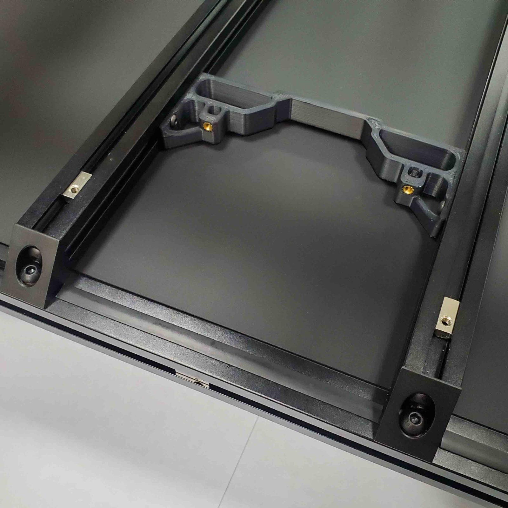

**What you're looking at:** The plenum bolts to the inside faces of the two bed extrusions, low and inboard, where it is below the bed surface and out of the gantry's way. The photo is LDO's placement reference, with the two T-nuts already rolled into the inside faces; the fan leads were cut to length in 11.31 for exactly this position.

**Parts:** M3 roll-in T-nut ×2, M3×12 SHCS ×2.

**Do:** Roll one M3 T-nut into the **inside** face of each of the two bed extrusions — *not* into the top slot — and bolt the plenum on with two M3×12 SHCS. This exact position is not optional in practice: the fan leads were cut to length for it at 11.31.

**Check:** Plenum solid on the extrusions, sitting inboard and below the bed surface; nothing it can foul as the gantry descends; both screws snug.

Source: [LDO Nevermore V5 Duo guide § Installation for Voron V2.4](https://ldomotion.com/guides/nevermore-v5-duo---v24) · [LDO wiring photo nevermore_base_placement.jpg](https://raw.githubusercontent.com/MotorDynamicsLab/LDOVoron2/8270e8c/Images/WiringGuide/nevermore_base_placement.jpg)

---

### Step 11.39 — Attach the cartridge

(no image — see [LDO Nevermore guide § Installation for Voron V2.4](https://ldomotion.com/guides/nevermore-v5-duo---v24))

**What you're looking at:** Nothing but magnets holds the cartridge on. That is the point — carbon is consumable, and this joint is the one you will open every few hundred hours.

**Parts:** cartridge from 11.37.

**Do:** Slide the cartridge along until the magnets take, and let it pull itself home.

**Check:** Cartridge seated square on the plenum with no gap at the joint; it comes off with a deliberate pull and not with an accidental knock.

Source: [LDO Nevermore V5 Duo guide § Installation for Voron V2.4](https://ldomotion.com/guides/nevermore-v5-duo---v24)

---

### Step 11.40 — Connect the filter fan

(no image — see [LDO wiring guide § Connecting the Fans and the LED Strip](https://docs.ldomotors.com/en/voron/voron2/wiring_guide_rev_d))

**What you're looking at:** The `FILTER FAN` extension is the kit lead already run to `FAN3` in Ch 10 Step 10.48 and left coiled at the rear of the chamber. This step mates the Nevermore's pigtail to it. The Nevermore guide names an Octopus pin; this machine's port is `FAN3 / PF9`.

**Parts:** the kit's **FILTER FAN** extension wire.

**Do:** Mate the Nevermore's pigtail with the FILTER FAN extension and follow it back to the Leviathan. It lands on **FAN3 / PF9**. Confirm that header's voltage-selection jumper is set for **24 V** before anything is powered.

**Check:** Filter fan on FAN3/PF9; 24 V jumper confirmed; the lead is routed in the duct and cannot be caught by the bed or the gantry.

⚠ **Rev D+ / LDO:** the Nevermore guide was written for a **BTT Octopus** and tells you to use *"Octopus Fan3 - Pinout PD13"*. This machine has a **Leviathan**. Use **FAN3 / PF9** from the Rev D wiring guide's fan table. [src](https://docs.ldomotors.com/en/voron/voron2/wiring_guide_rev_d)

Source: [LDO wiring guide § Connecting the fans and the LED strip](https://docs.ldomotors.com/en/voron/voron2/wiring_guide_rev_d#connecting-the-fans-and-the-led-strip) · [Video: Extras! @2:48:31](https://www.youtube.com/watch?v=0aPi1rBwDC0&list=PL0fUJbigELQPqpeGOgHYisG4KaSXVtnNY&t=10111s)

---

### Step 11.41 — Note the filter fan config for Ch 12

(no image — see [LDO Nevermore guide § Configuration printer.cfg](https://ldomotion.com/guides/nevermore-v5-duo---v24))

**What you're looking at:** Nothing to build — you are writing down a pin number so Ch 12 does not have to re-derive it. LDO's published config section is right in shape but names the wrong board's pin, and Ch 12 Step 12.32 changes the section type as well so a macro can run the filter for a whole print.

**Parts:** none.

**Do:** Write the pin on a tag and tape it to the plenum so Ch 12 does not have to re-derive it. The `[heater_fan exhaust_fan]` section from LDO's Nevermore guide is correct in shape — `max_power: 1.0`, `shutdown_speed: 0.0`, `kick_start_time: 5.0`, `heater: heater_bed`, `heater_temp: 60`, `fan_speed: 1.0` — but its `pin: PD13` is the Octopus pin and must become the Leviathan's **PF9**. Nothing to edit yet; the config work is Ch 12 — and Step 12.32 goes further, replacing `[heater_fan exhaust_fan]` with `[fan_generic nevermore]` on the same `PF9` pin so `PRINT_START` can run the filter for the whole print instead of slaving it to the bed.

**Check:** Tag on the plenum reading "FILTER FAN → FAN3 / PF9". Ch 12's config checklist has the Nevermore section on it.

Source: [LDO Nevermore V5 Duo guide § Configuration printer.cfg](https://ldomotion.com/guides/nevermore-v5-duo---v24) · [`leviathan-printer-rev-d-sbv2.cfg`](https://github.com/MotorDynamicsLab/LDOVoron2/blob/667521d/Firmware/leviathan-printer-rev-d-sbv2.cfg)

---

### Step 11.42 — Fit the bowden retainer

**What you're looking at:** The bowden retainer is a small printed clamp on the top rear extrusion that holds the PTFE tube guiding filament from the spool into the toolhead umbilical. Its only job is to stop the tube kinking where it changes direction.

**Parts:** `bowden_retainer` ×1, M3 hammerhead T-nut ×1, M3×8 SHCS ×1.

**Do:** Drop the hammerhead nut into the retainer's recess, start the M3×8 SHCS into it, and slide the assembly onto the top rear extrusion. Position it so the PTFE tube from the spool runs a smooth curve into the toolhead umbilical with no kink at either end. Tighten to lock the hammerhead.

**Check:** Retainer solid on the extrusion; the PTFE passes through with light drag only; no sharp bend where the tube leaves the retainer.

Source: [Voron manual p.257](https://github.com/VoronDesign/Voron-2/blob/de7e89d/Manual/Assembly_Manual_2.4r2.pdf#page=257) · [Voron manual p.258](https://github.com/VoronDesign/Voron-2/blob/de7e89d/Manual/Assembly_Manual_2.4r2.pdf#page=258) · [Video: Part 9 @3:13:57](https://www.youtube.com/watch?v=dmNwxUm4oik&list=PL0fUJbigELQPqpeGOgHYisG4KaSXVtnNY&t=11637s)

---

### Step 11.43 — Fit the spool holder arm

**What you're looking at:** The spool holder is the printed arm that carries a 1 kg filament spool on the rear of the machine. The two short PTFE offcuts pressed into its grooves are the bearing surface the spool actually turns on, so it spins with finger pressure instead of dragging on printed plastic.

**Parts:** `spool_holder` ×1, PTFE tube offcuts ×2 (4 mm OD), M5 T-nut ×2, M5×16 BHCS ×2 *(verify on bench)*.

**Do:** Press the two short PTFE lengths into the grooves along the spool holder arm — they are the low-friction bearing surface the spool rides on. Roll the M5 T-nuts into the rear vertical extrusion at spool height, offer the arm up, and drive the M5×16 BHCS home.

**Check:** Arm level and solid enough to carry a full 1 kg spool without deflecting; both PTFE inserts seated; a spool spins on it with light finger pressure and does not bind or wobble off.

Source: [Voron manual p.259](https://github.com/VoronDesign/Voron-2/blob/de7e89d/Manual/Assembly_Manual_2.4r2.pdf#page=259) · [Video: Part 9 @3:11:11](https://www.youtube.com/watch?v=dmNwxUm4oik&list=PL0fUJbigELQPqpeGOgHYisG4KaSXVtnNY&t=11471s)

Pause: ~15 min since the last pause — Nevermore mounted in the chamber, cartridge attached, filter fan connected to the Ch 10 lead, bowden retainer and spool holder arm fitted. Its config is `[fan_generic nevermore]` on PF9 (11.41) — Ch 12 Step 12.32 already wrote it; confirm it is there before you close this session.

---

### Step 11.44 — Assemble the Clicky-Clack door frame

(no image — see [KB3D install guide](https://wiki.kb-3d.com/en/home/LDO/LDO_Clicky_Clacky_Door_Mod) · [mod README](https://github.com/tanaes/whopping_Voron_mods/tree/main/clickyclacky_door))

**What you're looking at:** [Clicky-Clack](16-glossary.md#c) is the magnetic-latch front door that replaces the Voron's two stock hinged doors: a 2020 aluminium frame around a single clear acrylic panel, hung on lift-off hinges, closed by a magnetic handle-and-latch pair. The corners are blind joints: two of the four pieces have an M5 thread cut into each end face, the other two have a round access hole through one face near each end, and a screw goes through the access hole into the tapped end. **Decide the hinge side now:** this manual hangs the door with the hinges on the **left** (seen from the front) and the latch on the right, and 11.57 and 11.62–11.64 are written that way — if you want it the other way round, mirror every left/right in those steps.

**Parts:** door frame extrusions — 2 × `HFSFB5-2020-470-TPW` (X, 470 mm) and 2 × `HFSFB5-2020-530-LCH-RCH` (Z, 530 mm) for a 350 — M5×16 BHCS ×4, the 480 × 500 × 3 mm clear acrylic door panel.

**Do:** Find the tapped pair by looking, not by the part code: hold each piece end-on — two of them show an M5 thread in the end face, the other two show a round hole through the side wall near each end (verify on bench — the KB3D guide names which; the Misumi suffixes are not decoded here). Start an M5×16 BHCS about halfway into each tapped end. Bring the two access-hole pieces onto the ends of **one** tapped piece and tighten through the access holes, checking the corners against a machinist square or 123 blocks as you go — a racked door frame will not seal. Assemble **three sides only**, slide the acrylic into the slot, then fit and tighten the fourth side.

**Check:** All four corners square; the acrylic fully home in the slot on all four sides with no bow; the frame does not twist when laid on a flat surface; you have written down which side the hinges go on.

⚠ You are using the plain acrylic panel from Fabreeko, not the NanoNest stack the KB3D guide illustrates. Skip the KB3D guide's NanoNest taping section entirely; the panel goes straight into the frame slot. [src](https://www.fabreeko.com/products/acrylic-pannel-for-clicky-clacky-door)

Source: [KB3D Clicky-Clack install guide § Frame Assembly](https://wiki.kb-3d.com/en/home/LDO/LDO_Clicky_Clacky_Door_Mod#frame-assembly) · [Clicky-Clack mod README](https://github.com/tanaes/whopping_Voron_mods/tree/62268ed/clickyclacky_door) · [Fabreeko acrylic panel](https://www.fabreeko.com/products/acrylic-pannel-for-clicky-clacky-door)

---

### Step 11.45 — Fit the rubber panel retainer strip

(no image — see [mod README](https://github.com/tanaes/whopping_Voron_mods/tree/main/clickyclacky_door))

**What you're looking at:** The rubber retainer strip is an extruded profile that presses into the frame groove alongside the acrylic and takes up the clearance. Without it the panel rattles in its slot every time the door closes.

**Parts:** `HSCPF3H-B-2000` retainer strip (supplied in the LDO frame kit).

**Do:** Cut the strip to length for each side with **45° mitres** at the corners, then press it into the extrusion groove alongside the acrylic. It takes up the clearance and stops the panel rattling.

**Check:** Strip seated all the way round with the mitres closed; the acrylic no longer moves in the frame when you tap it.

Source: [Clicky-Clack mod README](https://github.com/tanaes/whopping_Voron_mods/tree/62268ed/clickyclacky_door)

---

### Step 11.46 — Build the door hinges: dowel into the solid halves

(no image — see [mod README § Assembly](https://github.com/tanaes/whopping_Voron_mods/tree/main/clickyclacky_door))

**What you're looking at:** Each door hinge is two printed halves: a solid half carrying a steel dowel pin, and a sleeve half that drops onto it. Leaving 20 mm of pin proud is what lets the whole door lift straight off its hinges.

**Parts:** `Hinge-L-solid` ×2, M5×45 dowel pin ×2, small hammer.

**Do:** Tap an M5×45 dowel into each solid hinge half. It is meant to be a very tight fit. Stop when about **20 mm** protrudes — measure against the shoulder of an M3×20 screw if you want a quick gauge. Do not drive it flush.

**Check:** Both pins about 20 mm proud, both perpendicular to the hinge face, neither part split.

Source: [Clicky-Clack mod README § Assembly](https://github.com/tanaes/whopping_Voron_mods/tree/62268ed/clickyclacky_door)

---

### Step 11.47 — Bush the sleeve halves

(no image — see [mod README § Assembly](https://github.com/tanaes/whopping_Voron_mods/tree/main/clickyclacky_door))

**What you're looking at:** A split bushing is a rolled metal sleeve that becomes the actual bearing surface between pin and printed part, so the hinge does not wear its way loose. Two go into each sleeve half, fully below the surface.

**Parts:** `Hinge-L-sleeve` ×2, M5×7×8 split bushings ×4.

**Do:** Slide two bushings over one of the dowels you just fitted, offer the empty sleeve part over them, and tap the sleeve down until the bushings are fully inside — **nothing protruding**. Repeat for the second sleeve. (A soldering iron works instead of a hammer: melt them in like a heat-set.)

**Check:** Both sleeves bushed with nothing standing proud; a sleeve half drops onto a solid half's dowel and rotates freely with no slop and no bind.

Source: [Clicky-Clack mod README § Assembly](https://github.com/tanaes/whopping_Voron_mods/tree/62268ed/clickyclacky_door)

Pause: ~20 min since the last pause — the door frame is squared and blind-jointed, the rubber retainer strip is in, and both hinges are dowelled and bushed. The acrylic is not yet trapped and nothing is glued.

---

### Step 11.48 — Glue the handle, latch and handle-hinge magnets

(no image — see [KB3D guide § Hinge & Handle Assembly](https://wiki.kb-3d.com/en/home/LDO/LDO_Clicky_Clacky_Door_Mod))

**What you're looking at:** The handle, the latch on the frame, and the two handle hinges all carry 6 × 3 mm magnets, and the whole mod works on the attraction between them — the handle pulls to the latch, the hinges pull to the handle. Every pair has to attract, so each magnet is tested against its opposite number before any glue goes in.

**Parts:** `Handle` (orange), `Latch`, `Handle-Hinge_Top`, `Handle-Hinge_Bottom`, 6×3 mm magnets ×12, super glue.

**Do:** Press magnets into the hexagon pockets with a drop of glue in the bottom of each. **Polarity is the whole point of this mod.** The handle has four magnet positions that must **attract** their four opposite numbers in the latch; the two handle hinges each have a magnet that must attract the handle. Test each pair with a loose magnet before you commit glue. Press every one fully home — a proud magnet grinds against its partner on every open and close.

**Check:** Handle and latch pull together firmly and click; both handle hinges pull to the handle; nothing standing proud of a pocket.

Tip: put a magnet on the end of a steel tool and use that to press each one into its pocket. [src](https://wiki.kb-3d.com/en/home/LDO/LDO_Clicky_Clacky_Door_Mod)

Source: [KB3D Clicky-Clack install guide § Hinge & Handle Assembly](https://wiki.kb-3d.com/en/home/LDO/LDO_Clicky_Clacky_Door_Mod#hinge-handle-assembly)

---

### Step 11.49 — Fit the latch's heat-set and panel clip

(no image — see [KB3D guide § Hinge & Handle Assembly](https://wiki.kb-3d.com/en/home/LDO/LDO_Clicky_Clacky_Door_Mod))

**What you're looking at:** The `Panel_Clip` is an unusual part: it is both the door's catch and the middle side-panel clip for that side of the machine — one of the eight clips 11.57 fits is displaced by this part at 11.63. The heat-set gives the latch a metal thread for the screw joining them.

**Parts:** `Latch`, M3×5×4 heat-set insert ×1, `Panel_Clip`, M3×8 BHCS ×1.

**Do:** Press one heat-set insert into the hole in the middle of the latch and let it cool for a few minutes. Then screw the `Panel_Clip` onto the latch with the M3×8 BHCS — this single printed part is both the door catch and the middle side-panel clip for that side.

**Check:** Insert square and flush; the panel clip is solid on the latch and its panel groove is unobstructed.

Source: [KB3D Clicky-Clack install guide § Hinge & Handle Assembly](https://wiki.kb-3d.com/en/home/LDO/LDO_Clicky_Clacky_Door_Mod#hinge-handle-assembly)

---

### Step 11.50 — Finish the handle

(no image — see [mod README § Assembly](https://github.com/tanaes/whopping_Voron_mods/tree/main/clickyclacky_door))

**What you're looking at:** The handle hangs on two more M5×45 pins, deliberately looser than the door hinges so it can swing. The two M3×8 screws at its ends are travel stops, not fasteners — they limit how far the handle rotates.

**Parts:** `Handle`, M5×45 dowel pin ×2, M5×7×8 split bushing ×2, M3×8 SHCS ×2, `Handle-Hinge_Top` / `Handle-Hinge_Bottom`.

**Do:** Push the two remaining M5×45 pins into the handle — these are a deliberately **looser** fit than the door hinges. Tap **one** bushing into each handle hinge. Drive the two M3×8 locating screws into the small holes at each end of the handle; these limit handle travel, so run them in carefully and do not over-tighten. Slide the handle hinges onto the handle pins — the magnets hold the assembly together.

**Check:** Handle hinges slide on and stay put by magnet alone; the handle rotates through its full arc and stops against the locating screws; nothing binds.

Source: [Clicky-Clack mod README § Assembly](https://github.com/tanaes/whopping_Voron_mods/tree/62268ed/clickyclacky_door)

---

### Step 11.51 — Foam-tape the front opening

(no image — see [KB3D guide § Frame Assembly](https://wiki.kb-3d.com/en/home/LDO/LDO_Clicky_Clacky_Door_Mod))

**What you're looking at:** The 3 mm foam runs on the **front face** of the front opening's extrusions — the face the closed door frame presses against, not the chamber-side face — and it is what the door actually seals against; the latch is designed to pull the door onto it. Butting the corners rather than overlapping keeps the seal one thickness everywhere.

**Parts:** 3 mm foam tape.

**Do:** Run 3 mm foam tape around the **front face** of the four extrusions that frame the front opening, along their inboard edge — hold the door frame up to the opening once, dry, and tape exactly the surface it lands on. Not the chamber-side face. Butt the corners; do not overlap.

**Check:** Continuous, unbroken seal on all four sides of the opening, no overlaps standing proud, no gaps at the corners.

Source: [KB3D Clicky-Clack install guide § Frame Assembly](https://wiki.kb-3d.com/en/home/LDO/LDO_Clicky_Clacky_Door_Mod#frame-assembly)

Pause: ~20 min since the last pause — **end of Part A.** Handle, latch and handle-hinge magnets glued and curing, the latch heat-set and panel clip fitted, and the front opening foam-taped. Do not fit the back, side or top panels: Ch 13 needs every face open. Go to Ch 13.

---

## ⛔ Stop here until Ch 13 is complete

**Everything above is done with the machine open. Do not fit the back, side or top panels or hang the door yet.**

Ch 12 Part 2 (12.11–12.37) is already done — the boards were flashed and configured with the bay open, before this part closed it. Go now to **Ch 13** (initial startup) — which includes the Ch 06b gantry-squaring pass and a QGL re-run. All of it needs the machine reachable from every face: `STEPPER_BUZZ` per motor, the XY endstop and homing checks, bed locating and the 0,0 point, `PROBE_ACCURACY`, dropping the Z joints and releasing the A/B tensioners for squaring.

Come back here at **11.52** once Ch 13's Finish page is done. The rest of this chapter is about 1.0–2.0 h.

**Sub-sections that wait for Ch 13:** 11.52–11.55 (back panel and exhaust), 11.56–11.58 (side panels), 11.59–11.60 (top panel and handlebars), 11.61–11.65 (Clicky-Clack door hung on the machine), 11.66 (final seal check).

---

## Part B — after Ch 13

### Step 11.52 — Foam-tape the back panel

**Before the first panel goes on:** snap the wire-duct covers on (they were left off at [Ch 10 Step 10.71](10-wiring.md#step-1071-leave-the-duct-covers-off) so the bay stayed reachable with a meter). Ch 13 has now driven every motor, heater and fan at least once, so nothing else needs the ducts open.

**What you're looking at:** The back panel is 3 mm black acrylic. The 1 mm foam tape on its inner perimeter is a noise damper between acrylic and aluminium, not a gasket — which is why it is thinner than the 3 mm used on the sides, where the tape is a physical standoff.

**Parts:** back panel (acrylic, black, 483 × 503 × 3 mm) ×1, **1 mm** foam tape.

**Do:** Peel the protective film from both faces. Run **1 mm** foam tape around the perimeter of the face that will meet the frame, on the contact areas only — this is noise control, not a gasket, so butt the corners rather than overlapping them.

**Check:** Continuous 1 mm tape on all four edges of the inner face; no tape where a clip has to sit; film off both faces.

⚠ Back and top panels get **1 mm** foam. Side panels get **3 mm**. Mixing them up either lets the gantry rub a side panel or leaves the back panel proud of its clips.

Source: [Voron manual p.238](https://github.com/VoronDesign/Voron-2/blob/de7e89d/Manual/Assembly_Manual_2.4r2.pdf#page=238) · [Voron manual p.239](https://github.com/VoronDesign/Voron-2/blob/de7e89d/Manual/Assembly_Manual_2.4r2.pdf#page=239)

---

### Step 11.53 — Fit the back-panel clips

**What you're looking at:** A panel clip is a small printed part that screws to the frame and grips the panel edge in a groove, so the panel is held without being drilled. The `4mm` in the name is the stack the groove is cut for: a 3 mm panel plus 1 mm of foam.

**Parts:** `corner_panel_clip_4mm` ×4, `midspan_panel_clip_4mm` ×3, M3×8 SHCS ×7, M3 hammerhead T-nut ×7.

**Do:** Load each clip with a hammerhead nut and an M3×8 SHCS, started but loose. Fit the four corner clips first, then the three midspan clips in the positions p.239 shows. Offer the back panel up, slide every clip onto its edge, and tighten — the hammerheads rotate and lock as you go.

**Check:** Seven clips, all engaged on the panel edge, panel flat against the frame with the 1 mm foam just compressed. No clip loaded so hard it bows the acrylic.

⚠ **Clip-thickness assignment — verify before you commit.** The manual never says which clip goes on which panel; this is the print plan's inference (§B09), and it is corroborated three ways: 3 mm panel + 1 mm foam = **4 mm**, the back panel takes **7** clips and the top panel **8** (counted off p.239 and p.243) which is exactly `_4mm_x8` + `_4mm_x7`, and the manual specifies **M3×8** here versus **M3×12** for the side panels — the longer screw is for the thicker 6 mm clip. **Test-fit one 4 mm clip and one 6 mm clip on an extrusion with a 3 mm panel offcut and the right foam tape before you commit all 31 clips.** The 4 mm clip should hold a 3 mm panel plus 1 mm foam with light preload; the 6 mm clip on the same stack will be visibly loose. [src](https://github.com/VoronDesign/Voron-2/tree/Voron2.4/STLs/Panel_Mounting)

Tip: a drop of thread locker turns each hammerhead nut into a quarter-turn quick release for the panel — but do it once the whole assembly is finished, not now. [Voron manual p.239]

Source: [Voron manual p.239](https://github.com/VoronDesign/Voron-2/blob/de7e89d/Manual/Assembly_Manual_2.4r2.pdf#page=239) · [Voron manual p.240](https://github.com/VoronDesign/Voron-2/blob/de7e89d/Manual/Assembly_Manual_2.4r2.pdf#page=240) · [Voron-2 `STLs/Panel_Mounting/`](https://github.com/VoronDesign/Voron-2/tree/de7e89d/STLs/Panel_Mounting) · [Video: Part 9 @3:54:44](https://www.youtube.com/watch?v=dmNwxUm4oik&list=PL0fUJbigELQPqpeGOgHYisG4KaSXVtnNY&t=14084s)

---

### Step 11.54 — Fit the exhaust cover and grill

**What you're looking at:** The back panel has a rectangular exhaust cut-out meant for the Voron's own exhaust filter housing. Because this build filters internally with the Nevermore instead, the cut-out is simply sealed: LDO's `exhaust_cover` on the inside face and the Voron `exhaust_filter_grill` on the outside, bolted through the panel.

**Parts:** LDO `exhaust_cover` ×1, Voron `exhaust_filter_grill` ×1, M3×12 SHCS ×2 *(verify on bench)*.

**Do:** You are not building the Voron exhaust filter. Skip p.250 (housing heat-sets), p.251 (BSPP adapter lip), p.252 (M3×8 and M3×30 housing screws), p.253 (VHB and filter material) and p.256 (hanging the housing) entirely. Instead, sandwich the back panel's exhaust cut-out: LDO's `exhaust_cover` on the **inside** face, the Voron `exhaust_filter_grill` on the **outside**, bolted through the panel with M3×12 SHCS. Dry-fit both parts against the cut-out before you drive anything.

**Check:** Cut-out fully covered from both faces, no light through the joint, panel not stressed white around the screw holes, grill sitting flat.

⚠ **Rev D+ / LDO:** *"PAGE 250-253 & 256 SKIP — Please follow our guide for Nevermore mod."* and *"If you decide to build the Nevermore internal circulation filter, print this exhaust cover to seal the back panel."* LDO's page list stops short of p.254–255, but those two pages hang the Voron housing on `[a]_exhaust_filter_mount_x2` (M5 T-nuts and M5×10 BHCS into the top rear extrusion) — parts you deliberately did not print, so those fasteners are unused here. *(verify on bench — LDO publishes no step-by-step for the exhaust cover; the sandwich is inferred from p.256's "secure it with the bolts on the other side of the exhaust gril" and the cover's stated purpose.)* [src](https://docs.ldomotors.com/voron/voron2/build-faq) · [src](https://github.com/MotorDynamicsLab/LDOVoron2/tree/main/STLs)

Source: [Voron manual p.250–256](https://github.com/VoronDesign/Voron-2/blob/de7e89d/Manual/Assembly_Manual_2.4r2.pdf#page=250) · [LDO Build Notes p.250–253, p.256](https://docs.ldomotors.com/voron/voron2/build-faq#build-notes) · [LDOVoron2 `STLs/`](https://github.com/MotorDynamicsLab/LDOVoron2/tree/8270e8c/STLs) · [Video: Extras! @0:06:32](https://www.youtube.com/watch?v=0aPi1rBwDC0&list=PL0fUJbigELQPqpeGOgHYisG4KaSXVtnNY&t=392s)

---

### Step 11.55 — Hang the back panel

**What you're looking at:** Everything from 11.52 to 11.54 now goes on as one assembly. Tightening opposite corners rather than round the perimeter keeps the acrylic from being pulled into a bow.

**Parts:** back panel assembly from 11.52–11.54.

**Do:** Lift the panel into the clips, check the exhaust cut-out lines up with whatever it needs to clear behind it, and tighten every clip screw. Work opposite corners rather than around the perimeter.

**Check:** Panel square and flat with even margins; the foam is compressed but not squashed flat; the exhaust cover clears the Nevermore, the umbilical and every cable behind it.

Source: [Voron manual p.240](https://github.com/VoronDesign/Voron-2/blob/de7e89d/Manual/Assembly_Manual_2.4r2.pdf#page=240)

Pause: ~25 min since the last pause — back panel foam-taped, its seven clips on, exhaust cover and grill sealed into the cut-out, panel hung and screwed down. A panel is either fully clipped or off the machine — never leave one hanging on half its clips.

---

### Step 11.56 — Foam-tape the side panels

**What you're looking at:** The side panels are clear polycarbonate — tougher than acrylic and the material the gantry gets closest to. Their 3 mm foam is a functional standoff that holds the panel far enough out for the moving gantry to clear it, which is why substituting 1 mm scores the panel.

**Parts:** side panel (PC, clear, 483 × 503 × 3 mm) ×2, **3 mm** foam tape.

**Do:** Peel the film from both faces of both panels. Run **3 mm** foam tape around the perimeter of each inner face. The manual is explicit about why this one is thicker: *"The 3mm foam tape is used on the side panels to prevent the gantry from rubbing on the panels."*

**Check:** 3 mm tape on both panels, all four edges, corners butted. This is a functional standoff — do not substitute the 1 mm tape to make it look neater.

Source: [Voron manual p.241](https://github.com/VoronDesign/Voron-2/blob/de7e89d/Manual/Assembly_Manual_2.4r2.pdf#page=241) · [Video: Part 9 @3:17:55](https://www.youtube.com/watch?v=dmNwxUm4oik&list=PL0fUJbigELQPqpeGOgHYisG4KaSXVtnNY&t=11875s)

---

### Step 11.57 — Fit the first side panel

**What you're looking at:** The `6mm` clips are the deeper-grooved version, sized for a 3 mm panel plus 3 mm of foam, and they take the longer M3×12 screw to reach the nut. One midspan position — on the front vertical edge of the **right-hand** panel, the latch side chosen at 11.44 — is left accessible because the Clicky-Clack latch takes it over at 11.63.

**Parts:** `corner_panel_clip_6mm` ×4, `midspan_panel_clip_6mm` ×4, M3×12 SHCS ×8, M3 hammerhead T-nut ×8.

**Do:** Start with the **right-hand** side (seen from the front). Load eight clips with hammerhead nuts and M3×12 SHCS. Fit the four corners then the four midspans in the p.241 positions, offer the panel up, engage every clip and tighten. The midspan clip on this panel's **front vertical edge** is the one the Clicky-Clack `Latch` + `Panel_Clip` assembly replaces at 11.63 — leave it accessible and only snug.

**Check:** Panel flat with equal margins; **run the gantry through its full XY travel by hand and confirm nothing touches the panel** — this is what the 3 mm foam is buying you.

⚠ Side panels take **M3×12 SHCS**, not M3×8. The 6 mm clip is thicker and an M3×8 will not reach the hammerhead nut with any thread to spare.

Source: [Voron manual p.241](https://github.com/VoronDesign/Voron-2/blob/de7e89d/Manual/Assembly_Manual_2.4r2.pdf#page=241) · [Voron manual p.242](https://github.com/VoronDesign/Voron-2/blob/de7e89d/Manual/Assembly_Manual_2.4r2.pdf#page=242)

---

### Step 11.58 — Fit the second side panel

**What you're looking at:** The same eight clips and eight screws on the opposite side. When it is done both stocks of 6 mm clips are exactly used up, which is the arithmetic check that the assignment was right.

**Parts:** `corner_panel_clip_6mm` ×4, `midspan_panel_clip_6mm` ×4, M3×12 SHCS ×8, M3 hammerhead T-nut ×8.

**Do:** Repeat 11.57 on the **left-hand** side, the hinge side — all eight clips fully tight here; nothing on this panel gets replaced.

**Check:** Both panels on; the gantry clears both through full travel; 6 mm clip stock is now all fitted — 8 corner and 8 midspan; one midspan comes back off at 11.63 as a spare when the latch's `Panel_Clip` displaces it.

Source: [Voron manual p.242](https://github.com/VoronDesign/Voron-2/blob/de7e89d/Manual/Assembly_Manual_2.4r2.pdf#page=242)

Pause: ~25 min since the last pause — both side panels foam-taped, clipped and screwed, all sixteen M3×12 in. Both sides are fully on.

---

### Step 11.59 — Fit the top panel

**What you're looking at:** The top panel is clear polycarbonate again, but back on 1 mm foam and 4 mm clips like the back panel — the gantry never comes near it. Fitting it closes the machine on five faces and is what lets the chamber hold heat.

**Parts:** top panel (PC, clear, 483 × 483 × 3 mm) ×1, **1 mm** foam tape, `corner_panel_clip_4mm` ×4, `midspan_panel_clip_4mm` ×4, M3×8 SHCS ×8, M3 hammerhead T-nut ×8.

**Do:** Film off both faces, 1 mm foam around the perimeter of the underside. Load eight clips, fit four corners and four midspans as p.243 shows, drop the panel on and tighten. That consumes the last of the 4 mm clips — 8 corner and 7 midspan across back and top.

**Check:** Panel flat with even margins on all four sides; foam compressed evenly; the machine is now closed on five faces.

Source: [Voron manual p.243](https://github.com/VoronDesign/Voron-2/blob/de7e89d/Manual/Assembly_Manual_2.4r2.pdf#page=243) · [Voron manual p.244](https://github.com/VoronDesign/Voron-2/blob/de7e89d/Manual/Assembly_Manual_2.4r2.pdf#page=244)

---

### Step 11.60 — Fit the aluminium handlebars

**What you're looking at:** The two aluminium handlebars are an LDO kit extra with no page in the Voron manual. The printed `handlebar_spacer` under each foot takes up the top panel's thickness, so the load goes into the frame extrusion rather than into the polycarbonate. 

**Parts:** aluminium handle ×2 (LDO), `handlebar_spacer_x4` ×4 (batch B07), M5×14 BHCS ×4, M5 hammerhead T-nut ×4.

**Do:** The manual has no handlebar step — this is an LDO kit extra. Put a printed spacer under each handle foot to take up the top panel's thickness, then bolt each handle down with M5×14 BHCS into M5 hammerhead nuts in the top frame extrusions. One handle per side, positioned so a two-person lift is balanced.

**Check:** Both handles solid; the spacers carry the load rather than the polycarbonate; lift the machine an inch by the handles and confirm nothing flexes at the panel.

⚠ **Rev D+ / LDO:** *"This optional part offsets the top panel thickness and helps mount the included aluminium handle bar."* The 350 Rev D BOM ships two aluminium handles and four M5×14 BHCS. [src](https://github.com/MotorDynamicsLab/LDOVoron2/tree/main/STLs) · [src](https://docs.ldomotors.com/en/voron/voron2/350_BOM/Rev_D)

Source: [LDOVoron2 `STLs/`](https://github.com/MotorDynamicsLab/LDOVoron2/tree/8270e8c/STLs) · [LDO Rev D 350 BOM](https://docs.ldomotors.com/en/voron/voron2/350_BOM/Rev_D)

---

### Step 11.61 — Do not fit the stock doors

**What you're looking at:** The five pages show the stock Voron front: two narrow hinged doors, magnets glued into the front extrusions, printed handles and latches. The Clicky-Clack replaces all of it with one framed door, so nothing here is fitted and the two supplied door panels become spares.

**Parts:** none. The kit's two 241 × 503 × 3 mm clear PC door panels, and the 6×3 mm magnets those pages would have you glue into the front extrusions, are not used here.

**Do:** Skip all five DOORS pages. p.245 glues magnets into the front frame and the printed handles and warns about polarity; p.247–248 fit `door_hinge_x6` with M3×8 SHCS and hammerhead nuts and VHB the panels to them. None of it applies — the Clicky-Clack is a single framed door with its own hinges, latch and magnets. Confirm you never printed `door_hinge_x6`, `handle_a_x2`, `handle_b_x2`, `latch_x2` or LDO's `LDO Door/` set. Bag the two stock door panels and the spare magnets as spares.

**Check:** No stock door hardware installed; the front opening is bare extrusion with the 3 mm foam gasket from 11.51 on it.

⚠ Fitting Clicky-Clack means you also lose LDO's kit-number nameplate, which lives on `LDO Door/handle_b_nameplate.stl`. Print it and glue it elsewhere if you want it (print plan §3, B10).

Source: [Voron manual p.245–249](https://github.com/VoronDesign/Voron-2/blob/de7e89d/Manual/Assembly_Manual_2.4r2.pdf#page=245) · [LDO Build Notes p.245–249](https://docs.ldomotors.com/voron/voron2/build-faq#build-notes)

Pause: ~15 min since the last pause — top panel on its eight clips, handlebars bolted through their spacers, and the stock front doors confirmed not-installed. The machine is closed on five faces; the front is still open.

---

### Step 11.62 — Hang the door hinges

(no image — see [KB3D guide § Frame Assembly](https://wiki.kb-3d.com/en/home/LDO/LDO_Clicky_Clacky_Door_Mod))

**What you're looking at:** The hinges are the lift-off kind — the pins point up, so the door drops on and lifts straight off. The top and bottom corner panel clips on that vertical are the alignment datum the mod uses, because they are already square to the frame.

**Parts:** the two hinge assemblies from 11.46–11.47, M3×20 SHCS ×4, M3 roll-in T-nut ×8 (4 on the printer, 4 on the door frame), blue tape.

**Do:** Tape the door temporarily in the opening so you can see where it wants to sit. Roll four M3 T-nuts into the hinge-side front upright — the **left** one, seen from the front (11.44) — and line them up against the **bottom corner panel clip** and the **top corner panel clip** of the left side panel — those two clips are the alignment datum this mod uses. Screw each hinge onto its nuts loosely first, then slide into position. The hinge **pins must point up**. Leave a small gap at the top hinge rather than clamping it tight. Roll four more M3 T-nuts into the door frame's hinge edge for the door-side halves.

**Check:** Both hinge halves on the printer with pins up; the door lifts straight off the pins and drops back on; the door hangs parallel to the opening with an even gap top to bottom.

Source: [KB3D Clicky-Clack install guide § Frame Assembly](https://wiki.kb-3d.com/en/home/LDO/LDO_Clicky_Clacky_Door_Mod#frame-assembly)

---

### Step 11.63 — Fit the latch

(no image — see [KB3D guide § Frame Assembly](https://wiki.kb-3d.com/en/home/LDO/LDO_Clicky_Clacky_Door_Mod))

**What you're looking at:** The latch is the frame-side half of the magnetic catch, and it arrives already married to the panel clip it displaces. Leaving it loose is deliberate: this is the part you slide to align the closed door in the next step.

**Parts:** `Latch` + `Panel_Clip` assembly from 11.49, M3 hammerhead T-nut (reuse the one from the middle side-panel clip you displace).

**Do:** Remove the midspan panel clip from the front vertical edge of the **right-hand** side panel — the latch side (11.44), the clip 11.57 left only snug — and reuse its hammerhead nut for the latch. Centre the latch vertically on that side panel edge, and **do not tighten it fully yet** — the latch is what you will move to align the door at 11.64.

**Check:** Latch on the frame and still adjustable; its `Panel_Clip` half is holding the side panel edge exactly as the clip it replaced did.

Source: [KB3D Clicky-Clack install guide § Frame Assembly](https://wiki.kb-3d.com/en/home/LDO/LDO_Clicky_Clacky_Door_Mod#frame-assembly)

---

### Step 11.64 — Fit the handle and align the door

(no image — see [KB3D guide § Frame Assembly](https://wiki.kb-3d.com/en/home/LDO/LDO_Clicky_Clacky_Door_Mod))

**What you're looking at:** Alignment happens by moving the latch and the handle hinges, not by forcing anything. The paper shim keeps the handle and handle-hinge magnets from snapping together while you position them. A correctly aligned door is drawn onto its foam by the magnets, not merely resting against it.

**Parts:** handle assembly from 11.50, M3×8 SHCS ×4, M3 roll-in T-nut ×4 (door side).

**Do:** Attach the two handle hinges loosely to the door's latch-side edge — the **right-hand** edge, seen from the front (11.44). Slip a shim — a few sheets of paper — between the handle and handle-hinge magnets while you position everything, so the handle has clearance to swing and does not bind on friction between the printed parts. Float the handle over the latch and slide it up and down until the two line up. Lock the latch down first, then tighten the four handle screws, then pull the shim.

**Check:** The door closes with a click; the latch **draws the door in** against the 3 mm foam rather than just touching it; the handle swings its full arc without rubbing; the door seals on all four sides.

Tip: if the latch will not catch cleanly, the problem is almost always door alignment at the hinges, not the latch position. Re-align at 11.62 rather than moving the latch further. [src](https://wiki.kb-3d.com/en/home/LDO/LDO_Clicky_Clacky_Door_Mod)

Source: [KB3D Clicky-Clack install guide § Frame Assembly](https://wiki.kb-3d.com/en/home/LDO/LDO_Clicky_Clacky_Door_Mod#frame-assembly) · [Video: Part 9 @4:36:44](https://www.youtube.com/watch?v=dmNwxUm4oik&list=PL0fUJbigELQPqpeGOgHYisG4KaSXVtnNY&t=16604s) (differs: stock hinged doors; this kit gets the Clicky-Clack door (batch B10))

Pause: ~25 min since the last pause — door hinges hung, latch fitted, handle on, and the door swings and closes on its magnets. Do not stop with the door hanging on one hinge; it will twist the frame and the acrylic.

---

### Step 11.65 — Thread-lock the hammerhead nuts

**What you're looking at:** Thread locker on the hammerhead nuts stops them turning when the screw is slackened. That converts every panel clip into a quarter-turn quick release — the panel comes off in seconds and the nut does not vanish inside the extrusion.

**Parts:** thread locker (optional).

**Do:** Now that every panel is on and aligned, put a drop of thread locker on each panel clip's hammerhead nut. The nut then stays put when you slacken the screw, so each clip becomes a quarter-turn quick release and a panel comes off in seconds.

**Check:** Every clip still holds its panel; a quarter turn of any clip screw releases the panel edge without the nut falling into the extrusion.

Source: [Voron manual p.239](https://github.com/VoronDesign/Voron-2/blob/de7e89d/Manual/Assembly_Manual_2.4r2.pdf#page=239)

---

### Step 11.66 — Final seal and clearance check

(no image — see text)

**What you're looking at:** Nothing to fit. This is the whole enclosure looked at as one object: five panels, a door, a skirt ring and a screen, all of which have to seal without touching anything that moves. The chamber temperature that Ch 14's ASA work depends on is decided here.

**Parts:** none. Optional: extrusion slot cover, 6 mm.

**Do:** Peel any remaining protective film. Close the door and look along every seam for daylight. Push the gantry through its full XY travel by hand once more with all panels on, and run Z through its full travel — nothing should touch. Confirm the touchscreen is level and readable, the AC switch is reachable, the Ethernet keystone is accessible and the spool arm clears the back panel. Trim and press the 6 mm slot cover into any empty extrusion slots you want to hide.

**Check:** No daylight at any panel seam or around the door; no contact anywhere in full XY or Z travel; the door latches with one push; the chamber will now hold heat for the ASA work in Ch 14.

Source: [Voron manual p.241](https://github.com/VoronDesign/Voron-2/blob/de7e89d/Manual/Assembly_Manual_2.4r2.pdf#page=241) · [Voron manual p.243](https://github.com/VoronDesign/Voron-2/blob/de7e89d/Manual/Assembly_Manual_2.4r2.pdf#page=243) · [KB3D Clicky-Clack install guide § Frame Assembly](https://wiki.kb-3d.com/en/home/LDO/LDO_Clicky_Clacky_Door_Mod#frame-assembly) · [survey §5.2 W11](../voron-build-instructions-survey.md)

Pause: ~15 min since the last pause — hammerhead nuts thread-locked, every seal and clearance checked, machine closed. Ready for Checkpoint 11.

---

## Checkpoint 11

**Part A — before Ch 13**

- [ ] Checkpoint #1 passed and Ch 12 Part 2 (12.11–12.37, Checkpoint 12) done **before** any of this started; deck panel calipered and the Ch 02 deck supports match it.
- [ ] All twelve skirt segments checked for rock on the flat reference; the ring is closed with flush, tight joints all round, and no mini12864 parts exist anywhere on the machine.
- [ ] BTT TFT4.3 module in the front-centre position; FFC seated at both ends in the correct orientation (contacts up at the screen, forward at the Pi) with a service loop.
- [ ] Two 60×20 bay fans, both in the **right-hand** fan support, both blowing the same way, joined by the 3×2 splicer PCB **on its printed spacer**, landing on FAN2/PF7; the left support blanked with the two spare grills.
- [ ] Bottom panel bonded on six VHB pads to two rear hinges and four clips, opened and closed once after the VHB cured; four Z belt covers on, correct variant per corner, belts clear through full Z travel.
- [ ] Nevermore built and installed: 6 heat-sets, both 5015 fans modified and bolted, bridge PCB **meter-checked for shorts**, magnets polarity-matched, plenum on the bed extrusions, filter fan on **FAN3/PF9** with the 24 V jumper confirmed, carbon fill status recorded.
- [ ] Spool holder and bowden retainer fitted; a full spool spins freely with no kink in the PTFE.
- [ ] Clicky-Clack door frame square, acrylic retained, hinges and handle assembled, all magnet pairs attracting, hinge side decided (left unless you chose otherwise at 11.44); 3 mm foam on the front face of the front opening.

**Part B — after Ch 13**

- [ ] **Ch 12 and Ch 13 complete**, including the Ch 06b gantry-squaring pass, before any panel went on.
- [ ] Clips test-fitted for thickness before all 31 were committed: 4 mm on back + top with M3×8, 6 mm on both sides with M3×12; none left over, none short. Foam tape correct per panel: 1 mm back and top, 3 mm both sides.
- [ ] Gantry run through full XY travel with the side panels on — no contact. Exhaust cover and grill sealing the back panel; no Voron filter housing fitted. Both handlebars on their printed spacers.
- [ ] No stock door parts fitted; the Clicky-Clack latches with a click and draws the door onto the 3 mm foam; no daylight at any seam; thread locker on the panel-clip hammerhead nuts.

## Common mistakes

- **Closing the machine too early.** Starting before Checkpoint #1 seals an unverified electronics bay; fitting the back, side and top panels before Ch 13 means taking them off again for gantry squaring and the startup wizard's motor, endstop and probe checks — an hour, plus the foam tape you tear getting them off (survey §5.2 W8).
- **Mixing up the foam tape.** 1 mm on back and top, 3 mm on the sides. The 3 mm is not cosmetic — it is the standoff that keeps the gantry off the panel. A side panel taped with 1 mm gets scored.
- **Assuming the 4 mm and 6 mm clips are interchangeable.** They are not, and the screw length gives it away: M3×8 for the 4 mm clips, M3×12 for the 6 mm. Test-fit one of each before committing 31 clips.
- **Resolving the deck panel thickness from the documents.** LDO's build note says 4 mm and LDO's own BOM says 3 mm. Caliper it. If Ch 02 got the wrong deck supports, fix it before the skirt ring goes on.
- **Trusting the Nevermore guide's board.** It was written for a BTT Octopus: `PD13`. This machine is a Leviathan — **FAN3 / PF9**, 24 V jumper confirmed. And do not skip the multimeter check on the bridge PCB; a short across the 24 V fan rail takes the controller with it. Same class of mistake: the 3×2 bay-fan splicer must sit on its printed spacer, not bare on the extrusion.
- **Forcing a Clicky-Clack latch that will not catch, or gluing the cartridge magnets without marking polarity first.** The latch is almost never the problem — re-hang the door at the hinges. And backwards magnets mean digging cyanoacrylate-bonded neodymium out of a printed part.

## Next

**Ch 13 — Initial startup**, on the machine Ch 12 already configured (`leviathan-printer-rev-d-sbv2.cfg`, with LDO's Nevermore `[heater_fan exhaust_fan]` replaced by `[fan_generic nevermore]` on the Leviathan's `PF9`); then back here for Part B.
