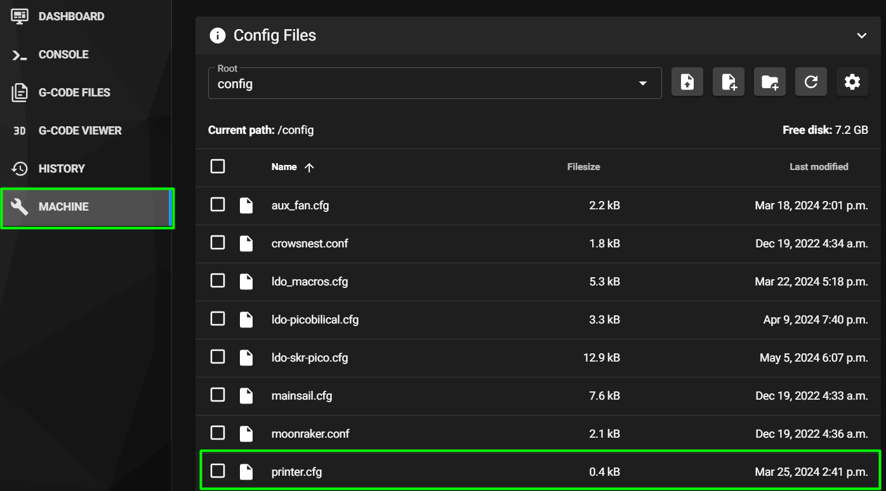
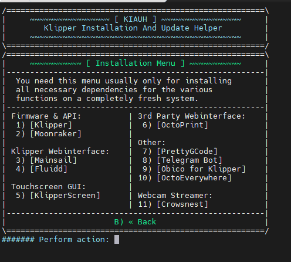
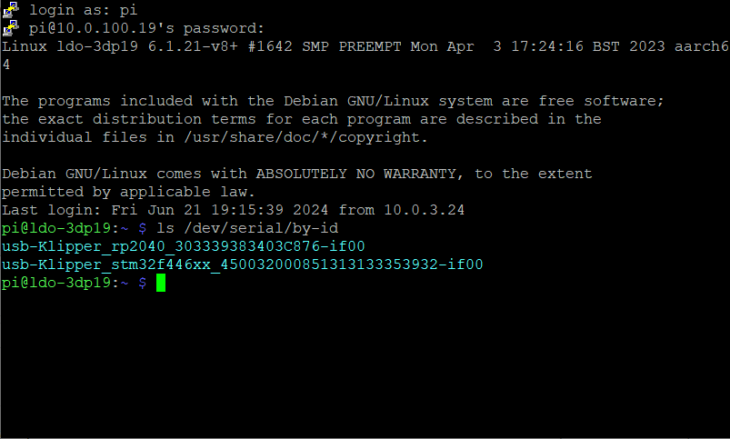
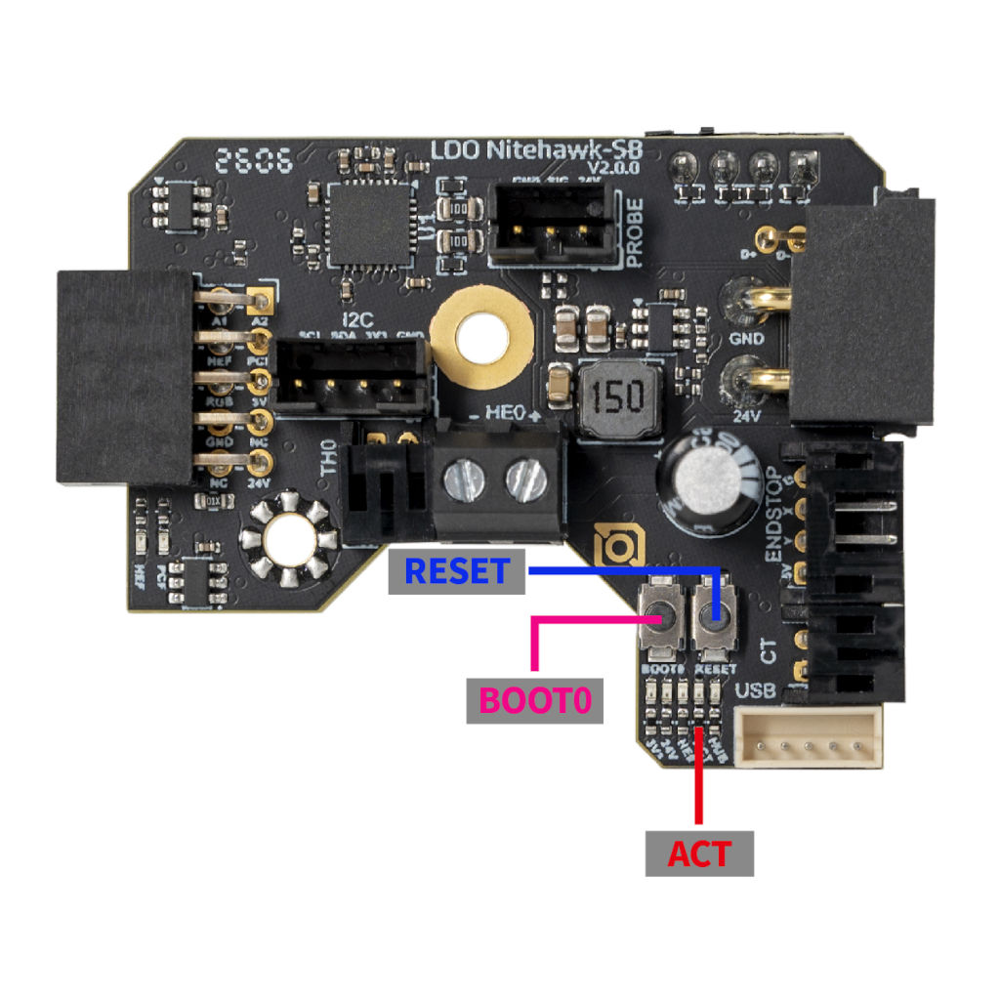
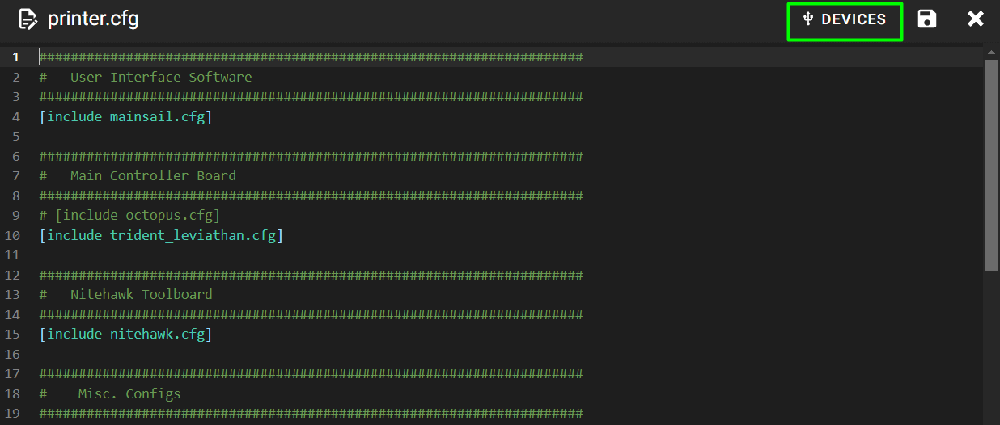
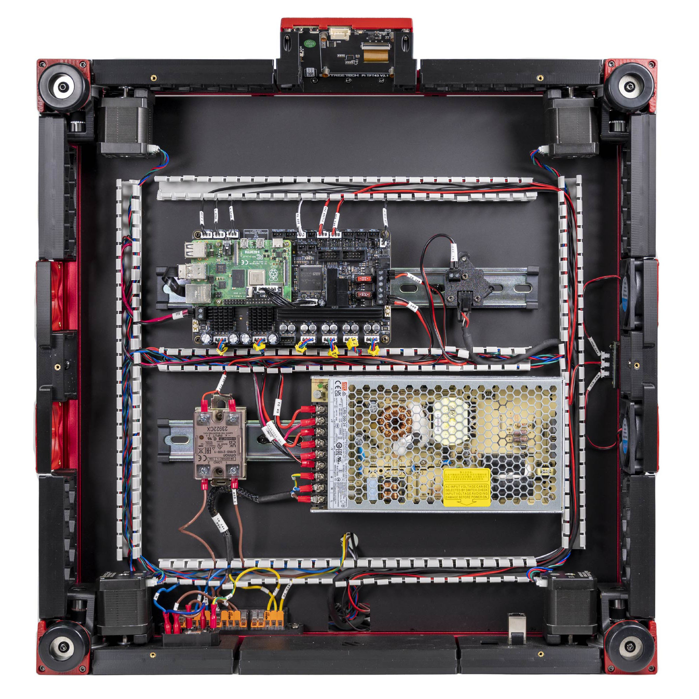

# Chapter 12 — Software: Pi OS image, Klipper/Moonraker/Mainsail, firmware, printer.cfg

Images the Raspberry Pi, flashes Klipper onto both MCUs, and installs a `printer.cfg` that is correct for a **350 mm Rev D+** — so that Ch 13 can power up a machine that already knows its own geometry.

**What you're building in this chapter.** The printer's software comes in layers, and keeping them apart makes everything below easier. **Klipper** is the firmware, and it is split in two: a *host* process on the Raspberry Pi that does all the planning and arithmetic, and a thin *MCU* firmware on each microcontroller — the Leviathan mainboard in the bay and the Nitehawk-SB V2 toolboard on the printhead — that does nothing but execute precisely timed pin changes. **Moonraker** is the API service sitting in front of Klipper so other programs can talk to it, and **Mainsail** (in a browser) and **KlipperScreen** (on the front panel) are two such programs — two windows onto the same machine. You will image the Pi with MainsailOS, which ships all of that pre-installed; compile and flash both MCU firmwares from the exact host version; and then write **`printer.cfg`**, the single text file that tells Klipper what this machine is — its pins, its 350 mm dimensions, its heaters, probe, fans and macros. Nothing moves and nothing heats until Ch 13.

**Time:** 2.0–3.0 h hands-on, first build (survey §7.2). Add ~30 min if you have to reinstall Katapult on either board.

**Sessions:** 9 × ~30 min (Pause segments below; every minute figure in this chapter is a first-build estimate derived from the Time range and the step count).

**Prerequisites:**

- **Ch 10 — Electronics bay wiring**, complete, with **LDO Checkpoint #1 passed** (multimeter, unplugged) and the PSU powered on once at Step 10.23. The cord has been out since then; it goes back in at **Step 12.11**, which is the first time the Leviathan, the Pi and the toolboard are energised — with the same hand-on-switch drill as 10.23. Both MCUs must be powered and connected to the Pi over USB before Steps 12.11 onward.
- The Pi-side half (Steps 12.1–12.10) has **no hardware prerequisite** and can be bench-done on day one — power the Pi from its own USB-C supply instead of the Leviathan's Pi rail (survey §5.1, P12: "the whole flash+install can be bench-done on day one").
- **Printed parts: none.** No print batch gates this chapter.
- Do **not** start Ch 13 until Checkpoint 12 below passes.

**Tools**

- Laptop with an SD card reader
- Raspberry Pi Imager (download from [raspberrypi.com/software](https://www.raspberrypi.com/software/))
- Ethernet cable (use wired for the flashing session; Wi-Fi is the fallback)
- USB cable, Pi ↔ Leviathan (supplied with the kit; connector type `(verify on bench)`)
- A USB-C 5 V/3 A supply if you are bench-doing the Pi half before the bay is live

**Consumables:** the supplied 32 GB microSD card. Nothing else.

**Printed parts**


| STL | Qty | Colour |
|---|---|---|
| — none — | 0 | — |

**Hardware** (chapter totals)

| Fastener / part | Qty | Note |
|---|---|---|
| — none — | 0 | Software only. The Pi was fitted in Ch 09, the DSI ribbon latched at both ends at Ch 10 Step 10.50, and the screen mounted with the front skirt in Ch 11 |

**Read first**

- **Use `leviathan-printer-rev-d-sbv2.cfg`, never `leviathan-printer-rev-d.cfg`.** The Rev D wiring guide links the wrong one. Every `nhk:` pin differs because the toolboard MCU changed family. Klipper checks every pin name against the board it is sent to, so the V1 file does not mis-drive anything — it refuses to start at Step 12.37 with `Pin 'gpio23' is not a valid pin name on mcu 'nhk'`. The one-line identity check is `grep -c gpio printer.cfg`: **0** on the V2 file, **20** on the V1 file (survey §4.1 ①).
- **The toolboard is an STM32G0B1, not an RP2040.** The wiring guide's sentence *"The Nitehawk uses an RP2040 MCU"* is stale. Its USB ID will read `usb-Klipper_stm32g0b1xx_…`. Match on that string, not on `rp2040` (survey §4.1 ②).
- **The stock config ships with every build-size option commented out and no `[bed_mesh]` at all.** Six separate places need the 350 mm lines uncommented, and the mesh section has to be written from scratch (survey §4.4 #15).
- **Confirm which Leviathan you have before you run `make menuconfig`.** LDO shipped an **STM32F446** Leviathan (V1.1/V1.2) and later an **STM32H743** one (V1.3). Processor model, clock reference and bootloader offset all differ; the wrong combination produces firmware that will not run. Step 12.13 settles it from the board itself.
- **Nothing moves and nothing heats in this chapter.** The chapter ends at "Klipper reports Ready with both MCUs connected". Homing, heaters, fans and motion are Ch 13.

**Sources for this chapter:**

- [`leviathan-printer-rev-d-sbv2.cfg`](https://github.com/MotorDynamicsLab/LDOVoron2/blob/667521d/Firmware/leviathan-printer-rev-d-sbv2.cfg) at commit `667521d` — the config this chapter edits; every config step links the exact line range
- [Klipper Config Reference](https://www.klipper3d.org/Config_Reference.html), [G-Codes](https://www.klipper3d.org/G-Codes.html), [Installation](https://www.klipper3d.org/Installation.html) and [Config checks](https://www.klipper3d.org/Config_checks.html)
- [MainsailOS docs](https://docs-os.mainsail.xyz/getting-started/raspberry-pi/) (imaging, first boot) and [Mainsail docs](https://docs.mainsail.xyz/configuration/mainsail-cfg/) (`mainsail.cfg`, error FAQ)
- [Nitehawk-SB V2 board doc](https://docs.ldomotors.com/en/Toolboard/nitehawk-sb-v2) — menuconfig, `make flash`, Katapult; repo images at commit `42ae497`
- [LDO Leviathan V1.2 guide](https://ldomotion.com/p/guide/VORON-Leviathan-V12), [Leviathan V1.3 guide](https://ldomotion.com/guides/voron-leviathan-v1-3) and the [Leviathan repo](https://github.com/MotorDynamicsLab/Leviathan) — the contested MCU question in step 12.13
- [LDO wiring guide § Software setup](https://docs.ldomotors.com/en/voron/voron2/wiring_guide_rev_d#software-setup) and the [LDO Klipper-ID guide](https://docs.ldomotors.com/guides/klipper_id)
- [KIAUH](https://github.com/dw-0/kiauh), [KlipperScreen](https://klipperscreen.github.io/KlipperScreen/Installation/), [Moonraker configuration](https://moonraker.readthedocs.io/en/latest/configuration/)
- Screenshots mirrored into `assets/remote/12-software/` from LDOVoron2 (`8270e8c`) and Nitehawk-SB-V2 (`42ae497`) — LDO Motors' work, mirrored with attribution for this non-commercial manual; see that folder's `SOURCES.txt`

**Video coverage (Steve Builds, pre-release LDO kit — differs from Rev D+):** [Part 8 @2:25:00](https://www.youtube.com/watch?v=Q3Q1szaFfSE&list=PL0fUJbigELQPqpeGOgHYisG4KaSXVtnNY&t=8700s) (+9m), [Part 8 @2:33:20](https://www.youtube.com/watch?v=Q3Q1szaFfSE&list=PL0fUJbigELQPqpeGOgHYisG4KaSXVtnNY&t=9200s) (+9m), [Part 9 @1:00:43](https://www.youtube.com/watch?v=dmNwxUm4oik&list=PL0fUJbigELQPqpeGOgHYisG4KaSXVtnNY&t=3643s) (+5m), [Part 9 @1:05:13](https://www.youtube.com/watch?v=dmNwxUm4oik&list=PL0fUJbigELQPqpeGOgHYisG4KaSXVtnNY&t=3913s) (+18m), [Part 9 @1:22:28](https://www.youtube.com/watch?v=dmNwxUm4oik&list=PL0fUJbigELQPqpeGOgHYisG4KaSXVtnNY&t=4948s) (+3m), [Part 9 @1:25:00](https://www.youtube.com/watch?v=dmNwxUm4oik&list=PL0fUJbigELQPqpeGOgHYisG4KaSXVtnNY&t=5100s) (+5m), [Part 9 @2:35:40](https://www.youtube.com/watch?v=dmNwxUm4oik&list=PL0fUJbigELQPqpeGOgHYisG4KaSXVtnNY&t=9340s) (+14m), [Extras! @0:14:05](https://www.youtube.com/watch?v=0aPi1rBwDC0&list=PL0fUJbigELQPqpeGOgHYisG4KaSXVtnNY&t=845s) (+26m), [Extras! @0:45:30](https://www.youtube.com/watch?v=0aPi1rBwDC0&list=PL0fUJbigELQPqpeGOgHYisG4KaSXVtnNY&t=2730s) (+3m), [Extras! @0:48:23](https://www.youtube.com/watch?v=0aPi1rBwDC0&list=PL0fUJbigELQPqpeGOgHYisG4KaSXVtnNY&t=2903s) (+18m), [More Extras! @3:10:29](https://www.youtube.com/watch?v=D_44fDp9xt8&list=PL0fUJbigELQPqpeGOgHYisG4KaSXVtnNY&t=11429s) (+11m)

---

### Step 12.1 — Decide where you are doing the Pi half

(no image — see text)

**What you're looking at:** The Raspberry Pi 4B is the printer's **host**: it runs the [Klipper](16-glossary.md#k) motion planner, the web interface and the touchscreen, and feeds the two microcontroller boards a stream of precisely timed step commands. Nothing in steps 12.1–12.10 needs the printer at all — only the Pi, its SD card and a network connection.

**Parts:** none — Pi 4B, supplied 32 GB microSD, laptop, card reader.

**Do:** Steps 12.1–12.10 need only the Pi, the SD card and the network. If the electronics bay is not yet wired, take the Pi off the Leviathan mount, feed it from a USB-C 5 V/3 A supply on the bench, and do this half now. If Ch 10 is done and Checkpoint #1 has passed, leave the Pi on the board and power the bay instead. Plug the Ethernet cable in either way — a wired link makes the flashing steps deterministic.

**Check:** You can identify the Pi's SD slot and its Ethernet port, and you have a way to power it that is not the printer's mains.

⚠ **Rev D+ / LDO:** the Leviathan supplies the Pi from its own dedicated Pi rail, so on the assembled machine "power the Pi" means "switch on the printer". That is why this chapter is gated on Checkpoint #1 (survey §4.4 #8). [src](https://github.com/MotorDynamicsLab/Leviathan)

Source: [MainsailOS install docs](https://docs-os.mainsail.xyz/getting-started/raspberry-pi/) · [LDO Leviathan repo](https://github.com/MotorDynamicsLab/Leviathan)

---

### Step 12.2 — Write MainsailOS with Raspberry Pi Imager

(no image — see text)

**What you're looking at:** MainsailOS is a ready-made Raspberry Pi disk image with the whole printer stack already on it: **Klipper** (the software that actually runs the machine), **Moonraker** (the API service that sits in front of Klipper so other programs can talk to it), and [**Mainsail**](16-glossary.md#m) (the web page you drive the printer from). Raspberry Pi Imager writes that image onto the microSD card the Pi boots from.

**Parts:** microSD 32 GB ×1, card reader ×1.

**Do:** Insert the card and launch Raspberry Pi Imager. **Choose Device** → your Pi model (Raspberry Pi 4). **Choose OS** → scroll to **Other specific-purpose OS** → **3D printing** → **MainsailOS** → pick the **64-bit** version (the 32-bit entry is marked deprecated and is only for pre-Zero-2 hardware). **Choose Storage** → the SD card, and read the drive description twice before you continue.

**Check:** The summary line names your Pi model, MainsailOS 64-bit, and the correct removable drive.

⚠ **Rev D+ / LDO:** LDO's wiring guide tells you to install **Raspberry Pi OS Lite (32-bit)** and then add Klipper/Moonraker/Mainsail with KIAUH. MainsailOS ships Klipper, Moonraker, Mainsail, Crowsnest, Sonar, Timelapse and the input-shaper Python dependencies pre-installed and pre-wired — same end state, four fewer install passes. Take the MainsailOS path; you still need KIAUH in Step 12.8 for KlipperScreen, which MainsailOS does **not** include. [src](https://docs-os.mainsail.xyz/getting-started/raspberry-pi/) · [src](https://docs.ldomotors.com/en/voron/voron2/wiring_guide_rev_d#software-setup)

Source: [MainsailOS install docs](https://docs-os.mainsail.xyz/getting-started/raspberry-pi/) · [LDO wiring guide § Software setup](https://docs.ldomotors.com/en/voron/voron2/wiring_guide_rev_d#software-setup) · [Video: Part 8 @2:31:43](https://www.youtube.com/watch?v=Q3Q1szaFfSE&list=PL0fUJbigELQPqpeGOgHYisG4KaSXVtnNY&t=9103s)

---

### Step 12.3 — Fill in the Imager customisation

(no image — see text)

**What you're looking at:** The Imager's customisation pages write settings into the image before it ever boots, so the Pi comes up already named, already on the network and already reachable over SSH. The hostname you choose here is the address you will type for the rest of the build.

**Parts:** none.

**Do:** Work through the customisation pages: **Hostname** — set it to something you will type a lot; `voron` gives you `http://voron.local`. **Localisation** — set your timezone (log timestamps and timelapse depend on it). **User** — set a username and a real password; do not leave the `pi`/`raspberry` default. **Wi-Fi** — SSID and password (the Wi-Fi country comes from your localisation setting). **Remote access** — enable SSH. Then write, confirming the erase prompt.

**Check:** Imager reports a successful write and verify. Eject the card.

Tip: set both Wi-Fi *and* plug in Ethernet. Wi-Fi is the long-term link; Ethernet is what you fall back to when Wi-Fi is the thing that broke. [src](https://docs-os.mainsail.xyz/getting-started/raspberry-pi/)

Source: [MainsailOS install docs](https://docs-os.mainsail.xyz/getting-started/raspberry-pi/) · [Video: Part 8 @2:25:16](https://www.youtube.com/watch?v=Q3Q1szaFfSE&list=PL0fUJbigELQPqpeGOgHYisG4KaSXVtnNY&t=8716s)

---

### Step 12.4 — First boot

(no image — see text)

**What you're looking at:** On its first boot the image expands itself to fill the card, which is why this takes minutes rather than seconds. The DHCP reservation pins the Pi's address in your router so it cannot move later and break every link you have written down.

**Parts:** none.

**Do:** Put the card in the Pi, connect Ethernet, power on and leave it alone. The first boot expands the filesystem and can take up to five minutes. Watch the green activity LED — when it settles to occasional flickers the expansion is done.

**Check:** `ping voron.local` answers (substitute your hostname). If the `.local` name does not resolve, find the Pi's IP in your router's DHCP table and use that instead.

**Check:** Give the Pi a DHCP reservation in your router now, before you paste its address into anything.

Source: [MainsailOS first boot](https://docs-os.mainsail.xyz/getting-started/first-boot/)

---

### Step 12.5 — Reach Mainsail and open an SSH session



**What you're looking at:** The screenshot is Mainsail's **Machine** page — the web interface's file manager and settings view, and where every config file in this chapter gets edited. The error it shows on first load is correct and expected: MainsailOS ships no `printer.cfg`, and writing that file is most of what this chapter does. SSH gives you the same machine as a command line, which is where the firmware builds happen.

**Parts:** none.

**Do:** Open `http://voron.local` in a browser. Mainsail loads and immediately reports a Klipper error — *"Unable to open config file printer.cfg"*. That is expected and correct; MainsailOS ships no `printer.cfg`. In a terminal, `ssh <youruser>@voron.local`.

**Check:** Mainsail's UI renders, the error names the missing `printer.cfg`, and your SSH session lands at a shell prompt.

Source: [LDO Rev D photo, Mainsail Machine page](https://raw.githubusercontent.com/MotorDynamicsLab/LDOVoron2/8270e8c/Images/WiringGuide/RevD/mainsail_machine.png) · [MainsailOS first boot](https://docs-os.mainsail.xyz/getting-started/first-boot/) · [Video: Part 9 @1:06:04](https://www.youtube.com/watch?v=dmNwxUm4oik&list=PL0fUJbigELQPqpeGOgHYisG4KaSXVtnNY&t=3964s)

---

### Step 12.6 — Update everything before you touch anything else

(no image — see text)

**What you're looking at:** The Update Manager is Moonraker's package updater, shown inside Mainsail. It runs now rather than later because each MCU's firmware has to be compiled from exactly the Klipper version the host ends up on.

**Parts:** none.

**Do:** In Mainsail go to **Machine** → **Update Manager** (bottom right) and click **Update all components**. Let it finish, including the system packages. Reboot if it asks.

**Check:** Every row in the Update Manager reads up to date.

**Why now:** the version of Klipper you end up with here is the version you must build MCU firmware from in Steps 12.14 and 12.17. Update first, then flash — do it the other way round and you will re-flash both boards after the first update. [src](https://docs-os.mainsail.xyz/getting-started/first-boot/)

Source: [MainsailOS first boot](https://docs-os.mainsail.xyz/getting-started/first-boot/) · [Video: Extras! @0:18:01](https://www.youtube.com/watch?v=0aPi1rBwDC0&list=PL0fUJbigELQPqpeGOgHYisG4KaSXVtnNY&t=1081s) (differs: BTT Octopus + separate Raspberry Pi; this kit is a Leviathan with the Pi mounted on it)

Pause: ~25 min since the last pause — MainsailOS written, first boot done, the Pi is on the network and Mainsail answers on `voron.local`, and everything is updated. The printer is still unpowered. A good place to stop: nothing is half-flashed.

---

### Step 12.7 — Record the Klipper version you are building against

(no image — see text)

**What you're looking at:** Klipper is two halves that must match: a host process on the Pi and a small firmware on each microcontroller. `git describe` prints the exact commit the host half is at, and both firmware builds later in this chapter have to come out of this same working copy.

**Parts:** none.

**Do:** In SSH:

```bash
cd ~/klipper && git describe --tags --always --dirty
```

Write the string down (or paste it into your build notes). Both MCUs must be flashed from this exact working copy.

**Check:** You have one version string, and `ls ~/printer_data/config/` shows `mainsail.cfg` and `moonraker.conf` but no `printer.cfg`.

**Why:** if the host Klipper and an MCU's firmware were built from different commits, Klipper aborts at connect with a *Command format mismatch* error naming the offending MCU. [src](https://docs.mainsail.xyz/faq/klipper_errors/command-format-mismatch/)

Source: [Mainsail FAQ — command format mismatch](https://docs.mainsail.xyz/faq/klipper_errors/command-format-mismatch/) · [Klipper docs § Installation](https://www.klipper3d.org/Installation.html)

---

### Step 12.8 — Install KIAUH

(no image — see text)

**What you're looking at:** [KIAUH](16-glossary.md#k) — Klipper Installation And Update Helper — is a menu-driven installer for the Klipper ecosystem. MainsailOS has already installed everything it offers except KlipperScreen, so it is here for exactly one job. 

**Parts:** none.

**Do:** In SSH:

```bash
sudo apt-get update && sudo apt-get install git -y
cd ~ && git clone https://github.com/dw-0/kiauh.git
./kiauh/kiauh.sh
```

You land in KIAUH's main menu. Do **not** use it to install Klipper, Moonraker or Mainsail — MainsailOS already has them, and a second install will fight the first.

**Check:** KIAUH's status panel shows Klipper, Moonraker and Mainsail as already installed, and KlipperScreen as not installed.

Source: [KIAUH README](https://github.com/dw-0/kiauh) · [Video: Extras! @1:30:08](https://www.youtube.com/watch?v=0aPi1rBwDC0&list=PL0fUJbigELQPqpeGOgHYisG4KaSXVtnNY&t=5408s)

---

### Step 12.9 — Install KlipperScreen



**What you're looking at:** KlipperScreen is the touchscreen front end — the same printer, driven from the 4.3" panel on the front of the machine instead of from a browser. It installs into its own Python environment and runs as a background service, alongside Mainsail rather than instead of it. The screenshot is KIAUH's Installation menu, where it is option 5.

**Parts:** none.

**Do:** From KIAUH's main menu choose **Install** → **KlipperScreen** and let it run. It builds a Python venv at `~/.KlipperScreen-env`, pulls the graphics packages and installs a systemd unit. When it finishes, confirm Moonraker gained an `[update_manager KlipperScreen]` block in `~/printer_data/config/moonraker.conf`; if not, add it by hand from the KlipperScreen install docs and restart Moonraker.

**Check:** `systemctl status KlipperScreen` shows the unit loaded. It will not display anything useful yet — there is no `printer.cfg`.

Source: [KlipperScreen installation](https://klipperscreen.github.io/KlipperScreen/Installation/) · [LDO BTT 4.3" screen guide](https://docs.ldomotors.com/en/guides/btt_43_rotate_guide) · [LDO wiring photo KIAUH_install_opt.png](https://raw.githubusercontent.com/MotorDynamicsLab/LDOVoron2/8270e8c/Images/WiringGuide/RevC/KIAUH_install_opt.png)

---

### Step 12.10 — Bring up the DSI panel and rotate it

(no image — see text)

**What you're looking at:** DSI is the Raspberry Pi's native display connection, the one the flat ribbon from Ch 11 plugs into, and `/sys/class/drm/` is where the Linux kernel reports the displays it can see. Rotation is set in the kernel command line because the current display driver ignores the older config-file setting LDO's guide describes.

**Parts:** 4.3" DSI touchscreen ×1, Pi FFC ribbon ×1 — the ribbon was latched at both ends at Ch 10 Step 10.50, the screen mounted in Ch 11.

**Do:** With the panel connected, confirm the kernel sees it:

```bash
grep -H . /sys/class/drm/card*-*/status | grep :connected
```

You should get a line containing `DSI-1`. No `DSI-1` at all: power off and check the ribbon first (contacts toward the board at both ends, latches closed — Step 10.50), then confirm `display_auto_detect=1` is present in `/boot/firmware/config.txt`; if it is and the panel is still absent, add a line `dtoverlay=vc4-kms-dsi-7inch` to that file and reboot. If the panel is upside down for how it is mounted, rotate it in the kernel command line — `sudo nano /boot/firmware/cmdline.txt` — and append to the single existing line (no line breaks):

```
video=DSI-1:800x480@60,rotate=180
```

Reboot. Valid rotations are 0, 90, 180, 270.

**Check:** `/sys/class/drm/...DSI-1/status:connected` is present, the console appears the right way up, and the touch point follows your finger.

⚠ **Rev D+ / LDO:** LDO's touchscreen guide tells you to edit `/boot/config.txt`, comment out `dtoverlay=vc4-fkms-v3d` and set `display_lcd_rotate=2`. That is the **legacy fake-KMS path**. MainsailOS 3.x is built on a current Raspberry Pi OS: the boot partition is mounted at **`/boot/firmware/`**, and the display stack is full KMS (`vc4-kms-v3d`), where `display_lcd_rotate` does nothing. Use the `cmdline.txt` method above. [src](https://klipperscreen.github.io/KlipperScreen/Troubleshooting/Rotation/) · [src](https://docs.ldomotors.com/en/guides/btt_43_rotate_guide)

Tip: if the touch axes end up rotated relative to the picture, that is a separate fix — see KlipperScreen's touch-rotation matrix page, not the display rotation above. [src](https://klipperscreen.github.io/KlipperScreen/Troubleshooting/Touch_issues/)

Source: [KlipperScreen rotation](https://klipperscreen.github.io/KlipperScreen/Troubleshooting/Rotation/) · [KlipperScreen touch issues](https://klipperscreen.github.io/KlipperScreen/Troubleshooting/Touch_issues/) · [LDO BTT 4.3" screen guide](https://docs.ldomotors.com/en/guides/btt_43_rotate_guide)

Pause: ~20 min since the last pause — KIAUH and KlipperScreen installed, the DSI panel is up and rotated the right way round, and the Klipper version you are building against is written down. The Pi boots to a working screen.

---

### Step 12.11 — Gate: power the bay and confirm both MCUs enumerate

(no image — see text)

**What you're looking at:** An **MCU** is a microcontroller — a small processor board that turns Klipper's commands into actual pin signals. This machine has two: the [Leviathan](16-glossary.md#l) mainboard in the bay and the [Nitehawk-SB V2](16-glossary.md#n) toolboard on the printhead. `lsusb` lists what the Pi can see on USB, which is the first proof both are alive and talking. This is also the **first time those boards, the drivers and the heater outputs are energised** — Ch 10 Step 10.23 powered the PSU with its DC terminals empty — so it gets the same hand-on-switch drill as 10.23 and as [Ch 00a Step 00a.11](00a-mains-safety.md).

**Parts:** none — C13 cord ×1, fire extinguisher within arm's reach.

**Do:** **Stop here unless LDO Checkpoint #1 has passed** (Ch 10: multimeter, unplugged — continuity within each colour group, no continuity between L/N/PE, PSU 115/230 V selector confirmed). Clear the chamber and the bay of tools and offcuts; hands out of the bay from here on. Two people: one on the switch, the other watching from the front with hands out of the machine. Plug the cord into the inlet, then the wall. Stand to the **side**, put your hand on the inlet rocker, switch on, and keep it there for a full ten seconds while you look, listen and smell. Then, over SSH:

```bash
lsusb
```

**Check:** In the ten seconds: the PSU's green LED lights; the Pi's red PWR LED lights and its green ACT LED flickers as it boots; the toolboard's **3V3** and **24V** LEDs are lit (Step 12.19 shows where they are — skip this if the toolhead cover hides them); no click-cycling, no buzz, no hot smell; a minute later no stepper is hot and nothing is warm to the touch. Anything on that list wrong: switch off and go back to Ch 10. Then `lsusb` shows two `ID 1d50:614e OpenMoko, Inc.` entries — the Leviathan and the Nitehawk-SB V2 (the text after the ID is `Klipper 3d-Printer Firmware` or the MCU name such as `stm32f446xx`, depending on the Pi's USB ID database; match on `1d50:614e`) — plus the Nitehawk's onboard USB hub as a separate hub device, which is normal on V2 and is the "+" feature. Klipper has **no config yet** (Step 12.21), so no heater or motor can be commanded by software until then: anything warming up now is a wiring fault, not a setting.

⚠ **Rev D+ / LDO:** the Nitehawk-SB V2 adds a **USB hub and a secondary USB port** that the V1 board does not have, so expect one more device in `lsusb` than any Rev D photo shows. The machine now stays powered, bay open, through the flashing steps — the one time this is allowed; if you want to touch anything in the bay, switch off first. [src](https://github.com/MotorDynamicsLab/Nitehawk-SB-V2)

Source: [LDO wiring guide § Software setup](https://docs.ldomotors.com/en/voron/voron2/wiring_guide_rev_d#software-setup) · [LDO wiring guide § Checkpoint 1](https://docs.ldomotors.com/en/voron/voron2/wiring_guide_rev_d#checkpoint-1) · [Nitehawk-SB-V2 repo](https://github.com/MotorDynamicsLab/Nitehawk-SB-V2/tree/42ae497) · [Ch 10 Step 10.23](10-wiring.md#step-1023-first-power-on-then-off-again) · [Ch 00a Step 00a.11](00a-mains-safety.md)

---

### Step 12.12 — Read the two serial IDs and work out which is which



**What you're looking at:** The screenshot is `ls /dev/serial/by-id/` — Linux's stable naming for USB serial devices. Each entry contains the MCU family and that chip's unique id, so a board keeps the same path across reboots and re-plugs. These two strings go straight into `printer.cfg` and are what tells Klipper which board is which.

**Parts:** none.

**Do:**

```bash
ls -l /dev/serial/by-id/
```

Copy both lines into a scratch file. Identify them by MCU family, not by order:

| Board | Expected ID substring |
|---|---|
| Leviathan V1.1 / V1.2 mainboard | `usb-Klipper_stm32f446xx_…-if00` |
| Leviathan V1.3 mainboard | `usb-Klipper_stm32h743xx_…-if00` |
| **Nitehawk-SB V2 toolboard** | **`usb-Klipper_stm32g0b1xx_…-if00`** |

If you are unsure, unplug one board's USB, re-run the command, and see which line disappears. Mainsail's **Machine** → open a config file → **DEVICES** → **SERIAL** → **REFRESH** shows the same list under *Path by ID*.

**Check:** Exactly two Klipper devices, one toolboard `stm32g0b1xx` and one mainboard `stm32f446xx` or `stm32h743xx`, and you know which physical board each belongs to.

⚠ **Rev D+ / LDO:** the wiring guide states the toolboard ID will look like `usb-Klipper_rp2040_…`. **It will not.** Rev D+ ships the STM32G0B1 Nitehawk-SB V2. Matching on the documented `rp2040` string assigns the *mainboard's* ID to `[mcu nhk]` or finds nothing at all (survey §4.1 ②). Note also that the guide writes the mainboard string as `stmf446xx`; the actual Klipper string is `stm32f446xx`. [src](https://docs.ldomotors.com/en/voron/voron2/wiring_guide_rev_d#software-setup) · [src](https://docs.ldomotors.com/guides/klipper_id) · [src](https://ldomotion.com/p/guide/VORON-Leviathan-V12)

Source: [LDO Rev D photo, `ls /dev/serial/by-id` output](https://raw.githubusercontent.com/MotorDynamicsLab/LDOVoron2/8270e8c/Images/WiringGuide/RevD/serial_by_id_output.png) · [LDO wiring guide § Determining the USB ID of your mainboard and toolboards](https://docs.ldomotors.com/en/voron/voron2/wiring_guide_rev_d#determining-the-usb-id-of-your-mainboard-and-toolboards) · [LDO Klipper-ID guide](https://docs.ldomotors.com/guides/klipper_id) · [Video: Extras! @0:24:38](https://www.youtube.com/watch?v=0aPi1rBwDC0&list=PL0fUJbigELQPqpeGOgHYisG4KaSXVtnNY&t=1478s) (differs: BTT Octopus + separate Raspberry Pi; this kit is a Leviathan with the Pi mounted on it)

---

### Step 12.13 — Identify your Leviathan revision before you build anything

(no image — see text)

**What you're looking at:** Silkscreen is the printed lettering on the circuit board itself. Which processor your Leviathan carries decides three fields of the firmware build — the processor model, the crystal frequency its clock is derived from, and where in flash the firmware starts — and LDO's own documents disagree about it, so the board is the only authority.

**Parts:** none.

**Do:** Read the revision printed on the mainboard silkscreen, and cross-check it against the ID you just read. They must agree:

| Silkscreen | MCU | Klipper/Katapult clock | Bootloader offset | Serial ID |
|---|---|---|---|---|
| Leviathan **V1.1 / V1.2** | STM32F446 | 12 MHz crystal | **32 KiB** | `stm32f446xx` |
| Leviathan **V1.3** | STM32H743 | 25 MHz crystal | **128 KiB** | `stm32h743xx` |

Use the row that matches *your* board in Step 12.14. If the silkscreen and the serial ID disagree, trust the serial ID and stop to ask in `#ldo_motors`.

**Check:** You have written down one MCU model, one clock reference and one offset, and you are not going to look at the other row again.

⚠ **Rev D+ / LDO:** LDO's own documents conflict here, so do not resolve it from paperwork. The Rev D wiring guide and the kit config header both say **STM32F446 / Leviathan V1.1**; the Leviathan repo README was changed on 2025-10-30 from *"STM32F446"* to *"STM32H743"*, and LDO publishes two setup guides with different menuconfig values. The board itself is the only authority. [src](https://github.com/MotorDynamicsLab/Leviathan) · [src](https://ldomotion.com/p/guide/VORON-Leviathan-V12) · [src](https://ldomotion.com/guides/voron-leviathan-v1-3)

Source: [LDO Leviathan repo](https://github.com/MotorDynamicsLab/Leviathan) · [LDO Leviathan V1.2 guide](https://ldomotion.com/p/guide/VORON-Leviathan-V12) · [LDO Leviathan V1.3 guide](https://ldomotion.com/guides/voron-leviathan-v1-3)

Pause: ~15 min since the last pause — the bay has been powered once, both MCUs enumerate on `/dev/serial/by-id/`, both IDs are written down, and you have read the Leviathan's own silkscreen. **Nothing has been flashed yet.** Do not start a firmware build you cannot finish and flash in the same sitting.

---

### Step 12.14 — Build Klipper firmware for the Leviathan

(no image — see text)

**What you're looking at:** `make menuconfig` is a text-mode settings screen for the firmware build; it produces `out/klipper.bin`, the binary the mainboard will run. The bootloader offset is the field that bites: it tells the firmware to start further into flash and leave the first few kilobytes to the bootloader that put it there.

**Parts:** none.

**Do:** Stop Klipper so it releases the serial ports, then configure. The `KCONFIG_CONFIG=` part keeps this board's settings in their own file (`~/klipper/config.leviathan`) instead of the shared `.config`, so the toolboard build in Step 12.17 cannot overwrite them and every future Klipper update is one `make` per board, not a menuconfig from memory:

```bash
sudo systemctl stop klipper
cd ~/klipper
make KCONFIG_CONFIG=config.leviathan menuconfig
```

Set, for an **F446 (V1.1/V1.2)** board — the first line first, because `Clock Reference` only appears once it is ticked:

```
[*] Enable extra low-level configuration options
    Micro-controller Architecture: STMicroelectronics STM32
    Processor model:               STM32F446
    Bootloader offset:             32KiB bootloader
    Clock Reference:               12 MHz crystal
    Communication interface:       USB (on PA11/PA12)
```

or, for an **H743 (V1.3)** board:

```
[*] Enable extra low-level configuration options
    Micro-controller Architecture: STMicroelectronics STM32
    Processor model:               STM32H743
    Bootloader offset:             128KiB bootloader
    Clock Reference:               25 MHz crystal
    Communication interface:       USB (on PA11/PA12)
```

`Q` to quit, `Y` to save. Then:

```bash
make KCONFIG_CONFIG=config.leviathan clean
make KCONFIG_CONFIG=config.leviathan
cp config.leviathan ~/printer_data/config/
```

**Check:** before you press `Q`, the screen shows `Clock Reference (12 MHz crystal)` (or `25 MHz`) — if that line is absent, the low-level tick at the top is missing and the build will default to 8 MHz. The build ends with `Creating hex file out/klipper.bin`, `out/klipper.bin` exists, and `config.leviathan` sits next to `printer.cfg` in Mainsail's file list.

⚠ **Rev D+ / LDO:** the bootloader offset is the dangerous field. Building with **no** bootloader offset and flashing over Katapult will overwrite the bootloader, after which the board can only be recovered through DFU (Step 12.16). The clock field is the sneaky one: a build with the wrong clock or processor flashes cleanly (`Flash Success` at Step 12.15) and the board then never comes back as `usb-Klipper_…` — that is **not** a dead board and not a DFU job. Double-click SW1 to get `usb-katapult_…` back, fix menuconfig, rebuild, re-flash. [src](https://ldomotion.com/p/guide/VORON-Leviathan-V12) · [src](https://ldomotion.com/guides/voron-leviathan-v1-3) · [src](https://github.com/Klipper3d/klipper/blob/f0892d8/src/stm32/Kconfig#L351)

Source: [LDO Leviathan V1.2 guide](https://ldomotion.com/p/guide/VORON-Leviathan-V12) · [LDO Leviathan V1.3 guide](https://ldomotion.com/guides/voron-leviathan-v1-3) · [Klipper docs § Building and flashing the micro-controller](https://www.klipper3d.org/Installation.html#building-and-flashing-the-micro-controller)

---

### Step 12.15 — Flash the Leviathan through Katapult

(no image — see text)

**What you're looking at:** [Katapult](16-glossary.md#k) is the bootloader already on the board — a small program that runs first at power-up and can overwrite the main firmware over USB, so no programmer and no jumper are needed. Double-clicking RESET makes it stay in that mode instead of handing control to Klipper, and the board briefly re-appears under a `usb-katapult_…` name.

**Parts:** none.

**Do:** The Leviathan ships with Katapult and Klipper already installed, so you normally never touch DFU. Put it into the bootloader by **double-clicking SW1 (RESET) quickly**, then confirm and flash:

```bash
ls /dev/serial/by-id/*
# expect a line containing:  usb-katapult_stm32f446xx_<id>-if00   (or stm32h743xx)

virtualenv -p python3 ~/katapult-env      # "command not found"? use: python3 -m venv ~/katapult-env
~/katapult-env/bin/pip3 install pyserial greenlet cffi python-can aenum
test -e ~/katapult && (cd ~/katapult && git pull) || (cd ~ && git clone https://github.com/Arksine/katapult)

~/katapult-env/bin/python3 ~/katapult/scripts/flashtool.py \
  -d /dev/serial/by-id/usb-katapult_stm32f446xx_<id>-if00 \
  -f ~/klipper/out/klipper.bin
```

**Check:** the tool ends with `Verification Complete: SHA = <id>` then `Flash Success`, the bootloader status LED goes out, and `ls /dev/serial/by-id/*` shows `usb-Klipper_stm32f446xx_<id>-if00` again (same `<id>` as before — the ID is the MCU's, not the firmware's). `Flash Success` but no `usb-Klipper_…` line after 30 s: the menuconfig clock or processor was wrong (Step 12.14's ⚠) — Katapult is intact, double-click SW1 and go back to 12.14; do **not** go to 12.16. Restart Klipper with `sudo systemctl start klipper`.

Source: [LDO Leviathan V1.2 guide](https://ldomotion.com/p/guide/VORON-Leviathan-V12)

---

### Step 12.16 — Recovery only: reinstall Katapult on the Leviathan over DFU

(no image — see text)

**What you're looking at:** [DFU](16-glossary.md#d) is the USB bootloader baked into the STM32 chip at the factory. It cannot be erased, which makes it the recovery route when Katapult itself has been overwritten; holding the two buttons in that order forces the chip into it and `dfu-util` writes Katapult back.

**Parts:** none.

**Do:** Skip this step unless Step 12.15 found no `usb-katapult_…` device after a double-click of SW1. If you have to: disconnect every other USB device from the Pi, then press **SW2 and SW1 together, release SW1 first, then SW2**. Confirm with `lsusb` — you want `ID 0483:df11 STMicroelectronics STM Device in DFU Mode`. Then build Katapult:

```bash
sudo apt install dfu-util
cd ~/katapult
make menuconfig
```

with the same processor/clock/offset row from Step 12.13 — `Micro-controller Architecture: STMicroelectronics STM32`, `Processor model`, `Build Katapult deployment application` left off, `Clock Reference` (tick *Enable extra low-level configuration options* first if the line is absent), `Application start offset` = the offset from 12.13, `Communication interface: USB (on PA11/PA12)`, *Support bootloader entry on rapid double click of reset button*, *Enable Status LED*, `Status LED GPIO Pin: PE1`. `Q`, `Y`, then flash it:

```bash
make clean && make
sudo dfu-util -d 0483:df11 -a 0 -s 0x08000000:mass-erase:force -D out/katapult.bin
```

Then go back to Step 12.14.

**Check:** after a press of SW1, `lsusb` shows `ID 1d50:6177 OpenMoko, Inc. stm32f446xx` and `/dev/serial/by-id/` gains a `usb-katapult_…` entry.

⚠ **`mass-erase:force` wipes the board.** It removes Klipper too, so you must complete Steps 12.14–12.15 afterwards or the mainboard will not enumerate as a Klipper device at all. [src](https://ldomotion.com/p/guide/VORON-Leviathan-V12)

Source: [LDO Leviathan V1.2 guide](https://ldomotion.com/p/guide/VORON-Leviathan-V12)

Pause: ~20 min since the last pause — the Leviathan is running your own Klipper build and still enumerates by its serial ID. Never stop between `make` and the flash: `out/` is shared between the two boards, so a built binary that never reaches its board is rebuilt from `config.leviathan` before you go on — one `make`, but do it before touching the toolboard.

---

### Step 12.17 — Build Klipper firmware for the Nitehawk-SB V2


**What you're looking at:** The screenshot is LDO's own `make menuconfig` screen for the toolboard — the same tool as step 12.14, but a different chip, offset and clock. The `!PC6` entry drives the board's ACT LED pin low at MCU start-up, which LDO documents as the LED coming on; what it does once Klipper connects depends on `[output_pin pcb_led]` in the config **(verify on bench)** — see the ⚠ below.

**Parts:** none.

**Do:** Same pattern as 12.14, with the toolboard's own settings file:

```bash
sudo systemctl stop klipper
cd ~/klipper
make KCONFIG_CONFIG=config.nitehawk menuconfig
```

Set exactly:

```
[*] Enable extra low-level configuration options
    Micro-controller Architecture: STMicroelectronics STM32
    Processor model:               STM32G0B1
    Bootloader offset:             8KiB bootloader
    Clock Reference:               12 MHz crystal
    Communication interface:       USB (on PA11/PA12)
[*] Optimize stepper code for 'step on both edges'
    (!PC6) GPIO pins to set at micro-controller startup
```

`Q`, `Y`, then:

```bash
make KCONFIG_CONFIG=config.nitehawk clean
make KCONFIG_CONFIG=config.nitehawk
cp config.nitehawk ~/printer_data/config/
```

**Check:** `~/klipper/out/klipper.bin` exists and is newer than the Leviathan build you just flashed, and the screen showed `Clock Reference (12 MHz crystal)` before you saved. (`out/` is one build tree for two boards — flash immediately, do not batch the builds.)

⚠ **Rev D+ / LDO:** this is the deviation that defines Rev D+. The Nitehawk-SB **V1** is an RP2040 and takes an entirely different menuconfig; the **V2** is an STM32G0B1. Choosing RP2040 here produces a binary the board cannot run. The **8 KiB bootloader offset is mandatory** — build with no offset and the Katapult flash will erase the bootloader. The ACT LED: `!PC6` turns it on at MCU start-up per LDO's board doc, but the kit config's `[output_pin pcb_led] pin: !nhk:PC6` with its default `value: 0` may drive the pin the other way the moment Klipper connects, so the LED could go **dark** at `Ready` rather than lit — LDO's own board-level `nitehawk-sbv2.cfg` uses `pin: nhk:PC6` without the `!`. Treat the LED as "MCU has power and firmware", not as a Klipper-connected indicator, until you have watched it yourself at Ch 13 Step 13.4 **(verify on bench)**; if it goes dark at `Ready` and you want it lit, drop the `!` in `[output_pin pcb_led]`. [src](https://docs.ldomotors.com/en/Toolboard/nitehawk-sb-v2) · [src](https://github.com/MotorDynamicsLab/Nitehawk-SB-V2/blob/42ae497/Configs/nitehawk-sbv2.cfg) · [menuconfig screenshot](assets/remote/12-software/nitehawk-sb-v2-make-menuconfig.png)

Source: [Nitehawk-SB V2 doc § Compiling Klipper firmware](https://docs.ldomotors.com/en/Toolboard/nitehawk-sb-v2#compiling-klipper-firmware) · [Nitehawk-SB-V2 `make_menuconfig.png`](https://github.com/MotorDynamicsLab/Nitehawk-SB-V2/blob/42ae497/Images/make_menuconfig.png)

---

### Step 12.18 — Flash the Nitehawk with `make flash`

(no image — see text)

**What you're looking at:** `make flash` builds nothing new; it hands the binary you just compiled to the board's Katapult bootloader over the serial path you name. Same operation as step 12.15, wrapped up so no buttons are involved.

**Parts:** none.

**Do:** The recommended path needs no buttons at all:

```bash
cd ~/klipper
sudo service klipper stop
make KCONFIG_CONFIG=config.nitehawk flash FLASH_DEVICE=/dev/serial/by-id/usb-Klipper_stm32g0b1xx_<id>-if00
sudo service klipper start
```

Use the `stm32g0b1xx` ID you recorded in Step 12.12. (Every future toolboard update is this same line after `make KCONFIG_CONFIG=config.nitehawk`; the Leviathan's is Step 12.15's `flashtool.py` after `make KCONFIG_CONFIG=config.leviathan`.)

**Check:** the flash completes without error, and `ls /dev/serial/by-id/` still shows `usb-Klipper_stm32g0b1xx_<id>-if00`. If the board does not come back, reboot the printer before assuming anything is broken.

Source: [Nitehawk-SB V2 doc § Uploading Klipper via make flash](https://docs.ldomotors.com/en/Toolboard/nitehawk-sb-v2#uploading-klipper-via-make-flash)

---

### Step 12.19 — Fallback: flash the Nitehawk through Katapult




**What you're looking at:** The photo shows the toolboard's two buttons and five status LEDs. RESET restarts the chip; BOOT0 held across a reset forces the factory DFU bootloader instead. ACT — the fourth LED from the left — blinks slowly when Katapult is sitting waiting for a flash.

**Parts:** none.

**Do:** Only if Step 12.18 failed. Move the toolhead to the front and open the toolhead cover so you can reach **RESET** and **BOOT0** and see the five LEDs (3V3, 24V, HE0, ACT, HUB — ACT is the fourth from the left). **Double-click RESET quickly**; the ACT LED starts blinking slowly. Then:

```bash
ls /dev/serial/by-id/
# expect: usb-katapult_stm32g0b1xx_<id>-if00

~/katapult-env/bin/python3 ~/katapult/scripts/flashtool.py \
  -d /dev/serial/by-id/usb-katapult_stm32g0b1xx_<id>-if00
```

If there is no `usb-katapult_…` line, Katapult itself is missing: hold **RESET and BOOT0** together, release **RESET** first then **BOOT0**, confirm `lsusb` shows `ID 0483:df11 … STM Device in DFU mode`, then build Katapult:

```bash
sudo apt install dfu-util
cd ~/katapult
make menuconfig
```

with `Micro-controller Architecture STMicroelectronics STM32 / Processor model STM32G0B1 / Clock Reference 12 MHz crystal (tick "Enable extra low-level configuration options" first if the line is absent) / Communication interface USB (on PA11/PA12) / Application start offset 8KiB offset / Support bootloader entry on rapid double click of reset button / Enable Status LED / Status LED GPIO Pin (PC6)` — the second screenshot above — then `Q`, `Y` and:

```bash
make clean && make
sudo dfu-util -a 0 -s 0x08000000:leave -D ~/katapult/out/katapult.bin
```

Then repeat Steps 12.17–12.18.

**Check:** ACT blinks slowly in Katapult, and `usb-Klipper_stm32g0b1xx_<id>-if00` is back after flashing.

⚠ Installing Katapult this way **erases the Klipper firmware**. You must re-flash Klipper afterwards. [src](https://docs.ldomotors.com/en/Toolboard/nitehawk-sb-v2) · [button/LED photo](assets/remote/12-software/nitehawk-sb-v2-reset-boot-buttons.jpg) · [Katapult menuconfig screenshot](assets/remote/12-software/nitehawk-sb-v2-katapult-menuconfig.png)

Source: [Nitehawk-SB V2 doc § Installing the Katapult bootloader](https://docs.ldomotors.com/en/Toolboard/nitehawk-sb-v2#installing-the-katapult-bootloader) · [Nitehawk-SB V2 doc § Uploading Klipper via Katapult](https://docs.ldomotors.com/en/Toolboard/nitehawk-sb-v2#uploading-klipper-via-katapult) · [Nitehawk-SB-V2 `reset_boot_buttons.jpg`](https://github.com/MotorDynamicsLab/Nitehawk-SB-V2/blob/42ae497/Images/reset_boot_buttons.jpg)

---

### Step 12.20 — Re-read and record both serial paths

(no image — see text)

**What you're looking at:** Both boards should now be back under their `usb-Klipper_…` names with no `usb-katapult_…` left; a board still showing katapult never actually received its firmware. Mainsail's **Machine** → **DEVICES** → **SERIAL** panel shows the same list from the browser.

**Parts:** none.

**Do:**

```bash
ls /dev/serial/by-id/
```

Copy both full paths — including the `-if00` suffix — somewhere you can paste from. You need them twice in the next few steps.

**Check:** Exactly two lines, both containing `usb-Klipper_`, one `stm32g0b1xx` and one `stm32f446xx`/`stm32h743xx`. No `katapult` entries left.

⚠ If `ls /dev/serial/by-id/*` comes back empty on a machine that was working a moment ago, that is the first thing to investigate — a known `udev` failure mode on older Pi OS releases. On MainsailOS 3.x you should not hit it; if you do, check `dmesg | tail` for USB enumeration errors before touching the config (survey §4.3). [src](https://docs.ldomotors.com/guides/klipper_id)

Source: [LDO Klipper-ID guide](https://docs.ldomotors.com/guides/klipper_id) · [LDO wiring guide § Determining the USB ID of your mainboard and toolboards](https://docs.ldomotors.com/en/voron/voron2/wiring_guide_rev_d#determining-the-usb-id-of-your-mainboard-and-toolboards)

Pause: ~20 min since the last pause — both boards flashed, both serial paths re-read and recorded, and both come back after a reboot. This is the safest stopping point in the chapter: hardware and firmware agree and nothing is edited yet.

---

### Step 12.21 — Download the correct config file



**What you're looking at:** `printer.cfg` is the single text file that describes this machine to Klipper: which pin drives which motor, what shape the bed is, what every heater, sensor and fan is. LDO publishes one per kit variant and the `-sbv2` suffix is the Rev D+ one. The screenshot is Mainsail's config list, where the file lands.

**Parts:** none.

**Do:** Fetch **`leviathan-printer-rev-d-sbv2.cfg`** straight onto the Pi, as `printer.cfg`, from the pinned commit every Source line in this manual cites. A GitHub page is not the file — "Save as" on the `blob/` page gives you HTML — so use the raw URL over SSH:

```bash
wget -O ~/printer_data/config/printer.cfg \
  https://raw.githubusercontent.com/MotorDynamicsLab/LDOVoron2/667521d/Firmware/leviathan-printer-rev-d-sbv2.cfg
grep -c 'nhk:PB8' ~/printer_data/config/printer.cfg
grep -c gpio ~/printer_data/config/printer.cfg
```

**Check:** the first `grep` prints **1** and the second **0**. A `0` then `20` means you fetched the Rev D (RP2040) file — re-run the `wget` with the `-sbv2` name. The file now appears as `printer.cfg` in Mainsail's **Machine** page.

⚠ **Rev D+ / LDO:** the Rev D wiring guide's "pre-made configuration file" link points at `leviathan-printer-rev-d.cfg`, which is the **RP2040** toolboard config. Every `nhk:` pin in it is wrong for your board — extruder step/dir/enable, heater, thermistor, probe, both fans, PCB LED, neopixel, all four ADXL pins and the chamber thermistor. It also defines a `[temperature_sensor nh_temp]` on a pin that does not exist on the V2; do not add that section back (survey §4.1 ①, §4.3). [src](https://github.com/MotorDynamicsLab/LDOVoron2/blob/main/Firmware/README.md)

Source: [LDO Rev D photo, Mainsail config devices](https://raw.githubusercontent.com/MotorDynamicsLab/LDOVoron2/8270e8c/Images/WiringGuide/RevD/mainsail_cfg_devices.png) · [`leviathan-printer-rev-d-sbv2.cfg`](https://github.com/MotorDynamicsLab/LDOVoron2/blob/667521d/Firmware/leviathan-printer-rev-d-sbv2.cfg) · [LDOVoron2 `Firmware/README.md`](https://github.com/MotorDynamicsLab/LDOVoron2/blob/667521d/Firmware/README.md) · [Video: Part 9 @2:35:54](https://www.youtube.com/watch?v=dmNwxUm4oik&list=PL0fUJbigELQPqpeGOgHYisG4KaSXVtnNY&t=9354s) (differs: BTT Octopus + separate Raspberry Pi; this kit is a Leviathan with the Pi mounted on it)

---

### Step 12.22 — Add the Mainsail include at the top of `printer.cfg`

(no image — see text)

**What you're looking at:** An `[include]` line pulls another config file in at that point. `mainsail.cfg` is already on the card and supplies the handful of sections and macros the web interface needs — virtual SD card, display status, pause, resume, cancel — which is why it belongs on line 1 rather than being optional.

**Parts:** none.

**Do:** In Mainsail, **Machine** → open `printer.cfg` in the editor (Step 12.21 already put it there under the right name — no upload, no rename) and add one line at the very top, above the header comments:

```ini
[include mainsail.cfg]
```

**Check:** `printer.cfg` sits next to `mainsail.cfg` and `moonraker.conf` in the config list, and line 1 is the include.

**Why:** Mainsail needs `[virtual_sdcard]`, `[display_status]`, `[pause_resume]` and the `PAUSE`/`RESUME`/`CANCEL_PRINT` macros. `mainsail.cfg` is already on the SD card and bundles all six. Do not edit `mainsail.cfg` itself — it is a read-only include; override it later with a `_CLIENT_VARIABLE` macro in `printer.cfg` if you need to. [src](https://docs.mainsail.xyz/configuration/mainsail-cfg/)

Source: [Mainsail `mainsail.cfg`](https://docs.mainsail.xyz/configuration/mainsail-cfg/) · [`leviathan-printer-rev-d-sbv2.cfg`](https://github.com/MotorDynamicsLab/LDOVoron2/blob/667521d/Firmware/leviathan-printer-rev-d-sbv2.cfg#L1-17)

---

### Step 12.23 — Paste the two serial paths

(no image — see text)

**What you're looking at:** `[mcu]` is the mainboard and `[mcu nhk]` is the toolboard; every pin elsewhere in the file that starts `nhk:` is resolved against the second one. Klipper checks each pin name against the board it is sent to, so swapping these two paths does not drive the wrong pins — it stops Klipper at Step 12.37 with a pin-name error, which is the interlock working.

**Parts:** none.

**Do:** Replace both `{REPLACE WITH YOUR SERIAL}` placeholders. `[mcu]` is the **mainboard**; `[mcu nhk]` is the **toolboard**.

```ini
[mcu]
##  Obtain definition by "ls -l /dev/serial/by-id/" then unplug to verify
##--------------------------------------------------------------------
serial: /dev/serial/by-id/usb-Klipper_stm32f446xx_XXXXXXXXXXXX-if00   # CHANGED — Leviathan; stm32h743xx if V1.3
restart_method: command
##--------------------------------------------------------------------

[mcu nhk]
##  Obtain definition by "ls -l /dev/serial/by-id/" then unplug to verify
##--------------------------------------------------------------------
serial: /dev/serial/by-id/usb-Klipper_stm32g0b1xx_XXXXXXXXXXXX-if00   # CHANGED — Nitehawk-SB V2, NOT rp2040
restart_method: command
##--------------------------------------------------------------------
```

**Check:** the two paths are different from each other, both start `/dev/serial/by-id/usb-Klipper_`, and both end `-if00`.

⚠ **Rev D+ / LDO:** swapping these two is the single most common Rev D+ mistake, because the guide primes you to look for `rp2040` and there isn't one. `[mcu nhk]` gets the **`stm32g0b1xx`** path. How it shows up at Step 12.37: `Pin 'PG0' is not a valid pin name on mcu 'mcu'` means the two serial paths are swapped (the toolboard has no port G); `Pin 'gpio23' is not a valid pin name on mcu 'nhk'` means you loaded `leviathan-printer-rev-d.cfg`, not the `-sbv2` file. [src](https://docs.ldomotors.com/en/voron/voron2/wiring_guide_rev_d#software-setup) · [src](https://github.com/Klipper3d/klipper/blob/f0892d8/klippy/pins.py)

Source: [`leviathan-printer-rev-d-sbv2.cfg`](https://github.com/MotorDynamicsLab/LDOVoron2/blob/667521d/Firmware/leviathan-printer-rev-d-sbv2.cfg#L18-31) · [LDO wiring guide § Klipper configuration](https://docs.ldomotors.com/en/voron/voron2/wiring_guide_rev_d#klipper-configuration)

Pause: ~15 min since the last pause — `printer.cfg` is the `-sbv2` file with the Mainsail include and both real serial paths pasted in. Klipper connects to both MCUs. Do not stop with only one serial path filled in; Klipper will not start.

---

### Step 12.24 — 350 mm: `[stepper_x]` and `[stepper_y]`

(no image — see text)

**What you're looking at:** A `[stepper_x]` section describes one axis motor and its limit switch: how far one motor revolution moves the axis, how finely the driver subdivides a step, which pin the endstop is on, and where the axis ends. LDO ships all three build sizes present but commented out, so until you uncomment yours the machine has no dimensions at all.

**Parts:** none.

**Do:** In **both** `[stepper_x]` and `[stepper_y]`, uncomment the 350 pair and leave the 250 and 300 pairs commented. `[stepper_x]` after editing (`[stepper_y]` is identical below the header):

```ini
##  B Stepper - Left
##  Connected to HV STEPPER 0
##  Endstop connected to X-ENDSTOP
[stepper_x]
step_pin: PB10
dir_pin: !PB11
enable_pin: !PG0
rotation_distance: 40
microsteps: 32
full_steps_per_rotation:400  #set to 200 for 1.8 degree stepper
endstop_pin: PC1
position_min: 0
##--------------------------------------------------------------------

##  Uncomment below for 250mm build
#position_endstop: 250
#position_max: 250

##  Uncomment for 300mm build
#position_endstop: 300
#position_max: 300

##  Uncomment for 350mm build
position_endstop: 350        # CHANGED — uncommented for 350
position_max: 350            # CHANGED — uncommented for 350

##--------------------------------------------------------------------
homing_speed: 25   #Max 100
homing_retract_dist: 5
homing_positive_dir: true
```

**Check:** exactly two live `position_endstop`/`position_max` pairs in the whole file's X/Y sections — one per stepper. Klipper's parser is non-strict: a second live `position_max` in the same section will be silently accepted and the *last* one wins.

⚠ **Rev D+ / LDO:** the kit config ships with **every** build size commented out. This is the first of six places that need the 350 lines uncommented (survey §4.4 #15). [src](https://github.com/MotorDynamicsLab/LDOVoron2/blob/main/Firmware/leviathan-printer-rev-d-sbv2.cfg)

Source: [`leviathan-printer-rev-d-sbv2.cfg`](https://github.com/MotorDynamicsLab/LDOVoron2/blob/667521d/Firmware/leviathan-printer-rev-d-sbv2.cfg#L47-132) · [Klipper docs § stepper](https://www.klipper3d.org/Config_Reference.html#stepper)

---

### Step 12.25 — 350 mm: `[stepper_z]`

(no image — see text)

**What you're looking at:** `position_max` is how high the gantry may be driven. It is 330 rather than 350 because the gantry runs out of frame before it runs out of nominal build volume. `position_endstop` here is a placeholder — Ch 13 measures the real value and `SAVE_CONFIG` writes it.

**Parts:** none.

**Do:** Uncomment the 350 line only. Note that Z max is **330**, not 350 — the gantry cannot reach the last 20 mm.

```ini
position_endstop: -0.5
##--------------------------------------------------------------------

##  Uncomment below for 250mm build
#position_max: 230

##  Uncomment below for 300mm build
#position_max: 280

##  Uncomment below for 350mm build
position_max: 330            # CHANGED — uncommented for 350

##--------------------------------------------------------------------
position_min: -5
homing_speed: 8
second_homing_speed: 3
homing_retract_dist: 3
```

**Check:** `position_max: 330` is live; `position_endstop: -0.5` is untouched — it is a placeholder that `Z_ENDSTOP_CALIBRATE` overwrites in Ch 13 via `SAVE_CONFIG`.

Source: [`leviathan-printer-rev-d-sbv2.cfg`](https://github.com/MotorDynamicsLab/LDOVoron2/blob/667521d/Firmware/leviathan-printer-rev-d-sbv2.cfg#L133-235) · [Klipper docs § stepper](https://www.klipper3d.org/Config_Reference.html#stepper)

---

### Step 12.26 — 350 mm: `[quad_gantry_level]`

(no image — see text)

**What you're looking at:** [QGL](16-glossary.md#q) — quad gantry level — probes four points and then drives each of the four Z motors independently until the gantry is parallel to the bed. `gantry_corners` tells it where the gantry's pivots physically are and `points` where to probe, so both are specific to a 350.

**Parts:** none.

**Do:** Uncomment the 350 `gantry_corners` and `points` blocks. Both keys need their continuation lines uncommented too, and the indentation must survive.

```ini
[quad_gantry_level]

#--------------------------------------------------------------------
##  Gantry Corners for 250mm Build
##  Uncomment for 250mm build
#gantry_corners:
#   -60,-10
#   310, 320
##  Probe points
#points:
#   50,25
#   50,175
#   200,175
#   200,25

##  Gantry Corners for 300mm Build
##  Uncomment for 300mm build
#gantry_corners:
#   -60,-10
#   360,370
##  Probe points
#points:
#   50,25
#   50,225
#   250,225
#   250,25

##  Gantry Corners for 350mm Build
##  Uncomment for 350mm build
gantry_corners:              # CHANGED — uncommented for 350
   -60,-10                   # CHANGED
   410,420                   # CHANGED
##  Probe points
points:                      # CHANGED — uncommented for 350
   50,25                     # CHANGED
   50,275                    # CHANGED
   300,275                   # CHANGED
   300,25                    # CHANGED

#--------------------------------------------------------------------
speed: 100
horizontal_move_z: 10
retries: 5
retry_tolerance: 0.0075
max_adjust: 10
```

**Check:** `gantry_corners` has exactly two coordinate lines and `points` exactly four, all indented by three spaces. Klipper errors loudly if a continuation line loses its indent, so a bad edit here fails at Step 12.37 rather than silently.

Source: [`leviathan-printer-rev-d-sbv2.cfg`](https://github.com/MotorDynamicsLab/LDOVoron2/blob/667521d/Firmware/leviathan-printer-rev-d-sbv2.cfg#L471-524) · [Klipper docs § quad_gantry_level](https://www.klipper3d.org/Config_Reference.html#quad_gantry_level) · [Video: Part 9 @1:24:59](https://www.youtube.com/watch?v=dmNwxUm4oik&list=PL0fUJbigELQPqpeGOgHYisG4KaSXVtnNY&t=5099s)

---

### Step 12.27 — 350 mm: resonance probe point and the G32 homing end position

(no image — see text)

**What you're looking at:** `[resonance_tester]` names the spot on the bed where Ch 14's accelerometer measurements are taken. `G32` is the macro that homes, runs QGL and re-homes, and its final move parks the toolhead over bed centre. Both carry hard-coded coordinates that only make sense for one build size.

**Parts:** none.

**Do:** Two more 350 blocks that the survey's checklist does not mention. In `[resonance_tester]`:

```ini
[resonance_tester]
accel_chip: adxl345
accel_per_hz: 100
sweeping_accel: 400
sweeping_period: 0
##--------------------------------------------------------------------
## Uncomment below for 350mm build
probe_points:                # CHANGED — uncommented for 350
    175, 175, 20             # CHANGED
##--------------------------------------------------------------------
```

and in `[gcode_macro G32]`:

```ini
[gcode_macro G32]
gcode:
    SAVE_GCODE_STATE NAME=STATE_G32
    G90
    G28
    QUAD_GANTRY_LEVEL
    G28
    ##  Uncomment for for your size printer:
    #--------------------------------------------------------------------
    ##  Uncomment for 350mm build
    G0 X175 Y175 Z30 F3600   ; CHANGED — uncommented for 350
    #--------------------------------------------------------------------
    RESTORE_GCODE_STATE NAME=STATE_G32
```

**Check:** count the live lines — each command prints one number, and the 250/300 blocks (still commented) do not count:

```bash
cd ~/printer_data/config
grep -c '^position_max: 350' printer.cfg        # 2  (stepper_x, stepper_y)
grep -c '^position_max: 330' printer.cfg        # 1  (stepper_z)
grep -c '^points:' printer.cfg                  # 1  (quad_gantry_level)
grep -c '^probe_points:' printer.cfg            # 1  (resonance_tester)
grep -c '^    G0 X175 Y175 Z30' printer.cfg     # 1  (G32)
```

Expect `2 / 1 / 1 / 1 / 1`. A `0` is a block still commented; a `2` where `1` is expected is a second size uncommented as well.

**Naming note:** the config header calls this *"Homing end position — `[gcode_macro G32]` section"*. This kit does **not** use a `[homing_override]` block; homing behaviour lives in `[safe_z_home]` (Step 12.33) and this G32 macro. Do not add a `[homing_override]` — an incorrect one drives the nozzle into the bed. [src](https://github.com/MotorDynamicsLab/LDOVoron2/blob/main/Firmware/leviathan-printer-rev-d-sbv2.cfg)

Source: [`leviathan-printer-rev-d-sbv2.cfg`](https://github.com/MotorDynamicsLab/LDOVoron2/blob/667521d/Firmware/leviathan-printer-rev-d-sbv2.cfg#L418-440) · [`leviathan-printer-rev-d-sbv2.cfg`](https://github.com/MotorDynamicsLab/LDOVoron2/blob/667521d/Firmware/leviathan-printer-rev-d-sbv2.cfg#L601-620) · [Klipper docs § resonance_tester](https://www.klipper3d.org/Config_Reference.html#resonance_tester)

---

### Step 12.28 — Verify the 0.9° A/B motor setting

(no image — see text)

**What you're looking at:** `full_steps_per_rotation` is how many full steps the motor takes per revolution. The A/B motors here are 0.9° units — 400 steps — while the Z and extruder motors are ordinary 1.8° units at 200. Nothing warns you if this is wrong; every X and Y dimension simply comes out doubled or halved.

**Parts:** none.

**Do:** Confirm — do not change — that `[stepper_x]` and `[stepper_y]` both read:

```ini
full_steps_per_rotation:400  #set to 200 for 1.8 degree stepper
```

and that `[extruder]` reads `full_steps_per_rotation: 200`.

**Check:** X/Y = 400, extruder = 200, and none of the four `[stepper_z*]` sections has a `full_steps_per_rotation` line at all (they inherit the 200 default).

**Why:** the Rev D+ A/B motors are `LDO-42STH48-2004MAH(VRN)`, **0.9°** — 400 full steps per revolution. The Z motors (`LDO-42STH48-2004AC(VRN)`) and the extruder motor (`LDO-36STH20-1004AHG(VRN)`) are 1.8°. LDO already sets this correctly in the `-sbv2` config; the value is on this checklist only because it is the one thing that will silently halve or double every X/Y dimension if someone "fixes" it. [src](https://docs.ldomotors.com/en/voron/voron2/350_BOM/Rev_D)

Source: [`leviathan-printer-rev-d-sbv2.cfg`](https://github.com/MotorDynamicsLab/LDOVoron2/blob/667521d/Firmware/leviathan-printer-rev-d-sbv2.cfg#L47-132) · [LDO Rev D 350 BOM](https://docs.ldomotors.com/en/voron/voron2/350_BOM/Rev_D)

Pause: ~15 min since the last pause — every 350 mm dimension is set (X/Y/Z limits, QGL corners, resonance point, G32 end position) and the 0.9° A/B motor setting verified. `SAVE & RESTART` completes cleanly.

---

### Step 12.29 — Probe: Omron active, Klicky written but commented

(no image — see text)

**What you're looking at:** A `[probe]` section describes whatever the machine uses to measure bed height. Two are possible with this kit: the Omron [inductive probe](16-glossary.md#i), which senses metal without touching and is used for gantry levelling only, and the Klicky dockable microswitch. Klipper allows exactly one live `[probe]`, so the unused one is parked as commented text.

**Parts:** none.

**Do:** The kit ships both probes. Build stock — Omron inductive for QGL only, LDO nozzle probe for Z0 — and leave the Klicky parts bagged. Replace the `[probe]` section with the following, which keeps LDO's live values and parks a Klicky block beside them:

```ini
[probe]
##  Inductive Probe (Omron) — ACTIVE
##  Connected to PROBE on the Nitehawk-SB V2 (the Leviathan's Z-PROBE header stays empty)
##  This probe is not used for Z height, only Quad Gantry Leveling
pin: nhk:PC15
x_offset: 0
y_offset: 25.0
z_offset: 0
speed: 10.0
samples: 3
samples_result: median
sample_retract_dist: 3.0
samples_tolerance: 0.006
samples_tolerance_retries: 3

##  ---- Klicky alternative — NOT ACTIVE ----------------------------------
##  Comment out the [probe] block above before uncommenting this one.
##  Klicky also needs the klicky-probe macro set, a printed dock, and its own
##  attach/dock sequence inside QUAD_GANTRY_LEVEL. On the toolhead PCB the
##  Klicky cable goes to the same PROBE port, but the 24V pin is not connected.
##  Confirm the sense of the switch with QUERY_PROBE before ANY Z move: if it
##  reports TRIGGERED with the probe off the dock, add a leading "!" to the pin.
#[probe]
#pin: ^nhk:PC15             # (verify on bench) — microswitch needs a pull-up
#x_offset: 0                # (verify on bench) — depends on your dock/mount
#y_offset: 19.75            # (verify on bench) — klicky default, measure yours
#z_offset: 6.42             # (verify on bench) — set by PROBE_CALIBRATE
#speed: 10.0
#samples: 3
#samples_result: median
#sample_retract_dist: 3.0
#samples_tolerance: 0.006
#samples_tolerance_retries: 3
```

**Check:** exactly one live `[probe]` section. `grep -c '^\[probe\]' printer.cfg` returns 1.

⚠ **Rev D+ / LDO:** the PROBE port on the Nitehawk-SB **V2** is **JST-PH2.0**, not the JST-XH2.5 the wiring guide describes. A spare probe pigtail crimped to the documented XH2.5 will not fit, and a PH2.0 housing can be forced into the wrong header (survey §4.1 ③). Also: the fibreglass tape goes on the **front and sides** of the Omron only — never the back or the bottom, or it will not sense. [src](https://docs.ldomotors.com/en/voron/voron2/wiring_guide_rev_d) · [src](https://github.com/MotorDynamicsLab/Nitehawk-SB-V2)

Source: [`leviathan-printer-rev-d-sbv2.cfg`](https://github.com/MotorDynamicsLab/LDOVoron2/blob/667521d/Firmware/leviathan-printer-rev-d-sbv2.cfg#L308-326) · [Klipper docs § probe](https://www.klipper3d.org/Config_Reference.html#probe) · [Nitehawk-SB V2 doc § Port and pin definitions](https://docs.ldomotors.com/en/Toolboard/nitehawk-sb-v2#port-and-pin-definitions) · [Video: More Extras! @3:24:00](https://www.youtube.com/watch?v=D_44fDp9xt8&list=PL0fUJbigELQPqpeGOgHYisG4KaSXVtnNY&t=12240s) (differs: Euclid probe (Klicky fitted later, Part 11); this kit uses the Omron inductive probe + LDO nozzle probe, Klicky bagged)

---

### Step 12.30 — Hotend: E3D Revo HF

(no image — see text)

**What you're looking at:** The `[extruder]` section carries both the hotend heater and its temperature sensor. `sensor_type` names the thermistor's resistance curve and `pullup_resistor` the fixed resistor on the board it is measured against — get either wrong and the printer reads a plausible but false temperature.

**Parts:** none.

**Do:** Confirm the `[extruder]` heater and sensor block matches your hotend. For the kit's Revo HF, LDO's shipped values are already correct — verify rather than edit:

```ini
heater_pin: nhk:PA7
## Check what thermistor type you have.
sensor_type: ATC Semitec 104NT-4-R025H42G   # correct for the Revo 60 W 104NT HeaterCore
sensor_pin: nhk:PB12
pullup_resistor: 2200                        # Nitehawk TH0 port has 2k2 pull-ups
min_temp: 10
max_temp: 270                                # Revo HF core is rated 300 C; 270 is LDO's cap
max_power: 1.0
min_extrude_temp: 170
control = pid
pid_kp = 26.213
pid_ki = 1.304
pid_kd = 131.721
```

**Check:** `sensor_type` reads `ATC Semitec 104NT-4-R025H42G` and `pullup_resistor: 2200` is present. Leave the PID values alone — `PID_CALIBRATE HEATER=extruder TARGET=245` in Ch 13 replaces them.

**Sourcing:** E3D publishes the Revo 60 W 104NT HeaterCore as *Thermistor Type: Semitec 104NT-4-R025H42G*, *Klipper Setting: "ATC Semitec 104NT-4-R025H42G"*, *60W*, *Max Printing Temperature: 300°C*. Use the Revo's **integrated** thermistor lead into TH0; the loose Semitec 104NT in the kit bag is a spare. [src](https://e3d-online.com/pages/revo-support-60w-104nt-heatercore)

⚠ **Rev D+ / LDO:** the wiring guide says the TH0 connector is *"JST-XH2.5 two pin"*. On the V2 board it is **JST-PH2.0** (survey §4.1 ③). The heater screw terminal and the E0508 ferrule spec are unchanged. If you fitted a Rapido HF instead of the Revo, its thermistor is a different part — re-check `sensor_type` against its datasheet before power-up. [src](https://docs.ldomotors.com/en/voron/voron2/wiring_guide_rev_d)

Source: [`leviathan-printer-rev-d-sbv2.cfg`](https://github.com/MotorDynamicsLab/LDOVoron2/blob/667521d/Firmware/leviathan-printer-rev-d-sbv2.cfg#L236-287) · [Klipper docs § extruder](https://www.klipper3d.org/Config_Reference.html#extruder) · [E3D Revo 60 W heatercore / 104NT thermistor](https://e3d-online.com/pages/revo-support-60w-104nt-heatercore)

---

### Step 12.31 — Bed heater and chamber sensor

(no image — see text)

**What you're looking at:** `[heater_bed]` is the SSR output and the bed thermistor you wired in Ch 10; `[temperature_sensor chamber_temp]` is a sensor with no heater attached, so it only reports. `max_power: 0.6` deliberately caps how hard the 355 mm heat pad is driven.

**Parts:** none.

**Do:** Verify, do not edit:

```ini
[heater_bed]
##  SSR Pin - HEATBED
##  Thermistor - TH1
heater_pin: PG11
sensor_type: ATC Semitec 104NT-4-R025H42G
sensor_pin: PA2
pullup_resistor: 2200                  # Leviathan thermistor ports are 2k2
max_power: 0.6
min_temp: 0
max_temp: 120
control: pid
pid_kp: 58.437
pid_ki: 2.347
pid_kd: 363.769

[temperature_sensor chamber_temp]
## Chamber Temperature — plugs into the CT port on the toolhead PCB
sensor_type: ATC Semitec 104NT-4-R025H42G
sensor_pin: nhk:PB2
min_temp: 0
max_temp: 100
gcode_id: chamber_th
```

**Check:** after Step 12.37, Mainsail's temperature panel shows **bed** and **chamber** within ~2 °C of room temperature. If the chamber reads obviously wrong while the bed and hotend read correctly, the CT port's pull-up is the suspect — LDO's board-level config for that port specifies `pullup_resistor: 4700` (Klipper's default, which is why the kit config omits the line); add an explicit value only if the reading is wrong.

**Note:** `max_power: 0.6` on the bed is deliberate — a 355×355 heatpad at full power warps the plate. Do not raise it. The Leviathan README specifies *"4x Thermistor ports with 2k2 ohm pullup resistors"*, which is where the bed's `2200` comes from. [src](https://github.com/MotorDynamicsLab/Leviathan) · [src](https://github.com/MotorDynamicsLab/Nitehawk-SB-V2/blob/master/Configs/nitehawk-sbv2.cfg)

Source: [`leviathan-printer-rev-d-sbv2.cfg`](https://github.com/MotorDynamicsLab/LDOVoron2/blob/667521d/Firmware/leviathan-printer-rev-d-sbv2.cfg#L288-307) · [`leviathan-printer-rev-d-sbv2.cfg`](https://github.com/MotorDynamicsLab/LDOVoron2/blob/667521d/Firmware/leviathan-printer-rev-d-sbv2.cfg#L441-454) · [Klipper docs § heater_bed](https://www.klipper3d.org/Config_Reference.html#heater_bed) · [Nitehawk-SB V2 `nitehawk-sbv2.cfg`](https://github.com/MotorDynamicsLab/Nitehawk-SB-V2/blob/42ae497/Configs/nitehawk-sbv2.cfg)

---

### Step 12.32 — Fans and lighting: Nevermore, COB strips, bay fans



**What you're looking at:** Klipper has four fan section types and the difference is the whole point of this step: `[fan]` is the slicer-controlled part-cooling fan, `[heater_fan]` runs automatically whenever its heater is on, `[controller_fan]` follows the steppers and bed, and `[fan_generic]` is one a macro can command directly. The photo is LDO's fan and LED wiring for reference.

**Parts:** none.

**Do:** The kit's mainboard fan/LED mapping, per the wiring guide's own table, is: **PCB Fan → FAN2/PF7**, **LED Strip → LED-Strip/PE6**, **Filter Fan → FAN3/PF9**. Note what LDO's config calls FAN3 and what is actually plugged into it. Edit as follows:

```ini
[fan]
##  Print Cooling Fan - FAN0 (toolhead, 5015 blower on fan adapter P4)
pin: nhk:PA15
##tachometer_pin: nhk:PD2
kick_start_time: 0.5
off_below: 0.10

[heater_fan hotend_fan]
##  Hotend Fan - FAN1 (toolhead, 4010 axial on fan adapter P2)
pin: nhk:PD0
#tachometer_pin: nhk:PD1
max_power: 1.0
kick_start_time: 0.5
heater: extruder
heater_temp: 50.0

[controller_fan controller_fan]
##  Electronics bay fans — 2x 6020 joined by the 3x2 splicer PCB. FAN2 / "PCB FAN"
pin: PF7
##tachometer_pin: PF6
kick_start_time: 0.5
heater: heater_bed

##  ---- REPLACES LDO's [heater_fan exhaust_fan] ---------------------------
##  FAN3 is labelled "FILTER FAN" in the harness and feeds the Nevermore
##  Micro V5 Duo. LDO's stock config declares it as a [heater_fan] slaved to
##  the bed at 60 C, which cannot be commanded from the slicer or a macro.
##  fan_generic lets PRINT_START run it during the print and leave it running
##  afterwards, which is the whole point of a recirculating filter.
[fan_generic nevermore]                # CHANGED — was [heater_fan exhaust_fan]
pin: PF9
max_power: 1.0
shutdown_speed: 0.0
kick_start_time: 5.0

##  ---- LDO stock, kept for reference — NOT ACTIVE -----------------------
#[heater_fan exhaust_fan]
#pin: PF9
#max_power: 1.0
#shutdown_speed: 0.0
#kick_start_time: 5.0
#heater: heater_bed
#heater_temp: 60
#fan_speed: 1.0

## Chamber Lighting — 2x COB strips joined by the 2x3 splitter PCB, LED-STRIP port
[output_pin caselight]
pin: PE6
pwm: true
hardware_pwm: False
value: 0.20                   # startup brightness
shutdown_value: 0
#value:1                      # CHANGED — commented out; see note below
cycle_time: 0.00025
```

**Check:** `grep -c '^\[heater_fan exhaust_fan\]' printer.cfg` returns 0, `grep -c '^\[fan_generic nevermore\]' printer.cfg` returns 1, and `[output_pin caselight]` contains exactly one live `value:` line.

**Why the caselight edit:** LDO's stanza declares `value` **twice** — `value: 0.20` and then `value:1`. Klipper builds its parser with `RawConfigParser(strict=False)`, so duplicate keys are accepted silently and the **last one wins**: the COB strips come up at full brightness on every boot, and the 0.20 you thought you set is dead text. The same duplicate is present in LDO's Leviathan-repo configs, so it is not a transcription error in your file. [src](https://github.com/Klipper3d/klipper/blob/master/klippy/configfile.py)

⚠ **Rev D+ / LDO:** the stock exhaust-filter fan is **not included** in the Rev D kit, so nothing else wants FAN3. The Nevermore Micro V5 Duo is built in Ch 11 and is the only thing on that port. [src](https://docs.ldomotors.com/en/voron/voron2/wiring_guide_rev_d)

Source: [LDO Rev D photo S7 fans wired](https://raw.githubusercontent.com/MotorDynamicsLab/LDOVoron2/8270e8c/Images/WiringGuide/RevD/S7_fan.jpg) · [`leviathan-printer-rev-d-sbv2.cfg`](https://github.com/MotorDynamicsLab/LDOVoron2/blob/667521d/Firmware/leviathan-printer-rev-d-sbv2.cfg#L327-410) · [Klipper docs § fan](https://www.klipper3d.org/Config_Reference.html#fan) · [LDO wiring guide § Connecting the fans and the LED strip](https://docs.ldomotors.com/en/voron/voron2/wiring_guide_rev_d#connecting-the-fans-and-the-led-strip) · [Video: Extras! @4:00:25](https://www.youtube.com/watch?v=0aPi1rBwDC0&list=PL0fUJbigELQPqpeGOgHYisG4KaSXVtnNY&t=14425s)

Pause: ~15 min since the last pause — probe, hotend, bed, chamber sensor, fans and lighting are all declared and the config still restarts without error. Klipper is bootable; the machine has still never moved.

---

### Step 12.33 — Z endstop: leave `safe_z_home` deliberately unreachable

(no image — see text)

**What you're looking at:** `[safe_z_home]` is the XY position the toolhead moves to before homing Z, which on this machine has to be directly over the nozzle-probe pin. The shipped `-10,-10` sits outside the machine's own travel limits on purpose, so Klipper refuses the move instead of driving the nozzle into the plate at a guessed spot.

**Parts:** none.

**Do:** Do **not** guess the nozzle-probe coordinates. Leave the section as LDO ships it and add a marker:

```ini
[safe_z_home]
##  XY Location of the Z Endstop Switch
##  Update -10,-10 to the XY coordinates of your endstop pin
##  after going through the "Z Endstop Pin Location Definition" step.
home_xy_position:-10,-10      # TODO Ch 13 — measured on the machine, NOT a 350 preset
speed:100
z_hop:10
```

**Check:** `home_xy_position` is still `-10,-10`, and you understand that `G28 Z` will fail in Ch 13 with **"Move out of range"** until you replace it.

**Why leave it broken:** `-10,-10` is outside `position_min: 0` for both X and Y, so Klipper refuses the move rather than attempting it. That refusal *is* the safety interlock. Substituting a plausible-looking value — bed centre, say — makes `G28 Z` drive the nozzle down at a spot where there is no pin, into the build plate. The LDO nozzle probe's real XY location is read off the machine during the startup wizard's *Z Endstop* page in Ch 13. [src](https://docs.vorondesign.com/build/startup/) · [src](https://docs.ldomotors.com/en/voron/voron2/wiring_guide_rev_d)

Source: [`leviathan-printer-rev-d-sbv2.cfg`](https://github.com/MotorDynamicsLab/LDOVoron2/blob/667521d/Firmware/leviathan-printer-rev-d-sbv2.cfg#L458-470) · [Klipper docs § safe_z_home](https://www.klipper3d.org/Config_Reference.html#safe_z_home) · [Voron startup wizard](https://docs.vorondesign.com/build/startup/)

---

### Step 12.34 — Add a `[bed_mesh]` section

(no image — see text)

**What you're looking at:** A [bed mesh](16-glossary.md#b) is a grid of probed heights that Klipper applies as a small Z correction while printing, compensating for a bed that is not perfectly flat. `mesh_min`/`mesh_max` are given in **probe** coordinates rather than nozzle coordinates, and `zero_reference_position` pins the whole mesh to one point so it stays relative to the nozzle-probe Z0.

**Parts:** none.

**Do:** There is **no `[bed_mesh]` anywhere in the LDO config**. Add this block (anywhere above the macros; next to `[quad_gantry_level]` reads well):

```ini
#####################################################################
#   Bed Mesh  — ADDED, not present in the LDO config
#####################################################################

[bed_mesh]
speed: 300
horizontal_move_z: 10
##  mesh_min / mesh_max are PROBE coordinates, not nozzle coordinates.
##  The Omron sits at y_offset +25, so the toolhead goes to (X, Y-25):
##  mesh_min Y 40 -> toolhead Y 15;  mesh_max Y 310 -> toolhead Y 285. Both legal.
##  40/310 is the Voron reference inset for a 350 (keeps probe points off the bed clips).
mesh_min: 40, 40
mesh_max: 310, 310
probe_count: 7, 7
algorithm: bicubic
##  Z0 comes from the nozzle-probe endstop, and [probe] z_offset is 0 because
##  the Omron is a QGL-only probe. Without a zero reference the whole mesh
##  would be offset by the Omron's trigger height. Pin it to bed centre:
zero_reference_position: 175, 175
fade_start: 1.0
fade_end: 10.0
fade_target: 0
adaptive_margin: 5
```

**Check:** `mesh_max` minus the probe's `y_offset` (25) is ≤ `position_max` (350) on Y, and `mesh_min` Y (40) minus 25 is ≥ `position_min` (0). Both hold. Klipper will reject the section at restart if they do not.

**Why `zero_reference_position` is not optional here:** `[probe] z_offset: 0` — LDO's own comment says *"This probe is not used for Z height, only Quad Gantry Leveling"*. A mesh built with an uncalibrated probe carries the probe's trigger height as a constant offset on every point. `zero_reference_position` subtracts the mesh value at the named point from the whole mesh, making it purely relative and safe to apply on top of a nozzle-probe Z0. [src](https://www.klipper3d.org/Config_Reference.html#bed_mesh)

**Note:** 7×7 with `[probe] samples: 3` is 147 probes and takes a while. Use `BED_MESH_CALIBRATE SAMPLES=2` for routine meshes, and `ADAPTIVE=1` (as PRINT_START does below) to mesh only the area the print actually covers — which is what makes a per-print mesh practical on a 350 (survey §4.4 #15). [src](https://www.klipper3d.org/G-Codes.html#bed_mesh_calibrate)

Source: [Klipper docs § bed_mesh](https://www.klipper3d.org/Config_Reference.html#bed_mesh) · [Klipper docs § BED_MESH_CALIBRATE](https://www.klipper3d.org/G-Codes.html#bed_mesh_calibrate)

---

### Step 12.35 — Add `[input_shaper]` and `[exclude_object]`

(no image — see text)

**What you're looking at:** [Input shaping](16-glossary.md#i) is Klipper's anti-ringing filter, fitted to the machine's measured resonance in Ch 14 — the empty section here is simply somewhere for those numbers to land. `[exclude_object]` is what lets one failed part be cancelled mid-print without abandoning the rest of the plate.

**Parts:** none.

**Do:** Add both. `[input_shaper]` goes in as a disabled placeholder so Ch 14 has somewhere to write:

```ini
#####################################################################
#   Input shaper  — ADDED, placeholder. Values come from Ch 14.
#####################################################################

[input_shaper]
##  Leave both frequencies commented until you have run SHAPER_CALIBRATE
##  on a machine that has already produced a good first print (survey §3.3).
##  The ADXL345 is on the toolboard; [resonance_tester] is already configured.
#shaper_freq_x: 0
#shaper_freq_y: 0
#shaper_type: mzv

#####################################################################
#   Object exclusion  — ADDED
#####################################################################

[exclude_object]
```

**Check:** Klipper accepts a bare `[input_shaper]` with no frequencies — that is a valid "shaping disabled" state, not an error. `[exclude_object]` takes no parameters at all.

**Also:** for cancel-object to actually work, the G-code needs object labels. Either turn on PrusaSlicer's **Output options → Label objects → Firmware-specific**, or set `enable_object_processing: True` under `[file_manager]` in `moonraker.conf` and let Moonraker inject them. Slicer-side is cheaper — Moonraker's preprocessor is file-I/O heavy. Decide this in the slicer chapter, not here. [src](https://www.klipper3d.org/Config_Reference.html#input_shaper) · [src](https://moonraker.readthedocs.io/en/latest/configuration/)

Source: [Klipper docs § input_shaper](https://www.klipper3d.org/Config_Reference.html#input_shaper) · [Klipper docs § exclude_object](https://www.klipper3d.org/Config_Reference.html#exclude_object) · [Moonraker configuration](https://moonraker.readthedocs.io/en/latest/configuration/)

---

### Step 12.36 — Replace `PRINT_START` with a skeleton that waits on the chamber

(no image — see text)

**What you're looking at:** `PRINT_START` is the macro the slicer calls at the top of every print, and it holds the whole warm-up sequence: home, heat the bed, soak the chamber, level the gantry, mesh the bed, then bring the hotend up. The order is deliberate — a machine still expanding will not level repeatably.

**Parts:** none.

**Do:** LDO's stock `PRINT_START` is three lines and takes no parameters. Replace it. Leave `PRINT_END` alone — it already ends with `BED_MESH_CLEAR`, which pairs correctly with the mesh you just added.

```ini
[gcode_macro PRINT_START]
#   Slicer start G-code:  PRINT_START EXTRUDER={first_layer_temperature[0]} BED={first_layer_bed_temperature[0]} CHAMBER=45
#   CHAMBER=0 (the default) skips the chamber wait entirely and does a timed soak instead.
gcode:
    
    
    
    

    CLEAR_PAUSE
    BED_MESH_CLEAR
    SET_GCODE_OFFSET Z=0

    SET_DISPLAY_TEXT MSG="Homing"
    G28                                    ; cold home; Z on the nozzle-probe pin
    G90
    G0 X175 Y175 Z30 F3600                 ; park over centre  <-- 350 only

    SET_DISPLAY_TEXT MSG="Bed {bed}C"
    SET_FAN_SPEED FAN=nevermore SPEED=1    ; filter runs from the start of the soak
    M140 S{bed}
    M190 S{bed}                            ; wait for the bed

    
      SET_DISPLAY_TEXT MSG="Chamber {chamber}C"
      M106 S255                            ; part fan stirs the chamber while soaking
      TEMPERATURE_WAIT SENSOR="temperature_sensor chamber_temp" MINIMUM={chamber}
      M107
    
      SET_DISPLAY_TEXT MSG="Soak {soak} min"
      G4 P{soak * 60000}
    

    SET_DISPLAY_TEXT MSG="QGL"
    M104 S150                              ; 150C for QGL: hot enough to be dimensionally
    TEMPERATURE_WAIT SENSOR=extruder MINIMUM=145   ; honest, cold enough not to ooze
    QUAD_GANTRY_LEVEL
    G28 Z                                  ; re-home Z hot; this is the Z0 that counts

    SET_DISPLAY_TEXT MSG="Meshing"
    BED_MESH_CALIBRATE ADAPTIVE=1

    SET_DISPLAY_TEXT MSG="Hotend {extruder}C"
    G0 X5 Y5 Z10 F3600                     ; park at the purge-line start, so ooze lands there, not under the part
    M109 S{extruder}

    ##  TODO Ch 14: purge / prime line goes here, once the nozzle is calibrated.

    G21
    G90
    M83                                    ; relative extrusion
    G92 E0
    SET_DISPLAY_TEXT MSG="Printing"
```

**Check:** the macro parses at Step 12.37. Do not run it — `G28` will fail until Step 12.33's TODO is closed in Ch 13.

⚠ **`TEMPERATURE_WAIT` has no timeout.** If the chamber never reaches `CHAMBER`, the macro blocks forever and the only way out is cancelling the print. Keep `CHAMBER=0` (timed soak) until you have measured what your chamber actually reaches with the door shut and the bed at your print temperature. [src](https://www.klipper3d.org/G-Codes.html#temperature_wait)

**Ordering note:** bed heat and soak come first, then QGL hot, then the mesh — matching the Voron wizard's own order and the rule that a thermally unstable machine will not QGL repeatably (survey §3.3, §4.4 #16). `SET_DISPLAY_TEXT` needs `[display_status]`, which arrived with `[include mainsail.cfg]` in Step 12.22. [src](https://docs.vorondesign.com/build/startup/)

Source: [`leviathan-printer-rev-d-sbv2.cfg`](https://github.com/MotorDynamicsLab/LDOVoron2/blob/667521d/Firmware/leviathan-printer-rev-d-sbv2.cfg#L621-628) · [Klipper docs § TEMPERATURE_WAIT](https://www.klipper3d.org/G-Codes.html#temperature_wait) · [Voron startup wizard](https://docs.vorondesign.com/build/startup/)

---

### Step 12.37 — The config-compiles check

(no image — see text)

**What you're looking at:** `SAVE & RESTART` reloads the config into the host process; `FIRMWARE_RESTART` restarts the MCUs as well. The four things you are reading are the entire state of the machine at this point: Klipper Ready, both MCUs connected, and three temperature sensors telling the truth about a cold room.

**Parts:** none.

**Do:** In Mainsail's editor press **SAVE & RESTART**. Then, if anything at all looks wrong, run `FIRMWARE_RESTART` from the console — that restarts the MCUs as well as the host. Read the whole console output, not just the last line.

**Check:** all four of these, and nothing less:

1. Mainsail's status reads **Ready**. No red banner, no orange "missing configuration" panel.
2. `STATUS` in the console returns without an error.
3. The console startup block lists **two** MCUs — `mcu` and `mcu nhk` — and no `Unable to connect` or `Command format mismatch`.
4. The temperature panel shows **extruder**, **heater_bed** and **chamber** all reading within a couple of degrees of room temperature.

**Do not** home, jog, heat or run a fan. Every one of those is a Ch 13 step with its own safety check in front of it.

⚠ If you get *"MCU 'nhk' shutdown: Command format mismatch"*, the toolboard firmware and the host Klipper were built from different commits — go back to Step 12.17 and rebuild from the current `~/klipper`. [src](https://docs.mainsail.xyz/faq/klipper_errors/command-format-mismatch/)

Source: [Klipper docs § Config checks](https://www.klipper3d.org/Config_checks.html) · [Mainsail FAQ — command format mismatch](https://docs.mainsail.xyz/faq/klipper_errors/command-format-mismatch/)

Pause: ~20 min since the last pause — `[bed_mesh]`, `[input_shaper]`, `[exclude_object]` and the new `PRINT_START` skeleton are in, and the config compiles with no error and no warning. Ready for Checkpoint 12 and then Ch 13.

---

## Checkpoint 12

- [ ] MainsailOS boots, is reachable at your hostname, and every component in the Update Manager is up to date.
- [ ] The Klipper version string from Step 12.7 is written down, and **both** MCUs were flashed from that same working copy.
- [ ] `ls /dev/serial/by-id/` shows exactly two Klipper devices: one `stm32g0b1xx` (Nitehawk-SB V2) and one `stm32f446xx` **or** `stm32h743xx` (Leviathan). No `katapult` entries.
- [ ] `printer.cfg` is the **`-sbv2`** file — `grep -c 'nhk:PB8' printer.cfg` returns 1 and `grep -c gpio2 printer.cfg` returns 0.
- [ ] Line 1 is `[include mainsail.cfg]`, and Mainsail shows no missing-configuration panel.
- [ ] All six 350 mm sites are uncommented: `[stepper_x]`, `[stepper_y]`, `[stepper_z]`, `[quad_gantry_level]`, `[resonance_tester]`, `[gcode_macro G32]`.
- [ ] `[bed_mesh]` exists and carries `zero_reference_position: 175, 175`.
- [ ] `[input_shaper]` and `[exclude_object]` exist; exactly one live `[probe]` section.
- [ ] `[fan_generic nevermore]` on PF9; `[output_pin caselight]` has one live `value:`.
- [ ] `safe_z_home` still reads `-10,-10` with the Ch 13 TODO next to it.
- [ ] `STATUS` is clean after `RESTART`, both MCUs connected, three sensors reading room temperature.
- [ ] KlipperScreen is running and the DSI panel shows the right way up.
- [ ] Nothing has been homed, heated or jogged.

## Common mistakes

- **Downloading `leviathan-printer-rev-d.cfg`.** The wiring guide links it and it looks right. Every `nhk:` pin in it belongs to an RP2040. Grep for `nhk:PB8` before you upload anything.
- **Hunting for `rp2040` in `/dev/serial/by-id/`.** There is no RP2040 in a Rev D+ kit. The toolboard is `stm32g0b1xx`. The guide is wrong; the board is not.
- **Building MCU firmware before running the Update Manager.** You will flash both boards twice. Update the host first, then flash.
- **Omitting the bootloader offset in `make menuconfig`.** 8 KiB for the Nitehawk, 32 KiB (F446) or 128 KiB (H743) for the Leviathan. Flash with no offset and Katapult is gone, and the only way back is DFU with the board buttons.
- **Following the V1.3 Leviathan guide on a V1.2 board.** STM32H743/25 MHz/128 KiB against STM32F446/12 MHz/32 KiB. Read the silkscreen and the serial ID before menuconfig, not after.
- **Filling in `home_xy_position` with a guess.** `-10,-10` failing is the interlock working. A plausible wrong value drives the nozzle into the plate.
- **Adding `[bed_mesh]` without `zero_reference_position`.** The Omron's `z_offset` is 0 by design, so the raw mesh carries its whole trigger height as a constant offset.

## Next

**Ch 13 — First power-up and initial startup**: work the Voron startup wizard in its own order (temperatures → heaters → fans → `STEPPER_BUZZ` → XY endstop → homing → bed locating → 0,0 → Z endstop → probe → PID → QGL → Z-offset), which closes the `safe_z_home` TODO from Step 12.33.
