# Chapter 13 — Initial startup

Turns the wired machine on for the first time and proves every subsystem in the order the Voron startup wizard prescribes — temperatures, heaters, fans, motors, endstops, homing, probe, PID, QGL, Z=0, bed mesh — then hands off to gantry squaring and comes back for the first print.

**What you're building in this chapter.** Nothing is assembled here. This chapter proves, one subsystem at a time and in the wizard's own order, that what the earlier chapters built actually works — and it goes outward from the safest test to the most dangerous. First the three **temperature sensors** are read cold; then each **heater** is driven briefly and watched to stop; then every **fan** and **light** is commanded on and off; then each of the seven **motors** is buzzed a millimetre to prove the right cable is in the right socket; then each **endstop** and the **probe** are pressed by hand. Only then does the machine move on its own, in the **homing** sequence, after which comes the calibration chain: bed locating and the 0,0 origin, the Z-endstop coordinate, PID tuning, a heat soak, quad gantry levelling, a hand-off to Ch 06b for cold squaring, and finally Z=0 by the paper test and a bed mesh. It ends with the first print — a 30 mm cube that Ch 14 will put a caliper on. Final belt tension, the closed-chamber soak and the hot Z-joint lock are Ch 14's, once Ch 11 Part B has put the panels on.

**Time:** 2.5–4.0 h hands-on, first build (survey §5.1 P13 / §7.2). Add ~30 min of unattended PID runs and 10–20 min of heat-soak wall clock, ~15 min at the laptop for the PrusaSlicer printer profile (Step 13.41), plus ~1 h for the cube print at the end.

**Sessions:** 11 × ~30 min hands-on (Pause segments below; every minute figure is a first-build estimate derived from the Time range and the step count, and excludes the unattended PID runs, the heat soak and the cube print).

**Prerequisites:**

- **Ch 10 — Wiring.** **Checkpoint #1 passed** with a multimeter, machine unplugged. This is a hard gate: if you have not done it, stop and do it. [src](https://docs.ldomotors.com/en/voron/voron2/wiring_guide_rev_d)
- **Ch 12 — Software.** Klipper, Moonraker and Mainsail installed; `leviathan-printer-rev-d-sbv2.cfg` fetched as `printer.cfg` (`grep -c gpio printer.cfg` → 0); both MCU serial IDs filled in; the 350 mm options uncommented. The boards were energised for the first time at Ch 12 Step 12.11, with the hand-on-switch drill; Step 13.3 repeats it.
- **[Ch 06 Part A — Z axis](06-z-axis-and-gantry-squaring.md)** (gantry installed, Z belts on) and **[Ch 07 — A/B belts](07-ab-belts.md)** at provisional tension. The gantry is *not* squared yet — that is Ch 06 Part B (06b), which runs out of the middle of this chapter at Step 13.34: cold squaring and a provisional A/B re-tension only. Final tension, the closed-chamber soak and the hot Z-joint lock are Ch 14 Steps 14.4–14.6.
- **Ch 11 — Skirts and panels:** bottom panel and skirts on (Ch 11 Part A). **Back, side and top panels off** and left off (Ch 11 Part B comes after this chapter, before Ch 14) — you need access to the gantry for Ch 06b, and you want to see and smell everything on power-up. The heat soaks in this chapter therefore run with the front open; their gate is probe repeatability, not a chamber temperature.
- **Print batches:** none. You will *print* `Voron_Design_Cube_v7` at the end of this chapter, on the new machine.

**Tools**

- Laptop or tablet on the same network, with the Mainsail console open, and a second window with **`M112`** already typed and unsent — that is your software emergency stop. Mainsail's red **Emergency Stop** button in the top bar and the touchscreen's E-stop send the same thing. `RESTART` is **not** a stop: Klipper only pulls `M112` out of the queue while a move is executing; every other command, `RESTART` included, waits its turn behind the move you are trying to stop. After an `M112`, `FIRMWARE_RESTART` brings Klipper back.
- A sheet of ordinary printer paper (~0.1 mm) for the Z=0 paper test
- Digital caliper, steel rule and masking tape (rotation distance, Step 13.40)
- 2 mm and 2.5 mm hex keys (Z endstop position, probe height)
- Phone with a belt-tension spectrum app, for the Ch 06b return leg
- A dried spool of Prusament ASA, the PTFE reverse-bowden fitted (Ch 11 Steps 11.42–11.43), and the laptop with PrusaSlicer for Step 13.41

**Consumables:** a spool of ASA, dried and warm from the dryer (survey §7.3). Nothing else is consumed.

**Printed parts**


| STL | Qty | Colour |
|---|---|---|
| — none — | 0 | — |

**Hardware** (chapter totals)

| Fastener / part | Qty | Note |
|---|---|---|
| — none — | 0 | Nothing is fastened in this chapter except re-positioning the Z endstop and the probe, both already installed in Ch 09/Ch 10 |

**Read first**

- **PID tuning comes before QGL, and QGL is run hot.** A thermally unstable machine will not QGL repeatably. Do not reorder this. (survey §3.3, §4.4 #16)
- **Do not trust a QGL until `PROBE_ACCURACY` shows σ < 0.003 mm with no trend across the 10 samples.** From cold, that takes 10–20 minutes of soak at temperature. (survey §4.4 #16)
- **Never unplug or re-plug a stepper with the power on.** Every "swap the A and B connectors" instruction in this chapter means: power down, swap, power up. (survey §4.4 #10)
- **The stock LDO config ships every build-size option commented out and `[safe_z_home] home_xy_position` set to the placeholder `-10,-10`.** A full `G28` will refuse to run until you replace it with a real coordinate — that is Step 13.26, not a fault. (survey §4.4 #15)
- **If Ch 12 loaded `leviathan-printer-rev-d.cfg` instead of `leviathan-printer-rev-d-sbv2.cfg`, stop now.** Every `nhk:` pin differs. Klipper refuses the V1 file on this toolboard (`Pin 'gpio23' is not a valid pin name on mcu 'nhk'`), so you will not mis-drive anything — but you will not get past Step 13.4 either. The check is not the serial ID (you pasted that yourself, and it is right in both files); it is `grep -c gpio ~/printer_data/config/printer.cfg` over SSH: **0** is the V2 file, **20** is the V1 file. (survey §4.1 ①, §5.2 W13)
- **`M112` is the stop. `RESTART` is not.** Have `M112` typed and unsent in a second console window before every first move — the homing steps say so each time. Test it once, at Step 13.22, before the machine ever moves under its own power.

**Sources for this chapter:**

- [Voron initial-startup wizard](https://docs.vorondesign.com/build/startup/startup.html) — the spine of this chapter; every step links its exact wizard section
- [Voron docs — V2 gantry squaring](https://docs.vorondesign.com/build/mechanical/v2_gantry_squaring.html) (step 13.34, handed off to Ch 06b) and [first print](https://docs.vorondesign.com/build/slicer/first_print.html)
- [Klipper G-Codes](https://www.klipper3d.org/G-Codes.html) and [Config Reference](https://www.klipper3d.org/Config_Reference.html) for every command this chapter sends, plus [Bed Mesh](https://www.klipper3d.org/Bed_Mesh.html), [Manual Level](https://www.klipper3d.org/Manual_Level.html) and [Rotation distance](https://www.klipper3d.org/Rotation_Distance.html)
- Klipper source at commit `f0892d8` where a number is quoted: [`thermistor.py`](https://github.com/Klipper3d/klipper/blob/f0892d8/klippy/extras/thermistor.py#L73) (the 4700 Ω `pullup_resistor` default), [`probe.py`](https://github.com/Klipper3d/klipper/blob/f0892d8/klippy/extras/probe.py), [`manual_probe.py`](https://github.com/Klipper3d/klipper/blob/f0892d8/klippy/extras/manual_probe.py)
- [`leviathan-printer-rev-d-sbv2.cfg`](https://github.com/MotorDynamicsLab/LDOVoron2/blob/667521d/Firmware/leviathan-printer-rev-d-sbv2.cfg) at commit `667521d` — line ranges for every section a step reads or edits
- [LDO wiring guide, Rev D](https://docs.ldomotors.com/en/voron/voron2/wiring_guide_rev_d) — Checkpoint #1, the nozzle probe, steppers, fans and the LED strip
- [Ellis' Print Tuning Guide — first layer squish](https://ellis3dp.com/Print-Tuning-Guide/articles/first_layer_squish.html) — **linked only**; no licence, nothing from it is copied or mirrored
- Step images mirrored into `assets/remote/13-initial-startup/` from [Voron-Documentation](https://github.com/VoronDesign/Voron-Documentation/tree/36b876b) (GPL-3.0) and LDOVoron2 (`8270e8c`, LDO Motors' work, mirrored with attribution) — see that folder's `SOURCES.txt`

**Video coverage (Steve Builds, pre-release LDO kit — differs from Rev D+):** [Part 9 @1:36:00](https://www.youtube.com/watch?v=dmNwxUm4oik&list=PL0fUJbigELQPqpeGOgHYisG4KaSXVtnNY&t=5760s) (+4m), [Part 9 @1:39:33](https://www.youtube.com/watch?v=dmNwxUm4oik&list=PL0fUJbigELQPqpeGOgHYisG4KaSXVtnNY&t=5973s) (+16m), [Part 9 @1:50:46](https://www.youtube.com/watch?v=dmNwxUm4oik&list=PL0fUJbigELQPqpeGOgHYisG4KaSXVtnNY&t=6646s) (+3m), [Part 9 @2:49:00](https://www.youtube.com/watch?v=dmNwxUm4oik&list=PL0fUJbigELQPqpeGOgHYisG4KaSXVtnNY&t=10140s) (+5m), [Part 9 @5:16:40](https://www.youtube.com/watch?v=dmNwxUm4oik&list=PL0fUJbigELQPqpeGOgHYisG4KaSXVtnNY&t=19000s) (+9m), [More Extras! @3:20:30](https://www.youtube.com/watch?v=D_44fDp9xt8&list=PL0fUJbigELQPqpeGOgHYisG4KaSXVtnNY&t=12030s) (+5m), [More Extras! @3:44:05](https://www.youtube.com/watch?v=D_44fDp9xt8&list=PL0fUJbigELQPqpeGOgHYisG4KaSXVtnNY&t=13445s) (+15m)

---

## Part A — First power-on

### Step 13.1 — Clear the machine and stage the bench

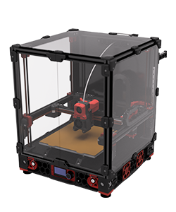

**What you're looking at:** The render is a stock Voron 2.4: the gantry across the top, four Z drives in the corners, the bed on its own frame, the electronics bay under the deck. Everything this step takes out of the chamber is something that could be crushed, cut or set alight the first time the machine moves under its own power.

**Parts:** none — preparation.

**Do:** Take everything out of the chamber: tools, offcuts, zip-tie tails, the bag of spare fasteners, the filament spool. Check the gantry and bed for anything resting on them and pull off any rubber rail stoppers still on the rails. Put a fire extinguisher within arm's reach and clear the bench of paper and IPA. Confirm the side and top panels are off.

**Check:** You can see the toolhead, all four Z drives, the electronics bay and the PSU without moving anything.

Source: [Voron docs image v2render.png](https://raw.githubusercontent.com/VoronDesign/Voron-Documentation/36b876b/build/startup/images/v2render.png) · [Voron startup wizard § Preparation](https://docs.vorondesign.com/build/startup/startup.html#preparation)

---

### Step 13.2 — Re-confirm the Checkpoint #1 result and the PSU voltage selector


**What you're looking at:** LDO's finished Rev D bay, photographed from below — the view you have with the machine on its side. Three things are being re-read in it: the PSU's red voltage slider, the SSR's four numbered terminals, and the Leviathan's five-position voltage-selection jumper block.

**Parts:** none — verification.

**Do:** Switch off at the inlet rocker and **pull the cord out of the inlet** (it has been in since Ch 12 Step 12.11), then look once more at the PSU's 115/230 V selector and confirm it matches your mains. Confirm the SSR wiring against the numbered terminals: control on INPUT 3 (red, +) and INPUT 4 (black, −), bed live on LOAD 1, mains brown on LOAD 2. Confirm **exactly two** Leviathan voltage-selection jumpers are fitted — **Fan2 and Fan3, both on the 24 V pins** — and that **Probe, Fan0 and Fan1 are still bare** (Step 10.28, Checkpoint 10). LDO: *"Mixing voltage will permanantly damage the controller and attached components."*

**Check:** Selector correct. No bare copper anywhere. Every wire duct still open so you can watch the bay. [src](https://docs.ldomotors.com/en/voron/voron2/wiring_guide_rev_d)

⚠ Rev D+ / LDO: there is **no 5 V PSU** in this kit — the Leviathan supplies the Pi's 5 V through the Pi HAT adapter. If you are looking for a second supply, you have the wrong manual pages (manual p.152, p.172, p.190 are all SKIP). (survey §4.2)

Source: [LDO wiring photo VS9 finished bay](https://raw.githubusercontent.com/MotorDynamicsLab/LDOVoron2/8270e8c/Images/WiringGuide/RevD/VS9_Final.jpg) · [LDO wiring guide § Checkpoint 1](https://docs.ldomotors.com/en/voron/voron2/wiring_guide_rev_d#checkpoint-1) · [LDO wiring guide § Preparing the power supply unit](https://docs.ldomotors.com/en/voron/voron2/wiring_guide_rev_d#preparing-the-power-supply-unit)

Pause: ~15 min since the last pause — bench cleared, tools and meter staged, Checkpoint #1 re-read and the PSU voltage selector confirmed for the third time. **The cord is out of the inlet.** The next segment is the power-on and runs straight through to the fan and light checks — do not start it with less than 45 minutes free.

---

### Step 13.3 — First power-on, hand on the switch

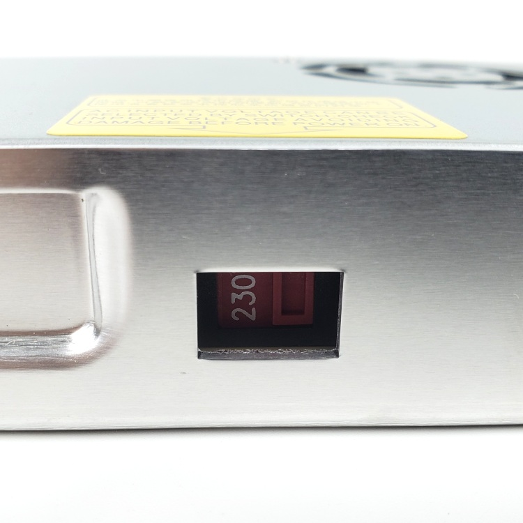

**What you're looking at:** The photo is the PSU's 115/230 V slide switch one last time. The rocker your hand is on is the one built into the C14 inlet module — the machine's only mains isolator, and the fastest way to cut power if something is wrong. This is the machine's second power-on (the first was Ch 12 Step 12.11, which flashed and configured it) and the first with a `printer.cfg` that can drive heaters and motors, so it gets the same drill.

**Parts:** none.

**Do:** Two people: one on the switch, the other watching from the front with hands out of the machine — nobody reaches in while the machine is live. Plug the mains lead in. Stand to the side of the machine, put your hand on the IEC inlet's rocker switch, and switch on. Keep your hand there for a full ten seconds. Listen and smell.

**Check:** The PSU's green LED lights. The Pi's power LED lights and its activity LED flickers. The toolboard's **3V3** and **24V** LEDs are lit (Ch 12 Step 12.19 shows them). Nothing clicks repeatedly, nothing buzzes, nothing smells hot, no stepper is humming or holding hard. If anything on that list is wrong, switch off immediately and go back to Ch 10.

Tip: a stepper that is warm to the touch after a minute of idling is normal (they hold at `run_current`); a stepper that is *hot* in a minute is not.

Source: [LDO wiring photo psu_switch.jpg](https://raw.githubusercontent.com/MotorDynamicsLab/LDOVoron2/8270e8c/Images/WiringGuide/psu_switch.jpg) · [LDO wiring guide § Checkpoint 1](https://docs.ldomotors.com/en/voron/voron2/wiring_guide_rev_d#checkpoint-1) · [Voron startup wizard § Preparation](https://docs.vorondesign.com/build/startup/startup.html#preparation) · [Ch 12 Step 12.11](12-software.md#step-1211-gate-power-the-bay-and-confirm-both-mcus-enumerate)

---

### Step 13.4 — Connect Klipper and confirm both MCUs

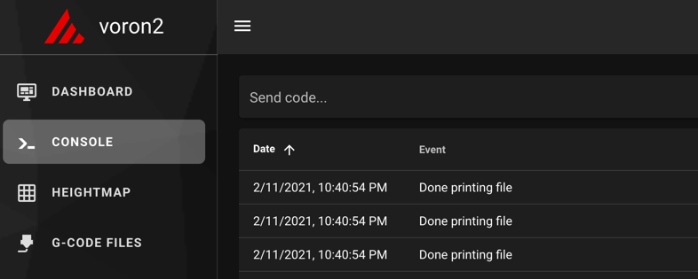

**What you're looking at:** The screenshot is the web interface's **Console** tab, where every command in this chapter is typed and every reply is read. `FIRMWARE_RESTART` restarts the host process *and* both microcontrollers, so a clean `Ready` after it means the whole software stack is talking to the whole machine.

**Parts:** none.

**Do:** Open the web interface at the Pi's address. Go to the **Console** tab — every command in this chapter is typed there. Send `FIRMWARE_RESTART`, then `STATUS`.

```
Send: FIRMWARE_RESTART
Recv: // Klipper state: Shutdown
Recv: // Klipper state: Ready
Send: STATUS
Recv: // Klipper state: Ready
```

**Check:** `Ready`, with no `mcu 'nhk': Unable to open serial port` and no `Option 'serial' in section 'mcu' must be specified`. Any error here is a Ch 12 problem, not a Ch 13 problem.

⚠ Rev D+ / LDO: `ls /dev/serial/by-id/*` over SSH must show exactly two Klipper devices — one `usb-Klipper_**stm32f446xx**_…` (Leviathan; `stm32h743xx` on a V1.3 board — the LDO guide's `stmf446xx` is a typo, Ch 12 Step 12.13) and one `usb-Klipper_**stm32g0b1xx**_…` (Nitehawk-SB **V2**). The Rev D wiring guide tells you to look for `rp2040`; that is the V1 board and it is not what you have. (survey §4.1 ②)

Source: [Voron docs image mainsail_terminal.png](https://raw.githubusercontent.com/VoronDesign/Voron-Documentation/36b876b/build/startup/images/mainsail_terminal.png) · [Voron startup wizard § Mainsail and Fluidd](https://docs.vorondesign.com/build/startup/startup.html#mainsail-and-fluidd) · [Klipper docs § FIRMWARE_RESTART](https://www.klipper3d.org/G-Codes.html#firmware_restart)

---

### Step 13.5 — Prove the 350 mm config edits are live

(no image — see text)

**What you're looking at:** Nothing to see on the machine — you are asking the *running* Klipper instance what it believes the machine's dimensions are, instead of trusting the file on disk. A config that was edited but never restarted still reports the old numbers, and homing would drive the toolhead into the frame. Moonraker answers that question directly in a browser; Mainsail has no panel that shows the limits, and `GET_POSITION` prints positions, not limits.

**Parts:** none.

**Do:** Do not trust the file on disk; ask the running instance. In a browser open:

```
http://voron.local/printer/objects/query?toolhead=axis_maximum
```

Then confirm in Mainsail's config editor that these are uncommented: `[stepper_x] position_endstop: 350` and `position_max: 350`; `[stepper_y]` the same; `[stepper_z] position_max: 330`; `[quad_gantry_level] gantry_corners: -60,-10 / 410,420` and `points: 50,25 / 50,275 / 300,275 / 300,25`; `[gcode_macro G32]` park line `G0 X175 Y175 Z30 F3600`; `[resonance_tester] probe_points: 175, 175, 20`.

**Check:** The browser shows `"axis_maximum": [350.0, 350.0, 330.0, 0.0]` — X, Y, Z, E — from the *running* config. `250` or `300` in the first two slots means the wrong size pair is live; anything else means the edit was never restarted. (There is no "default": with every size commented out Klipper refuses to start with `Option 'position_endstop' in section 'stepper_x' must be specified`, so if it is running, a pair is live — this step tells you which.) The proof on the machine itself is Steps 13.22–13.23: after `G28 X` then `G28 Y`, `M114` must read `X:350.000 Y:350.000`. (survey §5.2 W14)

Source: [`leviathan-printer-rev-d-sbv2.cfg`](https://github.com/MotorDynamicsLab/LDOVoron2/blob/667521d/Firmware/leviathan-printer-rev-d-sbv2.cfg#L47-235) · [`leviathan-printer-rev-d-sbv2.cfg`](https://github.com/MotorDynamicsLab/LDOVoron2/blob/667521d/Firmware/leviathan-printer-rev-d-sbv2.cfg#L471-524) · [Voron startup wizard § Preparation](https://docs.vorondesign.com/build/startup/startup.html#preparation) · [Moonraker API § Query printer object status](https://moonraker.readthedocs.io/en/latest/external_api/printer/)

---

## Part B — Temperatures, heaters, fans, lights

### Step 13.6 — Verify the three temperature readings at room temperature

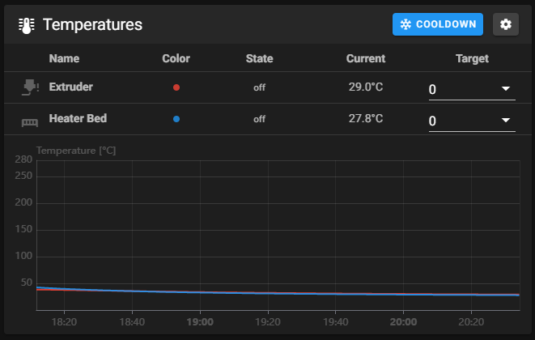

**What you're looking at:** The screenshot is the temperature panel, one trace per sensor. Three are expected: the hotend, the bed, and the chamber sensor on the toolboard. A sensor reading room temperature and staying there is a sensor that is wired and configured correctly.

**Parts:** none.

**Do:** Look at the temperature panel. You should have three sensors: `extruder`, `heater_bed` and `chamber_temp` (the config declares no Pi sensor — a fourth trace would be a sign you are on a different config). Read them and do nothing else for thirty seconds.

**Check:** Extruder, bed and chamber all read within a couple of degrees of the actual room temperature, and **none of them is climbing**. If a temperature is rising with nothing commanded, cut power at the switch — a heater is energised through a wiring fault. If a reading is wildly wrong or jittering, check the crimps and the `sensor_type` / `sensor_pin` entries; extruder and bed are `ATC Semitec 104NT-4-R025H42G` with `pullup_resistor: 2200` in the LDO config; the chamber sensor is on the toolboard's `CT` port, which has a **4.7 kΩ** pull-up, so `[temperature_sensor chamber_temp]` carries **no** `pullup_resistor` line and must not be given one (Klipper's default is 4700). [src](https://docs.vorondesign.com/build/startup/)

⚠ Rev D+ / LDO: the hotend and chamber thermistors land on the **Nitehawk V2** through **JST-PH2.0** connectors, not the XH2.5 the Rev D wiring guide names. A spare pigtail crimped to XH2.5 will not fit, and a PH2.0 housing can be forced into the wrong header. (survey §4.1 ③)

Source: [Voron docs image mainsail_temp_graph.png](https://raw.githubusercontent.com/VoronDesign/Voron-Documentation/36b876b/build/startup/images/mainsail_temp_graph.png) · [Voron startup wizard § Verify temperature](https://docs.vorondesign.com/build/startup/startup.html#verify-temperature) · [Klipper docs § Common thermistors](https://www.klipper3d.org/Config_Reference.html#common-thermistors) · [Klipper `thermistor.py`](https://github.com/Klipper3d/klipper/blob/f0892d8/klippy/extras/thermistor.py#L73) (the 4700 Ω default)

---

### Step 13.7 — Short heat test: hotend to 50 °C

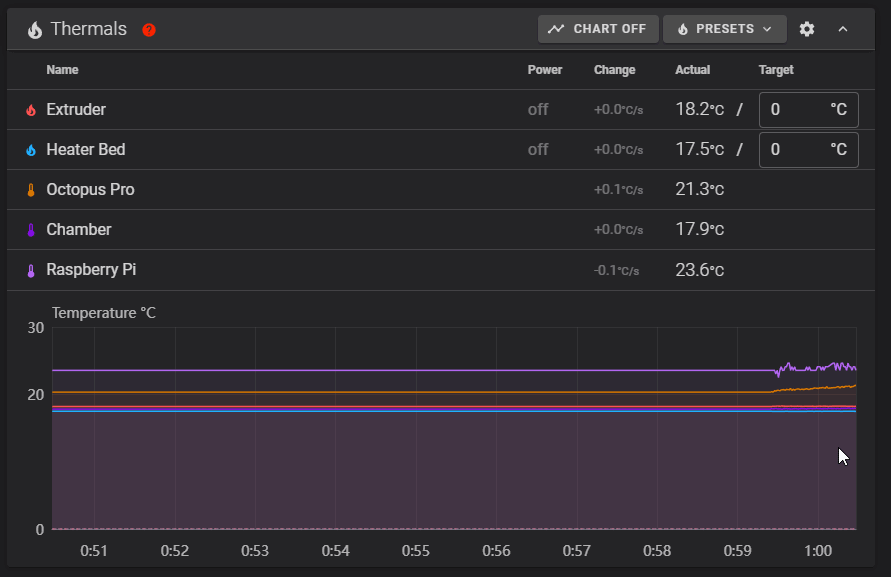

**What you're looking at:** The animation shows a heater climbing on the graph once a target is set. 50 °C is chosen deliberately: hot enough to prove the heater and its thermistor are the same pair, cool enough to be harmless if they are not.

**Parts:** none.

**Do:** Hand back on the power switch. Set the **Extruder** target to 50 and press enter. Watch the graph, and watch the toolboard's **HE0** LED (Ch 12 Step 12.19 shows it).

**Check:** The extruder temperature starts climbing within about 10 s, and the HE0 LED is lit while the target is set. Set the target back to **Off** and confirm it decays toward room temperature over the next few minutes. If a *different* sensor heats, your thermistor or heater connections are swapped. If nothing heats: HE0 LED **on** with no climb is the heater side — cartridge lead, ferrules, the HE0 screw terminal (Ch 08 Step 08.47); HE0 LED **off** is the pin or config side — `[extruder] heater_pin: nhk:PA7`. [src](https://docs.vorondesign.com/build/startup/)

Source: [Voron docs image heaters.gif](https://raw.githubusercontent.com/VoronDesign/Voron-Documentation/36b876b/build/startup/images/heaters.gif) · [Voron startup wizard § Verify heaters](https://docs.vorondesign.com/build/startup/startup.html#verify-heaters)

---

### Step 13.8 — Short heat test: bed to 50 °C, and watch the SSR

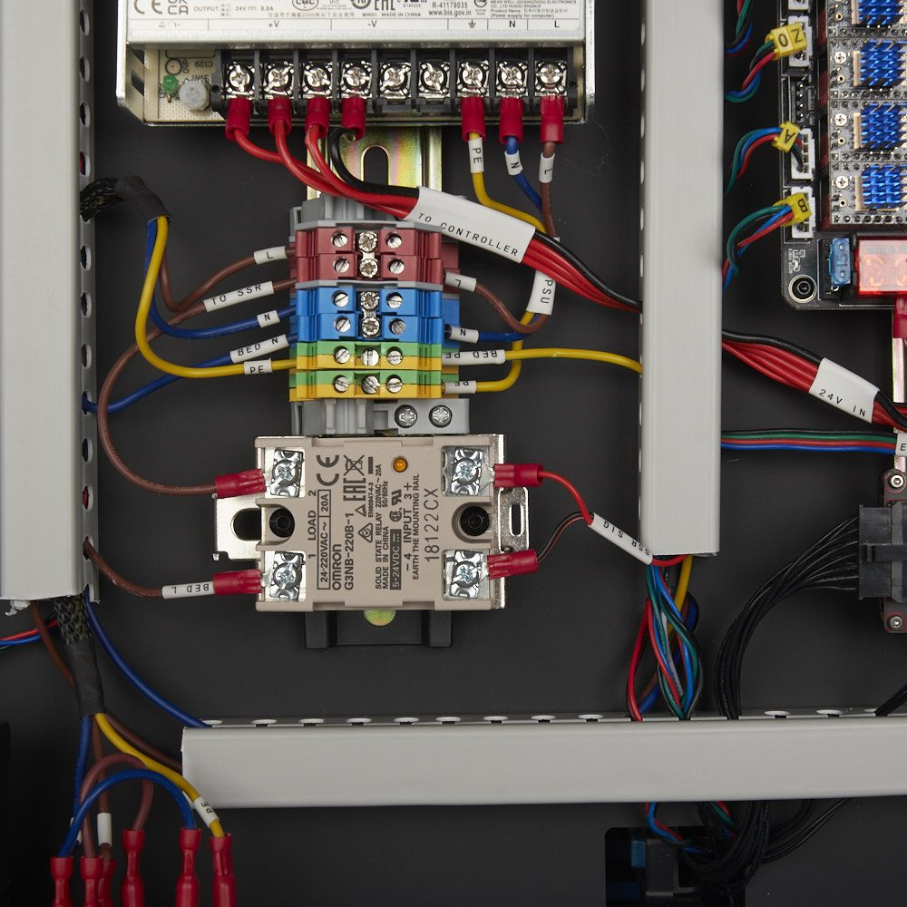

**What you're looking at:** The same test on the other heater, with a second thing to watch — the SSR's own indicator LED down in the bay. That LED shows the relay's control side receiving its signal, which splits any bed fault cleanly into two halves: mains side, or control side.

**Parts:** none.

**Do:** Hand back on the switch. Set the **Bed** target to 50. Watch the SSR's indicator LED in the electronics bay as well as the graph.

**Check:** The SSR LED comes on, and the bed temperature climbs. Set the target to **Off**. If the SSR LED lights but the bed does not heat, the fault is on the mains side of the SSR. If the SSR LED never lights, the fault is on the control side — the commonest cause is the control pair reversed (Leviathan **+** must go to SSR INPUT **3**). [src](https://docs.vorondesign.com/build/startup/)

Tip: `[heater_bed] max_power: 0.6` in the LDO config is deliberate — it limits warp on a 350 plate. Do not raise it because 100 °C feels slow.

Source: [LDO wiring photo SSR_Close_Up.jpg](https://raw.githubusercontent.com/MotorDynamicsLab/LDOVoron2/8270e8c/Images/WiringGuide/RevC/SSR_Close_Up.jpg) · [Voron startup wizard § Verify heaters](https://docs.vorondesign.com/build/startup/startup.html#verify-heaters) · [LDO wiring guide § Connecting 24V](https://docs.ldomotors.com/en/voron/voron2/wiring_guide_rev_d#connecting-24v) · [`leviathan-printer-rev-d-sbv2.cfg`](https://github.com/MotorDynamicsLab/LDOVoron2/blob/667521d/Firmware/leviathan-printer-rev-d-sbv2.cfg#L288-307) · [Video: Part 9 @1:36:02](https://www.youtube.com/watch?v=dmNwxUm4oik&list=PL0fUJbigELQPqpeGOgHYisG4KaSXVtnNY&t=5762s)

---

### Step 13.9 — Hotend fan (Stealthburner **bottom** fan)

(no image — see text)

**What you're looking at:** The Stealthburner's **bottom** fan is the hotend fan. It cools the heatsink above the nozzle and runs automatically whenever the hotend is hot, with nobody commanding it. A hotend heated with this fan dead will jam within one print.

**Parts:** none.

**Do:** Set the Extruder target to 50 again and leave it there for this step and the next.

**Check:** The **bottom** fan of the Stealthburner spins up as soon as the hotend is active, and stays on above 50 °C. This is `[heater_fan hotend_fan]` on `nhk:PD0` with `heater_temp: 50.0`. A hotend fan that does not run will clog the hotend on your first print. **If the *top* (5015) fan is what answers the hotend** — and at Step 13.10 the *bottom* fan answers `M106` — the fan adapter's HEF/PCF assignment is the reverse of the config, the source conflict Ch 08 Step 08.46 warned about. Fix it in software, exactly as 08.46 says: exchange `pin: nhk:PD0` and `pin: nhk:PA15` between `[heater_fan hotend_fan]` and `[fan]` (and the commented `tachometer_pin` lines `PD1`/`PD2` with them), `RESTART`, and re-run 13.9–13.10. Do **not** re-plug P2/P4 or re-crimp anything. [src](https://docs.vorondesign.com/build/startup/) · [src](https://github.com/MotorDynamicsLab/LDOVoron2/blob/667521d/Firmware/leviathan-printer-rev-d-sbv2.cfg#L327-347)

Source: [Voron startup wizard § Hotend fan](https://docs.vorondesign.com/build/startup/startup.html#hotend-fan) · [`leviathan-printer-rev-d-sbv2.cfg`](https://github.com/MotorDynamicsLab/LDOVoron2/blob/667521d/Firmware/leviathan-printer-rev-d-sbv2.cfg#L337-347)

---

### Step 13.10 — Part cooling fan (Stealthburner **top** fan)

(no image — see text)

**What you're looking at:** The **top** fan is the part-cooling fan — it blows down through the printed ducts onto the plastic just laid, and only the slicer or a manual `M106` turns it on. Nothing about the hotend's temperature affects it.

**Parts:** none.

**Do:** Send `M106 S255`, then `M107`.

**Check:** The **top** fan spins to full and you feel air under the nozzle; `M107` stops it. This is `[fan]` on `nhk:PA15`. Note that `off_below: 0.10` means anything under 10 % commands zero — that is expected, not a fault. If the **bottom** fan is what `M106` drives (and the top one answered the hotend at 13.9), the two pins are swapped in the config — Step 13.9's fix, then set the Extruder target to **Off**.

⚠ Rev D+ / LDO: the 2×5 (10-pin) board-to-board header between the Stealthburner fan adapter and the toolboard has **reversed gender and is keyed** on Rev D+. If a toolhead fan does nothing at all, do not press the connector harder — check that it seated with the key, not against it. (survey §4.1 ④)

Source: [Voron startup wizard § Part cooling fan](https://docs.vorondesign.com/build/startup/startup.html#part-cooling-fan) · [`leviathan-printer-rev-d-sbv2.cfg`](https://github.com/MotorDynamicsLab/LDOVoron2/blob/667521d/Firmware/leviathan-printer-rev-d-sbv2.cfg#L327-336)

---

### Step 13.11 — Bay fan and filter fan

(no image — see text)

**What you're looking at:** Two fans that are not on the toolhead: the 6020 pair in the electronics bay, which the config ties to the bed heater *being commanded* (and to any enabled stepper) so they run whenever the bay could be dissipating heat, and the Nevermore's blower, which Ch 12 deliberately made a macro-commandable fan rather than a heater-slaved one.

**Parts:** none.

**Do:** Set the **Bed** target to 60. Do not wait for a temperature — within a second the bay fan pair starts. Set the bed back to **Off** and watch the pair keep running for about 30 s, then stop. Then send `SET_FAN_SPEED FAN=nevermore SPEED=1` and, after confirming it, `SET_FAN_SPEED FAN=nevermore SPEED=0`.

**Check:** The electronics-bay fan pair starts the instant a bed target is set (`[controller_fan controller_fan]`, `FAN2/PF7`: Klipper's controller fan keys on the heater having a non-zero **target**, or on any stepper being enabled — not on temperature) and runs on for `idle_timeout`, 30 s by default, after the target goes to Off and no stepper is enabled. It was already running during Step 13.8 for the same reason. The Nevermore fan (`FAN3/PF9`) runs **only** while you command it: it is **not** slaved to the bed.

⚠ Rev D+ / LDO: the LDO config names `FAN3/PF9` `[heater_fan exhaust_fan]`, but on this build that port drives the **Nevermore filter fan** — the kit has no exhaust fan. Ch 12 Step 12.32 replaced that section with `[fan_generic nevermore]` so `PRINT_START` can run the filter for the whole print, so there is no `heater_temp: 60` trigger any more and nothing happens at bed 60 °C. Do not go looking for a second fan or a wiring fault. (survey §3.2, §4.2 p.250–253)

Source: [Voron startup wizard § Controller fan](https://docs.vorondesign.com/build/startup/startup.html#controller-fan) · [`leviathan-printer-rev-d-sbv2.cfg`](https://github.com/MotorDynamicsLab/LDOVoron2/blob/667521d/Firmware/leviathan-printer-rev-d-sbv2.cfg#L348-383) · [Klipper `controller_fan.py`](https://github.com/Klipper3d/klipper/blob/f0892d8/klippy/extras/controller_fan.py) · [LDO wiring guide § Connecting the fans and the LED strip](https://docs.ldomotors.com/en/voron/voron2/wiring_guide_rev_d#connecting-the-fans-and-the-led-strip)

---

### Step 13.12 — Lights

(no image — see text)

**What you're looking at:** Two independent lighting systems. The COB strips on the chamber ceiling are plain LEDs on a dimmable output, switched with `SET_PIN`. The three Stealthburner LEDs are addressable — each carries its own tiny controller — so they take a colour command rather than a brightness.

**Parts:** none.

**Do:** Send `SET_PIN PIN=caselight VALUE=1`, then `SET_LED LED=rgb_light RED=1 GREEN=1 BLUE=1 WHITE=1`.

**Check:** The chamber COB strips come on (`[output_pin caselight]`, `PE6`). All three Stealthburner LEDs light. If the colours come out wrong rather than absent, the LEDs work and only `color_order` is off — the LDO config sets `chain_count: 3`, `color_order: GRBW`, which is correct for the supplied diffuser and LEDs. (survey §4.4 #12)

Source: [`leviathan-printer-rev-d-sbv2.cfg`](https://github.com/MotorDynamicsLab/LDOVoron2/blob/667521d/Firmware/leviathan-printer-rev-d-sbv2.cfg#L384-410) · [LDO wiring guide § Connecting the fans and the LED strip](https://docs.ldomotors.com/en/voron/voron2/wiring_guide_rev_d#connecting-the-fans-and-the-led-strip) · [Klipper docs § neopixel](https://www.klipper3d.org/Config_Reference.html#neopixel)

Pause: ~40 min since the last pause — the machine has been powered, Klipper reports `Ready` with both MCUs, all three temperatures read room ambient, both heaters proved they climb and stop, and every fan and light has been commanded on and off. Nothing has moved yet. Heaters off, machine idle.

---

## Part C — Motors

### Step 13.13 — `STEPPER_BUZZ` the four Z motors

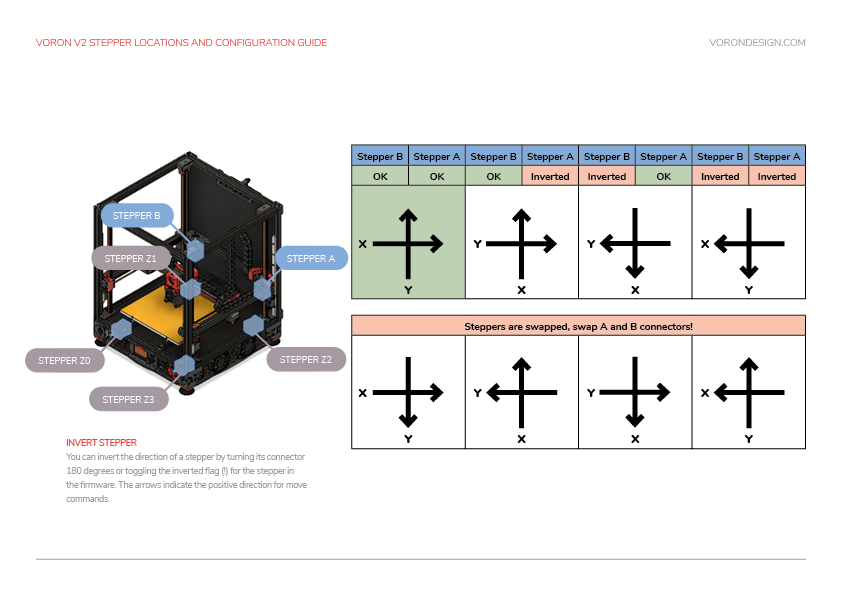
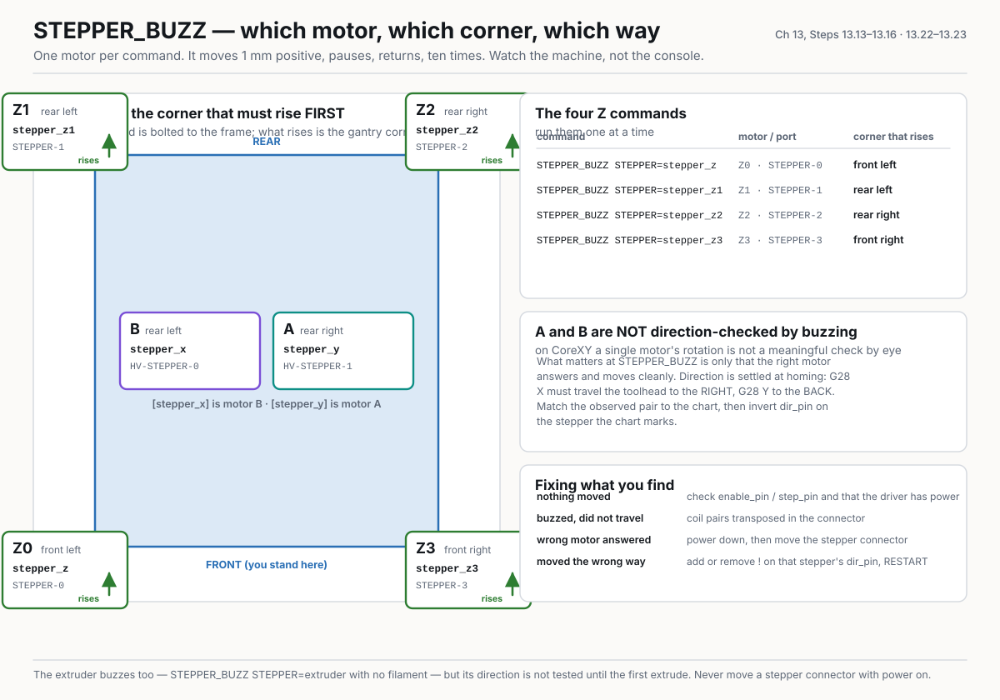

**What you're looking at:** The chart is Voron's own map of which motor sits at which corner and which config name it answers to. `STEPPER_BUZZ` moves one named motor 1 mm and back, ten times: the only way to prove a cable goes where its tag says without moving anything else. The diagram is the picture of the table below: all four Z corners named with the command that must move each one, the port it is on, and that what rises is the gantry corner, not the bed.

**Parts:** none.

**Do:** Run the four Z commands one at a time, watching the machine — not the console. `STEPPER_BUZZ` prints nothing; it moves the named stepper 1 mm positive, pauses, returns, and repeats ten times.

```
Send: STEPPER_BUZZ STEPPER=stepper_z
Send: STEPPER_BUZZ STEPPER=stepper_z1
Send: STEPPER_BUZZ STEPPER=stepper_z2
Send: STEPPER_BUZZ STEPPER=stepper_z3
```

**Check:** Exactly one motor responds per command, it moves cleanly (forward, pause, back, pause), and it lifts the corner named below **first**, before returning.

| Command | Motor | Corner that must rise first |
|---|---|---|
| `STEPPER_BUZZ STEPPER=stepper_z` | Z0, `STEPPER-0` | front **left** |
| `STEPPER_BUZZ STEPPER=stepper_z1` | Z1, `STEPPER-1` | rear **left** |
| `STEPPER_BUZZ STEPPER=stepper_z2` | Z2, `STEPPER-2` | rear **right** |
| `STEPPER_BUZZ STEPPER=stepper_z3` | Z3, `STEPPER-3` | front **right** |

Note: the wizard's V2 table words this as "the corner of the **bed** moves up". On a 2.4 the bed is bolted to the frame and does not move — what rises 1 mm is the corresponding corner of the **gantry**. Sight along the top of the X extrusion against the frame to see it.

Source: [Voron docs image V2-motor-configuration-guide.png](https://raw.githubusercontent.com/VoronDesign/Voron-Documentation/36b876b/build/startup/images/V2-motor-configuration-guide.png) · [Voron startup wizard § Stepper motor check](https://docs.vorondesign.com/build/startup/startup.html#stepper-motor-check) · [Klipper docs § STEPPER_BUZZ](https://www.klipper3d.org/G-Codes.html#stepper_buzz) · [Video: Part 9 @1:42:04](https://www.youtube.com/watch?v=dmNwxUm4oik&list=PL0fUJbigELQPqpeGOgHYisG4KaSXVtnNY&t=6124s)

---

### Step 13.14 — `STEPPER_BUZZ` the A and B motors

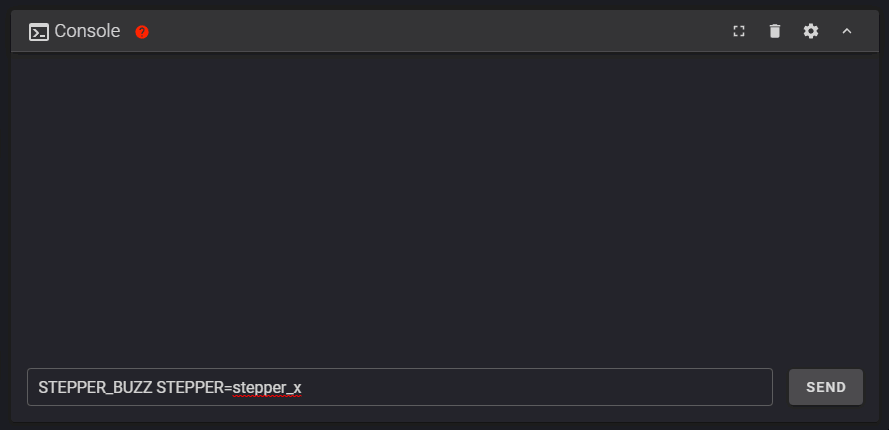


**What you're looking at:** The animation shows what a healthy buzz looks like. A and B are the two rear-corner motors that drive the whole gantry through the crossed CoreXY belts, so neither one moves a single axis by itself — which is why their direction is settled later, at the homing check. The diagram's A/B panel shows both motors on the rear extrusion with the config sections that drive them — `[stepper_x]` is motor B, `[stepper_y]` is motor A — and the homing directions that actually settle direction (G28 X to the right, G28 Y to the back).

**Parts:** none.

**Do:** Run the two gantry commands.

```
Send: STEPPER_BUZZ STEPPER=stepper_x
Send: STEPPER_BUZZ STEPPER=stepper_y
```

**Check:** `stepper_x` moves the **rear-left** motor (B, `HV-STEPPER-0`); `stepper_y` moves the **rear-right** motor (A, `HV-STEPPER-1`). Both must move cleanly with no grinding or vibrating in place. The wizard's expectation is "rotate clockwise first, then back counterclockwise", but do not spend time on that here: on CoreXY a single motor's rotation direction is not a meaningful check by eye. **A/B direction is settled at the homing check in Step 13.22–13.23**, against the chart above. What matters right now is that the right motor answers and that it moves cleanly. [src](https://docs.vorondesign.com/build/startup/)

Source: [Voron docs image verifysteppers.gif](https://raw.githubusercontent.com/VoronDesign/Voron-Documentation/36b876b/build/startup/images/verifysteppers.gif) · [Voron startup wizard § Motor configuration guide for the Voron V2](https://docs.vorondesign.com/build/startup/startup.html#motor-configuration-guide-for-the-voron-v2) · [Klipper docs § STEPPER_BUZZ](https://www.klipper3d.org/G-Codes.html#stepper_buzz) · [Video: Part 9 @1:53:47](https://www.youtube.com/watch?v=dmNwxUm4oik&list=PL0fUJbigELQPqpeGOgHYisG4KaSXVtnNY&t=6827s)

---

### Step 13.15 — `STEPPER_BUZZ` the extruder

(no image — see text)

**What you're looking at:** The extruder motor lives on the toolhead and drives the Clockwork 2's pair of geared wheels that grip the filament. With no filament loaded, all you are looking for is those gears turning back and forth.

**Parts:** none.

**Do:** Send `STEPPER_BUZZ STEPPER=extruder` with no filament loaded.

**Check:** The Clockwork 2 gears turn back and forth. Direction is not tested here — it is tested when you first extrude, in Step 13.40. If nothing moves, check `[extruder] step_pin: nhk:PB8 / dir_pin: nhk:PB9 / enable_pin: !nhk:PC14` — these are the **V2** pins; the V1 config's `gpio23/24/25` will silently do nothing on this board.

Source: [Voron startup wizard § Stepper motor check](https://docs.vorondesign.com/build/startup/startup.html#stepper-motor-check) · [Klipper docs § STEPPER_BUZZ](https://www.klipper3d.org/G-Codes.html#stepper_buzz) · [`leviathan-printer-rev-d-sbv2.cfg`](https://github.com/MotorDynamicsLab/LDOVoron2/blob/667521d/Firmware/leviathan-printer-rev-d-sbv2.cfg#L236-287)

---

### Step 13.16 — Correct any wrong motor or wrong direction

(no image — see text)

**What you're looking at:** Four different faults look almost identical from the console, and each has its own fix: nothing at all is power or pins, a buzz without travel is coil wiring, a wrong motor is a wrong port, and a wrong direction is one character in the config. Only the last of the four is fixed in software.

**Parts:** none.

**Do:** Fix what Steps 13.13–13.15 found, one cause at a time.
- **Nothing moved:** check `enable_pin` and `step_pin`, and that the driver has power.
- **Buzzed but did not travel 1 mm cleanly:** stepper phase wiring — the two coil pairs are transposed in the connector.
- **The wrong motor answered:** the motors are in the wrong ports. **Power the machine down** before moving any stepper connector.
- **It moved the wrong way:** invert that stepper's `dir_pin` — add a `!` (`dir_pin: PD3` → `dir_pin: !PD3`), or remove the `!` if one is already there. `RESTART` and re-run the buzz.

**Check:** Every motor in Steps 13.13–13.15 now passes the tests that apply to it — right motor and clean motion for all seven, right direction for the four Z motors. A/B direction is settled at Steps 13.22–13.23 and the extruder's at Step 13.40; do not try to judge those by buzz. Do not proceed with a known-bad axis. [src](https://docs.vorondesign.com/build/startup/)

Source: [Voron startup wizard § Motor configuration guide for the Voron V2](https://docs.vorondesign.com/build/startup/startup.html#motor-configuration-guide-for-the-voron-v2) · [LDO wiring guide § Connecting steppers](https://docs.ldomotors.com/en/voron/voron2/wiring_guide_rev_d#connecting-steppers) · [Video: Part 9 @2:23:56](https://www.youtube.com/watch?v=dmNwxUm4oik&list=PL0fUJbigELQPqpeGOgHYisG4KaSXVtnNY&t=8636s)

Pause: ~20 min since the last pause — every motor buzzed, identified and turning the right way, and any swap has been fixed **at the connector, not in the config**. The machine still has not homed.

---

## Part D — Endstops and probe

### Step 13.17 — `QUERY_ENDSTOPS` with everything released

(no image — see text)

**What you're looking at:** `QUERY_ENDSTOPS` reports each limit switch's present state without moving anything at all. `open` means the switch is not pressed. Stock Voron endstops are wired normally-closed to ground, so a `TRIGGERED` reading on an untouched switch means a broken circuit, not a reversed one.

**Parts:** none.

**Do:** Send `M84` to de-energise the motors, push the toolhead to the middle of the build volume by hand, and set the gantry's height by hand too: about a **third of the way up its travel** — nozzle roughly 100 mm above the plate, and well over 100 mm below the top stop. Slow hand moves with the drivers disabled are fine; do not shove it. The reason: every `G28 X` or `G28 Y` sent before Z is homed lifts the gantry another 10 mm from wherever it is (`[safe_z_home] z_hop: 10` — it cannot know where Z is, so it assumes "here"), and there are five of them between Step 13.22 and the full `G28` at Step 13.27. Parked at the top, the four Z motors stall into the frame on the first one; parked on the bed, a reversed Z direction drives the nozzle into the plate instead. Then send `QUERY_ENDSTOPS`.

```
Send: QUERY_ENDSTOPS
Recv: // x:open y:open z:open
```

**Check:** All three read `open`. If one reads `TRIGGERED` with nothing pressing it, do **not** just add a `!` — all stock Voron endstops are normally-closed switches to ground, so an inverted reading almost always means a wiring fault. [src](https://docs.vorondesign.com/build/startup/)

⚠ Rev D+ / LDO: if your XY endstop cables are labelled **"X Stop / Y Stop"** instead of **"XES / YES"**, you have the mis-pinned batch and both X and Y will misbehave here. Re-pin per LDO's guide before going further. [src](https://docs.ldomotors.com/en/guides/XY_Endstop_Cable_Reconnecting_Guide) (survey §4.4 #14)

Source: [Voron startup wizard § Endstop check](https://docs.vorondesign.com/build/startup/startup.html#endstop-check) · [Klipper docs § QUERY_ENDSTOPS](https://www.klipper3d.org/G-Codes.html#query_endstops) · [Klipper `safe_z_home.py`](https://github.com/Klipper3d/klipper/blob/f0892d8/klippy/extras/safe_z_home.py) · [LDO XY endstop reconnecting guide](https://docs.ldomotors.com/en/guides/XY_Endstop_Cable_Reconnecting_Guide)

---

### Step 13.18 — X endstop by hand

(no image — see text)

**What you're looking at:** The X endstop is one of the two microswitches on the gantry pod, pressed by the toolhead at the right-hand end of its travel. Pushing it by hand tests the switch, its cable and its board port as one chain, with no motor involved.

**Parts:** none.

**Do:** Push the toolhead all the way to the **right** until you hear the endstop pod click, hold it there, and send `QUERY_ENDSTOPS`.

```
Send: QUERY_ENDSTOPS
Recv: // x:TRIGGERED y:open z:open
```

**Check:** Only `x` changes. Push the toolhead back to the middle and confirm it returns to `open`. If the toolhead cannot reach the switch, look for a rubber rail stopper still on the rail, then for a racked gantry.

Source: [Voron startup wizard § Endstop check](https://docs.vorondesign.com/build/startup/startup.html#endstop-check) · [Klipper docs § QUERY_ENDSTOPS](https://www.klipper3d.org/G-Codes.html#query_endstops)

---

### Step 13.19 — Y endstop by hand

(no image — see text)

**What you're looking at:** The Y endstop is the other switch on that same pod, pressed when the whole gantry reaches the back of the machine. Same three-part chain, same test.

**Parts:** none.

**Do:** Push the gantry all the way to the **back** until the endstop clicks, hold, and send `QUERY_ENDSTOPS`.

```
Send: QUERY_ENDSTOPS
Recv: // x:open y:TRIGGERED z:open
```

**Check:** Only `y` changes, and it releases when you move the gantry forward again.

Source: [Voron startup wizard § Endstop check](https://docs.vorondesign.com/build/startup/startup.html#endstop-check) · [Klipper docs § QUERY_ENDSTOPS](https://www.klipper3d.org/G-Codes.html#query_endstops)

---

### Step 13.20 — Z endstop (the LDO nozzle probe) by hand

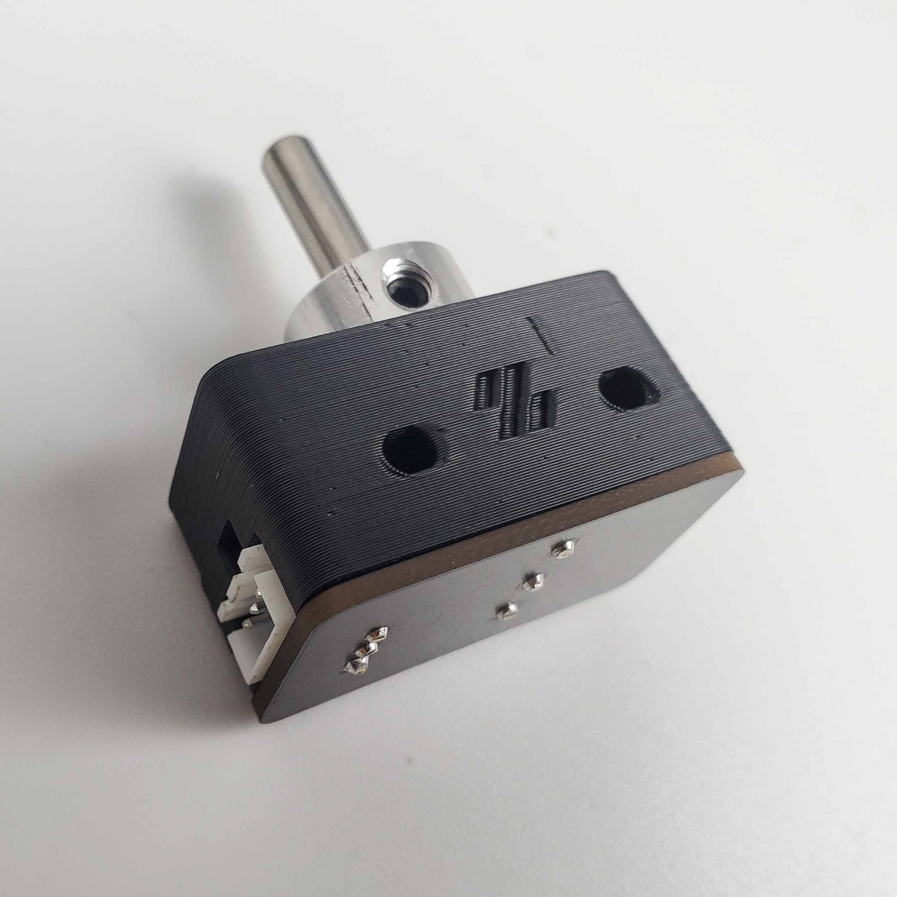

**What you're looking at:** The photo is the LDO nozzle probe as installed: a sprung 5 mm shaft standing up beside the bed with a D2F microswitch under it. The nozzle presses that shaft at the end of every Z homing move, which is what makes this part — not the inductive probe — the machine's definition of Z=0.

**Parts:** none.

**Do:** Press the nozzle probe's sliding shaft down with a finger until the D2F switch clicks, hold, and send `QUERY_ENDSTOPS`.

```
Send: QUERY_ENDSTOPS
Recv: // x:open y:open z:TRIGGERED
```

**Check:** Only `z` changes. Release the shaft: it must spring back up **freely** and read `open` again. If it is sticky, back off the probe body's set screw a quarter turn — its job is only to stop the shaft falling out, not to grip it. This is the part that defines Z=0 for every print you will ever make on this machine. [src](https://docs.ldomotors.com/en/voron/voron2/wiring_guide_rev_d)

Source: [LDO wiring photo z_stop_final.jpg](https://raw.githubusercontent.com/MotorDynamicsLab/LDOVoron2/8270e8c/Images/WiringGuide/z_stop_final.jpg) · [LDO wiring guide § Assembling the nozzle probe](https://docs.ldomotors.com/en/voron/voron2/wiring_guide_rev_d#assembling-the-nozzle-probe) · [Voron startup wizard § Endstop check](https://docs.vorondesign.com/build/startup/startup.html#endstop-check)

---

### Step 13.21 — `QUERY_PROBE` on the inductive probe

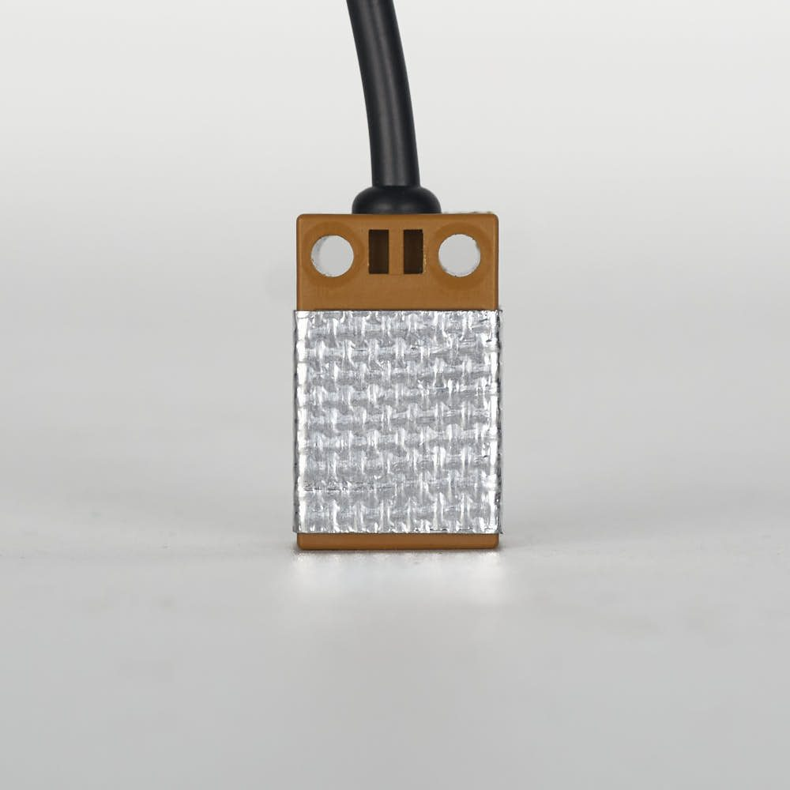

**What you're looking at:** The Omron inductive probe senses metal at a distance without touching it, and on this build it is used only to level the gantry and shape the mesh. The photo shows the fibreglass heat shield it must wear: front and sides only, sensing face bare, because tape across the face changes the height at which it triggers.

**Parts:** none.

**Do:** *(Brought forward from the wizard's Probe Check page, which sits five pages later — safe here because the gantry is high and nothing is homed.)* With the gantry still high and well clear of the bed, send `QUERY_PROBE`. Then hold a steel offcut (or the flex plate) up under the probe face and send it again.

```
Send: QUERY_PROBE
Recv: // probe: open

  (metal close to the probe)

Send: QUERY_PROBE
Recv: // probe: TRIGGERED
```

**Check:** `open` when far, `TRIGGERED` when metal is close. If it is stuck one way, check ground/signal/24 V at the probe and that `[probe] pin: nhk:PC15` matches where it is actually plugged. If the sense is inverted, add a `!` (`pin: !nhk:PC15`). [src](https://docs.vorondesign.com/build/startup/)

⚠ Rev D+ / LDO: the PROBE port is **JST-PH2.0** on Rev D+ and is **24 V only**. Also confirm the probe body still carries the supplied fibreglass tape on the **front and sides only — not the back and not the bottom** (manual p.143 / LDO note); tape on the sensing face changes the trigger height. (survey §4.1 ③, §4.2 p.143)

Source: [LDO wiring photo Probe_Insulation.jpg](https://raw.githubusercontent.com/MotorDynamicsLab/LDOVoron2/8270e8c/Images/WiringGuide/RevC/Probe_Insulation.jpg) · [Voron startup wizard § Probe check](https://docs.vorondesign.com/build/startup/startup.html#probe-check) · [Klipper docs § QUERY_PROBE](https://www.klipper3d.org/G-Codes.html#query_probe) · [`leviathan-printer-rev-d-sbv2.cfg`](https://github.com/MotorDynamicsLab/LDOVoron2/blob/667521d/Firmware/leviathan-printer-rev-d-sbv2.cfg#L308-326)

Pause: ~20 min since the last pause — all three endstops and the inductive probe respond correctly to `QUERY_ENDSTOPS` / `QUERY_PROBE`, tested by hand with nothing homed. Do not stop halfway through the endstop set: the value of this pass is seeing all four in one sitting.

---

## Part E — Homing and machine coordinates

### Step 13.22 — Home X, with an abort ready

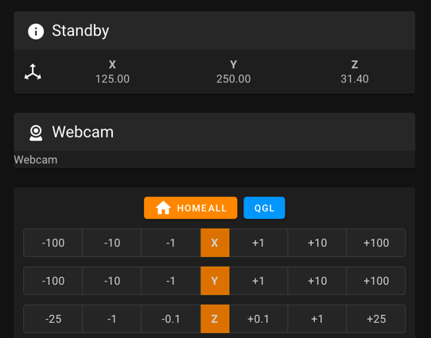

**What you're looking at:** The screenshot is the interface's jog and homing panel. Homing X means driving toward the endstop until it trips, backing off 5 mm and touching again slowly; the small lift before all that is `z_hop`, which keeps the nozzle off the bed while the toolhead crosses it. The stop you test first is `M112`: it is the one command Klipper pulls out of the queue *while a move is running* — `RESTART` would wait behind the move until it finished, which is no use at all.

**Parts:** none.

**Do:** Two people: one owns the stop, the other watches from the front with hands out of the machine. First *test* the stop: send `M112` from the console and confirm Klipper shuts down (`Klipper state: Shutdown`); press Mainsail's red **Emergency Stop** button and the touchscreen E-stop once each too, so everyone knows all three do the same thing; `FIRMWARE_RESTART` after each to bring it back. Now put `M112` typed and unsent in a second console window, and confirm the gantry is still where Step 13.17 left it — a third of the way up, nowhere near the top. Send `G28 X`.

**Check:** The toolhead lifts 10 mm (that is `[safe_z_home] z_hop: 10`), then travels to the **right** until it hits the X endstop, backs off 5 mm and re-touches. Any other direction: send `M112`, `FIRMWARE_RESTART`, note what happened, and still go on to test Y before changing anything — you need both results to read the chart. [src](https://docs.vorondesign.com/build/startup/)

Source: [Voron docs image mainsail_controls.png](https://raw.githubusercontent.com/VoronDesign/Voron-Documentation/36b876b/build/startup/images/mainsail_controls.png) · [Voron startup wizard § XY homing check](https://docs.vorondesign.com/build/startup/startup.html#xy-homing-check) · [Klipper docs § M112](https://www.klipper3d.org/G-Codes.html#g-code-commands) · [Klipper `gcode.py`](https://github.com/Klipper3d/klipper/blob/f0892d8/klippy/gcode.py) (M112 is scanned out of the pending input while a command runs)

---

### Step 13.23 — Home Y, then read the chart


**What you're looking at:** The chart maps every combination of observed X and Y homing directions onto a cause. The upper block is a direction problem, fixed with one character in the config; the lower orange block means the two motors are physically swapped, fixed at the connector with the power off.

**Parts:** none.

**Do:** `M112` ready. Send `G28 Y` (another 10 mm lift first — Z is still unhomed). Then compare what X and Y actually did against the chart, and send `M114`.

**Check:** The toolhead travels to the **back** until it hits the Y endstop, and `M114` reads `X:350.000 Y:350.000` — the running config is the 350 pair. To correct:
- Match your observed X/Y arrow pair to a column in the **upper** block of the chart, then invert `dir_pin` on the stepper(s) that column marks *Inverted* — `[stepper_x]` is motor **B**, `[stepper_y]` is motor **A**.
- If your observation matches the **lower (orange)** block, the motors themselves are swapped: **power down**, physically exchange the A and B connectors at the board, power up, and re-test.
- If the gantry moves *downward* first instead of sideways, your Z stepper directions are reversed — go back to Step 13.16.

Source: [Voron docs image V2-motor-configuration-guide.png](https://raw.githubusercontent.com/VoronDesign/Voron-Documentation/36b876b/build/startup/images/V2-motor-configuration-guide.png) · [Voron startup wizard § XY homing check](https://docs.vorondesign.com/build/startup/startup.html#xy-homing-check)

---

### Step 13.24 — Bed locating: line up the Z endstop and set the bed gap

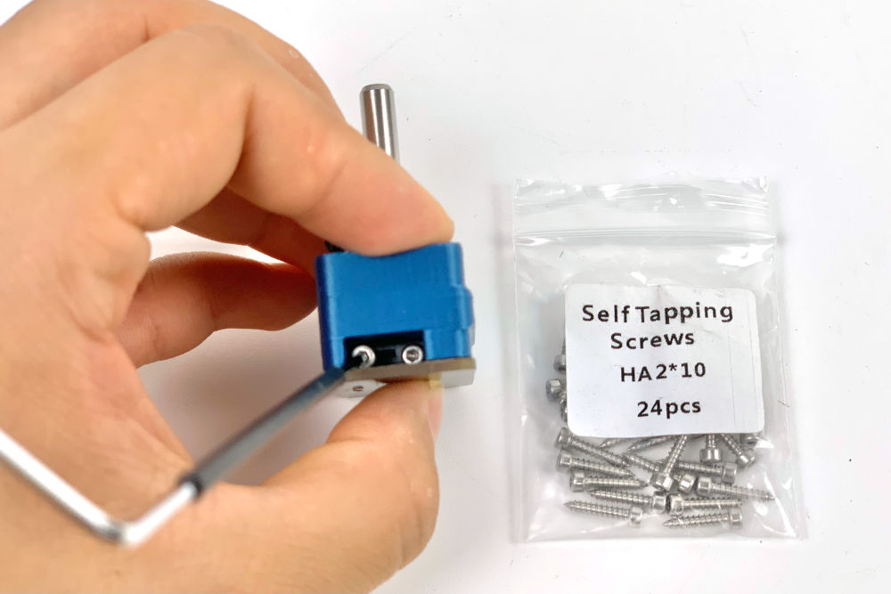

**What you're looking at:** The photo is the nozzle probe as LDO mounts it. Two things have to line up: the shaft directly under the nozzle when the toolhead is parked there, and 2–3 mm of clearance between that shaft and the back edge of the build plate across the plate's whole range.

**Parts:** none — repositioning parts already fitted in Ch 09.

**Do:** `G28 X Y` (`M112` ready; each of these homes lifts the gantry another 10 mm until Z is homed at Step 13.27 — if it is getting near the top, `M84` and push it down by hand first), then jog the toolhead left along the rear of the machine until the nozzle is in line with the nozzle probe. Loosen the probe's two M3×25 SHCS and slide the whole probe along the extrusion until the shaft is centred **directly under the nozzle**. Re-tighten. Then check the bed: there must be a 2–3 mm gap between the back edge of the build plate and the probe shaft.

**Check:** Looking straight down, the nozzle tip is over the middle of the probe shaft, and the plate does not touch the shaft anywhere across its travel. If the bed fouls the shaft, loosen the bed and shift it forward — this is your last chance to do it easily. [src](https://docs.vorondesign.com/build/startup/)

Source: [LDO wiring photo z_stop_install_3.jpg](https://raw.githubusercontent.com/MotorDynamicsLab/LDOVoron2/8270e8c/Images/WiringGuide/z_stop_install_3.jpg) · [Voron startup wizard § Bed locating](https://docs.vorondesign.com/build/startup/startup.html#bed-locating) · [LDO wiring guide § Assembling the nozzle probe](https://docs.ldomotors.com/en/voron/voron2/wiring_guide_rev_d#assembling-the-nozzle-probe)

---

### Step 13.25 — Define the 0,0 point

(no image — see text)

**What you're looking at:** 0,0 is the machine's origin — the nozzle position Klipper calls X0 Y0. It is set indirectly, by telling each axis how far its endstop sits from that origin, which is why `position_endstop` and `position_max` always move together.

**Parts:** none.

**Do:** Send `M84`, then push the toolhead by hand to the front-left corner. If it binds before the nozzle gets near the corner, stop — that is racking or a mechanical fault, not a config problem. Then, `M112` ready, `G28 X Y` and jog to X0 Y0 using the interface, watching for skipping as it approaches the corner.

**Check:** The nozzle sits over the plate, within about 5 mm of the front-left corner, with no skipping on the way. To correct, change `position_endstop` **and** `position_max` together, on the affected axis only:
- nozzle too far **into** the bed → **increase** both (e.g. +2 mm on `[stepper_x]` moves 0,0 2 mm left)
- nozzle **beyond** the bed edge → **decrease** both

`FIRMWARE_RESTART` after any edit and re-check. [src](https://docs.vorondesign.com/build/startup/)

Source: [Voron startup wizard § Define 0,0 point](https://docs.vorondesign.com/build/startup/startup.html#define-00-point)

---

### Step 13.26 — Record the Z endstop coordinate into `[safe_z_home]`

(no image — see text)

**What you're looking at:** `M114` reports where Klipper currently believes the nozzle is. Parking it over the probe shaft and reading those two numbers is how the deliberate placeholder in `[safe_z_home]` becomes a real, measured position — the one the toolhead will move to before every Z home from now on.

**Parts:** none.

**Do:** `M112` ready. `G28 X Y`, jog the nozzle back to directly over the probe shaft from Step 13.24, and send `M114`.

```
Send: M114
Recv: X:163.500 Y:350.000 Z:10.000 E:0.000
```

Copy the X and Y values into `[safe_z_home] home_xy_position:` replacing the placeholder `-10,-10`. `FIRMWARE_RESTART`.

**Check:** The values are yours, not the example above `(verify on bench)`. Until you do this, a full `G28` fails with `Move out of range: -10.000 -10.000 …` because the placeholder is outside `position_min: 0`. If you later re-calibrate the X or Y endstop, come back and re-set these. [src](https://docs.vorondesign.com/build/startup/)

Source: [Voron startup wizard § Z endstop pin location](https://docs.vorondesign.com/build/startup/startup.html#z-endstop-pin-location) · [`leviathan-printer-rev-d-sbv2.cfg`](https://github.com/MotorDynamicsLab/LDOVoron2/blob/667521d/Firmware/leviathan-printer-rev-d-sbv2.cfg#L458-470)

---

### Step 13.27 — Full `G28`

(no image — see text)

**What you're looking at:** The full sequence: X to its switch, Y to its switch, then a move to the coordinate you just recorded and a slow two-touch descent onto the nozzle probe. The stock `position_endstop: -0.5` deliberately leaves the nozzle high; the real value is measured in Step 13.36.

**Parts:** none.

**Do:** `M112` typed and unsent, the other person watching the nozzle from the front. Send `G28` and watch the whole sequence: X to the right, Y to the back, then a move to the `[safe_z_home]` coordinate and a slow descent onto the nozzle probe. **Watch the descent with `M112` ready.** If the nozzle is not going to land on the pin's shaft, stop it before it reaches the bed: the homing move only ends when the switch trips, and beside the pin there is nothing to trip it — the move continues to `position_min: -5` and drives the nozzle into whatever is under it.

**Check:** Z homes on the probe with a first touch at `homing_speed: 8`, a 3 mm retract and a second touch at 3 mm/s. The nozzle presses the shaft, not the printed body. After homing, `[stepper_z] position_endstop: -0.5` (the stock value) leaves the nozzle deliberately *high* — a safe placeholder that Step 13.36 will replace. Do not send the nozzle to Z0 yet.

Source: [Voron startup wizard § Z endstop location](https://docs.vorondesign.com/build/startup/startup.html#z-endstop-location) · [`leviathan-printer-rev-d-sbv2.cfg`](https://github.com/MotorDynamicsLab/LDOVoron2/blob/667521d/Firmware/leviathan-printer-rev-d-sbv2.cfg#L458-470) · [Klipper docs § SET_KINEMATIC_POSITION](https://www.klipper3d.org/G-Codes.html#set_kinematic_position)

Pause: ~30 min since the last pause — **homing works.** X, Y and Z home, the bed is located, 0,0 is defined and the `[safe_z_home]` coordinate is written into `printer.cfg`, and a full `G28` completes without a crash. Klipper came back clean after the edits (commit them: `cd ~/printer_data/config && git add -A && git commit -m "13.26 safe_z_home"`). This is the biggest milestone in the chapter — a good place to stop.

---

## Part F — Probe accuracy, cold

### Step 13.28 — `PROBE_ACCURACY` at the bed centre, cold

(no image — see text)

**What you're looking at:** `PROBE_ACCURACY` probes the same spot ten times and reports how far the readings scattered. It is a measurement of the machine's repeatability rather than of the bed: a tight standard deviation means the gantry returns to the same height every time, which is the precondition for levelling it.

**Parts:** none.

**Do:** `G28`, then `G0 X175 Y175 Z10 F6000`, then `PROBE_ACCURACY`.

```
Send: PROBE_ACCURACY
Recv: // PROBE_ACCURACY at X:175.000 Y:175.000 Z:10.000 (samples=10 retract=3.000 speed=10.0 lift_speed=10.0)
Recv: // probe: at 175.000,200.000 bed will contact at z=2.077500
      ... (8 more)
Recv: // probe: at 175.000,200.000 bed will contact at z=2.075000
Recv: // probe accuracy results: maximum 2.080000, minimum 2.075000, range 0.005000,
      average 2.077250, median 2.077500, standard deviation 0.001803
```

**Check:** Standard deviation **< 0.003 mm** and the ten values are not marching steadily one way. A cold machine can pass this; the same test hot is the one that gates QGL (Step 13.32). Values that trend are mechanical, not electrical: check the Z drive pulley grub screws and the four Z belt tensions. Values that scatter randomly are usually probe mounting or cable. [src](https://docs.vorondesign.com/build/startup/)

Note: `[probe] y_offset: 25.0`, so the probe sits 25 mm behind the nozzle — that is why the reported probe Y is 200 when the nozzle is at 175. Older Klipper prints these lines as `probe at 175.000,200.000 is z=2.077500`; same thing.

Source: [Voron startup wizard § Probe accuracy check](https://docs.vorondesign.com/build/startup/startup.html#probe-accuracy-check) · [Klipper docs § PROBE_ACCURACY](https://www.klipper3d.org/G-Codes.html#probe_accuracy) · [Klipper `probe.py`](https://github.com/Klipper3d/klipper/blob/f0892d8/klippy/extras/probe.py)

---

## Part G — PID, before QGL

### Step 13.29 — PID tune the bed at 100 °C

(no image — see text)

**What you're looking at:** PID is the control loop that holds a heater at a setpoint without overshooting or hunting. `PID_CALIBRATE` deliberately drives the heater into oscillation, measures how it responds, and computes the three constants that damp it. Nothing else can happen while it runs.

**Parts:** none.

**Do:** Move the nozzle to the bed centre, 5–10 mm above the surface, then run the calibration. It takes about 10 minutes; leave it alone.

```
Send: G0 X175 Y175 Z10 F6000
Send: PID_CALIBRATE HEATER=heater_bed TARGET=100
      ... ~10 min ...
Recv: // PID parameters: pid_Kp=58.437 pid_Ki=2.347 pid_Kd=363.769
Recv: // The SAVE_CONFIG command will update the printer config file
Recv: // with these parameters and restart the printer.
Send: SAVE_CONFIG
```

**Check:** `SAVE_CONFIG` restarts Klipper and the new `pid_Kp/Ki/Kd` appear in the auto-generated block at the bottom of `printer.cfg`. Your numbers will differ from the example. [src](https://docs.vorondesign.com/build/startup/)

Source: [Voron startup wizard § PID tune heated bed](https://docs.vorondesign.com/build/startup/startup.html#pid-tune-heated-bed) · [Klipper docs § PID_CALIBRATE](https://www.klipper3d.org/G-Codes.html#pid_calibrate) · [Klipper docs § SAVE_CONFIG](https://www.klipper3d.org/G-Codes.html#save_config)

---

### Step 13.30 — PID tune the hotend at 245 °C with the part fan at 25 %

(no image — see text)

**What you're looking at:** The same procedure on the hotend, with the part fan at 25 % on purpose: that fan is a disturbance the loop will face in every real print, so tuning against it produces constants that hold under printing conditions.

**Parts:** none.

**Do:** `G28` first — `SAVE_CONFIG` restarted the printer. Then set the part fan to 25 % and run the hotend calibration; about 5 minutes.

```
Send: G28
Send: M106 S64
Send: PID_CALIBRATE HEATER=extruder TARGET=245
      ... ~5 min ...
Recv: // PID parameters: pid_Kp=26.213 pid_Ki=1.304 pid_Kd=131.721
Send: SAVE_CONFIG
Send: M107
```

**Check:** Saved and restarted. Running the hotend PID *with* the part fan at 25 % is deliberate — it tunes for the disturbance the fan actually causes in a print. [src](https://docs.vorondesign.com/build/startup/)

Source: [Voron startup wizard § PID tune hotend](https://docs.vorondesign.com/build/startup/startup.html#pid-tune-hotend) · [Klipper docs § PID_CALIBRATE](https://www.klipper3d.org/G-Codes.html#pid_calibrate)

---

## Part H — Quad gantry level

### Step 13.31 — Heat soak: bed 100 °C, hotend 150 °C

(no image — see text)

**What you're looking at:** A heat soak is waiting for the **frame** to come up to temperature, not the bed. Aluminium extrusions grow as they warm, which moves the gantry relative to the bed — so anything measured on a cold frame was measured on a different machine from the one that prints.

**Parts:** none.

**Do:** `G28`. Set the bed to 100 °C and the hotend to 150 °C. The panels are not on yet (Ch 11 Part B comes after this chapter), so the chamber will not get warm and you do not need it to: this soak is for the bed, the gantry extrusions above it and the toolhead, and its gate at Step 13.32 is probe repeatability, not a chamber number. The full closed-chamber soak is Ch 14 Step 14.6. Wait 10–20 minutes from cold.

**Check:** The bed is holding 100 °C without hunting and the hotend 150 °C. `chamber_temp` will only rise a few degrees with the machine open — that is expected. 150 °C on the hotend is below `min_extrude_temp: 170` on purpose — hot enough to expand the toolhead realistically, cold enough that nothing oozes onto the plate. [src](https://docs.vorondesign.com/build/startup/)

Source: [Voron startup wizard § QGL with heated bed and chamber](https://docs.vorondesign.com/build/startup/startup.html#qgl-with-heated-bed-and-chamber)

Pause: ~20 min since the last pause — cold `PROBE_ACCURACY` is in range, both PID tunes are saved, and the machine is holding its heat soak at bed 100 °C / hotend 150 °C. The soak is a genuine wait state: leave it soaking, but do not leave the room with the heaters on.

---

### Step 13.32 — `PROBE_ACCURACY` hot — the gate on everything downstream

(no image — see text)

**What you're looking at:** The same ten-probe repeatability test as Step 13.28, now hot. This is the gate: a probe still drifting will make gantry levelling report success while leaving the gantry tilted, and every measurement downstream inherits that error.

**Parts:** none.

**Do:** With the printer at temperature, `G0 X175 Y175 Z10 F6000` and run `PROBE_ACCURACY` again.

**Check:** σ **< 0.003 mm** *and* no trend across the ten samples. If the values are still drifting, wait another 5 minutes and repeat. Write down how long it took to stabilise — that number is your print-start soak time forever after. **Do not run QGL until this passes.** A drifting probe produces a QGL that looks like it converged and is not level. [src](https://docs.vorondesign.com/build/startup/) (survey §4.4 #16)

Source: [Voron startup wizard § Probe accuracy check](https://docs.vorondesign.com/build/startup/startup.html#probe-accuracy-check) · [Klipper docs § PROBE_ACCURACY](https://www.klipper3d.org/G-Codes.html#probe_accuracy)

---

### Step 13.33 — `QUAD_GANTRY_LEVEL`

(no image — see text)

**What you're looking at:** [QGL](16-glossary.md#q) probes four points near the bed's corners, computes how far each of the four Z motors must move to bring the gantry parallel to the bed, moves them independently, and repeats. The number to watch is `Probed points range` — it should shrink on every pass.

**Parts:** none.

**Do:** Send `QUAD_GANTRY_LEVEL`. It probes the four points (`50,25 / 50,275 / 300,275 / 300,25`), computes each Z actuator's height against the gantry corners, adjusts, and repeats until the probed range is inside `retry_tolerance: 0.0075` or it runs out of `retries: 5`.

```
Send: QUAD_GANTRY_LEVEL
Recv: // Gantry-relative probe points:
Recv: // 0: 0.052500 1: 0.031250 2: -0.018750 3: 0.005000
Recv: // Actuator Positions:
Recv: // z: 0.061250 z1: 0.030000 z2: -0.022500 z3: 0.008750
Recv: // Average: 0.019375
Recv: // Making the following Z adjustments:
Recv: // stepper_z = -0.041875
Recv: // stepper_z1 = -0.010625
Recv: // stepper_z2 = 0.041875
Recv: // stepper_z3 = 0.010625
Recv: // Retries: 0/5 Probed points range: 0.071250 tolerance: 0.007500
      ... repeats ...
Recv: // Retries: 2/5 Probed points range: 0.005250 tolerance: 0.007500
```

**Check:** `Probed points range` **shrinks** on every pass and ends below 0.007500. Watch that number, not the individual adjustments. If it grows, or if it stalls well above tolerance, the gantry is racked — go to Step 13.34 now rather than retrying. [src](https://docs.vorondesign.com/build/startup/)

Source: [Voron startup wizard § Quad gantry level](https://docs.vorondesign.com/build/startup/startup.html#quad-gantry-level) · [Voron startup wizard § Common QGL problems](https://docs.vorondesign.com/build/startup/startup.html#common-qgl-problems) · [Klipper docs § QUAD_GANTRY_LEVEL](https://www.klipper3d.org/G-Codes.html#quad_gantry_level) · [Video: Part 9 @2:49:11](https://www.youtube.com/watch?v=dmNwxUm4oik&list=PL0fUJbigELQPqpeGOgHYisG4KaSXVtnNY&t=10151s)

Pause: ~15 min since the last pause — hot `PROBE_ACCURACY` passed and **QGL converges**. Heaters can go off. Do not stop mid-QGL with the gantry at an unknown tilt; let the macro finish or `M84` and re-home first.

---

### Step 13.34 — Hand off to Ch 06b: square the gantry, then re-tension A/B


**What you're looking at:** The diagram shows the A/B tensioners fully released, which is where gantry squaring begins. Squaring physically undoes belt tension, which is why Ch 07's tensioning was only provisional, why Ch 06b puts back only a working tension, and why final tension belongs to Ch 14 — after the panels are on and the machine has soaked closed.

**Parts:** none — Ch 06b and Ch 07 hardware only.

**Do:** Leave this chapter here and run [**Ch 06b — Gantry squaring**](06-z-axis-and-gantry-squaring.md#part-b-chapter-06b-gantry-squaring), which needs exactly what you now have: a printer that homes and QGLs. It starts by raising the idle timeout (`SET_IDLE_TIMEOUT TIMEOUT=99999`), homing, QGL-ing, disabling *only* the A/B motors (`SET_STEPPER_ENABLE STEPPER=stepper_x ENABLE=0`, same for `stepper_y`), **fully releasing A/B belt tension** and dropping the lower Z joints; it ends, cold, with the gantry square and the A/B belts back at a **provisional** tension so the machine can print. The closed-chamber soak, the hot re-square check, the hot Z-joint lock and the **final** belt tensions (A/B 110 Hz and Z 140 Hz over 150 mm) are [**Ch 14 Steps 14.4–14.6**](14-calibration.md#part-b-belts-final-tension), which run after Ch 11 Part B has closed the chamber. Ch 14 owns those numbers; nothing in this chapter or Ch 06b is the final word on tension.

**Check:** Do not skip this even if Step 13.33 converged — a QGL that converges on a racked gantry is a levelled parallelogram. Squaring undoes belt tension by design, which is why Ch 07's tensioning is only *provisional* until now (survey §5.2 W1). Come back here when Ch 06b's checkpoint is ticked and the A/B belts are back at its provisional tension. [src](https://docs.vorondesign.com/build/mechanical/v2_gantry_squaring.html)

Source: [Voron docs image Gantry-ABTension.png](https://raw.githubusercontent.com/VoronDesign/Voron-Documentation/36b876b/build/mechanical/images/v2_gantry_squaring/Gantry-ABTension.png) · [Voron docs — V2 gantry squaring](https://docs.vorondesign.com/build/mechanical/v2_gantry_squaring.html)

Pause: ~10 min since the last pause — you are handed off to **Ch 06b**: A/B tension fully released, Z joints dropped, gantry squared cold to the manual's procedure and the A/B belts back at a provisional tension. Come back to 13.35 with Checkpoint 06b ticked. Do not re-run QGL until A/B tension is restored.

---

### Step 13.35 — Re-heat and re-QGL after squaring

(no image — see text)

**What you're looking at:** Everything measured before squaring is now stale, so the soak, the probe check and the level are all repeated on the squared machine. A QGL that converges in fewer passes and from a smaller starting range is the evidence that squaring actually took.

**Parts:** none.

**Do:** Machine still open (no panels yet), bed to 100 °C, hotend to 150 °C, soak for the time you recorded in Step 13.32. Then `G28`, `PROBE_ACCURACY` (σ < 0.003 mm), `QUAD_GANTRY_LEVEL`. Stay hot: Steps 13.36–13.39 are done in this same session.

**Check:** QGL now converges in fewer passes and with a smaller starting range than it did in Step 13.33. If it does not, the squaring did not take — go back to Ch 06b. Only when this passes is the machine's geometry final, and only then are the Z offset and the bed mesh worth measuring.

Source: [Voron startup wizard § QGL with heated bed and chamber](https://docs.vorondesign.com/build/startup/startup.html#qgl-with-heated-bed-and-chamber) · [Klipper docs § QUAD_GANTRY_LEVEL](https://www.klipper3d.org/G-Codes.html#quad_gantry_level)

---

## Part I — Z offset (Z=0)

### Step 13.36 — `Z_ENDSTOP_CALIBRATE` and the paper test

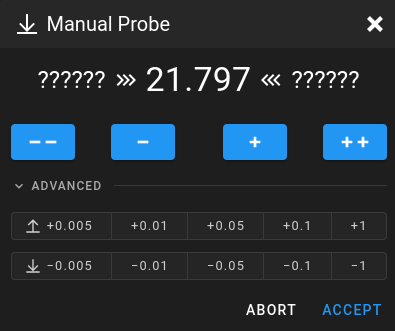

**What you're looking at:** The screenshot is Klipper's manual-probe dialog. `Z_ENDSTOP_CALIBRATE` steps the nozzle down in known increments until a sheet of paper just drags under it, then records that height as Z=0. The paper is ~0.1 mm thick, so the Z=0 this records is a nozzle sitting one paper-thickness above the plate — deliberately high and safe. The last tenth of a millimetre, the "squish", is set live on the first print at Step 13.42 and committed there; nothing here needs a correction for temperature.

**Parts:** one sheet of printer paper.

**Do:** With the machine still hot and levelled, `G28`, move the nozzle to the bed centre, wipe any ooze off the nozzle, put the paper under it and run `Z_ENDSTOP_CALIBRATE`. Step down with `TESTZ Z=-1` until you are close, then `TESTZ Z=-0.1`; `TESTZ Z=0.1` backs off if you overshoot. `ACCEPT` at the first position where the paper drags.

```
Send: Z_ENDSTOP_CALIBRATE
Recv: // Starting manual Z probe. Use TESTZ to adjust position.
Recv: // Finish with ACCEPT or ABORT command.
Recv: // Z position: ?????? --> 9.800 <-- ??????
Send: TESTZ Z=-1
Recv: // Z position: ?????? --> 8.800 <-- 9.800
      ... down to ...
Send: TESTZ Z=-0.1
Recv: // Z position: 0.150 --> 0.250 <-- 0.350
Send: ACCEPT
Recv: // stepper_z: position_endstop: -0.750
Recv: // The SAVE_CONFIG command will update the printer config file
Recv: // with the above and restart the printer.
Send: SAVE_CONFIG
```

**Check:** Stop when you feel light drag on the paper — the paper still slides, but with resistance — and `ACCEPT` there; do **not** add an extra step down "for the heat". The number Klipper prints is `old position_endstop − the Z you accepted at`: with the stock `−0.5` and an accept at `0.250`, that is `−0.5 − 0.250 = −0.750` (`manual_probe.py`). Yours will differ; the arithmetic will not. The small back-and-forth Klipper does on tiny moves is deliberate backlash compensation; the final position is the one you asked for. [src](https://docs.vorondesign.com/build/startup/) · [src](https://github.com/Klipper3d/klipper/blob/f0892d8/klippy/extras/manual_probe.py)

Note: this sets Z=0 from the **nozzle probe**, not the inductive probe. `[probe] z_offset: 0` stays uncalibrated on purpose — that probe is used only for QGL and mesh shape.

Source: [Voron docs image mainsail_manual_probe.png](https://raw.githubusercontent.com/VoronDesign/Voron-Documentation/36b876b/build/startup/images/mainsail_manual_probe.png) · [Voron startup wizard § Z endstop calibrate](https://docs.vorondesign.com/build/startup/startup.html#z-endstop-calibrate) · [Klipper docs § MANUAL_PROBE / TESTZ](https://www.klipper3d.org/G-Codes.html#manual_probe) · [Klipper `manual_probe.py`](https://github.com/Klipper3d/klipper/blob/f0892d8/klippy/extras/manual_probe.py) · [Video: More Extras! @3:53:57](https://www.youtube.com/watch?v=D_44fDp9xt8&list=PL0fUJbigELQPqpeGOgHYisG4KaSXVtnNY&t=14037s) (differs: Euclid probe (Klicky fitted later, Part 11); this kit uses the Omron inductive probe + LDO nozzle probe, Klicky bagged)

---

### Step 13.37 — Sanity-check Z=0

(no image — see text)

**What you're looking at:** The same sheet of paper, now used as a check rather than a measurement: the nozzle is commanded to the Z=0 you just saved and the paper should behave the same way. The sign convention catches people out — a **larger** `position_endstop` puts the nozzle closer to the bed.

**Parts:** paper.

**Do:** `G28`, then `G0 X175 Y175 Z0 F1200`. Slide the paper under the nozzle.

**Check:** The paper drags but is not pinned or torn, and the nozzle has not touched the PEI — at Z0 it should sit one paper-thickness above it, exactly as you left it at Step 13.36. If it is wrong, re-run Step 13.36 — do not hand-edit `position_endstop` yet. Remember the sign: **increasing `[stepper_z] position_endstop` brings the nozzle closer to the bed** (−0.700 is closer than −0.750).

Source: [Voron startup wizard § Z offset adjustment](https://docs.vorondesign.com/build/startup/startup.html#z-offset-adjustment) · [Klipper docs § Manual Level](https://www.klipper3d.org/Manual_Level.html)

Pause: ~20 min since the last pause — re-heated, re-QGL'd after squaring, `Z_ENDSTOP_CALIBRATE` done at the paper-drag height, and Z=0 sanity-checked at the bed centre. `SAVE_CONFIG` run and committed. The machine now knows where the bed is.

---

## Part J — Bed mesh

### Step 13.38 — Confirm the `[bed_mesh]` section from Ch 12

(no image — see text)

**What you're looking at:** Nothing to build here. `[bed_mesh]` is one config section, owned by Ch 12, and this step only confirms it survived. `PRINT_END` calls `BED_MESH_CLEAR`, which is why a missing section shows up as a console warning at the end of every print rather than as a failure.

**Parts:** none.

**Do:** The LDO config ships **no `[bed_mesh]` section at all** — but `PRINT_END` calls `BED_MESH_CLEAR`, which will print `Unknown command:"BED_MESH_CLEAR"` at the end of every print until one exists. **Ch 12 Step 12.34 owns that block.** Do not retype it here: open `printer.cfg`, confirm the section is present and unchanged, then `FIRMWARE_RESTART`.

**Check:** `grep -A4 '^\[bed_mesh\]' ~/printer_data/config/printer.cfg` returns the Step 12.34 block, Klipper comes back `Ready` with no `[bed_mesh]` error, and `BED_MESH_CLEAR` is accepted at the console. If Klipper rejects the section, the cause is a range error — `mesh_min`/`mesh_max` are **probe** coordinates and `[probe] y_offset: 25.0` puts the nozzle 25 mm in front of the probe. Fix it in Step 12.34, not here, so the two chapters cannot drift apart again. (survey §4.4 #15)

Source: [Klipper docs § bed_mesh](https://www.klipper3d.org/Config_Reference.html#bed_mesh) · [Klipper docs § Bed Mesh](https://www.klipper3d.org/Bed_Mesh.html) · [`leviathan-printer-rev-d-sbv2.cfg`](https://github.com/MotorDynamicsLab/LDOVoron2/blob/667521d/Firmware/leviathan-printer-rev-d-sbv2.cfg#L308-326)

---

### Step 13.39 — `BED_MESH_CALIBRATE`

(no image — see text)

**What you're looking at:** `BED_MESH_CALIBRATE` probes a grid across the plate and stores the height at each point, so Klipper can correct Z continuously as the nozzle travels. It has to be taken hot and after levelling, because both the plate and the gantry change shape with temperature.

**Parts:** none.

**Do:** Still hot and still levelled: `G28`, `QUAD_GANTRY_LEVEL`, `G28`, then `BED_MESH_CALIBRATE`. 49 probe points takes a few minutes.

```
Send: BED_MESH_CALIBRATE
      ... 49 probes ...
Recv: // Mesh Bed Leveling Complete
Recv: // Bed Mesh state has been saved to profile [default]
Recv: // for the current session.  The SAVE_CONFIG command will
Recv: // update the printer config file and restart the printer.
Send: SAVE_CONFIG
```

**Check:** Send `BED_MESH_OUTPUT` and look at the spread. A cast-and-ground 350 plate at 100 °C should land inside roughly ±0.10 mm; a corner that is 0.3 mm out of family points at a bed screw torqued cold (Ch 03) rather than at a bad plate. Mesh **after** QGL, always, and re-mesh whenever you change the bed or the plate.

Tip: this mesh is a hot mesh at 100 °C. It is not valid for a 60 °C PLA bed — take a second profile later if you print cold materials.

Source: [Voron startup wizard § Bed leveling](https://docs.vorondesign.com/build/startup/startup.html#bed-leveling) · [Klipper docs § BED_MESH_CALIBRATE](https://www.klipper3d.org/G-Codes.html#bed_mesh_calibrate) · [Klipper docs § Bed Mesh](https://www.klipper3d.org/Bed_Mesh.html)

Pause: ~15 min since the last pause — `[bed_mesh]` confirmed against Ch 12 and a full mesh probed and saved with no probe point out of range. Machine idle, heaters off.

---

## Part K — First print

The first print is the last check in this chapter, not the start of tuning. The cube is printed **once**, here. Step 13.40 loads the first filament and **measures** `rotation_distance` — this step owns that measurement; Ch 14 Step 14.7 only re-checks and refines it after the first print. The cube's *measurement* is Ch 14's and stays there. Keep the cube.

### Step 13.40 — Set the extruder rotation distance (Ch 14 procedure)

(no image — see text)

**What you're looking at:** `rotation_distance` is how far the filament advances for one turn of the extruder motor. Until it is right, every flow number downstream is wrong by the same percentage — and that error is indistinguishable from a first-layer or extrusion problem when you go looking for it. The measurement is indirect: you mark the filament, ask for 100 mm, and measure what is left — so the number the rule gives you is the **remainder**, not the amount extruded. This is also the first time filament enters the machine, so it starts with loading it. (The step title's "Ch 14 procedure" is historical: this step is the owner now, and 14.7 refines.)

**Parts:** Prusament ASA, dried; steel rule or caliper; masking tape.

**Do:** *Load filament.* Spool on the holder arm (Ch 11 Step 11.43), filament through the PTFE reverse-bowden at the retainer (11.42), tip cut square, fed down the tube until it stops at the Clockwork 2 gears. Then, with the machine homed and hot from 13.39, send `LOAD_FILAMENT TEMP=260` — the LDO macro parks the toolhead at the front, heats to 260 °C, switches to relative extrusion and pulls 100 mm through at 5 mm/s. Watch the gears: if the filament is pushed *back up* the tube, invert `[extruder] dir_pin` (add or remove the `!` on `nhk:PB9`), `RESTART` and send the macro again — that is the extruder direction test Step 13.15 deferred. If the gears do not grab, open the CW2 latch, push the filament past the gears by hand, close it and repeat. Wipe the extruded blob off the nozzle.

*Measure.* Add `max_extrude_only_distance: 150` to `[extruder]` and `RESTART` — Klipper's default is **50 mm**, so a single `G1 E100` errors out with "Extrude only move too long". `G28`, park with `G0 X175 Y10 Z50 F6000`, heat to 260 °C. Put a piece of tape on the filament at the **120 mm** mark, measured from where the filament enters the extruder. Then extrude 100 mm slowly, in relative mode, at 1 mm/s:

```
M83
G1 E100 F60
```

Measure from the extruder entrance to the tape again — that reading is the **remaining** distance R.

**Check:** R reads ≈20 mm, i.e. the actual extruded amount is within **0.5 %** of target — 99.5 to 100.5 mm for a 100 mm request. This has to be right **before** the first print: extrusion error left in place looks exactly like flow and first-layer problems for the rest of the build. Write the value you end on into `[extruder] rotation_distance`, `RESTART`, and commit. [src](https://docs.vorondesign.com/build/startup/)

??? note "The arithmetic, how to iterate, and the two classic mistakes"

    ```
    actual_extruded       = 120 − R
    new_rotation_distance = old_rotation_distance × (actual_extruded / 100)
    ```

    R is what the rule reads, **not** the amount extruded — forgetting the subtraction is
    the classic way to land a rotation distance five times too small. The other one:
    always use your *current* `rotation_distance` in the formula, never the original.
    And remember **a higher value means less filament comes out.**

    Iterate without restarting using
    `SET_EXTRUDER_ROTATION_DISTANCE EXTRUDER=extruder DISTANCE=<value>`, then write the
    final number into `[extruder] rotation_distance` and `RESTART`. `M83` before every
    `G1 E100` — in absolute mode the move only extrudes 100 mm if E happens to be 0.

    Extruding slowly is deliberate: it removes the pressure-related error a fast extrude
    introduces. If you would rather not raise `max_extrude_only_distance`, the Voron
    guide's way is to extrude 50 mm twice instead.

    Starting value for Clockwork 2 is `rotation_distance: 22.6789511` with
    `gear_ratio: 50:10`; expect to land within about ±2 % of that. If you are 5 %+ off,
    you have the wrong `gear_ratio` (50:17 is Clockwork **1**), not a calibration
    problem.

Source: [Voron startup wizard § Extruder calibration (e-steps)](https://docs.vorondesign.com/build/startup/startup.html#extruder-calibration-e-steps) · [Klipper docs § Rotation distance](https://www.klipper3d.org/Rotation_Distance.html) · [Klipper docs § SET_EXTRUDER_ROTATION_DISTANCE](https://www.klipper3d.org/G-Codes.html#set_extruder_rotation_distance) · [Ellis' Print Tuning Guide — extruder calibration](https://ellis3dp.com/Print-Tuning-Guide/articles/extruder_calibration.html) · [`leviathan-printer-rev-d-sbv2.cfg` `LOAD_FILAMENT`](https://github.com/MotorDynamicsLab/LDOVoron2/blob/667521d/Firmware/leviathan-printer-rev-d-sbv2.cfg#L723-L746)

---

### Step 13.41 — Make the Voron printer profile and slice the cube

(no image — see text)

**What you're looking at:** `Voron_Design_Cube_v7` is a 30 mm test cube that batch B00 already printed on the Prusa. Printing the same file, in the same filament, with the same slicer overrides is what makes the two cubes comparable when Ch 14 puts a caliper on them. Before it can be sliced at all, PrusaSlicer needs a **printer profile for the Voron** — everything so far ([print/00-slicer-setup.md](print/00-slicer-setup.md)) is the Core One+ profile: a 250×220 bed, Nextruder retraction and Prusa's own start G-code. The Voron profile is four things: the 350 mm bed, the Klipper flavour, a start G-code that calls Ch 12's `PRINT_START`, and a physical printer so uploads go straight to Moonraker.

**Parts:** `Voron_Design_Cube_v7.stl`; ASA; the laptop with PrusaSlicer.

**Do:** *Printer profile.* In PrusaSlicer's **Printer Settings**, with `Prusa CORE One HF0.4 nozzle` selected, **Save as… `Voron 2.4 350`** — a copy, so the Prusament ASA and STRUCTURAL presets from 00-slicer-setup stay compatible with it — and change on the copy: **General → Bed shape** rectangular **350 × 350**, origin **0, 0**; **Max print height 330**; **G-code flavor: Klipper**. **Extruder 1**: nozzle **0.4** stays; leave retraction at the copied value for now and tune it at Ch 14 Step 14.23 `(verify on bench)`. **Custom G-code → Start G-code**, replacing everything Prusa put there:

```
PRINT_START BED=[first_layer_bed_temperature] EXTRUDER=[first_layer_temperature] CHAMBER=0
```

**End G-code**, replacing everything: `PRINT_END`. Save. Then the **physical printer** (the icon next to the printer preset → *Add physical printer*): host type **Moonraker** if your PrusaSlicer lists it, otherwise **OctoPrint** — Moonraker answers OctoPrint's upload API (`[octoprint_compat]` in MainsailOS's `moonraker.conf`); hostname `voron.local`, no API key; **Test** must say OK.

*Slice.* Load [`Voron_Design_Cube_v7.stl`](https://github.com/VoronDesign/Voron-2/tree/Voron2.4/STLs/Test_Prints) — the same file batch B00 printed on the Prusa. It is exactly **30.000 × 30.000 × 30.000 mm**. Slice it at **hotend 260 °C, bed 110 °C, no XY size compensation, shrinkage compensation 0 %** — the same overrides the Prusa profile uses, so the two cubes are comparable ([print/00-slicer-setup.md](print/00-slicer-setup.md)). No supports, seam to the rear. Chamber temperature is **not** a slicer setting on this machine: the Prusa filament profile's chamber values emit `M141`/`M191`, which this config does not define (Klipper answers `Unknown command`, harmless); the chamber is `CHAMBER=` on `PRINT_START`, kept at **0** — a timed soak — until Ch 14 Step 14.8 has measured what the closed chamber reaches.

**Check:** The sliced preview shows no supports and the seam at the rear, and the G-code preview's first lines are your `PRINT_START BED=110 EXTRUDER=260 CHAMBER=0` with **no** `M190`/`M109` before it — if the slicer added its own heating, the flavour or the start G-code is wrong. The physical-printer **Test** passed.

Tip: the Voron slicer guide's own starting point is 240 °C / 100 °C / 92 % flow for ABS. Use 260/110 here anyway — it is the Prusament ASA figure, and it is what makes this cube comparable with the B00 reference you caliper it against at [Ch 14 Step 14.11](14-calibration.md#step-1411-caliper-the-cube-against-the-prusa-printed-one). [src](https://docs.vorondesign.com/build/slicer/first_print.html)

Source: [Voron-2 `STLs/Test_Prints/`](https://github.com/VoronDesign/Voron-2/tree/de7e89d/STLs/Test_Prints) · [Voron docs — first print](https://docs.vorondesign.com/build/slicer/first_print.html) · [Voron docs — slicer setup](https://docs.vorondesign.com/build/slicer/) · [Moonraker configuration § octoprint_compat](https://moonraker.readthedocs.io/en/latest/configuration/#octoprint_compat) · [Ch 12 Step 12.36](12-software.md#step-1236-replace-print_start-with-a-skeleton-that-waits-on-the-chamber)

---

### Step 13.42 — Print it, and set the first-layer squish


**What you're looking at:** The photo is Voron's own example of correct first-layer squish: beads that touch with no gaps between them but are still individually visible. Babystepping moves Z live while the layer prints; `Z_OFFSET_APPLY_ENDSTOP` is what turns that live adjustment into a saved value instead of one thrown away at the next restart.

**Parts:** the sliced cube; clean flex plate; IPA.

**Do:** Upload from the slicer (the physical printer from Step 13.41), start it, and **watch the whole first layer**. Live-adjust Z in 0.01 mm steps while it lays down — the "Z Offset" babystep control in Mainsail does the same thing:

```
SET_GCODE_OFFSET Z_ADJUST=-0.01 MOVE=1     ; closer to the bed
SET_GCODE_OFFSET Z_ADJUST=0.01 MOVE=1      ; further away
```

Note the total you end on (Mainsail shows it next to the Z-offset buttons) and **let the cube finish.** Only then make it permanent: `Z_OFFSET_APPLY_ENDSTOP`, then `SAVE_CONFIG`. `SAVE_CONFIG` restarts Klipper and would abort a running print — never send it mid-print. Keep the cube.

**Check:** On smooth PEI the bottom has **no gaps between the beads and no ridging**, and you can still see the individual lines; completely featureless and glassy is too much squish. After the save, `stepper_z: position_endstop` in the saved block has moved by the amount you babystepped — babystepping alone is discarded on restart. Do **not** use `Z_OFFSET_APPLY_PROBE`: this machine's Z reference is the LDO nozzle probe, not the inductive probe. Do not touch input shaper or pressure advance until this print has finished successfully. [src](https://ellis3dp.com/Print-Tuning-Guide/articles/first_layer_squish.html) · [src](https://github.com/Klipper3d/klipper/blob/f0892d8/klippy/configfile.py) (survey §3.3)

Source: [Voron docs image voron_cereal.png](https://raw.githubusercontent.com/VoronDesign/Voron-Documentation/36b876b/build/slicer/images/voron_cereal.png) · [Voron docs — first print](https://docs.vorondesign.com/build/slicer/first_print.html) · [Ellis' Print Tuning Guide — first layer squish](https://ellis3dp.com/Print-Tuning-Guide/articles/first_layer_squish.html)

---

### Step 13.43 — Shut down properly

(no image — see text)

**What you're looking at:** The Pi is a small computer with a filesystem that can be corrupted by losing power mid-write. Shutting the host down first and only then cutting mains is the ordinary rule for any Linux machine — and here the file at risk holds every calibration in this chapter.

**Parts:** none.

**Do:** Commit the config first — `cd ~/printer_data/config && git add -A && git commit -m "Ch 13 done: PID, Z endstop, mesh, rotation_distance"` — then `scp` the directory to the laptop. Use the web interface's **Shutdown** (host shutdown), wait for the Pi's activity LED to go dark, and only then switch the machine off at the inlet.

**Check:** `git log` on the Pi lists the Ch 12 baseline and every `SAVE_CONFIG` since (bed PID, hotend PID, `position_endstop` twice, bed mesh), and a copy of the directory is on a machine that is not the Pi's SD card. Pulling power on a running Pi corrupts the SD card and costs you Ch 12 all over again. [src](https://docs.vorondesign.com/build/startup/)

Source: [Voron startup wizard § Finish](https://docs.vorondesign.com/build/startup/startup.html#finish) · [Voron startup wizard § Next: slicer setup](https://docs.vorondesign.com/build/startup/startup.html#next-slicer-setup)

Pause: ~30 min since the last pause — extruder rotation distance set, the Voron cube sliced, printed and its first-layer squish dialled, and the machine shut down properly. Ready for Checkpoint 13, then Ch 11 Part B.

---

## What if — first-start failures and what they actually mean

| Symptom | Most likely cause | Fix |
|---|---|---|
| A temperature climbs with nothing commanded | Heater energised through a wiring fault | Cut power at the switch. Back to Ch 10 — do not "just watch it" |
| Thermistor reads a wild or jumping value | Crimp, or a PH2.0 housing half-seated / in the wrong header | Re-seat, check continuity. Rev D+: uses **PH2.0**, not the guide's XH2.5 |
| Hotend heats when you command the bed (or vice versa) | Thermistor pair or heater pair swapped | Swap at the board, power off first |
| Bed does not heat, SSR LED **on** | Fault on the mains side of the SSR | Check LOAD 1 / LOAD 2 and the bed L/N |
| Bed does not heat, SSR LED **off** | Control polarity reversed | Leviathan **+** → SSR **INPUT 3**, **−** → INPUT 4 |
| A fan never starts | Wrong port, wrong voltage jumper, or the keyed 2×5 (10-pin) toolhead header seated backwards | Check the port against the config; Rev D+: header is keyed — if it will not drop in, it is backwards. BLDC fans do not spin backwards on reversed polarity, they do nothing or burn out |
| **The wrong toolhead fan answers** — the top (5015) fan follows the hotend, the bottom (4010) fan follows `M106` | Fan adapter HEF/PCF assignment is the reverse of the config (the Ch 08 Step 08.46 source conflict) | Swap `pin: nhk:PD0` and `pin: nhk:PA15` between `[heater_fan hotend_fan]` and `[fan]`, `RESTART`, re-run 13.9–13.10. Do not re-plug or re-crimp |
| `STEPPER_BUZZ` moves nothing | `enable_pin`/`step_pin`, or no driver power | Check the pins; check the HV/24 V rail |
| `STEPPER_BUZZ` buzzes without travelling 1 mm | Stepper coil pairs transposed in the connector | Re-pin the connector so each coil is a pair. Power off first |
| **A motor moves the wrong way** | `dir_pin` polarity | Add or remove `!` on that stepper's `dir_pin`, `RESTART`, re-buzz |
| The wrong motor answers | Motors in the wrong ports | Power **off**, move the connector, power on. Never hot-swap a stepper |
| `G28 X` sends the gantry *down* first | Z stepper directions reversed | Fix Z `dir_pin`s before touching A/B |
| X and Y both move, but the toolhead goes diagonally / the wrong axis | A and B swapped, or one inverted | Read the V2 configuration chart; upper block → invert a `dir_pin`; lower (orange) block → physically swap A and B |
| An endstop reads `TRIGGERED` untouched | Wiring, not polarity | Stock Voron endstops are N.C. to ground — a needed `!` usually means a wiring fault. Fix the wiring |
| Endstop unreachable by the toolhead | Rubber rail stopper still on the rail, or racked gantry | Remove stoppers; then Ch 06b |
| `G28` → `Move out of range: -10.000 -10.000 …` | `[safe_z_home] home_xy_position` still the `-10,-10` placeholder | Step 13.26 |
| Homing overshoots into the frame, or stops short | The wrong build-size pair is uncommented (there is no default — with all three commented Klipper does not start) | Step 13.5: the Moonraker query must show `350.0, 350.0, 330.0` |
| A `G28 X` or `G28 Y` stalls the Z motors against the frame, or drops the nozzle onto the bed | Gantry parked at its top stop (or a reversed Z `dir_pin`) — every homing move before Z is homed lifts 10 mm from wherever the gantry is | Step 13.17: park the gantry a third of the way up by hand first; Step 13.16 for the `dir_pin` |
| `QUERY_PROBE` stuck `open` or stuck `TRIGGERED` | Ground/signal/24 V, wrong `[probe] pin`, or a voltage-select jumper | Check wiring first, then `pin: !nhk:PC15` |
| **Probe triggers too early** (large gap at trigger) | Probe mounted too high in the retainer bracket, or fibreglass tape on the sensing face | Lower the probe in the bracket so it triggers ~2 mm above the plate; strip tape from the **back and bottom** — front and sides only |
| **Probe triggers too late** (nozzle nearly touching, or the probe grazes the plate) | Probe mounted too low | Raise it in the bracket. It must clear the plate and any clips at every mesh point |
| `PROBE_ACCURACY` σ high but stable | Probe mount, cable strain, or `[probe] speed` too fast | Check the bracket is tight; try a lower `speed` |
| `PROBE_ACCURACY` values trending one way | Thermal, or mechanical: Z pulley grub screws, uneven Z belts | Soak longer; then check all four Z belts and the pulley set screws |
| `Probe samples exceed samples_tolerance` | Same causes; `samples_tolerance: 0.006` is tight by design | Fix the cause, do not widen the tolerance |
| **QGL does not converge** — `Probed points range` stalls or grows | **Gantry racking** | Step 13.34 → Ch 06b (cold squaring, provisional A/B tension), then Step 13.35 re-QGL |
| A move will not stop when you send `RESTART` | `RESTART` queues behind the running move; only `M112` is pulled out of the queue mid-move | Send `M112` (or Mainsail's red Emergency Stop), then `FIRMWARE_RESTART` |
| QGL: `Retries aborting: Probed points range is increasing. Possibly Z motor numbering is wrong` | Z motors on the wrong drivers | Recheck the Z map: Z0 front-left → `STEPPER-0`, Z1 rear-left → `-1`, Z2 rear-right → `-2`, Z3 front-right → `-3` |
| QGL: `Aborting quad_gantry_level required adjustment … is greater than max_adjust` | Gantry too far out of level to correct in software | `M84`, level the gantry by hand against the frame, `G28`, retry |
| QGL "out of bounds" / cannot reach the probe point | Gantry far from level, or wrong `gantry_corners` | `FIRMWARE_RESTART`, hand-level, `G28`, retry; confirm the 350 corners `-60,-10 / 410,420` |
| `Unknown command:"BED_MESH_CLEAR"` at the end of a print | No `[bed_mesh]` section | Step 13.38. It is a warning, not a failure — but you have no mesh |
| First layer is right at the front and wrong at the back (or similar) | Meshed before QGL, or mesh taken cold | Re-run: `G28` → `QUAD_GANTRY_LEVEL` → `G28` → `BED_MESH_CALIBRATE`, hot |

---

## Checkpoint 13

Tick every line before you start Ch 14.

- [ ] Checkpoint #1 (Ch 10) was passed before this chapter began, with a multimeter, unplugged.
- [ ] `STATUS` returns `Klipper state: Ready`, and both MCUs are present — `stm32f446xx` (or `stm32h743xx` on a V1.3 board) and `stm32g0b1xx`.
- [ ] `grep -c gpio ~/printer_data/config/printer.cfg` returns 0 — the `-sbv2` config.
- [ ] `M112` tested once (Step 13.22) and typed-and-unsent before every first move; everyone in the room knows it is the stop and `RESTART` is not.
- [ ] Extruder, bed and chamber (three sensors) all report room temperature at rest and none of them drifts upward untouched.
- [ ] Both heaters heat and cool on command; the SSR LED tracks the bed, the toolboard HE0 LED tracks the hotend.
- [ ] All four fan outputs verified and on the right fan: hotend (SB bottom), part cooling (SB top), bay PCB fan pair, Nevermore filter fan; plus the chamber LEDs and all three Stealthburner LEDs.
- [ ] All seven motors pass `STEPPER_BUZZ` — correct motor, clean motion; correct direction for the four Z motors (A/B at 13.22–13.23, extruder at 13.40).
- [ ] `QUERY_ENDSTOPS` reads `x:open y:open z:open` at rest and each endstop triggers alone; the nozzle probe shaft springs back freely.
- [ ] `QUERY_PROBE` toggles `open` / `TRIGGERED` with metal, and the probe's fibreglass tape is front-and-sides only.
- [ ] `G28` completes on all three axes; 0,0 lands within 5 mm of the front-left corner of the plate with no skipping.
- [ ] `[safe_z_home] home_xy_position` holds your measured Z-endstop coordinate, not `-10,-10`.
- [ ] Bed and hotend PID tuned and `SAVE_CONFIG`-ed; `PROBE_ACCURACY` hot shows σ < 0.003 mm with no trend, and you wrote down the soak time.
- [ ] Ch 06b cold gantry squaring done (Checkpoint 06b ticked), A/B belts back at its provisional tension, and QGL re-run and converged afterwards. Final tension is Ch 14 Steps 14.4–14.6, not here.
- [ ] `Z_ENDSTOP_CALIBRATE` done hot at the paper-drag height (no extra step down) and saved; bed mesh taken hot **after** QGL and saved.
- [ ] Filament loaded, extruder direction confirmed, `rotation_distance` measured here (Step 13.40) and written into `[extruder]`.
- [ ] PrusaSlicer has a `Voron 2.4 350` printer preset (350×350, Klipper flavour, `PRINT_START`/`PRINT_END`, physical printer test OK) and the Voron cube printed from it, first-layer squish committed with `Z_OFFSET_APPLY_ENDSTOP` + `SAVE_CONFIG` **after** the print ended, cube kept for Ch 14's measurement.
- [ ] `~/printer_data/config` committed after every `SAVE_CONFIG` and copied off the Pi.

---

## Common mistakes

- **Running QGL before PID, or cold.** A drifting probe gives a QGL that reports success and leaves the gantry unlevel; you then chase it through first-layer tuning for a week. PID first, soak to temperature, and gate on `PROBE_ACCURACY` σ < 0.003 mm. (survey §3.3, §4.4 #16)
- **Setting the Z offset and the bed mesh before squaring the gantry.** Ch 06b fully releases A/B tension and drops the Z joints — everything measured before it is scrap. Square first, re-tension, re-QGL, *then* Z=0 and mesh.
- **Adding a `!` to an endstop pin to make a `TRIGGERED` reading go away.** Every stock Voron endstop is normally-closed to ground. If it needs inverting, you almost certainly have a wiring fault that will fail intermittently later.
- **Moving a stepper connector with the power on.** Back-EMF from a spinning or hot-swapped motor kills drivers, and you will not find out until the next homing move. Power down for every connector change. (survey §4.4 #10)
- **Using `RESTART` as an emergency stop.** It waits its turn behind the move you are trying to stop. `M112` (or the red button) is the only command Klipper pulls out of the queue mid-move; `FIRMWARE_RESTART` afterwards.
- **"Correcting" the paper test for temperature.** The paper test leaves the nozzle one paper-thickness (~0.1 mm) high by design, hot or cold; Step 13.42's babystepping closes that gap on the real first layer. An extra `TESTZ Z=-0.1` puts Z=0 on the PEI and makes 13.37's check fail by construction.
- **`SAVE_CONFIG` during the first print.** It restarts Klipper and kills the print at layer one. Babystep, note the total, let the cube finish, then `Z_OFFSET_APPLY_ENDSTOP` + `SAVE_CONFIG`.
- **Trusting babystepping.** The Z Offset slider is discarded on restart unless you commit it with `Z_OFFSET_APPLY_ENDSTOP` followed by `SAVE_CONFIG`.

---

## Next

[**Ch 11 Part B**](11-skirts-panels-door.md) — back, side and top panels and the Clicky-Clack door — then [**Ch 14 — Calibration and tuning**](14-calibration.md): final belt tension, the closed-chamber soak and the hot Z-joint lock, then caliper the cube against the Prusa-printed reference, then input shaper → pressure advance → extrusion multiplier → first-layer squish, in that order, and only now that a cube has printed.
