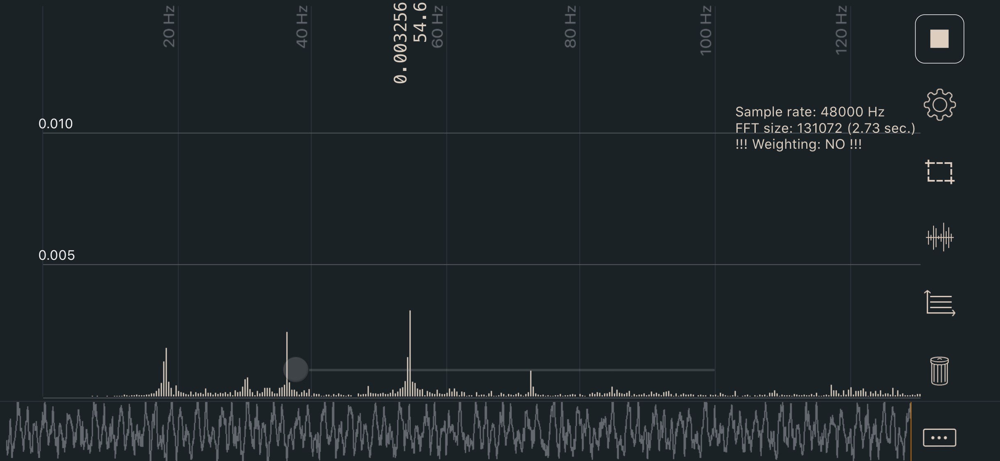
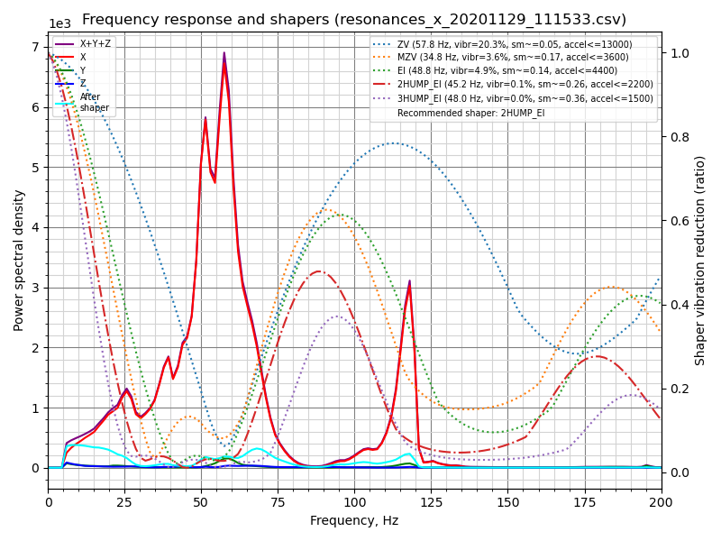
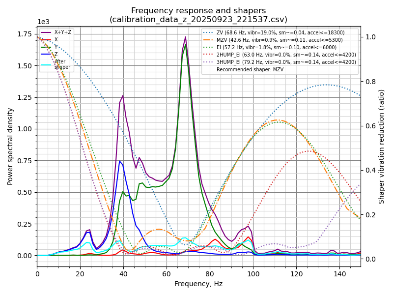
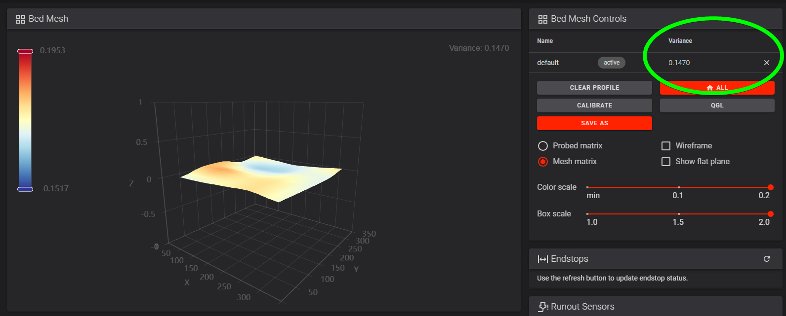

# Chapter 14 — Calibration and tuning

Takes a machine that homes, probes, levels, is squared cold and has printed its first cube (Ch 13), now closed in by Ch 11 Part B, and turns it into a machine that prints Voron-quality ASA: belts at final tension, the gantry's Z joints locked at working temperature, extruder refined, input shaper set, pressure advance and flow dialled in, and that cube calipered against the Prusa-printed reference.

**What you're building in this chapter.** Nothing mechanical is added; six calibration items are measured and written down. **Belt tension** is set for the last time, now that gantry squaring has released it — a tensioned belt is a string, and its pitch over a measured span is the reading. Then the closed chamber gets its first real **heat soak**, QGL is run until it settles, and the four **Z joint** bolts are given their only full tighten while the frame is at working temperature — the last three steps of Voron's squaring procedure, which Ch 06b left for a panelled machine. The **extruder** value measured in Ch 13 is re-checked. **Input shaping** uses the accelerometer built into the toolboard to find the frequency at which this machine rings, fits a filter that cancels it, and brings the acceleration ceiling down from its placeholder. **Pressure advance** compensates for the lag between the extruder and the nozzle at corners, and **extrusion multiplier** scales the total amount of plastic — both belong to the filament, not the machine. Between them sits the **chamber**: how hot the closed enclosure actually gets, which decides both the print profile and the soak time. The tuning log at the end is the deliverable.

```mascot
pose: pass
caption: Here the kit becomes a printer. I brought a caliper. Feelings are not evidence. My opinions nearly are.
```

**Time:** 2.5–4.0 h hands-on (survey §7.2), spread over ~8–10 h wall-clock. Most of the wall-clock is the 1½–2 h closed-chamber soak at Step 14.6, the shorter soaks (~30 min each) and four test prints.

**Sessions:** 14 × ~30 min hands-on (one Pause per calibration item; every minute figure is a first-build estimate derived from the Time range and the step count, and excludes soaks and test prints).

**Prerequisites:**

- **Ch 13 — First power-up and initial startup.** All wizard steps passed (temperatures → heaters → fans → `STEPPER_BUZZ` → XY endstop → homing → bed locating → 0,0 → Z endstop → probe → PID → QGL → Z-offset), filament loaded and `rotation_distance` measured at Step 13.40, the Voron printer profile made at Step 13.41.
- **The Voron-printed `Voron_Design_Cube_v7`** from [Ch 13 Steps 13.41–13.42](13-initial-startup.md#step-1341-make-the-voron-printer-profile-and-slice-the-cube), kept. Ch 13 prints the cube and commits the first-layer squish; this chapter measures it, at step 14.11.
- **Ch 06b — Squaring the gantry, cold**, run out of the middle of Ch 13 at Step 13.34 and finished before Ch 13's Z=0 and mesh: gantry square, the four Z joint M5×40 bolts reinstalled **lightly** (06b.13) and not yet torqued, A/B belts at a provisional tension. **This chapter's belt-tension steps must come after 06b** — the squaring procedure starts by fully releasing A/B tension, so anything you set before it is gone (survey §4.4 #2, §5.2 W1). Voron's squaring steps 14–17 (closed-chamber soak, QGL 3–5×, tighten the Z joints hot, restart) are Step 14.6 here, because they need the panels.
- **Ch 11 Part B — Panels and the Clicky-Clack door**, on. The chamber has to close: Step 14.6's soak, Step 14.8 and Checkpoint 14 all gate on a closed chamber.
- **Ch 12 — Software.** `[bed_mesh]` added at Step 12.34, `PRINT_START` replaced at Step 12.36 (survey §4.4 #15).
- **Batch B00.** The Prusa-printed `Voron_Design_Cube_v7` in Prusament ASA Galaxy Black, kept as the reference coupon ([B00 step B00.6](print/B00-calibration-and-jigs.md)). You need it in hand at step 14.11.
- **Printed parts: none.** Everything this chapter prints, it prints on the Voron.
- A spool of Prusament ASA in the dryer, warm and loaded (survey §7.3).

**Tools**

- Digital caliper, 150 mm
- Steel rule, 150 mm minimum (belt spans and the e-step mark)
- Masking tape and a fine marker (e-step mark; Ellis prefers tape to a marker line)
- Phone with a spectrum analyser: **Sound Spectrum Analysis** (iOS), **Spectroid** (Android), or **Gates Carbon Drive** (both — use the "motorcycle" option) [src](https://docs.vorondesign.com/tuning/secondary_printer_tuning.html)
- Hex 2.5 mm (A/B front tensioners, M3×40; Z idler tensioners, M3×16) and a ball-end hex 4 mm (the four Z joint M5×40 bolts, Step 14.6 — the rear pair are reached at an angle from the door)
- 150 mm machinist square (the hot re-square check at Step 14.6 — the same one as Ch 06b)
- Laptop or tablet on the Mainsail console, with `M112` typed and unsent in a second window for the shaper run at Step 14.13 (Ch 13 Tools)

**Printed parts**


| STL | Qty | Colour |
|---|---|---|
| — none — | 0 | — |

**Hardware** (chapter totals)

| Fastener / part | Qty | Note |
|---|---|---|
| M3×8 SHCS | 2 | the nameplate, Step 14.24 |
| M3 roll-in T-nut | 2 | the nameplate, Step 14.24 |
| — turned, not added — | 0 | Nothing else is added or removed in this chapter. The only things you turn are the two A/B front tensioner screws, the four Z idler tensioner bolts at the top of each upright (never the belt clamps at the XY joints), and the four Z joint M5×40 bolts, which get their first and only full tighten hot at Step 14.6. |

**Consumables:** Prusament ASA Galaxy Black (~150 g across all test prints), IPA for the flex plate.

**Read first**

- **Order is not intuitive and is enforced.** PID before QGL (a thermally unstable machine will not QGL repeatably); e-steps before the first print; **input shaper and pressure advance only *after* a successful first print** (survey §3.3). Pressure advance changes when input shaping is enabled, so shaper comes first of the two. [src](https://ellis3dp.com/Print-Tuning-Guide/articles/pressure_linear_advance/introduction.html)
- **`SAVE_CONFIG` restarts Klipper.** Every `SAVE_CONFIG` in this chapter loses your homing. Re-`G32` after each one. Saved values land in the auto-generated block at the *bottom* of `printer.cfg` and override anything you typed above.
- **Change one thing at a time and write it down.** The [tuning log](#tuning-log) at the end of this chapter is the deliverable. If two things change between prints you cannot attribute the result.
- **Do not chase dimensional error with `rotation_distance`, XY compensation or the extrusion multiplier.** Ellis: deviations are material shrinkage and bulging, not axis errors; his multiplier method is aesthetics-first, judged on a top surface, and Voron parts, drawn with ABS shrinkage in mind, need no compensation beyond a good multiplier tune. [src](https://ellis3dp.com/Print-Tuning-Guide/articles/extrusion_multiplier.html)
- **Shaper auto-calibration is destructive if abused.** Klipper: "It is not advisable to run the shaper auto-calibration very frequently… There is also an increased risk of some parts unscrewing or becoming loose. Always check that all parts of the printer are securely fixed in place after each auto-tuning." [src](https://www.klipper3d.org/Measuring_Resonances.html)

**Sources for this chapter:**

- [Voron docs — Secondary printer tuning](https://docs.vorondesign.com/tuning/secondary_printer_tuning.html) — belt frequencies and the mesh-variance check; [materials](https://docs.vorondesign.com/materials.html) for the chamber band; [initial-startup wizard](https://docs.vorondesign.com/build/startup/startup.html) for PID, QGL and e-steps
- [Klipper — Measuring Resonances](https://www.klipper3d.org/Measuring_Resonances.html), [Resonance Compensation](https://www.klipper3d.org/Resonance_Compensation.html), [Pressure Advance](https://www.klipper3d.org/Pressure_Advance.html), [Rotation Distance](https://www.klipper3d.org/Rotation_Distance.html), [Bed Mesh](https://www.klipper3d.org/Bed_Mesh.html), plus [Config Reference](https://www.klipper3d.org/Config_Reference.html) and [G-Codes](https://www.klipper3d.org/G-Codes.html)
- [`leviathan-printer-rev-d-sbv2.cfg`](https://github.com/MotorDynamicsLab/LDOVoron2/blob/667521d/Firmware/leviathan-printer-rev-d-sbv2.cfg) at commit `667521d` — the line ranges each tuning step reads or edits
- [Voron 2.4r2 Assembly Manual p.125](https://github.com/VoronDesign/Voron-2/blob/de7e89d/Manual/Assembly_Manual_2.4r2.pdf#page=125) — the belt step that gives no frequency, which is why step 14.4 exists
- [Ellis' Print Tuning Guide](https://ellis3dp.com/Print-Tuning-Guide/) and the [Pressure/Linear Advance tool](https://ellis3dp.com/Pressure_Linear_Advance_Tool/) — **linked only.** The guide publishes no licence, so nothing from it is copied, quoted at length or mirrored here; every reference is a link out
- [E3D Revo 60 W heatercore / 104NT thermistor](https://e3d-online.com/pages/revo-support-60w-104nt-heatercore) — the 270 °C `max_temp` question in step 14.2
- Step images mirrored into `assets/remote/14-calibration/` from [Voron-Documentation](https://github.com/VoronDesign/Voron-Documentation/tree/36b876b) and [Klipper](https://github.com/Klipper3d/klipper/tree/f0892d8/docs/img), both GPL-3.0 — see that folder's `SOURCES.txt`

**Video coverage (Steve Builds, pre-release LDO kit — differs from Rev D+):** [Extras! @1:15:59](https://www.youtube.com/watch?v=0aPi1rBwDC0&list=PL0fUJbigELQPqpeGOgHYisG4KaSXVtnNY&t=4559s) (+10m), [More Extras! @4:09:07](https://www.youtube.com/watch?v=D_44fDp9xt8&list=PL0fUJbigELQPqpeGOgHYisG4KaSXVtnNY&t=14947s) (+8m)

---

## Part A — Heaters

### Step 14.1 — Pre-flight the config before you tune anything

(no image — see text)

**What you're looking at:** Nothing to look at. You are reading four config sections before letting any of them generate numbers. The thermistor type, the pull-up resistor and the temperature ceiling all live in `[extruder]`, and a wrong value in any makes every PID constant wrong with it.

**Parts:** none.

**Do:** Open `printer.cfg` and confirm these four sections before any of them generates a number.

| Section | Must hold |
|---|---|
| `[extruder]` | `sensor_type: ATC Semitec 104NT-4-R025H42G`, `pullup_resistor: 2200`, `max_temp: 270`, `gear_ratio: 50:10`, and **your** measured `rotation_distance` from Ch 13 Step 13.40. `22.6789511` is only the Clockwork 2 starting point; do not put it back |
| `[heater_bed]` | `max_power: 0.6` and `control: pid` |
| `[resonance_tester]` | `accel_chip: adxl345` and the live `probe_points: 175, 175, 20` |
| `[input_shaper]` | present, both `shaper_freq` lines still commented. Do not delete it |

**Check:** `STATUS` is clean, both MCUs connected, and chamber, hotend and bed all read within a couple of degrees of the room.

**Helper:** Reads each Must hold value aloud while the adult finds it in printer.cfg.

⚠ A hotend reading 20 °C off the bed at rest means a wrong `sensor_type`, and every PID number you generate will be wrong with it.

Tip: E3D's 60 W HeaterCore uses the Semitec 104NT-4-R025H42G and is rated to **300 °C**, so `max_temp: 270` is a deliberate ceiling below the hardware limit.

⚠ Rev D+ / LDO: These values come from `leviathan-printer-rev-d-**sbv2**.cfg`, not `leviathan-printer-rev-d.cfg`. If `[extruder] sensor_pin` reads `nhk:gpio29` instead of `nhk:PB12` you are on the V1 config and must go back to Ch 12 before doing anything thermal. [src](https://github.com/MotorDynamicsLab/LDOVoron2/blob/main/Firmware/leviathan-printer-rev-d-sbv2.cfg)

Source: [`leviathan-printer-rev-d-sbv2.cfg`](https://github.com/MotorDynamicsLab/LDOVoron2/blob/667521d/Firmware/leviathan-printer-rev-d-sbv2.cfg) · [Voron docs — Secondary printer tuning](https://docs.vorondesign.com/tuning/secondary_printer_tuning.html)

### Step 14.2 — Confirm the heaters are already PID-tuned

(no image — see text)

**What you're looking at:** PID constants are the three numbers that hold a heater steady at a target. They were measured in Ch 13, and they belong to the temperature they were measured at, so changing your bed target means re-running the tune.

**Parts:** none.

**Do:** Both heaters were tuned and saved in Ch 13 at [Step 13.29](13-initial-startup.md#step-1329-pid-tune-the-bed-at-100-c); do not repeat that here. Open `printer.cfg` and confirm both PID stanzas are in the auto-generated block at the bottom.

**Check:** Both stanzas hold *your* numbers, not the LDO config's generic starting values.

⚠ Ch 13 owns the tuning procedure: bed at 100 °C, hotend at 245 °C with the part fan at 25 %. Re-run it only if you have moved a target since, for example re-tuning the bed at `TARGET=110` for ASA; PID is most accurate near the temperature it was tuned at.

⚠ Do not re-run the hotend tune at the 260 °C print temperature. `PID_CALIBRATE` switches the heater off only at the target, and `[extruder] max_temp` is **270**, so a 60 W Revo HF can overshoot and shut Klipper down mid-tune *(verify on bench)*. To tune at the print temperature, raise `max_temp` to 290 first, under the core's rated 300 °C, then set it back.

Tip: the generic values are `58.437 / 2.347 / 363.769` for the bed and `26.213 / 1.304 / 131.721` for the hotend. Do **not** add `pwm_cycle_time`; Klipper's 0.100 s default is correct here.

Source: [Voron startup wizard § PID tune bed & hotend](https://docs.vorondesign.com/build/startup/startup.html#pid-tune-bed--hotend) · [`leviathan-printer-rev-d-sbv2.cfg`](https://github.com/MotorDynamicsLab/LDOVoron2/blob/667521d/Firmware/leviathan-printer-rev-d-sbv2.cfg#L236-307) · [E3D Revo 60 W heatercore / 104NT thermistor](https://e3d-online.com/pages/revo-support-60w-104nt-heatercore)

### Step 14.3 — Verify thermal stability, then re-QGL

(no image — see text)

**What you're looking at:** Thermal stability here means the frame, not just the heaters. `PROBE_ACCURACY` is the instrument: ten probes at one spot, and a series that drifts steadily downward is aluminium still expanding, not a fault in the probe.

**Parts:** none.

**Do:**

1. `SET_IDLE_TIMEOUT TIMEOUT=7200`, then bed to 100 °C and hotend to 150 °C, door open.
2. Sit 10–20 minutes from cold, watching the temperature graph.
3. `G32`, then `PROBE_ACCURACY` at bed centre. Heaters off, `SET_IDLE_TIMEOUT TIMEOUT=1800`.

**Check:** Both heaters hold within ±0.5 °C of setpoint with no slow oscillation, and `PROBE_ACCURACY` reports σ **< 0.003 mm** with no trend.

⚠ The LDO config's 1800 s idle timeout switches the heaters and the Z motors off 30 minutes after the last move, which is exactly what a static soak looks like.

⚠ A drifting probe series, each probe lower than the last, means the frame is still expanding: wait longer. If σ stays high after the soak, suspect uneven Z belts.

Tip: the door stays open so this does not become the long soak; the closed-chamber soak that locks the geometry in is Step 14.6.

Source: [Voron startup wizard § Probe accuracy check](https://docs.vorondesign.com/build/startup/startup.html#probe-accuracy-check) · [Voron startup wizard § QGL with heated bed and chamber](https://docs.vorondesign.com/build/startup/startup.html#qgl-with-heated-bed-and-chamber) · [Klipper docs § SET_IDLE_TIMEOUT](https://www.klipper3d.org/G-Codes.html#set_idle_timeout)

Pause: ~25 min since the last pause — config pre-flighted against the `-sbv2` file, both heaters confirmed PID-tuned and holding, and the machine re-QGL'd hot with σ in range. Heaters can go off. Nothing mechanical has been touched.

---

## Part B — Belts, final tension

These three steps are the end of Voron's gantry-squaring procedure, split off from Ch 06b because they need a closed chamber. Prerequisites: **Ch 06b cold squaring done** (Checkpoint 06b ticked, Z joint M5×40 bolts still at their light 06b.13 torque, A/B belts at the provisional tension 06b set) and **Ch 11 Part B panels and door on**. Ch 14 owns final belt tension: 14.4 sets A/B, 14.5 sets Z, 14.6 soaks the closed machine, settles QGL and locks the Z joints hot. Voron's order — tension first (its step 13), then soak, QGL and the hot tighten (14–17) — is kept, because tightening the joints hot freezes the gantry's geometry and re-tensioning afterwards would move what was just frozen.

### Step 14.4 — Set A/B belt tension to 110 Hz over a 150 mm span



**What you're looking at:** The photo shows a phone spectrum analyser on a plucked belt. A tensioned belt is a string: its lowest frequency peak is its pitch. A frequency means nothing without its span. Ch 06b put a working tension on these belts; this is the final one.

**Parts:**

- reused: the two M3×40 A/B front-idler tensioner screws
- tool: 2.5 mm hex key
- tool: steel rule
- tool: phone with a spectrum analyser app

**Do:**

1. Cold or cooling, panels on, door open: `SET_IDLE_TIMEOUT TIMEOUT=99999`, `G28`, gantry mid-height, `SET_STEPPER_ENABLE STEPPER=stepper_x ENABLE=0` and `STEPPER=stepper_y`.
2. Set a measured **150 mm** span between the idler centres, pluck A, read the **lowest** peak, tension to **110 Hz**, repeat on B until equal.

**Check:** A and B agree within a few Hz at ~110 Hz after moving the gantry and returning. Write both in the tuning log.

**Helper:** Holds the phone by the span and reads the lowest peak aloud after each pluck.

⚠ If one reads 110 and the other 95, the gantry is not square — go back to Ch 06b, do not compensate with tension.

⚠ Never `M84` on this machine with the gantry in the air: it releases the Z motors too and the gantry drops onto the bed. Disable only `stepper_x` and `stepper_y`, so the X carriage moves by hand while the four Z motors hold the gantry.

Tip: the two tensions affect each other, so go back and forth until both are equal. Move the X extrusion back a few centimetres and forward again, then re-check both.

??? note "Why 110 Hz over a 150 mm span — the three sources disagree"

    | Source | A/B target | Z target |
    |---|---|---|
    | Official assembly manual p.125 | **no number** — "cut both belts to the same length" | no number |
    | [docs.vorondesign.com — Secondary Printer Tuning](https://docs.vorondesign.com/tuning/secondary_printer_tuning.html) | **110 Hz over a 150 mm span** (≈ 2 lb, "on the lower end of the range") | **140 Hz** over 150 mm |
    | voronldo.com belt tension guide | 80–100 Hz for a 350 | "same as X/Y, 110–130 Hz" |

    **Use 110 Hz / 150 mm.** It is the only sourced official figure, and it is the only
    one that names the span, which is what makes a frequency mean anything — the same
    belt at a 200 mm span reads far lower. The Voron docs also explain *why* 110: it
    corresponds to roughly 2 lb of tension and is deliberately at the low end, so you
    get a good starting point without stretching the belts. The survey rejects
    voronldo.com as unaffiliated, uncited and internally inconsistent (survey §4.3,
    §9 Rejected sources) — ignore the 80–100 Hz figure entirely.

Source: [Voron docs image `sound-spectrum-belt.jpg`](https://raw.githubusercontent.com/VoronDesign/Voron-Documentation/36b876b/tuning/images/sound-spectrum-belt.jpg) · [Voron docs — Secondary printer tuning § Belt tension](https://docs.vorondesign.com/tuning/secondary_printer_tuning.html) · [Voron manual p.125](https://github.com/VoronDesign/Voron-2/blob/de7e89d/Manual/Assembly_Manual_2.4r2.pdf#page=125) · [Klipper docs § SET_IDLE_TIMEOUT](https://www.klipper3d.org/G-Codes.html#set_idle_timeout) · [Ch 06b Steps 06b.1, 06b.5](06-z-axis-and-gantry-squaring.md#step-06b1-raise-the-stepper-idle-timeout)

Pause: ~20 min since the last pause — **A and B are both at final tension and equal.** Belts are a single calibration item: never stop with one of the pair adjusted and the other not. Leave the gantry parked mid-travel with the Z motors holding and the idle timeout still raised; Step 14.6 puts it back to 1800 at the end, once the last hot check has passed.

### Step 14.5 — Set the four Z belts to 140 Hz over 150 mm

(no image — see text)

**What you're looking at:** The four Z belts lift the gantry and are set like A and B. One odd belt shows up as scatter in `PROBE_ACCURACY` rather than as anything you can see. The adjuster is the **Z idler tensioner bolt** at the top of each upright, an M3×16.

**Parts:**

- reused: the four M3×16 Z idler tensioner bolts
- tool: 2.5 mm hex key
- tool: steel rule
- tool: phone with a spectrum analyser app

**Do:**

1. Set a **150 mm** span: Z bearing block top belt clip to that corner's Z idler pulley centre.
2. Pluck it, read the lowest peak, adjust to **≈140 Hz**. All four, then re-check after jogging down and back up.

**Check:** All four Z belts within a few Hz of each other at ~140 Hz, and four numbers in the tuning log.

**Helper:** Holds the phone by each Z belt and reads the lowest peak aloud after each pluck.

```gate-calc
id: tune-belts
title: Belt tension — six belts, each over a measured 150 mm span
inputs:
  - key: a
    label: A belt (Hz)
    nominal: 110
    tol: 5
    hint: about 110 Hz over a measured 150 mm span
    low: Slack. Take up the A front idler tensioner screw a little at a time, re-pluck, then re-check B, because the two tensions pull against each other.
    high: Tight. Back the A tensioner off. 110 Hz is deliberately at the low end of the range, roughly 2 lb, so a high reading stretches the belt rather than helping it.
    why: A and B carry every X and Y move, and Ch 06b's squaring procedure began by fully releasing them, so whatever tension was set before this step is already gone.
  - key: b
    label: B belt (Hz)
    nominal: 110
    tol: 5
    hint: about 110 Hz, and within a few Hz of A
    low: Slack. Take up the B tensioner, then re-check A and go back and forth until the two read the same.
    high: Tight. Back the B tensioner off, then re-check A. One reading 110 and the other 95 is a squaring problem, so go back to Ch 06b rather than compensating with tension.
    why: A and B are one calibration item, and a pair that will not come out equal is the gantry saying it is not square, not a belt asking for more tension.
  - key: zfl
    label: Z belt, front left (Hz)
    nominal: 140
    tol: 5
    hint: about 140 Hz, top belt clip to that corner's Z idler centre
    low: Slack. Tighten at that upright's Z idler tensioner bolt only, never at the belt clamps down on the XY joints.
    high: Tight. Back that upright's Z idler tensioner bolt off, then jog the gantry down and back up and re-read all four.
    why: The four Z belts lift the gantry together, and one odd belt shows up as scatter in PROBE_ACCURACY rather than as anything you can see.
  - key: zfr
    label: Z belt, front right (Hz)
    nominal: 140
    tol: 5
    hint: about 140 Hz, and even with the other three
    low: Slack. Tighten at that upright's Z idler tensioner bolt, then re-read the other three; evening them up matters more than hitting 140 exactly.
    high: Tight. Back that bolt off, then re-read the other three; evening them up matters more than hitting 140 exactly.
    why: Voron's QGL troubleshooting points at uneven Z belts when PROBE_ACCURACY scatter is high, so evenness across the four is what this row is really reading.
  - key: zrl
    label: Z belt, rear left (Hz)
    nominal: 140
    tol: 5
    hint: about 140 Hz, reached from the rear of the machine
    low: Slack. Tighten at that upright's Z idler tensioner bolt, then re-check the front pair, which move with it.
    high: Tight. Back that bolt off, then re-check the front pair, which move with it.
    why: This is the final setting rather than the working value Ch 06b left, so whatever you leave here is what every QGL and every bed mesh from now on is built on.
  - key: zrr
    label: Z belt, rear right (Hz)
    nominal: 140
    tol: 5
    hint: about 140 Hz, reached from the rear of the machine
    low: Slack. Tighten at that upright's Z idler tensioner bolt only. A loosened belt clamp means re-threading the belt.
    high: Tight. Back that upright's Z idler tensioner bolt off. Never reach for the clamps at the XY joints to let tension out.
    why: The adjuster is the idler tensioner bolt at the top of the upright, because the clamps down at the XY joints hold both belt ends and let the belt go if you loosen them.
  - key: span
    label: Every span measured at 150 mm with the rule, not eyeballed
    kind: yesno
    no: A frequency means nothing without its span, and the same belt over a 200 mm span reads far lower. Measure each span with the rule and read all six again.
    why: Eyeballing the span is the single most common way to finish this step with belts 30 % out and blame the printer for what follows.
  - key: recheck
    label: All six read again after moving the gantry and returning
    kind: yesno
    no: Move the X extrusion back a few centimetres and forward again, jog Z down and back up, then re-read all six. A tension read once can belong to where the gantry was parked.
    why: The next step tightens the Z joints hot and freezes whatever geometry these six belts are holding, so a reading that does not survive a move is not the one to freeze.
pass: All six belts are at final tension over measured spans. Write the six numbers in the tuning log, then soak the closed chamber and lock the Z joints hot.
```

⚠ Adjust at the Z idler tensioner bolt only, never the belt clamps down at the XY joints: those hold both belt ends and let a belt go if loosened.

⚠ Evenness across the four matters more than hitting 140 exactly: the Voron QGL troubleshooting text points at uneven Z belts when `PROBE_ACCURACY` σ is high. This is the final setting; [Ch 06b Step 06b.3](06-z-axis-and-gantry-squaring.md#step-06b3-set-the-z-belts-to-140-hz) was the working value. (survey §4.3)

Tip: the tensioner head is under the blue slider: 2.5 mm key from below, clockwise as you look up at the head is tighter (verify on bench). The note rises.

Source: [Voron docs — Secondary printer tuning § Belt tension](https://docs.vorondesign.com/tuning/secondary_printer_tuning.html) · [Ch 06b Step 06b.3](06-z-axis-and-gantry-squaring.md#step-06b3-set-the-z-belts-to-140-hz)

### Step 14.6 — Closed-chamber soak, settle QGL, lock the Z joints hot, re-verify

(no image — see text)

**What you're looking at:** Aluminium grows as it warms, so a gantry squared cold in Ch 06b is not square at chamber temperature. A long soak brings the frame to its working size, and the four Z joint M5×40 bolts get their first and only full tighten hot.

**Parts:**

- reused: the four M5×40 Z joint SHCS
- tool: 4 mm ball-end hex key
- tool: 150 mm machinist square

**Do:**

1. `SET_IDLE_TIMEOUT TIMEOUT=99999`, `G28`, note the Z height where a ball-end 4 mm reaches all four Z-joint heads.
2. Shut the panels and door, bed to 110 °C, hotend 150 °C, and soak **1½–2 hours**. Then work the table hot.

| Order | Hot, with the chamber closed | Accept |
|---|---|---|
| 1 | `PROBE_ACCURACY` at bed centre, then `QUAD_GANTRY_LEVEL` **three to five times** in a row | Each run converges and its correction shrinks run over run rather than bouncing around |
| 2 | Jog Z back to the height you noted, open the door, and repeat Ch 06b's machinist-square check at both front corners, gantry forward and back | No light under the square at either front corner, hot |
| 3 | **Fully tighten the four M5×40 Z joint bolts while the machine is still hot**, rear pair first, door open as briefly as you can | First and only full torque on these four bolts |
| 4 | Refit any side panel you took off, its M3×12 clip screws back in, door shut. Still hot: `G28`, one more `QUAD_GANTRY_LEVEL`, then `PROBE_ACCURACY`. Only then heaters off and `SET_IDLE_TIMEOUT TIMEOUT=1800` | QGL converging in ≤3 retries within `retry_tolerance: 0.0075`, `PROBE_ACCURACY` σ < 0.003 mm with no trend, idle timeout back at the config's 1800 |

**Check:** `chamber_temp` was plateaued for at least 20 minutes before the QGL runs, and each run's correction got smaller rather than bouncing around.

⚠ Light showing under the square hot when it did not cold means the squaring did not survive thermal expansion or the belt change: leave the Z joints light, go back to Ch 06b Step 06b.14, and return here. Do **not** tighten the Z joints cold; cold-tightening throws away the point of the soak and shows up as first-layer inconsistency.

⚠ If the QGL runs need all 5 retries where Ch 13 converged in 2, one of the six belts is off. Fix it at 14.4/14.5 **before** tightening anything: the tighten freezes whatever geometry the belts are holding.

Tip: bed to your print temperature, 110 °C for ASA. If a rear Z joint is out of reach, take that side panel off and refit it before the last QGL.

Source: [Voron docs § V2 Gantry Squaring, steps 14–17](https://docs.vorondesign.com/build/mechanical/v2_gantry_squaring.html) · [Voron startup wizard § Quad gantry level](https://docs.vorondesign.com/build/startup/startup.html#quad-gantry-level) · [Klipper docs § QUAD_GANTRY_LEVEL](https://www.klipper3d.org/G-Codes.html#quad_gantry_level) · [Klipper docs § SET_IDLE_TIMEOUT](https://www.klipper3d.org/G-Codes.html#set_idle_timeout) · [`leviathan-printer-rev-d-sbv2.cfg`](https://github.com/MotorDynamicsLab/LDOVoron2/blob/667521d/Firmware/leviathan-printer-rev-d-sbv2.cfg#L471-524) · [Ch 06b Part B](06-z-axis-and-gantry-squaring.md#part-b-chapter-06b-gantry-squaring) · [Video: Part 9 @2:49:16](https://www.youtube.com/watch?v=dmNwxUm4oik&list=PL0fUJbigELQPqpeGOgHYisG4KaSXVtnNY&t=10156s)

Pause: ~15 min since the last pause (plus the 1½–2 h soak) — all six belts at final tension and even, the machine soaked closed, QGL settled over 3–5 runs, the four Z joint bolts locked hot, `PROBE_ACCURACY` re-verified hot afterwards and the idle timeout set back to 1800. The whole belt-and-geometry item is closed; heaters can go off. The next item is the extruder.

---

## Part C — Extruder

### Step 14.7 — Rotation-distance check (100 mm extrusion)

(no image — see text)

**What you're looking at:** `rotation_distance` is millimetres of filament per motor revolution. The measurement is indirect: the rule reads the **remainder**, not the amount extruded. [Ch 13 Step 13.40](13-initial-startup.md#step-1340-set-the-extruder-rotation-distance-ch-14-procedure) owns it; this is the refinement pass, now that the extruder has run a print.

**Parts:**

- consumable: masking tape
- tool: steel rule
- tool: digital caliper
- consumable: Prusament ASA, loaded

**Do:** Heat the hotend to the ASA print temperature of 260 °C with filament loaded and the extruder engaged. Repeat 13.40's measurement once, caliper rather than rule on the remainder: tape at the **120 mm** mark from the extruder entrance, then

```
M83
G1 E100 F60
```

and measure from the extruder entrance to the tape — that reading is the **remaining** distance R. `[extruder]` still carries the `max_extrude_only_distance: 150` from 13.40. If the result is outside 0.5 %, apply 13.40's formula (`new = old × (120 − R) / 100`, using the value *currently* in the config), test it live with `SET_EXTRUDER_ROTATION_DISTANCE EXTRUDER=extruder DISTANCE=<value>`, and when it lands write the final number into `[extruder] rotation_distance` and `RESTART`. Never put `22.6789511` back — it is the Clockwork 2 starting point, not a calibration.

**Check:** R reads ≈20 mm, so the extruded amount is within **0.5 %** of target: 99.5 to 100.5 mm. Record it in the tuning log.

Source: [Voron startup wizard § Extruder calibration (e-steps)](https://docs.vorondesign.com/build/startup/startup.html#extruder-calibration-e-steps) · [Ellis' Print Tuning Guide — extruder calibration](https://ellis3dp.com/Print-Tuning-Guide/articles/extruder_calibration.html) · [Klipper docs § Rotation distance](https://www.klipper3d.org/Rotation_Distance.html) · [Klipper docs § SET_EXTRUDER_ROTATION_DISTANCE](https://www.klipper3d.org/G-Codes.html#set_extruder_rotation_distance) · [Video: Part 9 @5:24:09](https://www.youtube.com/watch?v=dmNwxUm4oik&list=PL0fUJbigELQPqpeGOgHYisG4KaSXVtnNY&t=19449s)

Pause: ~20 min since the last pause — rotation distance measured, iterated and written into `[extruder]`, and Klipper restarted on the new value. Unload or park the filament; do not leave the hotend hot.

---

## Part D — Chamber and the first real print

### Step 14.8 — Set the chamber target and understand the soak

(no image — see text)

**What you're looking at:** There is no chamber heater on this machine; the chamber is warmed by the bed and held there by the panels and the door. The toolboard sensor tells you how hot the enclosure gets; expect it settled by 45 minutes from cold.

**Parts:** none.

**Do:**

1. `SET_IDLE_TIMEOUT TIMEOUT=7200` before you set a temperature.
2. Bed 100–110 °C, panels on, Clicky-Clack door shut. Read `[temperature_sensor chamber_temp]` in the web UI and wait **up to 45 minutes** from cold.
3. Put the settled value in the tuning log, then `SET_IDLE_TIMEOUT TIMEOUT=1800`.

**Check:** With bed at 110 °C, panels on and door closed, `chamber_temp` has settled in the **50–60 °C accept band** by 45 minutes.

⚠ The LDO config's 1800 s idle timeout turns the heaters **and the Z motors** off 30 minutes after the last move, and a static soak is exactly that. `RESTART`, `FIRMWARE_RESTART` and every `SAVE_CONFIG` put it back to 1800.

⚠ The chamber sensor is already wired to the Nitehawk on `nhk:PB2`, the toolboard's **CT** port; the config's `T1` comment is a Leviathan-era label. Mainsail names it `chamber_temp`; its `gcode_id` in `M105` output is `chamber_th`.

⚠ If the chamber stalls below 45 °C, first check the bed is still heating: targets that went to 0 by themselves mean the idle timeout fired. Then look for a missing panel, an open keystone blank, or the exhaust left open.

Tip: 55–60 °C is the ideal end of that band, what the printed parts were designed for. A 350 with a 100–110 °C bed and closed panels gets there passively.

Source: [Voron docs — materials](https://docs.vorondesign.com/materials.html) · [`leviathan-printer-rev-d-sbv2.cfg`](https://github.com/MotorDynamicsLab/LDOVoron2/blob/667521d/Firmware/leviathan-printer-rev-d-sbv2.cfg#L441-454) · [`leviathan-printer-rev-d-sbv2.cfg`](https://github.com/MotorDynamicsLab/LDOVoron2/blob/667521d/Firmware/leviathan-printer-rev-d-sbv2.cfg#L455-456) · [Klipper docs § SET_IDLE_TIMEOUT](https://www.klipper3d.org/G-Codes.html#set_idle_timeout)

### Step 14.9 — Close Ch 12's `PRINT_START` TODO with the purge line

(no image — see text)

**What you're looking at:** A purge line is a short stripe of filament laid at the plate edge before the real print, to build nozzle pressure and wipe off ooze. It goes into Ch 12's `PRINT_START` macro rather than the slicer, so every print gets it.

**Parts:** none.

**Do:** `PRINT_START` is owned by [Ch 12 Step 12.36](12-software.md); do not write a second one here. It ends with a `##  TODO Ch 14: purge / prime line goes here` marker. Now that the extruder is calibrated, replace that marker with:

```ini
    G90
    G1 X5 Y5 Z0.3 F6000                    ; <-- 350 only
    M83                                    ; relative extrusion for the purge
    G92 E0
    G1 X120 E20 F1200                      ; purge line
    G1 Z2 F600
```

`M83` and `G92 E0` are not optional. Klipper starts in **absolute** extrusion mode, and Ch 12's macro does not set `M83`/`G92 E0` until *after* this point — a bare `G1 E20` here would extrude to an arbitrary absolute position instead of 20 mm.

The slicer side already exists: the `Voron 2.4 350` printer preset from Ch 13 calls `PRINT_START BED=[first_layer_bed_temperature] EXTRUDER=[first_layer_temperature] CHAMBER=0` and `PRINT_END`; nothing in the slicer changes for the purge line, because it lives in the macro.

**Check:** A hand-run `PRINT_START CHAMBER=0` lays a continuous purge line at X5 to X120 that sticks, and `grep -c '^\[gcode_macro PRINT_START\]' printer.cfg` returns **1**.

⚠ Run it from the console with the machine cold and watch Ch 12's order: homes first, heats the bed, timed soak, QGL hot, re-homes Z, meshes, parks at X5 Y5, heats the nozzle, then purges. Send `PRINT_END` afterwards; the hand run leaves the heaters on otherwise.

⚠ **Keep `CHAMBER=0` until the previous step has told you what your chamber actually reaches.** `TEMPERATURE_WAIT` has **no timeout**: a `CHAMBER=50` the machine never reaches blocks the print forever, and the only way out is cancelling. Once 14.8 gives you a repeatable settled value, set `CHAMBER` a few degrees **below** it — never at or above it. [src](https://www.klipper3d.org/G-Codes.html#temperature_wait)

Source: [`leviathan-printer-rev-d-sbv2.cfg`](https://github.com/MotorDynamicsLab/LDOVoron2/blob/667521d/Firmware/leviathan-printer-rev-d-sbv2.cfg#L621-628) · [Klipper docs § TEMPERATURE_WAIT](https://www.klipper3d.org/G-Codes.html#temperature_wait)

Pause: ~15 min since the last pause — chamber behaviour measured and written down, and `PRINT_START`'s Ch 12 TODO closed with the real purge line. `CHAMBER` is still set from a measured number, not a guess. Config restarts clean.

### Step 14.10 — Fetch the cube you already printed in Ch 13

(no image — see text)

**What you're looking at:** Two cubes of the same file in the same filament: one printed on the Prusa in batch B00, one on the Voron in Ch 13. Nothing is printed here; the pair goes on the bench so the next step can measure them.

**Parts:**

- reused: the Voron-printed cube
- reused: the Prusa-printed B00 reference cube

**Do:** Put both cubes on the bench. The cube is printed **once**, in Ch 13, and [Step 13.41](13-initial-startup.md#step-1341-make-the-voron-printer-profile-and-slice-the-cube) is authoritative for it. Re-print only if you have changed a slicer setting since, and then re-run 13.41–13.42 as written.

**Check:** Two cubes in front of you, both `Voron_Design_Cube_v7`, both in Prusament ASA Galaxy Black.

**Helper:** Fetches the Prusa B00 cube from its bin and sets both cubes side by side.

⚠ The purge line you just added to `PRINT_START` governs the *next* print; it does not invalidate this cube.

Tip: 13.41 sliced it at 260 °C / 110 °C with XY size and shrinkage compensation both zero, the same overrides the Prusa profile used.

Source: [Voron-2 `STLs/Test_Prints/`](https://github.com/VoronDesign/Voron-2/tree/de7e89d/STLs/Test_Prints) · [Voron docs — first print](https://docs.vorondesign.com/build/slicer/first_print.html)

### Step 14.11 — Caliper the cube against the Prusa-printed one

(no image — see text)

**What you're looking at:** A caliper on a 30 mm cube is the cheapest whole-machine test there is. Mid-height is the honest place to measure: the first layer is squashed and the top can bulge. The difference between the X and Y readings is a squareness proxy.

**Parts:**

- reused: both cubes
- tool: digital caliper

**Do:** Measure both cubes at **mid-height**, not across the first layer: X, Y and Z, recorded in the table below. Same STL, same filament, same nominal settings; the only variables are the two machines.

| Measurement | Nominal | Prusa Core One+ (B00 reference) | Voron 2.4 350 (this print) | Accept | If out |
|---|---|---|---|---|---|
| X, mid-height | 30.00 mm | ______ | ______ | ±0.15 mm | see below |
| Y, mid-height | 30.00 mm | ______ | ______ | ±0.15 mm | see below |
| Z (total height) | 30.00 mm | ______ | ______ | ±0.10 mm | over → first layer under-squished; under → over-squished |
| X at first layer | — | ______ | ______ | within 0.15 mm of mid-height X | elephant-foot compensation wrong; adjust in 0.05 mm steps |
| X − Y (squareness proxy) | 0.00 mm | ______ | ______ | ≤0.10 mm | a persistent X−Y difference on the Voron is a gantry-square problem → Ch 06b |
| Corner snap test | — | pass/fail | pass/fail | must not delaminate along a layer line | chamber too cold or fan too high |

Two honest expectations before you start chasing numbers:

- **A size error is not an axis error, and not a flow number.** Ellis: *"don't mess with your `steps_per_mm`/`rotation_distance`. Deviations are almost always from material shrinkage, bulging, layer inconsistencies, etc, NOT issues with your axes."* The extrusion multiplier is set by eye on a top surface at 14.19–14.20, never from these readings, and Voron parts need no compensation beyond that tune. X or Y out of ±0.15: confirm the slice had shrinkage and XY size compensation at 0, finish 14.19–14.20, then measure again. Never negative XY compensation: it wrecks every bearing fit in the machine. [src](https://ellis3dp.com/Print-Tuning-Guide/articles/extrusion_multiplier.html)
- **A Voron-vs-Prusa difference of ~0.1 mm is chamber, not calibration.** The Voron runs a hotter, more uniform chamber than the Core One+, so its parts shrink slightly differently. Both being *in* tolerance matters more than them matching each other.

**Check:** Both cubes inside tolerance: X and Y within ±0.15 mm and Z within ±0.10 mm of 30.00 mm, and within 0.15 mm of *each other*.

**Helper:** Writes each caliper reading into the comparison table as the adult calls it out.

Source: [Ellis' Print Tuning Guide — extrusion multiplier](https://ellis3dp.com/Print-Tuning-Guide/articles/extrusion_multiplier.html) · [Voron-2 `STLs/Test_Prints/`](https://github.com/VoronDesign/Voron-2/tree/de7e89d/STLs/Test_Prints)

Pause: ~15 min since the last pause — the Ch 13 cube is calipered against the Prusa-printed reference and the numbers are in the tuning log. No config has changed; the multiplier is set later by eye, at 14.19–14.20, not from these numbers.

---

## Part E — Input shaper

Now, and not before — the machine has printed successfully, the belts are at final tension, and the frame has been hot.

### Step 14.12 — Bring up the on-board accelerometer

(no image — see text)

**What you're looking at:** The ADXL345 is an accelerometer: a chip that measures how hard it is being shaken, in three axes. On this build it is soldered onto the toolboard itself, so there is nothing to mount and nothing to wire.

**Parts:** none.

**Do:** Check both Python environments. `SHAPER_CALIBRATE` runs inside Klipper's own `klippy-env`, and the graph script at 14.14 runs on the Pi's system Python:

```
~/klippy-env/bin/python -c 'import numpy'
python3 -c 'import numpy, matplotlib'
```

On a MainsailOS image both print nothing and return: it installs numpy into `klippy-env`, and numpy and matplotlib system-wide. `klippy-env` has no matplotlib, so never test for it there. If the first errors, `~/klippy-env/bin/pip install numpy`; if the second errors, `sudo apt install python3-numpy python3-matplotlib libopenblas-dev`. That is what MainsailOS itself runs. Do **not** copy Klipper's `numpy<1.26` pin or its `libatlas-base-dev` on a Trixie image: the pinned numpy does not support Trixie's Python 3.13, and `libatlas-base-dev` was merged into `libopenblas-dev` and no longer exists. [src](https://www.klipper3d.org/Measuring_Resonances.html#software-installation) · [MainsailOS](https://github.com/mainsail-crew/MainsailOS/blob/develop/modules/generic/50-klipper)

Then confirm — do not edit — that the **350 mm** probe point in `[resonance_tester]` is live; Ch 12 Step 12.27 uncommented it and Checkpoint 12 required it (the stock config ships all three build sizes commented out):

```ini
[adxl345]
cs_pin: nhk:PB10
spi_software_sclk_pin: nhk:PA5
spi_software_mosi_pin: nhk:PA2
spi_software_miso_pin: nhk:PA6

[resonance_tester]
accel_chip: adxl345
accel_per_hz: 100
sweeping_accel: 400
sweeping_period: 0
probe_points:
    175, 175, 20
```

Then `ACCELEROMETER_QUERY` and `MEASURE_AXES_NOISE` (no restart needed — nothing was edited).

**Check:** `ACCELEROMETER_QUERY` returns three axis values with roughly 9800, free-fall in mm/s², on one of them, and `MEASURE_AXES_NOISE` returns figures **in the ~1–100 range**.

**Helper:** Reads the MEASURE_AXES_NOISE figures aloud and checks each one is under 100.

Tip: 1000 or more from `MEASURE_AXES_NOISE` means a sensor, power or wiring problem, or a badly imbalanced fan. On `Invalid adxl345 id`, run it again; SPI init is flaky on the first attempt.

⚠ Rev D+ / LDO: The accelerometer is **on the Nitehawk-SB V2 board itself**. There is no separate ADXL345 breakout and no printed ADXL mount to fit — the V1 documentation's ADXL mount does not apply to this kit (survey §4.1). The `[adxl345]` pins above are already correct in `leviathan-printer-rev-d-sbv2.cfg`; if yours read `nhk:gpio21/18/20/19` you are on the V1 config.

Source: [Klipper docs § Installation instructions](https://www.klipper3d.org/Measuring_Resonances.html#installation-instructions) · [MainsailOS `modules/generic/50-klipper`](https://github.com/mainsail-crew/MainsailOS/blob/develop/modules/generic/50-klipper) · [Klipper docs § Checking the setup](https://www.klipper3d.org/Measuring_Resonances.html#checking-the-setup) · [`leviathan-printer-rev-d-sbv2.cfg`](https://github.com/MotorDynamicsLab/LDOVoron2/blob/667521d/Firmware/leviathan-printer-rev-d-sbv2.cfg#L411-440) · [Klipper docs § ACCELEROMETER_QUERY](https://www.klipper3d.org/G-Codes.html#accelerometer_query) · [Video: Extras! @0:42:02](https://www.youtube.com/watch?v=0aPi1rBwDC0&list=PL0fUJbigELQPqpeGOgHYisG4KaSXVtnNY&t=2522s)

Pause: ~15 min since the last pause — accelerometer answers, noise is in the 1–100 band, and the 350 mm `[resonance_tester]` probe point is confirmed live. Nothing has been shaped yet.

### Step 14.13 — Run `SHAPER_CALIBRATE`

(no image — see text)

**What you're looking at:** `SHAPER_CALIBRATE` drives the toolhead through a frequency sweep while the accelerometer records, then fits a filter to what it measured. Both axes run in one pass because the sensor is on the toolhead rather than clipped to a moving bed.

**Parts:** none.

**Do:** `G28` first. Make sure nothing is resting on the gantry and the panels are on, and have `M112` typed and unsent in a second console window; this is the fastest the machine has moved so far. Then:

```
SHAPER_CALIBRATE
```

Both axes run in one pass (the accelerometer is on the toolhead, so this is not a bed-slinger — no re-mounting between axes). It takes a few minutes and is loud. **Do not** `SAVE_CONFIG` yet.

**Check:** One output block per axis, each ending in a `Recommended shaper_type_x = …, shaper_freq_x = … Hz` line.

??? note "What the output block looks like"

    Klipper's own worked example, one block per axis. Each block gives the fitted
    frequency, the residual vibration %, the smoothing figure and a suggested
    `max_accel`, for each of the five shaper types:

    ```
    Fitted shaper 'mzv' frequency = 36.8 Hz (vibrations = 1.7%, smoothing ~= 0.150)
    To avoid too much smoothing with 'mzv', suggested max_accel <= 4000 mm/sec^2
    ...
    Recommended shaper_type_y = mzv, shaper_freq_y = 36.8 Hz
    ```

Source: [Klipper docs § Input shaper auto-calibration](https://www.klipper3d.org/Measuring_Resonances.html#input-shaper-auto-calibration) · [Klipper docs § SHAPER_CALIBRATE](https://www.klipper3d.org/G-Codes.html#shaper_calibrate) · [Video: Extras! @1:46:46](https://www.youtube.com/watch?v=0aPi1rBwDC0&list=PL0fUJbigELQPqpeGOgHYisG4KaSXVtnNY&t=6406s)

### Step 14.14 — Read the graphs



**What you're looking at:** The chart plots vibration against frequency: the tall peak is the machine's dominant resonance, and the curves show how far each shaper type would suppress it. A plot with no peak at all means the run measured noise rather than the machine.

**Parts:** none.

**Do:** Generate the PNGs from the CSVs the run left in `/tmp`. Ran it more than once? Delete the older CSVs first; the script averages every file it matches.

```
~/klipper/scripts/calibrate_shaper.py /tmp/calibration_data_x_*.csv -o /tmp/shaper_x.png
~/klipper/scripts/calibrate_shaper.py /tmp/calibration_data_y_*.csv -o /tmp/shaper_y.png
```

Read them in this order:
1. **Where is the tallest peak?** That is the dominant resonance and it is what sets `shaper_freq`.
2. **How many big peaks are there, and how far apart?** One clean peak → `mzv` or `zv` and a high `max_accel`. Two or more widely separated peaks → the script will push you to `2hump_ei`/`3hump_ei`, which cost acceleration. Widely separated peaks are usually a *mechanical* message: a loose backer, an under-tensioned belt, a rail bolt in the end hole.
3. **`vibrations = X %`** — residual ringing after shaping. Lower is better; single digits is good.
4. **`smoothing ~= Y`** — how much the shaper blurs fine detail. Higher smoothing forces a lower `max_accel`. The two trade against each other; the script's `max_accel` line is that trade expressed as a number.
5. **Is the plot noise with no peak?** Then you measured nothing — go back to `MEASURE_AXES_NOISE`.

**Check:** Both plots show a clear dominant peak, and neither axis peaks **below 25 Hz**.

**Helper:** Finds the tallest peak on each graph and reads its frequency aloud.

⚠ Below 25 Hz on either axis is a build fault, not a tuning result. Stop, and go re-check belt tension, the titanium backers, the XY joints and the frame bolts before you shape over it.

??? note "What to expect on a 350, and where the 25 Hz floor comes from"

    No official per-model figure exists; what *is* sourced is the floor. Klipper:
    **"If the measured ringing frequency is very low (below approx 20-25 Hz), it might
    be a good idea to invest into stiffening the printer or decreasing the moving
    mass… before proceeding with further input shaping tuning."**

    In practice a well-built 350 with backers fitted lands both axes in roughly the
    **35–60 Hz** band, X usually the higher of the two — the toolhead alone is lighter
    than the whole gantry that Y has to move. Treat that band as community-observed,
    not a spec.

Source: [Klipper `docs/img/calibrate-x.png`](https://raw.githubusercontent.com/Klipper3d/klipper/f0892d8/docs/img/calibrate-x.png) · [Klipper docs § Resonance compensation](https://www.klipper3d.org/Resonance_Compensation.html) · [Klipper docs § Max smoothing](https://www.klipper3d.org/Measuring_Resonances.html#max-smoothing)

### Step 14.15 — Save the shaper and set the real `max_accel`

(no image — see text)

**What you're looking at:** `SAVE_CONFIG` writes the shaper's four values into the auto-generated block at the bottom of the config. It deliberately does **not** touch `max_accel`, which the stock file leaves at a 10000 placeholder, so setting that by hand is the half of this step everyone forgets.

**Parts:** none.

**Do:** If the recommendations look sane, `SAVE_CONFIG`. That writes `[input_shaper]` with `shaper_type_x/y` and `shaper_freq_x/y`. It does **not** touch `max_accel`; Klipper says so explicitly, and this is the step everyone skips. The LDO config ships:

```ini
[printer]
max_velocity: 300
max_accel: 10000          # placeholder — must come down
max_z_velocity: 15
max_z_accel: 350
square_corner_velocity: 5.0
```

Set `max_accel` to **at or below the lower of the two per-axis suggested values, with margin** — if the run suggested ≤4000 for X and ≤3500 for Y, use 3000–3500. Leave `square_corner_velocity` at **5.0**.

**Check:** `printer.cfg`'s bottom block has `[input_shaper]` with four values and `[printer] max_accel` is no longer 10000.

??? note "Why the suggested number is a ceiling, not a setting — and the post-run walk"

    Klipper is blunt that the suggested figure "is by no means a recommendation to set
    this acceleration for printing"; it is only the ceiling at which that shaper stops
    smoothing badly, and your real ceiling is also limited by motor torque. Leave
    `square_corner_velocity` at 5.0 because the calibration script assumed it — changing
    it invalidates the `max_accel` numbers.

    Re-print the Voron cube and compare the corners to the first one; that is your
    before/after. Then walk the machine and check nothing has unscrewed itself —
    Klipper warns that resonance testing loosens fasteners.

Source: [Klipper docs § Input shaper auto-calibration](https://www.klipper3d.org/Measuring_Resonances.html#input-shaper-auto-calibration) · [Klipper docs § input_shaper](https://www.klipper3d.org/Config_Reference.html#input_shaper) · [`leviathan-printer-rev-d-sbv2.cfg`](https://github.com/MotorDynamicsLab/LDOVoron2/blob/667521d/Firmware/leviathan-printer-rev-d-sbv2.cfg#L32-46) · [Video: Extras! @2:00:00](https://www.youtube.com/watch?v=0aPi1rBwDC0&list=PL0fUJbigELQPqpeGOgHYisG4KaSXVtnNY&t=7200s)

Pause: ~25 min since the last pause — `SHAPER_CALIBRATE` run, graphs read, `[input_shaper]` saved and `max_accel` brought down from the 10000 placeholder. **Never stop between running the calibration and saving it**; the CSVs live in `/tmp` and a reboot loses them.

### Step 14.16 — Z-axis shaping and Z limits (optional)



**What you're looking at:** On a 2.4 the gantry itself moves in Z, so the toolhead's accelerometer can measure Z too; the chart is Klipper's example of the result. The Z speed and acceleration limits are raised for the test only; they exist because Z is belt-driven.

**Parts:** none.

**Do:** Worth doing if you see Z-direction artefacts. It needs two temporary changes, because the stock Z limits are far below what the test needs:

```ini
[resonance_tester]
accel_chip_z: adxl345

[printer]
max_z_velocity: 20        # temporarily, up from 15
max_z_accel: 1550         # temporarily, up from 350
```

`RESTART`, run `SHAPER_CALIBRATE AXIS=Z`, `SAVE_CONFIG` if you like the result (it writes `shaper_type_z` / `shaper_freq_z`), then **put `max_z_velocity` and `max_z_accel` back to 15 and 350.**

**Check:** The two Z limits read 15 and 350 again after you are done.

Tip: those are belt-and-driver limits for a four-motor belted Z, not resonance limits; leaving them at 20/1550 is a way to skip Z steps. Skipping this step breaks nothing downstream.

Source: [Klipper docs § Measuring the resonances of Z axis](https://www.klipper3d.org/Measuring_Resonances.html#measuring-the-resonances-of-z-axis) · [Klipper `docs/img/calibrate-z.png`](https://raw.githubusercontent.com/Klipper3d/klipper/f0892d8/docs/img/calibrate-z.png) · [`leviathan-printer-rev-d-sbv2.cfg`](https://github.com/MotorDynamicsLab/LDOVoron2/blob/667521d/Firmware/leviathan-printer-rev-d-sbv2.cfg#L32-46)

Pause: ~10 min since the last pause — optional Z shaping either done or skipped, and `max_z_velocity` / `max_z_accel` are back at **15 and 350**. Confirm those two numbers before you walk away; leaving them raised is how you skip Z steps on the next print.

---

## Part F — Pressure advance and flow

### Step 14.17 — Generate and print the Ellis PA pattern

(no image — the pattern and an annotated example are on [Ellis' Pattern Method page](https://ellis3dp.com/Print-Tuning-Guide/articles/pressure_linear_advance/pattern_method.html))

**What you're looking at:** Pressure advance compensates for molten plastic behaving like a spring in the nozzle: pressure lags the extruder, so corners under-extrude going in and over-extrude coming out. Ellis' pattern prints many corners across a sweep of values so the right one can be picked by eye.

**Parts:**

- consumable: Prusament ASA, about 15 g

**Do:**

1. Open [ellis3dp.com/Pressure_Linear_Advance_Tool/](https://ellis3dp.com/Pressure_Linear_Advance_Tool/) with nozzle 0.4, layer 0.2, ASA temps 260/110.
2. **Enable the acceleration-control option and set it to your external-perimeter acceleration**, not your new `max_accel`.
3. Sweep **PA 0 to 0.10 in 0.005 steps** and print it.

**Check:** Pattern prints cleanly with visible, distinct corner tests across the full sweep.

⚠ If you leave the acceleration at the machine maximum the pattern will ring and the result is worthless.

Tip: if the extremes of your sweep both look equally bad, widen the range and re-run rather than guessing.

Source: [Ellis' Print Tuning Guide — pressure advance, pattern method](https://ellis3dp.com/Print-Tuning-Guide/articles/pressure_linear_advance/pattern_method.html) · [Ellis' Pressure/Linear Advance tool](https://ellis3dp.com/Pressure_Linear_Advance_Tool/)

### Step 14.18 — Read the pattern and save the value

(no image — see text)

**What you're looking at:** You are hunting for the one corner in the sweep that is sharp with no gap and no bulge. The value belongs to the **filament**, not the machine, so it is saved in the filament profile rather than in `printer.cfg`.

**Parts:**

- tool: good light
- tool: loupe, optional

**Do:**

1. Find the **sharpest corner with the fewest artefacts**: no gaps, no bulges, no divots.
2. Re-run at 0.001–0.002 intervals around it to refine.
3. Put the value in the PrusaSlicer **filament** custom G-code for ASA:

```
SET_PRESSURE_ADVANCE ADVANCE=<your value>
```

Or set `[extruder] pressure_advance:` if you only ever print ASA on this machine.

**Check:** One corner is visibly the sharpest, and the value you saved is in the **0.01–0.08** band, most often 0.02–0.05.

**Helper:** Counts the lines from the start of the pattern to the sharpest corner, with the loupe.

```gate-calc
id: tune-pa
title: Pressure advance — the value the pattern picked
inputs:
  - key: start
    label: Sweep starting value
    min: 0
    max: 0.1
    hint: the tool's starting value, 0 on the first pass
    low: Pressure advance does not go below 0. Set the tool's starting value to 0 and generate the pattern again.
    high: Above the 0 to 0.10 sweep this chapter prints. A direct drive Clockwork 2 with a Revo HF sits at the bottom of Klipper's typical band, so re-read the pattern before chasing a value up here.
    why: The starting value and the increment are what turn a line number into a number you can save, and they change between the first pass and the refinement run.
  - key: stepv
    label: Increment per line
    min: 0.001
    max: 0.005
    hint: 0.005 on the first pass, 0.001 to 0.002 to refine
    low: Finer than 0.001 and neighbouring lines are not tellable apart by eye. Regenerate at 0.001 or coarser.
    high: Coarser than the 0.005 the first pass uses, so the window can fall between two lines. Regenerate at 0.005 or finer.
    why: The refinement run re-prints around the winner at 0.001 to 0.002, so this number is not a constant and has to be read off the pattern you are actually holding.
  - key: line
    label: Lines above the starting value, counting the first line as 0
    min: 0
    max: 20
    hint: 0 to 20 across a 0 to 0.10 sweep at 0.005
    low: The count starts at 0 on the first line. If the sharpest corner is below the start, widen the range and re-run rather than guessing.
    high: Beyond the last line of a 0 to 0.10 sweep at 0.005. Widen the range and re-run rather than guessing.
    why: Counting the lines is the whole measurement, and a line miscounted by one is a pressure advance wrong by a full step of the sweep.
  - key: saved
    label: Value you are writing into the ASA filament profile
    min: 0.01
    max: 0.08
    hint: 0.01 to 0.08, most often 0.02 to 0.05, copied off the badge above
    low: Below the 0.01 to 0.08 band this step expects. Re-read the pattern, and if gapping and bulging show together stop tuning and check the Clockwork 2 for backlash.
    high: Above the 0.01 to 0.08 band this step expects. Re-read the pattern, and if gapping and bulging show together stop tuning and check the Clockwork 2 for backlash.
    why: This is the number that leaves the bench, and it belongs to the filament rather than the machine, so it goes in the ASA filament profile where every later ASA print picks it up.
  - key: corner
    label: One corner is visibly the sharpest, with no gap and no bulge
    kind: yesno
    no: If no value gives a clean corner, or gapping and bulging show at once, stop tuning. Ellis reads that as extruder trouble. Turn the extruder gear back by hand cold and feel for a dead zone.
    why: Pressure advance can only be read off a pattern that has a winner, and a pattern with no winner at any value is telling you about the extruder instead.
  - key: accel
    label: Pattern printed with the acceleration control option set to your external perimeter acceleration
    kind: yesno
    no: Left at the machine maximum the pattern rings and the result is worthless. Regenerate it with the acceleration control option set, and print it again.
    why: Ringing and pressure advance leave similar marks at a corner, so a pattern printed at full acceleration measures the frame instead of the nozzle.
derive:
  expr: start + stepv * line
  label: Pressure advance
  digits: 3
pass: The pattern picked cleanly. Save the badge value with SET_PRESSURE_ADVANCE in the ASA filament custom G-code, and write it in the tuning log.
```

Tip: there is rarely a perfect value. Ellis leans **higher**: if the sharpest corner has a tiny bit of gapping, still take it. Direct drive is that sensitive.

⚠ If you cannot get a clean corner at *any* value, or you see gapping and bulging simultaneously, stop tuning — Ellis: *"you likely have extruder issues."* Check the CW2 for backlash: with the toolhead cold, reverse the extruder gear direction by hand and feel for a dead zone.

??? note "Where the 0.01–0.08 band comes from"

    The LDO config's own commented starting point is `#pressure_advance: 0.05`, and
    Klipper documents typical values as "between 0.050 and 1.000 (the high end usually
    only with bowden extruders)". For a direct-drive Clockwork 2 with a Revo HF and a
    0.4 nozzle in ASA, expect the bottom of that band. No vendor publishes a
    Revo-HF-specific number; treat 0.04 as the place to start looking and let the
    pattern decide. Most land between 0.02 and 0.05; the wider 0.01–0.08 gate only
    flags a reading worth a second look.

Source: [Ellis' Print Tuning Guide — saving the pressure-advance value](https://ellis3dp.com/Print-Tuning-Guide/articles/pressure_linear_advance/saving.html) · [Klipper docs § Pressure advance](https://www.klipper3d.org/Pressure_Advance.html) · [Klipper docs § SET_PRESSURE_ADVANCE](https://www.klipper3d.org/G-Codes.html#set_pressure_advance)

Pause: ~20 min since the last pause — the PA pattern is printed, read and the chosen value saved into the ASA **filament** profile. One calibration item closed; extrusion multiplier is the next.

### Step 14.19 — Extrusion multiplier / flow: the 2 % pass

(no image — see text)

**What you're looking at:** Extrusion multiplier is a straight percentage scaling of how much plastic comes out. It is judged on the centre of a top surface: too little leaves visible valleys between the lines, too much leaves ridges. The edges always look over-extruded and prove nothing.

**Parts:**

- consumable: Prusament ASA, about 25 g

**Do:**

1. Print Ellis' **30 × 30 × 3 mm** test cubes in a row at **92, 94, 96, 98 %** flow.
2. Slice at top-layer line width 100 %, infill 30 %+, top solid infill speed ~60 mm/s, normal fan.

**Check:** Judged on the **centre** of each top surface, one cube has no gaps between the top lines and no ridging.

```gate-calc
id: tune-em
title: Extrusion multiplier — the 2 % pass
inputs:
  - key: pick
    label: Lowest flow % whose centre top surface is clean (%)
    min: 92
    max: 98
    hint: the lowest of 92, 94, 96, 98 with no gaps and no ridging
    low: Below the 92 to 98 window Prusament ASA should land in. Re-check the rotation distance and the pressure advance you just saved before trusting a number this low.
    high: Above the 92 to 98 window Prusament ASA should land in. Print the row again one or two steps higher and read it the same way before accepting it.
    why: This one number scales every wall and every top surface the machine will print, and it is read off the top surface by eye, never off the caliper, because a size error is shrinkage and bulging rather than flow.
  - key: clean
    label: One cube in the row has no gaps between the top lines and no ridging
    kind: yesno
    no: Nothing in the row is clean, so the error is upstream of flow. Re-check the extruder and the pressure advance before sweeping wider or finer.
    why: The point of a four cube sweep is that one of them is right, and when none is, a finer sweep will not find what a mis-set extruder or pressure advance is hiding.
  - key: centre
    label: Judged on the centre of each top surface, not near the edges
    kind: yesno
    no: The edges always look over-extruded and prove nothing. Read the centre of each top surface toward a light and pick again.
    why: A cube read at its edges always argues for less plastic, so reading it there moves the multiplier the wrong way and throws away the cube that was actually right.
  - key: slice
    label: Sliced at top layer line width 100 %, infill 30 % or more, top solid infill about 60 mm/s, normal fan
    kind: yesno
    no: Re-slice the row with those settings and print it again. A thin top layer or sparse infill reads as gaps at any flow.
    why: Those settings are what make the top surface a measurement of flow rather than a test of the infill holding it up.
pass: Take this multiplier into the 0.5 % refinement pass next, then write the final number into the ASA filament profile, not the print profile.
```

⚠ Too low leaves visible gaps and valleys between the top lines when held toward a light; too high leaves pellets, ridging and a rough raised surface. Most filaments land in the 92–98 % window, and Prusament ASA should.

Tip: the cubes are in Ellis' [`test_prints`](https://github.com/AndrewEllis93/Print-Tuning-Guide/tree/main/test_prints) folder. In PrusaSlicer, right-click each object → add settings → **Extrusion multiplier** to vary them on one plate.

Source: [Ellis' Print Tuning Guide — extrusion multiplier](https://ellis3dp.com/Print-Tuning-Guide/articles/extrusion_multiplier.html) · [Ellis' `test_prints/`](https://github.com/AndrewEllis93/Print-Tuning-Guide/tree/main/test_prints)

### Step 14.20 — The 0.5 % refinement pass

(no image — see text)

**What you're looking at:** A second, finer pass around the winner, judged the same way by eye on the centre of each top surface. The multiplier is not a size setting: Ellis tunes it for the surface, and Voron parts need no other compensation.

**Parts:**

- consumable: Prusament ASA, about 25 g

**Do:** Take the winner from 14.19 and print four more cubes at ±0.5 % and ±1.0 % around it. Pick the smoothest centre and write that number into the **filament** profile's extrusion multiplier, not the print profile.

**Check:** The chosen cube has a uniformly smooth top with no gaps and no ridging.

Source: [Ellis' Print Tuning Guide — extrusion multiplier](https://ellis3dp.com/Print-Tuning-Guide/articles/extrusion_multiplier.html)

Pause: ~25 min since the last pause — both extrusion-multiplier passes done and the final number written into the filament profile. It was chosen by the top surface, not by a caliper.

### Step 14.21 — Re-check first-layer squish, because the multiplier moved

(no image — see text)

**What you're looking at:** Changing extrusion multiplier changes how much plastic the first layer puts down, so the squish set in Ch 13 is now slightly off. Same live-Z procedure, same commit command; this loop back is expected, not a sign that something was done wrong.

**Parts:** none.

**Do:** Print one more cube, or any wide flat part, and repeat the live-Z procedure from [Ch 13 Step 13.42](13-initial-startup.md#step-1342-print-it-and-set-the-first-layer-squish). Save with `Z_OFFSET_APPLY_ENDSTOP` then `SAVE_CONFIG`.

**Check:** Bottom surface is smooth, lines still individually visible, no gaps.

```gate-calc
id: tune-squish
title: First layer, re-checked after the multiplier moved
inputs:
  - key: fl
    label: First layer vs mid height X difference (mm)
    max: 0.15
    hint: within 0.15 mm of mid height, the same figure Gate A used
    high: Bigger than the 0.15 mm the cube comparison allows. Elephant foot compensation is wrong, so adjust it in 0.05 mm steps and print the coupon again rather than moving the multiplier back.
    why: The same 0.15 mm rule Gate A used on the Prusa has to hold on the Voron too, and a fat first layer is a compensation setting rather than the flow number you just spent two passes finding.
  - key: smooth
    label: Bottom surface smooth, lines still individually visible, no gaps
    kind: yesno
    no: Repeat the live Z procedure from Ch 13 until the lines are individually visible with no gaps between them, then save it.
    why: Changing the extrusion multiplier changed how much plastic the first layer puts down, so the squish committed in Ch 13 is now slightly off by construction.
  - key: saved
    label: Saved with Z_OFFSET_APPLY_ENDSTOP and then SAVE_CONFIG
    kind: yesno
    no: A live Z nudge that is not applied and saved is gone at the next restart. Run both, then re-home, because SAVE_CONFIG restarts Klipper.
    why: This is the last change this chapter makes to the Z offset, and every print after it inherits whatever is in the auto generated block at the bottom of the config.
pass: The essentials loop is closed. Extruder, first layer, pressure advance, extrusion multiplier, first layer again.
```

Tip: this closes the essentials loop. Ellis' order is extruder, surface prep, first layer, pressure advance, extrusion multiplier; the multiplier feeding back into first layer is expected.

Source: [Ellis' Print Tuning Guide — first layer squish](https://ellis3dp.com/Print-Tuning-Guide/articles/first_layer_squish.html) · [Klipper docs § Z_OFFSET_APPLY_ENDSTOP](https://www.klipper3d.org/G-Codes.html#z_offset_apply_endstop)

Pause: ~10 min since the last pause — first-layer squish re-set after the extrusion-multiplier change and saved with `Z_OFFSET_APPLY_ENDSTOP` + `SAVE_CONFIG`. The essentials loop is closed.

---

## Part G — Ongoing

### Step 14.22 — Bed mesh variance, and a backup



**What you're looking at:** The heightmap is the bed mesh drawn as a surface. The **Variance** figure is the real reading; the colours are stretched to fill the scale and make a 0.03 mm bed look alarming. `zero_reference_position` is what centres the mesh on Z0.

**Parts:** none.

**Do:**

1. Fully heat-soaked and QGL'd, run `BED_MESH_CALIBRATE` and open Mainsail's **Heightmap** page.
2. Read the **Variance** number, not the colours, and confirm `zero_reference_position: 175,175` is set.
3. Back up: `cd ~/printer_data/config && git add -A && git commit -m "Ch 14 done: belts, shaper, max_accel, Z offset"`, and copy the directory off the Pi.

**Check:** The heightmap sits centred around Z0, the variance is in the tuning log, and the config directory is copied off the Pi.

```gate-calc
id: tune-mesh
title: Bed mesh variance, and the backup
inputs:
  - key: variance
    label: Heightmap Variance (mm)
    max: 0.05
    hint: under 0.05 mm a mesh is optional, over it the mesh is not
    high: Not a fault, a decision. Over about 0.05 mm keep generating a mesh for every print, and read the number again after a full soak, because variance changes with chamber temperature as the gantry extrusions bend.
    why: The Variance figure is the real reading and the colours are stretched to fill the scale, so a 0.03 mm bed looks alarming on the heightmap and a sound one gets chased for nothing.
  - key: zref
    label: The config carries zero_reference_position 175,175
    kind: yesno
    no: A V2 on the stock Z endstop must have it, or the mesh floats away from Z0. Set it, restart, and mesh again.
    why: Without it the mesh is measured against nothing in particular, so a perfectly good bed map is applied at the wrong height on every print.
  - key: centred
    label: The heightmap sits centred around Z0
    kind: yesno
    no: A map that sits off Z0 is the zero reference position, not the bed. Fix that first, then mesh again.
    why: A map centred somewhere other than Z0 means the mesh and the Z offset disagree, and the first layer pays for it everywhere the two differ.
  - key: backup
    label: Config committed and the whole directory copied off the Pi
    kind: yesno
    no: Commit printer.cfg with its auto save block, moonraker.conf, config.leviathan and config.nitehawk, then copy the directory off the Pi.
    why: Everything this chapter measured lives in that directory, and an SD card failure without a copy means running the whole chapter again from cold.
pass: Mesh variance is in the tuning log and the config is off the Pi. Everything after this is print tuning, at Ellis' pace.
```

⚠ A V2 on the stock Z endstop **must** have `zero_reference_position: 175,175`, or the mesh floats away from Z0. Under ~0.05 mm total variance a mesh is optional, but keep generating one per print: the variance changes with chamber temperature as the gantry extrusions bend.

Tip: copy `printer.cfg` with its auto-save block, `moonraker.conf`, `config.leviathan` and `config.nitehawk`. `git log` should show one commit per `SAVE_CONFIG` since the Ch 12 baseline.

Source: [Voron docs image `heightmap_variance.png`](https://raw.githubusercontent.com/VoronDesign/Voron-Documentation/36b876b/tuning/images/heightmap_variance.png) · [Voron docs — Secondary printer tuning § Bed mesh](https://docs.vorondesign.com/tuning/secondary_printer_tuning.html) · [Klipper docs § Bed Mesh](https://www.klipper3d.org/Bed_Mesh.html)

### Step 14.23 — Hand off to Ellis for everything after this

(no image — see text)

**What you're looking at:** Nothing to do on the machine. What is left after this chapter is print tuning rather than machine tuning, and it has an accepted order: each of Ellis' sections assumes the ones above it are already done.

**Parts:** none.

**Do:** [**Ellis' Print Tuning Guide**](https://ellis3dp.com/Print-Tuning-Guide/) is the ongoing reference from here. Work his **Tuning** section in his order; the numbering is his, and each step assumes the ones above it:

| # | Section | Status after this chapter |
|---|---|---|
| 1 | [Extruder Calibration](https://ellis3dp.com/Print-Tuning-Guide/articles/extruder_calibration.html) | done — Ch 13 step 13.40, refined at step 14.7 |
| 2 | [Build Surface Preparation & Handling](https://ellis3dp.com/Print-Tuning-Guide/articles/build_surface_prep_handling.html) | read it — smooth PEI + ASA needs no glue, but it needs to be clean |
| 3 | [First Layer Squish](https://ellis3dp.com/Print-Tuning-Guide/articles/first_layer_squish.html) | done — Ch 13 step 13.42, then step 14.21 |
| 4 | [Pressure Advance / Linear Advance](https://ellis3dp.com/Print-Tuning-Guide/articles/index_pressure_advance.html) | done — steps 14.17, 14.18 |
| 5 | [Extrusion Multiplier](https://ellis3dp.com/Print-Tuning-Guide/articles/extrusion_multiplier.html) | done — steps 14.19, 14.20 |
| 6 | [PA / EM Oddities](https://ellis3dp.com/Print-Tuning-Guide/articles/pa_em_oddities.html) | read when a result won't converge |
| 7 | [Cooling and Layer Times](https://ellis3dp.com/Print-Tuning-Guide/articles/cooling_and_layer_times.html) | **next** — the ASA-specific one; minimum layer times matter more than fan % in a hot chamber |
| 8 | [Retraction](https://ellis3dp.com/Print-Tuning-Guide/articles/retraction.html) | **next** — CW2 is direct drive, expect a small value |
| 9 | [Infill/Perimeter Overlap](https://ellis3dp.com/Print-Tuning-Guide/articles/infill_perimeter_overlap.html) | later |
| 10 | [Stepover](https://ellis3dp.com/Print-Tuning-Guide/articles/stepover.html) | later |

Beyond that, his **Advanced Tuning** section covers [Maximum Volumetric Flow Rate](https://ellis3dp.com/Print-Tuning-Guide/articles/determining_max_volumetric_flow_rate.html) (worth doing — the Revo HF's whole point is flow) and [Maximum Speeds and Accelerations](https://ellis3dp.com/Print-Tuning-Guide/articles/determining_max_speeds_accels.html), and his [Troubleshooting](https://ellis3dp.com/Print-Tuning-Guide/articles/index_troubleshooting.html) index is the fastest way to name a defect you are looking at.

**Check:** Cooling/layer times and retraction are on the list for the next session, with the tuning log ready to record them.

Source: [Ellis' Print Tuning Guide](https://ellis3dp.com/Print-Tuning-Guide/) — link only, nothing from it is copied or mirrored

Pause: ~15 min since the last pause — mesh variance recorded, `printer.cfg` backed up off the Pi, and the tuning log filled in. Ready for Checkpoint 14; everything after this is Ellis, at your own pace.

### Step 14.24 — Claim the serial number and print the nameplate


**What you're looking at:** Voron serials are issued by the community, not a vendor: mods on the r/voroncorexy subreddit review a video of a finished machine and reply with yours. The nameplate carrying it is the first print made for the machine itself.

**Parts:**

- M3×8 SHCS ×2
- M3 roll-in T-nut ×2
- consumable: accent Prusament ASA, blue
- consumable: a sheet of paper
- tool: a pen
- tool: phone or camera

**Do:**

1. Film the printer printing, bay closed, with a handwritten sheet showing your Reddit username and date.
2. Post it to r/voroncorexy as a serial request.
3. Print it in accent ASA and bolt it to the front top rail: `venv-cq/bin/python scripts/nameplate.py --serial V2.xxxx --names "Alex & Helper" --date 2026-12-20`

**Check:** A serial like `V2.1234` arrives, and the plate is on the front top rail, clear of the closed door *(verify on bench)*.

**Helper:** Reads the serial back from the post and checks every character on the printed plate.

⚠ The request goes on the subreddit, and the machine has to be finished: cables managed above the deck plate, electronics separated from the chamber, bay covered. Your Reddit username and the date must be handwritten and in shot. Discord username is optional now, and its old 4-digit tag is no longer required.

Tip: the subreddit's nameplate bot posts a generic serial plate when your serial lands. This one is ours: front top rail, two M3 T-nuts, blue accent. [src](https://github.com/rdmullett/voron_serial_plate)

Pause: ~20 min since the last pause — the serial request is posted and the nameplate generated. The plate mounts on the front top rail because the skirt ring covers the front bottom rail and the front uprights are 20 mm wide; do not bolt anything to the left upright, which carries the door hinges.

Source: [Voron docs — About § Serial Numbers](https://docs.vorondesign.com/about.html#serial-numbers) · [TeamFDM FAQ — serial requirements](https://www.teamfdm.com/forums/topic/14-what-are-the-requirements-to-get-a-serial-for-my-printer/) · [Ch 11 Steps 11.12–11.13, 11.62](11-skirts-panels-door.md#step-1113-mount-the-front-skirt-segments) for what the skirt ring and the door hinges already occupy · `scripts/nameplate.py`

---

## Tuning log

Fill this in as you go — one row per change, both of you initialling. This is the record that makes the next tuning session cheap, and the thing you check first when a print goes wrong three months from now.

| Date | What | Value set | How measured | Result / notes | By |
|---|---|---|---|---|---|
| | Bed PID @ 100 °C | Kp ___ Ki ___ Kd ___ | `PID_CALIBRATE` + `SAVE_CONFIG` | holds ±___ °C | |
| | Hotend PID @ 245 °C | Kp ___ Ki ___ Kd ___ | `PID_CALIBRATE`, fans 25 % | holds ±___ °C | |
| | A belt tension | ___ Hz | 150 mm span, ___ app | | |
| | B belt tension | ___ Hz | 150 mm span, ___ app | | |
| | Z belts (4) | ___ / ___ / ___ / ___ Hz | 150 mm, top belt clip to Z idler centre | | |
| | Z joints locked hot (14.6) | soak ___ min, chamber ___ °C | QGL ×___ runs, square OK | QGL after: ___ retries | |
| | `PROBE_ACCURACY` σ | ___ mm | hot, soaked ___ min | target < 0.003 | |
| | `rotation_distance` | 13.40: ______ → 14.7: ______ | 100 mm extrude, actual ___ mm | within 0.5 %? | |
| | Chamber soak | ___ °C in ___ min | `chamber_temp`, panels + door on | | |
| | Cube X / Y / Z (Voron) | ___ / ___ / ___ mm | caliper, mid-height | vs Prusa: ___ / ___ / ___ | |
| | `shaper_type_x` / freq | ______ / ___ Hz | `SHAPER_CALIBRATE` | vibrations ___ %, smoothing ___ | |
| | `shaper_type_y` / freq | ______ / ___ Hz | `SHAPER_CALIBRATE` | vibrations ___ %, smoothing ___ | |
| | `max_accel` | ______ mm/s² | lower of the two suggestions, minus margin | | |
| | Pressure advance (ASA) | ______ | Ellis pattern, ___ to ___ step ___ | | |
| | Extrusion multiplier (ASA) | ___ % | Ellis 30×30×3 cubes, centre of the top surface by eye | top smooth, no gaps, no ridging? | |
| | Z offset (final) | `position_endstop` ______ | `Z_OFFSET_APPLY_ENDSTOP` | | |
| | Bed mesh variance | ___ mm | `BED_MESH_CALIBRATE`, hot | | |
| | | | | | |

---

## Checkpoint 14

**Built:** a tuned printer with every number in the tuning log

- [ ] Bed and hotend PID tuned in Ch 13 and `SAVE_CONFIG`'d; both hold within ±0.5 °C at setpoint
- [ ] A and B belts both at ~110 Hz over a measured 150 mm span, equal to each other after moving the gantry and returning
- [ ] All four Z belts at ~140 Hz over a measured 150 mm span, even with each other — set at the Z idler tensioner bolts, belt clamps untouched
- [ ] Closed-chamber soak of 1½–2 h done with panels and door on; QGL run 3–5× hot with shrinking corrections; machinist square clean at both front corners hot; the four Z joint M5×40 bolts tightened **hot**, idle timeout set back with `SET_IDLE_TIMEOUT TIMEOUT=1800` after the last hot check
- [ ] `QUAD_GANTRY_LEVEL` converges in ≤3 retries hot after the lock; `PROBE_ACCURACY` σ < 0.003 mm with no trend
- [ ] `rotation_distance` verified on the Ch 13 value: 100 mm requested measures 99.5–100.5 mm; `22.6789511` nowhere in `printer.cfg`
- [ ] `PRINT_START` (Ch 12 Step 12.36, with Step 14.9's purge line) homes, heats the bed, soaks, QGLs, re-homes Z, meshes, heats the nozzle and purges — tested standalone from the console with `CHAMBER=0`
- [ ] Chamber reaches the 50–60 °C band with panels and door closed
- [ ] Voron cube (printed in Ch 13) calipered; X, Y within ±0.15 mm and Z within ±0.10 mm of 30.00 mm
- [ ] Both cubes (Prusa and Voron) measured into the comparison table
- [ ] `MEASURE_AXES_NOISE` in the 1–100 range; `[resonance_tester] probe_points: 175, 175, 20` confirmed live (Ch 12 Step 12.27)
- [ ] `[input_shaper]` saved for X and Y; neither axis below 25 Hz
- [ ] `[printer] max_accel` reduced from the stock 10000 to at or below the calibration's suggestion, with margin
- [ ] `max_z_velocity: 15` / `max_z_accel: 350` restored if Z shaping was attempted
- [ ] Pressure advance set per-filament for ASA and recorded
- [ ] Extrusion multiplier set in the ASA filament profile and recorded
- [ ] First-layer squish re-checked *after* the extrusion-multiplier change and saved with `Z_OFFSET_APPLY_ENDSTOP`
- [ ] Every fastener the shaper run could have loosened re-checked
- [ ] `~/printer_data/config` committed (one commit per `SAVE_CONFIG`) and copied off the Pi
- [ ] Tuning log filled in, with initials

## Common mistakes

- **Tensioning belts before Ch 06b squaring.** The squaring procedure begins by fully releasing A/B tension; anything set before it is thrown away, and you will have done the work twice (survey §5.2 W1).
- **Reading a belt frequency without measuring the span.** 110 Hz is only meaningful at 150 mm. Eyeballing the span is the single most common way people end up with belts 30 % out and blame the printer.
- **Loosening a Z belt clamp to "adjust" Z tension.** The clamps at the XY joints hold both belt ends; the adjuster is the idler tensioner bolt at the top of each upright. A released clamp means re-threading the belt.
- **Tightening the Z joints cold, or skipping the closed-chamber soak.** The value of Step 14.6 is locking the gantry in at full thermal expansion; a cold tighten looks the same on the bench and shows up as first-layer inconsistency.
- **Running `SHAPER_CALIBRATE` before the first successful print, or before final belt tension.** Both change the resonances you just measured, so the result is stale before you use it. Same for pressure advance, which also shifts when input shaping is switched on.
- **`SAVE_CONFIG` after the shaper run and stopping there.** It writes `[input_shaper]` but explicitly does *not* touch `max_accel`. Leaving the stock `max_accel: 10000` means you shaped the ringing and then printed at an acceleration that reintroduces it.
- **Fixing an oversize cube with negative XY size compensation or the extrusion multiplier.** Negative XY compensation makes every bearing bore and screw hole in the machine oversize, and a multiplier moved to hit a caliper number leaves the top-surface optimum of 14.19–14.20. Voron parts need no compensation beyond a good multiplier tune (Ellis).
- **PID-tuning the hotend at 260 °C with `max_temp: 270`.** The relay test overshoots the target and can reach the limit mid-run *(verify on bench)*. Tune at 245, or raise `max_temp` to 290 first.
- **Raising `[heater_bed] max_power` above 0.6 to speed up warm-up.** LDO set it to protect a 355 mm cast plate from warping. Wait the extra five minutes.
- **Skipping the heat soak because the bed says 110 °C.** The bed reaches temperature in minutes; the *frame* is there only when `PROBE_ACCURACY` stops trending. Probing a cold frame gives a mesh and a Z offset that are wrong for every print you then run.
- **Soaking on the stock idle timeout.** `[idle_timeout] timeout: 1800` (LDO config) runs `TURN_OFF_HEATERS` + `M84` 30 minutes after the last move; a static soak has no moves, so the heaters go off, the Z motors release and the chamber "stalls". `SET_IDLE_TIMEOUT TIMEOUT=7200` before 14.3 and 14.8 (99999 for 14.6, which runs longer), and put it back to 1800 afterwards.

## Next

The machine is tuned. Print something for the machine itself — a nozzle brush, a spool holder, the Clicky-Clack spares — and then work Ellis' sections 7 and 8 (cooling/layer times, retraction) as your first real tuning session on ASA.
