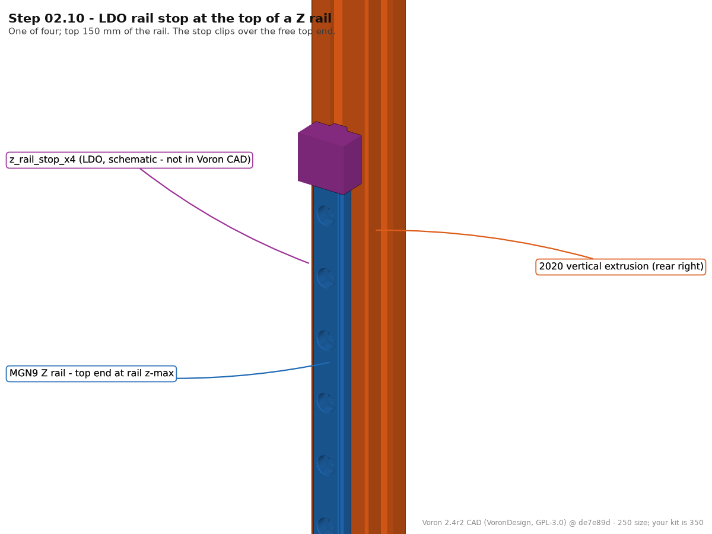
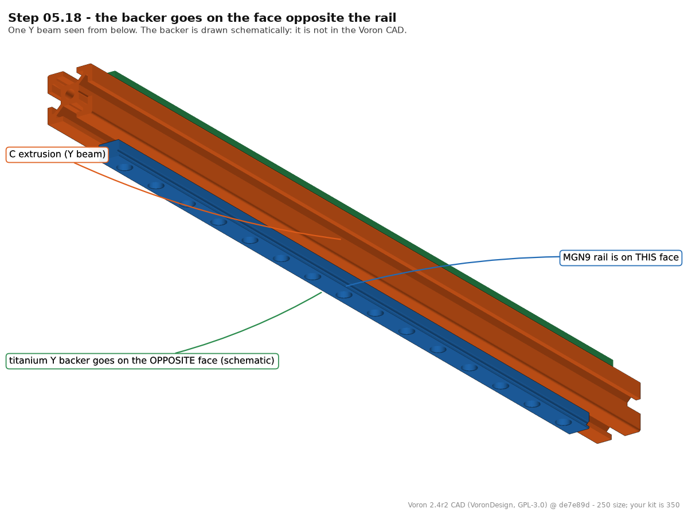
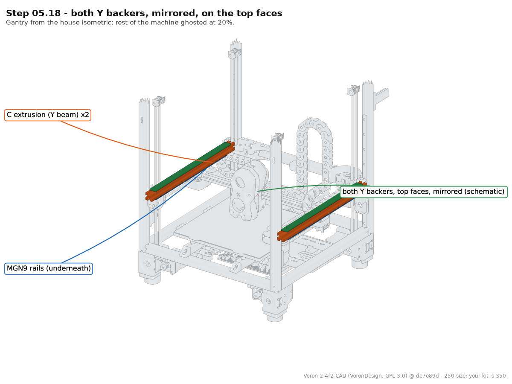
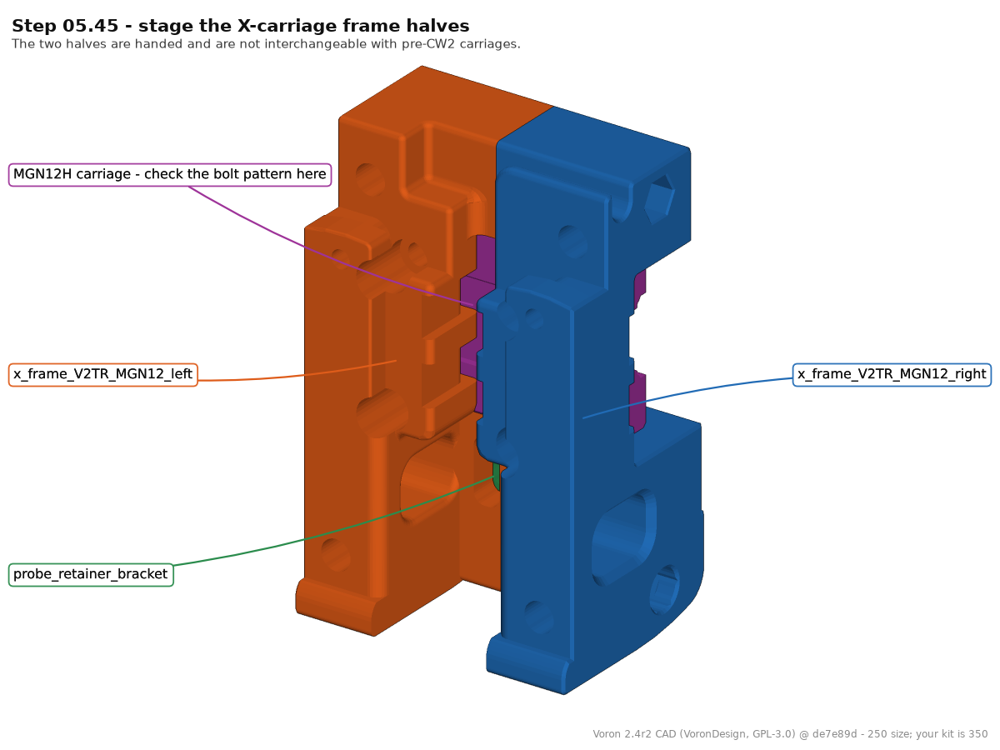
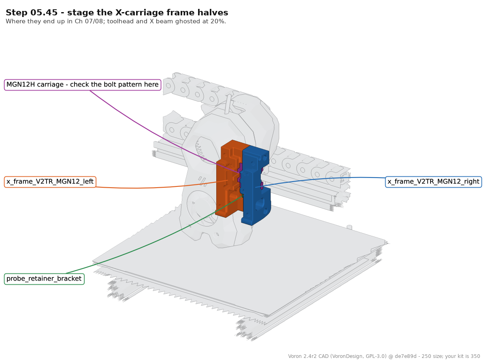
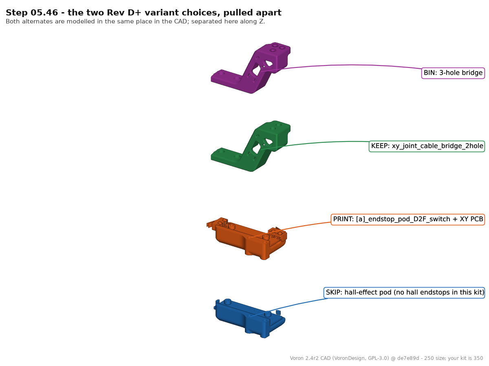
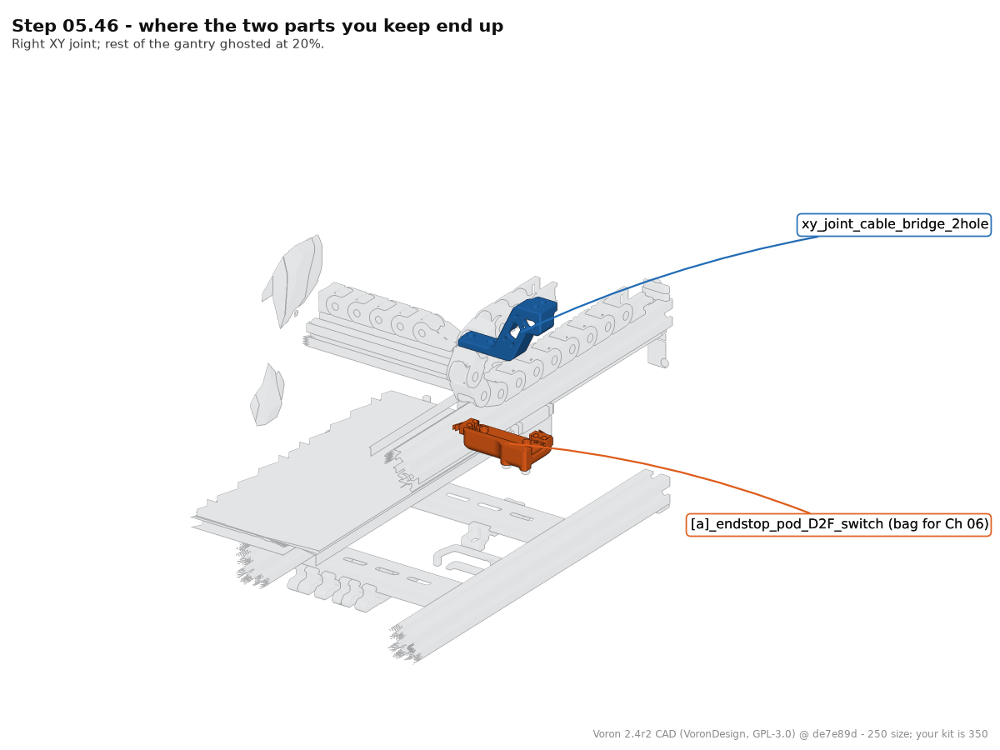

# CAD-render pilot — custom step illustrations from the Voron 2.4r2 STEP

**Verdict: viable, and cheaper than expected.** The official STEP loads in 6 s, the whole
assembly tessellates in 66 s, and a finished 1200×900 image pair costs 10–45 s of unattended
compute. The cost is not compute and not tooling — it is the ~3–6 min of judgement per step
needed to pick the parts and the camera. Ceiling on usefulness is coverage, not capability:
roughly a third of the manual's steps are about hardware the Voron CAD does not contain.

Everything below was run on this Mac (M-series, 16 GB, macOS 25.6) on 2026-09-05.

---

## 1. Source

| | |
|---|---|
| file | `CAD/Voron_2.4r2_Assembly_STEP.zip` → `Voron_2.4r2_Assembly.step` |
| present at pinned manual commit | **yes**, `de7e89d` — no fallback to the branch head needed |
| url | `https://raw.githubusercontent.com/VoronDesign/Voron-2/de7e89d/CAD/Voron_2.4r2_Assembly_STEP.zip` |
| zip / step size | 41.5 MB / 241.5 MB (4 566 855 lines) |
| zip sha256 | `36c6c58e096aa89aa05a0ef22f3b49cbceedc950424332772461ab0c779cc1c6` |
| schema | AP214 `AUTOMOTIVE_DESIGN`, written by Autodesk Fusion via ST-Developer v20, 2023-09-03 |
| licence | GPL-3.0, VoronDesign — same terms as the manual pages already in this repo |

**The published CAD is the 250 machine, not the 350.** Verified from the geometry: verticals are
`HFSB5-2020-430`, the bed is a `10in MIC6 Plate` (254 mm), Z rails are MGN9-300. Part identity,
handedness, mounting faces and assembly relationships all transfer to a 350; **extrusion and rail
lengths do not**. Every render carries that caveat in its footer.

## 2. Tooling — what worked

`cadquery` (OCP/OCCT) installed cleanly on the first try. FreeCAD and conda were never needed.

```bash
uv venv --python 3.12 venv-cq                       # 0.4 s
uv pip install cadquery numpy pillow matplotlib     # 7.4 s   -> cadquery 2.8.0, cadquery-ocp 7.9.3.1.1,
                                                    #            OCCT 7.9.3, vtk 9.6.2, numpy 2.5.2
```

Loading the assembly, with names and the full instance tree:

```bash
python scripts/cad_render/step_extract.py Voron_2.4r2_Assembly.step --out CACHE
```

```
[    0.0s] reading Voron_2.4r2_Assembly.step (242 MB)
[    6.3s] parsed; transferring to XCAF document
[   63.2s] 1428 leaf parts, 2.67M triangles
[   63.4s] wrote CACHE/index.json + meshes.npz (64 MB)
66.32 real   1.56 GB max RSS
```

`STEPCAFControl_Reader` + `XCAFDoc_ShapeTool` walks the product tree, accumulates each instance's
`TopLoc_Location`, and `BRepMesh_IncrementalMesh` tessellates each leaf **in world coordinates**
at a deflection scaled to the part (`clamp(bbox_diag/260, 0.06, 1.0)` mm, 0.4 rad). Output is a
64 MB cache: `index.json` (id, name, full assembly path, world bbox, triangle count) plus
`meshes.npz` (per-part float32 verts + int32 tris). **This is the expensive step and it runs once.**
Every render afterwards reads the cache with `mmap_mode="r"` and touches only the parts it needs.

Rendering is `scripts/cad_render/render.py`: a pure-numpy orthographic z-buffer rasteriser
(packed depth+index keys, `np.minimum.at` scatter, 2× supersampled and box-downsampled), flat
two-light shading, part-id edge detection for outlines, and a matplotlib pass for the callouts.
No GPU, no display server, no OpenGL — so it runs headless in CI, and it is deterministic:
same cache + same arguments ⇒ byte-identical PNG.

### What did not work / had to be fixed

- **`XCAFDoc_ShapeTool.GetFreeShapes` is not a static method** in OCP 7.9 while its siblings
  (`GetComponents_s`, `GetLocation_s`, `GetReferredShape_s`, `IsAssembly_s`) are. One-line fix,
  but it is not what the OCCT docs imply.
- **The STEP carries no colours.** `XCAFDoc_ColorTool` returns nothing for all 1428 leaves; the
  Fusion export dropped appearances. Highlight colours are assigned by the renderer.
- **First rasteriser silently dropped every triangle with a screen bbox > 512 px** — a bucket loop
  whose last bucket had an unreachable lower bound. Symptom was subtle and would have shipped:
  small printed parts looked perfect while extrusions rendered as their end caps only. Fixed by
  4-way subdividing any triangle spanning > 192 px before scatter.
- **Clipping the ghost layer to the framed box by triangle centroid left ragged slabs** where a
  coarsely tessellated acrylic panel crossed the boundary. Fixed by subdividing straddling
  triangles first (`clip_to_box`).
- FreeCAD / `freecadcmd`: not installed, not attempted — cadquery worked, so no cask install.

## 3. Part-name quality — good enough to drive selection by regex

| | |
|---|---|
| leaf parts | 1428 (2.67 M triangles) |
| human-readable leaf names | 1281 (90 %) |
| placeholder leaf names (`=>[0:1:1:415]`, `PRODUCT_NAME_3`, `SOLID`, `Part38`) | 147 (10 %) |
| placeholders whose **parent path** is meaningful | 147 (100 %) |
| max tree depth | 8 |

Top level is clean: `Gantry` (491), `Z Assembly` (262), `Panels` (209), `Frame` (180),
`Skirt` (145), `Electronics` (83), `Exhaust Filter Assembly` (35), `Bed Components` (16),
`Spool Holder` (7). Below that the names are the ones a builder recognises —
`x_carriage_frame_left`, `D2F_Endstop_Pod`, `XY Cable Chain Bridge - 2 Hole`,
`MGN9 - 300mm`, `2020 Drop-in T-nut, M5`, `HFSB5-2020-430-LCP-RCP`, `Meanwell LRS-200-24`.
Fasteners are named by size (`M3x8 SHCS`, `M5x30 BHCS`), which means a step's exact screws are
addressable.

The 10 % placeholders are almost all *the extruded body of a purchased item* — the aluminium of an
extrusion, the steel of a rail — sitting under a named parent, so
`HFSB5-2020-350:1/MGN9 - 300mm:1/=>` selects "the rail on the right Y beam" unambiguously.

Caveats:
- Fusion instance suffixes (`(3)`, `(1)`, `(Mirror)`) are the only thing distinguishing the four
  Z verticals. Regexes against them are brittle across a CAD re-export — **pin selections by leaf
  `id` in a committed manifest, and re-resolve ids only when the cache is rebuilt.**
- One assembly node is literally named `A/B Drives`; the `/` collides with the path separator.
  Cosmetic, but a manifest keyed on ids avoids it.
- Both variants of a choice are modelled **in the same place** (D2F pod and hall-effect pod;
  2-hole and 3-hole cable bridge). Rendering them together needs an explicit offset — which turns
  out to be exactly the illustration an LDO-deviation step wants (see 05.46 below).

## 4. The five steps

Rendered by `scripts/cad_render/pilot_steps.sh`. `a` = the parts alone, `b` = the same parts in
place with everything else ghosted at 20 % (edges at 45 % so the context still reads).
Both at the house isometric (azimuth −55°, elevation +26°) unless noted.
Anything labelled *(schematic)* is a box drawn by the renderer, not Voron geometry.

### Step 02.10 — LDO rail stops at the top of each Z rail




Framed on the top ~110 mm of the rail via `--frame-a` (auto-framing a 430 mm extrusion gives a
useless sliver). Answers the thing the text cannot: *where exactly is "the top of the rail"*
relative to the extrusion end and how far the carriage can travel before it leaves the rail.

### Step 05.18 — Fit the second Y backer  *(the Ti-backer step)*




The only step of the five that needed a non-standard camera: view `a` is from **below** the beam
(elevation −24°) because the MGN9 rail is on the underside and the whole point of the step is
*which face is opposite the rail*. View `b` returns to the house isometric to show both backers
mirrored on the two top faces. Backers are schematic — titanium backers are a mod and are not in
the Voron CAD.

### Step 05.45 — Stage the X-carriage frame halves




`x_carriage_frame_left` / `_right` / `probe_bracket` / the MGN12H block, then the same parts inside
the ghosted Stealthburner and X beam. This is the case CAD is unambiguously better at than a
photo: the two halves are handed, they nest, and the render shows the bolt pattern the step tells
you to check.

### Step 05.46 — Which endstop pod, which cable bridge




The strongest result of the pilot. The CAD contains **both** alternates of both Rev D+ choices, so
view `a` pulls them apart along Z and labels them PRINT / SKIP / KEEP / BIN. No official manual
page shows the two side by side; the LDO printed-parts guide only names them in prose.

### Step 09.26 — Clip the USB adapter to the front DIN rail


View `b` reads *through* the deck — the highlight layer is composited over the ghost regardless of
occlusion, which is the x-ray view an electronics-bay step needs. Settles "which rail is the front
one" and "which end is the right-hand end", neither of which the text pins down. The adapter itself
is schematic (LDO hardware).

## 5. Cost model

| stage | cost | frequency |
|---|---|---|
| venv + cadquery | 8 s | once |
| download + unzip STEP | ~25 s | once |
| `step_extract.py` | 66 s, 1.6 GB peak RSS | once per CAD revision |
| choose parts + camera for one step | **3–6 min of judgement** | per step |
| render one `a`+`b` pair | 10–45 s, single core, ~1 GB | per step, unattended |
| PNG size | 65–160 KB each | — |

Ten images for five steps took **2 min 19 s** wall clock end to end. Extrapolating: 280 steps × 2
images ≈ **1.5–3.5 h of unattended compute**, and ~65 MB of PNGs if all of them were committed.
Compute is not the constraint.

The constraint is the per-step decision: which leaf ids, which callout wording, which camera,
which context radius. With `index.json` in hand that is a small, well-posed task — but it is 280 of
them. Realistic: **15–25 h** of agent time for full coverage, or **2–4 h** for the ~20 currently
image-less steps that the CAD can actually serve.

## 6. Blockers and limits

1. **250 vs 350.** Cosmetic for "which face / which way round", wrong for anything about length,
   travel, or belt runs. Must stay in the footer of every image.
2. **The CAD is the finished machine.** There is no intermediate state: no sub-assembly on a bench,
   no half-inserted fastener, no "before you tighten". Staging can be faked with `--offset`
   (as in 05.46), but a step whose content *is* the motion — rolling a T-nut in from the end,
   threading a belt — gets nothing from a static pose.
3. **Coverage.** Of the 61 image-less steps in the assembly chapters, roughly 20 are CAD-servable.
   Chapter 10 alone has 24, nearly all of them meter readings, jumpers and mains procedure. The
   Voron CAD has generic electronics (Meanwell, SSR, Pi, DIN rails, WAGO mount) and **none** of the
   LDO Rev D+ hardware — no Leviathan, no Nitehawk-SB, no LDO rail stops, no USB/ESD adapter, no
   titanium backers. Those need schematic boxes (supported) or a different source.
4. **No colours in the STEP**, so the renders cannot show the black/orange filament split the
   manual's printed-parts tables use. Colour would have to come from a per-part mapping we author.
5. **Regex fragility** against Fusion instance suffixes — mitigated by pinning ids in a manifest.

## 7. Recommended pipeline

1. Keep the two-stage split. `step_extract.py` once per CAD revision into a cache that is **not**
   committed (64 MB); `render.py` reads it. Cache rebuild is 66 s, so CI can do it from the pinned
   zip on demand.
2. Add `docs/manual/assets/cad/steps.yml` — one entry per step: leaf ids (not regexes), callout
   text, schematic boxes, camera, `frame_a`, `context_scale`, `ghost_exclude`. `pilot_steps.sh`
   becomes a loop over that file. The manifest is the reviewable artefact; the PNGs are derived.
3. Author manifest entries in batches by sub-assembly (all Gantry steps at once) — the part lookup
   is already loaded and the camera repeats, which is where the 3–6 min/step drops toward 2.
4. Render in CI on manifest change, commit only the PNGs a chapter actually references.
5. Keep the house isometric as the default and treat a camera override as a deliberate,
   commented exception (one in five here).
6. Do **not** attempt chapter 10 or the software/startup/calibration chapters from CAD.

## 8. Incidental finding — flagged, not fixed

Step 02.09 says the Z rails must face each other *"front-left faces front-right, rear-left faces
rear-right"*. The CAD says otherwise: all four MGN9 Z rails are mounted on faces whose normal is
±Y. The two rear verticals occupy y ∈ [352, 372] with their rails at y ∈ [345.5, 352] (facing
**forward**); the two front verticals occupy y ∈ [−38, −18] with their rails at y ∈ [−18, −11.5]
(facing **rearward**). So front-left faces **rear**-left, and the two front rails are parallel, not
opposed. Manual p.27 only says "make sure the rails face each other as shown in the graphic" — the
pairing claim is ours. Worth a look before Ch 02 is built; no chapter edits were made in this pilot.

---

Files: `scripts/cad_render/{step_extract.py,render.py,find_parts.py,pilot_steps.sh}`,
`docs/manual/assets/cad/{02-10,05-18,05-45,05-46,09-26}-{a,b}.png`, `SOURCES.txt`.

Reproduce:

```bash
curl -sSLO https://raw.githubusercontent.com/VoronDesign/Voron-2/de7e89d/CAD/Voron_2.4r2_Assembly_STEP.zip
unzip -q Voron_2.4r2_Assembly_STEP.zip
uv venv --python 3.12 venv-cq && uv pip install --python venv-cq/bin/python cadquery numpy pillow matplotlib
venv-cq/bin/python scripts/cad_render/step_extract.py Voron_2.4r2_Assembly.step --out /tmp/voroncache
CACHE=/tmp/voroncache PY=venv-cq/bin/python bash scripts/cad_render/pilot_steps.sh
```
