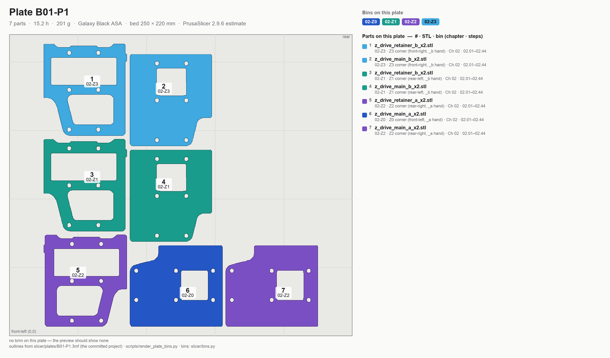
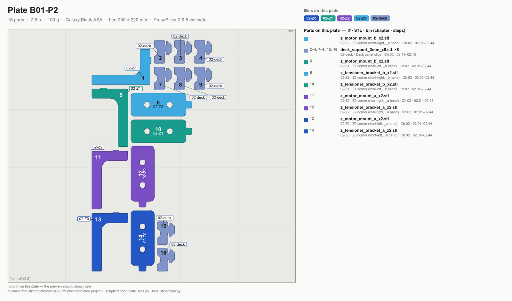

# Batch B01 — Z drive assemblies

The first kit-day batch: every Z-drive part with a bearing seat, so it waits for Gate B (the real 625-2RS
bore test) and then prints under Ch 00–01 while the frame goes together.

**Time:** 22.8 h (2 plates) — PrusaSlicer 2.9.6 estimates.

**Sessions:** 2 plate starts (~5 min hands-on each, 15.2 h and 7.6 h unattended) + ~20 min inspect and bin.

**Prerequisites:** **Gate B passed** (Step B00.7 — kit day: 625-2RS bore, MGN12 rail, real inserts). Gate A
alone does not release this batch. Note: fully completing the *Z Drives and Idlers* assembly chapter also
needs the accent parts from **B02** (`[a]_z_drive_baseplate_a/b`, `[a]_belt_tensioner_a/b`,
`[a]_z_tensioner_9mm_x4`), which in the pre-kit order are already printed — plan §9 lists hard prerequisites
`B00;B02` for that chapter.

**Printed parts**

| STL | Repo path | Qty | Colour | g ea |
|---|---|---:|---|---:|
| `z_drive_main_a_x2.stl` | Voron-2 `STLs/Z_Drive/` | 2 | Black | 39.4 |
| `z_drive_main_b_x2.stl` | Voron-2 `STLs/Z_Drive/` | 2 | Black | 39.4 |
| `z_drive_retainer_a_x2.stl` | Voron-2 `STLs/Z_Drive/` | 1 *(second copy; first was on B00)* | Black | 19.5 |
| `z_drive_retainer_b_x2.stl` | Voron-2 `STLs/Z_Drive/` | 2 | Black | 19.5 |
| `z_motor_mount_a_x2.stl` | Voron-2 `STLs/Z_Drive/` | 2 | Black | 11.9 |
| `z_motor_mount_b_x2.stl` | Voron-2 `STLs/Z_Drive/` | 2 | Black | 11.9 |
| `z_tensioner_bracket_a_x2.stl` | Voron-2 `STLs/Z_Idlers/` | 2 | Black | 13.0 |
| `z_tensioner_bracket_b_x2.stl` | Voron-2 `STLs/Z_Idlers/` | 2 | Black | 13.0 |
| `deck_support_3mm_x8.stl` | Voron-2 `STLs/Panel_Mounting/` | 8 | Black | 1.1 |

⚠ **Deck-support thickness (verify):** LDO's Rev D printed-parts guide says "our kit ships with 4 mm deck
panels, use 4 mm deck support clips," but the Rev D 350 BOM lists the deck panel as **3 mm** acrylic (the
4 mm panel is the *bottom* panel). The size-specific BOM wins: print `deck_support_3mm_x8` ×8 now, and
measure the deck panel at Ch 00 Step 00.4 — if it measures 4 mm, reprint `deck_support_4mm_x8` (8 g, 30 min).
On kit day you can caliper the panel before B01-P2 starts and print the right clips first time.

**Hardware:** none.

**Read first**

- The parts come in **mirrored pairs**: every `_a` file has a `_b` twin, and each Z corner takes *either* the
  `a` set *or* the `b` set — two corners of each. They are not interchangeable, so Step B01.8 bins them as
  two `a` bags and two `b` bags, not four identical sets.
- Checkpoint after B01: 625-2RS (16 mm OD) press-fit into each `z_drive_main` and `z_drive_retainer` bearing
  seat — thumb pressure, no rocking. M3 heat-set bosses on the motor mounts: no bulge, insert flush. Check
  the 4 mm/3 mm deck-support call above.
- Most commonly reprinted here: `z_drive_main_*` — the largest single parts in the batch, most exposed to
  warp at the corners.
- Plate B01-P1 is the longest single plate in the whole build (15.2 h) — start it in the morning, not at bedtime.
  On kit day that means: Gate B first thing, B01-P1 on before the inventory starts.

## Step B01.1 — Filament prep

**Do:** Confirm Galaxy Black spool loaded, dried within the last 2 weeks or fresh. This batch alone is
301 g — weigh the active spool before starting B01-P1.
**Check:** B01-P1 needs **≥ 201 g** on the spool at start (the ledger in [README](README.md#spool-ledger) has
it on spool #2 with ~550 g — fine). If reprints have pushed the active spool under ~230 g, start B01-P1 on
a fresh one and re-derive the ledger from your weighings — a resume seam on a bearing-seat part is not worth it.

Source: [print plan §4.3 — spool changes](../../voron-print-plan.md#43-spool-changes) · [00-slicer-setup § Drying](00-slicer-setup.md#drying) · [Prusa KB — ASA](https://help.prusa3d.com/article/asa_1809)

## Step B01.2 — Load plate B01-P1

**Do:** Open `slicer/plates/B01-P1.3mf` (**File → Open Project**). The arrangement, the per-object brims and every override are already in the project — what follows is what it contains, so you can confirm it loaded right rather than rebuild it. On the plate, **5 files, 7 objects**: `z_drive_main_a` ×2, `z_drive_main_b` ×2, `z_drive_retainer_a` ×1, `z_drive_retainer_b` ×2,
`0.20mm STRUCTURAL @COREONE 0.4 (modified)` with the standing overrides. No brim on this plate (nothing here is on
the tall/narrow or long-flat lists) — the preview shows no brim outline. Do not rotate any part.
**Parts:** the five files above — 15.2 h, 201 g (PrusaSlicer 2.9.6 estimate).
**Check:** Estimated plate time is **15 h 13 m**; if far off, re-verify profile/overrides before committing an overnight print.

Source: [print plan §3 — the batches](../../voron-print-plan.md#3-the-batches) · [00-slicer-setup § Committed projects](00-slicer-setup.md#committed-projects-open-the-plate-dont-rebuild-it) · [00-slicer-setup § Orientation & brim](00-slicer-setup.md#orientation-brim)

## Step B01.3 — Pre-print checks

**Do:** Sheet per [00-slicer-setup § Print sheet](00-slicer-setup.md#print-sheet) (glue film renewed — this
plate carries the biggest flat bottoms in the build), spool confirmed dry, chamber preheating.
**Check:** Chamber reads ≥40 °C before purge.

Source: [00-slicer-setup § Print sheet](00-slicer-setup.md#print-sheet) · [00-slicer-setup § Calibration sequence](00-slicer-setup.md#calibration-sequence-run-before-b00-and-again-after-the-gen-2-upgrade) · [Prusa KB — ASA](https://help.prusa3d.com/article/asa_1809)

## Step B01.4 — Print plate B01-P1

**Do:** Start in the morning or at the start of a full workday — this is the 15.2 h plate.
**Check:** First layer clean; no corner lift on the `z_drive_main` bodies partway through.

Source: [00-slicer-setup § Overrides](00-slicer-setup.md#overrides) · [print plan §4.1 — how these numbers were produced](../../voron-print-plan.md#41-how-these-numbers-were-produced)

## Step B01.5 — Load plate B01-P2

**Do:** Open `slicer/plates/B01-P2.3mf` (**File → Open Project**). The arrangement, the per-object brims and every override are already in the project — what follows is what it contains, so you can confirm it loaded right rather than rebuild it. On the plate, **5 files, 16 objects**: `z_motor_mount_a` ×2, `z_motor_mount_b` ×2, `z_tensioner_bracket_a` ×2, `z_tensioner_bracket_b` ×2,
`deck_support_3mm` ×8. No brim in the project. `z_motor_mount_a/b` are 42.0 mm tall, borderline aspect —
**only if a motor mount lifts on this print**, add a 5 mm brim to those four objects by hand for the reprint
(right-click the object → Add settings → Skirt and brim → Brim width; never the global setting, per
[00-slicer-setup.md](00-slicer-setup.md#orientation-brim)).
**Parts:** the five files above — 7.6 h, 100 g (PrusaSlicer 2.9.6 estimate).
**Check:** All 8 deck-support clips accounted for on the plate, and the deck panel calipered (Ch 00 Step 00.4)
so you know these are the right thickness before they print.

Source: [print plan §3 — the batches](../../voron-print-plan.md#3-the-batches) · [00-slicer-setup § Committed projects](00-slicer-setup.md#committed-projects-open-the-plate-dont-rebuild-it) · [00-slicer-setup § Orientation & brim](00-slicer-setup.md#orientation-brim) · [LDO Rev D printed-parts guide](https://docs.ldomotors.com/en/voron/voron2/printed_part_guide_rev_d) · [LDO Rev D 350 BOM](https://docs.ldomotors.com/en/voron/voron2/350_BOM/Rev_D)

## Step B01.6 — Print plate B01-P2

**Do:** Start after P1 is pulled and inspected.
**Check:** No warp at the corners of the motor mounts.

Source: [00-slicer-setup § Overrides](00-slicer-setup.md#overrides) · [print plan §4.1 — how these numbers were produced](../../voron-print-plan.md#41-how-these-numbers-were-produced)

## Step B01.7 — Inspect

**Do:** With calipers and thumb pressure: press a 625-2RS bearing (16 mm OD) into every `z_drive_main` and
`z_drive_retainer` bearing seat — should seat with thumb pressure, no rocking. Check M3 heat-set bosses on
the motor mounts sit flush with no bulge.
**Check:** All bearing seats pass; any that don't → reprint that part, don't proceed with a known-bad Z drive.

Pause: ~15 min since the last pause — every bearing seat tested and the bearings pulled back out; nothing pressed for keeps yet. Do not seat inserts — Ch 02 Step 02.04 does that with the parts sorted.

Source: [print plan §5.2 — checkpoint after each batch](../../voron-print-plan.md#52-checkpoint-after-each-batch) · [00-slicer-setup § Gate B](00-slicer-setup.md#gate-b-kit-day-bore-rail-inserts) · [Voron materials — shrinkage 100 %](https://docs.vorondesign.com/materials.html)

## Step B01.8 — Label and bin

**Do:** Everything on this batch feeds **Z Drives and Idlers** (Ch 02). Bin as **two `a` bags and two `b`
bags** — the sets are mirrored, not identical: each bag = one `z_drive_main_?` + one `z_drive_retainer_?` +
one `z_motor_mount_?` + one `z_tensioner_bracket_?` of the same letter (the B00 retainer is one of the two
`a` retainers). **Write the letter on the inside face of each part as it comes off the plate** — Ch 02
Step 02.01 asks for it, and Ch 02's corner map is `_a` = Z0 front-left and Z2 rear-right, `_b` = Z1 rear-left
and Z3 front-right. The four orange baseplates and tensioners from B02 join their letter's bag. Deck supports go in a separate bag
labelled "deck panel — 3 mm clips; confirm against the calipered panel".
**Check:** Two `a` sets and two `b` sets, letters marked, plus 8 deck supports, labelled and boxed.

Source: [print plan §9 — batch summary](../../voron-print-plan.md#9-machine-readable-batch-summary) · [print plan §2 — which parts gate which step](../../voron-print-plan.md#2-which-parts-gate-the-frame-and-z-drive-steps)

---

## Checkpoint B01
- [ ] Gate B passed before B01-P1 started (Step B00.7)
- [ ] 625-2RS bearing press-fit into all `z_drive_main_a/b` seats — thumb pressure, no rocking
- [ ] 625-2RS bearing press-fit into all `z_drive_retainer_a/b` seats — thumb pressure, no rocking
- [ ] M3 heat-set bosses on motor mounts: flush, no bulge
- [ ] Deck panel measured; correct deck-support thickness confirmed or reprinted
- [ ] No corner lift or delamination on any `z_drive_main` body
- [ ] Two `a` sets and two `b` sets bagged, letters marked on the parts

## Common mistakes
- Starting the 15.2 h P1 plate late in the day and having it finish unattended overnight with no chance to
  abort a bad first layer.
- Starting B01 on Gate A alone — the bore fit on the real bearing is what protects these 22.8 h.
- Trying to make four identical bags from two `a` and two `b` of each part — the sets are mirrored.
- Assuming the deck-support thickness without measuring the actual panel.
- Forcing a tight bearing seat with a press instead of reducing extrusion multiplier for the reprint.

## Next
Assembly: *Z Drives and Idlers* (Ch 02), with B02's accent parts already on the shelf. Printing: [B03 — A/B drive units + front idlers](B03-ab-drive-units-and-front-idlers.md).
