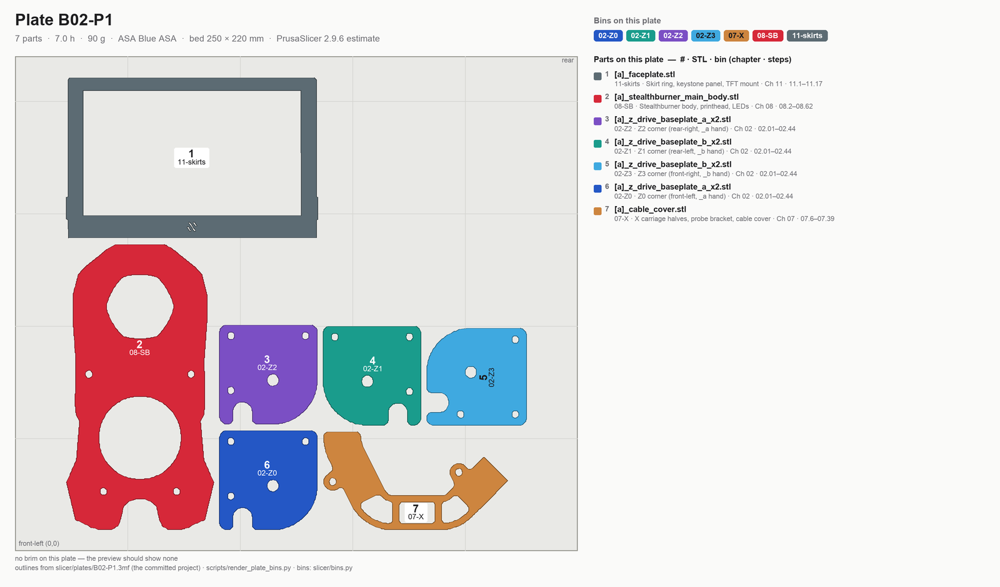
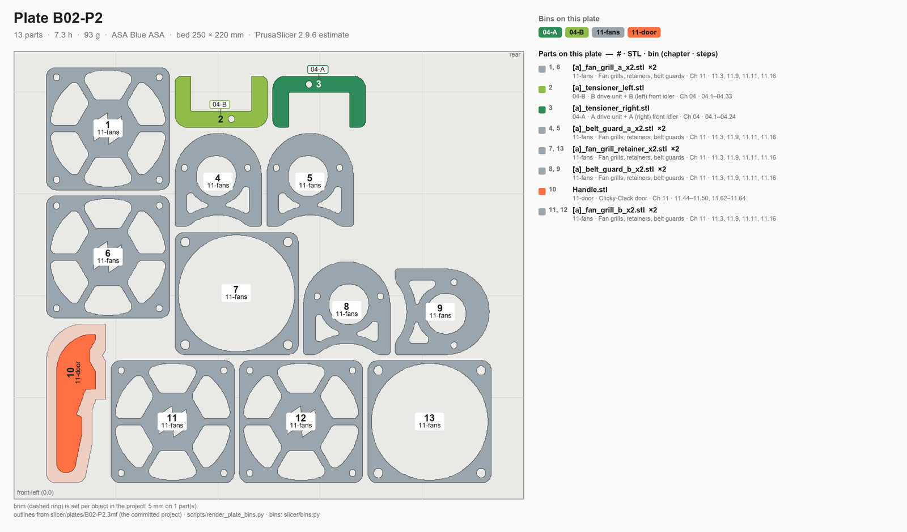
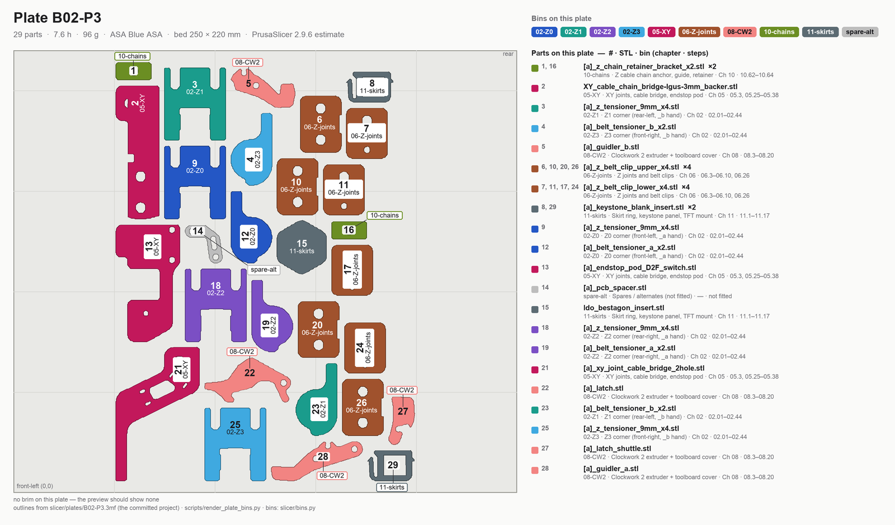

# Batch B02 — Accent parts (orange), "the orange day"

Every accent part in the whole build, printed in one continuous orange session so the accent spool is
mounted exactly once. **Two colour changes in the whole build: black → orange here, orange → black after.**
Nothing here has a press fit, so this is the first batch after Gate A and prints before the kit arrives.

**Time:** 21.9 h (3 plates) — PrusaSlicer 2.9.6 estimates.

**Sessions:** 3 plate starts (~5 min hands-on each, 7.0 / 7.3 / 7.6 h unattended) + ~20 min inspect and bin.

**Prerequisites:** **Gate A passed** (Step B00.5 — the cube; a colour change doesn't skip the calibration
requirement). Gate B is not needed: no bearing seat, rail fit or insert boss on these plates is load-bearing
before assembly.

**Printed parts**

| STL | Repo path | Qty | Colour | g ea |
|---|---|---:|---|---:|
| `[a]_z_drive_baseplate_a_x2.stl` | Voron-2 `STLs/Z_Drive/` | 2 | Orange | 9.7 |
| `[a]_z_drive_baseplate_b_x2.stl` | Voron-2 `STLs/Z_Drive/` | 2 | Orange | 9.7 |
| `[a]_belt_tensioner_a_x2.stl` | Voron-2 `STLs/Z_Drive/` | 2 | Orange | 1.9 |
| `[a]_belt_tensioner_b_x2.stl` | Voron-2 `STLs/Z_Drive/` | 2 | Orange | 1.9 |
| `[a]_z_tensioner_9mm_x4.stl` | Voron-2 `STLs/Z_Idlers/` | 4 | Orange | 8.1 |
| `[a]_tensioner_left.stl` | Voron-2 `STLs/Gantry/Front_Idlers/` | 1 | Orange | 7.4 |
| `[a]_tensioner_right.stl` | Voron-2 `STLs/Gantry/Front_Idlers/` | 1 | Orange | 7.4 |
| `[a]_cable_cover.stl` | Voron-2 `STLs/Gantry/AB_Drive_Units/` | 1 | Orange | 8.0 |
| `[a]_z_chain_retainer_bracket_x2.stl` | Voron-2 `STLs/Gantry/AB_Drive_Units/` | 2 | Orange | 0.6 |
| `[a]_endstop_pod_D2F_switch.stl` | Voron-2 `STLs/Gantry/X_Axis/XY_Joints/` | 1 | Orange | 8.1 |
| `[a]_xy_joint_cable_bridge_2hole.stl` | Voron-2 `STLs/Gantry/X_Axis/XY_Joints/` | 1 | Orange | 9.2 |
| `XY_cable_chain_bridge-Igus-3mm_backer.stl` | whopping_Voron_mods `extrusion_backers/STLs/` | 1 Note: alternate to the above — fit whichever clears the Ti backers, see §Read first | Orange | 9.1 |
| `[a]_z_belt_clip_lower_x4.stl` | Voron-2 `STLs/Gantry/` | 4 | Orange | 2.3 |
| `[a]_z_belt_clip_upper_x4.stl` | Voron-2 `STLs/Gantry/` | 4 | Orange | 2.4 |
| `[a]_stealthburner_main_body.stl` | Stealthburner `STLs/Stealthburner/` | 1 | Orange | 46.5 |
| `[a]_guidler_a.stl` | Stealthburner `STLs/Clockwork2/Direct_Drive/` | 1 | Orange | 3.7 |
| `[a]_guidler_b.stl` | Stealthburner `STLs/Clockwork2/Direct_Drive/` | 1 | Orange | 2.1 |
| `[a]_latch.stl` | Stealthburner `STLs/Clockwork2/Direct_Drive/` | 1 | Orange | 3.5 |
| `[a]_latch_shuttle.stl` | Stealthburner `STLs/Clockwork2/Direct_Drive/` | 1 | Orange | 1.7 |
| `[a]_pcb_spacer.stl` | Stealthburner `STLs/Clockwork2/` | 1 *(spare — kit supplies one)* | Orange | 0.3 |
| `[a]_belt_guard_a_x2.stl` | Voron-2 `STLs/Skirts/` | 2 | Orange | 5.4 |
| `[a]_belt_guard_b_x2.stl` | Voron-2 `STLs/Skirts/` | 2 | Orange | 5.4 |
| `[a]_fan_grill_a_x2.stl` | Voron-2 `STLs/Skirts/` | 2 | Orange | 5.9 |
| `[a]_fan_grill_b_x2.stl` | Voron-2 `STLs/Skirts/` | 2 | Orange | 5.9 |
| `[a]_fan_grill_retainer_x2.stl` | Voron-2 `STLs/Skirts/` | 2 | Orange | 4.2 |
| `[a]_keystone_blank_insert.stl` | Voron-2 `STLs/Skirts/` | 2 *(1 used + 1 spare; LDO ships one CAT6 keystone)* | Orange | 2.5 |
| `[a]_faceplate.stl` | LDOVoronTrident `STLs/BTT Pi TFT4.3 Mount/` | 1 | Orange | 6.6 |
| `ldo_bestagon_insert.stl` | LDOVoron2 `STLs/` | 1 | Orange | 3.0 |
| `Handle.stl` | whopping_Voron_mods `clickyclacky_door/STLs/` | 1 | Orange | 33.7 |

⚠ **Cable-chain bridge, conditional:** Fabreeko's titanium extrusion backers ship pre-tapped for the cable
chain, which may make the printed bridge unnecessary. Print **both** `[a]_xy_joint_cable_bridge_2hole` and
`XY_cable_chain_bridge-Igus-3mm_backer` (18 g total) and fit whichever clears at assembly. "Igus" = the
2-hole chain pattern, which is what LDO ships.

**Hardware:** none.

**Read first**

- Checkpoint after B02: guidler and latch must move freely against the CW2 body once it exists (B06) —
  test-fit then, not now. Check the SB main body's built-in supports came out clean and the LED pockets are crisp.
- Most commonly reprinted here: `[a]_stealthburner_main_body` — the most-looked-at part in the build.
- `[a]_stealthburner_main_body` has **built-in supports** — snap them out, don't cut.
- `Handle.stl` is 60 mm tall on a 68×19 footprint — the project already carries its 5 mm brim, and nothing
  else on B02-P2 has one (per [00-slicer-setup.md](00-slicer-setup.md#orientation-brim)). You verify it in
  the preview; you do not add it.
- `[a]_keystone_blank_insert` ×2 covers a panel with 2 slots against 1 LDO-supplied CAT6 keystone — 1 used, 1 spare.

## Step B02.1 — Filament prep

**Do:** Change spool to Prusament ASA Prusa Orange (on the printer: Unload, then Load Filament → ASA). Purge
fully — this is the one accent session in the whole build, so a clean colour change matters more here than
anywhere else. Sheet per [00-slicer-setup § Print sheet](00-slicer-setup.md#print-sheet).
**Check:** Purge line is clean orange with no black streaking.

Source: [print plan §4.3 — spool changes](../../voron-print-plan.md#43-spool-changes) · [00-slicer-setup § Drying](00-slicer-setup.md#drying) · [Prusa KB — ASA](https://help.prusa3d.com/article/asa_1809)

## Step B02.2 — Load plate B02-P1

**Do:** Open `slicer/plates/B02-P1.3mf` (**File → Open Project**). The arrangement, the per-object brims and every override are already in the project — what follows is what it contains, so you can confirm it loaded right rather than rebuild it. The filament box reads `Prusament ASA @COREONE HF0.4 - Voron orange` — the accent preset, same overrides. On the plate, **5 files, 7 objects**: `[a]_stealthburner_main_body`, `[a]_faceplate`, `[a]_cable_cover`, `[a]_z_drive_baseplate_a` ×2,
`[a]_z_drive_baseplate_b` ×2. No rotation, no brim. Leave the SB main body's built-in supports in place — do not
suppress them in slicer.
**Parts:** the five files above — 7.0 h, 90 g (PrusaSlicer 2.9.6 estimate).
**Check:** SB main body oriented as shipped (supports visible in preview); no brim outline anywhere on the plate.

Source: [print plan §3 — the batches](../../voron-print-plan.md#3-the-batches) · [00-slicer-setup § Committed projects](00-slicer-setup.md#committed-projects-open-the-plate-dont-rebuild-it) · [00-slicer-setup § Orientation & brim](00-slicer-setup.md#orientation-brim) · [Stealthburner manual — remove built-in supports](https://github.com/VoronDesign/Voron-Stealthburner/blob/main/Manual/Assembly_Manual_SB.pdf)

## Step B02.3 — Print plate B02-P1

**Do:** Print with standing overrides, no brim on this plate's parts.
**Check:** First layer clean; SB body prints without support failure.

Source: [00-slicer-setup § Overrides](00-slicer-setup.md#overrides) · [print plan §4.1 — how these numbers were produced](../../voron-print-plan.md#41-how-these-numbers-were-produced)

## Step B02.4 — Load plate B02-P2

**Do:** Open `slicer/plates/B02-P2.3mf` (**File → Open Project**). The arrangement, the per-object brims and every override are already in the project — what follows is what it contains, so you can confirm it loaded right rather than rebuild it. On the plate, **8 files, 13 objects**: `Handle`, `[a]_fan_grill_a` ×2, `[a]_fan_grill_b` ×2, `[a]_fan_grill_retainer` ×2,
`[a]_belt_guard_a` ×2, `[a]_belt_guard_b` ×2, `[a]_tensioner_left`, `[a]_tensioner_right`. **5 mm brim on
`Handle` — already in the project** (60 mm tall, tippy). Do not add one by hand, and never touch the global
brim setting: it would brim every flat grill and guard on the plate.
**Parts:** the eight files above — 7.3 h, 93 g (PrusaSlicer 2.9.6 estimate).
**Check:** The preview shows the brim outline on `Handle` only — none on the flat fan grills, retainers,
belt guards or tensioners.

Source: [print plan §3 — the batches](../../voron-print-plan.md#3-the-batches) · [00-slicer-setup § Committed projects](00-slicer-setup.md#committed-projects-open-the-plate-dont-rebuild-it) · [00-slicer-setup § Orientation & brim](00-slicer-setup.md#orientation-brim)

## Step B02.5 — Print plate B02-P2

**Do:** Print with standing overrides.
**Check:** `Handle` stands through the full print with no lean; brim shows no lift.

Source: [00-slicer-setup § Overrides](00-slicer-setup.md#overrides) · [print plan §4.1 — how these numbers were produced](../../voron-print-plan.md#41-how-these-numbers-were-produced)

## Step B02.6 — Load plate B02-P3

**Do:** Open `slicer/plates/B02-P3.3mf` (**File → Open Project**). The arrangement, the per-object brims and every override are already in the project — what follows is what it contains, so you can confirm it loaded right rather than rebuild it. On the plate, the remaining accent parts, **16 files, 29 objects**: `[a]_belt_tensioner_a` ×2, `[a]_belt_tensioner_b` ×2,
`[a]_z_tensioner_9mm` ×4, `[a]_z_chain_retainer_bracket` ×2, `[a]_endstop_pod_D2F_switch`,
`[a]_xy_joint_cable_bridge_2hole`, `XY_cable_chain_bridge-Igus-3mm_backer`, `[a]_z_belt_clip_lower` ×4,
`[a]_z_belt_clip_upper` ×4, `[a]_guidler_a`, `[a]_guidler_b`, `[a]_latch`, `[a]_latch_shuttle`,
`[a]_pcb_spacer`, `[a]_keystone_blank_insert` ×2, `ldo_bestagon_insert`. No brim. **Check `XY_cable_chain_bridge-Igus-3mm_backer`
in preview** — it's a community remix that may arrive standing 44 mm tall; lay it flat to match the stock
bridge if so.
**Parts:** the 16 files above (29 small accent parts) — 7.6 h, 96 g (PrusaSlicer 2.9.6 estimate).
**Check:** Cable-chain bridge sitting flat, not standing, before slicing.

Source: [print plan §3 — the batches](../../voron-print-plan.md#3-the-batches) · [00-slicer-setup § Committed projects](00-slicer-setup.md#committed-projects-open-the-plate-dont-rebuild-it) · [00-slicer-setup § Orientation & brim](00-slicer-setup.md#orientation-brim) · [print plan §6 — conditional / verify items](../../voron-print-plan.md#6-conditional-verify-items)

## Step B02.7 — Print plate B02-P3

**Do:** Print with standing overrides.
**Check:** No warp on the small parts; SB accent pieces (guidler, latch, latch shuttle) print crisp — these
have fine features that go under close fitment tolerances later.

Source: [00-slicer-setup § Overrides](00-slicer-setup.md#overrides) · [print plan §4.1 — how these numbers were produced](../../voron-print-plan.md#41-how-these-numbers-were-produced)

## Step B02.8 — Inspect

**Do:** Check the SB main body's built-in supports snapped out clean and the LED pockets are crisp (final
guidler/latch fit test happens at B06, not now). Snap the `Handle` brim off and check the base for scarring.
**Check:** No support remnants inside the SB body's cable channels or LED pockets; `Handle` base clean.

Pause: ~10 min since the last pause — supports out, brim off, nothing pressed or glued. Leave the orange spool on if B02-P3 has not printed yet; otherwise unload it and re-seal it before walking away.

Source: [print plan §5.2 — checkpoint after each batch](../../voron-print-plan.md#52-checkpoint-after-each-batch) · [00-slicer-setup § Calibration sequence](00-slicer-setup.md#calibration-sequence-run-before-b00-and-again-after-the-gen-2-upgrade) · [Stealthburner manual — remove built-in supports](https://github.com/VoronDesign/Voron-Stealthburner/blob/main/Manual/Assembly_Manual_SB.pdf)

## Step B02.9 — Label and bin

**Do:** Bin by consuming assembly chapter, one bag per line:

| Bag label | Parts |
|---|---|
| **Ch 02 — Z drives (orange)** | `[a]_z_drive_baseplate_a` ×2, `_b` ×2, `[a]_belt_tensioner_a` ×2, `_b` ×2, `[a]_z_tensioner_9mm` ×4 — write the letter on the inside face of each `_a` / `_b` part as it comes off the plate (Ch 02's corner map: `_a` = Z0 front-left and Z2 rear-right, `_b` = Z1 rear-left and Z3 front-right); they join B01's `a` / `b` bags by letter on kit day |
| **Ch 04 — A/B drives (orange)** | `[a]_cable_cover`, `[a]_tensioner_left`, `[a]_tensioner_right` |
| **Ch 05 — Gantry (orange)** | `[a]_endstop_pod_D2F_switch`, both cable bridges, `[a]_z_chain_retainer_bracket` ×2 |
| **Ch 06 — Z axis (orange)** | `[a]_z_belt_clip_lower` ×4, `[a]_z_belt_clip_upper` ×4 |
| **Ch 08 — Stealthburner (orange)** | `[a]_stealthburner_main_body`, `[a]_guidler_a/b`, `[a]_latch`, `[a]_latch_shuttle`, `[a]_pcb_spacer` |
| **Ch 11 — Skirts (orange)** | `[a]_belt_guard_a/b` ×2 each, `[a]_fan_grill_a/b` ×2 each, `[a]_fan_grill_retainer` ×2, `[a]_keystone_blank_insert` ×2, `[a]_faceplate`, `ldo_bestagon_insert` |
| **B10 — Clicky-Clack `Handle`** | `Handle` — keep it separate until B10's black parts join it |

**Check:** Every accent part labelled with its destination chapter; `Handle` set aside specifically for B10.

Source: [print plan §9 — batch summary](../../voron-print-plan.md#9-machine-readable-batch-summary) · [print plan §2 — which parts gate which step](../../voron-print-plan.md#2-which-parts-gate-the-frame-and-z-drive-steps)

---

## Checkpoint B02
- [ ] SB main body built-in supports removed clean; LED pockets crisp
- [ ] Cable-chain bridge fit decision made (stock 2-hole vs Ti-backer remix) once Ti backers are in hand
- [ ] `Handle` brim removed cleanly, no visible scarring
- [ ] All 29 small accent parts present and sorted by destination chapter
- [ ] Orange spool re-sealed/dry-stored — no more orange prints in the build

## Common mistakes
- Suppressing the SB main body's built-in supports in slicer instead of leaving them as designed.
- Slicing the Ti-backer cable bridge standing up because it didn't auto-lay-flat.
- Setting a global brim to "make sure" `Handle` gets one — it already has one; the global setting brims every grill on the plate.
- Mixing up which `a` / `b` part goes to which corner or side — letter every `_a` / `_b` part as it comes off the plate, before anything is bagged.
- Skipping the full purge on the orange colour change and getting black-streaked accent parts.

## Next
Assembly: accent half of *Z Drives and Idlers*, *A/B Drives and Idlers*, *Gantry*, *Stealthburner*, *Skirts*
and the Clicky-Clack door — as their black counterparts complete. Printing: back to Galaxy Black for [B07 — Electronics bay + lighting](B07-electronics-bay-and-lighting.md) (kit not here) — B03 is a kit-day batch.
