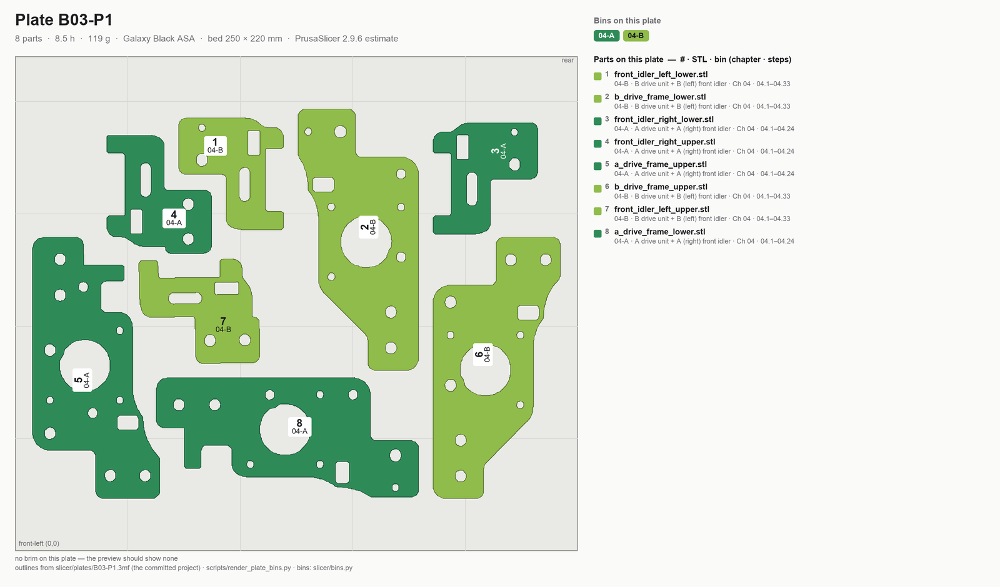

# Batch B03 — A/B drive units + front idlers

**Time:** 8.5 h (1 plate) — PrusaSlicer 2.9.6 estimates.

**Sessions:** 1 plate start (~5 min hands-on, 8.5 h unattended) + ~15 min inspect and bin.

**Prerequisites:** **Gate B passed** (Step B00.7, kit day — these are F695 bearing seats). B02 printed
(accent `[a]_cable_cover`, `[a]_z_chain_retainer_bracket`, `[a]_tensioner_left/right` feed this same assembly
chapter; in the pre-kit order it is already on the shelf).

**Printed parts**

| STL | Repo path | Qty | Colour | g ea | Bin |
|---|---|---:|---|---:|---|
| `a_drive_frame_lower.stl` | Voron-2 `STLs/Gantry/AB_Drive_Units/` | 1 | Black | 22.4 | 04-A |
| `a_drive_frame_upper.stl` | Voron-2 `STLs/Gantry/AB_Drive_Units/` | 1 | Black | 21.8 | 04-A |
| `b_drive_frame_lower.stl` | Voron-2 `STLs/Gantry/AB_Drive_Units/` | 1 | Black | 20.5 | 04-B |
| `b_drive_frame_upper.stl` | Voron-2 `STLs/Gantry/AB_Drive_Units/` | 1 | Black | 21.3 | 04-B |
| `front_idler_left_lower.stl` | Voron-2 `STLs/Gantry/Front_Idlers/` | 1 | Black | 7.7 | 04-B |
| `front_idler_left_upper.stl` | Voron-2 `STLs/Gantry/Front_Idlers/` | 1 | Black | 14.1 | 04-B |
| `front_idler_right_lower.stl` | Voron-2 `STLs/Gantry/Front_Idlers/` | 1 | Black | 13.8 | 04-A |
| `front_idler_right_upper.stl` | Voron-2 `STLs/Gantry/Front_Idlers/` | 1 | Black | 7.9 | 04-A |

**Hardware:** none.

**Read first**

- Checkpoint after B03: **F695-2RS (13 mm OD, flanged)** bearing/spacer stacks drop into the drive-frame and
  front-idler bores without reaming — and the two halves of each drive unit must close flat with no gap.
  (625-2RS is the *Z-drive* bearing, B01 — not this batch.)
- Most commonly reprinted here: `a/b_drive_frame_lower` — the bearing seats are the tightest fit in the machine.
- A and B share one plate (merged 2026-09-06, one swap instead of two), so a failed plate costs both drive
  units. Watch the first layer before you walk away from an 8.5 h print.

## Step B03.1 — Filament prep

**Do:** Galaxy Black. Confirm spool remaining ≥119 g for the plate; the ledger has B03 on spool #2 after B01.
Sheet per [00-slicer-setup § Print sheet](00-slicer-setup.md#print-sheet).
**Check:** Purge clean black.

Source: [print plan §4.3 — spool changes](../../voron-print-plan.md#43-spool-changes) · [00-slicer-setup § Drying](00-slicer-setup.md#drying) · [Prusa KB — ASA](https://help.prusa3d.com/article/asa_1809)

## Step B03.2 — Load plate B03-P1 (both sides)

*Sorting diagram, drawn from the committed project: every part numbered and filled in the colour of its bin, bin id on the part; the legend reads # · STL · bin (chapter · steps). Sort at Step B03.5.*

**Do:** Open `slicer/plates/B03-P1.3mf` with **File → Open Project**. Arrangement, per-object brims and overrides ship in the project; confirm what loaded, don't rebuild it. No rotation, no brim in the project.
**Parts:** 8 objects — 8.5 h, 119 g (PrusaSlicer 2.9.6 estimate); `a_drive_frame_lower`; `a_drive_frame_upper`; `front_idler_right_lower`; `front_idler_right_upper`; `b_drive_frame_lower`; `b_drive_frame_upper`; `front_idler_left_lower`; `front_idler_left_upper`.
**Check:** Parts sit flat as shipped; no brim outline in the preview.

Source: [print plan §3 — the batches](../../voron-print-plan.md#3-the-batches) · [00-slicer-setup § Committed projects](00-slicer-setup.md#committed-projects-open-the-plate-dont-rebuild-it) · [00-slicer-setup § Orientation & brim](00-slicer-setup.md#orientation-brim)

## Step B03.3 — Print plate B03-P1

**Do:** Print with standing overrides.
**Check:** No warp at drive-frame corners.

Pause: ~5 min since the last pause — plate started; nothing to do until it finishes.

Source: [00-slicer-setup § Overrides](00-slicer-setup.md#overrides) · [print plan §4.1 — how these numbers were produced](../../voron-print-plan.md#41-how-these-numbers-were-produced)

## Step B03.4 — Inspect

**Do:** With calipers, check the F695 bearing seat diameter in each drive frame half: 13 mm OD, flanged. Dry-fit the lower and
upper halves of each drive unit together; they must close flat with no gap.
**Check:** No gap when the two halves are clamped together; bearing seats accept an F695-2RS bearing snugly, no rocking.

Pause: ~10 min since the last pause — bearing seats tested and the bearings pulled back out, halves dry-fitted and separated again. Nothing pressed for keeps.

Source: [print plan §5.2 — checkpoint after each batch](../../voron-print-plan.md#52-checkpoint-after-each-batch) · [00-slicer-setup § Gate B](00-slicer-setup.md#gate-b-kit-day-bore-rail-inserts) · [LDO Build Notes / FAQ](https://docs.ldomotors.com/voron/voron2/build-faq)

## Step B03.5 — Sort into bins

**Do:**

1. Sort the plate off its diagram: number matches the legend, fill colour is the bin, bin id is on the part.
2. Label bins from the [bin-labels sheet](../../print/bin-labels.md).
3. A is the right-hand side, B the left.

**B03-P1**

| bin | parts off this plate |
|---|---|
| **04-A** — A drive unit + A (right) front idler | `a_drive_frame_lower`, `a_drive_frame_upper`, `front_idler_right_lower`, `front_idler_right_upper` |
| **04-B** — B drive unit + B (left) front idler | `b_drive_frame_lower`, `b_drive_frame_upper`, `front_idler_left_lower`, `front_idler_left_upper` |

**Check:** 04-A and 04-B each hold one drive-frame pair, one idler pair and one orange tensioner.

Tip: the orange `[a]_tensioner_right` and `[a]_tensioner_left` from B02 are already in these two bins.

Source: [print plan §9 — batch summary](../../voron-print-plan.md#9-machine-readable-batch-summary) · [print plan §2 — which parts gate which step](../../voron-print-plan.md#2-which-parts-gate-the-frame-and-z-drive-steps) · [print/README § Bins](README.md#bins)

---

## Checkpoint B03
- [ ] Gate B passed before B03-P1 started
- [ ] F695-2RS (13 mm OD) bearing seats in `a/b_drive_frame_lower/upper` accept the bearing with no rocking
- [ ] Drive unit halves (upper+lower) close flat with no visible gap, both A and B
- [ ] No corner warp on any of the eight parts
- [ ] A-side parts in 04-A, B-side parts in 04-B

## Common mistakes
- Mixing A-side and B-side parts in one bag — they are not interchangeable.
- Force-closing a warped drive-frame half instead of reprinting it.
- Skipping the dry-fit and only discovering the bearing-seat gap during final assembly.

## Next
Assembly: *A/B Drives and Idlers* (p.62–81). Printing: [B04 — XY joints + X carriage](B04-xy-joints-and-x-carriage.md).
