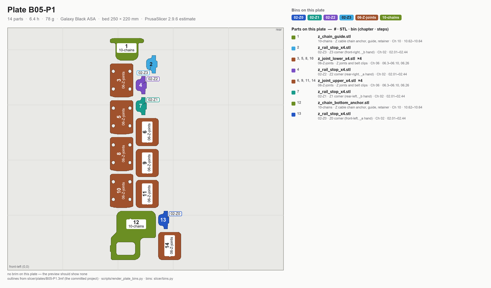

# Batch B05 — Z joints + Z chain

**Time:** 6.4 h (1 plate) — PrusaSlicer 2.9.6 estimate.

**Sessions:** 1 plate start (~5 min hands-on, 6.4 h unattended) + ~10 min inspect and bin.

**Prerequisites:** **Gate B passed** (Step B00.7, kit day — 8 mm shaft bores in the Z joints). B02 and B04 feed
the same assembly chapters; neither is a print prerequisite.

**Printed parts**

| STL | Repo path | Qty | Colour | g ea | Bin |
|---|---|---:|---|---:|---|
| `z_joint_lower_x4.stl` | Voron-2 `STLs/Gantry/Z_Joints/` | 4 | Black | 9.1 | 06-Z-joints |
| `z_joint_upper_x4.stl` | Voron-2 `STLs/Gantry/Z_Joints/` | 4 | Black | 6.6 | 06-Z-joints |
| `z_chain_bottom_anchor.stl` | Voron-2 `STLs/Gantry/` | 1 | Black | 9.1 | 10-chains |
| `z_chain_guide.stl` | Voron-2 `STLs/Gantry/` | 1 | Black | 6.0 | 10-chains |
| `z_rail_stop_x4.stl` | LDOVoron2 `STLs/` | 4 | Black | 1.4 | 06-Z-joints |

Print **4× `z_joint_upper_x4`** and **zero** `z_joint_upper_hall_effect.stl` — that variant exists only for
hall-effect XY endstops, which this kit does not use.

**Hardware:** none.

**Read first**

- Checkpoint after B05: Z joints — the 8 mm shaft should slide, not press. `z_joint_upper` must sit square
  on the extrusion.
- Most commonly reprinted here: `z_joint_lower_x4`.
- The LDO `z_rail_stop` is optional but stops a Z carriage from falling off the top of a rail and spilling its balls.

## Step B05.1 — Filament prep

**Do:** Galaxy Black. Per the ledger this plate starts a fresh spool (#3): spool #2's last ~13 g is not worth a
resume seam on a Z joint — keep it for a clip reprint. Sheet per [00-slicer-setup § Print sheet](00-slicer-setup.md#print-sheet).
**Check:** Clean purge; ≥78 g on the spool.

Source: [print plan §4.3 — spool changes](../../voron-print-plan.md#43-spool-changes) · [00-slicer-setup § Drying](00-slicer-setup.md#drying) · [Prusa KB — ASA](https://help.prusa3d.com/article/asa_1809)

## Step B05.2 — Load plate B05-P1

*Sorting diagram, drawn from the committed project: every part numbered and filled in the colour of its bin, bin id on the part; the legend reads # · STL · bin (chapter · steps). Sort at Step B05.5.*

**Do:** Open `slicer/plates/B05-P1.3mf` (**File → Open Project**). The arrangement, the per-object brims and every override are already in the project — what follows is what it contains, so you can confirm it loaded right rather than rebuild it. On the plate: all fourteen parts: `z_joint_lower_x4` ×4, `z_joint_upper_x4` ×4, `z_chain_bottom_anchor`,
`z_chain_guide`, `z_rail_stop_x4` ×4. No rotation, no brim in the project. Confirm you are **not** including
`z_joint_upper_hall_effect.stl`.
**Parts:** the fourteen pieces above — 6.4 h, 78 g (PrusaSlicer 2.9.6 estimate).
**Check:** File list contains only the D2F-compatible `z_joint_upper_x4`, not the hall-effect variant.

Source: [print plan §3 — the batches](../../voron-print-plan.md#3-the-batches) · [00-slicer-setup § Committed projects](00-slicer-setup.md#committed-projects-open-the-plate-dont-rebuild-it) · [00-slicer-setup § Orientation & brim](00-slicer-setup.md#orientation-brim) · [LDO Build Notes / FAQ](https://docs.ldomotors.com/voron/voron2/build-faq)

## Step B05.3 — Print

**Do:** Print with standing overrides.
**Check:** First layer clean; no warp on the small joint parts.

Source: [00-slicer-setup § Overrides](00-slicer-setup.md#overrides) · [print plan §4.1 — how these numbers were produced](../../voron-print-plan.md#41-how-these-numbers-were-produced)

## Step B05.4 — Inspect

**Do:** With calipers, confirm the 8 mm Z shaft slides (not presses) through each `z_joint_lower`. Check
each `z_joint_upper` sits square against a test extrusion face.
**Check:** Shaft slides freely; joint sits flush and square.

Pause: ~10 min since the last pause — shafts and joints dry-fitted and apart again; nothing pressed.

Source: [print plan §5.2 — checkpoint after each batch](../../voron-print-plan.md#52-checkpoint-after-each-batch) · [00-slicer-setup § Calibration sequence](00-slicer-setup.md#calibration-sequence-run-before-b00-and-again-after-the-gen-2-upgrade)

## Step B05.5 — Sort into bins

**Do:** Sort each plate straight off its diagram (the image at the top of its Load step): the number on a part is the number in the legend, the fill colour is its bin, and the bin id is printed on the part. Bins are listed in [README § Bins](README.md#bins); print their labels from the [bin-labels sheet](../../print/bin-labels.md). **06-Z-joints** already holds B02's eight orange belt clips. The chain anchor and guide go to **10-chains** with B02's retainer bracket — they are fitted in Ch 10, not Ch 06.

**B05-P1**

| bin | parts off this plate |
|---|---|
| **06-Z-joints** — Z joints, belt clips, rail stops | `z_joint_lower` ×4, `z_joint_upper` ×4, `z_rail_stop` ×4 |
| **10-chains** — Z cable chain anchor, guide, retainer | `z_chain_bottom_anchor`, `z_chain_guide` |

**Check:** 4 joint pairs and 4 rail stops in 06-Z-joints; anchor and guide in 10-chains.

Source: [print plan §9 — batch summary](../../voron-print-plan.md#9-machine-readable-batch-summary) · [print plan §2 — which parts gate which step](../../voron-print-plan.md#2-which-parts-gate-the-frame-and-z-drive-steps) · [print/README § Bins](README.md#bins)

---

## Checkpoint B05
- [ ] Gate B passed before B05-P1 started
- [ ] 8 mm Z shaft slides freely through every `z_joint_lower` — no press-fit
- [ ] Every `z_joint_upper` sits square on a test extrusion
- [ ] Confirmed zero copies of `z_joint_upper_hall_effect.stl` were printed
- [ ] `z_rail_stop_x4` fitted or bagged for fitting

## Common mistakes
- Accidentally slicing the hall-effect Z-joint variant instead of the D2F one.
- Treating a tight Z shaft fit as acceptable "because it'll wear in" — it should slide from day one.

## Next
Assembly: *Z Axis* (p.108–123) and *A/B Belts* (p.124–145). Printing: [B06 — Toolhead: Stealthburner, Clockwork 2, Klicky](B06-toolhead-sb-cw2-klicky.md).
