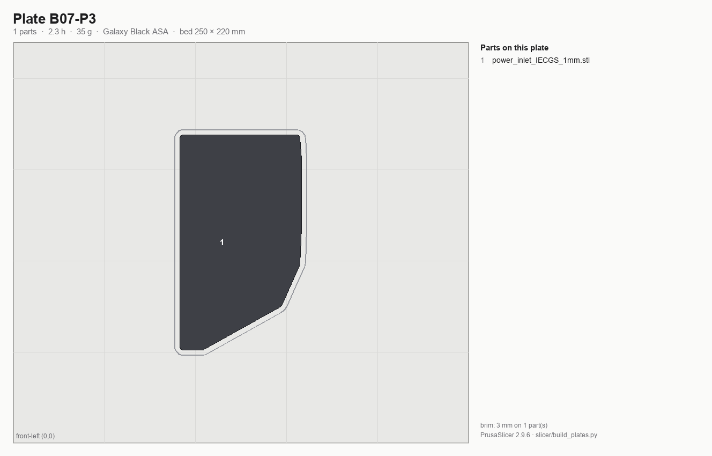

# Batch B07 — Electronics bay + lighting

**Time:** 16.0 h (3 plates) — PrusaSlicer 2.9.6 estimates.

**Prerequisites:** B00. This batch does not depend on B01–B06 (electronics bay is independent of the
mechanical gantry).

⚠ **Gen 2 belt-upgrade pause point:** if the Gen 1→Gen 2 upgrade kit arrives mid-run, finish this batch,
then pause before starting B08. Re-run the calibration-cube gate
(see [00-slicer-setup.md](00-slicer-setup.md#gen-2-belt-upgrade-pause-rule)) before resuming.

**Printed parts**

| STL | Repo path | Qty | Colour | g ea |
|---|---|---:|---|---:|
| `wago_221-415_mount_3by5.stl` | Voron-2 `STLs/Electronics_Bay/` | 1 | Black | 10.6 |
| `lrs_200_psu_bracket_x2.stl` | Voron-2 `STLs/Electronics_Bay/` | 2 | Black | 8.2 |
| `PSU_stabilizer_50mm.stl` | Voron-2 `STLs/Electronics_Bay/` | 1 (verify) | Black | 4.1 |
| `usb_adapter_mount.stl` | Nitehawk-SB `STLs/` | 1 file *(contains base **and** cover; kit supplies the base, so you get a spare; base only — cover body superseded by the V2 partial cover below)* | Black | 9.4 |
| `usb_adapter_mount_partial_cover.stl` | Nitehawk-SB-V2 `STLs/` | 1 (ground-lug mount) | Black | 5.0 (verify; 0.30 h est.) |
| `pcb_din_clip_x3.stl` | Voron-2 `STLs/Electronics_Bay/` | 3 *(one clip per file — `_x3` is the quantity; spares, the kit supplies the 4 needed)* | Black | 5.9 |
| `handlebar_spacer_x4.stl` | LDOVoron2 `STLs/` | 4 | Black | 2.1 |
| `cob_light_strip_mount_100mm.stl` | LDOVoron2 `STLs/COB Light Strip/` | 6 | Black | 18.1 |
| `cob_light_strip_mount_50mm.stl` | LDOVoron2 `STLs/COB Light Strip/` | 2 | Black | 9.3 |
| `power_inlet_IECGS_1mm.stl` | Voron-2 `STLs/Skirts/` | 1 *(moved from B08 — consumed in Ch 09, not the skirts chapter; own plate B07-P3)* | Black | 36.2 |

⚠ **`PSU_stabilizer_50mm` (verify):** LDO Build Notes say "PAGE 169 SKIP — the kit does not use a support
bracket," which most likely refers to this part. It is 4 g — print it, fit only if it's actually needed.

**Do not print:** `raspberrypi_bracket.stl`, `beefy_raspberry_bracket.stl`, `rs25_psu_bracket.stl`
(Leviathan carries the Pi, no 5 V PSU in this kit); the Leviathan bracket set or the bed WAGO mount (both
supplied printed).

**Hardware:** none.

**Read first**

- Checkpoint after B07: Wago mount heat-sets; COB mount halves must close flush on their 2× M3×6 FHCS.
- Most commonly reprinted here: `cob_light_strip_mount_100mm` — warps at the ends, check flatness on glass.
- COB counts are LDO's own for a 2.4-350: 6× 100 mm + 2× 50 mm. Each STL contains a 2-piece assembly joined
  with 2× M3 heat-sets + 2× M3×6 FHCS — the heaviest single group of "small" parts in the build (127 g on P2 alone).
- **Gen 2 upgrade pause point:** if the upgrade kit is on hand, apply it now, before B08's skirts print. See
  [00-slicer-setup.md](00-slicer-setup.md#gen-2-belt-upgrade-pause-rule) for the full re-calibration sequence.

## Step B07.1 — Filament prep

**Do:** Galaxy Black, confirm ≥226 g remaining across the three plates. Per plan §4.3, spool #1 runs out
inside **B06** (during B06-P2) and spool #2 inside **B09**, so this batch normally runs on spool #2. If a runout does land
here, let it happen mid-plate (never on B01-P1's long plate); the Core One+ runout sensor pauses and
resumes cleanly.
**Check:** Clean purge; fresh spool staged if the active spool is close to empty.

Source: [print plan §4.3 — spool changes](../../voron-print-plan.md#43-spool-changes) · [00-slicer-setup § Drying](00-slicer-setup.md#drying) · [Prusa KB — ASA](https://help.prusa3d.com/article/asa_1809)

## Step B07.2 — Load plate B07-P1

**Do:** Open `slicer/plates/B07-P1.3mf` (**File → Open Project**). The arrangement, the per-object brims and every override are already in the project — what follows is what it contains, so you can confirm it loaded right rather than rebuild it. On the plate: `wago_221-415_mount_3by5`, `lrs_200_psu_bracket_x2` ×2, `PSU_stabilizer_50mm`,
`usb_adapter_mount`, `usb_adapter_mount_partial_cover` (ground-lug mount, est.), `pcb_din_clip_x3`,
`handlebar_spacer_x4` ×4.
**Parts:** the seven files above — 5.6 h, 67 g (PrusaSlicer 2.9.6 estimate).
**Check:** No face re-orientation; all sit flat as shipped.

Source: [print plan §3 — the batches](../../voron-print-plan.md#3-the-batches) · [00-slicer-setup § Committed projects](00-slicer-setup.md#committed-projects-open-the-plate-dont-rebuild-it) · [00-slicer-setup § Orientation & brim](00-slicer-setup.md#orientation-brim) · [LDO Build Notes / FAQ](https://docs.ldomotors.com/voron/voron2/build-faq)

## Step B07.3 — Print plate B07-P1

**Do:** Print with standing overrides.
**Check:** Clean first layer.

Source: [00-slicer-setup § Overrides](00-slicer-setup.md#overrides) · [print plan §4.1 — how these numbers were produced](../../voron-print-plan.md#41-how-these-numbers-were-produced)

## Step B07.4 — Load plate B07-P2

**Do:** Open `slicer/plates/B07-P2.3mf` (**File → Open Project**). The arrangement, the per-object brims and every override are already in the project — what follows is what it contains, so you can confirm it loaded right rather than rebuild it. On the plate: `cob_light_strip_mount_100mm` ×6 and `cob_light_strip_mount_50mm` ×2 — eight mounts total,
each a 2-piece assembly. **Brim the 100 mm mounts** (they're on the long-flat brim list in
[00-slicer-setup.md](00-slicer-setup.md#orientation-brim)). The power inlet does **not** go on this plate:
with the mandated 3 mm brims the eight mounts plus the 118 × 66.8 mm inlet fill 84 % of the 250 × 220 bed
and cannot be placed, so the inlet has its own plate B07-P3.
**Parts:** the eight COB mounts — 8.2 h, 124 g (PrusaSlicer 2.9.6 estimate).
**Check:** 3 mm brim applied to the 100 mm mounts; eight mounts on the plate and nothing else.

Source: [print plan §3 — the batches](../../voron-print-plan.md#3-the-batches) · [00-slicer-setup § Committed projects](00-slicer-setup.md#committed-projects-open-the-plate-dont-rebuild-it) · [00-slicer-setup § Orientation & brim](00-slicer-setup.md#orientation-brim) · [LDO COB light-strip README](https://github.com/MotorDynamicsLab/LDOVoron2/tree/main/STLs/COB%20Light%20Strip) · [Prusa KB — Warping](https://help.prusa3d.com/article/warping_2011)

## Step B07.5 — Print plate B07-P2

**Do:** Print with standing overrides.
**Check:** Watch for end-lift on the 100 mm mounts partway through — this is the batch's known warp risk.

Source: [00-slicer-setup § Overrides](00-slicer-setup.md#overrides) · [print plan §4.1 — how these numbers were produced](../../voron-print-plan.md#41-how-these-numbers-were-produced)

## Step B07.6 — Load and print plate B07-P3

**Do:** Open `slicer/plates/B07-P3.3mf` (**File → Open Project**). The arrangement, the per-object brims and every override are already in the project — what follows is what it contains, so you can confirm it loaded right rather than rebuild it. On the plate: `power_inlet_IECGS_1mm` ×1 alone. **3 mm brim** — it is 118 × 66.8 mm of flat ASA and lifts at
the corners. Print with standing overrides.
**Parts:** `power_inlet_IECGS_1mm` — 2.3 h, 35 g (PrusaSlicer 2.9.6 estimate).
**Check:** 3 mm brim applied; first layer clean across the full 118 mm; no corner lift.

Source: [print plan §3 — the batches](../../voron-print-plan.md#3-the-batches) · [00-slicer-setup § Committed projects](00-slicer-setup.md#committed-projects-open-the-plate-dont-rebuild-it) · [00-slicer-setup § Orientation & brim](00-slicer-setup.md#orientation-brim) · [Prusa KB — Warping](https://help.prusa3d.com/article/warping_2011)

## Step B07.7 — Inspect

**Do:** Lay each COB mount pair on a flat reference (granite counter); check the two halves close flush
with 2× M3×6 FHCS test-fit. Check the Wago mount's heat-set bosses.
**Check:** No rocking on the flat reference; halves close flush; heat-set bosses flush and not bulged.

Source: [print plan §5.2 — checkpoint after each batch](../../voron-print-plan.md#52-checkpoint-after-each-batch) · [00-slicer-setup § Calibration sequence](00-slicer-setup.md#calibration-sequence-run-before-b00-and-again-after-the-gen-2-upgrade) · [LDO COB light-strip README](https://github.com/MotorDynamicsLab/LDOVoron2/tree/main/STLs/COB%20Light%20Strip)

## Step B07.8 — Label and bin

**Do:** Bin for **Electronics**, **Controller**, **Wiring** chapters. Keep the spare `usb_adapter_mount`
cover and `pcb_din_clip` spares clearly marked as spares. The power inlet panel off B07-P3 goes to the
**Electronics** bin — it is consumed in Ch 09, not in the skirts chapter.
**Check:** All electronics-bay parts grouped; COB mounts counted (6× 100 mm + 2× 50 mm);
`power_inlet_IECGS_1mm` present.

Source: [print plan §9 — batch summary](../../voron-print-plan.md#9-machine-readable-batch-summary) · [print plan §2 — which parts gate which step](../../voron-print-plan.md#2-which-parts-gate-the-frame-and-z-drive-steps)

---

## Checkpoint B07
- [ ] COB mount halves close flush on 2× M3×6 FHCS, all eight assemblies
- [ ] COB mounts checked flat on granite reference — no rocking
- [ ] Wago mount heat-set bosses flush, no bulge
- [ ] `PSU_stabilizer_50mm` fit decision made (verify against actual PSU)
- [ ] `power_inlet_IECGS_1mm` off B07-P3 flat, brim snapped off cleanly, binned for Ch 09
- [ ] **If Gen 2 upgrade kit is in hand: applied now, before starting B08** — firmware ≥6.9.0, re-tensioned,
      re-squared, cube gate re-passed

## Common mistakes
- Printing `raspberrypi_bracket` or `rs25_psu_bracket` out of habit from other Voron builds — this kit needs neither.
- Skipping the flat-reference check on COB mounts and only discovering warp at final assembly.
- Missing the Gen 2 pause window and printing B08's skirts on GT2 belts when the upgrade kit was already on hand.

## Next
Assembly: *Electronics* (p.148–173), *Controller* (p.174–179), *Wiring* (p.180–211). Printing: **pause for
the Gen 2 belt upgrade if the kit has arrived** (re-run the calibration cube gate), then [B08 — Skirts and front modules](B08-skirts-and-front-modules.md).
