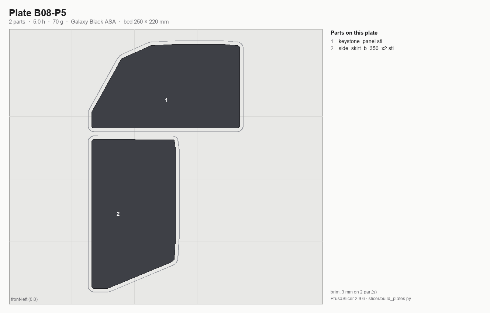
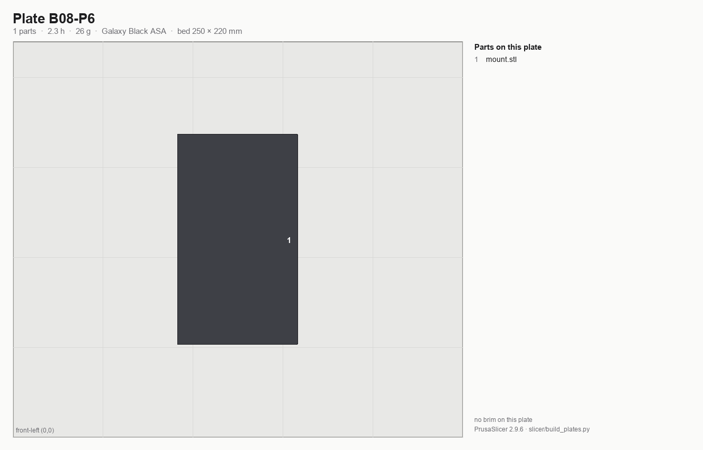

# Batch B08 — Skirts and front modules

**These are the parts people see.** Print them after the Gen 2 belt upgrade if it's in hand (see
[00-slicer-setup.md](00-slicer-setup.md#gen-2-belt-upgrade-pause-rule)) — 6 of the 27 plates in this batch
are large flat vertical faces, exactly where GT1.5's reduced VFA shows.

**Time:** 29.1 h (6 plates) — PrusaSlicer 2.9.6 estimates.

**Prerequisites:** B00, B02 (accent belt guards, fan grills, faceplate feed the same visible assembly), B07,
and **the Gen 2 belt-upgrade pause point** if the kit is on hand — re-run the calibration-cube gate first.

The skirt ring is made of ten structural segments plus two "module" pieces — the TFT mount and the power
inlet — sharing a 67–72 × 20 mm cross-section. On the 350: front = `front_skirt_a` + TFT mount + `front_skirt_b`; rear = `rear_center_skirt`
+ `power_inlet` + `keystone_panel`; each side = `side_skirt_a` + `side_fan_support` + `side_skirt_b`.

**Printed parts**

| STL | Repo path | Qty | Colour | g ea |
|---|---|---:|---|---:|
| `rear_center_skirt_350.stl` | Voron-2 `STLs/Skirts/350/` | 1 | Black | 71.9 |
| `front_skirt_a_350.stl` | Voron-2 `STLs/Skirts/350/` | 1 | Black | 41.4 |
| `front_skirt_b_350.stl` | Voron-2 `STLs/Skirts/350/` | 1 | Black | 41.4 |
| `side_skirt_a_350_x2.stl` | Voron-2 `STLs/Skirts/350/` | 2 | Black | 36.9 |
| `side_skirt_b_350_x2.stl` | Voron-2 `STLs/Skirts/350/` | 2 | Black | 36.9 |
| `side_fan_support_x2.STL` | Voron-2 `STLs/Skirts/` | 2 | Black | 33.0 |
| `keystone_panel.stl` | Voron-2 `STLs/Skirts/` | 1 | Black | 38.6 |
| `mount.stl` (BTT Pi TFT4.3) | LDOVoronTrident `STLs/BTT Pi TFT4.3 Mount/` | 1 | Black | 30.1 |

`power_inlet_IECGS_1mm` moved to [B07](B07-electronics-bay-and-lighting.md) — it's consumed in Ch 09, not the skirts chapter.

⚠ **`mount.stl` vs `mount_thick.stl`:** `mount.stl` is 30 g / 44.8 mm tall; `mount_thick.stl` is 74 g /
67.8 mm and gives access to the screen's brightness buttons with a pointy tool. `mount.stl` is the
recommendation — swap if you find you want the buttons **(judgment; LDO links the folder, not a specific file)**.

**Do not print:** `mini12864_case_front/rear`, `[a]_mini12864_case_hinge`, `[a]_mini12864_case_front_insert`,
`[a]_btt_knob_light_shield` — the touchscreen mount replaces that whole front module.

**Hardware:** none.

**Read first**

- Checkpoint after B08: lay every skirt segment on a flat reference (granite counter) and check for
  rocking. A bowed skirt is the most visible defect on a finished Voron. Dry-fit the ring: front + TFT
  mount + front, rear + inlet + keystone, sides + fan supports.
- Most commonly reprinted here: `rear_center_skirt_350` (182 mm — the worst warp candidate in the set).
- Only two of these long parts fit per plate — every one is 118–182 mm on its long axis and 67–72 mm deep, so
  a 250×220 bed takes two per plate with a workable gap.
- **3 mm brim** required on: `rear_center_skirt_350`, `front_skirt_a/b_350`, `side_skirt_a/b_350`,
  `side_fan_support`, `keystone_panel` (per [00-slicer-setup.md](00-slicer-setup.md#orientation-brim)).
- Optional, not printed here: `[a]_fan_grill_open_optional_x2` (more airflow, less filtering) instead of
  `[a]_fan_grill_a/b`; extra `ldo_bestagon_insert`s.

## Step B08.1 — Filament prep

**Do:** Galaxy Black. Spool #2 is expected to run out inside this batch or B09 (per plan §4.3) — stage a
fresh spool.
**Check:** Confirm spool weight before starting the 6.3 h P1 plate.

Source: [print plan §4.3 — spool changes](../../voron-print-plan.md#43-spool-changes) · [00-slicer-setup § Drying](00-slicer-setup.md#drying) · [Prusa KB — ASA](https://help.prusa3d.com/article/asa_1809)

## Step B08.2 — Load plate B08-P1

**Do:** Open `slicer/plates/B08-P1.3mf` (**File → Open Project**). The arrangement, the per-object brims and every override are already in the project — what follows is what it contains, so you can confirm it loaded right rather than rebuild it. On the plate: `rear_center_skirt_350`, `side_fan_support` ×1, 3 mm brim on both, with
**`rear_center_skirt_350` turned 90° about Z** so its 182 mm axis runs along X — side by side in the shipped
orientations the pair needs 254 mm of X and will not fit the 250 × 220 bed. Turning about Z does not change
which face is on the bed, so it is allowed (see [00-slicer-setup.md](00-slicer-setup.md#orientation-brim)).
**Parts:** the two items above — 6.3 h, 99 g (PrusaSlicer 2.9.6 estimate).
**Check:** Both parts flat on their shipped faces, brim showing on both in the preview, and the plate
matches the image above.

Source: [print plan §3 — the batches](../../voron-print-plan.md#3-the-batches) · [00-slicer-setup § Committed projects](00-slicer-setup.md#committed-projects-open-the-plate-dont-rebuild-it) · [00-slicer-setup § Orientation & brim](00-slicer-setup.md#orientation-brim) · [print plan §5.1 — orientation and brim](../../voron-print-plan.md#51-orientation-and-brim)

## Step B08.3 — Print plate B08-P1

**Do:** Print with standing overrides.
**Check:** Watch the ends of `rear_center_skirt_350` for the first hour — 182 mm is the worst warp candidate in the set.

Source: [00-slicer-setup § Overrides](00-slicer-setup.md#overrides) · [print plan §4.1 — how these numbers were produced](../../voron-print-plan.md#41-how-these-numbers-were-produced)

## Step B08.4 — Load plate B08-P2

**Do:** Open `slicer/plates/B08-P2.3mf` (**File → Open Project**). The arrangement, the per-object brims and every override are already in the project — what follows is what it contains, so you can confirm it loaded right rather than rebuild it. On the plate: `side_fan_support` ×1, `front_skirt_a_350`. 3 mm brim on both.
**Parts:** the two items above — 5.0 h, 67 g (PrusaSlicer 2.9.6 estimate).
**Check:** Brim applied.

Source: [print plan §3 — the batches](../../voron-print-plan.md#3-the-batches) · [00-slicer-setup § Committed projects](00-slicer-setup.md#committed-projects-open-the-plate-dont-rebuild-it) · [00-slicer-setup § Orientation & brim](00-slicer-setup.md#orientation-brim)

## Step B08.5 — Print plate B08-P2

**Do:** Print with standing overrides.
**Check:** Front skirt's first layer clean across the full 150 mm; no corner lift.

Source: [00-slicer-setup § Overrides](00-slicer-setup.md#overrides) · [print plan §4.1 — how these numbers were produced](../../voron-print-plan.md#41-how-these-numbers-were-produced)

## Step B08.6 — Load plate B08-P3

**Do:** Open `slicer/plates/B08-P3.3mf` (**File → Open Project**). The arrangement, the per-object brims and every override are already in the project — what follows is what it contains, so you can confirm it loaded right rather than rebuild it. On the plate: `front_skirt_b_350`, `side_skirt_a_350` ×1. 3 mm brim on both.
**Parts:** the two items above — 5.5 h, 71 g (PrusaSlicer 2.9.6 estimate).
**Check:** Brim applied.

Source: [print plan §3 — the batches](../../voron-print-plan.md#3-the-batches) · [00-slicer-setup § Committed projects](00-slicer-setup.md#committed-projects-open-the-plate-dont-rebuild-it) · [00-slicer-setup § Orientation & brim](00-slicer-setup.md#orientation-brim)

## Step B08.7 — Print plate B08-P3

**Do:** Print with standing overrides.
**Check:** No corner lift.

Source: [00-slicer-setup § Overrides](00-slicer-setup.md#overrides) · [print plan §4.1 — how these numbers were produced](../../voron-print-plan.md#41-how-these-numbers-were-produced)

## Step B08.8 — Load plate B08-P4

**Do:** Open `slicer/plates/B08-P4.3mf` (**File → Open Project**). The arrangement, the per-object brims and every override are already in the project — what follows is what it contains, so you can confirm it loaded right rather than rebuild it. On the plate: `side_skirt_a_350` ×1, `side_skirt_b_350` ×1. 3 mm brim on both.
**Parts:** the two items above — 5.1 h, 66 g (PrusaSlicer 2.9.6 estimate).
**Check:** Brim applied.

Source: [print plan §3 — the batches](../../voron-print-plan.md#3-the-batches) · [00-slicer-setup § Committed projects](00-slicer-setup.md#committed-projects-open-the-plate-dont-rebuild-it) · [00-slicer-setup § Orientation & brim](00-slicer-setup.md#orientation-brim)

## Step B08.9 — Print plate B08-P4

**Do:** Print with standing overrides.
**Check:** No corner lift.

Source: [00-slicer-setup § Overrides](00-slicer-setup.md#overrides) · [print plan §4.1 — how these numbers were produced](../../voron-print-plan.md#41-how-these-numbers-were-produced)

## Step B08.10 — Load plate B08-P5

**Do:** Open `slicer/plates/B08-P5.3mf` (**File → Open Project**). The arrangement, the per-object brims and every override are already in the project — what follows is what it contains, so you can confirm it loaded right rather than rebuild it. On the plate: `side_skirt_b_350` ×1, `keystone_panel`. 3 mm brim on both.
**Parts:** the two items above — 5.0 h, 70 g (PrusaSlicer 2.9.6 estimate).
**Check:** Brim applied.

Source: [print plan §3 — the batches](../../voron-print-plan.md#3-the-batches) · [00-slicer-setup § Committed projects](00-slicer-setup.md#committed-projects-open-the-plate-dont-rebuild-it) · [00-slicer-setup § Orientation & brim](00-slicer-setup.md#orientation-brim)

## Step B08.11 — Print plate B08-P5

**Do:** Print with standing overrides.
**Check:** Keystone panel's two cutout slots print crisp and undistorted.

Source: [00-slicer-setup § Overrides](00-slicer-setup.md#overrides) · [print plan §4.1 — how these numbers were produced](../../voron-print-plan.md#41-how-these-numbers-were-produced)

## Step B08.12 — Load plate B08-P6

**Do:** Open `slicer/plates/B08-P6.3mf` (**File → Open Project**). The arrangement, the per-object brims and every override are already in the project — what follows is what it contains, so you can confirm it loaded right rather than rebuild it. On the plate: `mount.stl` (no brim — under the tall/narrow list but fine per the orientation table).
`power_inlet_IECGS_1mm` moved to B07 (Ch 09, not the skirts chapter) — see B07.4.
**Parts:** `mount.stl` — 2.3 h, 26 g (PrusaSlicer 2.9.6 estimate).
**Check:** Confirm `mount.stl`, not `mount_thick.stl`, unless the button-access swap was chosen.

Source: [print plan §3 — the batches](../../voron-print-plan.md#3-the-batches) · [00-slicer-setup § Committed projects](00-slicer-setup.md#committed-projects-open-the-plate-dont-rebuild-it) · [00-slicer-setup § Orientation & brim](00-slicer-setup.md#orientation-brim) · [LDO Rev D printed-parts guide](https://docs.ldomotors.com/en/voron/voron2/printed_part_guide_rev_d)

## Step B08.13 — Print plate B08-P6

**Do:** Print with standing overrides.
**Check:** Clean first layer, no warp on the tall/narrow mount.

Source: [00-slicer-setup § Overrides](00-slicer-setup.md#overrides) · [print plan §4.1 — how these numbers were produced](../../voron-print-plan.md#41-how-these-numbers-were-produced)

## Step B08.14 — Inspect

**Do:** Lay every skirt segment from all six plates on the flat granite reference; check each for rocking.
Dry-fit the full ring: front `front_skirt_a` + TFT `mount` + `front_skirt_b`; rear `rear_center_skirt` +
`power_inlet` (from B07) + `keystone_panel`; each side `side_skirt_a` + `side_fan_support` + `side_skirt_b`.
**Check:** No rocking on any segment. Ring dry-fits with consistent gaps at every joint.

Source: [print plan §5.2 — checkpoint after each batch](../../voron-print-plan.md#52-checkpoint-after-each-batch) · [00-slicer-setup § Calibration sequence](00-slicer-setup.md#calibration-sequence-run-before-b00-and-again-after-the-gen-2-upgrade) · [Prusa KB — Warping](https://help.prusa3d.com/article/warping_2011)

## Step B08.15 — Label and bin

**Do:** Bin by consuming assembly chapter — everything here plus B02's accent belt guards, fan grills/retainers,
keystone insert(s), faceplate, and bestagon insert go to **Skirts**. `power_inlet_IECGS_1mm` (printed in B07)
also belongs in this ring — bin it here for the dry-fit. Keep front/rear/side groupings labelled so the ring
assembles in the right order.
**Check:** All ten structural segments plus TFT mount labelled by ring position; power inlet (from B07) on hand.

Source: [print plan §9 — batch summary](../../voron-print-plan.md#9-machine-readable-batch-summary) · [print plan §2 — which parts gate which step](../../voron-print-plan.md#2-which-parts-gate-the-frame-and-z-drive-steps)

---

## Checkpoint B08
- [ ] All ten skirt segments plus TFT mount pass the flat-reference rocking test
- [ ] Full ring dry-fits: front, rear, and both sides, with consistent joint gaps (power inlet from B07)
- [ ] `mount.stl` vs `mount_thick.stl` choice confirmed and matches what was printed
- [ ] 3 mm brims removed cleanly from all long-flat parts

## Common mistakes
- Skipping the flat-reference check and only noticing a bowed skirt after the panels are mounted.
- Slicing `mount_thick.stl` by accident when the plan calls for `mount.stl`.

## Next
Assembly: *Skirts* (p.212–239). Printing: [B09 — Panels, filtration, spool](B09-panels-filtration-spool.md).
