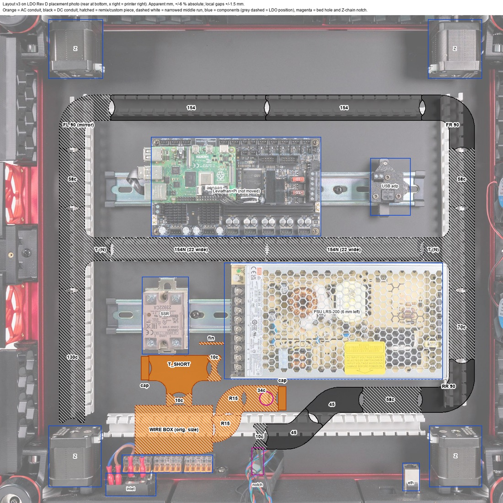
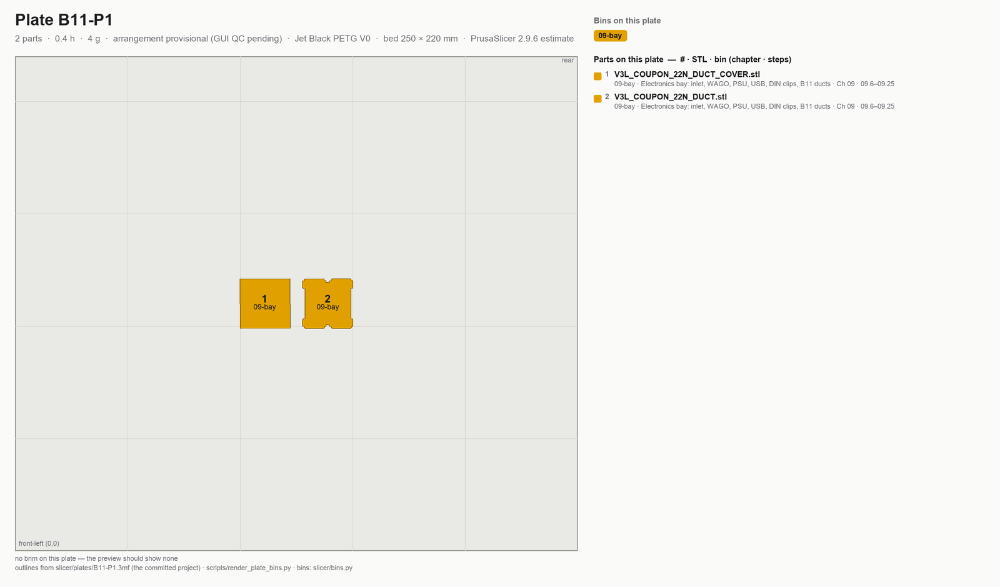
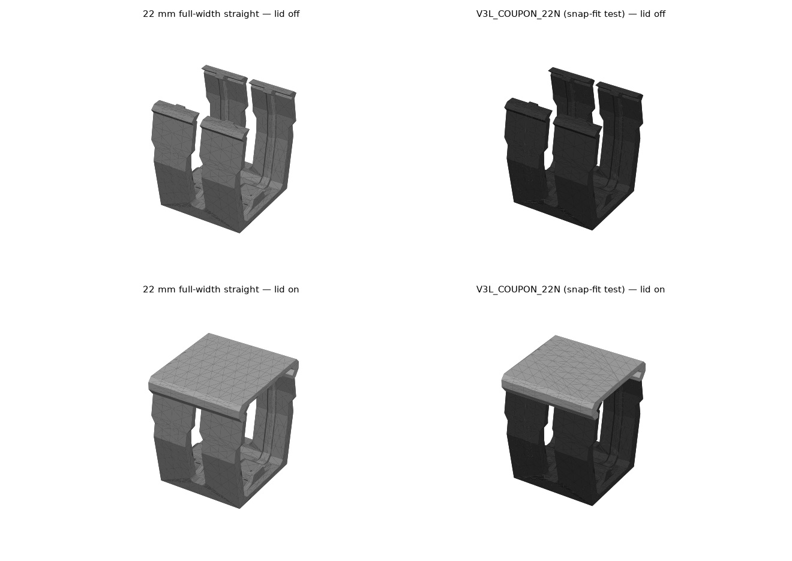
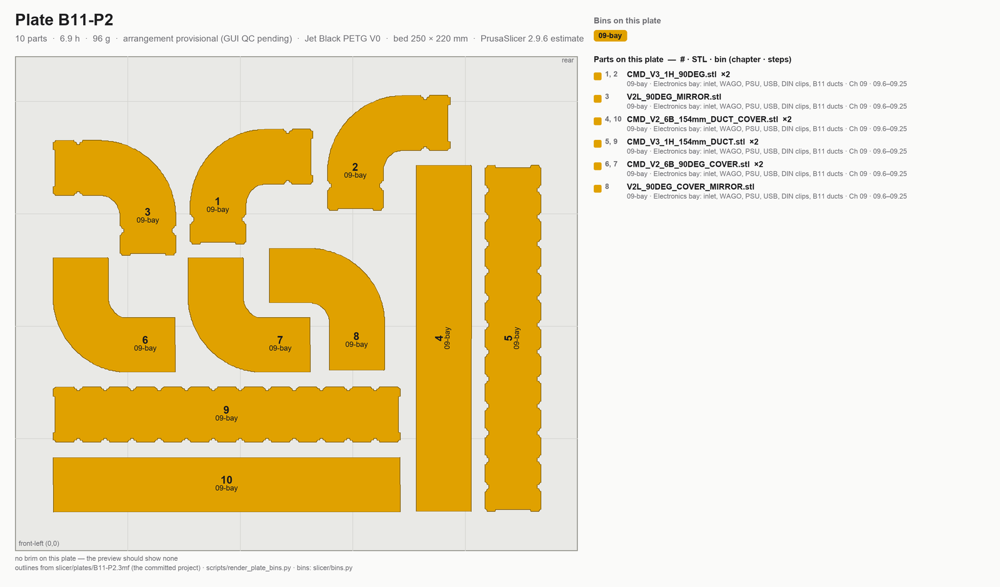
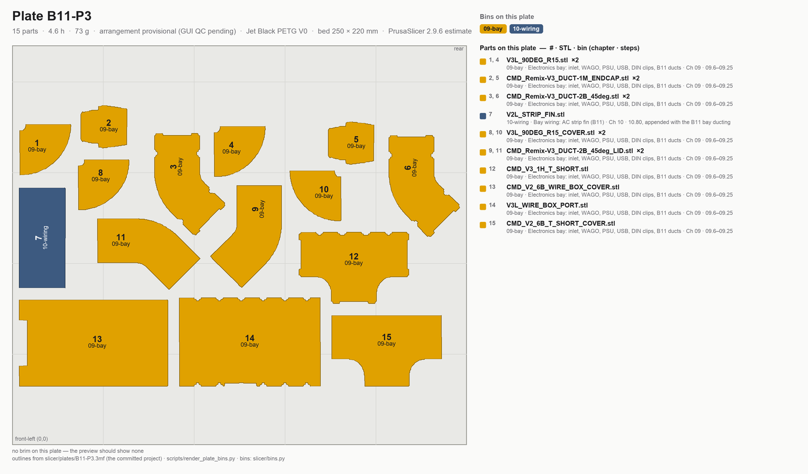
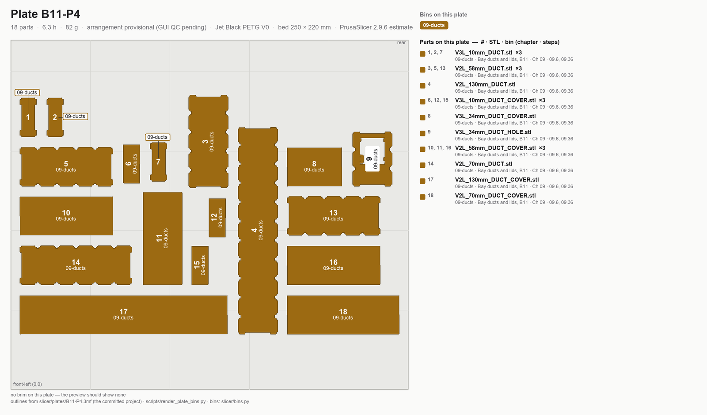
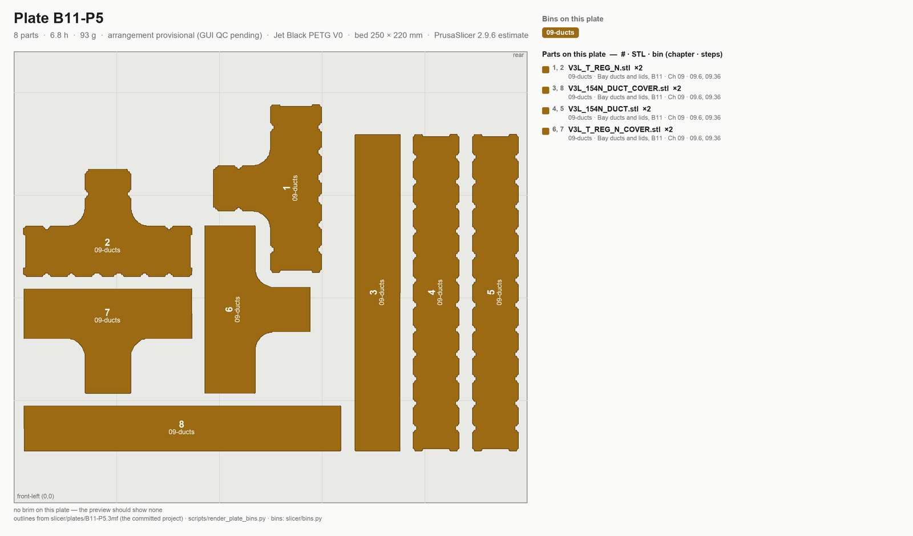

# Batch B11 — Bay ducting (PETG V0)

```mascot
pose: print
caption: Ducts carry wires, not load. Same printer, different spool, gentler rules.
```

**Time:** 25.0 h (5 plates) — PrusaSlicer 2.9.6 estimates: 11.9 h before kit (B11-P1 to P3, 173 g), 13.1 h after the kit-day measurements (B11-P4 and B11-P5, 175 g). 348 g of Jet Black PETG V0 in all. **Not part of the 157.0 h ASA run**, and none of its numbers are in the run's totals.

**Sessions:** 5 plate starts (~5 min hands-on each, all day plates), ~10 min for the coupon test, ~15 min to inspect and bin; on kit day ~45 min of measuring before P4 and P5.

**Prerequisites:** nothing from the ASA run. No part here holds a bearing or takes a press fit, so neither Gate A nor Gate B applies. Needs one 1 kg spool of **Prusament PETG V0 Jet Black** (not yet bought) and the **textured** sheet. P4 and P5 also need the kit: they wait for the kit-day go/no-go and bay measurements, Steps B11.9 to B11.11.

**What this batch builds.** Layout v3 replaces LDO's five PVC wire ducts in the electronics bay with two printed conduits, made from MyStoopidStuff's remix of RyanDam's Cable Management Duct. The **DC conduit** is one loop: curved 90° corners, two T-junctions, a 45° S-jog up to the Z-chain notch, and a middle run narrowed to 22 mm so it fits between the Leviathan and the PSU. The **AC conduit** is MSS's wire box at its original size by the WAGO bus, two re-radiused 90° curves down to a 34 mm run over the bed-lead hole, a T behind the SSR, and a divider fin at the PSU terminals. The closest AC-to-DC approach is 12.0 mm on the layout `(verify on bench)`. Fitting them is Ch 09's and Ch 10's job; this page only prints them. Design record: `review/2026-09-23-bay-mods/layout-v3/layout-v3.md`.

**Printed parts**

Every part is Jet Black PETG V0 ("Black" below). *g ea* is each piece sliced alone with `slicer/bay-ducts-petg.ini`, purge line included, so the column does not sum to a plate line. Repo paths are under `slicer/stl/bayducts/`: `mss/502306/` is MSS's stock file from Printables 502306, fetched by `slicer/fetch_stls.py`; `remix/` is remixed for the LDO Rev D+ bay in this repo. All GPL-3.0; credit and licence in `slicer/stl/bayducts/README.md`.


| STL | Repo path | Qty | Colour | g ea | Bin |
|---|---|---:|---|---:|---|
| `V3L_COUPON_22N_DUCT.stl` | bayducts `remix/` · before kit | 1 | Black | 3.0 | 09-bay |
| `V3L_COUPON_22N_DUCT_COVER.stl` | bayducts `remix/` · before kit | 1 | Black | 1.1 | 09-bay |
| `CMD_V3_1H_154mm_DUCT.stl` | bayducts `mss/502306/` · before kit | 2 | Black | 21.0 | 09-bay |
| `CMD_V2_6B_154mm_DUCT_COVER.stl` | bayducts `mss/502306/` · before kit | 2 | Black | 8.1 | 09-bay |
| `CMD_V3_1H_90DEG.stl` | bayducts `mss/502306/` · before kit | 2 | Black | 9.2 | 09-bay |
| `CMD_V2_6B_90DEG_COVER.stl` | bayducts `mss/502306/` · before kit | 2 | Black | 3.7 | 09-bay |
| `V2L_90DEG_MIRROR.stl` | bayducts `remix/` · before kit | 1 | Black | 9.2 | 09-bay |
| `V2L_90DEG_COVER_MIRROR.stl` | bayducts `remix/` · before kit | 1 | Black | 3.7 | 09-bay |
| `CMD_Remix-V3_DUCT-2B_45deg.stl` | bayducts `mss/502306/` · before kit | 2 | Black | 7.3 | 09-bay |
| `CMD_Remix-V3_DUCT-2B_45deg_LID.stl` | bayducts `mss/502306/` · before kit | 2 | Black | 2.8 | 09-bay |
| `V3L_WIRE_BOX_PORT.stl` | bayducts `remix/` · before kit | 1 | Black | 17.7 | 09-bay |
| `CMD_V2_6B_WIRE_BOX_COVER.stl` | bayducts `mss/502306/` · before kit | 1 | Black | 7.4 | 09-bay |
| `V3L_90DEG_R15.stl` | bayducts `remix/` · before kit | 2 | Black | 2.8 | 09-bay |
| `V3L_90DEG_R15_COVER.stl` | bayducts `remix/` · before kit | 2 | Black | 1.3 | 09-bay |
| `CMD_V3_1H_T_SHORT.stl` | bayducts `mss/502306/` · before kit | 1 | Black | 9.0 | 09-bay |
| `CMD_V2_6B_T_SHORT_COVER.stl` | bayducts `mss/502306/` · before kit | 1 | Black | 3.7 | 09-bay |
| `CMD_Remix-V3_DUCT-1M_ENDCAP.stl` | bayducts `mss/502306/` · before kit | 2 | Black | 1.4 | 09-bay |
| `V2L_STRIP_FIN.stl` | bayducts `remix/` · before kit | 1 | Black | 5.0 | 10-wiring |
| `V2L_58mm_DUCT.stl` | bayducts `remix/` · after kit | 3 | Black | 7.9 | 09-bay |
| `V2L_58mm_DUCT_COVER.stl` | bayducts `remix/` · after kit | 3 | Black | 3.1 | 09-bay |
| `V2L_130mm_DUCT.stl` | bayducts `remix/` · after kit | 1 | Black | 17.8 | 09-bay |
| `V2L_130mm_DUCT_COVER.stl` | bayducts `remix/` · after kit | 1 | Black | 6.9 | 09-bay |
| `V2L_70mm_DUCT.stl` | bayducts `remix/` · after kit | 1 | Black | 9.6 | 09-bay |
| `V2L_70mm_DUCT_COVER.stl` | bayducts `remix/` · after kit | 1 | Black | 3.7 | 09-bay |
| `V3L_10mm_DUCT.stl` | bayducts `remix/` · after kit | 3 | Black | 1.5 | 09-bay |
| `V3L_10mm_DUCT_COVER.stl` | bayducts `remix/` · after kit | 3 | Black | 0.6 | 09-bay |
| `V3L_34mm_DUCT_HOLE.stl` | bayducts `remix/` · after kit | 1 | Black | 4.1 | 09-bay |
| `V3L_34mm_DUCT_COVER.stl` | bayducts `remix/` · after kit | 1 | Black | 1.8 | 09-bay |
| `V3L_154N_DUCT.stl` | bayducts `remix/` · after kit, if gap ≥ 25 mm | 2 | Black | 20.3 | 09-bay |
| `V3L_154N_DUCT_COVER.stl` | bayducts `remix/` · after kit, if gap ≥ 25 mm | 2 | Black | 7.5 | 09-bay |
| `V3L_T_REG_N.stl` | bayducts `remix/` · after kit, if gap ≥ 25 mm | 2 | Black | 13.5 | 09-bay |
| `V3L_T_REG_N_COVER.stl` | bayducts `remix/` · after kit, if gap ≥ 25 mm | 2 | Black | 5.4 | 09-bay |



*Layout v3 drawn on LDO's Rev D placement photo, front of the printer at the top. Apparent millimetres, ±6 % absolute and ±1.5 mm on local gaps: every position is `(verify on bench)`. Photo: LDO Motors; drawing: this repo.*

Which piece goes where: the two stock 154s are the front run; the three corners are front-left (the mirrored one), front-right and rear-right; the 45° pair is the S-jog; the 58s are L1, R1 and rear-lower, the 130 is L2, the 70 is R2; the three 10 mm pieces are the DC rear-upper run, the SSR run's right end and the stub up into the wire box's port. Positions and clearances: `review/2026-09-23-bay-mods/layout-v3/layout-v3.md`.

**Options, not plated:**

- **Orange endcaps.** The two `CMD_Remix-V3_DUCT-1M_ENDCAP` can be printed in the spare Prusament ASA Prusa Orange instead, as a visual mark on the AC conduit's ends. Load the STL on its own with `slicer/voron-coreone-asa.ini` and the smooth sheet. No plate, no ledger line; the black pair on B11-P3 is the default.
- **WARNING lid.** MSS's lettered `CMD_Remix-V3_DUCT-1V_WIRE_BOX_LID_WARNING` + inlay (Printables 505838) is a two-colour body and waits for the INDX. B11 prints the plain `CMD_V2_6B_WIRE_BOX_COVER`.
- **Fallback middle run.** If the Leviathan-to-PSU gap measures under 25 mm, skip B11-P5 and print stock `CMD_V3_1H_T_REG` + cover in place of each `V3L_T_REG_N`, plus one `CMD_V3_1H_82mm_DUCT` + cover, and keep LDO's PVC middle duct. Those four files are vendored in `mss/502306/` but on no plate.

**Hardware:** none to print. Mounting hardware and tape belong to Ch 09.

**Read first**

- **Not Voron spec.** The ducts carry no load, so B11 has its own bundle, `slicer/bay-ducts-petg.ini`: system filament `Prusament PETG V0 @COREONE HF0.4`, 0.20 mm layers, 3 perimeters, 4 top and 4 bottom, 20 % **grid** infill, no supports. Printer settings and the cold start G-code are the ASA run's. Grid, not gyroid: gyroid infill curls with PETG on this printer. Every key: `slicer/OVERRIDES.md` § Bay-duct bundle.
- **Textured sheet.** Prusa does not recommend PETG V0 on smooth PEI: it bonds hard enough to damage the sheet, and that damage is not covered by warranty. Swap back to the smooth sheet before the next ASA plate.
- **AFS flaps.** The bundle's filament start G-code sends `M106 P3 S160` and its end G-code `M106 P3 R`, so the bypass flaps lift for PETG with Chamber Filtration left on Adv. Filtration. Print from Connect or USB, not OctoPrint: the fixed P3 target makes `M141` log an error OctoPrint would halt on.
- **Arrangement provisional, GUI QC pending.** All five plates were packed by `slicer/nest.py` at a 6 mm gap and sliced from the CLI; none has been opened, arranged and re-saved in PrusaSlicer yet. Before each first print: **Arrange Current Bed** (6 mm, rotations on), save over `slicer/plates/B11-Pn.3mf`, then `python3 slicer/build_plates.py --from-3mf B11-Pn` and `python3 slicer/check_docs.py`.
- **Two groups.** P1 to P3 need nothing measured and can print whenever the printer is free. P4 holds the custom lengths and P5 the narrowed middle run; both wait for the kit-day measurements, and P5 also waits for the coupon test.
- Every part is Jet Black. Nothing here is dimension-critical beyond the lid snap, which the coupon tests.

## Before kit

## Step B11.1 — Filament and sheet prep

**Do:** Load the Prusament PETG V0 Jet Black spool, V1 in the ledger. A fresh sealed spool goes straight in; an opened one dries at 55 °C for 6 h. Fit the textured sheet.
**Check:** Textured sheet on, clean purge, and at least 348 g on the spool for the whole batch.

⚠ **Sheet:** Prusa does not recommend PETG V0 on smooth PEI. It can bond hard enough to tear the coating, and the damage is not covered by warranty. Keep the smooth sheet for ASA. [src](https://www.prusa3d.com/product/prusament-petg-v0-jet-black-1kg/)

Source: [print/README § B11 spool ledger](README.md#b11-spool-ledger) · [Prusament PETG V0 Jet Black](https://www.prusa3d.com/product/prusament-petg-v0-jet-black-1kg/) · [Prusa KB — PETG](https://help.prusa3d.com/article/petg_2059)

## Step B11.2 — Pre-print checks

**Do:** Door closed, Chamber Filtration left on Adv. Filtration. Watch the rear bypass flaps once the plate starts.
**Check:** The flaps lift within the first minutes and the chamber settles near 35 °C `(verify on bench)`.

Tip: If the flaps stay shut, set Chamber Filtration to None by hand for this plate; the chamber fans then lift them. Set Adv. Filtration again when it ends.

Source: [`slicer/OVERRIDES.md` § Bay-duct bundle](https://github.com/alexlicohen/voron-24-350-build-manual/blob/main/slicer/OVERRIDES.md) · [Prusa KB — PETG](https://help.prusa3d.com/article/petg_2059)

## Step B11.3 — Load and print plate B11-P1



*Sorting diagram, drawn from the committed project: every part numbered and filled in the colour of its bin, bin id on the part; the legend reads # · STL · bin (chapter · steps). Sort at Step B11.8.*

**Do:** Open `slicer/plates/B11-P1.3mf` with **File → Open Project** and print it on its own, first. It is the lid-snap test for the narrowed middle run.
**Parts:** `V3L_COUPON_22N_DUCT` · `V3L_COUPON_22N_DUCT_COVER` · 2 files, 2 objects — 0.4 h, 4 g (PrusaSlicer 2.9.6 estimate) · no brim.
**Check:** Preview shows the bay-ducts PETG V0 bundle, the duct base down and the lid flat, no supports.

⚠ **GUI QC pending:** this arrangement came from `nest.py`. Before the first print, run Arrange Current Bed, save over the 3MF, then `build_plates.py --from-3mf B11-P1` and `check_docs.py`.

Pause: ~5 min since the last pause — the coupon is printing, 25 min, textured sheet on.

Source: [print/README § B11](README.md#b11-bay-ducting-petg-v0) · [00-slicer-setup § Committed projects](00-slicer-setup.md#committed-projects-open-the-plate-dont-rebuild-it) · `review/2026-09-23-bay-mods/layout-v3/layout-v3.md` § Middle run

## Step B11.4 — Test the coupon's lid snap



**What you're looking at:** The coupon is a 22 mm slice of the narrowed middle run. Its walls, tines and lid rail are the stock geometry; only the floor and lid are 2.4 mm narrower.

**Do:** Snap the lid on and off five times, then shake the coupon lid down.
**Check:** The lid clicks home each time and stays on when shaken. Any crack or loose lid means no B11-P5.

Pause: ~10 min since the last pause — coupon tested and kept in 09-bay. The bundle-fill test waits for the harness on kit day.

Source: `review/2026-09-23-bay-mods/layout-v3/layout-v3.md` § Middle run and check 16

## Step B11.5 — Load and print plate B11-P2



*Sorting diagram, drawn from the committed project: every part numbered and filled in the colour of its bin, bin id on the part; the legend reads # · STL · bin (chapter · steps). Sort at Step B11.8.*

**Do:** Open `slicer/plates/B11-P2.3mf` with **File → Open Project**. This is the DC conduit's front run and its three corners.
**Parts:** `CMD_V3_1H_154mm_DUCT` ×2 · `CMD_V2_6B_154mm_DUCT_COVER` ×2 · `CMD_V3_1H_90DEG` ×2 · `CMD_V2_6B_90DEG_COVER` ×2 · `V2L_90DEG_MIRROR` · `V2L_90DEG_COVER_MIRROR` · 6 files, 10 objects — 6.9 h, 96 g (PrusaSlicer 2.9.6 estimate) · no brim.
**Check:** Every duct body base down, every lid flat; the two 154 mm ducts lie clear of the bed edge.

Pause: ~5 min since the last pause — plate B11-P2 running, 6.9 h unattended.

Source: [print plan §3 — the batches](../../voron-print-plan.md#3-the-batches) · [MSS duct remix, Printables 502306](https://www.printables.com/model/502306)

## Step B11.6 — Load and print plate B11-P3



*Sorting diagram, drawn from the committed project: every part numbered and filled in the colour of its bin, bin id on the part; the legend reads # · STL · bin (chapter · steps). Sort at Step B11.8.*

**Do:** Open `slicer/plates/B11-P3.3mf` with **File → Open Project**. This is the AC conduit, the strip fin and the DC S-jog.
**Parts:** `V3L_WIRE_BOX_PORT` · `CMD_V2_6B_WIRE_BOX_COVER` · `V3L_90DEG_R15` ×2 · `V3L_90DEG_R15_COVER` ×2 · `CMD_V3_1H_T_SHORT` · `CMD_V2_6B_T_SHORT_COVER` · `CMD_Remix-V3_DUCT-1M_ENDCAP` ×2 · `V2L_STRIP_FIN` · `CMD_Remix-V3_DUCT-2B_45deg` ×2 · `CMD_Remix-V3_DUCT-2B_45deg_LID` ×2 · 10 files, 15 objects — 4.6 h, 73 g (PrusaSlicer 2.9.6 estimate) · no brim.
**Check:** Endcaps stand on their flat face, the fin lies plate down, every duct body sits base down.

Pause: ~5 min since the last pause — plate B11-P3 running, 4.6 h unattended.

Source: [print plan §3 — the batches](../../voron-print-plan.md#3-the-batches) · [MSS duct remix, Printables 502306](https://www.printables.com/model/502306)

## Step B11.7 — Inspect the before-kit plates

**Do:** Snap every lid onto its duct once. Check each tine row for strings and each base for elephant foot.
**Check:** Every lid seats along its full length; no tine is fused to its neighbour; bases are flat.

Pause: ~10 min since the last pause — before-kit parts inspected and bagged by plate.

Source: [print plan §5.2 — checkpoint after each batch](../../voron-print-plan.md#52-checkpoint-after-each-batch)

## Step B11.8 — Sort into bins

**Do:** Sort off the plate diagrams: number to legend, colour to bin, bin id on the part. Mark plate id and date on a hidden face. Labels: [bin-labels sheet](../../print/bin-labels.md). Everything goes to **09-bay** except the strip fin, which goes to **10-wiring**.

**B11-P1**

| bin | parts off this plate |
|---|---|
| **09-bay** — Electronics bay: inlet, WAGO, PSU, USB, DIN clips, B11 ducts | `V3L_COUPON_22N_DUCT`, `V3L_COUPON_22N_DUCT_COVER` |

**B11-P2**

| bin | parts off this plate |
|---|---|
| **09-bay** — Electronics bay: inlet, WAGO, PSU, USB, DIN clips, B11 ducts | `CMD_V3_1H_154mm_DUCT` ×2, `CMD_V2_6B_154mm_DUCT_COVER` ×2, `CMD_V3_1H_90DEG` ×2, `CMD_V2_6B_90DEG_COVER` ×2, `V2L_90DEG_MIRROR`, `V2L_90DEG_COVER_MIRROR` |

**B11-P3**

| bin | parts off this plate |
|---|---|
| **09-bay** — Electronics bay: inlet, WAGO, PSU, USB, DIN clips, B11 ducts | `V3L_WIRE_BOX_PORT`, `CMD_V2_6B_WIRE_BOX_COVER`, `V3L_90DEG_R15` ×2, `V3L_90DEG_R15_COVER` ×2, `CMD_V3_1H_T_SHORT`, `CMD_V2_6B_T_SHORT_COVER`, `CMD_Remix-V3_DUCT-1M_ENDCAP` ×2, `CMD_Remix-V3_DUCT-2B_45deg` ×2, `CMD_Remix-V3_DUCT-2B_45deg_LID` ×2 |
| **10-wiring** — Bay wiring: AC strip fin (B11) | `V2L_STRIP_FIN` |

**Check:** 27 pieces in 09-bay and the strip fin alone in 10-wiring, each lid bagged with its duct.

**Helper:** Reads each bin label aloud and checks the count against the diagram.

⚠ **Before the next ASA plate:** smooth sheet back on, and **Settings → Chamber Filtration** reads **Adv. Filtration**. On None the AFS blower never runs and ASA vents unfiltered.

Pause: ~10 min since the last pause — the before-kit half of B11 is binned. Swap the smooth sheet back on and set Adv. Filtration if an ASA plate is next.

Source: [print/README § Bins](README.md#bins) · [print plan §9 — B11 plates](../../voron-print-plan.md#9-machine-readable-batch-summary)

## After the kit-day measurements

## Step B11.9 — Kit-day go/no-go: the A/B motor leads

**What you're looking at:** Layout v3 routes the A and B motor leads through the notch, the right run and the middle run. That adds about 195 mm to A and 129 mm to B against LDO's route.

**Do:** Lay each motor lead along LDO's route from its motor to its Leviathan header. Measure what is left past the plug on each and enter both below.
**Check:** A has at least 215 mm spare and B at least 150 mm. Both pass means layout v3 is a go.

```gate-calc
id: b11-ab-leads
title: B11 go/no-go — A and B motor lead spare length
inputs:
  - key: a
    label: A motor lead spare at HV-STEPPER-0, on LDO's route (mm)
    min: 215
    low: Short. The v3 route needs about 195 mm of it. Either buy two 4-pin JST-XH extensions or go back to layout v1, and print neither P4 nor P5 until that is decided.
    why: The v3 route adds about 195 mm to A, so 215 mm spare leaves about 20 mm of slack at the header.
  - key: b
    label: B motor lead spare at HV-STEPPER-1, on LDO's route (mm)
    min: 150
    low: Short. The v3 route needs about 129 mm of it. Same choice as A, extensions or layout v1, before P4 and P5.
    why: The v3 route adds about 129 mm to B, so 150 mm spare leaves about 20 mm of slack at the header.
pass: Go. Layout v3 stands; measure the bay next and print P4, then P5 if the gap allows.
```

⚠ **No-go:** a short lead means two 4-pin JST-XH extensions, which is a purchase and Alex's call, or layout v1 with LDO's PVC ducts. The only other route crosses the AC zone, so it is not an option.

Pause: ~15 min since the last pause — both leads measured and the go/no-go written in the log; nothing is fastened.

Source: `review/2026-09-23-bay-mods/layout-v3/layout-v3.md` § Clearance and bench checks, check 1 · `layout-v2/layout-v2.md` § Component shifts

## Step B11.10 — Measure the gaps the custom pieces fill

**Do:** Dry-lay the rails, PSU, SSR, Leviathan and the printed P2 and P3 pieces on the deck panel per the layout overlay. Measure the rows below with the caliper.
**Check:** Every row entered; the gap row decides P5, the SSR row the stub length.

```gate-calc
id: b11-bay-gaps
title: B11 bay gaps — what P4 and P5 are cut to
inputs:
  - key: gap
    label: Leviathan PCB rear edge to PSU front (mm)
    min: 25.0
    low: Skip B11-P5. Print the fallback instead, stock T_REG in place of each narrowed T plus one 82 mm straight, and keep LDO's PVC middle duct.
    why: The narrowed middle run is 21.7 mm across its lid and needs 1.5 mm of air on each side.
  - key: ssr
    label: SSR rear edge, with its DIN tab, to the WAGO port face (mm)
    nominal: 100
    tol: 1.0
    low: Re-cut the stub to this gap minus 90 mm before slicing P4.
    high: Re-cut the stub to this gap minus 90 mm before slicing P4.
    why: The wire box is fixed at the WAGO bus, so the 10 mm stub into its port takes up any difference.
  - key: psu
    label: PSU front-right corner to the right T's rear fillet, PSU moved 6 mm left (mm)
    min: 2.0
    optional: true
    low: Move the PSU 8 mm left instead and leave the 10 mm piece at the SSR run's right end off P4.
    why: At 4 mm the narrowed T's fillet touches the PSU; 6 mm is the layout's estimate and it is tight.
  - key: sig
    label: Bed TH, nozzle-probe and filter-fan leads, the shortest spare of the three on LDO's route (mm)
    min: 65
    low: Short. The notch route needs about 44 mm more. Never route a DC lead through the AC conduit; decide the route before printing P4.
    why: Layout v3 sends all three through the Z-chain notch, about 44 mm longer (verify on bench), so 65 mm spare leaves about 20 mm of slack.
  - key: bedl
    label: Bed L lead spare at the SSR, on LDO's route (mm)
    min: 70
    low: Short. The v3 AC route needs about 47 mm more, and a mains lead is never stretched to reach. Decide before printing P4.
    why: Bed L runs through the wire box and both curves, about 47 mm longer than LDO's route (verify on bench).
  - key: fill
    label: Kit day. The full middle bundle lies below the coupon's lid rail
    kind: yesno
    optional: true
    no: The narrowed run is too tight for this harness. Skip B11-P5 and print the fallback.
    why: Six stepper leads, HV, two 24 V pairs and the SSR signal have to lie under a 13.8 mm lid rail.
pass: Measured. Regenerate any piece whose gap differs, then print P4, and P5 only if the gap row passed.
```

**Helper:** Reads each caliper number back aloud and writes it into the log.

Pause: ~20 min since the last pause — the bay is dry-laid and measured; nothing is stuck down or fastened.

Source: `review/2026-09-23-bay-mods/layout-v3/layout-v3.md` § Clearance and bench checks, checks 3, 5, 7, 15 and 16 · `layout-v2/layout-v2.md` bench check 2 · `layout-v3/overlay-v3.jpg`

## Step B11.11 — Regenerate a piece whose gap differs

**What you're looking at:** Every custom straight is a stock MSS duct with a slab cut out and the ends rejoined. Lengths come in 12 mm steps, 10, 22, 34 up to 154 mm, because each cut sits on a tine boundary.

**Do:**

1. Run the recipe below with the step nearest the measured gap, never longer.
2. Copy both STLs into `slicer/stl/bayducts/remix/` and change the name on the B11-P4 line of `slicer/plates.py` and in `slicer/bins.py`.
3. Run `fetch_stls.py`, `build_plates.py --nest B11-P4`, then `check_docs.py`.

```bash
# once: python3 -m venv ~/.venv-remix && ~/.venv-remix/bin/pip install trimesh manifold3d numpy
S=$(mktemp -d); mkdir -p $S/mods/layout-v2 $S/mods/layout-v3/remix
ln -s "$PWD/slicer/stl/bayducts/mss/502306" $S/mods/502306-cable-duct
ln -s "$PWD/review/2026-09-23-bay-mods/layout-v2/remix" $S/mods/layout-v2/remix
cd review/2026-09-23-bay-mods/layout-v3/work
# L = new length; parent = the shortest of 82 / 142 / 154 that is >= L (82 below)
BAY_MODS_SCRATCH=$S ~/.venv-remix/bin/python -c "import remix_v3 as r; L=22
r.save(r.shorten(r.D+'CMD_V3_1H_82mm_DUCT.stl', 82-L, 11.0), f'V3L_{L}mm_DUCT.stl')
r.save(r.shorten(r.D+'CMD_V2_6B_82mm_DUCT_COVER.stl', 82-L, 11.0), f'V3L_{L}mm_DUCT_COVER.stl')"
ls $S/mods/layout-v3/remix/V3L_*mm_DUCT*.stl
```

**Check:** Both new STLs report watertight in the script's listing, and the new plate slices.

Tip: For a length over 82 mm use `CMD_V3_1H_142mm_DUCT` or `CMD_V3_1H_154mm_DUCT` and its cover as the parent, and replace 82 by that length in both lines.

Pause: ~15 min since the last pause — every piece that needed it is regenerated, back on B11-P4 and re-sliced; `check_docs.py` is green.

Source: `review/2026-09-23-bay-mods/layout-v3/work/remix_v3.py` · `layout-v2/work/remix.py` · `slicer/stl/bayducts/README.md`

## Step B11.12 — Load and print plate B11-P4



*Sorting diagram, drawn from the committed project: every part numbered and filled in the colour of its bin, bin id on the part; the legend reads # · STL · bin (chapter · steps). Sort at Step B11.14.*

**Do:** Open `slicer/plates/B11-P4.3mf` with **File → Open Project**, after any regenerated piece is back on the plate. These are the custom lengths.
**Parts:** `V2L_58mm_DUCT` ×3 · `V2L_58mm_DUCT_COVER` ×3 · `V2L_130mm_DUCT` · `V2L_130mm_DUCT_COVER` · `V2L_70mm_DUCT` · `V2L_70mm_DUCT_COVER` · `V3L_10mm_DUCT` ×3 · `V3L_10mm_DUCT_COVER` ×3 · `V3L_34mm_DUCT_HOLE` · `V3L_34mm_DUCT_COVER` · 10 files, 18 objects — 6.3 h, 82 g (PrusaSlicer 2.9.6 estimate) · no brim.
**Check:** The plate holds the lengths the bay measured, and the 34 mm piece shows its floor opening.

Pause: ~5 min since the last pause — plate B11-P4 running, 6.3 h unattended.

Source: [print plan §3 — the batches](../../voron-print-plan.md#3-the-batches) · `review/2026-09-23-bay-mods/layout-v3/layout-v3.md`

## Step B11.13 — Load and print plate B11-P5



*Sorting diagram, drawn from the committed project: every part numbered and filled in the colour of its bin, bin id on the part; the legend reads # · STL · bin (chapter · steps). Sort at Step B11.14.*

**Do:** Print this plate only if the coupon passed and the gap measured 25 mm or more. Otherwise print the fallback listed under Options instead.
**Parts:** `V3L_154N_DUCT` ×2 · `V3L_154N_DUCT_COVER` ×2 · `V3L_T_REG_N` ×2 · `V3L_T_REG_N_COVER` ×2 · 4 files, 8 objects — 6.8 h, 93 g (PrusaSlicer 2.9.6 estimate) · no brim.
**Check:** Both narrowed 154s and both narrowed Ts base down, lids flat.

⚠ **Fallback:** stock `CMD_V3_1H_T_REG` and `CMD_V3_1H_82mm_DUCT` are drawn base up. Load them with `slicer/bay-ducts-petg.ini`, place each on its wide flat base, and print their covers as they come.

Pause: ~5 min since the last pause — plate B11-P5 or the fallback running.

Source: `review/2026-09-23-bay-mods/layout-v3/layout-v3.md` § Middle run · [print plan §3 — the batches](../../voron-print-plan.md#3-the-batches)

## Step B11.14 — Sort the after-kit plates into bins

**Do:** Snap each lid on once, then sort off the diagrams into **09-bay**, beside the before-kit pieces.

**B11-P4**

| bin | parts off this plate |
|---|---|
| **09-bay** — Electronics bay: inlet, WAGO, PSU, USB, DIN clips, B11 ducts | `V2L_58mm_DUCT` ×3, `V2L_58mm_DUCT_COVER` ×3, `V2L_130mm_DUCT`, `V2L_130mm_DUCT_COVER`, `V2L_70mm_DUCT`, `V2L_70mm_DUCT_COVER`, `V3L_10mm_DUCT` ×3, `V3L_10mm_DUCT_COVER` ×3, `V3L_34mm_DUCT_HOLE`, `V3L_34mm_DUCT_COVER` |

**B11-P5**

| bin | parts off this plate |
|---|---|
| **09-bay** — Electronics bay: inlet, WAGO, PSU, USB, DIN clips, B11 ducts | `V3L_154N_DUCT` ×2, `V3L_154N_DUCT_COVER` ×2, `V3L_T_REG_N` ×2, `V3L_T_REG_N_COVER` ×2 |

**Check:** 26 more pieces in 09-bay, or the fallback set in place of P5's eight.

**Helper:** Reads each bin label aloud and checks the count against the diagram.

⚠ **Before the next ASA plate:** smooth sheet back on, and **Settings → Chamber Filtration** reads **Adv. Filtration**. On None the AFS blower never runs and ASA vents unfiltered.

Pause: ~10 min since the last pause — all of B11 is binned for Ch 09. Smooth sheet back on, Chamber Filtration on Adv. Filtration.

Source: [print/README § Bins](README.md#bins)

---

## Checkpoint B11
- [ ] Coupon lid snaps home and holds, tested before B11-P5
- [ ] A/B lead go/no-go decided on kit day; extensions or layout v1 settled if either was short
- [ ] Leviathan-to-PSU gap measured: B11-P5 printed, or the fallback with LDO's PVC middle duct
- [ ] SSR-to-WAGO measured and the stub re-cut if it was off by more than 1 mm
- [ ] TH, probe and filter-fan spare ≥ 65 mm and bed L spare ≥ 70 mm on LDO's route, or the route decided before B11-P4
- [ ] Every lid snaps onto its duct; 09-bay holds the ducts, 10-wiring the strip fin
- [ ] Smooth sheet back on the printer and Chamber Filtration on Adv. Filtration for any ASA plate
- [ ] GUI QC done on all five plates and `check_docs.py` green after the re-saves

## Common mistakes
- Printing PETG V0 on the smooth sheet. It can tear the coating; use the textured sheet.
- Printing B11-P5 before the coupon test and the gap measurement. Both can send it to the fallback.
- Slicing a regenerated piece with the ASA bundle. B11 uses `slicer/bay-ducts-petg.ini` only.
- Leaving Adv. Filtration to hold the flaps shut on a PETG plate printed without the B11 bundle.
- Starting the next ASA plate with Chamber Filtration still on None. The AFS blower never runs, so the styrene goes into the room.

## Next
Ch 09 fits the conduits in place of LDO's PVC ducts, in its bay-ducting variant; Ch 10 lays the harness in them and fits the strip fin as it closes the AC lids.
