# Mascot

*Voron* is Russian for raven, and there is no official Voron character — so this one is ours: a
raven drawn from real bird anatomy, black with a blue-violet sheen on crown and wing coverts, the
same scheme as the machine. Heavy hooked bill with bristles over the nostrils, shaggy throat
hackles, a wedge tail, scaled feet, one big dark eye — and a slight upturn at the hinge of the bill,
so it is a friendly bird rather than a stern one.

He carries a little of his namesake's lineage — the Rito Champion — in two cues every pose
inherits: a **Champion's scarf** in the manual's accent blue, the printer-frame blue, tied at the
back with its tails streaming behind him (his updraft, in cloth), and a pair of **braided nape
feathers** tied with the same blue. A homage in the house style, not a copy: no emblem, no bow.

Twenty files in **three views**. Profile when the bird is looking at something; three-quarter when
it is doing something and wants you to see it; front when it is addressing you directly. Every file
animates gently on its own and goes completely static under `prefers-reduced-motion: reduce`.

**Nothing in the manual uses these yet.** This page is the review: look at each pose on both
backgrounds, kill the ones that do not earn their place, then pick a name. The spec — the three view
constructions, layer names, palette, the humour rule and where each pose is proposed to go — is in
[STYLE.md](manual/assets/mascot/STYLE.md).

---

## The badge

Three-quarter head and shoulders, simplified: both eyes, one catchlight, the blue crown, the scarf
band as a single blue stroke under the chin and one plain braid. No scarf tails — they would be
sub-pixel here. This is the **only** file that may be used small; the detailed poses below mush at
that size.

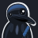
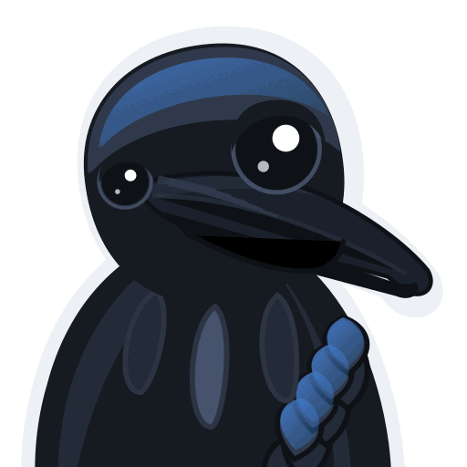{ width="256" }
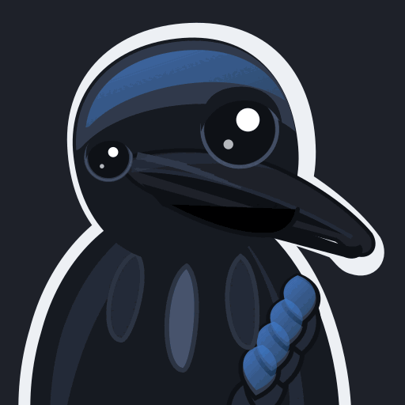{ width="256" }

---

## Profile — the bird looking at something

Side on, one eye, the folded wing at full detail. Use it when the subject of the page is the thing
the bird is looking at, not the bird.

### Base — standing

The default bird. Home page, beside the title.

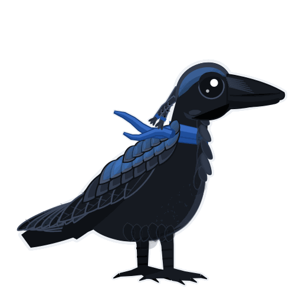{ width="256" }
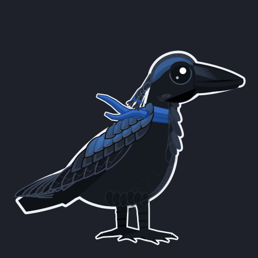{ width="256" }

### Check — through a magnifier

Verifying before moving on: the Check field, and chapters that end in a measurement. Held by the
handle, wingtip curled round the grip, lens out past the bill.

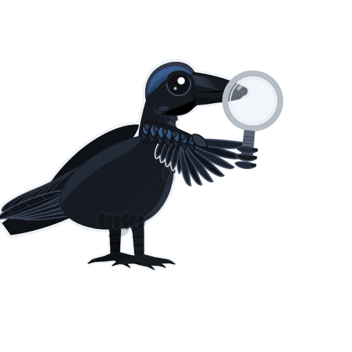{ width="256" }
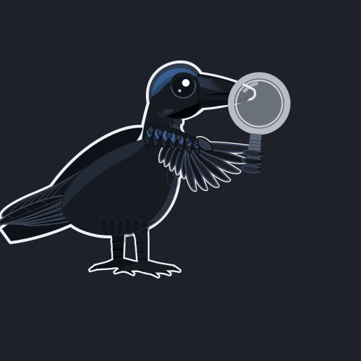{ width="256" }

### Gather — a tray of screws

Staging the parts for a run of steps: the generated **Gather for this segment** block.

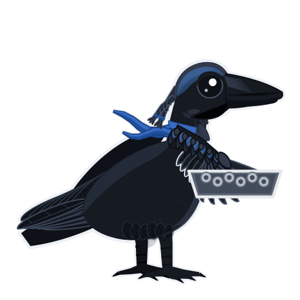{ width="256" }
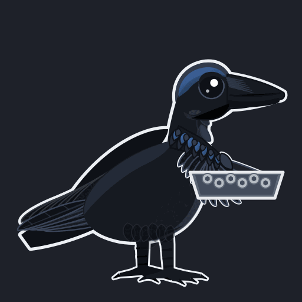{ width="256" }

### Pause — asleep on a spool

Nightcap with a tassel and pom-pom hanging down the back, clear of the bill. Asleep there is no
updraft, so the scarf tails droop instead of streaming. Stopping for the night: `Pause:` boxes, the
Tonight planner, and plates that run overnight.

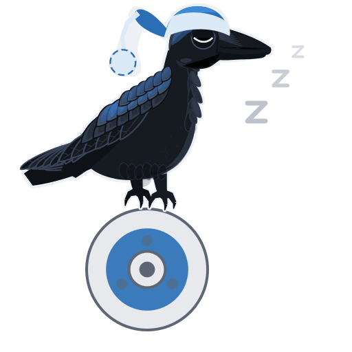{ width="256" }
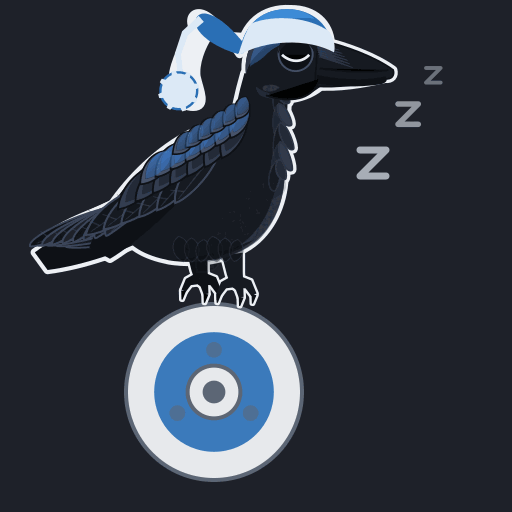{ width="256" }

### Print — watching a first layer

Perched on the Core One, watching it go down: print-batch overviews and slicer setup.

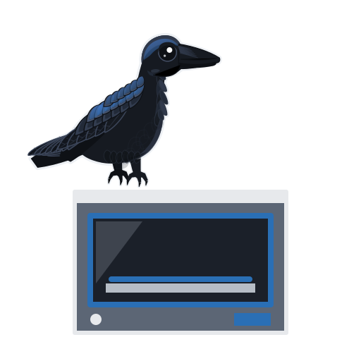{ width="256" }
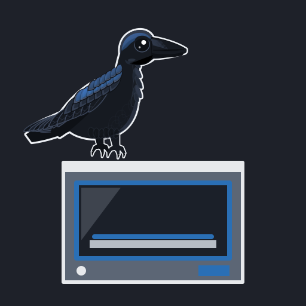{ width="256" }

### Screen — watching a console

Firmware and software steps: Ch 12 flashing, Ch 13 first startup. The bar fills as you watch.

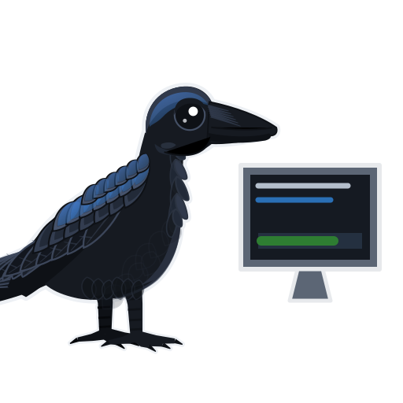{ width="256" }
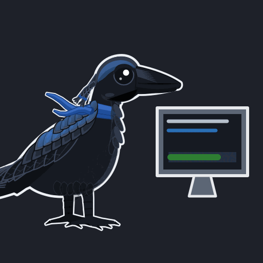{ width="256" }

---

## Three-quarter — the bird doing something, turned to you

Body angled toward the reader, head turned further so both eyes read. This is the working view: the
bird is a character with a job, and it is including you in it.

### Base, three-quarter

The default bird, turned. Anywhere the page is about the two of you rather than the machine.

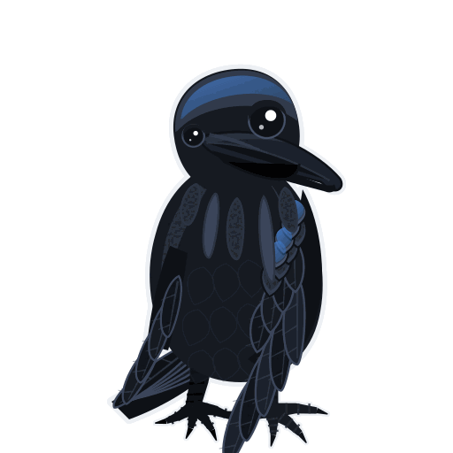{ width="256" }
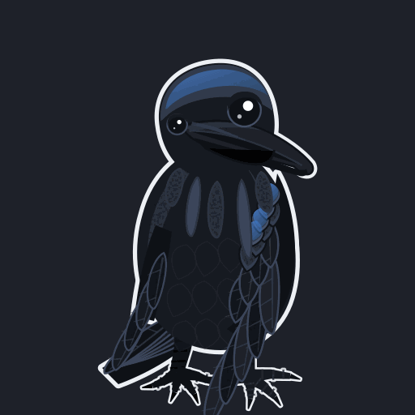{ width="256" }

### Pass — cheering with a caliper

A gate clears. The green tick is the only green in the set.

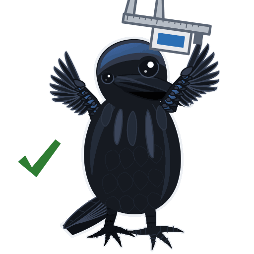{ width="256" }
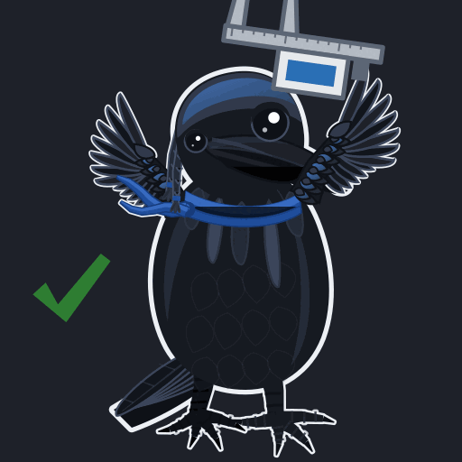{ width="256" }

### Fail — a shrug and a reprint spool

A gate does not clear. Both wings low with the tips drooping and the head tilted down — rueful,
never mocking: print it again, nobody died.

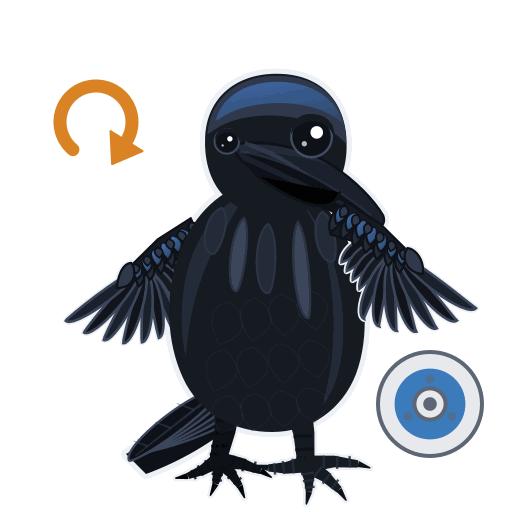{ width="256" }
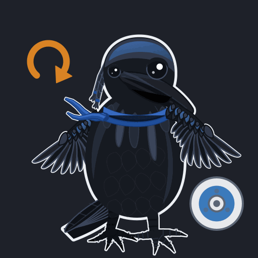{ width="256" }

### Tip — an idea

A shortcut worth knowing: `Tip:` boxes, at most one per chapter.

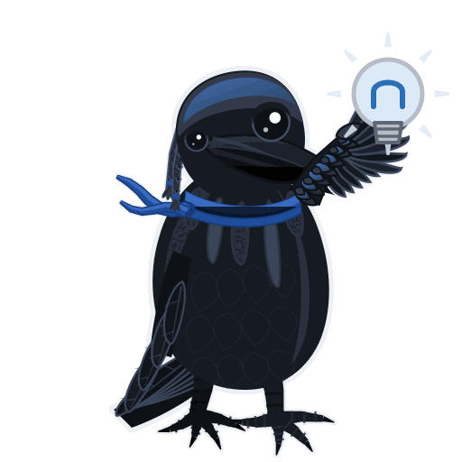{ width="256" }
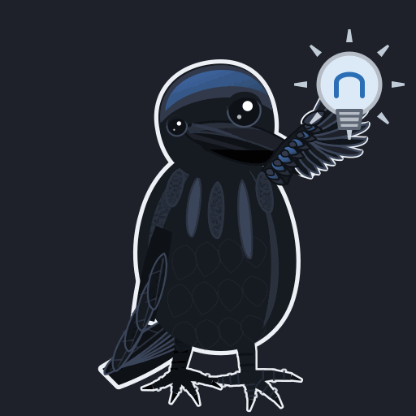{ width="256" }

### Helper — the raven and the fledgling

Steps that want two pairs of hands: the **Helper** field and the "With a helper" section. The
fledgling is its own build — bigger head, stubby bill still gaping, short tail, stubby legs, and no
scarf or braids: it is not the champion.

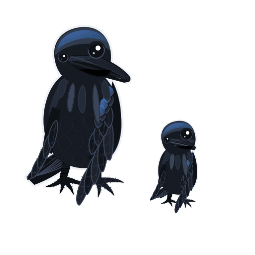{ width="256" }
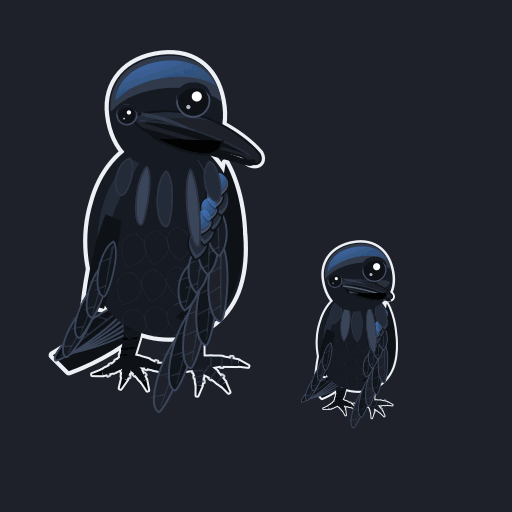{ width="256" }

### Hex key — turning a fastener

Frame, extrusion and fastener steps: Ch 01 squaring, and any step whose verb is *tighten*.

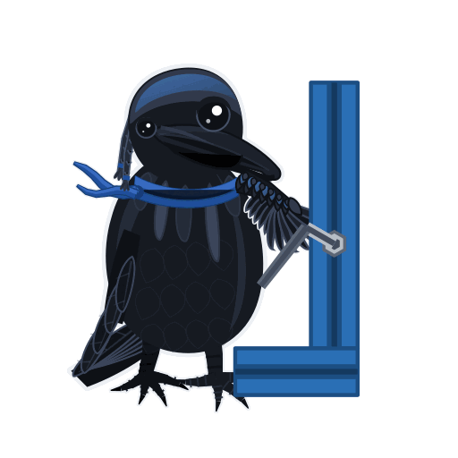{ width="256" }
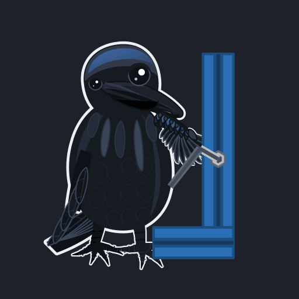{ width="256" }

### Caliper — reading a measurement

Measurement steps, with the display turned toward you: test cubes, belt spacing, gate numbers.

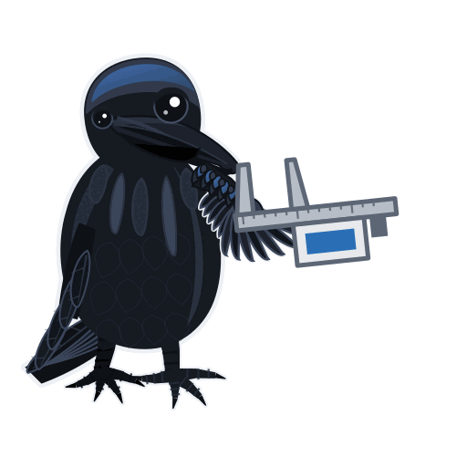{ width="256" }
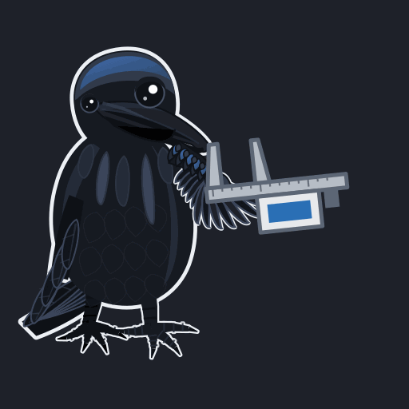{ width="256" }

### Point — look here

"Look at this one": Do lines that single out a part, and diagrams that need a callout.

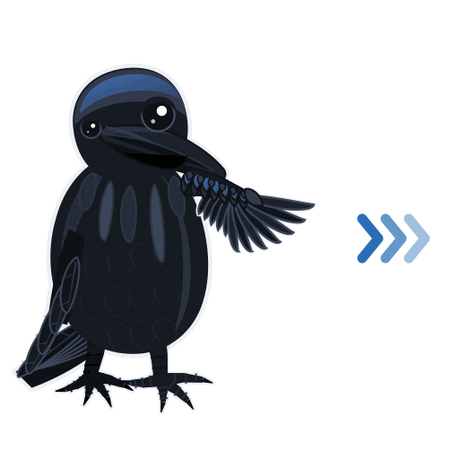{ width="256" }
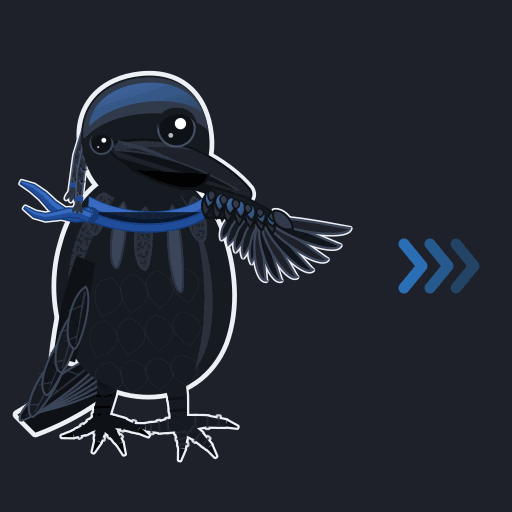{ width="256" }

### Carry — a labelled bin

Sorting and kit-day steps: the bin-label page, and the per-chapter sorting diagrams. Both wings
come down to their own corner of the bin, the far one round the outside.

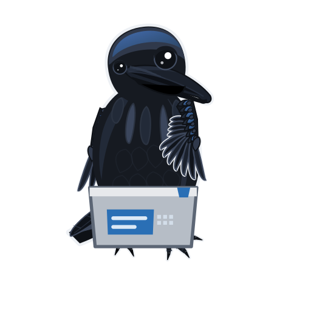{ width="256" }
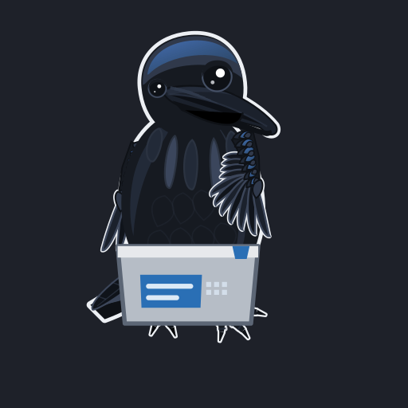{ width="256" }

### Cable — plugging in

Ch 10 wiring. A small keyed plug held out toward an off-frame socket, its lead running down to a
loose coil by the feet. Low voltage only: never mains, never a stripped conductor.

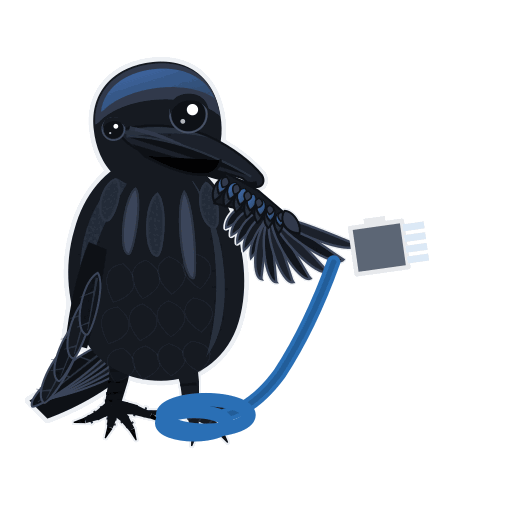{ width="256" }
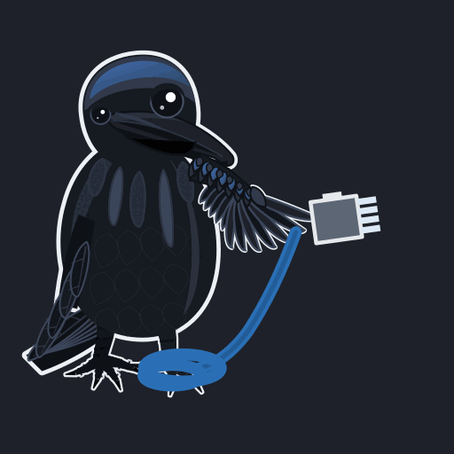{ width="256" }

---

## Front — the bird addressing you

Chest and both shoulders square to the reader, bill pointing at you — with about ten degrees of
turn in it, so it reads as a bird looking at you rather than a symmetrical blob. Head-on the scarf
tails cannot stream behind, so they hang from the knot beside the bill. Reserved: a front view is
the bird speaking to you, so it is used where the page is telling you something directly.

### Base, front

Standing, facing you, with the slightest turn. Carries the `.wave` one-shot greeting.

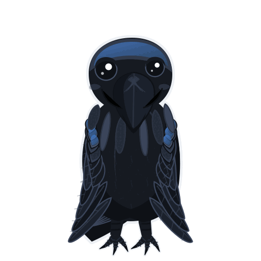{ width="256" }
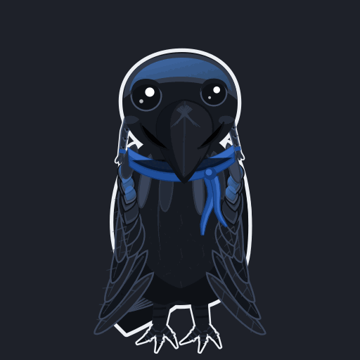{ width="256" }

### Warn — hard hat, wings spread

Safety only: mains, hot end, blade, magnets. A warning addresses the reader, so it is the front
view. No joke, no smile, and not on every warning box.

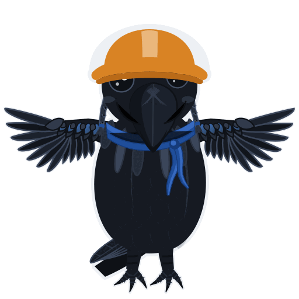{ width="256" }
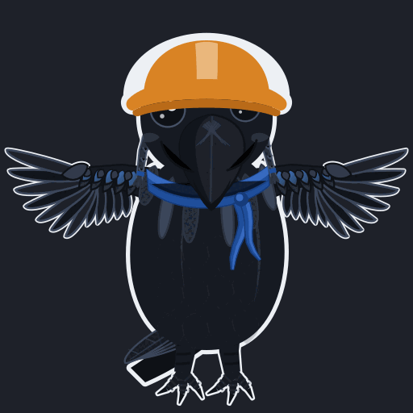{ width="256" }

### Kit day — out of the carton

The day a box lands: the kit-day steps on Home, and Ch 00 unpacking.

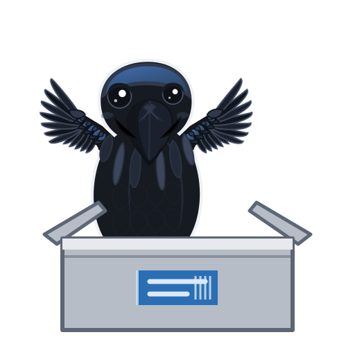{ width="256" }
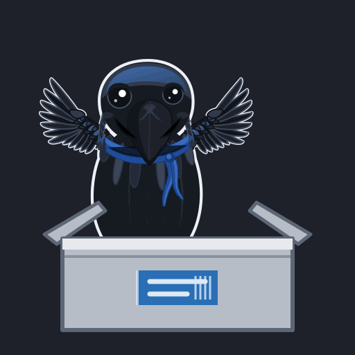{ width="256" }

---

## Moving, on this page

The images above are PNG snapshots so both backgrounds can sit side by side. The SVGs themselves
animate, and they animate through a plain Markdown image line — no script, no `<object>`:

{ width="256" }
{ width="256" }
{ width="256" }

Breathe and blink everywhere; a slow head turn in profile and three-quarter, a slow sway in front
view; then one motion per pose — sleep marks drifting, the bulb flickering, the magnifier bobbing,
the fledgling hopping, the first layer growing, the hex key turning, the chevrons nudging. Turn on
"reduce motion" in the OS and all of it stops, with every file still complete.

## Intended use

Every pose has exactly **two wings** — a side is either folded or spread, never both, and the
generator fails the build if that stops being true.

Reference the **SVG** in a page, not the preview PNG — the previews exist only for this review. Size
with `width`; use `mascot-badge.svg` below 160 px and nothing else. One mascot per page. There is
deliberately **no pose for mains, soldering iron, blade or hot chamber**: those steps get no mascot,
not even the Check / Tip / Pause / Gather badges. The steps are listed in `NO_MASCOT_STEPS` in
`hooks/mascot.py`, which strips the badges there at build time.

## The name: Revali

Chosen 2026-09-23 by the builder's daughter, after **Revali**, the Rito Champion in *The Legend of
Zelda: Breath of the Wild*: a proud, blue-feathered archer who makes his own updraft. The name is a fan
homage, with no connection to Nintendo. The bird stays an original raven drawn in the house style.

The shortlist it beat: **Nevermore** (Poe's raven, but the manual already uses the word for the
filter), **Hex** (one syllable, hardware) and **Galaxy** (after the Galaxy Black ASA).

## If a pose is wrong

Say which and why — the set is generated from three view constructions by `scripts/gen_mascot.py`,
so a proportion fixed once is fixed across every pose in that view. Poses are cheap to add; meanings
are not. Adding a pose means adding a row to the placement map in
[STYLE.md](manual/assets/mascot/STYLE.md), otherwise it will never get used.
