# Plate plans

_Generated by `scripts/build_printables.py` — do not hand-edit._

All **22 plates**, **157.1 h**, **1813 g Galaxy Black + 279 g Prusa Orange**, in print order (batches: B00 → B02 → B07 → B08 → B09 → B10 → B01 → B03 → B04 → B05 → B06). Every diagram is drawn from the committed PrusaSlicer project `slicer/plates/<id>.3mf` (`python3 slicer/build_plates.py --from-3mf`).

## Batch B00 — [Calibration & jigs](../manual/print/B00-calibration-and-jigs.md)

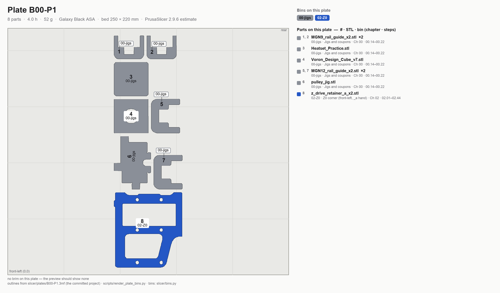

**B00-P1** · black · 8 parts · 4.0 h · 52 g · bins: 00-jigs, 02-Z0 · [Load step](../manual/print/B00-calibration-and-jigs.md#step-b002-load-plate-b00-p1)

## Batch B02 — [Accent parts (orange), "the orange day"](../manual/print/B02-accent-parts-orange.md)

**B02-P1** · orange · 7 parts · 7.0 h · 90 g · bins: 02-Z0, 02-Z1, 02-Z2, 02-Z3, 07-X, 08-SB, 11-skirts · [Load step](../manual/print/B02-accent-parts-orange.md#step-b022-load-plate-b02-p1)

**B02-P2** · orange · 13 parts · 7.3 h · 93 g · bins: 04-A, 04-B, 11-fans, 11-door · [Load step](../manual/print/B02-accent-parts-orange.md#step-b024-load-plate-b02-p2)

**B02-P3** · orange · 29 parts · 7.6 h · 96 g · bins: 02-Z0, 02-Z1, 02-Z2, 02-Z3, 05-XY, 06-Z-joints, 08-CW2, 10-chains, 11-skirts, spare-alt · [Load step](../manual/print/B02-accent-parts-orange.md#step-b026-load-plate-b02-p3)

## Batch B07 — [Electronics bay + lighting](../manual/print/B07-electronics-bay-and-lighting.md)

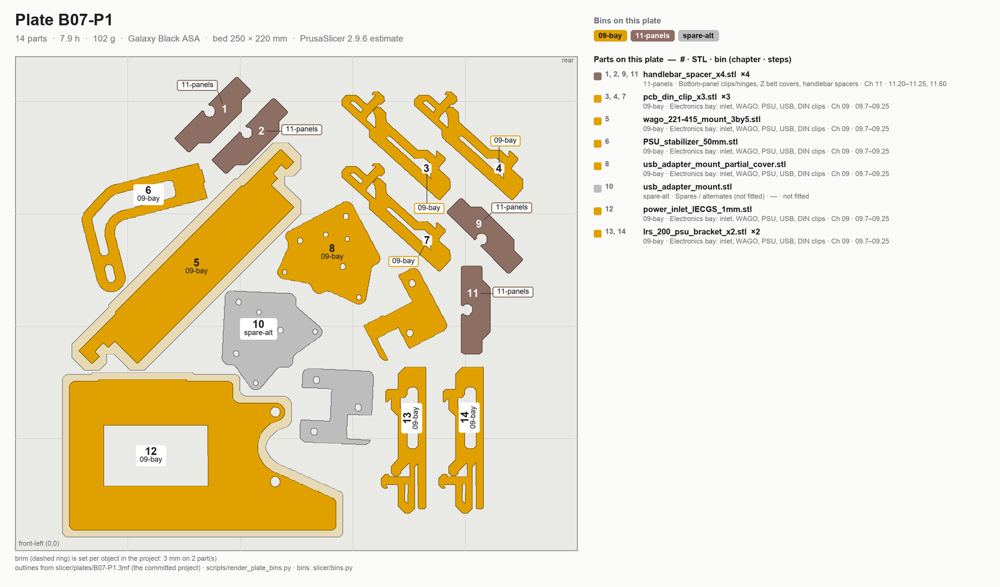

**B07-P1** · black · 14 parts · 7.9 h · 102 g · bins: 09-bay, 11-panels, spare-alt · [Load step](../manual/print/B07-electronics-bay-and-lighting.md#step-b072-load-plate-b07-p1)

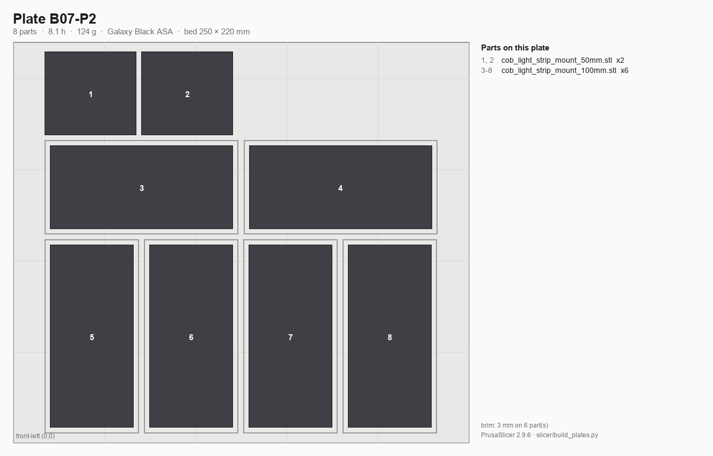

**B07-P2** · black · 8 parts · 8.1 h · 124 g · bins: 10-lights · [Load step](../manual/print/B07-electronics-bay-and-lighting.md#step-b074-load-plate-b07-p2)

## Batch B08 — [Skirts and front modules](../manual/print/B08-skirts-and-front-modules.md)

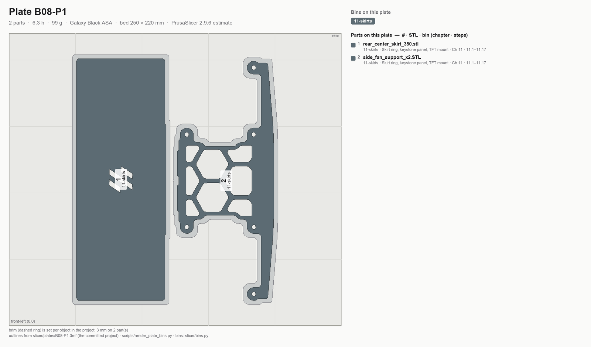

**B08-P1** · black · 2 parts · 6.3 h · 99 g · bins: 11-skirts · [Load step](../manual/print/B08-skirts-and-front-modules.md#step-b082-load-plate-b08-p1)

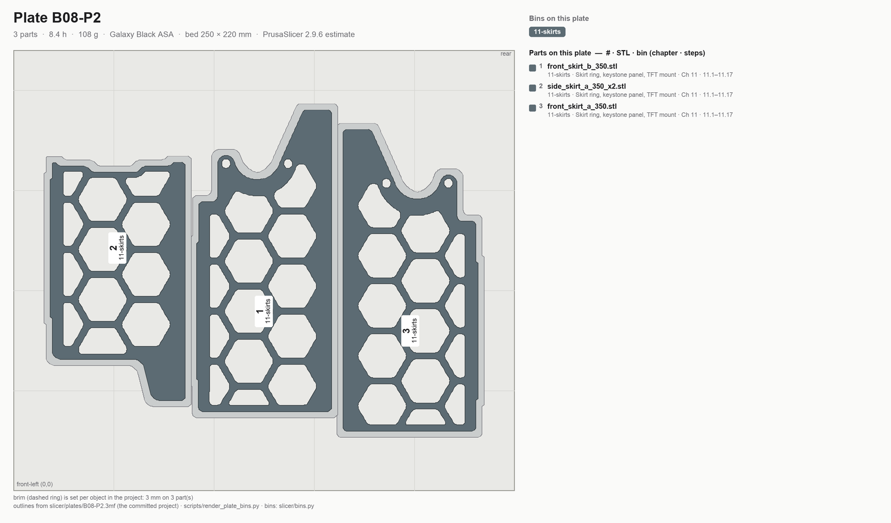

**B08-P2** · black · 3 parts · 8.4 h · 108 g · bins: 11-skirts · [Load step](../manual/print/B08-skirts-and-front-modules.md#step-b084-load-plate-b08-p2)

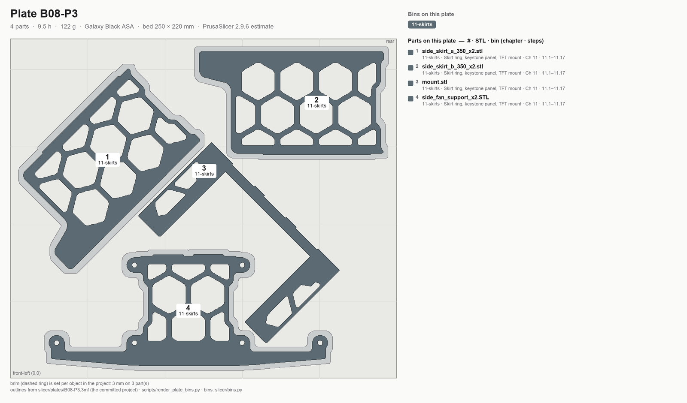

**B08-P3** · black · 4 parts · 9.5 h · 122 g · bins: 11-skirts · [Load step](../manual/print/B08-skirts-and-front-modules.md#step-b086-load-plate-b08-p3)

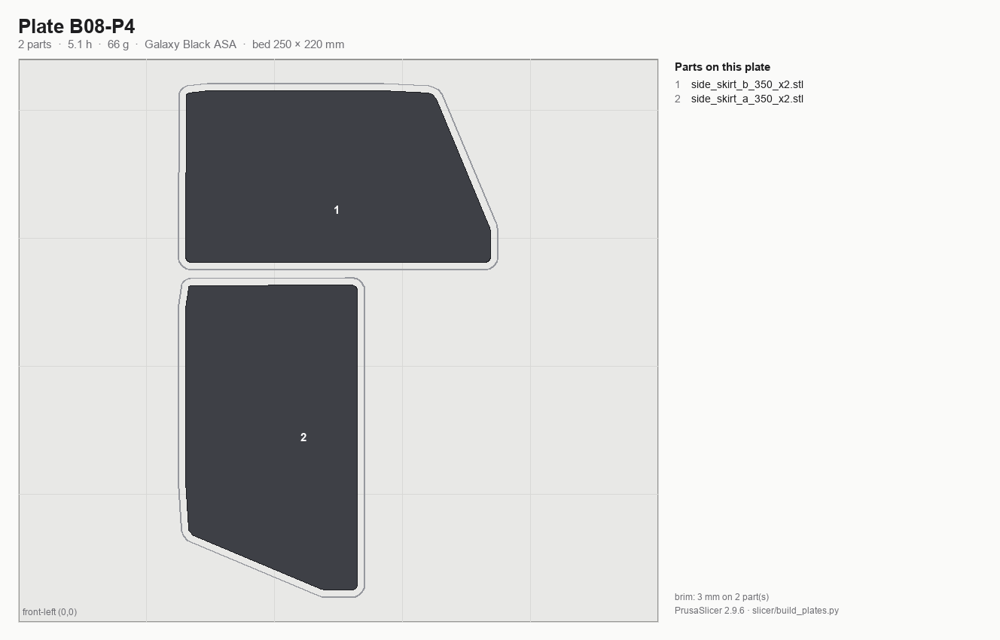

**B08-P4** · black · 2 parts · 5.0 h · 70 g · bins: 11-skirts · [Load step](../manual/print/B08-skirts-and-front-modules.md#step-b088-load-plate-b08-p4)

## Batch B09 — [Panels, filtration, spool](../manual/print/B09-panels-filtration-spool.md)

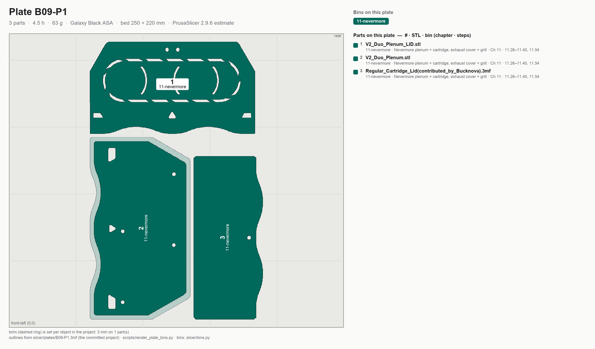

**B09-P1** · black · 3 parts · 4.5 h · 63 g · bins: 11-nevermore · [Load step](../manual/print/B09-panels-filtration-spool.md#step-b092-load-plate-b09-p1)

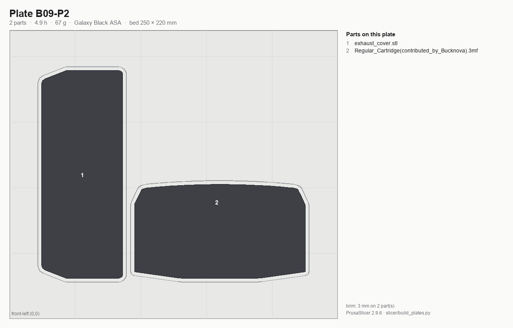

**B09-P2** · black · 2 parts · 4.9 h · 67 g · bins: 11-nevermore · [Load step](../manual/print/B09-panels-filtration-spool.md#step-b094-load-plate-b09-p2)

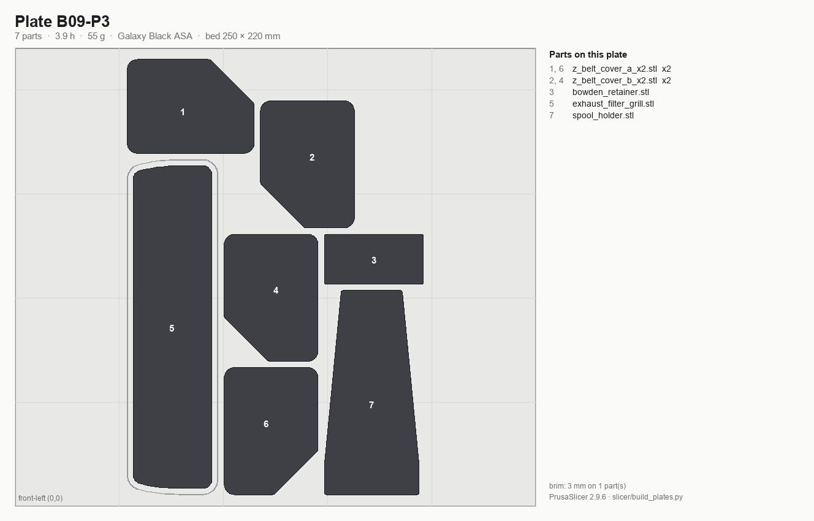

**B09-P3** · black · 7 parts · 3.9 h · 55 g · bins: 11-panels, 11-nevermore, 11-spool · [Load step](../manual/print/B09-panels-filtration-spool.md#step-b096-load-plate-b09-p3)

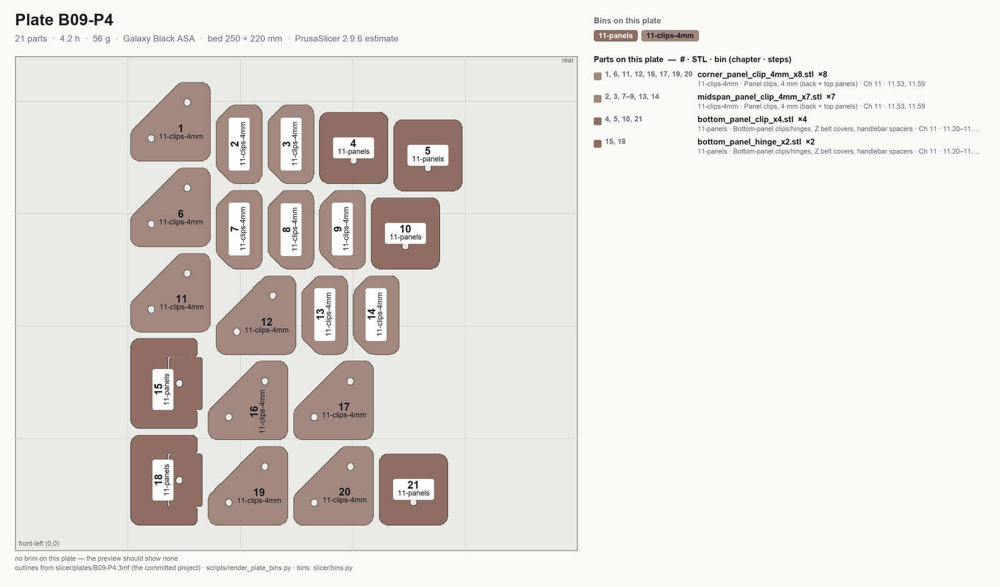

**B09-P4** · black · 21 parts · 4.2 h · 56 g · bins: 11-panels, 11-clips-4mm · [Load step](../manual/print/B09-panels-filtration-spool.md#step-b098-load-plate-b09-p4)

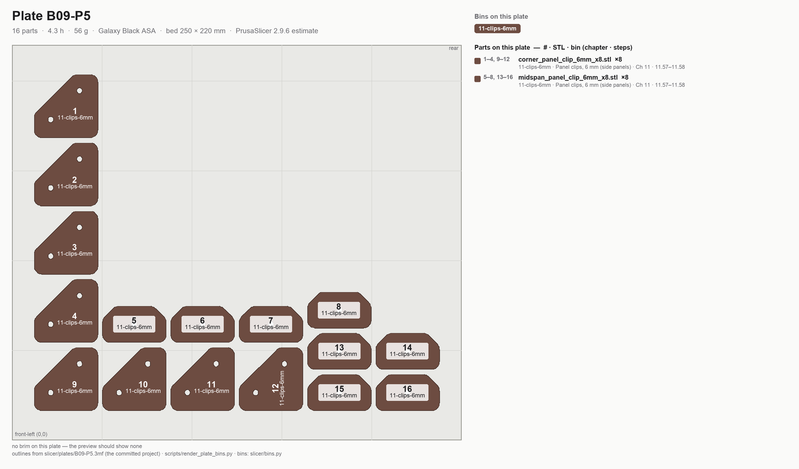

**B09-P5** · black · 16 parts · 4.3 h · 56 g · bins: 11-clips-6mm · [Load step](../manual/print/B09-panels-filtration-spool.md#step-b0910-load-plate-b09-p5)

## Batch B10 — [Clicky-Clack door](../manual/print/B10-clicky-clack-door.md)

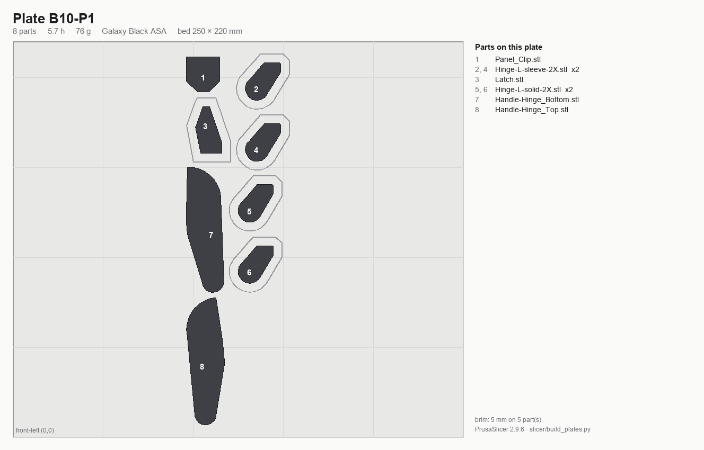

**B10-P1** · black · 8 parts · 5.7 h · 76 g · bins: 11-door · [Load step](../manual/print/B10-clicky-clack-door.md#step-b102-load-plate-b10-p1)

## Batch B01 — [Z drive assemblies](../manual/print/B01-z-drive-assemblies.md)

**B01-P1** · black · 7 parts · 15.2 h · 201 g · bins: 02-Z0, 02-Z1, 02-Z2, 02-Z3 · [Load step](../manual/print/B01-z-drive-assemblies.md#step-b012-load-plate-b01-p1)

**B01-P2** · black · 16 parts · 7.6 h · 100 g · bins: 02-Z0, 02-Z1, 02-Z2, 02-Z3, 02-deck · [Load step](../manual/print/B01-z-drive-assemblies.md#step-b015-load-plate-b01-p2)

## Batch B03 — [A/B drive units + front idlers](../manual/print/B03-ab-drive-units-and-front-idlers.md)

**B03-P1** · black · 8 parts · 8.5 h · 119 g · bins: 04-A, 04-B · [Load step](../manual/print/B03-ab-drive-units-and-front-idlers.md#step-b032-load-plate-b03-p1-both-sides)

## Batch B04 — [XY joints + X carriage](../manual/print/B04-xy-joints-and-x-carriage.md)

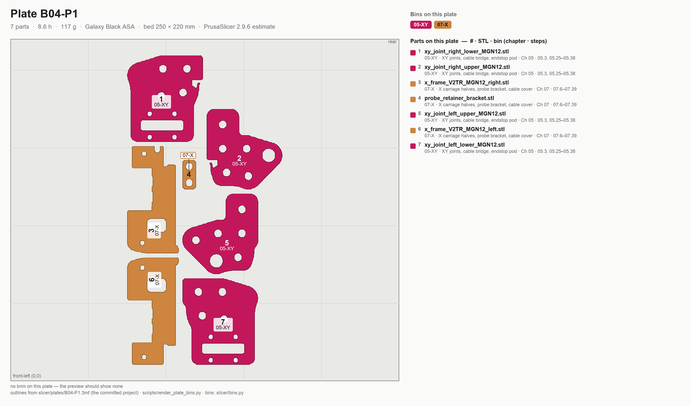

**B04-P1** · black · 7 parts · 8.6 h · 117 g · bins: 05-XY, 07-X · [Load step](../manual/print/B04-xy-joints-and-x-carriage.md#step-b042-load-plate-b04-p1)

## Batch B05 — [Z joints + Z chain](../manual/print/B05-z-joints-and-z-chain.md)

**B05-P1** · black · 14 parts · 6.4 h · 78 g · bins: 06-Z-joints, 10-chains · [Load step](../manual/print/B05-z-joints-and-z-chain.md#step-b052-load-plate-b05-p1)

## Batch B06 — [Toolhead: Stealthburner, Clockwork 2, Klicky](../manual/print/B06-toolhead-sb-cw2-klicky.md)

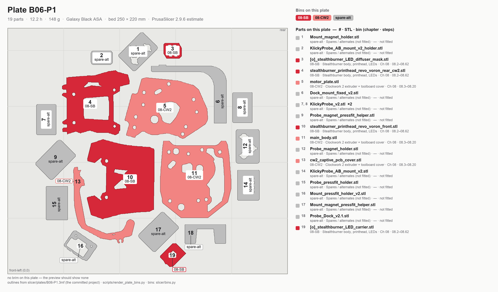

**B06-P1** · black · 19 parts · 12.2 h · 148 g · bins: 08-SB, 08-CW2, spare-alt · [Load step](../manual/print/B06-toolhead-sb-cw2-klicky.md#step-b062-load-plate-b06-p1)

